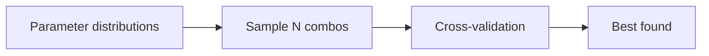

## Why randomized search

Randomized search samples a fixed number of combinations from distributions.

It’s often more efficient than grid search because:

- not all hyperparameters matter equally
- you can explore wide ranges quickly

## The idea



## Scikit-learn example

```python title="RandomizedSearchCV" showLineNumbers{1}
from sklearn.model_selection import RandomizedSearchCV
from sklearn.ensemble import RandomForestClassifier

params = {
    "n_estimators": [200, 400, 800],
    "max_depth": [None, 5, 10, 20],
    "min_samples_leaf": [1, 2, 4, 8],
}

search = RandomizedSearchCV(
    estimator=RandomForestClassifier(random_state=42),
    param_distributions=params,
    n_iter=20,
    cv=5,
    scoring="accuracy",
    n_jobs=-1,
    random_state=42,
)

search.fit(X, y)
print("best params:", search.best_params_)
print("best score:", search.best_score_)
```

## When to use which

- GridSearchCV: small search space
- RandomizedSearchCV: large/continuous search space

## Mini-checkpoint

If you’re tuning learning rate in [1e-4, 1], randomized search is usually better.
