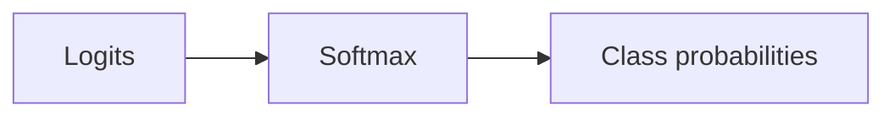

## Why activations are needed

Without activations, layers collapse into a single linear transformation.

Activations add non-linearity so networks can learn complex functions.

## ReLU

`ReLU(x) = max(0, x)`

Common choice for hidden layers.

Pros:

- simple
- helps with vanishing gradient (compared to sigmoid)

## Sigmoid

Maps to (0, 1):

Used for:

- binary classification output

## Softmax

Turns raw scores (logits) into a probability distribution over classes.

Used for:

- multiclass classification output

## Typical choices

- hidden layers: ReLU
- binary output: sigmoid
- multiclass output: softmax

## Mini-checkpoint

If your model is predicting 10 classes, what activation is typical in the last layer?

(Softmax.)
