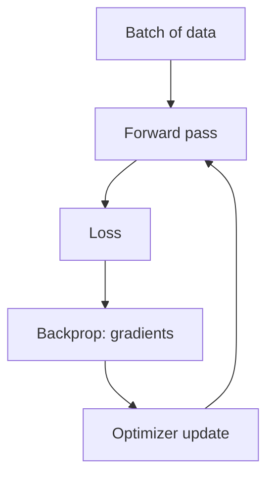

## The training loop

Neural networks learn by minimizing a loss function.

Loop:

1. forward pass → compute predictions
2. compute loss
3. backpropagation → compute gradients
4. optimizer step → update weights

## Backpropagation (intuition)

Backprop applies the chain rule to compute:

- how much each weight contributed to the loss

Then adjust weights to reduce the loss.

## SGD (Stochastic Gradient Descent)

Update weights using the gradient.

Pros:

- simple and reliable

Cons:

- can be slow
- sensitive to learning rate

## Adam

Adam adapts learning rates per parameter (uses momentum-like estimates).

Pros:

- usually faster convergence
- strong default choice

## Mini-checkpoint

If training loss oscillates wildly:

- try lowering learning rate.
