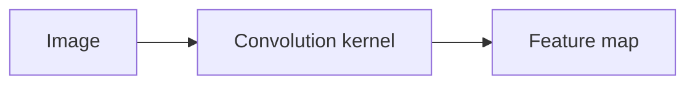

## Why CNNs exist

Images have structure:

- nearby pixels are related
- patterns repeat across the image

CNNs exploit this using **convolutions**.

## Convolution intuition

A small filter (kernel) slides across the image to detect patterns.

## Key parts

- **Convolution layers**: learn filters
- **Pooling**: reduce spatial size, keep important features
- **Fully connected layers**: final classification/regression

## Why they work well

- parameter sharing (same filter used across image)
- translation invariance (patterns recognized in different locations)

## Mini-checkpoint

Why not use a plain MLP for images?

- too many parameters and ignores spatial structure.
