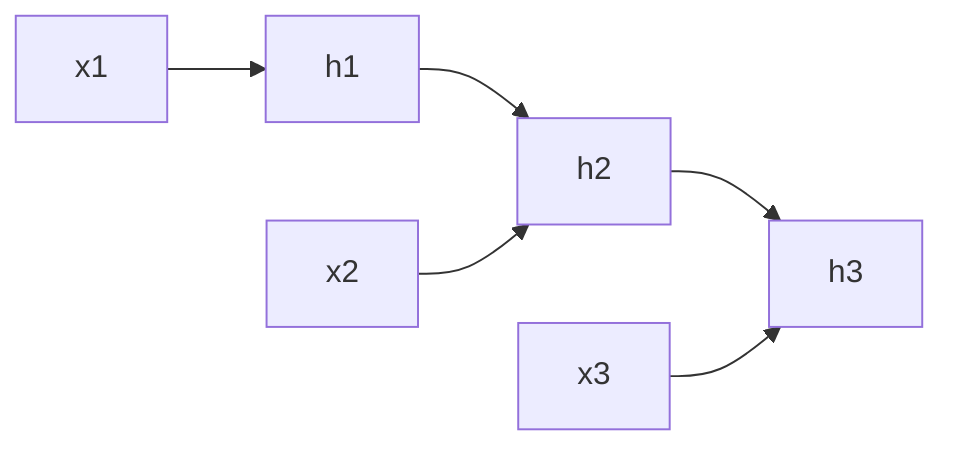

## Why RNNs exist

Many problems are sequential:

- text
- time series
- audio

An RNN processes inputs one step at a time and carries a hidden state.

## What the hidden state means

Hidden state = memory of previous inputs.

## Limitations

Classic RNNs struggle with long-range dependencies.

Improved variants:

- LSTM
- GRU

And modern NLP often uses Transformers.

## Mini-checkpoint

What kind of data is best suited for RNN-like architectures?

- sequences where order matters.
