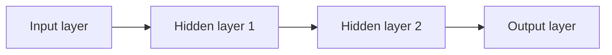

## What an MLP is

An MLP is a feed-forward neural network with:

- an input layer
- one or more hidden layers
- an output layer



## Why hidden layers matter

Hidden layers + non-linear activations allow the model to learn:

- curves
- interactions
- complex decision boundaries

## Typical uses

MLP works best on:

- tabular data (sometimes)
- small image/text tasks (but CNNs/Transformers are usually better)

## A tiny Keras example (conceptual)

```python title="MLP in Keras (conceptual)" showLineNumbers{1}
# Note: This requires TensorFlow/Keras installed.
from tensorflow import keras
from tensorflow.keras import layers

model = keras.Sequential([
    layers.Dense(64, activation="relu"),
    layers.Dense(64, activation="relu"),
    layers.Dense(1, activation="sigmoid"),
])
```

## Mini-checkpoint

If you remove non-linear activations from all hidden layers, what happens?

- The whole network behaves like a linear model.
