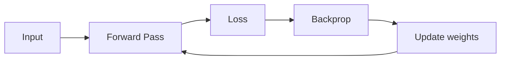

## What deep learning is

Deep learning is a family of ML methods based on **neural networks** (NNs) with many layers.

It’s especially strong for:

- images (CNNs)
- text (Transformers)
- audio
- complex patterns in high-dimensional data

## Phase 8 topics

1. Introduction to Neural Networks (The Perceptron)
2. Multi-Layer Perceptron (MLP)
3. Activation Functions (ReLU, Sigmoid, Softmax)
4. Backpropagation and Optimizers (Adam, SGD)
5. Intro to CNN for Images
6. Intro to RNN for Sequences
7. Transfer Learning: Using Pre-trained Models

## Learning strategy

Don’t try to memorize all math at once.

Focus on:

- data flow (forward pass)
- learning signal (loss)
- parameter updates (optimizer)

