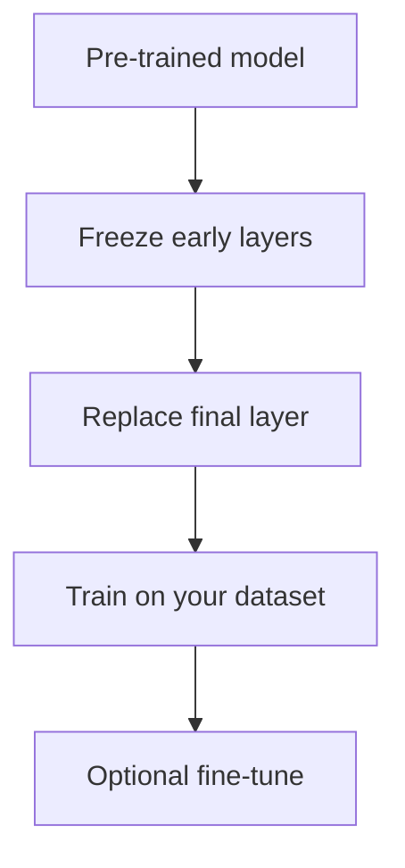

## What transfer learning is

Transfer learning means:

- start from a model pre-trained on a large dataset
- fine-tune it (or use it as a feature extractor) for your task

This is common in:

- computer vision
- NLP

## Why it works

Pre-trained models learn general features:

- edges → textures → shapes (vision)
- syntax/semantics patterns (language)

## Common workflow

## When to use it

Use transfer learning when:

- you have limited labeled data
- your domain is similar to the pretraining domain

## Mini-checkpoint

What’s the advantage of freezing layers initially?

- prevents destroying learned features and reduces training cost.
