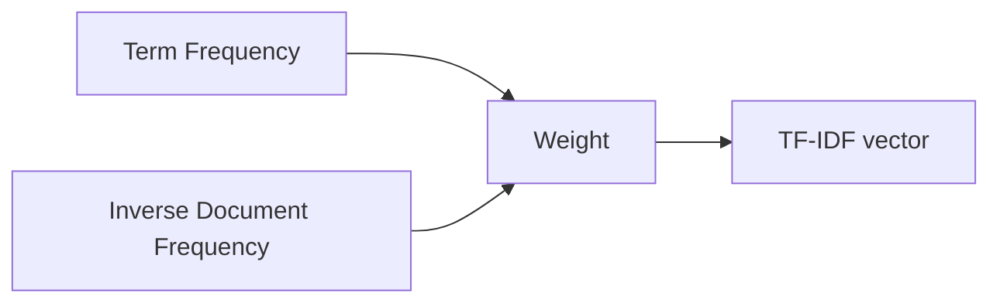

## Bag of Words (BoW)

BoW represents a document by:

- counting how many times each word appears

Key idea:

- word order is ignored


Pros:

- simple and fast
- strong baseline

Cons:

- ignores word order and context
- common words dominate

## TF-IDF

TF-IDF reduces the impact of very common words by weighting them lower.

Intuition:

- words common in **this doc** but rare across **all docs** are informative



## Scikit-learn examples

```python title="BoW with CountVectorizer" showLineNumbers{1}
from sklearn.feature_extraction.text import CountVectorizer

vec = CountVectorizer()
X = vec.fit_transform(["i love python", "python is great"])
```

```python title="TF-IDF with TfidfVectorizer" showLineNumbers{1}
from sklearn.feature_extraction.text import TfidfVectorizer

vec = TfidfVectorizer()
X = vec.fit_transform(["i love python", "python is great"])
```

## Mini-checkpoint

Why is TF-IDF often better than raw counts?

- it downweights words that aren’t discriminative across the corpus.
