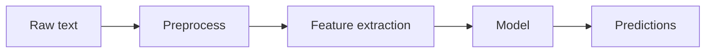

## What NLP is

**Natural Language Processing** is the area of ML focused on human language (text).

In ML terms, NLP is mostly about:

- converting text into numeric features
- choosing models that work well on those features

## Phase 9 topics

1. Text Preprocessing (Tokenization, Stemming, Lemmatization)
2. Bag of Words (BoW) & TF-IDF
3. Word Embeddings (Word2Vec, GloVe)
4. Sentiment Analysis Tutorial
5. Named Entity Recognition (NER)

## A typical NLP pipeline

## Important note

Many modern NLP systems use Transformers (deep learning). But the classical pipeline still matters:

- it’s fast
- it’s interpretable
- it’s a solid baseline
