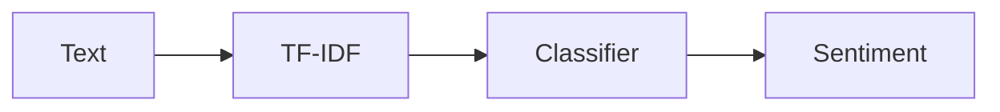

## Goal

Classify text as positive/negative sentiment.

This is a perfect first NLP project because:

- preprocessing matters
- classic models work well

## A baseline approach

TF-IDF features + Logistic Regression.



## Example code (template)

```python title="Sentiment model (TF-IDF + LogisticRegression)" showLineNumbers{1}
from sklearn.model_selection import train_test_split
from sklearn.pipeline import Pipeline
from sklearn.feature_extraction.text import TfidfVectorizer
from sklearn.linear_model import LogisticRegression
from sklearn.metrics import classification_report

texts = [
    "I love this product",
    "This is terrible",
    "Amazing quality",
    "Worst purchase ever",
]
labels = [1, 0, 1, 0]

X_train, X_test, y_train, y_test = train_test_split(
    texts, labels, test_size=0.25, random_state=42, stratify=labels
)

model = Pipeline(
    steps=[
        ("tfidf", TfidfVectorizer(ngram_range=(1, 2))),
        ("clf", LogisticRegression(max_iter=1000)),
    ]
)

model.fit(X_train, y_train)

y_pred = model.predict(X_test)
print(classification_report(y_test, y_pred))
```

## Practical tips

- include bigrams (`ngram_range=(1,2)`) to capture phrases like "not good"
- avoid removing negations like "not"
- check class balance

## Mini-checkpoint

Why is "not good" tricky for BoW?

- without bigrams, "not" and "good" may cancel signals incorrectly.
