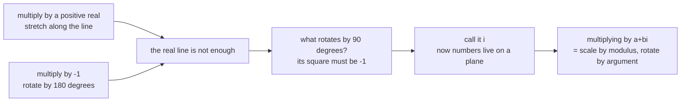

Complex numbers appear in this module for exactly one reason, and it is worth stating up front so you
know how much of this page you need.

**A matrix full of real numbers can have eigenvalues that are not real.** A rotation is the standard
example: it turns every vector, so there is no direction it merely stretches, so there is no real
eigenvector — and yet the characteristic polynomial still has roots, because polynomials always do
once you allow complex numbers. §4.2 hits this on its second example, and a reader who has never seen
$i$ stalls there.

That is the whole motivation. This page covers what you need for it and stops.

## What you'll learn

- What $i$ is, and why it was invented.
- The complex plane, and why multiplication by a complex number is a rotation-and-scale.
- Modulus and argument, and Euler's formula tying them to $\cos$ and $\sin$.
- Conjugates, and why complex eigenvalues of a real matrix always come in pairs.
- The precise reason a rotation matrix has no real eigenvalues.

## Intuition: a number that turns things

Real numbers live on a line. Multiplying by a positive real **stretches** along that line;
multiplying by $-1$ **flips** it — a rotation by $180°$.

So ask: what would rotate by $90°$? Doing it twice must give the $180°$ flip, so it must be a number
whose square is $-1$. No real number qualifies, so we name one:

$$
i^2 = -1
$$

Read $i$ as **"the quarter turn"** rather than "the square root of minus one". That reading makes
everything below obvious instead of mysterious, and it is exactly the reading that connects complex
numbers to rotation matrices.



## The math

### The plane

A complex number is a pair of reals wearing one symbol:

$$
z = a + bi, \qquad a = \operatorname{Re}(z),\quad b = \operatorname{Im}(z)
$$

Plot $a$ horizontally and $b$ vertically and you have the **complex plane**. A complex number *is* a
point in $\mathbb{R}^2$ — with one extra piece of structure real pairs do not have: a way to multiply
two of them together and get a third.

### Arithmetic

Addition is componentwise, exactly like vectors:

$$
(a + bi) + (c + di) = (a + c) + (b + d)i
$$

Multiplication is where the structure is. Expand and use $i^2 = -1$:

$$
(a + bi)(c + di) = ac + adi + bci + bdi^2 = (ac - bd) + (ad + bc)i
$$

The minus sign in $ac - bd$ is the entire content of $i^2 = -1$, and it is the reason multiplication
rotates.

### Modulus and argument

$$
\lvert z\rvert = \sqrt{a^2 + b^2}, \qquad \arg(z) = \operatorname{atan2}(b, a)
$$

The **modulus** is the distance from the origin — the Euclidean norm of the pair, which is why §3.1's
norms carry over unchanged. The **argument** is the angle from the positive real axis.

In these terms, multiplication is simple:

$$
\lvert z_1 z_2\rvert = \lvert z_1\rvert\,\lvert z_2\rvert,
\qquad
\arg(z_1 z_2) = \arg(z_1) + \arg(z_2)
$$

**Moduli multiply, arguments add.** Multiplying by $z$ scales by $\lvert z\rvert$ and rotates by
$\arg(z)$. Check it on $i$: modulus $1$, argument $90°$. So multiplying by $i$ rotates by a quarter
turn and changes no length — which is what we asked for at the start.

### Euler's formula

$$
e^{i\theta} = \cos\theta + i\sin\theta
$$

So any complex number factors into "how big" times "which way":

$$
z = \lvert z\rvert\, e^{i\arg(z)}
$$

Two consequences used later:

- $e^{i\theta}$ always has modulus $1$ — it is a point on the unit circle, and $\theta$ is the angle.
- Multiplying two of them adds the exponents, which is the "arguments add" rule again, now as ordinary index arithmetic.

Setting $\theta = \pi$ gives $e^{i\pi} = -1$: a half turn is multiplication by $-1$, as promised.

### Conjugates

$$
\bar{z} = a - bi
$$

Reflection across the real axis. Two properties do real work:

$$
z\bar{z} = a^2 + b^2 = \lvert z\rvert^2, \qquad \overline{z_1 z_2} = \bar{z_1}\,\bar{z_2}
$$

The first says a complex number times its conjugate is **real and non-negative** — which is how you
divide by a complex number, and the reason $\lvert z\rvert^2$ appears wherever a magnitude is needed.

The second gives the fact §4.2 depends on:

:::tip[Complex eigenvalues of a real matrix come in conjugate pairs]
If $\mathbf{A}$ is real and $\mathbf{A}\mathbf{v} = \lambda\mathbf{v}$, take the conjugate of the whole
equation. Conjugation leaves real entries alone and distributes over products, so

$$
\mathbf{A}\bar{\mathbf{v}} = \bar{\lambda}\,\bar{\mathbf{v}}
$$

meaning $\bar{\lambda}$ is an eigenvalue too, with eigenvector $\bar{\mathbf{v}}$. So complex
eigenvalues of a real matrix always arrive in pairs $\lambda, \bar{\lambda}$ — never alone.

Immediate corollary: a real matrix of **odd** size must have at least one real eigenvalue, because the
complex ones pair up and an odd count cannot be entirely made of pairs. A real $3\times 3$ rotation
therefore always has a genuine axis. That is not a coincidence about three dimensions; it is this
counting argument.
:::

### The one place you need this

The rotation matrix by angle $\theta$:

$$
\mathbf{R}(\theta) = \begin{bmatrix}\cos\theta & -\sin\theta \\ \sin\theta & \cos\theta\end{bmatrix}
$$

Its characteristic polynomial is

$$
\det(\mathbf{R} - \lambda\mathbf{I}) = (\cos\theta - \lambda)^2 + \sin^2\theta = \lambda^2 - 2\lambda\cos\theta + 1
$$

with discriminant

$$
4\cos^2\theta - 4 = -4\sin^2\theta \;\le\; 0
$$

**Negative** whenever $\sin\theta \neq 0$. So for any rotation that is not by $0°$ or $180°$ the
eigenvalues are complex:

$$
\lambda = \cos\theta \pm i\sin\theta = e^{\pm i\theta}
$$

Look at what that says. The eigenvalues of a rotation by $\theta$ are $e^{\pm i\theta}$: modulus $1$,
argument $\pm\theta$. The matrix rotates by $\theta$; its eigenvalues *are* the rotation by $\theta$,
written as complex numbers. Modulus $1$ says lengths are preserved, which is exactly §3.9's claim that
rotations are orthogonal transformations — recovered from the eigenvalues.

And "no real eigenvalue" now has a geometric meaning rather than an algebraic one: a rotation turns
**every** direction, so there is no direction it merely scales.

## Worked example by hand

Take $\theta = 90°$, so $\mathbf{R} = \begin{bmatrix}0 & -1\\ 1 & 0\end{bmatrix}$.

Characteristic polynomial: $\lambda^2 - 2\lambda\cos 90° + 1 = \lambda^2 + 1$. Roots $\lambda = \pm i$.

Check the eigenvector for $\lambda = i$. We need $(\mathbf{R} - i\mathbf{I})\mathbf{v} = \mathbf{0}$:

$$
\begin{bmatrix}-i & -1\\ 1 & -i\end{bmatrix}\begin{bmatrix}v_1\\ v_2\end{bmatrix} = \mathbf{0}
$$

The second row gives $v_1 = i v_2$. Take $v_2 = 1$, so $\mathbf{v} = (i, 1)^\top$. Verify:

$$
\mathbf{R}\mathbf{v} = \begin{bmatrix}0 & -1\\ 1 & 0\end{bmatrix}\begin{bmatrix}i\\ 1\end{bmatrix}
= \begin{bmatrix}-1\\ i\end{bmatrix}
= i\begin{bmatrix}i\\ 1\end{bmatrix} = i\mathbf{v} \quad\checkmark
$$

using $i\cdot i = -1$ in the top entry. And the conjugate pair: $\bar{\lambda} = -i$ with
$\bar{\mathbf{v}} = (-i, 1)^\top$.

Now arithmetic on $z = 3 + 4i$ and $w = 1 - 2i$, every quantity by hand:

| quantity | working | result |
| --- | --- | --- |
| $z + w$ | $(3+1) + (4-2)i$ | $4 + 2i$ |
| $zw$ | $(3\cdot1 - 4\cdot(-2)) + (3\cdot(-2) + 4\cdot1)i$ | $11 - 2i$ |
| $\lvert z\rvert$ | $\sqrt{9 + 16}$ | $5$ |
| $\lvert w\rvert$ | $\sqrt{1 + 4}$ | $\sqrt5 \approx 2.2360680$ |
| $\lvert zw\rvert$ | $5\sqrt5$ | $\approx 11.1803399$ |
| $\arg(z)$ | $\operatorname{atan2}(4, 3)$ | $\approx 0.9272952$ rad, $53.13°$ |
| $\arg(w)$ | $\operatorname{atan2}(-2, 1)$ | $\approx -1.1071487$ rad, $-63.43°$ |
| $\arg(zw)$ | $0.9272952 + (-1.1071487)$ | $\approx -0.1798535$ rad, $-10.30°$ |
| $z\bar{z}$ | $(3+4i)(3-4i) = 9 + 16$ | $25 = \lvert z\rvert^2$ |

Check the last modulus directly: $\lvert 11 - 2i\rvert = \sqrt{121 + 4} = \sqrt{125} = 5\sqrt5$.
Matches. Moduli multiplied and arguments added, exactly as claimed.

## See it move

Drag the two complex numbers and watch the product. The dashed circle has radius
$\lvert z_1\rvert\lvert z_2\rvert$: the product always lands on it, because moduli multiply. The
angles add head to tail.

```p5 title="Multiplying complex numbers scales and rotates" desc="Drag the modulus and argument of each factor. The product's modulus is the two moduli multiplied and its argument is the two arguments added, so it always sits on the dashed circle." height="420"
let r1 = 1.4, a1 = 0.5, r2 = 1.1, a2 = 0.9;
let KNOBS = [], dragging = null;

function setup() { createCanvas(600, 420); textFont("monospace"); }

function knob(id, x, y, w, value, mn, mx, label) {
  KNOBS.push({ id, x, y, w, mn, mx });
  const t = (value - mn) / (mx - mn);
  stroke(60, 74, 92); strokeWeight(2); line(x, y, x + w, y);
  noStroke(); fill(255, 211, 67); ellipse(x + t * w, y, 11, 11);
  fill(190, 200, 212); textSize(11); textAlign(LEFT, CENTER);
  text(label, x + w + 10, y);
}
function knobHit(mx_, my_) {
  for (const k of KNOBS) {
    if (my_ > k.y - 12 && my_ < k.y + 12 && mx_ > k.x - 12 && mx_ < k.x + k.w + 12) return k;
  }
  return null;
}
function knobRaw(k, mx_) {
  const t = Math.min(1, Math.max(0, (mx_ - k.x) / k.w));
  return k.mn + t * (k.mx - k.mn);
}
function mousePressed() { dragging = knobHit(mouseX, mouseY); }
function mouseReleased() { dragging = null; }
function mouseDragged() {
  if (!dragging) return;
  const v = knobRaw(dragging, mouseX);
  if (dragging.id === "r1") r1 = v;
  if (dragging.id === "a1") a1 = v;
  if (dragging.id === "r2") r2 = v;
  if (dragging.id === "a2") a2 = v;
  if (!isLooping()) redraw();
}

function arrow(x1, y1, x2, y2, c, w) {
  stroke(c); strokeWeight(w); line(x1, y1, x2, y2);
  push(); translate(x2, y2); rotate(Math.atan2(y2 - y1, x2 - x1));
  fill(c); noStroke(); triangle(0, 0, -9, -4, -9, 4); pop();
}

function draw() {
  background(13, 17, 23);
  KNOBS = [];

  const U = 54, cx = 300, cy = 190;
  const sx = x => cx + x * U, sy = y => cy - y * U;

  stroke(32, 44, 58); strokeWeight(1);
  for (let g = -4; g <= 4; g++) { line(sx(g), sy(-3), sx(g), sy(3)); }
  for (let g = -3; g <= 3; g++) { line(sx(-4), sy(g), sx(4), sy(g)); }
  stroke(58, 72, 88); strokeWeight(1.4);
  line(sx(-4), sy(0), sx(4), sy(0)); line(sx(0), sy(-3), sx(0), sy(3));
  noStroke(); fill(110); textSize(10); textAlign(LEFT, TOP);
  text("Re", sx(3.9) - 18, sy(0) + 6); text("Im", sx(0) + 6, sy(2.85));

  const z1 = [r1 * Math.cos(a1), r1 * Math.sin(a1)];
  const z2 = [r2 * Math.cos(a2), r2 * Math.sin(a2)];
  const rp = r1 * r2, ap = a1 + a2;
  const zp = [rp * Math.cos(ap), rp * Math.sin(ap)];

  // the circle the product must lie on
  noFill(); stroke(255, 211, 67, 110); strokeWeight(1.4); drawingContext.setLineDash([6, 5]);
  ellipse(sx(0), sy(0), 2 * rp * U, 2 * rp * U);
  drawingContext.setLineDash([]);

  // unit circle for reference
  noFill(); stroke(50, 64, 80); strokeWeight(1); ellipse(sx(0), sy(0), 2 * U, 2 * U);

  arrow(sx(0), sy(0), sx(z1[0]), sy(z1[1]), color(75, 139, 190), 2.4);
  arrow(sx(0), sy(0), sx(z2[0]), sy(z2[1]), color(120, 200, 140), 2.4);
  arrow(sx(0), sy(0), sx(zp[0]), sy(zp[1]), color(255, 211, 67), 3);

  noStroke(); textSize(12);
  fill(75, 139, 190); text("z1", sx(z1[0]) + 7, sy(z1[1]) - 16);
  fill(120, 200, 140); text("z2", sx(z2[0]) + 7, sy(z2[1]) - 16);
  fill(255, 211, 67); text("z1 z2", sx(zp[0]) + 7, sy(zp[1]) - 16);

  textAlign(LEFT, TOP);
  fill(75, 139, 190); textSize(12);
  text(`z1 = ${z1[0].toFixed(2)} + ${z1[1].toFixed(2)}i    |z1| = ${r1.toFixed(2)}   arg = ${a1.toFixed(2)}`, 14, 12);
  fill(120, 200, 140);
  text(`z2 = ${z2[0].toFixed(2)} + ${z2[1].toFixed(2)}i    |z2| = ${r2.toFixed(2)}   arg = ${a2.toFixed(2)}`, 14, 30);
  fill(255, 211, 67);
  text(`product   |z1||z2| = ${rp.toFixed(3)}   arg1+arg2 = ${ap.toFixed(3)}`, 14, 48);
  fill(150); textSize(11);
  text("moduli multiply, arguments add", 14, 68);

  knob("r1", 60, 300, 150, r1, 0.2, 2.2, `|z1| = ${r1.toFixed(2)}`);
  knob("a1", 60, 324, 150, a1, -3.1, 3.1, `arg z1 = ${a1.toFixed(2)}`);
  knob("r2", 330, 300, 150, r2, 0.2, 2.2, `|z2| = ${r2.toFixed(2)}`);
  knob("a2", 330, 324, 150, a2, -3.1, 3.1, `arg z2 = ${a2.toFixed(2)}`);

  noStroke(); fill(150); textSize(11); textAlign(LEFT, TOP);
  text("set both moduli to 1: the product stays on the small circle -> a pure rotation", 60, 360);
  text("that is what the eigenvalues of a rotation matrix are", 60, 378);
}
```

Set both moduli to $1$. The product stays on the unit circle no matter how you turn the arguments —
pure rotation, no scaling. Those unit-modulus complex numbers are precisely the eigenvalues
$e^{\pm i\theta}$ of $\mathbf{R}(\theta)$, and "modulus one" is "lengths preserved".

## From scratch

```python title="complex_numbers.py" showLineNumbers{1}
import numpy as np

z, w = 3 + 4j, 1 - 2j          # Python writes the imaginary unit as j, not i

print("z + w :", z + w)                       # (4+2j)
print("z * w :", z * w)                       # (11-2j)
print("|z|   :", abs(z), " |w|:", round(abs(w), 7))
print("|zw| == |z||w| :", np.isclose(abs(z * w), abs(z) * abs(w)))
print("arg z :", round(np.angle(z), 7), " arg w:", round(np.angle(w), 7))
print("arg zw == arg z + arg w :",
      np.isclose(np.angle(z * w), np.angle(z) + np.angle(w)))
print("z * conj(z) :", z * z.conjugate(), " == |z|^2 =", abs(z) ** 2)

# Euler's formula, checked numerically.
theta = np.pi / 3
print("e^{i.theta} == cos + i sin :",
      np.isclose(np.exp(1j * theta), np.cos(theta) + 1j * np.sin(theta)))
print("e^{i.pi} :", np.round(np.exp(1j * np.pi), 12))

# The rotation matrix: real entries, complex eigenvalues.
theta = np.pi / 2
R = np.array([[np.cos(theta), -np.sin(theta)],
              [np.sin(theta),  np.cos(theta)]])
vals, vecs = np.linalg.eig(R)
print("R is real:", np.isrealobj(R), " eigenvalues:", np.round(vals, 10))
print("moduli all 1:", np.allclose(np.abs(vals), 1.0))
print("conjugate pair:", np.isclose(vals[0], vals[1].conjugate()))
print("eigenvalues equal exp(+-i.theta):",
      np.allclose(np.sort_complex(vals),
                  np.sort_complex(np.array([np.exp(1j*theta), np.exp(-1j*theta)]))))

# Odd size forces a real eigenvalue: rotation about the z axis in 3-D.
R3 = np.array([[np.cos(theta), -np.sin(theta), 0.0],
               [np.sin(theta),  np.cos(theta), 0.0],
               [0.0,            0.0,           1.0]])
v3 = np.linalg.eigvals(R3)
print("3x3 rotation eigenvalues:", np.round(v3, 10))
print("has a real one (the axis):", np.any(np.isclose(v3.imag, 0.0)))
```

```
z + w : (4+2j)
z * w : (11-2j)
|z|   : 5.0  |w|: 2.236068
|zw| == |z||w| : True
arg z : 0.9272952  arg w: -1.1071487
arg zw == arg z + arg w : True
z * conj(z) : (25+0j)  == |z|^2 = 25.0
e^{i.theta} == cos + i sin : True
e^{i.pi} : (-1+0j)
R is real: True  eigenvalues: [0.+1.j 0.-1.j]
moduli all 1: True
conjugate pair: True
eigenvalues equal exp(+-i.theta): True
3x3 rotation eigenvalues: [0.+1.j 0.-1.j 1.+0.j]
has a real one (the axis): True
```

The last two lines are the counting argument, executed. The $2\times2$ rotation has no real
eigenvalue; the $3\times3$ one has exactly one, and it is $1$ — the axis, which the rotation leaves
completely alone.

:::caution[Python writes j for the imaginary unit, not i]
Python and NumPy use `j` for the imaginary unit, an electrical-engineering convention. `1j` is the
imaginary unit; bare `j` is an undefined name; `1i` is a syntax error. And `abs(z)` on a complex
number gives the **modulus**, not a componentwise absolute value.
:::

## On real data

<Figure
  src="/images/mml/complex-numbers-in-one-page/moduli-multiply-arguments-add"
  alt="Two panels. Left, the complex plane with arrows to 3 plus 4i, 1 minus 2i and their product 11 minus 2i, each sitting on a dotted circle of its own modulus 5, 2.236 and 11.180. Right, a horizontal bar chart of the three arguments in radians, 0.927, minus 1.107 and minus 0.180, with a note that the first two sum to the third."
  title="The worked example, drawn"
  caption="The same z and w computed by hand above. The product's modulus is 11.1803399, which is 5 times 2.2360680 to every digit shown, and its argument is the sum of the two arguments to within 5.6e-17."
/>

<Figure
  src="/images/mml/complex-numbers-in-one-page/rotation-has-no-real-eigenvalues"
  alt="Three panels. Left, the discriminant minus 4 sine squared theta plotted against theta, touching zero only at 0, 180 and 360 degrees. Middle, the unit circle with eigenvalue pairs marked for 30, 90 and 120 degrees and squares at plus and minus one. Right, sixteen grey arrows and their sixteen rotated green images, none of them parallel."
  title="Why the eigenvalues of a rotation cannot be real"
  caption="The discriminant is negative for every rotation angle except 0 and 180 degrees. Geometrically: at 36 degrees all sixteen sampled directions turn, and the smallest cross product between a direction and its image is 0.587785 rather than zero."
/>

<Figure
  src="/images/mml/complex-numbers-in-one-page/conjugate-pairs-and-the-axis"
  alt="Two panels. Left, a scatter of two thousand eigenvalues of random real five-by-five matrices, visibly symmetric about the real axis. Right, for five hundred random three-by-three rotations, the absolute imaginary part of the conjugate pair plotted against the recovered rotation angle, lying exactly on the dashed absolute-sine curve."
  title="Conjugate pairs, and the axis an odd dimension must keep"
  caption="Of 2000 eigenvalues of real 5x5 matrices, 864 are real and the remainder are exactly mirror-symmetric. Every one of 500 random 3x3 rotations kept a real eigenvalue at 1, to within 2.2e-15, whose eigenvector the rotation fixes to within 1.4e-15."
/>

## Reading the plot

**The first figure is the hand calculation, checked.** The three dotted circles have radii
$\lvert z\rvert = 5$, $\lvert w\rvert = 2.2360680$ and $\lvert zw\rvert = 11.1803399$, and the third
is the product of the first two — not approximately, to every digit plotted. The right panel is the
part worth staring at: $\arg z = 0.9272952$ and $\arg w = -1.1071487$ sum to $-0.1798535$, which is
$\arg zw$ with a discrepancy of $5.6 \times 10^{-17}$, i.e. one unit in the last place of a float64.
Notice what the panel does **not** show: any interaction between modulus and argument. They are two
independent channels, and that separation is exactly what makes $re^{i\theta}$ a better way to write
a complex number than $a + bi$ when you are multiplying.

**The second figure is the page's central claim, from three angles.** The left panel plots
$-4\sin^2\theta$, which is a square with a minus sign in front, so it is negative everywhere it is
not zero — and it is zero only where $\sin\theta = 0$, at $0°$ and $180°$. Those are the two
"rotations" that are not really rotations: the identity and a point reflection. The middle panel puts
the roots where they belong, on the unit circle at angle $\pm\theta$; the amber squares at $\pm 1$
mark the only two real values a rotation's eigenvalue is ever allowed to take. The right panel is the
same fact with no algebra in it. Sixteen directions, sixteen images, and not one image parallel to its
source. The measured cross product $\lvert v_1(\mathbf{R}v)_2 - v_2(\mathbf{R}v)_1\rvert$ is
$0.587785$ for **every** direction sampled — it is $\sin\theta$ identically, independent of $v$ —
which is a stronger statement than "no eigenvector was found": there is no direction where it is even
small.

**The third figure proves the pairing rule and then uses it.** The left scatter is the spectrum of
random real matrices, and its symmetry about the real axis is not a sampling accident: the
characteristic polynomial of a real matrix has real coefficients, so its complex roots must occur in
conjugate pairs. Of the $2000$ eigenvalues drawn, $864$ are exactly real and the other $1136$ form
$568$ mirror pairs. Now count. A $3 \times 3$ real matrix has three eigenvalues, pairs come in twos,
and three is odd — so at least one eigenvalue has to be real. The right panel confirms it on rotations
specifically: all $500$ have a real eigenvalue equal to $1$ within $2.2\times10^{-15}$, its
eigenvector satisfies $\mathbf{Q}\mathbf{a} = \mathbf{a}$ within $1.4\times10^{-15}$, and the
remaining conjugate pair has imaginary part exactly $\lvert\sin\theta\rvert$ for the angle of the
rotation. That fixed eigenvector is the axis. Euler's rotation theorem — every 3D rotation has an
axis — is this parity argument and nothing more.

## Pitfalls

:::caution[The square-root sign is ambiguous over the complex numbers]
Every nonzero complex number has two square roots and no canonical "positive" one. Writing
$i = \sqrt{-1}$ is a definition by convention, and manipulations like
$\sqrt{a}\sqrt{b} = \sqrt{ab}$ can fail. Use $i^2 = -1$ as the defining property instead; it never
misleads.
:::

:::caution[Complex eigenvalues are not an error in your code]
`np.linalg.eig` returning a complex array for a real input matrix is correct and expected. Taking
`.real` to "clean it up" throws away the rotation. If you need real output, the question to ask is
whether your matrix is **symmetric** — symmetric real matrices are guaranteed real eigenvalues
(§4.2's spectral theorem), and `np.linalg.eigh` exploits that and returns real values.
:::

:::danger[Complex eigenvalues mean the eigenvectors are complex too]
There is no real eigenvector to plot. A rotation genuinely has no invariant direction in the plane,
so nothing was lost in translation — the geometry and the algebra agree.
:::

:::caution[Ordering does not exist]
There is no meaningful $<$ on complex numbers, so "the largest eigenvalue" needs care. What is meant
is largest **modulus** — the spectral radius. §4.2's power iteration converges to the eigenvector of
largest modulus, and that phrasing is deliberate.
:::

## Compare

| matrix property | eigenvalues | practical consequence |
| --- | --- | --- |
| real symmetric | all **real**, orthogonal eigenvectors | use `eigh`; the spectral theorem applies (§4.2) |
| real, not symmetric | may be **complex**, in conjugate pairs | use `eig`; expect a complex dtype |
| rotation $\mathbf{R}(\theta)$ | $e^{\pm i\theta}$, modulus $1$ | length preserving; no real invariant direction (§3.9) |
| real, odd size | at least one **real** eigenvalue | a 3-D rotation always has an axis |
| covariance matrix | real, all $\ge 0$ | it is symmetric positive semidefinite (§6.4) |

The first and last rows are the reason most of machine learning never meets a complex number:
covariance matrices, Gram matrices and Hessians are all symmetric, and symmetric real matrices have
real eigenvalues. Complex arithmetic shows up when a matrix is *not* symmetric — a rotation, a
transition matrix, the Jacobian of a dynamical system.

<Quiz
  title="Check yourself"
  questions={[
    {
      q: "What happens to modulus and argument when two complex numbers are multiplied?",
      options: [
        "Both multiply",
        "Both add",
        "Moduli multiply and arguments add",
        "Moduli add and arguments multiply",
      ],
      answer: 2,
      explain:
        "Which is why multiplying by a complex number is a scale-and-rotate, and why a unit-modulus factor is a pure rotation.",
    },
    {
      q: "Why can a real matrix have complex eigenvalues?",
      options: [
        "Because of floating-point error",
        "Because the characteristic polynomial can have no real roots, even though its coefficients are real",
        "Because the matrix was not square",
        "It cannot — that would indicate a bug",
      ],
      answer: 1,
      explain:
        "A rotation's characteristic polynomial has discriminant minus four sine squared, which is negative for any genuine rotation. Real coefficients, complex roots, and the eigenvalues turn out to be e to the plus or minus i theta.",
    },
    {
      q: "A real five-by-five matrix must have at least one real eigenvalue. Why?",
      options: [
        "All odd-sized matrices are symmetric",
        "Complex eigenvalues of a real matrix come in conjugate pairs, and five cannot be made entirely of pairs",
        "Because the determinant is real",
        "It need not — five-by-five matrices can have all complex eigenvalues",
      ],
      answer: 1,
      explain:
        "Conjugating the eigenvalue equation shows the conjugate is also an eigenvalue, so complex ones arrive two at a time. An odd count leaves at least one unpaired, which therefore must be real — this is why a 3-D rotation always has an axis.",
    },
    {
      q: "You call np.linalg.eig on a real covariance matrix and get a complex dtype with negligible imaginary parts. What is the right response?",
      options: [
        "Take the real part and move on",
        "Use eigh instead, which exploits symmetry and returns real values",
        "Add a small constant to the diagonal",
        "Transpose the matrix first",
      ],
      answer: 1,
      explain:
        "A covariance matrix is symmetric, so the spectral theorem guarantees real eigenvalues; the imaginary parts are pure numerical noise from the general-purpose routine. eigh assumes symmetry, is faster, and returns real values by construction.",
    },
  ]}
/>

## 🧪 Try It Yourself

### Exercise 1 – Multiplying by i is a quarter turn

<DataCampExercise
  lang="python"
  hint={`np.angle gives the argument in radians. A quarter turn is pi/2.`}
  code={`import numpy as np

z = 2 + 0j                      # sitting on the positive real axis
turned = z * ___                # replace ___ with the imaginary unit

print("before:", z, " arg:", np.angle(z))
print("after :", turned, " arg:", round(np.angle(turned), 6), "= pi/2 =", round(np.pi/2, 6))
print("modulus unchanged:", np.isclose(abs(z), abs(turned)))

# -- Expected output ------------------------------
# before: (2+0j)  arg: 0.0
# after : 2j  arg: 1.570796 = pi/2 = 1.570796
# modulus unchanged: True
# -------------------------------------------------`}
  solution={`import numpy as np
z = 2 + 0j
turned = z * 1j
print("before:", z, " arg:", np.angle(z))
print("after :", turned, " arg:", round(np.angle(turned), 6), "= pi/2 =", round(np.pi/2, 6))
print("modulus unchanged:", np.isclose(abs(z), abs(turned)))`}
  sct={`test_output_contains("modulus unchanged: True")
success_msg("Length untouched, direction turned ninety degrees. That is all i is.")`}
  height={200}
/>

### Exercise 2 – Moduli multiply

<DataCampExercise
  lang="python"
  hint={`abs() on a complex number gives its modulus. Multiply the two moduli.`}
  code={`import numpy as np

z, w = 3 + 4j, 1 - 2j

print("|z| =", abs(z), " |w| =", round(abs(w), 6))
print("|zw| =", round(abs(z * w), 6))
print("matches:", np.isclose(abs(z * w), abs(z) * abs(___)))   # replace ___ with w

# -- Expected output ------------------------------
# |z| = 5.0  |w| = 2.236068
# |zw| = 11.18034
# matches: True
# -------------------------------------------------`}
  solution={`import numpy as np
z, w = 3 + 4j, 1 - 2j
print("|z| =", abs(z), " |w| =", round(abs(w), 6))
print("|zw| =", round(abs(z * w), 6))
print("matches:", np.isclose(abs(z * w), abs(z) * abs(w)))`}
  sct={`test_output_contains("matches: True")
success_msg("Five times root five is 11.18034, and that is exactly the modulus of 11 - 2i.")`}
  height={185}
/>

### Exercise 3 – Euler's formula

<DataCampExercise
  lang="python"
  hint={`e to the i theta equals cos theta plus i sin theta. Use np.exp(1j * theta).`}
  code={`import numpy as np

theta = np.pi / 4
euler = np.exp(1j * ___)                  # replace ___ with theta
trig  = np.cos(theta) + 1j * np.sin(theta)

print("euler:", np.round(euler, 6))
print("trig :", np.round(trig, 6))
print("equal:", np.isclose(euler, trig), " modulus:", round(abs(euler), 10))

# -- Expected output ------------------------------
# euler: (0.707107+0.707107j)
# trig : (0.707107+0.707107j)
# equal: True  modulus: 1.0
# -------------------------------------------------`}
  solution={`import numpy as np
theta = np.pi / 4
euler = np.exp(1j * theta)
trig  = np.cos(theta) + 1j * np.sin(theta)
print("euler:", np.round(euler, 6))
print("trig :", np.round(trig, 6))
print("equal:", np.isclose(euler, trig), " modulus:", round(abs(euler), 10))`}
  sct={`test_output_contains("modulus: 1.0")
success_msg("Modulus exactly one: e to the i theta is always a point on the unit circle.")`}
  height={200}
/>

### Exercise 4 – A rotation's eigenvalues

<DataCampExercise
  lang="python"
  hint={`Build the rotation matrix from cos and sin, then call np.linalg.eigvals. Check the moduli with np.abs.`}
  code={`import numpy as np

theta = np.pi / 3
R = np.array([[np.cos(theta), -np.sin(theta)],
              [np.sin(theta),  np.cos(theta)]])

vals = np.linalg.eigvals(R)
print("eigenvalues:", np.round(vals, 6))
print("all moduli 1:", np.allclose(np.___(vals), 1.0))    # replace ___ with abs
print("conjugate pair:", np.isclose(vals[0], vals[1].conjugate()))

# -- Expected output ------------------------------
# eigenvalues: [0.5+0.866025j 0.5-0.866025j]
# all moduli 1: True
# conjugate pair: True
# -------------------------------------------------`}
  solution={`import numpy as np
theta = np.pi / 3
R = np.array([[np.cos(theta), -np.sin(theta)],
              [np.sin(theta),  np.cos(theta)]])
vals = np.linalg.eigvals(R)
print("eigenvalues:", np.round(vals, 6))
print("all moduli 1:", np.allclose(np.abs(vals), 1.0))
print("conjugate pair:", np.isclose(vals[0], vals[1].conjugate()))`}
  sct={`test_output_contains("all moduli 1: True")
success_msg("0.5 plus or minus 0.866i is exactly e to the plus or minus i pi over three. The eigenvalues ARE the rotation.")`}
  height={215}
/>

### Exercise 5 – Symmetric matrices stay real

<DataCampExercise
  lang="python"
  hint={`eigh assumes the matrix is symmetric and returns real eigenvalues. eig makes no such assumption.`}
  code={`import numpy as np

S = np.array([[2.0, 1.0],
              [1.0, 3.0]])          # symmetric

general   = np.linalg.eigvals(S)
symmetric = np.linalg.___(S)        # replace ___ with eigvalsh

print("eig  dtype:", general.dtype)
print("eigh dtype:", symmetric.dtype)
print("same values:", np.allclose(np.sort(general.real), np.sort(symmetric)))

# -- Expected output ------------------------------
# eig  dtype: float64
# eigh dtype: float64
# same values: True
# -------------------------------------------------`}
  solution={`import numpy as np
S = np.array([[2.0, 1.0],
              [1.0, 3.0]])
general   = np.linalg.eigvals(S)
symmetric = np.linalg.eigvalsh(S)
print("eig  dtype:", general.dtype)
print("eigh dtype:", symmetric.dtype)
print("same values:", np.allclose(np.sort(general.real), np.sort(symmetric)))`}
  sct={`test_output_contains("same values: True")
success_msg("Symmetric real matrices are guaranteed real eigenvalues — the spectral theorem, which is why covariance matrices never need complex arithmetic.")`}
  height={215}
/>

:::tip[From the book]
*Mathematics for Machine Learning* keeps complex numbers to a minimum but does not avoid them. §4.2
defines eigenvalues as roots of the characteristic polynomial (**Definition 4.6**, **Equation 4.22**)
and remarks explicitly that eigenvalues may be complex even for a real matrix. **Example 4.7** works a
matrix whose eigenvalues are complex, and §3.9's rotation matrix (**Equation 3.76**) is the case where
this is unavoidable. **Theorem 4.15**, the spectral theorem, is the counterweight: a symmetric matrix
has real eigenvalues and an orthonormal eigenbasis, which is why the covariance matrices of §6.4 and
the PCA of Chapter 10 stay entirely real. $\mathbb{C}$ appears in the Table of Symbols on page 6.
:::

## Recall card

- **Read $i$ as the quarter turn**, not as the square root of minus one — the geometry then explains the algebra.
- **A complex number is a point in the plane** with one extra structure real pairs lack: a multiplication.
- **Multiplying multiplies moduli and adds arguments**, so multiplication is a scale-and-rotate and a unit-modulus factor is a pure rotation.
- **Euler's formula** — e to the i theta is the unit-circle point at angle theta, so any complex number factors into size times direction.
- **A number times its conjugate is its modulus squared**, real and non-negative.
- **Complex eigenvalues of a real matrix come in conjugate pairs**, because conjugating the eigenvalue equation leaves a real matrix alone.
- **An odd-sized real matrix therefore has at least one real eigenvalue** — which is why a 3-D rotation always has an axis.
- **A rotation by theta has eigenvalues e to the plus or minus i theta** — modulus one, meaning lengths are preserved, with no real invariant direction.
- **Symmetric real matrices always have real eigenvalues**, which is why covariance matrices, Gram matrices and Hessians never need complex arithmetic. Use `eigh`, not `eig`.
- **There is no ordering on the complex numbers**, so "largest eigenvalue" always means largest modulus.

**Next:** the tool you will check every derivation against —
**[NumPy for Mathematics](../numpy-for-mathematics/)**.
