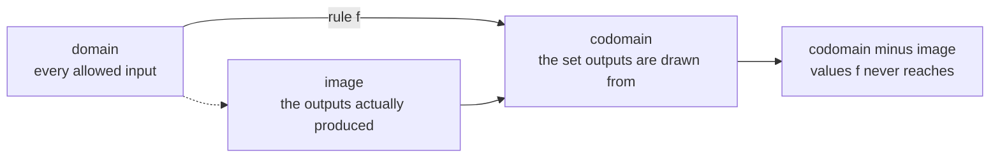

import DataCampExercise from "../../../../components/DataCampExercise.astro";
import Figure from "../../../../components/Figure.astro";
import Quiz from "../../../../components/Quiz.astro";

"A function" sounds like the least interesting item on a prerequisites list. It is on this one because
Chapter 2 will ask whether a linear mapping is **injective**, **surjective** or **bijective** and use
the answer to decide whether a matrix has an inverse — and Chapter 5 will differentiate things, which
requires a limit, which requires knowing what a limit is.

Both are ten-minute ideas that get skipped and then quietly cost hours.

## What you'll learn

- Domain, codomain and image, and why the image is usually smaller than the codomain.
- Injective, surjective, bijective — and the exact sentence that connects them to matrix inverses.
- What a limit is, including the two-sided requirement that makes it fail.
- Continuity as "no jumps", stated precisely enough to check.
- Why differentiable implies continuous but not the reverse, with ReLU as the example that matters.

## Intuition: a function is a machine with a rule

A function is three things, not one: a set of allowed inputs, a set the outputs are drawn from, and a
rule. The rule must give **exactly one** output for each input — that requirement is the whole
definition, and everything else is bookkeeping about the two sets.



The gap between **image** and **codomain** is the part people skip, and it is exactly the gap that
Chapter 2 turns into a statement about solvability. If $f(x) = x^2$ with domain and codomain both
$\mathbb{R}$, the image is only $[0, \infty)$. Ask for an $x$ with $f(x) = -4$ and there is none —
not because the arithmetic is hard, but because $-4$ is in the codomain and not in the image. Replace
$f$ with a matrix and that is precisely the situation "$\mathbf{A}\mathbf{x} = \mathbf{b}$ has no
solution".

## The math

### The three sets

$$
f : \mathcal{D} \to \mathcal{C}, \qquad x \mapsto f(x)
$$

- $\mathcal{D}$ is the **domain**: every input the function accepts.
- $\mathcal{C}$ is the **codomain**: the set the outputs live in.
- $\operatorname{Im}(f) = \{f(x) : x \in \mathcal{D}\} \subseteq \mathcal{C}$ is the **image**: the outputs actually achieved.

The book writes $\operatorname{Im}(\Phi)$ for the image of a linear mapping $\Phi$ and calls it the
**range** or **column space** when $\Phi$ is a matrix. Same object, three names, and §2.7 uses all of
them.

### Injective, surjective, bijective

These three words are the reason this page exists.

$$
\begin{aligned}
f \text{ is \textbf{injective}} \quad&\Longleftrightarrow\quad f(x) = f(y) \implies x = y \\[2pt]
f \text{ is \textbf{surjective}} \quad&\Longleftrightarrow\quad \operatorname{Im}(f) = \mathcal{C} \\[2pt]
f \text{ is \textbf{bijective}} \quad&\Longleftrightarrow\quad \text{both}
\end{aligned}
$$

In words a reader can hold on to:

| property | plain English | what fails without it |
| --- | --- | --- |
| **injective** | different inputs give different outputs — nothing collapses | you cannot undo $f$: two inputs share an output, so "which one was it?" has no answer |
| **surjective** | every value in the codomain is hit by something | some targets are unreachable, so "solve $f(x) = b$" can fail |
| **bijective** | a perfect pairing, both ways | nothing; a bijection has a genuine inverse $f^{-1}$ |

**An inverse exists exactly when $f$ is bijective.** That is the sentence. Chapter 2 then says: a
square matrix is invertible exactly when the linear mapping it defines is bijective, which happens
exactly when its columns are linearly independent, which happens exactly when its rank is full, which
happens exactly when its determinant is nonzero. Five statements, one condition — and the chain
starts here.

:::tip[Injective means the kernel is trivial]
For a **linear** map there is a shortcut, and §2.7 leans on it hard. Linearity gives
$f(x) = f(y) \iff f(x - y) = \mathbf{0}$, so $f$ is injective exactly when the only vector it sends to
zero is zero itself:

$$
f \text{ injective} \quad\Longleftrightarrow\quad \ker(f) = \{\mathbf{0}\}
$$

Checking injectivity for a general function means comparing every pair of inputs. For a linear one it
means solving a single homogeneous system. That collapse from "all pairs" to "one system" is what
makes linear algebra tractable, and it is worth noticing the first time you see it.
:::

### Limits

$$
\lim_{x \to a} f(x) = L
$$

reads: as $x$ gets arbitrarily close to $a$, $f(x)$ gets arbitrarily close to $L$. Two things this
does **not** say, both of which matter:

- It says nothing about $f(a)$. The function need not even be defined at $a$.
- It requires the same $L$ **from both sides**.

The two-sided requirement is where limits fail:

$$
\lim_{x \to a^-} f(x) \;=\; \lim_{x \to a^+} f(x) \;=\; L
\quad\Longleftrightarrow\quad
\lim_{x \to a} f(x) = L
$$

For $f(x) = \operatorname{sign}(x)$ the left limit at $0$ is $-1$ and the right limit is $+1$. They
disagree, so $\lim_{x\to 0} f(x)$ does not exist — regardless of the fact that $f(0) = 0$ is perfectly
well defined.

The canonical example of a limit that exists where the function does not is

$$
\lim_{x \to 0} \frac{\sin x}{x} = 1,
$$

which is undefined *at* $0$ but has a perfectly good limit approaching it. Every derivative is a limit
of this kind: a quotient that is $0/0$ at the point of interest and has a limit anyway.

### Continuity

$f$ is **continuous at $a$** when all three of these hold:

1. $f(a)$ is defined,
2. $\lim_{x\to a} f(x)$ exists,
3. they are equal: $\lim_{x\to a} f(x) = f(a)$.

Continuous **on an interval** means continuous at every point of it. Informally: you can draw the
graph without lifting the pen. All three conditions are needed — a function can satisfy any two and
fail the third, which is why the definition is a list rather than a sentence.

### Differentiability

$$
f'(a) \;=\; \lim_{h \to 0} \frac{f(a + h) - f(a)}{h}
$$

$f$ is **differentiable at $a$** when that limit exists. Because it is a two-sided limit, the slope
approaching from the left must match the slope approaching from the right.

$$
\text{differentiable at } a \;\Longrightarrow\; \text{continuous at } a
$$

but **not** the other way round. The implication holds because the difference quotient can only have
a finite limit if the numerator goes to zero, which is continuity. The converse fails at any corner.

:::caution[ReLU is the example that actually matters]
$$
\operatorname{ReLU}(x) = \max(0, x)
$$

is continuous everywhere — no jump at zero, the two sides meet at the same value. But it is **not
differentiable at zero**: the slope from the left is $0$ and from the right is $1$, and a two-sided
limit needs those to agree.

This is not a curiosity. ReLU is the most widely used activation function in deep learning, and its
derivative at exactly zero does not exist. Frameworks pick a value by convention — PyTorch and
TensorFlow both return $0$ — and it does not matter in practice, because hitting exactly $0.0$ in
floating point has probability effectively zero and the choice only affects a measure-zero set.

But "the gradient at this point does not exist and the library returns a convention" is a real thing
to know about the tool you use every day, and §5.1 says so explicitly.
:::

## Worked example by hand

Check the three continuity conditions and differentiability at $x = 0$ for five functions.

| $f(x)$ | $f(0)$ defined? | limit at $0$ exists? | equal? | continuous? | differentiable at $0$? |
| --- | --- | --- | --- | --- | --- |
| $x^2$ | yes, $0$ | yes, $0$ | yes | **yes** | **yes**, $f'(0) = 0$ |
| $\lvert x\rvert$ | yes, $0$ | yes, $0$ | yes | **yes** | **no**: slopes $-1$ and $+1$ |
| $\max(0, x)$ | yes, $0$ | yes, $0$ | yes | **yes** | **no**: slopes $0$ and $1$ |
| $\operatorname{sign}(x)$ | yes, $0$ | **no**: $-1$ vs $+1$ | — | **no** | no |
| $\sin(x)/x$ | **no** | yes, $1$ | — | **no** at $0$ | no |

Read the last two rows carefully — they fail for opposite reasons. $\operatorname{sign}$ is defined at
zero but has no limit there; $\sin(x)/x$ has a limit but is not defined there. The second is
**removably** discontinuous: define $f(0) := 1$ and it becomes continuous. The first cannot be fixed
by any choice of $f(0)$, because there is no single value both sides approach.

Now the difference quotient for $\lvert x\rvert$ at $0$, numerically:

| $h$ | $\dfrac{\lvert 0+h\rvert - \lvert 0\rvert}{h}$ |
| --- | --- |
| $+0.1$ | $+1$ |
| $+0.01$ | $+1$ |
| $+0.001$ | $+1$ |
| $-0.001$ | $-1$ |
| $-0.01$ | $-1$ |
| $-0.1$ | $-1$ |

The quotient does not settle on one number as $h \to 0$; it settles on **two**, depending on the sign
of $h$. That is what "the limit does not exist" looks like when you compute it.

## See it move

Drag the gap $h$ towards zero and watch the secant line become the tangent. Switch the function with
the second knob: on the smooth ones the two secants converge; on the corner they converge to
**different** lines, which is non-differentiability made visible.

```p5 title="A secant line becomes a tangent — unless there is a corner" desc="The blue line is the secant through x and x+h. Drag h towards zero and it rotates onto the tangent. Switch to the absolute value or ReLU and drag h through zero: the left and right secants settle on different slopes, so no tangent exists." height="400"
let h = 1.2, fn = 0, x0 = -0.6;
let KNOBS = [], dragging = null;

const FNS = [
  { name: "x^2 (smooth)",     f: x => x * x,            d: "differentiable everywhere" },
  { name: "|x| (corner)",     f: x => Math.abs(x),      d: "corner at 0: slopes -1 and +1" },
  { name: "max(0,x) = ReLU",  f: x => Math.max(0, x),   d: "corner at 0: slopes 0 and 1" },
  { name: "sin(3x)/1.5",      f: x => Math.sin(3 * x) / 1.5, d: "differentiable everywhere" },
];

function setup() { createCanvas(600, 400); textFont("monospace"); }

function knob(id, x, y, w, value, mn, mx, label) {
  KNOBS.push({ id, x, y, w, mn, mx });
  const t = (value - mn) / (mx - mn);
  stroke(60, 74, 92); strokeWeight(2); line(x, y, x + w, y);
  noStroke(); fill(255, 211, 67); ellipse(x + t * w, y, 12, 12);
  fill(190, 200, 212); textSize(12); textAlign(LEFT, CENTER);
  text(label, x + w + 12, y);
}
function knobHit(mx_, my_) {
  for (const k of KNOBS) {
    if (my_ > k.y - 13 && my_ < k.y + 13 && mx_ > k.x - 13 && mx_ < k.x + k.w + 13) return k;
  }
  return null;
}
function knobRaw(k, mx_) {
  const t = Math.min(1, Math.max(0, (mx_ - k.x) / k.w));
  return k.mn + t * (k.mx - k.mn);
}
function mousePressed() { dragging = knobHit(mouseX, mouseY); }
function mouseReleased() { dragging = null; }
function mouseDragged() {
  if (!dragging) return;
  if (dragging.id === "h")  h  = knobRaw(dragging, mouseX);
  if (dragging.id === "x0") x0 = knobRaw(dragging, mouseX);
  if (dragging.id === "fn") fn = Math.round(knobRaw(dragging, mouseX));
  if (!isLooping()) redraw();
}

function draw() {
  background(13, 17, 23);
  KNOBS = [];

  const f = FNS[fn].f;
  const U = 84, cx = 300, cy = 250;
  const sx = x => cx + x * U, sy = y => cy - y * U;

  // grid
  stroke(32, 44, 58); strokeWeight(1);
  for (let g = -3; g <= 3; g++) { line(sx(g), sy(-2), sx(g), sy(2.4)); }
  for (let g = -2; g <= 2; g++) { line(sx(-3), sy(g), sx(3), sy(g)); }
  stroke(58, 72, 88); strokeWeight(1.4);
  line(sx(-3), sy(0), sx(3), sy(0)); line(sx(0), sy(-2), sx(0), sy(2.4));

  // curve
  stroke(120, 200, 140); strokeWeight(2.4); noFill();
  beginShape();
  for (let px = -3; px <= 3; px += 0.01) vertex(sx(px), sy(f(px)));
  endShape();

  // the two secants: +h and -h
  const drawSecant = (hh, col, wt) => {
    const a = x0, b = x0 + hh;
    const fa = f(a), fb = f(b);
    const m = (fb - fa) / hh;
    stroke(col); strokeWeight(wt);
    line(sx(-3), sy(fa + m * (-3 - a)), sx(3), sy(fa + m * (3 - a)));
    noStroke(); fill(col);
    ellipse(sx(b), sy(fb), 7, 7);
    return m;
  };

  const mPlus  = drawSecant(Math.max(h, 0.004),  color(75, 139, 190), 2.2);
  const mMinus = drawSecant(-Math.max(h, 0.004), color(232, 110, 110), 2.2);

  // anchor point
  noStroke(); fill(255, 211, 67); ellipse(sx(x0), sy(f(x0)), 9, 9);

  // labels
  noStroke(); textAlign(LEFT, TOP);
  fill(255, 211, 67); textSize(15); text(FNS[fn].name, 16, 12);
  fill(160); textSize(12); text(FNS[fn].d, 16, 33);

  fill(75, 139, 190); textSize(13);
  text(`slope from the right  = ${mPlus.toFixed(3)}`, 16, 56);
  fill(232, 110, 110);
  text(`slope from the left   = ${mMinus.toFixed(3)}`, 16, 74);

  const gap = Math.abs(mPlus - mMinus);
  fill(gap < 0.02 ? color(120, 200, 140) : color(255, 170, 90)); textSize(13);
  text(gap < 0.02
        ? "the two agree -> the tangent exists"
        : `they differ by ${gap.toFixed(3)} -> no tangent yet`, 16, 96);

  knob("h",  60, 330, 170, h, 0.004, 1.6, `h = ${h.toFixed(3)}`);
  knob("x0", 60, 356, 170, x0, -1.6, 1.6, `x = ${x0.toFixed(2)}`);
  knob("fn", 60, 382, 90, fn, 0, 3, "function");
}
```

Set the function to `|x|`, put $x$ at $0$, then drag $h$ all the way down. On the smooth functions the
two slope readouts converge. On the corner they stay stubbornly at $-1$ and $+1$ no matter how small
$h$ gets — and *that* is the limit failing to exist, watched rather than asserted.

## On real data

<Figure
  src="/images/mml/functions-limits-and-continuity/three-failures"
  alt="Three panels. Left: x squared, smooth, with a tangent line drawn at the origin. Middle: the absolute value function, continuous with a visible corner at the origin and two different one-sided slopes drawn. Right: the sign function, with a visible jump at the origin and open and filled circles marking the discontinuity."
  title="Continuous and differentiable, continuous only, neither"
  caption="The middle panel is the one to remember: the pen never lifts, so it is continuous, but the corner means there is no single tangent. ReLU has exactly this shape."
/>

<Figure
  src="/images/mml/functions-limits-and-continuity/secant-convergence"
  alt="Two panels showing the difference quotient plotted against h on a logarithmic axis. For x squared both one-sided quotients converge to the same value. For the absolute value function they converge to minus one and plus one and never meet."
  title="The difference quotient as h shrinks"
  caption="Left: both sides settle on the same number, so the derivative exists. Right: they settle on two numbers, which is what a non-existent limit looks like numerically."
/>

## Reading the plot

In the right-hand panel of the second figure, the gap between the two curves does not narrow. It is
constant at $2$ all the way down to $h = 10^{-8}$, and it would stay $2$ if you continued. That
matters because it distinguishes a genuine non-differentiability from a numerical artefact: a real
derivative shows the two branches converging as $h$ shrinks, until floating-point noise takes over
somewhere around $h \approx 10^{-8}$ and they start to diverge again. Noise-driven divergence gets
*worse* as $h$ shrinks; a corner's gap is flat.

That distinction is how §5.5's gradient-checking recipe knows the difference between a bug and a
kink.

## Pitfalls

:::caution[The codomain is a choice, the image is not]
$f(x) = x^2$ is not surjective as a map $\mathbb{R}\to\mathbb{R}$, but it *is* surjective as a map
$\mathbb{R}\to[0,\infty)$. Same rule, different declared codomain, different answer. So "is $f$
surjective?" is not a question about the rule alone — you have to be told the codomain.
:::

:::caution[Continuous does not mean smooth]
"Smooth" usually means differentiable, often infinitely so. Continuous is weaker. Every
piecewise-linear activation function in deep learning lives in the gap: continuous, not
differentiable everywhere.
:::

:::danger[A limit says nothing about the value at the point]
$\lim_{x\to a} f(x)$ can exist while $f(a)$ is undefined, or defined and different. All three
continuity conditions have to be checked separately, and the derivative definition exploits exactly
this: the difference quotient is undefined at $h = 0$ and has a limit there anyway.
:::

:::caution[One-sided limits are not a technicality]
They are where every counterexample lives. When a limit "does not exist", the reason is almost always
that the two sides disagree. Checking both sides is the first thing to do, not the last.
:::

## Compare

| property | means | matrix version (§2.7) | why you care |
| --- | --- | --- | --- |
| injective | no two inputs collide | $\ker(\mathbf{A}) = \{\mathbf{0}\}$; columns independent | at most one solution to $\mathbf{A}\mathbf{x}=\mathbf{b}$ |
| surjective | every target is reached | $\operatorname{Im}(\mathbf{A}) = \mathbb{R}^m$; full row rank | at least one solution, for every $\mathbf{b}$ |
| bijective | both | square and invertible; $\det \neq 0$ | exactly one solution, always |
| continuous | no jumps | — | the function is well-behaved enough to optimise |
| differentiable | one tangent | — | gradient descent has something to follow |

<Quiz
  title="Check yourself"
  questions={[
    {
      q: "A function has an inverse exactly when it is which of these?",
      options: ["Injective", "Surjective", "Bijective", "Continuous"],
      answer: 2,
      explain:
        "Injective alone leaves some targets with no preimage; surjective alone leaves some targets with several. Only both together give a well-defined inverse — which is the condition Chapter 2 turns into matrix invertibility.",
    },
    {
      q: "ReLU is continuous everywhere but not differentiable at zero. Why not?",
      options: [
        "It jumps at zero",
        "It is undefined at zero",
        "The slope approaching from the left is zero and from the right is one, so the two-sided limit does not exist",
        "Its derivative is infinite at zero",
      ],
      answer: 2,
      explain:
        "There is no jump, so it is continuous. But the difference quotient tends to zero from one side and one from the other, and a derivative is a two-sided limit. Frameworks return zero there by convention.",
    },
    {
      q: "Sine of x divided by x is undefined at zero, yet its limit there is one. What does that make the discontinuity?",
      options: [
        "Removable — defining the value at zero to be one makes it continuous",
        "A jump discontinuity that cannot be fixed",
        "An infinite discontinuity",
        "Not a discontinuity at all",
      ],
      answer: 0,
      explain:
        "Both sides approach the same value, so filling in that value repairs it. Contrast the sign function, where the two sides approach different values and no choice of value at zero can help.",
    },
    {
      q: "For a linear mapping, checking injectivity reduces to what?",
      options: [
        "Comparing every pair of inputs",
        "Checking that only the zero vector maps to zero",
        "Checking the codomain equals the image",
        "Checking the function is continuous",
      ],
      answer: 1,
      explain:
        "Linearity turns the all-pairs condition into a single homogeneous system: the kernel is trivial. That collapse is what makes linear algebra computationally tractable.",
    },
  ]}
/>

## 🧪 Try It Yourself

### Exercise 1 – The image is smaller than the codomain

<DataCampExercise
  lang="python"
  hint={`Square the sample values, then take the minimum of the result.`}
  code={`import numpy as np

x = np.linspace(-3, 3, 601)
y = x ** 2

print("min of the image:", y.___())      # replace ___ so this prints the smallest output
print("is -4 ever produced?", np.any(np.isclose(y, -4)))

# -- Expected output ------------------------------
# min of the image: 0.0
# is -4 ever produced? False
# -------------------------------------------------`}
  solution={`import numpy as np
x = np.linspace(-3, 3, 601)
y = x ** 2
print("min of the image:", y.min())
print("is -4 ever produced?", np.any(np.isclose(y, -4)))`}
  sct={`test_output_contains("is -4 ever produced? False")
success_msg("The codomain contains -4; the image does not. That gap is what 'no solution' means for a matrix.")`}
  height={165}
/>

### Exercise 2 – Injectivity fails when outputs collide

<DataCampExercise
  lang="python"
  hint={`Two different inputs giving the same output breaks injectivity. Compare f(2) with f(-2).`}
  code={`def f(x):
    return x ** 2

a, b = 2.0, -2.0
collides = f(a) == f(___)          # replace ___ so the two inputs collide
print("f(2) =", f(a), " f(-2) =", f(b))
print("injective?", not collides)

# -- Expected output ------------------------------
# f(2) = 4.0  f(-2) = 4.0
# injective? False
# -------------------------------------------------`}
  solution={`def f(x):
    return x ** 2

a, b = 2.0, -2.0
collides = f(a) == f(b)
print("f(2) =", f(a), " f(-2) =", f(b))
print("injective?", not collides)`}
  sct={`test_output_contains("injective? False")
success_msg("Two inputs, one output. Nothing can undo that, so no inverse exists on all of R.")`}
  height={175}
/>

### Exercise 3 – One-sided limits of the sign function

<DataCampExercise
  lang="python"
  hint={`np.sign evaluated just below and just above zero. The two answers should differ.`}
  code={`import numpy as np

left  = np.sign(-1e-9)
right = np.sign(+1e-9)

print("from the left:", left, " from the right:", right)
print("limit exists?", left == ___)      # replace ___ with right

# -- Expected output ------------------------------
# from the left: -1.0  from the right: 1.0
# limit exists? False
# -------------------------------------------------`}
  solution={`import numpy as np
left  = np.sign(-1e-9)
right = np.sign(+1e-9)
print("from the left:", left, " from the right:", right)
print("limit exists?", left == right)`}
  sct={`test_output_contains("limit exists? False")
success_msg("Two sides, two answers. The limit does not exist, no matter what sign(0) happens to be.")`}
  height={175}
/>

### Exercise 4 – The difference quotient of ReLU at zero

<DataCampExercise
  lang="python"
  hint={`The quotient is (relu(0+h) - relu(0)) / h. Evaluate it at +h and at -h.`}
  code={`def relu(x):
    return max(0.0, x)

h = 1e-7
right = (relu(0 + h) - relu(0)) / h
left  = (relu(0 - h) - relu(0)) / ___     # replace ___ so the denominator matches the step

print("right slope:", right, " left slope:", left)
print("differentiable at 0?", right == left)

# -- Expected output ------------------------------
# right slope: 1.0  left slope: -0.0
# differentiable at 0? False
# -------------------------------------------------`}
  solution={`def relu(x):
    return max(0.0, x)

h = 1e-7
right = (relu(0 + h) - relu(0)) / h
left  = (relu(0 - h) - relu(0)) / -h
print("right slope:", right, " left slope:", left)
print("differentiable at 0?", right == left)`}
  sct={`test_output_contains("differentiable at 0? False")
success_msg("Zero on one side, one on the other. This is the activation function in most deep networks.")`}
  height={190}
/>

### Exercise 5 – Convergence versus a constant gap

<DataCampExercise
  lang="python"
  hint={`For a smooth function the one-sided quotients converge as h shrinks. Subtract them and watch the gap.`}
  code={`import numpy as np

def quotients(f, a, h):
    return (f(a + h) - f(a)) / h, (f(a - h) - f(a)) / -h

for h in [1e-2, 1e-4, 1e-6]:
    r, l = quotients(lambda x: x ** 2, 0.0, h)
    rk, lk = quotients(np.abs, 0.0, h)
    print(f"h={h:g}  smooth gap={abs(r - l):.1e}   corner gap={abs(rk - ___):.1f}")

# -- Expected output ------------------------------
# h=0.01  smooth gap=2.0e-02   corner gap=2.0
# h=0.0001  smooth gap=2.0e-04   corner gap=2.0
# h=1e-06  smooth gap=2.0e-06   corner gap=2.0
# -------------------------------------------------`}
  solution={`import numpy as np

def quotients(f, a, h):
    return (f(a + h) - f(a)) / h, (f(a - h) - f(a)) / -h

for h in [1e-2, 1e-4, 1e-6]:
    r, l = quotients(lambda x: x ** 2, 0.0, h)
    rk, lk = quotients(np.abs, 0.0, h)
    print(f"h={h:g}  smooth gap={abs(r - l):.1e}   corner gap={abs(rk - lk):.1f}")`}
  sct={`test_output_contains("corner gap=2.0")
success_msg("The corner's gap is flat at 2 forever, while the smooth function's gap shrinks in step with h — that is how gradient checking tells a kink from a bug.")`}
  height={215}
/>

:::tip[From the book]
*Mathematics for Machine Learning* introduces these ideas where it needs them rather than in a
preliminary chapter. **Definition 2.16** gives injective, surjective and bijective for mappings, and
§2.7 immediately applies them: a linear mapping is injective iff $\ker(\Phi) = \{\mathbf{0}\}$
(a **Remark** in §2.7.3, just after Figure 2.12), and an isomorphism is defined as a linear,
bijective mapping, with **Theorem 2.17** adding that two finite-dimensional spaces are isomorphic
exactly when their dimensions agree.
$\operatorname{Im}(\Phi)$ and $\ker(\Phi)$ are defined in **Definition 2.23**, with the
rank-nullity theorem (**Theorem 2.24**) relating their dimensions. §5.1 defines the derivative as the
limit of the difference quotient (**Equation 5.3**) and notes that a function must be continuous to be
differentiable. The notation $\forall$, $\exists$, $\circ$, $\operatorname{Im}$ and $\ker$ is from the
Table of Symbols on page 6.
:::

## Recall card

- **A function is three things** — domain, codomain, and a rule giving exactly one output per input.
- **The image can be smaller than the codomain**, and that gap is exactly what "no solution to Ax = b" means.
- **Injective** — different inputs never collide, so at most one solution exists.
- **Surjective** — every element of the codomain is reached, so at least one solution exists for every target.
- **An inverse exists exactly when the function is bijective** — the sentence Chapter 2 turns into matrix invertibility.
- **For a linear map, injective means the kernel is trivial**, which turns an all-pairs check into one homogeneous system.
- **A limit requires both sides to agree** and says nothing about the value at the point.
- **Continuity needs all three conditions**: defined, limit exists, and the two are equal.
- **Differentiable implies continuous, never the reverse** — ReLU is continuous everywhere and non-differentiable at zero, where frameworks return zero by convention.
- **A corner's one-sided gap stays constant as h shrinks, while floating-point noise grows** — which is how gradient checking distinguishes a kink from a bug.

**Next:** the derivative rules themselves, derived rather than listed —
**[Single-Variable Calculus Refresher](../single-variable-calculus-refresher/)**.
