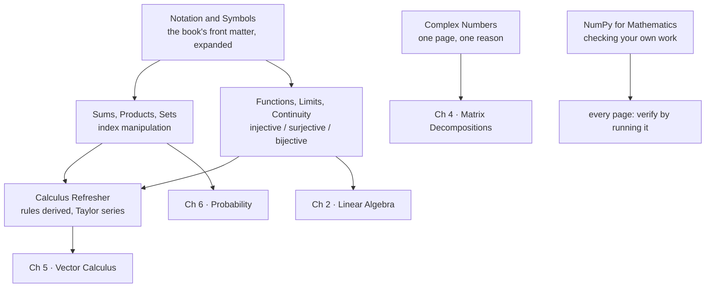

*Mathematics for Machine Learning* states its assumption plainly in the foreword: the reader should
have "mathematical knowledge commonly covered in high school mathematics and physics" — derivatives,
integrals, and geometric vectors in two or three dimensions.

That is a fair assumption and a genuinely low bar. It is also, for most people picking the book up
some years after school, not quite true any more. This chapter is not in the book. It exists because
the gap between "I did calculus once" and "I can read §5.6" is a few hours of revision, and spending
those hours here is much cheaper than stalling on page 141.

**Nothing in this chapter is new mathematics.** If you are fluent, skip it entirely — the self-test
below will tell you in three minutes.

## What this chapter covers

Read the arrows as "you will need this there". Nothing here is studied for its own sake.

## Which pages do you actually need?

Answer these honestly. The explanation after each one names the page that covers it.

<Quiz
  title="Three-minute self-test"
  questions={[
    {
      q: "In a double sum where the inner index runs from one up to the outer index, can you simply swap the two summation signs?",
      options: [
        "Yes, addition is commutative so the order never matters",
        "Yes, but the limits have to be rewritten to describe the same triangular region",
        "No, such a sum is not well defined",
        "Only when the summand factorises",
      ],
      answer: 1,
      explain:
        "Correct answer: the limits must be rewritten. If that was not immediate, read Sums, Products, and Set Notation — index manipulation is used without comment in almost every later derivation.",
    },
    {
      q: "What is the exact condition for a function to have an inverse?",
      options: [
        "It is continuous",
        "It is injective",
        "It is surjective",
        "It is bijective — both injective and surjective",
      ],
      answer: 3,
      explain:
        "Correct answer: bijective. Chapter 2 turns this single sentence into matrix invertibility, so if it did not come instantly, read Functions, Limits, and Continuity.",
    },
    {
      q: "The derivative of the logistic sigmoid can be written in terms of the sigmoid itself. What is its maximum value?",
      options: ["One", "One quarter", "One half", "It is unbounded"],
      answer: 1,
      explain:
        "Correct answer: one quarter. That number is the vanishing-gradient problem in one line. If you could not derive it, read the Single-Variable Calculus Refresher.",
    },
    {
      q: "A real two-by-two rotation matrix has how many real eigenvalues, for a rotation angle that is not zero or a half turn?",
      options: ["Two", "One", "None — both eigenvalues are complex", "It depends on the angle"],
      answer: 2,
      explain:
        "Correct answer: none. A rotation turns every direction, so no direction is merely scaled. If complex eigenvalues of a real matrix sound alarming, read Complex Numbers in One Page — it is genuinely one page.",
    },
    {
      q: "In NumPy, what does the asterisk operator do to two two-dimensional arrays of the same shape?",
      options: [
        "Matrix multiplication",
        "Elementwise multiplication, silently, with no error",
        "Raises a ValueError",
        "The dot product",
      ],
      answer: 1,
      explain:
        "Correct answer: elementwise, silently. The at operator is matrix multiplication. If that distinction is not automatic, read NumPy for Mathematics — this is the most expensive typo in numerical Python.",
    },
    {
      q: "What does the condition number of a matrix predict?",
      options: [
        "How long a solver will take",
        "Roughly how many decimal digits of accuracy you lose when solving with it",
        "Whether the matrix is symmetric",
        "The number of nonzero eigenvalues",
      ],
      answer: 1,
      explain:
        "Correct answer: digit loss, about log base ten of kappa. It is also the quantity that sets how slowly gradient descent converges, in section 7.1. Covered in NumPy for Mathematics.",
    },
    {
      q: "What distinguishes a bold uppercase symbol from a bold lowercase one in this book's notation?",
      options: [
        "Nothing — it is a typesetting choice",
        "Bold uppercase is a matrix, bold lowercase is a vector",
        "Bold uppercase is a set, bold lowercase is an element",
        "Bold uppercase is a random variable, bold lowercase is a realisation",
      ],
      answer: 1,
      explain:
        "Correct answer: matrix versus vector. Reading shapes off the typeface catches errors in a derivation without doing any arithmetic. The full table is on Notation and Symbols.",
    },
  ]}
/>

**Scoring, and it is not subtle.** Every question you missed points at one page. Read those pages and
skip the rest.

Seven out of seven means you are ready for
[Chapter 1](../../chapter-01---introduction-and-motivation/introduction-and-motivation-overview/), and
the only page here still worth bookmarking is
[Notation and Symbols](../notation-and-symbols/) — not to learn, but to look things up in.

## The pages

| order | page | what it is for | time |
| --- | --- | --- | --- |
| 502 | [Notation and Symbols](../notation-and-symbols/) | The book's Table of Symbols, expanded, with the chapter each symbol first appears in. Reference, not reading. | 15 min, then lookups |
| 503 | [Sums, Products, and Set Notation](../sums-products-and-set-notation/) | Sigma and Pi as loops; the rules for moving things in and out; swapping double sums; telescoping; sets and the indicator function. | 45 min |
| 504 | [Functions, Limits, and Continuity](../functions-limits-and-continuity/) | Domain, codomain, image; injective, surjective, bijective; limits from both sides; why ReLU is continuous and not differentiable. | 40 min |
| 505 | [Single-Variable Calculus Refresher](../single-variable-calculus-refresher/) | Every derivative rule derived from the limit; the chain rule as backpropagation; the Hessian's one-variable ancestor; integration and the Fundamental Theorem; Taylor series. | 70 min |
| 506 | [Complex Numbers in One Page](../complex-numbers-in-one-page/) | The plane, modulus and argument, Euler's formula, conjugates — and the one place the module needs them: a rotation matrix with no real eigenvalues. | 25 min |
| 507 | [NumPy for Mathematics](../numpy-for-mathematics/) | The at operator versus the asterisk, broadcasting, axis, the linalg toolkit, and the four floating-point traps. | 45 min |

About four hours if you read all six. Most readers need two or three of them.

## What you will be able to do afterwards

- Read a summation with dependent limits and know whether it can be swapped.
- Say what makes a mapping invertible, in the words Chapter 2 will use.
- Derive the chain rule, and explain why composing many layers makes gradients vanish or explode.
- Recognise a complex eigenvalue as a rotation rather than as an error.
- Verify any claim on any page of this module by writing five lines of NumPy — and know which
  floating-point traps could make a correct derivation print a wrong number.

## Where this chapter stops

Deliberately narrow. This chapter does **not** cover:

- **Linear algebra.** That is Chapter 2, from the beginning, assuming nothing.
- **Multivariable calculus.** Gradients, Jacobians and Hessians are Chapter 5's whole subject; this
  chapter only does the one-variable versions they generalise.
- **Probability.** Chapter 6 builds it from the sample space up.
- **Proof technique.** The book proves things but does not require you to. Where a proof is the
  clearest explanation, this module gives it; where it is not, it gives the argument instead.

If you are unsure whether something is a prerequisite or a topic, the rule is simple: if the book
teaches it, it is a topic and it has its own page later.

## Drill this chapter

Once you have read a page, its recall card feeds this deck. Come back to it a day later, not
immediately — retrieval works when it is slightly difficult.

<MathDrillDeck chapters={["Chapter 00 - Getting Ready"]} />

## Recall card

- **This chapter is not in the book** — it exists because the book assumes high-school mathematics and physics, and that assumption is usually a few years stale.
- **Notation and Symbols is a reference page**, not a reading page: bookmark it and look things up.
- **The self-test maps missed questions to pages** — read only the pages your misses point at.
- **Nothing here is studied for its own sake**; every page names the later section that needs it.
- **What this chapter does not cover** — linear algebra, multivariable calculus and probability are all taught from scratch in Chapters 2, 5 and 6.

**Next:** what the book means by "data", "model" and "learning", and why each of those words has more
than one meaning —
**[Introduction and Motivation](../../chapter-01---introduction-and-motivation/introduction-and-motivation-overview/)**.
