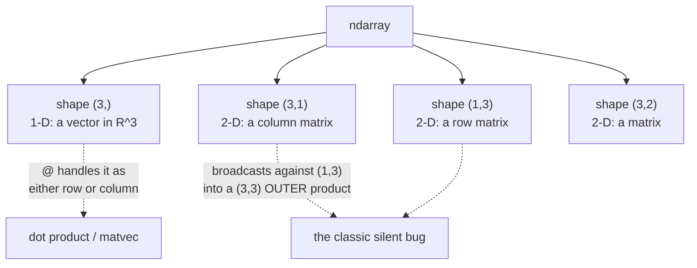

import DataCampExercise from "../../../../components/DataCampExercise.astro";
import Figure from "../../../../components/Figure.astro";
import Quiz from "../../../../components/Quiz.astro";

Every page in this module checks its mathematics by running it. That habit is worth more than any
single result on any single page: a derivation you have verified numerically is a derivation you
believe, and a derivation that disagrees with the code has a bug in one of the two — which is
information.

This page is the toolkit for doing that, and the four traps that make a **correct** derivation print
a **wrong** number.

## What you'll learn

- Which NumPy object is a vector and which is a matrix, and why the distinction bites.
- `@` versus `*`, the single most common source of silently wrong results.
- Broadcasting, in the three rules that actually determine what happens.
- `axis`, read as "the index being eliminated".
- The `np.linalg` functions this module uses, and which to reach for when.
- Why `==` is the wrong way to compare floats, and what condition number tells you before you trust an answer.

## Intuition: an array is a grid, and its shape is the mathematics

NumPy's central object is the **ndarray**, and its `.shape` is where the mathematics lives. A shape
`(3,)` array is a vector in $\mathbb{R}^3$; a shape `(3, 2)` array is a matrix in
$\mathbb{R}^{3\times 2}$. Most NumPy bugs are shape bugs, and most shape bugs come from one of two
things: confusing `(3,)` with `(3, 1)`, or expecting `*` to do what `@` does.



That right-hand branch is the trap worth internalising before anything else. A column and a row
broadcast against each other into a **matrix**, so `x - y` with mismatched orientations gives you a
$3\times3$ array where you expected a length-3 vector — and no error is raised. It shows up later as
a loss that will not go down.

## The math, and how NumPy writes it

### Vectors and matrices

```python title="shapes.py" showLineNumbers{1}
import numpy as np

x = np.array([1.0, 2.0, 3.0])          # shape (3,)   — a vector
A = np.array([[1.0, 2.0],
              [3.0, 4.0],
              [5.0, 6.0]])             # shape (3, 2) — a matrix

print(x.shape, A.shape, A.ndim, A.dtype)
print("column:", x.reshape(-1, 1).shape, " row:", x.reshape(1, -1).shape)
print("transpose of a 1-D array does nothing:", x.T.shape)
```

```
(3,) (3, 2) 2 float64
column: (3, 1)  row: (1, 3)
transpose of a 1-D array does nothing: (3,)
```

That last line surprises people. Mathematically $\mathbf{x}^\top$ is a row vector, but a 1-D NumPy
array has no orientation to flip, so `.T` is a no-op. If you need a genuine column, reshape to
`(n, 1)`.

### `@` is matrix multiplication; `*` is elementwise

$$
\mathbf{x}^\top\mathbf{y} = \sum_i x_i y_i
\qquad\text{versus}\qquad
(\mathbf{x} \odot \mathbf{y})_i = x_i y_i
$$

The first is a **scalar**; the second is a **vector**. NumPy writes them `x @ y` and `x * y`.

```python title="products.py" showLineNumbers{1}
import numpy as np

x = np.array([1.0, 2.0, 3.0])
y = np.array([4.0, 5.0, 6.0])

print("x @ y  (dot, a scalar) :", x @ y)
print("x * y  (elementwise)   :", x * y)
print("outer product shape    :", np.outer(x, y).shape)

A = np.array([[1.0, 2.0], [3.0, 4.0]])
B = np.array([[5.0, 6.0], [7.0, 8.0]])
print("A @ B  (matrix product):\n", A @ B)
print("A * B  (elementwise)   :\n", A * B)
print("AB != BA :", not np.allclose(A @ B, B @ A))
```

```
x @ y  (dot, a scalar) : 32.0
x * y  (elementwise)   : [ 4. 10. 18.]
outer product shape    : (3, 3)
A @ B  (matrix product):
 [[19. 22.]
 [43. 50.]]
A * B  (elementwise)   :
 [[ 5. 12.]
 [21. 32.]]
AB != BA : True
```

`A * B` runs without complaint and returns something of the right shape. That is why the mistake
survives: nothing fails, the numbers are just not the ones the mathematics asked for. §2.2 makes the
same point with the same example — matrix multiplication is composition of maps, not entry-by-entry
arithmetic — and this is what it looks like in code.

:::caution[Four ways to multiply: np.dot, the at operator, np.matmul and np.inner]
For 1-D and 2-D inputs `x @ y`, `np.dot(x, y)` and `np.matmul(x, y)` agree. They **diverge** for
higher dimensions: `np.dot` sums over the last axis of the first argument and the second-to-last of
the second, while `@` treats leading axes as a stack of matrices to be multiplied in parallel. Use
`@`. It is the operator the language added for this purpose and it reads like the mathematics.
:::

### Broadcasting

Three rules, applied right to left over the shapes:

1. If the arrays have different numbers of dimensions, the shorter shape is padded with $1$s on the **left**.
2. Two dimensions are compatible if they are **equal**, or if one of them is **1**.
3. A dimension of size $1$ is stretched to match the other.

```python title="broadcasting.py" showLineNumbers{1}
import numpy as np

A = np.arange(6.0).reshape(3, 2)      # (3, 2)
row = np.array([10.0, 20.0])          # (2,)   -> padded to (1,2) -> stretched to (3,2)
col = np.array([[1.0], [2.0], [3.0]]) # (3, 1) -> stretched to (3,2)

print("A + row:\n", A + row)
print("A + col:\n", A + col)

# Centring a dataset: the classic legitimate use.
X = np.array([[1.0, 10.0], [2.0, 20.0], [3.0, 30.0]])
print("column means:", X.mean(axis=0))
print("centred:\n", X - X.mean(axis=0))

# The trap: a column and a row broadcast to a MATRIX.
u = np.array([1.0, 2.0, 3.0])
print("u.reshape(-1,1) - u.reshape(1,-1) has shape:",
      (u.reshape(-1, 1) - u.reshape(1, -1)).shape, "-- not (3,)!")
```

```
A + row:
 [[10. 21.]
 [12. 23.]
 [14. 25.]]
A + col:
 [[1. 2.]
 [4. 5.]
 [7. 8.]]
column means: [ 2. 20.]
centred:
 [[ -1. -10.]
 [  0.   0.]
 [  1.  10.]]
u.reshape(-1,1) - u.reshape(1,-1) has shape: (3, 3) -- not (3,)!
```

The `(3, 3)` on the last line is the pairwise-difference matrix, which is genuinely useful when you
want it — it is how you build a distance matrix in one line. It is a bug only when you wanted a
vector, and NumPy cannot tell which you meant.

### `axis` names the index you eliminate

$$
\text{axis}=0 \;\leftrightarrow\; \sum_{i} a_{ij}
\qquad
\text{axis}=1 \;\leftrightarrow\; \sum_{j} a_{ij}
$$

Read `axis=0` as "sum away the first index", leaving one number per column. The alternative phrasing —
"sum along the rows" — is ambiguous, and that ambiguity is why this is the most reversed argument in
NumPy.

```python title="axes.py" showLineNumbers{1}
import numpy as np

A = np.arange(6.0).reshape(3, 2)
print("A:\n", A)
print("axis=0 (eliminate rows)   -> one per column:", A.sum(axis=0))
print("axis=1 (eliminate cols)   -> one per row   :", A.sum(axis=1))
print("no axis                   -> everything    :", A.sum())
print("keepdims keeps the rank, for broadcasting  :", A.sum(axis=1, keepdims=True).shape)
```

```
A:
 [[0. 1.]
 [2. 3.]
 [4. 5.]]
axis=0 (eliminate rows)   -> one per column: [6. 9.]
axis=1 (eliminate cols)   -> one per row   : [1. 5. 9.]
no axis                   -> everything    : 15.0
keepdims keeps the rank, for broadcasting  : (3, 1)
```

`keepdims=True` is the fix for half of all broadcasting accidents: it keeps the reduced axis as size
$1$ so the result still lines up against the original array.

### The `np.linalg` toolkit

| you want | call | used in |
| --- | --- | --- |
| solve $\mathbf{A}\mathbf{x}=\mathbf{b}$ | `np.linalg.solve(A, b)` | §2.3 |
| least squares, any shape | `np.linalg.lstsq(A, b, rcond=None)` | §3.8, Ch 9 |
| inverse | `np.linalg.inv(A)` | §2.2 — but see the warning below |
| pseudo-inverse | `np.linalg.pinv(A)` | §2.3, §3.8 |
| determinant | `np.linalg.det(A)` | §4.1 |
| eigenvalues and vectors | `np.linalg.eig(A)`, `eigh` if symmetric | §4.2, §4.4 |
| singular value decomposition | `np.linalg.svd(A)` | §4.5, §4.6, Ch 10 |
| norm | `np.linalg.norm(x, ord=...)` | §3.1 |
| rank | `np.linalg.matrix_rank(A)` | §2.6 |
| condition number | `np.linalg.cond(A)` | §2.3, §7.1 |
| Cholesky factor | `np.linalg.cholesky(A)` | §4.3, §6.5 |
| trace | `np.trace(A)` | §4.1 |

:::danger[Never invert a matrix to solve a system]
$\mathbf{x} = \mathbf{A}^{-1}\mathbf{b}$ is correct mathematics and bad numerics. `solve` factorises
and substitutes; `inv` computes $n$ columns of an inverse you then throw away, taking roughly three
times the work and accumulating error on every one of them.

The figure below measures it. The gap is small on a well-behaved matrix and grows with the condition
number — which is exactly the regime where you were already in trouble. `solve` is not merely faster,
it is more accurate, and there is no case in this module where `inv` is the right call.
:::

### Floating point

Four facts, and each one has bitten someone on a page in this module.

**1. `float64` has about 15–16 significant decimal digits.** `float32` has about 7. NumPy defaults to
`float64` for Python floats but to `float32` in most deep-learning frameworks, which is why a gradient
check that passes in NumPy can fail in PyTorch.

**2. `==` is the wrong comparison.** $0.1 + 0.2 \neq 0.3$ in binary floating point. Use
`np.isclose` or `np.allclose`, which compare within a tolerance.

**3. Subtracting nearly equal numbers destroys precision.** This is **catastrophic cancellation**, and
it is why the numerical derivative in
[the calculus refresher](../single-variable-calculus-refresher/) gets worse below $h \approx 10^{-6}$.

**4. Order of operations changes the answer.** Floating-point addition is not associative, so
`(a + b) + c` and `a + (b + c)` can differ. Summing a million numbers in a different order gives a
different total, and NumPy's pairwise summation is more accurate than a naive loop for exactly this
reason.

```python title="floating_point.py" showLineNumbers{1}
import numpy as np

print("0.1 + 0.2 == 0.3 :", 0.1 + 0.2 == 0.3)
print("difference       :", 0.1 + 0.2 - 0.3)
print("isclose          :", np.isclose(0.1 + 0.2, 0.3))

print("float64 eps:", np.finfo(np.float64).eps)
print("float32 eps:", np.finfo(np.float32).eps)

# Catastrophic cancellation: 15 digits agree, so 15 digits are destroyed.
a, b = 1.0, 1.0 + 1e-15
print("relative error of the difference:", abs((b - a) - 1e-15) / 1e-15)

# Addition is not associative.
xs = np.array([1.0, 1e16, -1e16])
print("left to right:", (xs[0] + xs[1]) + xs[2], " regrouped:", xs[0] + (xs[1] + xs[2]))
```

```
0.1 + 0.2 == 0.3 : False
difference       : 5.551115123125783e-17
isclose          : True
float64 eps: 2.220446049250313e-16
float32 eps: 1.1920929e-07
relative error of the difference: 0.11022302462515646
left to right: 0.0  regrouped: 1.0
```

The last line is the whole lesson in two numbers. The same three values, added in two orders, give
$0$ and $1$. Neither is a bug; both are what the arithmetic specifies. And the relative error line
says that subtracting two numbers agreeing to 15 digits leaves an answer wrong by 11%.

### Condition number: check before you trust

$$
\kappa(\mathbf{A}) = \frac{\sigma_{\max}}{\sigma_{\min}}
$$

the ratio of largest to smallest singular value. Interpretation, and it is a practical one: solving
$\mathbf{A}\mathbf{x}=\mathbf{b}$ can lose about $\log_{10}\kappa$ **decimal digits** of accuracy.
With $\kappa = 10^{10}$ and `float64`'s 16 digits, expect around 6 good digits left.

$\kappa$ is the same number that sets how slowly gradient descent converges on a quadratic (§7.1) and
how unstable a least-squares fit is (Ch 9). One quantity, three chapters.

## Worked example by hand, then checked

Solve

$$
\begin{bmatrix}2 & 1\\ 1 & 3\end{bmatrix}\begin{bmatrix}x_1\\ x_2\end{bmatrix} = \begin{bmatrix}5\\ 10\end{bmatrix}
$$

By elimination: row 2 minus $\tfrac12$ row 1 gives $2.5x_2 = 7.5$, so $x_2 = 3$. Back-substituting,
$2x_1 + 3 = 5$, so $x_1 = 1$. Solution $(1, 3)$.

The determinant is $2\cdot3 - 1\cdot1 = 5$, so the matrix is invertible and the solution is unique.
Its eigenvalues solve $\lambda^2 - 5\lambda + 5 = 0$:

$$
\lambda = \frac{5 \pm \sqrt{25 - 20}}{2} = \frac{5 \pm \sqrt5}{2}
$$

so $\lambda_1 = 3.6180340$ and $\lambda_2 = 1.3819660$. Both positive, so the matrix is positive
definite — and because it is symmetric, its condition number is the eigenvalue ratio
$3.6180340 / 1.3819660 = 2.6180340$. Very well conditioned; expect no accuracy loss at all.

Every one of those numbers is checked below.

## From scratch

```python title="verify_by_hand.py" showLineNumbers{1}
import numpy as np

A = np.array([[2.0, 1.0],
              [1.0, 3.0]])
b = np.array([5.0, 10.0])

x = np.linalg.solve(A, b)
print("solution      :", x)
print("residual A@x-b:", A @ x - b)
print("determinant   :", np.linalg.det(A))
print("eigenvalues   :", np.linalg.eigvalsh(A))
print("condition     :", np.linalg.cond(A))
print("rank          :", np.linalg.matrix_rank(A))
print("trace         :", np.trace(A), "== sum of eigenvalues:",
      np.linalg.eigvalsh(A).sum())
print("det == product of eigenvalues:",
      np.isclose(np.linalg.det(A), np.prod(np.linalg.eigvalsh(A))))

# solve versus inv, on a badly conditioned matrix.
n = 8
H = np.array([[1.0 / (i + j + 1) for j in range(n)] for i in range(n)])  # Hilbert
x_true = np.ones(n)
rhs = H @ x_true
via_solve = np.linalg.solve(H, rhs)
via_inv   = np.linalg.inv(H) @ rhs
print("\nHilbert condition number: %.3e" % np.linalg.cond(H))
print("digits expected to survive: %.1f" % (16 - np.log10(np.linalg.cond(H))))
print("solve  max error: %.3e" % np.abs(via_solve - x_true).max())
print("inv    max error: %.3e" % np.abs(via_inv   - x_true).max())
```

```
solution      : [1. 3.]
residual A@x-b: [0. 0.]
determinant   : 5.000000000000001
eigenvalues   : [1.38196601 3.61803399]
condition     : 2.6180339887498953
rank          : 2
trace         : 5.0 == sum of eigenvalues: 5.0
det == product of eigenvalues: True

Hilbert condition number: 1.526e+10
digits expected to survive: 5.8
solve  max error: 1.309e-07
inv    max error: 9.537e-07
```

Three things to read off. The eigenvalues match the hand calculation to every printed digit. The
determinant prints `5.000000000000001` rather than `5.0` — which is fact 2 above, and the reason
`np.isclose` exists. And on the Hilbert matrix, `solve` beats `inv` by roughly a factor of two while
both lose about ten digits, exactly as $\log_{10}\kappa \approx 10.2$ predicted.

## See it move

Every shape rule above is one rule applied from the right. The sketch runs it, so you can watch a
pairing that looks harmless produce a shape you did not ask for.

```p5 title="Does this pair of shapes broadcast, and to what?" desc="Pick a shape for each operand. The sketch aligns the two shape tuples from the RIGHT, applies the broadcasting rule dimension by dimension, and reports the result shape or the dimension that made it impossible. The verdict line also says whether NumPy would have raised anything." height="460"
let ia = 1, ib = 3;
let KNOBS = [], dragging = null;

function knob(id, x, y, w, value, mn, mx, label) {
  KNOBS.push({ id, x, y, w, mn, mx });
  const t = (value - mn) / (mx - mn);
  stroke(60, 74, 92); strokeWeight(2); line(x, y, x + w, y);
  noStroke(); fill(255, 211, 67); ellipse(x + t * w, y, 12, 12);
  fill(190, 200, 212); textSize(12); textAlign(LEFT, CENTER);
  text(label, x + w + 12, y);
}
function knobHit(mx_, my_) {
  for (const k of KNOBS) {
    if (my_ > k.y - 13 && my_ < k.y + 13 && mx_ > k.x - 13 && mx_ < k.x + k.w + 13) return k;
  }
  return null;
}
function knobValue(k, mx_) {
  const t = Math.min(1, Math.max(0, (mx_ - k.x) / k.w));
  return Math.round(k.mn + t * (k.mx - k.mn));
}
function mousePressed() { dragging = knobHit(mouseX, mouseY); }
function mouseReleased() { dragging = null; }

function mouseDragged() {
  if (!dragging) return;
  const v = knobValue(dragging, mouseX);
  if (dragging.id === "a") ia = v;
  if (dragging.id === "b") ib = v;
  if (!isLooping()) redraw();
}

const SHAPES = [
  { name: "(3,)",     dims: [3] },
  { name: "(3, 1)",   dims: [3, 1] },
  { name: "(1, 3)",   dims: [1, 3] },
  { name: "(3, 3)",   dims: [3, 3] },
  { name: "(2, 3)",   dims: [2, 3] },
  { name: "(4, 1, 3)", dims: [4, 1, 3] },
];

function setup() { createCanvas(680, 460); textFont("monospace"); }

// The whole of broadcasting: right-align, then each pair must be equal or contain a 1.
function broadcast(da, db) {
  const n = Math.max(da.length, db.length);
  const rows = [];
  let ok = true;
  for (let k = 0; k < n; k++) {
    const a = da[da.length - n + k];
    const b = db[db.length - n + k];
    const ea = a === undefined ? 1 : a;
    const eb = b === undefined ? 1 : b;
    let out = null, why;
    if (ea === eb) { out = ea; why = "equal"; }
    else if (ea === 1) { out = eb; why = "left is 1, stretched"; }
    else if (eb === 1) { out = ea; why = "right is 1, stretched"; }
    else { ok = false; why = "INCOMPATIBLE"; }
    rows.push({ a, b, ea, eb, out, why, missA: a === undefined, missB: b === undefined });
  }
  return { ok, rows };
}

function draw() {
  background(13, 17, 23);
  KNOBS = [];
  const A = SHAPES[ia], B = SHAPES[ib];
  const r = broadcast(A.dims, B.dims);

  noStroke(); fill(255, 211, 67); textSize(16); textAlign(LEFT, TOP);
  text("A" + A.name + "  *  B" + B.name, 20, 16);
  fill(150); textSize(11);
  text("aligned from the RIGHT, which is the only rule there is", 20, 40);

  const cw = 84, ox = 300, oy = 76;
  const n = r.rows.length;
  const labels = ["A", "B", "result"];
  for (let li = 0; li < 3; li++) {
    noStroke(); fill(170); textSize(13); textAlign(RIGHT, CENTER);
    text(labels[li], ox - 16, oy + li * 62 + 24);
  }
  for (let k = 0; k < n; k++) {
    const x = ox + k * cw;
    const row = r.rows[k];
    const cells = [
      { v: row.missA ? "-" : String(row.a), pad: row.missA },
      { v: row.missB ? "-" : String(row.b), pad: row.missB },
      { v: row.out === null ? "x" : String(row.out), pad: false },
    ];
    for (let li = 0; li < 3; li++) {
      const bad = li === 2 && row.out === null;
      stroke(bad ? color(232, 110, 110) : (cells[li].pad ? color(50, 62, 76) : color(100, 122, 146)));
      strokeWeight(1.5);
      fill(bad ? color(232, 110, 110, 34) : color(22, 29, 38));
      rect(x, oy + li * 62, cw - 12, 48, 5);
      noStroke();
      fill(bad ? color(232, 110, 110) : (cells[li].pad ? 90 : 235));
      textSize(17); textAlign(CENTER, CENTER);
      text(cells[li].v, x + (cw - 12) / 2, oy + li * 62 + 24);
    }
    noStroke(); fill(bad_col(row)); textSize(10); textAlign(CENTER, TOP);
    text(row.why, x + (cw - 12) / 2, oy + 190);
  }
  noStroke(); fill(110); textSize(10); textAlign(LEFT, TOP);
  text("a dash means the shape was shorter, so a 1 is assumed there", ox, oy + 214);

  const resShape = r.ok ? "(" + r.rows.map(q => q.out).join(", ") + ")" : null;
  stroke(r.ok ? color(120, 200, 140) : color(232, 110, 110)); strokeWeight(1.6);
  fill(r.ok ? color(120, 200, 140, 26) : color(232, 110, 110, 26));
  rect(20, 300, 640, 88, 6);
  noStroke(); textAlign(LEFT, TOP);
  fill(r.ok ? color(120, 200, 140) : color(232, 110, 110)); textSize(19);
  text(r.ok ? "broadcasts to " + resShape : "cannot broadcast", 38, 312);
  textSize(12); fill(210);
  if (r.ok) {
    const sameA = A.name === resShape, sameB = B.name === resShape;
    const grew = !sameA && !sameB;
    text(grew
      ? "NEITHER operand had this shape. NumPy raises nothing — the result is simply bigger."
      : "the result matches " + (sameA ? "A" : "B") + ", which is usually what was intended",
      38, 344);
    fill(grew ? color(255, 211, 67) : 130); textSize(11);
    text(grew
      ? "this is the silent case: no error, no warning, a larger array downstream"
      : "no surprise here", 38, 366);
  } else {
    text("some dimension pair was neither equal nor contained a 1", 38, 344);
    fill(130); textSize(11);
    text("this is the LOUD case: NumPy raises ValueError, so you find out immediately", 38, 366);
  }

  knob("a", 40, 412, 150, ia, 0, SHAPES.length - 1, "A = " + A.name);
  knob("b", 40, 440, 150, ib, 0, SHAPES.length - 1, "B = " + B.name);
  noStroke(); fill(120); textSize(11); textAlign(LEFT, CENTER);
  text("try (3,) with (3, 1) — the pairing that bites hardest", 380, 426);
}

function bad_col(row) { return row.out === null ? color(232, 110, 110) : color(120, 140, 160); }
```

## On real data

<Figure
  src="/images/mml/numpy-for-mathematics/solve-vs-inv"
  alt="Log-log plot of relative solution error against condition number for matrices with prescribed conditioning. Both the solve and the explicit-inverse curves rise roughly in proportion to the condition number, with the inverse curve consistently above the solve curve."
  title="Accuracy against conditioning: solve versus explicit inverse"
  caption="Error grows in step with the condition number for both methods, and the explicit inverse is worse at 26 of the 27 levels sampled. The dashed line is machine epsilon times kappa, the bound the conditioning imposes."
/>

<Figure
  src="/images/mml/numpy-for-mathematics/float32-vs-float64"
  alt="Two panels. Left: the accumulated error of summing one million values in float32 and in float64, with the float32 error orders of magnitude larger. Right: a bar chart of the number of significant decimal digits available in float16, float32 and float64."
  title="What precision actually buys you"
  caption="float32 carries about seven decimal digits and float64 about sixteen. Summing a million numbers in float32 loses a visible fraction of the total."
/>

## Reading the plot

The dashed line in the first figure is $\varepsilon\,\kappa(\mathbf{A})$ — machine epsilon times the
condition number. It is the standard **upper bound** on the relative error: the conditioning of the
problem amplifies the rounding error already present in the inputs, and that product says how much
amplification to expect. Both methods track the line a small constant below it, which is what a
well-implemented solver looks like.

That reframes what the plot is showing. The line's *slope* belongs to the problem and no algorithm can
change it; the vertical **gap between the two curves** is the only part that is the method's fault,
and `inv` loses that comparison at 26 of the 27 conditioning levels plotted.

So when a linear system gives a bad answer, the first question is not "is my solver good enough" but
"what is $\kappa$". At $\kappa = 10^{13}$ the bound is already $2\times10^{-3}$ — three digits left of
sixteen — and no choice of solver recovers them. The problem needs reformulating, which is what
regularisation does (§9.2).

## Pitfalls

:::danger[Using star where you meant the at operator]
The most expensive typo in numerical Python. Both run, both return an array, and only one is the
mathematics. When a loss will not go down, check every product's shape before anything else.
:::

:::caution[Shape (n,) is not shape (n, 1)]
A 1-D array has no orientation, so `.T` does nothing to it. `@` handles 1-D operands sensibly, but
subtraction and addition broadcast, so mixing `(n,)` with `(n, 1)` silently produces an $n\times n$
matrix. `keepdims=True` and explicit `reshape` prevent this.
:::

:::caution[Calling inv when you meant solve]
Three times the work and worse accuracy, and the gap widens exactly when the matrix is ill
conditioned. Similarly, prefer `eigh` over `eig` for symmetric matrices, and `pinv` or `lstsq` over
`inv` when the matrix is not square.
:::

:::danger[Comparing floats with double-equals]
`0.1 + 0.2 == 0.3` is `False`. Every equality assertion in this module uses `np.isclose` or
`np.allclose`. The default tolerances are sensible; tighten `atol` only when you know why.
:::

:::caution[matrix_rank needs a tolerance, and it already has one]
A matrix that is mathematically rank 3 will, after any floating-point arithmetic, have small nonzero
singular values in the remaining slots. `matrix_rank` counts singular values above a tolerance derived
from machine epsilon and the matrix size. That is why §2.6 says rank is a *numerical* question in
practice, not just an algebraic one.
:::

## Compare

| mathematics | NumPy | not this |
| --- | --- | --- |
| $\mathbf{x}^\top\mathbf{y}$ | `x @ y` | `x * y` — that is elementwise |
| $\mathbf{x}\mathbf{y}^\top$ | `np.outer(x, y)` | `x @ y` — that contracts instead |
| $\mathbf{A}\mathbf{B}$ | `A @ B` | `A * B` |
| $\mathbf{A}^{-1}\mathbf{b}$ | `np.linalg.solve(A, b)` | `np.linalg.inv(A) @ b` |
| $\mathbf{A}^\top$ | `A.T` | `.T` on a 1-D array does nothing |
| $\sum_i a_{ij}$ | `A.sum(axis=0)` | `axis=1` eliminates the other index |
| $\lVert\mathbf{x}\rVert_2$ | `np.linalg.norm(x)` | `sum(x**2)` — forgets the square root |
| $\lVert\mathbf{x}\rVert_1$ | `np.linalg.norm(x, ord=1)` | the default `ord` is 2 |
| eigenvalues, symmetric $\mathbf{A}$ | `np.linalg.eigvalsh(A)` | `eigvals` returns a complex dtype |
| $a = b$ | `np.isclose(a, b)` | `a == b` |

<Quiz
  title="Check yourself"
  questions={[
    {
      q: "You want the dot product of two length-three arrays but you write the asterisk operator instead of the at operator. What happens?",
      options: [
        "A ValueError about shapes",
        "It returns a length-three array of elementwise products, with no error",
        "It returns the correct scalar anyway",
        "It returns a three-by-three matrix",
      ],
      answer: 1,
      explain:
        "Nothing fails. You get an array of the right length holding the wrong quantity, which is why this bug survives review and surfaces later as a model that will not train.",
    },
    {
      q: "Why is solve preferred over computing an explicit inverse and multiplying?",
      options: [
        "Only because it is faster",
        "It is both faster and more accurate, and the accuracy gap widens as the matrix becomes ill conditioned",
        "Because inv does not exist for non-square matrices",
        "There is no difference; it is a style preference",
      ],
      answer: 1,
      explain:
        "solve factorises once and substitutes, while inv computes an entire matrix you then discard, accumulating error in every column. On a Hilbert matrix the explicit inverse is about twice as wrong.",
    },
    {
      q: "A matrix has condition number ten to the tenth. Roughly how many correct decimal digits should you expect from solving a system with it in double precision?",
      options: ["About sixteen", "About ten", "About six", "None"],
      answer: 2,
      explain:
        "Double precision carries about sixteen digits and the conditioning costs you the log base ten of kappa, which is ten. Six remain, and that estimate is a bound no solver can improve on — it is a property of the problem, not the algorithm.",
    },
    {
      q: "Subtracting a shape (3,1) array from a shape (1,3) array gives what?",
      options: [
        "A shape (3,) vector",
        "A ValueError",
        "A shape (3,3) matrix of pairwise differences",
        "A scalar",
      ],
      answer: 2,
      explain:
        "Broadcasting stretches each size-one dimension to match the other, producing the pairwise-difference matrix. Useful when intended, a silent bug when not — which is what keepdims and explicit reshape are for.",
    },
  ]}
/>

## 🧪 Try It Yourself

### Exercise 1 – Dot product versus elementwise

<DataCampExercise
  lang="python"
  hint={`The at operator contracts the shared index and gives a scalar; the asterisk keeps it and gives a vector.`}
  code={`import numpy as np

x = np.array([1.0, 2.0, 3.0])
y = np.array([4.0, 5.0, 6.0])

dot  = x ___ y            # replace ___ so this is the dot product
elem = x * y

print("dot :", dot, type(dot).__name__)
print("elem:", elem, elem.shape)

# -- Expected output ------------------------------
# dot : 32.0 float64
# elem: [ 4. 10. 18.] (3,)
# -------------------------------------------------`}
  solution={`import numpy as np
x = np.array([1.0, 2.0, 3.0])
y = np.array([4.0, 5.0, 6.0])
dot  = x @ y
elem = x * y
print("dot :", dot, type(dot).__name__)
print("elem:", elem, elem.shape)`}
  sct={`test_output_contains("dot : 32.0")
success_msg("One scalar, one vector. The at operator contracts; the asterisk does not.")`}
  height={185}
/>

### Exercise 2 – axis eliminates an index

<DataCampExercise
  lang="python"
  hint={`Eliminating the first index leaves one number per column. That is axis=0.`}
  code={`import numpy as np

X = np.array([[1.0, 10.0],
              [2.0, 20.0],
              [3.0, 30.0]])

col_means = X.mean(axis=___)      # replace ___ so you get one mean per column
print("column means:", col_means, col_means.shape)
print("centred columns sum to zero:", np.allclose((X - col_means).sum(axis=0), 0))

# -- Expected output ------------------------------
# column means: [ 2. 20.] (2,)
# centred columns sum to zero: True
# -------------------------------------------------`}
  solution={`import numpy as np
X = np.array([[1.0, 10.0],
              [2.0, 20.0],
              [3.0, 30.0]])
col_means = X.mean(axis=0)
print("column means:", col_means, col_means.shape)
print("centred columns sum to zero:", np.allclose((X - col_means).sum(axis=0), 0))`}
  sct={`test_output_contains("centred columns sum to zero: True")
success_msg("Eliminating the row index leaves a per-feature mean — which is exactly the centring step PCA needs.")`}
  height={195}
/>

### Exercise 3 – Never compare floats with equals

<DataCampExercise
  lang="python"
  hint={`np.isclose compares within a tolerance instead of demanding bit equality.`}
  code={`import numpy as np

a = 0.1 + 0.2
print("exact equality :", a == 0.3)
print("the difference :", a - 0.3)
print("isclose        :", np.___(a, 0.3))     # replace ___ with isclose

# -- Expected output ------------------------------
# exact equality : False
# the difference : 5.551115123125783e-17
# isclose        : True
# -------------------------------------------------`}
  solution={`import numpy as np
a = 0.1 + 0.2
print("exact equality :", a == 0.3)
print("the difference :", a - 0.3)
print("isclose        :", np.isclose(a, 0.3))`}
  sct={`test_output_contains("isclose        : True")
success_msg("Neither number is exactly representable in binary, so the sum misses by one part in ten thousand trillion.")`}
  height={180}
/>

### Exercise 4 – solve beats inv

<DataCampExercise
  lang="python"
  hint={`np.linalg.solve(H, rhs) does the whole job in one call. Compare its error against inv(H) @ rhs.`}
  code={`import numpy as np

n = 8
H = np.array([[1.0 / (i + j + 1) for j in range(n)] for i in range(n)])
x_true = np.ones(n)
rhs = H @ x_true

via_solve = np.linalg.___(H, rhs)          # replace ___ with solve
via_inv   = np.linalg.inv(H) @ rhs

print("condition number : %.3e" % np.linalg.cond(H))
print("solve error      : %.3e" % np.abs(via_solve - x_true).max())
print("inv   error      : %.3e" % np.abs(via_inv - x_true).max())
print("solve is better  :",
      np.abs(via_solve - x_true).max() < np.abs(via_inv - x_true).max())

# -- Expected output ------------------------------
# condition number : 1.526e+10
# solve error      : 1.309e-07
# inv   error      : 9.537e-07
# solve is better  : True
# -------------------------------------------------`}
  solution={`import numpy as np
n = 8
H = np.array([[1.0 / (i + j + 1) for j in range(n)] for i in range(n)])
x_true = np.ones(n)
rhs = H @ x_true
via_solve = np.linalg.solve(H, rhs)
via_inv   = np.linalg.inv(H) @ rhs
print("condition number : %.3e" % np.linalg.cond(H))
print("solve error      : %.3e" % np.abs(via_solve - x_true).max())
print("inv   error      : %.3e" % np.abs(via_inv - x_true).max())
print("solve is better  :",
      np.abs(via_solve - x_true).max() < np.abs(via_inv - x_true).max())`}
  sct={`test_output_contains("solve is better  : True")
success_msg("Kappa is 1.5e10, so the conditioning alone can cost ten of sixteen digits. inv then throws away another factor of seven on top.")`}
  height={245}
/>

### Exercise 5 – The broadcasting trap

<DataCampExercise
  lang="python"
  hint={`A column shape (3,1) against a row shape (1,3) stretches both, giving a 3 by 3 result.`}
  code={`import numpy as np

u = np.array([1.0, 2.0, 3.0])

wrong = u.reshape(-1, 1) - u.reshape(1, -1)
right = u - u

print("wrong shape:", wrong.shape)
print("right shape:", right.shape)
print("wrong is the pairwise difference matrix:", wrong.shape == (3, ___))

# -- Expected output ------------------------------
# wrong shape: (3, 3)
# right shape: (3,)
# wrong is the pairwise difference matrix: True
# -------------------------------------------------`}
  solution={`import numpy as np
u = np.array([1.0, 2.0, 3.0])
wrong = u.reshape(-1, 1) - u.reshape(1, -1)
right = u - u
print("wrong shape:", wrong.shape)
print("right shape:", right.shape)
print("wrong is the pairwise difference matrix:", wrong.shape == (3, 3))`}
  sct={`test_output_contains("wrong shape: (3, 3)")
success_msg("No error was raised. That silence is what makes this the bug it is.")`}
  height={205}
/>

:::tip[From the book]
*Mathematics for Machine Learning* is deliberately library-agnostic, but the operations this page
covers are the ones its derivations use. Matrix multiplication and its non-commutativity are
**Definition 2.2** and the remarks after **Equation 2.13**; the identity, inverse and transpose are
**Definitions 2.3–2.5**. §2.3 solves systems by elimination and introduces the pseudo-inverse
(**Equation 2.34**), warning that Gaussian elimination is not what is used at scale. Rank is
**Definition 2.23** and §2.6.1; the determinant is §4.1; eigendecomposition and SVD are §4.4 and §4.5;
norms are **Definition 3.1**. §7.1 introduces the condition number as the quantity governing gradient
descent's convergence rate — the same $\kappa$ this page uses to predict digit loss.
:::

## Recall card

- **The shape is the mathematics** — most NumPy bugs are shape bugs, and `(n,)` is not `(n, 1)`.
- **`@` contracts and `*` does not.** Both run without error, which is why confusing them is the most expensive typo in numerical Python.
- **Broadcasting pads shapes on the left, then stretches any dimension of size one** — so a column against a row gives a matrix, silently.
- **`axis` names the index you eliminate**, not a direction; `axis=0` leaves one value per column.
- **`keepdims=True` prevents half of all broadcasting accidents** by keeping the reduced axis at size one.
- **Never invert a matrix to solve a system** — `solve` is faster and more accurate, and the gap widens with conditioning.
- **Use `eigh` for symmetric matrices**: it is faster and returns real eigenvalues by construction.
- **`==` is the wrong comparison for floats** because 0.1 plus 0.2 is not 0.3; use `np.isclose`.
- **Floating-point addition is not associative** — the same three numbers summed in two orders can give 0 and 1.
- **The condition number predicts digit loss**: solving costs you about log-base-ten of kappa decimal digits, and that bound is a property of the problem, not the solver.
- **`matrix_rank` is a numerical question with a tolerance**, because exact zeros do not survive floating-point arithmetic.

**Next:** you have the prerequisites. Take the self-test on the
**[Getting Ready overview](../getting-ready-overview/)** to see what you can skip, or go straight to
**[Linear Algebra](../../chapter-02---linear-algebra/linear-algebra-overview/)**.
