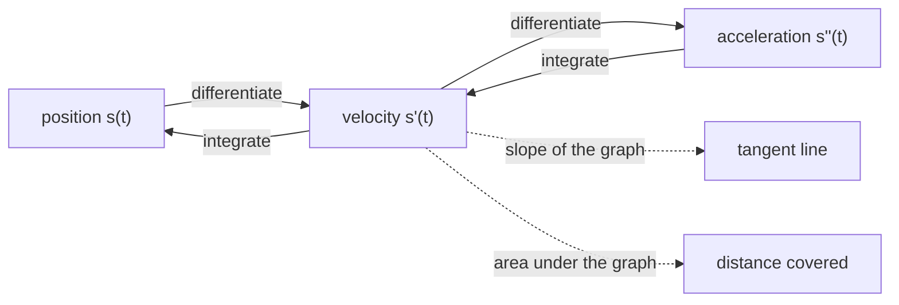

Chapter 5 does not teach calculus. It **generalises** it: the derivative becomes a gradient, the chain
rule becomes backpropagation, the second derivative becomes a Hessian, and the Taylor series becomes a
multivariate Taylor series. Each of those is a one-variable idea with more indices.

So this page is the one-variable version, done properly — rules **derived** from the limit definition,
not listed, because a rule you have derived once is a rule you can rebuild when you forget it.

## What you'll learn

- Every derivative rule, obtained from the difference quotient.
- Why the chain rule is the one that matters most, and how to spot the "outer" function.
- What higher derivatives measure, and what the second derivative tells you about a minimum.
- Integration in its two guises — area, and undoing differentiation — and why they are the same thing.
- The Taylor series, which is the single most reused idea in the whole module.

## Intuition: the derivative is a rate, and it is local

The derivative of $f$ at $a$ is the slope of the line that best matches $f$ near $a$. "Near" is doing
real work in that sentence: the derivative knows nothing about $f$ far away.

That locality is the whole reason gradient descent needs many small steps rather than one big one. The
gradient tells you which way is downhill **here**; walk too far and you leave the region where that
was true. Everything frustrating about learning rates traces back to this one property.

### A real-life example: the speedometer

Your car's odometer records position $s(t)$. The speedometer shows $s'(t)$ — the rate at which
position changes. Over the whole trip, average speed is total distance over total time: a **secant**.
The speedometer reading right now is a **tangent**. Calculus is the machinery for turning the first
into the second, by shrinking the interval to nothing.

And the reverse trip is integration: given the speedometer trace for the whole journey, the distance
covered is the area under it. Two operations, one relationship, and that relationship is the
Fundamental Theorem.



## The math

### The definition, and the two rules that fall straight out of it

$$
f'(x) \;=\; \lim_{h \to 0} \frac{f(x + h) - f(x)}{h}
$$

**Linearity.** Substituting $f + g$ and $cf$ into the quotient and splitting the fraction gives

$$
(f + g)' = f' + g', \qquad (cf)' = c f' .
$$

Both are immediate, because a limit of a sum is the sum of the limits. This is the same linearity
that $\Sigma$ has, and it is why a loss summed over a dataset can be differentiated term by term —
the fact §5.2 relies on to make minibatch gradients legitimate.

### The power rule, derived

For $f(x) = x^n$ with $n$ a positive integer, the binomial theorem gives

$$
(x+h)^n = x^n + n x^{n-1} h + \binom{n}{2} x^{n-2} h^2 + \cdots
$$

so

$$
\frac{(x+h)^n - x^n}{h} = n x^{n-1} + \binom{n}{2} x^{n-2} h + \cdots
$$

Every surviving term after the first still carries at least one factor of $h$, so as $h \to 0$ they
all vanish and

$$
\boxed{\;\frac{\mathrm{d}}{\mathrm{d}x} x^n = n x^{n-1}\;}
$$

That is the whole derivation, and it is worth having done once: the rule is not a convention, it is
what the binomial expansion leaves behind.

### The product rule, derived

The trick is to add and subtract the same thing:

$$
\begin{aligned}
\frac{f(x+h)g(x+h) - f(x)g(x)}{h}
&= \frac{f(x+h)g(x+h) - f(x+h)g(x) + f(x+h)g(x) - f(x)g(x)}{h} \\[4pt]
&= f(x+h)\,\frac{g(x+h) - g(x)}{h} \;+\; g(x)\,\frac{f(x+h) - f(x)}{h}
\end{aligned}
$$

Let $h \to 0$. The first factor $f(x+h) \to f(x)$ by continuity, and the two quotients become
derivatives:

$$
\boxed{\;(fg)' = f'g + fg'\;}
$$

The interpolation step — adding and subtracting $f(x+h)g(x)$ — is the entire idea. It appears again in
the proof of the multivariate chain rule in §5.2, so it is worth recognising.

### The chain rule, and why it is the important one

$$
\boxed{\;(f \circ g)'(x) = f'(g(x))\cdot g'(x)\;}
$$

Read it as: the rate of change of the whole is the rate of the outer, **evaluated where the inner puts
you**, times the rate of the inner. Rates multiply.

Sketch of why: write $u = g(x)$ and

$$
\frac{f(g(x+h)) - f(g(x))}{h}
= \frac{f(g(x+h)) - f(g(x))}{g(x+h) - g(x)} \cdot \frac{g(x+h) - g(x)}{h}
$$

As $h \to 0$ the second factor becomes $g'(x)$ and the first becomes $f'(u)$. (The step is invalid
when the denominator is zero, which a careful proof handles separately, but the mechanism is exactly
this.)

:::tip[This rule is backpropagation]
A neural network is a composition $f_L \circ \cdots \circ f_2 \circ f_1$. Applying the chain rule
repeatedly gives a **product of derivatives, one per layer**:

$$
\frac{\mathrm{d}}{\mathrm{d}x}\,(f_L \circ \cdots \circ f_1)(x)
= f_L'(\cdot)\cdot f_{L-1}'(\cdot)\cdots f_1'(x)
$$

Backpropagation (§5.6) is that product, evaluated right to left because that ordering is cheaper. And
because it is a **product**, if every factor is slightly less than one, the result shrinks
exponentially in $L$ — vanishing gradients. If every factor is slightly more than one, it grows —
exploding gradients. Both pathologies are visible in the shape of the chain rule, before any network
exists.
:::

### The quotient rule

Derivable from the product and chain rules by writing $f/g = f\cdot g^{-1}$:

$$
\left(\frac{f}{g}\right)' = \frac{f'g - fg'}{g^2}
$$

Worth remembering, but if it will not come: rewrite as a product and use the two rules you do
remember.

### The rules worth having memorised

| $f(x)$ | $f'(x)$ | note |
| --- | --- | --- |
| $c$ | $0$ | a constant has no rate |
| $x^n$ | $nx^{n-1}$ | holds for all real $n$, not just integers |
| $e^x$ | $e^x$ | the function that is its own derivative |
| $\ln x$ | $1/x$ | for $x > 0$ |
| $\sin x$ | $\cos x$ | |
| $\cos x$ | $-\sin x$ | note the sign |
| $\sigma(x) = \dfrac{1}{1+e^{-x}}$ | $\sigma(x)\bigl(1-\sigma(x)\bigr)$ | the logistic derivative |

The last row earns its place. The logistic sigmoid's derivative is expressible **in terms of the
sigmoid itself**, so a network that has already computed $\sigma(x)$ in its forward pass gets the
derivative for one multiply. That is not an aesthetic nicety — it is why the formula is worth deriving:

$$
\sigma'(x) = \frac{e^{-x}}{(1+e^{-x})^2}
= \frac{1}{1+e^{-x}}\cdot\frac{e^{-x}}{1+e^{-x}}
= \sigma(x)\bigl(1 - \sigma(x)\bigr)
$$

It also shows the problem: the maximum of $\sigma(1-\sigma)$ is $1/4$ at $x = 0$, and it decays
towards zero in both tails. Every sigmoid layer multiplies the backward signal by at most $0.25$, so
ten stacked sigmoids attenuate a gradient by a factor of at least $4^{10} \approx 10^6$. That is the
vanishing-gradient problem, quantified from one derivative.

### Higher derivatives

$f''$ is the derivative of $f'$: the rate at which the rate is changing, which is **curvature**.

| $f''(a)$ | shape at a stationary point $f'(a) = 0$ |
| --- | --- |
| $> 0$ | curving up — a local **minimum** |
| $< 0$ | curving down — a local **maximum** |
| $= 0$ | inconclusive; look further |

This is the **second-derivative test**, and §5.7 generalises it: in many variables $f''$ becomes the
**Hessian** matrix, and "positive" becomes "positive definite". A stationary point where the Hessian
has both positive and negative eigenvalues is a **saddle** — the multivariate case that has no
one-variable analogue, and the one that dominates high-dimensional optimisation.

### Integration, twice over

**As area.** $\int_a^b f(x)\,\mathrm{d}x$ is the signed area between the graph and the axis, defined as
the limit of rectangle sums:

$$
\int_a^b f(x)\,\mathrm{d}x \;=\; \lim_{n\to\infty} \sum_{i=1}^{n} f(x_i)\,\Delta x,
\qquad \Delta x = \frac{b-a}{n}
$$

Note what that is: **a sum, with the limit taken**. Everything from the sums page applies —
linearity, splitting, factoring constants out — which is why $\int (f+g) = \int f + \int g$ needs no
separate proof.

**As antiderivative.** $F$ is an antiderivative of $f$ when $F' = f$.

**The Fundamental Theorem of Calculus** says these two are the same thing:

$$
\int_a^b f(x)\,\mathrm{d}x \;=\; F(b) - F(a)
$$

Compare that with the telescoping identity from
[the sums page](../sums-products-and-set-notation/): $\sum_i (b_i - b_{i-1}) = b_n - b_0$. Same
statement. The interior cancels and the endpoints survive; the Fundamental Theorem is telescoping with
the step size taken to zero.

Chapter 6 integrates constantly — a density integrates to one, an expectation is an integral, a
marginal is an integral over the variable being removed — and every one of those is this operation.

### Taylor series

The most reused idea in the module:

$$
f(x) \;=\; \sum_{k=0}^{\infty} \frac{f^{(k)}(a)}{k!}\,(x-a)^k
= f(a) + f'(a)(x-a) + \frac{f''(a)}{2}(x-a)^2 + \cdots
$$

Truncate after the linear term and you have the tangent line: the **linearisation** of $f$ at $a$.
Truncate after the quadratic term and you have the best local parabola — which is exactly the model
Newton's method minimises at each step (§7.1), and exactly the object whose curvature the Hessian
describes (§5.7).

Two standard expansions worth knowing by sight, both around $a = 0$:

$$
e^x = 1 + x + \frac{x^2}{2} + \frac{x^3}{6} + \cdots,
\qquad
\ln(1+x) = x - \frac{x^2}{2} + \frac{x^3}{3} - \cdots
$$

The second is why $\ln(1+x)\approx x$ for small $x$, an approximation that turns up whenever a
log-likelihood is expanded around its maximum.

## Worked example by hand

Differentiate $f(x) = x^2 e^{3x}$ and check it numerically at $x = 0.5$.

**By the product rule** with $u = x^2$ and $v = e^{3x}$. The chain rule gives
$v' = 3e^{3x}$, and $u' = 2x$, so

$$
f'(x) = 2x\,e^{3x} + x^2\cdot 3e^{3x} = e^{3x}\bigl(2x + 3x^2\bigr)
$$

At $x = 0.5$: $e^{1.5} = 4.481689$, and $2(0.5) + 3(0.25) = 1 + 0.75 = 1.75$, so

$$
f'(0.5) = 4.481689 \times 1.75 = 7.842956
$$

**Numerically**, with the central difference $\bigl(f(x+h)-f(x-h)\bigr)/2h$:

| $h$ | central difference | absolute error |
| --- | --- | --- |
| $10^{-1}$ | $8.233272$ | $3.9\times10^{-1}$ |
| $10^{-2}$ | $7.846822$ | $3.9\times10^{-3}$ |
| $10^{-3}$ | $7.842995$ | $3.9\times10^{-5}$ |
| $10^{-4}$ | $7.842956$ | $3.9\times10^{-7}$ |
| $10^{-6}$ | $7.842956$ | $1.2\times10^{-10}$ |
| $10^{-9}$ | $7.842956$ | $3.3\times10^{-8}$ |

Read the error column carefully. It falls by a factor of $100$ each time $h$ falls by $10$ — the
central difference is **second-order accurate**, error proportional to $h^2$ — until $h = 10^{-9}$,
where it gets *worse*. At that point subtracting two nearly equal numbers has destroyed most of the
significant digits, and rounding error dominates the truncation error.

That U-shape is the single most useful thing to know about numerical differentiation, and §5.5 uses it
as the basis of gradient checking: pick $h$ near the bottom of the U, around $10^{-5}$ to $10^{-6}$
in double precision.

## See it move

Drag the number of rectangles and watch the Riemann sum climb towards the true integral. Drag the
second knob to switch which corner of each rectangle sets its height — left, right, or midpoint.

```p5 title="A Riemann sum converging on an integral" desc="Each rectangle's height is the function value at one point of its base. Drag n up and the total area approaches the true integral; the midpoint rule gets there fastest because its errors cancel in pairs." height="400"
let n = 4, rule = 1;
let KNOBS = [], dragging = null;

const f = x => 0.55 * x * x + 0.4;
const A = 0, B = 2.6;
const EXACT = 0.55 * (B ** 3) / 3 + 0.4 * B;   // integral of 0.55x^2 + 0.4

function setup() { createCanvas(600, 400); textFont("monospace"); }

function knob(id, x, y, w, value, mn, mx, label) {
  KNOBS.push({ id, x, y, w, mn, mx });
  const t = (value - mn) / (mx - mn);
  stroke(60, 74, 92); strokeWeight(2); line(x, y, x + w, y);
  noStroke(); fill(255, 211, 67); ellipse(x + t * w, y, 12, 12);
  fill(190, 200, 212); textSize(12); textAlign(LEFT, CENTER);
  text(label, x + w + 12, y);
}
function knobHit(mx_, my_) {
  for (const k of KNOBS) {
    if (my_ > k.y - 13 && my_ < k.y + 13 && mx_ > k.x - 13 && mx_ < k.x + k.w + 13) return k;
  }
  return null;
}
function knobRaw(k, mx_) {
  const t = Math.min(1, Math.max(0, (mx_ - k.x) / k.w));
  return k.mn + t * (k.mx - k.mn);
}
function mousePressed() { dragging = knobHit(mouseX, mouseY); }
function mouseReleased() { dragging = null; }
function mouseDragged() {
  if (!dragging) return;
  if (dragging.id === "n")    n    = Math.round(knobRaw(dragging, mouseX));
  if (dragging.id === "rule") rule = Math.round(knobRaw(dragging, mouseX));
  if (!isLooping()) redraw();
}

function draw() {
  background(13, 17, 23);
  KNOBS = [];

  const ox = 70, oy = 300, W = 420, H = 230;
  const sx = x => ox + (x - A) / (B - A) * W;
  const sy = y => oy - y / 4.6 * H;

  stroke(32, 44, 58); strokeWeight(1);
  for (let g = 0; g <= 4; g++) line(ox, sy(g), ox + W, sy(g));
  stroke(58, 72, 88); strokeWeight(1.4);
  line(ox, oy, ox + W, oy); line(ox, sy(4.6), ox, oy);

  const dx = (B - A) / n;
  let total = 0;

  for (let i = 0; i < n; i++) {
    const xl = A + i * dx;
    const xs = rule === 0 ? xl : rule === 1 ? xl + dx / 2 : xl + dx;
    const hgt = f(xs);
    total += hgt * dx;
    fill(75, 139, 190, 70); stroke(75, 139, 190); strokeWeight(1);
    rect(sx(xl), sy(hgt), W / n, oy - sy(hgt));
    noStroke(); fill(255, 211, 67); ellipse(sx(xs), sy(hgt), 4, 4);
  }

  stroke(120, 200, 140); strokeWeight(2.6); noFill();
  beginShape();
  for (let x = A; x <= B; x += 0.01) vertex(sx(x), sy(f(x)));
  endShape();

  const err = Math.abs(total - EXACT);
  noStroke(); textAlign(LEFT, TOP);
  fill(255, 211, 67); textSize(15);
  text(["left endpoint", "midpoint", "right endpoint"][rule] + " rule", 16, 12);
  fill(200); textSize(13);
  text(`f(x) = 0.55x^2 + 0.4   on [0, 2.6]`, 16, 36);
  fill(75, 139, 190); text(`Riemann sum = ${total.toFixed(5)}`, 16, 58);
  fill(120, 200, 140); text(`exact       = ${EXACT.toFixed(5)}`, 16, 76);
  fill(err < 0.01 ? color(120, 200, 140) : color(255, 170, 90));
  text(`error       = ${err.toFixed(5)}`, 16, 94);

  knob("n", 70, 340, 200, n, 1, 60, `n = ${n} rectangles`);
  knob("rule", 70, 370, 80, rule, 0, 2, "which corner");
}
```

Two things to notice. On the **left** rule the rectangles all sit below the curve and the sum is an
underestimate; on the **right** rule they all poke above it. On the **midpoint** rule each rectangle
is too low on one half of its base and too high on the other, and those errors cancel — so at the same
$n$ it is dramatically more accurate. That cancellation is the same mechanism that makes the central
difference beat the forward difference for derivatives.

## On real data

<Figure
  src="/images/mml/single-variable-calculus-refresher/riemann-convergence"
  alt="Log-log plot of the absolute error of the left endpoint, right endpoint and midpoint Riemann sums against the number of rectangles. The endpoint rules fall along a line of slope minus one; the midpoint rule falls along a line of slope minus two."
  title="Error against the number of rectangles"
  caption="The endpoint rules lose one digit per tenfold increase in n; the midpoint rule loses two. Cancellation is worth an order of accuracy."
/>

<Figure
  src="/images/mml/single-variable-calculus-refresher/finite-difference-u"
  alt="Log-log plot of the error in a numerical derivative against the step size h, for the forward and central difference formulas. Both curves fall as h decreases, reach a minimum, and then rise again as rounding error takes over."
  title="Why there is a best step size for a numerical derivative"
  caption="Truncation error falls as h shrinks; rounding error grows. The bottom of the U is the usable h, around 1e-5 for the central difference in double precision."
/>

## Reading the plot

The second figure is the one to keep. Its left branch is **mathematics** — the truncation error of the
formula, falling like $h$ for the forward difference and $h^2$ for the central one, which is why the
central curve is steeper. Its right branch is **floating point** — subtracting two numbers that agree
to fifteen digits leaves noise, and dividing that noise by a tiny $h$ amplifies it.

The minimum sits where the two effects balance. For the central difference in float64 that is around
$h = 6\times10^{-6}$, with an achievable error near $7\times10^{-13}$ — while the forward
difference bottoms out four orders worse, at about $6\times10^{-9}$, and only at
$h \approx 10^{-8}$. If you ever "verify" an analytic gradient by setting $h = 10^{-15}$ to be safe,
this plot is why the check fails.

## Pitfalls

:::danger[The chain rule is a product, and products compound]
Composing $L$ functions multiplies $L$ derivatives. Factors below one shrink the result
exponentially; factors above one grow it. Vanishing and exploding gradients are not deep-learning
mysteries — they are what a product of many numbers does.
:::

:::caution[Smaller h is not more accurate]
Numerical differentiation has a U-shaped error curve. Past the minimum, shrinking $h$ makes things
worse. Use $h \approx 10^{-5}$ with a central difference, and never compare an analytic gradient
against a forward difference at $h = 10^{-12}$.
:::

:::caution[The second-derivative test is inconclusive at zero]
$f'' (a) = 0$ does not mean $a$ is a saddle or an inflection point. For $f(x)=x^4$ at the origin,
$f''=0$ and it is still a minimum. In many variables the analogous trap is a **semi**definite Hessian.
:::

:::caution[An antiderivative is not unique]
$F$ and $F + c$ are both antiderivatives of $f$. The constant cancels in $F(b) - F(a)$, which is why
definite integrals are well defined and indefinite ones carry a $+\,c$.
:::

:::danger[Not every function has a closed-form antiderivative]
$e^{-x^2}$ does not, which is exactly why the Gaussian cdf (§6.5) has no elementary formula and is
computed with the error function instead. "Integrate it" is not always an available move, and knowing
that saves time.
:::

## Compare

| operation | one variable | many variables (Chapter 5) |
| --- | --- | --- |
| first derivative | $f'(x)$, a number | $\nabla f$, a vector — §5.2 |
| chain rule | $f'(g(x))g'(x)$ | Jacobian product — §5.2, §5.6 |
| second derivative | $f''(x)$, a number | Hessian $\mathbf{H}$, a matrix — §5.7 |
| minimum test | $f'' > 0$ | $\mathbf{H}$ positive definite — §5.7 |
| linearisation | tangent line | tangent plane — §5.8 |
| Taylor series | powers of $(x-a)$ | powers with tensors — §5.8 |
| integral | area under a curve | volume, and expectations — §6.4 |

<Quiz
  title="Check yourself"
  questions={[
    {
      q: "The derivative of the logistic sigmoid can be written in terms of the sigmoid itself. What is its largest possible value?",
      options: ["One", "One quarter", "One half", "It is unbounded"],
      answer: 1,
      explain:
        "Sigma times one minus sigma is maximised when sigma is one half, giving one quarter. Every sigmoid layer therefore multiplies a backward signal by at most 0.25, which is the vanishing-gradient problem in one line.",
    },
    {
      q: "Why does making the step size in a numerical derivative smaller and smaller eventually make the answer worse?",
      options: [
        "The formula stops being valid below a certain size",
        "Subtracting two nearly equal floating-point numbers destroys significant digits, and dividing by a tiny step amplifies the leftover noise",
        "The function stops being differentiable",
        "It does not — smaller is always better",
      ],
      answer: 1,
      explain:
        "Truncation error falls with the step size while rounding error grows, giving a U-shaped total. The usable step size sits at the bottom, around 1e-5 for a central difference in double precision.",
    },
    {
      q: "What is the relationship between the Fundamental Theorem of Calculus and the telescoping sum identity?",
      options: [
        "They are unrelated results",
        "The Fundamental Theorem is the telescoping identity with the step size taken to zero",
        "Telescoping is a special case that only works for polynomials",
        "The Fundamental Theorem is about derivatives and telescoping is about products",
      ],
      answer: 1,
      explain:
        "Both say the same thing: sum a difference of consecutive values and everything interior cancels, leaving the two endpoints. Shrinking the step to zero turns the sum into an integral.",
    },
    {
      q: "At the same number of rectangles, the midpoint rule is far more accurate than the left or right endpoint rules. Why?",
      options: [
        "It uses twice as many function evaluations",
        "Each rectangle is too low over half its base and too high over the other half, so the errors cancel",
        "It happens to be exact for all polynomials",
        "It uses a smaller effective step size",
      ],
      answer: 1,
      explain:
        "Sampling at the midpoint makes each rectangle's error split into two pieces of opposite sign that largely cancel. That buys an extra order of accuracy — the same mechanism that makes the central difference beat the forward difference.",
    },
  ]}
/>

## 🧪 Try It Yourself

### Exercise 1 – The power rule by numerical check

<DataCampExercise
  lang="python"
  hint={`The derivative of x**4 is 4 * x**3. Evaluate it at x = 2.`}
  code={`x = 2.0
h = 1e-5

numeric  = ((x + h) ** 4 - (x - h) ** 4) / (2 * h)
analytic = 4 * x ** ___                # replace ___ with the right exponent

print(f"numeric {numeric:.4f}  analytic {analytic:.4f}")

# -- Expected output ------------------------------
# numeric 32.0000  analytic 32.0000
# -------------------------------------------------`}
  solution={`x = 2.0
h = 1e-5
numeric  = ((x + h) ** 4 - (x - h) ** 4) / (2 * h)
analytic = 4 * x ** 3
print(f"numeric {numeric:.4f}  analytic {analytic:.4f}")`}
  sct={`test_output_contains("analytic 32.0000")
success_msg("The exponent drops by one and comes out front. That is what the binomial expansion left behind.")`}
  height={175}
/>

### Exercise 2 – The sigmoid derivative in terms of itself

<DataCampExercise
  lang="python"
  hint={`The derivative equals s * (1 - s) where s is the sigmoid value.`}
  code={`import numpy as np

def sigmoid(x):
    return 1 / (1 + np.exp(-x))

x = 0.0
s = sigmoid(x)
analytic = s * (1 - ___)             # replace ___ so this is s(1-s)

h = 1e-5
numeric = (sigmoid(x + h) - sigmoid(x - h)) / (2 * h)
print(f"analytic {analytic:.6f}  numeric {numeric:.6f}  max possible 0.25")

# -- Expected output ------------------------------
# analytic 0.250000  numeric 0.250000  max possible 0.25
# -------------------------------------------------`}
  solution={`import numpy as np

def sigmoid(x):
    return 1 / (1 + np.exp(-x))

x = 0.0
s = sigmoid(x)
analytic = s * (1 - s)
h = 1e-5
numeric = (sigmoid(x + h) - sigmoid(x - h)) / (2 * h)
print(f"analytic {analytic:.6f}  numeric {numeric:.6f}  max possible 0.25")`}
  sct={`test_output_contains("analytic 0.250000")
success_msg("A quarter, at its very best. Stack ten of these and the backward signal is down by a million.")`}
  height={215}
/>

### Exercise 3 – The chain rule compounds

<DataCampExercise
  hint={`Multiply the factor by itself depth times — that is what composing depth layers does.`}
  lang="python"
  code={`for factor in [0.25, 0.9, 1.1]:
    for depth in [10, 50]:
        product = factor ** ___          # replace ___ with depth
        print(f"factor {factor}  depth {depth:2d}  gradient scale {product:.3e}")

# -- Expected output ------------------------------
# factor 0.25  depth 10  gradient scale 9.537e-07
# factor 0.25  depth 50  gradient scale 7.889e-31
# factor 0.9  depth 10  gradient scale 3.487e-01
# factor 0.9  depth 50  gradient scale 5.154e-03
# factor 1.1  depth 10  gradient scale 2.594e+00
# factor 1.1  depth 50  gradient scale 1.174e+02
# -------------------------------------------------`}
  solution={`for factor in [0.25, 0.9, 1.1]:
    for depth in [10, 50]:
        product = factor ** depth
        print(f"factor {factor}  depth {depth:2d}  gradient scale {product:.3e}")`}
  sct={`test_output_contains("7.889e-31")
success_msg("Fifty sigmoid layers attenuate a gradient by 1e-30. Nothing about that is subtle — it is just a power.")`}
  height={230}
/>

### Exercise 4 – Find the bottom of the U

<DataCampExercise
  lang="python"
  hint={`Compute the error for each h and pick the h whose error is smallest with min().`}
  code={`import numpy as np

f, fp = np.exp, np.exp          # e^x is its own derivative
x = 1.0
hs = [10.0 ** -k for k in range(1, 13)]

errs = [(h, abs((f(x + h) - f(x - h)) / (2 * h) - fp(x))) for h in hs]
best = ___(errs, key=lambda t: t[1])      # replace ___ with min

for h, e in errs:
    print(f"h={h:.0e}  error={e:.2e}")
print("best h:", f"{best[0]:.0e}")

# -- Expected output ------------------------------
# ... twelve rows ...
# best h: 1e-05
# -------------------------------------------------`}
  solution={`import numpy as np

f, fp = np.exp, np.exp
x = 1.0
hs = [10.0 ** -k for k in range(1, 13)]
errs = [(h, abs((f(x + h) - f(x - h)) / (2 * h) - fp(x))) for h in hs]
best = min(errs, key=lambda t: t[1])
for h, e in errs:
    print(f"h={h:.0e}  error={e:.2e}")
print("best h:", f"{best[0]:.0e}")`}
  sct={`test_output_contains("best h:")
success_msg("The error falls, bottoms out, then climbs. That minimum is the h to use for gradient checking.")`}
  height={230}
/>

### Exercise 5 – Taylor, one order at a time

<DataCampExercise
  lang="python"
  hint={`The k-th term of the series for e^x at zero is x**k / factorial(k). Accumulate them.`}
  code={`import numpy as np
from math import factorial

x = 1.5
exact = np.exp(x)
total = 0.0
for k in range(6):
    total += x ** k / factorial(___)      # replace ___ with k
    print(f"order {k}: approx {total:.6f}   error {abs(total - exact):.6f}")

# -- Expected output ------------------------------
# order 0: approx 1.000000   error 3.481689
# order 5: approx 4.461719   error 0.019970
# -------------------------------------------------`}
  solution={`import numpy as np
from math import factorial

x = 1.5
exact = np.exp(x)
total = 0.0
for k in range(6):
    total += x ** k / factorial(k)
    print(f"order {k}: approx {total:.6f}   error {abs(total - exact):.6f}")`}
  sct={`test_output_contains("order 0: approx 1.000000")
success_msg("Six terms and the error is already under two percent. The factorial in the denominator is doing the work.")`}
  height={215}
/>

:::tip[From the book]
*Mathematics for Machine Learning* §5.1 defines the difference quotient and the derivative
(**Definitions 5.1 and 5.2**, **Equations 5.1–5.3**), gives the Taylor polynomial and Taylor series
(**Definitions 5.3 and 5.4**), and lists the differentiation rules — product, quotient, sum and chain
(**Equations 5.29–5.32**), calling the chain rule out as the one that matters for backpropagation.
§5.6 then applies it layer by layer, §5.7 covers higher-order derivatives and the Hessian, and §5.8
generalises the Taylor series to many variables. §6.2 relies throughout on integration as the
continuous analogue of summation, and §6.5 notes that the Gaussian cdf has no closed form. This page
is the one-variable version of all of it.
:::

## Recall card

- **The derivative is local** — it describes $f$ near a point and says nothing far away, which is why gradient descent takes many small steps.
- **Differentiation is linear**, so a loss summed over a dataset differentiates term by term.
- **The power rule is what the binomial expansion leaves behind** once every term carrying an $h$ has vanished.
- **The product rule comes from adding and subtracting the same interpolating term** — a trick reused in the multivariate chain-rule proof.
- **The chain rule multiplies rates**, so composing $L$ layers multiplies $L$ derivatives — which is vanishing and exploding gradients in one line.
- **The sigmoid derivative is at most one quarter**, so ten stacked sigmoids attenuate a gradient by a factor of about a million.
- **The second derivative is curvature**, and positive curvature at a stationary point means a minimum; in many variables that becomes a positive definite Hessian.
- **An integral is a sum with the limit taken**, which is why integrals inherit linearity for free.
- **The Fundamental Theorem is telescoping with the step size taken to zero.**
- **Numerical differentiation has a U-shaped error curve** — truncation error falls with $h$, rounding error grows, and the usable $h$ is at the bottom, near $10^{-5}$.
- **The midpoint rule beats the endpoint rules by an order** because each rectangle's two half-errors cancel.

**Next:** the one thing a real matrix can do that real numbers cannot describe —
**[Complex Numbers in One Page](../complex-numbers-in-one-page/)**.
