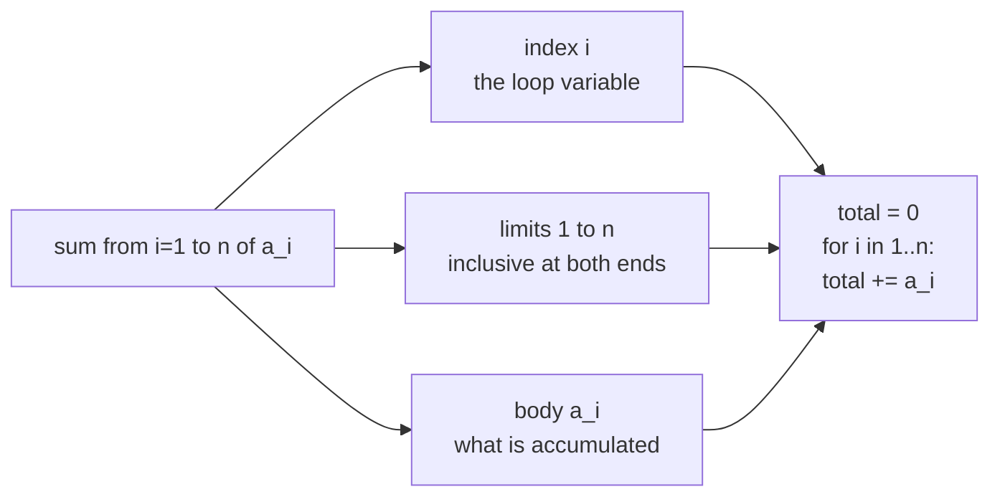

import DataCampExercise from "../../../../components/DataCampExercise.astro";
import Figure from "../../../../components/Figure.astro";
import Quiz from "../../../../components/Quiz.astro";

Ask someone which part of a machine learning paper they find hardest and they will name the model.
Watch them read one and the place they actually slow down is a double sum with a subscript on the
inner index. Sigma notation is not conceptually hard — it is a `for` loop with an accumulator — but
**manipulating** it is a skill, and it is the skill every derivation in this module assumes.

By the end of this page, $\sum_{n=1}^{N}\sum_{d=1}^{D} x_{nd}w_d$ should read as fluently as a nested
loop, and you should know when you are allowed to swap the two sums.

## What you'll learn

- How to read $\Sigma$ and $\Pi$ as loops, and how to translate either direction.
- The three rules that let you move things in and out of a sum, and why the third one fails for products.
- When a double sum can be swapped, and the one case where it cannot.
- The telescoping trick, which turns a long sum into two terms.
- Set-builder notation, membership, and the operations Chapter 2 uses on subspaces.
- The indicator function, which is how a condition becomes arithmetic.

## Intuition: a sum is a loop with an accumulator

$$
\sum_{i=1}^{n} a_i \;=\; a_1 + a_2 + \cdots + a_n
$$

Four things to read off, every time:

- **the index** — $i$, the loop variable,
- **the lower limit** — where it starts,
- **the upper limit** — where it stops, *inclusive*,
- **the body** — $a_i$, what gets added.



The inclusive upper limit is the one thing that trips programmers, because `range(1, n)` in Python
stops at $n-1$. The mathematical sum stops **at** $n$. In NumPy you almost never write the loop
anyway — the whole sum is `a.sum()` — but when you are checking a derivation against code, the
off-by-one lives here.

### A real-life example: the bill

A shopping basket has $n$ items. Item $i$ costs $p_i$ and you buy $q_i$ of it. The bill is

$$
\text{total} \;=\; \sum_{i=1}^{n} p_i q_i .
$$

That is a dot product, and it is also the only formula in this section. Every "weighted sum" in
machine learning — a linear model's prediction, an expectation, a loss over a dataset — is this same
shape: multiply pairwise, then add up.

## The math

### Rule 1: a constant factor comes out

$$
\sum_{i=1}^{n} c\,a_i \;=\; c\sum_{i=1}^{n} a_i
$$

Because $c$ does not depend on $i$, it is the same $c$ in every term, so it factors out. This is the
rule that lets $1/N$ move to the front of an average, and it is used on nearly every page of Chapter 8.

**The test for "does it depend on the index?"** is mechanical: does the symbol carry the index as a
subscript, or is it a function of it? $c$ does not, so it comes out. $a_i$ does, so it cannot.

### Rule 2: sums split over addition

$$
\sum_{i=1}^{n} (a_i + b_i) \;=\; \sum_{i=1}^{n} a_i \;+\; \sum_{i=1}^{n} b_i
$$

Adding a list of pairs is the same as adding the two lists separately. Combined with Rule 1 this
makes $\Sigma$ **linear**, which is why gradients pass through sums (§5.2) and why expectations do
(§6.4). Those two facts are the same fact.

### Rule 3: a constant body counts

$$
\sum_{i=1}^{n} c \;=\; n\,c
$$

The body does not mention $i$ at all, so the loop just runs $n$ times. Small, and constantly useful:
it is the step that turns $\sum_{i=1}^{N}\mu$ into $N\mu$ when you compute the mean of a Gaussian
likelihood.

### Reindexing: the limits and the body move together

$$
\sum_{i=1}^{n} a_i \;=\; \sum_{j=0}^{n-1} a_{j+1}
$$

The name of the index is arbitrary — it is a bound variable, exactly like a loop variable in code.
Shifting it by one means shifting both limits and the subscript in the body by one, in opposite
directions. Getting this wrong is the most common error in a hand derivation, and the fix is always
to **check one endpoint**: at $j = 0$ the right-hand side contributes $a_1$, which is what $i = 1$
contributes on the left. Endpoints agree, so the shift is right.

### Products: the same shape, one rule different

$$
\prod_{i=1}^{n} a_i \;=\; a_1 \times a_2 \times \cdots \times a_n
$$

Everything above transfers with multiplication in place of addition, **except Rule 1**:

$$
\prod_{i=1}^{n} c\,a_i \;=\; c^{\,n} \prod_{i=1}^{n} a_i
$$

The constant comes out **raised to the power $n$**, because it appeared in every one of the $n$
factors. This exact step is why the Gaussian likelihood of $N$ independent points carries a
$(2\pi\sigma^2)^{-N/2}$ out front (§6.5), and forgetting the exponent is a classic way to derive a
wrong normalising constant.

:::tip[The one identity that connects them]
$$
\log \prod_{i=1}^{n} a_i \;=\; \sum_{i=1}^{n} \log a_i
$$

A logarithm turns a product into a sum. That single line is why machine learning works with **log**
likelihoods rather than likelihoods: a product of $N$ small probabilities underflows to zero in
floating point, while the sum of $N$ logarithms does not. Chapter 8 takes the log of every likelihood
it meets, and this is the reason.
:::

### Double sums

$$
\sum_{i=1}^{m}\sum_{j=1}^{n} a_{ij}
$$

Two nested loops. The **inner** sum runs to completion for each value of the outer index. When the
limits are constants — neither depends on the other index — you may swap them freely:

$$
\sum_{i=1}^{m}\sum_{j=1}^{n} a_{ij} \;=\; \sum_{j=1}^{n}\sum_{i=1}^{m} a_{ij}
$$

Both sides add up the same $mn$ numbers; only the order changes, and addition does not care about
order. Thinking of $a_{ij}$ as a grid makes it obvious: one side sums the rows and then adds the row
totals, the other sums the columns and adds the column totals.

:::danger[When you may not swap]
If the inner limit depends on the outer index, swapping requires rewriting the limits:

$$
\sum_{i=1}^{n}\sum_{j=1}^{i} a_{ij} \;=\; \sum_{j=1}^{n}\sum_{i=j}^{n} a_{ij}
$$

The left side sums the **lower triangle** row by row; the right side sums the same triangle column by
column, and the limits had to change to describe it. Swapping without rewriting the limits silently
changes which terms you are adding, and the result is simply wrong. Triangular sums like this appear
in §4.3 (Cholesky) and in every covariance-matrix derivation.
:::

### Telescoping

If the body is a difference of consecutive terms, almost everything cancels:

$$
\sum_{i=1}^{n} (b_i - b_{i-1}) \;=\; b_n - b_0
$$

Write it out and every interior term appears once with a plus and once with a minus. What survives is
the two endpoints. This is the discrete version of the Fundamental Theorem of Calculus, which
[the calculus refresher](../single-variable-calculus-refresher/) makes explicit, and it is the trick
behind the monotone-improvement proof of EM in Chapter 11.

## Worked example by hand

Take $n = 5$ with $a_i = i$ and $b_i = 2$, and check every rule against arithmetic.

| rule | expression | expansion | value |
| --- | --- | --- | --- |
| plain sum | $\sum_{i=1}^{5} i$ | $1+2+3+4+5$ | $15$ |
| Rule 1 | $\sum_{i=1}^{5} 3i$ | $3(1+2+3+4+5)$ | $45$ |
| Rule 2 | $\sum_{i=1}^{5}(i+2)$ | $15 + 5\cdot 2$ | $25$ |
| Rule 3 | $\sum_{i=1}^{5} 2$ | $2+2+2+2+2$ | $10$ |
| reindexed | $\sum_{j=0}^{4}(j+1)$ | $1+2+3+4+5$ | $15$ |
| product | $\prod_{i=1}^{5} i$ | $1\cdot2\cdot3\cdot4\cdot5$ | $120$ |
| product, Rule 1 | $\prod_{i=1}^{5} 3i$ | $3^5 \cdot 120$ | $29160$ |
| telescoping, $b_i = i^2$ | $\sum_{i=1}^{5}(i^2-(i-1)^2)$ | $25 - 0$ | $25$ |

The last row is worth pausing on. The body expands to $2i - 1$, so the sum is
$1+3+5+7+9 = 25$ — the sum of the first five odd numbers is $5^2$. Telescoping gave the answer
without adding anything.

Now the double sum. With $a_{ij} = i\cdot j$ over $i = 1,2,3$ and $j = 1,2$:

| $a_{ij}$ | $j=1$ | $j=2$ | row total |
| --- | --- | --- | --- |
| $i=1$ | $1$ | $2$ | $3$ |
| $i=2$ | $2$ | $4$ | $6$ |
| $i=3$ | $3$ | $6$ | $9$ |
| **column total** | $6$ | $12$ | $\mathbf{18}$ |

Rows first: $3 + 6 + 9 = 18$. Columns first: $6 + 12 = 18$. Same answer, which is the swap rule made
concrete. And note $18 = (1+2+3)(1+2) = 6 \times 3$ — when the body **factorises** as
$a_{ij} = u_i v_j$, the double sum factorises into a product of two single sums. That observation
turns up whenever an expectation splits over independent variables (§6.4).

## See it move

Drag the limits. The highlighted cells are the terms the sum currently collects, and the running
total is what a loop would accumulate.

```p5 title="Which terms does this sum actually collect?" desc="Drag the lower and upper limit knobs and watch which terms the sum picks up. The second knob row switches to a triangular inner limit, where the collected set becomes a triangle rather than a block." height="380"
let lo = 1, hi = 5, mode = 0;
let KNOBS = [], dragging = null;

function setup() { createCanvas(600, 380); textFont("monospace"); }

function knob(id, x, y, w, value, mn, mx, label) {
  KNOBS.push({ id, x, y, w, mn, mx });
  const t = (value - mn) / (mx - mn);
  stroke(60, 74, 92); strokeWeight(2); line(x, y, x + w, y);
  noStroke(); fill(255, 211, 67); ellipse(x + t * w, y, 12, 12);
  fill(190, 200, 212); textSize(12); textAlign(LEFT, CENTER);
  text(label, x + w + 12, y);
}
function knobHit(mx_, my_) {
  for (const k of KNOBS) {
    if (my_ > k.y - 13 && my_ < k.y + 13 && mx_ > k.x - 13 && mx_ < k.x + k.w + 13) return k;
  }
  return null;
}
function knobValue(k, mx_) {
  const t = Math.min(1, Math.max(0, (mx_ - k.x) / k.w));
  return Math.round(k.mn + t * (k.mx - k.mn));
}
function mousePressed() { dragging = knobHit(mouseX, mouseY); }
function mouseReleased() { dragging = null; }
function mouseDragged() {
  if (!dragging) return;
  const v = knobValue(dragging, mouseX);
  if (dragging.id === "lo") lo = Math.min(v, hi);
  if (dragging.id === "hi") hi = Math.max(v, lo);
  if (dragging.id === "mode") mode = v;
  if (!isLooping()) redraw();
}

function draw() {
  background(13, 17, 23);
  KNOBS = [];

  const N = 8;
  const cell = 44, ox = 60, oy = 92;

  noStroke(); fill(255, 211, 67); textSize(15); textAlign(LEFT, TOP);
  text(mode === 0 ? "single sum over i" : "double sum, inner limit j = 1..i", 16, 14);

  fill(200); textSize(13);
  if (mode === 0) {
    text(`sum from i=${lo} to ${hi} of a_i     a_i = i`, 16, 40);
  } else {
    text(`sum i=${lo}..${hi}, sum j=1..i, of i*j`, 16, 40);
  }

  let total = 0, terms = 0;

  if (mode === 0) {
    for (let i = 1; i <= N; i++) {
      const x = ox + (i - 1) * cell, y = oy;
      const inside = i >= lo && i <= hi;
      if (inside) { total += i; terms++; }
      stroke(inside ? color(255, 211, 67) : color(50, 62, 76)); strokeWeight(inside ? 2 : 1);
      fill(inside ? color(255, 211, 67, 40) : color(20, 26, 34));
      rect(x, y, cell - 6, cell - 6, 4);
      noStroke(); fill(inside ? 255 : 90); textSize(14); textAlign(CENTER, CENTER);
      text(i, x + (cell - 6) / 2, y + (cell - 6) / 2);
      noStroke(); fill(110); textSize(10);
      text("i=" + i, x + (cell - 6) / 2, y + cell + 4);
    }
  } else {
    for (let i = 1; i <= 6; i++) {
      for (let j = 1; j <= 6; j++) {
        const x = ox + (j - 1) * cell, y = oy + (i - 1) * 38;
        const inside = i >= lo && i <= hi && j <= i;
        if (inside) { total += i * j; terms++; }
        stroke(inside ? color(255, 211, 67) : color(40, 50, 62)); strokeWeight(inside ? 1.8 : 1);
        fill(inside ? color(255, 211, 67, 40) : color(18, 24, 32));
        rect(x, y, cell - 8, 32, 3);
        noStroke(); fill(inside ? 245 : 74); textSize(12); textAlign(CENTER, CENTER);
        text(i * j, x + (cell - 8) / 2, y + 16);
      }
      noStroke(); fill(110); textSize(10); textAlign(RIGHT, CENTER);
      text("i=" + i, ox - 8, oy + (i - 1) * 38 + 16);
    }
  }

  // controls
  knob("lo", 60, mode === 0 ? 208 : 320, 150, lo, 1, 8, `lower limit = ${lo}`);
  knob("hi", 60, mode === 0 ? 236 : 344, 150, hi, 1, 8, `upper limit = ${hi}`);
  knob("mode", 60, mode === 0 ? 264 : 368, 60, mode, 0, 1, mode === 0 ? "single sum" : "triangular");

  noStroke(); textAlign(LEFT, TOP);
  fill(120, 200, 140); textSize(14);
  text(`terms collected: ${terms}    total = ${total}`, 300, mode === 0 ? 202 : 316);
  fill(150); textSize(11);
  text("drag the amber handles", 300, mode === 0 ? 224 : 338);
}
```

Two things to notice. Moving the lower limit up **removes terms from the front** — the sum does not
slide, it shrinks. And on the triangular setting the collected cells form a staircase, not a block:
that is the shape the swap rule has to preserve, and it is why the limits change when you swap.

## Sets

A sum runs over an index. A **set** is what you run over when there is no natural order.

$$
\mathcal{A} = \{1, 3, 5, 7\}, \qquad
\mathcal{B} = \{x \in \mathbb{R} : x > 0\}
$$

The second is **set-builder** notation, and it reads left to right as: "the set of $x$ drawn from
$\mathbb{R}$ such that $x > 0$". The colon is "such that"; some authors use a vertical bar instead.

| notation | meaning |
| --- | --- |
| $a \in \mathcal{A}$ | $a$ is an element of $\mathcal{A}$ |
| $a \notin \mathcal{A}$ | $a$ is not an element |
| $\mathcal{A} \subseteq \mathcal{B}$ | every element of $\mathcal{A}$ is in $\mathcal{B}$ |
| $\mathcal{A} \cup \mathcal{B}$ | union: in $\mathcal{A}$, or in $\mathcal{B}$, or both |
| $\mathcal{A} \cap \mathcal{B}$ | intersection: in both |
| $\mathcal{A} \setminus \mathcal{B}$ | in $\mathcal{A}$ but not in $\mathcal{B}$ |
| $\mathcal{A} \times \mathcal{B}$ | Cartesian product: all ordered pairs $(a, b)$ |
| $\emptyset$ | the empty set |
| $\lvert\mathcal{A}\rvert$ | cardinality: how many elements |

Three of these do specific jobs later:

- **$\subseteq$** is the definition of a subspace (§2.4): a subset that is itself a vector space.
- **$\cap$** is how the orthogonal complement is characterised (§3.6), and how a feasible region is built from several constraints (§7.2).
- **$\times$** is why $\mathbb{R}^2$ is written $\mathbb{R}\times\mathbb{R}$ and why a joint distribution lives on a product space (§6.1).

:::caution[A set has no duplicates and no order]
$\{1, 1, 2\}$ is the same set as $\{2, 1\}$. If order matters you want a **tuple**, written with
round brackets: $(1, 2) \neq (2, 1)$. The book leans on this distinction for bases — see the three
B's in [Notation and Symbols](../notation-and-symbols/) — and a Python `set` behaves exactly the same
way, which makes it easy to check.
:::

### The indicator function

The bridge from a condition to arithmetic:

$$
\mathbb{1}[\text{condition}] = \begin{cases} 1 & \text{if the condition holds} \\ 0 & \text{otherwise} \end{cases}
$$

It lets a *count* be written as a *sum*. The number of correct predictions is

$$
\sum_{n=1}^{N} \mathbb{1}[\hat{y}_n = y_n],
$$

and dividing by $N$ gives accuracy. In NumPy the indicator is a boolean array and the sum is
`(y_hat == y).sum()`, because `True` behaves as $1$. That equivalence is not a coincidence of the
language — it is the indicator function, implemented.

The zero-one loss of §8.2, the responsibilities of §11.3 and the hinge-loss counting argument of
§12.2 are all indicator sums.

## From scratch

```python title="sums_and_sets.py" showLineNumbers{1}
import numpy as np

a = np.arange(1, 6)                     # a_i = i for i = 1..5
print("sum:", a.sum())                              # 15
print("Rule 1  sum 3a_i == 3 sum a_i:", (3 * a).sum() == 3 * a.sum())
print("Rule 2  sum(a+b) == sum a + sum b:",
      (a + 2).sum() == a.sum() + np.full(5, 2).sum())
print("Rule 3  sum of a constant:", np.full(5, 2).sum())        # 10
print("product:", a.prod())                                      # 120
print("Rule 1 for products, c^n:", (3 * a).prod(), "==", 3**5 * a.prod())

# Telescoping: sum of (i^2 - (i-1)^2) collapses to the endpoints.
b = np.arange(0, 6) ** 2                # b_0..b_5
print("telescoped:", np.diff(b).sum(), "== b_5 - b_0 =", b[-1] - b[0])

# Double sums: axis is the index you sum OVER.
A = np.outer(np.arange(1, 4), np.arange(1, 3))    # a_ij = i*j, 3x2
print("rows first:", A.sum(axis=1).sum(), " columns first:", A.sum(axis=0).sum())
print("factorises:", A.sum(), "==", np.arange(1, 4).sum() * np.arange(1, 3).sum())

# Triangular sum: the mask IS the inner limit j <= i.
i, j = np.indices((6, 6)) + 1
tri = np.where(j <= i, i * j, 0)
print("lower triangle:", tri.sum())

# The indicator function is a boolean array.
y      = np.array([1, 0, 1, 1, 0])
y_hat  = np.array([1, 0, 0, 1, 0])
print("correct:", (y_hat == y).sum(), "of", y.size,
      " accuracy:", (y_hat == y).mean())

# Sets: unordered, no duplicates.
print({1, 1, 2} == {2, 1}, "  but tuples keep order:", (1, 2) == (2, 1))
```

```
sum: 15
Rule 1  sum 3a_i == 3 sum a_i: True
Rule 2  sum(a+b) == sum a + sum b: True
Rule 3  sum of a constant: 10
product: 120
Rule 1 for products, c^n: 29160 == 29160
telescoped: 25 == b_5 - b_0 = 25
rows first: 18  columns first: 18
factorises: 18 == 18
lower triangle: 266
correct: 4 of 5  accuracy: 0.8
True   but tuples keep order: False
```

:::caution[The axis argument names the index you sum away]
`A.sum(axis=0)` collapses the **first** index, leaving one number per column. Read it as
"$\sum_i a_{ij}$", not "sum along the rows" — that phrasing is ambiguous and is the reason `axis`
mistakes are so common. Naming the index you are eliminating removes the ambiguity entirely.
:::

## On real data

Three claims made above are worth measuring rather than believing. Every number in these figures was
computed, not estimated.

<Figure
  src="/images/mml/sums-products-and-set-notation/double-sum-as-a-grid"
  alt="Three four-by-four grids of the numbers 11 through 44. The first has every cell highlighted, with row totals 50, 90, 130, 170 and column totals 104, 108, 112, 116 both summing to 440. The second highlights the lower triangle, ten cells totalling 320. The third highlights the upper triangle, ten cells totalling 230."
  title="A double sum is a grid, and the limits choose the cells"
  caption="With constant limits, adding row totals and adding column totals both give 440, so the swap is free. With a triangular limit, swapping the index names without rewriting the limits selects the transposed set: 230 instead of 320."
/>

<Figure
  src="/images/mml/sums-products-and-set-notation/log-turns-products-into-sums"
  alt="Two panels. Left, a log-scale plot of 0.01 to the power N falling off the bottom of the axis, with a dotted line marking where the value becomes subnormal at N equals 154 and a dashed line where it becomes exactly zero at N equals 162. Right, the sum of logarithms falling linearly and passing through minus 746 at N equals 162 with no discontinuity."
  title="Why every likelihood in this module is logged"
  caption="A product of 162 probabilities of 0.01 is not small in float64, it is the number zero. The equivalent sum of logarithms is minus 746 at the same point, and keeps going."
/>

<Figure
  src="/images/mml/sums-products-and-set-notation/constant-out-of-a-product"
  alt="Two panels. Left, the base-ten logarithm of the correct Gaussian normalising constant falling linearly with N against the flat line of the version with the exponent dropped. Right, the base-ten logarithm of the ratio between them rising linearly, annotated at N equals 10, 50, 100 and 200 with the values 4, 20, 39 and 79."
  title="A constant leaves a product raised to the power N"
  caption="Dropping the exponent when pulling a constant out of a product is not a small error. At one hundred data points the two normalising constants differ by a factor of ten to the thirty-ninth."
/>

## Reading the plot

**The first figure settles when you may swap.** In the left panel the limits do not mention the other
index, so both orders add up the same sixteen numbers and both reach $440$ — the row totals
$50 + 90 + 130 + 170$ and the column totals $104 + 108 + 112 + 116$ are different decompositions of
one number. In the middle panel the inner limit is $j \leq i$, which selects ten cells totalling
$320$. The right panel is what happens if you write $\sum_j \sum_{i \leq j}$ and stop there: it
selects the ten cells of the *upper* triangle, totalling $230$. The grid is deliberately asymmetric —
$a_{ij} = 10i + j$, so $a_{23} = 23$ while $a_{32} = 32$ — because on a symmetric grid the two
triangles would agree and this bug would be invisible in testing. Being $90$ out of $320$ wrong, or
$28\%$, is the kind of error that produces a plausible-looking but incorrect gradient.

**The second figure is the practical reason for logarithms.** Reading the left panel: the product
stays representable for a while, drifts into the subnormal range at $N = 154$ where it starts losing
precision silently, and reaches **exactly** `0.0` at $N = 162$. Not a small number — zero. Its
logarithm is $-\infty$, its gradient is undefined, and any optimiser handed it stops. The right panel
plots the same quantity as $\sum_i \log p_i$, which at $N = 162$ is $-746.0$: an ordinary float with
plenty of room left. Nothing about the mathematics changed, only which of two algebraically identical
expressions was evaluated. A likelihood over even a small dataset has thousands of factors, which is
why you will not see an unlogged one anywhere in Chapters 8 to 12.

**The third figure prices the exponent.** The correct constant $(2\pi\sigma^2)^{-N/2}$ falls linearly
on a log axis because each of the $N$ factors contributes; the version that pulls $2\pi\sigma^2$ out
just once is flat. The right panel is the ratio, and it grows without bound: $10^{4}$ at ten points,
$10^{39}$ at a hundred, $10^{79}$ at two hundred. If you are optimising $\boldsymbol\mu$ and
$\sigma^2$ this error is a constant with respect to $\boldsymbol\mu$, so the mean you recover is
still right — which is precisely why the mistake survives. It is *not* constant with respect to
$\sigma^2$, so the variance you recover is wrong, and nothing in the fit will tell you.

## Pitfalls

:::caution[Inclusive limits]
$\sum_{i=1}^{n}$ includes $i = n$. Python's `range(1, n)` does not. Translating a formula to code
means `range(1, n + 1)`, or better, vectorising so the question does not arise.
:::

:::caution[Reusing an index name]
$\sum_{i}\left(\sum_{i} a_i\right)$ is meaningless: the inner $i$ shadows the outer one. Nested sums
need distinct index names, exactly as nested loops do.
:::

:::danger[Swapping a dependent limit]
$\sum_{i=1}^{n}\sum_{j=1}^{i}$ is **not** $\sum_{j=1}^{i}\sum_{i=1}^{n}$ — the second is not even
well-formed, because $i$ is not defined outside its own sum. Rewrite the limits: $\sum_{j=1}^{n}\sum_{i=j}^{n}$.
:::

:::danger[Pulling a constant out of a product]
$\prod c\,a_i = c^n \prod a_i$, not $c\prod a_i$. This is where a $(2\pi\sigma^2)^{-N/2}$ comes from,
and dropping the exponent gives a likelihood that does not integrate to one.
:::

:::caution[A set is not a list]
Writing $\{\mathbf{b}_1, \mathbf{b}_2\}$ for a basis discards the order, so it cannot tell you which
coordinate is which. When coordinates matter the book writes a tuple. This is a real distinction, not
pedantry: coordinate vectors are meaningless without an ordered basis.
:::

## Compare

| you want to | sum | product |
| --- | --- | --- |
| pull out a constant | $c$ comes out unchanged | $c$ comes out as $c^n$ |
| split over $+$ | yes, $\Sigma$ is linear | no |
| empty range | $0$, the additive identity | $1$, the multiplicative identity |
| turn into the other | $\exp$ of a sum is a product | $\log$ of a product is a sum |
| NumPy | `.sum()`, `np.add.reduce` | `.prod()`, `np.multiply.reduce` |
| numerical risk | catastrophic cancellation | underflow or overflow |

The empty-range row is not trivia: an empty sum is $0$ and an empty product is $1$, and both
conventions make edge cases in recursive derivations work without a special case.

<Quiz
  title="Check yourself"
  questions={[
    {
      q: "You need to pull the constant three out of a product of n terms. What comes out?",
      options: ["Three", "Three to the power n", "Three times n", "Nothing — constants cannot be factored out of products"],
      answer: 1,
      explain:
        "The constant appeared in every one of the n factors, so it comes out raised to the n. This is exactly the step that produces the normalising constant in an i.i.d. Gaussian likelihood.",
    },
    {
      q: "A double sum has an inner limit that runs from one up to the outer index. Can you swap the two sums?",
      options: [
        "Yes, freely — addition is commutative",
        "Yes, but the limits must be rewritten so they describe the same triangle",
        "No, never",
        "Only if the body factorises",
      ],
      answer: 1,
      explain:
        "The same terms are being added either way, so a swap is possible, but the limits describe the region and must be rewritten to describe it column-wise instead of row-wise.",
    },
    {
      q: "Why does machine learning almost always work with log likelihoods rather than likelihoods?",
      options: [
        "Logarithms are faster to compute",
        "A logarithm turns the product into a sum, which avoids floating-point underflow",
        "The logarithm changes where the maximum is, which makes it easier to find",
        "It is only a notational convention",
      ],
      answer: 1,
      explain:
        "A product of many small probabilities underflows to zero; the sum of their logarithms does not. And because the logarithm is increasing, the maximum does not move — which is what makes the substitution legitimate.",
    },
    {
      q: "In NumPy, what does summing with axis equal to zero do to a two-dimensional array?",
      options: [
        "Collapses the first index, leaving one value per column",
        "Collapses the second index, leaving one value per row",
        "Sums everything into a single number",
        "Sums along the diagonal",
      ],
      answer: 0,
      explain:
        "The axis names the index being eliminated. Collapsing the first index leaves one entry per column. Reading it as the index you sum away, rather than as a direction, removes the ambiguity that makes this error so common.",
    },
  ]}
/>

## 🧪 Try It Yourself

### Exercise 1 – A sum is a loop

<DataCampExercise
  lang="python"
  hint={`np.arange(1, 11) gives 1..10 because the upper bound is exclusive. Then call .sum().`}
  code={`import numpy as np

# Task: compute the sum of i for i = 1 to 10, inclusive.
a = np.arange(1, ___)      # replace ___ so the array is 1..10
print("sum:", a.sum())

# -- Expected output ------------------------------
# sum: 55
# -------------------------------------------------`}
  solution={`import numpy as np
a = np.arange(1, 11)
print("sum:", a.sum())`}
  sct={`test_output_contains("sum: 55")
success_msg("An inclusive upper limit of 10 needs an exclusive 11 in arange — that is the off-by-one to watch.")`}
  height={150}
/>

### Exercise 2 – The constant comes out squared, cubed, ...

<DataCampExercise
  lang="python"
  hint={`Pulling c out of a product of n factors gives c**n. Here n is len(a).`}
  code={`import numpy as np

a = np.arange(1, 5)          # 1, 2, 3, 4  -> n = 4
c = 2

left  = (c * a).prod()
right = c**___ * a.prod()    # replace ___ with the right exponent
print("equal:", left == right, " value:", left)

# -- Expected output ------------------------------
# equal: True  value: 384
# -------------------------------------------------`}
  solution={`import numpy as np
a = np.arange(1, 5)
c = 2
left  = (c * a).prod()
right = c**len(a) * a.prod()
print("equal:", left == right, " value:", left)`}
  sct={`test_output_contains("equal: True")
success_msg("Four factors, so c comes out to the fourth power. 16 x 24 = 384.")`}
  height={175}
/>

### Exercise 3 – Telescoping

<DataCampExercise
  lang="python"
  hint={`np.diff gives consecutive differences. Their sum is the last element minus the first.`}
  code={`import numpy as np

b = np.arange(0, 8) ** 3          # b_i = i^3 for i = 0..7

telescoped = np.diff(b).sum()
endpoints  = b[-1] - b[___]       # replace ___ so this is b_7 - b_0
print("telescoped:", telescoped, " endpoints:", endpoints)

# -- Expected output ------------------------------
# telescoped: 343  endpoints: 343
# -------------------------------------------------`}
  solution={`import numpy as np
b = np.arange(0, 8) ** 3
telescoped = np.diff(b).sum()
endpoints  = b[-1] - b[0]
print("telescoped:", telescoped, " endpoints:", endpoints)`}
  sct={`test_output_contains("telescoped: 343")
success_msg("Everything in the middle cancelled. 343 is 7 cubed, and b_0 was zero.")`}
  height={175}
/>

### Exercise 4 – Swapping a triangular double sum

<DataCampExercise
  lang="python"
  hint={`Row-wise the inner index runs 1..i. Column-wise it runs i from j..n. Build both with a mask on np.indices.`}
  code={`import numpy as np

n = 5
i, j = np.indices((n, n)) + 1        # 1-based index grids

rows_first = np.where(j <= i, i * j, 0).sum()      # inner j = 1..i
cols_first = np.where(i >= ___, i * j, 0).sum()    # replace ___ so inner i = j..n
print("rows:", rows_first, " cols:", cols_first, " equal:", rows_first == cols_first)

# -- Expected output ------------------------------
# rows: 140  cols: 140  equal: True
# -------------------------------------------------`}
  solution={`import numpy as np
n = 5
i, j = np.indices((n, n)) + 1
rows_first = np.where(j <= i, i * j, 0).sum()
cols_first = np.where(i >= j, i * j, 0).sum()
print("rows:", rows_first, " cols:", cols_first, " equal:", rows_first == cols_first)`}
  sct={`test_output_contains("equal: True")
success_msg("j <= i and i >= j describe the same triangle. The swap is legal once the limits say so.")`}
  height={185}
/>

### Exercise 5 – An indicator sum is an accuracy

<DataCampExercise
  lang="python"
  hint={`Comparing two arrays gives booleans, and booleans sum as 1 and 0. Dividing the count by the size is the mean.`}
  code={`import numpy as np

y     = np.array([1, 0, 1, 1, 0, 1, 0, 0])
y_hat = np.array([1, 0, 0, 1, 0, 1, 1, 0])

correct  = (y_hat == y).___()       # replace ___ to count the matches
accuracy = correct / y.size
print("correct:", correct, " accuracy:", accuracy)

# -- Expected output ------------------------------
# correct: 6  accuracy: 0.75
# -------------------------------------------------`}
  solution={`import numpy as np
y     = np.array([1, 0, 1, 1, 0, 1, 0, 0])
y_hat = np.array([1, 0, 0, 1, 0, 1, 1, 0])
correct  = (y_hat == y).sum()
accuracy = correct / y.size
print("correct:", correct, " accuracy:", accuracy)`}
  sct={`test_output_contains("accuracy: 0.75")
success_msg("That sum of booleans IS the indicator sum from the section above, implemented.")`}
  height={185}
/>

:::tip[From the book]
This page covers notation the book uses everywhere rather than one of its numbered sections. The
$\Sigma$ and $\Pi$ conventions, the $D$/$N$ indexing pairing and the set symbols
($\forall$, $\exists$, $\in$, $\emptyset$, $\mathcal{A}$, $\times$) come from the **Table of Symbols**
on page 6 of the December 2019 draft. The manipulations themselves are used without comment
throughout: index shifting in §2.2's matrix-product definition (Equation 2.13), double sums with
dependent limits in §4.3's Cholesky derivation, the log-of-a-product step at the start of §8.3, and
indicator sums in §8.2's zero-one loss.
:::

## Recall card

- **A sum is a loop with an accumulator** — index, inclusive lower limit, inclusive upper limit, body.
- **Sigma is linear**: a constant factors out and sums split over addition, which is why gradients and expectations both pass straight through a sum.
- **Pulling a constant out of a product raises it to the power n** — the source of the exponent in an i.i.d. likelihood's normalising constant.
- **Log turns a product into a sum**, which is the entire reason machine learning maximises log likelihoods.
- **Double sums with constant limits swap freely; dependent limits swap only after rewriting them** to describe the same region the other way round.
- **Telescoping** — a sum of consecutive differences collapses to the two endpoints, and it is the discrete Fundamental Theorem of Calculus.
- **An empty sum is zero and an empty product is one**, which is what makes recursive edge cases work without special-casing.
- **`axis` names the index you sum away**, not a direction — read `axis=0` as eliminating the first index.
- **The indicator function turns a condition into arithmetic**, and in NumPy it is just a boolean array being summed.

**Next:** what a function actually is, and the two properties Chapter 2 will demand of one —
**[Functions, Limits, and Continuity](../functions-limits-and-continuity/)**.
