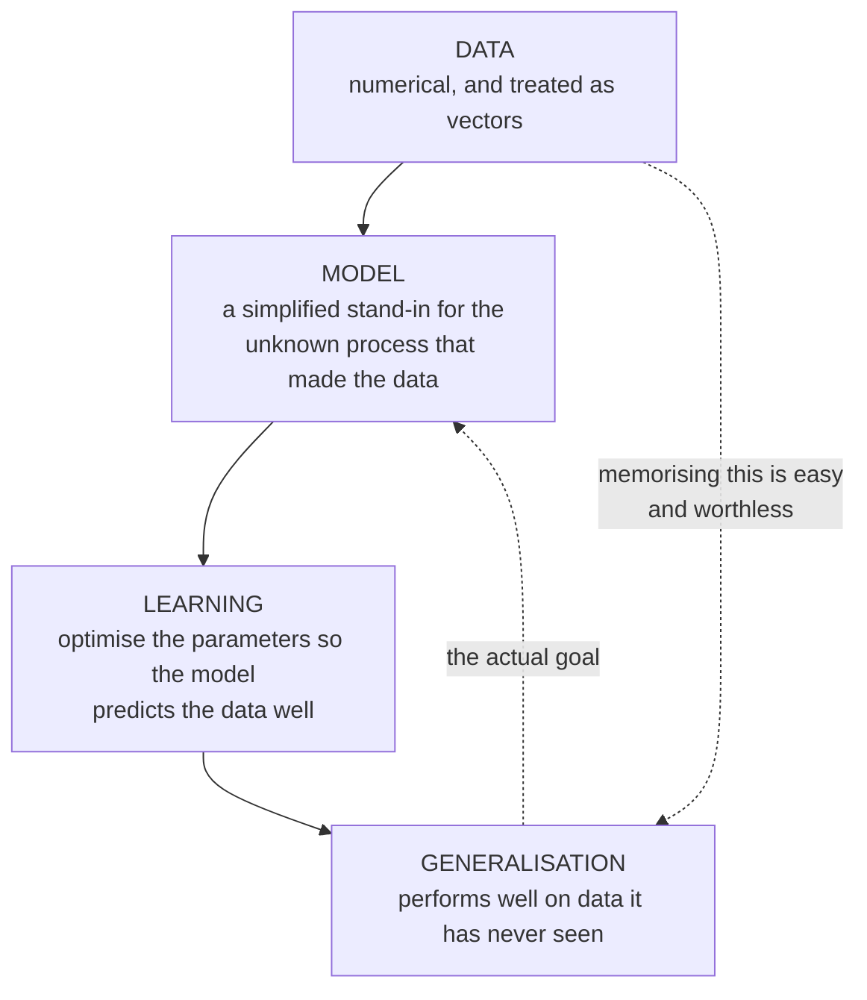

import DataCampExercise from "../../../../components/DataCampExercise.astro";
import Quiz from "../../../../components/Quiz.astro";

The book opens §1.1 with an unusual admission for a mathematics textbook: **the words are slippery,
and it is not going to fix that.** Its exact position is that it "will not resolve the issue of
ambiguity", only make the context clear enough to survive.

That is worth taking seriously rather than skimming past. Machine learning inherited its vocabulary
from statistics, from computer science, from optimisation and from neuroscience, and those fields did
not coordinate. The result is that a sentence like *"the algorithm learns a model from the data"*
contains three words with two or three meanings each — and the reason a paragraph sometimes refuses
to make sense is not that the mathematics is hard, but that you picked the wrong meaning three
sentences ago.

## What you'll learn

- The three concepts at the core of machine learning, in the book's own framing.
- Both senses of "machine learning algorithm", and why conflating them makes §8.1 unreadable.
- The three ways to think about a vector, and which chapters use which.
- What "model" means when it is a function, and what it means when it is a distribution.
- Why "learning" and "memorising" are different, and what generalisation has to do with it.

## Intuition: three concepts, and the arrow between them

$$
\underbrace{\text{data}}_{\text{what you have}}
\;\longrightarrow\;
\underbrace{\text{model}}_{\text{what you assume}}
\;\longrightarrow\;
\underbrace{\text{learning}}_{\text{how you fit it}}
$$

Machine learning is "designing algorithms that automatically extract valuable information from data",
and the emphasis the book puts on **automatic** is the whole point: the methods are meant to be
general-purpose, working across many datasets without much domain-specific expertise being hand-coded
into them.



The dotted arrow from data to generalisation carries the warning. Performing well on data you have
already seen "may only mean that we found a good way to memorise the data" — the book's own phrasing.
A lookup table scores perfectly on its training set and predicts nothing. Everything difficult in
Chapter 8 exists to tell those two situations apart.

### A real-life example: the estate agent

You want to price a house. You have a spreadsheet of past sales — that is **data**. You assume price
depends roughly linearly on floor area, bedroom count and distance to a station — that is a **model**,
and notice it is an *assumption*, not something the data handed you. You tune the three coefficients
until past sales are predicted well — that is **learning**.

Now the part that matters. You could instead memorise all 500 past sales exactly. Zero error on the
spreadsheet, useless on the next house. The linear model is *worse* on the data you have and better on
the data you want, and that trade is the subject of §8.2.

## The math, and the words

### "Algorithm" means two different things

The book flags this one first because it causes the most confusion:

| sense | what it names | the book's term |
| --- | --- | --- |
| 1 | a system that **makes predictions** from input data | a **predictor** |
| 2 | a system that **adapts internal parameters** so the predictor does well on unseen input | **training** |

Both are routinely called "the machine learning algorithm", *in the same paper*. Once you have the
two names, sentences that were ambiguous become clear:

- "the algorithm is $O(n^3)$" — almost always sense 2, the training cost.
- "the algorithm ran in 4 ms" — almost always sense 1, one prediction.
- "we compare three algorithms" — usually sense 1, three predictors, trained however.

There is a third sense the book mentions in passing and which trips people in Chapter 7: the
**numerical method inside** the training procedure. "Gradient descent" is an algorithm; so is "linear
regression"; so is "the fitted model". Three levels, one word.

:::tip[Why this is not pedantry]
§8.1 splits machine learning into three distinct phases — **prediction**, **training** and **model
selection** — and gives each its own mathematics. Reading that section while collapsing "predictor"
and "training" into one word makes it genuinely incomprehensible, because it is precisely *about* the
distinction. Ten minutes here saves an hour there.
:::

### Data means vectors

The book is explicit and slightly brutal about this: while not all data is numerical, it assumes data
"has already been appropriately converted into a numerical representation", and from then on **data
is vectors**.

That assumption hides an enormous amount of practical work — how you turn a sentence, an image or a
category into numbers is most of applied machine learning — and the book sets it aside deliberately so
it can be about the mathematics. Worth knowing that the boundary is a choice, not an oversight.

And then, as the book says, "as another illustration of how subtle words are", **vector** itself has
three readings:

| view | a vector is | who thinks this way | where it is used here |
| --- | --- | --- | --- |
| computer science | an **array** of numbers | programmers | §2.2, and all NumPy code |
| physics | an **arrow** with direction and magnitude | physicists, geometers | Chapter 3, all the p5 sketches |
| mathematics | any **object that obeys addition and scaling** | mathematicians | §2.4, the definition that matters |

The third is the one Chapter 2 actually adopts, and the payoff is surprising: because the definition
demands only addition and scaling, **polynomials are vectors**, and so are audio signals, and so are
functions. §3.7 computes the angle between two functions using exactly this, and it is not a metaphor
— they satisfy the same axioms.

The three views are not competing. They are three faces of one object, and fluency means switching
between them without noticing: an array for the code, an arrow for the intuition, an axiom-satisfier
for the proof.

### Model means two different things too

$$
\text{model as a function:}\quad f: \mathbb{R}^D \to \mathbb{R}
\qquad\qquad
\text{model as a distribution:}\quad p(\mathbf{x}, y)
$$

A **model** is a simplified stand-in for the unknown process that generated the data — "a good model
can then be used to predict what would happen in the real world without performing real-world
experiments". But it comes in two mathematical shapes:

- **A function.** $f(\mathbf{x}) = y$. Feed it features, get a prediction. No uncertainty, and no way
  to express any.
- **A distribution.** $p(\mathbf{x}, y)$. It describes how likely each pairing is, which lets you ask
  "how confident is this?" as a mathematical question rather than a vibe.

§8.1 develops both, and the choice determines almost everything downstream: least squares with a
function view is an optimisation problem, and least squares with a distribution view is maximum
likelihood under Gaussian noise (§9.1). **Same estimator, two stories** — and only the second one
tells you where the error bars come from.

### Learning means two different things

$$
\text{parametric learning:}\quad \boldsymbol\theta^* = \arg\max_{\boldsymbol\theta}\; U(\boldsymbol\theta; \mathcal{D})
$$

**Training** the model means using the data to optimise some parameters $\boldsymbol\theta$ against a
utility function that scores how well the model predicts. The book gives the analogy directly: most
training methods are "analogous to climbing a hill to reach its peak", where the peak is the maximum
of the performance measure. Chapter 7 is that hill-climb, done properly, and Chapter 5 supplies the
gradient that tells you which way is up.

The second sense of learning is **non-parametric**: some methods have nothing to optimise, and "learn"
by keeping the data. $k$-nearest-neighbours is the standard example — training is storing the dataset.
Both are called learning; only one involves a hill.

:::caution[Learning is not memorising, and the difference is the whole subject]
The goal is a model that "generalises well to yet unseen data, which we may care about in the future".
Performing well on the training data is easy and does not imply that at all.

This is the sentence Chapter 8 turns into mathematics — empirical risk versus expected risk, and
cross-validation as the machinery for estimating the gap. Every regularisation term in the book exists
because of it.
:::

### The three bullets the whole book reduces to

The book closes §1.1 by compressing itself into three lines, and they are worth memorising because
each one names the chapters that deliver it:

1. **We represent data as vectors.** — Chapters 2, 3, 4.
2. **We choose an appropriate model**, using either the probabilistic or the optimisation view. — Chapters 6, 8.
3. **We learn from available data by numerical optimisation**, aiming to do well on data not used for training. — Chapters 5, 7, 8.

Every remaining page in this module serves one of those three sentences.

## Worked example: one sentence, eight readings

Take the sentence

> *"The algorithm learns a model from the data."*

and count the readings. Two senses of "algorithm", two of "model", two of "learn" — eight
combinations, of which these four are ones people actually mean:

| algorithm | model | learn | what the sentence then means |
| --- | --- | --- | --- |
| training procedure | function | optimise parameters | gradient descent fits the weights of a network |
| training procedure | distribution | optimise parameters | maximum likelihood fits a Gaussian's mean and variance |
| predictor | function | store data | a nearest-neighbour classifier keeps the training set |
| numerical method | function | optimise parameters | L-BFGS minimises a logistic-regression objective |

The other four are combinations nobody intends but a reader can accidentally construct. That is the
failure mode: not misunderstanding the mathematics, but silently choosing reading 3 while the author
meant reading 1.

**The habit that fixes it:** when a sentence stops making sense, do not reread it harder. Substitute
the specific term — predictor, training procedure, numerical method — and see which substitution makes
the sentence true. Usually only one does.

## See it move

One dataset, three framings. Drag the framing knob and watch the same eight points get re-described:
as an array of numbers, as arrows from the origin, and as a fitted model with residuals. Nothing about
the data changes — only what you are being asked to see.

```p5 title="One dataset, three ways of looking at it" desc="Drag the framing knob through the computer-science view (an array), the physics view (arrows with direction and magnitude) and the modelling view (a fitted line with residuals). The numbers never change." height="420"
let view = 0, w = 0.62, b = 0.35;
let KNOBS = [], dragging = null;

// Eight points. Fixed, so the three views are demonstrably the same data.
const XS = [0.4, 0.9, 1.3, 1.7, 2.2, 2.6, 3.0, 3.4];
const YS = [0.7, 0.9, 1.4, 1.3, 1.9, 1.8, 2.5, 2.4];

function setup() { createCanvas(600, 420); textFont("monospace"); }

function knob(id, x, y, wd, value, mn, mx, label) {
  KNOBS.push({ id, x, y, w: wd, mn, mx });
  const t = (value - mn) / (mx - mn);
  stroke(60, 74, 92); strokeWeight(2); line(x, y, x + wd, y);
  noStroke(); fill(255, 211, 67); ellipse(x + t * wd, y, 12, 12);
  fill(190, 200, 212); textSize(12); textAlign(LEFT, CENTER);
  text(label, x + wd + 12, y);
}
function knobHit(mx_, my_) {
  for (const k of KNOBS) {
    if (my_ > k.y - 13 && my_ < k.y + 13 && mx_ > k.x - 13 && mx_ < k.x + k.w + 13) return k;
  }
  return null;
}
function knobRaw(k, mx_) {
  const t = Math.min(1, Math.max(0, (mx_ - k.x) / k.w));
  return k.mn + t * (k.mx - k.mn);
}
function mousePressed() { dragging = knobHit(mouseX, mouseY); }
function mouseReleased() { dragging = null; }
function mouseDragged() {
  if (!dragging) return;
  if (dragging.id === "view") view = Math.round(knobRaw(dragging, mouseX));
  if (dragging.id === "w") w = knobRaw(dragging, mouseX);
  if (dragging.id === "b") b = knobRaw(dragging, mouseX);
  if (!isLooping()) redraw();
}

function arrow(x1, y1, x2, y2, c, wt) {
  stroke(c); strokeWeight(wt); line(x1, y1, x2, y2);
  push(); translate(x2, y2); rotate(Math.atan2(y2 - y1, x2 - x1));
  fill(c); noStroke(); triangle(0, 0, -8, -3.5, -8, 3.5); pop();
}

function draw() {
  background(13, 17, 23);
  KNOBS = [];

  const ox = 90, oy = 300, U = 78;
  const sx = x => ox + x * U, sy = y => oy - y * U;

  const TITLES = ["computer science view", "physics view", "modelling view"];
  const SUBS = [
    "data is an ARRAY of numbers",
    "data is ARROWS with direction and magnitude",
    "data is something a MODEL should explain",
  ];

  noStroke(); textAlign(LEFT, TOP);
  fill(255, 211, 67); textSize(16); text(TITLES[view], 16, 12);
  fill(170); textSize(12); text(SUBS[view], 16, 34);

  // axes and grid, shared by all three views
  stroke(32, 44, 58); strokeWeight(1);
  for (let g = 0; g <= 4; g++) line(sx(g), sy(0), sx(g), sy(3));
  for (let g = 0; g <= 3; g++) line(sx(0), sy(g), sx(4), sy(g));
  stroke(58, 72, 88); strokeWeight(1.4);
  line(sx(0), sy(0), sx(4), sy(0)); line(sx(0), sy(0), sx(0), sy(3));

  if (view === 0) {
    // ---- array view: print the numbers, and index them --------------------
    for (let i = 0; i < XS.length; i++) {
      noStroke(); fill(75, 139, 190); ellipse(sx(XS[i]), sy(YS[i]), 8, 8);
    }
    noStroke(); textSize(11); textAlign(LEFT, TOP);
    fill(200); text("x = [", 340, 70);
    for (let i = 0; i < XS.length; i++) {
      fill(120, 200, 140);
      text(`  [${XS[i].toFixed(1)}, ${YS[i].toFixed(1)}],   # row ${i}`, 340, 86 + i * 15);
    }
    fill(200); text("]", 340, 86 + XS.length * 15);
    fill(150); text("shape (8, 2)", 340, 108 + XS.length * 15);
  } else if (view === 1) {
    // ---- arrow view: each row is an arrow from the origin ------------------
    for (let i = 0; i < XS.length; i++) {
      arrow(sx(0), sy(0), sx(XS[i]), sy(YS[i]), color(75, 139, 190), 1.8);
      const len = Math.hypot(XS[i], YS[i]);
      const ang = Math.atan2(YS[i], XS[i]) * 180 / Math.PI;
      noStroke(); fill(120); textSize(9); textAlign(LEFT, CENTER);
      text(`${len.toFixed(2)} @ ${ang.toFixed(0)} deg`, sx(XS[i]) + 6, sy(YS[i]));
    }
    noStroke(); fill(150); textSize(11); textAlign(LEFT, TOP);
    text("length and angle are what Chapter 3 measures", 300, 360);
  } else {
    // ---- modelling view: a line, and the residuals it leaves --------------
    stroke(255, 211, 67); strokeWeight(2.2);
    line(sx(0), sy(b), sx(4), sy(b + w * 4));
    let sse = 0;
    for (let i = 0; i < XS.length; i++) {
      const pred = b + w * XS[i];
      const r = YS[i] - pred;
      sse += r * r;
      stroke(232, 110, 110); strokeWeight(1.6);
      line(sx(XS[i]), sy(YS[i]), sx(XS[i]), sy(pred));
      noStroke(); fill(75, 139, 190); ellipse(sx(XS[i]), sy(YS[i]), 8, 8);
    }
    noStroke(); textAlign(LEFT, TOP); textSize(12);
    fill(232, 110, 110); text("red = residual, what the model fails to explain", 300, 330);
    fill(120, 200, 140); textSize(13);
    text(`sum of squared residuals = ${sse.toFixed(4)}`, 300, 352);
    fill(150); textSize(11);
    text("drag w and b to make it smaller — that is 'learning'", 300, 374);
  }

  knob("view", 60, 340, 90, view, 0, 2, "framing");
  if (view === 2) {
    knob("w", 60, 366, 150, w, 0.0, 1.2, `w = ${w.toFixed(2)}`);
    knob("b", 60, 392, 150, b, -0.4, 1.2, `b = ${b.toFixed(2)}`);
  }
}
```

The third framing is the one to sit with. Dragging $w$ and $b$ to shrink the sum of squared residuals
**is** learning, done by hand — and the hill-climbing analogy the book uses is exactly what your hand
is doing. Chapter 7 replaces your hand with a gradient.

## From scratch

The three views of a vector, and hand-rolled "learning", in one script.

```python title="three_views.py" showLineNumbers{1}
import numpy as np

X = np.array([0.4, 0.9, 1.3, 1.7, 2.2, 2.6, 3.0, 3.4])
Y = np.array([0.7, 0.9, 1.4, 1.3, 1.9, 1.8, 2.5, 2.4])
rows = np.c_[X, Y]

# ---- view 1: an array of numbers (computer science) ----
print("shape:", rows.shape, " dtype:", rows.dtype, " row 3:", rows[3])

# ---- view 2: arrows with length and direction (physics) ----
lengths = np.linalg.norm(rows, axis=1)
angles = np.degrees(np.arctan2(rows[:, 1], rows[:, 0]))
print("lengths:", np.round(lengths, 3))
print("angles :", np.round(angles, 1))

# ---- view 3: objects obeying addition and scaling (mathematics) ----
# The axioms do not mention numbers, so POLYNOMIALS are vectors too.
p = np.array([1.0, -2.0, 0.5])        # 1 - 2t + 0.5t^2, as coefficients
q = np.array([0.0,  3.0, 1.0])        #     3t +   1t^2
print("p + q is a polynomial:", p + q)
print("3p is a polynomial   :", 3 * p)

# ---- 'learning', by hand then properly ----
def sse(w, b):
    return float(((Y - (b + w * X)) ** 2).sum())

print("\nsse at w=0.62, b=0.35:", round(sse(0.62, 0.35), 4))
print("sse at w=0.55, b=0.40:", round(sse(0.55, 0.40), 4))

# The optimum, by least squares — Chapter 9 derives this formula.
A = np.c_[np.ones_like(X), X]
b_opt, w_opt = np.linalg.lstsq(A, Y, rcond=None)[0]
print("best b, w           :", round(b_opt, 4), round(w_opt, 4))
print("sse at the optimum  :", round(sse(w_opt, b_opt), 4))

# ---- memorising is not learning ----
# A lookup table is perfect on the training data and undefined off it.
table = dict(zip(X, Y))
print("\nlookup on a seen point   :", table[X[2]])
print("lookup on an unseen point:", table.get(1.5, "no idea"))
print("model on that same point :", round(b_opt + w_opt * 1.5, 4))
```

```
shape: (8, 2)  dtype: float64  row 3: [1.7 1.3]
lengths: [0.806 1.273 1.91  2.14  2.907 3.162 3.905 4.162]
angles : [60.3 45.  47.1 37.4 40.8 34.7 39.8 35.2]
p + q is a polynomial: [1.  1.  1.5]
3p is a polynomial   : [ 3.  -6.   1.5]

sse at w=0.62, b=0.35: 0.2291
sse at w=0.55, b=0.40: 0.3933
best b, w           : 0.4402 0.6051
sse at the optimum  : 0.1974

lookup on a seen point   : 1.4
lookup on an unseen point: no idea
model on that same point : 1.3478
```

The last three lines are the point of Chapter 8 in miniature. The lookup table is *perfect* on every
point it has seen and has literally nothing to say about $x = 1.5$. The fitted line is imperfect
everywhere and answers anyway. Only one of those is a model.

Note the two hand guesses. `w=0.62, b=0.35` scores $0.2291$; nudging to `w=0.55, b=0.40` makes it
**worse**, at $0.3933$ — so hand-tuning is not even reliably monotone. The true optimum is
`w=0.6051, b=0.4402`, scoring $0.1974$. Hand-tuning gets in the neighbourhood and cannot get to the
bottom, which is the argument for Chapter 7.

## Pitfalls

:::caution[Assuming "algorithm" means what it meant last paragraph]
Predictor, training procedure, or the numerical method inside the training procedure. The word does
not distinguish them and authors switch without warning. Substitute the specific term when a sentence
resists.
:::

:::caution[Forgetting that "data is vectors" was an assumption]
The book states it openly and then never revisits it. Turning text, images or categories into numbers
is where most real-world modelling effort goes, and none of it is in this book. That is a scope
decision, not a claim that the step is trivial.
:::

:::danger[Judging a model by its training performance]
It is the single most common mistake in applied machine learning and the book warns about it on its
second page. A model that fits the training data perfectly may have found "a good way to memorise"
it. §8.2 gives the vocabulary — empirical versus expected risk — and cross-validation gives the tool.
:::

:::caution[Thinking the function view and the distribution view are the same model]
They give the same point prediction and different everything else. Only the distribution view has
uncertainty in it, which is why §9.3's Bayesian linear regression can draw error bars and §9.2's
maximum likelihood cannot.
:::

## Compare

| word | sense A | sense B | how to tell |
| --- | --- | --- | --- |
| algorithm | the predictor | the training procedure | does the sentence talk about a prediction, or about fitting? |
| model | a function $f(\mathbf{x})$ | a distribution $p(\mathbf{x}, y)$ | is uncertainty being expressed? |
| learning | optimise parameters | store the data | is there anything to optimise? |
| vector | array, or arrow | an object obeying the axioms | is a proof being made, or a computation? |
| training data | the fitting sample | occasionally, everything not held out | is a validation split mentioned? |

<Quiz
  title="Check yourself"
  questions={[
    {
      q: "The book says the phrase machine learning algorithm is used in at least two senses. What are they?",
      options: [
        "Supervised and unsupervised",
        "A system that makes predictions, and a system that adapts the predictor's parameters",
        "Exact and approximate",
        "Linear and nonlinear",
      ],
      answer: 1,
      explain:
        "The first is what the book calls a predictor; the second is training. Section 8.1 gives each its own mathematics, so collapsing them makes that section unreadable.",
    },
    {
      q: "Why does the mathematical definition of a vector matter more than the array or arrow pictures?",
      options: [
        "It is more rigorous but has no practical consequence",
        "Because it only demands addition and scaling, it admits polynomials, audio signals and functions as vectors",
        "Because arrays cannot be added",
        "Because arrows only exist in two dimensions",
      ],
      answer: 1,
      explain:
        "The axioms mention nothing about components, so anything satisfying them is a vector. That is what lets section 3.7 compute the angle between two functions — not as an analogy, but as the same operation.",
    },
    {
      q: "A model scores zero error on its training set. What does that tell you?",
      options: [
        "It will generalise well",
        "Very little on its own — it may simply have memorised the training data",
        "The model is correctly specified",
        "The learning rate was well chosen",
      ],
      answer: 1,
      explain:
        "The book raises exactly this on its second page. A lookup table achieves zero training error and predicts nothing. Empirical risk and expected risk are different quantities, which is what section 8.2 is about.",
    },
    {
      q: "What is the practical difference between treating a model as a function and treating it as a distribution?",
      options: [
        "None — they always give the same answer",
        "The distribution view can express uncertainty, so it can produce error bars where the function view cannot",
        "The function view is always faster",
        "The distribution view only works for classification",
      ],
      answer: 1,
      explain:
        "They can agree exactly on the point prediction — least squares is both an optimisation problem and maximum likelihood under Gaussian noise — but only the distribution view says how confident the prediction is.",
    },
  ]}
/>

## 🧪 Try It Yourself

### Exercise 1 – Data as an array

<DataCampExercise
  lang="python"
  hint={`np.c_ stacks two 1-D arrays as columns, giving one row per data point.`}
  code={`import numpy as np

X = np.array([0.4, 0.9, 1.3, 1.7])
Y = np.array([0.7, 0.9, 1.4, 1.3])

rows = np.c_[X, ___]            # replace ___ so each row is one (x, y) pair
print("shape:", rows.shape)
print("row 2:", rows[2])

# -- Expected output ------------------------------
# shape: (4, 2)
# row 2: [1.3 1.4]
# -------------------------------------------------`}
  solution={`import numpy as np
X = np.array([0.4, 0.9, 1.3, 1.7])
Y = np.array([0.7, 0.9, 1.4, 1.3])
rows = np.c_[X, Y]
print("shape:", rows.shape)
print("row 2:", rows[2])`}
  sct={`test_output_contains("shape: (4, 2)")
success_msg("Four data points, two features each. That is the computer-science view — a grid of numbers.")`}
  height={175}
/>

### Exercise 2 – The same data as arrows

<DataCampExercise
  lang="python"
  hint={`np.linalg.norm with axis=1 gives one length per row.`}
  code={`import numpy as np

rows = np.array([[0.4, 0.7], [0.9, 0.9], [1.3, 1.4], [1.7, 1.3]])

lengths = np.linalg.norm(rows, axis=___)     # replace ___ to get one length per row
print("lengths:", np.round(lengths, 3))
print("count:", lengths.size)

# -- Expected output ------------------------------
# lengths: [0.806 1.273 1.91  2.14 ]
# count: 4
# -------------------------------------------------`}
  solution={`import numpy as np
rows = np.array([[0.4, 0.7], [0.9, 0.9], [1.3, 1.4], [1.7, 1.3]])
lengths = np.linalg.norm(rows, axis=1)
print("lengths:", np.round(lengths, 3))
print("count:", lengths.size)`}
  sct={`test_output_contains("count: 4")
success_msg("Four arrows, four lengths. Same numbers as the last exercise, different question asked of them.")`}
  height={175}
/>

### Exercise 3 – Polynomials really are vectors

<DataCampExercise
  lang="python"
  hint={`Vector space axioms need only addition and scalar multiplication. Add the coefficient arrays.`}
  code={`import numpy as np

p = np.array([1.0, -2.0, 0.5])      # 1 - 2t + 0.5t^2
q = np.array([0.0,  3.0, 1.0])      #     3t +   1t^2

total  = p ___ q                    # replace ___ so the polynomials are added
scaled = 3 * p

print("p + q:", total)
print("3p   :", scaled)
print("both are still length-3 coefficient vectors:", total.shape == p.shape == scaled.shape)

# -- Expected output ------------------------------
# p + q: [1.  1.  1.5]
# 3p   : [ 3.  -6.   1.5]
# both are still length-3 coefficient vectors: True
# -------------------------------------------------`}
  solution={`import numpy as np
p = np.array([1.0, -2.0, 0.5])
q = np.array([0.0,  3.0, 1.0])
total  = p + q
scaled = 3 * p
print("p + q:", total)
print("3p   :", scaled)
print("both are still length-3 coefficient vectors:", total.shape == p.shape == scaled.shape)`}
  sct={`test_output_contains("both are still length-3 coefficient vectors: True")
success_msg("Closed under addition and scaling, so they satisfy the axioms. Polynomials are vectors — section 2.4 says so outright.")`}
  height={205}
/>

### Exercise 4 – Learning by hand, then properly

<DataCampExercise
  lang="python"
  hint={`np.linalg.lstsq solves the least-squares problem. The design matrix needs a column of ones for the intercept.`}
  code={`import numpy as np

X = np.array([0.4, 0.9, 1.3, 1.7, 2.2, 2.6, 3.0, 3.4])
Y = np.array([0.7, 0.9, 1.4, 1.3, 1.9, 1.8, 2.5, 2.4])

def sse(w, b):
    return float(((Y - (b + w * X)) ** 2).sum())

A = np.c_[np.ones_like(X), X]
b_opt, w_opt = np.linalg.lstsq(A, Y, rcond=None)[___]     # replace ___ with 0

print("hand guess sse:", round(sse(0.62, 0.35), 4))
print("optimal    sse:", round(sse(w_opt, b_opt), 4))
print("optimum is better:", sse(w_opt, b_opt) < sse(0.62, 0.35))

# -- Expected output ------------------------------
# hand guess sse: 0.2291
# optimal    sse: 0.1974
# optimum is better: True
# -------------------------------------------------`}
  solution={`import numpy as np
X = np.array([0.4, 0.9, 1.3, 1.7, 2.2, 2.6, 3.0, 3.4])
Y = np.array([0.7, 0.9, 1.4, 1.3, 1.9, 1.8, 2.5, 2.4])

def sse(w, b):
    return float(((Y - (b + w * X)) ** 2).sum())

A = np.c_[np.ones_like(X), X]
b_opt, w_opt = np.linalg.lstsq(A, Y, rcond=None)[0]
print("hand guess sse:", round(sse(0.62, 0.35), 4))
print("optimal    sse:", round(sse(w_opt, b_opt), 4))
print("optimum is better:", sse(w_opt, b_opt) < sse(0.62, 0.35))`}
  sct={`test_output_contains("optimum is better: True")
success_msg("Hand-tuning gets close. Chapter 7 is how you actually get there.")`}
  height={235}
/>

### Exercise 5 – Memorising is not learning

<DataCampExercise
  lang="python"
  hint={`A dict lookup has no answer for a key it has never seen. Use .get with a default to show that.`}
  code={`X = [0.4, 0.9, 1.3, 1.7]
Y = [0.7, 0.9, 1.4, 1.3]
table = dict(zip(X, Y))

# perfect on what it has seen
errors = sum(abs(table[x] - y) for x, y in zip(X, Y))
print("training error of the lookup table:", errors)

# and nothing at all on what it has not
print("prediction at x = 1.5:", table.___(1.5, "no idea"))   # replace ___ with get

# -- Expected output ------------------------------
# training error of the lookup table: 0.0
# prediction at x = 1.5: no idea
# -------------------------------------------------`}
  solution={`X = [0.4, 0.9, 1.3, 1.7]
Y = [0.7, 0.9, 1.4, 1.3]
table = dict(zip(X, Y))
errors = sum(abs(table[x] - y) for x, y in zip(X, Y))
print("training error of the lookup table:", errors)
print("prediction at x = 1.5:", table.get(1.5, "no idea"))`}
  sct={`test_output_contains("prediction at x = 1.5: no idea")
success_msg("Zero training error, zero generalisation. This is why training performance alone tells you nothing.")`}
  height={200}
/>

:::tip[From the book]
*Mathematics for Machine Learning* §1.1 ("Finding Words for Intuitions") is the source for all of
this. The book states that concepts and words "are slippery", gives the two senses of "machine
learning algorithm" as **predictor** and **training** (marginal notes, page 12), and says explicitly
that it "will not resolve the issue of ambiguity". It introduces **data as vectors** as an assumption
— data is taken to be "already appropriately converted into a numerical representation" — and gives
the three ways to think about a vector as an array (computer science), an arrow with direction and
magnitude (physics), and an object obeying addition and scaling (mathematics). It defines a **model**
as a simplified version of the real data-generating process, and **learning** as optimising the
parameters against a utility function, with the hill-climbing analogy. The warning that good
training performance "may only mean that we found a good way to memorise the data" is on page 13, as
are the three summary bullets. Chapter 8 restates all three components mathematically.
:::

## Recall card

- **The book will not resolve the ambiguity** in machine learning's vocabulary; it only promises to make the context clear. Knowing which words are overloaded is the reader's job.
- **"Machine learning algorithm" has two senses** — a **predictor** that makes predictions, and **training**, which adapts the predictor's parameters. Section 8.1 treats them as separate phases.
- **There is a third sense of algorithm**: the numerical method inside the training procedure, like gradient descent.
- **Data as vectors is an assumption**, stated once and never revisited — converting text, images and categories into numbers is outside the book's scope, not trivial.
- **A vector has three readings** — an array (computer science), an arrow with direction and magnitude (physics), and any object obeying addition and scaling (mathematics).
- **The mathematical reading is the one that pays**, because it admits polynomials, audio signals and functions as vectors, which is what makes section 3.7's angle between two functions literal rather than metaphorical.
- **A model is either a function or a distribution**, and only the distribution view can express uncertainty — the reason Bayesian linear regression has error bars and maximum likelihood does not.
- **Learning means optimising parameters, or simply storing the data** — parametric versus non-parametric, and only the first involves the hill-climb.
- **Training performance alone tells you nothing**, because doing well on seen data may just mean the model memorised it. Generalisation to unseen data is the actual goal.
- **The whole book reduces to three bullets** — represent data as vectors, choose a model in the probabilistic or optimisation view, and learn by numerical optimisation aiming at unseen data.

**Next:** the two routes through the material, and the map of what depends on what —
**[Two Ways to Read This Book](../two-ways-to-read-this-book/)**.
