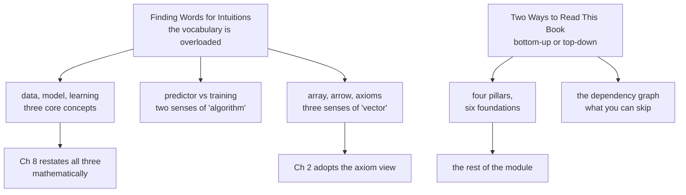

import MathDrillDeck from "../../../../components/MathDrillDeck.astro";
import Quiz from "../../../../components/Quiz.astro";

Chapter 1 of the book is six pages long and contains no mathematics. It is worth reading anyway,
because it does two things nothing later does: it fixes the **vocabulary**, and it tells you **how to
read the other eleven chapters**.

Skipping it is the single most common way to make Chapters 2 through 8 harder than they need to be.

## The argument the book is making

You can call `model.fit(X, y)` without knowing what happens inside, and for a great many tasks that is
the correct engineering decision. The book's case for the mathematics is not that the abstraction is
bad — it is that abstraction has a boundary, and knowing the foundations is what lets you:

- **understand the fundamental principles** the more complicated systems are built on,
- **debug** an approach that is not working,
- **create new solutions** rather than only applying existing ones,
- and know the **inherent assumptions and limitations** of the method you picked.

That last one is the sharpest. Every model encodes assumptions — linear regression assumes Gaussian
noise (§9.1), PCA assumes the interesting structure is in the high-variance directions (§10.2), an SVM
assumes the classes are separable in *some* feature space (§12.4). None of those assumptions is
printed on the API. They are visible only in the derivation.

## What this chapter covers

| order | page | what it settles |
| --- | --- | --- |
| 511 | [Finding Words for Intuitions](../finding-words-for-intuitions/) | Data, model and learning; both senses of "algorithm"; the three views of a vector; why memorising is not learning. |
| 512 | [Two Ways to Read This Book](../two-ways-to-read-this-book/) | Bottom-up versus top-down and the cost of each; the four pillars on six foundations; the dependency graph; where the exercises live. |

About an hour for both, and it is the cheapest hour in the module.

## The three sentences

The book compresses its own contents into three lines at the end of §1.1. They are the shortest honest
summary of what machine learning is:

1. **We represent data as vectors.**
2. **We choose an appropriate model**, using either the probabilistic or the optimisation view.
3. **We learn from available data by numerical optimisation**, with the aim that the model performs well on data not used for training.

Read those again after finishing Chapter 12 and every clause will have a chapter behind it. Right now
they are a promise; that is fine.

## What you'll be able to do afterwards

- Spot which of the two or three meanings of "algorithm", "model" or "learning" a sentence intends.
- Say what the four pillars of machine learning are and which foundations each one needs.
- Pick a reading route for your actual goal, and know what you are giving up by taking it.
- Explain why good training performance is not evidence of a good model.

## Prerequisites

None beyond [Chapter 0](../../chapter-00---getting-ready/getting-ready-overview/), and even that is
optional for these two pages — there is no mathematics here to be rusty at. The NumPy in both pages is
short and explained inline.

<Quiz
  title="Before you start"
  questions={[
    {
      q: "What is the book's strongest argument for learning the mathematics rather than only the libraries?",
      options: [
        "Libraries are too slow for production use",
        "The derivations reveal the assumptions and limitations a model's API does not print",
        "Mathematical notation is more concise than code",
        "Interviewers ask about it",
      ],
      answer: 1,
      explain:
        "Every model encodes assumptions — Gaussian noise, high-variance-means-important, separability in some feature space — and none of them appears in the function signature. They are visible only in the derivation.",
    },
    {
      q: "Which two things does Chapter 1 provide that no later chapter does?",
      options: [
        "Proofs and exercises",
        "The vocabulary, and the instructions for reading the other chapters",
        "The notation table and the index",
        "A worked example and a dataset",
      ],
      answer: 1,
      explain:
        "Section 1.1 fixes the overloaded words and section 1.2 gives the two reading strategies and the structure that makes both possible. Neither is repeated later.",
    },
  ]}
/>

## Drill this chapter

<MathDrillDeck chapters={["Chapter 01 - Introduction and Motivation"]} />

## Recall card

- **Chapter 1 contains no mathematics and is still worth reading**, because it fixes the vocabulary and explains how to read the rest.
- **The case for the mathematics is assumptions and limitations** — every model encodes them, and none of them appears in the API.
- **The book reduces itself to three sentences** — represent data as vectors, choose a model in the probabilistic or optimisation view, and learn by numerical optimisation aimed at unseen data.
- **Two pages carry the chapter**: one on overloaded vocabulary, one on reading strategy and the dependency graph.

**Next:** the words, and why they are slippery —
**[Finding Words for Intuitions](../finding-words-for-intuitions/)**.
