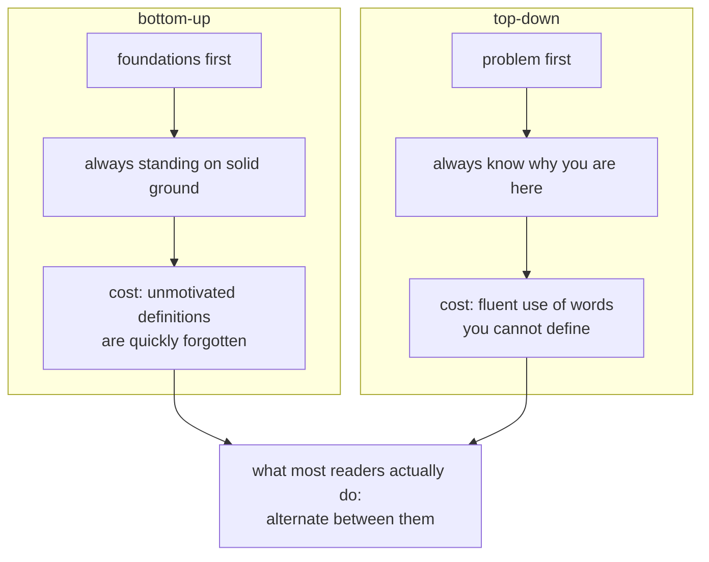
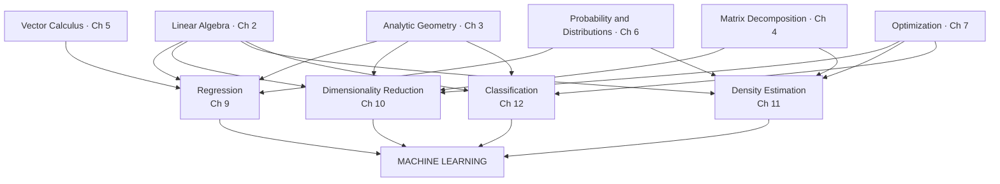

import DataCampExercise from "../../../../components/DataCampExercise.astro";
import Quiz from "../../../../components/Quiz.astro";

§1.2 is two pages long and it is the most practically useful part of Chapter 1, because it answers the
question every reader actually has: **do I have to read this in order?**

The honest answer is no, and the book was structured deliberately so that the answer could be no. It
also names the price of each route, which is the part usually skipped.

## What you'll learn

- The two reading strategies, and the specific failure mode of each.
- The four pillars of machine learning and the six mathematical foundations under them.
- Which chapters genuinely depend on which — the graph, not a vague ordering.
- How to pick a route for the goal you actually have.
- Where the exercises fit, and why Part I's are pen-and-paper while Part II's are code.

## Intuition: two ways up the same building

**Bottom-up** builds from foundations to applications. Its advantage is that you never rely on
something you have not seen. Its cost, in the book's own words, is that "for a practitioner many of
the foundational concepts are not particularly interesting by themselves, and the lack of motivation
means that most foundational definitions are quickly forgotten."

That is a sharper criticism than it looks. It does not say bottom-up is slow — it says the material
**does not stick**, because you learned it without a reason to.

**Top-down** starts from what you want to do and drills down to what you need. Now you always know
why you are learning something. The cost is that "the knowledge is built on potentially shaky
foundations, and the readers have to remember a set of words that they do not have any way of
understanding."

Also sharper than it looks: not that you will be confused, but that you will fluently use words you
cannot define. Which works, until it does not.



The book's closing note on this is the one to take: *"Of course there are more than two ways to read
this book."* Most readers mix — some foundations, then a model, then back for whatever the derivation
used. This module is built to support that; every page names the sections it depends on and the
sections that use it.

## The math: four pillars on six foundations

The book's Figure 1.1 draws machine learning as a building. Four **pillars** hold up the roof, and
each pillar stands on **foundations** from Part I.



Two things are worth reading off this rather than taking on trust.

**Linear algebra feeds every pillar.** That is why it is Chapter 2 and why it is not optional on any
route. If you read one foundation chapter, it is that one.

**The pillars are not equally coupled to the foundations.** Classification (SVM) leans hardest on
optimisation; density estimation (GMM) leans hardest on probability; dimensionality reduction (PCA)
leans hardest on matrix decomposition. So "which foundation do I need?" has a real answer once you
know which pillar you are heading for.

### What each foundation chapter is for

The book's own one-line justifications, which are unusually direct:

| chapter | the question it answers |
| --- | --- |
| **2 · Linear Algebra** | how do we represent numerical data as vectors, and a table of them as a matrix? |
| **3 · Analytic Geometry** | given two vectors representing two real-world objects, how do we say they are *similar*? |
| **4 · Matrix Decompositions** | which operations on matrices give an intuitive interpretation of the data, and more efficient learning? |
| **5 · Vector Calculus** | what is a gradient, and how do we find one? |
| **6 · Probability and Distributions** | how do we quantify noise, and express confidence in a prediction? |
| **7 · Continuous Optimization** | how do we actually find the maximum or minimum? |

Notice how §3's question is phrased: **similarity**. The idea is that "vectors that are similar
should be predicted to have similar outputs by our machine learning algorithm", and formalising
similarity is what inner products are for. Chapter 3 is not geometry for its own sake; it exists
because prediction needs a notion of "close".

And §6's question is phrased as **noise**: "we often consider data to be noisy observations of some
true underlying signal", and probability is the language for saying what noise means.

### What each pillar chapter does

| chapter | pillar | what is being learned | are there labels? |
| --- | --- | --- | --- |
| **8** | — | restates data, models and parameter estimation mathematically, and how to guard against overly optimistic evaluation | — |
| **9** | Regression | a function mapping $\mathbf{x} \in \mathbb{R}^D$ to $y \in \mathbb{R}$ | yes, real-valued |
| **10** | Dimensionality reduction | a compact lower-dimensional representation of $\mathbf{x} \in \mathbb{R}^D$ | **no** |
| **11** | Density estimation | a probability distribution describing the dataset | **no** |
| **12** | Classification | a function mapping $\mathbf{x}$ to a label $y$ | yes, **integer** |

The last column is the cleanest way to hold the four pillars apart, and the book uses exactly this
framing. Chapters 10 and 11 have no labels at all — they model the data itself. Chapters 9 and 12 both
have labels and differ in their *type*: real-valued for regression, integer for classification, which
"requires special care" because you cannot meaningfully take a gradient with respect to a class index.

Chapters 10 and 11 also differ from each other in a way that is easy to blur: dimensionality reduction
wants a **low-dimensional representation** of the data, and density estimation wants a **distribution
that describes** it. Neither has labels; they want different objects.

:::tip[Chapters in Part II can be read in any order]
The book states the coupling explicitly: chapters in **Part I** mostly build on the previous ones,
though "it is possible to skip a chapter and work backward if necessary". Chapters in **Part II** are
"only loosely coupled and can be read in any order", and they are ordered by ascending difficulty
rather than by dependency.

So the safe skipping rule is asymmetric. Skipping forward in Part I costs you; picking any Part II
chapter you like costs you nothing but the foundations that chapter needs.
:::

## Worked example: choosing a route

Four readers, four goals, four routes. The reasoning is what matters, not the lists.

**"I want to understand backpropagation."** You need gradients and the chain rule, which is Chapter 5,
which needs matrices from Chapter 2 and nothing else. Route: **0 → 2 → 5**. Skip Chapter 3 and 4
entirely for now; skip probability; skip all of Part II. Three chapters, and you are done.

**"I want to know why PCA works."** PCA is Chapter 10, standing on matrix decomposition (Chapter 4),
which stands on analytic geometry (Chapter 3) for projections, which stands on Chapter 2. The
max-variance derivation also needs a Lagrange multiplier from §7.2. Route: **2 → 3 → 4 → §7.2 → 10**.

**"I want to implement an SVM from scratch."** Chapter 12 leans on the dual problem and KKT
conditions, which is §7.2 and §7.3.2, which need convexity, which needs gradients. Route:
**2 → 3 → 5 → 7 → 12**. Chapter 6 is genuinely optional here — SVMs are not probabilistic.

**"I want to read modern deep learning papers."** Route: **0 → 2 → 5 → 7 → 6 → 8**, and skip Part II
almost entirely. Papers assume gradients, optimisation, and just enough probability to read a loss
function; they rarely assume PCA or GMMs.

The pattern: **name the destination, walk the arrows backwards, and read only what you land on.** The
book was built to allow that, and it is a much better use of time than starting at page 17 and
grinding.

## See it move

Pick a destination chapter with the knob. The graph highlights everything that chapter actually
depends on, transitively, and greys out the rest — so you can see how much of the book any given goal
requires.

```p5 title="What does this chapter actually require?" desc="Drag the target knob to a chapter. Highlighted boxes are its transitive prerequisites; grey boxes are chapters you can skip for that goal. The count of required chapters is shown top right." height="440"
let target = 10;
let KNOBS = [], dragging = null;

// The book's own dependency claims, as an adjacency list of direct prerequisites.
const DEPS = {
  2:  [],
  3:  [2],
  4:  [2, 3],
  5:  [2],
  6:  [2],
  7:  [5],
  8:  [6, 7],
  9:  [3, 4, 5, 6, 8],
  10: [3, 4, 7],
  11: [4, 6, 7, 8],
  12: [3, 7],
};
const NAMES = {
  2: "Linear Algebra", 3: "Analytic Geom", 4: "Matrix Decomp",
  5: "Vector Calculus", 6: "Probability", 7: "Optimization",
  8: "Models + Data", 9: "Regression", 10: "PCA",
  11: "GMM", 12: "SVM",
};
// Laid out in three tiers: foundations, the bridge, the pillars.
const POS = {
  2: [90, 300], 3: [230, 300], 4: [370, 300], 5: [510, 300],
  6: [90, 210], 7: [230, 210], 8: [370, 210],
  9: [90, 120], 10: [230, 120], 11: [370, 120], 12: [510, 120],
};

function setup() { createCanvas(600, 440); textFont("monospace"); }

function required(ch, seen) {
  seen = seen || new Set();
  for (const d of DEPS[ch] || []) {
    if (!seen.has(d)) { seen.add(d); required(d, seen); }
  }
  return seen;
}

function knob(id, x, y, wd, value, mn, mx, label) {
  KNOBS.push({ id, x, y, w: wd, mn, mx });
  const t = (value - mn) / (mx - mn);
  stroke(60, 74, 92); strokeWeight(2); line(x, y, x + wd, y);
  noStroke(); fill(255, 211, 67); ellipse(x + t * wd, y, 12, 12);
  fill(190, 200, 212); textSize(12); textAlign(LEFT, CENTER);
  text(label, x + wd + 12, y);
}
function knobHit(mx_, my_) {
  for (const k of KNOBS) {
    if (my_ > k.y - 13 && my_ < k.y + 13 && mx_ > k.x - 13 && mx_ < k.x + k.w + 13) return k;
  }
  return null;
}
function mousePressed() { dragging = knobHit(mouseX, mouseY); }
function mouseReleased() { dragging = null; }
function mouseDragged() {
  if (!dragging) return;
  const t = Math.min(1, Math.max(0, (mouseX - dragging.x) / dragging.w));
  target = Math.round(2 + t * 10);
  if (!isLooping()) redraw();
}

function draw() {
  background(13, 17, 23);
  KNOBS = [];

  const need = required(target);
  const BW = 118, BH = 40;

  noStroke(); textAlign(LEFT, TOP);
  fill(255, 211, 67); textSize(15);
  text(`target: Chapter ${target} — ${NAMES[target]}`, 16, 12);
  fill(120, 200, 140); textSize(13);
  text(`requires ${need.size} earlier chapter${need.size === 1 ? "" : "s"}`, 16, 34);
  fill(150); textSize(11);
  text(`skippable for this goal: ${11 - need.size - 1}`, 16, 52);

  // edges first, so boxes sit on top
  for (const ch of Object.keys(DEPS)) {
    const c = Number(ch);
    for (const d of DEPS[c]) {
      const onPath = (c === target || need.has(c)) && need.has(d);
      stroke(onPath ? color(75, 139, 190) : color(30, 40, 50));
      strokeWeight(onPath ? 1.8 : 1);
      line(POS[d][0], POS[d][1] - BH / 2, POS[c][0], POS[c][1] + BH / 2);
    }
  }

  for (const ch of Object.keys(POS)) {
    const c = Number(ch);
    const [x, y] = POS[c];
    const isTarget = c === target;
    const isNeeded = need.has(c);

    if (isTarget) { fill(255, 211, 67, 55); stroke(255, 211, 67); strokeWeight(2.2); }
    else if (isNeeded) { fill(75, 139, 190, 45); stroke(75, 139, 190); strokeWeight(1.6); }
    else { fill(18, 24, 32); stroke(38, 48, 60); strokeWeight(1); }
    rectMode(CENTER); rect(x, y, BW, BH, 5);

    noStroke(); textAlign(CENTER, CENTER);
    fill(isTarget ? color(255, 211, 67) : isNeeded ? color(200, 220, 240) : color(74, 86, 100));
    textSize(12); text(`Ch ${c}`, x, y - 8);
    textSize(9.5); text(NAMES[c], x, y + 8);
  }
  rectMode(CORNER);

  noStroke(); textAlign(LEFT, TOP); fill(150); textSize(11);
  text("bottom row: foundations   middle: the bridge   top: the four pillars", 16, 350);
  fill(255, 211, 67); text("amber = your target", 16, 368);
  fill(75, 139, 190); text("blue = required", 170, 368);
  fill(90, 102, 116); text("grey = skippable", 290, 368);

  knob("target", 90, 405, 240, target, 2, 12, `Chapter ${target}`);
}
```

Drag to Chapter 5 and watch nearly everything go grey — gradients need only Chapter 2. Drag to
Chapter 9 and almost nothing is skippable, because regression pulls on geometry, decompositions,
calculus and probability at once. That asymmetry is the practical content of §1.2.

## From scratch

The dependency graph, and the "what do I actually need" query, as ten lines of Python.

```python title="reading_route.py" showLineNumbers{1}
# The book's own dependency claims: direct prerequisites per chapter.
DEPS = {
    2: [], 3: [2], 4: [2, 3], 5: [2], 6: [2], 7: [5],
    8: [6, 7], 9: [3, 4, 5, 6, 8], 10: [3, 4, 7], 11: [4, 6, 7, 8], 12: [3, 7],
}

def required(ch, seen=None):
    """Transitive closure of prerequisites — everything you must read first."""
    seen = set() if seen is None else seen
    for d in DEPS[ch]:
        if d not in seen:
            seen.add(d)
            required(d, seen)
    return seen

def route(ch):
    """A valid reading order: prerequisites in ascending chapter number, then the target."""
    return sorted(required(ch)) + [ch]

for goal in (5, 7, 10, 12, 9):
    need = required(goal)
    print(f"Ch {goal:2d}: needs {len(need)} -> {sorted(need)}   skip {sorted(set(DEPS) - need - {goal})}")

print("\nroute to PCA        :", route(10))
print("route to SVM        :", route(12))
print("route to regression :", route(9))

# Which foundation appears in the most routes? A crude importance measure.
from collections import Counter
counts = Counter(c for goal in DEPS for c in required(goal))
print("\nmost-depended-on chapters:", counts.most_common(4))
```

```
Ch  5: needs 1 -> [2]   skip [3, 4, 6, 7, 8, 9, 10, 11, 12]
Ch  7: needs 2 -> [2, 5]   skip [3, 4, 6, 8, 9, 10, 11, 12]
Ch 10: needs 5 -> [2, 3, 4, 5, 7]   skip [6, 8, 9, 11, 12]
Ch 12: needs 4 -> [2, 3, 5, 7]   skip [4, 6, 8, 9, 10, 11]
Ch  9: needs 7 -> [2, 3, 4, 5, 6, 7, 8]   skip [10, 11, 12]

route to PCA        : [2, 3, 4, 5, 7, 10]
route to SVM        : [2, 3, 5, 7, 12]
route to regression : [2, 3, 4, 5, 6, 7, 8, 9]
```

```
most-depended-on chapters: [(2, 10), (5, 6), (3, 5), (7, 5)]
```

Chapter 2 appears in **all ten** other chapters' prerequisite sets — it is the only universal one, and
that is the quantitative version of "linear algebra feeds every pillar". Chapter 5 is next at six,
then Chapters 3 and 7 at five each. Vector calculus outranking analytic geometry is worth a moment:
Chapter 5 is pulled in by everything that optimises anything, because Chapter 7 depends on it.

Note also that Chapter 6 is skippable for the SVM route and Chapter 4 is skippable for it too. That is
not an approximation — support vector machines are not probabilistic and do not need a matrix
factorisation.

## Where the exercises live

§1.3 sets the pattern this module follows:

- **Part I exercises are pen and paper.** The book provides them at the end of Chapters 2 to 7, and they are meant to be worked by hand. This module gives each of those chapters an *Exercises and Solutions* page with the problems restated, worked solutions, and a NumPy block that verifies the answer.
- **Part II is programming.** The book ships Jupyter tutorials rather than written exercises for Chapters 8 to 12, "to explore some properties of the machine learning algorithms we discuss". Since there are no written exercise sets for those chapters, this module's Part II exercise pages carry problems authored in the same style.

The book is freely available at [mml-book.com](https://mml-book.com), which also hosts the tutorials
and errata. Reading it alongside these pages is the intended use — every page here ends with a
`From the book` box giving the exact section, definition and equation numbers so you can find the
corresponding passage without hunting.

## Pitfalls

:::caution[Choosing bottom-up because it feels rigorous]
The book's stated objection is not that bottom-up is slow — it is that unmotivated foundational
definitions "are quickly forgotten". Rigour you cannot remember is not rigour. If you have no
destination in mind, pick one anyway.
:::

:::caution[Choosing top-down and never going back]
The stated cost is having "to remember a set of words that they do not have any way of understanding".
That works until a paper deviates from the standard recipe, at which point the missing foundation
becomes the whole problem. Top-down means going back, not skipping.
:::

:::danger[Assuming Part I's chapter order is a hard dependency]
It mostly is, but not entirely — the book says you can "skip a chapter and work backward if
necessary". Part II's order, by contrast, is difficulty, not dependency: those chapters are "only
loosely coupled and can be read in any order". Treating Part II as a chain wastes weeks.
:::

:::caution[Confusing dimensionality reduction with density estimation]
Both are unlabelled. Dimensionality reduction (Ch 10) wants a compact low-dimensional representation;
density estimation (Ch 11) wants a distribution over the data. Different objects, same absence of
labels.
:::

## Compare

| | bottom-up | top-down |
| --- | --- | --- |
| starts from | foundations | a problem you care about |
| motivation | supplied late | supplied immediately |
| the book's stated cost | definitions are quickly forgotten | words you cannot define |
| best when | you will use this for years | you have a deadline |
| in this module | Ch 0 → 1 → 2 → … → 12 | Ch 8 → 9, then backwards as needed |
| risk if done alone | giving up in Chapter 4 | stalling at the first non-standard paper |

<Quiz
  title="Check yourself"
  questions={[
    {
      q: "The book gives a specific objection to the bottom-up strategy. What is it?",
      options: [
        "It takes too long",
        "Foundational concepts are not interesting by themselves, so unmotivated definitions are quickly forgotten",
        "The foundations are too difficult without applications",
        "It requires reading the chapters out of order",
      ],
      answer: 1,
      explain:
        "The objection is retention, not speed. Learning a definition with no reason to care about it means not remembering it — which is why picking a destination first helps even on a bottom-up route.",
    },
    {
      q: "Which of the four pillars have no labels associated with their data?",
      options: [
        "Regression and classification",
        "Dimensionality reduction and density estimation",
        "Classification and density estimation",
        "All four use labels",
      ],
      answer: 1,
      explain:
        "Chapters 10 and 11 model the data itself. Regression has real-valued labels and classification has integer labels, and that difference in type is why classification needs special care.",
    },
    {
      q: "How are chapters coupled in Part II of the book?",
      options: [
        "Each depends on the previous one, as in Part I",
        "They are only loosely coupled and can be read in any order, being ordered by ascending difficulty",
        "They must be read in reverse order",
        "They are independent of Part I as well",
      ],
      answer: 1,
      explain:
        "The book says this explicitly. Part I mostly builds up; Part II is ordered by difficulty, not dependency, so you can go straight to whichever pillar you need.",
    },
    {
      q: "Chapter 2 appears in the prerequisite set of every other chapter in the dependency graph. What follows?",
      options: [
        "Chapter 2 is the hardest chapter",
        "Linear algebra is the one foundation no reading route can skip",
        "The graph is drawn incorrectly",
        "Chapter 2 should be read last",
      ],
      answer: 1,
      explain:
        "It is the quantitative version of the book's Figure 1.1, where linear algebra sits under every pillar. Whatever you are aiming at, that chapter is on the way.",
    },
  ]}
/>

## 🧪 Try It Yourself

### Exercise 1 – Direct prerequisites

<DataCampExercise
  lang="python"
  hint={`Just index the dictionary with the chapter number.`}
  code={`DEPS = {
    2: [], 3: [2], 4: [2, 3], 5: [2], 6: [2], 7: [5],
    8: [6, 7], 9: [3, 4, 5, 6, 8], 10: [3, 4, 7], 11: [4, 6, 7, 8], 12: [3, 7],
}

print("Chapter 10 directly needs:", DEPS[___])   # replace ___ with 10
print("Chapter 2 directly needs :", DEPS[2])

# -- Expected output ------------------------------
# Chapter 10 directly needs: [3, 4, 7]
# Chapter 2 directly needs : []
# -------------------------------------------------`}
  solution={`DEPS = {
    2: [], 3: [2], 4: [2, 3], 5: [2], 6: [2], 7: [5],
    8: [6, 7], 9: [3, 4, 5, 6, 8], 10: [3, 4, 7], 11: [4, 6, 7, 8], 12: [3, 7],
}
print("Chapter 10 directly needs:", DEPS[10])
print("Chapter 2 directly needs :", DEPS[2])`}
  sct={`test_output_contains("Chapter 10 directly needs: [3, 4, 7]")
success_msg("Direct prerequisites only. The transitive ones are the next exercise.")`}
  height={195}
/>

### Exercise 2 – The transitive closure

<DataCampExercise
  lang="python"
  hint={`Recurse into each dependency, adding it to the set before you descend so cycles cannot loop.`}
  code={`DEPS = {
    2: [], 3: [2], 4: [2, 3], 5: [2], 6: [2], 7: [5],
    8: [6, 7], 9: [3, 4, 5, 6, 8], 10: [3, 4, 7], 11: [4, 6, 7, 8], 12: [3, 7],
}

def required(ch, seen=None):
    seen = set() if seen is None else seen
    for d in DEPS[ch]:
        if d not in seen:
            seen.___(d)          # replace ___ so d joins the set
            required(d, seen)
    return seen

print("Chapter 10 really needs:", sorted(required(10)))
print("count:", len(required(10)))

# -- Expected output ------------------------------
# Chapter 10 really needs: [2, 3, 4, 5, 7]
# count: 5
# -------------------------------------------------`}
  solution={`DEPS = {
    2: [], 3: [2], 4: [2, 3], 5: [2], 6: [2], 7: [5],
    8: [6, 7], 9: [3, 4, 5, 6, 8], 10: [3, 4, 7], 11: [4, 6, 7, 8], 12: [3, 7],
}

def required(ch, seen=None):
    seen = set() if seen is None else seen
    for d in DEPS[ch]:
        if d not in seen:
            seen.add(d)
            required(d, seen)
    return seen

print("Chapter 10 really needs:", sorted(required(10)))
print("count:", len(required(10)))`}
  sct={`test_output_contains("count: 5")
success_msg("Chapter 5 shows up even though PCA never mentions gradients — it arrives through Chapter 7's optimisation.")`}
  height={245}
/>

### Exercise 3 – What can you skip?

<DataCampExercise
  lang="python"
  hint={`Set difference: everything in DEPS, minus what is required, minus the target itself.`}
  code={`DEPS = {
    2: [], 3: [2], 4: [2, 3], 5: [2], 6: [2], 7: [5],
    8: [6, 7], 9: [3, 4, 5, 6, 8], 10: [3, 4, 7], 11: [4, 6, 7, 8], 12: [3, 7],
}

def required(ch, seen=None):
    seen = set() if seen is None else seen
    for d in DEPS[ch]:
        if d not in seen:
            seen.add(d); required(d, seen)
    return seen

goal = 5
skippable = set(DEPS) - required(goal) - {___}     # replace ___ with goal
print("to reach Chapter 5 you can skip:", sorted(skippable))
print("that is", len(skippable), "of 11 chapters")

# -- Expected output ------------------------------
# to reach Chapter 5 you can skip: [3, 4, 6, 7, 8, 9, 10, 11, 12]
# that is 9 of 11 chapters
# -------------------------------------------------`}
  solution={`DEPS = {
    2: [], 3: [2], 4: [2, 3], 5: [2], 6: [2], 7: [5],
    8: [6, 7], 9: [3, 4, 5, 6, 8], 10: [3, 4, 7], 11: [4, 6, 7, 8], 12: [3, 7],
}

def required(ch, seen=None):
    seen = set() if seen is None else seen
    for d in DEPS[ch]:
        if d not in seen:
            seen.add(d); required(d, seen)
    return seen

goal = 5
skippable = set(DEPS) - required(goal) - {goal}
print("to reach Chapter 5 you can skip:", sorted(skippable))
print("that is", len(skippable), "of 11 chapters")`}
  sct={`test_output_contains("that is 9 of 11 chapters")
success_msg("Backpropagation needs two chapters out of eleven. That is what a top-down route buys you.")`}
  height={255}
/>

### Exercise 4 – The universal prerequisite

<DataCampExercise
  lang="python"
  hint={`Counter over every chapter's required set. The chapter appearing most often is the universal one.`}
  code={`from collections import Counter

DEPS = {
    2: [], 3: [2], 4: [2, 3], 5: [2], 6: [2], 7: [5],
    8: [6, 7], 9: [3, 4, 5, 6, 8], 10: [3, 4, 7], 11: [4, 6, 7, 8], 12: [3, 7],
}

def required(ch, seen=None):
    seen = set() if seen is None else seen
    for d in DEPS[ch]:
        if d not in seen:
            seen.add(d); required(d, seen)
    return seen

counts = Counter(c for goal in DEPS for c in required(___))    # replace ___ with goal
print("appears in this many routes:", counts.most_common(3))
print("universal:", counts.most_common(1)[0][0])

# -- Expected output ------------------------------
# appears in this many routes: [(2, 10), (5, 6), (3, 5)]
# universal: 2
# -------------------------------------------------`}
  solution={`from collections import Counter

DEPS = {
    2: [], 3: [2], 4: [2, 3], 5: [2], 6: [2], 7: [5],
    8: [6, 7], 9: [3, 4, 5, 6, 8], 10: [3, 4, 7], 11: [4, 6, 7, 8], 12: [3, 7],
}

def required(ch, seen=None):
    seen = set() if seen is None else seen
    for d in DEPS[ch]:
        if d not in seen:
            seen.add(d); required(d, seen)
    return seen

counts = Counter(c for goal in DEPS for c in required(goal))
print("appears in this many routes:", counts.most_common(3))
print("universal:", counts.most_common(1)[0][0])`}
  sct={`test_output_contains("universal: 2")
success_msg("Chapter 2 is on every route. That is Figure 1.1's 'linear algebra under every pillar', counted.")`}
  height={255}
/>

### Exercise 5 – A valid reading order

<DataCampExercise
  lang="python"
  hint={`Sort the required set, then append the target. Ascending chapter number is a valid order because every dependency has a lower number.`}
  code={`DEPS = {
    2: [], 3: [2], 4: [2, 3], 5: [2], 6: [2], 7: [5],
    8: [6, 7], 9: [3, 4, 5, 6, 8], 10: [3, 4, 7], 11: [4, 6, 7, 8], 12: [3, 7],
}

def required(ch, seen=None):
    seen = set() if seen is None else seen
    for d in DEPS[ch]:
        if d not in seen:
            seen.add(d); required(d, seen)
    return seen

def route(ch):
    return sorted(required(ch)) + [___]        # replace ___ with ch

print("route to SVM:", route(12))
print("route to PCA:", route(10))
print("every dependency comes before its chapter:",
      all(route(12).index(d) < route(12).index(12) for d in required(12)))

# -- Expected output ------------------------------
# route to SVM: [2, 3, 5, 7, 12]
# route to PCA: [2, 3, 4, 5, 7, 10]
# every dependency comes before its chapter: True
# -------------------------------------------------`}
  solution={`DEPS = {
    2: [], 3: [2], 4: [2, 3], 5: [2], 6: [2], 7: [5],
    8: [6, 7], 9: [3, 4, 5, 6, 8], 10: [3, 4, 7], 11: [4, 6, 7, 8], 12: [3, 7],
}

def required(ch, seen=None):
    seen = set() if seen is None else seen
    for d in DEPS[ch]:
        if d not in seen:
            seen.add(d); required(d, seen)
    return seen

def route(ch):
    return sorted(required(ch)) + [ch]

print("route to SVM:", route(12))
print("route to PCA:", route(10))
print("every dependency comes before its chapter:",
      all(route(12).index(d) < route(12).index(12) for d in required(12)))`}
  sct={`test_output_contains("route to SVM: [2, 3, 5, 7, 12]")
success_msg("Five chapters to a from-scratch SVM. Sorting by chapter number works because the book has no backward dependencies.")`}
  height={265}
/>

:::tip[From the book]
*Mathematics for Machine Learning* §1.2 ("Two Ways to Read This Book") is the source. The two
strategies and their stated costs are quoted from that section: bottom-up risks that "the lack of
motivation means that most foundational definitions are quickly forgotten", and top-down risks
"a set of words that they do not have any way of understanding". **Figure 1.1** draws the four pillars
— regression, dimensionality reduction, density estimation and classification — on the foundations of
linear algebra, analytic geometry, matrix decomposition, vector calculus, probability and
optimisation. The section also states that Part I chapters "mostly build upon the previous ones" while
Part II chapters "are only loosely coupled and can be read in any order", ordered by ascending
difficulty. The per-chapter descriptions in the tables above are the book's own from the
*Part I Is about Mathematics* and *Part II Is about Machine Learning* subsections, including the note
that classification labels "are integers, which requires special care". §1.3 covers exercises: pen and
paper for Part I, Jupyter tutorials for Part II, with the book freely available at mml-book.com. The
dependency graph itself is this module's reading of those claims, not a figure in the book.
:::

## Recall card

- **Bottom-up's stated cost is retention** — unmotivated foundational definitions are quickly forgotten, so rigour without a destination does not stick.
- **Top-down's stated cost is vocabulary without understanding** — you end up fluent in words you cannot define, which holds until a paper leaves the standard recipe.
- **Most readers mix the two**, and the book says so outright: there are more than two ways to read it.
- **The four pillars are regression, dimensionality reduction, density estimation and classification** — Chapters 9 through 12.
- **Six foundations sit under them** — linear algebra, analytic geometry, matrix decomposition, vector calculus, probability, and optimisation.
- **Linear algebra is the only universal prerequisite**, appearing in every other chapter's transitive dependency set.
- **The four pillars split on labels**: dimensionality reduction and density estimation have none, regression has real-valued ones, classification has integer ones — and integers are why classification needs special care.
- **Dimensionality reduction wants a low-dimensional representation; density estimation wants a distribution** — both unlabelled, different objects.
- **Part I mostly builds up, but Part II is only loosely coupled** and ordered by difficulty rather than dependency, so any pillar can be read first.
- **Name the destination and walk the arrows backwards** — backpropagation needs two chapters of eleven, while regression needs eight.
- **Part I's exercises are pen and paper; Part II's are Jupyter notebooks**, and the book is free at mml-book.com.

**Next:** the foundation every route passes through —
**[Linear Algebra](../../chapter-02---linear-algebra/linear-algebra-overview/)**.
