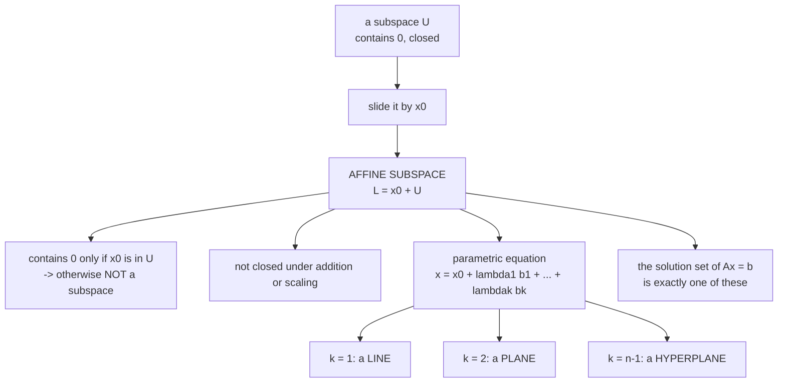

Everything so far insisted on passing through the origin. Subspaces must contain $\mathbf{0}$; linear
mappings must send $\mathbf{0}$ to $\mathbf{0}$. That insistence bought a great deal of structure, and
it also excluded most of the objects you actually care about: a regression line with a nonzero
intercept, a decision boundary that is not through the origin, a neural network layer with a bias.

This section relaxes it, in the smallest possible way: **take a subspace and slide it**.

## What you'll learn

- What an **affine subspace** is — support point plus direction space — and why it is *not* a subspace.
- The **parametric equation**, and why the representation is unique once you fix an ordered basis.
- **Lines**, **planes** and **hyperplanes**, and the dimension counting behind each.
- Why the solution set of an inhomogeneous system is exactly an affine subspace.
- **Affine mappings**, and the fact that every one is a linear mapping followed by a translation.

## Intuition: a regression line

Fit a straight line to data and you get $y = wx + b$. If $b \neq 0$ the line does not pass through the
origin, so **the set of points on it is not a subspace**. It fails the very first test: the origin is
not on it.

But it is only barely not a subspace. Take the line $y = wx$ through the origin — that *is* a subspace,
a one-dimensional one — and slide it up by $b$. Same direction, shifted position. That is the entire
construction, and the terminology follows it:

- the **direction space** is the subspace you started with,
- the **support point** is how far you slid it.



## The math

### Affine subspace

Let $V$ be a vector space, $\mathbf{x}_0 \in V$, and $U \subseteq V$ a subspace. The subset

$$
L = \mathbf{x}_0 + U := \{\mathbf{x}_0 + \mathbf{u} : \mathbf{u} \in U\}
= \{\mathbf{v} \in V : \exists\mathbf{u} \in U,\; \mathbf{v} = \mathbf{x}_0 + \mathbf{u}\} \subseteq V
$$

is an **affine subspace** of $V$, also called a **linear manifold**. $U$ is the **direction** or
**direction space**, and $\mathbf{x}_0$ is the **support point**.

The definition **excludes $\mathbf{0}$** whenever $\mathbf{x}_0 \notin U$. So an affine subspace is
**not** a linear subspace in that case — the book says so explicitly, and it is the whole distinction.

:::caution[Neither the support point nor the parameters are canonical]
Any point of $L$ works as the support point. Slide the line $y = 2x + 1$ from $(0,1)$ or from $(1,3)$ —
same line. So "the support point" is not a well-defined phrase without a choice.

The book gives the precise containment test that goes with this: for
$L = \mathbf{x}_0 + U$ and $\tilde{L} = \tilde{\mathbf{x}}_0 + \tilde{U}$,

$$
L \subseteq \tilde{L} \iff U \subseteq \tilde{U} \text{ and } \mathbf{x}_0 - \tilde{\mathbf{x}}_0 \in \tilde{U}
$$

Two conditions: the directions nest, **and** the offset between support points is itself a direction.
The second is what makes the test about the *sets* rather than the arbitrary choices.
:::

### The parametric equation

If $L = \mathbf{x}_0 + U$ is $k$-dimensional and $(\mathbf{b}_1,\dots,\mathbf{b}_k)$ is an **ordered
basis** of $U$, then every $\mathbf{x} \in L$ can be **uniquely** described as

$$
\mathbf{x} = \mathbf{x}_0 + \lambda_1\mathbf{b}_1 + \cdots + \lambda_k\mathbf{b}_k
$$

with $\lambda_1,\dots,\lambda_k \in \mathbb{R}$. This is the **parametric equation** of $L$ with
**directional vectors** $\mathbf{b}_1,\dots,\mathbf{b}_k$ and **parameters** $\lambda_1,\dots,\lambda_k$.

Uniqueness here is §2.6's uniqueness-of-coordinates, inherited: once $\mathbf{x}_0$ and the ordered
basis are fixed, the parameters are determined. Change the support point and every $\lambda$ shifts, but
for a *given* choice there is exactly one answer.

### Lines, planes, hyperplanes

| $k$ | name | parametric equation | in $\mathbb{R}^n$ |
| --- | --- | --- | --- |
| 1 | **line** | $\mathbf{y} = \mathbf{x}_0 + \lambda\mathbf{x}_1$ | needs a support point and 1 direction |
| 2 | **plane** | $\mathbf{y} = \mathbf{x}_0 + \lambda_1\mathbf{x}_1 + \lambda_2\mathbf{x}_2$ | 2 linearly independent directions |
| $n-1$ | **hyperplane** | $\mathbf{y} = \mathbf{x}_0 + \sum_{i=1}^{n-1}\lambda_i\mathbf{x}_i$ | $n-1$ independent directions |

The hyperplane row is the one worth internalising, because "hyperplane" is used constantly in machine
learning and its dimension is relative:

- In $\mathbb{R}^2$, a hyperplane is a **line**.
- In $\mathbb{R}^3$, a hyperplane is a **plane**.
- In $\mathbb{R}^{1000}$, a hyperplane is a 999-dimensional object nobody can picture.

A hyperplane is always **one dimension short** of the ambient space, which is exactly why it divides it
into two halves. That is what makes it a *decision boundary*, and Chapter 12 builds support vector
machines on precisely this — the book even notes in this section that Chapter 12 will refer to such a
subspace as a hyperplane.

### Inhomogeneous systems are affine subspaces

The connection that makes this section retroactively explain §2.3. For
$\mathbf{A} \in \mathbb{R}^{m\times n}$ and $\mathbf{b} \in \mathbb{R}^m$, the solution set of
$\mathbf{A}\mathbf{x} = \mathbf{b}$ is **either empty or an affine subspace of $\mathbb{R}^n$ of
dimension $n - \operatorname{rk}(\mathbf{A})$**.

That is §2.3's particular-plus-general decomposition, renamed:

$$
\underbrace{\mathbf{x}_p}_{\text{support point}} + \underbrace{\ker(\mathbf{A})}_{\text{direction space}}
$$

And the converse holds too: in $\mathbb{R}^n$, **every** $k$-dimensional affine subspace is the solution
of an inhomogeneous system $\mathbf{A}\mathbf{x} = \mathbf{b}$ with
$\operatorname{rk}(\mathbf{A}) = n - k$. Affine subspaces and inhomogeneous systems are two
descriptions of one thing, exactly as subspaces and homogeneous systems were in §2.4.

Two special cases worth naming:

- The solution of a *single* equation $\lambda_1x_1 + \cdots + \lambda_nx_n = b$ with not all $\lambda_i$ zero is a **hyperplane** in $\mathbb{R}^n$. One equation removes one dimension.
- A homogeneous system's solution set is a subspace, which the book notes can be thought of as "a special affine space with support point $\mathbf{x}_0 = \mathbf{0}$".

So subspaces are affine subspaces that happen to be centred. The general notion is the affine one.

### Affine mappings

For vector spaces $V, W$, a linear mapping $\Phi : V \to W$ and a vector $\mathbf{a} \in W$, the mapping

$$
\phi : V \to W, \qquad \mathbf{x} \mapsto \mathbf{a} + \Phi(\mathbf{x})
$$

is an **affine mapping** from $V$ to $W$, and $\mathbf{a}$ is the **translation vector**.

Three properties:

- Every affine mapping is the **composition of a linear mapping and a translation**: $\phi = \tau \circ \Phi$, and the two are **uniquely determined**.
- The composition $\phi' \circ \phi$ of affine mappings is affine.
- Affine mappings **keep the geometric structure invariant**, and preserve **dimension** and **parallelism**.

:::tip[Every "linear layer" in deep learning is affine]
A neural network layer computes $\mathbf{W}\mathbf{x} + \mathbf{b}$. That is an affine mapping, not a
linear one — the bias $\mathbf{b}$ *is* the translation vector. It sends $\mathbf{0}$ to $\mathbf{b}$,
not to $\mathbf{0}$, so §2.7's definition rules it out.

The frameworks call these layers linear anyway (`nn.Linear`, `Dense`), and the terminology is entrenched.
The book anticipates this in its opening remark: "in the machine learning literature, the distinction
between linear and affine is sometimes not clear so that we can find references to affine
spaces/mappings as linear spaces/mappings."

There is also a standard trick worth knowing: append a constant $1$ to $\mathbf{x}$ and absorb
$\mathbf{b}$ as an extra column of $\mathbf{W}$. The affine map in $\mathbb{R}^n$ becomes a genuinely
**linear** map in $\mathbb{R}^{n+1}$. That is why design matrices in Chapter 9 carry a column of ones —
it converts an affine fitting problem into a linear one, at the cost of one dimension.
:::

## Worked example by hand

**A line in $\mathbb{R}^2$.** Take $\mathbf{x}_0 = (-1.5, 1.4)^\top$ and direction
$\mathbf{u} = (1.6, 0.7)^\top$. The parametric equation is
$\mathbf{y} = \mathbf{x}_0 + \lambda\mathbf{u}$, so

| $\lambda$ | $\mathbf{y}$ |
| --- | --- |
| $-2$ | $(-4.7, 0.0)$ |
| $-1$ | $(-3.1, 0.7)$ |
| $0$ | $(-1.5, 1.4)$ — the support point |
| $1$ | $(0.1, 2.1)$ |
| $2$ | $(1.7, 2.8)$ |

Is $\mathbf{0}$ on this line? We would need $\lambda$ with $-1.5 + 1.6\lambda = 0$ and
$1.4 + 0.7\lambda = 0$, giving $\lambda = 0.9375$ and $\lambda = -2$ respectively. **Different values, so
no.** The line misses the origin and is therefore not a subspace.

**Closure fails, concretely.** Take the two points at $\lambda = 0$ and $\lambda = 1$:
$(-1.5, 1.4)$ and $(0.1, 2.1)$. Their sum is $(-1.4, 3.5)$. Is that on the line? Solve
$-1.5 + 1.6\lambda = -1.4$, giving $\lambda = 0.0625$; then the second coordinate would be
$1.4 + 0.7(0.0625) = 1.44375 \neq 3.5$. **Not on the line.** Affine subspaces are not closed under
addition, which is the second reason they are not subspaces.

**An inhomogeneous system, as an affine subspace.** Solve $x_1 + x_2 + x_3 = 3$ in $\mathbb{R}^3$. One
particular solution is $(3, 0, 0)$. The direction space is the null space of $[1, 1, 1]$, which is
two-dimensional, spanned by $(1,-1,0)$ and $(1,0,-1)$. So

$$
L = \begin{bmatrix}3\\0\\0\end{bmatrix} + \lambda_1\begin{bmatrix}1\\-1\\0\end{bmatrix} + \lambda_2\begin{bmatrix}1\\0\\-1\end{bmatrix}
$$

Dimension $n - \operatorname{rk} = 3 - 1 = 2$: a **plane** in $\mathbb{R}^3$, which is also a hyperplane
because $2 = 3 - 1$. Checking $\lambda_1 = 2, \lambda_2 = -1$: the point is
$(3 + 2 - 1, -2, 1) = (4, -2, 1)$, and $4 - 2 + 1 = 3$ ✓.

**And the affine-to-linear trick.** The affine map $\phi(x) = 2x + 3$ on $\mathbb{R}$ becomes the linear
map

$$
\begin{bmatrix}2 & 3\end{bmatrix}\begin{bmatrix}x\\ 1\end{bmatrix} = 2x + 3
$$

on $\mathbb{R}^2$. Check the zero test in the new space: the input $(0, 1)^\top$ is not the zero vector
of $\mathbb{R}^2$, so nothing is violated — the trick works precisely because the augmented input never
*is* zero.

## See it move

The violet arrow is the support point; the amber arrow is the direction. The white point slides along
the affine line as $\lambda$ changes. The dashed grey line is the direction space itself — parallel, and
passing through the origin.

```p5 title="A line as support point plus direction" desc="The violet arrow is the support point x0. The amber arrow is the direction u. The point y = x0 + lambda*u (white) slides along the affine line (solid green) as lambda changes. The dashed grey line is the direction space U through the origin — parallel, but passing through 0." height="360"
let lam = 0, dir = 1;
const U = 46;
let cx, cy;
function setup(){ createCanvas(600, 360); textFont("monospace"); cx = width/2; cy = height/2 + 10; }
function sx(x){ return cx + x*U; }
function sy(y){ return cy - y*U; }
function draw(){
  background(13,17,23);
  lam += 0.02 * dir;
  if (lam > 2.6 || lam < -2.6) dir *= -1;

  // grid + axes
  stroke(34,46,60); strokeWeight(1);
  for (let g=-5; g<=5; g++){ line(sx(-5),sy(g),sx(5),sy(g)); line(sx(g),sy(-5),sx(g),sy(5)); }
  stroke(70,82,96); strokeWeight(1.2);
  line(sx(-5),sy(0),sx(5),sy(0)); line(sx(0),sy(-5),sx(0),sy(5));

  const x0 = [-1.5, 1.4];   // support point
  const u  = [1.6, 0.7];    // direction

  // direction space U (through origin) — dashed grey
  stroke(120,130,142); strokeWeight(1.4);
  for (let t=-4; t<4; t+=0.4){
    const p1=[u[0]*t, u[1]*t], p2=[u[0]*(t+0.2), u[1]*(t+0.2)];
    line(sx(p1[0]),sy(p1[1]),sx(p2[0]),sy(p2[1]));
  }
  // affine line L = x0 + lambda*u — solid green
  stroke(120,200,140); strokeWeight(2.4);
  const a=[x0[0]+u[0]*-4, x0[1]+u[1]*-4], b=[x0[0]+u[0]*4, x0[1]+u[1]*4];
  line(sx(a[0]),sy(a[1]),sx(b[0]),sy(b[1]));

  // support point x0 (violet) from origin
  drawArrow(sx(0),sy(0),sx(x0[0]),sy(x0[1]), color(197,153,255));
  // direction u (amber), drawn from x0
  drawArrow(sx(x0[0]),sy(x0[1]),sx(x0[0]+u[0]),sy(x0[1]+u[1]), color(255,211,67));

  // the sliding point y = x0 + lambda*u
  const y = [x0[0]+u[0]*lam, x0[1]+u[1]*lam];
  drawArrow(sx(0),sy(0),sx(y[0]),sy(y[1]), color(240,240,245));
  noStroke(); fill(255); ellipse(sx(y[0]),sy(y[1]),11,11);
  fill(200); ellipse(sx(0),sy(0),6,6);

  // is the origin on the line? (it is not — show the miss)
  noStroke(); fill(232,110,110); textSize(11); textAlign(RIGHT,TOP);
  text("the origin is NOT on the green line", width-16, 14);

  // labels
  textAlign(LEFT,TOP);
  fill(255,211,67); textSize(15); text("Affine line: y = x0 + lambda*u", 16, 12);
  fill(230); textSize(13); text(`lambda = ${lam.toFixed(2)}`, 16, 40);
  fill(197,153,255); textSize(11); text("x0 support point", 16, height-58);
  fill(255,211,67); text("u direction", 16, height-42);
  fill(120,200,140); text("green = affine line (offset)", 16, height-26);
  fill(120,130,142); textAlign(RIGHT,TOP); text("dashed = direction space U (through 0)", width-16, height-26);
}
function drawArrow(x1,y1,x2,y2,c){
  stroke(c); strokeWeight(2.4); line(x1,y1,x2,y2);
  push(); translate(x2,y2); rotate(Math.atan2(y2-y1,x2-x1));
  fill(c); noStroke(); triangle(0,0,-9,-4,-9,4); pop();
}
```

The two lines are **parallel and never meet**. The grey one is a subspace — the origin sits on it. The
green one is its translate, and no value of $\lambda$ ever brings the white point to the origin. That
gap *is* the support point, and it is the whole difference between the two objects.

## From scratch

```python title="affine_spaces.py" showLineNumbers{1}
import numpy as np

# ---- a line as support point plus direction --------------------------
x0 = np.array([-1.5, 1.4])
u  = np.array([ 1.6, 0.7])

def on_line(y, tol=1e-9):
    """Is y on the affine line x0 + lambda*u? Solve both coordinates and compare."""
    lams = (y - x0) / u
    return np.allclose(lams, lams[0], atol=tol), lams

for lam in (-2.0, -1.0, 0.0, 1.0, 2.0):
    print(f"lambda={lam:5}  y = {x0 + lam * u}")

print("\nis the origin on the line?", on_line(np.zeros(2))[0],
      " -> the two lambdas disagree:", np.round(on_line(np.zeros(2))[1], 4))

# ---- affine subspaces are not closed --------------------------------
p, q = x0 + 0.0 * u, x0 + 1.0 * u
print("\ntwo points on the line:", p, q)
print("their sum:", p + q, " on the line?", on_line(p + q)[0])
print("2*p      :", 2 * p, "        on the line?", on_line(2 * p)[0])
print("-> not closed under addition OR scaling, so not a subspace")

# ---- but the DIRECTION space is a subspace --------------------------
d1, d2 = 1.3 * u, -0.4 * u
print("\ndirections", np.round(d1, 3), "and", np.round(d2, 3))
print("their sum is still a multiple of u:",
      np.allclose(np.cross(np.append(d1 + d2, 0), np.append(u, 0)), 0))

# ---- an inhomogeneous system IS an affine subspace -----------------
A = np.array([[1.0, 1.0, 1.0]])
b = np.array([3.0])
xp = np.array([3.0, 0.0, 0.0])                  # a particular solution
n1 = np.array([1.0, -1.0, 0.0])                 # null-space basis
n2 = np.array([1.0,  0.0, -1.0])
n, r = A.shape[1], np.linalg.matrix_rank(A)

print("\nsolution set of x1+x2+x3 = 3")
print("  particular solution works:", np.allclose(A @ xp, b))
print("  n1, n2 in the null space :", np.allclose(A @ n1, 0), np.allclose(A @ n2, 0))
print("  dimension n - rank       :", n - r, "-> a plane in R^3")
print("  which is a hyperplane    :", (n - r) == n - 1)
pt = xp + 2 * n1 - 1 * n2
print("  a sample point           :", pt, " satisfies the equation:", np.allclose(A @ pt, b))
print("  contains the origin?     :", np.allclose(A @ np.zeros(3), b))

# ---- the containment test needs BOTH conditions -------------------
# L = x0 + span(u)  inside  Ltilde = 0 + span(u)?  Directions nest, offset does not.
offset_in_direction = np.allclose(np.cross(np.append(x0 - np.zeros(2), 0),
                                           np.append(u, 0)), 0)
print("\ndirections nest:", True, " offset is a direction:", offset_in_direction)
print("so L is a subset of the direction space?", offset_in_direction)

# ---- affine mapping = linear mapping + translation ----------------
W = np.array([[2.0, -1.0], [0.0, 3.0]])
a = np.array([5.0, -2.0])
phi = lambda v: a + W @ v

print("\nphi(0) =", phi(np.zeros(2)), " == the translation vector:", np.allclose(phi(np.zeros(2)), a))
x, y = np.array([1.0, 2.0]), np.array([-3.0, 0.5])
print("phi(x+y) == phi(x) + phi(y)?", np.allclose(phi(x + y), phi(x) + phi(y)),
      "  <- fails, so not linear")
print("but phi(x+y) - a == (phi(x)-a) + (phi(y)-a)?",
      np.allclose(phi(x + y) - a, (phi(x) - a) + (phi(y) - a)),
      "  <- the linear part IS linear")

# ---- the augmentation trick: affine in R^n = linear in R^(n+1) ---
W_aug = np.c_[W, a]                              # absorb the translation
for v in (x, y, np.zeros(2)):
    v_aug = np.append(v, 1.0)
    print(f"  phi({v}) = {phi(v)}   augmented: {W_aug @ v_aug}")
print("identical:", all(np.allclose(phi(v), W_aug @ np.append(v, 1.0))
                        for v in (x, y, np.zeros(2))))

# ---- affine mappings preserve parallelism ------------------------
line_a = [x0 + t * u for t in (-1.0, 0.0, 1.0, 2.0)]
line_b = [x0 + np.array([0.0, 2.0]) + t * u for t in (-1.0, 0.0, 1.0, 2.0)]
img_a = np.array([phi(v) for v in line_a])
img_b = np.array([phi(v) for v in line_b])
dir_a = img_a[1] - img_a[0]
dir_b = img_b[1] - img_b[0]
print("\ntwo parallel lines stay parallel:",
      np.allclose(np.cross(np.append(dir_a, 0), np.append(dir_b, 0)), 0))
```

```
lambda= -2.0  y = [-4.7  0. ]
lambda= -1.0  y = [-3.1  0.7]
lambda=  0.0  y = [-1.5  1.4]
lambda=  1.0  y = [0.1 2.1]
lambda=  2.0  y = [1.7 2.8]

is the origin on the line? False  -> the two lambdas disagree: [ 0.9375 -2.    ]

two points on the line: [-1.5  1.4] [0.1 2.1]
their sum: [-1.4  3.5]  on the line? False
2*p      : [-3.   2.8]         on the line? False
-> not closed under addition OR scaling, so not a subspace

directions [2.08 0.91] and [-0.64 -0.28]
their sum is still a multiple of u: True

solution set of x1+x2+x3 = 3
  particular solution works: True
  n1, n2 in the null space : True True
  dimension n - rank       : 2 -> a plane in R^3
  which is a hyperplane    : True
  a sample point           : [ 4. -2.  1.]  satisfies the equation: True
  contains the origin?     : False

directions nest: True  offset is a direction: False
so L is a subset of the direction space? False

phi(0) = [ 5. -2.]  == the translation vector: True
phi(x+y) == phi(x) + phi(y)? False   <- fails, so not linear
but phi(x+y) - a == (phi(x)-a) + (phi(y)-a)? True   <- the linear part IS linear

  phi([1. 2.]) = [5. 4.]   augmented: [5. 4.]
  phi([-3.   0.5]) = [-1.5 -0.5]   augmented: [-1.5 -0.5]
  phi([0. 0.]) = [ 5. -2.]   augmented: [ 5. -2.]
identical: True

two parallel lines stay parallel: True
```

Four readings.

**The origin test gives two different $\lambda$s** — $0.9375$ and $-2$ — which is exactly what "not on
the line" looks like when you compute it. One coordinate can always be matched; both is the question.

**Closure fails on both operations.** The sum of two points on the line is off it, and so is twice a
point. Two independent reasons this is not a subspace.

**The inhomogeneous solution set is a hyperplane**, dimension $3 - 1 = 2$, containing $(4,-2,1)$ and not
containing the origin. §2.3's general solution, renamed.

**The augmentation trick is exact**, including at $\mathbf{v} = \mathbf{0}$ where the affine map returns
the translation vector and the augmented linear map returns the same thing — because the augmented
input $(0,0,1)$ is not the zero vector of $\mathbb{R}^3$.

## On real data

<Figure
  src="/images/mml/affine-spaces/subspace-versus-affine"
  alt="Two panels. Left: a line through the origin with two points and their sum all lying on it. Right: the same line translated upwards, with two points on it whose sum lies clearly off it, and the origin marked as not belonging."
  title="One translation, two failures"
  caption="Sliding a subspace breaks both closure and the zero test at once. The direction is untouched, which is why the two lines stay parallel."
/>

<Figure
  src="/images/mml/affine-spaces/hyperplane-separates"
  alt="Scatter of two labelled classes in the plane with a separating line drawn, its normal vector marked, and the two half-spaces shaded. An annotation notes that in n dimensions the same object has n minus one dimensions."
  title="A hyperplane is one dimension short, which is why it separates"
  caption="One equation removes one dimension, leaving an object that cuts the space in two. That is the whole geometric basis of the support vector machine in Chapter 12."
/>

## Reading the plot

The second figure is why this section exists at all in a machine learning book.

A hyperplane in $\mathbb{R}^n$ is defined by **one** linear equation, and one equation removes exactly
one dimension — hence $n-1$. That deficiency is not a technicality: it is precisely what allows the
object to have **two sides**. Evaluate $\mathbf{w}^\top\mathbf{x} + b$ at a point and the *sign* tells
you which half-space you are in. A lower-dimensional object, like a line in $\mathbb{R}^3$, does not
separate anything — you can walk around it.

So classification by a linear model is: place a hyperplane, and read off signs. The offset $b$ is what
lets the hyperplane sit anywhere rather than being forced through the origin — and forcing it through
the origin would make a whole class of problems unsolvable, which is the practical reason the bias term
exists.

Chapter 12 then asks the natural follow-up: of all the hyperplanes that separate the data, which is
best? Its answer is the one furthest from the nearest points, and §3.8's projections supply the distance.

:::tip[From the book]
*Mathematics for Machine Learning* §2.8 opens with the remark that "in the machine learning literature,
the distinction between linear and affine is sometimes not clear so that we can find references to
affine spaces/mappings as linear spaces/mappings". §2.8.1 gives **Definition 2.25** (**affine
subspace**, also **linear manifold**, **Equations 2.130a–b**) with $U$ the **direction** or **direction
space** and $\mathbf{x}_0$ the **support point**, noting that Chapter 12 refers to such a subspace as a
**hyperplane**. It states explicitly that the definition "excludes $\mathbf{0}$ if
$\mathbf{x}_0 \notin U$", so an affine subspace is not a linear subspace of $V$ in that case, and gives
points, lines and planes in $\mathbb{R}^3$ as examples that need not pass through the origin. The
containment **Remark** gives $L \subseteq \tilde{L}$ iff $U \subseteq \tilde{U}$ and
$\mathbf{x}_0 - \tilde{\mathbf{x}}_0 \in \tilde{U}$. The **parametric equation** with **directional
vectors** and **parameters** is **Equation 2.131**. **Example 2.26** names one-dimensional affine
subspaces **lines** (with **Figure 2.13**), two-dimensional ones **planes**, and
$(n-1)$-dimensional ones **hyperplanes**, noting that in $\mathbb{R}^2$ a line is also a hyperplane and
in $\mathbb{R}^3$ a plane is also a hyperplane. The **Remark on inhomogeneous systems** states that the
solution of $\mathbf{A}\mathbf{x} = \mathbf{b}$ is either empty or an affine subspace of $\mathbb{R}^n$
of dimension $n - \operatorname{rk}(\mathbf{A})$, that the solution of a single equation
$\lambda_1x_1 + \cdots + \lambda_nx_n = b$ with not all $\lambda_i$ zero is a hyperplane, that every
$k$-dimensional affine subspace of $\mathbb{R}^n$ is the solution of an inhomogeneous system with
$\operatorname{rk}(\mathbf{A}) = n - k$, and that a homogeneous system's solution subspace can be
thought of as a special affine space with support point $\mathbf{x}_0 = \mathbf{0}$. §2.8.2 gives
**Definition 2.26** (**affine mapping**, **Equations 2.132–2.133**) with $\mathbf{a}$ the **translation
vector**, and the three properties: every affine mapping is a uniquely determined composition
$\phi = \tau \circ \Phi$ of a linear mapping and a translation, the composition of affine mappings is
affine, and affine mappings keep the geometric structure invariant while preserving dimension and
parallelism.
:::

## Pitfalls

:::danger[An affine subspace is not a subspace]
It fails on two counts when $\mathbf{x}_0 \notin U$: it does not contain $\mathbf{0}$, and it is not
closed under addition or scaling. Both were checked numerically above. Calling it a "subspace" because
it looks flat is the commonest slip here.
:::

:::caution["Hyperplane" has no fixed dimension]
It means "one dimension less than the ambient space". A line in $\mathbb{R}^2$, a plane in
$\mathbb{R}^3$, a 999-dimensional object in $\mathbb{R}^{1000}$. When a paper says "separating
hyperplane" the dimension is whatever the feature count minus one happens to be.
:::

:::caution[The support point is not canonical]
Any point of the affine subspace works. Two people describing the same plane with different support
points and different bases have written the same set. The containment test — directions nest *and* the
offset is a direction — is the way to compare them.
:::

:::danger[A "linear layer" is affine]
$\mathbf{W}\mathbf{x} + \mathbf{b}$ sends $\mathbf{0}$ to $\mathbf{b}$, so it is not linear by §2.7's
definition. The book warns that the literature blurs this. It matters when you reason about
composition: a stack of affine maps with no nonlinearity between them collapses to a single affine map,
which is why activation functions are not optional.
:::

:::caution[The augmentation trick costs a dimension]
Appending a $1$ turns an affine map in $\mathbb{R}^n$ into a linear map in $\mathbb{R}^{n+1}$, and that
is genuinely useful — it is why design matrices have a column of ones. But the augmented vectors live in
a bigger space, and the image of the augmented map is an affine subspace of it, not a subspace.
:::

## Compare

| | subspace | affine subspace |
| --- | --- | --- |
| contains $\mathbf{0}$ | **yes**, required | only if $\mathbf{x}_0 \in U$ |
| closed under addition | **yes** | **no** |
| closed under scaling | **yes** | **no** |
| description | $\operatorname{span}[\mathbf{b}_1,\dots,\mathbf{b}_k]$ | $\mathbf{x}_0 + \operatorname{span}[\mathbf{b}_1,\dots,\mathbf{b}_k]$ |
| as a solution set | homogeneous $\mathbf{A}\mathbf{x} = \mathbf{0}$ | inhomogeneous $\mathbf{A}\mathbf{x} = \mathbf{b}$ |
| the associated mapping | linear, $\Phi(\mathbf{x})$ | affine, $\mathbf{a} + \Phi(\mathbf{x})$ |
| in deep learning | $\mathbf{W}\mathbf{x}$ | $\mathbf{W}\mathbf{x} + \mathbf{b}$ — what layers actually compute |

<Quiz
  title="Check yourself"
  questions={[
    {
      q: "An affine subspace with support point outside its direction space fails how many of the three subspace conditions?",
      options: [
        "One — it does not contain the zero vector",
        "All three — no zero vector, and closed under neither addition nor scaling",
        "Two — closure under addition and scaling, but it does contain zero",
        "None — it is a subspace",
      ],
      answer: 1,
      explain:
        "All three. The numerical check on this page shows the sum of two points on the line is off it, and twice a point is off it, in addition to the origin not being on it.",
    },
    {
      q: "What is a hyperplane in R to the 1000?",
      options: [
        "A plane, so two-dimensional",
        "A 999-dimensional affine subspace — always one dimension less than the ambient space",
        "A line",
        "The whole space minus the origin",
      ],
      answer: 1,
      explain:
        "Hyperplane means codimension one. One linear equation removes exactly one dimension, and that deficiency is what gives the object two sides — which is what makes it a decision boundary.",
    },
    {
      q: "A neural network layer computes W x plus b. Is it linear?",
      options: [
        "Yes, that is why it is called a linear layer",
        "No — it is affine, because it sends the zero vector to b rather than to zero",
        "Only if b is learned rather than fixed",
        "Only in one dimension",
      ],
      answer: 1,
      explain:
        "The bias is a translation vector, so the map is affine. The book explicitly notes the literature blurs this. It matters because a stack of affine maps with nothing between them collapses to one affine map.",
    },
    {
      q: "Why does appending a constant one to the input turn an affine map into a linear one?",
      options: [
        "It does not — the map is still affine",
        "Because the translation can be absorbed as an extra column, and the augmented input is never the zero vector so the zero test is not violated",
        "Because adding a dimension always linearises a map",
        "Because the constant cancels in the product",
      ],
      answer: 1,
      explain:
        "The bias becomes an extra matrix column acting on the constant one. The augmented map is genuinely linear in the larger space, and the reason no contradiction arises is that the augmented input can never be zero. This is why design matrices carry a column of ones.",
    },
  ]}
/>

## 🧪 Try It Yourself

### Exercise 1 – Is the origin on the line?

<DataCampExercise
  lang="python"
  hint={`Solve for lambda in each coordinate separately. If the two answers disagree, the point is not on the line.`}
  code={`import numpy as np

x0 = np.array([-1.5, 1.4])
u  = np.array([ 1.6, 0.7])

target = np.zeros(2)
lams = (target - x0) / ___          # replace ___ with u

print("lambda from each coordinate:", np.round(lams, 4))
print("they agree?", np.allclose(lams, lams[0]))
print("so the origin is on the line?", np.allclose(lams, lams[0]))

# -- Expected output ------------------------------
# lambda from each coordinate: [ 0.9375 -2.    ]
# they agree? False
# so the origin is on the line? False
# -------------------------------------------------`}
  solution={`import numpy as np
x0 = np.array([-1.5, 1.4])
u  = np.array([ 1.6, 0.7])
target = np.zeros(2)
lams = (target - x0) / u
print("lambda from each coordinate:", np.round(lams, 4))
print("they agree?", np.allclose(lams, lams[0]))
print("so the origin is on the line?", np.allclose(lams, lams[0]))`}
  sct={`test_output_contains("they agree? False")
success_msg("Two different lambdas means no single point works. Matching one coordinate is easy; matching both is the question.")`}
  height={200}
/>

### Exercise 2 – Closure fails

<DataCampExercise
  lang="python"
  hint={`Take two points on the line, add them, and test the sum with the same two-lambda check.`}
  code={`import numpy as np

x0 = np.array([-1.5, 1.4])
u  = np.array([ 1.6, 0.7])

def on_line(y):
    lams = (y - x0) / u
    return bool(np.allclose(lams, lams[0]))

p = x0 + 0.0 * u
q = x0 + 1.0 * u

print("p on the line:", on_line(p), " q on the line:", on_line(q))
print("p + q =", p + q, " on the line:", on_line(p + ___))    # replace ___ with q
print("2*p   =", 2 * p, "  on the line:", on_line(2 * p))

# -- Expected output ------------------------------
# p on the line: True  q on the line: True
# p + q = [-1.4  3.5]  on the line: False
# 2*p   = [-3.   2.8]   on the line: False
# -------------------------------------------------`}
  solution={`import numpy as np
x0 = np.array([-1.5, 1.4])
u  = np.array([ 1.6, 0.7])

def on_line(y):
    lams = (y - x0) / u
    return bool(np.allclose(lams, lams[0]))

p = x0 + 0.0 * u
q = x0 + 1.0 * u
print("p on the line:", on_line(p), " q on the line:", on_line(q))
print("p + q =", p + q, " on the line:", on_line(p + q))
print("2*p   =", 2 * p, "  on the line:", on_line(2 * p))`}
  sct={`test_output_contains("on the line: False")
success_msg("Both operations escape the set. Two independent reasons this is not a subspace.")`}
  height={230}
/>

### Exercise 3 – An inhomogeneous system is a hyperplane

<DataCampExercise
  lang="python"
  hint={`The dimension is the number of columns minus the rank. A hyperplane has dimension n minus one.`}
  code={`import numpy as np

A = np.array([[1.0, 1.0, 1.0]])
b = np.array([3.0])

n = A.shape[1]
r = np.linalg.matrix_rank(A)
dim = n - ___                      # replace ___ with r

print(f"solution set of x1+x2+x3 = 3 in R^{n}")
print("dimension:", dim, " hyperplane?", dim == n - 1)
print("contains the origin?", np.allclose(A @ np.zeros(3), b))

# -- Expected output ------------------------------
# solution set of x1+x2+x3 = 3 in R^3
# dimension: 2  hyperplane? True
# contains the origin? False
# -------------------------------------------------`}
  solution={`import numpy as np
A = np.array([[1.0, 1.0, 1.0]])
b = np.array([3.0])
n = A.shape[1]
r = np.linalg.matrix_rank(A)
dim = n - r
print(f"solution set of x1+x2+x3 = 3 in R^{n}")
print("dimension:", dim, " hyperplane?", dim == n - 1)
print("contains the origin?", np.allclose(A @ np.zeros(3), b))`}
  sct={`test_output_contains("hyperplane? True")
success_msg("One equation removes one dimension. That codimension of one is what gives the object two sides.")`}
  height={205}
/>

### Exercise 4 – An affine map is not linear

<DataCampExercise
  lang="python"
  hint={`Check whether phi(x+y) equals phi(x) + phi(y). The translation vector gets counted twice on the right.`}
  code={`import numpy as np

W = np.array([[2.0, -1.0], [0.0, 3.0]])
a = np.array([5.0, -2.0])
phi = lambda v: a + W @ v

x, y = np.array([1.0, 2.0]), np.array([-3.0, 0.5])

print("phi(0) =", phi(np.zeros(2)), " should be 0 for a linear map")
print("phi(x+y)        =", phi(x + y))
print("phi(x) + phi(y) =", phi(x) + phi(___))       # replace ___ with y
print("linear?", np.allclose(phi(x + y), phi(x) + phi(y)))

# -- Expected output ------------------------------
# phi(0) = [ 5. -2.]  should be 0 for a linear map
# phi(x+y)        = [-1.5  5.5]
# phi(x) + phi(y) = [3.5 3.5]
# linear? False
# -------------------------------------------------`}
  solution={`import numpy as np
W = np.array([[2.0, -1.0], [0.0, 3.0]])
a = np.array([5.0, -2.0])
phi = lambda v: a + W @ v
x, y = np.array([1.0, 2.0]), np.array([-3.0, 0.5])
print("phi(0) =", phi(np.zeros(2)), " should be 0 for a linear map")
print("phi(x+y)        =", phi(x + y))
print("phi(x) + phi(y) =", phi(x) + phi(y))
print("linear?", np.allclose(phi(x + y), phi(x) + phi(y)))`}
  sct={`test_output_contains("linear?")
success_msg("The translation vector is added twice on the right and once on the left. That difference is exactly a.")`}
  height={225}
/>

### Exercise 5 – The augmentation trick

<DataCampExercise
  lang="python"
  hint={`Append the translation vector as an extra column of W, and append a constant one to each input.`}
  code={`import numpy as np

W = np.array([[2.0, -1.0], [0.0, 3.0]])
a = np.array([5.0, -2.0])
phi = lambda v: a + W @ v

W_aug = np.c_[W, ___]                  # replace ___ with a

for v in (np.array([1.0, 2.0]), np.zeros(2)):
    v_aug = np.append(v, 1.0)
    print(f"phi({v}) = {phi(v)}   augmented = {W_aug @ v_aug}")

print("shapes:", W.shape, "->", W_aug.shape, " (one extra column)")
print("identical:", np.allclose(phi(np.zeros(2)), W_aug @ np.append(np.zeros(2), 1.0)))

# -- Expected output ------------------------------
# phi([1. 2.]) = [5. 4.]   augmented = [5. 4.]
# phi([0. 0.]) = [ 5. -2.]   augmented = [ 5. -2.]
# shapes: (2, 2) -> (2, 3)  (one extra column)
# identical: True
# -------------------------------------------------`}
  solution={`import numpy as np
W = np.array([[2.0, -1.0], [0.0, 3.0]])
a = np.array([5.0, -2.0])
phi = lambda v: a + W @ v
W_aug = np.c_[W, a]
for v in (np.array([1.0, 2.0]), np.zeros(2)):
    v_aug = np.append(v, 1.0)
    print(f"phi({v}) = {phi(v)}   augmented = {W_aug @ v_aug}")
print("shapes:", W.shape, "->", W_aug.shape, " (one extra column)")
print("identical:", np.allclose(phi(np.zeros(2)), W_aug @ np.append(np.zeros(2), 1.0)))`}
  sct={`test_output_contains("identical: True")
success_msg("An affine map in R^n is a linear map in R^(n+1). This is why design matrices carry a column of ones.")`}
  height={235}
/>

## Recall card

- **An affine subspace is a subspace slid off the origin** — support point plus direction space — and it is not a subspace whenever the support point lies outside the direction space.
- **It fails all three subspace conditions**: no zero vector, and closure under neither addition nor scaling.
- **The support point is not canonical.** Any point of the set works, so two different descriptions can name the same set.
- **The containment test needs two conditions** — the direction spaces nest, and the offset between support points is itself a direction.
- **The parametric equation gives a unique representation** once the support point and an ordered basis of the direction space are fixed.
- **A hyperplane is always one dimension short of the ambient space** — a line in the plane, a plane in three dimensions — and that codimension of one is what gives it two sides.
- **The solution set of an inhomogeneous system is exactly an affine subspace** of dimension $n$ minus the rank, and conversely every affine subspace is such a solution set.
- **A single linear equation defines a hyperplane**, because one equation removes one dimension.
- **A subspace is an affine subspace with support point at the origin** — the affine notion is the more general one.
- **Every affine mapping is a linear mapping followed by a translation**, uniquely determined, and affine mappings preserve dimension and parallelism.
- **A "linear layer" computing Wx + b is affine**, not linear — the bias is the translation vector, and the book notes the literature blurs this.
- **Appending a constant one absorbs the translation into the matrix**, turning an affine map in $n$ dimensions into a linear map in $n+1$. That is why design matrices have a column of ones.

**Next:** Chapter 2 gave you vectors, matrices and the maps between them, all without a notion of
length or angle. Chapter 3 adds the geometry — **[Analytic Geometry](../../chapter-03---analytic-geometry/analytic-geometry-overview/)**.
