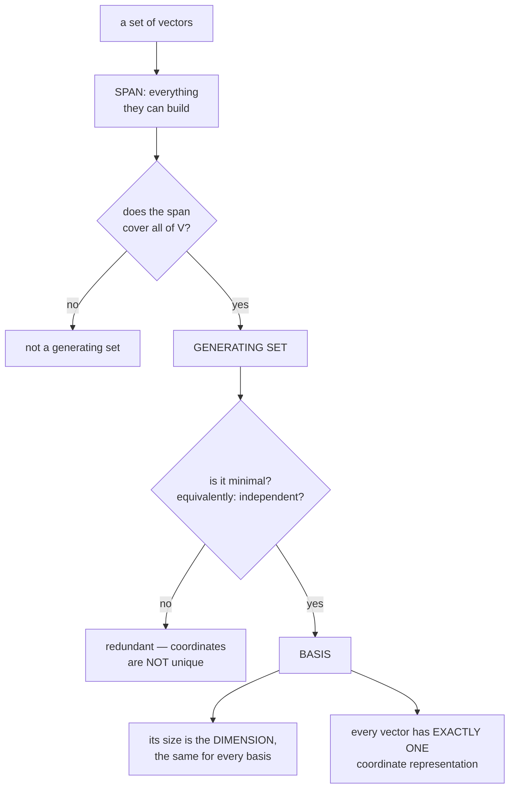

import DataCampExercise from "../../../../components/DataCampExercise.astro";
import Figure from "../../../../components/Figure.astro";
import Quiz from "../../../../components/Quiz.astro";
import SpanExplorer from "../../../../components/viz/math/SpanExplorer.tsx";

§2.5 asked which vectors in a pile are redundant. This section asks the two follow-up questions that
matter: **what is the smallest set that still builds everything**, and **how many vectors is that?**

The answers are the **basis** and the **rank**, and the rank turns out to be the single most
informative number you can extract from a matrix. It decides invertibility, solvability, the dimension
of the image, the dimension of the null space, and — once §4.6 arrives — how well the matrix can be
compressed.

## What you'll learn

- Generating set, span, and what makes a generating set **minimal**.
- Four equivalent ways to say "basis", and why the fourth one (unique coordinates) is the useful one.
- Why every basis of a space has the **same size**, which is what makes dimension well defined.
- Rank, and the six properties of it that do all the work.
- Why a basis is not unique but the **rank is** — and how to find a basis of a subspace in three steps.

## Intuition: describing any location in a city

Take a city on a grid. "Three blocks east, two blocks north" locates anything. Two directions are
enough, and neither is redundant — drop "north" and the whole northern half of the city becomes
unreachable.

That pair is a **basis**: enough to reach everything (a *generating set*), with nothing to spare
(*linearly independent*). Add "four blocks north-east" as a third direction and you still reach
everything, but the set is no longer minimal — the description of a location stops being unique,
because you can now get there in more than one way.

**Uniqueness is what you buy by insisting on minimality**, and it is the whole reason bases matter.



## The math

### Generating set and span

Given a vector space $V$ and a set $\mathcal{A} = \{\mathbf{x}_1,\dots,\mathbf{x}_k\} \subseteq \mathcal{V}$:

- If every $\mathbf{v} \in \mathcal{V}$ can be written as a linear combination of $\mathbf{x}_1,\dots,\mathbf{x}_k$, then $\mathcal{A}$ is a **generating set** of $V$.
- The set of *all* linear combinations of vectors in $\mathcal{A}$ is the **span** of $\mathcal{A}$.
- If $\mathcal{A}$ spans $V$ we write $V = \operatorname{span}[\mathcal{A}]$, or $V = \operatorname{span}[\mathbf{x}_1,\dots,\mathbf{x}_k]$.

The span is always a subspace — it contains $\mathbf{0}$ (all coefficients zero) and it is closed under
both operations by construction. So "span" is the standard way to *manufacture* a subspace, and §2.4's
closing remark said every subspace arises this way.

### Basis

A generating set $\mathcal{A}$ of $V$ is **minimal** if there is no smaller set
$\tilde{\mathcal{A}} \subsetneq \mathcal{A}$ that still spans $V$. **Every linearly independent
generating set is minimal, and is called a basis of $V$.**

The book then gives four equivalent characterisations, and they are worth knowing as a group because
different problems make different ones easy to check. For $\mathcal{B} \subseteq \mathcal{V}$ nonempty,
these are the same statement:

1. $\mathcal{B}$ is a **basis** of $V$.
2. $\mathcal{B}$ is a **minimal generating set**.
3. $\mathcal{B}$ is a **maximal linearly independent set** — adding any other vector of $V$ makes it dependent.
4. **Every** $\mathbf{x} \in V$ is a linear combination of vectors from $\mathcal{B}$, and **that combination is unique**:

$$
\mathbf{x} = \sum_{i=1}^{k}\lambda_i\mathbf{b}_i = \sum_{i=1}^{k}\psi_i\mathbf{b}_i
\quad\Longrightarrow\quad
\lambda_i = \psi_i \text{ for all } i
$$

Characterisation 3 is the sharpest framing: a basis is squeezed from both sides. Too few vectors and it
does not span; too many and it is dependent. It sits exactly at the boundary — **minimal among
spanning sets and maximal among independent sets at the same time**.

Characterisation 4 is the one you actually use. Unique coordinates are what make "the coordinates of
$\mathbf{x}$" a well-defined phrase, and §2.7 builds the entire transformation-matrix machinery on top
of it.

:::tip[Why uniqueness follows from independence]
One line, and it is the reason the two conditions are the same. Suppose
$\sum_i\lambda_i\mathbf{b}_i = \sum_i\psi_i\mathbf{b}_i$. Subtracting,

$$
\sum_{i}(\lambda_i - \psi_i)\mathbf{b}_i = \mathbf{0}
$$

Independence says the only combination reaching zero is the trivial one, so every
$\lambda_i - \psi_i = 0$. Uniqueness of coordinates **is** linear independence, rewritten.
:::

### Dimension

Every vector space has a basis, and there are **many** of them — no basis is unique. But all of them
have the **same number of elements**, and that number is the **dimension** $\dim(V)$.

That invariance is what makes dimension meaningful, and it is not obvious. Two people can pick totally
different bases of $\mathbb{R}^3$ and both will have exactly three vectors.

For a subspace $U \subseteq V$: $\dim(U) \le \dim(V)$, with equality **if and only if** $U = V$. So a
proper subspace is always strictly lower dimensional — there is no "same-dimension proper subspace".

:::caution[Dimension is not the number of entries in a vector]
The book's own remark, and a genuine trap. The space
$V = \operatorname{span}\!\left[\begin{bmatrix}0\\1\end{bmatrix}\right]$ is **one-dimensional**, even
though its single basis vector has two components.

Dimension counts **independent directions**, not coordinates. A line in $\mathbb{R}^{1000}$ is
one-dimensional. This is exactly the confusion Chapter 10 exists to exploit: data living in
$\mathbb{R}^{1000}$ often occupies a subspace of dimension 20, and PCA finds it.
:::

### Finding a basis of a subspace

Three steps, and the book states them as a recipe. For
$U = \operatorname{span}[\mathbf{x}_1,\dots,\mathbf{x}_m] \subseteq \mathbb{R}^n$:

1. Write the spanning vectors as the **columns** of a matrix $\mathbf{A}$.
2. Determine the **row-echelon form** of $\mathbf{A}$.
3. The spanning vectors belonging to the **pivot columns** are a basis of $U$.

This is §2.5's independence test, reused verbatim. Same computation, different question: there we asked
*whether* the set was independent, here we ask *which subset* is.

### Rank

The number of linearly independent **columns** of $\mathbf{A} \in \mathbb{R}^{m\times n}$ equals the
number of linearly independent **rows**, and that common number is the **rank**,
$\operatorname{rk}(\mathbf{A})$.

That equality is remarkable and easy to skate past. There is no obvious reason a matrix should have as
many independent rows as columns — the two counts are about different vectors living in different
spaces — and yet they always agree.

The six properties that do the work:

| property | statement |
| --- | --- |
| row rank = column rank | $\operatorname{rk}(\mathbf{A}) = \operatorname{rk}(\mathbf{A}^\top)$ |
| image dimension | the columns span a subspace $U \subseteq \mathbb{R}^m$ with $\dim(U) = \operatorname{rk}(\mathbf{A})$; this is the **image** or **range** |
| row space dimension | the rows span $W \subseteq \mathbb{R}^n$ with $\dim(W) = \operatorname{rk}(\mathbf{A})$ |
| invertibility | $\mathbf{A} \in \mathbb{R}^{n\times n}$ is invertible **iff** $\operatorname{rk}(\mathbf{A}) = n$ |
| solvability | $\mathbf{A}\mathbf{x} = \mathbf{b}$ is solvable **iff** $\operatorname{rk}(\mathbf{A}) = \operatorname{rk}(\mathbf{A}\mid\mathbf{b})$ |
| null-space dimension | the solutions of $\mathbf{A}\mathbf{x} = \mathbf{0}$ form a subspace of dimension $n - \operatorname{rk}(\mathbf{A})$ |

A matrix has **full rank** when $\operatorname{rk}(\mathbf{A}) = \min(m, n)$ — the largest possible for
its shape — and is **rank deficient** otherwise.

The solvability property is the one §2.1's classification code used, and the null-space property is
where §2.3's free-variable count came from. Both were stated there and are proved here.

## Worked example by hand

**The book's Example 2.17.** Find a basis of the subspace $U \subseteq \mathbb{R}^5$ spanned by

$$
\mathbf{x}_1 = \begin{bmatrix}1\\2\\-1\\-1\\-1\end{bmatrix},\;
\mathbf{x}_2 = \begin{bmatrix}2\\-1\\1\\2\\-2\end{bmatrix},\;
\mathbf{x}_3 = \begin{bmatrix}3\\-4\\3\\5\\-3\end{bmatrix},\;
\mathbf{x}_4 = \begin{bmatrix}-1\\8\\-5\\-6\\1\end{bmatrix}
$$

Write them as columns and reduce:

$$
\begin{bmatrix}
1 & 2 & 3 & -1\\
2 & -1 & -4 & 8\\
-1 & 1 & 3 & -5\\
-1 & 2 & 5 & -6\\
-1 & -2 & -3 & 1
\end{bmatrix}
\;\rightsquigarrow\;
\begin{bmatrix}
1 & 2 & 3 & -1\\
0 & 1 & 2 & -2\\
0 & 0 & 0 & 1\\
0 & 0 & 0 & 0\\
0 & 0 & 0 & 0
\end{bmatrix}
$$

Pivots sit in columns **1, 2 and 4**. So $\{\mathbf{x}_1, \mathbf{x}_2, \mathbf{x}_4\}$ is a basis of
$U$, and $\dim(U) = 3$. Column 3 is not a pivot column, so $\mathbf{x}_3$ is a combination of the
others — and indeed $\mathbf{x}_3 = -\mathbf{x}_1 + 2\mathbf{x}_2$, which you can check entry by entry:
$-1 + 4 = 3$ ✓, $-2 - 2 = -4$ ✓, $1 + 2 = 3$ ✓, $1 + 4 = 5$ ✓, $1 - 4 = -3$ ✓.

**The book's Example 2.18**, two rank calculations. First,

$$
\mathbf{A} = \begin{bmatrix}1 & 0 & 1\\ 0 & 1 & 1\\ 0 & 0 & 0\end{bmatrix}
$$

has two independent rows and two independent columns, so $\operatorname{rk}(\mathbf{A}) = 2$. Note the
third column is the sum of the first two, and the third row is zero — two different-looking
redundancies, one rank.

Second,

$$
\mathbf{A} = \begin{bmatrix}1 & 2 & 1\\ -2 & -3 & 1\\ 3 & 5 & 0\end{bmatrix}
\;\rightsquigarrow\;
\begin{bmatrix}1 & 2 & 1\\ 0 & 1 & 3\\ 0 & 0 & 0\end{bmatrix}
$$

so $\operatorname{rk}(\mathbf{A}) = 2$. It is $3\times3$ and rank 2, hence **not** invertible — and
$\det(\mathbf{A}) = 0$ follows, though we do not have determinants until §4.1.

**Row rank equals column rank, checked on a rectangle.** Take

$$
\mathbf{A} = \begin{bmatrix}1 & 2 & 3 & 4\\ 2 & 4 & 6 & 8\end{bmatrix}
$$

Rows: the second is twice the first, so **one** independent row. Columns: all four are multiples of
$(1,2)^\top$, so **one** independent column. Both give rank 1, from completely different counting.

And the derived quantities for this $\mathbf{A}$: image dimension $= 1$ (a line in $\mathbb{R}^2$),
null-space dimension $= n - \operatorname{rk} = 4 - 1 = 3$, and it is rank deficient because
$\min(m,n) = 2 \neq 1$.

## See it move

A basis is a coordinate system, and changing it changes the coordinates of a point **without moving
the point**. The white vector below is fixed; the amber basis rotates, and the coordinates rewrite
themselves to compensate.

```p5 title="One point, many bases" desc="The white vector x is fixed. The blue arrows are the standard basis; the amber arrows are an alternate basis that slowly rotates. The coordinates of x change with the basis, but the point never moves — that is what 'a basis is a coordinate system' means." height="360"
let ph = 0;
const U = 46;
let cx, cy;
function setup(){ createCanvas(600, 360); textFont("monospace"); cx = width/2 - 40; cy = height/2 + 6; }
function sx(x){ return cx + x*U; }
function sy(y){ return cy - y*U; }
function draw(){
  background(13,17,23);
  ph += 0.01;
  // grid + axes
  stroke(32,44,58); strokeWeight(1);
  for (let g=-4; g<=4; g++){ line(sx(-4),sy(g),sx(4),sy(g)); line(sx(g),sy(-4),sx(g),sy(4)); }
  stroke(70,82,96); strokeWeight(1.3);
  line(sx(-4),sy(0),sx(4),sy(0)); line(sx(0),sy(-4),sx(0),sy(4));

  const x = [2.4, 1.6];  // fixed point

  // standard basis (blue)
  drawArrow(sx(0),sy(0),sx(1),sy(0), color(75,139,190));
  drawArrow(sx(0),sy(0),sx(0),sy(1), color(75,139,190));

  // alternate basis (amber), rotating
  const a = ph;
  const b1 = [1.6*Math.cos(a), 1.6*Math.sin(a)];
  const b2 = [1.4*Math.cos(a+2.0), 1.4*Math.sin(a+2.0)];
  drawArrow(sx(0),sy(0),sx(b1[0]),sy(b1[1]), color(255,211,67));
  drawArrow(sx(0),sy(0),sx(b2[0]),sy(b2[1]), color(255,211,67));

  // solve x = c1 b1 + c2 b2  (2x2)
  const det = b1[0]*b2[1] - b1[1]*b2[0];
  let c1 = 0, c2 = 0, ok = Math.abs(det) > 0.08;
  if (ok){
    c1 = ( x[0]*b2[1] - x[1]*b2[0]) / det;
    c2 = (-x[0]*b1[1] + x[1]*b1[0]) / det;
  }

  // the fixed point x
  drawArrow(sx(0),sy(0),sx(x[0]),sy(x[1]), color(240,240,245));
  noStroke(); fill(255); ellipse(sx(x[0]),sy(x[1]),11,11);

  // labels
  noStroke(); textAlign(LEFT,TOP);
  fill(75,139,190); textSize(11); text("standard e1, e2", 16, height-44);
  fill(255,211,67); text("rotating basis b1, b2", 16, height-28);

  fill(255,211,67); textSize(15); text("A basis is a coordinate system", 16, 14);
  fill(230); textSize(12);
  text("x  =  [2.4, 1.6]  (fixed point)", 16, 40);
  fill(255,211,67); textSize(13);
  text(ok ? `x = ${c1.toFixed(2)} b1 + ${c2.toFixed(2)} b2`
          : "b1, b2 nearly collinear -- not a basis!", 16, 62);
  fill(150); textSize(11);
  text(`det[b1 b2] = ${det.toFixed(3)}`, 16, 84);
}
function drawArrow(x1,y1,x2,y2,c){
  stroke(c); strokeWeight(2.4); line(x1,y1,x2,y2);
  push(); translate(x2,y2); rotate(Math.atan2(y2-y1,x2-x1));
  fill(c); noStroke(); triangle(0,0,-9,-4,-9,4); pop();
}
```

Two things to watch. The coordinates $c_1, c_2$ swing wildly while the white dot never moves — the
point is basis-independent, the *description* is not. And when the two amber vectors line up, the
determinant passes through zero and the sketch says "not a basis": at that instant they span only a
line, so most points have **no** coordinates at all rather than non-unique ones.

### Extracting a basis from a spanning set

The book's three-step recipe, run one vector at a time. Accepted vectors turn green and become part of
the basis; rejected ones were already inside the span.

<SpanExplorer
  client:visible
  dim={3}
  vectors={[[1, 0, 0], [0, 1, 0], [2, 3, 0], [0, 0, 1]]}
  title="Four spanning vectors, three of them a basis"
  desc="The third is 2e1 + 3e2 and gets rejected; the fourth adds the missing direction. Rank 3 in R-3, so the accepted set is a basis of the whole space."
/>

Note what happened: the **third** vector was rejected, not the last. The recipe walks left to right and
keeps whatever is new, so the rejected vector is wherever the redundancy first becomes detectable — not
necessarily at the end.

## From scratch

```python title="basis_and_rank.py" showLineNumbers{1}
import numpy as np

def pivot_columns(A, tol=1e-10):
    """Row-echelon form; returns the pivot column indices."""
    M = A.astype(float).copy()
    rows, cols = M.shape
    piv, r = [], 0
    for c in range(cols):
        if r >= rows:
            break
        p = next((i for i in range(r, rows) if abs(M[i, c]) > tol), None)
        if p is None:
            continue
        M[[r, p]] = M[[p, r]]
        for i in range(r + 1, rows):
            M[i] -= (M[i, c] / M[r, c]) * M[r]
        piv.append(c)
        r += 1
    return piv, M

def basis_of_span(vectors):
    """The book's three-step recipe: columns, row-echelon form, pivot columns."""
    A = np.array(vectors, dtype=float).T
    piv, _ = pivot_columns(A)
    return piv, [vectors[i] for i in piv]

# ---- the book's Example 2.17 -------------------------------------------
X = [[ 1.0,  2.0, -1.0, -1.0, -1.0],
     [ 2.0, -1.0,  1.0,  2.0, -2.0],
     [ 3.0, -4.0,  3.0,  5.0, -3.0],
     [-1.0,  8.0, -5.0, -6.0,  1.0]]
piv, basis = basis_of_span(X)
print("pivot columns:", piv, " -> basis is x1, x2, x4")
print("dim(U):", len(piv))
# The book's claim: x3 is a combination of the others.
x1, x2, x3 = np.array(X[0]), np.array(X[1]), np.array(X[2])
print("x3 == -x1 + 2*x2 :", np.allclose(x3, -x1 + 2 * x2), " ", -x1 + 2 * x2)

# ---- the book's Example 2.18 ------------------------------------------
A1 = np.array([[1.0, 0.0, 1.0], [0.0, 1.0, 1.0], [0.0, 0.0, 0.0]])
A2 = np.array([[1.0, 2.0, 1.0], [-2.0, -3.0, 1.0], [3.0, 5.0, 0.0]])
print("\nExample 2.18 first  rank:", np.linalg.matrix_rank(A1))
print("Example 2.18 second rank:", np.linalg.matrix_rank(A2),
      " invertible:", np.linalg.matrix_rank(A2) == 3)

# ---- row rank equals column rank -------------------------------------
A = np.array([[1.0, 2.0, 3.0, 4.0],
              [2.0, 4.0, 6.0, 8.0]])
print("\ncolumn rank:", np.linalg.matrix_rank(A))
print("row rank   :", np.linalg.matrix_rank(A.T), " (same, always)")

# ---- the six properties, all six checked ------------------------------
m, n = A.shape
r = np.linalg.matrix_rank(A)
print("\nshape:", (m, n), " rank:", r)
print("  full rank?          ", r == min(m, n))
print("  image dimension     ", r, "(a line in R^2)")
print("  null-space dimension", n - r)
b_in = A @ np.array([1.0, 0.0, 0.0, 0.0])          # in the image by construction
b_out = np.array([1.0, 0.0])                        # NOT a multiple of (1,2)
for name, b in (("b in the image", b_in), ("b outside", b_out)):
    solvable = r == np.linalg.matrix_rank(np.c_[A, b])
    print(f"  {name:14s} solvable: {solvable}")

# ---- dimension is not the number of components -----------------------
V = np.array([[0.0, 1.0]]).T          # span of a single vector in R^2
print("\nbasis vector has", V.shape[0], "components")
print("but dim(span) =", np.linalg.matrix_rank(V), "-> one-dimensional")

# ---- every basis of a space has the same size -------------------------
rng = np.random.default_rng(3)
print("\nsizes of ten random bases of R^4:", end=" ")
sizes = []
for _ in range(10):
    B = rng.standard_normal((4, 4))
    sizes.append(int(np.linalg.matrix_rank(B)))
print(sizes, " all equal:", len(set(sizes)) == 1)

# ---- uniqueness of coordinates ----------------------------------------
Bmat = np.array([[1.0, 1.0], [0.0, 1.0]])          # a basis of R^2
x = np.array([2.4, 1.6])
coords = np.linalg.solve(Bmat, x)
print("\ncoordinates of x in this basis:", coords)
print("rebuild:", Bmat @ coords, " == x:", np.allclose(Bmat @ coords, x))
# With a DEPENDENT set, coordinates stop being unique.
Dep = np.array([[1.0, 1.0, 2.0], [0.0, 1.0, 1.0]])  # three vectors in R^2
sol = np.linalg.lstsq(Dep, x, rcond=None)[0]
null = np.array([1.0, 1.0, -1.0])                   # Dep @ null == 0
print("one solution :", np.round(sol, 4))
print("another      :", np.round(sol + 5 * null, 4))
print("both rebuild x:", np.allclose(Dep @ sol, x), np.allclose(Dep @ (sol + 5 * null), x))
```

```
pivot columns: [0, 1, 3]  -> basis is x1, x2, x4
dim(U): 3
x3 == -x1 + 2*x2 : True   [ 3. -4.  3.  5. -3.]

Example 2.18 first  rank: 2
Example 2.18 second rank: 2  invertible: False

column rank: 1
row rank   : 1  (same, always)

shape: (2, 4)  rank: 1
  full rank?           False
  image dimension      1 (a line in R^2)
  null-space dimension 3
  b in the image solvable: True
  b outside      solvable: False

basis vector has 2 components
but dim(span) = 1 -> one-dimensional

sizes of ten random bases of R^4: [4, 4, 4, 4, 4, 4, 4, 4, 4, 4]  all equal: True

coordinates of x in this basis: [0.8 1.6]
rebuild: [2.4 1.6]  == x: True
one solution : [-0.   0.8  0.8]
another      : [ 5.   5.8 -4.2]
both rebuild x: True True
```

Three readings.

**Example 2.17 is confirmed exactly**: pivot columns 1, 2 and 4, so $\dim(U) = 3$, and
$\mathbf{x}_3 = -\mathbf{x}_1 + 2\mathbf{x}_2$ reproduces $(3, -4, 3, 5, -3)$ to the digit.

**The six properties all hold on one small rank-1 matrix.** Note the solvability check: the same matrix
is solvable for one right-hand side and not for another, decided purely by whether appending
$\mathbf{b}$ raises the rank.

**The last block is characterisation 4, and its failure.** With a genuine basis the coordinates are
$(0.8, 1.6)$ — one answer. With three vectors in $\mathbb{R}^2$ the set still spans, so every point is
still reachable, but two completely different coefficient vectors rebuild the same $\mathbf{x}$.
Spanning survives redundancy; **uniqueness does not**. That is precisely what minimality buys.

## On real data

<Figure
  src="/images/mml/basis-and-rank/rank-tells-you-everything"
  alt="Four panels for matrices of decreasing rank. Each shows the singular-value spectrum as a bar chart, annotated with the rank, the image dimension, the null-space dimension and whether the matrix is invertible."
  title="One number, five consequences"
  caption="Rank is the count of nonzero singular values. Everything else in the annotation is derived from it and from the shape."
/>

<Figure
  src="/images/mml/basis-and-rank/effective-dimension"
  alt="Log plot of the 64 singular values of the handwritten-digits data alongside cumulative explained variance on a second axis. A dashed line marks the rank at 61 and a dotted line marks the 21 components that reach 90 percent of the variance."
  title="Ambient dimension versus the dimension that matters"
  caption="Rank says 61 of 64, and the three it discounts are blank border pixels. The variance says 21 components out of 61 — redundancy rank cannot see, which is what Chapter 10 acts on."
/>

## Reading the plot

The second figure is the bridge to Chapter 10, and it makes a point this section's definitions cannot.

It plots the 8-by-8 handwritten digit images: 1797 of them, 64 pixels each. Two numbers matter.

**The rank is 61, not 64.** So rank *does* notice some exact dependence here — and what it noticed is
dull: three border pixels are blank in every single image, so three columns are identically zero. That
is what exact linear dependence usually looks like in real data. It is a data-collection artefact, not
a structural insight.

**Twenty-one components carry 90% of the variance**, and twenty-nine carry 95%. That redundancy is the
interesting kind, and **rank is completely blind to it**, because those remaining directions are
*small* rather than *zero*. By the definitions on this page, all 61 surviving directions are equally
independent.

So there are two different notions of dimension in play. The **algebraic** one, rank, is an integer and
says 61. The **effective** one — how many directions matter — is not an integer at all, and depends on
how much variance you are willing to discard: 21 at 90%, 29 at 95%.

That gap is the entire opportunity Chapter 10 exploits. PCA does not look for a rank deficiency; it
looks for where the spectrum falls off and truncates there. §4.6's Eckart–Young theorem then says the
truncation is the best possible low-rank approximation.

:::tip[From the book]
*Mathematics for Machine Learning* §2.6.1 gives **Definition 2.13** (**generating set** and **span**),
noting that $\mathcal{A}$ is a generating set if every $\mathbf{v} \in \mathcal{V}$ is a linear
combination of its elements, and writing $V = \operatorname{span}[\mathcal{A}]$. **Definition 2.14**
(**basis**) defines a generating set as **minimal** when no smaller subset spans $V$, and states that
every linearly independent generating set is minimal and is a **basis**. The four equivalent
characterisations follow — basis, minimal generating set, maximal linearly independent set, and unique
representation (**Equation 2.77**) — with the marginal note that "a basis is a minimal generating set
and a maximal linearly independent set of vectors". **Example 2.16** gives the **canonical/standard
basis** of $\mathbb{R}^3$ (**Equation 2.78**), two other bases (**Equation 2.79**), and a set that is
independent but not a generating set of $\mathbb{R}^4$ (**Equation 2.80**). The following remarks state
that every vector space possesses a basis, that there is no unique basis but all bases have the same
number of elements — the **dimension** $\dim(V)$ — and that $\dim(U) \le \dim(V)$ for a subspace with
equality iff $U = V$. A further remark warns that "the dimension of a vector space is not necessarily
the number of elements in a vector", giving
$V = \operatorname{span}\!\left[\begin{bmatrix}0\\1\end{bmatrix}\right]$ as a one-dimensional example.
The three-step recipe for a basis of a subspace — spanning vectors as columns, row-echelon form, pivot
columns — precedes **Example 2.17**, which finds $\{\mathbf{x}_1,\mathbf{x}_2,\mathbf{x}_4\}$ a basis of
a subspace of $\mathbb{R}^5$ (**Equations 2.81–2.83**). §2.6.2 defines the **rank** as the common number
of linearly independent columns and rows, and its **Remark** lists the properties used above:
$\operatorname{rk}(\mathbf{A}) = \operatorname{rk}(\mathbf{A}^\top)$; the columns span the **image** or
**range** of dimension $\operatorname{rk}(\mathbf{A})$; the rows span a subspace of the same dimension;
$\mathbf{A} \in \mathbb{R}^{n\times n}$ is regular iff $\operatorname{rk}(\mathbf{A}) = n$;
$\mathbf{A}\mathbf{x} = \mathbf{b}$ is solvable iff
$\operatorname{rk}(\mathbf{A}) = \operatorname{rk}(\mathbf{A}\mid\mathbf{b})$; the solution space of
$\mathbf{A}\mathbf{x} = \mathbf{0}$ has dimension $n - \operatorname{rk}(\mathbf{A})$, later called the
**kernel** or **null space**; and **full rank** versus **rank deficient**. **Example 2.18** computes two
ranks, including via Gaussian elimination (**Equation 2.84**).
:::

## Pitfalls

:::danger[Dimension counts directions, not components]
A line in $\mathbb{R}^{1000}$ is one-dimensional. The book flags this explicitly. Confusing the two is
what makes "high-dimensional data" sound hopeless when the data may occupy a very low-dimensional
subspace — the observation Chapter 10 is built on.
:::

:::caution[A basis is not unique; the dimension is]
Any two people will produce different bases and the same count. So "the basis" is wrong phrasing unless
a specific one has been fixed — and §2.7's transformation matrices depend on *which* one, which is why
the book insists on **ordered** bases there.
:::

:::caution[Spanning and independence are different failures]
Too few vectors and you do not span, so some points have **no** coordinates. Too many and you span but
lose uniqueness, so some points have **many**. A basis is the unique size where neither happens, and
the two failure modes are not symmetric — one loses reachability, the other loses well-definedness.
:::

:::danger[Rank does not detect near-dependence]
Two features that are 99.99% collinear give full rank and a catastrophic condition number. Rank is an
integer answer to "exactly zero?"; the practical question is "how small?", answered by the singular
values or `np.linalg.cond`. Every regularisation technique in Chapter 9 exists because rank is the wrong
diagnostic here.
:::

:::caution[Full rank does not mean invertible]
Full rank means $\operatorname{rk} = \min(m,n)$. A $2\times4$ matrix of rank 2 has full rank and no
inverse, because it is not square. Invertibility needs square **and** $\operatorname{rk} = n$.
:::

## Compare

| concept | question it answers | is it unique? |
| --- | --- | --- |
| **span** | what can these vectors reach? | yes — a specific subspace |
| **generating set** | do they reach everything? | no — many exist, of many sizes |
| **basis** | the smallest set that reaches everything | **no** — many bases exist |
| **dimension** | how many vectors does any basis have? | **yes** |
| **rank** | how many independent directions does a matrix carry? | **yes** |
| **condition number** | how *close* to dependent are they? | yes, and it is the practical question |

<Quiz
  title="Check yourself"
  questions={[
    {
      q: "Which of these is NOT one of the four equivalent characterisations of a basis?",
      options: [
        "A minimal generating set",
        "A maximal linearly independent set",
        "A set in which every vector has a unique representation",
        "A set whose vectors are mutually orthogonal",
      ],
      answer: 3,
      explain:
        "Orthogonality is a much stronger extra condition — it makes an ORTHONORMAL basis, which is section 3.5's subject and genuinely more convenient. Plenty of perfectly good bases are not orthogonal.",
    },
    {
      q: "The span of a single two-component vector is what dimension?",
      options: ["Two, because the vector has two components", "One", "Zero", "It depends on the vector"],
      answer: 1,
      explain:
        "Dimension counts independent directions, not entries. The book gives exactly this example as a warning. A line in a thousand-dimensional space is still one-dimensional.",
    },
    {
      q: "A matrix is two-by-four with rank 2. What is the dimension of its null space?",
      options: ["Zero", "Two", "Three", "Four"],
      answer: 1,
      explain:
        "The null-space dimension is n minus the rank, where n is the number of columns. Four minus two is two. Note this matrix also has full rank, since the maximum possible for its shape is two — and it still has no inverse.",
    },
    {
      q: "Two features in a dataset are 99.99 percent collinear. What does the rank tell you?",
      options: [
        "The rank drops by one, flagging the problem",
        "Nothing useful — the rank is still full, because the dependence is not exact. The condition number is the diagnostic",
        "The rank becomes non-integer",
        "The matrix becomes singular",
      ],
      answer: 1,
      explain:
        "Rank answers 'exactly zero?' and the answer is no. Near dependence shows up as a tiny singular value and a huge condition number, which is why regularisation exists rather than a rank check.",
    },
  ]}
/>

## 🧪 Try It Yourself

### Exercise 1 – Extract a basis from a spanning set

<DataCampExercise
  lang="python"
  hint={`Stack the vectors as columns, then use matrix_rank to count how many are independent.`}
  code={`import numpy as np

X = np.array([[1.0, 0.0, 0.0],
              [0.0, 1.0, 0.0],
              [2.0, 3.0, 0.0],
              [0.0, 0.0, 1.0]])

A = X.___                      # replace ___ with T so the vectors are COLUMNS
print("matrix shape:", A.shape)
print("rank =", np.linalg.matrix_rank(A), "-> that many vectors form a basis")
print("third is 2*first + 3*second:", np.allclose(X[2], 2 * X[0] + 3 * X[1]))

# -- Expected output ------------------------------
# matrix shape: (3, 4)
# rank = 3 -> that many vectors form a basis
# third is 2*first + 3*second: True
# -------------------------------------------------`}
  solution={`import numpy as np
X = np.array([[1.0, 0.0, 0.0],
              [0.0, 1.0, 0.0],
              [2.0, 3.0, 0.0],
              [0.0, 0.0, 1.0]])
A = X.T
print("matrix shape:", A.shape)
print("rank =", np.linalg.matrix_rank(A), "-> that many vectors form a basis")
print("third is 2*first + 3*second:", np.allclose(X[2], 2 * X[0] + 3 * X[1]))`}
  sct={`test_output_contains("rank = 3")
success_msg("Four spanning vectors, three of them a basis. The redundant one was the third, not the last.")`}
  height={215}
/>

### Exercise 2 – Row rank equals column rank

<DataCampExercise
  lang="python"
  hint={`matrix_rank of A and of A.T must agree, for any matrix at all.`}
  code={`import numpy as np

rng = np.random.default_rng(0)
for shape in [(2, 5), (5, 2), (4, 4), (7, 3)]:
    A = rng.standard_normal(shape)
    A[-1] = A[0]                              # force one dependent row
    same = np.linalg.matrix_rank(A) == np.linalg.matrix_rank(A.___)   # replace ___ with T
    print(f"shape {shape}  rank {np.linalg.matrix_rank(A)}  row==col: {same}")

# -- Expected output ------------------------------
# shape (2, 5)  rank 1  row==col: True
# shape (5, 2)  rank 2  row==col: True
# shape (4, 4)  rank 3  row==col: True
# shape (7, 3)  rank 3  row==col: True
# -------------------------------------------------`}
  solution={`import numpy as np
rng = np.random.default_rng(0)
for shape in [(2, 5), (5, 2), (4, 4), (7, 3)]:
    A = rng.standard_normal(shape)
    A[-1] = A[0]
    same = np.linalg.matrix_rank(A) == np.linalg.matrix_rank(A.T)
    print(f"shape {shape}  rank {np.linalg.matrix_rank(A)}  row==col: {same}")`}
  sct={`test_output_contains("row==col: True")
success_msg("Always. Two different counts, about vectors in different spaces, that never disagree.")`}
  height={230}
/>

### Exercise 3 – The null-space dimension

<DataCampExercise
  lang="python"
  hint={`The null-space dimension is the number of columns minus the rank.`}
  code={`import numpy as np

A = np.array([[1.0, 2.0, 3.0, 4.0],
              [2.0, 4.0, 6.0, 8.0]])

m, n = A.shape
r = np.linalg.matrix_rank(A)
null_dim = n - ___                       # replace ___ with r

print(f"shape {A.shape}, rank {r}")
print("null-space dimension:", null_dim)
print("full rank?", r == min(m, n), " invertible?", m == n and r == n)

# -- Expected output ------------------------------
# shape (2, 4), rank 1
# null-space dimension: 3
# full rank? False  invertible? False
# -------------------------------------------------`}
  solution={`import numpy as np
A = np.array([[1.0, 2.0, 3.0, 4.0],
              [2.0, 4.0, 6.0, 8.0]])
m, n = A.shape
r = np.linalg.matrix_rank(A)
null_dim = n - r
print(f"shape {A.shape}, rank {r}")
print("null-space dimension:", null_dim)
print("full rank?", r == min(m, n), " invertible?", m == n and r == n)`}
  sct={`test_output_contains("null-space dimension: 3")
success_msg("Four columns, rank one, so three independent directions map to zero.")`}
  height={215}
/>

### Exercise 4 – Uniqueness is what minimality buys

<DataCampExercise
  lang="python"
  hint={`With three vectors spanning R-2 the coefficients are not unique: add a null-space vector to any solution.`}
  code={`import numpy as np

Dep = np.array([[1.0, 1.0, 2.0],
                [0.0, 1.0, 1.0]])          # three vectors in R^2 — spans, not a basis
x = np.array([2.4, 1.6])

sol  = np.linalg.lstsq(Dep, x, rcond=None)[0]
null = np.array([1.0, 1.0, -1.0])          # Dep @ null is zero
other = sol + 5 * ___                      # replace ___ with null

print("Dep @ null =", Dep @ null)
print("both rebuild x:", np.allclose(Dep @ sol, x), np.allclose(Dep @ other, x))
print("but the coefficients differ:", not np.allclose(sol, other))

# -- Expected output ------------------------------
# Dep @ null = [0. 0.]
# both rebuild x: True True
# but the coefficients differ: True
# -------------------------------------------------`}
  solution={`import numpy as np
Dep = np.array([[1.0, 1.0, 2.0],
                [0.0, 1.0, 1.0]])
x = np.array([2.4, 1.6])
sol  = np.linalg.lstsq(Dep, x, rcond=None)[0]
null = np.array([1.0, 1.0, -1.0])
other = sol + 5 * null
print("Dep @ null =", Dep @ null)
print("both rebuild x:", np.allclose(Dep @ sol, x), np.allclose(Dep @ other, x))
print("but the coefficients differ:", not np.allclose(sol, other))`}
  sct={`test_output_contains("but the coefficients differ: True")
success_msg("Spanning survived the redundancy; uniqueness did not. That is exactly what a basis protects.")`}
  height={235}
/>

### Exercise 5 – Rank is blind to near-dependence

<DataCampExercise
  lang="python"
  hint={`Build two nearly identical columns and compare matrix_rank against np.linalg.cond.`}
  code={`import numpy as np

for eps in [1e-1, 1e-4, 1e-8, 1e-12]:
    A = np.array([[1.0, 1.0],
                  [1.0, 1.0 + eps],
                  [1.0, 1.0 - eps]])
    print(f"eps={eps:.0e}  rank={np.linalg.matrix_rank(A)}  "
          f"cond={np.linalg.___(A):.2e}")          # replace ___ with cond

# -- Expected output ------------------------------
# eps=1e-01  rank=2  cond=2.45e+01
# eps=1e-04  rank=2  cond=2.45e+04
# eps=1e-08  rank=2  cond=2.45e+08
# eps=1e-12  rank=2  cond=2.45e+12
# -------------------------------------------------`}
  solution={`import numpy as np
for eps in [1e-1, 1e-4, 1e-8, 1e-12]:
    A = np.array([[1.0, 1.0],
                  [1.0, 1.0 + eps],
                  [1.0, 1.0 - eps]])
    print(f"eps={eps:.0e}  rank={np.linalg.matrix_rank(A)}  "
          f"cond={np.linalg.cond(A):.2e}")`}
  sct={`test_output_contains("eps=1e-12  rank=2")
success_msg("The rank never budges while the condition number climbs twelve orders. Rank is the wrong diagnostic for near-dependence.")`}
  height={215}
/>

## Recall card

- **The span of a set is every linear combination of it**, and a span is always a subspace — which is how subspaces are manufactured.
- **A generating set reaches everything; a basis is a generating set that is also minimal**, equivalently linearly independent.
- **Four equivalent characterisations of a basis** — basis, minimal generating set, maximal independent set, and unique representation of every vector.
- **A basis is squeezed from both sides**: minimal among spanning sets and maximal among independent sets simultaneously.
- **Uniqueness of coordinates IS linear independence rewritten** — subtract two representations and independence forces the difference to vanish.
- **No basis is unique but every basis of a space has the same size**, and that invariant number is the dimension.
- **Dimension counts independent directions, not components** — a line in a thousand-dimensional space is one-dimensional.
- **A basis of a subspace comes from three steps**: spanning vectors as columns, row-echelon form, keep the pivot columns.
- **Row rank equals column rank, always** — two counts about vectors in different spaces that never disagree.
- **Rank decides invertibility, solvability, image dimension and null-space dimension** — the null space has dimension $n$ minus the rank.
- **Full rank is not the same as invertible**: full rank means the most its shape allows, and a non-square matrix can never be inverted.
- **Rank is blind to near-dependence.** It answers "exactly zero?"; the practical question is "how small?", answered by the singular values and the condition number.

**Next:** functions that are secretly matrices — **[Linear Mappings](../linear-mappings/)**.
