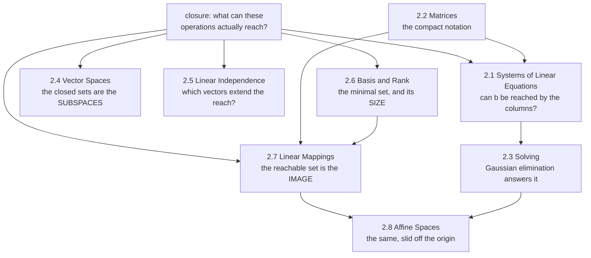

import MathDrillDeck from "../../../../components/MathDrillDeck.astro";
import Quiz from "../../../../components/Quiz.astro";

Linear algebra is the first foundation because it is the only one every other chapter needs. The
[dependency graph](../../chapter-01---introduction-and-motivation/two-ways-to-read-this-book/) makes
that quantitative: Chapter 2 appears in the prerequisite set of **all ten** other chapters, and it is
the only one that does.

The book opens it with a definition worth keeping: an **algebra** is "a set of objects and a set of
rules to manipulate these objects", and linear algebra is the algebra of **vectors**.

## What a vector actually is

The chapter's opening move is to generalise past arrows. A vector is any object that can be **added to
another of its kind** and **multiplied by a scalar**, with the result still of the same kind. Anything
satisfying those two closure properties qualifies, and the book lists four examples:

| example | why it is a vector |
| --- | --- |
| **geometric vectors** — directed segments | familiar from school; adding two arrows gives an arrow |
| **polynomials** | adding two polynomials gives a polynomial; scaling one gives one |
| **audio signals** | a series of numbers; sums and scalings are still audio signals |
| **elements of $\mathbb{R}^n$** | tuples of $n$ reals, added and scaled componentwise |

Polynomials are the surprising entry, and the book says so: they are "rather unusual" instances, and
"very different from geometric vectors" — geometric vectors are concrete drawings, polynomials are
abstract concepts — and yet they are vectors in exactly the same sense.

The chapter focuses on $\mathbb{R}^n$, for a specific reason: it "loosely corresponds to arrays of real
numbers on a computer", so algorithms formulated in $\mathbb{R}^n$ can be implemented directly. But the
book adds a warning in the margin worth repeating: **be careful to check whether array operations
actually perform vector operations** when you implement them. That is
[the `@` versus `*` trap](../../chapter-00---getting-ready/numpy-for-mathematics/), flagged before the
chapter even starts.

## The thread through all eight sections

One idea recurs and gets sharper each time: **closure** — what is the set of everything my operations
can produce? The book names it explicitly as "one major idea in mathematics".

Read that as one question asked five ways. §2.1 asks it about a particular target vector; §2.4 names
the sets that are closed; §2.5 asks which vectors enlarge the reach; §2.6 counts the minimum needed and
calls the count the **rank**; §2.7 names the reachable set the **image**. It is the same question every
time, and each section gives it a better name.

## The pages

| # | page | the big idea |
| --- | --- | --- |
| 2.1 | [Systems of Linear Equations](../systems-of-linear-equations/) | When can we solve $\mathbf{A}\mathbf{x} = \mathbf{b}$, and how many answers exist? Three outcomes, never two. |
| 2.2 | [Matrices](../matrices/) | The grid that stores data *and* transforms it. Multiplication is composition, and the columns are the images of the basis vectors. |
| 2.3 | [Solving Systems](../solving-systems-of-linear-equations/) | Gaussian elimination pivot by pivot; particular plus general; the minus-1 trick; and why libraries do something else at scale. |
| 2.4 | [Vector Spaces](../vector-spaces/) | Groups, the axioms, and subspaces — the sets that survive their own operations. |
| 2.5 | [Linear Independence](../linear-independence/) | When is a vector redundant? The trivial solution, and the pivot-column test. |
| 2.6 | [Basis and Rank](../basis-and-rank/) | The minimal set that builds everything, and the single most informative number about a matrix. |
| 2.7 | [Linear Mappings](../linear-mappings/) | Functions that are secretly matrices — once you fix a basis. Image, kernel, rank-nullity. |
| 2.8 | [Affine Spaces](../affine-spaces/) | Subspaces slid off the origin: lines, planes, hyperplanes, and why a network layer is affine. |
| — | [Chapter 2 Exercises and Solutions](../chapter-2-exercises-and-solutions/) | The book's own end-of-chapter exercises, worked, with NumPy verification. |
| — | [Chapter 2 Formula Sheet](../chapter-2-formula-sheet/) | Every result on one page, with a line on when to use each. |

Roughly eight hours for the eight concept pages if you do the exercises, which you should.

## Where each section is used later

The book gives its own forward map (its Figure 2.2), and it is worth having before you start rather
than after:

| from Chapter 2 | used in |
| --- | --- |
| matrices, systems | **Chapter 5** — vector calculus needs matrix operations throughout |
| linear and affine mappings | **Chapter 3** — geometry; **Chapter 12** — classification |
| basis, linear independence | **Chapter 10** — dimensionality reduction |
| projections (via §3.8, built on §2.6) | **Chapter 10** — PCA; **Chapter 9** — least squares |
| vector spaces, subspaces | everywhere — data is assumed to live in one |

Two of those deserve emphasis. **Chapter 10 uses projections for PCA**, and projections are built in
§3.8 directly on this chapter's notion of a subspace and its basis. **Chapter 9 solves least-squares
problems**, which are systems of linear equations that have no exact solution — §2.1's "no solution"
case, turned into a method.

## Prerequisites

- [Chapter 0](../../chapter-00---getting-ready/getting-ready-overview/) if your notation or NumPy is rusty. §2.5 onwards leans on Σ manipulation, and every page verifies itself in NumPy.
- Nothing else. This chapter starts from "what is a vector" and assumes no linear algebra at all.

You do **not** need calculus for Chapter 2.

<Quiz
  title="Before you start"
  questions={[
    {
      q: "The book calls polynomials vectors. Why?",
      options: [
        "Because they can be written as coefficient arrays",
        "Because adding two polynomials gives a polynomial and scaling one gives a polynomial — the only two properties the definition demands",
        "Because they can be plotted",
        "It is a loose analogy rather than a literal claim",
      ],
      answer: 1,
      explain:
        "The definition asks only for closure under addition and scalar multiplication. The book notes polynomials are 'rather unusual' instances and 'very different from geometric vectors', and are vectors in exactly the same sense regardless.",
    },
    {
      q: "Which chapter does the dependency graph show as the only universal prerequisite?",
      options: ["Chapter 5, vector calculus", "Chapter 2, linear algebra", "Chapter 6, probability", "Chapter 7, optimisation"],
      answer: 1,
      explain:
        "Chapter 2 appears in the transitive prerequisite set of all ten other chapters. Chapter 5 is next at six, then Chapters 3 and 7 at five each.",
    },
    {
      q: "The book focuses on R-n rather than on the abstract definition. What is the stated reason, and the stated caveat?",
      options: [
        "It is simpler; there is no caveat",
        "It corresponds loosely to arrays on a computer, so algorithms implement directly — but you must check that array operations really perform vector operations",
        "Because only R-n is finite-dimensional",
        "Because polynomials cannot be stored",
      ],
      answer: 1,
      explain:
        "That caveat is a margin note in the book and it is the at-versus-asterisk trap. An array operation that looks like a vector operation may not be one.",
    },
  ]}
/>

## Drill this chapter

Come back to this a day after reading a page, not immediately.

<MathDrillDeck chapters={["Chapter 02 - Linear Algebra"]} />

## Where §2.9 points next

Section 2.9 is two paragraphs: one list of textbooks, and one piece of structure that explains the
shape of the next eight chapters.

| §2.9's pointer | and where it lands in this module |
| --- | --- |
| *"we only covered Gaussian elimination here"* — other solvers exist | [Solving Systems of Linear Equations](../solving-systems-of-linear-equations/) measures why elimination is the one taught: the cost is cubic, and pivoting is not optional |
| the book separates **linear algebra** from **the geometry of a vector space** | that separation is the Chapter 2 / Chapter 3 boundary, and it is why nothing here mentions a length or an angle |
| Chapter 3's inner product **induces a norm** | [Inner Products](../../chapter-03---analytic-geometry/inner-products/), then [Norms](../../chapter-03---analytic-geometry/norms/) |
| ... which gives angles, lengths and distances | [Lengths and Distances](../../chapter-03---analytic-geometry/lengths-and-distances/), [Angles and Orthogonality](../../chapter-03---analytic-geometry/angles-and-orthogonality/) |
| ... which give **orthogonal projections** | [Orthogonal Projections](../../chapter-03---analytic-geometry/orthogonal-projections/) |
| *"projections turn out to be key in many machine learning algorithms"* | [Maximum Likelihood as Orthogonal Projection](../../chapter-09---linear-regression/maximum-likelihood-as-orthogonal-projection/) in Chapter 9, and the whole of Chapter 10 |

**The sentence to carry forward is the one about projections.** Chapter 9's least-squares solution and
Chapter 10's PCA are the same geometric operation applied to different objects, and neither is
available until Chapter 3 supplies the inner product this chapter deliberately does without.

## Recall card

- **Linear algebra is the algebra of vectors** — a set of objects plus rules for manipulating them.
- **A vector is anything closed under addition and scalar multiplication**, which admits geometric vectors, polynomials, audio signals and tuples of reals equally.
- **The chapter focuses on R-n because it corresponds to arrays on a computer**, with the caveat that an array operation may not be the vector operation you meant.
- **Closure is the thread through all eight sections** — reachability in §2.1, subspaces in §2.4, independence in §2.5, rank in §2.6, image in §2.7.
- **Chapter 2 is the only universal prerequisite** in the book's dependency graph.
- **Least squares in Chapter 9 is §2.1's no-solution case turned into a method**, and PCA in Chapter 10 is built on this chapter's subspaces via §3.8's projections.

**Start with:** [Systems of Linear Equations](../systems-of-linear-equations/) — the problem linear
algebra was invented for.
