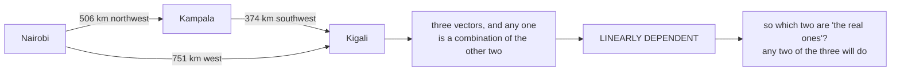

import DataCampExercise from "../../../../components/DataCampExercise.astro";
import Figure from "../../../../components/Figure.astro";
import Quiz from "../../../../components/Quiz.astro";
import SpanExplorer from "../../../../components/viz/math/SpanExplorer.tsx";

The book calls linear independence "one of the most important concepts in linear algebra", and the
intuition it offers is the one to hold on to: a linearly independent set has **no redundancy** — remove
any vector from it and you lose something.

That framing turns an abstract condition into a practical question. Given a pile of vectors, which of
them are actually pulling their weight?

## What you'll learn

- What a **linear combination** is, and why the zero vector is always a trivial one.
- The definition of independence via "**only** the trivial solution", and why the word *only* is the whole definition.
- Five quick shortcuts for spotting dependence without any computation.
- The reliable test: write the vectors as columns and look at the **pivot columns**.
- Why independence is a property of a **set**, never of a single vector — and why the answer depends on the *order* you offer them in.

## Intuition: giving directions in East Africa

This is the book's own **Example 2.13**, and it is the best one in the chapter.

You are in Nairobi and want to describe where Kigali is. You could say:

> "Go **506 km northwest** to Kampala, then **374 km southwest**."

That is enough. Two directions, and Kigali is pinned down — the geographic coordinate system is a
two-dimensional vector space if we ignore altitude and the Earth's curvature.

Now someone adds: *"It is about **751 km west** of here."* Perfectly true, and **completely
unnecessary**. The 751-km-west vector is a linear combination of the other two, so the set of three is
**linearly dependent**.



And note the symmetry the book points out: the redundancy is not attached to any particular vector.
Given "751 km west" and "374 km southwest", you can combine them to get "506 km northwest". **Any two
of the three suffice; no one of them is the odd one out.** That is why independence is a property of
the *set*.

## The math

### Linear combinations

Given a vector space $V$ and vectors $\mathbf{x}_1,\dots,\mathbf{x}_k \in V$, every vector of the form

$$
\mathbf{v} = \lambda_1\mathbf{x}_1 + \cdots + \lambda_k\mathbf{x}_k = \sum_{i=1}^{k}\lambda_i\mathbf{x}_i \in V
$$

with $\lambda_1,\dots,\lambda_k \in \mathbb{R}$ is a **linear combination** of them.

The zero vector can *always* be written as one, because $\mathbf{0} = \sum_i 0\,\mathbf{x}_i$ is
always true. That combination — every coefficient zero — is the **trivial** one, and it is available
for free no matter what the vectors are. So it tells you nothing.

The interesting question is whether there is a **non-trivial** way to reach zero.

### The definition

$$
\mathbf{x}_1,\dots,\mathbf{x}_k \text{ are \textbf{linearly dependent}}
\iff
\exists\,\lambda_1,\dots,\lambda_k \text{ with at least one } \lambda_i \neq 0
\text{ such that } \sum_{i=1}^{k}\lambda_i\mathbf{x}_i = \mathbf{0}
$$

$$
\mathbf{x}_1,\dots,\mathbf{x}_k \text{ are \textbf{linearly independent}}
\iff
\sum_{i=1}^{k}\lambda_i\mathbf{x}_i = \mathbf{0}
\text{ forces } \lambda_1 = \cdots = \lambda_k = 0
$$

Read the second one carefully. It does **not** say "the trivial solution exists" — that is always
true. It says the trivial solution is the **only** one. The entire content of the definition is in
that word.

:::tip[Why "reaching zero" is the right question]
It looks like an odd thing to ask. Here is why it is exactly right.

Suppose some non-trivial combination gives $\mathbf{0}$, say $\lambda_3 \neq 0$. Then

$$
\lambda_3\mathbf{x}_3 = -\sum_{i \neq 3}\lambda_i\mathbf{x}_i
\quad\Longrightarrow\quad
\mathbf{x}_3 = -\frac{1}{\lambda_3}\sum_{i \neq 3}\lambda_i\mathbf{x}_i
$$

so $\mathbf{x}_3$ **is** a combination of the others — it is redundant, and you can throw it away
without shrinking the span. Conversely if one vector is a combination of the others, moving it to the
other side produces a non-trivial route to zero.

"Some non-trivial combination reaches zero" and "some vector is redundant" are the same statement.
Zero is just the convenient place to write the condition down, because it makes it a **homogeneous
system** — which §2.3 already knows how to solve.
:::

### Five shortcuts

Straight from the book's remarks, and worth internalising because they save real work:

1. **There is no third option.** $k$ vectors are either linearly dependent or linearly independent.
2. **If any $\mathbf{x}_i = \mathbf{0}$, the set is dependent.** Take $\lambda_i = 1$ and everything else zero — a non-trivial route to zero, immediately.
3. **If two vectors are identical, the set is dependent.** Take $+1$ and $-1$ on the pair.
4. **A set of nonzero vectors with $k \ge 2$ is dependent if and only if at least one of them is a linear combination of the others.**
5. **In particular, if $\mathbf{x}_i = \lambda\mathbf{x}_j$ for any $\lambda$, the set is dependent.** One vector being a multiple of another is the commonest case.

Shortcut 2 is the cheapest test in linear algebra, and the one most often forgotten. A single zero
column makes an entire set dependent regardless of how well behaved the rest are.

### The reliable test: pivot columns

Write the vectors as the **columns** of a matrix and run Gaussian elimination to row-echelon form —
reduced form is unnecessary here. Then:

- **Pivot columns** indicate vectors that are linearly independent of the vectors **to their left**.
- **Non-pivot columns** can be expressed as linear combinations of the pivot columns to their left.
- **All the vectors are linearly independent if and only if every column is a pivot column.** One non-pivot column anywhere and the set is dependent.

The book's small illustration: the row-echelon form

$$
\begin{bmatrix}1 & 3 & 0\\ 0 & 0 & 2\end{bmatrix}
$$

says columns 1 and 3 are pivot columns and column 2 is not — because it is three times the first.

:::caution[The test imposes an ordering, and the book says so]
"Note that there is an ordering of vectors when the matrix is built." Pivot columns are independent of
what is *to their left*, so which vectors get accepted depends on the order you list them in.

Offer the East Africa vectors as (northwest, southwest, west) and the first two are pivots. Offer them
as (west, southwest, northwest) and the first two are pivots — a **different** pair, equally valid.
What never changes is the **count**: two. That number is the rank (§2.6), and it is order-independent
even though the surviving set is not.
:::

### And a shortcut for combinations of combinations

Two more remarks the book makes, both useful:

If $\mathbf{b}_1,\dots,\mathbf{b}_k$ are linearly independent and each $\mathbf{x}_j = \mathbf{B}\boldsymbol\lambda_j$
where $\mathbf{B} = [\mathbf{b}_1,\dots,\mathbf{b}_k]$, then

$$
\{\mathbf{x}_1,\dots,\mathbf{x}_m\} \text{ independent}
\iff
\{\boldsymbol\lambda_1,\dots,\boldsymbol\lambda_m\} \text{ independent}
$$

So you can test the *coefficient* vectors instead of the vectors themselves — which is usually much
smaller work, and is exactly what the book's **Example 2.15** does.

And a counting bound: **$m$ linear combinations of $k$ vectors are linearly dependent whenever
$m > k$.** You cannot have more independent vectors than the dimension you are working in. Five
vectors in $\mathbb{R}^3$ are dependent, without looking at them.

## Worked example by hand

**The book's Example 2.14.** Are these independent in $\mathbb{R}^4$?

$$
\mathbf{x}_1 = \begin{bmatrix}1\\2\\-3\\4\end{bmatrix},\quad
\mathbf{x}_2 = \begin{bmatrix}1\\1\\0\\2\end{bmatrix},\quad
\mathbf{x}_3 = \begin{bmatrix}-1\\-2\\1\\1\end{bmatrix}
$$

Write them as columns and eliminate:

$$
\begin{bmatrix}1 & 1 & -1\\ 2 & 1 & -2\\ -3 & 0 & 1\\ 4 & 2 & 1\end{bmatrix}
\;\rightsquigarrow\;\cdots\;\rightsquigarrow\;
\begin{bmatrix}1 & 1 & -1\\ 0 & 1 & 0\\ 0 & 0 & 1\\ 0 & 0 & 0\end{bmatrix}
$$

Every column is a pivot column, so the only solution to
$\lambda_1\mathbf{x}_1 + \lambda_2\mathbf{x}_2 + \lambda_3\mathbf{x}_3 = \mathbf{0}$ is
$\lambda_1 = \lambda_2 = \lambda_3 = 0$. **Independent.**

**The book's Example 2.15**, which shows the coefficient shortcut. With $\mathbf{b}_1,\dots,\mathbf{b}_4$
linearly independent and

$$
\begin{aligned}
\mathbf{x}_1 &= \mathbf{b}_1 - 2\mathbf{b}_2 + \mathbf{b}_3 - \mathbf{b}_4\\
\mathbf{x}_2 &= -4\mathbf{b}_1 - 2\mathbf{b}_2 + 4\mathbf{b}_4\\
\mathbf{x}_3 &= 2\mathbf{b}_1 + 3\mathbf{b}_2 - \mathbf{b}_3 - 3\mathbf{b}_4\\
\mathbf{x}_4 &= 17\mathbf{b}_1 - 10\mathbf{b}_2 + 11\mathbf{b}_3 + \mathbf{b}_4
\end{aligned}
$$

we never touch the $\mathbf{b}_i$ at all. We test the coefficient vectors:

$$
\mathbf{A} = \begin{bmatrix}1 & -4 & 2 & 17\\ -2 & -2 & 3 & -10\\ 1 & 0 & -1 & 11\\ -1 & 4 & -3 & 1\end{bmatrix}
\;\rightsquigarrow\;
\begin{bmatrix}1 & 0 & 0 & -7\\ 0 & 1 & 0 & -15\\ 0 & 0 & 1 & -18\\ 0 & 0 & 0 & 0\end{bmatrix}
$$

The fourth column is **not** a pivot column, and the reduced form reads off the relation directly:

$$
\mathbf{x}_4 = -7\mathbf{x}_1 - 15\mathbf{x}_2 - 18\mathbf{x}_3
$$

so $\mathbf{x}_1,\dots,\mathbf{x}_4$ are **linearly dependent**. Note we proved something about four
vectors in an unknown space by doing arithmetic on four vectors in $\mathbb{R}^4$.

**A tiny case, entirely by hand.** Are $(1,2)$, $(2,4)$ independent? Look for $\lambda_1, \lambda_2$
with

$$
\lambda_1\begin{bmatrix}1\\2\end{bmatrix} + \lambda_2\begin{bmatrix}2\\4\end{bmatrix} = \begin{bmatrix}0\\0\end{bmatrix}
$$

The first row gives $\lambda_1 = -2\lambda_2$; the second gives $2\lambda_1 = -4\lambda_2$, the same
condition. So $\lambda_2 = 1, \lambda_1 = -2$ works — non-trivial. **Dependent**, as shortcut 5
predicted, since $(2,4) = 2(1,2)$.

And the count check: three vectors in $\mathbb{R}^2$ must be dependent, because $m = 3 > k = 2$. No
arithmetic required.

## See it move

The parallelogram two vectors span has area equal to the determinant. When the second vector lines up
with the first, that area collapses to zero — and zero area **is** dependence.

```p5 title="Independence = nonzero area" desc="A fixed amber vector and a rotating violet vector. The parallelogram they span has an area equal to the determinant. When the violet vector lines up with the amber one, the area collapses to zero and the vectors become linearly dependent." height="360"
let ph = 0;
const U = 52;
let cx, cy;
function setup(){ createCanvas(600, 360); textFont("monospace"); cx = width/2; cy = height/2 + 6; }
function sx(x){ return cx + x*U; }
function sy(y){ return cy - y*U; }
function draw(){
  background(13,17,23);
  ph += 0.012;
  // grid + axes
  stroke(34,46,60); strokeWeight(1);
  for (let g=-4; g<=4; g++){ line(sx(-4),sy(g),sx(4),sy(g)); line(sx(g),sy(-4),sx(g),sy(4)); }
  stroke(70,82,96); strokeWeight(1.3);
  line(sx(-4),sy(0),sx(4),sy(0)); line(sx(0),sy(-4),sx(0),sy(4));

  // vectors
  const v1 = [2.2, 0.6];                       // fixed (amber)
  const ang = ph;                              // rotating angle for v2
  const r2 = 2.0;
  const v2 = [r2*Math.cos(ang), r2*Math.sin(ang)];
  // determinant (signed area of parallelogram)
  const det = v1[0]*v2[1] - v1[1]*v2[0];
  const dependent = Math.abs(det) < 0.12;

  // parallelogram (0, v1, v1+v2, v2)
  const p0=[0,0], pa=v1, pb=v2, pab=[v1[0]+v2[0], v1[1]+v2[1]];
  noStroke();
  fill(dependent ? color(232,110,110,60) : color(120,200,140,55));
  beginShape();
  vertex(sx(p0[0]),sy(p0[1])); vertex(sx(pa[0]),sy(pa[1]));
  vertex(sx(pab[0]),sy(pab[1])); vertex(sx(pb[0]),sy(pb[1]));
  endShape(CLOSE);

  drawArrow(sx(0),sy(0),sx(v1[0]),sy(v1[1]), color(255,211,67));
  drawArrow(sx(0),sy(0),sx(v2[0]),sy(v2[1]), color(197,153,255));

  // labels
  noStroke(); textAlign(LEFT,TOP);
  fill(255,211,67); textSize(12); text("x1 (fixed)", sx(v1[0])+6, sy(v1[1]));
  fill(197,153,255); text("x2 (rotating)", sx(v2[0])+6, sy(v2[1]));

  fill(255,211,67); textSize(15); textAlign(LEFT,TOP);
  text("Linear independence", 18, 14);
  fill(200,210,220); textSize(13);
  text(`determinant (area) = ${det.toFixed(2)}`, 18, 40);
  fill(dependent ? color(232,110,110) : color(120,200,140)); textSize(14);
  textAlign(CENTER,BOTTOM);
  text(dependent ? "area is 0  ->  LINEARLY DEPENDENT (collinear)"
                 : "area is nonzero  ->  LINEARLY INDEPENDENT",
       width/2, height-12);
}
function drawArrow(x1,y1,x2,y2,c){
  stroke(c); strokeWeight(2.5); line(x1,y1,x2,y2);
  push(); translate(x2,y2); rotate(Math.atan2(y2-y1,x2-x1));
  fill(c); noStroke(); triangle(0,0,-9,-4,-9,4); pop();
}
```

The determinant readout passes through zero **twice** per revolution — once when the vectors point the
same way and once when they point opposite. Both are dependence: $\mathbf{x}_2 = \lambda\mathbf{x}_1$
with $\lambda$ negative is just as dependent as with $\lambda$ positive. Shortcut 5 says "for any
$\lambda$", and the sketch shows why the sign is irrelevant.

### Offering vectors one at a time

The lab below runs the book's own procedure: each candidate is tested against the span of what has
already been accepted, and the **residual** — the part of it sticking out of that span — is what
decides. Zero residual means dependent.

<SpanExplorer
  client:visible
  dim={3}
  vectors={[[1, 2, -3], [2, -1, 1], [4, 3, -5]]}
  title="The third vector adds nothing"
  desc="Watch the red residual segment vanish on the last candidate — it was already in the plane the first two spanned."
/>

The third vector is $2\mathbf{x}_1 + \mathbf{x}_2$, so its residual is exactly zero and it is rejected.
Rank 2 in $\mathbb{R}^3$: the three vectors span a plane, not space.

And the order-dependence the book warns about, made concrete — the same three vectors, offered
backwards:

<SpanExplorer
  client:visible
  dim={3}
  vectors={[[4, 3, -5], [2, -1, 1], [1, 2, -3]]}
  title="Same vectors, different order, different basis"
  desc="Now the first two are accepted and the third is rejected. A different pair survives, and the rank is still two."
/>

A **different** pair survives. The rank does not move.

## From scratch

```python title="independence.py" showLineNumbers{1}
import numpy as np

def pivot_columns(A, tol=1e-10):
    """Row-echelon form, returning the pivot column indices.

    This is the book's test: write the vectors as columns, eliminate, and the
    pivot columns name the vectors that are independent of those to their LEFT.
    """
    M = A.astype(float).copy()
    rows, cols = M.shape
    piv, r = [], 0
    for c in range(cols):
        if r >= rows:
            break
        p = next((i for i in range(r, rows) if abs(M[i, c]) > tol), None)
        if p is None:
            continue
        M[[r, p]] = M[[p, r]]
        for i in range(r + 1, rows):
            M[i] -= (M[i, c] / M[r, c]) * M[r]
        piv.append(c)
        r += 1
    return piv, M

def independent(vectors):
    A = np.array(vectors, dtype=float).T          # vectors as COLUMNS
    piv, _ = pivot_columns(A)
    return len(piv) == A.shape[1], piv

# ---- the book's Example 2.14 -------------------------------------------
x1 = [1.0, 2.0, -3.0, 4.0]
x2 = [1.0, 1.0,  0.0, 2.0]
x3 = [-1.0, -2.0, 1.0, 1.0]
ok, piv = independent([x1, x2, x3])
print("Example 2.14 independent:", ok, " pivot columns:", piv)

# ---- the book's Example 2.15: test the COEFFICIENTS -------------------
A = np.array([[ 1.0, -4.0,  2.0,  17.0],
              [-2.0, -2.0,  3.0, -10.0],
              [ 1.0,  0.0, -1.0,  11.0],
              [-1.0,  4.0, -3.0,   1.0]])
piv, _ = pivot_columns(A)
print("\nExample 2.15 pivot columns:", piv, " -> independent:", len(piv) == 4)
print("rank:", np.linalg.matrix_rank(A))
# The relation the reduced form claims: x4 = -7 x1 - 15 x2 - 18 x3.
claim = -7 * A[:, 0] - 15 * A[:, 1] - 18 * A[:, 2]
print("x4 == -7x1 - 15x2 - 18x3 :", np.allclose(claim, A[:, 3]), " ", claim)

# ---- the five shortcuts, each demonstrated ---------------------------
print("\nshortcut 2, a zero vector makes the set dependent:",
      independent([[1.0, 0.0], [0.0, 0.0]])[0])
print("shortcut 3, two identical vectors:",
      independent([[1.0, 2.0], [1.0, 2.0]])[0])
print("shortcut 5, one a multiple of another:",
      independent([[1.0, 2.0], [2.0, 4.0]])[0])
print("shortcut 5 with a NEGATIVE multiple:",
      independent([[1.0, 2.0], [-3.0, -6.0]])[0])
print("counting bound, 3 vectors in R^2:",
      independent([[1.0, 0.0], [0.0, 1.0], [3.0, 5.0]])[0])

# ---- order changes the surviving set, never the count ----------------
v = [[1.0, 2.0, -3.0], [2.0, -1.0, 1.0], [4.0, 3.0, -5.0]]
print("\nforwards  pivots:", independent(v)[1], " rank:", np.linalg.matrix_rank(np.array(v).T))
print("backwards pivots:", independent(v[::-1])[1], " rank:",
      np.linalg.matrix_rank(np.array(v[::-1]).T))
print("third is 2*first + second:", np.allclose(np.array(v[2]), 2 * np.array(v[0]) + np.array(v[1])))

# ---- 2-D: independence is nonzero determinant ------------------------
print()
for pair in ([[2.2, 0.6], [0.6, 2.0]], [[2.2, 0.6], [4.4, 1.2]], [[2.2, 0.6], [-2.2, -0.6]]):
    D = np.array(pair, dtype=float).T
    print(f"  det = {np.linalg.det(D):+.4f}  independent: {independent(pair)[0]}")

# ---- rank is a NUMERICAL question, and needs a tolerance -------------
# No perturbation is needed to make the point: a matrix built to be exactly
# rank 3 already has five NONZERO singular values after the arithmetic.
rng = np.random.default_rng(0)
B = rng.standard_normal((6, 3))
C = np.c_[B, B @ rng.standard_normal((3, 2))]     # exactly rank 3, by construction
sv = np.linalg.svd(C, compute_uv=False)
print("\nsingular values:", sv)
print("none is exactly zero:", not np.any(sv == 0.0))

m, n = C.shape
default_tol = max(m, n) * np.finfo(float).eps * sv[0]
print(f"default tolerance = max(m,n) * eps * s0 = {default_tol:.3e}")
print("rank, default tolerance :", np.linalg.matrix_rank(C))
print("rank, tol = 1e-16       :", np.linalg.matrix_rank(C, tol=1e-16))

# How large must a perturbation be before the DEFAULT answer changes?
for scale in (1e-16, 1e-15, 1e-14, 1e-13):
    g = np.random.default_rng(1)
    Cn = C + scale * g.standard_normal(C.shape)
    print(f"  perturbation {scale:.0e} -> default rank {np.linalg.matrix_rank(Cn)}")
```

```
Example 2.14 independent: True  pivot columns: [0, 1, 2]

Example 2.15 pivot columns: [0, 1, 2]  -> independent: False
rank: 3
x4 == -7x1 - 15x2 - 18x3 : True   [ 17. -10.  11.   1.]

shortcut 2, a zero vector makes the set dependent: False
shortcut 3, two identical vectors: False
shortcut 5, one a multiple of another: False
shortcut 5 with a NEGATIVE multiple: False
counting bound, 3 vectors in R^2: False
```

```
forwards  pivots: [0, 1]  rank: 2
backwards pivots: [0, 1]  rank: 2
third is 2*first + second: True

  det = +4.0400  independent: True
  det = +0.0000  independent: False
  det = +0.0000  independent: False

singular values: [5.85820278e+00 1.92322653e+00 5.97373480e-01 1.63064230e-16
 1.25180478e-16]
none is exactly zero: True
default tolerance = max(m,n) * eps * s0 = 7.805e-15
rank, default tolerance : 3
rank, tol = 1e-16       : 5
  perturbation 1e-16 -> default rank 3
  perturbation 1e-15 -> default rank 3
  perturbation 1e-14 -> default rank 5
  perturbation 1e-13 -> default rank 5
```

Three things to read off.

**Example 2.15 is confirmed exactly.** Three pivot columns out of four, and the relation
$\mathbf{x}_4 = -7\mathbf{x}_1 - 15\mathbf{x}_2 - 18\mathbf{x}_3$ reproduces the fourth coefficient
vector $(17, -10, 11, 1)$ to the digit. The book's claim, executed.

**The shortcut lines all print `False`** — which is the *correct* answer, because `independent` returns
whether the set is independent, and every one of those sets is dependent. Shortcut 2 and 3 needed no
arithmetic at all.

**Rank needs a tolerance, and no perturbation is required to show it.** The last block builds a matrix
that is *exactly* rank 3 by construction — two of its five columns are literal combinations of the
other three. Its singular values come back as $5.86$, $1.92$, $0.597$, and then $1.6\times10^{-16}$
and $1.3\times10^{-16}$. **Not one of them is zero.**

`matrix_rank` reports 3 because its default threshold is
$\max(m,n)\cdot\varepsilon\cdot\sigma_1 = 7.8\times10^{-15}$, comfortably above those last two. Lower the
threshold to $10^{-16}$ and the same matrix has rank **5**. Neither answer is wrong; the question
"is this number zero?" has no floating-point answer without a threshold.

The perturbation sweep locates the tipping point: noise at $10^{-15}$ still reports rank 3, and noise
at $10^{-14}$ reports 5. That boundary is not a property of the mathematics — it is where the noise
crosses $7.8\times10^{-15}$. §2.6 makes this the defining practical difficulty of rank.

## On real data

<Figure
  src="/images/mml/linear-independence/dependence-is-zero-area"
  alt="Plot of the absolute determinant of two two-dimensional vectors as the second rotates through a full turn, showing two zeros where the vectors become collinear, one at zero degrees and one at 180 degrees."
  title="The determinant passes through zero twice per revolution"
  caption="Both crossings are dependence. A negative multiple is just as redundant as a positive one, which is why the shortcut says 'for any lambda'."
/>

<Figure
  src="/images/mml/linear-independence/rank-tolerance"
  alt="Log plot of the singular values of a rank-three matrix that has been perturbed by noise of increasing size, with the default numerical rank tolerance drawn as a horizontal line. As the noise grows the trailing singular values rise above the line and the reported rank increases."
  title="Where the reported rank comes from"
  caption="Rank is the count of singular values above a tolerance. The trailing ones are never exactly zero after any real computation, so the threshold is doing the deciding."
/>

## Reading the plot

The second figure is the honest picture of rank in practice. A matrix that is mathematically rank 3
has, after any floating-point arithmetic, **five** nonzero singular values — three large and two
around $10^{-16}$. `matrix_rank` reports 3 because it counts only those above a tolerance derived from
machine epsilon and the matrix size.

Push the noise up and the trailing singular values climb through the line, and the reported rank rises
with them. There is no noise level at which the answer flips cleanly, because the underlying quantity
is continuous and the answer is an integer.

The practical consequence: **"are these features independent?" is not a yes/no question on real data.**
It is a question about how close to dependent they are, which is what the condition number measures and
what §9.2's regularisation exists to handle. Two features that are 99.99% collinear will be reported
as independent and will still wreck a linear fit.

:::tip[From the book]
*Mathematics for Machine Learning* §2.5 gives **Definition 2.11** (**linear combination**,
**Equation 2.65**) and notes that $\mathbf{0}$ is always a linear combination of any $k$ vectors via
$\mathbf{0} = \sum_i 0\mathbf{x}_i$, so the interest is in **non-trivial** combinations reaching zero.
**Definition 2.12** (**linear (in)dependence**) states that a non-trivial combination summing to
$\mathbf{0}$ with at least one $\lambda_i \neq 0$ makes the vectors **linearly dependent**, and that
only the trivial solution makes them **linearly independent**; the book calls independence "one of the
most important concepts in linear algebra" and gives the intuition that an independent set has "no
redundancy, i.e., if we remove any of those vectors from the set, we will lose something".
**Example 2.13** with **Figure 2.7** is the geographic example: from Nairobi, "506 km Northwest" and
"374 km Southwest" are linearly independent, and the third "751 km West" vector is a linear combination
of them, making the set dependent — with the symmetric observation that "751 km West" and "374 km
Southwest" can be combined to obtain "506 km Northwest". The following **Remark** lists the properties
used above: no third option; a zero vector or two identical vectors force dependence; a set of nonzero
vectors with $k \ge 2$ is dependent iff one is a linear combination of the others, in particular if
$\mathbf{x}_i = \lambda\mathbf{x}_j$; and the practical Gaussian-elimination test with pivot columns
(**Equation 2.66**), including the caution that "there is an ordering of vectors when the matrix is
built" and the criterion that all columns are independent iff all are pivot columns. **Example 2.14**
verifies three vectors in $\mathbb{R}^4$ are independent (**Equations 2.67–2.69**). A further remark
(**Equations 2.70–2.72**) shows $\{\mathbf{x}_j\}$ is independent iff the coefficient vectors
$\{\boldsymbol\lambda_j\}$ are, and that $m$ combinations of $k$ vectors are dependent when $m > k$.
**Example 2.15** applies the coefficient test (**Equations 2.73–2.76**), finds the fourth column is not
a pivot column, and concludes $\mathbf{x}_4 = -7\mathbf{x}_1 - 15\mathbf{x}_2 - 18\mathbf{x}_3$.
:::

## Pitfalls

:::danger[Independence is a property of a set, not of a vector]
"Is this vector independent?" has no answer. The East Africa example makes the point: any two of the
three directions work, so no single vector is the redundant one. Ask instead which *subset* is
independent, and expect several correct answers.
:::

:::caution[The trivial solution always exists — that is not the test]
$\sum_i 0\mathbf{x}_i = \mathbf{0}$ holds for any vectors whatsoever. Independence requires the trivial
solution to be the **only** one. Every year someone "proves" a set independent by exhibiting the
trivial combination.
:::

:::caution[Check for a zero vector first]
It costs nothing and settles the question immediately. A set containing $\mathbf{0}$ is dependent no
matter what else is in it.
:::

:::danger[On real data, rank needs a tolerance and the tolerance decides]
After any floating-point arithmetic the "zero" singular values are around $10^{-16}$, not zero. What
`matrix_rank` reports depends on its threshold, and forcing the threshold down changes the answer. Near
dependence is the practical problem, and it does not show up as a rank deficiency at all — it shows up
as a large condition number.
:::

:::caution[More vectors than dimensions is automatic dependence]
$m$ vectors in $\mathbb{R}^k$ with $m > k$ are dependent, always. If a feature matrix is wider than it
is tall, its columns are dependent before you look at a single value — which is exactly the
$n < d$ regime §10.5 addresses.
:::

## Compare

| you want to know | cheapest route | cost |
| --- | --- | --- |
| is there a zero vector? | look | free |
| is one a multiple of another? | look | free |
| are there more vectors than dimensions? | compare counts | free |
| are two vectors in $\mathbb{R}^2$ independent? | determinant nonzero | $O(1)$ |
| which of $n$ vectors are independent? | pivot columns of the row-echelon form | $O(mn^2)$ |
| how many are independent? | `np.linalg.matrix_rank` | $O(mn^2)$ via SVD |
| how *close* to dependent are they? | `np.linalg.cond`, or the singular-value spread | $O(mn^2)$ via SVD |

The last row is the one that matters most in practice and is the one the definition does not ask about.

<Quiz
  title="Check yourself"
  questions={[
    {
      q: "What exactly does linear independence require?",
      options: [
        "That the trivial combination sums to zero",
        "That the trivial combination is the ONLY one summing to zero",
        "That no combination sums to zero",
        "That all the vectors are nonzero",
      ],
      answer: 1,
      explain:
        "The trivial combination always sums to zero, for any vectors at all, so its existence proves nothing. The definition is about uniqueness — nothing else reaches zero.",
    },
    {
      q: "In the book's East Africa example, three direction vectors are linearly dependent. Which one is the redundant one?",
      options: [
        "The 751 km west vector, since it was added last",
        "The 374 km southwest vector",
        "None of them individually — any two of the three suffice, which is why independence is a property of the set",
        "It cannot be determined without more information",
      ],
      answer: 2,
      explain:
        "The book makes exactly this point: given the west and southwest vectors you can construct the northwest one. The redundancy belongs to the set, not to any member of it.",
    },
    {
      q: "You run the pivot-column test on three vectors and it accepts the first two. What happens if you reorder the vectors?",
      options: [
        "The same two are accepted, since independence is order-independent",
        "A possibly different subset is accepted, but the count is the same",
        "The test becomes invalid",
        "The rank changes",
      ],
      answer: 1,
      explain:
        "The book warns that building the matrix imposes an ordering, and pivot columns are independent of what is to their left. Which vectors survive depends on the order; how many survive does not — that count is the rank.",
    },
    {
      q: "A matrix is mathematically rank 3. After floating-point arithmetic, how many nonzero singular values does it typically have?",
      options: [
        "Exactly 3",
        "All of them — the trailing ones are around 1e-16 rather than zero, which is why matrix_rank needs a tolerance",
        "Exactly 3, plus one",
        "It depends on the matrix being symmetric",
      ],
      answer: 1,
      explain:
        "Exact zeros do not survive arithmetic. The reported rank is a count of singular values above a threshold, and lowering the threshold raises the reported rank — so rank on real data is a numerical question, not an algebraic one.",
    },
  ]}
/>

## 🧪 Try It Yourself

### Exercise 1 – The cheapest shortcut

<DataCampExercise
  lang="python"
  hint={`A set containing the zero vector is always dependent — check whether any row is all zeros.`}
  code={`import numpy as np

vectors = np.array([[1.0, 2.0, 3.0],
                    [0.0, 0.0, 0.0],
                    [4.0, 5.0, 6.0]])

has_zero = np.any(np.all(np.isclose(vectors, 0), axis=___))   # replace ___ with 1
print("contains the zero vector:", has_zero)
print("therefore dependent:", has_zero)
print("rank confirms:", np.linalg.matrix_rank(vectors.T), "< 3")

# -- Expected output ------------------------------
# contains the zero vector: True
# therefore dependent: True
# rank confirms: 2 < 3
# -------------------------------------------------`}
  solution={`import numpy as np
vectors = np.array([[1.0, 2.0, 3.0],
                    [0.0, 0.0, 0.0],
                    [4.0, 5.0, 6.0]])
has_zero = np.any(np.all(np.isclose(vectors, 0), axis=1))
print("contains the zero vector:", has_zero)
print("therefore dependent:", has_zero)
print("rank confirms:", np.linalg.matrix_rank(vectors.T), "< 3")`}
  sct={`test_output_contains("contains the zero vector: True")
success_msg("No arithmetic needed. One zero vector disqualifies the whole set.")`}
  height={200}
/>

### Exercise 2 – Independence is nonzero determinant in 2-D

<DataCampExercise
  lang="python"
  hint={`Stack the two vectors as columns with np.column_stack, then take np.linalg.det.`}
  code={`import numpy as np

pairs = [([1.0, 2.0], [3.0, 1.0]),
         ([1.0, 2.0], [2.0, 4.0]),
         ([1.0, 2.0], [-3.0, -6.0])]

for u, v in pairs:
    M = np.column_stack([u, ___])          # replace ___ with v
    d = np.linalg.det(M)
    print(f"u={u} v={v}  det={d:+.1f}  independent={not np.isclose(d, 0)}")

# -- Expected output ------------------------------
# u=[1.0, 2.0] v=[3.0, 1.0]  det=-5.0  independent=True
# u=[1.0, 2.0] v=[2.0, 4.0]  det=+0.0  independent=False
# u=[1.0, 2.0] v=[-3.0, -6.0]  det=+0.0  independent=False
# -------------------------------------------------`}
  solution={`import numpy as np
pairs = [([1.0, 2.0], [3.0, 1.0]),
         ([1.0, 2.0], [2.0, 4.0]),
         ([1.0, 2.0], [-3.0, -6.0])]
for u, v in pairs:
    M = np.column_stack([u, v])
    d = np.linalg.det(M)
    print(f"u={u} v={v}  det={d:+.1f}  independent={not np.isclose(d, 0)}")`}
  sct={`test_output_contains("independent=False")
success_msg("Both the positive and the negative multiple give zero area. The sign of lambda is irrelevant.")`}
  height={230}
/>

### Exercise 3 – The counting bound

<DataCampExercise
  lang="python"
  hint={`m vectors in R-k are dependent whenever m exceeds k. Compare the number of vectors to the dimension.`}
  code={`import numpy as np

vectors = np.array([[1.0, 0.0],
                    [0.0, 1.0],
                    [3.0, 5.0]])

m, k = vectors.shape
must_be_dependent = m > ___              # replace ___ with k
print(f"{m} vectors in R^{k}")
print("dependent without looking:", must_be_dependent)
print("rank is at most:", min(m, k), " actual rank:", np.linalg.matrix_rank(vectors.T))

# -- Expected output ------------------------------
# 3 vectors in R^2
# dependent without looking: True
# rank is at most: 2  actual rank: 2
# -------------------------------------------------`}
  solution={`import numpy as np
vectors = np.array([[1.0, 0.0],
                    [0.0, 1.0],
                    [3.0, 5.0]])
m, k = vectors.shape
must_be_dependent = m > k
print(f"{m} vectors in R^{k}")
print("dependent without looking:", must_be_dependent)
print("rank is at most:", min(m, k), " actual rank:", np.linalg.matrix_rank(vectors.T))`}
  sct={`test_output_contains("dependent without looking: True")
success_msg("Three vectors cannot be independent in a two-dimensional space. No arithmetic required.")`}
  height={215}
/>

### Exercise 4 – The book's Example 2.15 relation

<DataCampExercise
  lang="python"
  hint={`Build the claimed combination of the first three columns and compare it against the fourth.`}
  code={`import numpy as np

A = np.array([[ 1.0, -4.0,  2.0,  17.0],
              [-2.0, -2.0,  3.0, -10.0],
              [ 1.0,  0.0, -1.0,  11.0],
              [-1.0,  4.0, -3.0,   1.0]])

claim = -7 * A[:, 0] - 15 * A[:, 1] - 18 * A[:, ___]      # replace ___ with 2
print("claimed x4 :", claim)
print("actual  x4 :", A[:, 3])
print("relation holds:", np.allclose(claim, A[:, 3]))
print("rank:", np.linalg.matrix_rank(A), "of 4 -> dependent")

# -- Expected output ------------------------------
# claimed x4 : [ 17. -10.  11.   1.]
# actual  x4 : [ 17. -10.  11.   1.]
# relation holds: True
# rank: 3 of 4 -> dependent
# -------------------------------------------------`}
  solution={`import numpy as np
A = np.array([[ 1.0, -4.0,  2.0,  17.0],
              [-2.0, -2.0,  3.0, -10.0],
              [ 1.0,  0.0, -1.0,  11.0],
              [-1.0,  4.0, -3.0,   1.0]])
claim = -7 * A[:, 0] - 15 * A[:, 1] - 18 * A[:, 2]
print("claimed x4 :", claim)
print("actual  x4 :", A[:, 3])
print("relation holds:", np.allclose(claim, A[:, 3]))
print("rank:", np.linalg.matrix_rank(A), "of 4 -> dependent")`}
  sct={`test_output_contains("relation holds: True")
success_msg("The reduced row-echelon form handed you the coefficients directly. That is what the non-pivot column encodes.")`}
  height={235}
/>

### Exercise 5 – Rank is a numerical question

<DataCampExercise
  lang="python"
  hint={`Pass an explicit tol to matrix_rank. A tolerance below 1e-16 counts the noise-level singular values as nonzero.`}
  code={`import numpy as np

rng = np.random.default_rng(0)
B = rng.standard_normal((6, 3))
C = np.c_[B, B @ rng.standard_normal((3, 2))]     # exactly rank 3 by construction

sv = np.linalg.svd(C, compute_uv=False)
print("trailing singular values:", sv[3:])
print("either exactly zero?", np.any(sv == 0.0))
print("rank, default tol :", np.linalg.matrix_rank(C))
print("rank, tol = 1e-16 :", np.linalg.matrix_rank(C, tol=___))   # replace ___ with 1e-16

# -- Expected output ------------------------------
# trailing singular values: [1.63064230e-16 1.25180478e-16]
# either exactly zero? False
# rank, default tol : 3
# rank, tol = 1e-16 : 5
# -------------------------------------------------`}
  solution={`import numpy as np
rng = np.random.default_rng(0)
B = rng.standard_normal((6, 3))
C = np.c_[B, B @ rng.standard_normal((3, 2))]
sv = np.linalg.svd(C, compute_uv=False)
print("trailing singular values:", sv[3:])
print("either exactly zero?", np.any(sv == 0.0))
print("rank, default tol :", np.linalg.matrix_rank(C))
print("rank, tol = 1e-16 :", np.linalg.matrix_rank(C, tol=1e-16))`}
  sct={`test_output_contains("rank, tol = 1e-16 : 5")
success_msg("Same matrix, two answers, and no perturbation involved. The threshold is doing the deciding.")`}
  height={215}
/>

## Recall card

- **A linear combination** is a weighted sum of vectors, and the zero vector is always the **trivial** combination of any set, which is why its existence proves nothing.
- **Independence means the trivial solution is the only one** reaching zero — the whole definition is in the word *only*.
- **"A non-trivial combination reaches zero" and "some vector is redundant" are the same statement**, because you can rearrange one into the other.
- **An independent set has no redundancy** — remove any vector and the span shrinks.
- **A zero vector, or two identical vectors, forces dependence** — both cost nothing to check.
- **One vector being any multiple of another forces dependence**, positive or negative, which is why zero area happens twice per revolution.
- **The reliable test is the pivot columns** of the row-echelon form: all columns pivot means independent, and one non-pivot column means dependent.
- **Building the matrix imposes an ordering**, so which vectors survive depends on the order offered — but the count never does, and that count is the rank.
- **You can test coefficient vectors instead of the vectors themselves** when the vectors are combinations of a known independent set.
- **More vectors than dimensions is automatic dependence** — no arithmetic needed.
- **Independence is a property of a set, never of a single vector.** "Which one is redundant" usually has several right answers.
- **On real data rank needs a tolerance, and the tolerance decides.** Near dependence does not show as a rank deficiency; it shows as a large condition number.

**Next:** the minimal set that builds everything, and how to count it —
**[Basis and Rank](../basis-and-rank/)**.
