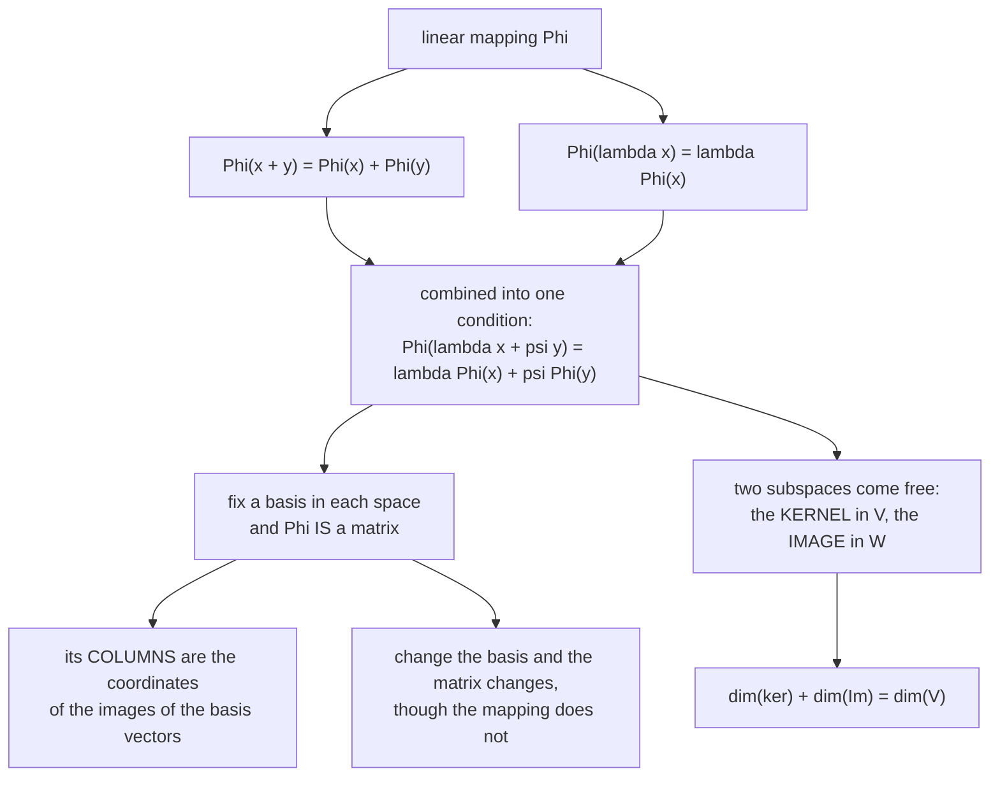

import DataCampExercise from "../../../../components/DataCampExercise.astro";
import Figure from "../../../../components/Figure.astro";
import MatrixLab from "../../../../components/viz/math/MatrixLab.tsx";
import Quiz from "../../../../components/Quiz.astro";

§2.2 said a matrix has two faces — data and action. This section makes the second face precise, and
delivers the payoff: **once you fix a basis, every linear mapping between finite-dimensional spaces
*is* a matrix.** Not "can be represented by" in a loose sense — there is an exact correspondence, and
the matrix depends on which basis you chose.

That dependence is the subtle part, and it is where most of the confusion in this section lives.

## What you'll learn

- What makes a mapping **linear**, in one condition rather than two.
- Isomorphism, endomorphism, automorphism — and the theorem that says dimension is all that matters.
- **Coordinates** with respect to an ordered basis, and why the ordering is not pedantry.
- The **transformation matrix**, whose columns are the images of the basis vectors, in coordinates.
- **Basis change**: the same mapping, a different matrix, related by $\tilde{\mathbf{A}} = \mathbf{T}^{-1}\mathbf{A}\mathbf{S}$.
- **Image** and **kernel**, and the rank-nullity theorem tying their dimensions together.

## Intuition: currency conversion

Converting pounds to euros is linear. Convert £10 and £20 separately, or convert £30 at once — same
answer. Double the pounds and you double the euros. Two properties, and they are exactly the two the
definition demands.

Now notice what is *not* linear: adding a £3 fixed fee. Convert £10 and £20 separately and you pay the
fee twice; convert £30 once and you pay it once. The fee breaks additivity, and a mapping with a
constant offset is **affine**, not linear — §2.8's subject, and the reason a neural network layer with
a bias term is affine rather than linear.



## The math

### Definition

A mapping $\Phi : V \to W$ between real vector spaces is a **linear mapping** — equivalently a **vector
space homomorphism** or **linear transformation** — when

$$
\forall \mathbf{x}, \mathbf{y} \in V \;\forall \lambda, \psi \in \mathbb{R}:\quad
\Phi(\lambda\mathbf{x} + \psi\mathbf{y}) = \lambda\Phi(\mathbf{x}) + \psi\Phi(\mathbf{y})
$$

This single condition packages the two separate ones — additivity
$\Phi(\mathbf{x}+\mathbf{y}) = \Phi(\mathbf{x})+\Phi(\mathbf{y})$ and homogeneity
$\Phi(\lambda\mathbf{x}) = \lambda\Phi(\mathbf{x})$ — and they are equivalent: set $\lambda = \psi = 1$
to recover the first, and $\psi = 0$ to recover the second.

An immediate consequence worth noting because it is the fastest disqualifier:
$\Phi(\mathbf{0}) = \Phi(0\cdot\mathbf{x}) = 0\cdot\Phi(\mathbf{x}) = \mathbf{0}$. **Every linear
mapping sends zero to zero.** If a candidate mapping does not, it is not linear, and you are done.

### The four special cases

| name | condition |
| --- | --- |
| **Isomorphism** | $\Phi : V \to W$ linear and **bijective** |
| **Endomorphism** | $\Phi : V \to V$ linear (same space both sides) |
| **Automorphism** | $\Phi : V \to V$ linear and bijective |
| **Identity** | $\mathrm{id}_V : V \to V$, $\mathbf{x} \mapsto \mathbf{x}$ |

And the theorem that makes dimension the only thing that matters:

$$
\textbf{Theorem.}\quad
\text{Finite-dimensional } V, W \text{ are isomorphic} \iff \dim(V) = \dim(W)
$$

Read what that says. Two spaces of the same dimension "are kind of the same thing, as they can be
transformed into each other without incurring any loss" — the book's phrasing. It is why
$\mathbb{R}^{m\times n}$ and $\mathbb{R}^{mn}$ can be used interchangeably, and why every
$n$-dimensional space is "really" $\mathbb{R}^n$ once you pick a basis.

Three more closure facts: the composition of linear mappings is linear; the inverse of an isomorphism
is an isomorphism; and $\Phi + \Psi$ and $\lambda\Phi$ are linear. So linear mappings themselves form a
vector space.

:::tip[The book's favourite example]
$\Phi : \mathbb{R}^2 \to \mathbb{C}$ with $\Phi(\mathbf{x}) = x_1 + ix_2$ is a homomorphism. Check
additivity: $(x_1+y_1) + i(x_2+y_2) = (x_1+ix_2)+(y_1+iy_2)$ ✓.

That is *why* complex numbers can be represented as pairs in $\mathbb{R}^2$ — there is a bijective
linear mapping converting the element-wise addition of tuples into complex addition. The
identification is not a convention; it is an isomorphism, which is exactly what
[Complex Numbers in One Page](../../chapter-00---getting-ready/complex-numbers-in-one-page/) was
relying on.
:::

### Coordinates, and why the order matters

Fix an **ordered basis** $B = (\mathbf{b}_1,\dots,\mathbf{b}_n)$ of $V$ — a *tuple*, not a set. Every
$\mathbf{x} \in V$ then has a unique representation

$$
\mathbf{x} = \alpha_1\mathbf{b}_1 + \cdots + \alpha_n\mathbf{b}_n,
\qquad
\boldsymbol\alpha = \begin{bmatrix}\alpha_1\\ \vdots\\ \alpha_n\end{bmatrix} \in \mathbb{R}^n
$$

and $\boldsymbol\alpha$ is the **coordinate vector** of $\mathbf{x}$ with respect to $B$. Uniqueness is
§2.6's characterisation 4 — this is what a basis was *for*.

The notation gets genuinely tricky here, and the book pauses to fix it:

| written | is |
| --- | --- |
| $B = (\mathbf{b}_1,\dots,\mathbf{b}_n)$ | an **ordered** basis — a tuple |
| $\mathcal{B} = \{\mathbf{b}_1,\dots,\mathbf{b}_n\}$ | an **unordered** basis — a set |
| $\mathbf{B} = [\mathbf{b}_1,\dots,\mathbf{b}_n]$ | a **matrix** whose columns are those vectors |

Ordering matters because coordinates are a *list*. Swap $\mathbf{b}_1$ and $\mathbf{b}_2$ and the
coordinate vector $(2, 3)$ becomes $(3, 2)$ — a different list describing the same point. A set cannot
express that, which is why bases are tuples from here on.

**A basis is a coordinate system**, and the same vector has different coordinates in different ones.
The book's Example 2.20: $\mathbf{x} = (2,3)^\top$ in the standard basis means
$\mathbf{x} = 2\mathbf{e}_1 + 3\mathbf{e}_2$. With $\mathbf{b}_1 = (1,-1)^\top$ and
$\mathbf{b}_2 = (1,1)^\top$, the *same point* has coordinates $\tfrac12(-1, 5)^\top$.

### The transformation matrix

Here is the construction. Let $B = (\mathbf{b}_1,\dots,\mathbf{b}_n)$ be an ordered basis of $V$ and
$C = (\mathbf{c}_1,\dots,\mathbf{c}_m)$ one of $W$. For each $j$, expand the image of the $j$-th basis
vector in the $C$ basis:

$$
\Phi(\mathbf{b}_j) = \alpha_{1j}\mathbf{c}_1 + \cdots + \alpha_{mj}\mathbf{c}_m = \sum_{i=1}^{m}\alpha_{ij}\mathbf{c}_i
$$

The $m\times n$ matrix $\mathbf{A}_\Phi$ with entries $A_\Phi(i,j) = \alpha_{ij}$ is the
**transformation matrix** of $\Phi$ with respect to $B$ and $C$.

**The $j$-th column of $\mathbf{A}_\Phi$ is the coordinate vector of $\Phi(\mathbf{b}_j)$ with respect
to $C$.** That is the whole definition, and it is §2.2's "the columns are the images of the basis
vectors" — now stated properly, with the caveat that "images" means *in coordinates*, and which
coordinates depends on $C$.

Then, with $\hat{\mathbf{x}}$ the coordinate vector of $\mathbf{x}$ in $B$ and $\hat{\mathbf{y}}$ that
of $\mathbf{y} = \Phi(\mathbf{x})$ in $C$:

$$
\hat{\mathbf{y}} = \mathbf{A}_\Phi\hat{\mathbf{x}}
$$

Matrix multiplication maps coordinates to coordinates. Not vectors to vectors — **coordinates**. The
distinction is invisible when both bases are standard, which is why it is so easy to miss and so
confusing when it finally matters.

### Basis change

Same mapping, different bases, different matrix. How different?

$$
\boxed{\;\tilde{\mathbf{A}}_\Phi = \mathbf{T}^{-1}\mathbf{A}_\Phi\mathbf{S}\;}
$$

where $\mathbf{S} \in \mathbb{R}^{n\times n}$ is the transformation matrix of $\mathrm{id}_V$ mapping
coordinates in the new basis $\tilde{B}$ onto coordinates in the old $B$, and
$\mathbf{T} \in \mathbb{R}^{m\times m}$ does the same for $\tilde{C}$ onto $C$.

Read the formula right to left, which is the order it executes in: $\mathbf{S}$ translates new-basis
coordinates into old-basis ones, $\mathbf{A}_\Phi$ does the actual mapping in the old coordinates, and
$\mathbf{T}^{-1}$ translates the result back into the new output coordinates. Three steps, and only the
middle one is the mapping.

$$
\tilde{B} \to \tilde{C} \;=\; \tilde{B} \to B \to C \to \tilde{C}
$$

Two names for the resulting relation:

- $\mathbf{A}, \tilde{\mathbf{A}}$ are **equivalent** if $\tilde{\mathbf{A}} = \mathbf{T}^{-1}\mathbf{A}\mathbf{S}$ for some regular $\mathbf{S}, \mathbf{T}$.
- $\mathbf{A}, \tilde{\mathbf{A}}$ are **similar** if $\tilde{\mathbf{A}} = \mathbf{S}^{-1}\mathbf{A}\mathbf{S}$ — the *same* matrix on both sides.

Similar matrices are always equivalent; equivalent ones need not be similar. Similarity is the one
Chapter 4 cares about, because it is what "the same endomorphism in a different basis" means, and
diagonalisation (§4.4) is the search for a basis making the matrix diagonal.

:::tip[Why anyone bothers changing basis]
The book's Example 2.23 answers this in one line. The matrix

$$
\mathbf{A} = \begin{bmatrix}2 & 1\\ 1 & 2\end{bmatrix}
$$

with respect to the canonical basis becomes, with respect to
$B = \bigl((1,1)^\top, (1,-1)^\top\bigr)$,

$$
\tilde{\mathbf{A}} = \begin{bmatrix}3 & 0\\ 0 & 1\end{bmatrix}
$$

**Diagonal.** The mapping did not change; the description became trivial. Applying it a hundred times
is now three raised to the hundredth and one raised to the hundredth, instead of a hundred matrix
multiplications. That is the entire motivation for Chapter 4, and Chapter 10 uses the same idea to find
a basis in which data compresses well.
:::

### Image and kernel

Two subspaces come free with every linear mapping:

$$
\ker(\Phi) := \Phi^{-1}(\mathbf{0}_W) = \{\mathbf{v} \in V : \Phi(\mathbf{v}) = \mathbf{0}_W\}
$$
$$
\operatorname{Im}(\Phi) := \Phi(V) = \{\mathbf{w} \in W : \exists\mathbf{v} \in V,\; \Phi(\mathbf{v}) = \mathbf{w}\}
$$

$V$ is the **domain** and $W$ the **codomain**. The kernel — also **null space** — is what gets
crushed to zero. The image — also **range** — is what can be reached.

Four facts:

- $\Phi(\mathbf{0}_V) = \mathbf{0}_W$ always, so $\mathbf{0}_V \in \ker(\Phi)$: **the kernel is never empty**.
- $\operatorname{Im}(\Phi)$ is a subspace of $W$; $\ker(\Phi)$ is a subspace of $V$.
- $\Phi$ is **injective** if and only if $\ker(\Phi) = \{\mathbf{0}\}$.
- For $\mathbf{A} = [\mathbf{a}_1,\dots,\mathbf{a}_n]$, the image is the span of the columns — the **column space** — so $\operatorname{rk}(\mathbf{A}) = \dim(\operatorname{Im}(\Phi))$.

Note the asymmetry, which is easy to get backwards: the **kernel lives in $\mathbb{R}^n$, the width** of
the matrix, and the **image lives in $\mathbb{R}^m$, the height**. The kernel is about relationships
among the *columns*; the image is about what the columns *reach*.

### Rank-nullity

$$
\boxed{\;\dim(\ker(\Phi)) + \dim(\operatorname{Im}(\Phi)) = \dim(V)\;}
$$

Also called the **fundamental theorem of linear mappings**. Every input dimension is accounted for
exactly once: it either survives into the image or gets crushed into the kernel. Nothing is lost and
nothing is double-counted.

Three consequences the book draws out:

1. If $\dim(\operatorname{Im}(\Phi)) < \dim(V)$ then the kernel is non-trivial: $\dim(\ker(\Phi)) \ge 1$.
2. In that case $\mathbf{A}_\Phi\mathbf{x} = \mathbf{0}$ has **infinitely many** solutions.
3. If $\dim(V) = \dim(W)$, then injective $\iff$ surjective $\iff$ bijective.

Consequence 3 is the one that saves work. For a **square** matrix you need check only one of the three
properties; all of them follow. For a non-square one they can differ freely.

## Worked example by hand

**Is it linear?** Four candidates, checked against $\Phi(\mathbf{0}) = \mathbf{0}$ first because it is
free:

| mapping | $\Phi(\mathbf{0}) = \mathbf{0}$? | linear? | why |
| --- | --- | --- | --- |
| $\Phi(x) = 3x$ | yes | **yes** | both properties hold |
| $\Phi(x) = 3x + 1$ | **no**, gives $1$ | **no** | affine, not linear |
| $\Phi(x) = x^2$ | yes | **no** | $(x+y)^2 \neq x^2+y^2$ |
| $\Phi(f) = \int_a^b f\,\mathrm{d}x$ | yes | **yes** | integration is linear |
| $\Phi(x) = \cos(x)$ | **no**, gives $1$ | **no** | disqualified immediately |

The last row shows the value of the zero test: $\cos$ is settled without touching additivity.

**Coordinates in two bases.** Take $\mathbf{x} = (2,3)^\top$ written in the standard basis, and the
alternative $B = \bigl((1,-1)^\top, (1,1)^\top\bigr)$. Solve
$\alpha_1(1,-1)^\top + \alpha_2(1,1)^\top = (2,3)^\top$:

$$
\begin{aligned}
\alpha_1 + \alpha_2 &= 2\\
-\alpha_1 + \alpha_2 &= 3
\end{aligned}
$$

Adding: $2\alpha_2 = 5$, so $\alpha_2 = \tfrac52$; then $\alpha_1 = 2 - \tfrac52 = -\tfrac12$. So the
coordinates are $\tfrac12(-1, 5)^\top$ — the book's Example 2.20 exactly. Same point, different list.

**Image and kernel of the book's Example 2.25.** For

$$
\Phi : \mathbb{R}^4 \to \mathbb{R}^2, \qquad
\mathbf{A} = \begin{bmatrix}1 & 2 & -1 & 0\\ 1 & 0 & 0 & 1\end{bmatrix}
$$

The image is the span of the columns $(1,1)^\top, (2,0)^\top, (-1,0)^\top, (0,1)^\top$ — four vectors in
$\mathbb{R}^2$, which must be dependent, and they span all of $\mathbb{R}^2$. So
$\dim(\operatorname{Im}) = 2$.

For the kernel, reduce:

$$
\begin{bmatrix}1 & 2 & -1 & 0\\ 1 & 0 & 0 & 1\end{bmatrix}
\;\rightsquigarrow\;
\begin{bmatrix}1 & 0 & 0 & 1\\ 0 & 1 & -\tfrac12 & -\tfrac12\end{bmatrix}
$$

Non-pivot columns 3 and 4, so two kernel directions:

$$
\ker(\Phi) = \operatorname{span}\left[\begin{bmatrix}0\\ \tfrac12\\ 1\\ 0\end{bmatrix},\;\begin{bmatrix}-1\\ \tfrac12\\ 0\\ 1\end{bmatrix}\right]
$$

Check the first: $1\cdot0 + 2\cdot\tfrac12 + (-1)\cdot1 + 0\cdot0 = 0$ ✓ and
$1\cdot0 + 0 + 0 + 1\cdot0 = 0$ ✓.

**Rank-nullity:** $\dim(\ker) + \dim(\operatorname{Im}) = 2 + 2 = 4 = \dim(V)$ ✓. Four input
dimensions, two survive, two are crushed.

## See it move

A rank-1 map squashes the whole plane onto a line. The amber line is the image; the red dashed line is
the kernel — every point on it lands on the origin.

```p5 title="Image and kernel of a linear map" desc="The map Phi(x)=Ax with a rank-1 matrix squashes the entire input plane (blue lattice) onto one line, the image (amber). The red dashed line is the kernel: every point on it maps to the origin. dim(kernel) + dim(image) = 2." height="380"
const A = [[1,2],[2,4]];        // rank-1 matrix
const U = 30;
let cx, cy, lattice = [];
function setup(){
  createCanvas(600, 380);
  textFont("monospace");
  cx = width/2; cy = height/2 + 4;
  for (let i=-5; i<=5; i++) for (let j=-5; j<=5; j++) lattice.push([i*0.9, j*0.9]);
}
function sx(x){ return cx + x*U; }
function sy(y){ return cy - y*U; }
function ap(m, v){ return [m[0][0]*v[0]+m[0][1]*v[1], m[1][0]*v[0]+m[1][1]*v[1]]; }
let ph = 0;
function draw(){
  background(13,17,23);
  ph += 0.02;
  // axes
  stroke(34,46,60); strokeWeight(1);
  for (let g=-6; g<=6; g++){ line(sx(-6),sy(g),sx(6),sy(g)); line(sx(g),sy(-6),sx(g),sy(6)); }
  stroke(70,82,96); strokeWeight(1.2);
  line(sx(-6),sy(0),sx(6),sy(0)); line(sx(0),sy(-6),sx(0),sy(6));

  // kernel line: A x = 0  -> x + 2y = 0 -> direction (2,-1)
  stroke(232,110,110); strokeWeight(1.6);
  for (let t=-6; t<6; t+=0.5){
    const p1=[2*t,-1*t], p2=[2*(t+0.25),-1*(t+0.25)];
    line(sx(p1[0]),sy(p1[1]),sx(p2[0]),sy(p2[1]));
  }
  // image line: span of column (1,2)
  stroke(255,211,67); strokeWeight(2);
  line(sx(-2*3),sy(-4*3),sx(2*3),sy(4*3));

  // input lattice (blue) and images (amber)
  noStroke();
  for (const p of lattice){
    fill(75,139,190,150); ellipse(sx(p[0]),sy(p[1]),4,4);
    const q = ap(A, p);
    fill(255,211,67,160); ellipse(sx(q[0]/2.2),sy(q[1]/2.2),4,4);   // scaled down to fit
  }

  // moving probe
  const inp = [3*Math.cos(ph), 3*Math.sin(ph)];
  const out = ap(A, inp);
  const outS = [out[0]/2.2, out[1]/2.2];
  stroke(150); strokeWeight(1);
  line(sx(inp[0]),sy(inp[1]),sx(outS[0]),sy(outS[1]));
  noStroke();
  fill(120,180,255); ellipse(sx(inp[0]),sy(inp[1]),9,9);
  fill(255,230,120); ellipse(sx(outS[0]),sy(outS[1]),9,9);

  // labels
  textAlign(LEFT,TOP);
  fill(255,211,67); textSize(15); text("Image and kernel", 16, 12);
  fill(232,110,110); textSize(11); text("red = kernel (maps to 0)", 16, height-42);
  fill(255,211,67); text("amber = image line (all outputs)", 16, height-26);
  fill(200,210,220); textSize(12); textAlign(RIGHT,TOP);
  text("rk(A)=1   dim ker=1   1+1=2", width-16, 14);
}
```

Watch the probe. When the blue input crosses the red dashed line the amber output passes through the
origin — that is what "the kernel maps to zero" looks like in motion. And no matter where the input
goes, the output never leaves the amber line: **the image is all the map can reach**, and it is
one-dimensional because the rank is 1.

### Basis change, made concrete

The book's Example 2.23 in the lab: a matrix that looks like a shear in the standard basis and is a
pure diagonal scaling in the right one.

<MatrixLab
  client:visible
  matrix={[[2, 1], [1, 2]]}
  probe={[1, 1]}
  title="The matrix whose eigenbasis makes it diagonal"
  desc="Its eigenvectors are (1,1) and (1,-1) with eigenvalues 3 and 1 — so in that basis it is diag(3, 1). Watch the eigen-directions in the final frame."
/>

The last frame draws the eigen-directions, and they are exactly $(1,1)$ and $(1,-1)$ with eigenvalues
$3$ and $1$. **Those numbers are the diagonal of $\tilde{\mathbf{A}}$.** Basis change and
eigendecomposition are the same operation seen from two sides — §4.4 makes it official.

## From scratch

```python title="linear_mappings.py" showLineNumbers{1}
import numpy as np

rng = np.random.default_rng(0)

def is_linear(phi, dim, trials=500, tol=1e-9):
    """Test the single linearity condition on random inputs and scalars."""
    for _ in range(trials):
        x, y = rng.standard_normal(dim), rng.standard_normal(dim)
        lam, psi = rng.normal(), rng.normal()
        lhs = phi(lam * x + psi * y)
        rhs = lam * np.asarray(phi(x)) + psi * np.asarray(phi(y))
        if not np.allclose(lhs, rhs, atol=tol):
            return False
    return True

# ---- the zero test disqualifies fastest ------------------------------
cands = {
    "3x            ": lambda v: 3 * v,
    "3x + 1        ": lambda v: 3 * v + 1,
    "x squared     ": lambda v: v ** 2,
    "cos(x)        ": lambda v: np.cos(v),
    "A @ x         ": lambda v: np.array([[1.0, 2.0], [3.0, 4.0]]) @ v,
}
for name, f in cands.items():
    z = np.asarray(f(np.zeros(2)))
    sends_zero = np.allclose(z, 0)
    print(f"{name} Phi(0)=0: {str(sends_zero):5s}  linear: {is_linear(f, 2)}")

# ---- coordinates with respect to an ordered basis --------------------
x = np.array([2.0, 3.0])
B = np.array([[1.0, 1.0], [-1.0, 1.0]])        # columns b1=(1,-1), b2=(1,1)
alpha = np.linalg.solve(B, x)
print("\ncoordinates of (2,3) in B:", alpha, " = 0.5 * ", 2 * alpha)
print("rebuild:", B @ alpha, " matches x:", np.allclose(B @ alpha, x))

# Ordering matters: swap the basis vectors and the coordinate list swaps.
B_swapped = B[:, ::-1]
print("with the basis vectors swapped:", np.linalg.solve(B_swapped, x))

# ---- the transformation matrix's columns ----------------------------
A = np.array([[1.0, 2.0], [3.0, 4.0]])
for j, e in enumerate(np.eye(2)):
    print(f"\nPhi(e{j+1}) =", A @ e, " == column {}: {}".format(j, A[:, j]))

# ---- basis change: the book's Example 2.23 -------------------------
A23 = np.array([[2.0, 1.0], [1.0, 2.0]])
S = np.array([[1.0, 1.0], [1.0, -1.0]])        # new basis vectors as columns
A_tilde = np.linalg.inv(S) @ A23 @ S
print("\nExample 2.23:")
print("A in the canonical basis:\n", A23)
print("A in the basis ((1,1),(1,-1)):\n", np.round(A_tilde, 12))
print("diagonal?", np.allclose(A_tilde, np.diag(np.diag(A_tilde))))
vals, vecs = np.linalg.eigh(A23)
print("eigenvalues:", vals, " -> the diagonal entries, in the other order")

# ---- the book's Example 2.24, all the way through ------------------
A24 = np.array([[1.0, 2.0, 0.0],
                [-1.0, 1.0, 3.0],
                [3.0, 7.0, 1.0],
                [-1.0, 2.0, 4.0]])
S24 = np.array([[1.0, 0.0, 1.0],
                [1.0, 1.0, 0.0],
                [0.0, 1.0, 1.0]])
T24 = np.array([[1.0, 1.0, 0.0, 1.0],
                [1.0, 0.0, 1.0, 0.0],
                [0.0, 1.0, 1.0, 0.0],
                [0.0, 0.0, 0.0, 1.0]])
A24_tilde = np.linalg.inv(T24) @ A24 @ S24
print("\nExample 2.24, T^-1 A S =\n", np.round(A24_tilde, 10))

# ---- image, kernel, rank-nullity: the book's Example 2.25 ---------
A25 = np.array([[1.0, 2.0, -1.0, 0.0],
                [1.0, 0.0,  0.0, 1.0]])
r = np.linalg.matrix_rank(A25)
n = A25.shape[1]
k1 = np.array([0.0, 0.5, 1.0, 0.0])
k2 = np.array([-1.0, 0.5, 0.0, 1.0])
print("\nExample 2.25:")
print("rank = dim(Im) :", r, " (all of R^2)")
print("dim(ker)       :", n - r)
print("k1 in kernel   :", np.allclose(A25 @ k1, 0), " k2 in kernel:", np.allclose(A25 @ k2, 0))
print("rank-nullity   :", (n - r), "+", r, "=", n, " == dim(V):", n)

# ---- injective iff surjective iff bijective, for SQUARE only ------
print("\nsquare, full rank      -> all three:", end=" ")
Sq = np.array([[1.0, 2.0], [3.0, 4.0]])
rk = np.linalg.matrix_rank(Sq)
print(f"rank {rk} of 2, injective={rk==2}, surjective={rk==2}")
print("non-square, tall       -> can be injective and NOT surjective:", end=" ")
Tall = np.array([[1.0], [2.0], [3.0]])
print(f"rank {np.linalg.matrix_rank(Tall)}, image is a line in R^3")
print("non-square, wide       -> surjective and NOT injective:", end=" ")
print(f"rank {r} of R^2 reached, but kernel has dim {n - r}")
```

```
3x             Phi(0)=0: True   linear: True
3x + 1         Phi(0)=0: False  linear: False
x squared      Phi(0)=0: True   linear: False
cos(x)         Phi(0)=0: False  linear: False
A @ x          Phi(0)=0: True   linear: True

coordinates of (2,3) in B: [-0.5  2.5]  = 0.5 *  [-1.  5.]
rebuild: [2. 3.]  matches x: True
with the basis vectors swapped: [ 2.5 -0.5]

Phi(e1) = [1. 3.]  == column 0: [1. 3.]

Phi(e2) = [2. 4.]  == column 1: [2. 4.]

Example 2.23:
A in the canonical basis:
 [[2. 1.]
 [1. 2.]]
A in the basis ((1,1),(1,-1)):
 [[3. 0.]
 [0. 1.]]
diagonal? True
eigenvalues: [1. 3.]  -> the diagonal entries, in the other order

Example 2.24, T^-1 A S =
 [[-4. -4. -2.]
 [ 6.  0.  0.]
 [ 4.  8.  4.]
 [ 1.  6.  3.]]

Example 2.25:
rank = dim(Im) : 2  (all of R^2)
dim(ker)       : 2
k1 in kernel   : True  k2 in kernel: True
rank-nullity   : 2 + 2 = 4  == dim(V): 4

square, full rank      -> all three: rank 2 of 2, injective=True, surjective=True
non-square, tall       -> can be injective and NOT surjective: rank 1, image is a line in R^3
non-square, wide       -> surjective and NOT injective: rank 2 of R^2 reached, but kernel has dim 2
```

Four things confirmed against the book.

**The zero test does real work.** `3x + 1` and `cos(x)` are eliminated by one evaluation each, and
`x squared` survives the zero test and fails linearity — so the test is necessary but not sufficient,
exactly as expected.

**Coordinates depend on the ordering.** $(-0.5, 2.5) = \tfrac12(-1, 5)$ reproduces Example 2.20, and
swapping the two basis vectors swaps the coordinate list to $(2.5, -0.5)$. Same point, same basis
*set*, different basis *tuple*, different answer.

**Example 2.23 comes out diagonal**, $\operatorname{diag}(3, 1)$, and the eigenvalues are $1$ and $3$ —
the same numbers, in the order `eigh` chose to return them. Basis change found the eigenbasis without
being asked.

**Example 2.24 reproduces the book's $\tilde{\mathbf{A}}_\Phi$ exactly**, including the awkward
$(-4, -4, -2)$ first row.

## On real data

<Figure
  src="/images/mml/linear-mappings/three-transformations"
  alt="Four panels showing 400 points arranged in a square. The first is the original, the second is rotated by 45 degrees, the third is stretched by two along the horizontal axis, and the fourth is a combined reflection, rotation and stretch."
  title="The book's Figure 2.10, reproduced"
  caption="Four hundred points, three matrices. Straight lines stay straight and evenly spaced lines stay evenly spaced in every panel — that is what linearity looks like."
/>

<Figure
  src="/images/mml/linear-mappings/rank-nullity"
  alt="Bar chart for matrices of several shapes and ranks, each showing the image dimension and the kernel dimension stacked to exactly the number of input dimensions."
  title="Rank-nullity as a conservation law"
  caption="For every matrix the two bars sum to the number of columns. Every input dimension either survives into the image or is crushed into the kernel."
/>

## Reading the plot

The second figure is rank-nullity drawn as a **conservation law**, which is the most useful way to hold
it. Each bar's total height is $\dim(V)$ — the number of columns — and the split between image and
kernel varies with the rank. The total never does.

That framing makes the consequences immediate rather than something to derive. A wide matrix
($n > m$) cannot have a trivial kernel, because the image dimension is capped at $m < n$ and the rest
of $n$ has to go somewhere. So **a wide matrix is never injective** — there are always distinct inputs
colliding on the same output. That is precisely why an under-determined system has infinitely many
solutions (§2.1), and why a compression step is inherently lossy (Chapter 10).

Conversely a tall matrix ($m > n$) can have a trivial kernel and still fail to be surjective, because
the image is at most $n$-dimensional inside an $m$-dimensional codomain. That is why an overdetermined
system usually has *no* solution.

The three-way equivalence — injective iff surjective iff bijective — needs $\dim(V) = \dim(W)$, and the
figure shows why: only when the bar height equals the codomain dimension can filling one force the
other.

:::tip[From the book]
*Mathematics for Machine Learning* §2.7 opens with the structure-preservation conditions
(**Equations 2.85–2.86**) and **Definition 2.15** (**linear mapping** / **vector space homomorphism** /
**linear transformation**, **Equation 2.87**). **Definition 2.16** gives **injective**, **surjective**
and **bijective**, followed by the special cases **isomorphism**, **endomorphism**, **automorphism** and
the identity mapping $\mathrm{id}_V$. **Example 2.19** shows $\Phi(\mathbf{x}) = x_1 + ix_2$ is a
homomorphism (**Equation 2.88**) and remarks that this "justifies why complex numbers can be
represented as tuples in $\mathbb{R}^2$". **Theorem 2.17** states that finite-dimensional $V$ and $W$
are isomorphic iff $\dim(V) = \dim(W)$, with the remark that such spaces "are kind of the same thing"
and the justification for treating $\mathbb{R}^{m\times n}$ and $\mathbb{R}^{mn}$ alike; further
remarks note that compositions of linear mappings are linear, the inverse of an isomorphism is an
isomorphism, and $\Phi+\Psi$ and $\lambda\Phi$ are linear. §2.7.1 introduces the **ordered basis**
(**Equation 2.89**) with the notation remark distinguishing $B$ (tuple), $\mathcal{B}$ (set) and
$\mathbf{B}$ (matrix), then **Definition 2.18** (**coordinates**, **Equations 2.90–2.91**) and
**Figure 2.8**; **Example 2.20** with **Figure 2.9** gives $\mathbf{x} = (2,3)^\top$ having coordinates
$\tfrac12(-1,5)^\top$ in the basis $\bigl((1,-1)^\top,(1,1)^\top\bigr)$. **Definition 2.19** is the
**transformation matrix** (**Equations 2.92–2.93**) with $\hat{\mathbf{y}} = \mathbf{A}_\Phi\hat{\mathbf{x}}$
(**Equation 2.94**); **Example 2.21** computes one (**Equations 2.95–2.96**) and **Example 2.22** with
**Figure 2.10** applies three transformation matrices to 400 vectors arranged in a square
(**Equation 2.97**). §2.7.2 gives **Example 2.23**, where $\begin{bmatrix}2&1\\1&2\end{bmatrix}$ becomes
$\begin{bmatrix}3&0\\0&1\end{bmatrix}$ in the basis $\bigl((1,1)^\top,(1,-1)^\top\bigr)$
(**Equations 2.100–2.102**), and **Theorem 2.20** (**Basis Change**, **Equation 2.105**)
$\tilde{\mathbf{A}}_\Phi = \mathbf{T}^{-1}\mathbf{A}_\Phi\mathbf{S}$ with its proof
(**Equations 2.106–2.113**) and **Figure 2.11**; **Definition 2.21** (**equivalence**) and
**Definition 2.22** (**similarity**) follow, with the remark that similar matrices are always
equivalent but not conversely, and that $\mathbf{A}_{\Psi\circ\Phi} = \mathbf{A}_\Psi\mathbf{A}_\Phi$.
**Example 2.24** works a full basis change (**Equations 2.117–2.121b**). §2.7.3 gives
**Definition 2.23** (**image** and **kernel**, **Equations 2.122–2.123**) with **Figure 2.12**, the
remarks that $\mathbf{0}_V \in \ker(\Phi)$ so the null space is never empty, that both are subspaces,
and that $\Phi$ is injective iff $\ker(\Phi) = \{\mathbf{0}\}$; the **Null Space and Column Space**
remark identifies $\operatorname{Im}(\Phi)$ with the **column space** (**Equations 2.124a–b**) and notes
$\operatorname{rk}(\mathbf{A}) = \dim(\operatorname{Im}(\Phi))$, that the kernel is the general solution
of $\mathbf{A}\mathbf{x} = \mathbf{0}$, and that the kernel is a subspace of $\mathbb{R}^n$ where $n$ is
the "width" of the matrix. **Example 2.25** computes both for a $2\times4$ matrix
(**Equations 2.125a–2.128**). **Theorem 2.24** is the **rank-nullity theorem** (**Equation 2.129**),
also called the **fundamental theorem of linear mappings**, with the three consequences listed above.
:::

## Pitfalls

:::danger[A mapping with a constant offset is not linear]
$\Phi(x) = 3x + 1$ fails, because $\Phi(0) = 1 \neq 0$. It is **affine** (§2.8). This matters
constantly in practice: a neural network layer $\mathbf{W}\mathbf{x} + \mathbf{b}$ is affine, not
linear, and the bias is exactly the offset. Papers still call these "linear layers".
:::

:::caution[The transformation matrix depends on both bases]
"The matrix of $\Phi$" is incomplete phrasing. There is a matrix *per pair of ordered bases*, related
by $\tilde{\mathbf{A}} = \mathbf{T}^{-1}\mathbf{A}\mathbf{S}$. When both bases are standard the
distinction is invisible, which is why it causes so much trouble when it stops being.
:::

:::caution[Matrix multiplication maps coordinates, not vectors]
$\hat{\mathbf{y}} = \mathbf{A}_\Phi\hat{\mathbf{x}}$ relates *coordinate vectors*. The underlying
vectors live in $V$ and $W$ and never touch a matrix. Conflating the two is the root of most basis-change
confusion.
:::

:::danger[Kernel and image live in different spaces]
The kernel is a subspace of $\mathbb{R}^n$ — the **width**. The image is a subspace of $\mathbb{R}^m$ —
the **height**. Getting this backwards makes rank-nullity look dimensionally inconsistent. And note the
kernel is never empty: it always contains $\mathbf{0}$.
:::

:::caution[Injective iff surjective needs equal dimensions]
The three-way equivalence holds only when $\dim(V) = \dim(W)$. A wide matrix is never injective and a
tall one is rarely surjective, and both statements follow from rank-nullity plus the cap
$\dim(\operatorname{Im}) \le \min(m,n)$.
:::

## Compare

| shape | typical rank | kernel | injective? | surjective? |
| --- | --- | --- | --- | --- |
| square, full rank | $n$ | $\{\mathbf{0}\}$ | yes | yes — and bijective |
| square, deficient | $< n$ | non-trivial | no | no |
| tall, $m > n$, full rank | $n$ | $\{\mathbf{0}\}$ | **yes** | **no** — image is $n$-dim in $\mathbb{R}^m$ |
| wide, $n > m$, full rank | $m$ | dimension $n - m \ge 1$ | **no** | **yes** |

The two middle-column entries in the last two rows are the asymmetry the figure makes visible: a tall
matrix loses nothing and reaches little; a wide one reaches everything and loses information.

<Quiz
  title="Check yourself"
  questions={[
    {
      q: "What is the fastest way to show a mapping is not linear?",
      options: [
        "Check additivity on two random vectors",
        "Check whether it sends the zero vector to the zero vector",
        "Compute its rank",
        "Check whether it is injective",
      ],
      answer: 1,
      explain:
        "Linearity forces Phi(0) = 0, so any mapping with a constant offset is disqualified by one evaluation. It is necessary but not sufficient — x squared passes the zero test and is still not linear.",
    },
    {
      q: "What does the j-th column of a transformation matrix contain?",
      options: [
        "The j-th basis vector of the domain",
        "The coordinates of the image of the j-th domain basis vector, with respect to the codomain basis",
        "The j-th eigenvector",
        "The j-th row of the inverse",
      ],
      answer: 1,
      explain:
        "That is the definition. It is section 2.2's 'columns are the images of the basis vectors', made precise — with the important caveat that 'images' means in coordinates, and which coordinates depends on the codomain basis.",
    },
    {
      q: "A four-by-six matrix has full rank. What can you say?",
      options: [
        "It is injective but not surjective",
        "It is surjective but not injective — the kernel has dimension two",
        "It is bijective",
        "Neither, without more information",
      ],
      answer: 1,
      explain:
        "Four rows and six columns means the image is at most four-dimensional and full rank makes it exactly four, so it covers the codomain. Rank-nullity then forces the kernel to have dimension six minus four, so distinct inputs collide.",
    },
    {
      q: "Why does anyone bother changing basis?",
      options: [
        "To make the matrix smaller",
        "Because the same mapping can have a far simpler matrix in the right basis — the book's example turns a shear-looking matrix into a diagonal one",
        "Because the standard basis is not a real basis",
        "To make the mapping injective",
      ],
      answer: 1,
      explain:
        "The mapping does not change; the description does. A diagonal matrix raised to a high power is trivial, which is the entire motivation for Chapter 4's diagonalisation and for Chapter 10's choice of a basis in which data compresses.",
    },
  ]}
/>

## 🧪 Try It Yourself

### Exercise 1 – The zero test

<DataCampExercise
  lang="python"
  hint={`A linear mapping must send the zero vector to the zero vector. Evaluate each candidate at zero.`}
  code={`import numpy as np

cands = {
    "3x    ": lambda v: 3 * v,
    "3x + 1": lambda v: 3 * v + 1,
    "cos(x)": lambda v: np.cos(v),
}

for name, f in cands.items():
    z = np.asarray(f(np.zeros(___)))          # replace ___ with 2
    print(f"{name}  Phi(0) = {z}  can be linear: {np.allclose(z, 0)}")

# -- Expected output ------------------------------
# 3x      Phi(0) = [0. 0.]  can be linear: True
# 3x + 1  Phi(0) = [1. 1.]  can be linear: False
# cos(x)  Phi(0) = [1. 1.]  can be linear: False
# -------------------------------------------------`}
  solution={`import numpy as np
cands = {
    "3x    ": lambda v: 3 * v,
    "3x + 1": lambda v: 3 * v + 1,
    "cos(x)": lambda v: np.cos(v),
}
for name, f in cands.items():
    z = np.asarray(f(np.zeros(2)))
    print(f"{name}  Phi(0) = {z}  can be linear: {np.allclose(z, 0)}")`}
  sct={`test_output_contains("can be linear: False")
success_msg("One evaluation each. The offset and the cosine are both gone before additivity is even tested.")`}
  height={215}
/>

### Exercise 2 – Coordinates depend on the ordering

<DataCampExercise
  lang="python"
  hint={`Solve B @ alpha = x for the coordinates. Then reverse the column order of B and solve again.`}
  code={`import numpy as np

x = np.array([2.0, 3.0])
B = np.array([[1.0, 1.0],
              [-1.0, 1.0]])        # columns are b1=(1,-1) and b2=(1,1)

alpha = np.linalg.solve(B, x)
swapped = np.linalg.solve(B[:, ::___], x)     # replace ___ with -1 to reverse the columns

print("coordinates in B        :", alpha)
print("coordinates in swapped B:", swapped)
print("same point either way   :", np.allclose(B @ alpha, x))

# -- Expected output ------------------------------
# coordinates in B        : [-0.5  2.5]
# coordinates in swapped B: [ 2.5 -0.5]
# same point either way   : True
# -------------------------------------------------`}
  solution={`import numpy as np
x = np.array([2.0, 3.0])
B = np.array([[1.0, 1.0],
              [-1.0, 1.0]])
alpha = np.linalg.solve(B, x)
swapped = np.linalg.solve(B[:, ::-1], x)
print("coordinates in B        :", alpha)
print("coordinates in swapped B:", swapped)
print("same point either way   :", np.allclose(B @ alpha, x))`}
  sct={`test_output_contains("coordinates in swapped B: [ 2.5 -0.5]")
success_msg("Same basis set, different basis tuple, different coordinate list. This is why bases are ordered.")`}
  height={220}
/>

### Exercise 3 – Basis change can diagonalise

<DataCampExercise
  lang="python"
  hint={`The basis change is inv(S) @ A @ S with the new basis vectors as the columns of S.`}
  code={`import numpy as np

A = np.array([[2.0, 1.0],
              [1.0, 2.0]])
S = np.array([[1.0, 1.0],
              [1.0, -1.0]])          # the new basis, as columns

A_tilde = np.linalg.inv(S) @ A @ ___          # replace ___ with S
print("A in the new basis:\\n", np.round(A_tilde, 12))
print("diagonal?", np.allclose(A_tilde, np.diag(np.diag(A_tilde))))
print("eigenvalues of A:", np.linalg.eigvalsh(A))

# -- Expected output ------------------------------
# A in the new basis:
#  [[3. 0.]
#  [0. 1.]]
# diagonal? True
# eigenvalues of A: [1. 3.]
# -------------------------------------------------`}
  solution={`import numpy as np
A = np.array([[2.0, 1.0],
              [1.0, 2.0]])
S = np.array([[1.0, 1.0],
              [1.0, -1.0]])
A_tilde = np.linalg.inv(S) @ A @ S
print("A in the new basis:\\n", np.round(A_tilde, 12))
print("diagonal?", np.allclose(A_tilde, np.diag(np.diag(A_tilde))))
print("eigenvalues of A:", np.linalg.eigvalsh(A))`}
  sct={`test_output_contains("diagonal? True")
success_msg("The diagonal entries ARE the eigenvalues. Basis change found the eigenbasis without being asked — which is Chapter 4.")`}
  height={230}
/>

### Exercise 4 – Rank-nullity as a conservation law

<DataCampExercise
  lang="python"
  hint={`The kernel dimension is the number of columns minus the rank. Check that the two add back to the column count.`}
  code={`import numpy as np

mats = {
    "2x4 rank 2": np.array([[1.0, 2.0, -1.0, 0.0], [1.0, 0.0, 0.0, 1.0]]),
    "3x1 rank 1": np.array([[1.0], [2.0], [3.0]]),
    "3x3 rank 2": np.array([[1.0, 0.0, 1.0], [0.0, 1.0, 1.0], [0.0, 0.0, 0.0]]),
}

for name, A in mats.items():
    m, n = A.shape
    r = np.linalg.matrix_rank(A)
    ker = n - r
    print(f"{name}: dim(Im)={r} + dim(ker)={ker} = {r + ker}, columns = {___}")   # replace ___ with n

# -- Expected output ------------------------------
# 2x4 rank 2: dim(Im)=2 + dim(ker)=2 = 4, columns = 4
# 3x1 rank 1: dim(Im)=1 + dim(ker)=0 = 1, columns = 1
# 3x3 rank 2: dim(Im)=2 + dim(ker)=1 = 3, columns = 3
# -------------------------------------------------`}
  solution={`import numpy as np
mats = {
    "2x4 rank 2": np.array([[1.0, 2.0, -1.0, 0.0], [1.0, 0.0, 0.0, 1.0]]),
    "3x1 rank 1": np.array([[1.0], [2.0], [3.0]]),
    "3x3 rank 2": np.array([[1.0, 0.0, 1.0], [0.0, 1.0, 1.0], [0.0, 0.0, 0.0]]),
}
for name, A in mats.items():
    m, n = A.shape
    r = np.linalg.matrix_rank(A)
    ker = n - r
    print(f"{name}: dim(Im)={r} + dim(ker)={ker} = {r + ker}, columns = {n}")`}
  sct={`test_output_contains("columns = 4")
success_msg("Every input dimension is accounted for exactly once — it survives into the image or is crushed into the kernel.")`}
  height={240}
/>

### Exercise 5 – Verify a kernel basis

<DataCampExercise
  hint={`A vector is in the kernel when A @ v is the zero vector.`}
  lang="python"
  code={`import numpy as np

A = np.array([[1.0, 2.0, -1.0, 0.0],
              [1.0, 0.0,  0.0, 1.0]])

k1 = np.array([ 0.0, 0.5, 1.0, 0.0])
k2 = np.array([-1.0, 0.5, 0.0, 1.0])

print("A @ k1 =", A @ k1, " in kernel:", np.allclose(A @ k1, 0))
print("A @ k2 =", A @ k2, " in kernel:", np.allclose(A @ ___, 0))   # replace ___ with k2
combo = 3 * k1 - 2 * k2
print("A @ (3k1 - 2k2) =", A @ combo, " still in kernel:", np.allclose(A @ combo, 0))

# -- Expected output ------------------------------
# A @ k1 = [0. 0.]  in kernel: True
# A @ k2 = [0. 0.]  in kernel: True
# A @ (3k1 - 2k2) = [0. 0.]  still in kernel: True
# -------------------------------------------------`}
  solution={`import numpy as np
A = np.array([[1.0, 2.0, -1.0, 0.0],
              [1.0, 0.0,  0.0, 1.0]])
k1 = np.array([ 0.0, 0.5, 1.0, 0.0])
k2 = np.array([-1.0, 0.5, 0.0, 1.0])
print("A @ k1 =", A @ k1, " in kernel:", np.allclose(A @ k1, 0))
print("A @ k2 =", A @ k2, " in kernel:", np.allclose(A @ k2, 0))
combo = 3 * k1 - 2 * k2
print("A @ (3k1 - 2k2) =", A @ combo, " still in kernel:", np.allclose(A @ combo, 0))`}
  sct={`test_output_contains("still in kernel: True")
success_msg("The kernel is a subspace, so any combination of kernel vectors is still in it. That is the book's Example 2.25 basis.")`}
  height={225}
/>

## Recall card

- **Linearity is one condition** — the mapping commutes with taking linear combinations — and it packages additivity and homogeneity together.
- **Every linear mapping sends zero to zero**, which is the cheapest disqualifier: any constant offset makes a mapping affine rather than linear.
- **Isomorphism is linear plus bijective; endomorphism maps a space to itself; automorphism is both.**
- **Two finite-dimensional spaces are isomorphic exactly when their dimensions agree**, which is why an m-by-n matrix space can be treated as a vector space of length mn.
- **A basis must be ordered** because coordinates are a list — swapping two basis vectors swaps the coordinates of every point.
- **The j-th column of the transformation matrix is the coordinates of the image of the j-th basis vector**, expressed in the codomain basis.
- **Matrix multiplication maps coordinates, not vectors** — the underlying vectors never touch a matrix.
- **Basis change is T inverse times A times S**, read right to left: translate in, map, translate out.
- **Similar means the same matrix on both sides; equivalent allows different ones.** Similar implies equivalent, not conversely.
- **The kernel lives in the width and the image in the height** — different spaces, which is why rank-nullity needs care.
- **The kernel is never empty**; it always contains the zero vector, and the mapping is injective exactly when that is all it contains.
- **Rank-nullity is a conservation law**: image dimension plus kernel dimension equals the number of input dimensions, always.
- **A wide matrix is never injective and a tall one is rarely surjective**, and injective-iff-surjective-iff-bijective needs the two dimensions to match.

**Next:** what happens when the offset is allowed back in —
**[Affine Spaces](../affine-spaces/)**.
