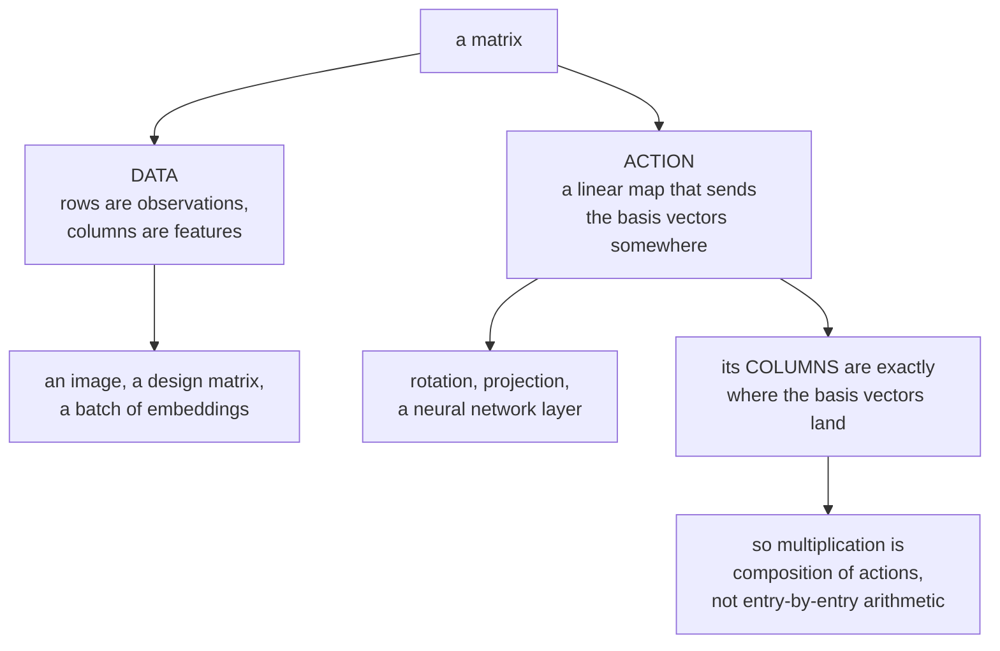

import DataCampExercise from "../../../../components/DataCampExercise.astro";
import Figure from "../../../../components/Figure.astro";
import MatrixLab from "../../../../components/viz/math/MatrixLab.tsx";
import Quiz from "../../../../components/Quiz.astro";

A **matrix** is a rectangular grid of numbers. That sounds humble, but it is the single most important
object in machine learning, and the reason is that it has **two faces**. A matrix can be **data** — a
spreadsheet, an image, a batch of feature vectors — and it can be an **action**: a rotation, a
projection, a neural network layer.

The book says this outright at the top of §2.2: matrices "can be used to compactly represent systems
of linear equations, but they also represent linear functions". Learning to switch between those two
readings, and to know which one a given page means, is the skill this section buys you.

## What you'll learn

- What a matrix is, precisely, and why $\mathbb{R}^{m\times n}$ can be treated as $\mathbb{R}^{mn}$.
- Why multiplication is **not** element-wise, and what it is instead.
- The one idea that makes matrix multiplication obvious: **the columns are the images of the basis vectors**.
- Why $\mathbf{A}\mathbf{B} \neq \mathbf{B}\mathbf{A}$, and why even their *shapes* can differ.
- Identity, inverse, transpose, symmetry — and the four look-alike identities that are false.

## Intuition: a grayscale image, and a machine that bends the plane

Open any grayscale photo, zoom in far enough, and you find a grid of brightness values from 0 to 255.
A 1080×1920 photo *is* a matrix with 1080 rows and 1920 columns. Every filter you have used — blur,
sharpen, edge-detect — is arithmetic on that grid. **Matrix as data.**

Now take the tiny matrix $\begin{bmatrix}2 & 1\\ 0 & 1.5\end{bmatrix}$ and multiply every point of a
sheet of graph paper by it. The grid stretches and shears into a new grid — still straight lines, still
evenly spaced, but tilted. **Matrix as action.**



The right-hand branch is the whole page. Once you believe *the columns are the images of the basis
vectors*, the multiplication rule stops being a formula to memorise and becomes the only rule it could
possibly be.

## The math

### Definition

A real-valued $(m, n)$ **matrix** $\mathbf{A}$ has $m$ rows and $n$ columns:

$$
\mathbf{A} = \begin{bmatrix}
a_{11} & a_{12} & \cdots & a_{1n}\\
a_{21} & a_{22} & \cdots & a_{2n}\\
\vdots & \vdots & \ddots & \vdots\\
a_{m1} & a_{m2} & \cdots & a_{mn}
\end{bmatrix}, \qquad a_{ij} \in \mathbb{R}.
$$

The entry $a_{ij}$ sits in **row $i$, column $j$** — row index always first. A $(1, n)$ matrix is a
**row vector**; an $(m, 1)$ matrix is a **column vector**. The set of all real $(m,n)$ matrices is
$\mathbb{R}^{m\times n}$.

The book adds a remark that pays off later: by **stacking its columns** into one long vector, any
$\mathbf{A} \in \mathbb{R}^{m\times n}$ can be represented as a vector in $\mathbb{R}^{mn}$. So
$\mathbb{R}^{m\times n}$ and $\mathbb{R}^{mn}$ are "the same" as vector spaces — a claim §2.7 makes
precise via **Theorem 2.17** (equal dimension implies isomorphic). It is also exactly what
`A.reshape(-1)` does, and why a weight matrix can be handed to an optimiser as a flat parameter vector.

### Addition and scaling: element by element

Two matrices of the **same shape** add entry-by-entry, and $\lambda\mathbf{A}$ multiplies every entry
by $\lambda$. No surprises, and both are exactly what NumPy's `+` and `*` do.

That is worth flagging, because it sets up the trap: **addition is element-wise and multiplication is
not.** The operator that looks most similar behaves least similarly.

### Multiplication: the one that trips everyone

To multiply $\mathbf{A} \in \mathbb{R}^{m\times n}$ by $\mathbf{B} \in \mathbb{R}^{n\times k}$, each
entry of $\mathbf{C} = \mathbf{A}\mathbf{B}$ is a **dot product** of a row of $\mathbf{A}$ with a
column of $\mathbf{B}$:

$$
c_{ij} = \sum_{l=1}^{n} a_{il}\, b_{lj}, \qquad i = 1,\dots,m,\;\; j = 1,\dots,k.
$$

The **neighbouring dimensions must match** — columns of $\mathbf{A}$ equals rows of $\mathbf{B}$ — and
the result takes the **outer** dimensions:

$$
\underbrace{\mathbf{A}}_{m\times n}\underbrace{\mathbf{B}}_{n\times k} = \underbrace{\mathbf{C}}_{m\times k}
$$

:::danger[This is not the element-wise product]
The element-wise product $c_{ij} = a_{ij}b_{ij}$ is a different operation with its own name — the
**Hadamard product** — and the book calls it out explicitly because "this kind of element-wise
multiplication often appears in programming languages when we multiply multi-dimensional arrays".

In NumPy, `A @ B` is the matrix product and `A * B` is the Hadamard product. Both run. Both return an
array of a plausible shape. Only one is the mathematics on this page. See
[NumPy for Mathematics](../../chapter-00---getting-ready/numpy-for-mathematics/) for why this is the
most expensive typo in numerical Python.
:::

### Why that rule, and not some other one?

Because multiplication is **composition**. Applying $\mathbf{B}$ and then $\mathbf{A}$ should be the
same as applying the single matrix $\mathbf{A}\mathbf{B}$, and that requirement forces the formula.

Here is the argument in one line. The $j$-th column of any matrix $\mathbf{M}$ is $\mathbf{M}\mathbf{e}_j$
— the image of the $j$-th basis vector. So the $j$-th column of $\mathbf{A}\mathbf{B}$ must be

$$
(\mathbf{A}\mathbf{B})\mathbf{e}_j = \mathbf{A}(\mathbf{B}\mathbf{e}_j) = \mathbf{A}\,(\text{$j$-th column of }\mathbf{B}),
$$

which is a weighted sum of $\mathbf{A}$'s columns with weights from $\mathbf{B}$'s $j$-th column —
precisely $\sum_l a_{il}b_{lj}$. The rule is not a convention; it is the only rule under which
"multiply the matrices" means "do one thing then the other".

This also explains the dimension requirement without any memorisation: $\mathbf{B}$ outputs vectors in
$\mathbb{R}^n$, so $\mathbf{A}$ must accept vectors in $\mathbb{R}^n$, so $\mathbf{A}$ must have $n$
columns.

### Order matters, and so does shape

$$
\mathbf{A}\mathbf{B} \neq \mathbf{B}\mathbf{A} \quad\text{in general}
$$

Obvious once you think of composition: rotating then stretching is not stretching then rotating. But
the book makes a sharper point with its **Figure 2.5** — even when *both* products are defined, their
**shapes can differ**. With $\mathbf{A}$ being $2\times3$ and $\mathbf{B}$ being $3\times2$,
$\mathbf{A}\mathbf{B}$ is $2\times2$ and $\mathbf{B}\mathbf{A}$ is $3\times3$. They are not merely
unequal; they do not live in the same space.

What *does* hold:

$$
(\mathbf{A}\mathbf{B})\mathbf{C} = \mathbf{A}(\mathbf{B}\mathbf{C}),
\qquad
(\mathbf{A}+\mathbf{B})\mathbf{C} = \mathbf{A}\mathbf{C} + \mathbf{B}\mathbf{C},
\qquad
\mathbf{A}(\mathbf{C}+\mathbf{D}) = \mathbf{A}\mathbf{C} + \mathbf{A}\mathbf{D}
$$

Associativity is why `(A @ B) @ C` and `A @ (B @ C)` agree mathematically — though they can differ
wildly in *cost*, which is the whole subject of optimising a chain of matrix products.

### Identity, inverse, transpose

The **identity** $\mathbf{I}_n$ has ones on the diagonal and zeros elsewhere, and
$\mathbf{I}_m\mathbf{A} = \mathbf{A}\mathbf{I}_n = \mathbf{A}$. Note the two different sizes: for a
non-square $\mathbf{A}$ the left and right identities are different matrices.

An **inverse** $\mathbf{A}^{-1}$ satisfies

$$
\mathbf{A}\mathbf{A}^{-1} = \mathbf{I} = \mathbf{A}^{-1}\mathbf{A},
$$

and only square matrices can have one. When it exists $\mathbf{A}$ is called **regular**,
**invertible** or **nonsingular**; when it does not, **singular** or **noninvertible**. The book notes
the inverse is **unique** when it exists — so "the" inverse is well defined.

For $2\times2$ there is a closed form worth knowing:

$$
\mathbf{A} = \begin{bmatrix} a_{11} & a_{12}\\ a_{21} & a_{22}\end{bmatrix}
\quad\Longrightarrow\quad
\mathbf{A}^{-1} = \frac{1}{a_{11}a_{22} - a_{12}a_{21}}\begin{bmatrix} a_{22} & -a_{12}\\ -a_{21} & a_{11}\end{bmatrix}
$$

valid **if and only if** $a_{11}a_{22} - a_{12}a_{21} \neq 0$. That quantity is the **determinant**
(§4.1), and this is the first place it appears: as the thing that must not be zero.

The **transpose** $\mathbf{A}^\top$ has $b_{ij} = a_{ji}$ — the columns of $\mathbf{A}$ written as the
rows of $\mathbf{A}^\top$. A matrix is **symmetric** when $\mathbf{A} = \mathbf{A}^\top$, which only a
square matrix can be.

### The four identities that are true, and the two that are not

$$
\begin{aligned}
(\mathbf{A}\mathbf{B})^{-1} &= \mathbf{B}^{-1}\mathbf{A}^{-1} &&\text{\textbf{true} — note the order flips}\\
(\mathbf{A}\mathbf{B})^\top &= \mathbf{B}^\top\mathbf{A}^\top &&\text{\textbf{true} — order flips here too}\\
(\mathbf{A}^\top)^\top &= \mathbf{A} &&\text{\textbf{true}}\\
(\mathbf{A}+\mathbf{B})^\top &= \mathbf{A}^\top + \mathbf{B}^\top &&\text{\textbf{true}}\\[6pt]
(\mathbf{A}+\mathbf{B})^{-1} &\neq \mathbf{A}^{-1} + \mathbf{B}^{-1} &&\text{\textbf{FALSE}}
\end{aligned}
$$

The book gives the one-number sanity check for the false one: the scalar case is
$\tfrac{1}{2+4} = \tfrac16 \neq \tfrac12 + \tfrac14$. If it fails for numbers it fails for matrices.

And a second false-looking-true claim: the **sum** of two symmetric matrices is always symmetric, but
their **product generally is not**. The book's counterexample is worth keeping:

$$
\begin{bmatrix}1 & 0\\ 0 & 0\end{bmatrix}\begin{bmatrix}1 & 1\\ 1 & 1\end{bmatrix}
= \begin{bmatrix}1 & 1\\ 0 & 0\end{bmatrix}
$$

Both factors are symmetric; the product is not. This matters more than it looks: covariance matrices
are symmetric and products of them appear constantly, so assuming symmetry survives multiplication is
a real bug waiting to happen. (It *does* survive in the special form
$\mathbf{A}^\top\mathbf{A}$, which is always symmetric — the fact §3.8 and Chapter 9 rely on.)

## Worked example by hand

The book's **Example 2.3**, computed entry by entry. With

$$
\mathbf{A} = \begin{bmatrix}1 & 2 & 3\\ 3 & 2 & 1\end{bmatrix} \in \mathbb{R}^{2\times3},
\qquad
\mathbf{B} = \begin{bmatrix}0 & 2\\ 1 & -1\\ 0 & 1\end{bmatrix} \in \mathbb{R}^{3\times2}
$$

$\mathbf{A}\mathbf{B}$ is $2\times2$. Each entry is one dot product:

| entry | row of $\mathbf{A}$ | column of $\mathbf{B}$ | arithmetic | value |
| --- | --- | --- | --- | --- |
| $c_{11}$ | $(1, 2, 3)$ | $(0, 1, 0)$ | $1\cdot0 + 2\cdot1 + 3\cdot0$ | $2$ |
| $c_{12}$ | $(1, 2, 3)$ | $(2, -1, 1)$ | $1\cdot2 + 2\cdot(-1) + 3\cdot1$ | $3$ |
| $c_{21}$ | $(3, 2, 1)$ | $(0, 1, 0)$ | $3\cdot0 + 2\cdot1 + 1\cdot0$ | $2$ |
| $c_{22}$ | $(3, 2, 1)$ | $(2, -1, 1)$ | $3\cdot2 + 2\cdot(-1) + 1\cdot1$ | $5$ |

$$
\mathbf{A}\mathbf{B} = \begin{bmatrix}2 & 3\\ 2 & 5\end{bmatrix}
$$

Now the other order. $\mathbf{B}\mathbf{A}$ is $3\times3$ — a different shape entirely:

$$
\mathbf{B}\mathbf{A} = \begin{bmatrix}6 & 4 & 2\\ -2 & 0 & 2\\ 3 & 2 & 1\end{bmatrix}
$$

Spot-checking two entries: the $(1,1)$ entry is $(0,2)\cdot(1,3) = 0 + 6 = 6$ ✓, and the $(2,3)$ entry
is $(1,-1)\cdot(3,1) = 3 - 1 = 2$ ✓.

And a $2\times2$ inverse by the formula. For $\mathbf{A} = \begin{bmatrix}4 & 1\\ 2 & 2\end{bmatrix}$
the determinant is $4\cdot2 - 1\cdot2 = 6$, so

$$
\mathbf{A}^{-1} = \frac{1}{6}\begin{bmatrix}2 & -1\\ -2 & 4\end{bmatrix}
= \begin{bmatrix}0.\overline{3} & -0.1\overline{6}\\ -0.\overline{3} & 0.\overline{6}\end{bmatrix}
$$

Check: $\begin{bmatrix}4&1\\2&2\end{bmatrix}\cdot\tfrac16\begin{bmatrix}2&-1\\-2&4\end{bmatrix}
= \tfrac16\begin{bmatrix}8-2 & -4+4\\ 4-4 & -2+8\end{bmatrix} = \tfrac16\begin{bmatrix}6&0\\0&6\end{bmatrix} = \mathbf{I}$ ✓

## See it move

The lab below builds the action of a $2\times2$ matrix one column at a time. Frames 2 and 3 place the
images of $\mathbf{e}_1$ and $\mathbf{e}_2$ — which *are* the columns — and everything after them
follows by linearity.

<MatrixLab
  client:visible
  matrix={[[2, 1], [0, 1.5]]}
  probe={[1, 1]}
  title="A matrix is just where the basis vectors go"
  desc="The dashed square is the unit square before the map; the amber parallelogram is its image, and its area is the determinant."
/>

Watch the probe frame in particular. It computes $1\cdot\mathbf{A}\mathbf{e}_1 + 1\cdot\mathbf{A}\mathbf{e}_2$
and lands on exactly the same point as $\mathbf{A}(1,1)^\top$ — because it *is* the same computation.
That is linearity, and it is why knowing two columns tells you the whole map.

And a singular one, where the two columns are multiples of each other:

<MatrixLab
  client:visible
  matrix={[[2, 1], [4, 2]]}
  title="A singular matrix collapses the plane onto a line"
  desc="Both columns point the same way, so the image of the unit square has zero area. Nothing that lands on that line remembers where it came from."
/>

The parallelogram has collapsed to a segment: determinant zero, no inverse. Information has been
destroyed, and no matrix can undo that — which is the geometric content of "singular".

A second sketch takes the same operation apart arithmetically rather than geometrically. Every entry
of a product is one row met with one column, and nothing else happens.

```p5 title="One entry of a product is one row meeting one column" desc="Drag the row and column knobs to choose which entry of AB you are computing, and the term knob to accumulate the sum one product at a time. The highlighted row and column are the only numbers that entry depends on." height="440"
let ri = 0, ci = 0, term = 3;
let KNOBS = [], dragging = null;

function knob(id, x, y, w, value, mn, mx, label) {
  KNOBS.push({ id, x, y, w, mn, mx });
  const t = (value - mn) / (mx - mn);
  stroke(60, 74, 92); strokeWeight(2); line(x, y, x + w, y);
  noStroke(); fill(255, 211, 67); ellipse(x + t * w, y, 12, 12);
  fill(190, 200, 212); textSize(12); textAlign(LEFT, CENTER);
  text(label, x + w + 12, y);
}
function knobHit(mx_, my_) {
  for (const k of KNOBS) {
    if (my_ > k.y - 13 && my_ < k.y + 13 && mx_ > k.x - 13 && mx_ < k.x + k.w + 13) return k;
  }
  return null;
}
function knobValue(k, mx_) {
  const t = Math.min(1, Math.max(0, (mx_ - k.x) / k.w));
  return Math.round(k.mn + t * (k.mx - k.mn));
}
function mousePressed() { dragging = knobHit(mouseX, mouseY); }
function mouseReleased() { dragging = null; }

function mouseDragged() {
  if (!dragging) return;
  const v = knobValue(dragging, mouseX);
  if (dragging.id === "r") ri = v;
  if (dragging.id === "c") ci = v;
  if (dragging.id === "t") term = v;
  if (!isLooping()) redraw();
}

const A = [[2, 1, 0], [1, 3, 1]];        // 2 x 3
const B = [[1, 2], [0, 1], [4, 1]];      // 3 x 2
const M = A.length, K = B.length, N = B[0].length;

function setup() { createCanvas(660, 440); textFont("monospace"); }

function cell(x, y, w, h, val, on, col) {
  stroke(on ? col : color(46, 57, 70)); strokeWeight(on ? 2 : 1);
  fill(on ? color(red(col), green(col), blue(col), 40) : color(20, 26, 34));
  rect(x, y, w, h, 4);
  noStroke(); fill(on ? 245 : 100); textSize(14); textAlign(CENTER, CENTER);
  text(val, x + w / 2, y + h / 2);
}

function draw() {
  background(13, 17, 23);
  KNOBS = [];
  const cw = 42, ch = 36;
  const blue = color(107, 169, 221), amber = color(255, 211, 67), green = color(120, 200, 140);

  noStroke(); fill(amber); textSize(15); textAlign(LEFT, TOP);
  text("(AB)[" + ri + "][" + ci + "]  =  sum over k of  A[" + ri + "][k] * B[k][" + ci + "]", 20, 14);

  // A, 2x3
  noStroke(); fill(150); textSize(12); textAlign(LEFT, TOP);
  text("A  (2 x 3)", 34, 48);
  for (let i = 0; i < M; i++) {
    for (let k = 0; k < K; k++) {
      const on = i === ri && k < term;
      cell(34 + k * cw, 68 + i * ch, cw - 5, ch - 5, A[i][k], on, blue);
    }
  }

  // B, 3x2
  text("B  (3 x 2)", 230, 48);
  for (let k = 0; k < K; k++) {
    for (let j = 0; j < N; j++) {
      const on = j === ci && k < term;
      cell(230 + j * cw, 68 + k * ch, cw - 5, ch - 5, B[k][j], on, amber);
    }
  }

  // AB, 2x2
  text("AB  (2 x 2)", 400, 48);
  for (let i = 0; i < M; i++) {
    for (let j = 0; j < N; j++) {
      let s = 0;
      for (let k = 0; k < K; k++) s += A[i][k] * B[k][j];
      const here = i === ri && j === ci;
      let shown = s;
      if (here) { shown = 0; for (let k = 0; k < term; k++) shown += A[i][k] * B[k][j]; }
      cell(400 + j * cw, 68 + i * ch, cw - 5, ch - 5, shown, here, green);
    }
  }
  noStroke(); fill(110); textSize(10); textAlign(LEFT, TOP);
  text("the highlighted cell shows the partial sum only", 400, 68 + M * ch + 6);

  // the accumulation, written out
  let acc = 0; const parts = [];
  for (let k = 0; k < term; k++) {
    acc += A[ri][k] * B[k][ci];
    parts.push(A[ri][k] + "*" + B[k][ci]);
  }
  let full = 0; for (let k = 0; k < K; k++) full += A[ri][k] * B[k][ci];

  stroke(70, 86, 104); strokeWeight(1.4); fill(18, 24, 32);
  rect(20, 208, 620, 104, 6);
  noStroke(); textAlign(LEFT, TOP);
  fill(green); textSize(16);
  text(parts.length ? parts.join("  +  ") + "  =  " + acc : "no terms collected yet", 40, 222);
  fill(190); textSize(12);
  text("terms collected: " + term + " of " + K, 40, 252);
  fill(term === K ? green : color(255, 211, 67)); textSize(12);
  text(term === K
    ? "all K terms in: this IS the entry, " + full
    : "partial — the entry is not " + acc + " until all " + K + " terms are in", 40, 274);
  fill(120); textSize(11);
  text("K = 3 is the shared inner dimension. It vanishes from the answer, which is why AB is 2 x 2.", 40, 294);

  knob("r", 40, 348, 90, ri, 0, M - 1, "row i = " + ri);
  knob("c", 40, 374, 90, ci, 0, N - 1, "col j = " + ci);
  knob("t", 40, 400, 120, term, 0, K, "terms = " + term);
  noStroke(); fill(120); textSize(11); textAlign(LEFT, CENTER);
  text("only the highlighted row of A and column of B affect this entry —", 300, 362);
  text("change i or j and a completely different set of numbers is used.", 300, 380);
  text("AB and BA are different shapes here: 2x2 against 3x3.", 300, 404);
}
```

## From scratch

```python title="matrices.py" showLineNumbers{1}
import numpy as np

# ---- the book's Example 2.3 ---------------------------------------------
A = np.array([[1.0, 2.0, 3.0],
              [3.0, 2.0, 1.0]])          # 2x3
B = np.array([[0.0,  2.0],
              [1.0, -1.0],
              [0.0,  1.0]])              # 3x2

print("A @ B =\n", A @ B, "  shape", (A @ B).shape)
print("B @ A =\n", B @ A, "  shape", (B @ A).shape)
print("same shape?", (A @ B).shape == (B @ A).shape)

# ---- multiplication IS composition -------------------------------------
# The j-th column of A@B equals A applied to the j-th column of B.
for j in range(B.shape[1]):
    print(f"col {j}: (A@B)[:,{j}] =", (A @ B)[:, j], " A @ B[:,{}] =".format(j), A @ B[:, j])

# ---- the columns are the images of the basis vectors --------------------
M = np.array([[2.0, 1.0], [0.0, 1.5]])
e1, e2 = np.array([1.0, 0.0]), np.array([0.0, 1.0])
print("\nM @ e1 =", M @ e1, " == first column ", M[:, 0])
print("M @ e2 =", M @ e2, " == second column", M[:, 1])
print("linearity: M @ (e1+e2) == M@e1 + M@e2 :", np.allclose(M @ (e1 + e2), M @ e1 + M @ e2))

# ---- @ versus * ---------------------------------------------------------
P = np.array([[1.0, 2.0], [3.0, 4.0]])
Q = np.array([[5.0, 6.0], [7.0, 8.0]])
print("\nP @ Q (matrix product):\n", P @ Q)
print("P * Q (Hadamard)      :\n", P * Q)

# ---- inverse, by formula and by library --------------------------------
A2 = np.array([[4.0, 1.0], [2.0, 2.0]])
det = A2[0, 0] * A2[1, 1] - A2[0, 1] * A2[1, 0]
by_hand = np.array([[A2[1, 1], -A2[0, 1]], [-A2[1, 0], A2[0, 0]]]) / det
print("\ndet =", det)
print("inverse by formula:\n", np.round(by_hand, 6))
print("matches np.linalg.inv:", np.allclose(by_hand, np.linalg.inv(A2)))
print("A @ A^-1 == I:", np.allclose(A2 @ by_hand, np.eye(2)))

# ---- the book's Example 2.4: a 3x3 inverse pair ------------------------
A3 = np.array([[1.0, 2.0, 1.0], [4.0, 4.0, 5.0], [6.0, 7.0, 7.0]])
B3 = np.array([[-7.0, -7.0, 6.0], [2.0, 1.0, -1.0], [4.0, 5.0, -4.0]])
print("\nExample 2.4: A@B == I:", np.allclose(A3 @ B3, np.eye(3)),
      " B@A == I:", np.allclose(B3 @ A3, np.eye(3)))

# ---- the identities: which hold and which do not ----------------------
R = np.array([[2.0, 1.0], [1.0, 3.0]])
S = np.array([[1.0, 0.0], [2.0, 1.0]])
print("\n(RS)^T == S^T R^T        :", np.allclose((R @ S).T, S.T @ R.T))
print("(RS)^-1 == S^-1 R^-1     :", np.allclose(np.linalg.inv(R @ S),
                                                np.linalg.inv(S) @ np.linalg.inv(R)))
print("(R+S)^-1 == R^-1 + S^-1  :", np.allclose(np.linalg.inv(R + S),
                                                np.linalg.inv(R) + np.linalg.inv(S)))
print("scalar check 1/(2+4) vs 1/2+1/4:", 1 / (2 + 4), "vs", 1 / 2 + 1 / 4)

# ---- symmetry does not survive multiplication -------------------------
X = np.array([[1.0, 0.0], [0.0, 0.0]])
Y = np.array([[1.0, 1.0], [1.0, 1.0]])
XY = X @ Y
print("\nX symmetric:", np.allclose(X, X.T), " Y symmetric:", np.allclose(Y, Y.T))
print("X@Y =\n", XY, "\nX@Y symmetric:", np.allclose(XY, XY.T))
print("but A^T A always is:", np.allclose(A.T @ A, (A.T @ A).T))

# ---- stacking columns: R^{m x n} is R^{mn} ----------------------------
flat = A.reshape(-1, order="F")           # column-major, as the book stacks
print("\nA shape", A.shape, "-> flattened", flat.shape, ":", flat)
```

```
A @ B =
 [[2. 3.]
 [2. 5.]]   shape (2, 2)
B @ A =
 [[ 6.  4.  2.]
 [-2.  0.  2.]
 [ 3.  2.  1.]]   shape (3, 3)
same shape? False
col 0: (A@B)[:,0] = [2. 2.]  A @ B[:,0] = [2. 2.]
col 1: (A@B)[:,1] = [3. 5.]  A @ B[:,1] = [3. 5.]

M @ e1 = [2. 0.]  == first column  [2. 0.]
M @ e2 = [1.  1.5]  == second column [1.  1.5]
linearity: M @ (e1+e2) == M@e1 + M@e2 : True

P @ Q (matrix product):
 [[19. 22.]
 [43. 50.]]
P * Q (Hadamard)      :
 [[ 5. 12.]
 [21. 32.]]

det = 6.0
inverse by formula:
 [[ 0.333333 -0.166667]
 [-0.333333  0.666667]]
matches np.linalg.inv: True
A @ A^-1 == I: True

Example 2.4: A@B == I: True  B@A == I: True

(RS)^T == S^T R^T        : True
(RS)^-1 == S^-1 R^-1     : True
(R+S)^-1 == R^-1 + S^-1  : False
scalar check 1/(2+4) vs 1/2+1/4: 0.16666666666666666 vs 0.75

X symmetric: True  Y symmetric: True
X@Y =
 [[1. 1.]
 [0. 0.]]
X@Y symmetric: False
but A^T A always is: True

A shape (2, 3) -> flattened (6,) : [1. 3. 2. 2. 3. 1.]
```

Three lines to notice. The `same shape? False` line is the book's Figure 2.5 point: both products
exist and they are not even comparable. The `col 0` lines confirm multiplication is composition,
column by column. And the scalar check, `0.1666… vs 0.75`, is a one-second refutation of the
inverse-of-a-sum identity — if it fails for numbers, do not bother testing matrices.

## On real data

<Figure
  src="/images/mml/matrices/matrix-two-faces"
  alt="Two panels. Left: a grayscale image rendered as a grid of pixel values, labelled as data. Right: a square lattice of points and its image under a shear-and-stretch matrix, labelled as action, with the two basis-vector images drawn as arrows."
  title="The same object, read two ways"
  caption="Left, the matrix is what is being looked at. Right, the matrix is what is doing the looking. Nothing about the numbers changes."
/>

<Figure
  src="/images/mml/matrices/multiply-cost"
  alt="Log-log plot of wall-clock time against matrix size n for multiplying two n by n matrices, comparing a naive triple-nested Python loop against NumPy's at operator, with a reference line of slope three."
  title="The same arithmetic, four orders of magnitude apart"
  caption="Both follow the n-cubed reference slope, so the algorithm is the same. The gap is constant factors — BLAS, cache blocking and vectorisation."
/>

## Reading the plot

The second figure makes a point that is easy to state and easy to forget. Both curves are parallel to
the $n^3$ reference line, so the naive loop and `@` are doing the **same number of arithmetic
operations**. The four-orders-of-magnitude gap is entirely constant factors: a tuned BLAS keeps the
working set in cache, issues vector instructions, and never touches the Python interpreter.

The lesson is not "NumPy is faster". It is that **asymptotic complexity and wall-clock time are
different questions**, and for matrix work the constants are large enough to decide whether an
experiment finishes today. It is also why §2.3 remarks that Gaussian elimination is "impractical" at
scale despite being perfectly correct: cubic is cubic, whoever writes the loop.

:::tip[From the book]
*Mathematics for Machine Learning* §2.2 opens by noting that matrices both represent systems of linear
equations and represent linear functions (§2.7). **Definition 2.1** gives the $(m,n)$ matrix
(**Equation 2.11**) and the row/column-vector convention; the remark after it, with **Figure 2.4**,
notes that stacking the $n$ columns represents $\mathbf{A} \in \mathbb{R}^{m\times n}$ as a vector in
$\mathbb{R}^{mn}$. Addition is **Equation 2.12** and multiplication **Equation 2.13**, with the remark
that "neighbouring" dimensions must match (**Equation 2.14**) and that the element-wise product is a
different operation called the **Hadamard product**. **Example 2.3** computes both
$\mathbf{A}\mathbf{B} = \begin{bmatrix}2&3\\2&5\end{bmatrix}$ (**Equation 2.15**) and
$\mathbf{B}\mathbf{A}$ as a $3\times3$ matrix (**Equation 2.16**), with **Figure 2.5** illustrating
that the two results can have different dimensions. **Definition 2.2** is the identity
(**Equation 2.17**); associativity, distributivity and the identity law are **Equations 2.18–2.20**.
**Definition 2.3** is the inverse, with the regular/invertible/nonsingular and
singular/noninvertible vocabulary, the uniqueness remark, and the $2\times2$ closed form
(**Equations 2.21–2.24**) valid iff $a_{11}a_{22}-a_{12}a_{21} \neq 0$ — which §4.1 identifies as the
determinant. **Example 2.4** gives an explicit inverse pair. **Definition 2.4** is the transpose with
properties **Equations 2.26–2.31**, including $(\mathbf{A}+\mathbf{B})^{-1} \neq \mathbf{A}^{-1}+\mathbf{B}^{-1}$
(**Equation 2.28**) and the scalar sanity check $\tfrac{1}{2+4} \neq \tfrac12 + \tfrac14$.
**Definition 2.5** is symmetry, and the following remark gives the counterexample
(**Equation 2.32**) showing a product of symmetric matrices need not be symmetric. §2.2.4 gives the
compact representation of a system (**Equations 2.35–2.36**).
:::

## Pitfalls

:::danger[The star operator is not the at operator]
`A * B` is the Hadamard product; `A @ B` is the matrix product. Both run, both return arrays, only one
is matrix multiplication. When a model will not train, check every product's operator before anything
else.
:::

:::caution[The order flips under inverse and transpose]
$(\mathbf{A}\mathbf{B})^{-1} = \mathbf{B}^{-1}\mathbf{A}^{-1}$ and
$(\mathbf{A}\mathbf{B})^\top = \mathbf{B}^\top\mathbf{A}^\top$. Getting the order wrong produces a
shape error if you are lucky and a wrong answer if the matrices are square.
:::

:::danger[The inverse of a sum is not the sum of the inverses]
$(\mathbf{A}+\mathbf{B})^{-1} \neq \mathbf{A}^{-1}+\mathbf{B}^{-1}$. The scalar case settles it in one
line. There is no simple formula for the inverse of a sum in general — the closest useful thing is the
Woodbury identity, which is what makes recursive least squares work.
:::

:::caution[Symmetry does not survive multiplication]
The product of two symmetric matrices is usually not symmetric. But $\mathbf{A}^\top\mathbf{A}$
**always** is, which is why that particular form appears everywhere from the normal equations (§3.8)
to covariance matrices (§6.4).
:::

:::caution[The identity has a size, and sometimes two]
For a non-square $\mathbf{A} \in \mathbb{R}^{m\times n}$, the left identity is $\mathbf{I}_m$ and the
right one is $\mathbf{I}_n$. They are different matrices, and the book flags that
$\mathbf{I}_m \neq \mathbf{I}_n$ for $m \neq n$.
:::

## Compare

| operation | element-wise? | shape rule | NumPy | commutative? |
| --- | --- | --- | --- | --- |
| addition | **yes** | shapes must match exactly | `A + B` | yes |
| scalar multiplication | **yes** | any | `2 * A` | yes |
| Hadamard product | **yes** | shapes must match exactly | `A * B` | yes |
| matrix product | **no** | inner dims must match | `A @ B` | **no** |
| transpose | — | $(m,n) \to (n,m)$ | `A.T` | — |
| inverse | — | square, nonsingular only | `np.linalg.inv(A)` | — |

<Quiz
  title="Check yourself"
  questions={[
    {
      q: "Why is matrix multiplication defined by that particular sum-of-products rule rather than element-wise?",
      options: [
        "It is a historical convention",
        "Because it makes multiplication correspond to composing the two linear maps, one after the other",
        "Because element-wise multiplication is undefined for matrices",
        "To make the determinant multiplicative",
      ],
      answer: 1,
      explain:
        "Requiring that applying B then A equals applying the single matrix AB forces the formula. The element-wise product exists — it is the Hadamard product — it just does not compose maps.",
    },
    {
      q: "A is two by three and B is three by two. Both products are defined. What is true?",
      options: [
        "They are equal",
        "They have the same shape but different entries",
        "AB is two by two and BA is three by three, so they are not even comparable",
        "Only AB is defined",
      ],
      answer: 2,
      explain:
        "This is the book's Figure 2.5 point. Non-commutativity is not just about different entries — the two products can live in different spaces entirely.",
    },
    {
      q: "Two symmetric matrices are multiplied together. Is the result symmetric?",
      options: [
        "Always",
        "Generally not, though the sum always is",
        "Only if they are also invertible",
        "Only if they commute — which is in fact the exact condition",
      ],
      answer: 1,
      explain:
        "The book's counterexample settles it. The sum of symmetric matrices is symmetric; the product usually is not. A-transpose-A is always symmetric, which is why that form is ubiquitous.",
    },
    {
      q: "What does the columns view say about a two by two matrix whose second column is twice its first?",
      options: [
        "It is symmetric",
        "It maps the whole plane onto a single line, so it is singular and destroys information",
        "It is its own inverse",
        "It has determinant two",
      ],
      answer: 1,
      explain:
        "Both basis vectors land on the same line, so every point does. The image of the unit square has zero area, the determinant is zero, and no inverse can exist because the map is not injective.",
    },
  ]}
/>

## 🧪 Try It Yourself

### Exercise 1 – Multiply two matrices

<DataCampExercise
  lang="python"
  hint={`The at operator is matrix multiplication. Inner dimensions must match: A is 2x3, B is 3x2.`}
  code={`import numpy as np

A = np.array([[1.0, 2.0, 3.0],
              [3.0, 2.0, 1.0]])
B = np.array([[0.0,  2.0],
              [1.0, -1.0],
              [0.0,  1.0]])

C = A ___ B                  # replace ___ with the matrix-product operator
print("A@B =\\n", C)
print("shape:", C.shape)

# -- Expected output ------------------------------
# A@B =
#  [[2. 3.]
#  [2. 5.]]
# shape: (2, 2)
# -------------------------------------------------`}
  solution={`import numpy as np
A = np.array([[1.0, 2.0, 3.0],
              [3.0, 2.0, 1.0]])
B = np.array([[0.0,  2.0],
              [1.0, -1.0],
              [0.0,  1.0]])
C = A @ B
print("A@B =\\n", C)
print("shape:", C.shape)`}
  sct={`test_output_contains("shape: (2, 2)")
success_msg("Outer dimensions survive, inner ones contract. That is the book's Example 2.3.")`}
  height={215}
/>

### Exercise 2 – Order matters, and so does shape

<DataCampExercise
  lang="python"
  hint={`Compute both products and compare their .shape attributes.`}
  code={`import numpy as np

A = np.array([[1.0, 2.0, 3.0],
              [3.0, 2.0, 1.0]])
B = np.array([[0.0,  2.0],
              [1.0, -1.0],
              [0.0,  1.0]])

print("A@B shape:", (A @ B).shape)
print("B@A shape:", (B @ A).shape)
print("comparable at all?", (A @ B).shape == (___ @ A).shape)   # replace ___ with B

# -- Expected output ------------------------------
# A@B shape: (2, 2)
# B@A shape: (3, 3)
# comparable at all? False
# -------------------------------------------------`}
  solution={`import numpy as np
A = np.array([[1.0, 2.0, 3.0],
              [3.0, 2.0, 1.0]])
B = np.array([[0.0,  2.0],
              [1.0, -1.0],
              [0.0,  1.0]])
print("A@B shape:", (A @ B).shape)
print("B@A shape:", (B @ A).shape)
print("comparable at all?", (A @ B).shape == (B @ A).shape)`}
  sct={`test_output_contains("comparable at all? False")
success_msg("Not merely unequal — they do not live in the same space.")`}
  height={215}
/>

### Exercise 3 – The columns are the images of the basis vectors

<DataCampExercise
  lang="python"
  hint={`M @ e1 should equal the first column, M[:, 0].`}
  code={`import numpy as np

M = np.array([[2.0, 1.0],
              [0.0, 1.5]])
e1 = np.array([1.0, 0.0])
e2 = np.array([0.0, 1.0])

print("M @ e1 =", M @ e1, " first column:", M[:, 0])
print("M @ e2 =", M @ e2, " second column:", M[:, ___])   # replace ___ with 1
print("columns are the images:", np.allclose(M @ e1, M[:, 0]) and np.allclose(M @ e2, M[:, 1]))

# -- Expected output ------------------------------
# M @ e1 = [2. 0.]  first column: [2. 0.]
# M @ e2 = [1.  1.5]  second column: [1.  1.5]
# columns are the images: True
# -------------------------------------------------`}
  solution={`import numpy as np
M = np.array([[2.0, 1.0],
              [0.0, 1.5]])
e1 = np.array([1.0, 0.0])
e2 = np.array([0.0, 1.0])
print("M @ e1 =", M @ e1, " first column:", M[:, 0])
print("M @ e2 =", M @ e2, " second column:", M[:, 1])
print("columns are the images:", np.allclose(M @ e1, M[:, 0]) and np.allclose(M @ e2, M[:, 1]))`}
  sct={`test_output_contains("columns are the images: True")
success_msg("A matrix is where the basis vectors go. Everything else on this page follows from that.")`}
  height={225}
/>

### Exercise 4 – The inverse of a sum is not the sum of the inverses

<DataCampExercise
  lang="python"
  hint={`Check the scalar case first: 1/(2+4) against 1/2 + 1/4. Then the matrix case with np.allclose.`}
  code={`import numpy as np

R = np.array([[2.0, 1.0], [1.0, 3.0]])
S = np.array([[1.0, 0.0], [2.0, 1.0]])

print("scalar: 1/(2+4) =", round(1 / (2 + 4), 6), " but 1/2 + 1/4 =", 1 / 2 + 1 / 4)
holds = np.allclose(np.linalg.inv(R + S),
                    np.linalg.inv(R) + np.linalg.inv(___))     # replace ___ with S
print("matrix identity holds?", holds)
print("but (RS)^-1 == S^-1 R^-1 ?", np.allclose(np.linalg.inv(R @ S),
                                                np.linalg.inv(S) @ np.linalg.inv(R)))

# -- Expected output ------------------------------
# scalar: 1/(2+4) = 0.166667  but 1/2 + 1/4 = 0.75
# matrix identity holds? False
# but (RS)^-1 == S^-1 R^-1 ? True
# -------------------------------------------------`}
  solution={`import numpy as np
R = np.array([[2.0, 1.0], [1.0, 3.0]])
S = np.array([[1.0, 0.0], [2.0, 1.0]])
print("scalar: 1/(2+4) =", round(1 / (2 + 4), 6), " but 1/2 + 1/4 =", 1 / 2 + 1 / 4)
holds = np.allclose(np.linalg.inv(R + S),
                    np.linalg.inv(R) + np.linalg.inv(S))
print("matrix identity holds?", holds)
print("but (RS)^-1 == S^-1 R^-1 ?", np.allclose(np.linalg.inv(R @ S),
                                                np.linalg.inv(S) @ np.linalg.inv(R)))`}
  sct={`test_output_contains("matrix identity holds? False")
success_msg("The scalar case refutes it in one line, and the order-flipping product identity is the one that IS true.")`}
  height={245}
/>

### Exercise 5 – Symmetry does not survive multiplication

<DataCampExercise
  lang="python"
  hint={`A matrix is symmetric when it equals its own transpose. Check the product against its transpose.`}
  code={`import numpy as np

X = np.array([[1.0, 0.0], [0.0, 0.0]])
Y = np.array([[1.0, 1.0], [1.0, 1.0]])

print("X symmetric:", np.allclose(X, X.T), " Y symmetric:", np.allclose(Y, Y.T))
XY = X @ Y
print("X@Y =\\n", XY)
print("product symmetric:", np.allclose(XY, XY.___))       # replace ___ with T

A = np.array([[1.0, 2.0, 3.0], [3.0, 2.0, 1.0]])
print("but A.T @ A always is:", np.allclose(A.T @ A, (A.T @ A).T))

# -- Expected output ------------------------------
# X symmetric: True  Y symmetric: True
# X@Y =
#  [[1. 1.]
#  [0. 0.]]
# product symmetric: False
# but A.T @ A always is: True
# -------------------------------------------------`}
  solution={`import numpy as np
X = np.array([[1.0, 0.0], [0.0, 0.0]])
Y = np.array([[1.0, 1.0], [1.0, 1.0]])
print("X symmetric:", np.allclose(X, X.T), " Y symmetric:", np.allclose(Y, Y.T))
XY = X @ Y
print("X@Y =\\n", XY)
print("product symmetric:", np.allclose(XY, XY.T))
A = np.array([[1.0, 2.0, 3.0], [3.0, 2.0, 1.0]])
print("but A.T @ A always is:", np.allclose(A.T @ A, (A.T @ A).T))`}
  sct={`test_output_contains("product symmetric: False")
success_msg("The book's own counterexample. Covariance matrices are symmetric, and products of them are not — a real bug source.")`}
  height={255}
/>

## Recall card

- **A matrix has two faces** — data to be looked at, and a linear action doing the looking. Which one a page means is usually implicit.
- **Stacking the columns turns an m-by-n matrix into a vector of length mn**, which is why a weight matrix can be handed to an optimiser as a flat parameter vector.
- **Addition is element-wise; multiplication is not.** The element-wise product has its own name, the Hadamard product.
- **The multiplication rule is forced by composition** — requiring that applying B then A equal applying AB leaves no freedom in the formula.
- **The columns of a matrix are the images of the basis vectors**, so knowing where the basis goes determines the entire map.
- **Even when both products are defined their shapes can differ** — two-by-three times three-by-two gives two-by-two one way and three-by-three the other.
- **The order flips under inverse and transpose** — the inverse of a product is the product of inverses reversed, and likewise for the transpose.
- **The inverse of a sum is not the sum of the inverses**, and the scalar case refutes it in one line.
- **A product of symmetric matrices is usually not symmetric**, but A-transpose-A always is.
- **The two-by-two inverse exists exactly when the determinant is nonzero** — the first appearance of the quantity Chapter 4 is about.
- **Asymptotic cost and wall-clock cost are different questions**: a naive loop and a tuned BLAS both do n-cubed work, four orders of magnitude apart.

**Next:** the algorithm that actually solves these systems, pivot by pivot —
**[Solving Systems of Linear Equations](../solving-systems-of-linear-equations/)**.
