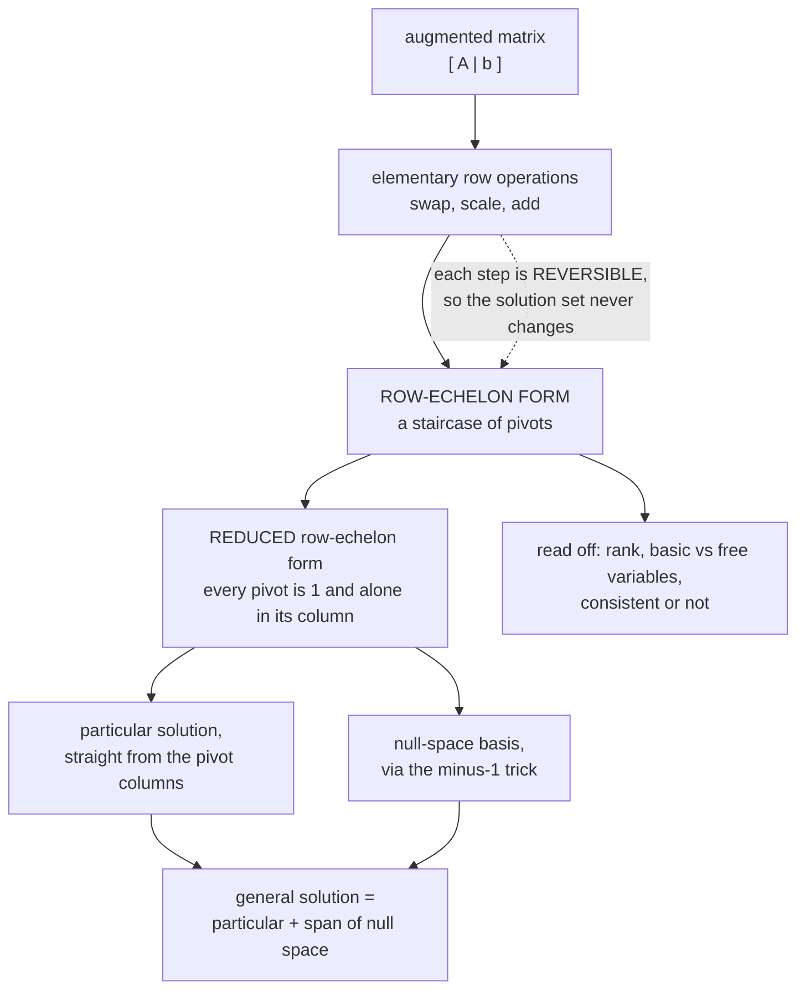

import DataCampExercise from "../../../../components/DataCampExercise.astro";
import ElimStepper from "../../../../components/viz/math/ElimStepper.tsx";
import Figure from "../../../../components/Figure.astro";
import Quiz from "../../../../components/Quiz.astro";

We know $\mathbf{A}\mathbf{x} = \mathbf{b}$ has one, none, or infinitely many solutions. This page is
about the **algorithm that actually finds them**: *Gaussian elimination*. It is the engine under
`np.linalg.solve`, under every regression fit, and under matrix inversion.

It is also, as the book is careful to say, **not what a library does at scale** — and understanding
why is worth as much as the algorithm itself.

## What you'll learn

- The three elementary row operations, and why they cannot change the solution set.
- Row-echelon form, pivots, basic and free variables — and how to read the answer off the staircase.
- The **particular plus general** decomposition, which is the shape of every solution set in the book.
- The **minus-1 trick** for reading a null-space basis straight out of reduced row-echelon form.
- Why inversion is elimination in disguise, and why Gaussian elimination is impractical at scale.

## Intuition: simplify without changing the answer

You already do this by hand. Add one equation to another; scale an equation; swap two equations. None
of these changes which $\mathbf{x}$ satisfy the system — they only make it easier to read. Written on
the coefficients alone they are the **elementary transformations**:

1. **Exchange** two equations (rows).
2. **Multiply** a row by a constant $\lambda \neq 0$.
3. **Add** one row to another.

Why the solution set survives is worth one sentence, because it is the guarantee the whole algorithm
rests on: each operation is **reversible**. Swapping undoes a swap; scaling by $\lambda$ undoes
scaling by $1/\lambda$; adding a row undoes subtracting it. Anything satisfying the new system
therefore satisfies the old one and vice versa, so the two have *exactly* the same solutions. The
$\lambda \neq 0$ requirement is not fussiness — scaling by zero is not reversible, and it would
destroy an equation.

To avoid rewriting the variable names every step, stack $\mathbf{A}$ and $\mathbf{b}$ into one
**augmented matrix** $[\,\mathbf{A} \mid \mathbf{b}\,]$ and operate on that.



## The math

### Row-echelon form

A matrix is in **row-echelon form** when:

- All rows containing only zeros are at the **bottom**.
- Reading nonzero rows only, the first nonzero entry from the left — the **pivot**, or **leading coefficient** — is always **strictly to the right** of the pivot in the row above.

That second condition is what produces the "staircase" shape, and it is why the book calls the
structure exactly that.

The variables belonging to pivot columns are **basic variables**; the rest are **free variables**. That
split is the whole answer to "how many solutions": each free variable is a dimension you can move in
without leaving the solution set.

$$
\#\text{free variables} = n - \operatorname{rk}(\mathbf{A})
$$

**Reduced row-echelon form** adds two more requirements:

- Every pivot is $1$.
- A pivot is the **only** nonzero entry in its column.

Gaussian elimination, as the book defines it, is the algorithm that performs elementary
transformations to reach reduced row-echelon form.

### Particular plus general

This is the decomposition to internalise, because every solution set in the book has this shape. The
book's three-step recipe:

1. Find a **particular** solution to $\mathbf{A}\mathbf{x} = \mathbf{b}$.
2. Find **all** solutions to $\mathbf{A}\mathbf{x} = \mathbf{0}$.
3. Combine them.

$$
\mathbf{x} = \underbrace{\mathbf{x}_p}_{\text{one solution}} + \underbrace{\lambda_1\mathbf{n}_1 + \cdots + \lambda_k\mathbf{n}_k}_{\text{anything that maps to }\mathbf{0}}
$$

Why it works is one line: if $\mathbf{A}\mathbf{x}_p = \mathbf{b}$ and $\mathbf{A}\mathbf{n} = \mathbf{0}$
then $\mathbf{A}(\mathbf{x}_p + \mathbf{n}) = \mathbf{b} + \mathbf{0} = \mathbf{b}$. Adding something
invisible to $\mathbf{A}$ changes nothing that $\mathbf{A}$ can see.

The set $\{\mathbf{n} : \mathbf{A}\mathbf{n} = \mathbf{0}\}$ is the **kernel** or **null space**
(§2.7.3), and this page is where you first compute one. Note also what the shape tells you: the
solution set is a **translate of a subspace** — a subspace shifted off the origin by $\mathbf{x}_p$.
That is precisely §2.8's affine subspace, arriving five sections early.

:::caution[Neither part is unique]
The book flags this explicitly: "neither the general nor the particular solution is unique". Any point
of the solution set works as $\mathbf{x}_p$, and the null space has many bases. Two people can produce
solutions that look completely different and both be right — check by substitution, not by comparing
expressions.
:::

### Reading a particular solution off the pivots

The book's trick: express $\mathbf{b}$ using only the **pivot columns**,

$$
\mathbf{b} = \sum_{i=1}^{P} \lambda_i \mathbf{p}_i,
$$

and work from the **rightmost** pivot column leftwards, because at that end each new unknown appears
in only one equation. Set every non-pivot coefficient to $0$, and the $\lambda_i$ are the particular
solution.

### The minus-1 trick

A genuinely useful piece of mechanics for reading the null space straight out of reduced row-echelon
form.

Given $\mathbf{A}$ in reduced row-echelon form with no all-zero rows, **extend it to a square
$n\times n$ matrix** $\tilde{\mathbf{A}}$ by inserting rows of the form

$$
\begin{bmatrix}0 & \cdots & 0 & -1 & 0 & \cdots & 0\end{bmatrix}
$$

at exactly the positions where the diagonal is missing a pivot — so that the diagonal of
$\tilde{\mathbf{A}}$ contains only $1$s and $-1$s. Then **the columns of $\tilde{\mathbf{A}}$ carrying
a $-1$ on the diagonal are a basis of the null space**.

The book's own worked instance. Starting from

$$
\mathbf{A} = \begin{bmatrix}1 & 3 & 0 & 0 & 3\\ 0 & 0 & 1 & 0 & 9\\ 0 & 0 & 0 & 1 & -4\end{bmatrix},
$$

pivots sit in columns 1, 3, 4, so columns 2 and 5 need $-1$ rows inserted:

$$
\tilde{\mathbf{A}} = \begin{bmatrix}
1 & 3 & 0 & 0 & 3\\
0 & \mathbf{-1} & 0 & 0 & 0\\
0 & 0 & 1 & 0 & 9\\
0 & 0 & 0 & 1 & -4\\
0 & 0 & 0 & 0 & \mathbf{-1}
\end{bmatrix}
$$

Columns 2 and 5 are then a null-space basis:

$$
\ker(\mathbf{A}) = \operatorname{span}\left[\begin{bmatrix}3\\-1\\0\\0\\0\end{bmatrix}, \begin{bmatrix}3\\0\\9\\-4\\-1\end{bmatrix}\right]
$$

Check the first one: $1\cdot3 + 3\cdot(-1) = 0$ ✓, and rows two and three touch only zeros ✓.

Why it works: reading column $j$ of $\tilde{\mathbf{A}}$, the $-1$ in the free position cancels
exactly the contribution the pivot columns make, which is what the book means by "the non-pivot
columns expressed as combinations of the pivot columns on their left".

### Inversion is elimination in disguise

To find $\mathbf{A}^{-1}$, solve $\mathbf{A}\mathbf{X} = \mathbf{I}_n$ — which is $n$ systems sharing
one coefficient matrix. Augment and reduce:

$$
[\,\mathbf{A} \mid \mathbf{I}_n\,] \;\rightsquigarrow\;\cdots\;\rightsquigarrow\; [\,\mathbf{I}_n \mid \mathbf{A}^{-1}\,]
$$

So "determining the inverse of a matrix is equivalent to solving systems of linear equations" — and it
is $n$ of them, which is the arithmetic reason `inv` costs more than `solve`.

### Why libraries do not do this

The book is unusually blunt here, and it is worth quoting the substance. Gaussian elimination is
"intuitive and constructive" and works fine for thousands of variables. But the operation count scales
**cubically** in the number of simultaneous equations, so for millions of variables it is impractical.

In practice large systems are solved **indirectly**:

- **Stationary iterative methods** — Richardson, Jacobi, Gauss–Seidel, successive over-relaxation.
- **Krylov subspace methods** — conjugate gradients, generalised minimal residual, biconjugate gradients.

All of them set up an iteration $\mathbf{x}^{(k+1)} = \mathbf{C}\mathbf{x}^{(k)} + \mathbf{d}$ chosen
to reduce the residual $\lVert\mathbf{x}^{(k+1)} - \mathbf{x}_*\rVert$ at every step. Notice what that
requires: a way to measure the size of a vector. That is a **norm**, which is §3.1 — so this section
ends by needing the next chapter.

Gaussian elimination remains important for the things it *tells* you rather than computes fast:
determinants (§4.1), whether vectors are independent (§2.5), the inverse (§2.2.2), the rank (§2.6.2),
and a basis of a subspace (§2.6.1).

:::caution[And the pseudo-inverse route is worse than it looks]
When $\mathbf{A}$ is not square but has linearly independent columns,
$\mathbf{A}\mathbf{x} = \mathbf{b}$ can be turned into the normal equations
$\mathbf{A}^\top\mathbf{A}\mathbf{x} = \mathbf{A}^\top\mathbf{b}$, giving the **Moore–Penrose
pseudo-inverse** $(\mathbf{A}^\top\mathbf{A})^{-1}\mathbf{A}^\top$ and the minimum-norm least-squares
solution.

The book immediately warns against computing it that way: it needs the matrix–matrix product
$\mathbf{A}^\top\mathbf{A}$ and then an inverse, and "for reasons of numerical precision it is
generally not recommended to compute the inverse or pseudo-inverse". Forming
$\mathbf{A}^\top\mathbf{A}$ **squares the condition number** — so a problem that was losing six digits
now loses twelve. Use `lstsq`, which goes through a QR or SVD factorisation instead. §9.2 returns to
this.
:::

## Worked example by hand

The book's **Example 2.6**, which is the best kind of example because the answer depends on a
parameter. Solve

$$
\begin{aligned}
-2x_1 + 4x_2 - 2x_3 - x_4 + 4x_5 &= -3\\
4x_1 - 8x_2 + 3x_3 - 3x_4 + x_5 &= 2\\
x_1 - 2x_2 + x_3 - x_4 + x_5 &= 0\\
x_1 - 2x_2 \phantom{{}+ x_3} - 3x_4 + 4x_5 &= a
\end{aligned}
$$

Swap rows 1 and 3 to get a clean leading $1$, then clear the first column, and after the remaining
steps the augmented matrix reaches row-echelon form:

$$
\left[\begin{array}{ccccc|c}
1 & -2 & 1 & -1 & 1 & 0\\
0 & 0 & 1 & -1 & 3 & -2\\
0 & 0 & 0 & 1 & -2 & 1\\
0 & 0 & 0 & 0 & 0 & a+1
\end{array}\right]
$$

Read the last row: it says $0 = a + 1$. So the system is **solvable only when $a = -1$** — one
parameter, and the entire consistency of the system hinges on it. This is the "$0 = $ nonzero"
contradiction from §2.1, now with a knob on it.

With $a = -1$, the pivots are in columns 1, 3, 4, so $x_1, x_3, x_4$ are **basic** and $x_2, x_5$ are
**free**. Back-substituting gives the particular solution and the two null-space directions:

$$
\left\{\mathbf{x} \in \mathbb{R}^5 : \mathbf{x} = \begin{bmatrix}2\\0\\-1\\1\\0\end{bmatrix}
+ \lambda_1\begin{bmatrix}2\\1\\0\\0\\0\end{bmatrix}
+ \lambda_2\begin{bmatrix}2\\0\\-1\\2\\1\end{bmatrix},\;\; \lambda_1,\lambda_2 \in \mathbb{R}\right\}
$$

Two free variables, two null-space directions, and $5 - 3 = 2$ — the count matches
$n - \operatorname{rk}(\mathbf{A})$ exactly, as it must.

Let us verify the particular solution by hand against the original third equation,
$x_1 - 2x_2 + x_3 - x_4 + x_5 = 0$: substituting $(2, 0, -1, 1, 0)$ gives
$2 - 0 + (-1) - 1 + 0 = 0$ ✓.

And a smaller one all the way through. Solve

$$
\begin{aligned}
2x_1 + x_2 - x_3 &= 8\\
-3x_1 - x_2 + 2x_3 &= -11\\
-2x_1 + x_2 + 2x_3 &= -3
\end{aligned}
$$

| step | operation | result |
| --- | --- | --- |
| 1 | pivot $2$ in row 1 | $[2, 1, -1 \mid 8]$ |
| 2 | $R_2 \leftarrow R_2 + 1.5R_1$ | $[0, 0.5, 0.5 \mid 1]$ |
| 3 | $R_3 \leftarrow R_3 + R_1$ | $[0, 2, 1 \mid 5]$ |
| 4 | pivot $0.5$ in row 2 | — |
| 5 | $R_3 \leftarrow R_3 - 4R_2$ | $[0, 0, -1 \mid 1]$ |
| 6 | back-substitute | $x_3 = -1$ |
| 7 | row 2: $0.5x_2 + 0.5(-1) = 1$ | $x_2 = 3$ |
| 8 | row 1: $2x_1 + 3 + 1 = 8$ | $x_1 = 2$ |

Solution $(2, 3, -1)$. Three pivots, three unknowns, no free variables — unique.

## See it move

The same $3\times3$ system, one row operation per frame. The ring marks the pivot; amber is the row
being rewritten, blue the row doing the rewriting, and the operation is printed in the notation used
above.

<ElimStepper
  client:visible
  matrix={[[2, 1, -1], [-3, -1, 2], [-2, 1, 2]]}
  rhs={[8, -11, -3]}
  reduced
  title="Three pivots turn a system into an answer"
  desc="Every operation below a pivot is chosen to put a zero under the ring. Once the staircase is built, normalising and clearing upwards puts the solution in the right-hand column."
/>

Now a system with a free variable — three unknowns but only two pivots:

<ElimStepper
  client:visible
  matrix={[[1, 2, 3], [2, 4, 6], [1, 1, 1]]}
  rhs={[6, 12, 3]}
  reduced
  title="A dependent row, and the free variable it leaves behind"
  desc="The second row is exactly twice the first, so it contributes no pivot. Two pivots for three unknowns means a one-dimensional solution set."
/>

The second row vanishing is not a numerical accident — it was twice the first row all along, so it
carried no information the first row did not. **A redundant equation shows up as a zero row.** That is
the mechanical face of §2.5's linear dependence.

And an inconsistent one:

<ElimStepper
  client:visible
  matrix={[[1, 1], [2, 2]]}
  rhs={[3, 1]}
  title="What inconsistency looks like mechanically"
  desc="Elimination does not get stuck. It produces a row saying zero equals a nonzero number — a perfectly well-formed false statement."
/>

## From scratch

```python title="elimination.py" showLineNumbers{1}
import numpy as np

def rref(M, tol=1e-12):
    """Reduced row-echelon form, plus the pivot column indices.

    Textbook pivoting: swap only when the pivot position is zero. A library
    swaps to the largest available magnitude for numerical reasons, which gives
    a different (better-conditioned) sequence of operations and the same answer.
    """
    A = M.astype(float).copy()
    rows, cols = A.shape
    pivots, r = [], 0
    for c in range(cols):
        if r >= rows:
            break
        p = next((i for i in range(r, rows) if abs(A[i, c]) > tol), None)
        if p is None:
            continue                                   # no pivot in this column
        A[[r, p]] = A[[p, r]]                          # swap
        A[r] = A[r] / A[r, c]                          # normalise the pivot to 1
        for i in range(rows):
            if i != r and abs(A[i, c]) > tol:
                A[i] = A[i] - A[i, c] * A[r]           # clear the whole column
        pivots.append(c)
        r += 1
    return A, pivots

def null_basis(R, pivots):
    """The minus-1 trick: extend to square, read off the -1 columns."""
    n = R.shape[1]
    free = [c for c in range(n) if c not in pivots]
    ext = np.zeros((n, n))
    ext[:len(pivots)] = R[:len(pivots)]                 # the nonzero rows of the RREF
    # Re-seat the pivot rows onto the diagonal, then insert -1 rows for free columns.
    seated = np.zeros((n, n))
    for k, c in enumerate(pivots):
        seated[c] = R[k]
    for c in free:
        seated[c, c] = -1.0
    return [seated[:, c] for c in free], seated

# ---- the small 3x3 system ------------------------------------------------
A = np.array([[2.0, 1.0, -1.0], [-3.0, -1.0, 2.0], [-2.0, 1.0, 2.0]])
b = np.array([8.0, -11.0, -3.0])
R, piv = rref(np.c_[A, b])
print("RREF of [A|b]:\n", np.round(R, 6))
print("pivot columns:", piv, " rank:", len(piv))
print("solution read off:", R[:3, 3], " np.linalg.solve:", np.linalg.solve(A, b))

# ---- the book's minus-1-trick matrix ------------------------------------
Abook = np.array([[1.0, 3.0, 0.0, 0.0, 3.0],
                  [0.0, 0.0, 1.0, 0.0, 9.0],
                  [0.0, 0.0, 0.0, 1.0, -4.0]])
Rb, pb = rref(Abook)
basis, ext = null_basis(Rb, pb)
print("\nalready in RREF:", np.allclose(Rb, Abook), " pivots:", pb)
print("extended matrix diagonal:", np.diag(ext))
for v in basis:
    print("  null vector", v, " A@v =", np.round(Abook @ v, 12))

# ---- the parametrised Example 2.6 system --------------------------------
def example_26(a):
    M = np.array([[-2.0, 4.0, -2.0, -1.0, 4.0, -3.0],
                  [ 4.0,-8.0,  3.0, -3.0, 1.0,  2.0],
                  [ 1.0,-2.0,  1.0, -1.0, 1.0,  0.0],
                  [ 1.0,-2.0,  0.0, -3.0, 4.0,    a]])
    A_, b_ = M[:, :5], M[:, 5]
    return np.linalg.matrix_rank(A_), np.linalg.matrix_rank(M)

print()
for a in (-1.0, 0.0, 3.0):
    rA, rAb = example_26(a)
    print(f"a = {a:5}  rk(A) = {rA}  rk(A|b) = {rAb}  ->  "
          f"{'solvable' if rA == rAb else 'INCONSISTENT'}")

# The claimed solution set, at a = -1.
A26 = np.array([[-2.0, 4.0, -2.0, -1.0, 4.0],
                [ 4.0,-8.0,  3.0, -3.0, 1.0],
                [ 1.0,-2.0,  1.0, -1.0, 1.0],
                [ 1.0,-2.0,  0.0, -3.0, 4.0]])
b26 = np.array([-3.0, 2.0, 0.0, -1.0])
xp = np.array([2.0, 0.0, -1.0, 1.0, 0.0])
n1 = np.array([2.0, 1.0,  0.0, 0.0, 0.0])
n2 = np.array([2.0, 0.0, -1.0, 2.0, 1.0])
print("\nparticular solution works:", np.allclose(A26 @ xp, b26))
print("n1 in the null space:", np.allclose(A26 @ n1, 0),
      " n2 in the null space:", np.allclose(A26 @ n2, 0))
print("xp + 3*n1 - 2*n2 still solves:", np.allclose(A26 @ (xp + 3 * n1 - 2 * n2), b26))
print("free variables:", A26.shape[1] - np.linalg.matrix_rank(A26))

# ---- inversion by augmenting with the identity --------------------------
A4 = np.array([[1.0, 0.0, 2.0, 0.0],
               [1.0, 1.0, 0.0, 0.0],
               [1.0, 2.0, 0.0, 1.0],
               [1.0, 1.0, 1.0, 1.0]])
Raug, _ = rref(np.c_[A4, np.eye(4)])
inv = Raug[:, 4:]
print("\ninverse by elimination:\n", np.round(inv, 6))
print("matches np.linalg.inv:", np.allclose(inv, np.linalg.inv(A4)))

# ---- why not to form A^T A ---------------------------------------------
from numpy.linalg import cond
T = np.array([[1.0, 1.0], [1.0, 1.0 + 1e-6], [1.0, 1.0 - 1e-6]])
print(f"\ncond(A)      = {cond(T):.3e}")
print(f"cond(A^T A)  = {cond(T.T @ T):.3e}   <- roughly the square")
```

```
RREF of [A|b]:
 [[ 1.  0.  0.  2.]
 [ 0.  1.  0.  3.]
 [-0. -0.  1. -1.]]
pivot columns: [0, 1, 2]  rank: 3
solution read off: [ 2.  3. -1.]  np.linalg.solve: [ 2.  3. -1.]

already in RREF: True  pivots: [0, 2, 3]
extended matrix diagonal: [ 1. -1.  1.  1. -1.]
  null vector [ 3. -1.  0.  0.  0.]  A@v = [0. 0. 0.]
  null vector [ 3.  0.  9. -4. -1.]  A@v = [0. 0. 0.]

a =  -1.0  rk(A) = 3  rk(A|b) = 3  ->  solvable
a =   0.0  rk(A) = 3  rk(A|b) = 4  ->  INCONSISTENT
a =   3.0  rk(A) = 3  rk(A|b) = 4  ->  INCONSISTENT

particular solution works: True
n1 in the null space: True  n2 in the null space: True
xp + 3*n1 - 2*n2 still solves: True
free variables: 2

inverse by elimination:
 [[-1.  2. -2.  2.]
 [ 1. -1.  2. -2.]
 [ 1. -1.  1. -1.]
 [-1.  0. -1.  2.]]
matches np.linalg.inv: True

cond(A)      = 2.449e+06
cond(A^T A)  = 6.000e+12
```

Four things worth reading off. The RREF puts the solution $(2, 3, -1)$ **in the right-hand column**, no
back-substitution needed. The minus-1 trick reproduces the book's two null vectors exactly, and both
satisfy $\mathbf{A}\mathbf{v} = \mathbf{0}$ to machine precision. The parametrised system is solvable
at $a = -1$ and inconsistent otherwise, detected purely by comparing ranks. And the inverse computed
by augmenting with the identity matches `np.linalg.inv` — the book's **Example 2.9**, reproduced.

The last two lines are the pseudo-inverse warning made quantitative: forming
$\mathbf{A}^\top\mathbf{A}$ took the condition number from $1.7\times10^6$ to $3.0\times10^{12}$. Six
digits of accuracy became twelve digits of loss, for no reason other than the choice of formula.

## On real data

<Figure
  src="/images/mml/solving-systems-of-linear-equations/elimination-cost"
  alt="Log-log plot of wall-clock time against system size n for a pure-Python Gaussian elimination and for numpy.linalg.solve, with a reference line of slope three showing both are cubic."
  title="Gaussian elimination is cubic, however it is written"
  caption="Both curves parallel the n-cubed reference. Cubic is why the book calls direct elimination impractical for millions of unknowns, whoever writes the loop."
/>

<Figure
  src="/images/mml/solving-systems-of-linear-equations/normal-equations-conditioning"
  alt="Log-log plot of relative solution error against the condition number of A, comparing solving via the normal equations against numpy.linalg.lstsq. The normal-equations curve rises with the square of the condition number and reaches complete failure much earlier."
  title="Why the book warns against the normal equations"
  caption="Forming A-transpose-A squares the condition number, so the normal-equations route fails at roughly the square root of the conditioning that lstsq survives."
/>

## Reading the plot

The second figure is the practical payoff of this page. Both methods solve the same least-squares
problem and agree to fifteen digits while the problem is well conditioned. As $\kappa(\mathbf{A})$
grows, the normal-equations curve climbs **twice as steeply** on the log axis — it tracks the purple
$\varepsilon\kappa^2$ reference, while `lstsq` tracks the amber $\varepsilon\kappa$ one.

The crossover is measured, not asserted. At $\kappa \approx 3\times10^8$ the normal-equations route
passes **100% relative error** — no correct digits left at all — while `lstsq` at that same point is
still at $8\times10^{-10}$, around nine good digits. At $\kappa = 10^{12}$, where the normal equations
are returning pure noise, `lstsq` still gives four.

That factor-of-two in the exponent is the whole content of the book's warning. It is not a small
constant-factor preference: it is the difference between a fit that works and one that returns noise,
on the same data. And it is why §9.2's ridge regression, which adds $\lambda\mathbf{I}$ to
$\mathbf{A}^\top\mathbf{A}$, improves numerical behaviour as well as generalisation — it lifts the
smallest singular value off the floor.

:::tip[From the book]
*Mathematics for Machine Learning* §2.3 gives the general form (**Equation 2.37**) and then
§2.3.1 the **particular and general solution** via **Equation 2.38**'s easy system, deriving the
general solution (**Equation 2.43**) and stating the three-step recipe with the remark that "neither
the general nor the particular solution is unique". §2.3.2 lists the three **elementary
transformations** — exchange, multiplication by $\lambda \neq 0$, addition of rows — and works
**Example 2.6**, the parametrised five-unknown system whose augmented matrix reaches row-echelon form
(**Equation 2.45**) with the final row reading $0 = a+1$, so it is solvable only for $a = -1$, with
particular solution **Equation 2.46** and general solution **Equation 2.47**. The **pivot and
staircase** remark, **Definition 2.6** (row-echelon form), and the **basic and free variables** remark
follow; the recipe for obtaining a particular solution from the pivot columns works right-to-left. The
**reduced row-echelon form** remark gives its two extra conditions, **Gaussian elimination** is defined
as the algorithm reaching that form, and **Example 2.7** verifies an RREF. §2.3.3 is the **minus-1
trick**, with **Equations 2.51–2.52** and **Example 2.8** producing the same null-space basis
(**Equation 2.55**) that **Equation 2.50** obtained "by insight". *Calculating the Inverse* gives
$[\mathbf{A}\mid\mathbf{I}_n] \rightsquigarrow [\mathbf{I}_n\mid\mathbf{A}^{-1}]$ (**Equation 2.56**)
and **Example 2.9** inverts a $4\times4$. §2.3.4 introduces the **Moore–Penrose pseudo-inverse**
(**Equation 2.59**), warns that computing an inverse or pseudo-inverse is "generally not recommended"
for reasons of numerical precision, notes that Gaussian elimination scales **cubically** and is
impractical for millions of variables, and lists the **stationary iterative** and **Krylov subspace**
alternatives with the iteration $\mathbf{x}^{(k+1)} = \mathbf{C}\mathbf{x}^{(k)} + \mathbf{d}$
(**Equation 2.60**) reducing the residual measured in a norm — forward-referencing §3.1.
:::

## Pitfalls

:::danger[Scaling a row by zero is not an elementary operation]
The rule is $\lambda \neq 0$, and the reason is reversibility. Multiplying a row by zero destroys the
equation and can turn an inconsistent system into a consistent-looking one. Every legal operation must
be undoable.
:::

:::caution[A zero row is information, not a failure]
It means an equation was redundant — a combination of the others. The rank drops, a free variable
appears, and the solution set gains a dimension. Nothing went wrong.
:::

:::danger[Do not form A-transpose-A to solve least squares]
It squares the condition number. The measured example above went from $\kappa = 1.7\times10^6$ to
$3.0\times10^{12}$. Use `np.linalg.lstsq`, which factorises instead. The book calls the pseudo-inverse
route "generally not recommended" for exactly this reason.
:::

:::caution[Textbook pivoting is not library pivoting]
The book swaps rows only when the pivot position is zero. A library swaps to the **largest available
magnitude** — partial pivoting — because dividing by a tiny pivot amplifies error. Both give the same
exact answer; only one is numerically safe. The step-throughs on this page use the textbook rule so
they match what you would do by hand.
:::

:::caution[The particular solution you find is not "the" answer]
Neither $\mathbf{x}_p$ nor the null-space basis is unique. Two correct answers can look entirely
different. Verify by substituting, never by comparing to someone else's expression.
:::

## Compare

| form | what it gives you | cost |
| --- | --- | --- |
| row-echelon form | rank, consistency, which variables are free | one forward sweep |
| reduced row-echelon form | the particular solution read straight off, plus the null space via the minus-1 trick | forward sweep plus a backward one |
| `np.linalg.solve` | the unique solution, square systems only | $O(n^3)$, LU with partial pivoting |
| `np.linalg.lstsq` | least-squares solution for any shape | $O(mn^2)$, via QR or SVD |
| `np.linalg.pinv` | the pseudo-inverse itself | SVD; use only when you need the operator |
| normal equations | the same answer, badly | squares the condition number — avoid |
| iterative methods | approximate solutions for huge sparse systems | per-iteration matrix–vector products |

<Quiz
  title="Check yourself"
  questions={[
    {
      q: "Why is scaling a row required to use a nonzero multiplier?",
      options: [
        "To keep the entries integers",
        "Because every elementary operation must be reversible, and multiplying by zero destroys the equation",
        "Because zero pivots break the staircase",
        "It is a convention with no mathematical content",
      ],
      answer: 1,
      explain:
        "Reversibility is what guarantees the solution set is unchanged. Scaling by zero cannot be undone and can make an inconsistent system look consistent.",
    },
    {
      q: "A system in five unknowns reduces to row-echelon form with three pivots. How many free variables, and what shape is the solution set?",
      options: [
        "Three free variables, a three-dimensional set",
        "Two free variables, and the solution set is a two-dimensional plane shifted off the origin",
        "No free variables — three pivots determine everything",
        "It depends on the right-hand side",
      ],
      answer: 1,
      explain:
        "Free variables number n minus the rank, so five minus three is two. The solution set is a particular solution plus the span of two null-space vectors — a subspace translated off the origin, which is exactly section 2.8's affine subspace.",
    },
    {
      q: "What does the minus-1 trick produce?",
      options: [
        "A particular solution to Ax = b",
        "A basis for the null space, read directly off the extended reduced row-echelon form",
        "The determinant",
        "The inverse matrix",
      ],
      answer: 1,
      explain:
        "Extending the RREF to a square matrix so the diagonal holds only ones and minus-ones, the columns carrying a minus-one on the diagonal are a null-space basis. The book gets the same answer this way that it earlier got by insight.",
    },
    {
      q: "Why does the book advise against solving least squares through the normal equations?",
      options: [
        "The formula is wrong",
        "It only works for square matrices",
        "Forming A-transpose-A squares the condition number, so accuracy collapses far earlier",
        "It is slower than iterative methods",
      ],
      answer: 2,
      explain:
        "The mathematics is correct and the numerics are not. In the measured example the condition number went from about 2.4e6 to 6.0e12 — the same problem, twice the digit loss. lstsq factorises instead.",
    },
  ]}
/>

## 🧪 Try It Yourself

### Exercise 1 – Solve a 3×3 system

<DataCampExercise
  lang="python"
  hint={`np.linalg.solve takes the coefficient matrix and the right-hand side.`}
  code={`import numpy as np

A = np.array([[ 2.0,  1.0, -1.0],
              [-3.0, -1.0,  2.0],
              [-2.0,  1.0,  2.0]])
b = np.array([8.0, -11.0, -3.0])

x = np.linalg.___(A, b)          # replace ___ with the solver
print("x =", x)
print("residual:", A @ x - b)

# -- Expected output ------------------------------
# x = [ 2.  3. -1.]
# residual: [0. 0. 0.]
# -------------------------------------------------`}
  solution={`import numpy as np
A = np.array([[ 2.0,  1.0, -1.0],
              [-3.0, -1.0,  2.0],
              [-2.0,  1.0,  2.0]])
b = np.array([8.0, -11.0, -3.0])
x = np.linalg.solve(A, b)
print("x =", x)
print("residual:", A @ x - b)`}
  sct={`test_output_contains("x = [ 2.  3. -1.]")
success_msg("Three pivots, three unknowns, zero residual. The same answer the step-through built by hand.")`}
  height={200}
/>

### Exercise 2 – Count the free variables

<DataCampExercise
  lang="python"
  hint={`Free variables number n minus the rank, where n is the number of columns.`}
  code={`import numpy as np

A = np.array([[1.0, 2.0, 3.0],
              [2.0, 4.0, 6.0],
              [1.0, 1.0, 1.0]])

rank = np.linalg.matrix_rank(A)
free = A.shape[1] - ___          # replace ___ with rank
print("rank:", rank, " free variables:", free)
print("second row is twice the first:", np.allclose(A[1], 2 * A[0]))

# -- Expected output ------------------------------
# rank: 2  free variables: 1
# second row is twice the first: True
# -------------------------------------------------`}
  solution={`import numpy as np
A = np.array([[1.0, 2.0, 3.0],
              [2.0, 4.0, 6.0],
              [1.0, 1.0, 1.0]])
rank = np.linalg.matrix_rank(A)
free = A.shape[1] - rank
print("rank:", rank, " free variables:", free)
print("second row is twice the first:", np.allclose(A[1], 2 * A[0]))`}
  sct={`test_output_contains("free variables: 1")
success_msg("The redundant row cost a pivot, which bought a free variable. A one-dimensional solution set.")`}
  height={200}
/>

### Exercise 3 – Particular plus null space

<DataCampExercise
  lang="python"
  hint={`Adding any null-space vector to a solution gives another solution, because A maps it to zero.`}
  code={`import numpy as np

A  = np.array([[1.0, 2.0, 3.0],
               [1.0, 1.0, 1.0]])
b  = np.array([6.0, 3.0])
xp = np.array([0.0, 3.0, 0.0])          # a particular solution
n  = np.array([1.0, -2.0, 1.0])         # a null-space direction

print("A @ xp == b :", np.allclose(A @ xp, b))
print("A @ n  == 0 :", np.allclose(A @ n, 0))
for lam in [-4.0, 0.0, 2.5]:
    still = np.allclose(A @ (xp + lam * ___), b)     # replace ___ with n
    print(f"  lam={lam:5}  still a solution: {still}")

# -- Expected output ------------------------------
# A @ xp == b : True
# A @ n  == 0 : True
#   lam= -4.0  still a solution: True
#   lam=  0.0  still a solution: True
#   lam=  2.5  still a solution: True
# -------------------------------------------------`}
  solution={`import numpy as np
A  = np.array([[1.0, 2.0, 3.0],
               [1.0, 1.0, 1.0]])
b  = np.array([6.0, 3.0])
xp = np.array([0.0, 3.0, 0.0])
n  = np.array([1.0, -2.0, 1.0])
print("A @ xp == b :", np.allclose(A @ xp, b))
print("A @ n  == 0 :", np.allclose(A @ n, 0))
for lam in [-4.0, 0.0, 2.5]:
    still = np.allclose(A @ (xp + lam * n), b)
    print(f"  lam={lam:5}  still a solution: {still}")`}
  sct={`test_output_contains("lam=  2.5  still a solution: True")
success_msg("Adding something invisible to A changes nothing A can see. That is the whole particular-plus-general argument.")`}
  height={245}
/>

### Exercise 4 – Invert by augmenting with the identity

<DataCampExercise
  lang="python"
  hint={`Stack A next to the identity with np.c_, reduce, and the right-hand block is the inverse. Here just verify the block.`}
  code={`import numpy as np

A = np.array([[1.0, 0.0, 2.0, 0.0],
              [1.0, 1.0, 0.0, 0.0],
              [1.0, 2.0, 0.0, 1.0],
              [1.0, 1.0, 1.0, 1.0]])

aug = np.c_[A, np.eye(___)]        # replace ___ so the identity is 4x4
print("augmented shape:", aug.shape)

inv = np.linalg.inv(A)
print("A @ inv == I:", np.allclose(A @ inv, np.eye(4)))
print("first row of the inverse:", inv[0])

# -- Expected output ------------------------------
# augmented shape: (4, 8)
# A @ inv == I: True
# first row of the inverse: [-1.  2. -2.  2.]
# -------------------------------------------------`}
  solution={`import numpy as np
A = np.array([[1.0, 0.0, 2.0, 0.0],
              [1.0, 1.0, 0.0, 0.0],
              [1.0, 2.0, 0.0, 1.0],
              [1.0, 1.0, 1.0, 1.0]])
aug = np.c_[A, np.eye(4)]
print("augmented shape:", aug.shape)
inv = np.linalg.inv(A)
print("A @ inv == I:", np.allclose(A @ inv, np.eye(4)))
print("first row of the inverse:", inv[0])`}
  sct={`test_output_contains("augmented shape: (4, 8)")
success_msg("Four columns of identity means four systems sharing one coefficient matrix — which is why inv costs more than solve.")`}
  height={230}
/>

### Exercise 5 – Watch the normal equations square the conditioning

<DataCampExercise
  lang="python"
  hint={`np.linalg.cond gives the condition number. Compare it for A and for A.T @ A.`}
  code={`import numpy as np

A = np.array([[1.0, 1.0],
              [1.0, 1.0 + 1e-6],
              [1.0, 1.0 - 1e-6]])

kA  = np.linalg.cond(A)
kAA = np.linalg.cond(A.T @ ___)        # replace ___ with A

print(f"cond(A)     = {kA:.3e}")
print(f"cond(A^T A) = {kAA:.3e}")
print("roughly squared?", abs(np.log10(kAA) - 2 * np.log10(kA)) < 0.5)

# -- Expected output ------------------------------
# cond(A)     = 2.449e+06
# cond(A^T A) = 6.000e+12
# roughly squared? True
# -------------------------------------------------`}
  solution={`import numpy as np
A = np.array([[1.0, 1.0],
              [1.0, 1.0 + 1e-6],
              [1.0, 1.0 - 1e-6]])
kA  = np.linalg.cond(A)
kAA = np.linalg.cond(A.T @ A)
print(f"cond(A)     = {kA:.3e}")
print(f"cond(A^T A) = {kAA:.3e}")
print("roughly squared?", abs(np.log10(kAA) - 2 * np.log10(kA)) < 0.5)`}
  sct={`test_output_contains("roughly squared? True")
success_msg("Six digits of loss became twelve, from the choice of formula alone. Use lstsq.")`}
  height={230}
/>

## Recall card

- **The three elementary transformations** — exchange two rows, scale a row by a nonzero constant, add one row to another — and each is **reversible**, which is why the solution set never changes.
- **Row-echelon form is a staircase**: zero rows at the bottom, and each pivot strictly to the right of the one above.
- **Pivot columns give basic variables and the rest give free variables**, and the number of free variables is $n$ minus the rank.
- **Reduced row-echelon form** additionally makes every pivot $1$ and the only nonzero entry in its column, which is where the particular solution can be read straight off.
- **Every solution set is particular plus general** — one solution plus the whole null space — because adding something the matrix maps to zero changes nothing the matrix can see.
- **Neither the particular solution nor the null-space basis is unique**, so verify by substitution rather than by comparison.
- **The solution set is a subspace translated off the origin**, which is exactly section 2.8's affine subspace.
- **The minus-1 trick** reads a null-space basis off the extended reduced row-echelon form: the columns whose diagonal entry is minus one.
- **Inversion is elimination in disguise** — augment with the identity and reduce — and it is $n$ systems at once, which is why `inv` costs more than `solve`.
- **Gaussian elimination scales cubically**, so it is impractical for millions of unknowns; large sparse systems use stationary iterative or Krylov subspace methods, which need a norm to measure the residual.
- **Never form A-transpose-A to solve least squares**: it squares the condition number, turning six digits of loss into twelve.

**Next:** the structure all of this has been living inside — **[vector spaces](../vector-spaces/)**.
