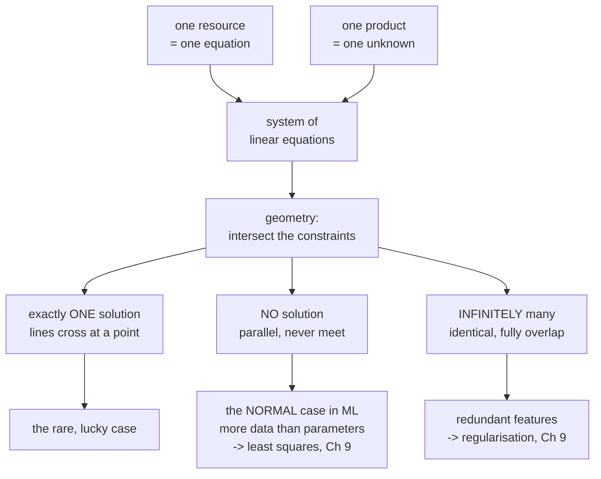

import DataCampExercise from "../../../../components/DataCampExercise.astro";
import ElimStepper from "../../../../components/viz/math/ElimStepper.tsx";
import Figure from "../../../../components/Figure.astro";
import Quiz from "../../../../components/Quiz.astro";

Linear algebra was born from one deceptively simple question: **given several linear constraints,
what values satisfy all of them at once?** That question is a *system of linear equations*, and it
shows up everywhere — from mixing ingredients in a factory to fitting a regression line through data.

The book opens the entire chapter with it, and for a reason worth stating up front: "many problems
can be formulated as systems of linear equations, and linear algebra gives us the tools for solving
them."

## What you'll learn

- What makes an equation **linear**, and why that restriction is what makes the subject tractable.
- The three — and only three — possible solution sets, and how to tell them apart geometrically.
- The compact forms $\mathbf{A}\mathbf{x} = \mathbf{b}$ and $\sum_j x_j \mathbf{a}_j = \mathbf{b}$, and why the second is the more revealing one.
- Why "no exact solution" is the **normal** case in machine learning, not a failure.
- What `LinAlgError: Singular matrix` is actually telling you.

## Intuition: the production plan

Imagine a small workshop that makes two products, **tables** and **chairs**. Each needs wood and
labour:

- A table uses **4 units of wood** and **2 hours of labour**.
- A chair uses **1 unit of wood** and **2 hours of labour**.

This week you have **5 units of wood** and **6 hours of labour**, and you want to use them up
*exactly* — no waste. How many tables $x_1$ and chairs $x_2$ should you make?

Each resource gives you one equation:

$$
\begin{aligned}
4x_1 + 1x_2 &= 5 \quad \text{(wood)}\\
2x_1 + 2x_2 &= 6 \quad \text{(labour)}
\end{aligned}
$$

Two equations, two unknowns. This *is* a system of linear equations, and it is the book's own
motivating example in miniature: products consuming resources, and an optimal plan being exactly a
solution with nothing left over.



## The math

### The general form

With $m$ equations and $n$ unknowns $x_1, \dots, x_n$:

$$
\begin{aligned}
a_{11}x_1 + a_{12}x_2 + \cdots + a_{1n}x_n &= b_1\\
a_{21}x_1 + a_{22}x_2 + \cdots + a_{2n}x_n &= b_2\\
&\;\;\vdots\\
a_{m1}x_1 + a_{m2}x_2 + \cdots + a_{mn}x_n &= b_m
\end{aligned}
$$

The $a_{ij}$ are known **coefficients**, the $b_i$ known **constants**, and the $x_j$ the
**unknowns**. Any $n$-tuple $(x_1, \dots, x_n)$ satisfying *every* equation simultaneously is a
**solution**.

:::note[The word "linear"]
Every unknown appears **to the first power only** — no $x^2$, no $x_1 x_2$, no $\sin(x)$. That single
restriction is what makes these systems solvable in closed form, and it is why so much of machine
learning is built on top of them. When a model is "nonlinear", the usual move is to apply a nonlinear
feature map and then solve a *linear* system in the transformed features (§9.2) — the linearity is
too useful to give up.
:::

### Two compact forms, and why the second one matters more

Collecting coefficients into a matrix gives the form everyone knows:

$$
\begin{bmatrix} a_{11} & \cdots & a_{1n}\\ \vdots & & \vdots\\ a_{m1} & \cdots & a_{mn}\end{bmatrix}
\begin{bmatrix} x_1 \\ \vdots \\ x_n \end{bmatrix}
=
\begin{bmatrix} b_1 \\ \vdots \\ b_m \end{bmatrix}
\qquad\Longleftrightarrow\qquad
\mathbf{A}\mathbf{x} = \mathbf{b}
$$

But the book writes it a second way first, and that ordering is deliberate:

$$
x_1\begin{bmatrix} a_{11}\\ \vdots\\ a_{m1}\end{bmatrix}
+ x_2\begin{bmatrix} a_{12}\\ \vdots\\ a_{m2}\end{bmatrix}
+ \cdots
+ x_n\begin{bmatrix} a_{1n}\\ \vdots\\ a_{mn}\end{bmatrix}
= \begin{bmatrix} b_1\\ \vdots\\ b_m\end{bmatrix}
$$

Read that carefully. **The unknowns are scaling the columns.** So solving
$\mathbf{A}\mathbf{x} = \mathbf{b}$ is asking: *can $\mathbf{b}$ be built as a weighted combination
of the columns of $\mathbf{A}$, and if so, with which weights?*

That reframing is the single most useful sentence in this chapter, because it converts a question
about equations into a question about **reach**: is $\mathbf{b}$ inside the set of things the columns
can build? §2.5 names that set the *span*, §2.6 measures it as the *rank*, and §2.7 calls it the
*image*. Three sections, one question, first asked here.

### Exactly three outcomes

For a real-valued system there are **only three possibilities**: no solution, exactly one, or
infinitely many. Nothing else can happen — you cannot have exactly two.

With two unknowns, each equation is a **line** in the $x_1x_2$-plane, and a solution must lie on all
lines at once, so the solution set is their **intersection**:

| lines | intersection | solutions |
| --- | --- | --- |
| cross at a point | a point | exactly **one** |
| parallel, distinct | empty | **none** |
| identical | the whole line | **infinitely many** |

With three unknowns each equation is a **plane**, and intersecting planes gives a plane, a line, a
point, or nothing — the same three outcomes, one dimension up. The book states this generalisation
explicitly and it keeps holding: in $\mathbb{R}^n$ each equation is a hyperplane, and the solution set
is an intersection of hyperplanes.

**Why "exactly two" is impossible** is worth seeing, because it is the first place the structure
shows. Suppose $\mathbf{x}$ and $\mathbf{y}$ are both solutions. Then for any $\lambda$,

$$
\mathbf{A}\bigl(\lambda\mathbf{x} + (1-\lambda)\mathbf{y}\bigr)
= \lambda\mathbf{A}\mathbf{x} + (1-\lambda)\mathbf{A}\mathbf{y}
= \lambda\mathbf{b} + (1-\lambda)\mathbf{b} = \mathbf{b},
$$

so the whole line through them is made of solutions. Two solutions therefore force infinitely many.
Linearity does not permit a finite crowd.

## Worked example by hand

Back to the tables and chairs:

$$
\begin{aligned}
4x_1 + x_2 &= 5\\
2x_1 + 2x_2 &= 6
\end{aligned}
$$

From the second equation, $x_1 + x_2 = 3$, so $x_2 = 3 - x_1$. Substituting into the first:

$$
4x_1 + (3 - x_1) = 5 \;\Longrightarrow\; 3x_1 = 2 \;\Longrightarrow\; x_1 = \tfrac{2}{3},
\qquad x_2 = 3 - \tfrac{2}{3} = \tfrac{7}{3}.
$$

Two-thirds of a table is not a useful production plan, which is a nice reminder that "solvable" and
"meaningful" are different questions — but it is the unique solution.

Now the book's own geometric example, and every step by hand:

$$
\begin{aligned}
4x_1 + 4x_2 &= 5\\
2x_1 - 4x_2 &= 1
\end{aligned}
$$

Adding the two equations kills $x_2$ outright: $6x_1 = 6$, so $x_1 = 1$. Back-substituting into the
first, $4 + 4x_2 = 5$, so $x_2 = \tfrac14$. The solution is $(1, \tfrac14)$ — exactly the point the
book's Figure 2.3 marks.

And a system of each of the three kinds, checked in full:

| system | manipulation | outcome |
| --- | --- | --- |
| $x_1 + x_2 = 3$, $x_1 - x_2 = 1$ | add: $2x_1 = 4$ | **one**: $(2, 1)$ |
| $x_1 + x_2 = 3$, $x_1 + x_2 = 1$ | subtract: $0 = 2$ | **none** — a contradiction |
| $x_1 + x_2 = 3$, $2x_1 + 2x_2 = 6$ | halve the second: identical | **infinitely many**: $(t, 3-t)$ |

The middle row is the one to remember. Elimination did not fail or get stuck; it produced the
perfectly well-formed statement $0 = 2$, which is false. **Inconsistency shows up as a false
arithmetic claim**, and that is precisely what §2.3's elimination procedure is built to surface.

## See it move

Two lines. The amber one is fixed; the blue one sweeps through all three regimes. The white dot marks
the solution when it exists — watch it fly off to infinity as the lines become parallel, then the
lines merge.

```p5 title="The three solution regimes of a 2-variable system" desc="Two lines on the plane. The amber line is fixed; the blue line sweeps from crossing it (one solution) to parallel (no solution) to coincident (infinitely many). The white dot is the unique solution when it exists." height="340"
const M = 48;

// Fixed line A:  x1 + x2 = 3   (a,b,c)
const A = { a: 1, b: 1, c: 3 };

// Blue line B sweeps between these three targets:
const TARGETS = [
  { a: 1, b: -1, c: 1, label: "ONE solution", sub: "lines cross at a single point" },
  { a: 1, b:  1, c: 1, label: "NO solution",  sub: "parallel lines never meet" },
  { a: 1, b:  1, c: 3, label: "INFINITELY many", sub: "the lines are identical" },
];

const HOLD = 80, MORPH = 55, SLOT = HOLD + MORPH;
const PERIOD = TARGETS.length * SLOT;

function setup() {
  createCanvas(600, 340);
  textFont("monospace");
}

function smoothstep(t) { return t * t * (3 - 2 * t); }

// world coords: both axes span [-1, 5]
function sx(x) { return M + ((x + 1) / 6) * (width - 2 * M); }
function sy(y) { return (height - 40) - ((y + 1) / 6) * (height - 40 - 40); }

function drawLine(a, b, c, col, weight) {
  // direction of the line a*x + b*y = c is (-b, a)
  const len = Math.hypot(a, b) || 1;
  const dx = -b / len, dy = a / len;
  let px, py;
  if (Math.abs(a) >= Math.abs(b)) { px = c / a; py = 0; }
  else { px = 0; py = c / b; }
  const K = 40;
  stroke(col);
  strokeWeight(weight);
  line(sx(px - dx * K), sy(py - dy * K), sx(px + dx * K), sy(py + dy * K));
}

function draw() {
  background(13, 17, 23);

  const phase = frameCount % PERIOD;
  const idx = Math.floor(phase / SLOT);
  const local = phase % SLOT;
  const morphing = local >= HOLD;
  const t = morphing ? smoothstep((local - HOLD) / MORPH) : 0;
  const from = TARGETS[idx];
  const to = TARGETS[(idx + 1) % TARGETS.length];
  const B = {
    a: lerp(from.a, to.a, t),
    b: lerp(from.b, to.b, t),
    c: lerp(from.c, to.c, t),
  };

  // grid
  stroke(30, 38, 48);
  strokeWeight(1);
  for (let g = -1; g <= 5; g++) {
    line(sx(g), sy(-1), sx(g), sy(5));
    line(sx(-1), sy(g), sx(5), sy(g));
  }
  // axes
  stroke(70, 82, 96);
  strokeWeight(1.5);
  line(sx(-1), sy(0), sx(5), sy(0));
  line(sx(0), sy(-1), sx(0), sy(5));
  noStroke();
  fill(120, 132, 146);
  textSize(11);
  textAlign(RIGHT, TOP);
  text("x1", sx(5) - 2, sy(0) + 4);
  textAlign(LEFT, BOTTOM);
  text("x2", sx(0) + 5, sy(5));

  // the two lines
  drawLine(A.a, A.b, A.c, color(255, 211, 67), 3);        // amber fixed
  drawLine(B.a, B.b, B.c, color(75, 139, 190), 3);        // blue sweeping

  // intersection
  const det = A.a * B.b - B.a * A.b;
  const solvable = Math.abs(det) > 0.05;
  if (solvable) {
    const x = (A.c * B.b - B.c * A.b) / det;
    const y = (A.a * B.c - B.a * A.c) / det;
    if (x > -1.2 && x < 5.2 && y > -1.2 && y < 5.2) {
      noStroke();
      fill(255);
      ellipse(sx(x), sy(y), 11, 11);
      fill(200, 210, 220);
      textSize(11);
      textAlign(LEFT, CENTER);
      text(`(${x.toFixed(2)}, ${y.toFixed(2)})`, sx(x) + 10, sy(y) - 10);
    }
  }

  // determinant readout: it is the quantity that decides the regime
  noStroke();
  fill(150, 162, 176);
  textSize(11);
  textAlign(RIGHT, TOP);
  text(`det = ${det.toFixed(3)}`, width - M, 10);
  fill(solvable ? color(120, 200, 140) : color(232, 110, 110));
  text(solvable ? "invertible" : "singular", width - M, 26);

  // label band
  const showLabel = !morphing ? from.label : "sweeping...";
  const showSub = !morphing ? from.sub : "";
  noStroke();
  fill(255, 211, 67);
  textSize(15);
  textAlign(LEFT, TOP);
  text(showLabel, M, 10);
  fill(130, 142, 156);
  textSize(11);
  text(showSub, M, 30);
}
```

Watch the `det` readout in the corner. It slides towards zero as the lines become parallel and hits
zero exactly when the regime changes. That number is the **determinant** (§4.1), and it is the single
quantity deciding which of the three cases you are in — the sketch is showing you §4.1's punchline
two chapters early.

### And the same system, solved step by step

Elimination on the workshop system, one row operation per frame. The pivot is ringed; the row being
rewritten is amber, and the row doing the rewriting is blue.

<ElimStepper
  client:visible
  matrix={[[4, 1], [2, 2]]}
  rhs={[5, 6]}
  reduced
  title="The workshop system, eliminated"
  desc="Two pivots for two unknowns means exactly one solution, and the reduced form puts it in the right-hand column."
/>

Two pivots for two unknowns — that is what "exactly one solution" looks like mechanically, and §2.3
turns the observation into the general procedure.

## From scratch

```python title="solve_system.py" showLineNumbers{1}
import numpy as np

# ---- the workshop system -------------------------------------------------
# 4*x1 + 1*x2 = 5   (wood)
# 2*x1 + 2*x2 = 6   (labour)
A = np.array([[4.0, 1.0],
              [2.0, 2.0]])
b = np.array([5.0, 6.0])

x = np.linalg.solve(A, b)
print("tables x1 =", round(x[0], 4), " chairs x2 =", round(x[1], 4))
print("check A @ x =", A @ x)
print("determinant :", np.linalg.det(A))

# ---- the columns view: x scales the columns ------------------------------
c1, c2 = A[:, 0], A[:, 1]
print("x1*c1 + x2*c2 =", x[0] * c1 + x[1] * c2, " == b:", np.allclose(x[0] * c1 + x[1] * c2, b))

# ---- the book's Figure 2.3 system ---------------------------------------
A2 = np.array([[4.0, 4.0], [2.0, -4.0]])
b2 = np.array([5.0, 1.0])
print("\nFigure 2.3 solution:", np.linalg.solve(A2, b2))

# ---- the three regimes, detected rather than guessed --------------------
def classify(A, b):
    """Rank of A versus rank of the augmented matrix decides the regime."""
    rank_A = np.linalg.matrix_rank(A)
    rank_Ab = np.linalg.matrix_rank(np.c_[A, b])
    n = A.shape[1]
    if rank_A < rank_Ab:
        return "no solution"
    return "exactly one" if rank_A == n else f"infinitely many ({n - rank_A} free)"

cases = {
    "crossing":  (np.array([[1.0, 1.0], [1.0, -1.0]]), np.array([3.0, 1.0])),
    "parallel":  (np.array([[1.0, 1.0], [1.0,  1.0]]), np.array([3.0, 1.0])),
    "identical": (np.array([[1.0, 1.0], [2.0,  2.0]]), np.array([3.0, 6.0])),
}
print()
for name, (M, v) in cases.items():
    print(f"{name:10s} rk(A)={np.linalg.matrix_rank(M)}  "
          f"rk(A|b)={np.linalg.matrix_rank(np.c_[M, v])}  ->  {classify(M, v)}")

# ---- what solve does when there is not exactly one solution -------------
try:
    np.linalg.solve(cases["parallel"][0], cases["parallel"][1])
except np.linalg.LinAlgError as e:
    print("\nsolve on the parallel case:", e)
```

```
tables x1 = 0.6667  chairs x2 = 2.3333
check A @ x = [5. 6.]
determinant : 6.0
x1*c1 + x2*c2 = [5. 6.]  == b: True

Figure 2.3 solution: [1.   0.25]

crossing   rk(A)=2  rk(A|b)=2  ->  exactly one
parallel   rk(A)=1  rk(A|b)=2  ->  no solution
identical  rk(A)=1  rk(A|b)=1  ->  infinitely many (1 free)

solve on the parallel case: Singular matrix
```

The `classify` function is worth more than it looks. Comparing $\operatorname{rk}(\mathbf{A})$ with
$\operatorname{rk}(\mathbf{A}\mid\mathbf{b})$ decides the regime **without** trying to solve anything
— and that is exactly the criterion §2.6 states as a property of rank. The three-line function is
that theorem, executed.

## On real data

<Figure
  src="/images/mml/systems-of-linear-equations/three-regimes"
  alt="Three panels showing two lines each. Left: the lines cross at a single marked point. Middle: two parallel lines with no intersection. Right: two identical lines drawn as one, with the whole line marked as the solution set."
  title="The three regimes, with the determinant of each system"
  caption="The determinant is nonzero only in the left panel. Zero determinant does not distinguish 'none' from 'infinitely many' — that needs the augmented rank."
/>

<Figure
  src="/images/mml/systems-of-linear-equations/overdetermined"
  alt="Scatter plot of twelve data points with a fitted line. Vertical residual segments connect each point to the line, none of them zero, showing that no line passes through all twelve points."
  title="Twelve equations, two unknowns: no exact solution exists"
  caption="Each data point demands the line pass through it — twelve constraints on two parameters. The residuals cannot all be zero, so least squares finds the closest miss instead."
/>

## Reading the plot

The second figure is the case machine learning actually lives in. Twelve data points give **twelve
equations** in **two unknowns** (slope and intercept). The system is *overdetermined*, and unless the
points happen to be exactly collinear there is **no solution at all** — the middle panel of the first
figure, in twelve dimensions.

So the correct response is not to hunt for a better solver. It is to change the question: instead of
"which line passes through every point", ask "which line minimises the total squared miss". That is
least squares, it always has an answer, and Chapter 9 derives it. §3.8 then shows the answer *is* a
solution to a related system — the normal equations — so the machinery of this chapter is not
abandoned, it is redeployed.

:::tip[From the book]
*Mathematics for Machine Learning* §2.1 motivates the whole chapter with a **production example**
(**Example 2.1**): a company makes products $N_1,\dots,N_n$ each consuming known amounts of resources
$R_1,\dots,R_m$, and an optimal plan that leaves nothing over is exactly a solution to a system of
linear equations (**Equations 2.2–2.3**). **Example 2.2** gives one system of each kind — no solution,
the unique solution $(1,1,1)$, and an infinitely-many case parameterised by a free variable
(**Equations 2.4–2.7**). The **Remark on the geometric interpretation** states that each equation in
two variables is a line and the solution set is their intersection, illustrated in **Figure 2.3** for
the system $4x_1+4x_2=5$, $2x_1-4x_2=1$ with solution $(1,\tfrac14)$, and notes the generalisation to
planes in three variables. The columns-scaled form is **Equation 2.9** and the matrix form
$\mathbf{A}\mathbf{x}=\mathbf{b}$ is **Equation 2.10**; the book observes there that "$x_1$ scales the
first column, $x_2$ the second one", and forward-references linear combinations to §2.5. It also notes
that **linear regression (Chapter 9) solves a version of Example 2.1 when we cannot solve the system**.
:::

## Pitfalls

:::danger[A singular matrix error is an answer, not a bug]
`np.linalg.solve` requires a square matrix with **exactly one** solution. On the parallel and
identical cases it raises `LinAlgError: Singular matrix`. That error does not distinguish "no
solution" from "infinitely many" — both are singular. To tell them apart, compare
$\operatorname{rk}(\mathbf{A})$ with $\operatorname{rk}(\mathbf{A}\mid\mathbf{b})$, or use
`np.linalg.lstsq`, which returns something in every case.
:::

:::caution[A zero determinant does not mean "no solution"]
It means "not exactly one". The identical-lines case has determinant zero and infinitely many
solutions. Conflating the two is the most common misreading of §4.1's punchline.
:::

:::caution[More equations than unknowns is the normal case]
An overdetermined system almost never has an exact solution, and in machine learning that is the
default situation, not an error. The response is least squares (Chapter 9), not a better solver.
:::

:::caution[Fewer equations than unknowns cannot pin anything down]
With $n$ unknowns and fewer than $n$ independent equations, the solution set is at least a line. Every
underdetermined system either has none or infinitely many solutions — never one. In modelling terms
this is an under-specified model, and the fix is more constraints, whether from data or from a
regulariser.
:::

:::danger[Linearity is about the unknowns, not the data]
$3x_1 + 4x_2 = 7$ is linear in $x$. So is $3\log(t)\,x_1 + 4t^2 x_2 = 7$ — the coefficients may be as
nonlinear a function of the *data* as you like, and the system is still linear in the *unknowns*. That
is the loophole feature maps exploit (§9.2), and missing it makes polynomial regression look like
magic instead of a change of variables.
:::

## Compare

| situation | shape | typically | what to do |
| --- | --- | --- | --- |
| $m = n$, independent rows | square | exactly one solution | `np.linalg.solve` |
| $m > n$ (overdetermined) | tall | **no** exact solution | least squares — `lstsq`, Chapter 9 |
| $m < n$ (underdetermined) | wide | infinitely many | add constraints, or take the minimum-norm solution via `pinv` |
| $m = n$, dependent rows | square, singular | none or infinitely many | check $\operatorname{rk}(\mathbf{A}\mid\mathbf{b})$ |

<Quiz
  title="Check yourself"
  questions={[
    {
      q: "A system of linear equations has two distinct solutions. How many does it have in total?",
      options: ["Exactly two", "Infinitely many", "It depends on the number of unknowns", "Two, unless the matrix is singular"],
      answer: 1,
      explain:
        "Any weighted average of two solutions is also a solution, because the map is linear. So two solutions force the whole line through them to be solutions — a finite crowd larger than one is impossible.",
    },
    {
      q: "In the columns view, what is the equation Ax = b actually asking?",
      options: [
        "Whether the rows of A are independent",
        "Whether b can be built as a weighted combination of the columns of A, and with which weights",
        "Whether A is square",
        "Whether the determinant is nonzero",
      ],
      answer: 1,
      explain:
        "The unknowns scale the columns. That turns solvability into a question about reach — is b inside what the columns can build — which sections 2.5, 2.6 and 2.7 name the span, the rank and the image.",
    },
    {
      q: "You get LinAlgError Singular matrix. What do you know?",
      options: [
        "There is no solution",
        "There are infinitely many solutions",
        "There is not exactly one solution — it could be none or infinitely many",
        "The matrix was not square",
      ],
      answer: 2,
      explain:
        "Both the parallel and the identical cases are singular. Distinguishing them needs the rank of A compared against the rank of the augmented matrix.",
    },
    {
      q: "Twelve data points, a straight-line model with two parameters. What is the situation?",
      options: [
        "Twelve equations in two unknowns, almost certainly with no exact solution",
        "Two equations in twelve unknowns, with infinitely many solutions",
        "A square system with a unique solution",
        "Not expressible as a linear system",
      ],
      answer: 0,
      explain:
        "Each point demands the line pass through it, so it is overdetermined. Unless the points are exactly collinear no line satisfies all twelve, which is why the answer is least squares rather than a solver.",
    },
  ]}
/>

## 🧪 Try It Yourself

### Exercise 1 – Solve a 2×2 system

<DataCampExercise
  lang="python"
  hint={`Build the coefficient matrix A and vector b, then call np.linalg.solve(A, b).`}
  code={`# Task: solve   3*x + 2*y = 12
#               1*x - 1*y = 1
import numpy as np

A = np.array([[3.0, 2.0],
              [___, ___]])   # fill the second row's coefficients
b = np.array([12.0, 1.0])

sol = np.linalg.___(A, b)    # replace ___ with the solver
print("x =", round(sol[0], 2))
print("y =", round(sol[1], 2))

# -- Expected output ------------------------------
# x = 2.8
# y = 1.8
# -------------------------------------------------`}
  solution={`import numpy as np

A = np.array([[3.0, 2.0],
              [1.0, -1.0]])
b = np.array([12.0, 1.0])
sol = np.linalg.solve(A, b)
print("x =", round(sol[0], 2))
print("y =", round(sol[1], 2))`}
  sct={`test_output_contains("x = 2.8")
test_output_contains("y = 1.8")
success_msg("One unique intersection point.")`}
  height={190}
/>

### Exercise 2 – The unknowns scale the columns

<DataCampExercise
  lang="python"
  hint={`A[:, 0] is the first column. Weight the two columns by the two solution entries and add them.`}
  code={`import numpy as np

A = np.array([[4.0, 1.0],
              [2.0, 2.0]])
b = np.array([5.0, 6.0])
x = np.linalg.solve(A, b)

combo = x[0] * A[:, 0] + x[1] * A[:, ___]     # replace ___ with 1
print("combination of columns:", np.round(combo, 6))
print("equals b:", np.allclose(combo, b))

# -- Expected output ------------------------------
# combination of columns: [5. 6.]
# equals b: True
# -------------------------------------------------`}
  solution={`import numpy as np
A = np.array([[4.0, 1.0],
              [2.0, 2.0]])
b = np.array([5.0, 6.0])
x = np.linalg.solve(A, b)
combo = x[0] * A[:, 0] + x[1] * A[:, 1]
print("combination of columns:", np.round(combo, 6))
print("equals b:", np.allclose(combo, b))`}
  sct={`test_output_contains("equals b: True")
success_msg("Solving is finding the weights that build b out of the columns. That is the whole chapter, in one line.")`}
  height={200}
/>

### Exercise 3 – Classify a system without solving it

<DataCampExercise
  lang="python"
  hint={`Compare matrix_rank(A) with matrix_rank of the augmented matrix np.c_[A, b]. If they differ, there is no solution.`}
  code={`import numpy as np

A = np.array([[1.0, 1.0],
              [1.0, 1.0]])
b = np.array([3.0, 1.0])

rank_A  = np.linalg.matrix_rank(A)
rank_Ab = np.linalg.matrix_rank(np.c_[A, ___])    # replace ___ with b

print("rank(A) =", rank_A, " rank(A|b) =", rank_Ab)
print("consistent?", rank_A == rank_Ab)

# -- Expected output ------------------------------
# rank(A) = 1  rank(A|b) = 2
# consistent? False
# -------------------------------------------------`}
  solution={`import numpy as np
A = np.array([[1.0, 1.0],
              [1.0, 1.0]])
b = np.array([3.0, 1.0])
rank_A  = np.linalg.matrix_rank(A)
rank_Ab = np.linalg.matrix_rank(np.c_[A, b])
print("rank(A) =", rank_A, " rank(A|b) =", rank_Ab)
print("consistent?", rank_A == rank_Ab)`}
  sct={`test_output_contains("consistent? False")
success_msg("Adding b raised the rank, so b is outside the reach of the columns. No solution, decided without solving.")`}
  height={200}
/>

### Exercise 4 – Two solutions force infinitely many

<DataCampExercise
  lang="python"
  hint={`Any weighted average lam*x + (1-lam)*y of two solutions is also a solution. Try several lambdas.`}
  code={`import numpy as np

A = np.array([[1.0, 1.0],
              [2.0, 2.0]])
b = np.array([3.0, 6.0])

x = np.array([0.0, 3.0])      # a solution
y = np.array([3.0, 0.0])      # another solution

for lam in [0.0, 0.25, 0.5, 1.0, 7.0]:
    mid = lam * x + (1 - lam) * ___          # replace ___ with y
    print(f"lam={lam:4}  A@mid={A @ mid}  solution: {np.allclose(A @ mid, b)}")

# -- Expected output ------------------------------
# lam= 0.0  A@mid=[3. 6.]  solution: True
# lam=0.25  A@mid=[3. 6.]  solution: True
# lam= 0.5  A@mid=[3. 6.]  solution: True
# lam= 1.0  A@mid=[3. 6.]  solution: True
# lam= 7.0  A@mid=[3. 6.]  solution: True
# -------------------------------------------------`}
  solution={`import numpy as np
A = np.array([[1.0, 1.0],
              [2.0, 2.0]])
b = np.array([3.0, 6.0])
x = np.array([0.0, 3.0])
y = np.array([3.0, 0.0])
for lam in [0.0, 0.25, 0.5, 1.0, 7.0]:
    mid = lam * x + (1 - lam) * y
    print(f"lam={lam:4}  A@mid={A @ mid}  solution: {np.allclose(A @ mid, b)}")`}
  sct={`test_output_contains("lam= 7.0")
success_msg("Even lambda outside [0,1] works — the whole infinite LINE through two solutions is solutions.")`}
  height={250}
/>

### Exercise 5 – Overdetermined, so least squares

<DataCampExercise
  lang="python"
  hint={`np.linalg.lstsq returns the best fit even when no exact solution exists. Its first return value is the solution.`}
  code={`import numpy as np

# Five points that are NOT collinear: five equations, two unknowns.
t = np.array([0.0, 1.0, 2.0, 3.0, 4.0])
y = np.array([1.0, 1.9, 3.2, 3.9, 5.3])
A = np.c_[np.ones_like(t), t]        # columns: intercept, slope

fit = np.linalg.lstsq(A, y, rcond=None)[___]     # replace ___ with 0
resid = y - A @ fit

print("shape:", A.shape, "-> 5 equations, 2 unknowns")
print("best fit intercept, slope:", np.round(fit, 4))
print("any residual exactly zero?", np.any(np.isclose(resid, 0)))
print("sum of squared residuals:", round(float(resid @ resid), 5))

# -- Expected output ------------------------------
# shape: (5, 2) -> 5 equations, 2 unknowns
# best fit intercept, slope: [0.94 1.06]
# any residual exactly zero? False
# sum of squared residuals: 0.096
# -------------------------------------------------`}
  solution={`import numpy as np
t = np.array([0.0, 1.0, 2.0, 3.0, 4.0])
y = np.array([1.0, 1.9, 3.2, 3.9, 5.3])
A = np.c_[np.ones_like(t), t]
fit = np.linalg.lstsq(A, y, rcond=None)[0]
resid = y - A @ fit
print("shape:", A.shape, "-> 5 equations, 2 unknowns")
print("best fit intercept, slope:", np.round(fit, 4))
print("any residual exactly zero?", np.any(np.isclose(resid, 0)))
print("sum of squared residuals:", round(float(resid @ resid), 5))`}
  sct={`test_output_contains("any residual exactly zero? False")
success_msg("No exact solution, and lstsq answered anyway. That is the normal situation in machine learning.")`}
  height={265}
/>

## Recall card

- **A system of linear equations** asks for values satisfying several linear constraints at once, and every unknown appears to the first power only.
- **Linearity is a condition on the unknowns, not the data** — coefficients may be arbitrarily nonlinear functions of the inputs, which is the loophole feature maps exploit.
- **The unknowns scale the columns**, so solving asks whether b is reachable as a weighted combination of the columns of A.
- **There are exactly three outcomes** — none, one, or infinitely many — because two distinct solutions force the whole line through them to be solutions.
- **Geometrically the solution set is an intersection**: of lines in two variables, planes in three, hyperplanes in general.
- **Inconsistency surfaces as a false arithmetic statement** like $0 = 2$, rather than as a stuck computation.
- **`Singular matrix` means "not exactly one"**, not "none" — the parallel and identical cases are both singular.
- **Comparing the rank of A with the rank of the augmented matrix decides the regime** without solving anything.
- **Overdetermined systems are the normal case in machine learning**, and the response is least squares rather than a better solver.

**Next:** compress the whole system into one object — the **[matrix](../matrices/)** — which both
stores data and transforms it.
