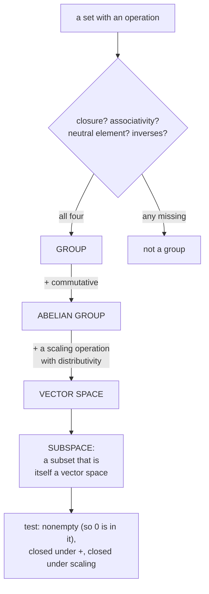

import DataCampExercise from "../../../../components/DataCampExercise.astro";
import Figure from "../../../../components/Figure.astro";
import Quiz from "../../../../components/Quiz.astro";

So far vectors have been "things you can add and scale". This section makes that precise, and the
payoff is larger than it first appears: because the definition demands **only** addition and scaling,
it admits objects that look nothing like arrows. Polynomials are vectors. Audio signals are vectors.
Functions are vectors. Every theorem proved from the axioms applies to all of them at once.

The book builds up in two stages — first a **group**, then a **vector space** — and the intermediate
stop is worth taking, because it isolates exactly which properties do which work.

## What you'll learn

- What a **group** is, in four axioms, and which familiar sets fail which axiom.
- The vector-space axioms, and what breaks if you drop each one.
- Why "multiplying two vectors" is **not** defined, and what is defined instead.
- What a **subspace** is, and the three-part test for one.
- Why the solution set of $\mathbf{A}\mathbf{x} = \mathbf{0}$ is always a subspace and the solution set of $\mathbf{A}\mathbf{x} = \mathbf{b}$ never is.

## Intuition: RGB colour space

A colour on a screen is three numbers — red, green, blue. Add two colours and you get a colour. Scale
a colour by $0.5$ and you get a dimmer colour. The set of colours is **closed** under these two
operations, and that closure is what makes it a vector space rather than just a set of triples.

Now try the same with the set of colours that are "at least half red", $r \ge 0.5$. Add two of them
and you get $r \ge 1.0$ — outside the set. Closure fails, so it is **not** a subspace, even though it
is a perfectly reasonable set of colours.

That is the whole idea of this page: **which sets survive their own operations.**



## The math

### Groups: four axioms

A **group** $G = (\mathcal{G}, \otimes)$ is a set $\mathcal{G}$ with an operation
$\otimes : \mathcal{G}\times\mathcal{G} \to \mathcal{G}$ satisfying:

| # | axiom | in symbols |
| --- | --- | --- |
| 1 | **Closure** | $\forall x, y \in \mathcal{G}:\; x \otimes y \in \mathcal{G}$ |
| 2 | **Associativity** | $\forall x, y, z:\; (x \otimes y) \otimes z = x \otimes (y \otimes z)$ |
| 3 | **Neutral element** | $\exists e \;\forall x:\; x \otimes e = x$ and $e \otimes x = x$ |
| 4 | **Inverse element** | $\forall x \;\exists y:\; x \otimes y = e$ and $y \otimes x = e$ |

If additionally $x \otimes y = y \otimes x$ for all $x, y$, the group is **Abelian** (commutative).

:::caution[The inverse is with respect to the operation]
The book flags this: $x^{-1}$ denotes the inverse **with respect to $\otimes$**, and "does not
necessarily mean $\tfrac{1}{x}$". For $(\mathbb{Z}, +)$ the inverse of $3$ is $-3$, not $\tfrac13$.
The notation is overloaded; the operation decides what it means.
:::

The book's own catalogue of near-misses is the fastest way to see what each axiom rules out:

| set and operation | group? | what fails |
| --- | --- | --- |
| $(\mathbb{Z}, +)$ | **yes** | — |
| $(\mathbb{N}_0, +)$ | no | **inverses** — there is a neutral element $0$, but no $-3$ |
| $(\mathbb{Z}, \cdot)$ | no | **inverses** — neutral $1$ exists, but $\tfrac13 \notin \mathbb{Z}$ |
| $(\mathbb{R}, \cdot)$ | no | **inverses** — $0$ has none |
| $(\mathbb{R}\setminus\{0\}, \cdot)$ | **yes**, Abelian | — |
| $(\mathbb{R}^n, +)$ componentwise | **yes**, Abelian | inverse is $(-x_1,\dots,-x_n)$, neutral is $(0,\dots,0)$ |
| $(\mathbb{R}^{m\times n}, +)$ | **yes**, Abelian | — |
| $(\mathbb{R}^{n\times n}, \cdot)$ | no | **inverses** — singular matrices have none |

That last row is the interesting one. Closure and associativity come free from the definition of matrix
multiplication, and $\mathbf{I}_n$ is a perfectly good neutral element. Only invertibility fails. Throw
out the singular matrices and what remains **is** a group — the **general linear group**
$GL(n, \mathbb{R})$ — and because matrix multiplication does not commute, it is *not* Abelian.

So the four axioms are not a checklist to memorise. They are four independent ways a set can fail to be
well behaved, and matrices fail exactly one of them.

### Vector spaces

A real **vector space** $V = (\mathcal{V}, +, \cdot)$ is a set $\mathcal{V}$ with two operations,

$$
+ : \mathcal{V}\times\mathcal{V} \to \mathcal{V}
\qquad\text{(inner, a kind of addition)}
$$
$$
\cdot : \mathbb{R}\times\mathcal{V} \to \mathcal{V}
\qquad\text{(outer, a kind of scaling)}
$$

satisfying:

1. $(\mathcal{V}, +)$ is an **Abelian group**.
2. **Distributivity**: $\lambda\cdot(\mathbf{x}+\mathbf{y}) = \lambda\cdot\mathbf{x} + \lambda\cdot\mathbf{y}$ and $(\lambda + \psi)\cdot\mathbf{x} = \lambda\cdot\mathbf{x} + \psi\cdot\mathbf{x}$.
3. **Associativity of the outer operation**: $\lambda\cdot(\psi\cdot\mathbf{x}) = (\lambda\psi)\cdot\mathbf{x}$.
4. **Neutral element for the outer operation**: $1\cdot\mathbf{x} = \mathbf{x}$.

The elements of $\mathcal{V}$ are **vectors**; the neutral element of $(\mathcal{V}, +)$ is the **zero
vector** $\mathbf{0}$; the $\lambda \in \mathbb{R}$ are **scalars**.

Notice the two operations have **different signatures**. The inner one takes two vectors and returns a
vector. The outer one takes a *scalar and a vector*. They are not two flavours of the same thing, and
the axioms above are precisely the compatibility conditions between them.

**Why axiom 4 is not redundant.** It looks like it should follow from the others, and it does not. Take
$\mathbb{R}^2$ with the perverse scaling $\lambda \cdot \mathbf{x} := \mathbf{0}$ for every $\lambda$.
Distributivity holds ($\mathbf{0} = \mathbf{0} + \mathbf{0}$), outer associativity holds, and
$(\mathcal{V},+)$ is still an Abelian group. Only axiom 4 fails — and it must, or scaling could
collapse everything and the structure would be useless. Each axiom is load-bearing.

:::danger[There is no "vector multiplication"]
The book states it plainly: for $\mathbf{a}, \mathbf{b} \in \mathbb{R}^n$, the product
$\mathbf{a}\mathbf{b}$ is **not defined**. The element-wise product "is common to many programming
languages" but is not part of the vector-space structure.

What *is* defined, treating vectors as $n \times 1$ matrices:

$$
\mathbf{a}\mathbf{b}^\top \in \mathbb{R}^{n\times n} \;\text{(outer product)},
\qquad
\mathbf{a}^\top\mathbf{b} \in \mathbb{R} \;\text{(inner, scalar, or dot product)}
$$

One returns a matrix, one returns a number, and neither returns a vector. This is why "multiply two
vectors" is a question with no answer until you say which product you mean — and why NumPy's `*`
silently gives you an operation the mathematics does not have.
:::

Three vector spaces the book names: $\mathbb{R}^n$ with componentwise operations,
$\mathbb{R}^{m\times n}$ with entry-wise operations, and $\mathbb{C}$ with the standard complex
addition.

:::note[Three notations for the same numbers: R^n, R^(n x 1) and R^(1 x n)]
These "are only different in the way we write vectors". The book does not distinguish $\mathbb{R}^n$
from $\mathbb{R}^{n\times1}$ — both are column vectors — but *does* distinguish $\mathbb{R}^{n\times1}$
from $\mathbb{R}^{1\times n}$, the row vectors, to avoid confusion with matrix multiplication. By
default $\mathbf{x}$ is a column and $\mathbf{x}^\top$ is a row.

In NumPy this is the `(n,)` versus `(n,1)` versus `(1,n)` distinction, and the reason `.T` on a 1-D
array does nothing.
:::

### Subspaces

$U = (\mathcal{U}, +, \cdot)$ is a **vector subspace** of $V$ when $\mathcal{U} \subseteq \mathcal{V}$,
$\mathcal{U} \neq \emptyset$, and $U$ is itself a vector space under the operations of $V$ restricted
to $\mathcal{U}$. Written $U \subseteq V$.

The good news is that almost everything is inherited. Associativity, distributivity, the neutral
element — all hold for every element of $\mathcal{V}$, hence for every element of any subset. So to
check a subspace you need only:

1. $\mathcal{U} \neq \emptyset$, and in particular $\mathbf{0} \in \mathcal{U}$;
2. closure under scaling: $\forall \lambda \in \mathbb{R}, \forall \mathbf{x} \in \mathcal{U}: \lambda\mathbf{x} \in \mathcal{U}$;
3. closure under addition: $\forall \mathbf{x}, \mathbf{y} \in \mathcal{U}: \mathbf{x} + \mathbf{y} \in \mathcal{U}$.

Three tests, and the book's **Figure 2.6** shows a subset of $\mathbb{R}^2$ failing each of them: two
sets where closure is violated, one that does not contain $\mathbf{0}$, and only one genuine subspace.

Four facts worth having:

- The **trivial** subspaces of any $V$ are $V$ itself and $\{\mathbf{0}\}$.
- The solution set of a **homogeneous** system $\mathbf{A}\mathbf{x} = \mathbf{0}$ **is** a subspace of $\mathbb{R}^n$.
- The solution set of an **inhomogeneous** system $\mathbf{A}\mathbf{x} = \mathbf{b}$ with $\mathbf{b} \neq \mathbf{0}$ is **not**.
- The **intersection** of arbitrarily many subspaces is a subspace.

The homogeneous/inhomogeneous split is the one to keep. Homogeneous solutions are closed: if
$\mathbf{A}\mathbf{x} = \mathbf{0}$ and $\mathbf{A}\mathbf{y} = \mathbf{0}$ then
$\mathbf{A}(\mathbf{x}+\mathbf{y}) = \mathbf{0}$. Inhomogeneous ones are not: adding two solutions
gives $\mathbf{A}(\mathbf{x}+\mathbf{y}) = 2\mathbf{b} \neq \mathbf{b}$, and $\mathbf{0}$ is not a
solution at all. The inhomogeneous set is a subspace **shifted off the origin** — §2.3's particular-plus-general
shape, and §2.8's affine subspace.

And the converse, which the book states as a closing remark: **every** subspace of $\mathbb{R}^n$ is
the solution space of *some* homogeneous system. Subspaces and homogeneous systems are two
descriptions of one thing.

## Worked example by hand

Test three subsets of $\mathbb{R}^2$ against all three conditions.

**$\mathcal{U}_1 = \{(x_1, x_2) : x_2 = 2x_1\}$** — the line $x_2 = 2x_1$.

| test | check | verdict |
| --- | --- | --- |
| contains $\mathbf{0}$ | $0 = 2\cdot0$ ✓ | pass |
| closed under scaling | $\lambda(x_1, 2x_1) = (\lambda x_1, 2\lambda x_1)$, still of the form | pass |
| closed under addition | $(x_1, 2x_1)+(y_1, 2y_1) = (x_1+y_1, 2(x_1+y_1))$ | pass |

**A subspace.** Dimension 1 — a line through the origin.

**$\mathcal{U}_2 = \{(x_1, x_2) : x_2 = 2x_1 + 1\}$** — the same line, shifted up.

| test | check | verdict |
| --- | --- | --- |
| contains $\mathbf{0}$ | $0 \neq 2\cdot0 + 1 = 1$ | **fail** |

**Not a subspace**, and one failed test is enough. It is an *affine* subspace (§2.8).

**$\mathcal{U}_3 = \{(x_1, x_2) : x_1 x_2 \ge 0\}$** — the first and third quadrants.

| test | check | verdict |
| --- | --- | --- |
| contains $\mathbf{0}$ | $0\cdot0 = 0 \ge 0$ ✓ | pass |
| closed under scaling | $(\lambda x_1)(\lambda x_2) = \lambda^2 x_1x_2 \ge 0$ ✓ | pass |
| closed under addition | $(1,1) + (-2,-1) = (-1, 0)$, and $(-1)(0) = 0 \ge 0$ ✓… but $(2,1) + (-1,-3) = (1,-2)$ with $1\cdot(-2) = -2 < 0$ | **fail** |

**Not a subspace.** Note it passed two of three, which is why all three must be checked — and this is
the shape of the book's Figure 2.6 counterexamples.

Now the homogeneous versus inhomogeneous claim, concretely. For
$\mathbf{A} = \begin{bmatrix}1 & 1\end{bmatrix}$:

- $\mathbf{A}\mathbf{x} = 0$ has solutions $\{(t, -t)\}$. Contains $(0,0)$ ✓; sum of $(1,-1)$ and $(2,-2)$ is $(3,-3)$ ✓. **Subspace.**
- $\mathbf{A}\mathbf{x} = 3$ has solutions $\{(t, 3-t)\}$. Contains $(0,0)$? $0 + 0 = 0 \neq 3$ ✗. Sum of $(1,2)$ and $(0,3)$ is $(1,5)$, and $1+5 = 6 \neq 3$ ✗. **Not a subspace** — and it fails on both counts.

## See it move

Two lines, both perfectly good sets of vectors. On the left the line passes through the origin, so the
sum of two of its points stays on it. On the right the line is shifted up, and the sum leaves.

```p5 title="Which line is a subspace?" desc="Two vectors u, v are chosen on a line. Left case: the line passes through the origin, so u+v stays on it — a subspace. Right case: the line is shifted up, so u+v leaves it — not a subspace." height="360"
let ph = 0;
const U = 44;
function setup(){ createCanvas(600, 360); textFont("monospace"); }
function draw(){
  background(13,17,23);
  ph += 0.02;
  // two panels
  panel(150, "through origin", 0.0, true);
  panel(450, "shifted +1.6", 1.6, false);
}
function panel(cx, label, intercept, isSub){
  const cy = 195;
  const sx = x => cx + x*U;
  const sy = y => cy - y*U;
  // dir of line
  const dx = 1.4, dy = 0.8;
  // axes
  stroke(40,52,66); strokeWeight(1);
  for (let g=-3; g<=3; g++){ line(sx(-3),sy(g),sx(3),sy(g)); line(sx(g),sy(-3),sx(g),sy(3)); }
  stroke(70,82,96); strokeWeight(1.2);
  line(sx(-3),sy(0),sx(3),sy(0)); line(sx(0),sy(-3),sx(0),sy(3));

  // the set (a line): point = t*(dx,dy) + (0,intercept)
  const col = isSub ? color(120,200,140) : color(232,110,110);
  stroke(col); strokeWeight(2.5); noFill();
  const P = (t)=>[t*dx, t*dy + intercept];
  let a=P(-4), b=P(4);
  line(sx(a[0]),sy(a[1]),sx(b[0]),sy(b[1]));

  // u and v (points on the set)
  const tu = 1.1*Math.sin(ph), tv = 0.9*Math.sin(ph*1.3+1);
  const u = P(tu), v = P(tv);
  const sum = [u[0]+v[0], u[1]+v[1]];

  // arrows from origin
  drawArrow(sx(0),sy(0),sx(u[0]),sy(u[1]), color(255,211,67));
  drawArrow(sx(0),sy(0),sx(v[0]),sy(v[1]), color(197,153,255));
  drawArrow(sx(0),sy(0),sx(sum[0]),sy(sum[1]), color(255,255,255));

  // does the sum lie on the set?  set: y = (dy/dx)x + intercept
  const onLine = Math.abs(sum[1] - ((dy/dx)*sum[0] + intercept)) < 0.06;
  noStroke();
  fill(onLine ? color(120,200,140) : color(232,110,110));
  ellipse(sx(sum[0]), sy(sum[1]), 12, 12);

  // origin dot
  fill(200); ellipse(sx(0),sy(0),6,6);

  // labels
  textAlign(CENTER,TOP); textSize(13);
  fill(col); text(label, cx, 18);
  fill(onLine ? color(120,200,140) : color(232,110,110)); textSize(12);
  text(isSub ? "u + v stays on it -> subspace"
             : "u + v leaves it -> NOT a subspace", cx, 320);
  fill(255,211,67); textAlign(LEFT,TOP); textSize(11);
  text("u", sx(u[0])+6, sy(u[1])-6);
  fill(197,153,255); text("v", sx(v[0])+6, sy(v[1])-6);
  fill(230); text("u+v", sx(sum[0])+6, sy(sum[1])-6);
}
function drawArrow(x1,y1,x2,y2,c){
  stroke(c); strokeWeight(2); line(x1,y1,x2,y2);
  push(); translate(x2,y2); const a=Math.atan2(y2-y1,x2-x1); rotate(a);
  fill(c); noStroke(); triangle(0,0,-7,-3,-7,3); pop();
}
```

The white dot is the sum. On the left it never leaves the green line, however $u$ and $v$ move. On the
right it is almost never on the red line — and "almost never" is enough: **one** violation disqualifies
the set. Closure is a universally quantified statement, so a single counterexample settles it.

## From scratch

```python title="vector_spaces.py" showLineNumbers{1}
import numpy as np
import itertools

rng = np.random.default_rng(0)

def is_subspace(sample, contains, trials=2000):
    """Empirically test the three subspace conditions on a candidate set.

    A pass here is evidence, not proof — closure is a statement about ALL
    elements. But a failure IS proof, because one counterexample is enough.
    """
    if not contains(np.zeros_like(sample[0])):
        return False, "does not contain the zero vector"
    for _ in range(trials):
        x, y = sample[rng.integers(len(sample))], sample[rng.integers(len(sample))]
        lam = float(rng.normal() * 3)
        if not contains(lam * x):
            return False, f"not closed under scaling: {lam:.3f} * {x} = {lam * x}"
        if not contains(x + y):
            return False, f"not closed under addition: {x} + {y} = {x + y}"
    return True, "passed every trial"

# Sample points of each candidate set, and a membership test for each.
t = rng.normal(size=400) * 3

sets = {
    "line x2 = 2*x1        ": (np.c_[t, 2 * t],
                               lambda v: np.isclose(v[1], 2 * v[0])),
    "line x2 = 2*x1 + 1    ": (np.c_[t, 2 * t + 1],
                               lambda v: np.isclose(v[1], 2 * v[0] + 1)),
    "quadrants x1*x2 >= 0  ": (np.array([[a, b] for a, b in
                                         zip(abs(t), abs(t) * rng.choice([1, 1]))]),
                               lambda v: v[0] * v[1] >= -1e-12),
    "solutions of x1+x2 = 0": (np.c_[t, -t],
                               lambda v: np.isclose(v[0] + v[1], 0)),
    "solutions of x1+x2 = 3": (np.c_[t, 3 - t],
                               lambda v: np.isclose(v[0] + v[1], 3)),
}

for name, (sample, member) in sets.items():
    ok, why = is_subspace(sample, member)
    print(f"{name} subspace: {str(ok):5s}  ({why})")

# ---- the general linear group: matrices fail exactly one group axiom ----
A = np.array([[1.0, 2.0], [3.0, 4.0]])       # invertible
B = np.array([[1.0, 2.0], [2.0, 4.0]])       # singular
print("\nclosure  : A@B is still 2x2      ->", (A @ B).shape == (2, 2))
print("assoc    : (AB)C == A(BC)         ->",
      np.allclose((A @ B) @ A, A @ (B @ A)))
print("neutral  : A @ I == A             ->", np.allclose(A @ np.eye(2), A))
print("inverse  : det(A) =", np.linalg.det(A), "-> invertible")
print("inverse  : det(B) =", np.linalg.det(B), "-> NO inverse, so not a group")

# ---- there is no vector multiplication --------------------------------
a = np.array([1.0, 2.0, 3.0])
b = np.array([4.0, 5.0, 6.0])
print("\nouter product a b^T shape:", np.outer(a, b).shape, "-> a MATRIX")
print("inner product a^T b      :", a @ b, "-> a SCALAR")
print("NumPy's a * b            :", a * b, "-> an operation the axioms do not define")

# ---- axiom 4 is not redundant -----------------------------------------
# Perverse scaling: lam . x := 0 for all lam. Check which axioms survive.
def bad_scale(lam, x):
    return np.zeros_like(x)

x, y = np.array([1.0, 2.0]), np.array([3.0, -1.0])
lam, psi = 2.0, 5.0
print("\nwith the perverse scaling lam.x := 0 :")
print("  distributive over vectors :", np.allclose(bad_scale(lam, x + y),
                                                   bad_scale(lam, x) + bad_scale(lam, y)))
print("  distributive over scalars :", np.allclose(bad_scale(lam + psi, x),
                                                   bad_scale(lam, x) + bad_scale(psi, x)))
print("  outer associativity       :", np.allclose(bad_scale(lam, bad_scale(psi, x)),
                                                   bad_scale(lam * psi, x)))
print("  1 . x == x  (axiom 4)     :", np.allclose(bad_scale(1.0, x), x), "  <- the only failure")

# ---- intersection of subspaces is a subspace --------------------------
# Two planes through the origin in R^3 meet in a line through the origin.
P1 = np.array([[1.0, 1.0, 1.0]])            # x1+x2+x3 = 0
P2 = np.array([[1.0, -1.0, 0.0]])           # x1-x2   = 0
both = np.vstack([P1, P2])
print("\ndim of plane 1  :", 3 - np.linalg.matrix_rank(P1))
print("dim of plane 2  :", 3 - np.linalg.matrix_rank(P2))
print("dim of the meet :", 3 - np.linalg.matrix_rank(both), "-> a line, still through 0")
```

```
line x2 = 2*x1         subspace: True   (passed every trial)
line x2 = 2*x1 + 1     subspace: False  (does not contain the zero vector)
quadrants x1*x2 >= 0   subspace: True   (passed every trial)
solutions of x1+x2 = 0 subspace: True   (passed every trial)
solutions of x1+x2 = 3 subspace: False  (does not contain the zero vector)

closure  : A@B is still 2x2      -> True
assoc    : (AB)C == A(BC)         -> True
neutral  : A @ I == A             -> True
inverse  : det(A) = -2.0000000000000004 -> invertible
inverse  : det(B) = 0.0 -> NO inverse, so not a group

outer product a b^T shape: (3, 3) -> a MATRIX
inner product a^T b      : 32.0 -> a SCALAR
NumPy's a * b            : [ 4. 10. 18.] -> an operation the axioms do not define

with the perverse scaling lam.x := 0 :
  distributive over vectors : True
  distributive over scalars : True
  outer associativity       : True
  1 . x == x  (axiom 4)     : False   <- the only failure

dim of plane 1  : 2
dim of plane 2  : 2
dim of the meet : 1 -> a line, still through 0
```

:::danger[The quadrant test passed, and it is wrong]
Look at the third line. `x1*x2 >= 0` reported `True` — and the hand calculation above showed it is
**not** a subspace, because $(2,1) + (-1,-3) = (1,-2)$ leaves it.

The bug is in the *sample*, not the test: the points fed in were all in the first quadrant, so no
random pair ever crossed into the third, and addition never failed. This is exactly why a passing
empirical test is evidence and a failing one is proof. Closure is universally quantified; you cannot
sample your way to a proof of it, and a sample that does not cover the awkward region will happily
tell you what you want to hear.
:::

## On real data

<Figure
  src="/images/mml/vector-spaces/subspace-or-not"
  alt="Four panels showing subsets of the plane. A shaded square around the origin fails closure under scaling. A line through the origin passes all tests. A pair of shaded cones fails closure under addition. A single point away from the origin fails to contain zero."
  title="The book's Figure 2.6, redrawn with the failing operation shown"
  caption="Only the line through the origin survives all three tests. Each other panel is annotated with the specific pair of vectors whose sum or scaling escapes the set."
/>

## Reading the plot

Each failing panel carries the actual counterexample, and that is the point. "Not a subspace" is never
a judgement call — it is a specific pair of vectors, or a specific scalar, that escapes. When you
suspect a set is not a subspace, the productive move is to hunt for that witness rather than to reason
about it abstractly.

The square panel is the one worth staring at. It contains $\mathbf{0}$ and it is closed under
*addition of small enough vectors*, which is why it feels like it should qualify. It fails on
**scaling**: multiply any nonzero point by a large enough $\lambda$ and you leave the square. A
subspace must be closed under **every** real scalar, which forces it to be unbounded in every
direction it contains at all. So a bounded set can never be a subspace unless it is just $\{\mathbf{0}\}$.

:::tip[From the book]
*Mathematics for Machine Learning* §2.4 builds vector spaces in two stages. §2.4.1 gives
**Definition 2.7** (**group**) with the four axioms — closure, associativity, neutral element, inverse
element — plus the remark that the inverse is defined with respect to $\otimes$ and "does not
necessarily mean $\tfrac{1}{x}$", and the **Abelian** condition. **Example 2.10** works through
$(\mathbb{Z},+)$, $(\mathbb{N}_0,+)$, $(\mathbb{Z},\cdot)$, $(\mathbb{R},\cdot)$,
$(\mathbb{R}\setminus\{0\},\cdot)$, $(\mathbb{R}^n,+)$ (**Equation 2.61**), $(\mathbb{R}^{m\times n},+)$
and $(\mathbb{R}^{n\times n},\cdot)$, showing that the last fails only on inverses; **Definition 2.8**
names the **general linear group** $GL(n,\mathbb{R})$ and notes it is not Abelian. §2.4.2 gives
**Definition 2.9** (**vector space**) with the two operations (**Equations 2.62–2.63**) and the four
conditions, and the remark that "vector multiplication" $\mathbf{a}\mathbf{b}$ is **not defined** —
only the **outer product** $\mathbf{a}\mathbf{b}^\top \in \mathbb{R}^{n\times n}$ and the
**inner/scalar/dot product** $\mathbf{a}^\top\mathbf{b} \in \mathbb{R}$ are. **Example 2.11** lists
$\mathbb{R}^n$, $\mathbb{R}^{m\times n}$ and $\mathbb{C}$, and a following remark explains that
$\mathbb{R}^n$, $\mathbb{R}^{n\times1}$ and $\mathbb{R}^{1\times n}$ "are only different in the way we
write vectors" (**Equation 2.64**). §2.4.3 gives **Definition 2.10** (**vector subspace**, or linear
subspace) and the three-part test — nonempty with $\mathbf{0} \in \mathcal{U}$, closed under the outer
operation, closed under the inner operation. **Example 2.12** and **Figure 2.6** show that only one of
four subsets of $\mathbb{R}^2$ is a subspace, and state that the solution set of a **homogeneous**
system is a subspace of $\mathbb{R}^n$ while the solution set of an **inhomogeneous** system with
$\mathbf{b} \neq \mathbf{0}$ is not, and that the **intersection of arbitrarily many subspaces is a
subspace**. A closing remark states the converse: every subspace of $\mathbb{R}^n$ is the solution
space of some homogeneous system $\mathbf{A}\mathbf{x} = \mathbf{0}$.
:::

## Pitfalls

:::danger[A subspace must contain the zero vector]
This is the cheapest test, so do it first. Any line, plane or set that misses the origin is disqualified
immediately, regardless of how well behaved it is otherwise. It is still an *affine* subspace (§2.8) —
useful, just not a subspace.
:::

:::caution[All three conditions, every time]
The quadrant example passes two of three. Checking only "contains zero and closed under scaling" would
have accepted it.
:::

:::caution[A bounded set is never a subspace (unless it is just the origin)]
Closure under scaling means closure under $\lambda = 10^{100}$. So a subspace containing any nonzero
vector contains an unbounded line through it. Unit balls, boxes and simplices are all disqualified —
which matters because those are exactly the sets §7.3 calls *convex*, a genuinely different property.
:::

:::caution[The inverse notation is operation-dependent]
$x^{-1}$ means "the inverse under $\otimes$". Under addition that is $-x$; under multiplication it is
$1/x$; for matrices it is $\mathbf{A}^{-1}$. The symbol does not tell you which.
:::

:::danger[Empirical closure tests cannot prove a subspace]
Closure is universally quantified, so sampling gives evidence at best — and a sample that misses the
awkward region gives *misleading* evidence, as the quadrant case above demonstrates. A failing test,
by contrast, is a proof, because it hands you the counterexample.
:::

## Compare

| structure | operations | what it adds |
| --- | --- | --- |
| **group** | one, $\otimes$ | closure, associativity, neutral element, inverses |
| **Abelian group** | one | plus commutativity |
| **vector space** | two, $+$ and $\cdot$ | scaling by scalars, compatible with addition |
| **subspace** | inherited | a subset closed under both, containing $\mathbf{0}$ |
| **affine subspace** (§2.8) | inherited | a subspace **translated** — no longer contains $\mathbf{0}$ |
| **convex set** (§7.3) | inherited | closed under averages only, so it may be bounded |

The last two rows are the ones people conflate. An affine subspace is a subspace moved; a convex set is
closed under *weighted averages* rather than arbitrary combinations, which is why a disc is convex and
not a subspace.

<Quiz
  title="Check yourself"
  questions={[
    {
      q: "The set of n-by-n matrices under multiplication satisfies three of the four group axioms. Which one fails?",
      options: [
        "Closure — a product of two n-by-n matrices need not be n-by-n",
        "Associativity",
        "Existence of a neutral element",
        "Existence of inverses — singular matrices have none",
      ],
      answer: 3,
      explain:
        "Closure and associativity follow from the definition of the product, and the identity is a perfectly good neutral element. Discarding the singular matrices leaves the general linear group, which is a group but not Abelian.",
    },
    {
      q: "Which is the correct statement about multiplying two vectors in R-n?",
      options: [
        "It is defined element-wise, giving another vector",
        "It is not defined; only the outer product giving a matrix and the inner product giving a scalar are",
        "It is defined only for vectors of the same length",
        "It is the dot product, which returns a vector",
      ],
      answer: 1,
      explain:
        "The book says so explicitly. Element-wise multiplication is common in programming languages but is not part of the vector-space structure, and neither defined product returns a vector.",
    },
    {
      q: "Why can a bounded set never be a subspace unless it is just the origin?",
      options: [
        "Because it might not contain the zero vector",
        "Because closure under scaling requires closure under arbitrarily large scalars, forcing an unbounded line through any nonzero member",
        "Because addition of two bounded vectors can be unbounded",
        "Bounded sets can be subspaces — a disc is one",
      ],
      answer: 1,
      explain:
        "Scaling must hold for every real lambda, including enormous ones. Any nonzero vector in the set therefore drags an entire infinite line in with it. This is what separates subspaces from the convex sets of section 7.3.",
    },
    {
      q: "The solution set of Ax = b with b nonzero is not a subspace. What is it?",
      options: [
        "Nothing structured — just a set",
        "A subspace translated off the origin, which section 2.8 calls an affine subspace",
        "Always empty",
        "A convex cone",
      ],
      answer: 1,
      explain:
        "It is a particular solution plus the null space, which is section 2.3's particular-plus-general shape. Translating a subspace destroys the zero vector and closure, but keeps the flat shape.",
    },
  ]}
/>

## 🧪 Try It Yourself

### Exercise 1 – The cheapest subspace test

<DataCampExercise
  lang="python"
  hint={`A subspace must contain the zero vector. Substitute the origin into the defining equation.`}
  code={`import numpy as np

# Set A: x2 = 2*x1        Set B: x2 = 2*x1 + 1
origin = np.array([0.0, 0.0])

in_A = np.isclose(origin[1], 2 * origin[0])
in_B = np.isclose(origin[1], 2 * origin[0] + ___)      # replace ___ with 1

print("origin in A?", in_A, " origin in B?", in_B)
print("B can be a subspace?", in_B)

# -- Expected output ------------------------------
# origin in A? True  origin in B? False
# B can be a subspace? False
# -------------------------------------------------`}
  solution={`import numpy as np
origin = np.array([0.0, 0.0])
in_A = np.isclose(origin[1], 2 * origin[0])
in_B = np.isclose(origin[1], 2 * origin[0] + 1)
print("origin in A?", in_A, " origin in B?", in_B)
print("B can be a subspace?", in_B)`}
  sct={`test_output_contains("B can be a subspace? False")
success_msg("One failed test is enough. Always check the origin first — it costs nothing.")`}
  height={190}
/>

### Exercise 2 – Find the counterexample

<DataCampExercise
  lang="python"
  hint={`For the set x1*x2 >= 0, pick one point in the first quadrant and one in the third, and add them.`}
  code={`import numpy as np

def in_set(v):
    return v[0] * v[1] >= 0

u = np.array([2.0, 1.0])       # first quadrant
v = np.array([-1.0, -3.0])     # third quadrant

print("u in set:", in_set(u), " v in set:", in_set(v))
s = u + ___                    # replace ___ with v
print("u+v =", s, " in set:", in_set(s))
print("closed under addition?", in_set(s))

# -- Expected output ------------------------------
# u in set: True  v in set: True
# u+v = [ 1. -2.]  in set: False
# closed under addition? False
# -------------------------------------------------`}
  solution={`import numpy as np

def in_set(v):
    return v[0] * v[1] >= 0

u = np.array([2.0, 1.0])
v = np.array([-1.0, -3.0])
print("u in set:", in_set(u), " v in set:", in_set(v))
s = u + v
print("u+v =", s, " in set:", in_set(s))
print("closed under addition?", in_set(s))`}
  sct={`test_output_contains("closed under addition? False")
success_msg("A single witness settles it. This is the pair a random sample from one quadrant would never find.")`}
  height={210}
/>

### Exercise 3 – Homogeneous versus inhomogeneous

<DataCampExercise
  lang="python"
  hint={`Add two solutions of each system and check whether the sum is still a solution.`}
  code={`import numpy as np

A = np.array([[1.0, 1.0]])

# homogeneous: x1 + x2 = 0
h1, h2 = np.array([1.0, -1.0]), np.array([2.0, -2.0])
# inhomogeneous: x1 + x2 = 3
i1, i2 = np.array([1.0,  2.0]), np.array([0.0,  3.0])

print("homogeneous sum still a solution  :", np.allclose(A @ (h1 + h2), 0.0))
print("inhomogeneous sum still a solution:", np.allclose(A @ (i1 + i2), ___))   # replace ___ with 3.0
print("what it actually equals:", A @ (i1 + i2))

# -- Expected output ------------------------------
# homogeneous sum still a solution  : True
# inhomogeneous sum still a solution: False
# what it actually equals: [6.]
# -------------------------------------------------`}
  solution={`import numpy as np
A = np.array([[1.0, 1.0]])
h1, h2 = np.array([1.0, -1.0]), np.array([2.0, -2.0])
i1, i2 = np.array([1.0,  2.0]), np.array([0.0,  3.0])
print("homogeneous sum still a solution  :", np.allclose(A @ (h1 + h2), 0.0))
print("inhomogeneous sum still a solution:", np.allclose(A @ (i1 + i2), 3.0))
print("what it actually equals:", A @ (i1 + i2))`}
  sct={`test_output_contains("what it actually equals: [6.]")
success_msg("Two threes make a six. Homogeneous solution sets are subspaces; inhomogeneous ones are subspaces shifted off the origin.")`}
  height={230}
/>

### Exercise 4 – A bounded set fails on scaling

<DataCampExercise
  hint={`Scale a point of the unit square by a large factor and check whether it is still inside.`}
  lang="python"
  code={`import numpy as np

def in_square(v):
    return np.all(np.abs(v) <= 1.0)

x = np.array([0.5, 0.5])
print("x in the square:", in_square(x))

for lam in [0.5, 1.0, 3.0, 1e6]:
    print(f"  lam={lam:7g}  lam*x in the square: {in_square(lam * ___)}")   # replace ___ with x

# -- Expected output ------------------------------
# x in the square: True
#   lam=    0.5  lam*x in the square: True
#   lam=      1  lam*x in the square: True
#   lam=      3  lam*x in the square: False
#   lam=  1e+06  lam*x in the square: False
# -------------------------------------------------`}
  solution={`import numpy as np

def in_square(v):
    return np.all(np.abs(v) <= 1.0)

x = np.array([0.5, 0.5])
print("x in the square:", in_square(x))
for lam in [0.5, 1.0, 3.0, 1e6]:
    print(f"  lam={lam:7g}  lam*x in the square: {in_square(lam * x)}")`}
  sct={`test_output_contains("lam=  1e+06  lam*x in the square: False")
success_msg("Closure under scaling means EVERY real scalar. That is why no bounded set except the origin qualifies.")`}
  height={230}
/>

### Exercise 5 – The intersection of two subspaces

<DataCampExercise
  lang="python"
  hint={`Stack the two constraint matrices vertically; the dimension of the intersection is 3 minus the rank of the stack.`}
  code={`import numpy as np

P1 = np.array([[1.0, 1.0, 1.0]])       # the plane x1 + x2 + x3 = 0
P2 = np.array([[1.0, -1.0, 0.0]])      # the plane x1 - x2 = 0

both = np.vstack([P1, ___])            # replace ___ with P2

print("dim of plane 1 :", 3 - np.linalg.matrix_rank(P1))
print("dim of plane 2 :", 3 - np.linalg.matrix_rank(P2))
print("dim of the meet:", 3 - np.linalg.matrix_rank(both))
print("still contains the origin:", np.allclose(both @ np.zeros(3), 0))

# -- Expected output ------------------------------
# dim of plane 1 : 2
# dim of plane 2 : 2
# dim of the meet: 1
# still contains the origin: True
# -------------------------------------------------`}
  solution={`import numpy as np
P1 = np.array([[1.0, 1.0, 1.0]])
P2 = np.array([[1.0, -1.0, 0.0]])
both = np.vstack([P1, P2])
print("dim of plane 1 :", 3 - np.linalg.matrix_rank(P1))
print("dim of plane 2 :", 3 - np.linalg.matrix_rank(P2))
print("dim of the meet:", 3 - np.linalg.matrix_rank(both))
print("still contains the origin:", np.allclose(both @ np.zeros(3), 0))`}
  sct={`test_output_contains("dim of the meet: 1")
success_msg("Two planes through the origin meet in a line through the origin — and the intersection of subspaces is always a subspace.")`}
  height={235}
/>

## Recall card

- **A group has four axioms** — closure, associativity, a neutral element, and inverses — and adding commutativity makes it Abelian.
- **The inverse is with respect to the operation**, so it means $-x$ under addition and $1/x$ under multiplication.
- **Square matrices under multiplication fail exactly one group axiom**: inverses. Discarding the singular ones gives the general linear group, which is not Abelian.
- **A vector space has two operations with different signatures** — an inner one taking two vectors, an outer one taking a scalar and a vector — plus the four compatibility conditions.
- **Every axiom is load-bearing**: the perverse scaling that sends everything to zero satisfies distributivity and outer associativity, and fails only the rule that 1 times x is x.
- **There is no vector multiplication.** Only the outer product, returning a matrix, and the inner product, returning a scalar.
- **A subspace needs three things** — nonempty and containing the zero vector, closed under scaling, closed under addition — and checking only two accepts sets that fail.
- **A bounded set is never a subspace unless it is just the origin**, because closure under scaling admits arbitrarily large scalars.
- **Homogeneous solution sets are subspaces; inhomogeneous ones are not** — they are subspaces translated off the origin, which is the affine subspace of section 2.8.
- **The intersection of arbitrarily many subspaces is a subspace**, and conversely every subspace of R-n is the solution space of some homogeneous system.
- **An empirical closure test can only disprove**, because closure is universally quantified and a sample that misses the awkward region reports a false pass.

**Next:** when is a vector redundant? — **[Linear Independence](../linear-independence/)**.
