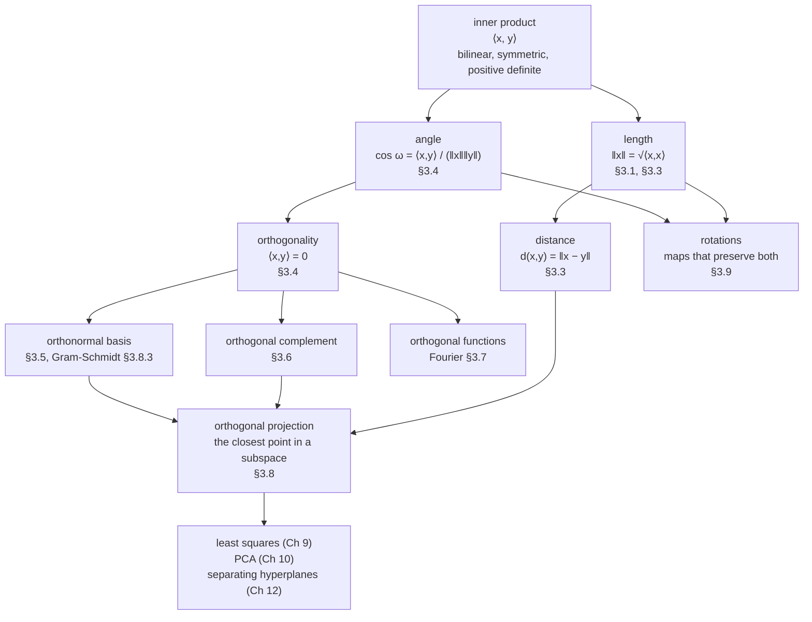

Chapter 2 built vectors and the operations that combine them, and then stopped. It never asked how
**long** a vector is, how **far apart** two of them are, or what **angle** they meet at — because none
of those questions can be answered by addition and scalar multiplication alone. A vector space is a
set with two operations; it has no ruler and no protractor.

Chapter 3 supplies both, from a single object.

## The one idea

Add one function to a vector space — an **inner product** $\langle \cdot, \cdot \rangle$ that takes two
vectors and returns a number, subject to three conditions — and every geometric quantity you have
ever used follows without further input:

Read the arrows literally. Length is *defined* from the inner product, distance from length, angle
from the inner product and two lengths. Nothing in this chapter is an extra axiom; it is all
bookkeeping on one definition. That is why changing the inner product changes everything downstream
at once — a fact §3.4 makes uncomfortable and §3.8 makes useful.

## What you'll learn

- Why there is **more than one notion of length**, and why the choice is the difference between Lasso and Ridge.
- What an **inner product** actually requires, and how to test a candidate — including a matrix that fails the test by exactly one entry.
- How **length, distance and angle** are all consequences of one definition, plus the two inequalities that keep them honest.
- What **orthogonality** buys: cheap coordinates, unique decompositions, stable algorithms.
- The **projection** recipe of §3.8, which is the single most reused computation in the rest of the book.
- Why **rotations** are exactly the orthogonal matrices of determinant $+1$, and why they stop commuting in three dimensions.

## The pages

| # | page | the big idea |
| --- | --- | --- |
| 3.1 | [Norms](../norms/) | Three properties define a ruler. The shape of the unit ball is what a regulariser optimises against. |
| 3.2 | [Inner Products](../inner-products/) | Bilinear, symmetric, positive definite. Every inner product on $\mathbb{R}^n$ is a symmetric positive definite matrix in disguise. |
| 3.3 | [Lengths and Distances](../lengths-and-distances/) | Length is $\sqrt{\langle x,x\rangle}$; distance is the length of a difference. Cauchy-Schwarz is what makes the cosine a cosine. |
| 3.4 | [Angles and Orthogonality](../angles-and-orthogonality/) | Cosine similarity, and the fact that two vectors can be perpendicular under one inner product and not another. |
| 3.5 | [Orthonormal Basis](../orthonormal-basis/) | The basis where coordinates are inner products and $\mathbf{B}^\top\mathbf{B} = \mathbf{I}$. |
| 3.6 | [Orthogonal Complement](../orthogonal-complement/) | Every vector splits, uniquely and Pythagoreanly, into a part inside a subspace and a part perpendicular to it. |
| 3.7 | [Inner Product of Functions](../inner-product-of-functions/) | Replace the sum by an integral and functions become vectors. Fourier analysis is the ONB of that space. |
| 3.8 | [Orthogonal Projections](../orthogonal-projections/) | The three-step recipe, the normal equation, the pseudo-inverse, and Gram-Schmidt as its constructive use. |
| 3.9 | [Rotations](../rotations/) | Length- and angle-preserving maps: $\mathbb{R}^2$, $\mathbb{R}^3$, Givens rotations, and the failure of commutativity. |
| — | [Chapter 3 Exercises and Solutions](../chapter-3-exercises-and-solutions/) | All ten of the book's exercises, worked by hand and checked in NumPy. |
| — | [Chapter 3 Formula Sheet](../chapter-3-formula-sheet/) | Every definition and result on one page, with a line on when each is the right tool. |

Nine concept pages, about eight hours with the exercises.

## Prerequisites

- [Chapter 2](../../chapter-02---linear-algebra/linear-algebra-overview/) in full. This chapter never re-derives a subspace, a basis or a rank; §3.8 in particular assumes you can read $\mathbf{B}(\mathbf{B}^\top\mathbf{B})^{-1}\mathbf{B}^\top$ without flinching.
- [Chapter 0](../../chapter-00---getting-ready/getting-ready-overview/) if $\Sigma$ notation or NumPy indexing is rusty. §3.7 uses a definite integral, covered on the [calculus refresher](../../chapter-00---getting-ready/single-variable-calculus-refresher/).

You do **not** need eigenvalues yet. §3.2 mentions that a symmetric positive definite matrix has
positive eigenvalues, and the page says plainly that this is a forward reference to Chapter 4 rather
than something you have to be able to compute now.

## Where this chapter is used later

| from Chapter 3 | used in |
| --- | --- |
| norms | **Chapter 7** — regularised objectives; **Chapter 9** — ridge and Lasso |
| inner products | **Chapter 12** — kernels; **Chapter 6** — covariance as an inner product on centred data |
| angles, cosine similarity | anywhere embeddings are compared |
| orthonormal bases | **Chapter 4** — eigendecomposition and SVD produce them |
| **orthogonal projections** | **Chapter 9** — least squares *is* a projection; **Chapter 10** — PCA minimises projection error |
| orthogonal complement | **Chapter 10** — the discarded directions; **Chapter 9** — the residual space |
| affine projections (§3.8.4) | **Chapter 12** — the distance from a point to a separating hyperplane |
| rotations | **Chapter 4** — the $\mathbf{U}$ and $\mathbf{V}$ of an SVD are rotations |

Two of those are worth naming now, because they are the reason this chapter is not optional. **Least
squares is a projection** — §3.8.2 says so explicitly, and Chapter 9 does nothing but develop the
consequence. **PCA minimises the projection error of §3.8.2** — Chapter 10's derivation begins from
Equation 3.63 and never leaves it.

## A warning about defaults

The book uses the dot product as its default inner product and says so. That default is so
comfortable that it is easy to read the whole chapter as being about the dot product, and then to be
surprised later when a covariance matrix, a kernel, or a Mahalanobis distance produces "wrong"
angles.

Nothing is wrong. Two vectors are orthogonal *with respect to an inner product*, never in the
abstract. §3.4 makes the point with a pair of vectors that are at ninety degrees under the dot product
and at 109.47 degrees under a different one — same two arrows, same plane, different geometry.

<Quiz
  title="Before you start"
  questions={[
    {
      q: "Which of these is defined in terms of the others, rather than being independent?",
      options: [
        "The inner product is defined from the norm",
        "The norm is defined from the inner product, and the distance from the norm",
        "Angle and distance are independent notions",
        "All four are separate axioms",
      ],
      answer: 1,
      explain:
        "The chapter's whole structure is one definition and its consequences: length is the square root of the inner product of a vector with itself, distance is the length of a difference, and the cosine of the angle is the inner product over the product of two lengths. The book notes that every inner product induces a norm, but not every norm comes from an inner product.",
    },
    {
      q: "The book says the projection error of Equation 3.63 reappears in a later chapter as an objective to minimise. Which one?",
      options: [
        "Chapter 6, probability",
        "Chapter 10, dimensionality reduction — PCA",
        "Chapter 7, optimisation",
        "Chapter 11, density estimation",
      ],
      answer: 1,
      explain:
        "Section 3.8 says reconstruction errors are one possible approach to deriving PCA, and Chapter 10 takes exactly that route. Least squares in Chapter 9 uses the same projection from the other direction.",
    },
    {
      q: "Two vectors are orthogonal. What is missing from that statement?",
      options: [
        "Nothing — orthogonality is a property of the pair",
        "Which inner product is being used; the same pair can be orthogonal under one and not another",
        "Their lengths",
        "The dimension of the space",
      ],
      answer: 1,
      explain:
        "Definition 3.7 defines orthogonality relative to an inner product, and Example 3.7 gives a pair that is orthogonal under the dot product and at about 109.5 degrees under another. The dot product being the usual default does not make it the only one.",
    },
  ]}
/>

## Drill this chapter

Come back to this a day after reading a page rather than immediately — the deck is built for spacing,
not for cramming.

<MathDrillDeck chapters={["Chapter 03 - Analytic Geometry"]} />

## Recall card

- **An inner product is the only thing this chapter adds** to a vector space, and length, distance, angle, orthogonality and projection are all consequences of it.
- **Length is the square root of the inner product of a vector with itself**; distance is the length of a difference; the cosine of the angle is the inner product divided by the two lengths.
- **Not every norm comes from an inner product** — the Manhattan and maximum norms do not.
- **Orthogonality is relative to an inner product**, never absolute; the same pair of vectors can be perpendicular under one and oblique under another.
- **The projection recipe of section 3.8 is the most reused computation in the book** — least squares in Chapter 9 and PCA in Chapter 10 are both it.
- **Rotations are the orthogonal matrices of determinant plus one**, and in three or more dimensions they do not commute.

**Start with:** [Norms](../norms/) — the ruler has to come before anything you would measure with it.
