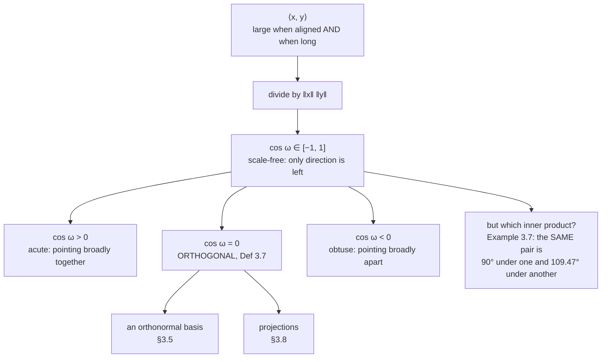

Cauchy-Schwarz guaranteed that

$$
\frac{\langle\mathbf{x},\mathbf{y}\rangle}{\lVert\mathbf{x}\rVert\,\lVert\mathbf{y}\rVert} \in [-1,\ 1] .
$$

A number in that range can be called a cosine, and that single move gives the inner product a
geometric meaning: it measures **angle**. From there come cosine similarity — the standard way to
compare embeddings — and **orthogonality**, which every remaining page of this chapter is built on.

The page also carries the chapter's most important caveat, and it is worth stating up front:
orthogonality is a statement about a **pair of vectors and an inner product**, not about the pair
alone.

## What you'll learn

- The definition of the angle $\omega$ between two vectors, and why the normalisation matters more than the numerator.
- **Cosine similarity**, and a measured demonstration of what goes wrong if you use the raw dot product instead.
- **Orthogonality** (Definition 3.7), including the fact that $\mathbf{0}$ is orthogonal to everything.
- The book's Example 3.7: a pair at $90°$ under the dot product and at $109.47°$ under a different inner product — same two arrows.
- **Orthogonal matrices** (Definition 3.8), the two properties that make them the transformations of choice, and why the book says "orthonormal" would be the better word.
- Why two random high-dimensional vectors are almost always nearly perpendicular, measured across four orders of magnitude of dimension.

## Intuition: the numerator says how much, the denominator says compared to what

The dot product $\mathbf{x}^\top\mathbf{y}$ conflates two different questions: *do these point the same
way?* and *how big are they?* Two long documents about unrelated topics can share a large dot product
purely by being long.

Dividing by both lengths removes the second question entirely. What is left is scale-free — multiply
either vector by any positive number and the cosine does not move — and so it answers only the first
question. That is why every retrieval system compares embeddings by cosine and not by dot product,
unless the embeddings have already been normalised, in which case the two coincide.



## The math

### The angle

:::note[Equations 3.24 and 3.25 — the angle between two vectors]
For $\mathbf{x}, \mathbf{y} \neq \mathbf{0}$, the angle $\omega \in [0, \pi]$ between them is defined by

$$
\cos\omega = \frac{\langle \mathbf{x}, \mathbf{y}\rangle}{\lVert\mathbf{x}\rVert\,\lVert\mathbf{y}\rVert},
\qquad
\omega = \arccos\!\left(\frac{\langle \mathbf{x}, \mathbf{y}\rangle}{\lVert\mathbf{x}\rVert\,\lVert\mathbf{y}\rVert}\right)
$$

This is well defined because Cauchy-Schwarz confines the argument to $[-1,1]$, and unique because
$\arccos$ is a bijection from $[-1,1]$ to $[0,\pi]$.
:::

The restriction $\omega \in [0,\pi]$ is worth noticing: this is an **unsigned** angle. There is no
orientation and no "clockwise" — the angle from $\mathbf{x}$ to $\mathbf{y}$ equals the angle from
$\mathbf{y}$ to $\mathbf{x}$, because the inner product is symmetric.

### Orthogonality

:::note[Definition 3.7 — Orthogonality]
Two vectors $\mathbf{x}$ and $\mathbf{y}$ are **orthogonal** if and only if
$\langle \mathbf{x}, \mathbf{y}\rangle = 0$, written $\mathbf{x} \perp \mathbf{y}$. If additionally
$\lVert\mathbf{x}\rVert = \lVert\mathbf{y}\rVert = 1$ — both are unit vectors — then $\mathbf{x}$ and
$\mathbf{y}$ are **orthonormal**.

The zero vector is orthogonal to **everything** in the space.
:::

Three things about that definition.

**It is defined by the inner product being zero, not by the angle being $90°$.** The two agree for
nonzero vectors, but the inner-product form also covers $\mathbf{0}$, whose angle with anything is
undefined (you would be dividing by zero) while its inner product with everything is $0$.

**It is relative.** The definition names an inner product, and different inner products give different
answers on the same pair. The next section is the book's own demonstration.

**Orthonormal is orthogonal plus unit length.** The distinction matters from §3.5 onwards, where the
unit-length half is what makes coordinates cheap.

### Orthogonal matrices

:::note[Definition 3.8 — Orthogonal matrix]
A square matrix $\mathbf{A}$ is **orthogonal** if and only if its columns are orthonormal, so that

$$
\mathbf{A}\mathbf{A}^\top = \mathbf{I} = \mathbf{A}^\top\mathbf{A},
\qquad\text{which implies}\qquad
\mathbf{A}^{-1} = \mathbf{A}^\top .
$$
:::

The inverse being the transpose is worth its own line, because it is the reason orthogonal matrices are
everywhere in numerical code: inverting one is free, and free inversion means no conditioning problem.

Two consequences, both of which the book states:

**Lengths are preserved** (Equation 3.31):

$$
\lVert\mathbf{A}\mathbf{x}\rVert^2 = (\mathbf{A}\mathbf{x})^\top(\mathbf{A}\mathbf{x}) = \mathbf{x}^\top\mathbf{A}^\top\mathbf{A}\mathbf{x} = \mathbf{x}^\top\mathbf{I}\mathbf{x} = \mathbf{x}^\top\mathbf{x} = \lVert\mathbf{x}\rVert^2
$$

**Angles are preserved** (Equation 3.32):

$$
\cos\omega = \frac{(\mathbf{A}\mathbf{x})^\top(\mathbf{A}\mathbf{y})}{\lVert\mathbf{A}\mathbf{x}\rVert\lVert\mathbf{A}\mathbf{y}\rVert}
= \frac{\mathbf{x}^\top\mathbf{A}^\top\mathbf{A}\mathbf{y}}{\lVert\mathbf{x}\rVert\lVert\mathbf{y}\rVert}
= \frac{\mathbf{x}^\top\mathbf{y}}{\lVert\mathbf{x}\rVert\lVert\mathbf{y}\rVert}
$$

Every step in both derivations is the substitution $\mathbf{A}^\top\mathbf{A} = \mathbf{I}$. So an
orthogonal matrix is exactly a map that leaves all of Euclidean geometry alone — the transformations
that "do not change anything" in the sense that matters here. §3.9 will name the determinant-$+1$ half
of them **rotations**; the other half are reflections.

:::caution[The book's own terminology complaint]
The book notes in a margin that these matrices should really be called **orthonormal**, since the
definition requires the columns to be orthogonal *and* of unit length. "Orthogonal matrix" is the
universal name anyway, so both the book and this page use it — but if you ever wonder why
$\mathbf{A}^\top\mathbf{A} = \mathbf{I}$ rather than merely a diagonal matrix, this is why.
:::

:::tip[From the book]
Section 3.4. The angle is Equations 3.24 and 3.25, illustrated by Figure 3.4. Example 3.6
(Equation 3.26) computes the angle between $(1,1)^\top$ and $(1,2)^\top$; Figure 3.5 draws it.
Definition 3.7 gives orthogonality and orthonormality, Example 3.7 (Equations 3.27 and 3.28) the
inner-product dependence with Figure 3.6, and Definition 3.8 the orthogonal matrix (Equations 3.29 and
3.30) with Equations 3.31 and 3.32 for the two preservation properties.
:::

## Worked example by hand

### Example 3.6 from the book

$\mathbf{x} = (1,1)^\top$, $\mathbf{y} = (1,2)^\top$, dot product.

| quantity | working | value |
| --- | --- | --- |
| $\langle\mathbf{x},\mathbf{y}\rangle$ | $1\cdot1 + 1\cdot2$ | $3$ |
| $\lVert\mathbf{x}\rVert$ | $\sqrt{1+1}$ | $\sqrt{2} \approx 1.414214$ |
| $\lVert\mathbf{y}\rVert$ | $\sqrt{1+4}$ | $\sqrt{5} \approx 2.236068$ |
| $\cos\omega$ | $\dfrac{3}{\sqrt{2}\sqrt{5}} = \dfrac{3}{\sqrt{10}}$ | $0.948683$ |
| $\omega$ | $\arccos(0.948683)$ | $0.321751$ rad $= 18.434949°$ |

The book quotes $\cos\omega = 3/\sqrt{10}$ and $\omega \approx 0.32$ rad $\approx 18°$, which the exact
values confirm.

### Example 3.7 — the one to remember

$\mathbf{x} = (1,1)^\top$, $\mathbf{y} = (-1,1)^\top$.

**Under the dot product:** $\langle\mathbf{x},\mathbf{y}\rangle = -1 + 1 = 0$, so $\cos\omega = 0$ and
$\omega = 90°$ exactly. **Orthogonal.**

**Under $\langle\mathbf{x},\mathbf{y}\rangle = \mathbf{x}^\top\begin{bmatrix}2&0\\0&1\end{bmatrix}\mathbf{y}$:**

$$
\langle\mathbf{x},\mathbf{y}\rangle = 2(1)(-1) + 1(1)(1) = -2 + 1 = -1
$$

$$
\lVert\mathbf{x}\rVert = \sqrt{2(1) + 1(1)} = \sqrt{3},
\qquad
\lVert\mathbf{y}\rVert = \sqrt{2(1) + 1(1)} = \sqrt{3}
$$

$$
\cos\omega = \frac{-1}{\sqrt{3}\cdot\sqrt{3}} = -\frac{1}{3} \approx -0.333333,
\qquad
\omega = 1.910633\ \text{rad} = 109.4712°
$$

The book quotes $\omega \approx 1.91$ rad $\approx 109.5°$. Same two arrows on the same piece of paper;
one geometry says they meet at a right angle and the other says they meet at $109.47°$ — which happens
to be the tetrahedral angle, though that is a coincidence here.

The mechanism is visible in the numbers: the matrix $\mathrm{diag}(2,1)$ makes the $x_1$ direction count
double, and $\mathbf{x}$ and $\mathbf{y}$ have $x_1$ components of *opposite* sign. Weighting that
disagreement more heavily tips the total negative.

```python title="examples_36_37.py" showLineNumbers{1}
import numpy as np

x = np.array([1.0, 1.0])
y = np.array([1.0, 2.0])
c = float(x @ y) / (np.linalg.norm(x) * np.linalg.norm(y))
print("Example 3.6: cos =", c, " = 3/sqrt(10) ?", np.isclose(c, 3 / np.sqrt(10)))
print("             omega =", np.arccos(c), "rad =", np.degrees(np.arccos(c)), "deg")

y2 = np.array([-1.0, 1.0])
for name, A in (("dot product", np.eye(2)), ("diag(2, 1)", np.diag([2.0, 1.0]))):
    ip = float(x @ A @ y2)
    cc = ip / np.sqrt(float(x @ A @ x) * float(y2 @ A @ y2))
    print(f"Example 3.7 under {name:12}: <x,y> = {ip:+.4f}  cos = {cc:+.6f}  "
          f"omega = {np.degrees(np.arccos(cc)):.4f} deg")
```

```text title="output"
Example 3.6: cos = 0.9486832980505138  = 3/sqrt(10) ? True
             omega = 0.3217505543966423 rad = 18.434948822922017 deg
Example 3.7 under dot product : <x,y> = +0.0000  cos = +0.000000  omega = 90.0000 deg
Example 3.7 under diag(2, 1)  : <x,y> = -1.0000  cos = -0.333333  omega = 109.4712 deg
```

## See it move

The first sketch separates the two questions the dot product conflates. Drag $\mathbf{y}$'s direction
and the cosine changes; drag its **length** and the cosine does not move at all while the raw inner
product does.

```p5 title="Length changes the dot product and not the cosine" desc="Drag the blue arrow to change direction, and drag the length knob to change its magnitude. The arc and the cosine readout depend only on direction; the raw inner product depends on both. That difference is the entire reason cosine similarity exists." height="480"
let ang = 0.9, len = 1.6;
let KNOBS = [], dragging = null, dragTip = false;
const XV = [2.0, 0.55];
const U = 64;
let cx, cy;

function setup() { createCanvas(600, 480); textFont("monospace"); cx = 240; cy = 200; }

function sx(x) { return cx + x * U; }
function sy(y) { return cy - y * U; }

function knob(id, x, y, w, value, mn, mx, label) {
  KNOBS.push({ id, x, y, w, mn, mx });
  const t = (value - mn) / (mx - mn);
  stroke(60, 74, 92); strokeWeight(2); line(x, y, x + w, y);
  noStroke(); fill(255, 211, 67); ellipse(x + t * w, y, 11, 11);
  fill(190, 200, 212); textSize(11); textAlign(LEFT, CENTER);
  text(label, x + w + 12, y);
}
function mousePressed() {
  for (const k of KNOBS) {
    if (mouseY > k.y - 12 && mouseY < k.y + 12 && mouseX > k.x - 12 && mouseX < k.x + k.w + 12) {
      dragging = k; return;
    }
  }
  const tip = [len * Math.cos(ang), len * Math.sin(ang)];
  if (Math.hypot(mouseX - sx(tip[0]), mouseY - sy(tip[1])) < 22) dragTip = true;
}
function mouseReleased() { dragging = null; dragTip = false; }
function mouseDragged() {
  if (dragging) {
    const t = Math.min(1, Math.max(0, (mouseX - dragging.x) / dragging.w));
    len = dragging.mn + t * (dragging.mx - dragging.mn);
  } else if (dragTip) {
    ang = Math.atan2(cy - mouseY, mouseX - cx);
  }
  if (!isLooping()) redraw();
}

function arrow(x1, y1, x2, y2, c, w) {
  stroke(c); strokeWeight(w); line(x1, y1, x2, y2);
  push(); translate(x2, y2); rotate(Math.atan2(y2 - y1, x2 - x1));
  fill(c); noStroke(); triangle(0, 0, -9, -4, -9, 4); pop();
}

function draw() {
  background(13, 17, 23);
  KNOBS = [];

  stroke(32, 44, 58); strokeWeight(1);
  for (let g = -4; g <= 5; g++) line(sx(g), sy(-2.6), sx(g), sy(2.6));
  for (let g = -2; g <= 2; g++) line(sx(-4), sy(g), sx(5), sy(g));
  stroke(58, 72, 88); strokeWeight(1.4);
  line(sx(-4), sy(0), sx(5), sy(0)); line(sx(0), sy(-2.6), sx(0), sy(2.6));

  const yv = [len * Math.cos(ang), len * Math.sin(ang)];
  const nx = Math.hypot(XV[0], XV[1]), ny = len;
  const ip = XV[0] * yv[0] + XV[1] * yv[1];
  const cosw = ip / (nx * ny);
  const omega = Math.acos(Math.max(-1, Math.min(1, cosw)));

  // Unit circle, so "direction only" has a visible home.
  noFill(); stroke(70, 84, 100); strokeWeight(1.2);
  ellipse(sx(0), sy(0), 2 * U, 2 * U);

  // The arc between the two directions.
  const a0 = Math.atan2(XV[1], XV[0]);
  const sweep = Math.atan2(yv[1], yv[0]) - a0;
  const dir = sweep > Math.PI ? sweep - TWO_PI : sweep < -Math.PI ? sweep + TWO_PI : sweep;
  noFill(); stroke(197, 153, 255); strokeWeight(2.4);
  beginShape();
  for (let i = 0; i <= 90; i++) {
    const t = a0 + (i / 90) * dir;
    vertex(sx(0.72 * Math.cos(t)), sy(0.72 * Math.sin(t)));
  }
  endShape();

  arrow(sx(0), sy(0), sx(XV[0]), sy(XV[1]), color(255, 211, 67), 2.8);
  arrow(sx(0), sy(0), sx(yv[0]), sy(yv[1]), color(75, 139, 190), 2.8);
  // The unit version of y, on the circle.
  noStroke(); fill(140, 190, 240);
  ellipse(sx(Math.cos(ang)), sy(Math.sin(ang)), 8, 8);
  fill(75, 139, 190); ellipse(sx(yv[0]), sy(yv[1]), 12, 12);
  textSize(12); textAlign(LEFT, TOP);
  fill(255, 211, 67); text("x (fixed)", sx(XV[0]) + 9, sy(XV[1]) - 20);
  fill(75, 139, 190); text("y (drag tip)", sx(yv[0]) + 9, sy(yv[1]) - 20);

  knob("len", 30, 400, 200, len, 0.25, 3.2, `||y|| = ${len.toFixed(3)}`);

  noStroke(); textAlign(LEFT, TOP);
  fill(255, 211, 67); textSize(14); text("Drag the tip, then drag the length", 20, 14);
  fill(215); textSize(12);
  text(`<x, y>  = ${ip.toFixed(4)}   <- moves with length`, 300, 44);
  fill(197, 153, 255);
  text(`cos w   = ${cosw.toFixed(6)}   <- does not`, 300, 66);
  text(`w       = ${(omega * 180 / Math.PI).toFixed(3)} deg`, 300, 88);
  fill(Math.abs(cosw) < 0.002 ? color(120, 200, 140) : color(150)); textSize(11);
  text(Math.abs(cosw) < 0.002 ? "ORTHOGONAL: the inner product is zero" :
       cosw > 0 ? "acute: broadly the same direction" : "obtuse: broadly opposed", 300, 114);
  fill(150); textSize(10);
  text("small pale dot: y scaled to unit length — the cosine only ever sees that", 20, 440);
  text("purple arc: the angle omega, always between 0 and 180 degrees", 20, 458);
}
```

The second sketch is Example 3.7 on a knob. Both arrows stay exactly where they are while the geometry
moves out from under them.

```p5 title="Example 3.7: the same pair, 90 degrees or 109.47" desc="The two arrows are fixed at (1,1) and (-1,1). The knob is the top-left entry of diag(a, 1) — the weight given to the first coordinate. At a = 1 the inner product is the dot product and the vectors are orthogonal. At a = 2 the book's second inner product gives cos = -1/3 and 109.4712 degrees. The dashed ellipse is the unit set, and it is what is actually changing." height="490"
let aVal = 1.0;
let KNOBS = [], dragging = null;
const XV = [1.0, 1.0], YV = [-1.0, 1.0];
const U = 92;
let cx, cy;

function setup() { createCanvas(600, 490); textFont("monospace"); cx = 300; cy = 215; }

function sx(x) { return cx + x * U; }
function sy(y) { return cy - y * U; }

function ip(p, q) { return aVal * p[0] * q[0] + p[1] * q[1]; }

function knob(id, x, y, w, value, mn, mx, label) {
  KNOBS.push({ id, x, y, w, mn, mx });
  const t = (value - mn) / (mx - mn);
  stroke(60, 74, 92); strokeWeight(2); line(x, y, x + w, y);
  for (const mark of [1.0, 2.0]) {
    const tm = (mark - mn) / (mx - mn);
    stroke(120, 200, 140); strokeWeight(2);
    line(x + tm * w, y - 7, x + tm * w, y + 7);
  }
  noStroke(); fill(255, 211, 67); ellipse(x + t * w, y, 11, 11);
  fill(190, 200, 212); textSize(11); textAlign(LEFT, CENTER);
  text(label, x + w + 12, y);
}
function mousePressed() {
  for (const k of KNOBS) {
    if (mouseY > k.y - 12 && mouseY < k.y + 12 && mouseX > k.x - 12 && mouseX < k.x + k.w + 12) {
      dragging = k; return;
    }
  }
}
function mouseReleased() { dragging = null; }
function mouseDragged() {
  if (!dragging) return;
  const t = Math.min(1, Math.max(0, (mouseX - dragging.x) / dragging.w));
  aVal = dragging.mn + t * (dragging.mx - dragging.mn);
  if (!isLooping()) redraw();
}

function arrow(x1, y1, x2, y2, c, w) {
  stroke(c); strokeWeight(w); line(x1, y1, x2, y2);
  push(); translate(x2, y2); rotate(Math.atan2(y2 - y1, x2 - x1));
  fill(c); noStroke(); triangle(0, 0, -9, -4, -9, 4); pop();
}

function draw() {
  background(13, 17, 23);
  KNOBS = [];

  stroke(32, 44, 58); strokeWeight(1);
  for (let g = -3; g <= 3; g += 0.5) line(sx(g), sy(-2), sx(g), sy(2));
  for (let g = -2; g <= 2; g += 0.5) line(sx(-3), sy(g), sx(3), sy(g));
  stroke(58, 72, 88); strokeWeight(1.4);
  line(sx(-3), sy(0), sx(3), sy(0)); line(sx(0), sy(-2), sx(0), sy(2));

  // The unit set of the current inner product.
  noFill(); stroke(120, 130, 145); strokeWeight(1.6);
  drawingContext.setLineDash([6, 5]);
  beginShape();
  for (let i = 0; i <= 220; i++) {
    const th = (i / 220) * TWO_PI;
    const d = [Math.cos(th), Math.sin(th)];
    const r = 1 / Math.sqrt(ip(d, d));
    vertex(sx(r * d[0]), sy(r * d[1]));
  }
  endShape(CLOSE);
  drawingContext.setLineDash([]);

  const val = ip(XV, YV);
  const cosw = val / Math.sqrt(ip(XV, XV) * ip(YV, YV));
  const omega = Math.acos(Math.max(-1, Math.min(1, cosw)));
  const orth = Math.abs(val) < 1e-9;

  // The arc, drawn at a radius that keeps it clear of the arrowheads.
  const a0 = Math.atan2(XV[1], XV[0]);
  noFill(); stroke(orth ? color(120, 200, 140) : color(232, 110, 110)); strokeWeight(2.6);
  beginShape();
  for (let i = 0; i <= 120; i++) {
    const t = a0 + (i / 120) * omega;
    vertex(sx(0.6 * Math.cos(t)), sy(0.6 * Math.sin(t)));
  }
  endShape();

  arrow(sx(0), sy(0), sx(XV[0]), sy(XV[1]), color(255, 211, 67), 3);
  arrow(sx(0), sy(0), sx(YV[0]), sy(YV[1]), color(75, 139, 190), 3);
  noStroke(); textSize(13); textAlign(LEFT, TOP);
  fill(255, 211, 67); text("x = (1, 1)", sx(XV[0]) + 10, sy(XV[1]) - 22);
  fill(75, 139, 190); text("y = (-1, 1)", sx(YV[0]) - 110, sy(YV[1]) - 22);

  knob("a", 30, 408, 220, aVal, 0.4, 3.0, `A = diag(${aVal.toFixed(3)}, 1)`);

  noStroke(); textAlign(LEFT, TOP);
  fill(255, 211, 67); textSize(14); text("The arrows never move. The geometry does.", 20, 14);
  fill(215); textSize(12);
  text(`<x, y> = ${val.toFixed(6)}`, 330, 44);
  text(`cos w  = ${cosw.toFixed(6)}`, 330, 66);
  text(`w      = ${(omega * 180 / Math.PI).toFixed(4)} deg`, 330, 88);
  fill(orth ? color(120, 200, 140) : color(232, 110, 110)); textSize(12);
  text(orth ? "ORTHOGONAL under this inner product" : "not orthogonal under this one", 330, 116);
  fill(150); textSize(10);
  text("green ticks on the track: a = 1 (dot product) and a = 2 (the book's Example 3.7)", 20, 440);
  text("dashed curve: the vectors this inner product calls unit length", 20, 458);
  text("only a = 1 makes these two orthogonal - orthogonality is not a property of the pair alone", 20, 476);
}
```

The third checks Definition 3.8's two claims by applying a transformation and remeasuring.

```p5 title="Orthogonal matrices leave lengths and angles alone" desc="Drag theta to rotate, and drag the reflect knob to flip the sign of the second column. Both give an orthogonal matrix — determinant plus one for the rotation, minus one for the reflection — and both leave every length and the angle between the two arrows unchanged to the last digit. Then drag the shear knob to see what a non-orthogonal matrix does to the same measurements." height="520"
let theta = 0.6, reflect = 0, shear = 0.0;
let KNOBS = [], dragging = null;
const A0 = [1.7, 0.4], B0 = [0.3, 1.4];
const U = 52;
let cx, cy;

function setup() { createCanvas(600, 520); textFont("monospace"); cx = 200; cy = 175; }

function sx(x) { return cx + x * U; }
function sy(y) { return cy - y * U; }

function matrix() {
  const c = Math.cos(theta), s = Math.sin(theta);
  const sgn = reflect > 0.5 ? -1 : 1;
  // R(theta) with the second column optionally flipped, then a shear bolted on.
  return [
    [c, sgn * -s + shear],
    [s, sgn * c],
  ];
}
function apply(M, v) { return [M[0][0] * v[0] + M[0][1] * v[1], M[1][0] * v[0] + M[1][1] * v[1]]; }
function nrm(v) { return Math.hypot(v[0], v[1]); }
function cosOf(u, v) { return (u[0] * v[0] + u[1] * v[1]) / (nrm(u) * nrm(v)); }

function knob(id, x, y, w, value, mn, mx, label) {
  KNOBS.push({ id, x, y, w, mn, mx });
  const t = (value - mn) / (mx - mn);
  stroke(60, 74, 92); strokeWeight(2); line(x, y, x + w, y);
  noStroke(); fill(255, 211, 67); ellipse(x + t * w, y, 10, 10);
  fill(190, 200, 212); textSize(11); textAlign(LEFT, CENTER);
  text(label, x + w + 12, y);
}
function mousePressed() {
  for (const k of KNOBS) {
    if (mouseY > k.y - 11 && mouseY < k.y + 11 && mouseX > k.x - 11 && mouseX < k.x + k.w + 11) {
      dragging = k; return;
    }
  }
}
function mouseReleased() { dragging = null; }
function mouseDragged() {
  if (!dragging) return;
  const t = Math.min(1, Math.max(0, (mouseX - dragging.x) / dragging.w));
  const v = dragging.mn + t * (dragging.mx - dragging.mn);
  if (dragging.id === "th") theta = v;
  if (dragging.id === "rf") reflect = v;
  if (dragging.id === "sh") shear = v;
  if (!isLooping()) redraw();
}

function arrow(x1, y1, x2, y2, c, w) {
  stroke(c); strokeWeight(w); line(x1, y1, x2, y2);
  push(); translate(x2, y2); rotate(Math.atan2(y2 - y1, x2 - x1));
  fill(c); noStroke(); triangle(0, 0, -9, -4, -9, 4); pop();
}

function draw() {
  background(13, 17, 23);
  KNOBS = [];

  stroke(32, 44, 58); strokeWeight(1);
  for (let g = -3; g <= 6; g++) line(sx(g), sy(-3), sx(g), sy(3));
  for (let g = -3; g <= 3; g++) line(sx(-3), sy(g), sx(6), sy(g));
  stroke(58, 72, 88); strokeWeight(1.4);
  line(sx(-3), sy(0), sx(6), sy(0)); line(sx(0), sy(-3), sx(0), sy(3));

  const M = matrix();
  const A1 = apply(M, A0), B1 = apply(M, B0);

  const det = M[0][0] * M[1][1] - M[0][1] * M[1][0];
  // A^T A, entrywise, so the deviation from the identity is visible.
  const g11 = M[0][0] * M[0][0] + M[1][0] * M[1][0];
  const g12 = M[0][0] * M[0][1] + M[1][0] * M[1][1];
  const g22 = M[0][1] * M[0][1] + M[1][1] * M[1][1];
  const gap = Math.max(Math.abs(g11 - 1), Math.abs(g22 - 1), Math.abs(g12));
  const orthMat = gap < 1e-9;

  arrow(sx(0), sy(0), sx(A0[0]), sy(A0[1]), color(90, 100, 116), 2);
  arrow(sx(0), sy(0), sx(B0[0]), sy(B0[1]), color(90, 100, 116), 2);
  arrow(sx(0), sy(0), sx(A1[0]), sy(A1[1]), color(255, 211, 67), 2.8);
  arrow(sx(0), sy(0), sx(B1[0]), sy(B1[1]), color(75, 139, 190), 2.8);

  noStroke(); textSize(11); textAlign(LEFT, TOP);
  fill(120, 130, 146); text("originals", sx(A0[0]) + 8, sy(A0[1]) + 6);
  fill(255, 211, 67); text("A u", sx(A1[0]) + 8, sy(A1[1]) - 18);
  fill(75, 139, 190); text("A v", sx(B1[0]) + 8, sy(B1[1]) - 18);

  knob("th", 30, 380, 170, theta, 0, 6.2832, `theta = ${theta.toFixed(3)}`);
  knob("rf", 30, 406, 170, reflect, 0, 1, reflect > 0.5 ? "reflect: ON" : "reflect: off");
  knob("sh", 30, 432, 170, shear, 0, 1.4, `shear = ${shear.toFixed(3)}`);

  const dLen = Math.abs(nrm(A1) - nrm(A0));
  const dAng = Math.abs(cosOf(A1, B1) - cosOf(A0, B0));

  textAlign(LEFT, TOP); noStroke();
  fill(255, 211, 67); textSize(14); text("Rotate, reflect, then shear", 20, 14);
  fill(215); textSize(11);
  text(`A^T A = [[${g11.toFixed(4)}, ${g12.toFixed(4)}], [${g12.toFixed(4)}, ${g22.toFixed(4)}]]`, 330, 44);
  text(`det A = ${det.toFixed(6)}`, 330, 66);
  fill(orthMat ? color(120, 200, 140) : color(232, 110, 110)); textSize(12);
  text(orthMat ? "A is orthogonal" : "A is NOT orthogonal", 330, 92);
  fill(215); textSize(11);
  text(`| ||Au|| - ||u|| | = ${dLen.toExponential(2)}`, 330, 120);
  text(`| cos after - before | = ${dAng.toExponential(2)}`, 330, 140);
  fill(150); textSize(10);
  text(shear > 1e-9 ? "with any shear the two deviations above stop being machine noise"
                    : "both deviations sit at machine epsilon: nothing measurable changed", 20, 470);
  text(orthMat ? (det > 0 ? "det +1: a rotation (section 3.9)" : "det -1: a reflection") :
                 "a shear preserves neither lengths nor angles", 20, 490);
}
```

## From scratch

```python title="angles_from_scratch.py" showLineNumbers{1}
import numpy as np

def angle(x, y, A=None, degrees=True):
    """The angle between x and y under the inner product given by A."""
    ip = x @ y if A is None else x @ A @ y
    nx = np.sqrt(x @ x if A is None else x @ A @ x)
    ny = np.sqrt(y @ y if A is None else y @ A @ y)
    # The clip is not cosmetic: rounding can push the ratio to 1 + 2e-16, and
    # arccos of that is nan rather than 0.
    c = np.clip(ip / (nx * ny), -1.0, 1.0)
    w = np.arccos(c)
    return (np.degrees(w) if degrees else w), float(c)

def cosine_similarity(A, B):
    """Row-wise cosine similarity between two stacks of vectors."""
    An = A / np.linalg.norm(A, axis=1, keepdims=True)
    Bn = B / np.linalg.norm(B, axis=1, keepdims=True)
    return An @ Bn.T

# How nearly perpendicular are two random vectors, as dimension grows?
print(f"{'dim':>6} {'mean |cos|':>11} {'sd(cos)':>9} {'1/sqrt(d)':>10} "
      f"{'mean angle':>11} {'sd angle':>9}")
for d in (2, 3, 10, 100, 1000, 10000):
    rng = np.random.default_rng(d)
    A = rng.normal(size=(5000, d))
    B = rng.normal(size=(5000, d))
    cs = np.sum(A * B, axis=1) / (np.linalg.norm(A, axis=1) * np.linalg.norm(B, axis=1))
    ang = np.degrees(np.arccos(np.clip(cs, -1, 1)))
    print(f"{d:6} {np.mean(np.abs(cs)):11.5f} {np.std(cs):9.5f} "
          f"{1 / np.sqrt(d):10.5f} {ang.mean():11.3f} {ang.std():9.3f}")
```

```text title="output"
   dim  mean |cos|   sd(cos)  1/sqrt(d)  mean angle  sd angle
     2     0.63951   0.71013    0.70711      90.255    52.221
     3     0.49792   0.57546    0.57735      90.147    39.065
    10     0.25820   0.31456    0.31623      90.007    18.948
   100     0.07954   0.09916    0.10000      89.935     5.709
  1000     0.02530   0.03166    0.03162      90.009     1.815
 10000     0.00783   0.00981    0.01000      89.992     0.562
```

Read the third and fourth columns together: the standard deviation of the cosine tracks
$1/\sqrt{d}$ to three significant figures across four orders of magnitude. The mean angle stays pinned
at $90°$ — it always was — while the *spread* collapses from $52°$ in the plane to $0.56°$ in ten
thousand dimensions.

That is the concentration of measure that makes cosine similarity useful in high dimensions and
$\ell_2$ distance useless: at $d = 10000$, two unrelated vectors are perpendicular to within about half
a degree, so a cosine of even $0.05$ is a strong signal rather than noise.

## On real data

<Figure
  src="/images/mml/angles-and-orthogonality/two-inner-products-two-angles"
  alt="Two fixed arrows to (1,1) and (-1,1) with two arcs drawn between them at different radii, one labelled ninety degrees and one labelled a hundred and nine point five, plus a dashed circle and a dashed ellipse behind them."
  title="Example 3.7, with both arcs drawn at once"
  caption="Same two arrows, two arcs. Under the dot product the angle is exactly 90 degrees; under x-transpose diag(2,1) y it is 109.47 degrees, with cosine exactly minus one third. The dashed curves are the two unit sets, and they are what actually differ."
/>

<Figure
  src="/images/mml/angles-and-orthogonality/cosine-similarity-matrix"
  alt="Two heatmaps over the same nine short documents. The left shows raw dot products, dominated by the longest documents. The right shows cosine similarities, with two clear topical blocks. Measured comparisons are printed underneath."
  title="Why retrieval uses the cosine"
  caption="Nine documents over six terms, three per topic at three different lengths. The dot product's top pair is bake-long with bake-huge at 408, and its worst same-topic score of 3 is beaten by its best cross-topic score of 92 — the ordering overlaps. The cosine's worst same-topic score is 0.8208 against a best cross-topic score of 0.1057: a clean split."
/>

## Reading the plot

**From the two arcs.** The figure draws both angles on the same pair of arrows, which makes the
relativity impossible to explain away. Note which object is actually changing: the arrows are fixed and
the *unit sets* differ. Under the dot product the unit set is a circle; under $\mathrm{diag}(2,1)$ it is
an ellipse squashed in $x_1$. Both arrows have their $x_1$-component weighted double, and their
$x_1$-components have opposite signs, so the weighting tips the inner product from $0$ to $-1$.

**From the heatmaps.** This is the sharpest measurement on the page. Nine short documents, three about
machine learning, three about baking, three of mixed or extreme length. The dot-product panel is
dominated by a bright band on the longest documents: its highest off-diagonal entry is
`bake-long`–`bake-huge` at $408$, and — the damning number — its **worst same-topic score is $3$ while
its best cross-topic score is $92$**. Ranked by raw dot product, unrelated long documents beat related
short ones, and the two groups do not separate at all.

The cosine panel has no such band. Its worst same-topic score is $0.8208$; its best cross-topic score is
$0.1057$. A single threshold anywhere between those two values separates the topics perfectly.

One concrete pair makes it vivid. `ml-huge` and `bake-huge` share a raw dot product of $92$ — higher
than most same-topic pairs — and a cosine of $0.1054$, which is an angle of $83.95°$: almost
perpendicular. They look similar to the dot product only because they are both enormous.

And the direct consequence for a retrieval system: asked for the nearest neighbour of `ml-tiny`, the
dot product returns **`ml-huge`** (it returns the biggest document that is at all related), while the
cosine returns **`ml-short`** (the document that is actually most similar in composition).

## Pitfalls

:::danger[arccos of a rounded ratio returns nan]
For $\mathbf{y} = c\mathbf{x}$ with $c > 0$ the cosine is mathematically $1$, and in floating point it
lands at $1 + 2.2\times10^{-16}$ about half the time. `np.arccos(1.0000000000000002)` is `nan`, not
$0$. Always `np.clip(ratio, -1.0, 1.0)` before `arccos`. This bug is silent until a duplicate row
appears in your data, at which point it is silent no longer.
:::

:::danger[Orthogonality is relative to an inner product]
Example 3.7 is the whole warning: $(1,1)$ and $(-1,1)$ are orthogonal under the dot product and meet at
$109.47°$ under $\mathrm{diag}(2,1)$. If you whiten your features, decorrelate them, or apply any
non-orthogonal transformation, angles change. Two features that were uncorrelated before whitening are
generally not perpendicular in the whitened coordinates and vice versa.
:::

:::caution[Cosine similarity is not a metric]
$1 - \cos\omega$ fails the triangle inequality. The **angular** distance $\omega$ itself is a metric on
the unit sphere, and so is $\sqrt{2(1-\cos\omega)}$, which is just the Euclidean distance between the
normalised vectors. If you need metric-tree indexing on cosine similarity, normalise and use Euclidean
distance — they give the identical ranking.
:::

:::caution[An orthogonal matrix can be a reflection]
$\mathbf{A}^\top\mathbf{A} = \mathbf{I}$ gives $\det(\mathbf{A}) = \pm 1$, and both signs occur.
$\mathrm{diag}(1,-1)$ is orthogonal with determinant $-1$. It preserves all lengths and all
*unsigned* angles, and it reverses orientation — so if handedness matters (3-D pose, chirality, mirrored
images), checking $\mathbf{A}^\top\mathbf{A} = \mathbf{I}$ is not enough. Check the determinant too.
Note also that `np.linalg.qr` makes no promise about the sign; the $\mathbf{Q}$ it returns is frequently
a reflection.
:::

:::caution[Zero vectors have no angle, but they are orthogonal to everything]
Definition 3.7 is stated as $\langle\mathbf{x},\mathbf{y}\rangle = 0$ rather than $\omega = 90°$
precisely so that $\mathbf{0}$ is covered. Code that computes orthogonality via `arccos` will divide by
zero on a zero vector; code that tests the inner product against zero will not.
:::

## Compare

| quantity | formula | range | scale-free? | is it a metric? |
| --- | --- | --- | --- | --- |
| inner product | $\langle\mathbf{x},\mathbf{y}\rangle$ | $\mathbb{R}$ | no | no (it is a similarity) |
| cosine similarity | $\dfrac{\langle\mathbf{x},\mathbf{y}\rangle}{\lVert\mathbf{x}\rVert\lVert\mathbf{y}\rVert}$ | $[-1,1]$ | **yes** | no |
| angle $\omega$ | $\arccos(\cos\omega)$ | $[0,\pi]$ | **yes** | yes, on the unit sphere |
| $1 - \cos\omega$ | — | $[0,2]$ | yes | **no** — fails the triangle inequality |
| chord distance | $\sqrt{2(1-\cos\omega)}$ | $[0,2]$ | yes | yes — it is Euclidean distance after normalising |

<Quiz
  title="Check your understanding"
  questions={[
    {
      q: "Why is cosine similarity preferred to the raw dot product for comparing documents or embeddings?",
      options: [
        "It is faster to compute",
        "It is scale-free, so it answers only 'do these point the same way' — the measured heatmaps on this page show the raw dot product's worst same-topic score (3) beaten by its best cross-topic score (92), so the two topic groups do not separate at all",
        "It is bounded, and bounded quantities are always better",
        "The dot product can be negative",
      ],
      answer: 1,
      explain:
        "The cosine panel separates cleanly: worst same-topic 0.8208 against best cross-topic 0.1057. The concrete failure is that ml-huge and bake-huge share a dot product of 92 while their cosine is 0.1054, an angle of 83.95 degrees.",
    },
    {
      q: "In the measured table, the standard deviation of the cosine between two random vectors in d dimensions tracks which quantity?",
      options: [
        "1/d", "1/sqrt(d)", "log d", "It is constant",
      ],
      answer: 1,
      explain:
        "Measured across d = 2 to d = 10000 the two columns agree to three significant figures. The mean angle stays at 90 degrees throughout — what changes is the spread, from 52 degrees in the plane to 0.56 degrees at d = 10000.",
    },
    {
      q: "Definition 3.7 states orthogonality as the inner product being zero rather than as the angle being ninety degrees. Why does that matter?",
      options: [
        "It does not; the two are equivalent",
        "Because the zero vector has no well-defined angle with anything — the cosine would divide by zero — while its inner product with everything is zero, so the inner-product form correctly makes it orthogonal to everything",
        "Because angles are only defined in two dimensions",
        "Because the cosine can exceed one",
      ],
      answer: 1,
      explain:
        "It is also the practical reason to implement an orthogonality test as a comparison of the inner product against zero rather than via arccos, which would both divide by zero and return nan on a rounded ratio.",
    },
    {
      q: "A matrix satisfies A-transpose A = I. What can you conclude, and what can you not?",
      options: [
        "It is a rotation",
        "It preserves every length and every unsigned angle, and its determinant is plus or minus one — so it may be a reflection and may reverse orientation. det(A) = +1 is the extra condition for a rotation",
        "It is symmetric",
        "Its eigenvalues are all one",
      ],
      answer: 1,
      explain:
        "diag(1, -1) is orthogonal with determinant -1. Measured across n = 2 to 12, np.linalg.qr returns det(Q) = (-1)^(n-1) deterministically — Householder QR applies n-1 reflections — so in every even dimension its Q is a reflection, which matters whenever handedness does.",
    },
  ]}
/>

## 🧪 Try It Yourself

### Exercise 1 – Angle under an arbitrary inner product

<DataCampExercise
  lang="python"
  hint={`Clip the ratio into [-1, 1] before calling arccos. Rounding can push a mathematically-exact 1 to just above it, and arccos of that is nan.`}
  code={`import numpy as np

def angle_deg(x, y, A=None):
    ip = x @ y if A is None else x @ A @ y
    nx = np.sqrt(x @ x if A is None else x @ A @ x)
    ny = np.sqrt(y @ y if A is None else y @ A @ y)
    c = np.clip(ip / (nx * ny), -1.0, ___)         # replace ___ with 1.0
    return float(np.degrees(np.arccos(c))), float(c)

x = np.array([1.0, 1.0])
print("Example 3.6, y = (1,2):", angle_deg(x, np.array([1.0, 2.0])))
y = np.array([-1.0, 1.0])
print("Example 3.7, dot:      ", angle_deg(x, y))
print("Example 3.7, diag(2,1):", angle_deg(x, y, np.diag([2.0, 1.0])))

# -- Expected output ------------------------------
# Example 3.6, y = (1,2): (18.434948822922017, 0.9486832980505138)
# Example 3.7, dot:       (90.0, 0.0)
# Example 3.7, diag(2,1): (109.47122063449069, -0.33333333333333337)
# -------------------------------------------------`}
  solution={`import numpy as np

def angle_deg(x, y, A=None):
    ip = x @ y if A is None else x @ A @ y
    nx = np.sqrt(x @ x if A is None else x @ A @ x)
    ny = np.sqrt(y @ y if A is None else y @ A @ y)
    c = np.clip(ip / (nx * ny), -1.0, 1.0)
    return float(np.degrees(np.arccos(c))), float(c)

x = np.array([1.0, 1.0])
print("Example 3.6, y = (1,2):", angle_deg(x, np.array([1.0, 2.0])))
y = np.array([-1.0, 1.0])
print("Example 3.7, dot:      ", angle_deg(x, y))
print("Example 3.7, diag(2,1):", angle_deg(x, y, np.diag([2.0, 1.0])))`}
  sct={`test_output_contains("109.47122063449069")
success_msg("Both of the book's examples reproduced exactly, including the cosine of minus one third.")`}
  height={250}
/>

### Exercise 2 – Make arccos return nan, then fix it

<DataCampExercise
  lang="python"
  hint={`Take a vector and a positive multiple of it. The cosine is mathematically 1, and floating point often lands just above.`}
  code={`import numpy as np

x = np.array([-0.4, -1.2, 1.7, -0.5, 0.3, -0.3])
y = 1.4 * x                        # exactly parallel, so cos should be 1

raw = float(x @ y) / (np.linalg.norm(x) * np.linalg.norm(y))
print("raw ratio:", repr(raw))
print("is it above 1?", raw > 1.0)
print("arccos of the raw ratio:", np.arccos(raw))
print("arccos of the clipped ratio:", np.arccos(np.___(raw, -1.0, 1.0)))   # replace ___ with clip

# -- Expected output ------------------------------
# raw ratio: 1.0000000000000002
# is it above 1? True
# arccos of the raw ratio: nan
# arccos of the clipped ratio: 0.0
# -------------------------------------------------`}
  solution={`import numpy as np

x = np.array([-0.4, -1.2, 1.7, -0.5, 0.3, -0.3])
y = 1.4 * x

raw = float(x @ y) / (np.linalg.norm(x) * np.linalg.norm(y))
print("raw ratio:", repr(raw))
print("is it above 1?", raw > 1.0)
print("arccos of the raw ratio:", np.arccos(raw))
print("arccos of the clipped ratio:", np.arccos(np.clip(raw, -1.0, 1.0)))`}
  sct={`test_output_contains("nan")
test_output_contains("0.0")
success_msg("One unit in the last place is the difference between an angle of zero and a nan that propagates through everything downstream. This is why the clip is not optional.")`}
  height={250}
/>

### Exercise 3 – Reproduce the retrieval failure

<DataCampExercise
  lang="python"
  hint={`Compare the two rankings of the same query row: one by raw dot product, one by cosine. Exclude the query itself.`}
  code={`import numpy as np

names = ["ml-short", "ml-long", "ml-tiny", "bake-short", "bake-long",
         "bake-tiny", "mixed", "ml-huge", "bake-huge"]
V = np.array([
    [2, 1, 1, 0, 0, 0], [9, 7, 6, 0, 0, 1], [1, 0, 1, 0, 0, 0],
    [0, 0, 0, 2, 1, 2], [0, 1, 0, 8, 6, 9], [0, 0, 0, 1, 0, 1],
    [3, 2, 1, 3, 1, 2], [20, 15, 14, 1, 0, 2], [1, 0, 1, 18, 14, 20],
], dtype=float)

L = np.linalg.norm(V, axis=1)
G = V @ V.T
C = G / np.outer(L, ___)                     # replace ___ with L

q = 2                                        # the query is "ml-tiny"
mask = np.arange(len(names)) != q
print("nearest to ml-tiny by dot product:", names[int(np.argmax(np.where(mask, G[q], -1e9)))])
print("nearest to ml-tiny by cosine:     ", names[int(np.argmax(np.where(mask, C[q], -1e9)))])
print("ml-huge vs bake-huge: dot", G[7, 8], " cos", round(float(C[7, 8]), 4),
      " angle", round(float(np.degrees(np.arccos(C[7, 8]))), 2), "deg")

# -- Expected output ------------------------------
# nearest to ml-tiny by dot product: ml-huge
# nearest to ml-tiny by cosine:      ml-short
# ml-huge vs bake-huge: dot 92.0  cos 0.1054  angle 83.95 deg
# -------------------------------------------------`}
  solution={`import numpy as np

names = ["ml-short", "ml-long", "ml-tiny", "bake-short", "bake-long",
         "bake-tiny", "mixed", "ml-huge", "bake-huge"]
V = np.array([
    [2, 1, 1, 0, 0, 0], [9, 7, 6, 0, 0, 1], [1, 0, 1, 0, 0, 0],
    [0, 0, 0, 2, 1, 2], [0, 1, 0, 8, 6, 9], [0, 0, 0, 1, 0, 1],
    [3, 2, 1, 3, 1, 2], [20, 15, 14, 1, 0, 2], [1, 0, 1, 18, 14, 20],
], dtype=float)

L = np.linalg.norm(V, axis=1)
G = V @ V.T
C = G / np.outer(L, L)

q = 2
mask = np.arange(len(names)) != q
print("nearest to ml-tiny by dot product:", names[int(np.argmax(np.where(mask, G[q], -1e9)))])
print("nearest to ml-tiny by cosine:     ", names[int(np.argmax(np.where(mask, C[q], -1e9)))])
print("ml-huge vs bake-huge: dot", G[7, 8], " cos", round(float(C[7, 8]), 4),
      " angle", round(float(np.degrees(np.arccos(C[7, 8]))), 2), "deg")`}
  sct={`test_output_contains("by dot product: ml-huge")
test_output_contains("by cosine:      ml-short")
success_msg("Two different answers to the same query. The dot product returns the biggest vaguely-related document; the cosine returns the most similar one.")`}
  height={330}
/>

### Exercise 4 – Verify Equations 3.31 and 3.32

<DataCampExercise
  hint={`Build an orthogonal matrix with a QR factorisation, then remeasure lengths and cosines after applying it.`}
  lang="python"
  code={`import numpy as np

rng = np.random.default_rng(13)
Q, _ = np.linalg.qr(rng.normal(size=(6, 6)))
v = rng.normal(size=6)
w = rng.normal(size=6)

cos = lambda a, b: float(a @ b) / (np.linalg.norm(a) * np.linalg.norm(b))

print("Q^T Q - I, largest entry:", f"{np.abs(Q.T @ ___ - np.eye(6)).max():.2e}")   # replace ___ with Q
print("length change:", f"{abs(np.linalg.norm(Q @ v) - np.linalg.norm(v)):.2e}")
print("cosine before:", round(cos(v, w), 12))
print("cosine after: ", round(cos(Q @ v, Q @ w), 12))
print("determinant:  ", round(float(np.linalg.det(Q)), 12),
      "-> a reflection" if np.linalg.det(Q) < 0 else "-> a rotation")

# -- Expected output ------------------------------
# Q^T Q - I, largest entry: 4.44e-16
# length change: 4.44e-16
# cosine before: -0.274853064339
# cosine after:  -0.274853064339
# determinant:   -1.0 -> a reflection
# -------------------------------------------------`}
  solution={`import numpy as np

rng = np.random.default_rng(13)
Q, _ = np.linalg.qr(rng.normal(size=(6, 6)))
v = rng.normal(size=6)
w = rng.normal(size=6)

cos = lambda a, b: float(a @ b) / (np.linalg.norm(a) * np.linalg.norm(b))

print("Q^T Q - I, largest entry:", f"{np.abs(Q.T @ Q - np.eye(6)).max():.2e}")
print("length change:", f"{abs(np.linalg.norm(Q @ v) - np.linalg.norm(v)):.2e}")
print("cosine before:", round(cos(v, w), 12))
print("cosine after: ", round(cos(Q @ v, Q @ w), 12))
print("determinant:  ", round(float(np.linalg.det(Q)), 12),
      "-> a reflection" if np.linalg.det(Q) < 0 else "-> a rotation")`}
  sct={`test_output_contains("-> a reflection")
success_msg("Twelve identical digits before and after, and a determinant of -1: the Q that numpy hands you is a reflection here, not a rotation. Check the determinant whenever handedness matters.")`}
  height={280}
/>

### Exercise 5 – Concentration of measure, measured

<DataCampExercise
  lang="python"
  hint={`Sample many pairs at each dimension, compute the cosines, and compare their standard deviation with one over the square root of the dimension.`}
  code={`import numpy as np

for d in (2, 10, 100, 1000, 10000):
    rng = np.random.default_rng(d)
    A = rng.normal(size=(5000, d))
    B = rng.normal(size=(5000, d))
    cs = np.sum(A * B, axis=1) / (np.linalg.norm(A, axis=1) * np.linalg.norm(B, axis=1))
    ang = np.degrees(np.arccos(np.clip(cs, -1, 1)))
    print(f"d={d:6}  sd(cos) {np.std(cs):.5f}  1/sqrt(d) {1 / np.sqrt(___):.5f}  "
          f"mean angle {ang.mean():7.3f}  sd angle {ang.std():7.3f}")   # replace ___ with d

# -- Expected output ------------------------------
# d=     2  sd(cos) 0.71013  1/sqrt(d) 0.70711  mean angle  90.255  sd angle  52.221
# d=    10  sd(cos) 0.31456  1/sqrt(d) 0.31623  mean angle  90.007  sd angle  18.948
# d=   100  sd(cos) 0.09916  1/sqrt(d) 0.10000  mean angle  89.935  sd angle   5.709
# d=  1000  sd(cos) 0.03166  1/sqrt(d) 0.03162  mean angle  90.009  sd angle   1.815
# d= 10000  sd(cos) 0.00981  1/sqrt(d) 0.01000  mean angle  89.992  sd angle   0.562
# -------------------------------------------------`}
  solution={`import numpy as np

for d in (2, 10, 100, 1000, 10000):
    rng = np.random.default_rng(d)
    A = rng.normal(size=(5000, d))
    B = rng.normal(size=(5000, d))
    cs = np.sum(A * B, axis=1) / (np.linalg.norm(A, axis=1) * np.linalg.norm(B, axis=1))
    ang = np.degrees(np.arccos(np.clip(cs, -1, 1)))
    print(f"d={d:6}  sd(cos) {np.std(cs):.5f}  1/sqrt(d) {1 / np.sqrt(d):.5f}  "
          f"mean angle {ang.mean():7.3f}  sd angle {ang.std():7.3f}")`}
  sct={`test_output_contains("d= 10000")
success_msg("Three significant figures of agreement with 1/sqrt(d) across four orders of magnitude. In ten thousand dimensions two unrelated vectors are perpendicular to within half a degree, which is exactly why a cosine of 0.05 is a strong signal there and noise in the plane.")`}
  height={300}
/>

## Recall card

- **The cosine of the angle is the inner product divided by both lengths**, and Cauchy-Schwarz is what confines it to minus one through one so that arccos applies.
- **The angle is unsigned**, always between zero and pi, because the inner product is symmetric.
- **Orthogonality means the inner product is zero** — stated that way rather than as ninety degrees, so that the zero vector is orthogonal to everything.
- **Orthogonality is relative to an inner product**: the book's Example 3.7 has one pair at ninety degrees under the dot product and 109.47 degrees under a diagonal reweighting, with cosine exactly minus one third.
- **Orthonormal is orthogonal plus unit length**, and the second half is what makes coordinates cheap from section 3.5 onwards.
- **An orthogonal matrix has A-transpose A equal to the identity**, so its inverse is its transpose, and it preserves every length and every angle. Its determinant is plus or minus one, so it may be a reflection.
- **Cosine similarity is scale-free and the dot product is not** — measured on nine documents, the dot product's worst same-topic score is beaten by its best cross-topic score, and the cosine separates the two groups cleanly.
- **In high dimensions random vectors are nearly perpendicular**: the spread of the cosine falls like one over the square root of the dimension, reaching half a degree at ten thousand.

**Next:** [Orthonormal Basis](../orthonormal-basis/) — what orthogonality buys once you build a whole
coordinate system out of it.
