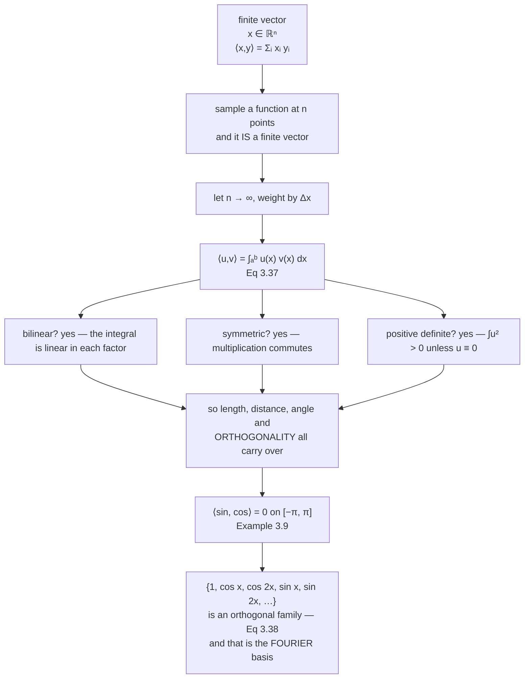

Everything so far treated a vector as a finite list of numbers, and every inner product as a finite
sum. But nothing in Definition 3.3 mentions finiteness: an inner product needs to be bilinear,
symmetric and positive definite, and that is all.

So take a **function** $u$ on an interval, think of it as a vector with one entry for every point of
that interval, and replace the sum by an integral. All three axioms survive, and with them length,
distance, angle and orthogonality. Two *functions* can now be perpendicular — and the family of
functions that are mutually perpendicular in this sense is exactly the family Fourier analysis is
built on.

## What you'll learn

- Equation 3.37: the inner product of two functions as a definite integral, and why the interval is part of the definition.
- The book's Example 3.9: $\sin$ and $\cos$ are **orthogonal** on $[-\pi, \pi]$, by exact cancellation rather than approximate smallness.
- The trigonometric family of Equation 3.38, measured to be orthogonal, with its Gram matrix computed.
- How a square wave is rebuilt from its projections, and why each coefficient can be computed **independently** of all the others.
- Parseval's identity again, now predicting the truncation error exactly — and the **Gibbs** overshoot that will not go away.

## Intuition: a vector with uncountably many entries

Sample a function at $n$ points and you get a vector in $\mathbb{R}^n$. Its dot product with another
sampled function is $\sum_i u(x_i)v(x_i)$. Multiply by the spacing $\Delta x$ and that sum is a Riemann
approximation to $\int u(x)v(x)\,dx$.

Now let $n$ grow. The vector gets longer, the sum gets more terms, and the limit is the integral. The
integral **is** the dot product of the two functions; the only difference is that the index set is a
continuum instead of $\{1, \dots, n\}$.



## The math

:::note[Equation 3.37 — inner product of functions]
For two functions $u, v : [a,b] \to \mathbb{R}$,

$$
\langle u, v \rangle := \int_a^b u(x)\,v(x)\,dx
$$

If this integral evaluates to $0$, the functions $u$ and $v$ are **orthogonal**.
:::

Three things the notation hides.

**The interval is part of the inner product.** $\sin$ and $\cos$ are orthogonal on $[-\pi,\pi]$ and
*not* on $[0, \pi/2]$, where $\int_0^{\pi/2}\sin x\cos x\,dx = \tfrac{1}{2}$. Changing $[a,b]$ changes
the geometry exactly as changing the matrix $\mathbf{A}$ did in §3.2.

**Positive definiteness needs care.** $\int_a^b u(x)^2\,dx = 0$ does not force $u(x) = 0$ at *every*
point — a function that is zero except at one point still integrates to zero. The clean statement is
that it forces $u = 0$ **almost everywhere**, and the honest fix is to work in a space where functions
differing on a measure-zero set are treated as the same vector. That is what $L^2[a,b]$ means, and it
is the only place in this chapter where the finite and infinite cases genuinely differ.

**The integral must converge.** Not every function pair has a finite inner product;
$u(x) = v(x) = 1/x$ on $[0,1]$ does not. The space of functions for which it does is the space you
work in.

### The induced norm and everything downstream

$$
\lVert u \rVert = \sqrt{\langle u, u\rangle} = \sqrt{\int_a^b u(x)^2\,dx},
\qquad
d(u,v) = \lVert u - v\rVert,
\qquad
\cos\omega = \frac{\langle u, v\rangle}{\lVert u\rVert\,\lVert v\rVert}
$$

Nothing new is being defined — these are §3.3 and §3.4 verbatim with the new inner product substituted
in. That reuse is the point of having stated those sections abstractly.

### The trigonometric family

:::note[Equation 3.38]
On $[-\pi, \pi]$, the functions

$$
\{\, 1,\ \cos x,\ \cos 2x,\ \cos 3x,\ \dots,\ \sin x,\ \sin 2x,\ \sin 3x,\ \dots \,\}
$$

are **pairwise orthogonal**. Any function that is integrable on that interval can be expanded in this
family, and the expansion is its **Fourier series**.
:::

Their Gram matrix is diagonal rather than the identity, because these functions are orthogonal but not
of unit length. Measured on the first seven members:

$$
\langle 1, 1\rangle = 2\pi \approx 6.283185,
\qquad
\langle \cos kx, \cos kx\rangle = \langle \sin kx, \sin kx\rangle = \pi \approx 3.141593
$$

with every off-diagonal entry below $4.5\times10^{-16}$. So this is an **orthogonal** basis, not an
orthonormal one, and the coordinate formula needs the division that §3.5's pitfall warned about:

$$
c_k = \frac{\langle f,\ \sin kx\rangle}{\langle \sin kx,\ \sin kx\rangle} = \frac{1}{\pi}\int_{-\pi}^{\pi} f(x)\sin(kx)\,dx
$$

Dividing by $\pi$ is not a convention plucked from nowhere — it is $1/\lVert\sin kx\rVert^2$.

:::tip[From the book]
Section 3.7, Equation 3.37. Example 3.9 shows that $\langle \sin, \cos\rangle = 0$ on $[-\pi,\pi]$
because the product $u(x)v(x) = \sin(x)\cos(x)$ is an **odd** function while the interval is symmetric
about the origin, so the integral vanishes; Figure 3.8 draws it. The Remark that follows gives the
orthogonal family of Equation 3.38 and names the resulting expansion the Fourier series. The book notes
that this construction is what carries the geometric apparatus of the chapter into function spaces, and
points to Chapter 6 for the analogous move with random variables.
:::

## Worked example by hand

### Example 3.9 from the book

$$
\langle \sin, \cos \rangle = \int_{-\pi}^{\pi} \sin(x)\cos(x)\,dx
$$

There are two ways to see that this is zero, and both are worth having.

**By antiderivative.** The double-angle identity gives
$\sin x\cos x = \tfrac{1}{2}\sin 2x$, whose antiderivative is $-\tfrac{1}{4}\cos 2x$. So

$$
\int_{-\pi}^{\pi}\sin x\cos x\,dx = \left[-\tfrac{1}{4}\cos 2x\right]_{-\pi}^{\pi}
= -\tfrac{1}{4}\cos 2\pi + \tfrac{1}{4}\cos(-2\pi) = -\tfrac{1}{4} + \tfrac{1}{4} = 0
$$

**By symmetry**, which is the book's argument and the better one. The product
$w(x) = \sin x \cos x$ satisfies $w(-x) = \sin(-x)\cos(-x) = -\sin x\cos x = -w(x)$: it is **odd**.
The integral of an odd function over an interval symmetric about the origin is zero, because every
positive contribution on the right has an exactly equal negative partner on the left.

That is not "small", it is **cancellation**. Measured, the positive area is $+0.9999999997$ and the
negative area is $-0.9999999997$ — the same ten digits — and the integral comes out at exactly $0$ in
floating point. The oddness itself is measured too: $\max_x \lvert w(x) + w(-x)\rvert = 1.1\times10^{-15}$.

### The square wave, by hand

Take $f(x) = \mathrm{sign}(\sin x)$ on $[-\pi,\pi]$: $+1$ on $(0,\pi)$, $-1$ on $(-\pi,0)$.

**Coefficient on $\sin kx$.** Both $f$ and $\sin kx$ are odd, so their product is even and the integral
is twice the right half:

$$
\langle f, \sin kx\rangle = 2\int_0^{\pi}\sin(kx)\,dx = 2\left[-\frac{\cos kx}{k}\right]_0^{\pi}
= \frac{2}{k}\big(1 - \cos k\pi\big)
= \begin{cases} 4/k & k \text{ odd} \\ 0 & k \text{ even}\end{cases}
$$

Dividing by $\lVert \sin kx\rVert^2 = \pi$:

| $k$ | $c_k = \dfrac{4}{k\pi}$ for odd $k$ | measured |
| --- | --- | --- |
| 1 | $4/\pi$ | $1.273240$ |
| 2 | — | $-0.0$ |
| 3 | $4/(3\pi)$ | $0.424413$ |
| 4 | — | $-0.0$ |
| 5 | $4/(5\pi)$ | $0.254648$ |
| 6 | — | $-0.0$ |
| 7 | $4/(7\pi)$ | $0.181891$ |

The even coefficients are **exactly** $-0.0$, not small: $\cos k\pi = 1$ for even $k$, so the bracket is
identically zero.

**Coefficient on $\cos kx$ and on the constant.** $f$ is odd and $\cos kx$ is even, so every product is
odd and every one of those coefficients is zero. A square wave needs sines only, which is a statement
about symmetry rather than about square waves.

```python title="functions_worked.py" showLineNumbers{1}
import numpy as np

x = np.linspace(-np.pi, np.pi, 200001)          # odd count, so 0 is a sample
ip = lambda u, v: float(np.trapezoid(u * v, x))

# Example 3.9
w = np.sin(x) * np.cos(x)
print("<sin, cos>       =", f"{ip(np.sin(x), np.cos(x)):.3e}")
print("positive area    =", f"{float(np.trapezoid(np.where(w > 0, w, 0), x)):+.10f}")
print("negative area    =", f"{float(np.trapezoid(np.where(w < 0, w, 0), x)):+.10f}")
print("odd? max|w(x)+w(-x)| =", f"{np.max(np.abs(w + w[::-1])):.1e}")

# The Gram matrix of the first seven members of the trigonometric family.
fam = [("1", np.ones_like(x))]
fam += [(f"cos {k}x", np.cos(k * x)) for k in (1, 2, 3)]
fam += [(f"sin {k}x", np.sin(k * x)) for k in (1, 2, 3)]
G = np.array([[ip(a, b) for _, b in fam] for _, a in fam])
print("diagonal:", np.round(np.diag(G), 6))
print("largest off-diagonal:", f"{np.max(np.abs(G - np.diag(np.diag(G)))):.3e}")
print("2*pi =", round(2 * np.pi, 6), "  pi =", round(np.pi, 6))

# Square-wave coefficients, one independent integral each.
f = np.sign(np.sin(x))
print("||f||^2 =", round(ip(f, f), 6), " and 2*pi =", round(2 * np.pi, 6))
c = {k: ip(f, np.sin(k * x)) / ip(np.sin(k * x), np.sin(k * x)) for k in range(1, 8)}
print("coefficients:", {k: round(v, 6) for k, v in c.items()})
print("4/(k pi):    ", {k: round(4 / (k * np.pi), 6) for k in (1, 3, 5, 7)})
```

```text title="output"
<sin, cos>       = 0.000e+00
positive area    = +0.9999999997
negative area    = -0.9999999997
odd? max|w(x)+w(-x)| = 1.1e-15
diagonal: [6.283185 3.141593 3.141593 3.141593 3.141593 3.141593 3.141593]
largest off-diagonal: 4.441e-16
2*pi = 6.283185   pi = 3.141593
||f||^2 = 6.283185  and 2*pi = 6.283185
coefficients: {1: 1.27324, 2: -0.0, 3: 0.424413, 5: 0.254648, 4: -0.0, 6: -0.0, 7: 0.181891}
```

## See it move

The first sketch is Example 3.9 with both frequencies on knobs. Set them equal and the cancellation
stops.

```p5 title="Two frequencies, and when the areas cancel" desc="The top panel draws sin(mx) and cos(nx) — or sin(nx), via the second toggle — on the interval from minus pi to pi. The bottom panel is their product, with the positive area shaded green and the negative area red. The readout integrates both. They cancel for every pair except the ones where the two functions coincide." height="540"
let mFreq = 1, nFreq = 1, useSin = 0;
let KNOBS = [], dragging = null;
const N = 1200;

function setup() { createCanvas(600, 540); textFont("monospace"); }

function knob(id, x, y, w, value, mn, mx, label, steps) {
  KNOBS.push({ id, x, y, w, mn, mx, steps });
  const t = (value - mn) / (mx - mn);
  stroke(60, 74, 92); strokeWeight(2); line(x, y, x + w, y);
  if (steps) {
    for (let i = 0; i <= mx - mn; i++) {
      stroke(90, 104, 122); strokeWeight(1);
      const tx = x + (i / (mx - mn)) * w;
      line(tx, y - 5, tx, y + 5);
    }
  }
  noStroke(); fill(255, 211, 67); ellipse(x + t * w, y, 10, 10);
  fill(190, 200, 212); textSize(11); textAlign(LEFT, CENTER);
  text(label, x + w + 12, y);
}
function mousePressed() {
  for (const k of KNOBS) {
    if (mouseY > k.y - 11 && mouseY < k.y + 11 && mouseX > k.x - 11 && mouseX < k.x + k.w + 11) {
      dragging = k; return;
    }
  }
}
function mouseReleased() { dragging = null; }
function mouseDragged() {
  if (!dragging) return;
  const t = Math.min(1, Math.max(0, (mouseX - dragging.x) / dragging.w));
  const raw = dragging.mn + t * (dragging.mx - dragging.mn);
  const v = dragging.steps ? Math.round(raw) : raw;
  if (dragging.id === "m") mFreq = v;
  if (dragging.id === "n") nFreq = v;
  if (dragging.id === "s") useSin = v;
  if (!isLooping()) redraw();
}

function draw() {
  background(13, 17, 23);
  KNOBS = [];

  const L = 40, R = width - 30;
  const topC = 110, botC = 300, amp = 62;
  const px = t => L + ((t + Math.PI) / (2 * Math.PI)) * (R - L);

  // Axes for both panels.
  stroke(48, 60, 74); strokeWeight(1.2);
  line(L, topC, R, topC); line(L, botC, R, botC);
  stroke(32, 44, 58); strokeWeight(1);
  for (const t of [-Math.PI, -Math.PI / 2, 0, Math.PI / 2, Math.PI]) {
    line(px(t), topC - amp - 6, px(t), topC + amp + 6);
    line(px(t), botC - amp - 6, px(t), botC + amp + 6);
  }
  noStroke(); fill(120); textSize(10); textAlign(CENTER, TOP);
  text("-pi", px(-Math.PI), botC + amp + 10);
  text("0", px(0), botC + amp + 10);
  text("pi", px(Math.PI), botC + amp + 10);

  const u = t => Math.sin(mFreq * t);
  const v = t => (useSin > 0.5 ? Math.sin(nFreq * t) : Math.cos(nFreq * t));

  // The two functions.
  noFill(); stroke(75, 139, 190); strokeWeight(2);
  beginShape();
  for (let i = 0; i <= N; i++) { const t = -Math.PI + (2 * Math.PI * i) / N; vertex(px(t), topC - amp * u(t)); }
  endShape();
  stroke(255, 211, 67); strokeWeight(2);
  beginShape();
  for (let i = 0; i <= N; i++) { const t = -Math.PI + (2 * Math.PI * i) / N; vertex(px(t), topC - amp * v(t)); }
  endShape();

  // The product, with its two shaded areas, and the trapezoid integral.
  let pos = 0, neg = 0;
  const dt = (2 * Math.PI) / N;
  noStroke();
  for (let i = 0; i < N; i++) {
    const t = -Math.PI + dt * i;
    const w0 = u(t) * v(t), w1 = u(t + dt) * v(t + dt);
    const mid = 0.5 * (w0 + w1);
    if (mid >= 0) { pos += mid * dt; fill(120, 200, 140, 110); } else { neg += mid * dt; fill(232, 110, 110, 110); }
    const y0 = botC - amp * w0, y1 = botC - amp * w1;
    beginShape();
    vertex(px(t), botC); vertex(px(t), y0); vertex(px(t + dt), y1); vertex(px(t + dt), botC);
    endShape(CLOSE);
  }
  noFill(); stroke(197, 153, 255); strokeWeight(2);
  beginShape();
  for (let i = 0; i <= N; i++) { const t = -Math.PI + (2 * Math.PI * i) / N; vertex(px(t), botC - amp * u(t) * v(t)); }
  endShape();

  const total = pos + neg;
  const orth = Math.abs(total) < 1e-6;

  knob("m", 40, 400, 150, mFreq, 1, 6, `m = ${mFreq}`, true);
  knob("n", 40, 428, 150, nFreq, 1, 6, `n = ${nFreq}`, true);
  knob("s", 40, 456, 150, useSin, 0, 1, useSin > 0.5 ? "second: sin(nx)" : "second: cos(nx)", true);

  noStroke(); textAlign(LEFT, TOP);
  fill(255, 211, 67); textSize(14);
  text("Drag m, n, and the sin/cos toggle", 30, 12);
  fill(75, 139, 190); textSize(11); text(`sin(${mFreq}x)`, 40, topC - amp - 26);
  fill(255, 211, 67); text(useSin > 0.5 ? `sin(${nFreq}x)` : `cos(${nFreq}x)`, 110, topC - amp - 26);
  fill(197, 153, 255); text("their product", 40, botC - amp - 26);

  fill(120, 200, 140); textSize(11); text(`positive area  ${pos.toFixed(6)}`, 330, 400);
  fill(232, 110, 110); text(`negative area  ${neg.toFixed(6)}`, 330, 420);
  fill(orth ? color(120, 200, 140) : color(255, 211, 67)); textSize(12);
  text(`integral       ${total.toFixed(6)}`, 330, 444);
  text(orth ? "ORTHOGONAL" : "not orthogonal", 330, 468);
  fill(150); textSize(10); textAlign(LEFT, TOP);
  text("Only sin(mx) against sin(mx) with the same m fails to cancel; every cos pairing", 30, 496);
  text("cancels because sin is odd and cos is even, so the product is odd.", 30, 512);
}
```

The second sketch rebuilds the square wave one term at a time, and shows Parseval predicting the error.

```p5 title="A square wave from its projections" desc="Drag the term count. Each coefficient is one independent integral, so adding a term never changes an earlier one. The readout gives the measured squared error and the value Parseval predicts from the coefficients kept, and they agree. Watch the overshoot at the jump: it shrinks in width but not in height." height="530"
let terms = 1;
let KNOBS = [], dragging = null;
const N = 1400;
const COEF = [];   // c_k = 4/(k pi) for odd k, 0 for even

function setup() {
  createCanvas(600, 530); textFont("monospace");
  for (let k = 0; k <= 80; k++) COEF[k] = (k % 2 === 1) ? 4 / (k * Math.PI) : 0;
}

function knob(id, x, y, w, value, mn, mx, label) {
  KNOBS.push({ id, x, y, w, mn, mx });
  const t = (value - mn) / (mx - mn);
  stroke(60, 74, 92); strokeWeight(2); line(x, y, x + w, y);
  noStroke(); fill(255, 211, 67); ellipse(x + t * w, y, 11, 11);
  fill(190, 200, 212); textSize(11); textAlign(LEFT, CENTER);
  text(label, x + w + 12, y);
}
function mousePressed() {
  for (const k of KNOBS) {
    if (mouseY > k.y - 12 && mouseY < k.y + 12 && mouseX > k.x - 12 && mouseX < k.x + k.w + 12) {
      dragging = k; return;
    }
  }
}
function mouseReleased() { dragging = null; }
function mouseDragged() {
  if (!dragging) return;
  const t = Math.min(1, Math.max(0, (mouseX - dragging.x) / dragging.w));
  terms = Math.round(dragging.mn + t * (dragging.mx - dragging.mn));
  if (!isLooping()) redraw();
}

function partial(t) {
  let s = 0;
  for (let k = 1; k <= terms; k++) s += COEF[k] * Math.sin(k * t);
  return s;
}

function draw() {
  background(13, 17, 23);
  KNOBS = [];

  const L = 40, R = width - 30, cy = 180, amp = 92;
  const px = t => L + ((t + Math.PI) / (2 * Math.PI)) * (R - L);

  stroke(48, 60, 74); strokeWeight(1.2); line(L, cy, R, cy);
  stroke(32, 44, 58); strokeWeight(1);
  for (const lvl of [-1, 1]) line(L, cy - amp * lvl, R, cy - amp * lvl);
  for (const t of [-Math.PI, -Math.PI / 2, 0, Math.PI / 2, Math.PI]) line(px(t), cy - amp - 20, px(t), cy + amp + 20);
  noStroke(); fill(120); textSize(10); textAlign(CENTER, TOP);
  text("-pi", px(-Math.PI), cy + amp + 24); text("0", px(0), cy + amp + 24); text("pi", px(Math.PI), cy + amp + 24);

  // The target.
  noFill(); stroke(120, 130, 146); strokeWeight(2);
  beginShape();
  for (let i = 0; i <= N; i++) {
    const t = -Math.PI + (2 * Math.PI * i) / N;
    vertex(px(t), cy - amp * Math.sign(Math.sin(t)));
  }
  endShape();

  // The partial sum, and the measured error and overshoot.
  let err = 0, peak = 0;
  const dt = (2 * Math.PI) / N;
  noFill(); stroke(255, 211, 67); strokeWeight(2.2);
  beginShape();
  for (let i = 0; i <= N; i++) {
    const t = -Math.PI + dt * i;
    const p = partial(t);
    peak = Math.max(peak, p);
    const d = Math.sign(Math.sin(t)) - p;
    err += d * d * dt;
    vertex(px(t), cy - amp * p);
  }
  endShape();

  // Parseval: total energy 2 pi, minus pi times the sum of squared coefficients kept.
  let kept = 0;
  for (let k = 1; k <= terms; k++) kept += COEF[k] * COEF[k];
  const predicted = 2 * Math.PI - Math.PI * kept;

  knob("t", 40, 360, 220, terms, 1, 80, `terms = ${terms}`);

  // The coefficient stems.
  const bx = 40, by = 470, bw = 260;
  stroke(60, 74, 92); strokeWeight(1); line(bx, by, bx + bw, by);
  for (let k = 1; k <= 40; k++) {
    const x0 = bx + ((k - 0.5) / 40) * bw;
    const h = COEF[k] * 34;
    stroke(k <= terms ? color(255, 211, 67) : color(70, 82, 96)); strokeWeight(2);
    line(x0, by, x0, by - h);
  }
  noStroke(); fill(150); textSize(10); textAlign(LEFT, TOP);
  text("coefficients: amber = kept, grey = discarded", bx, by + 8);

  textAlign(LEFT, TOP); noStroke();
  fill(255, 211, 67); textSize(14); text("Drag the term count", 30, 12);
  fill(215); textSize(11);
  text(`measured squared error  ${err.toFixed(6)}`, 330, 396);
  text(`Parseval prediction     ${predicted.toFixed(6)}`, 330, 416);
  fill(Math.abs(err - predicted) < 5e-3 ? color(120, 200, 140) : color(232, 110, 110));
  text(`gap  ${Math.abs(err - predicted).toExponential(1)}`, 330, 436);
  fill(215); text(`peak of the partial sum  ${peak.toFixed(6)}`, 330, 462);
  fill(197, 153, 255); textSize(10);
  text("the peak converges to about 1.1790, not to 1: the Gibbs overshoot", 330, 484);
  fill(150);
  text("the jump gets narrower and never gets shorter", 330, 500);
}
```

The third sketch is the sum-to-integral limit, which is what justifies calling a function a vector.

```p5 title="A function is a vector once you sample it" desc="Drag the sample count. The bars are the sampled values of two functions and the readout is their discrete dot product multiplied by the spacing. As the sample count grows that number converges to the integral, which is printed for comparison — so the integral inner product is the limit of the finite one, not a different kind of object." height="510"
let nSamples = 6;
let KNOBS = [], dragging = null;

function setup() { createCanvas(600, 510); textFont("monospace"); }

function u(t) { return Math.sin(t); }
function v(t) { return Math.cos(t) + 0.5; }

function knob(id, x, y, w, value, mn, mx, label) {
  KNOBS.push({ id, x, y, w, mn, mx });
  const t = (value - mn) / (mx - mn);
  stroke(60, 74, 92); strokeWeight(2); line(x, y, x + w, y);
  noStroke(); fill(255, 211, 67); ellipse(x + t * w, y, 11, 11);
  fill(190, 200, 212); textSize(11); textAlign(LEFT, CENTER);
  text(label, x + w + 12, y);
}
function mousePressed() {
  for (const k of KNOBS) {
    if (mouseY > k.y - 12 && mouseY < k.y + 12 && mouseX > k.x - 12 && mouseX < k.x + k.w + 12) {
      dragging = k; return;
    }
  }
}
function mouseReleased() { dragging = null; }
function mouseDragged() {
  if (!dragging) return;
  const t = Math.min(1, Math.max(0, (mouseX - dragging.x) / dragging.w));
  nSamples = Math.round(dragging.mn + t * (dragging.mx - dragging.mn));
  if (!isLooping()) redraw();
}

function draw() {
  background(13, 17, 23);
  KNOBS = [];

  const L = 40, R = width - 30, cy = 190, amp = 66;
  const px = t => L + ((t + Math.PI) / (2 * Math.PI)) * (R - L);

  stroke(48, 60, 74); strokeWeight(1.2); line(L, cy, R, cy);
  noStroke(); fill(120); textSize(10); textAlign(CENTER, TOP);
  text("-pi", L, cy + amp + 40); text("pi", R, cy + amp + 40);

  // The two continuous functions.
  noFill(); stroke(75, 139, 190, 140); strokeWeight(1.6);
  beginShape();
  for (let i = 0; i <= 800; i++) { const t = -Math.PI + (2 * Math.PI * i) / 800; vertex(px(t), cy - amp * u(t)); }
  endShape();
  stroke(255, 211, 67, 140);
  beginShape();
  for (let i = 0; i <= 800; i++) { const t = -Math.PI + (2 * Math.PI * i) / 800; vertex(px(t), cy - amp * v(t)); }
  endShape();

  // The samples, drawn as paired bars, midpoint rule.
  const dx = (2 * Math.PI) / nSamples;
  let dotSum = 0;
  const bw = Math.max(2, ((R - L) / nSamples) * 0.32);
  for (let i = 0; i < nSamples; i++) {
    const t = -Math.PI + dx * (i + 0.5);
    const a = u(t), b = v(t);
    dotSum += a * b;
    noStroke();
    fill(75, 139, 190); rect(px(t) - bw - 1, cy - amp * Math.max(a, 0), bw, amp * Math.abs(a));
    if (a < 0) rect(px(t) - bw - 1, cy, bw, amp * Math.abs(a));
    fill(255, 211, 67); rect(px(t) + 1, cy - amp * Math.max(b, 0), bw, amp * Math.abs(b));
    if (b < 0) rect(px(t) + 1, cy, bw, amp * Math.abs(b));
  }

  const weighted = dotSum * dx;
  // The exact integral of sin(x)*(cos(x) + 0.5) over [-pi, pi] is 0: the first
  // term is odd and the second is odd as well.
  const exact = 0;

  knob("n", 40, 340, 240, nSamples, 2, 400, `samples n = ${nSamples}`);

  noStroke(); textAlign(LEFT, TOP);
  fill(255, 211, 67); textSize(14); text("Drag the sample count", 30, 12);
  fill(215); textSize(11);
  text(`discrete dot product   sum u_i v_i = ${dotSum.toFixed(6)}`, 40, 380);
  text(`times the spacing dx   = ${weighted.toFixed(8)}`, 40, 400);
  text(`the exact integral     = ${exact.toFixed(8)}`, 40, 420);
  fill(Math.abs(weighted - exact) < 1e-6 ? color(120, 200, 140) : color(232, 110, 110)); textSize(11);
  text(`difference             = ${Math.abs(weighted - exact).toExponential(2)}`, 40, 442);
  fill(150); textSize(10);
  text("The raw dot product grows without bound as n grows — it is the WEIGHTED", 40, 470);
  text("sum that converges, and its limit is the integral of Equation 3.37.", 40, 486);
}
```

## From scratch

```python title="function_space.py" showLineNumbers{1}
import numpy as np

def make_space(a, b, n=200001):
    """An inner product space of functions on [a, b], sampled for numerics."""
    x = np.linspace(a, b, n)
    def ip(u, v):
        return float(np.trapezoid(u(x) * v(x), x))
    def norm(u):
        return np.sqrt(ip(u, u))
    def angle_deg(u, v):
        c = np.clip(ip(u, v) / (norm(u) * norm(v)), -1.0, 1.0)
        return float(np.degrees(np.arccos(c)))
    return x, ip, norm, angle_deg

x, ip, norm, angle = make_space(-np.pi, np.pi)

sin, cos = np.sin, np.cos
print("<sin, cos> on [-pi, pi]:", f"{ip(sin, cos):.3e}", " angle:", round(angle(sin, cos), 6))
print("||sin|| =", round(norm(sin), 6), " sqrt(pi) =", round(np.sqrt(np.pi), 6))

# The interval is part of the inner product.
_, ip2, norm2, angle2 = make_space(0.0, np.pi / 2)
print("<sin, cos> on [0, pi/2]:", round(ip2(sin, cos), 6),
      " angle:", round(angle2(sin, cos), 4), "deg")

# Distance between two functions, and the triangle inequality on functions.
f = lambda t: np.sin(t)
g = lambda t: np.sin(t) + 0.3 * np.sin(3 * t)
h = lambda t: np.sin(t) + 0.3 * np.sin(3 * t) - 0.2 * np.cos(2 * t)
d = lambda p, q: norm(lambda t: p(t) - q(t))
print("d(f,g) =", round(d(f, g), 6), " d(g,h) =", round(d(g, h), 6), " d(f,h) =", round(d(f, h), 6))
print("triangle inequality holds:", d(f, h) <= d(f, g) + d(g, h) + 1e-12)
```

```text title="output"
<sin, cos> on [-pi, pi]: 0.000e+00  angle: 90.0
||sin|| = 1.772454  sqrt(pi) = 1.772454
<sin, cos> on [0, pi/2]: 0.5  angle: 50.4598 deg
d(f,g) = 0.531736  d(g,h) = 0.354491  d(f,h) = 0.639067
triangle inequality holds: True
```

Two results worth reading. On $[-\pi,\pi]$ the angle between $\sin$ and $\cos$ is **exactly $90°$**;
on $[0,\pi/2]$ it is $50.46°$ and the inner product is $\tfrac{1}{2}$. Same two functions, different
interval, different geometry — the interval plays precisely the role the matrix $\mathbf{A}$ played in
§3.2.

And $\lVert\sin\rVert = \sqrt{\pi} \approx 1.772454$, not $1$. Sine is a unit vector under no
particularly natural normalisation, which is why Fourier coefficients carry a $1/\pi$.

## On real data

<Figure
  src="/images/mml/inner-product-of-functions/sin-cos-cancels"
  alt="Two stacked panels. The top plots sine and cosine over minus pi to pi. The bottom plots their product with the positive lobes filled green and the negative lobes filled red, annotated with the two measured areas and the integral."
  title="Example 3.9, with the two areas measured"
  caption="The positive area is +0.9999999997 and the negative area is -0.9999999997 — agreement to ten digits, so the integral is exactly zero in floating point. The last line is an independent check that the product is odd, which is the book's actual argument."
/>

<Figure
  src="/images/mml/inner-product-of-functions/fourier-partial-sums"
  alt="Left, a square wave with four partial sums of increasing length drawn over it. Right, a log-log plot of the squared error against the number of terms, with a panel listing the first several coefficients and the exact values four over k pi."
  title="One coefficient at a time"
  caption="The coefficients are measured integrals, and the odd ones match 4/(k pi) to six figures while the even ones are exactly minus zero. The error falls from 1.190227 at one term to 0.039786 at sixty-four — a slow decay, and the plot shows why on the left."
/>

## Reading the plot

**From the cancellation figure.** The green and red areas are visibly the same size, and the printed
values agree to ten digits. That is what orthogonality of functions looks like: not a small residue but
exact cancellation forced by symmetry.

The line to notice is the last one in the panel — $\max_x\lvert w(x) + w(-x)\rvert = 1.1\times10^{-15}$.
That is a check on the *reason*, not the result. The integral could be zero by accident; the product
being odd is why it cannot be otherwise, and it is the argument the book gives.

**From the partial sums.** Three separate things are measured here.

**The coefficients match the closed form.** $c_1 = 1.273240$ against $4/\pi = 1.273240$;
$c_3 = 0.424413$ against $4/(3\pi)$; $c_5 = 0.254648$ against $4/(5\pi)$. And the even ones are exactly
$-0.0$ rather than $10^{-16}$, because the bracket $1 - \cos k\pi$ is identically zero for even $k$
rather than nearly zero.

**The error decays slowly, and Parseval says exactly how slowly.** Measured: $1.190227$ at one term,
$0.624343$ at three, $0.253811$ at nine, $0.074875$ at thirty-three, $0.039786$ at sixty-four. That is
roughly $O(1/n)$, which is bad as convergence rates go — and Parseval predicts it without running the
approximation. The total energy is $\lVert f\rVert^2 = 2\pi = 6.283185$, and the energy captured by the
first nine terms is $\pi\sum_{k\leq 9} c_k^2 = 6.029375$. The difference is $0.253811$ — exactly the
measured error at nine terms.

That is §3.5's Parseval identity doing predictive work: **the truncation error is the energy you did not
keep**, and you can compute it from the coefficients without ever forming the approximation. It is the
same statement as "the reconstruction error of a PCA truncation is the sum of the discarded
eigenvalues", which Chapter 10 will make.

**The overshoot does not go away.** The peak of the partial sum is $1.273240$ at one term, $1.200422$ at
three, $1.182328$ at nine, $1.179268$ at thirty-three and $1.179061$ at sixty-four. It is converging —
to about $1.1790$, not to $1$. This is the **Gibbs phenomenon**: near a jump discontinuity the partial
sums overshoot by roughly $9\%$ of the jump, and adding terms makes the overshoot *narrower* without
making it *shorter*.

Which is not a contradiction with $L^2$ convergence. The squared error does go to zero, because the
region where the overshoot lives is shrinking. Convergence in the norm this page defines says nothing
about convergence at any individual point — a distinction that matters the moment you use a truncated
basis to reconstruct something with edges.

## Pitfalls

:::danger[The interval is part of the inner product]
$\sin$ and $\cos$ are orthogonal on $[-\pi,\pi]$ and at $50.46°$ on $[0,\pi/2]$, where the inner product is
$\tfrac{1}{2}$. Every orthogonality statement about functions carries an implicit interval, and it is
usually left implicit. If you window a signal, you have changed the inner product and your basis is no
longer orthogonal in it — which is exactly why windowed transforms need their own machinery.
:::

:::caution[The trigonometric family is orthogonal, not orthonormal]
$\lVert\sin kx\rVert^2 = \pi$ and $\lVert 1\rVert^2 = 2\pi$, so the Gram matrix is
$\mathrm{diag}(2\pi, \pi, \pi, \dots)$ rather than the identity. Coefficients therefore need the
division $\langle f, \sin kx\rangle / \pi$, and the constant term needs $/2\pi$ instead. The factor-of-two
discrepancy on the constant term is the single most common Fourier sign-and-scale bug.
:::

:::caution[Positive definiteness is only "almost everywhere"]
$\int u^2 = 0$ forces $u = 0$ except possibly on a set of measure zero. So strictly, the vectors of this
space are *equivalence classes* of functions rather than functions. It never bites in practice, and it is
the one respect in which the infinite-dimensional case is not simply the finite one with a bigger index
set.
:::

:::danger[Convergence in this norm does not mean pointwise convergence]
The Gibbs overshoot converges to about $1.179$ while the squared error converges to $0$. Both are true:
the overshoot occupies an ever-narrower region, so it contributes ever less to the integral. If you are
reconstructing an image or a signal with edges from a truncated basis, the $L^2$ error is not telling you
what the edges will look like.
:::

:::caution[Numerical integration has its own error, and it is not the mathematics]
Every number on this page comes from `np.trapezoid` on 200001 points. The positive and negative areas
print as $0.9999999997$ rather than $1$ — that is the trapezoid rule's $O(h^2)$ error, not a statement
about $\sin$ and $\cos$. Do not tighten a mathematical claim beyond the accuracy of the quadrature you
used to check it.
:::

## Compare

| | finite vectors | functions on $[a,b]$ |
| --- | --- | --- |
| the vector | $\mathbf{x} \in \mathbb{R}^n$ | $u : [a,b] \to \mathbb{R}$ |
| inner product | $\sum_i x_i y_i$ | $\int_a^b u(x)v(x)\,dx$ |
| norm | $\sqrt{\sum_i x_i^2}$ | $\sqrt{\int_a^b u(x)^2\,dx}$ |
| dimension | $n$ | infinite |
| an orthogonal basis | eigenvectors, singular vectors | $\{1, \cos kx, \sin kx\}$ |
| coordinates | $n$ inner products | countably many integrals |
| truncation error | discarded squared coordinates | discarded squared coefficients |
| what can go wrong | conditioning | convergence, and pointwise behaviour |

The middle rows are identical in substance. The last row is where the two genuinely part company.

<Quiz
  title="Check your understanding"
  questions={[
    {
      q: "The book's argument that sin and cos are orthogonal on [-pi, pi] is not 'compute the antiderivative'. What is it?",
      options: [
        "That both functions are bounded",
        "That their product is an odd function and the interval is symmetric about the origin, so every positive contribution has an exactly equal negative partner",
        "That they have the same norm",
        "That cosine is the derivative of sine",
      ],
      answer: 1,
      explain:
        "Measured, the positive area is +0.9999999997 and the negative area -0.9999999997. The oddness is checked independently: the largest value of |w(x) + w(-x)| across the interval is 1.1e-15.",
    },
    {
      q: "Why do Fourier coefficients carry a factor of 1/pi?",
      options: [
        "It is a normalisation convention with no derivation",
        "Because the trigonometric family is orthogonal but not orthonormal: the squared norm of sin kx is pi, so the coordinate formula divides by it — and the constant function, with squared norm 2pi, divides by 2pi instead",
        "Because the interval has length pi",
        "To make the coefficients sum to one",
      ],
      answer: 1,
      explain:
        "Measured, the Gram matrix of the first seven members is diag(6.283185, 3.141593, ...) with the largest off-diagonal entry at 4.4e-16. The factor-of-two difference on the constant term is a classic bug.",
    },
    {
      q: "For the square wave, the measured squared error at nine terms is 0.253811. Where does that number also appear?",
      options: [
        "Nowhere else; it has to be measured",
        "Parseval predicts it: the total energy is 2 pi = 6.283185 and the energy in the first nine coefficients is 6.029375, and the difference is 0.253811 exactly — the truncation error is the energy you did not keep",
        "It equals the ninth coefficient",
        "It equals four over nine pi",
      ],
      answer: 1,
      explain:
        "This is the same statement Chapter 10 makes about PCA: the reconstruction error of a truncation is the sum of the discarded squared coordinates. It lets you price a truncation without ever computing the approximation.",
    },
    {
      q: "The peak of the partial sum converges to about 1.179 rather than to 1, while the squared error converges to zero. How are both true?",
      options: [
        "One of the two measurements is wrong",
        "The overshoot occupies an ever-narrower region near the jump, so it contributes ever less to the integral — convergence in this norm says nothing about convergence at any individual point",
        "The square wave is not in the space",
        "More terms are needed",
      ],
      answer: 1,
      explain:
        "This is the Gibbs phenomenon: the overshoot is about nine percent of the jump and it gets narrower without getting shorter. Measured peaks: 1.273240 at one term, 1.182328 at nine, 1.179061 at sixty-four.",
    },
  ]}
/>

## 🧪 Try It Yourself

### Exercise 1 – Reproduce Example 3.9 twice over

<DataCampExercise
  lang="python"
  hint={`Integrate the product with np.trapezoid, and separately check that the product is odd by comparing it with its own reversal.`}
  code={`import numpy as np

x = np.linspace(-np.pi, np.pi, 200001)
w = np.sin(x) * np.cos(x)

print("integral:      ", f"{float(np.trapezoid(w, x)):.3e}")
print("positive area: ", f"{float(np.trapezoid(np.where(w > 0, w, 0), x)):+.10f}")
print("negative area: ", f"{float(np.trapezoid(np.where(w < 0, w, 0), x)):+.10f}")
print("odd? max|w(x)+w(-x)| =", f"{np.max(np.abs(w + w[::___])):.1e}")   # replace ___ with -1
print("sin x cos x == 0.5 sin 2x:", f"{np.max(np.abs(w - 0.5 * np.sin(2 * x))):.2e}")

# -- Expected output ------------------------------
# integral:       0.000e+00
# positive area:  +0.9999999997
# negative area:  -0.9999999997
# odd? max|w(x)+w(-x)| = 1.1e-15
# sin x cos x == 0.5 sin 2x: 1.11e-16
# -------------------------------------------------`}
  solution={`import numpy as np

x = np.linspace(-np.pi, np.pi, 200001)
w = np.sin(x) * np.cos(x)

print("integral:      ", f"{float(np.trapezoid(w, x)):.3e}")
print("positive area: ", f"{float(np.trapezoid(np.where(w > 0, w, 0), x)):+.10f}")
print("negative area: ", f"{float(np.trapezoid(np.where(w < 0, w, 0), x)):+.10f}")
print("odd? max|w(x)+w(-x)| =", f"{np.max(np.abs(w + w[::-1])):.1e}")
print("sin x cos x == 0.5 sin 2x:", f"{np.max(np.abs(w - 0.5 * np.sin(2 * x))):.2e}")`}
  sct={`test_output_contains("+0.9999999997")
success_msg("Ten matching digits on the two areas. The 0.9999999997 rather than 1 is the trapezoid rule, not the mathematics.")`}
  height={260}
/>

### Exercise 2 – The Gram matrix of the Fourier family

<DataCampExercise
  lang="python"
  hint={`Build the list of functions, then fill a matrix with all pairwise integrals. Look at the diagonal and the largest off-diagonal entry separately.`}
  code={`import numpy as np

x = np.linspace(-np.pi, np.pi, 200001)
ip = lambda u, v: float(np.trapezoid(u * v, x))

fam = [("1", np.ones_like(x))]
fam += [(f"cos {k}x", np.cos(k * x)) for k in (1, 2, 3)]
fam += [(f"sin {k}x", np.sin(k * x)) for k in (1, 2, ___)]      # replace ___ with 3

G = np.array([[ip(a, b) for _, b in fam] for _, a in fam])
print("names:", [n for n, _ in fam])
print("diagonal:", np.round(np.diag(G), 6))
print("largest off-diagonal:", f"{np.max(np.abs(G - np.diag(np.diag(G)))):.3e}")
print("2*pi =", round(2 * np.pi, 6), "  pi =", round(np.pi, 6))
print("orthonormal?", np.allclose(G, np.eye(len(fam))))

# -- Expected output ------------------------------
# names: ['1', 'cos 1x', 'cos 2x', 'cos 3x', 'sin 1x', 'sin 2x', 'sin 3x']
# diagonal: [6.283185 3.141593 3.141593 3.141593 3.141593 3.141593 3.141593]
# largest off-diagonal: 4.441e-16
# 2*pi = 6.283185   pi = 3.141593
# orthonormal? False
# -------------------------------------------------`}
  solution={`import numpy as np

x = np.linspace(-np.pi, np.pi, 200001)
ip = lambda u, v: float(np.trapezoid(u * v, x))

fam = [("1", np.ones_like(x))]
fam += [(f"cos {k}x", np.cos(k * x)) for k in (1, 2, 3)]
fam += [(f"sin {k}x", np.sin(k * x)) for k in (1, 2, 3)]

G = np.array([[ip(a, b) for _, b in fam] for _, a in fam])
print("names:", [n for n, _ in fam])
print("diagonal:", np.round(np.diag(G), 6))
print("largest off-diagonal:", f"{np.max(np.abs(G - np.diag(np.diag(G)))):.3e}")
print("2*pi =", round(2 * np.pi, 6), "  pi =", round(np.pi, 6))
print("orthonormal?", np.allclose(G, np.eye(len(fam))))`}
  sct={`test_output_contains("orthonormal? False")
success_msg("Orthogonal, not orthonormal: the diagonal is 2pi then pi throughout, and the largest off-diagonal entry is 4.4e-16. That diagonal is where the 1/pi in every Fourier coefficient comes from.")`}
  height={300}
/>

### Exercise 3 – The interval changes the geometry

<DataCampExercise
  lang="python"
  hint={`Build the same inner product on two different intervals and compute the angle between sine and cosine in each.`}
  code={`import numpy as np

def geometry(a, b, n=200001):
    x = np.linspace(a, b, n)
    ip = lambda u, v: float(np.trapezoid(u(x) * v(x), x))
    norm = lambda u: np.sqrt(ip(u, u))
    def angle(u, v):
        c = np.clip(ip(u, v) / (norm(u) * norm(___)), -1.0, 1.0)   # replace ___ with v
        return float(np.degrees(np.arccos(c)))
    return ip, norm, angle

for a, b, label in ((-np.pi, np.pi, "[-pi, pi]"), (0.0, np.pi / 2, "[0, pi/2]"),
                    (0.0, np.pi, "[0, pi]")):
    ip, norm, angle = geometry(a, b)
    print(f"{label:12} <sin,cos> = {ip(np.sin, np.cos):+.6f}   "
          f"||sin|| = {norm(np.sin):.6f}   angle = {angle(np.sin, np.cos):.4f} deg")

# -- Expected output ------------------------------
# [-pi, pi]    <sin,cos> = +0.000000   ||sin|| = 1.772454   angle = 90.0000 deg
# [0, pi/2]    <sin,cos> = +0.500000   ||sin|| = 0.886227   angle = 50.4598 deg
# [0, pi]      <sin,cos> = +0.000000   ||sin|| = 1.253314   angle = 90.0000 deg
# -------------------------------------------------`}
  solution={`import numpy as np

def geometry(a, b, n=200001):
    x = np.linspace(a, b, n)
    ip = lambda u, v: float(np.trapezoid(u(x) * v(x), x))
    norm = lambda u: np.sqrt(ip(u, u))
    def angle(u, v):
        c = np.clip(ip(u, v) / (norm(u) * norm(v)), -1.0, 1.0)
        return float(np.degrees(np.arccos(c)))
    return ip, norm, angle

for a, b, label in ((-np.pi, np.pi, "[-pi, pi]"), (0.0, np.pi / 2, "[0, pi/2]"),
                    (0.0, np.pi, "[0, pi]")):
    ip, norm, angle = geometry(a, b)
    print(f"{label:12} <sin,cos> = {ip(np.sin, np.cos):+.6f}   "
          f"||sin|| = {norm(np.sin):.6f}   angle = {angle(np.sin, np.cos):.4f} deg")`}
  sct={`test_output_contains("angle = 50.4598 deg")
success_msg("Same two functions, three intervals, two different geometries — and note the third row: on [0, pi] they are orthogonal again, because the product is odd about the midpoint there too.")`}
  height={290}
/>

### Exercise 4 – Fourier coefficients, one integral each

<DataCampExercise
  lang="python"
  hint={`Each coefficient is the inner product with the basis function divided by that function's squared norm. Compare the odd ones with four over k pi.`}
  code={`import numpy as np

x = np.linspace(-np.pi, np.pi, 200001)
ip = lambda u, v: float(np.trapezoid(u * v, x))
f = np.sign(np.sin(x))

print("||f||^2 =", round(ip(f, f), 6), " 2*pi =", round(2 * np.pi, 6))
for k in range(1, 8):
    basis = np.sin(k * x)
    c = ip(f, basis) / ip(basis, ___)                 # replace ___ with basis
    exact = 4 / (k * np.pi) if k % 2 == 1 else 0.0
    print(f"k={k}  c_k = {c:+.6f}   4/(k pi) = {exact:.6f}")

# -- Expected output ------------------------------
# ||f||^2 = 6.283185  2*pi = 6.283185
# k=1  c_k = +1.273240   4/(k pi) = 1.273240
# k=2  c_k = -0.000000   4/(k pi) = 0.000000
# k=3  c_k = +0.424413   4/(k pi) = 0.424413
# k=4  c_k = -0.000000   4/(k pi) = 0.000000
# k=5  c_k = +0.254648   4/(k pi) = 0.254648
# k=6  c_k = -0.000000   4/(k pi) = 0.000000
# k=7  c_k = +0.181891   4/(k pi) = 0.181891
# -------------------------------------------------`}
  solution={`import numpy as np

x = np.linspace(-np.pi, np.pi, 200001)
ip = lambda u, v: float(np.trapezoid(u * v, x))
f = np.sign(np.sin(x))

print("||f||^2 =", round(ip(f, f), 6), " 2*pi =", round(2 * np.pi, 6))
for k in range(1, 8):
    basis = np.sin(k * x)
    c = ip(f, basis) / ip(basis, basis)
    exact = 4 / (k * np.pi) if k % 2 == 1 else 0.0
    print(f"k={k}  c_k = {c:+.6f}   4/(k pi) = {exact:.6f}")`}
  sct={`test_output_contains("k=7  c_k = +0.181891")
success_msg("Six matching figures on every odd coefficient. Each one was a separate integral and none of them needed any of the others — that independence is what an orthogonal basis buys.")`}
  height={330}
/>

### Exercise 5 – Parseval predicts the truncation error

<DataCampExercise
  lang="python"
  hint={`The total energy is the squared norm of f. The energy captured by the terms you keep is pi times the sum of their squared coefficients. The difference should equal the measured squared error.`}
  code={`import numpy as np

x = np.linspace(-np.pi, np.pi, 200001)
ip = lambda u, v: float(np.trapezoid(u * v, x))
f = np.sign(np.sin(x))

kmax = 64
c = np.zeros(kmax + 1)
for k in range(1, kmax + 1):
    b = np.sin(k * x)
    c[k] = ip(f, b) / ip(b, b)

total = ip(f, f)
for n in (1, 3, 9, 33, 64):
    approx = sum(c[k] * np.sin(k * x) for k in range(1, n + 1))
    measured = ip(f - approx, f - approx)
    kept = np.pi * float(np.sum(c[1:n + 1] ___ 2))          # replace ___ with **
    print(f"n={n:3}  measured {measured:.6f}   total - kept {total - kept:.6f}   "
          f"peak {approx.max():.6f}")

# -- Expected output ------------------------------
# n=  1  measured 1.190227   total - kept 1.190227   peak 1.273240
# n=  3  measured 0.624343   total - kept 0.624343   peak 1.200422
# n=  9  measured 0.253811   total - kept 0.253811   peak 1.182328
# n= 33  measured 0.074875   total - kept 0.074875   peak 1.179268
# n= 64  measured 0.039786   total - kept 0.039786   peak 1.179061
# -------------------------------------------------`}
  solution={`import numpy as np

x = np.linspace(-np.pi, np.pi, 200001)
ip = lambda u, v: float(np.trapezoid(u * v, x))
f = np.sign(np.sin(x))

kmax = 64
c = np.zeros(kmax + 1)
for k in range(1, kmax + 1):
    b = np.sin(k * x)
    c[k] = ip(f, b) / ip(b, b)

total = ip(f, f)
for n in (1, 3, 9, 33, 64):
    approx = sum(c[k] * np.sin(k * x) for k in range(1, n + 1))
    measured = ip(f - approx, f - approx)
    kept = np.pi * float(np.sum(c[1:n + 1] ** 2))
    print(f"n={n:3}  measured {measured:.6f}   total - kept {total - kept:.6f}   "
          f"peak {approx.max():.6f}")`}
  sct={`test_output_contains("n=  9  measured 0.253811")
success_msg("Six matching decimals in every row, so the truncation error really is the energy left behind — computable from the coefficients alone. And the peak column converges to 1.179, not to 1: the error going to zero does not stop the overshoot from persisting.")`}
  height={340}
/>

## Recall card

- **The inner product of two functions is the integral of their product** over an interval, Equation 3.37 — and the interval is part of the definition, not a detail.
- **All three axioms survive**, so length, distance, angle and orthogonality carry over unchanged from sections 3.3 and 3.4.
- **Sine and cosine are orthogonal on the symmetric interval** because their product is odd, so the positive and negative areas cancel exactly. The book's argument is the symmetry, not the antiderivative.
- **The trigonometric family is orthogonal but not orthonormal**: squared norms are two pi for the constant and pi for every sine and cosine, which is where the one-over-pi in a Fourier coefficient comes from.
- **Each coefficient is one independent integral**, so adding a term never changes an earlier one — the same property an orthonormal basis has in finite dimensions.
- **Parseval predicts the truncation error exactly**: total energy minus the energy of the coefficients kept. Measured on a square wave at nine terms, both come to 0.253811.
- **Convergence in this norm is not pointwise convergence.** The Gibbs overshoot near a jump converges to about 1.179 rather than to 1, while the squared error still goes to zero, because the overshoot gets narrower rather than shorter.
- **A function is a vector once you sample it**, and the integral inner product is the limit of the finite dot product weighted by the spacing.

**Next:** [Orthogonal Projections](../orthogonal-projections/) — the computation the whole chapter has
been building towards.
