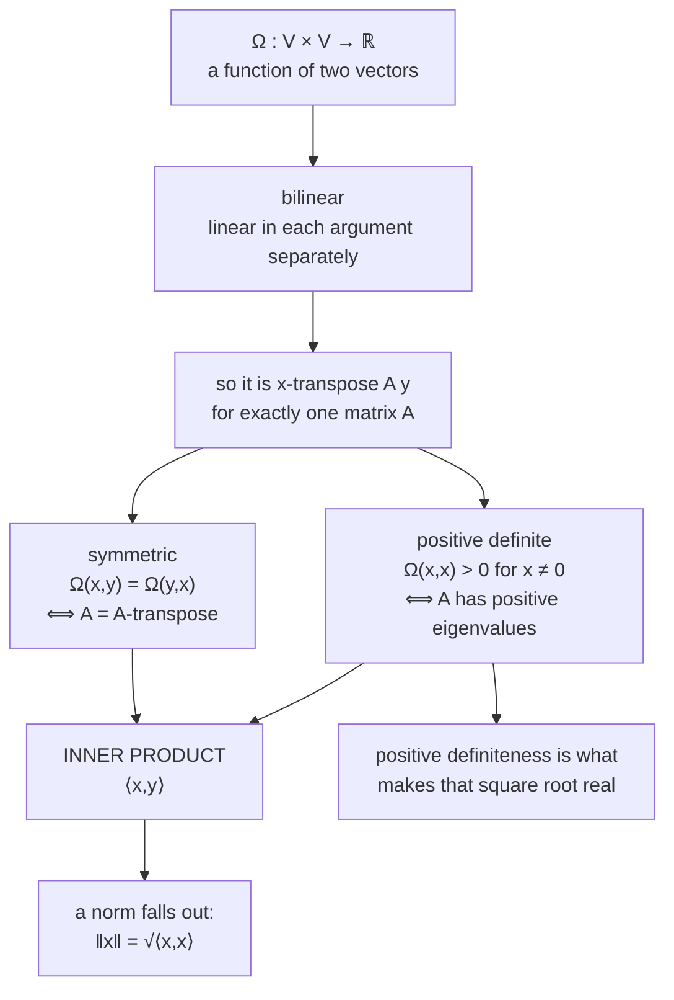

import DataCampExercise from "../../../../components/DataCampExercise.astro";
import Figure from "../../../../components/Figure.astro";
import MatrixLab from "../../../../components/viz/math/MatrixLab.tsx";
import Quiz from "../../../../components/Quiz.astro";

The previous page measured one vector at a time. Everything else in this chapter needs a function of
**two** vectors — a way of asking how much they have in common — and once you have one, length,
distance, angle and orthogonality all follow without further assumptions.

You already know one such function: the dot product $\mathbf{x}^\top\mathbf{y}$. This page shows what
the dot product is an *instance of*, and why the general version is not an abstraction for its own
sake — a covariance matrix, a kernel, and a Mahalanobis distance are all inner products that are not
the dot product.

## What you'll learn

- What a **bilinear mapping** is, and why bilinearity is the condition that makes matrix notation possible.
- The two extra conditions — **symmetry** and **positive definiteness** — and what each one buys.
- Why every inner product on $\mathbb{R}^n$ can be written $\mathbf{x}^\top\mathbf{A}\mathbf{y}$ for a **symmetric positive definite** matrix $\mathbf{A}$, and vice versa.
- How to **test** a candidate matrix, and why Cholesky is the test to reach for rather than eigenvalues.
- The book's Example 3.4, where changing one entry from 5 to 3 destroys the whole structure — and the exact value of that entry at which it breaks.

## Intuition: a scoring rule for agreement

Think of an inner product as a scoring rule that takes two vectors and returns how much they agree.
The dot product's version of "agree" is a specific one: multiply matching coordinates, add up. That
treats every coordinate as equally important and as entirely independent of the others.

Often neither is true. If your two coordinates are *height in metres* and *height in centimetres*,
the dot product double-counts what is really one measurement. If one coordinate is measured
carefully and the other is noise, the dot product weighs them the same. The general inner product is
what lets you say **which** coordinates matter and **how they interact** — and it does so with one
matrix:

$$
\langle \mathbf{x}, \mathbf{y} \rangle = \mathbf{x}^\top \mathbf{A}\, \mathbf{y}
$$

The diagonal of $\mathbf{A}$ sets how much each coordinate counts; the off-diagonal entries say how
much a unit of one coordinate is worth in the direction of another.



The rightmost node is the reason positive definiteness is not optional decoration. Length is going to
be defined as $\sqrt{\langle \mathbf{x},\mathbf{x}\rangle}$; if the inner product of a vector with
itself could be negative, that square root would be imaginary and there would be no geometry to do.

## The math

### Bilinearity

:::note[Bilinear mapping]
A mapping $\Omega : V \times V \to \mathbb{R}$ is **bilinear** if it is linear in each argument
separately: for all $\mathbf{x}, \mathbf{y}, \mathbf{z} \in V$ and $\lambda, \psi \in \mathbb{R}$,

$$
\Omega(\lambda\mathbf{x} + \psi\mathbf{y},\ \mathbf{z}) = \lambda\Omega(\mathbf{x},\mathbf{z}) + \psi\Omega(\mathbf{y},\mathbf{z})
$$

$$
\Omega(\mathbf{x},\ \lambda\mathbf{y} + \psi\mathbf{z}) = \lambda\Omega(\mathbf{x},\mathbf{y}) + \psi\Omega(\mathbf{x},\mathbf{z})
$$
:::

"Linear in each argument separately" is worth reading carefully. The map is *not* linear in the pair —
doubling both arguments quadruples the output, not doubles it. It is linear if you freeze one argument
and vary the other.

Bilinearity is what makes the matrix form possible. Fix an ordered basis
$B = (\mathbf{b}_1, \dots, \mathbf{b}_n)$ and expand
$\mathbf{x} = \sum_i \psi_i \mathbf{b}_i$, $\mathbf{y} = \sum_j \lambda_j \mathbf{b}_j$. Bilinearity
lets you pull both sums out:

$$
\langle \mathbf{x}, \mathbf{y} \rangle
= \left\langle \sum_{i=1}^{n}\psi_i \mathbf{b}_i,\ \sum_{j=1}^{n}\lambda_j \mathbf{b}_j \right\rangle
= \sum_{i=1}^{n}\sum_{j=1}^{n} \psi_i \langle \mathbf{b}_i, \mathbf{b}_j\rangle \lambda_j
= \hat{\mathbf{x}}^\top \mathbf{A}\, \hat{\mathbf{y}}
$$

with $A_{ij} = \langle \mathbf{b}_i, \mathbf{b}_j \rangle$ and $\hat{\mathbf{x}}, \hat{\mathbf{y}}$ the
coordinate vectors with respect to $B$. **The inner product is determined entirely by its values on
pairs of basis vectors** — $n^2$ numbers, and nothing else is needed.

### Symmetry and definiteness

:::note[Definition 3.2 / 3.3 — Inner product]
Let $\Omega$ be a bilinear mapping on $V$. Then $\Omega$ is

- **symmetric** if $\Omega(\mathbf{x},\mathbf{y}) = \Omega(\mathbf{y},\mathbf{x})$ for all $\mathbf{x}, \mathbf{y}$ — the order of the arguments does not matter;
- **positive definite** if $\forall \mathbf{x} \in V \setminus \{\mathbf{0}\}: \Omega(\mathbf{x},\mathbf{x}) > 0$ and $\Omega(\mathbf{0},\mathbf{0}) = 0$.

A **positive definite, symmetric bilinear mapping** $\Omega : V \times V \to \mathbb{R}$ is called an
**inner product** on $V$, written $\langle \mathbf{x}, \mathbf{y} \rangle$. The pair
$(V, \langle \cdot, \cdot \rangle)$ is an **inner product space**; if the inner product is the dot
product it is a **Euclidean vector space**.
:::

### The correspondence with SPD matrices

:::note[Definition 3.4 and Theorem 3.5]
A symmetric matrix $\mathbf{A} \in \mathbb{R}^{n \times n}$ satisfying

$$
\forall \mathbf{x} \in V\setminus\{\mathbf{0}\}: \quad \mathbf{x}^\top \mathbf{A}\,\mathbf{x} > 0
$$

is called **symmetric, positive definite** — SPD, or just positive definite.

**Theorem 3.5.** For a real-valued, finite-dimensional vector space $V$ with an ordered basis $B$, the
mapping $\langle\cdot,\cdot\rangle : V\times V \to \mathbb{R}$ is an inner product **if and only if**
there exists a symmetric positive definite matrix $\mathbf{A}$ with

$$
\langle \mathbf{x}, \mathbf{y}\rangle = \hat{\mathbf{x}}^\top \mathbf{A}\, \hat{\mathbf{y}} .
$$
:::

That "if and only if" is the practical content of the section. It means:

- Every inner product you will ever meet on $\mathbb{R}^n$ **is** a matrix. There is no exotic case hiding.
- Testing whether a candidate is an inner product reduces to testing whether one matrix is SPD.
- The dot product is the case $\mathbf{A} = \mathbf{I}$, which is why it treats coordinates as independent and equally weighted.

Two further properties of an SPD matrix, both stated in the book:

- Its **null space is trivial** — $\mathbf{A}\mathbf{x} = \mathbf{0}$ only for $\mathbf{x} = \mathbf{0}$, since otherwise $\mathbf{x}^\top\mathbf{A}\mathbf{x} = 0$ for a nonzero $\mathbf{x}$.
- Its **diagonal entries are positive**, because $\mathbf{e}_i^\top \mathbf{A} \mathbf{e}_i = A_{ii} > 0$.

Neither is sufficient. A matrix can have a positive diagonal and a trivial null space and still fail —
which is exactly what the next section demonstrates.

:::tip[From the book]
Section 3.2. Bilinearity is Equations 3.6 and 3.7; Definition 3.2 gives symmetry and positive
definiteness (Equation 3.8), Definition 3.3 the inner product, inner product space and Euclidean
vector space. Example 3.3 gives a non-dot-product inner product on $\mathbb{R}^2$ (Equation 3.9).
Section 3.2.3 develops the matrix form, Equations 3.10 and 3.11, with Definition 3.4 (SPD matrix),
Example 3.4 (Equations 3.12 to 3.13b), and Theorem 3.5 (Equation 3.15). A margin note reminds you
that the dot product is only *one* particular inner product, and the book's default.
:::

## Worked example by hand

The book's **Example 3.4**. Two matrices, identical except for a single entry:

$$
\mathbf{A}_1 = \begin{bmatrix} 9 & 6 \\ 6 & 5 \end{bmatrix},
\qquad
\mathbf{A}_2 = \begin{bmatrix} 9 & 6 \\ 6 & 3 \end{bmatrix}
$$

Both are symmetric. Both have positive diagonals. One is an inner product and one is not.

**Completing the square** is the honest way to see it. For $\mathbf{A}_1$:

$$
\mathbf{x}^\top\mathbf{A}_1\mathbf{x} = 9x_1^2 + 12x_1x_2 + 5x_2^2 = (3x_1 + 2x_2)^2 + x_2^2
$$

Check the expansion: $(3x_1+2x_2)^2 = 9x_1^2 + 12x_1x_2 + 4x_2^2$, and adding $x_2^2$ gives $5x_2^2$ in
the last term. Both summands are squares, so the total is $\geq 0$, and it is $0$ only when
$x_2 = 0$ and $3x_1 = 0$ — that is, only at the origin. **Positive definite.**

For $\mathbf{A}_2$:

$$
\mathbf{x}^\top\mathbf{A}_2\mathbf{x} = 9x_1^2 + 12x_1x_2 + 3x_2^2 = (3x_1 + 2x_2)^2 - x_2^2
$$

Now the second term is *subtracted*, and there is nothing stopping it from winning. The book's
witness is $\mathbf{x} = (2, -3)^\top$:

$$
(3\cdot 2 + 2\cdot(-3))^2 - (-3)^2 = (6-6)^2 - 9 = 0 - 9 = -9 < 0
$$

**Not positive definite**, and therefore not an inner product. Under $\mathbf{A}_2$ the vector
$(2,-3)$ would have squared length $-9$, so its "length" would be $3i$.

### Where exactly does it break?

Vary the lower-right entry $a$ and keep the rest:
$\mathbf{A}(a) = \begin{bmatrix} 9 & 6 \\ 6 & a \end{bmatrix}$. Completing the square gives
$(3x_1 + 2x_2)^2 + (a-4)x_2^2$, so positive definiteness needs $a > 4$ — and the determinant
$9a - 36$ agrees, changing sign at exactly $a = 4$.

| $a$ | $\det \mathbf{A}(a)$ | smallest eigenvalue | verdict |
| --- | --- | --- | --- |
| 5.0 | $+9.0000$ | $+0.675445$ | SPD — the book's $\mathbf{A}_1$ |
| 4.5 | $+4.5000$ | $+0.341997$ | SPD |
| **4.0** | $0.0000$ | $0.000000$ | **the boundary — positive semidefinite, not definite** |
| 3.5 | $-4.5000$ | $-0.350189$ | indefinite |
| 3.0 | $-9.0000$ | $-0.708204$ | indefinite — the book's $\mathbf{A}_2$ |

At $a = 4$ the matrix is only *semi*definite: $\mathbf{x}^\top\mathbf{A}\mathbf{x} = 0$ for
$\mathbf{x} = (2,-3)$ without $\mathbf{x}$ being zero. That fails Definition 3.2, and it fails in a way
that matters downstream — a nonzero vector of length zero breaks the positive-definiteness of the
induced norm too.

### The book's other inner product

**Example 3.3** defines, on $\mathbb{R}^2$,

$$
\langle \mathbf{x}, \mathbf{y}\rangle := x_1y_1 - (x_1y_2 + x_2y_1) + 2x_2y_2
$$

which in matrix form is $\mathbf{A} = \begin{bmatrix} 1 & -1 \\ -1 & 2\end{bmatrix}$, with eigenvalues
$0.381966$ and $2.618034$ — both positive, so this really is an inner product. And it disagrees with
the dot product about more than magnitude. Take $\mathbf{x} = (1,2)$ and $\mathbf{y} = (3,-1)$:

$$
\mathbf{x}^\top\mathbf{y} = 3 - 2 = +1,
\qquad
\langle \mathbf{x}, \mathbf{y}\rangle = 3 - (-1 + 6) + 2(-2) = 3 - 5 - 4 = -6
$$

Different **sign**. Under the dot product these two vectors are (weakly) pointing the same way; under
Example 3.3's inner product they are pointing away from each other. Whatever "similar" means, it means
something relative to a choice.

```python title="example_34_and_33.py" showLineNumbers{1}
import numpy as np

A1 = np.array([[9.0, 6.0], [6.0, 5.0]])
A2 = np.array([[9.0, 6.0], [6.0, 3.0]])
A3 = np.array([[1.0, -1.0], [-1.0, 2.0]])   # Example 3.3

for name, A in (("A1", A1), ("A2", A2), ("Ex3.3", A3)):
    ev = np.linalg.eigvalsh(A)
    try:
        np.linalg.cholesky(A)
        chol = "succeeds"
    except np.linalg.LinAlgError:
        chol = "fails"
    print(f"{name:6} eig {np.round(ev, 6)}  det {np.linalg.det(A):+.4f}  "
          f"cholesky {chol}  spd {bool(np.all(ev > 0))}")

w = np.array([2.0, -3.0])
print("witness (2,-3):  A1 gives", float(w @ A1 @ w), " A2 gives", float(w @ A2 @ w))

x, y = np.array([1.0, 2.0]), np.array([3.0, -1.0])
print("dot product:", float(x @ y), "  Example 3.3:", float(x @ A3 @ y))
```

```text title="output"
A1     eig [ 0.675445 13.324555]  det +9.0000  cholesky succeeds  spd True
A2     eig [-0.708204 12.708204]  det -9.0000  cholesky fails  spd False
Ex3.3  eig [0.381966 2.618034]  det +1.0000  cholesky succeeds  spd True
witness (2,-3):  A1 gives 9.0  A2 gives -9.0
dot product: 1.0   Example 3.3: -6.0
```

## See it move

The first sketch is Example 3.4 with the broken entry on a knob. The background is the quadratic form
$\mathbf{x}^\top\mathbf{A}\mathbf{x}$ — green where it is positive, red where it is negative — and the
white curve is where it equals zero. Slide $a$ down through $4$ and watch the red wedge open.

```p5 title="One entry, and the whole structure collapses" desc="The field shows x-transpose A x for A = [[9, 6], [6, a]]. Green is positive, red is negative, and the white curve is the zero set. Above a = 4 the whole plane except the origin is green and A is an inner product. At exactly a = 4 the zero set becomes a line through the origin. Below it a negative wedge opens and A is no longer an inner product." height="470"
let aVal = 5.0;
let KNOBS = [], dragging = null;
const U = 34, STEP = 6;
let cx, cy;

function setup() { createCanvas(600, 470); textFont("monospace"); noSmooth(); cx = 300; cy = 190; }

function sx(x) { return cx + x * U; }
function sy(y) { return cy - y * U; }

function form(x, y, a) { return 9 * x * x + 12 * x * y + a * y * y; }

function knob(id, x, y, w, value, mn, mx, label) {
  KNOBS.push({ id, x, y, w, mn, mx });
  const t = (value - mn) / (mx - mn);
  stroke(60, 74, 92); strokeWeight(2); line(x, y, x + w, y);
  // Mark the critical value a = 4 on the track.
  const tc = (4.0 - mn) / (mx - mn);
  stroke(232, 110, 110); strokeWeight(2); line(x + tc * w, y - 7, x + tc * w, y + 7);
  noStroke(); fill(255, 211, 67); ellipse(x + t * w, y, 11, 11);
  fill(190, 200, 212); textSize(11); textAlign(LEFT, CENTER);
  text(label, x + w + 10, y);
}
function mousePressed() {
  for (const k of KNOBS) {
    if (mouseY > k.y - 12 && mouseY < k.y + 12 && mouseX > k.x - 12 && mouseX < k.x + k.w + 12) {
      dragging = k; return;
    }
  }
}
function mouseReleased() { dragging = null; }
function mouseDragged() {
  if (!dragging) return;
  const t = Math.min(1, Math.max(0, (mouseX - dragging.x) / dragging.w));
  aVal = dragging.mn + t * (dragging.mx - dragging.mn);
  if (!isLooping()) redraw();
}

function draw() {
  background(13, 17, 23);
  KNOBS = [];

  // The field, on a coarse grid so it stays cheap.
  noStroke();
  let span = 1;
  for (let py = 0; py < 380; py += STEP) {
    for (let px = 0; px < width; px += STEP) {
      const x = (px + STEP / 2 - cx) / U, y = (cy - py - STEP / 2) / U;
      span = Math.max(span, Math.abs(form(x, y, aVal)));
    }
  }
  for (let py = 0; py < 380; py += STEP) {
    for (let px = 0; px < width; px += STEP) {
      const x = (px + STEP / 2 - cx) / U, y = (cy - py - STEP / 2) / U;
      const v = form(x, y, aVal);
      const t = Math.min(1, Math.abs(v) / span);
      if (v >= 0) fill(30 + 90 * t, 60 + 140 * t, 40 + 100 * t);
      else fill(60 + 172 * t, 25 + 85 * t, 30 + 80 * t);
      rect(px, py, STEP, STEP);
    }
  }

  // The zero set: 9x^2 + 12xy + a y^2 = 0, i.e. y/x from the quadratic formula.
  const disc = 144 - 36 * aVal;
  stroke(245); strokeWeight(1.8);
  if (disc >= 0) {
    for (const sgn of [1, -1]) {
      // The zero set is a pair of lines y = m x. Dividing the form by x^2 gives
      // a*m^2 + 12*m + 9 = 0, so m comes from the quadratic formula in a.
      const m = aVal === 0 ? -0.75 : (-12 + sgn * Math.sqrt(disc)) / (2 * aVal);
      line(sx(-9), sy(-9 * m), sx(9), sy(9 * m));
    }
  }

  stroke(120, 130, 145); strokeWeight(1.2);
  line(sx(-9), sy(0), sx(9), sy(0)); line(sx(0), sy(-6), sx(0), sy(6));

  // The book's witness.
  const wv = form(2, -3, aVal);
  noStroke(); fill(255, 211, 67); ellipse(sx(2), sy(-3), 12, 12);
  fill(255, 211, 67); textSize(11); textAlign(LEFT, TOP);
  text(`(2,-3): ${wv.toFixed(2)}`, sx(2) + 10, sy(-3) - 6);

  // Eigenvalues of [[9,6],[6,a]] in closed form.
  const tr = 9 + aVal, det = 9 * aVal - 36;
  const root = Math.sqrt(Math.max(0, tr * tr - 4 * det));
  const l1 = (tr - root) / 2, l2 = (tr + root) / 2;
  const spd = l1 > 1e-12;

  knob("a", 30, 402, 220, aVal, 1.0, 9.0, `a = ${aVal.toFixed(2)}`);

  noStroke(); textAlign(LEFT, TOP);
  fill(255, 211, 67); textSize(14); text("A = [[9, 6], [6, a]] - drag a", 20, 12);
  fill(215); textSize(11);
  text(`det A = 9a - 36 = ${det.toFixed(2)}`, 20, 430);
  text(`eigenvalues ${l1.toFixed(4)}, ${l2.toFixed(4)}`, 20, 448);
  textAlign(RIGHT, TOP);
  fill(spd ? color(120, 200, 140) : color(232, 110, 110)); textSize(13);
  text(spd ? "positive definite: an inner product" : "NOT positive definite: not an inner product",
       width - 18, 430);
  fill(150); textSize(10);
  text("red tick on the track marks a = 4", width - 18, 450);
}
```

The second sketch is the payoff: the same two vectors, and an inner product you control. Drag the
matrix entries and watch the inner product's sign flip while the arrows do not move at all.

```p5 title="The same two arrows, an inner product you control" desc="Drag x and y, and drag the three entries of the symmetric matrix A. The readout gives x-transpose A y and the two induced lengths. The dashed grey curve is the set of vectors A calls unit length. Nothing about the arrows changes when you move A, and yet the number and even its sign do." height="500"
let xv = [1.0, 2.0], yv = [3.0, -1.0];
let a11 = 1.0, a12 = -1.0, a22 = 2.0;
let KNOBS = [], dragging = null, dragVec = null;
const U = 44;
let cx, cy;

function setup() { createCanvas(600, 500); textFont("monospace"); cx = 240; cy = 190; }

function sx(x) { return cx + x * U; }
function sy(y) { return cy - y * U; }
function dx_(s) { return (s - cx) / U; }
function dy_(s) { return (cy - s) / U; }

function ip(p, q) {
  return a11 * p[0] * q[0] + a12 * (p[0] * q[1] + p[1] * q[0]) + a22 * p[1] * q[1];
}

function knob(id, x, y, w, value, mn, mx, label) {
  KNOBS.push({ id, x, y, w, mn, mx });
  const t = (value - mn) / (mx - mn);
  stroke(60, 74, 92); strokeWeight(2); line(x, y, x + w, y);
  noStroke(); fill(255, 211, 67); ellipse(x + t * w, y, 10, 10);
  fill(190, 200, 212); textSize(11); textAlign(LEFT, CENTER);
  text(label, x + w + 10, y);
}
function mousePressed() {
  for (const k of KNOBS) {
    if (mouseY > k.y - 11 && mouseY < k.y + 11 && mouseX > k.x - 11 && mouseX < k.x + k.w + 11) {
      dragging = k; return;
    }
  }
  if (dist(mouseX, mouseY, sx(xv[0]), sy(xv[1])) < 20) dragVec = "x";
  else if (dist(mouseX, mouseY, sx(yv[0]), sy(yv[1])) < 20) dragVec = "y";
}
function mouseReleased() { dragging = null; dragVec = null; }
function mouseDragged() {
  if (dragging) {
    const t = Math.min(1, Math.max(0, (mouseX - dragging.x) / dragging.w));
    const v = dragging.mn + t * (dragging.mx - dragging.mn);
    if (dragging.id === "a11") a11 = v;
    if (dragging.id === "a12") a12 = v;
    if (dragging.id === "a22") a22 = v;
  } else if (dragVec) {
    const target = dragVec === "x" ? xv : yv;
    target[0] = Math.max(-3.6, Math.min(3.6, dx_(mouseX)));
    target[1] = Math.max(-2.6, Math.min(2.6, dy_(mouseY)));
  }
  if (!isLooping()) redraw();
}

function arrow(x1, y1, x2, y2, c, w) {
  stroke(c); strokeWeight(w); line(x1, y1, x2, y2);
  push(); translate(x2, y2); rotate(Math.atan2(y2 - y1, x2 - x1));
  fill(c); noStroke(); triangle(0, 0, -9, -4, -9, 4); pop();
}

function draw() {
  background(13, 17, 23);
  KNOBS = [];

  stroke(32, 44, 58); strokeWeight(1);
  for (let g = -5; g <= 8; g++) line(sx(g), sy(-4), sx(g), sy(4));
  for (let g = -4; g <= 4; g++) line(sx(-5), sy(g), sx(8), sy(g));
  stroke(58, 72, 88); strokeWeight(1.4);
  line(sx(-5), sy(0), sx(8), sy(0)); line(sx(0), sy(-4), sx(0), sy(4));

  const det = a11 * a22 - a12 * a12;
  const tr = a11 + a22;
  const root = Math.sqrt(Math.max(0, tr * tr - 4 * det));
  const l1 = (tr - root) / 2, l2 = (tr + root) / 2;
  const spd = l1 > 1e-9;

  // The set A calls unit length, drawn only when A is actually definite.
  if (spd) {
    noFill(); stroke(120, 130, 145); strokeWeight(1.4);
    drawingContext.setLineDash([5, 4]);
    beginShape();
    for (let i = 0; i <= 200; i++) {
      const th = (i / 200) * TWO_PI;
      const d = [Math.cos(th), Math.sin(th)];
      const r = 1 / Math.sqrt(ip(d, d));
      vertex(sx(r * d[0]), sy(r * d[1]));
    }
    endShape(CLOSE);
    drawingContext.setLineDash([]);
  }

  arrow(sx(0), sy(0), sx(xv[0]), sy(xv[1]), color(255, 211, 67), 2.8);
  arrow(sx(0), sy(0), sx(yv[0]), sy(yv[1]), color(75, 139, 190), 2.8);
  noStroke(); fill(255, 211, 67); ellipse(sx(xv[0]), sy(xv[1]), 11, 11);
  fill(75, 139, 190); ellipse(sx(yv[0]), sy(yv[1]), 11, 11);
  textSize(12); textAlign(LEFT, TOP);
  fill(255, 211, 67); text("x", sx(xv[0]) + 9, sy(xv[1]) - 18);
  fill(75, 139, 190); text("y", sx(yv[0]) + 9, sy(yv[1]) - 18);

  knob("a11", 30, 388, 150, a11, -2, 4, `a11 = ${a11.toFixed(2)}`);
  knob("a12", 30, 414, 150, a12, -3, 3, `a12 = a21 = ${a12.toFixed(2)}`);
  knob("a22", 30, 440, 150, a22, -2, 4, `a22 = ${a22.toFixed(2)}`);

  const val = ip(xv, yv);
  const lx = ip(xv, xv), ly = ip(yv, yv);

  noStroke(); textAlign(LEFT, TOP);
  fill(255, 211, 67); textSize(14); text("Drag the arrows and the matrix", 20, 12);
  fill(215); textSize(12);
  text(`<x, y> = ${val.toFixed(4)}`, 350, 40);
  fill(val > 0 ? color(120, 200, 140) : val < 0 ? color(232, 110, 110) : color(200));
  textSize(11);
  text(val > 0 ? "same general direction" : val < 0 ? "opposing directions" : "orthogonal", 350, 60);
  fill(215); textSize(11);
  text(`<x,x> = ${lx.toFixed(3)}`, 350, 84);
  text(`<y,y> = ${ly.toFixed(3)}`, 350, 102);
  text(`||x|| = ${lx >= 0 ? Math.sqrt(lx).toFixed(4) : "imaginary"}`, 350, 124);
  text(`||y|| = ${ly >= 0 ? Math.sqrt(ly).toFixed(4) : "imaginary"}`, 350, 142);
  fill(150); textSize(10);
  text(`det A = ${det.toFixed(3)}   eig ${l1.toFixed(3)}, ${l2.toFixed(3)}`, 350, 168);
  fill(spd ? color(120, 200, 140) : color(232, 110, 110)); textSize(11);
  text(spd ? "A is SPD: a valid inner product" : "A is not SPD: not an inner product", 350, 188);
  fill(140); textSize(10);
  text(spd ? "dashed curve = vectors of length 1 under A" : "no unit set drawn: lengths are not all real",
       20, 470);
}
```

An inner product is a linear map's worth of information, so the matrix stepper from Chapter 2 applies
directly. Here it is on Example 3.3's matrix — note the eigenvalues it reports, which are the
definiteness test:

<MatrixLab
  client:visible
  matrix={[[1, -1], [-1, 2]]}
  probe={[1, 2]}
  title="Example 3.3's matrix, and why it qualifies"
  desc="Both eigenvalues are positive, so no direction gets flipped or flattened — which is exactly what positive definiteness means geometrically."
/>

## From scratch

Testing a candidate has three parts, and the third one has a good implementation and a bad one:

```python title="is_inner_product.py" showLineNumbers{1}
import numpy as np

def is_inner_product(A, tol=1e-12):
    """Test the conditions of Definition 3.2 on a candidate matrix A."""
    A = np.asarray(A, dtype=float)
    checks = {}

    # 1. Bilinearity is automatic for x^T A y. Any matrix gives a bilinear form;
    #    that is what the matrix form of Equation 3.10 means. Nothing to test.
    checks["bilinear"] = True

    # 2. Symmetry.
    checks["symmetric"] = bool(np.allclose(A, A.T, atol=tol))

    # 3. Positive definiteness. Cholesky is the right test: it succeeds exactly
    #    when the matrix is positive definite, so there is no tolerance to pick.
    #    Comparing eigenvalues to zero needs one, and the choice is where the
    #    semidefinite boundary case slips through.
    if not checks["symmetric"]:
        checks["positive definite"] = False
    else:
        try:
            np.linalg.cholesky(A)
            checks["positive definite"] = True
        except np.linalg.LinAlgError:
            checks["positive definite"] = False

    return all(checks.values()), checks

candidates = {
    "identity (the dot product)": np.eye(3),
    "A1 from Example 3.4": [[9, 6], [6, 5]],
    "A2 from Example 3.4": [[9, 6], [6, 3]],
    "the a = 4 boundary": [[9, 6], [6, 4]],
    "non-symmetric": [[2, 0], [1, 2]],
    "Example 3.3": [[1, -1], [-1, 2]],
}

for name, A in candidates.items():
    ok, detail = is_inner_product(A)
    print(f"{'YES' if ok else 'no':4} {name:28} "
          f"symmetric={detail['symmetric']}  definite={detail['positive definite']}")
```

```text title="output"
YES  identity (the dot product)   symmetric=True  definite=True
YES  A1 from Example 3.4          symmetric=True  definite=True
no   A2 from Example 3.4          symmetric=True  definite=False
no   the a = 4 boundary           symmetric=True  definite=False
no   non-symmetric                symmetric=False  definite=False
YES  Example 3.3                  symmetric=True  definite=True
```

Six candidates, three accepted. The instructive rejection is the fourth, and it is worth checking why
the naive test disagrees:

```python title="why_cholesky.py" showLineNumbers{1}
import numpy as np

boundary = np.array([[9.0, 6.0], [6.0, 4.0]])
print("eigenvalues:", np.round(np.linalg.eigvalsh(boundary), 12))
print("a >= 0 test would accept it:", bool(np.all(np.linalg.eigvalsh(boundary) >= 0)))
print("cholesky accepts it:", end=" ")
try:
    np.linalg.cholesky(boundary)
    print(True)
except np.linalg.LinAlgError:
    print(False)

w = np.array([2.0, -3.0])
print("but (2,-3) has squared length", float(w @ boundary @ w), "while being nonzero")
```

```text title="output"
eigenvalues: [ 0. 13.]
a >= 0 test would accept it: True
cholesky accepts it: False
but (2,-3) has squared length 0.0 while being nonzero
```

The eigenvalues at the boundary are exactly $0$ and $13$, so `np.all(eigvalsh(A) >= 0)` returns `True`
and a nonzero vector nevertheless has length zero. That is positive *semi*definiteness, and Definition
3.2 asks for the strict version. Cholesky tests the strict version by construction — it is the test to
reach for, and it happens to be about twice as fast as an eigendecomposition as well.

One more thing the run shows: the shear is rejected on **symmetry**, before definiteness is ever
examined. It is worth knowing that its symmetric part
$\tfrac{1}{2}(\mathbf{A}+\mathbf{A}^\top) = \begin{bmatrix}2 & 0.5 \\ 0.5 & 2\end{bmatrix}$ *is*
positive definite, so the shear gives a perfectly positive quadratic form
$\mathbf{x}^\top\mathbf{A}\mathbf{x}$ while still failing to be an inner product. Definiteness of the
form is not enough; the matrix itself has to be symmetric, or the two arguments are not
interchangeable.

## On real data

<Figure
  src="/images/mml/inner-products/spd-or-not"
  alt="Two filled-contour panels of the quadratic form for the two matrices of Example 3.4, drawn on a red-blue diverging scale with the zero contour marked. The left panel is entirely one sign; the right has a wedge of the opposite sign containing a marked point at (2, -3)."
  title="Example 3.4, as a surface"
  caption="A1 has eigenvalues 0.675 and 13.325 and never goes negative. A2 has eigenvalues -0.708 and 12.708, and the shaded wedge is where a vector would have negative squared length. The marked point is the book's witness, at which the form equals exactly -9."
/>

<Figure
  src="/images/mml/inner-products/induced-unit-circles"
  alt="Three closed curves on one pair of axes — a circle, a tilted ellipse and an axis-aligned ellipse — with an arrow to the point (1, 1) and a table of its three measured lengths."
  title="Three inner products, three meanings of length one"
  caption="The point (1, 1) has length 1.4142 under the dot product, exactly 1.0000 under the book's Equation 3.19, and 1.7321 under diag(2, 1). It lies exactly on the amber curve, which is what makes it a unit vector under that inner product and not under the others."
/>

## Reading the plot

**From the surface plot.** The interesting feature of $\mathbf{A}_2$'s panel is not that a negative
region exists but that it is a **wedge through the origin**, not a bounded blob. Positive definiteness
is a statement about directions rather than about magnitudes: the form is homogeneous of degree two, so
if it is negative at $\mathbf{x}$ it is negative along the whole line through $\mathbf{x}$, scaled by
$\lambda^2$. The negative eigenvalue $-0.708204$ is the value of the form at its own
eigenvector, and that is the most negative value any *unit* vector can produce. The book's
witness $(2,-3)$ is a different direction in the same wedge — normalised, it scores $-0.692308$,
which is close to the extreme without being it.

Note also that $\mathbf{A}_2$'s largest eigenvalue is $12.708$ — comfortably positive. A single
negative eigenvalue among positives is enough. There is no "mostly positive definite".

**From the unit sets.** The three curves have the same centre and enclose the point $(1,1)$ to
different depths, which is the visual form of the statement that the same vector has three lengths.
More usefully: the *shape* tells you what the inner product cares about. The axis-aligned ellipse of
$\mathrm{diag}(2,1)$ is narrow in $x_1$, meaning $x_1$ is expensive — a small step in $x_1$ counts as
much length as a bigger step in $x_2$. The tilted ellipse of Equation 3.19 is stretched along the
diagonal $x_1 = x_2$, meaning that *agreement between the coordinates* is cheap: moving both together
costs less length than moving one alone. That is what a negative off-diagonal entry does, and it is
exactly the structure a covariance matrix has when two features are positively correlated.

## Pitfalls

:::danger[Positive diagonal is not positive definite]
$\mathbf{A}_2 = \begin{bmatrix}9&6\\6&3\end{bmatrix}$ has both diagonal entries positive and is still
not an inner product. Checking the diagonal is a *necessary* condition and people routinely treat it as
sufficient. The determinant of every leading submatrix being positive (Sylvester's criterion) is the
sufficient version; Cholesky is the sufficient version you should actually run.
:::

:::caution[Semidefinite is not definite, and the difference is not academic]
At $a = 4$ the matrix has eigenvalues $0$ and $13$. Every eigenvalue is non-negative, so
`np.all(eigvalsh(A) >= 0)` returns `True`. But the vector $(2,-3)$ then has squared length exactly
zero without being the zero vector, so the induced "norm" is not positive definite and the geometry
falls apart. Test with Cholesky, or test `> 0` rather than `>= 0` — and if you do the latter, be honest
about the tolerance you are choosing.
:::

:::caution[Symmetry is a real requirement, not a convenience]
For a non-symmetric $\mathbf{A}$, the form $\mathbf{x}^\top\mathbf{A}\mathbf{y}$ is still bilinear, and
$\mathbf{x}^\top\mathbf{A}\mathbf{x}$ is still well defined — but $\langle\mathbf{x},\mathbf{y}\rangle
\neq \langle\mathbf{y},\mathbf{x}\rangle$, so "the angle between $\mathbf{x}$ and $\mathbf{y}$" would
depend on the order you named them. Note also that only the symmetric part of $\mathbf{A}$ affects
$\mathbf{x}^\top\mathbf{A}\mathbf{x}$, so a non-symmetric matrix and its symmetrisation
$\tfrac{1}{2}(\mathbf{A}+\mathbf{A}^\top)$ give the same quadratic form — which is why the definiteness
test starts by insisting on symmetry.
:::

:::caution[An inner product is bilinear, which means it is not linear]
$\langle 2\mathbf{x}, 2\mathbf{y}\rangle = 4\langle\mathbf{x},\mathbf{y}\rangle$. Doubling both
arguments quadruples the result. This trips people up when normalising: scaling a dataset by $c$ scales
its Gram matrix by $c^2$, not by $c$.
:::

:::caution[Estimated covariance matrices are often only semidefinite]
The natural inner product on centred data is $\langle\mathbf{x},\mathbf{y}\rangle =
\mathbf{x}^\top \Sigma^{-1}\mathbf{y}$, and $\Sigma$ estimated from $n$ samples in $d$ dimensions has
rank at most $\min(n-1, d)$. With fewer samples than features it is singular, $\Sigma^{-1}$ does not
exist, and no amount of care about the mathematics will save the call. This is why practical code adds a
ridge $\Sigma + \varepsilon\mathbf{I}$ — the same "jitter term" the book mentions in §3.8.2.
:::

## Compare

| candidate | matrix | inner product? | why |
| --- | --- | --- | --- |
| dot product | $\mathbf{I}$ | **yes** | symmetric, all eigenvalues $1$ |
| weighted dot | $\mathrm{diag}(w_1,\dots,w_n)$, $w_i > 0$ | **yes** | symmetric, eigenvalues are the weights |
| Example 3.3 | $\begin{bmatrix}1&-1\\-1&2\end{bmatrix}$ | **yes** | eigenvalues $0.382$, $2.618$ |
| Mahalanobis | $\Sigma^{-1}$ for invertible $\Sigma$ | **yes** | a covariance matrix of full rank is SPD, and so is its inverse |
| $\mathbf{A}_1$ | $\begin{bmatrix}9&6\\6&5\end{bmatrix}$ | **yes** | completing the square gives a sum of two squares |
| the $a=4$ boundary | $\begin{bmatrix}9&6\\6&4\end{bmatrix}$ | **no** | semidefinite: $(2,-3)$ has squared length $0$ |
| $\mathbf{A}_2$ | $\begin{bmatrix}9&6\\6&3\end{bmatrix}$ | **no** | $(2,-3)$ has squared length $-9$ |
| a shear | $\begin{bmatrix}2&0\\1&2\end{bmatrix}$ | **no** | not symmetric |

<Quiz
  title="Check your understanding"
  questions={[
    {
      q: "Theorem 3.5 says something stronger than 'matrices give inner products'. What is the extra content?",
      options: [
        "That inner products are always computable",
        "That the correspondence runs both ways: every inner product on a finite-dimensional real vector space with a fixed basis IS x-transpose A y for some symmetric positive definite A, so there are no other kinds",
        "That A must be the identity",
        "That every symmetric matrix gives an inner product",
      ],
      answer: 1,
      explain:
        "The 'if and only if' is what makes the test practical: checking a candidate reduces to checking whether one matrix is SPD, with no exotic cases to worry about. Note that plain symmetry is not enough — A2 of Example 3.4 is symmetric and fails.",
    },
    {
      q: "A2 = [[9, 6], [6, 3]] has positive diagonal entries and a trivial-looking structure. Why is it not an inner product?",
      options: [
        "Because it is not symmetric",
        "Because completing the square gives (3x1 + 2x2)^2 minus x2^2, and the witness (2, -3) makes that minus 9 — a nonzero vector with negative squared length",
        "Because its entries are too large",
        "Because its determinant is not 1",
      ],
      answer: 1,
      explain:
        "The determinant is -9 and the eigenvalues are -0.708 and 12.708. One negative eigenvalue among positive ones is enough; there is no partial credit for definiteness.",
    },
    {
      q: "Why does the from-scratch code use Cholesky rather than comparing eigenvalues to zero?",
      options: [
        "Cholesky is more accurate for eigenvalues",
        "Because Cholesky tests definiteness exactly, whereas an eigenvalue comparison needs a tolerance — and at the a = 4 boundary the eigenvalues are 0 and 13, so a >= 0 test wrongly accepts a matrix that Definition 3.2 rejects",
        "Because eigenvalues are not defined for non-symmetric matrices",
        "Cholesky also checks symmetry",
      ],
      answer: 1,
      explain:
        "It is also about twice as fast, but the correctness argument is the one that matters. Semidefinite is not definite, and the a = 4 case is exactly where the two tests disagree.",
    },
    {
      q: "Under the dot product, x = (1, 2) and y = (3, -1) have inner product +1. Under Example 3.3's inner product the value is -6. What should you conclude?",
      options: [
        "One of the two calculations is wrong",
        "Nothing follows — the two numbers measure different things, and whether two vectors 'agree' is a statement relative to a chosen inner product, including its sign",
        "The vectors must be orthogonal",
        "Example 3.3 is not a valid inner product",
      ],
      answer: 1,
      explain:
        "Example 3.3's matrix has eigenvalues 0.382 and 2.618, so it is a perfectly valid inner product. The sign flip is the point: cosine similarity, orthogonality and angle all inherit this relativity, which is what the next two pages develop.",
    },
  ]}
/>

## 🧪 Try It Yourself

### Exercise 1 – Test the three conditions

<DataCampExercise
  lang="python"
  hint={`Symmetry is np.allclose(A, A.T). Positive definiteness is a Cholesky factorisation that does not raise.`}
  code={`import numpy as np

def spd(A):
    A = np.asarray(A, dtype=float)
    if not np.allclose(A, A.T):
        return False
    try:
        np.linalg.cholesky(___)                # replace ___ with A
        return True
    except np.linalg.LinAlgError:
        return False

cases = {
    "A1  [[9,6],[6,5]]": [[9, 6], [6, 5]],
    "A2  [[9,6],[6,3]]": [[9, 6], [6, 3]],
    "a=4 [[9,6],[6,4]]": [[9, 6], [6, 4]],
    "shear [[2,0],[1,2]]": [[2, 0], [1, 2]],
}
for name, A in cases.items():
    print(f"{name:22} inner product? {spd(A)}")

# -- Expected output ------------------------------
# A1  [[9,6],[6,5]]      inner product? True
# A2  [[9,6],[6,3]]      inner product? False
# a=4 [[9,6],[6,4]]      inner product? False
# shear [[2,0],[1,2]]    inner product? False
# -------------------------------------------------`}
  solution={`import numpy as np

def spd(A):
    A = np.asarray(A, dtype=float)
    if not np.allclose(A, A.T):
        return False
    try:
        np.linalg.cholesky(A)
        return True
    except np.linalg.LinAlgError:
        return False

cases = {
    "A1  [[9,6],[6,5]]": [[9, 6], [6, 5]],
    "A2  [[9,6],[6,3]]": [[9, 6], [6, 3]],
    "a=4 [[9,6],[6,4]]": [[9, 6], [6, 4]],
    "shear [[2,0],[1,2]]": [[2, 0], [1, 2]],
}
for name, A in cases.items():
    print(f"{name:22} inner product? {spd(A)}")`}
  sct={`test_output_contains("A2  [[9,6],[6,3]]      inner product? False")
success_msg("Note the a = 4 case is rejected. Its eigenvalues are 0 and 13, so an 'all eigenvalues at least zero' test would have let it through.")`}
  height={250}
/>

### Exercise 2 – The worst direction, and the book's witness

<DataCampExercise
  lang="python"
  hint={`The direction that makes the form most negative is the eigenvector of the smallest eigenvalue, and on a unit vector the form equals that eigenvalue. The book's witness is a convenient integer vector in the same wedge, not the extreme one.`}
  code={`import numpy as np

A2 = np.array([[9.0, 6.0], [6.0, 3.0]])
vals, vecs = np.linalg.eigh(A2)

worst = vecs[:, ___]                          # replace ___ with 0 (smallest eigenvalue first)
print("smallest eigenvalue:", round(float(vals[0]), 6))
print("its eigenvector:    ", np.round(worst, 6))
print("form on that unit vector:", round(float(worst @ A2 @ worst), 6))

# The book's witness: an integer vector, also in the negative wedge.
w = np.array([2.0, -3.0])
w_hat = w / np.linalg.norm(w)
print("book's witness:", w, " form:", float(w @ A2 @ w))
print("normalised:    ", np.round(w_hat, 6),
      " form:", round(float(w_hat @ A2 @ w_hat), 6))
print("is it the extreme direction?", np.allclose(abs(w_hat), abs(worst)))

# -- Expected output ------------------------------
# smallest eigenvalue: -0.708204
# its eigenvector:     [ 0.525731 -0.850651]
# form on that unit vector: -0.708204
# book's witness: [ 2. -3.]  form: -9.0
# normalised:     [ 0.5547  -0.83205]  form: -0.692308
# is it the extreme direction? False
# -------------------------------------------------`}
  solution={`import numpy as np

A2 = np.array([[9.0, 6.0], [6.0, 3.0]])
vals, vecs = np.linalg.eigh(A2)

worst = vecs[:, 0]
print("smallest eigenvalue:", round(float(vals[0]), 6))
print("its eigenvector:    ", np.round(worst, 6))
print("form on that unit vector:", round(float(worst @ A2 @ worst), 6))

w = np.array([2.0, -3.0])
w_hat = w / np.linalg.norm(w)
print("book's witness:", w, " form:", float(w @ A2 @ w))
print("normalised:    ", np.round(w_hat, 6),
      " form:", round(float(w_hat @ A2 @ w_hat), 6))
print("is it the extreme direction?", np.allclose(abs(w_hat), abs(worst)))`}
  sct={`test_output_contains("form: -9.0")
test_output_contains("is it the extreme direction? False")
success_msg("Two useful facts at once. The form on a UNIT vector is bounded below by the smallest eigenvalue, -0.708204, and that bound is attained on its eigenvector. The book's (2,-3) is not that vector — it scores -9/13 = -0.692308 once normalised — which is the point: you do not need the worst direction to disprove positive definiteness, only any direction in the wedge.")`}
  height={300}
/>

### Exercise 3 – Bilinearity, symmetry, definiteness, all measured

<DataCampExercise
  lang="python"
  hint={`Build a guaranteed-SPD matrix as M M-transpose plus a multiple of the identity, then test linearity in the first argument on a random combination.`}
  code={`import numpy as np

rng = np.random.default_rng(4)
n = 4
M = rng.normal(size=(n, n))
A = M @ M.T + n * np.eye(n)

u, v, z = rng.normal(size=n), rng.normal(size=n), rng.normal(size=n)
a, b = 1.7, -0.6
ip = lambda p, q: float(p @ A @ q)

lin_gap = abs(ip(a * u + b * v, z) - (a * ip(u, z) + b * ip(___, z)))   # replace ___ with v
print("linear in 1st arg gap:", f"{lin_gap:.2e}")
print("symmetry gap:         ", f"{abs(ip(u, v) - ip(v, u)):.2e}")
print("positive definite:    ", bool(np.all(np.linalg.eigvalsh(A) > 0)),
      " <u,u> =", round(ip(u, u), 6))
print("bilinear, not linear:  <2u,2v>/<u,v> =", round(ip(2 * u, 2 * v) / ip(u, v), 6))

# -- Expected output ------------------------------
# linear in 1st arg gap: 0.00e+00
# symmetry gap:          2.66e-15
# positive definite:     True  <u,u> = 43.138628
# bilinear, not linear:  <2u,2v>/<u,v> = 4.0
# -------------------------------------------------`}
  solution={`import numpy as np

rng = np.random.default_rng(4)
n = 4
M = rng.normal(size=(n, n))
A = M @ M.T + n * np.eye(n)

u, v, z = rng.normal(size=n), rng.normal(size=n), rng.normal(size=n)
a, b = 1.7, -0.6
ip = lambda p, q: float(p @ A @ q)

lin_gap = abs(ip(a * u + b * v, z) - (a * ip(u, z) + b * ip(v, z)))
print("linear in 1st arg gap:", f"{lin_gap:.2e}")
print("symmetry gap:         ", f"{abs(ip(u, v) - ip(v, u)):.2e}")
print("positive definite:    ", bool(np.all(np.linalg.eigvalsh(A) > 0)),
      " <u,u> =", round(ip(u, u), 6))
print("bilinear, not linear:  <2u,2v>/<u,v> =", round(ip(2 * u, 2 * v) / ip(u, v), 6))`}
  sct={`test_output_contains("<2u,2v>/<u,v> = 4.0")
success_msg("The ratio is exactly 4, not 2. Bilinear means linear in each argument separately, so scaling both scales the output by the square.")`}
  height={280}
/>

### Exercise 4 – The Gram matrix of a basis

<DataCampExercise
  lang="python"
  hint={`Entry (i, j) of the Gram matrix is the inner product of basis vector i with basis vector j. That is B-transpose A B for the matrix B whose columns are the basis vectors.`}
  code={`import numpy as np

# An inner product, and a basis that is not the standard one.
A = np.array([[1.0, -1.0], [-1.0, 2.0]])         # Example 3.3
B = np.array([[1.0, 1.0], [0.0, 1.0]])           # columns b1 = (1,0), b2 = (1,1)

G = B.T @ ___ @ B                                 # replace ___ with A
print("Gram matrix of the basis under this inner product:")
print(G)
print("symmetric?", np.allclose(G, G.T))
print("still positive definite?", bool(np.all(np.linalg.eigvalsh(G) > 0)))
print("eigenvalues:", np.round(np.linalg.eigvalsh(G), 6))

# -- Expected output ------------------------------
# Gram matrix of the basis under this inner product:
# [[1. 0.]
#  [0. 1.]]
# symmetric? True
# still positive definite? True
# eigenvalues: [1. 1.]
# -------------------------------------------------`}
  solution={`import numpy as np

A = np.array([[1.0, -1.0], [-1.0, 2.0]])
B = np.array([[1.0, 1.0], [0.0, 1.0]])

G = B.T @ A @ B
print("Gram matrix of the basis under this inner product:")
print(G)
print("symmetric?", np.allclose(G, G.T))
print("still positive definite?", bool(np.all(np.linalg.eigvalsh(G) > 0)))
print("eigenvalues:", np.round(np.linalg.eigvalsh(G), 6))`}
  sct={`test_output_contains("[[1. 0.]")
success_msg("The Gram matrix is the identity — so under Example 3.3's inner product, (1,0) and (1,1) are an ORTHONORMAL basis. Which basis is orthonormal depends on the inner product, and that is the whole subject of section 3.5.")`}
  height={280}
/>

### Exercise 5 – Where does it break?

<DataCampExercise
  lang="python"
  hint={`For [[9, 6], [6, a]] the determinant is 9a - 36. Positive definiteness needs a positive determinant and a positive leading entry.`}
  code={`import numpy as np

for a in (5.0, 4.5, 4.0, 3.5, 3.0):
    A = np.array([[9.0, 6.0], [6.0, a]])
    det = float(np.linalg.det(A))
    lo = float(np.linalg.eigvalsh(A)[___])          # replace ___ with 0
    print(f"a={a}  det {det:+.4f}  smallest eigenvalue {lo:+.6f}  "
          f"spd {lo > 1e-12}")

print("boundary from the determinant: a =", 36 / 9)

# -- Expected output ------------------------------
# a=5.0  det +9.0000  smallest eigenvalue +0.675445  spd True
# a=4.5  det +4.5000  smallest eigenvalue +0.341997  spd True
# a=4.0  det +0.0000  smallest eigenvalue +0.000000  spd False
# a=3.5  det -4.5000  smallest eigenvalue -0.350189  spd False
# a=3.0  det -9.0000  smallest eigenvalue -0.708204  spd False
# boundary from the determinant: a = 4.0
# -------------------------------------------------`}
  solution={`import numpy as np

for a in (5.0, 4.5, 4.0, 3.5, 3.0):
    A = np.array([[9.0, 6.0], [6.0, a]])
    det = float(np.linalg.det(A))
    lo = float(np.linalg.eigvalsh(A)[0])
    print(f"a={a}  det {det:+.4f}  smallest eigenvalue {lo:+.6f}  "
          f"spd {lo > 1e-12}")

print("boundary from the determinant: a =", 36 / 9)`}
  sct={`test_output_contains("boundary from the determinant: a = 4.0")
success_msg("Exactly 4, from three independent routes: completing the square gives (3x1+2x2)^2 + (a-4)x2^2, the determinant 9a - 36 changes sign there, and the smallest eigenvalue crosses zero there.")`}
  height={300}
/>

## Recall card

- **An inner product is a bilinear, symmetric, positive definite function of two vectors**, and those three words are the entire definition.
- **Bilinear means linear in each argument separately** — scaling both arguments scales the result by the square, so an inner product is not a linear map.
- **Theorem 3.5 is an if and only if**: every inner product on a finite-dimensional real space is x-transpose A y for a symmetric positive definite A, and every such A gives one.
- **Positive definiteness is what makes the induced norm real**, since length is the square root of the inner product of a vector with itself.
- **A positive diagonal is necessary but not sufficient** — the book's second matrix of Example 3.4 has both diagonal entries positive and a witness of squared length minus nine.
- **Semidefinite is not definite**: at the boundary value the eigenvalues are zero and thirteen, and a nonzero vector has length zero. Test with Cholesky, not with eigenvalues compared to zero.
- **The dot product is the case where the matrix is the identity**, which is why it treats coordinates as independent and equally weighted.

**Next:** [Lengths and Distances](../lengths-and-distances/) — the first two things the inner product
hands you for free.
