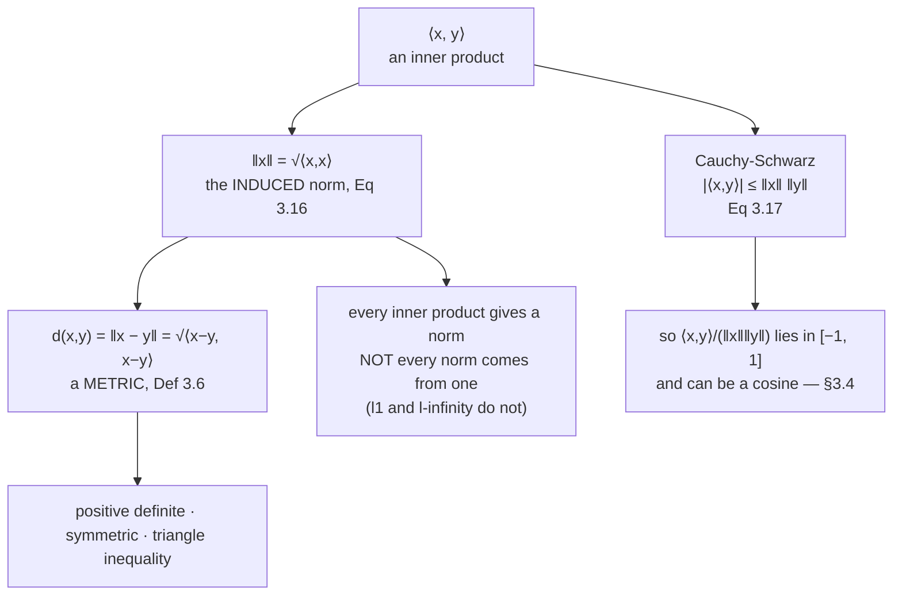

An inner product hands you two things immediately and for free. **Length** is the inner product of a
vector with itself, square-rooted. **Distance** is the length of a difference. Both definitions are one
line long, and between them they underpin every nearest-neighbour query, every clustering algorithm and
every loss function you will meet.

The free part deserves emphasis. You do not choose a norm and a distance separately from an inner
product — once the inner product is fixed, both are determined. Which means a change of inner product
silently changes what "close" means, and this page ends by measuring exactly how much.

## What you'll learn

- The **induced norm**, and the fact that every inner product gives a norm while not every norm comes from an inner product.
- The **Cauchy-Schwarz inequality**, why it is the thing that makes the cosine of an angle well defined, and when it holds with equality.
- The definition of a **metric** and its three axioms, and how they line up with the norm axioms.
- The book's Remark that an inner product and a metric **behave in opposite directions** — and why that is not a curiosity.
- The measured demonstration that $\ell_1$, $\ell_2$, $\ell_\infty$ and Mahalanobis distance disagree about which of nine candidates is nearest.

## Intuition: the ruler is built into the tape measure

Suppose someone hands you a device that, given two directions, reports how much they overlap. You can
build a ruler out of it without asking for anything else: to measure a stick, ask the device how much
the stick overlaps with *itself*. A long stick overlaps itself a lot.

That is exactly what the induced norm does, and the square root is there for the reason you would
expect — overlap-with-self scales with the *square* of length (an inner product is bilinear, so doubling
the vector quadruples the answer), so you take a square root to get back to something that scales
linearly.

Distance is then a second free step: the distance between two points is the length of the arrow from
one to the other.



The bottom-left node is the asymmetry to remember. Inner products are a strictly smaller world than
norms. The $\ell_1$ and $\ell_\infty$ norms of the previous page are genuine norms that no inner product
produces — which is why $\ell_1$ has no notion of angle attached to it and $\ell_2$ does.

## The math

### The induced norm

:::note[Equation 3.16 — the induced norm]
Every inner product induces a norm:

$$
\lVert \mathbf{x} \rVert := \sqrt{\langle \mathbf{x}, \mathbf{x}\rangle}
$$

This is well defined precisely because the inner product is **positive definite**: the quantity under
the root is positive for every nonzero $\mathbf{x}$ and zero only for $\mathbf{x} = \mathbf{0}$.
:::

Check the three norm axioms against it and each one comes from an inner product property:

| norm axiom | comes from |
| --- | --- |
| $\lVert\lambda\mathbf{x}\rVert = \lvert\lambda\rvert\lVert\mathbf{x}\rVert$ | bilinearity: $\langle\lambda\mathbf{x},\lambda\mathbf{x}\rangle = \lambda^2\langle\mathbf{x},\mathbf{x}\rangle$, then the square root |
| $\lVert\mathbf{x}\rVert \geq 0$, zero only at $\mathbf{0}$ | positive definiteness, directly |
| $\lVert\mathbf{x}+\mathbf{y}\rVert \leq \lVert\mathbf{x}\rVert + \lVert\mathbf{y}\rVert$ | Cauchy-Schwarz — see below |

The third one is not automatic, and Cauchy-Schwarz is exactly the tool that supplies it.

### Cauchy-Schwarz

:::note[Equation 3.17 — Cauchy-Schwarz inequality]
For an inner product vector space $(V, \langle\cdot,\cdot\rangle)$, the induced norm satisfies

$$
\lvert \langle \mathbf{x}, \mathbf{y}\rangle \rvert \;\leq\; \lVert\mathbf{x}\rVert\,\lVert\mathbf{y}\rVert
$$

with **equality if and only if $\mathbf{x}$ and $\mathbf{y}$ are parallel** — that is, one is a scalar
multiple of the other.
:::

Two consequences, and both matter.

**It makes the cosine possible.** Dividing through gives

$$
-1 \;\leq\; \frac{\langle\mathbf{x},\mathbf{y}\rangle}{\lVert\mathbf{x}\rVert\,\lVert\mathbf{y}\rVert} \;\leq\; 1
$$

and a number guaranteed to lie in $[-1,1]$ is a number you are allowed to call $\cos\omega$. Without
Cauchy-Schwarz, $\arccos$ of that ratio might not exist and §3.4 would have nothing to define.

**It gives the triangle inequality.** Expand and bound:

$$
\lVert\mathbf{x}+\mathbf{y}\rVert^2
= \langle\mathbf{x},\mathbf{x}\rangle + 2\langle\mathbf{x},\mathbf{y}\rangle + \langle\mathbf{y},\mathbf{y}\rangle
\;\leq\; \lVert\mathbf{x}\rVert^2 + 2\lVert\mathbf{x}\rVert\lVert\mathbf{y}\rVert + \lVert\mathbf{y}\rVert^2
= \big(\lVert\mathbf{x}\rVert + \lVert\mathbf{y}\rVert\big)^2
$$

The single inequality step replaces $\langle\mathbf{x},\mathbf{y}\rangle$ by
$\lVert\mathbf{x}\rVert\lVert\mathbf{y}\rVert$, which is Cauchy-Schwarz, and taking square roots
finishes it.

### Distance and metrics

:::note[Definition 3.6 — Distance and metric]
For an inner product space $(V, \langle\cdot,\cdot\rangle)$, the **distance** between
$\mathbf{x}, \mathbf{y} \in V$ is

$$
d(\mathbf{x}, \mathbf{y}) := \lVert \mathbf{x} - \mathbf{y}\rVert = \sqrt{\langle \mathbf{x}-\mathbf{y},\ \mathbf{x}-\mathbf{y}\rangle}
$$

If the inner product is the dot product this is the **Euclidean distance**. The mapping

$$
d : V \times V \to \mathbb{R}, \qquad (\mathbf{x},\mathbf{y}) \mapsto d(\mathbf{x},\mathbf{y})
$$

is called a **metric**, and satisfies:

| axiom | statement |
| --- | --- |
| positive definite | $d(\mathbf{x},\mathbf{y}) \geq 0$, and $d(\mathbf{x},\mathbf{y}) = 0 \iff \mathbf{x} = \mathbf{y}$ |
| symmetric | $d(\mathbf{x},\mathbf{y}) = d(\mathbf{y},\mathbf{x})$ |
| triangle inequality | $d(\mathbf{x},\mathbf{z}) \leq d(\mathbf{x},\mathbf{y}) + d(\mathbf{y},\mathbf{z})$ |
:::

Note that a metric needs *only* these three. It does not need to come from a norm, let alone from an
inner product — edit distance on strings and shortest-path distance on a graph are metrics with no
vectors in sight. The hierarchy runs one way:

$$
\text{inner products} \subset \text{norms} \subset \text{metrics}
$$

### The remark worth pausing on

The book adds a Remark that the inner product and the metric **behave in opposite directions**. Two
vectors that are *similar* have a **large** inner product and a **small** distance; two that are
dissimilar have a small inner product and a large distance.

This is not a curiosity, it is a recurring source of sign errors. A similarity has to be *negated* or
*inverted* to be used as a distance, and code that treats an inner product as a distance will
confidently return the farthest point when asked for the nearest. Note also that the correspondence is
not a simple negation — expanding

$$
\lVert\mathbf{x}-\mathbf{y}\rVert^2 = \lVert\mathbf{x}\rVert^2 - 2\langle\mathbf{x},\mathbf{y}\rangle + \lVert\mathbf{y}\rVert^2
$$

shows that the distance depends on the inner product **and** on both lengths. Ranking by inner product
and ranking by distance agree only when all the vectors have the same length, which is exactly the
normalisation that turns a dot product into a cosine.

:::tip[From the book]
Section 3.3. The induced norm is Equation 3.16 and Cauchy-Schwarz Equation 3.17. Example 3.5
(Equations 3.18 to 3.20) measures $\mathbf{x} = (1,1)^\top$ under two different inner products.
Definition 3.6 gives distance and metric (Equation 3.21), with Equations 3.22 and 3.23 for the
symmetry and triangle-inequality properties. The Remark about inner products and metrics behaving in
opposite directions closes the section.
:::

## Worked example by hand

### Example 3.5 from the book

Take $\mathbf{x} = (1,1)^\top \in \mathbb{R}^2$. Under the **dot product**:

$$
\lVert\mathbf{x}\rVert = \sqrt{\mathbf{x}^\top\mathbf{x}} = \sqrt{1^2 + 1^2} = \sqrt{2} \approx 1.414214
$$

Now take instead the inner product of the book's Equation 3.19,

$$
\langle\mathbf{x},\mathbf{y}\rangle := \mathbf{x}^\top\begin{bmatrix} 1 & -\frac{1}{2} \\ -\frac{1}{2} & 1\end{bmatrix}\mathbf{y}
= x_1y_1 - \tfrac{1}{2}\left(x_1y_2 + x_2y_1\right) + x_2y_2
$$

and the same vector measures

$$
\lVert\mathbf{x}\rVert = \sqrt{1 - \tfrac{1}{2}(1 + 1) + 1} = \sqrt{1 - 1 + 1} = \sqrt{1} = 1 .
$$

Exactly $1$, not approximately. The book's phrasing is that this inner product makes us "perceive"
$\mathbf{x}$ as **shorter** than the dot product does. The reason is the negative off-diagonal entry:
it subtracts a penalty proportional to $x_1x_2$, so vectors whose coordinates agree in sign are
discounted. Under this inner product, $(1,1)$ is a unit vector.

### The book's Exercise 3.3, worked

Compute the distance between $\mathbf{x} = (1,2,3)^\top$ and $\mathbf{y} = (-1,-1,0)^\top$ under two
inner products. First the difference:

$$
\mathbf{x} - \mathbf{y} = (2,\ 3,\ 3)^\top
$$

**(a) Dot product.** $\lVert(2,3,3)\rVert^2 = 4 + 9 + 9 = 22$, so
$d = \sqrt{22} \approx 4.690416$.

**(b) With $\mathbf{A} = \begin{bmatrix} 2&1&0\\1&3&-1\\0&-1&2\end{bmatrix}$.** First
$\mathbf{A}(\mathbf{x}-\mathbf{y})$, row by row:

| row | working | result |
| --- | --- | --- |
| 1 | $2(2) + 1(3) + 0(3)$ | $7$ |
| 2 | $1(2) + 3(3) + (-1)(3)$ | $8$ |
| 3 | $0(2) + (-1)(3) + 2(3)$ | $3$ |

Then $(2,3,3)\cdot(7,8,3) = 14 + 24 + 9 = 47$, so $d = \sqrt{47} \approx 6.855655$.

The second answer is larger, and $\mathbf{A}$ is a valid inner product: its eigenvalues are exactly
$1$, $2$ and $4$. So the same two points are $4.69$ apart under one geometry and $6.86$ apart under
another, and neither number is wrong.

```python title="worked_examples.py" showLineNumbers{1}
import numpy as np

# Example 3.5
x = np.array([1.0, 1.0])
E = np.array([[1.0, -0.5], [-0.5, 1.0]])
print("Example 3.5:  dot", np.sqrt(x @ x), " Eq 3.19", np.sqrt(x @ E @ x))

# Exercise 3.3
p = np.array([1.0, 2.0, 3.0])
q = np.array([-1.0, -1.0, 0.0])
d = p - q
A = np.array([[2.0, 1.0, 0.0], [1.0, 3.0, -1.0], [0.0, -1.0, 2.0]])
print("difference:", d)
print("A @ d     :", A @ d)
print("(a) dot   :", float(d @ d), "->", np.sqrt(float(d @ d)))
print("(b) A form:", float(d @ A @ d), "->", np.sqrt(float(d @ A @ d)))
print("A eigenvalues:", np.round(np.linalg.eigvalsh(A), 6),
      " spd:", bool(np.all(np.linalg.eigvalsh(A) > 0)))
```

```text title="output"
Example 3.5:  dot 1.4142135623730951  Eq 3.19 1.0
difference: [2. 3. 3.]
A @ d     : [7. 8. 3.]
(a) dot   : 22.0 -> 4.69041575982343
(b) A form: 47.0 -> 6.855654600401044
A eigenvalues: [1. 2. 4.]  spd: True
```

## See it move

The first sketch tests the triangle inequality by hand. Drag the waypoint and watch the detour bar; it
never falls below the direct bar, and it touches it exactly when the waypoint lies on the straight
segment.

```p5 title="A detour is never a shortcut" desc="Drag the waypoint y between the fixed endpoints x and z. The bars compare the direct distance with the detour through y. Use the metric knob to switch between l1, l2 and the maximum norm; the inequality holds for all three, but for l1 and l-infinity the set of waypoints achieving equality is much larger than the straight segment." height="470"
let wy = [0.4, 1.35];
let metric = 1;
let KNOBS = [], dragging = null, dragPoint = false;
const XA = [-2.2, -0.9], ZB = [2.4, 0.5];
const U = 62;
let cx, cy;
const NAMES = ["l1 (Manhattan)", "l2 (Euclidean)", "l-infinity (maximum)"];

function setup() { createCanvas(600, 470); textFont("monospace"); cx = 300; cy = 210; }

function sx(x) { return cx + x * U; }
function sy(y) { return cy - y * U; }
function dx_(s) { return (s - cx) / U; }
function dy_(s) { return (cy - s) / U; }

function dist(a, b) {
  const p = Math.abs(a[0] - b[0]), q = Math.abs(a[1] - b[1]);
  if (metric === 0) return p + q;
  if (metric === 2) return Math.max(p, q);
  return Math.sqrt(p * p + q * q);
}

function knob(id, x, y, w, value, mn, mx, label) {
  KNOBS.push({ id, x, y, w, mn, mx });
  const t = (value - mn) / (mx - mn);
  stroke(60, 74, 92); strokeWeight(2); line(x, y, x + w, y);
  for (let i = 0; i <= mx - mn; i++) {
    stroke(90, 104, 122); strokeWeight(1);
    line(x + (i / (mx - mn)) * w, y - 5, x + (i / (mx - mn)) * w, y + 5);
  }
  noStroke(); fill(255, 211, 67); ellipse(x + t * w, y, 11, 11);
  fill(190, 200, 212); textSize(11); textAlign(LEFT, CENTER);
  text(label, x + w + 12, y);
}
function mousePressed() {
  for (const k of KNOBS) {
    if (mouseY > k.y - 12 && mouseY < k.y + 12 && mouseX > k.x - 12 && mouseX < k.x + k.w + 12) {
      dragging = k; return;
    }
  }
  if (dist2(mouseX, mouseY, sx(wy[0]), sy(wy[1])) < 22) dragPoint = true;
}
function dist2(x1, y1, x2, y2) { return Math.hypot(x1 - x2, y1 - y2); }
function mouseReleased() { dragging = null; dragPoint = false; }
function mouseDragged() {
  if (dragging) {
    const t = Math.min(1, Math.max(0, (mouseX - dragging.x) / dragging.w));
    metric = Math.round(dragging.mn + t * (dragging.mx - dragging.mn));
  } else if (dragPoint) {
    wy = [Math.max(-3.5, Math.min(3.5, dx_(mouseX))), Math.max(-2.4, Math.min(2.4, dy_(mouseY)))];
  }
  if (!isLooping()) redraw();
}

function draw() {
  background(13, 17, 23);
  KNOBS = [];

  stroke(32, 44, 58); strokeWeight(1);
  for (let g = -4; g <= 4; g++) line(sx(g), sy(-2.6), sx(g), sy(2.6));
  for (let g = -2; g <= 2; g++) line(sx(-4), sy(g), sx(4), sy(g));
  stroke(58, 72, 88); strokeWeight(1.4);
  line(sx(-4), sy(0), sx(4), sy(0)); line(sx(0), sy(-2.6), sx(0), sy(2.6));

  const direct = dist(XA, ZB);
  const detour = dist(XA, wy) + dist(wy, ZB);
  const slack = detour - direct;
  const equal = slack < 1e-6;

  // Direct route.
  stroke(255, 211, 67); strokeWeight(3);
  line(sx(XA[0]), sy(XA[1]), sx(ZB[0]), sy(ZB[1]));
  // Detour.
  stroke(equal ? color(120, 200, 140) : color(75, 139, 190)); strokeWeight(2.2);
  line(sx(XA[0]), sy(XA[1]), sx(wy[0]), sy(wy[1]));
  line(sx(wy[0]), sy(wy[1]), sx(ZB[0]), sy(ZB[1]));

  noStroke();
  fill(230); ellipse(sx(XA[0]), sy(XA[1]), 12, 12);
  ellipse(sx(ZB[0]), sy(ZB[1]), 12, 12);
  fill(equal ? color(120, 200, 140) : color(75, 139, 190));
  ellipse(sx(wy[0]), sy(wy[1]), 13, 13);
  textSize(12); textAlign(LEFT, TOP);
  fill(230); text("x", sx(XA[0]) - 20, sy(XA[1]) + 4);
  text("z", sx(ZB[0]) + 10, sy(ZB[1]) - 20);
  fill(75, 139, 190); text("y (drag me)", sx(wy[0]) + 10, sy(wy[1]) - 20);

  // Bars.
  const bx = 30, by = 330, bw = 300;
  const scale = bw / Math.max(detour, direct, 0.001);
  noStroke();
  fill(255, 211, 67); rect(bx + 84, by, direct * scale, 15, 3);
  fill(equal ? color(120, 200, 140) : color(75, 139, 190)); rect(bx + 84, by + 24, detour * scale, 15, 3);
  fill(200); textSize(11); textAlign(LEFT, TOP);
  text("direct", bx, by + 1); text("detour", bx, by + 25);
  fill(255, 211, 67); text(direct.toFixed(4), bx + 92 + direct * scale, by + 1);
  fill(equal ? color(120, 200, 140) : color(75, 139, 190));
  text(detour.toFixed(4), bx + 92 + detour * scale, by + 25);

  knob("m", 30, 400, 200, metric, 0, 2, NAMES[metric]);

  textAlign(LEFT, TOP); noStroke();
  fill(255, 211, 67); textSize(14); text("Drag the waypoint", 20, 14);
  fill(equal ? color(120, 200, 140) : color(200)); textSize(12);
  text(`detour - direct = ${slack.toFixed(6)}`, 20, 432);
  fill(equal ? color(120, 200, 140) : color(150)); textSize(11);
  text(equal ? "equality: y is on a shortest path" : "strictly longer: y is off the shortest path",
       20, 452);
}
```

The second sketch is Example 3.5, made draggable. Two inner products, two unit sets, one vector, two
lengths.

```p5 title="Example 3.5: one vector, two lengths" desc="Drag x. The blue circle is the set of vectors the dot product calls unit length; the amber ellipse is the set Equation 3.19 calls unit length. The two readouts are the two lengths of the same arrow. At x = (1, 1) the amber value is exactly 1, which is the book's example." height="480"
let xv = [1.0, 1.0];
let dragPoint = false;
const U = 88;
let cx, cy;
// Equation 3.19 of the book.
const A = [[1.0, -0.5], [-0.5, 1.0]];

function setup() { createCanvas(600, 480); textFont("monospace"); cx = 290; cy = 210; }

function sx(x) { return cx + x * U; }
function sy(y) { return cy - y * U; }
function dx_(s) { return (s - cx) / U; }
function dy_(s) { return (cy - s) / U; }

function form(p) {
  return A[0][0] * p[0] * p[0] + 2 * A[0][1] * p[0] * p[1] + A[1][1] * p[1] * p[1];
}

function mousePressed() {
  if (Math.hypot(mouseX - sx(xv[0]), mouseY - sy(xv[1])) < 22) dragPoint = true;
}
function mouseReleased() { dragPoint = false; }
function mouseDragged() {
  if (!dragPoint) return;
  xv = [Math.max(-2.6, Math.min(2.6, dx_(mouseX))), Math.max(-2.0, Math.min(2.0, dy_(mouseY)))];
  if (!isLooping()) redraw();
}

function unitSet(fn, col, w, dashed) {
  noFill(); stroke(col); strokeWeight(w);
  if (dashed) drawingContext.setLineDash([6, 5]);
  beginShape();
  for (let i = 0; i <= 240; i++) {
    const th = (i / 240) * TWO_PI;
    const d = [Math.cos(th), Math.sin(th)];
    const r = 1 / Math.sqrt(fn(d));
    vertex(sx(r * d[0]), sy(r * d[1]));
  }
  endShape(CLOSE);
  drawingContext.setLineDash([]);
}

function draw() {
  background(13, 17, 23);

  stroke(32, 44, 58); strokeWeight(1);
  for (let g = -3; g <= 3; g += 0.5) line(sx(g), sy(-2.2), sx(g), sy(2.2));
  for (let g = -2; g <= 2; g += 0.5) line(sx(-3), sy(g), sx(3), sy(g));
  stroke(58, 72, 88); strokeWeight(1.4);
  line(sx(-3), sy(0), sx(3), sy(0)); line(sx(0), sy(-2.2), sx(0), sy(2.2));

  unitSet(d => d[0] * d[0] + d[1] * d[1], color(75, 139, 190), 2.2, false);
  unitSet(form, color(255, 211, 67), 2.4, false);

  const nDot = Math.hypot(xv[0], xv[1]);
  const nA = Math.sqrt(form(xv));

  // The two rescalings of x onto the two unit sets.
  stroke(75, 139, 190, 130); strokeWeight(1.4);
  line(sx(0), sy(0), sx(xv[0] / nDot), sy(xv[1] / nDot));
  stroke(255, 211, 67, 130);
  line(sx(0), sy(0), sx(xv[0] / nA), sy(xv[1] / nA));

  stroke(240); strokeWeight(2.8);
  line(sx(0), sy(0), sx(xv[0]), sy(xv[1]));
  noStroke(); fill(255); ellipse(sx(xv[0]), sy(xv[1]), 13, 13);
  fill(75, 139, 190); ellipse(sx(xv[0] / nDot), sy(xv[1] / nDot), 8, 8);
  fill(255, 211, 67); ellipse(sx(xv[0] / nA), sy(xv[1] / nA), 8, 8);

  textAlign(LEFT, TOP); noStroke();
  fill(255, 211, 67); textSize(14); text("Drag the white arrow", 20, 14);
  fill(215); textSize(12);
  text(`x = (${xv[0].toFixed(3)}, ${xv[1].toFixed(3)})`, 20, 400);
  fill(75, 139, 190);
  text(`dot product      ||x|| = ${nDot.toFixed(6)}`, 20, 424);
  fill(255, 211, 67);
  text(`Eq 3.19          ||x|| = ${nA.toFixed(6)}`, 20, 444);
  fill(150); textSize(10);
  text(nA < nDot ? "Eq 3.19 perceives x as SHORTER here" : "Eq 3.19 perceives x as LONGER here", 20, 464);
  textAlign(RIGHT, TOP); fill(140); textSize(10);
  text("blue circle: dot-product unit set", width - 18, 400);
  text("amber ellipse: Eq 3.19 unit set", width - 18, 418);
  text("small dots: x rescaled onto each", width - 18, 436);
}
```

The third makes Cauchy-Schwarz into a bar you can try to break. You cannot.

```p5 title="Cauchy-Schwarz, as a bar you cannot overfill" desc="Drag either arrow. The blue bar is the absolute inner product and the grey bar behind it is the product of the two lengths. The blue bar can reach the grey one but never pass it, and the ratio of the two is exactly the absolute cosine of the angle — which is the subject of the next page." height="460"
let a = [1.7, 0.6], b = [0.5, 1.5];
let dragIdx = null;
const U = 68;
let cx, cy;

function setup() { createCanvas(600, 460); textFont("monospace"); cx = 250; cy = 190; }

function sx(x) { return cx + x * U; }
function sy(y) { return cy - y * U; }
function dx_(s) { return (s - cx) / U; }
function dy_(s) { return (cy - s) / U; }

function mousePressed() {
  if (Math.hypot(mouseX - sx(a[0]), mouseY - sy(a[1])) < 20) dragIdx = 0;
  else if (Math.hypot(mouseX - sx(b[0]), mouseY - sy(b[1])) < 20) dragIdx = 1;
}
function mouseReleased() { dragIdx = null; }
function mouseDragged() {
  if (dragIdx === null) return;
  const t = dragIdx === 0 ? a : b;
  t[0] = Math.max(-3.2, Math.min(3.2, dx_(mouseX)));
  t[1] = Math.max(-2.2, Math.min(2.2, dy_(mouseY)));
  if (!isLooping()) redraw();
}

function arrow(x1, y1, x2, y2, c, w) {
  stroke(c); strokeWeight(w); line(x1, y1, x2, y2);
  push(); translate(x2, y2); rotate(Math.atan2(y2 - y1, x2 - x1));
  fill(c); noStroke(); triangle(0, 0, -9, -4, -9, 4); pop();
}

function draw() {
  background(13, 17, 23);

  stroke(32, 44, 58); strokeWeight(1);
  for (let g = -4; g <= 4; g++) line(sx(g), sy(-2.4), sx(g), sy(2.4));
  for (let g = -2; g <= 2; g++) line(sx(-4), sy(g), sx(4), sy(g));
  stroke(58, 72, 88); strokeWeight(1.4);
  line(sx(-4), sy(0), sx(4), sy(0)); line(sx(0), sy(-2.4), sx(0), sy(2.4));

  const na = Math.hypot(a[0], a[1]), nb = Math.hypot(b[0], b[1]);
  const ip = a[0] * b[0] + a[1] * b[1];
  const bound = na * nb;
  const ratio = bound > 1e-9 ? Math.abs(ip) / bound : 0;
  const tight = ratio > 1 - 1e-4;

  // The line through a, so it is obvious when b is parallel to it.
  stroke(120, 130, 145, 110); strokeWeight(1.2);
  drawingContext.setLineDash([5, 5]);
  if (na > 1e-9) line(sx(-4 * a[0] / na), sy(-4 * a[1] / na), sx(4 * a[0] / na), sy(4 * a[1] / na));
  drawingContext.setLineDash([]);

  arrow(sx(0), sy(0), sx(a[0]), sy(a[1]), color(255, 211, 67), 2.8);
  arrow(sx(0), sy(0), sx(b[0]), sy(b[1]), color(75, 139, 190), 2.8);
  noStroke();
  fill(255, 211, 67); ellipse(sx(a[0]), sy(a[1]), 11, 11);
  fill(75, 139, 190); ellipse(sx(b[0]), sy(b[1]), 11, 11);
  textSize(12); textAlign(LEFT, TOP);
  fill(255, 211, 67); text("x", sx(a[0]) + 9, sy(a[1]) - 18);
  fill(75, 139, 190); text("y", sx(b[0]) + 9, sy(b[1]) - 18);

  // The bars.
  const bx = 30, by = 336, bw = 320;
  const scale = bw / Math.max(bound, 0.001);
  noStroke();
  fill(70, 80, 94); rect(bx + 118, by, bound * scale, 17, 3);
  fill(tight ? color(120, 200, 140) : color(75, 139, 190));
  rect(bx + 118, by, Math.abs(ip) * scale, 17, 3);
  fill(200); textSize(11); textAlign(LEFT, TOP);
  text("|<x,y>|", bx, by + 2);
  text("||x|| ||y||", bx, by + 24);
  fill(70, 80, 94); rect(bx + 118, by + 24, bound * scale, 17, 3);
  fill(180); text(bound.toFixed(4), bx + 126 + bound * scale, by + 26);
  fill(tight ? color(120, 200, 140) : color(75, 139, 190));
  text(Math.abs(ip).toFixed(4), bx + 126 + Math.abs(ip) * scale, by + 2);

  textAlign(LEFT, TOP); noStroke();
  fill(255, 211, 67); textSize(14); text("Drag either arrow", 20, 14);
  fill(215); textSize(12);
  text(`<x,y> = ${ip.toFixed(4)}    |<x,y>| / (||x|| ||y||) = ${ratio.toFixed(6)}`, 20, 396);
  fill(tight ? color(120, 200, 140) : color(150)); textSize(11);
  text(tight ? "EQUALITY: y is parallel to x" : "strict inequality: y is not parallel to x", 20, 418);
  fill(150); textSize(10);
  text("that ratio is |cos omega| — line up the arrows to drive it to 1", 20, 438);
}
```

## From scratch

```python title="metrics_from_scratch.py" showLineNumbers{1}
import numpy as np

def induced_norm(x, A=None):
    """sqrt(<x,x>). A=None means the dot product."""
    q = x @ x if A is None else x @ A @ x
    return np.sqrt(q)

def induced_distance(x, y, A=None):
    return induced_norm(x - y, A)

# The metric axioms, tested on 4000 random triples.
rng = np.random.default_rng(9)
P = rng.normal(size=(4000, 3)) * 2
i = rng.integers(0, 4000, 4000)
j = rng.integers(0, 4000, 4000)
k = rng.integers(0, 4000, 4000)

dij = np.linalg.norm(P[i] - P[j], axis=1)
dji = np.linalg.norm(P[j] - P[i], axis=1)
djk = np.linalg.norm(P[j] - P[k], axis=1)
dik = np.linalg.norm(P[i] - P[k], axis=1)

print("symmetry violations:  ", int(np.sum(np.abs(dij - dji) > 0)))
print("negative distances:   ", int(np.sum(dij < 0)))
print("triangle violations:  ", int(np.sum(dik > dij + djk + 1e-12)), "of 4000")

# And Cauchy-Schwarz, including the equality case.
X = rng.normal(size=(10000, 5))
Y = rng.normal(size=(10000, 5))
Y[:220] = X[:220] * rng.uniform(0.3, 2.5, size=(220, 1))   # planted parallel pairs

lhs = np.abs(np.sum(X * Y, axis=1))
rhs = np.linalg.norm(X, axis=1) * np.linalg.norm(Y, axis=1)
ratio = lhs / rhs
print("largest ratio seen:   ", f"{ratio.max():.15f}")
print("pairs above 1:        ", int(np.sum(ratio > 1 + 1e-12)))
print("smallest ratio among the parallel pairs:", f"{ratio[:220].min():.15f}")
print("median ratio in 5 dimensions:", f"{np.median(ratio[220:]):.6f}")
```

```text title="output"
symmetry violations:   0
negative distances:    0
triangle violations:   0 of 4000
largest ratio seen:    1.000000000000000
pairs above 1:         0
smallest ratio among the parallel pairs: 1.000000000000000
median ratio in 5 dimensions: 0.341057
```

The last line is the interesting one. Cauchy-Schwarz permits the ratio to reach $1$, and the planted
parallel pairs do reach it exactly — but a *random* pair in five dimensions has a median ratio of only
$0.341$. Random high-dimensional vectors are nearly orthogonal, which is a fact this chapter will keep
running into and which the next page names.

## On real data

<Figure
  src="/images/mml/lengths-and-distances/cauchy-schwarz"
  alt="A scatter of ten thousand points of absolute inner product against the product of the two norms, all lying on or below the diagonal, with a highlighted subset lying exactly on it, and a panel of measured statistics."
  title="Ten thousand attempts, zero violations"
  caption="The amber points are pairs planted to be parallel, and they sit exactly on the line: the largest ratio observed is 1.000000000000000 and no pair exceeds it. The bulk sits far below, with a median ratio of 0.3579 in five dimensions."
/>

<Figure
  src="/images/mml/lengths-and-distances/metric-changes-neighbours"
  alt="Four panels sharing one query point and nine candidates. Each panel draws the unit ball of a different metric scaled to touch its own nearest candidate, and highlights that candidate. Three different candidates win across the four panels."
  title="Four metrics, three different nearest neighbours"
  caption="Same query, same nine candidates, four notions of distance. l1 picks candidate 1, l2 picks candidate 9, and both the maximum norm and the Mahalanobis metric pick candidate 3 — for entirely different reasons. Each ball is scaled to just touch its own winner."
/>

## Reading the plot

**From the Cauchy-Schwarz scatter.** Two things. First, the bound is *tight*: the amber points are not
merely close to the line, they are on it, with a measured ratio of $1.000000000000000$. The
"if and only if" in the statement is real, and the equality case is not a measure-zero curiosity you can
ignore — it is exactly the parallel pairs, which in practice means duplicated features and collinear
columns.

Second, the empty region. Almost all the mass of the scatter sits well below the diagonal, and in five
dimensions the median ratio over all ten thousand pairs is $0.3579$, and $0.3491$ once the planted
parallel pairs are excluded. Push the dimension up and that number falls further. Two random
directions in high dimensions are nearly orthogonal, which is why cosine similarity between unrelated
embeddings is small rather than random-looking.

**From the four metric panels.** The measured winners are:

| metric | nearest candidate | its distance |
| --- | --- | --- |
| $\ell_1$ | #1 at $(1.30, 0.10)$ | $1.4000$ |
| $\ell_2$ | #9 at $(0.55, -0.98)$ | $1.1238$ |
| $\ell_\infty$ | #3 at $(0.86, 0.84)$ | $0.8600$ |
| Mahalanobis | #3 at $(0.86, 0.84)$ | $0.8822$ |

Three distinct answers from four metrics, on nine candidates. But the more striking measurement is not
the winner, it is the **reshuffling of the whole ranking**. Under $\ell_2$ the order is
#9, #4, #3, #6, #5, #2, #1, #8, #7. Under Mahalanobis it is #3, #8, #7, #6, #2, #1, #9, #4, #5. Look at
two entries in particular:

- **Candidate #4** at $(-0.95, 0.70)$ is the *second* nearest under $\ell_2$ (distance $1.180$) and the *last* under Mahalanobis (distance $3.121$). It runs against the correlation of the surrounding cloud, so it is an unusual point even though it is not a distant one.
- **Candidate #8** at $(-1.35, -1.20)$ is eighth of nine under $\ell_2$ and second under Mahalanobis. It is further away in plain kilometres and much more typical of the data.

If your pipeline does nearest-neighbour retrieval, the choice of metric is not a tuning detail — it is
the model. The $\ell_\infty$ and Mahalanobis panels happen to agree on the winner here, and they agree by
coincidence: $\ell_\infty$ likes #3 because neither of its coordinates is large, and Mahalanobis likes it
because it lies along the cloud's principal direction.

## Pitfalls

:::danger[Ranking by dot product is not ranking by distance]
Expanding $\lVert\mathbf{x}-\mathbf{y}\rVert^2 = \lVert\mathbf{x}\rVert^2 - 2\langle\mathbf{x},\mathbf{y}\rangle + \lVert\mathbf{y}\rVert^2$
shows the two agree only when every candidate has the same length. Maximum-inner-product search and
nearest-neighbour search are genuinely different problems with different answers and different index
structures. If you normalise your vectors first, they coincide — and that normalisation is the whole
content of using cosine similarity.
:::

:::caution[Not every norm comes from an inner product]
$\ell_1$ and $\ell_\infty$ are norms and induce metrics, but there is no inner product behind them.
Consequently there is no angle, no orthogonality and no projection in $\ell_1$ geometry — which is why
Lasso has no closed-form solution while ridge does. The parallelogram law
$\lVert\mathbf{x}+\mathbf{y}\rVert^2 + \lVert\mathbf{x}-\mathbf{y}\rVert^2 = 2\lVert\mathbf{x}\rVert^2 + 2\lVert\mathbf{y}\rVert^2$
is the test: a norm comes from an inner product exactly when it satisfies that identity.
:::

:::caution[Squared distance is cheaper and is not a metric]
$d^2$ fails the triangle inequality — take three collinear points at $0$, $1$, $2$: the squared
distances are $1$, $1$ and $4$, and $4 > 1 + 1$. It is fine to *rank* by squared distance, since the
square root is monotone, and it is not fine to feed squared distances to anything that assumes a metric,
including most metric-tree index structures and many clustering guarantees.
:::

:::caution[Mahalanobis distance needs an invertible covariance]
$\sqrt{(\mathbf{x}-\mathbf{y})^\top\Sigma^{-1}(\mathbf{x}-\mathbf{y})}$ requires $\Sigma$ to be
invertible, and a covariance estimated from $n$ samples in $d$ dimensions has rank at most
$\min(n-1, d)$. With $d \geq n$ it is singular. Regularise it — $\Sigma + \varepsilon\mathbf{I}$ — and
report the $\varepsilon$ you used, because the resulting distances depend on it.
:::

:::caution[The zero vector has zero length, and that is a division waiting to happen]
Any code that normalises by $\lVert\mathbf{x}\rVert$ — cosine similarity, unit-vector projection,
Gram-Schmidt — divides by zero on the zero vector. Positive definiteness guarantees that only
$\mathbf{0}$ has this problem, which is precisely why the guard is a single `if` and not a tolerance
question.
:::

## Compare

| notion | needs | gives | example that is *only* this |
| --- | --- | --- | --- |
| **metric** | three axioms on pairs | distances | edit distance on strings; shortest path on a graph |
| **norm** | metric + homogeneity + a vector space | lengths, so distances by subtraction | $\ell_1$, $\ell_\infty$ |
| **inner product** | norm + the parallelogram law | lengths, distances **and angles** | the dot product; any SPD matrix |

Reading down the table, each row buys you more structure at the cost of more assumptions. Reading up,
each row is a place you can retreat to when the assumptions fail — which is what happens when you move
from Euclidean data to strings, graphs or distributions.

<Quiz
  title="Check your understanding"
  questions={[
    {
      q: "Why is the Cauchy-Schwarz inequality needed before an angle can be defined?",
      options: [
        "It guarantees the inner product is positive",
        "It bounds the ratio of the inner product to the product of the norms inside [-1, 1], which is exactly the range in which arccos is defined",
        "It proves the inner product is symmetric",
        "It is not needed; the angle is defined independently",
      ],
      answer: 1,
      explain:
        "The same inequality also supplies the triangle inequality for the induced norm: expanding the squared norm of a sum and replacing the cross term by the product of the norms gives the result in one step.",
    },
    {
      q: "Under the dot product, x = (1,1) has length sqrt(2). Under the book's Equation 3.19 the same vector has length exactly 1. What is going on?",
      options: [
        "One of the two is a rounding error",
        "The negative off-diagonal entry subtracts a penalty proportional to x1*x2, so vectors whose coordinates agree in sign are discounted — under that inner product (1,1) is a unit vector",
        "Equation 3.19 is not a valid inner product",
        "The vector was normalised first",
      ],
      answer: 1,
      explain:
        "The matrix [[1, -0.5], [-0.5, 1]] has eigenvalues 0.5 and 1.5, so it is a perfectly valid inner product. The computation is 1 - 0.5(1+1) + 1 = 1 exactly. The book's phrasing is that this inner product 'perceives' the vector as shorter.",
    },
    {
      q: "Candidate #4 in the metric figure is the second nearest of nine under the Euclidean metric and the last under Mahalanobis. Why?",
      options: [
        "The Mahalanobis calculation is unstable",
        "It sits against the correlation direction of the surrounding cloud, so although it is not far in plain distance it is an atypical point — and Mahalanobis measures atypicality rather than displacement",
        "It was not standardised",
        "Mahalanobis distance is not a metric",
      ],
      answer: 1,
      explain:
        "Mahalanobis distance is a genuine metric, induced by the inner product with matrix Sigma-inverse. Its ranking of the nine candidates is close to a reversal of the Euclidean one at the tail: candidate #8 goes the other way, from eighth under l2 to second under Mahalanobis.",
    },
    {
      q: "Which statement about squared Euclidean distance is correct?",
      options: [
        "It is a metric, since the square of a metric is a metric",
        "It is not a metric — three collinear points at 0, 1 and 2 give squared distances 1, 1 and 4, and 4 exceeds 1 + 1 — but ranking by it is safe because the square root is monotone",
        "It is a metric but not a norm",
        "It is only a metric in one dimension",
      ],
      answer: 1,
      explain:
        "This is why you may optimise squared error freely but must not hand squared distances to a metric tree or to any argument that invokes the triangle inequality.",
    },
  ]}
/>

## 🧪 Try It Yourself

### Exercise 1 – The induced norm from an arbitrary inner product

<DataCampExercise
  lang="python"
  hint={`The induced norm is the square root of x-transpose A x. Nothing else changes.`}
  code={`import numpy as np

def norm_A(x, A):
    return np.sqrt(x @ ___ @ x)                # replace ___ with A

x = np.array([1.0, 1.0])
DOT = np.eye(2)
EQ = np.array([[1.0, -0.5], [-0.5, 1.0]])      # the book's Equation 3.19

print("dot product:", round(float(norm_A(x, DOT)), 6))
print("Eq 3.19:    ", round(float(norm_A(x, EQ)), 6))
print("exactly one?", norm_A(x, EQ) == 1.0)

# -- Expected output ------------------------------
# dot product: 1.414214
# Eq 3.19:     1.0
# exactly one? True
# -------------------------------------------------`}
  solution={`import numpy as np

def norm_A(x, A):
    return np.sqrt(x @ A @ x)

x = np.array([1.0, 1.0])
DOT = np.eye(2)
EQ = np.array([[1.0, -0.5], [-0.5, 1.0]])

print("dot product:", round(float(norm_A(x, DOT)), 6))
print("Eq 3.19:    ", round(float(norm_A(x, EQ)), 6))
print("exactly one?", norm_A(x, EQ) == 1.0)`}
  sct={`test_output_contains("exactly one? True")
success_msg("Exactly 1, because 1 - 0.5(1+1) + 1 = 1 with no rounding anywhere. That is the book's Example 3.5.")`}
  height={220}
/>

### Exercise 2 – Try to break Cauchy-Schwarz

<DataCampExercise
  lang="python"
  hint={`Divide the absolute inner product by the product of the two norms and look for anything above one.`}
  code={`import numpy as np

rng = np.random.default_rng(3)
X = rng.normal(size=(10000, 5))
Y = rng.normal(size=(10000, 5))
Y[:220] = X[:220] * rng.uniform(0.3, 2.5, size=(220, 1))   # planted parallel pairs

lhs = np.abs(np.sum(X * Y, axis=1))
rhs = np.linalg.norm(X, axis=1) * np.linalg.norm(___, axis=1)   # replace ___ with Y
ratio = lhs / rhs

print("largest ratio:", f"{ratio.max():.15f}")
print("pairs above 1:", int(np.sum(ratio > 1 + 1e-12)))
print("parallel pairs, smallest ratio:", f"{ratio[:220].min():.15f}")
print("median over the rest:", f"{np.median(ratio[220:]):.6f}")

# -- Expected output ------------------------------
# largest ratio: 1.000000000000000
# pairs above 1: 0
# parallel pairs, smallest ratio: 1.000000000000000
# median over the rest: 0.349123
# -------------------------------------------------`}
  solution={`import numpy as np

rng = np.random.default_rng(3)
X = rng.normal(size=(10000, 5))
Y = rng.normal(size=(10000, 5))
Y[:220] = X[:220] * rng.uniform(0.3, 2.5, size=(220, 1))

lhs = np.abs(np.sum(X * Y, axis=1))
rhs = np.linalg.norm(X, axis=1) * np.linalg.norm(Y, axis=1)
ratio = lhs / rhs

print("largest ratio:", f"{ratio.max():.15f}")
print("pairs above 1:", int(np.sum(ratio > 1 + 1e-12)))
print("parallel pairs, smallest ratio:", f"{ratio[:220].min():.15f}")
print("median over the rest:", f"{np.median(ratio[220:]):.6f}")`}
  sct={`test_output_contains("pairs above 1: 0")
success_msg("Zero violations, the equality case attained exactly by the parallel pairs, and a median of only 0.349 for random pairs in five dimensions.")`}
  height={270}
/>

### Exercise 3 – Show that squared distance is not a metric

<DataCampExercise
  lang="python"
  hint={`Three collinear points are enough. Compute the squared distances and check the triangle inequality on the longest side.`}
  code={`import numpy as np

pts = {"a": np.array([0.0]), "b": np.array([1.0]), "c": np.array([2.0])}

def d(u, v):
    return float(np.linalg.norm(u - v))

def d2(u, v):
    return d(u, v) ___ 2                       # replace ___ with **

print("distances: ab", d(pts["a"], pts["b"]),
      " bc", d(pts["b"], pts["c"]),
      " ac", d(pts["a"], pts["c"]))
print("squared:   ab", d2(pts["a"], pts["b"]),
      " bc", d2(pts["b"], pts["c"]),
      " ac", d2(pts["a"], pts["c"]))
print("triangle holds for d? ", d(pts["a"], pts["c"]) <= d(pts["a"], pts["b"]) + d(pts["b"], pts["c"]))
print("triangle holds for d2?", d2(pts["a"], pts["c"]) <= d2(pts["a"], pts["b"]) + d2(pts["b"], pts["c"]))

# -- Expected output ------------------------------
# distances: ab 1.0  bc 1.0  ac 2.0
# squared:   ab 1.0  bc 1.0  ac 4.0
# triangle holds for d?  True
# triangle holds for d2? False
# -------------------------------------------------`}
  solution={`import numpy as np

pts = {"a": np.array([0.0]), "b": np.array([1.0]), "c": np.array([2.0])}

def d(u, v):
    return float(np.linalg.norm(u - v))

def d2(u, v):
    return d(u, v) ** 2

print("distances: ab", d(pts["a"], pts["b"]),
      " bc", d(pts["b"], pts["c"]),
      " ac", d(pts["a"], pts["c"]))
print("squared:   ab", d2(pts["a"], pts["b"]),
      " bc", d2(pts["b"], pts["c"]),
      " ac", d2(pts["a"], pts["c"]))
print("triangle holds for d? ", d(pts["a"], pts["c"]) <= d(pts["a"], pts["b"]) + d(pts["b"], pts["c"]))
print("triangle holds for d2?", d2(pts["a"], pts["c"]) <= d2(pts["a"], pts["b"]) + d2(pts["b"], pts["c"]))`}
  sct={`test_output_contains("triangle holds for d2? False")
success_msg("4 is not at most 1 + 1. Ranking by squared distance is safe; feeding squared distances to anything that assumes a metric is not.")`}
  height={280}
/>

### Exercise 4 – Reproduce the metric disagreement

<DataCampExercise
  lang="python"
  hint={`Mahalanobis distance is the induced norm of the inner product whose matrix is the inverse covariance. Everything else is a different way of summing coordinates.`}
  code={`import numpy as np

query = np.zeros(2)
C = np.array([
    [1.30, 0.10], [0.20, 1.24], [0.86, 0.84],
    [-0.95, 0.70], [1.05, -0.62], [-0.30, -1.18],
    [1.44, 1.30], [-1.35, -1.20], [0.55, -0.98],
])
COV = np.array([[1.0, 0.86], [0.86, 1.0]])
Sinv = np.linalg.inv(COV)
V = C - query

d1 = np.sum(np.abs(V), axis=1)
d2 = np.linalg.norm(V, axis=1)
di = np.max(np.abs(V), axis=1)
dm = np.sqrt(np.einsum("ij,jk,ik->i", V, ___, V))     # replace ___ with Sinv

for name, d in (("l1", d1), ("l2", d2), ("linf", di), ("maha", dm)):
    order = np.argsort(d)
    print(f"{name:5} winner #{order[0] + 1} at d={d[order[0]]:.4f}  "
          f"ranking {[int(i) + 1 for i in order]}")

# -- Expected output ------------------------------
# l1    winner #1 at d=1.4000  ranking [1, 2, 6, 9, 4, 5, 3, 8, 7]
# l2    winner #9 at d=1.1238  ranking [9, 4, 3, 6, 5, 2, 1, 8, 7]
# linf  winner #3 at d=0.8600  ranking [3, 4, 9, 5, 6, 2, 1, 8, 7]
# maha  winner #3 at d=0.8822  ranking [3, 8, 7, 6, 2, 1, 9, 4, 5]
# -------------------------------------------------`}
  solution={`import numpy as np

query = np.zeros(2)
C = np.array([
    [1.30, 0.10], [0.20, 1.24], [0.86, 0.84],
    [-0.95, 0.70], [1.05, -0.62], [-0.30, -1.18],
    [1.44, 1.30], [-1.35, -1.20], [0.55, -0.98],
])
COV = np.array([[1.0, 0.86], [0.86, 1.0]])
Sinv = np.linalg.inv(COV)
V = C - query

d1 = np.sum(np.abs(V), axis=1)
d2 = np.linalg.norm(V, axis=1)
di = np.max(np.abs(V), axis=1)
dm = np.sqrt(np.einsum("ij,jk,ik->i", V, Sinv, V))

for name, d in (("l1", d1), ("l2", d2), ("linf", di), ("maha", dm)):
    order = np.argsort(d)
    print(f"{name:5} winner #{order[0] + 1} at d={d[order[0]]:.4f}  "
          f"ranking {[int(i) + 1 for i in order]}")`}
  sct={`test_output_contains("maha  winner #3")
success_msg("Three distinct winners from four metrics. Look at candidate 4: second under l2, last under Mahalanobis — because it runs against the correlation rather than because it is far away.")`}
  height={330}
/>

### Exercise 5 – The parallelogram law tells you which norms have angles

<DataCampExercise
  lang="python"
  hint={`A norm comes from an inner product exactly when the sum of the squared norms of x+y and x-y equals twice the sum of the squared norms of x and y. Test each p.`}
  code={`import numpy as np

rng = np.random.default_rng(21)
X = rng.normal(size=(3000, 4))
Y = rng.normal(size=(3000, 4))

for p in (1, 2, np.inf):
    lhs = np.linalg.norm(X + Y, p, axis=1) ** 2 + np.linalg.norm(X - Y, p, axis=1) ** 2
    rhs = 2 * (np.linalg.norm(X, p, axis=1) ** 2 + np.linalg.norm(___, p, axis=1) ** 2)
    gap = np.max(np.abs(lhs - rhs))                # replace ___ with Y
    print(f"p={str(p):>3}  largest parallelogram gap {gap:.3e}  "
          f"{'from an inner product' if gap < 1e-9 else 'NOT from an inner product'}")

# -- Expected output ------------------------------
# p=  1  largest parallelogram gap 4.098e+01  NOT from an inner product
# p=  2  largest parallelogram gap 2.132e-14  from an inner product
# p=inf  largest parallelogram gap 1.221e+01  NOT from an inner product
# -------------------------------------------------`}
  solution={`import numpy as np

rng = np.random.default_rng(21)
X = rng.normal(size=(3000, 4))
Y = rng.normal(size=(3000, 4))

for p in (1, 2, np.inf):
    lhs = np.linalg.norm(X + Y, p, axis=1) ** 2 + np.linalg.norm(X - Y, p, axis=1) ** 2
    rhs = 2 * (np.linalg.norm(X, p, axis=1) ** 2 + np.linalg.norm(Y, p, axis=1) ** 2)
    gap = np.max(np.abs(lhs - rhs))
    print(f"p={str(p):>3}  largest parallelogram gap {gap:.3e}  "
          f"{'from an inner product' if gap < 1e-9 else 'NOT from an inner product'}")`}
  sct={`test_output_contains("p=  2  largest parallelogram gap")
success_msg("Only p = 2 passes, and it passes to within floating-point noise. That is why the Euclidean norm has angles, orthogonality and projections attached to it while l1 and l-infinity have none of the three.")`}
  height={280}
/>

## Recall card

- **The induced norm is the square root of the inner product of a vector with itself**, and it is well defined precisely because the inner product is positive definite.
- **Distance is the length of a difference** — the same one line, applied to x minus y.
- **Cauchy-Schwarz bounds the absolute inner product by the product of the two lengths**, with equality exactly when the vectors are parallel; it is what makes the cosine well defined and what supplies the triangle inequality.
- **A metric needs only three axioms** — positive definite, symmetric, triangle inequality — and needs no vector space at all.
- **Inner products sit inside norms, which sit inside metrics.** The parallelogram law is the test for whether a norm has an inner product behind it, and only the Euclidean norm among the standard ones passes.
- **Inner products and metrics run in opposite directions**: similar means a large inner product and a small distance. Ranking by dot product equals ranking by distance only when all the vectors have equal length.
- **Squared distance is not a metric** — three collinear points break the triangle inequality — although ranking by it is safe.
- **Changing the metric changes which point is nearest**: four metrics on the same nine candidates give three different winners, and Mahalanobis nearly reverses the Euclidean ranking at the tail.

**Next:** [Angles and Orthogonality](../angles-and-orthogonality/) — the second thing Cauchy-Schwarz
makes possible.
