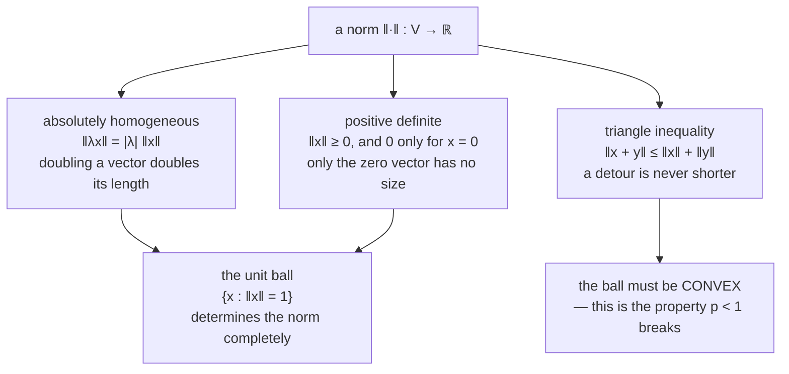

Before you can ask how far apart two vectors are, or which of them is bigger, or whether one is
small enough to ignore, you need a way to turn a vector into a single number representing its size.
That map is a **norm**, written $\lVert \mathbf{x} \rVert$.

There is more than one. That is not a technicality to be filed away — the choice of norm is the
difference between a regulariser that produces exactly-zero coefficients and one that never does, and
this page ends by measuring that difference on a real fit.

## What you'll learn

- The **three properties** a norm must have, and how to check a candidate against each.
- The **Manhattan** ($\ell_1$), **Euclidean** ($\ell_2$) and **maximum** ($\ell_\infty$) norms, and the $\ell_p$ family that contains all three.
- Why the **unit ball** — the set of vectors of length one — is the object to look at rather than the formula.
- Why $p < 1$ gives something that is *not* a norm, demonstrated with a two-line counterexample.
- The measured reason **Lasso produces exact zeros and Ridge does not**, and the measured reason ridge coefficients are not even monotone in the penalty.

## Intuition: three ways to price a taxi ride

You are at the origin of a city laid out on a grid and you want to get to the corner
$(1.6, 0.9)$ kilometres away. How far is that?

- **The taxi driver** cares about kilometres of tarmac. There are no diagonal streets, so the trip is
  $1.6 + 0.9 = 2.5$ km. That is the $\ell_1$ norm, and it is called the Manhattan norm for exactly this
  reason.
- **The pigeon** flies straight over the buildings: $\sqrt{1.6^2 + 0.9^2} \approx 1.836$ km. That is
  $\ell_2$, the Euclidean norm.
- **The bureaucrat filling in a form** with separate "blocks east" and "blocks north" fields, and a rule
  that says the trip is classified by whichever is larger, records $1.6$. That is $\ell_\infty$, the
  maximum norm.

All three are correct. They answer different questions, and none of them is the length of the trip in
some absolute sense. What the mathematics does is pin down the minimum a candidate has to satisfy
before it deserves the word "length" at all.



The last arrow is the one worth carrying forward. Homogeneity means the norm is determined by its
behaviour on the unit ball and nothing else: once you know which vectors have length one, scaling
gives you every other length for free. So the *picture* of the ball is not an illustration of the
norm — it **is** the norm.

## The math

:::note[Definition 3.1 — Norm]
A **norm** on a vector space $V$ is a function

$$
\lVert \cdot \rVert : V \to \mathbb{R}, \qquad \mathbf{x} \mapsto \lVert \mathbf{x} \rVert
$$

assigning each vector $\mathbf{x}$ its **length**, such that for all $\lambda \in \mathbb{R}$ and all
$\mathbf{x}, \mathbf{y} \in V$:

| property | statement | reading |
| --- | --- | --- |
| absolutely homogeneous | $\lVert \lambda\mathbf{x}\rVert = \lvert\lambda\rvert\,\lVert\mathbf{x}\rVert$ | scaling a vector scales its length by the same factor, sign ignored |
| triangle inequality | $\lVert\mathbf{x} + \mathbf{y}\rVert \leq \lVert\mathbf{x}\rVert + \lVert\mathbf{y}\rVert$ | going via $\mathbf{y}$ is never a shortcut |
| positive definite | $\lVert\mathbf{x}\rVert \geq 0$ and $\lVert\mathbf{x}\rVert = 0 \iff \mathbf{x} = \mathbf{0}$ | nothing but the zero vector has zero length |
:::

Note what is *not* required. There is no requirement that a norm come from an inner product, no
requirement that it be smooth, and no requirement that it treat the coordinate directions equally.
Two of the three standard norms take advantage of that latitude.

### The three standard norms

**Manhattan norm ($\ell_1$)**, Example 3.1 in the book:

$$
\lVert \mathbf{x} \rVert_1 = \sum_{i=1}^{n} \lvert x_i \rvert
$$

**Euclidean norm ($\ell_2$)**, Example 3.2:

$$
\lVert \mathbf{x} \rVert_2 = \sqrt{\sum_{i=1}^{n} x_i^2} = \sqrt{\mathbf{x}^\top \mathbf{x}}
$$

**Maximum norm ($\ell_\infty$)**:

$$
\lVert \mathbf{x} \rVert_\infty = \max_i \lvert x_i \rvert
$$

All three are members of one family, the **$p$-norm**:

$$
\lVert \mathbf{x} \rVert_p = \left( \sum_{i=1}^{n} \lvert x_i \rvert^p \right)^{1/p}, \qquad p \geq 1
$$

with $p = 1$ and $p = 2$ read off directly, and $\ell_\infty$ arising as the limit $p \to \infty$
(the largest coordinate eventually dominates the sum, and taking the $p$-th root strips off the rest).

### Why p must be at least 1

The restriction is not decoration. Take the two standard basis vectors of $\mathbb{R}^2$ and test the
triangle inequality on them. Each has $\lVert \mathbf{e}_i \rVert_p = 1$ for every $p$, and their sum
is $(1,1)$, so

$$
\lVert \mathbf{e}_1 + \mathbf{e}_2 \rVert_p = (1^p + 1^p)^{1/p} = 2^{1/p},
\qquad
\lVert \mathbf{e}_1 \rVert_p + \lVert \mathbf{e}_2 \rVert_p = 2 .
$$

The inequality demands $2^{1/p} \leq 2$, which holds exactly when $p \geq 1$. Below that it fails, and
by a wide margin:

| $p$ | $\lVert \mathbf{e}_1 + \mathbf{e}_2 \rVert_p = 2^{1/p}$ | $\lVert \mathbf{e}_1 \rVert_p + \lVert \mathbf{e}_2 \rVert_p$ | verdict |
| --- | --- | --- | --- |
| 0.5 | 4.000000 | 2 | **fails** |
| 0.6 | 3.174802 | 2 | **fails** |
| 0.8 | 2.378414 | 2 | **fails** |
| 1.0 | 2.000000 | 2 | holds, with equality |
| 2.0 | 1.414214 | 2 | holds |
| $\infty$ | 1.000000 | 2 | holds |

Geometrically, $p < 1$ makes the unit ball cave inwards, and a non-convex ball is precisely what the
triangle inequality forbids. Objects of this kind are called **quasinorms**; the "$\ell_0$ norm"
counting nonzero entries is one of them, which is why sparse-recovery papers write it in quotation
marks.

### The ordering that always holds

For any $\mathbf{x}$ and any $1 \leq p \leq q$,

$$
\lVert \mathbf{x} \rVert_\infty \;\leq\; \lVert \mathbf{x} \rVert_q \;\leq\; \lVert \mathbf{x} \rVert_p \;\leq\; \lVert \mathbf{x} \rVert_1 .
$$

Larger $p$ never gives a larger answer. The reason is visible in the balls: as $p$ grows the ball
inflates, and a bigger ball means a given vector needs less scaling to reach the boundary, which means
a smaller measured length.

:::tip[From the book]
Section 3.1, Definition 3.1 with Equations 3.1 and 3.2. Example 3.1 is the Manhattan norm
(Equation 3.3), Example 3.2 the Euclidean norm (Equation 3.4). Figure 3.2 illustrates the triangle
inequality and Figure 3.3 draws the sets of vectors with norm 1 for $\ell_1$ and $\ell_2$. The book
adds a Remark stating that **throughout the rest of it, the Euclidean norm is the default unless
stated otherwise** — worth remembering, because that default is silently assumed in Chapters 9, 10
and 12.
:::

## Worked example by hand

Take $\mathbf{x} = (1.6,\ 0.9)^\top$ and measure it six ways.

| $p$ | working | $\lVert \mathbf{x} \rVert_p$ |
| --- | --- | --- |
| 1 | $1.6 + 0.9$ | **2.500000** |
| 1.5 | $(1.6^{1.5} + 0.9^{1.5})^{1/1.5} = (2.02386 + 0.85381)^{0.6667}$ | **2.023148** |
| 2 | $\sqrt{2.56 + 0.81} = \sqrt{3.37}$ | **1.835756** |
| 3 | $(4.096 + 0.729)^{1/3} = 4.825^{1/3}$ | **1.689789** |
| 6 | $(16.777216 + 0.531441)^{1/6} = 17.308657^{1/6}$ | **1.608338** |
| $\infty$ | $\max(1.6,\ 0.9)$ | **1.600000** |

Two things to notice. The sequence is **decreasing** in $p$, as the ordering above requires. And it
converges to $1.6$ — the largest coordinate — from above: by $p = 6$ the answer is already within
$0.53\%$ of $\ell_\infty$, so the maximum norm is a good approximation to a fairly modest $p$.

Verified against NumPy, which implements $\ell_1$, $\ell_2$ and $\ell_\infty$ directly:

```python title="check_by_hand.py" showLineNumbers{1}
import numpy as np

x = np.array([1.6, 0.9])

def pnorm(v, p):
    if np.isinf(p):
        return np.max(np.abs(v))
    return np.sum(np.abs(v) ** p) ** (1.0 / p)

for p in (1, 1.5, 2, 3, 6, np.inf):
    print(f"p = {str(p):>4}   ||x||_p = {pnorm(x, p):.6f}")

print("numpy agrees:", [round(float(np.linalg.norm(x, o)), 6) for o in (1, 2, np.inf)])
```

```text title="output"
p =    1   ||x||_p = 2.500000
p =  1.5   ||x||_p = 2.023148
p =    2   ||x||_p = 1.835756
p =    3   ||x||_p = 1.689789
p =    6   ||x||_p = 1.608338
p =  inf   ||x||_p = 1.600000
numpy agrees: [2.5, 1.835756, 1.6]
```

## See it move

The first sketch draws all three standard balls scaled so that each passes through the point you
drag. The radius of each ball *is* the corresponding norm, so the three numbers in the readout are
three distances you can see.

```p5 title="Three rulers, one point" desc="Drag the white point. Each ball is scaled so its boundary passes through it, so the radius of each ball is that norm's answer. The maximum norm always gives the smallest number and the Manhattan norm the largest — the balls are nested for that reason." height="440"
let px = 1.6, py = 0.9;
let dragging = false;
const U = 78;
let cx, cy;

function setup() { createCanvas(600, 440); textFont("monospace"); cx = 300; cy = 210; }

function sx(x) { return cx + x * U; }
function sy(y) { return cy - y * U; }
function ux(s) { return (s - cx) / U; }
function uy(s) { return (cy - s) / U; }

function pnorm(x, y, p) {
  if (p === Infinity) return Math.max(Math.abs(x), Math.abs(y));
  return Math.pow(Math.pow(Math.abs(x), p) + Math.pow(Math.abs(y), p), 1 / p);
}

function ballRadius(th, p, r) {
  const c = Math.cos(th), s = Math.sin(th);
  const denom = p === Infinity
    ? Math.max(Math.abs(c), Math.abs(s))
    : Math.pow(Math.pow(Math.abs(c), p) + Math.pow(Math.abs(s), p), 1 / p);
  return r / denom;
}

function drawBall(p, r, col, w) {
  noFill(); stroke(col); strokeWeight(w);
  beginShape();
  for (let i = 0; i <= 240; i++) {
    const th = (i / 240) * TWO_PI;
    const rr = ballRadius(th, p, r);
    vertex(sx(rr * Math.cos(th)), sy(rr * Math.sin(th)));
  }
  endShape(CLOSE);
}

function mousePressed() {
  if (dist(mouseX, mouseY, sx(px), sy(py)) < 22) dragging = true;
}
function mouseReleased() { dragging = false; }
function mouseDragged() {
  if (!dragging) return;
  px = Math.max(-2.4, Math.min(2.4, ux(mouseX)));
  py = Math.max(-1.6, Math.min(1.6, uy(mouseY)));
  if (!isLooping()) redraw();
}

function draw() {
  background(13, 17, 23);

  stroke(32, 44, 58); strokeWeight(1);
  for (let g = -3; g <= 3; g += 0.5) { line(sx(g), sy(-2.4), sx(g), sy(2.4)); }
  for (let g = -2; g <= 2; g += 0.5) { line(sx(-3.5), sy(g), sx(3.5), sy(g)); }
  stroke(58, 72, 88); strokeWeight(1.4);
  line(sx(-3.5), sy(0), sx(3.5), sy(0));
  line(sx(0), sy(-2.4), sx(0), sy(2.4));

  const n1 = pnorm(px, py, 1);
  const n2 = pnorm(px, py, 2);
  const ni = pnorm(px, py, Infinity);

  drawBall(1, n1, color(255, 211, 67), 2.2);
  drawBall(2, n2, color(75, 139, 190), 2.2);
  drawBall(Infinity, ni, color(120, 200, 140), 2.2);

  stroke(240); strokeWeight(2.4);
  line(sx(0), sy(0), sx(px), sy(py));
  noStroke(); fill(255); ellipse(sx(px), sy(py), 13, 13);

  // The bar chart: three lengths, same baseline.
  const bx = 24, by = height - 96, bw = 150;
  const mx = Math.max(n1, 0.001);
  const bars = [
    ["L1 ", n1, color(255, 211, 67)],
    ["L2 ", n2, color(75, 139, 190)],
    ["Linf", ni, color(120, 200, 140)],
  ];
  for (let i = 0; i < 3; i++) {
    const [lab, v, c] = bars[i];
    noStroke(); fill(c);
    rect(bx + 44, by + i * 22, (v / mx) * bw, 13, 3);
    fill(200); textSize(11); textAlign(LEFT, TOP);
    text(lab, bx, by + i * 22);
    fill(c); text(v.toFixed(4), bx + 50 + bw, by + i * 22);
  }

  noStroke(); textAlign(LEFT, TOP);
  fill(255, 211, 67); textSize(14);
  text("Drag the white point", 20, 14);
  fill(200); textSize(11);
  text(`x = (${px.toFixed(2)}, ${py.toFixed(2)})`, 20, 36);
  fill(150); textSize(10);
  text("each ball is scaled to pass through x, so its radius is that norm", 20, 54);
  textAlign(RIGHT, TOP);
  fill(ni <= n2 + 1e-9 && n2 <= n1 + 1e-9 ? color(120, 200, 140) : color(232, 110, 110));
  textSize(11);
  text("Linf <= L2 <= L1 : always", width - 18, 14);
  fill(150);
  text("equality only on the axes", width - 18, 32);
}
```

The second sketch puts the triangle inequality under a $p$ knob. Drag the two blue arrows, then drag
$p$ below 1 and watch the ball cave in and the inequality break.

```p5 title="The triangle inequality, and where it breaks" desc="Two draggable vectors u and v, their sum, and the ball of radius equal to the sum of their two lengths. While p is at least 1 the sum stays inside that ball. Push p below 1 and the ball becomes non-convex and the sum escapes it — which is the triangle inequality failing." height="470"
let ux_ = 1.15, uy_ = 0.25, vx_ = 0.15, vy_ = 1.0;
let pExp = 2.0;
let KNOBS = [], dragging = null, dragVec = null;
const U = 62;
let cx, cy;

function setup() { createCanvas(600, 470); textFont("monospace"); cx = 300; cy = 200; }

function sx(x) { return cx + x * U; }
function sy(y) { return cy - y * U; }
function dx_(s) { return (s - cx) / U; }
function dy_(s) { return (cy - s) / U; }

function pnorm(x, y, p) {
  if (p >= 40) return Math.max(Math.abs(x), Math.abs(y));
  return Math.pow(Math.pow(Math.abs(x), p) + Math.pow(Math.abs(y), p), 1 / p);
}

function knob(id, x, y, w, value, mn, mx, label) {
  KNOBS.push({ id, x, y, w, mn, mx });
  const t = (value - mn) / (mx - mn);
  stroke(60, 74, 92); strokeWeight(2); line(x, y, x + w, y);
  noStroke(); fill(255, 211, 67); ellipse(x + t * w, y, 11, 11);
  fill(190, 200, 212); textSize(11); textAlign(LEFT, CENTER);
  text(label, x + w + 10, y);
}
function knobHit(mx_, my_) {
  for (const k of KNOBS) {
    if (my_ > k.y - 12 && my_ < k.y + 12 && mx_ > k.x - 12 && mx_ < k.x + k.w + 12) return k;
  }
  return null;
}
function knobRaw(k, mx_) {
  const t = Math.min(1, Math.max(0, (mx_ - k.x) / k.w));
  return k.mn + t * (k.mx - k.mn);
}

function mousePressed() {
  dragging = knobHit(mouseX, mouseY);
  if (dragging) return;
  if (dist(mouseX, mouseY, sx(ux_), sy(uy_)) < 20) dragVec = "u";
  else if (dist(mouseX, mouseY, sx(vx_), sy(vy_)) < 20) dragVec = "v";
}
function mouseReleased() { dragging = null; dragVec = null; }
function mouseDragged() {
  if (dragging) {
    if (dragging.id === "p") pExp = knobRaw(dragging, mouseX);
  } else if (dragVec === "u") {
    ux_ = Math.max(-2, Math.min(2, dx_(mouseX))); uy_ = Math.max(-1.6, Math.min(1.6, dy_(mouseY)));
  } else if (dragVec === "v") {
    vx_ = Math.max(-2, Math.min(2, dx_(mouseX))); vy_ = Math.max(-1.6, Math.min(1.6, dy_(mouseY)));
  }
  if (!isLooping()) redraw();
}

function arrow(x1, y1, x2, y2, c, w) {
  stroke(c); strokeWeight(w); line(x1, y1, x2, y2);
  push(); translate(x2, y2); rotate(Math.atan2(y2 - y1, x2 - x1));
  fill(c); noStroke(); triangle(0, 0, -9, -4, -9, 4); pop();
}

function draw() {
  background(13, 17, 23);
  KNOBS = [];

  stroke(32, 44, 58); strokeWeight(1);
  for (let g = -4; g <= 4; g++) { line(sx(g), sy(-3), sx(g), sy(3)); }
  for (let g = -3; g <= 3; g++) { line(sx(-4), sy(g), sx(4), sy(g)); }
  stroke(58, 72, 88); strokeWeight(1.4);
  line(sx(-4), sy(0), sx(4), sy(0)); line(sx(0), sy(-3), sx(0), sy(3));

  const nu = pnorm(ux_, uy_, pExp);
  const nv = pnorm(vx_, vy_, pExp);
  const sxv = ux_ + vx_, syv = uy_ + vy_;
  const nsum = pnorm(sxv, syv, pExp);
  const budget = nu + nv;
  const holds = nsum <= budget + 1e-9;

  // The ball of radius ||u|| + ||v||. The sum must lie inside it.
  noFill(); stroke(holds ? color(120, 200, 140) : color(232, 110, 110)); strokeWeight(1.8);
  beginShape();
  for (let i = 0; i <= 300; i++) {
    const th = (i / 300) * TWO_PI;
    const c = Math.cos(th), s = Math.sin(th);
    const den = pExp >= 40
      ? Math.max(Math.abs(c), Math.abs(s))
      : Math.pow(Math.pow(Math.abs(c), pExp) + Math.pow(Math.abs(s), pExp), 1 / pExp);
    const r = budget / den;
    vertex(sx(r * c), sy(r * s));
  }
  endShape(CLOSE);

  arrow(sx(0), sy(0), sx(ux_), sy(uy_), color(75, 139, 190), 2.4);
  arrow(sx(ux_), sy(uy_), sx(sxv), sy(syv), color(197, 153, 255), 2.0);
  arrow(sx(0), sy(0), sx(vx_), sy(vy_), color(75, 139, 190), 2.4);
  arrow(sx(0), sy(0), sx(sxv), sy(syv), color(255, 211, 67), 3);

  noStroke(); fill(75, 139, 190); ellipse(sx(ux_), sy(uy_), 11, 11);
  ellipse(sx(vx_), sy(vy_), 11, 11);
  fill(255, 211, 67); ellipse(sx(sxv), sy(syv), 11, 11);

  textSize(12); textAlign(LEFT, TOP);
  fill(75, 139, 190); text("u", sx(ux_) + 9, sy(uy_) - 18);
  text("v", sx(vx_) + 9, sy(vy_) - 18);
  fill(255, 211, 67); text("u + v", sx(sxv) + 9, sy(syv) - 18);

  knob("p", 30, height - 96, 200, pExp, 0.4, 6.0, `p = ${pExp.toFixed(2)}`);

  noStroke(); textAlign(LEFT, TOP);
  fill(255, 211, 67); textSize(14); text("Drag u, v and the p knob", 20, 14);
  fill(200); textSize(11);
  text(`||u|| = ${nu.toFixed(4)}   ||v|| = ${nv.toFixed(4)}`, 20, 36);
  text(`||u + v||     = ${nsum.toFixed(4)}`, 20, 54);
  text(`||u|| + ||v|| = ${budget.toFixed(4)}`, 20, 72);
  fill(holds ? color(120, 200, 140) : color(232, 110, 110)); textSize(13);
  text(holds ? "triangle inequality holds" : "TRIANGLE INEQUALITY FAILS - not a norm", 20, 94);
  fill(150); textSize(10);
  text(pExp < 1 ? "p below 1: the ball is not convex" : "p at least 1: the ball is convex", 20, height - 58);
  text("the amber point must stay inside the ring", 20, height - 42);
}
```

And the stepped sweep, which keeps every previous ball as a trail so the deformation from diamond to
circle to square reads as one continuous motion:

<NormBall
  client:visible
  probe={[1.6, 0.9]}
  title="One vector, seven rulers"
  desc="The white dot on the boundary is the probe divided by its own length, so it must land on the ball at every step. Watch the corners round off between p = 1 and p = 2, and note the first frame is not a norm at all."
/>

## From scratch

One function covers the whole family, including the limit case:

```python title="norms_from_scratch.py" showLineNumbers{1}
import numpy as np

def pnorm(v, p):
    """The p-norm of a vector. p may be np.inf."""
    if np.isinf(p):
        return np.max(np.abs(v))
    return np.sum(np.abs(v) ** p) ** (1.0 / p)

# The three defining properties, tested rather than assumed.
rng = np.random.default_rng(0)
x = rng.normal(size=5)
y = rng.normal(size=5)
lam = -2.7

for p in (1, 2, np.inf):
    homog = abs(pnorm(lam * x, p) - abs(lam) * pnorm(x, p))
    triangle = pnorm(x + y, p) <= pnorm(x, p) + pnorm(y, p) + 1e-12
    definite = pnorm(np.zeros(5), p) == 0.0 and pnorm(x, p) > 0
    print(f"p={str(p):>3}  homogeneity gap {homog:.2e}   triangle {triangle}   definite {definite}")

# And the counterexample for p below 1.
e1, e2 = np.array([1.0, 0.0]), np.array([0.0, 1.0])
for p in (0.5, 0.6, 0.8, 1.0):
    lhs, rhs = pnorm(e1 + e2, p), pnorm(e1, p) + pnorm(e2, p)
    print(f"p={p}  ||e1+e2||={lhs:.6f}  ||e1||+||e2||={rhs:.1f}  "
          f"{'holds' if lhs <= rhs + 1e-12 else 'FAILS'}")
```

```text title="output"
p=  1  homogeneity gap 0.00e+00   triangle True   definite True
p=  2  homogeneity gap 4.44e-16   triangle True   definite True
p=inf  homogeneity gap 0.00e+00   triangle True   definite True
p=0.5  ||e1+e2||=4.000000  ||e1||+||e2||=2.0  FAILS
p=0.6  ||e1+e2||=3.174802  ||e1||+||e2||=2.0  FAILS
p=0.8  ||e1+e2||=2.378414  ||e1||+||e2||=2.0  FAILS
p=1.0  ||e1+e2||=2.000000  ||e1||+||e2||=2.0  holds
```

The homogeneity gap for $\ell_2$ is $4.44 \times 10^{-16}$ rather than zero, because that norm goes
through a square root and a multiplication. It is one unit in the last place, which is the correct
amount of disagreement, not an error.

## On real data

<Figure
  src="/images/mml/norms/unit-balls"
  alt="A diamond, a circle and a square drawn on one pair of axes, all passing through the points where a coordinate equals plus or minus one, with a single arrow to the point (1.6, 0.9) and a table giving its three measured lengths."
  title="Three rulers on one arrow"
  caption="The balls are nested — diamond inside circle inside square — which is exactly the inequality that makes the maximum norm the smallest answer and the Manhattan norm the largest. The four marked points on the axes are the only sharp corners of the diamond."
/>

<Figure
  src="/images/mml/norms/lasso-versus-ridge"
  alt="Elliptical loss contours of a two-coefficient regression with a diamond and a circle of equal area drawn over them, the unpenalised optimum marked with a star, and each constrained optimum marked and labelled with its second coefficient."
  title="Equal budgets, unequal outcomes"
  caption="The two constraint regions have the same area, so neither is being handicapped. The diamond's optimum sits on a corner where the second coefficient is exactly zero; the circle's sits on a smooth arc where it is 0.6056. The l1 fit pays 10.8% more squared error and uses one feature instead of two."
/>

<Figure
  src="/images/mml/norms/coefficient-paths"
  alt="Two panels of coefficient trajectories against penalty strength on a log axis. In the lasso panel one coefficient reaches exactly zero and stays there, then the other follows. In the ridge panel both coefficients approach zero without reaching it, and one of them first rises before falling."
  title="Exact elimination against indefinite shrinkage"
  caption="Measured over 60 penalty values. Lasso sets w2 to exactly zero from lambda 22.70 onwards and w1 from lambda 126.38. Ridge never reaches zero — its smallest w1 over the whole path is 0.3297. Note also that ridge's w2 rises before it falls."
/>

## Reading the plot

**From the balls.** The diamond has four corners and they all sit on the axes; the circle has none.
That is the entire mechanism behind sparsity. An optimisation pushing outwards against a constraint
boundary will generically stop at a point of the boundary, and a corner is a much larger target for a
tilted contour than any single smooth point. A corner of the $\ell_1$ ball is a place where one
coordinate is *exactly* zero.

**From the equal-area comparison.** Both regions cover $3.464$ square units, so the $\ell_1$ result is
not an artefact of a tighter budget. The measured outcome: $\ell_1$ lands at $(1.31598,\ 0)$ with
squared error $33.462$; $\ell_2$ lands at $(0.85773,\ 0.60564)$ with squared error $30.211$. That is
the actual trade — about $11\%$ more error for a model that reads one feature instead of two. Whether
that trade is worth making is a modelling question, and the figure is what lets you price it.

**From the paths.** Two measured facts, one expected and one not.

The expected one: Lasso's $w_2$ becomes exactly $0.0$ at $\lambda \approx 22.70$ and remains exactly
zero for every larger penalty. Ridge's smallest $\lvert w_1 \rvert$ anywhere on the path is $0.3297$,
and its $w_2$ bottoms out at $0.1750$. "Shrinks towards zero" and "sets to zero" are different
behaviours and the plot shows the difference rather than describing it.

The unexpected one: **ridge's $w_2$ does not decrease monotonically.** It starts at $0.1750$, climbs to
a maximum of $0.6262$, and only then falls. The two features here correlate at $0.879$, and a circular
constraint prefers to split a fixed budget across two correlated directions rather than spend it all on
one — so tightening the penalty initially *increases* the smaller coefficient. The peak occurs at
$\lambda = 22.695$, which is precisely the penalty at which Lasso deletes the same coefficient. Same
data, same $\lambda$, opposite conclusion about $w_2$: one method calls it $0.6262$ and the other calls
it $0$.

If you have ever read a single ridge coefficient as a measure of a feature's importance, that is the
figure to remember.

## Pitfalls

:::caution[np.linalg.norm defaults to the Frobenius norm on matrices]
For a vector, `np.linalg.norm(v)` is $\ell_2$. For a *matrix*, the default is the Frobenius norm —
the $\ell_2$ norm of the flattened array — which is **not** the matrix 2-norm (largest singular
value). If you want the operator norm, ask for it: `np.linalg.norm(A, 2)`. The two differ by up to a
factor of $\sqrt{\min(m,n)}$, which is silent and large.
:::

:::caution[The "L0 norm" is not a norm]
Counting nonzero entries fails homogeneity: doubling a vector does not double the count. It fails the
triangle inequality only in the loose sense that it is not even homogeneous first. The name is
universal in the sparse-recovery literature and the quotation marks are load-bearing.
:::

:::caution[Norms are not scale-invariant, so unstandardised features corrupt any penalty]
$\lVert \mathbf{w} \rVert_1$ treats a coefficient on a feature measured in metres and one measured in
millimetres as equally expensive, when the second must be a thousand times smaller to say the same
thing. Regularising unstandardised features silently penalises whichever feature happens to be
recorded in large units. Standardise first — the figures on this page do.
:::

:::danger[High-dimensional distances concentrate, which breaks L2-based intuition]
In $d$ dimensions with independent coordinates, the ratio of the farthest to the nearest neighbour of
a query point tends to $1$ as $d$ grows: everything becomes roughly equidistant. The Euclidean norm
still satisfies its three properties perfectly; it just stops carrying useful information. This is why
high-dimensional retrieval uses cosine similarity (the next few pages) rather than $\ell_2$ distance,
and it is a property of the geometry rather than of any implementation.
:::

:::caution[A quasinorm can still be useful — just do not call the result convex]
Objectives built on $p < 1$ penalties really do produce sparser solutions than $\ell_1$. They also
produce non-convex optimisation problems with local minima, so the solution you get depends on where
you started. The trade is real; the marketing that calls it a norm is not.
:::

## Compare

| norm | formula | unit ball | smooth? | typical use |
| --- | --- | --- | --- | --- |
| $\ell_1$ | $\sum_i \lvert x_i \rvert$ | diamond, corners on the axes | no (kinks at the axes) | Lasso, sparse recovery, robust loss |
| $\ell_2$ | $\sqrt{\sum_i x_i^2}$ | circle | yes | Ridge, least squares, weight decay, distances |
| $\ell_\infty$ | $\max_i \lvert x_i \rvert$ | square | no (kinks at the edge midpoints) | adversarial perturbation budgets, worst-case bounds |
| general $\ell_p$, $p>1$ | $(\sum_i \lvert x_i \rvert^p)^{1/p}$ | convex, interpolating | yes for $p>1$ | rarely used directly; useful for theory |
| "$\ell_0$" | $\#\{i : x_i \neq 0\}$ | not a ball | no | the thing $\ell_1$ is a convex surrogate for |
| Mahalanobis | $\sqrt{\mathbf{x}^\top \Sigma^{-1}\mathbf{x}}$ | ellipse | yes | distances that respect correlation ([§3.3](../lengths-and-distances/)) |

The last row is the bridge to the next page: it is a norm, and it comes from an inner product other
than the dot product.

<Quiz
  title="Check your understanding"
  questions={[
    {
      q: "Why does the l1 ball produce exactly-zero coefficients when used as a constraint, while the l2 ball does not?",
      options: [
        "Because l1 is smaller than l2 for the same radius",
        "Because the l1 ball's only sharp corners lie on the axes, and a corner is where a coordinate is exactly zero — a tilted contour hits a corner generically, a smooth arc point only by coincidence",
        "Because l1 is not differentiable anywhere",
        "Because the optimiser rounds small values to zero",
      ],
      answer: 1,
      explain:
        "The figure on this page controls for size by giving both regions the same area, and the corner still wins. Nothing is rounded: the l1 optimum has w2 exactly 0.0 because the corner is at w2 = 0 exactly.",
    },
    {
      q: "For a fixed nonzero vector, which ordering of its norms always holds?",
      options: [
        "l1 <= l2 <= l-infinity",
        "l-infinity <= l2 <= l1",
        "They can be in any order depending on the vector",
        "l2 is always the largest",
      ],
      answer: 1,
      explain:
        "Larger p never gives a larger answer. Geometrically the balls are nested — diamond inside circle inside square — so a vector needs less scaling to reach the outer ball, hence a smaller measured length. Equality happens only for vectors along a coordinate axis.",
    },
    {
      q: "The p-norm formula is restricted to p at least 1. Which property fails below that, and what is the two-vector counterexample?",
      options: [
        "Positive definiteness fails; the counterexample is the zero vector",
        "Homogeneity fails; the counterexample is scaling by 2",
        "The triangle inequality fails; taking e1 and e2 gives 2 to the power 1/p on the left and 2 on the right, so it breaks as soon as p is below 1",
        "Nothing fails; the restriction is conventional",
      ],
      answer: 2,
      explain:
        "At p = 0.6 the left side is 3.174802 against a right side of 2. Geometrically the unit ball caves inwards, and a non-convex ball is exactly what the triangle inequality forbids.",
    },
    {
      q: "The measured ridge path on this page shows w2 rising from 0.1750 to 0.6262 before falling. What does that tell you?",
      options: [
        "The coordinate-descent solver has not converged",
        "Ridge does not shrink each coefficient monotonically when features are correlated — a circular constraint prefers to split a budget across correlated directions, so a single ridge coefficient is not a measure of feature importance",
        "The features were not standardised",
        "Ridge is being applied with the wrong sign",
      ],
      answer: 1,
      explain:
        "The ridge path is a closed-form solve, so there is nothing to converge; the features are standardised in the code that produced the figure. The two features correlate at 0.879, and at lambda = 22.695 — precisely where lasso deletes w2 — ridge reports its largest value for the same coefficient.",
    },
  ]}
/>

## 🧪 Try It Yourself

### Exercise 1 – Implement the p-norm

<DataCampExercise
  lang="python"
  hint={`Sum the absolute values raised to the power p, then take the p-th root. The infinite case is just the maximum absolute value.`}
  code={`import numpy as np

def pnorm(v, p):
    if np.isinf(p):
        return np.max(np.abs(v))
    return np.sum(np.abs(v) ** ___) ** (1.0 / p)      # replace ___ with p

x = np.array([1.6, 0.9])
for p in (1, 2, 3, np.inf):
    print(f"p={str(p):>3}  {pnorm(x, p):.6f}")

# -- Expected output ------------------------------
# p=  1  2.500000
# p=  2  1.835756
# p=  3  1.689789
# p=inf  1.600000
# -------------------------------------------------`}
  solution={`import numpy as np

def pnorm(v, p):
    if np.isinf(p):
        return np.max(np.abs(v))
    return np.sum(np.abs(v) ** p) ** (1.0 / p)

x = np.array([1.6, 0.9])
for p in (1, 2, 3, np.inf):
    print(f"p={str(p):>3}  {pnorm(x, p):.6f}")`}
  sct={`test_output_contains("2.500000")
test_output_contains("1.835756")
success_msg("One function, the whole family. Note the answers decrease as p grows — they have to.")`}
  height={220}
/>

### Exercise 2 – Break the triangle inequality

<DataCampExercise
  lang="python"
  hint={`The two standard basis vectors each have p-norm 1 for every p, and their sum is (1, 1) with p-norm 2 to the power 1/p. Ask when that exceeds 2.`}
  code={`import numpy as np

def pnorm(v, p):
    return np.sum(np.abs(v) ** p) ** (1.0 / p)

e1 = np.array([1.0, 0.0])
e2 = np.array([0.0, 1.0])

for p in (0.5, 0.6, 0.8, 1.0, 2.0):
    lhs = pnorm(e1 + ___, p)                 # replace ___ with e2
    rhs = pnorm(e1, p) + pnorm(e2, p)
    verdict = "holds" if lhs <= rhs + 1e-12 else "FAILS"
    print(f"p={p}  lhs={lhs:.6f}  rhs={rhs:.1f}  {verdict}")

# -- Expected output ------------------------------
# p=0.5  lhs=4.000000  rhs=2.0  FAILS
# p=0.6  lhs=3.174802  rhs=2.0  FAILS
# p=0.8  lhs=2.378414  rhs=2.0  FAILS
# p=1.0  lhs=2.000000  rhs=2.0  holds
# p=2.0  lhs=1.414214  rhs=2.0  holds
# -------------------------------------------------`}
  solution={`import numpy as np

def pnorm(v, p):
    return np.sum(np.abs(v) ** p) ** (1.0 / p)

e1 = np.array([1.0, 0.0])
e2 = np.array([0.0, 1.0])

for p in (0.5, 0.6, 0.8, 1.0, 2.0):
    lhs = pnorm(e1 + e2, p)
    rhs = pnorm(e1, p) + pnorm(e2, p)
    verdict = "holds" if lhs <= rhs + 1e-12 else "FAILS"
    print(f"p={p}  lhs={lhs:.6f}  rhs={rhs:.1f}  {verdict}")`}
  sct={`test_output_contains("p=0.6  lhs=3.174802")
test_output_contains("p=1.0  lhs=2.000000  rhs=2.0  holds")
success_msg("p = 1 is the exact boundary, and it holds with equality there. Anything below it is a quasinorm.")`}
  height={260}
/>

### Exercise 3 – The nesting of the balls

<DataCampExercise
  lang="python"
  hint={`Generate random vectors and check the chain l-infinity <= l2 <= l1 for each. Count how many times any link is violated.`}
  code={`import numpy as np

rng = np.random.default_rng(7)
V = rng.normal(size=(20000, 6))

n1 = np.linalg.norm(V, 1, axis=1)
n2 = np.linalg.norm(V, 2, axis=1)
ni = np.linalg.norm(V, np.___, axis=1)          # replace ___ with inf

print("violations of Linf <= L2:", int(np.sum(ni > n2 + 1e-12)))
print("violations of L2 <= L1:  ", int(np.sum(n2 > n1 + 1e-12)))
print("largest L1/L2 ratio seen:", round(float(np.max(n1 / n2)), 6))
print("sqrt(6) for reference:   ", round(float(np.sqrt(6)), 6))

# -- Expected output ------------------------------
# violations of Linf <= L2: 0
# violations of L2 <= L1:   0
# largest L1/L2 ratio seen: 2.440344
# sqrt(6) for reference:    2.44949
# -------------------------------------------------`}
  solution={`import numpy as np

rng = np.random.default_rng(7)
V = rng.normal(size=(20000, 6))

n1 = np.linalg.norm(V, 1, axis=1)
n2 = np.linalg.norm(V, 2, axis=1)
ni = np.linalg.norm(V, np.inf, axis=1)

print("violations of Linf <= L2:", int(np.sum(ni > n2 + 1e-12)))
print("violations of L2 <= L1:  ", int(np.sum(n2 > n1 + 1e-12)))
print("largest L1/L2 ratio seen:", round(float(np.max(n1 / n2)), 6))
print("sqrt(6) for reference:   ", round(float(np.sqrt(6)), 6))`}
  sct={`test_output_contains("violations of Linf <= L2: 0")
success_msg("Zero violations out of 20000, and the largest L1/L2 ratio observed is 2.440344 against a hard bound of sqrt(6) = 2.44949 — attained only when every coordinate has the same magnitude, which random samples approach but never hit.")`}
  height={250}
/>

### Exercise 4 – Draw a unit ball yourself

<DataCampExercise
  lang="python"
  hint={`Along a direction d, the vector r*d has norm r times the norm of d, so the boundary is at r = 1 / pnorm(d).`}
  code={`import numpy as np

def ball(p, samples=8):
    th = np.linspace(0, 2 * np.pi, samples, endpoint=False)
    d = np.stack([np.cos(th), np.sin(th)], axis=1)
    r = 1.0 / np.sum(np.abs(d) ** p, axis=1) ** (1.0 / ___)   # replace ___ with p
    return d * r[:, None]

for p in (1, 2):
    pts = ball(p)
    print(f"p = {p}")
    print(np.round(pts, 4))
    print("  all at norm 1?",
          np.allclose(np.sum(np.abs(pts) ** p, axis=1) ** (1.0 / p), 1.0))

# -- Expected output ------------------------------
# p = 1
# [[ 1.   0. ]
#  [ 0.5  0.5]
#  [ 0.   1. ]
#  [-0.5  0.5]
#  [-1.   0. ]
#  [-0.5 -0.5]
#  [-0.  -1. ]
#  [ 0.5 -0.5]]
#   all at norm 1? True
# p = 2
# [[ 1.      0.    ]
#  [ 0.7071  0.7071]
#  [ 0.      1.    ]
#  [-0.7071  0.7071]
#  [-1.      0.    ]
#  [-0.7071 -0.7071]
#  [-0.     -1.    ]
#  [ 0.7071 -0.7071]]
#   all at norm 1? True
# -------------------------------------------------`}
  solution={`import numpy as np

def ball(p, samples=8):
    th = np.linspace(0, 2 * np.pi, samples, endpoint=False)
    d = np.stack([np.cos(th), np.sin(th)], axis=1)
    r = 1.0 / np.sum(np.abs(d) ** p, axis=1) ** (1.0 / p)
    return d * r[:, None]

for p in (1, 2):
    pts = ball(p)
    print(f"p = {p}")
    print(np.round(pts, 4))
    print("  all at norm 1?",
          np.allclose(np.sum(np.abs(pts) ** p, axis=1) ** (1.0 / p), 1.0))`}
  sct={`test_output_contains("0.5")
test_output_contains("0.7071")
success_msg("The diamond's diagonal point sits at (0.5, 0.5) and the circle's at (0.7071, 0.7071) — the diamond is pulled in everywhere except on the axes, which is exactly where its corners are.")`}
  height={320}
/>

### Exercise 5 – Reproduce the sparsity result

<DataCampExercise
  lang="python"
  hint={`Search the boundary of each ball for the point with the lowest squared error. Give the two regions equal area: the l1 radius must be sqrt(pi/2) times the l2 radius.`}
  code={`import numpy as np

rng = np.random.default_rng(11)
n = 60
x1 = rng.normal(size=n)
x2 = 0.85 * x1 + 0.53 * rng.normal(size=n)
X = np.stack([x1, x2], axis=1)
X = (X - X.mean(axis=0)) / X.std(axis=0)
y = 1.6 * X[:, 0] + 0.35 * X[:, 1] + 0.45 * rng.normal(size=n)
y = y - y.mean()

def boundary(p, radius, samples=20001):
    th = np.linspace(0, 2 * np.pi, samples)
    d = np.stack([np.cos(th), np.sin(th)], axis=1)
    r = 1.0 / np.sum(np.abs(d) ** p, axis=1) ** (1.0 / p)
    return d * (r * radius)[:, None]

def best_on(p, radius):
    B = boundary(p, radius)
    sse = np.sum((y[None, :] - B @ X.T) ** 2, axis=1)
    return B[int(np.argmin(sse))], float(np.min(sse))

r2 = 1.05
r1 = r2 * np.sqrt(np.pi / ___)                  # replace ___ with 2

w1, s1 = best_on(1.0, r1)
w2, s2 = best_on(2.0, r2)

print("l1 radius for equal area:", round(float(r1), 4))
print("l1 optimum:", np.round(w1, 6), " sse", round(s1, 4))
print("l2 optimum:", np.round(w2, 6), " sse", round(s2, 4))
print("l1 second coefficient exactly zero?", w1[1] == 0.0)

# -- Expected output ------------------------------
# l1 radius for equal area: 1.316
# l1 optimum: [1.31598 0.     ]  sse 33.462
# l2 optimum: [0.857727 0.605643]  sse 30.2113
# l1 second coefficient exactly zero? True
# -------------------------------------------------`}
  solution={`import numpy as np

rng = np.random.default_rng(11)
n = 60
x1 = rng.normal(size=n)
x2 = 0.85 * x1 + 0.53 * rng.normal(size=n)
X = np.stack([x1, x2], axis=1)
X = (X - X.mean(axis=0)) / X.std(axis=0)
y = 1.6 * X[:, 0] + 0.35 * X[:, 1] + 0.45 * rng.normal(size=n)
y = y - y.mean()

def boundary(p, radius, samples=20001):
    th = np.linspace(0, 2 * np.pi, samples)
    d = np.stack([np.cos(th), np.sin(th)], axis=1)
    r = 1.0 / np.sum(np.abs(d) ** p, axis=1) ** (1.0 / p)
    return d * (r * radius)[:, None]

def best_on(p, radius):
    B = boundary(p, radius)
    sse = np.sum((y[None, :] - B @ X.T) ** 2, axis=1)
    return B[int(np.argmin(sse))], float(np.min(sse))

r2 = 1.05
r1 = r2 * np.sqrt(np.pi / 2)

w1, s1 = best_on(1.0, r1)
w2, s2 = best_on(2.0, r2)

print("l1 radius for equal area:", round(float(r1), 4))
print("l1 optimum:", np.round(w1, 6), " sse", round(s1, 4))
print("l2 optimum:", np.round(w2, 6), " sse", round(s2, 4))
print("l1 second coefficient exactly zero?", w1[1] == 0.0)`}
  sct={`test_output_contains("exactly zero? True")
success_msg("Exactly zero, not small — and at a cost of about 11 percent more squared error. That is the whole Lasso trade, priced.")`}
  height={340}
/>

## Recall card

- **A norm needs three properties**: absolutely homogeneous, satisfies the triangle inequality, and positive definite.
- **The unit ball determines the norm completely**, because homogeneity fixes every other length once you know which vectors have length one.
- **Manhattan sums absolute values, Euclidean takes the square root of the sum of squares, maximum takes the largest absolute coordinate** — and larger p never gives a larger answer.
- **The p-norm needs p at least 1**: at p below one the two basis vectors give 2 to the power 1 over p on the left against 2 on the right, and the ball is not convex.
- **The l1 ball's only corners lie on the axes**, which is why an optimum pushed against it has coefficients that are exactly zero rather than merely small.
- **Ridge coefficients are not monotone in the penalty when features are correlated** — the measured path on this page has one coefficient rise from 0.175 to 0.626 before falling.
- **The book's default norm from here on is the Euclidean one**, assumed silently in the least-squares, PCA and SVM chapters.

**Next:** [Inner Products](../inner-products/) — where the Euclidean norm comes from, and what else can
sit in its place.
