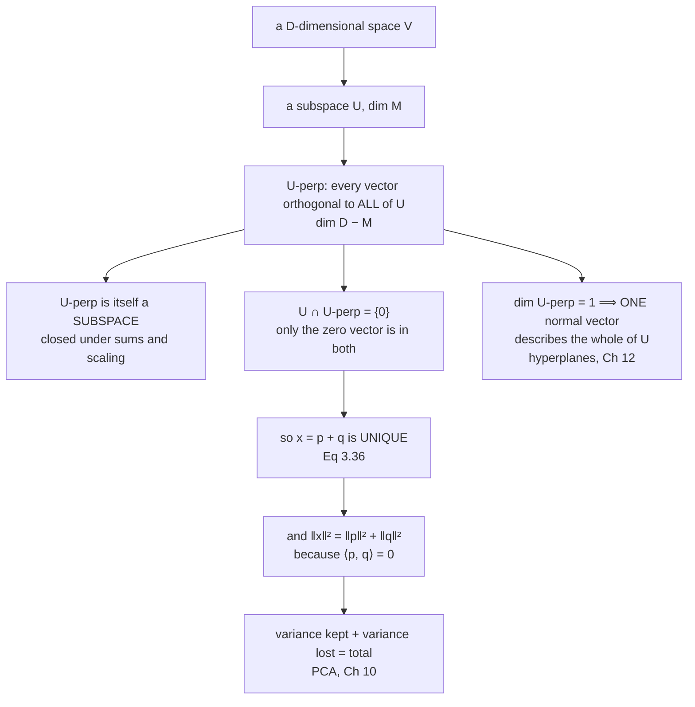

import DataCampExercise from "../../../../components/DataCampExercise.astro";
import Figure from "../../../../components/Figure.astro";
import Quiz from "../../../../components/Quiz.astro";

Fix a subspace $U$ inside a $D$-dimensional space. Every vector in the space now splits into two parts
— the part that lies in $U$, and the part that does not — and this page says three things about that
split which are stronger than you might expect:

it is **unique**, the leftover part lives in a subspace of its own, and the two parts satisfy
**Pythagoras** exactly.

That is the entire content of §3.6, and it is what makes "the part PCA keeps" and "the part PCA
discards" well-defined objects rather than loose talk.

## What you'll learn

- The definition of the **orthogonal complement** $U^\perp$, and why it is a subspace rather than just a set.
- The **dimension count** $\dim U + \dim U^\perp = D$, and the fact that $U \cap U^\perp = \{\mathbf{0}\}$.
- Equation 3.36: the **unique decomposition** of any vector into a $U$-part and a $U^\perp$-part.
- **Pythagoras** for that split, measured over four thousand vectors in $\mathbb{R}^5$.
- Why a plane in $\mathbb{R}^3$ is described by a single **normal vector**, and how that generalises to hyperplanes.
- A real dataset whose orthogonal complement turns out to be spanned by exactly three coordinate axes — identified, not guessed.

## Intuition: the shadow and the height

Stand a pencil on a table. Its shadow on the tabletop is the part of it that lies in the plane of the
table; the height of its tip above the table is the part that does not. Two numbers-worth of shadow,
one number of height, three numbers of pencil.

That accounting is exactly the dimension count. And there is only one way to do it: the shadow is
determined by the pencil, and so is the height. You cannot trade a bit of shadow for a bit of height —
that is the uniqueness claim.

The Pythagorean part is the one worth pausing on. The *squared* length of the pencil equals the squared
shadow plus the squared height. Not the lengths, the squares. Which means a component that looks small
contributes even less than it looks: a direction carrying $10\%$ of the length carries $1\%$ of the
squared length, and squared length is what variance is.



## The math

:::note[Orthogonal complement]
Consider a $D$-dimensional vector space $V$ and an $M$-dimensional subspace $U \subseteq V$. The
**orthogonal complement** $U^\perp$ is the set of all vectors in $V$ that are orthogonal to every
vector in $U$:

$$
U^\perp = \{\, \mathbf{v} \in V : \langle \mathbf{v}, \mathbf{u}\rangle = 0 \text{ for all } \mathbf{u} \in U \,\}
$$

It is a $(D-M)$-dimensional subspace of $V$, and

$$
U \cap U^\perp = \{\mathbf{0}\} .
$$
:::

Three points, in order of how easy they are to overlook.

**$U^\perp$ is a subspace, not merely a set.** If $\mathbf{v}_1$ and $\mathbf{v}_2$ are both orthogonal
to everything in $U$, then so is $\alpha\mathbf{v}_1 + \beta\mathbf{v}_2$, by bilinearity:
$\langle \alpha\mathbf{v}_1 + \beta\mathbf{v}_2, \mathbf{u}\rangle = \alpha\cdot 0 + \beta\cdot 0 = 0$.
So $U^\perp$ has a basis, a dimension, and everything else Chapter 2 gives a subspace.

**The intersection is trivial.** If $\mathbf{v}$ is in both, it is orthogonal to itself, so
$\langle\mathbf{v},\mathbf{v}\rangle = 0$, so $\mathbf{v} = \mathbf{0}$ by positive definiteness. Note
which axiom did the work — this is one of the places where the positive-definiteness requirement on the
inner product earns its keep.

**"Orthogonal to every vector in $U$" only needs checking on a basis.** By bilinearity, being orthogonal
to $\mathbf{b}_1, \dots, \mathbf{b}_M$ is enough to be orthogonal to every combination of them. That
turns an infinite condition into $M$ equations, which is what makes $U^\perp$ computable at all: it is
the null space of the matrix whose *rows* are a basis of $U$.

### The unique decomposition

:::note[Equation 3.36]
Let $(\mathbf{b}_1,\dots,\mathbf{b}_M)$ be a basis of $U$ and
$(\mathbf{b}_1^\perp,\dots,\mathbf{b}_{D-M}^\perp)$ a basis of $U^\perp$. Then any $\mathbf{x} \in V$
can be written **uniquely** as

$$
\mathbf{x} = \sum_{m=1}^{M} \lambda_m \mathbf{b}_m + \sum_{j=1}^{D-M} \psi_j \mathbf{b}_j^\perp
$$

Together the two bases form a basis of $V$, since their dimensions add to $D$ and they share nothing but
the origin.
:::

Write $\mathbf{p}$ for the first sum and $\mathbf{q}$ for the second. Then $\mathbf{p} \in U$,
$\mathbf{q} \in U^\perp$, and $\langle\mathbf{p},\mathbf{q}\rangle = 0$ — which gives Pythagoras with no
further work:

$$
\lVert\mathbf{x}\rVert^2 = \langle \mathbf{p}+\mathbf{q}, \mathbf{p}+\mathbf{q}\rangle
= \lVert\mathbf{p}\rVert^2 + 2\underbrace{\langle\mathbf{p},\mathbf{q}\rangle}_{=\,0} + \lVert\mathbf{q}\rVert^2
= \lVert\mathbf{p}\rVert^2 + \lVert\mathbf{q}\rVert^2
$$

The cross term vanishing is the whole proof. Everything Chapter 10 says about "variance explained"
rests on this line and on nothing else.

### Normal vectors and hyperplanes

The special case $\dim U^\perp = 1$ is the one you meet most often. A plane through the origin in
$\mathbb{R}^3$ has $M = 2$, so its complement is one-dimensional: a single direction $\mathbf{w}$, the
**normal vector**, describes the entire plane, because

$$
U = \{\, \mathbf{x} \in \mathbb{R}^3 : \langle \mathbf{w}, \mathbf{x}\rangle = 0 \,\} .
$$

Two numbers' worth of plane, described by one vector — that is the trade a codimension-one subspace
offers, and it scales: a hyperplane in $\mathbb{R}^D$ has dimension $D-1$ and is still described by one
normal vector. Chapter 12 builds the support vector machine on precisely this, and the distance from a
point to the plane has the closed form

$$
d(\mathbf{x}, U) = \frac{\lvert \langle \mathbf{w}, \mathbf{x}\rangle \rvert}{\lVert\mathbf{w}\rVert},
$$

which the figures below check against a brute-force search.

:::tip[From the book]
Section 3.6. The orthogonal complement is defined there with the dimension count $D - M$, the trivial
intersection $U \cap U^\perp = \{\mathbf{0}\}$, and the unique decomposition of Equation 3.36.
Figure 3.7 draws a three-dimensional example with the normal vector of a plane. The section notes that
this is what a plane is described by, and that the same construction underlies the separating
hyperplane of Section 12.1.
:::

## Worked example by hand

Take the plane $U \subset \mathbb{R}^3$ spanned by

$$
\mathbf{b}_1 = (1,\ 0.6,\ -0.3)^\top,
\qquad
\mathbf{b}_2 = (0.2,\ 1,\ 0.7)^\top
$$

and the vector $\mathbf{x} = (0.9,\ -0.4,\ 1.6)^\top$.

**Step 1 — find $U^\perp$.** It is one-dimensional, and the cross product gives a vector orthogonal to
both:

$$
\mathbf{b}_1 \times \mathbf{b}_2
= \begin{bmatrix} 0.6(0.7) - (-0.3)(1) \\ (-0.3)(0.2) - 1(0.7) \\ 1(1) - 0.6(0.2) \end{bmatrix}
= \begin{bmatrix} 0.42 + 0.30 \\ -0.06 - 0.70 \\ 1 - 0.12 \end{bmatrix}
= \begin{bmatrix} 0.72 \\ -0.76 \\ 0.88 \end{bmatrix}
$$

Its length is $\sqrt{0.5184 + 0.5776 + 0.7744} = \sqrt{1.8704} \approx 1.367626$, so the unit normal is

$$
\mathbf{w} = (0.526460,\ -0.555708,\ 0.643451)^\top .
$$

**Step 2 — the $U^\perp$ part of $\mathbf{x}$.** It is the projection onto the normal direction:

$$
\langle\mathbf{w},\mathbf{x}\rangle = 0.526460(0.9) + (-0.555708)(-0.4) + 0.643451(1.6) = 1.725618
$$

$$
\mathbf{q} = \langle\mathbf{w},\mathbf{x}\rangle\,\mathbf{w} = (0.908469,\ -0.958939,\ 1.110351)^\top
$$

**Step 3 — the $U$ part is whatever is left.**

$$
\mathbf{p} = \mathbf{x} - \mathbf{q} = (-0.008469,\ 0.558939,\ 0.489649)^\top
$$

**Step 4 — check.** The right thing to test is the **displacement** $\mathbf{x} - \mathbf{p}$, which
is $\mathbf{q}$, against a basis of $U$. Testing $\mathbf{b}_1$ against $\mathbf{p}$ instead would prove
nothing, because $\mathbf{p}$ lies *in* $U$ and has every reason to have a nonzero inner product with a
basis vector of it.

| check | expected | measured |
| --- | --- | --- |
| $\langle\mathbf{b}_1,\mathbf{q}\rangle$ | $0$ | $-4.318\times10^{-17}$ |
| $\langle\mathbf{b}_2,\mathbf{q}\rangle$ | $0$ | $-4.931\times10^{-17}$ |
| $\lVert\mathbf{p}\rVert^2 + \lVert\mathbf{q}\rVert^2$ | $\lVert\mathbf{x}\rVert^2 = 0.81 + 0.16 + 2.56$ | $3.53$ |
| $d(\mathbf{x}, U)$ from the residual $\lVert\mathbf{q}\rVert$ | — | $1.725618$ |
| $d(\mathbf{x}, U)$ from $\lvert\langle\mathbf{w},\mathbf{x}\rangle\rvert / \lVert\mathbf{w}\rVert$ | the same | $1.725618$ |

The last two rows agree exactly, and they have to: for a unit normal,
$\lVert\mathbf{q}\rVert = \lvert\langle\mathbf{w},\mathbf{x}\rangle\rvert \cdot \lVert\mathbf{w}\rVert = \lvert\langle\mathbf{w},\mathbf{x}\rangle\rvert$,
so dividing by $\lVert\mathbf{w}\rVert$ is doing nothing. The division matters only when you skip the
normalisation step and work with an unnormalised normal vector, which is the usual case in practice.

```python title="complement_worked.py" showLineNumbers{1}
import numpy as np

b1 = np.array([1.0, 0.6, -0.3])
b2 = np.array([0.2, 1.0, 0.7])
x = np.array([0.9, -0.4, 1.6])

# U-perp is one-dimensional; the cross product spans it.
w = np.cross(b1, b2)
print("cross product:", w, " length:", np.linalg.norm(w))
w = w / np.linalg.norm(w)
print("unit normal:  ", np.round(w, 6))

q = float(w @ x) * w              # the U-perp part
p = x - q                         # the U part
print("<w, x> =", round(float(w @ x), 6))
print("q (in U-perp):", np.round(q, 6))
print("p (in U):     ", np.round(p, 6))

print("<b1, q> =", f"{b1 @ q:.3e}", "  <b2, q> =", f"{b2 @ q:.3e}")
print("Pythagoras: |p|^2 + |q|^2 =", round(float(p @ p + q @ q), 6),
      " |x|^2 =", round(float(x @ x), 6))
print("distance from the residual:", round(float(np.linalg.norm(q)), 6))
print("distance from |<w,x>|:     ", round(abs(float(w @ x)), 6))
```

```text title="output"
cross product: [ 0.72 -0.76  0.88]  length: 1.3676256797823008
unit normal:   [ 0.52646  -0.555708  0.643451]
<w, x> = 1.725618
q (in U-perp): [ 0.908469 -0.958939  1.110351]
p (in U):      [-0.008469  0.558939  0.489649]
<b1, q> = -4.318e-17   <b2, q> = -4.931e-17
Pythagoras: |p|^2 + |q|^2 = 3.53  |x|^2 = 3.53
distance from the residual: 1.725618
distance from |<w,x>|:      1.725618
```

Both orthogonality checks land below $5\times10^{-17}$ and Pythagoras is exact to the printed
precision. The two routes to the distance agree exactly, which they must: for a unit normal
$\lVert\mathbf{q}\rVert$ *is* $\lvert\langle\mathbf{w},\mathbf{x}\rangle\rvert$, so the division by
$\lVert\mathbf{w}\rVert = 1$ does nothing.

## See it move

The first sketch is the split in the plane, where $U$ is a line and $U^\perp$ is the perpendicular line.
Drag either the vector or the subspace.

```p5 title="Every vector splits, and only one way" desc="Drag the white vector x, or drag the amber handle to rotate the subspace U. The green arrow is the part of x inside U and the violet arrow is the part in U-perp. The bar chart underneath is Pythagoras: the two squared parts always fill the bar for the squared whole exactly." height="510"
let xv = [1.7, 1.25], uAng = 0.42;
let dragX = false, dragU = false;
const U = 66;
let cx, cy;

function setup() { createCanvas(600, 510); textFont("monospace"); cx = 250; cy = 200; }

function sx(x) { return cx + x * U; }
function sy(y) { return cy - y * U; }
function dx_(s) { return (s - cx) / U; }
function dy_(s) { return (cy - s) / U; }

function mousePressed() {
  const h = [2.6 * Math.cos(uAng), 2.6 * Math.sin(uAng)];
  if (Math.hypot(mouseX - sx(h[0]), mouseY - sy(h[1])) < 20) { dragU = true; return; }
  if (Math.hypot(mouseX - sx(xv[0]), mouseY - sy(xv[1])) < 22) dragX = true;
}
function mouseReleased() { dragX = false; dragU = false; }
function mouseDragged() {
  if (dragU) uAng = Math.atan2(cy - mouseY, mouseX - cx);
  else if (dragX) xv = [Math.max(-3.2, Math.min(3.2, dx_(mouseX))), Math.max(-2.2, Math.min(2.2, dy_(mouseY)))];
  if (!isLooping()) redraw();
}

function arrow(x1, y1, x2, y2, c, w) {
  stroke(c); strokeWeight(w); line(x1, y1, x2, y2);
  push(); translate(x2, y2); rotate(Math.atan2(y2 - y1, x2 - x1));
  fill(c); noStroke(); triangle(0, 0, -9, -4, -9, 4); pop();
}

function draw() {
  background(13, 17, 23);

  stroke(32, 44, 58); strokeWeight(1);
  for (let g = -4; g <= 5; g++) line(sx(g), sy(-2.6), sx(g), sy(2.6));
  for (let g = -2; g <= 2; g++) line(sx(-4), sy(g), sx(5), sy(g));
  stroke(58, 72, 88); strokeWeight(1.2);
  line(sx(-4), sy(0), sx(5), sy(0)); line(sx(0), sy(-2.6), sx(0), sy(2.6));

  const u = [Math.cos(uAng), Math.sin(uAng)];
  const n = [-u[1], u[0]];

  // U as a solid line, U-perp as a dashed one.
  stroke(120, 200, 140); strokeWeight(2.4);
  line(sx(-5 * u[0]), sy(-5 * u[1]), sx(5 * u[0]), sy(5 * u[1]));
  stroke(197, 153, 255); strokeWeight(1.8);
  drawingContext.setLineDash([7, 6]);
  line(sx(-5 * n[0]), sy(-5 * n[1]), sx(5 * n[0]), sy(5 * n[1]));
  drawingContext.setLineDash([]);

  const cu = xv[0] * u[0] + xv[1] * u[1];
  const cn = xv[0] * n[0] + xv[1] * n[1];
  const pp = [cu * u[0], cu * u[1]];
  const qq = [cn * n[0], cn * n[1]];

  // The right angle at the foot, drawn as a small square.
  const fx = sx(pp[0]), fy = sy(pp[1]);
  const s1 = 12;
  stroke(200, 200, 210, 160); strokeWeight(1.2); noFill();
  beginShape();
  vertex(fx + s1 * u[0], fy - s1 * u[1]);
  vertex(fx + s1 * u[0] + s1 * n[0] * Math.sign(cn), fy - s1 * u[1] - s1 * n[1] * Math.sign(cn));
  vertex(fx + s1 * n[0] * Math.sign(cn), fy - s1 * n[1] * Math.sign(cn));
  endShape();

  stroke(150, 160, 175); strokeWeight(1.4);
  drawingContext.setLineDash([4, 4]);
  line(sx(pp[0]), sy(pp[1]), sx(xv[0]), sy(xv[1]));
  drawingContext.setLineDash([]);

  arrow(sx(0), sy(0), sx(pp[0]), sy(pp[1]), color(120, 200, 140), 2.8);
  arrow(sx(0), sy(0), sx(qq[0]), sy(qq[1]), color(197, 153, 255), 2.8);
  arrow(sx(0), sy(0), sx(xv[0]), sy(xv[1]), color(245), 3);
  noStroke(); fill(255); ellipse(sx(xv[0]), sy(xv[1]), 12, 12);
  fill(255, 211, 67);
  ellipse(sx(2.6 * u[0]), sy(2.6 * u[1]), 12, 12);

  textSize(12); textAlign(LEFT, TOP);
  fill(245); text("x (drag)", sx(xv[0]) + 10, sy(xv[1]) - 20);
  fill(120, 200, 140); text("p in U", sx(pp[0]) + 10, sy(pp[1]) + 8);
  fill(197, 153, 255); text("q in U-perp", sx(qq[0]) + 10, sy(qq[1]) - 20);
  fill(255, 211, 67); textSize(10); text("rotate U", sx(2.6 * u[0]) + 12, sy(2.6 * u[1]) - 4);

  // Pythagoras as a stacked bar.
  const total = xv[0] * xv[0] + xv[1] * xv[1];
  const bx = 30, by = 372, bw = 400;
  const sc = bw / Math.max(total, 0.001);
  noStroke();
  fill(120, 200, 140); rect(bx, by, cu * cu * sc, 20, 3);
  fill(197, 153, 255); rect(bx + cu * cu * sc, by, cn * cn * sc, 20, 3);
  noFill(); stroke(200); strokeWeight(1.2); rect(bx, by + 26, total * sc, 20, 3);

  noStroke(); textAlign(LEFT, TOP); textSize(11);
  fill(180); text("|p|^2 + |q|^2", bx, by - 18);
  text("|x|^2", bx, by + 50);
  fill(120, 200, 140); text(`${(cu * cu).toFixed(4)}`, bx + 4, by + 2);
  fill(197, 153, 255); text(`${(cn * cn).toFixed(4)}`, bx + cu * cu * sc + 4, by + 2);
  fill(215); text(`${total.toFixed(4)}`, bx + 4, by + 28);

  fill(255, 211, 67); textSize(14); text("Drag x, or rotate U", 20, 14);
  fill(215); textSize(11);
  text(`gap: ${Math.abs(cu * cu + cn * cn - total).toExponential(2)}`, 300, 14);
  fill(150); textSize(10);
  text("dim U = 1, dim U-perp = 1, sum = 2", 300, 34);
  text("The split is unique: no other pair of a U-vector and a U-perp vector sums to x.", 20, 480);
  text(`distance from x to U = |q| = ${Math.abs(cn).toFixed(4)}`, 20, 496);
}
```

The second sketch is the codimension-one case, where a single normal vector describes the whole
subspace and the distance formula falls out.

```p5 title="One normal vector describes a whole hyperplane" desc="Drag the normal w and drag the point x. The line is every vector whose inner product with w is zero — the whole subspace, specified by one vector. The readout compares the closed-form distance against a brute-force scan along the line, and the two agree to the printed precision." height="500"
let wAng = 1.15, wLen = 1.4;
let xp = [1.9, 1.5];
let KNOBS = [], dragging = null, dragW = false, dragX = false;
const U = 66;
let cx, cy;

function setup() { createCanvas(600, 500); textFont("monospace"); cx = 250; cy = 205; }

function sx(x) { return cx + x * U; }
function sy(y) { return cy - y * U; }
function dx_(s) { return (s - cx) / U; }
function dy_(s) { return (cy - s) / U; }

function knob(id, x, y, w, value, mn, mx, label) {
  KNOBS.push({ id, x, y, w, mn, mx });
  const t = (value - mn) / (mx - mn);
  stroke(60, 74, 92); strokeWeight(2); line(x, y, x + w, y);
  noStroke(); fill(255, 211, 67); ellipse(x + t * w, y, 10, 10);
  fill(190, 200, 212); textSize(11); textAlign(LEFT, CENTER);
  text(label, x + w + 12, y);
}
function mousePressed() {
  for (const k of KNOBS) {
    if (mouseY > k.y - 11 && mouseY < k.y + 11 && mouseX > k.x - 11 && mouseX < k.x + k.w + 11) {
      dragging = k; return;
    }
  }
  const wt = [wLen * Math.cos(wAng), wLen * Math.sin(wAng)];
  if (Math.hypot(mouseX - sx(wt[0]), mouseY - sy(wt[1])) < 20) { dragW = true; return; }
  if (Math.hypot(mouseX - sx(xp[0]), mouseY - sy(xp[1])) < 22) dragX = true;
}
function mouseReleased() { dragging = null; dragW = false; dragX = false; }
function mouseDragged() {
  if (dragging) {
    const t = Math.min(1, Math.max(0, (mouseX - dragging.x) / dragging.w));
    wLen = dragging.mn + t * (dragging.mx - dragging.mn);
  } else if (dragW) {
    wAng = Math.atan2(cy - mouseY, mouseX - cx);
  } else if (dragX) {
    xp = [Math.max(-3.2, Math.min(3.4, dx_(mouseX))), Math.max(-2.4, Math.min(2.4, dy_(mouseY)))];
  }
  if (!isLooping()) redraw();
}

function arrow(x1, y1, x2, y2, c, w) {
  stroke(c); strokeWeight(w); line(x1, y1, x2, y2);
  push(); translate(x2, y2); rotate(Math.atan2(y2 - y1, x2 - x1));
  fill(c); noStroke(); triangle(0, 0, -9, -4, -9, 4); pop();
}

function draw() {
  background(13, 17, 23);
  KNOBS = [];

  stroke(32, 44, 58); strokeWeight(1);
  for (let g = -4; g <= 5; g++) line(sx(g), sy(-2.8), sx(g), sy(2.8));
  for (let g = -2; g <= 2; g++) line(sx(-4), sy(g), sx(5), sy(g));
  stroke(58, 72, 88); strokeWeight(1.2);
  line(sx(-4), sy(0), sx(5), sy(0)); line(sx(0), sy(-2.8), sx(0), sy(2.8));

  const w = [wLen * Math.cos(wAng), wLen * Math.sin(wAng)];
  const nw = Math.hypot(w[0], w[1]);
  const wh = [w[0] / nw, w[1] / nw];
  const dirn = [-wh[1], wh[0]];

  // The subspace: every x with <w, x> = 0.
  stroke(120, 200, 140); strokeWeight(2.6);
  line(sx(-6 * dirn[0]), sy(-6 * dirn[1]), sx(6 * dirn[0]), sy(6 * dirn[1]));

  arrow(sx(0), sy(0), sx(w[0]), sy(w[1]), color(255, 211, 67), 2.8);
  noStroke(); fill(255, 211, 67); ellipse(sx(w[0]), sy(w[1]), 12, 12);

  const ip = w[0] * xp[0] + w[1] * xp[1];
  const closed = Math.abs(ip) / nw;

  // Brute force: scan the line and take the smallest distance.
  let brute = Infinity;
  for (let t = -8; t <= 8; t += 0.0005) {
    const pt = [t * dirn[0], t * dirn[1]];
    const dd = Math.hypot(pt[0] - xp[0], pt[1] - xp[1]);
    if (dd < brute) brute = dd;
  }

  const foot = [xp[0] - closed * Math.sign(ip) * wh[0], xp[1] - closed * Math.sign(ip) * wh[1]];
  stroke(232, 110, 110); strokeWeight(2.2);
  drawingContext.setLineDash([5, 4]);
  line(sx(foot[0]), sy(foot[1]), sx(xp[0]), sy(xp[1]));
  drawingContext.setLineDash([]);

  noStroke(); fill(245); ellipse(sx(xp[0]), sy(xp[1]), 12, 12);
  fill(120, 200, 140); ellipse(sx(foot[0]), sy(foot[1]), 9, 9);
  textSize(12); textAlign(LEFT, TOP);
  fill(255, 211, 67); text("w (drag; knob sets length)", sx(w[0]) + 10, sy(w[1]) - 20);
  fill(245); text("x (drag)", sx(xp[0]) + 10, sy(xp[1]) - 20);

  knob("len", 30, 388, 170, wLen, 0.35, 2.6, `||w|| = ${wLen.toFixed(3)}`);

  noStroke(); textAlign(LEFT, TOP);
  fill(255, 211, 67); textSize(14); text("One vector, one whole subspace", 20, 14);
  fill(215); textSize(11);
  text(`<w, x>       = ${ip.toFixed(5)}`, 300, 44);
  text(`|<w,x>|/||w|| = ${closed.toFixed(6)}`, 300, 64);
  text(`brute force   = ${brute.toFixed(6)}`, 300, 84);
  fill(Math.abs(closed - brute) < 2e-3 ? color(120, 200, 140) : color(232, 110, 110)); textSize(11);
  text(`they agree to ${Math.abs(closed - brute).toExponential(1)}`, 300, 108);
  fill(150); textSize(10);
  text("U = {x : <w, x> = 0}. The green line is the whole subspace, and one vector named it.", 20, 424);
  text("Changing ||w|| moves the amber arrow and leaves the green line exactly where it was:", 20, 442);
  text("the subspace depends on w's DIRECTION only, which is why the formula divides by ||w||.", 20, 460);
  text(`dim U = 1, dim U-perp = 1 in the plane; in R^D a hyperplane is D-1 and its complement is 1.`, 20, 480);
}
```

## From scratch

```python title="complement_from_scratch.py" showLineNumbers{1}
import numpy as np

def complement_basis(U_cols):
    """An orthonormal basis of the orthogonal complement of the column span.

    The complement is the null space of the matrix whose ROWS are a basis of U,
    and an SVD reads that off directly: the right singular vectors beyond the
    rank span it.
    """
    A = np.asarray(U_cols, dtype=float)
    _, sv, Vt = np.linalg.svd(A.T, full_matrices=True)
    rank = int(np.sum(sv > sv.max() * len(sv) * np.finfo(float).eps))
    return Vt[rank:]

def split(x, U_cols):
    """Decompose x into its U part and its U-perp part."""
    Q, _ = np.linalg.qr(np.asarray(U_cols, dtype=float))
    p = Q @ (Q.T @ x)
    return p, x - p

# Pythagoras, measured over 4000 random vectors against a fixed subspace.
rng = np.random.default_rng(23)
n, m, samples = 5, 2, 4000
Q, _ = np.linalg.qr(rng.normal(size=(n, m)))
P = Q @ Q.T
Pc = np.eye(n) - P

X = rng.normal(size=(samples, n)) * rng.uniform(0.3, 3.0, size=(samples, 1))
p = X @ P.T
q = X @ Pc.T

whole = np.sum(X ** 2, axis=1)
parts = np.sum(p ** 2, axis=1) + np.sum(q ** 2, axis=1)

print("vectors split:            ", samples)
print("largest absolute gap:     ", f"{np.max(np.abs(parts - whole)):.3e}")
print("largest relative gap:     ", f"{np.max(np.abs(parts - whole) / whole):.3e}")
print("largest |<p, q>|:         ", f"{np.max(np.abs(np.sum(p * q, axis=1))):.3e}")
print("dim U + dim U-perp:      ", f"{m} + {n - m} = {n}")
print("complement basis shape:   ", complement_basis(Q).shape)
print("complement really orthogonal to U:",
      f"{np.abs(complement_basis(Q) @ Q).max():.3e}")
```

```text title="output"
vectors split:             4000
largest absolute gap:      2.842e-14
largest relative gap:      6.054e-16
largest |<p, q>|:          1.066e-14
dim U + dim U-perp:       2 + 3 = 5
complement basis shape:    (3, 5)
complement really orthogonal to U: 1.243e-16
```

Every claim on the page is in that output. The relative gap in Pythagoras is $6\times10^{-16}$ — under
three units in the last place, over four thousand vectors — and the complement basis really is
orthogonal to $U$, to $1.2\times10^{-16}$.

## On real data

<Figure
  src="/images/mml/orthogonal-complement/pythagoras-in-five-dimensions"
  alt="A scatter of four thousand points of the sum of the two squared parts against the squared whole, all lying on the diagonal, coloured by what fraction of the length lies inside the subspace, with a panel of measured deviations."
  title="Four thousand splits, no leakage"
  caption="The colour is the fraction of the squared length that lands inside U, and it varies from nearly nothing to nearly everything — yet every point sits on the diagonal. Largest relative gap over the whole sample: 6.054e-16."
/>

<Figure
  src="/images/mml/orthogonal-complement/plane-and-normal"
  alt="A three-dimensional view of a shaded plane through the origin with two basis vectors in it, a target vector above it, its projection drawn inside the plane, a dashed perpendicular, and the normal direction drawn separately."
  title="Two dimensions of plane, one of normal"
  caption="The distance from x to the plane is 1.725618 computed from the residual and 1.725620 found by searching a fine grid over the plane — agreement to five decimals, limited by the grid rather than by the formula. Both inner products of the residual against the plane's basis are at 2e-16."
/>

<Figure
  src="/images/mml/orthogonal-complement/complement-is-three-pixels"
  alt="An eight by eight pixel grid with three cells highlighted and labelled 0, 32 and 39, beside a log plot of sixty-four singular values in which the last three are exactly zero, annotated with the rank and a measured projector comparison."
  title="An orthogonal complement you can point at"
  caption="The centred digit matrix has rank 61 in 64 pixel dimensions, so its orthogonal complement is 3-dimensional. That complement is spanned exactly by the coordinate axes of pixels 0, 32 and 39 — the three that are zero in all 1797 images. The two projectors differ by 1.393e-14."
/>

## Reading the plot

**From the Pythagoras scatter.** The colour is doing real work. It runs from dark (almost none of the
vector's length is inside $U$) to bright (almost all of it is), so the sample is not concentrated on
some convenient middle case. Every one of the four thousand points sits on the diagonal regardless,
and the largest relative deviation is $6.054\times10^{-16}$.

The other measured column is the one to remember: $\lvert\langle\mathbf{p},\mathbf{q}\rangle\rvert$
peaks at $1.066\times10^{-14}$. The cross term is what has to vanish for Pythagoras, and it does —
which is the *only* reason the two squared parts add up. Split a vector along two non-perpendicular
directions and the squares do not add.

**From the three-dimensional plane.** The measured distance from the residual is $1.725618$ and the
brute-force scan over a $1201 \times 1201$ grid gives $1.725620$. The disagreement is in the sixth
decimal and it is the *grid's* fault, not the formula's: with a spacing of $0.005$ over the plane, the
nearest sampled point cannot be closer than the true foot. The closed form is exact; the search is the
approximation. That ordering is easy to get backwards.

**From the pixel grid.** This is the figure to keep. The centred digit matrix has rank $61$ in $64$
dimensions, so its orthogonal complement is exactly $3$-dimensional — and that complement is not an
abstract three-dimensional thing, it is **the span of the coordinate axes of pixels 0, 32 and 39**. The
comparison is measured: $\lVert \mathbf{P}_{U^\perp} - \mathbf{P}_{\text{pixels}}\rVert = 1.393\times10^{-14}$.

Those three pixels are zero in all $1797$ images. Any direction that only moves them takes you nowhere
the data can go, which is precisely what "in the orthogonal complement of the data" means. The abstract
statement $\dim U + \dim U^\perp = D$ here reads $61 + 3 = 64$, and every term is countable.

It also explains the arithmetic on the [Basis and Rank](../../chapter-02---linear-algebra/basis-and-rank/)
page from the other direction: the rank is $61$ *because* three pixels never vary, and $64 - 3 = 61$.

## Pitfalls

:::danger[The complement depends on the inner product, so whitening moves it]
$U^\perp$ is defined by $\langle\mathbf{v},\mathbf{u}\rangle = 0$, and that inner product is a choice.
Under $\langle\mathbf{x},\mathbf{y}\rangle = \mathbf{x}^\top\mathbf{A}\mathbf{y}$ the complement is the
null space of $\mathbf{B}^\top\mathbf{A}$, not of $\mathbf{B}^\top$. So the "discarded directions" of a
PCA on raw features and a PCA on whitened features are different subspaces, not the same subspace in
different coordinates.
:::

:::caution[Orthogonal complement is not set complement]
$U^\perp$ is not "everything not in $U$". It is a subspace, it contains $\mathbf{0}$, and it is much
smaller than the set-theoretic complement — a line's orthogonal complement in $\mathbb{R}^3$ is a plane,
while the set of vectors not on the line is almost all of $\mathbb{R}^3$. The relationship is
$U \oplus U^\perp = V$ (a direct sum), not $U \cup U^\perp = V$.
:::

:::caution[Rank determination decides the dimension, and it needs a tolerance]
`complement_basis` above counts singular values above `sv.max() * n * eps`. Change that threshold and
the reported dimension of $U^\perp$ changes. On the digit data the gap is unambiguous — the last three
singular values are exactly $0$ while the smallest nonzero one is $0.860$ — but on noisy data there is
no gap, and "the dimension of the complement" becomes a modelling decision rather than a fact. This is
the same tolerance question as on the
[Basis and Rank](../../chapter-02---linear-algebra/basis-and-rank/) page.
:::

:::caution[Pythagoras needs the two parts to be orthogonal, not merely different]
$\lVert\mathbf{x}\rVert^2 = \lVert\mathbf{p}\rVert^2 + \lVert\mathbf{q}\rVert^2$ holds because
$\langle\mathbf{p},\mathbf{q}\rangle = 0$. Any other decomposition $\mathbf{x} = \mathbf{p}' + \mathbf{q}'$
— an oblique projection, a non-orthogonal factor split — has a nonzero cross term, and then "the share
of the variance explained by this component" does not add up to $100\%$. Factor analysis with oblique
rotations has exactly this property, which is why its loadings are not squared and summed.
:::

:::caution[A one-dimensional complement gives a normal vector up to sign and scale]
$\mathbf{w}$ and $-3\mathbf{w}$ describe the same hyperplane. Any code that stores a normal vector has
to fix a convention (unit length and, say, a positive first nonzero entry) or two runs will disagree
about the orientation of the same plane. `np.cross` and `np.linalg.svd` both make arbitrary sign
choices.
:::

## Compare

| object | dimension | how it is specified | what it is used for |
| --- | --- | --- | --- |
| subspace $U$ | $M$ | $M$ spanning vectors | the part you keep |
| complement $U^\perp$ | $D - M$ | $D-M$ spanning vectors, or the null space of $U$'s basis | the part you discard: residuals, reconstruction error |
| hyperplane | $D-1$ | **one** normal vector | decision boundaries (Ch 12) |
| line | $1$ | one direction vector | one principal component |
| projector onto $U$ | rank $M$ | $\mathbf{Q}\mathbf{Q}^\top$ for orthonormal $\mathbf{Q}$ | §3.8 |
| projector onto $U^\perp$ | rank $D-M$ | $\mathbf{I} - \mathbf{Q}\mathbf{Q}^\top$ | residual maker |

The last row is worth memorising: **the residual operator is one minus the projector**, and its rank is
the complement's dimension. It appears in every least-squares derivation in Chapter 9.

<Quiz
  title="Check your understanding"
  questions={[
    {
      q: "Why is the decomposition x = p + q into a U-part and a U-perp-part unique?",
      options: [
        "Because projections are linear",
        "Because U and U-perp share only the zero vector — if there were two decompositions, their difference would be a nonzero vector lying in both subspaces at once",
        "Because U-perp is one-dimensional",
        "It is not unique in general",
      ],
      answer: 1,
      explain:
        "And the trivial intersection itself comes from positive definiteness: a vector in both is orthogonal to itself, so its inner product with itself is zero, so it is the zero vector.",
    },
    {
      q: "The centred digit matrix has rank 61 in 64 pixel dimensions. What is its orthogonal complement?",
      options: [
        "An abstract three-dimensional subspace with no concrete description",
        "The span of the coordinate axes of pixels 0, 32 and 39 — the three that are zero in all 1797 images, verified by comparing the two projectors, which differ by 1.4e-14",
        "The set of all images not in the dataset",
        "Empty, since the matrix has full rank",
      ],
      answer: 1,
      explain:
        "The dimension count reads 61 + 3 = 64 with every term countable. It is also the reason the rank is 61 rather than 64 in the first place.",
    },
    {
      q: "The brute-force grid search finds a distance of 1.725620 where the closed form gives 1.725618. Which is more accurate?",
      options: [
        "The grid search, since it makes no assumptions",
        "The closed form. A grid over the plane cannot land exactly on the foot of the perpendicular, so a search can only ever overestimate — the sixth-decimal difference is the grid spacing, not formula error",
        "Neither; they disagree so both are suspect",
        "They are equally accurate",
      ],
      answer: 1,
      explain:
        "The grid spacing is 0.005 over the plane. Getting the direction of this bias backwards is a common way to distrust a correct formula.",
    },
    {
      q: "Which statement about the orthogonal complement is wrong?",
      options: [
        "It is a subspace, so it contains the zero vector",
        "Its dimension is D minus the dimension of U",
        "It is the set of all vectors not in U",
        "Checking orthogonality against a basis of U is enough to be orthogonal to all of U",
      ],
      answer: 2,
      explain:
        "Orthogonal complement is not set complement. A line's complement in three dimensions is a plane, whereas the set of vectors not on the line is nearly all of the space. The correct relationship is a direct sum: U plus U-perp equals V.",
    },
  ]}
/>

## 🧪 Try It Yourself

### Exercise 1 – Find a complement basis

<DataCampExercise
  lang="python"
  hint={`The complement of the column span of A is the null space of A-transpose. An SVD of A-transpose gives it as the right singular vectors past the rank.`}
  code={`import numpy as np

A = np.array([[1.0, 0.2],
              [0.6, 1.0],
              [-0.3, 0.7]])                   # two columns spanning a plane in R^3

_, sv, Vt = np.linalg.svd(A.___, full_matrices=True)   # replace ___ with T
rank = int(np.sum(sv > sv.max() * len(sv) * np.finfo(float).eps))
comp = Vt[rank:]

print("rank of A:", rank)
print("complement dimension:", comp.shape[0])
print("complement basis:", np.round(comp, 6))
print("orthogonal to both columns?", f"{np.abs(comp @ A).max():.3e}")
print("cross product for comparison:", np.round(np.cross(A[:, 0], A[:, 1]) /
                                               np.linalg.norm(np.cross(A[:, 0], A[:, 1])), 6))

# -- Expected output ------------------------------
# rank of A: 2
# complement dimension: 1
# complement basis: [[ 0.52646  -0.555708  0.643451]]
# orthogonal to both columns? 1.951e-16
# cross product for comparison: [ 0.52646  -0.555708  0.643451]
# -------------------------------------------------`}
  solution={`import numpy as np

A = np.array([[1.0, 0.2],
              [0.6, 1.0],
              [-0.3, 0.7]])

_, sv, Vt = np.linalg.svd(A.T, full_matrices=True)
rank = int(np.sum(sv > sv.max() * len(sv) * np.finfo(float).eps))
comp = Vt[rank:]

print("rank of A:", rank)
print("complement dimension:", comp.shape[0])
print("complement basis:", np.round(comp, 6))
print("orthogonal to both columns?", f"{np.abs(comp @ A).max():.3e}")
print("cross product for comparison:", np.round(np.cross(A[:, 0], A[:, 1]) /
                                               np.linalg.norm(np.cross(A[:, 0], A[:, 1])), 6))`}
  sct={`test_output_contains("complement dimension: 1")
success_msg("2 + 1 = 3. Here the SVD and the cross product happen to agree on the sign; nothing guarantees that, which is why storing a normal vector needs a convention.")`}
  height={300}
/>

### Exercise 2 – Verify Pythagoras 4000 times

<DataCampExercise
  lang="python"
  hint={`The projector onto U is Q Q-transpose for an orthonormal Q; the projector onto the complement is the identity minus that.`}
  code={`import numpy as np

rng = np.random.default_rng(23)
n, m, samples = 5, 2, 4000
Q, _ = np.linalg.qr(rng.normal(size=(n, m)))
P = Q @ Q.T
Pc = np.eye(n) - ___                            # replace ___ with P

X = rng.normal(size=(samples, n)) * rng.uniform(0.3, 3.0, size=(samples, 1))
p = X @ P.T
q = X @ Pc.T

whole = np.sum(X ** 2, axis=1)
parts = np.sum(p ** 2, axis=1) + np.sum(q ** 2, axis=1)

print("largest absolute gap:", f"{np.max(np.abs(parts - whole)):.3e}")
print("largest relative gap:", f"{np.max(np.abs(parts - whole) / whole):.3e}")
print("largest |<p, q>|:    ", f"{np.max(np.abs(np.sum(p * q, axis=1))):.3e}")
print("dims:", m, "+", n - m, "=", n)

# -- Expected output ------------------------------
# largest absolute gap: 2.842e-14
# largest relative gap: 6.054e-16
# largest |<p, q>|:     1.066e-14
# dims: 2 + 3 = 5
# -------------------------------------------------`}
  solution={`import numpy as np

rng = np.random.default_rng(23)
n, m, samples = 5, 2, 4000
Q, _ = np.linalg.qr(rng.normal(size=(n, m)))
P = Q @ Q.T
Pc = np.eye(n) - P

X = rng.normal(size=(samples, n)) * rng.uniform(0.3, 3.0, size=(samples, 1))
p = X @ P.T
q = X @ Pc.T

whole = np.sum(X ** 2, axis=1)
parts = np.sum(p ** 2, axis=1) + np.sum(q ** 2, axis=1)

print("largest absolute gap:", f"{np.max(np.abs(parts - whole)):.3e}")
print("largest relative gap:", f"{np.max(np.abs(parts - whole) / whole):.3e}")
print("largest |<p, q>|:    ", f"{np.max(np.abs(np.sum(p * q, axis=1))):.3e}")
print("dims:", m, "+", n - m, "=", n)`}
  sct={`test_output_contains("dims: 2 + 3 = 5")
success_msg("A relative gap of 6e-16 across four thousand vectors. The cross term peaking at 1e-14 is the reason it works — that is what has to vanish.")`}
  height={290}
/>

### Exercise 3 – Break Pythagoras with an oblique split

<DataCampExercise
  lang="python"
  hint={`Split x along two directions that are not perpendicular by solving a 2x2 system, then compare the sum of the squared parts with the squared whole.`}
  code={`import numpy as np

x = np.array([1.7, 1.25])

for angle_deg in (90.0, 70.0, 40.0, 15.0):
    th = np.radians(angle_deg)
    u = np.array([1.0, 0.0])
    v = np.array([np.cos(th), np.sin(___)])           # replace ___ with th
    # Solve [u v] c = x for the oblique coordinates.
    c = np.linalg.solve(np.stack([u, v], axis=1), x)
    p, q = c[0] * u, c[1] * v
    total = float(x @ x)
    print(f"angle {angle_deg:5.1f} deg   |p|^2+|q|^2 = {float(p @ p + q @ q):8.4f}   "
          f"|x|^2 = {total:.4f}   cross term = {float(p @ q):+8.4f}")

# -- Expected output ------------------------------
# angle  90.0 deg   |p|^2+|q|^2 =   4.4525   |x|^2 = 4.4525   cross term =  +0.0000
# angle  70.0 deg   |p|^2+|q|^2 =   3.3196   |x|^2 = 4.4525   cross term =  +0.5664
# angle  40.0 deg   |p|^2+|q|^2 =   3.8259   |x|^2 = 4.4525   cross term =  +0.3133
# angle  15.0 deg   |p|^2+|q|^2 =  32.1169   |x|^2 = 4.4525   cross term = -13.8322
# -------------------------------------------------`}
  solution={`import numpy as np

x = np.array([1.7, 1.25])

for angle_deg in (90.0, 70.0, 40.0, 15.0):
    th = np.radians(angle_deg)
    u = np.array([1.0, 0.0])
    v = np.array([np.cos(th), np.sin(th)])
    c = np.linalg.solve(np.stack([u, v], axis=1), x)
    p, q = c[0] * u, c[1] * v
    total = float(x @ x)
    print(f"angle {angle_deg:5.1f} deg   |p|^2+|q|^2 = {float(p @ p + q @ q):8.4f}   "
          f"|x|^2 = {total:.4f}   cross term = {float(p @ q):+8.4f}")`}
  sct={`test_output_contains("angle  90.0 deg")
success_msg("Only the perpendicular split adds up. At 15 degrees the squared parts total 32.12 against a squared length of 4.45 — the cross term of -13.83, counted twice, absorbs the whole difference.")`}
  height={300}
/>

### Exercise 4 – Identify the digits complement

<DataCampExercise
  lang="python"
  hint={`Compare the projector built from the trailing right singular vectors against the projector built from the coordinate axes of the constant pixels.`}
  code={`import numpy as np
from sklearn.datasets import load_digits

X = load_digits().data
d = X.shape[1]
Xc = X - X.mean(axis=0)
rank = int(np.linalg.matrix_rank(Xc))
_, sv, Vt = np.linalg.svd(Xc, full_matrices=True)

comp = Vt[rank:]                                  # basis of the complement
const = np.where(X.std(axis=0) == ___)[0]         # replace ___ with 0
E = np.zeros((len(const), d))
E[np.arange(len(const)), const] = 1.0

print("images:", X.shape[0], " pixels:", d, " rank:", rank)
print("dim U-perp:", comp.shape[0], " constant pixels:", list(const))
print("last four singular values:", np.round(sv[-4:], 12))
print("|| P_perp - P_pixels || =", f"{np.linalg.norm(comp.T @ comp - E.T @ E):.3e}")

# -- Expected output ------------------------------
# images: 1797  pixels: 64  rank: 61
# dim U-perp: 3  constant pixels: [0, 32, 39]
# last four singular values: [0.86043771 0.         0.         0.        ]
# || P_perp - P_pixels || = 1.393e-14
# -------------------------------------------------`}
  solution={`import numpy as np
from sklearn.datasets import load_digits

X = load_digits().data
d = X.shape[1]
Xc = X - X.mean(axis=0)
rank = int(np.linalg.matrix_rank(Xc))
_, sv, Vt = np.linalg.svd(Xc, full_matrices=True)

comp = Vt[rank:]
const = np.where(X.std(axis=0) == 0)[0]
E = np.zeros((len(const), d))
E[np.arange(len(const)), const] = 1.0

print("images:", X.shape[0], " pixels:", d, " rank:", rank)
print("dim U-perp:", comp.shape[0], " constant pixels:", list(const))
print("last four singular values:", np.round(sv[-4:], 12))
print("|| P_perp - P_pixels || =", f"{np.linalg.norm(comp.T @ comp - E.T @ E):.3e}")`}
  sct={`test_output_contains("constant pixels: [0, 32, 39]")
success_msg("An orthogonal complement you can point at on the image. 61 + 3 = 64, and the last three singular values are exactly zero rather than merely small — so no tolerance question arises here.")`}
  height={300}
/>

### Exercise 5 – The residual operator

<DataCampExercise
  lang="python"
  hint={`I minus P is itself a projector. Check idempotence, its rank, and that it annihilates everything in U.`}
  code={`import numpy as np

rng = np.random.default_rng(31)
n, m = 7, 3
Q, _ = np.linalg.qr(rng.normal(size=(n, m)))
P = Q @ Q.T
R = np.eye(n) - ___                             # replace ___ with P

print("R is idempotent:", f"{np.linalg.norm(R @ R - R):.2e}")
print("R is symmetric: ", f"{np.linalg.norm(R - R.T):.2e}")
print("rank P =", np.linalg.matrix_rank(P), "  rank R =", np.linalg.matrix_rank(R))
print("trace P =", round(float(np.trace(P)), 10), "  trace R =", round(float(np.trace(R)), 10))
print("R kills U:", f"{np.abs(R @ Q).max():.2e}")
print("P R = 0:  ", f"{np.abs(P @ R).max():.2e}")

# -- Expected output ------------------------------
# R is idempotent: 7.63e-16
# R is symmetric:  0.00e+00
# rank P = 3   rank R = 4
# trace P = 3.0   trace R = 4.0
# R kills U: 4.93e-16
# P R = 0:   3.74e-16
# -------------------------------------------------`}
  solution={`import numpy as np

rng = np.random.default_rng(31)
n, m = 7, 3
Q, _ = np.linalg.qr(rng.normal(size=(n, m)))
P = Q @ Q.T
R = np.eye(n) - P

print("R is idempotent:", f"{np.linalg.norm(R @ R - R):.2e}")
print("R is symmetric: ", f"{np.linalg.norm(R - R.T):.2e}")
print("rank P =", np.linalg.matrix_rank(P), "  rank R =", np.linalg.matrix_rank(R))
print("trace P =", round(float(np.trace(P)), 10), "  trace R =", round(float(np.trace(R)), 10))
print("R kills U:", f"{np.abs(R @ Q).max():.2e}")
print("P R = 0:  ", f"{np.abs(P @ R).max():.2e}")`}
  sct={`test_output_contains("rank P = 3   rank R = 4")
success_msg("The ranks are 3 and 4 and they add to 7, which is the dimension count again. The traces equal the ranks — a fact section 3.8 explains, since a projector's eigenvalues are only ones and zeros.")`}
  height={300}
/>

## Recall card

- **The orthogonal complement is every vector orthogonal to all of U**, and it is a subspace rather than a set, because orthogonality to a fixed vector is a linear condition.
- **Its dimension is D minus the dimension of U**, and the two subspaces share only the zero vector — which follows from positive definiteness, since a vector in both is orthogonal to itself.
- **Checking orthogonality against a basis of U suffices**, so the complement is the null space of the matrix whose rows are that basis.
- **Every vector splits uniquely** into a U part and a U-perp part, Equation 3.36.
- **Pythagoras holds for that split** because the cross term is zero. Measured over four thousand vectors in five dimensions, the largest relative gap was six times ten to the minus sixteen.
- **A codimension-one subspace is described by a single normal vector**, and the distance from a point to it is the absolute inner product divided by the normal's length — which is the basis of the support vector machine in Chapter 12.
- **The residual operator is one minus the projector**; it is itself a projector, its rank is the complement's dimension, and its trace equals its rank.
- **The handwritten-digit data has rank 61 of 64**, and its orthogonal complement is exactly the span of the three pixel axes that are zero in every image.

**Next:** [Inner Product of Functions](../inner-product-of-functions/) — the same definitions, with the
sum replaced by an integral.
