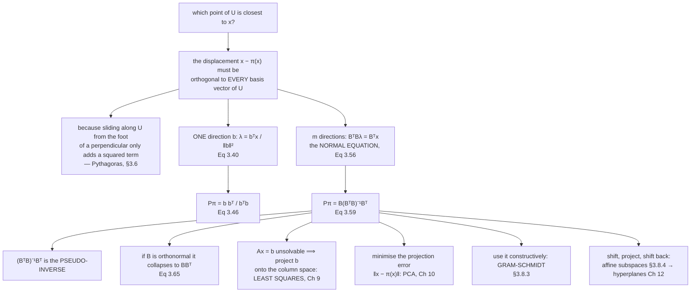

import DataCampExercise from "../../../../components/DataCampExercise.astro";
import Figure from "../../../../components/Figure.astro";
import ProjectionLab from "../../../../components/viz/math/ProjectionLab.tsx";
import Quiz from "../../../../components/Quiz.astro";

This is the section the chapter exists for. Everything before it — norms, inner products, angles,
orthogonality, complements — was assembled so that this question could be answered:

> Given a subspace $U$ and a vector $\mathbf{x}$ outside it, which point of $U$ is closest to
> $\mathbf{x}$?

The answer is a three-line recipe, and it is the most reused computation in the remainder of the book.
Least squares in Chapter 9 **is** this computation. PCA in Chapter 10 minimises the error this
computation leaves behind. The margin of a support vector machine in Chapter 12 is the affine version of
it. Learn it once here and those chapters become applications rather than new material.

## What you'll learn

- Definition 3.10 and the property $\pi^2 = \pi$ that defines a projection.
- Projection onto a **line** (§3.8.1): $\lambda = \dfrac{\mathbf{b}^\top\mathbf{x}}{\lVert\mathbf{b}\rVert^2}$ and $\mathbf{P}_\pi = \dfrac{\mathbf{b}\mathbf{b}^\top}{\mathbf{b}^\top\mathbf{b}}$.
- Projection onto a **general subspace** (§3.8.2): the **normal equation**, the **pseudo-inverse**, and the projection matrix $\mathbf{B}(\mathbf{B}^\top\mathbf{B})^{-1}\mathbf{B}^\top$.
- **Gram-Schmidt** (§3.8.3) as projection used constructively.
- Projection onto an **affine subspace** (§3.8.4): shift, project, shift back.
- Why least squares is a projection, and why PCA is the projection error minimised — both measured on real data.

## Intuition: the shadow at noon

A projection is a shadow cast by a light directly overhead. The pencil is $\mathbf{x}$, the floor is
$U$, and the shadow is $\pi_U(\mathbf{x})$.

Three properties of that shadow give you the whole of §3.8 before any algebra.

- **The shadow is on the floor.** $\pi_U(\mathbf{x}) \in U$ — that is what makes the problem finite: instead of $n$ ambient coordinates you need only $\dim U$ of them.
- **The shadow of a shadow is itself.** Something already flat on the floor casts itself. That is $\pi^2 = \pi$, and it is the *definition* of a projection.
- **The line from the pencil to its shadow is vertical.** Perpendicular to the floor — which is why "closest" and "perpendicular displacement" are the same condition, by Pythagoras.



## The math

:::note[Definition 3.10 — Projection]
Let $V$ be a vector space and $U \subseteq V$ a subspace. A linear mapping
$\pi : V \to U$ is a **projection** if

$$
\pi^2 = \pi \circ \pi = \pi .
$$

Since a linear mapping can be written as a matrix, the same condition on the **projection matrix**
$\mathbf{P}_\pi$ reads

$$
\mathbf{P}_\pi^2 = \mathbf{P}_\pi .
$$
:::

Idempotence is the whole definition. It says nothing about orthogonality — an **oblique** projection is
idempotent too, and it is a projection. What the rest of this section adds is the extra requirement
that the displacement be *perpendicular* to $U$, which is what makes the result the **closest** point
rather than merely some point.

### Projection onto a one-dimensional subspace

Let $U = \mathrm{span}[\mathbf{b}]$ be a line through the origin. Since $\pi_U(\mathbf{x}) \in U$, it is
$\lambda\mathbf{b}$ for some scalar $\lambda$, and there is exactly one unknown.

**Step 1 — find $\lambda$.** The displacement must be orthogonal to $\mathbf{b}$:

$$
\langle \mathbf{b},\ \mathbf{x} - \lambda\mathbf{b}\rangle = 0
\;\Longleftrightarrow\;
\mathbf{b}^\top\mathbf{x} - \lambda\,\mathbf{b}^\top\mathbf{b} = 0
\;\Longleftrightarrow\;
\lambda = \frac{\mathbf{b}^\top\mathbf{x}}{\mathbf{b}^\top\mathbf{b}} = \frac{\mathbf{b}^\top\mathbf{x}}{\lVert\mathbf{b}\rVert^2}
\tag{3.40}
$$

**Step 2 — the projection.**

$$
\pi_U(\mathbf{x}) = \lambda\mathbf{b} = \frac{\mathbf{b}^\top\mathbf{x}}{\lVert\mathbf{b}\rVert^2}\,\mathbf{b}
\tag{3.42}
$$

Its length has a clean form (Equations 3.43 and 3.44):

$$
\lVert\pi_U(\mathbf{x})\rVert = \lvert\lambda\rvert\,\lVert\mathbf{b}\rVert = \lvert\cos\omega\rvert\,\lVert\mathbf{x}\rVert
$$

so the projection is the original length scaled by the absolute cosine of the angle — which is $1$ when
$\mathbf{x}$ is already on the line and $0$ when it is perpendicular to it.

**Step 3 — the projection matrix.** Step 2 is linear in $\mathbf{x}$, so rewrite it as a matrix acting
on $\mathbf{x}$:

$$
\pi_U(\mathbf{x}) = \frac{\mathbf{b}\,(\mathbf{b}^\top\mathbf{x})}{\lVert\mathbf{b}\rVert^2}
= \frac{\mathbf{b}\mathbf{b}^\top}{\lVert\mathbf{b}\rVert^2}\,\mathbf{x}
\qquad\Longrightarrow\qquad
\mathbf{P}_\pi = \frac{\mathbf{b}\mathbf{b}^\top}{\mathbf{b}^\top\mathbf{b}}
\tag{3.46}
$$

Note the reordering in the numerator — moving $\mathbf{b}$ to the left of the scalar
$\mathbf{b}^\top\mathbf{x}$ turns a vector-times-scalar into a matrix-times-vector, and that is the whole
trick. $\mathbf{b}\mathbf{b}^\top$ is an **outer** product: an $n \times n$ matrix of rank $1$. So
$\mathbf{P}_\pi$ is always symmetric and always of rank $1$ here.

### Projection onto a general subspace

Now $\dim U = m \geq 1$, with an ordered basis $(\mathbf{b}_1, \dots, \mathbf{b}_m)$ stacked as the
columns of $\mathbf{B} \in \mathbb{R}^{n \times m}$. The same three steps.

**Step 1 — the coordinates.** $\pi_U(\mathbf{x}) = \sum_i \lambda_i\mathbf{b}_i = \mathbf{B}\boldsymbol{\lambda}$,
and "closest" means the displacement is orthogonal to *all* $m$ basis vectors, giving $m$ simultaneous
conditions:

$$
\mathbf{b}_1^\top(\mathbf{x} - \mathbf{B}\boldsymbol{\lambda}) = 0,\quad\dots,\quad \mathbf{b}_m^\top(\mathbf{x} - \mathbf{B}\boldsymbol{\lambda}) = 0
$$

Stack them:

$$
\mathbf{B}^\top(\mathbf{x} - \mathbf{B}\boldsymbol{\lambda}) = \mathbf{0}
\;\Longleftrightarrow\;
\boxed{\ \mathbf{B}^\top\mathbf{B}\,\boldsymbol{\lambda} = \mathbf{B}^\top\mathbf{x}\ }
\tag{3.56}
$$

This is the **normal equation**. Because $\mathbf{b}_1,\dots,\mathbf{b}_m$ are a basis and therefore
linearly independent, $\mathbf{B}^\top\mathbf{B} \in \mathbb{R}^{m\times m}$ is invertible, so

$$
\boldsymbol{\lambda} = (\mathbf{B}^\top\mathbf{B})^{-1}\mathbf{B}^\top\mathbf{x}
\tag{3.57}
$$

The matrix $(\mathbf{B}^\top\mathbf{B})^{-1}\mathbf{B}^\top$ is the **pseudo-inverse** of $\mathbf{B}$.
It exists for non-square $\mathbf{B}$; it requires only that $\mathbf{B}^\top\mathbf{B}$ be positive
definite, which holds when $\mathbf{B}$ has full column rank.

**Step 2 — the projection.**

$$
\pi_U(\mathbf{x}) = \mathbf{B}\boldsymbol{\lambda} = \mathbf{B}(\mathbf{B}^\top\mathbf{B})^{-1}\mathbf{B}^\top\mathbf{x}
\tag{3.58}
$$

**Step 3 — the projection matrix.**

$$
\mathbf{P}_\pi = \mathbf{B}(\mathbf{B}^\top\mathbf{B})^{-1}\mathbf{B}^\top
\tag{3.59}
$$

Two special cases fall out immediately. If $m = 1$ then $\mathbf{B}^\top\mathbf{B}$ is a scalar and
Equation 3.59 becomes $\mathbf{b}\mathbf{b}^\top / \mathbf{b}^\top\mathbf{b}$ — Equation 3.46 exactly, so
§3.8.1 was never a separate result. And if the basis is **orthonormal**, $\mathbf{B}^\top\mathbf{B} = \mathbf{I}$
and everything collapses:

$$
\pi_U(\mathbf{x}) = \mathbf{B}\mathbf{B}^\top\mathbf{x},
\qquad
\boldsymbol{\lambda} = \mathbf{B}^\top\mathbf{x}
\tag{3.65, 3.66}
$$

which is what §3.5 promised and why every numerical routine hands you an orthonormal basis.

**The projection error** (Equation 3.63), also called the **reconstruction error**, is

$$
\lVert \mathbf{x} - \pi_U(\mathbf{x})\rVert
$$

and this is the quantity PCA minimises.

### The ridge, and where it comes from

The book adds a note worth carrying: in practice one often adds a "jitter term" $\varepsilon\mathbf{I}$ to
$\mathbf{B}^\top\mathbf{B}$ to guarantee numerical stability and positive definiteness. That is exactly
ridge regularisation, and the book says it can be rigorously derived by Bayesian inference — see
Chapter 9.

### Gram-Schmidt

:::note[Equations 3.67 and 3.68 — Gram-Schmidt orthogonalisation]
$$
\mathbf{u}_1 := \mathbf{b}_1,
\qquad
\mathbf{u}_k := \mathbf{b}_k - \pi_{\mathrm{span}[\mathbf{u}_1,\dots,\mathbf{u}_{k-1}]}(\mathbf{b}_k), \quad k = 2,\dots,n
$$

Each step projects $\mathbf{b}_k$ onto the subspace spanned by the orthogonal vectors built so far and
subtracts that projection off. The remainder is orthogonal to all of them.
:::

This is §3.8.2 used constructively rather than as an answer — the same projection, applied to build a
basis instead of to answer a question about one. The numerical hazards are on the
[Orthonormal Basis](../orthonormal-basis/) page, and they are severe.

### Projection onto an affine subspace

:::note[Equations 3.72 and 3.73 — affine projection]
Let $L = \mathbf{x}_0 + U$ be an affine subspace with support point $\mathbf{x}_0$ and direction space
$U$. Then

$$
\pi_L(\mathbf{x}) = \mathbf{x}_0 + \pi_U(\mathbf{x} - \mathbf{x}_0)
$$

$$
d(\mathbf{x}, L) = \lVert \mathbf{x} - \pi_L(\mathbf{x})\rVert = d(\mathbf{x} - \mathbf{x}_0,\ \pi_U(\mathbf{x} - \mathbf{x}_0))
$$
:::

Three moves: subtract the support point so the problem becomes a subspace problem, project, add the
support point back. Nothing new is computed — the distance to an affine subspace is literally the
distance from the *shifted* vector to the *direction space*. Chapter 12 uses this to derive the
separating hyperplane.

:::tip[From the book]
Section 3.8, Definition 3.10 with Figure 3.9. §3.8.1 is Equations 3.39 to 3.46 with Figure 3.10 and
Example 3.10 (Equations 3.47 and 3.48); the Remark there notes that $\pi_U(\mathbf{x})$ is an
eigenvector of $\mathbf{P}_\pi$ with eigenvalue $1$, using Chapter 4. §3.8.2 is Equations 3.49 to 3.66
with Figure 3.11 and Example 3.11 (Equations 3.60 to 3.64), including the projection error Equation 3.63
and the ONB collapse Equations 3.65 and 3.66. A margin note warns that **if $U$ is given by a set of
spanning vectors that are not a basis, you must determine a basis first**. §3.8.3 is Gram-Schmidt,
Equations 3.67 and 3.68, with Example 3.12 and Figure 3.12. §3.8.4 is the affine case, Equations 3.72 and
3.73, with Figure 3.13. §3.10 notes that projections generate shadows in computer graphics, minimise
residuals in optimisation, and underlie both linear regression (Ch 9) and PCA (Ch 10).
:::

## Worked example by hand

### Example 3.10 — projection onto a line

Find $\mathbf{P}_\pi$ for the line through the origin spanned by $\mathbf{b} = (1,2,2)^\top$.

$\mathbf{b}^\top\mathbf{b} = 1 + 4 + 4 = 9$, and the outer product is

$$
\mathbf{b}\mathbf{b}^\top = \begin{bmatrix}1\\2\\2\end{bmatrix}\begin{bmatrix}1 & 2 & 2\end{bmatrix}
= \begin{bmatrix}1 & 2 & 2\\ 2 & 4 & 4\\ 2 & 4 & 4\end{bmatrix}
$$

$$
\mathbf{P}_\pi = \frac{1}{9}\begin{bmatrix}1 & 2 & 2\\ 2 & 4 & 4\\ 2 & 4 & 4\end{bmatrix}
\tag{3.47}
$$

Now project $\mathbf{x} = (1,1,1)^\top$. Row by row:

| row | working | result |
| --- | --- | --- |
| 1 | $1 + 2 + 2$ | $5$ |
| 2 | $2 + 4 + 4$ | $10$ |
| 3 | $2 + 4 + 4$ | $10$ |

$$
\pi_U(\mathbf{x}) = \frac{1}{9}\begin{bmatrix}5\\10\\10\end{bmatrix} \in \mathrm{span}\!\left[\begin{bmatrix}1\\2\\2\end{bmatrix}\right]
\tag{3.48}
$$

which is $\tfrac{5}{9}\mathbf{b}$, and indeed $\lambda = \mathbf{b}^\top\mathbf{x}/\mathbf{b}^\top\mathbf{b} = 5/9 = 0.555556$.
Applying $\mathbf{P}_\pi$ again changes nothing, as Definition 3.10 requires. Measured: the eigenvalues
of $\mathbf{P}_\pi$ are $(0, 0, 1)$, the rank is $1$ and the trace is $1$.

### Example 3.11 — projection onto a plane

$$
U = \mathrm{span}\!\left[\begin{bmatrix}1\\1\\1\end{bmatrix}, \begin{bmatrix}0\\1\\2\end{bmatrix}\right] \subseteq \mathbb{R}^3,
\qquad
\mathbf{x} = \begin{bmatrix}6\\0\\0\end{bmatrix}
$$

**First**, check the generating set is a basis. The two vectors are not multiples of each other, so they
are linearly independent, and

$$
\mathbf{B} = \begin{bmatrix}1 & 0\\ 1 & 1\\ 1 & 2\end{bmatrix} .
$$

**Second**, form the two pieces of the normal equation:

$$
\mathbf{B}^\top\mathbf{B} = \begin{bmatrix}1&1&1\\0&1&2\end{bmatrix}\begin{bmatrix}1&0\\1&1\\1&2\end{bmatrix} = \begin{bmatrix}3&3\\3&5\end{bmatrix},
\qquad
\mathbf{B}^\top\mathbf{x} = \begin{bmatrix}1&1&1\\0&1&2\end{bmatrix}\begin{bmatrix}6\\0\\0\end{bmatrix} = \begin{bmatrix}6\\0\end{bmatrix}
\tag{3.60}
$$

**Third**, solve $\begin{bmatrix}3&3\\3&5\end{bmatrix}\boldsymbol{\lambda} = \begin{bmatrix}6\\0\end{bmatrix}$.
Subtracting the first row from the second gives $2\lambda_2 = -6$, so $\lambda_2 = -3$, and then
$3\lambda_1 = 6 - 3(-3) = 15$, so $\lambda_1 = 5$:

$$
\boldsymbol{\lambda} = \begin{bmatrix}5\\-3\end{bmatrix}
\tag{3.61}
$$

**Fourth**, the projection:

$$
\pi_U(\mathbf{x}) = \mathbf{B}\boldsymbol{\lambda} = 5\begin{bmatrix}1\\1\\1\end{bmatrix} - 3\begin{bmatrix}0\\1\\2\end{bmatrix} = \begin{bmatrix}5\\2\\-1\end{bmatrix}
\tag{3.62}
$$

**Fifth**, the projection error:

$$
\lVert\mathbf{x} - \pi_U(\mathbf{x})\rVert = \left\lVert\begin{bmatrix}1\\-2\\1\end{bmatrix}\right\rVert = \sqrt{1+4+1} = \sqrt{6} \approx 2.449490
\tag{3.63}
$$

**Sixth**, the projection matrix:

$$
\mathbf{P}_\pi = \mathbf{B}(\mathbf{B}^\top\mathbf{B})^{-1}\mathbf{B}^\top = \frac{1}{6}\begin{bmatrix}5&2&-1\\2&2&2\\-1&2&5\end{bmatrix}
\tag{3.64}
$$

Measured checks: $\mathbf{B}^\top(\mathbf{x} - \pi_U(\mathbf{x})) = (0, 0)$ **exactly**,
$\mathbf{P}_\pi^2 = \mathbf{P}_\pi$, the rank is $2$, the trace is $2$, and the eigenvalues are
$(0, 1, 1)$.

That last pattern is not a coincidence, and it is the cleanest way to recognise a projection matrix:
$\mathbf{P}^2 = \mathbf{P}$ forces every eigenvalue to satisfy $\lambda^2 = \lambda$, so
$\lambda \in \{0, 1\}$, and the number of ones is the dimension of the subspace. Since the trace is the
sum of the eigenvalues, **the trace of a projection matrix equals the dimension it projects onto**.

### Example 3.12 — Gram-Schmidt

$\mathbf{b}_1 = (2,0)^\top$, $\mathbf{b}_2 = (1,1)^\top$.

$\mathbf{u}_1 = \mathbf{b}_1 = (2,0)^\top$, and

$$
\mathbf{u}_2 = \mathbf{b}_2 - \frac{\mathbf{u}_1\mathbf{u}_1^\top}{\lVert\mathbf{u}_1\rVert^2}\mathbf{b}_2
= \begin{bmatrix}1\\1\end{bmatrix} - \begin{bmatrix}1&0\\0&0\end{bmatrix}\begin{bmatrix}1\\1\end{bmatrix}
= \begin{bmatrix}1\\1\end{bmatrix} - \begin{bmatrix}1\\0\end{bmatrix}
= \begin{bmatrix}0\\1\end{bmatrix}
\tag{3.71}
$$

and $\mathbf{u}_1^\top\mathbf{u}_2 = 0$. The projection matrix
$\mathbf{u}_1\mathbf{u}_1^\top/\lVert\mathbf{u}_1\rVert^2 = \mathrm{diag}(1,0)$ is worth a second look: it
keeps the first coordinate and discards the second, which is exactly what projecting onto the
$x_1$-axis should do.

### An affine projection

$L = \mathbf{x}_0 + U$ with $\mathbf{x}_0 = (1,2,-1)^\top$ and
$U = \mathrm{span}[(1,1,0)^\top, (0,1,1)^\top]$; project $\mathbf{x} = (4,0,2)^\top$.

| step | working | result |
| --- | --- | --- |
| shift | $\mathbf{x} - \mathbf{x}_0$ | $(3, -2, 3)^\top$ |
| project onto $U$ | $\pi_U(3,-2,3)$ | $(0.333333,\ 0.666667,\ 0.333333)^\top$ |
| shift back | $\mathbf{x}_0 + \pi_U(\cdot)$ | $(1.333333,\ 2.666667,\ -0.666667)^\top$ |
| distance | $\lVert\mathbf{x} - \pi_L(\mathbf{x})\rVert$ | $4.618802$ |
| the same, via Eq 3.73b | $d(\mathbf{x}-\mathbf{x}_0,\ \pi_U(\mathbf{x}-\mathbf{x}_0))$ | $4.618802$ |

The two distances agree exactly, which is the content of Equation 3.73: translation does not change
distances, so the affine problem never needed its own formula.

```python title="book_examples.py" showLineNumbers{1}
import numpy as np

# --- Example 3.10: projection onto a line ---------------------------------
b = np.array([1.0, 2.0, 2.0])
P = np.outer(b, b) / float(b @ b)
print("9 * P =\n", 9 * P)
x = np.array([1.0, 1.0, 1.0])
print("lambda =", float(b @ x) / float(b @ b))
print("9 * pi(x) =", 9 * (P @ x))
print("P^2 = P:", np.allclose(P @ P, P), " rank", np.linalg.matrix_rank(P),
      " trace", round(float(np.trace(P)), 12), " eig", np.round(np.linalg.eigvalsh(P), 12))

# --- Example 3.11: projection onto a plane --------------------------------
B = np.array([[1.0, 0.0], [1.0, 1.0], [1.0, 2.0]])
x = np.array([6.0, 0.0, 0.0])
G, c = B.T @ B, B.T @ x
print("B^T B =\n", G, "\nB^T x =", c)
lam = np.linalg.solve(G, c)
pi = B @ lam
err = x - pi
Pm = B @ np.linalg.inv(G) @ B.T
print("lambda =", lam, " pi(x) =", pi)
print("error =", err, " norm =", np.linalg.norm(err), " sqrt(6) =", np.sqrt(6))
print("6 * P =\n", np.round(6 * Pm, 10))
print("B^T error =", np.round(B.T @ err, 12))
print("P^2 = P:", np.allclose(Pm @ Pm, Pm), " rank", np.linalg.matrix_rank(Pm),
      " trace", round(float(np.trace(Pm)), 12), " eig", np.round(np.linalg.eigvalsh(Pm), 12))

# --- Affine: shift, project, shift back -----------------------------------
x0 = np.array([1.0, 2.0, -1.0])
Ba = np.stack([np.array([1.0, 1.0, 0.0]), np.array([0.0, 1.0, 1.0])], axis=1)
Q, _ = np.linalg.qr(Ba)
xa = np.array([4.0, 0.0, 2.0])
shifted = xa - x0
pu = Q @ (Q.T @ shifted)
pl = x0 + pu
print("pi_L(x) =", np.round(pl, 6))
print("d(x, L) =", round(float(np.linalg.norm(xa - pl)), 6),
      " via Eq 3.73b =", round(float(np.linalg.norm(shifted - pu)), 6))
```

```text title="output"
9 * P =
 [[1. 2. 2.]
 [2. 4. 4.]
 [2. 4. 4.]]
lambda = 0.5555555555555556
9 * pi(x) = [ 5. 10. 10.]
P^2 = P: True  rank 1  trace 1.0  eig [0. 0. 1.]
B^T B =
 [[3. 3.]
 [3. 5.]] 
B^T x = [6. 0.]
lambda = [ 5. -3.]  pi(x) = [ 5.  2. -1.]
error = [ 1. -2.  1.]  norm = 2.449489742783178  sqrt(6) = 2.449489742783178
6 * P =
 [[ 5.  2. -1.]
 [ 2.  2.  2.]
 [-1.  2.  5.]]
B^T error = [0. 0.]
P^2 = P: True  rank 2  trace 2.0  eig [-0.  1.  1.]
pi_L(x) = [ 1.333333  2.666667 -0.666667]
d(x, L) = 4.618802  via Eq 3.73b = 4.618802
```

Every number in Examples 3.10 and 3.11 reproduces digit for digit, including the $\sqrt{6}$ projection
error to sixteen figures and the $\mathbf{B}^\top$ error being **exactly** zero rather than $10^{-16}$.

## See it move

The first sketch is §3.8.1 with everything draggable, and it shows the equality
$\lVert\pi_U(\mathbf{x})\rVert = \lvert\cos\omega\rvert\lVert\mathbf{x}\rVert$ live.

```p5 title="Projection onto a line, with the cosine identity live" desc="Drag x and drag b. The green arrow is the projection, the red dashed segment is the error, and the small square marks the right angle at the foot. The readout gives lambda, both routes to the projection's length, and the check that the error is orthogonal to b — which is the condition the formula was derived from." height="520"
let xv = [1.5, 1.9], bv = [2.1, 0.55];
let dragX = false, dragB = false;
const U = 68;
let cx, cy;

function setup() { createCanvas(600, 520); textFont("monospace"); cx = 230; cy = 210; }

function sx(x) { return cx + x * U; }
function sy(y) { return cy - y * U; }
function dx_(s) { return (s - cx) / U; }
function dy_(s) { return (cy - s) / U; }

function mousePressed() {
  if (Math.hypot(mouseX - sx(bv[0]), mouseY - sy(bv[1])) < 20) { dragB = true; return; }
  if (Math.hypot(mouseX - sx(xv[0]), mouseY - sy(xv[1])) < 22) dragX = true;
}
function mouseReleased() { dragX = false; dragB = false; }
function mouseDragged() {
  if (dragB) bv = [Math.max(-3.2, Math.min(3.4, dx_(mouseX))), Math.max(-2.4, Math.min(2.4, dy_(mouseY)))];
  else if (dragX) xv = [Math.max(-3.2, Math.min(3.4, dx_(mouseX))), Math.max(-2.4, Math.min(2.4, dy_(mouseY)))];
  if (!isLooping()) redraw();
}

function arrow(x1, y1, x2, y2, c, w) {
  stroke(c); strokeWeight(w); line(x1, y1, x2, y2);
  push(); translate(x2, y2); rotate(Math.atan2(y2 - y1, x2 - x1));
  fill(c); noStroke(); triangle(0, 0, -9, -4, -9, 4); pop();
}

function draw() {
  background(13, 17, 23);

  stroke(32, 44, 58); strokeWeight(1);
  for (let g = -4; g <= 5; g++) line(sx(g), sy(-3), sx(g), sy(3));
  for (let g = -3; g <= 3; g++) line(sx(-4), sy(g), sx(5), sy(g));
  stroke(58, 72, 88); strokeWeight(1.2);
  line(sx(-4), sy(0), sx(5), sy(0)); line(sx(0), sy(-3), sx(0), sy(3));

  const bb = bv[0] * bv[0] + bv[1] * bv[1];
  const nb = Math.sqrt(bb);
  const lam = bb > 1e-9 ? (bv[0] * xv[0] + bv[1] * xv[1]) / bb : 0;
  const pr = [lam * bv[0], lam * bv[1]];
  const er = [xv[0] - pr[0], xv[1] - pr[1]];

  // The line U.
  if (nb > 1e-9) {
    stroke(255, 211, 67, 120); strokeWeight(2);
    line(sx(-6 * bv[0] / nb), sy(-6 * bv[1] / nb), sx(6 * bv[0] / nb), sy(6 * bv[1] / nb));
  }

  // The right angle at the foot.
  if (nb > 1e-9 && Math.hypot(er[0], er[1]) > 1e-6) {
    const uh = [bv[0] / nb, bv[1] / nb];
    const ne = Math.hypot(er[0], er[1]);
    const eh = [er[0] / ne, er[1] / ne];
    const s1 = 13;
    noFill(); stroke(200, 205, 215, 170); strokeWeight(1.2);
    beginShape();
    vertex(sx(pr[0] + 0.19 * uh[0]), sy(pr[1] + 0.19 * uh[1]));
    vertex(sx(pr[0] + 0.19 * uh[0] + 0.19 * eh[0]), sy(pr[1] + 0.19 * uh[1] + 0.19 * eh[1]));
    vertex(sx(pr[0] + 0.19 * eh[0]), sy(pr[1] + 0.19 * eh[1]));
    endShape();
  }

  stroke(232, 110, 110); strokeWeight(2.2);
  drawingContext.setLineDash([5, 4]);
  line(sx(pr[0]), sy(pr[1]), sx(xv[0]), sy(xv[1]));
  drawingContext.setLineDash([]);

  arrow(sx(0), sy(0), sx(bv[0]), sy(bv[1]), color(255, 211, 67), 2.4);
  arrow(sx(0), sy(0), sx(xv[0]), sy(xv[1]), color(245), 3);
  arrow(sx(0), sy(0), sx(pr[0]), sy(pr[1]), color(120, 200, 140), 3);
  noStroke();
  fill(255, 211, 67); ellipse(sx(bv[0]), sy(bv[1]), 11, 11);
  fill(255); ellipse(sx(xv[0]), sy(xv[1]), 12, 12);
  fill(120, 200, 140); ellipse(sx(pr[0]), sy(pr[1]), 10, 10);

  textSize(12); textAlign(LEFT, TOP);
  fill(255, 211, 67); text("b (drag)", sx(bv[0]) + 9, sy(bv[1]) - 20);
  fill(245); text("x (drag)", sx(xv[0]) + 9, sy(xv[1]) - 20);
  fill(120, 200, 140); text("pi(x)", sx(pr[0]) + 9, sy(pr[1]) + 8);
  fill(232, 110, 110); textSize(11);
  text("error", (sx(pr[0]) + sx(xv[0])) / 2 + 8, (sy(pr[1]) + sy(xv[1])) / 2);

  const nx = Math.hypot(xv[0], xv[1]);
  const npr = Math.hypot(pr[0], pr[1]);
  const cosw = nx > 1e-9 && nb > 1e-9 ? (xv[0] * bv[0] + xv[1] * bv[1]) / (nx * nb) : 0;
  const ipErr = bv[0] * er[0] + bv[1] * er[1];

  fill(255, 211, 67); textSize(14); textAlign(LEFT, TOP); text("Drag x and b", 20, 14);
  fill(215); textSize(11);
  text(`lambda = b.x / b.b = ${lam.toFixed(6)}`, 30, 376);
  text(`||pi(x)||            = ${npr.toFixed(6)}`, 30, 398);
  text(`|cos w| * ||x||      = ${(Math.abs(cosw) * nx).toFixed(6)}`, 30, 418);
  fill(Math.abs(npr - Math.abs(cosw) * nx) < 1e-9 ? color(120, 200, 140) : color(232, 110, 110));
  text(`Eq 3.44 gap           = ${Math.abs(npr - Math.abs(cosw) * nx).toExponential(1)}`, 30, 440);
  fill(Math.abs(ipErr) < 1e-9 ? color(120, 200, 140) : color(232, 110, 110)); textSize(11);
  text(`<b, x - pi(x)> = ${ipErr.toExponential(2)}`, 30, 466);
  fill(150); textSize(10);
  text("The projection depends only on b's DIRECTION: drag b longer and pi(x) does not move.", 20, 494);
}
```

The second sketch drops a point cloud onto a line and shows what PCA is choosing between: rotate the
line and watch the total squared error and the total projected spread trade off exactly.

```p5 title="Rotate the line: what PCA is actually optimising" desc="Twenty points, a line through their mean, and every point's projection onto it. Drag the angle knob. The two bars are the total squared projection error and the variance of the projected coordinates, and their sum is constant — so minimising the error and maximising the spread are the same problem, which is the whole of Chapter 10 in one control." height="540"
let ang = 0.35;
let KNOBS = [], dragging = null;
const PTS = [];
const U = 52;
let cx, cy, best = 0;

function setup() {
  createCanvas(600, 540); textFont("monospace"); cx = 200; cy = 190;
  // A fixed, mildly correlated cloud. Written out so the sketch is deterministic.
  const raw = [
    [-2.1, -1.3], [-1.7, -0.6], [-1.5, -1.2], [-1.1, -0.2], [-0.9, -0.8],
    [-0.6, 0.1], [-0.4, -0.5], [-0.1, 0.3], [0.1, -0.1], [0.3, 0.5],
    [0.5, 0.0], [0.7, 0.6], [0.9, 0.2], [1.1, 0.8], [1.3, 0.4],
    [1.5, 1.0], [1.7, 0.5], [1.9, 1.2], [2.1, 0.7], [2.4, 1.4],
  ];
  let mx = 0, my = 0;
  for (const p of raw) { mx += p[0]; my += p[1]; }
  mx /= raw.length; my /= raw.length;
  for (const p of raw) PTS.push([p[0] - mx, p[1] - my]);
  // The optimal angle, found by scanning, so the sketch can mark it.
  let lo = Infinity;
  for (let a = 0; a < Math.PI; a += 0.0005) {
    const d = [Math.cos(a), Math.sin(a)];
    let e = 0;
    for (const p of PTS) {
      const t = p[0] * d[0] + p[1] * d[1];
      e += (p[0] - t * d[0]) ** 2 + (p[1] - t * d[1]) ** 2;
    }
    if (e < lo) { lo = e; best = a; }
  }
}

function sx(x) { return cx + x * U; }
function sy(y) { return cy - y * U; }

function knob(id, x, y, w, value, mn, mx, label) {
  KNOBS.push({ id, x, y, w, mn, mx });
  const t = (value - mn) / (mx - mn);
  stroke(60, 74, 92); strokeWeight(2); line(x, y, x + w, y);
  const tb = (best - mn) / (mx - mn);
  stroke(120, 200, 140); strokeWeight(2); line(x + tb * w, y - 7, x + tb * w, y + 7);
  noStroke(); fill(255, 211, 67); ellipse(x + t * w, y, 11, 11);
  fill(190, 200, 212); textSize(11); textAlign(LEFT, CENTER);
  text(label, x + w + 12, y);
}
function mousePressed() {
  for (const k of KNOBS) {
    if (mouseY > k.y - 12 && mouseY < k.y + 12 && mouseX > k.x - 12 && mouseX < k.x + k.w + 12) {
      dragging = k; return;
    }
  }
}
function mouseReleased() { dragging = null; }
function mouseDragged() {
  if (!dragging) return;
  const t = Math.min(1, Math.max(0, (mouseX - dragging.x) / dragging.w));
  ang = dragging.mn + t * (dragging.mx - dragging.mn);
  if (!isLooping()) redraw();
}

function draw() {
  background(13, 17, 23);
  KNOBS = [];

  stroke(32, 44, 58); strokeWeight(1);
  for (let g = -4; g <= 6; g++) line(sx(g), sy(-3), sx(g), sy(3));
  for (let g = -3; g <= 3; g++) line(sx(-4), sy(g), sx(6), sy(g));
  stroke(58, 72, 88); strokeWeight(1.2);
  line(sx(-4), sy(0), sx(6), sy(0)); line(sx(0), sy(-3), sx(0), sy(3));

  const d = [Math.cos(ang), Math.sin(ang)];
  stroke(255, 211, 67); strokeWeight(2.4);
  line(sx(-6 * d[0]), sy(-6 * d[1]), sx(6 * d[0]), sy(6 * d[1]));

  let err = 0, spread = 0, total = 0;
  for (const p of PTS) {
    const t = p[0] * d[0] + p[1] * d[1];
    const q = [t * d[0], t * d[1]];
    err += (p[0] - q[0]) ** 2 + (p[1] - q[1]) ** 2;
    spread += t * t;
    total += p[0] * p[0] + p[1] * p[1];
    stroke(232, 110, 110, 170); strokeWeight(1.2);
    line(sx(p[0]), sy(p[1]), sx(q[0]), sy(q[1]));
    noStroke(); fill(120, 200, 140); ellipse(sx(q[0]), sy(q[1]), 6, 6);
    fill(75, 139, 190); ellipse(sx(p[0]), sy(p[1]), 8, 8);
  }

  knob("a", 40, 370, 240, ang, 0, Math.PI, `angle = ${(ang * 180 / Math.PI).toFixed(2)} deg`);

  // Two bars sharing one baseline: they must fill it exactly.
  const bx = 40, by = 420, bw = 380;
  const sc = bw / Math.max(total, 0.001);
  noStroke();
  fill(120, 200, 140); rect(bx, by, spread * sc, 20, 3);
  fill(232, 110, 110); rect(bx + spread * sc, by, err * sc, 20, 3);
  noFill(); stroke(190); strokeWeight(1.2); rect(bx, by, total * sc, 20, 3);

  noStroke(); textAlign(LEFT, TOP); textSize(11);
  fill(120, 200, 140); text(`kept ${spread.toFixed(4)}`, bx + 4, by + 3);
  fill(232, 110, 110); text(`lost ${err.toFixed(4)}`, bx + spread * sc + 4, by + 3);
  fill(190); text(`total ${total.toFixed(4)}   sum of the two: ${(spread + err).toFixed(4)}`, bx, by + 28);

  fill(255, 211, 67); textSize(14); text("Rotate the line", 30, 14);
  fill(215); textSize(11);
  text(`squared projection error   ${err.toFixed(6)}`, 320, 44);
  text(`projected spread           ${spread.toFixed(6)}`, 320, 64);
  text(`their sum (constant)       ${(err + spread).toFixed(6)}`, 320, 84);
  fill(Math.abs(ang - best) < 0.01 ? color(120, 200, 140) : color(150)); textSize(11);
  text(Math.abs(ang - best) < 0.01 ? "at the optimum: this is the first principal component"
                                   : `optimum is at ${(best * 180 / Math.PI).toFixed(2)} deg (green tick)`, 320, 110);
  fill(150); textSize(10);
  text("Pythagoras again: every point's squared length splits into a kept part and a lost part,", 30, 484);
  text("so minimising the red bar and maximising the green one are one problem, not two.", 30, 500);
  text("That equivalence is the whole derivation of PCA in Chapter 10.", 30, 516);
}
```

Now the stepped versions of both book examples. First the line, Example 3.10:

<ProjectionLab
  client:visible
  mode="line"
  basis={[[1, 2, 2]]}
  target={[1, 1, 1]}
  title="Example 3.10, step by step"
  desc="One direction, so one unknown and no system to solve. The last two frames multiply out the projection matrix and check that squaring it changes nothing."
/>

Then the plane, Example 3.11 — with the normal equation formed and solved on screen:

<ProjectionLab
  client:visible
  mode="plane"
  basis={[[1, 1, 1], [0, 1, 2]]}
  target={[6, 0, 0]}
  title="Example 3.11, step by step"
  desc="Watch the Gram matrix appear, get inverted, and produce lambda = (5, -3). The verification frame measures the inner product of the displacement against each basis vector, and both are exactly zero."
/>

## From scratch

```python title="projection_from_scratch.py" showLineNumbers{1}
import numpy as np

def project(x, B, ridge=0.0):
    """Project x onto the column span of B, three ways, and check they agree.

    `ridge` is the book's jitter term: adding eps*I to B^T B guarantees positive
    definiteness. It changes the answer, which is the point of the pitfall below.
    """
    B = np.atleast_2d(np.asarray(B, dtype=float))
    if B.shape[0] == 1:
        B = B.T
    m = B.shape[1]

    # Route 1: the normal equation, as stated in Equation 3.56.
    G = B.T @ B + ridge * np.eye(m)
    lam = np.linalg.solve(G, B.T @ x)
    p1 = B @ lam

    # Route 2: the projection matrix of Equation 3.59, formed explicitly.
    P = B @ np.linalg.inv(G) @ B.T
    p2 = P @ x

    # Route 3: an orthonormal basis, where everything collapses to B B^T.
    Q, _ = np.linalg.qr(B)
    p3 = Q @ (Q.T @ x)

    return {
        "lambda": lam,
        "projection": p1,
        "P": P,
        "error": x - p1,
        "error_norm": float(np.linalg.norm(x - p1)),
        "route_1_vs_2": float(np.linalg.norm(p1 - p2)),
        "route_1_vs_3": float(np.linalg.norm(p1 - p3)),
        "idempotent": float(np.linalg.norm(P @ P - P)),
        "symmetric": float(np.linalg.norm(P - P.T)),
        "orthogonal_residual": float(np.abs(B.T @ (x - p1)).max()),
        "rank": int(np.linalg.matrix_rank(P)),
        "trace": float(np.trace(P)),
    }

B = np.array([[1.0, 0.0], [1.0, 1.0], [1.0, 2.0]])
x = np.array([6.0, 0.0, 0.0])
r = project(x, B)
for k in ("lambda", "projection", "error", "error_norm", "route_1_vs_2", "route_1_vs_3",
          "idempotent", "symmetric", "orthogonal_residual", "rank", "trace"):
    v = r[k]
    print(f"{k:22}", np.round(v, 12) if isinstance(v, np.ndarray) else v)

# The three routes agree here, but only one of them survives an ill-conditioned
# basis. A polynomial design matrix is the standard way to produce one: the
# monomials 1, t, t^2, ... are very nearly parallel on a short interval.
print()
n = 40
t = np.linspace(0.0, 1.0, n)
rng = np.random.default_rng(5)
y = rng.normal(size=n)
for degree in (5, 7, 9, 11):
    Bd = np.vander(t, degree + 1, increasing=True)
    G = Bd.T @ Bd
    p_normal = Bd @ np.linalg.solve(G, Bd.T @ y)
    Qb, _ = np.linalg.qr(Bd)
    p_qr = Qb @ (Qb.T @ y)
    print(f"degree {degree:3}   cond(B) {np.linalg.cond(Bd):9.2e}   "
          f"cond(B^T B) {np.linalg.cond(G):9.2e}   "
          f"|normal-eq minus QR| {np.linalg.norm(p_normal - p_qr):.3e}")
```

```text title="output"
lambda                 [ 5. -3.]
projection             [ 5.  2. -1.]
error                  [ 1. -2.  1.]
error_norm             2.449489742783178
route_1_vs_2           6.280369834735101e-16
route_1_vs_3           6.661338147750939e-16
idempotent             2.6910028968576024e-16
symmetric              0.0
orthogonal_residual    0.0
rank                   2
trace                  1.9999999999999998

degree   5   cond(B)  3.48e+03   cond(B^T B)  1.21e+07   |normal-eq minus QR| 7.567e-11
degree   7   cond(B)  1.09e+05   cond(B^T B)  1.18e+10   |normal-eq minus QR| 5.842e-08
degree   9   cond(B)  3.52e+06   cond(B^T B)  1.24e+13   |normal-eq minus QR| 4.811e-06
degree  11   cond(B)  1.18e+08   cond(B^T B)  1.34e+16   |normal-eq minus QR| 4.807e-02
```

The first block is Example 3.11, verified through three independent routes that agree to
$6.7\times10^{-16}$. Note `trace` printing as $1.9999999999999998$ rather than $2$: the trace of a
projection matrix is exactly the dimension mathematically, and two units in the last place numerically.

The second block is the warning, and it is worth reading column by column. `cond(B^T B)` is the
**square** of `cond(B)` in every row, so forming the normal equation doubles the digits you lose. The
consequence is in the last column: at degree $11$, where $\kappa(\mathbf{B}) = 1.2\times10^{8}$ — not an
extreme figure for a polynomial fit — the normal-equation projection is $0.048$ away from the QR answer.
That is not a rounding difference, it is a visible error in the fitted values.

A caution about how to *demonstrate* this, because it is easy to get wrong: if you build a test basis
with orthogonal columns and merely shrink them, $\mathbf{B}^\top\mathbf{B}$ comes out **diagonal** and
solving it loses nothing at all, no matter how large the condition number is. The damage comes from
nearly-*parallel* columns, which is why the demonstration above uses a monomial basis rather than a
scaled orthogonal one.

## On real data

<Figure
  src="/images/mml/orthogonal-projections/least-squares-is-a-projection"
  alt="A scatter of twenty points with a fitted line, each point joined to the line by a short vertical segment, and a panel giving the fitted coefficients, the squared error, the measured X-transpose residual, and the idempotence and rank of the projection matrix."
  title="A regression fit is a projection"
  caption="The fitted values are P y for the projection matrix onto the column space of the design matrix. X-transpose r comes out at 8e-15 rather than zero only because of floating point: the residual is orthogonal to both columns, which is the normal equation. Rank 2, trace 2."
/>

<Figure
  src="/images/mml/orthogonal-projections/projection-error-vs-dimension"
  alt="A curve of mean squared projection error against subspace dimension for 1797 digit images, falling to exactly zero at dimension 61, with four reconstructed digits beneath at dimensions 1, 4, 12 and 40."
  title="The projection error is the objective PCA minimises"
  caption="Each point is the mean squared error of projecting all 1797 images onto their best k-dimensional subspace. The error reaches exactly zero at k = 61, which is the rank of the centred data, and 21 components suffice for 90% of the variance. The reconstructions underneath are the same projection applied to one image."
/>

<Figure
  src="/images/mml/orthogonal-projections/projection-spectrum"
  alt="A stem plot of the eight eigenvalues of a projection matrix onto a three-dimensional subspace, three of them at exactly one and five at exactly zero, with dashed reference lines and a measured panel."
  title="A projection matrix has only two eigenvalues"
  caption="P squared equals P forces every eigenvalue to satisfy lambda squared equals lambda, so each is 0 or 1. Three of them are exactly 1 — the dimension of the subspace — and the trace is 3.000000000000, which is why the trace of a projection matrix tells you the dimension it projects onto."
/>

## Reading the plot

**From the regression figure.** The fitted line is $-0.5066 + 1.2691x$ over twenty points, with a
squared error of $2.321891$. But the number to read is $\mathbf{X}^\top\mathbf{r} = (8.0\times10^{-15},\ -7.6\times10^{-15})$.

That is the normal equation, measured. Fitting a line by least squares and projecting $\mathbf{y}$ onto
the column space of $\mathbf{X}$ are not analogous operations, they are the **same** operation: the
condition that determines the fit is that the residual be orthogonal to every column of the design
matrix, which is Equation 3.56 with $\mathbf{B}$ renamed $\mathbf{X}$.

The projection matrix is rank $2$ with trace $2$ — one for the intercept column and one for the slope
column — and $\lVert\mathbf{P}^2 - \mathbf{P}\rVert = 3.6\times10^{-16}$. In regression this matrix has
its own name, the **hat matrix**, and its diagonal entries are the leverages. Same object, different
vocabulary.

**From the digits curve.** Four measurements worth having:

| $k$ | mean squared error | variance kept |
| --- | --- | --- |
| 1 | $1022.5714$ | $14.89\%$ |
| 4 | $616.1911$ | $48.71\%$ |
| 12 | $258.7058$ | $78.47\%$ |
| 40 | $14.1742$ | $98.82\%$ |
| 61 | $0.0000$ | $100\%$ |

The error hits **exactly** zero at $k = 61$, not at $k = 64$, because the centred data has rank $61$ —
which the [Orthogonal Complement](../orthogonal-complement/) page traced to three pixels that are zero
in all $1797$ images. Beyond $k = 61$ there is nothing left to capture, so the curve does not merely
flatten; it terminates.

And $21$ components carry $90\%$ of the variance. Sixty-four numbers per image compressed to
twenty-one, at a tenth of the squared error — which is a claim about a projection, computed with
Equation 3.59 and nothing else. Chapter 10 will spend a chapter on *which* subspace is best; the fact
that projecting onto a subspace is what you are doing is settled here.

**From the spectrum.** $\mathbf{P}^2 = \mathbf{P}$ implies $\lambda^2 = \lambda$ for every eigenvalue,
so $\lambda \in \{0,1\}$ — measured, three exact ones and five exact zeros. Three consequences follow
for free:

- $\mathrm{rank}(\mathbf{P}) = \dim U$, since the rank is the number of nonzero eigenvalues.
- $\mathrm{trace}(\mathbf{P}) = \dim U$, since the trace is their sum. Measured: $3.000000000000$.
- $\mathbf{P}$ is **not** invertible unless $U$ is the whole space. It throws information away, which is what a projection is for.

That third point is the one people trip over. $\mathbf{P}$ has an inverse only when $\dim U = n$, in
which case $\mathbf{P} = \mathbf{I}$ and the projection was doing nothing.

## Pitfalls

:::danger[Never form B-transpose B if you can avoid it]
$\kappa(\mathbf{B}^\top\mathbf{B}) = \kappa(\mathbf{B})^2$, so the normal equation loses twice as many
digits as the problem requires. The measurement is above: on a degree-11 monomial design with
$\kappa(\mathbf{B}) = 1.2\times10^{8}$, the normal-equation projection differs from the QR projection by
$0.048$. Use
`np.linalg.lstsq`, or a QR factorisation, both of which work on $\mathbf{B}$ directly. Forming
$\mathbf{B}^\top\mathbf{B}$ is fine for a derivation and bad for a computation.
:::

:::danger[A spanning set is not a basis, and Equation 3.59 requires a basis]
The book flags this in a margin note. If $\mathbf{B}$'s columns are linearly dependent then
$\mathbf{B}^\top\mathbf{B}$ is singular and $(\mathbf{B}^\top\mathbf{B})^{-1}$ does not exist. The book's
Exercise 3.5 gives four spanning vectors in $\mathbb{R}^5$ whose rank is only $3$ — Equation 3.59 fails
on them as written, while `lstsq` returns the correct projection regardless, because it uses a
minimum-norm pseudo-inverse rather than an inverse.
:::

:::caution[The jitter term changes the answer]
Adding $\varepsilon\mathbf{I}$ to $\mathbf{B}^\top\mathbf{B}$ makes the solve stable and makes the
result **not a projection**: $\mathbf{P}_\varepsilon^2 \neq \mathbf{P}_\varepsilon$, and the "projection"
lands strictly inside $U$'s reach rather than on the closest point. That shrinkage is exactly what ridge
regression is for and it is a deliberate bias, not a numerical detail. If you add jitter, you are no
longer computing an orthogonal projection; report the $\varepsilon$.
:::

:::caution[Idempotent does not mean orthogonal]
Definition 3.10 asks only for $\pi^2 = \pi$. The matrix
$\begin{bmatrix}1 & 1\\ 0 & 0\end{bmatrix}$ satisfies it and is an **oblique** projection onto the
$x_1$-axis: its displacement is not perpendicular to the axis, so its output is not the closest point.
Orthogonal projections are exactly the idempotent matrices that are also **symmetric** — which is why
the from-scratch code checks both.
:::

:::caution[Two different shapes: P is n by n and lambda is m-dimensional]
The projection $\pi_U(\mathbf{x})$ still has $n$ ambient coordinates even though it lies in an
$m$-dimensional subspace. The compressed representation is $\boldsymbol{\lambda}$, with $m$ numbers. The
book makes this a Remark, and it is the difference between "PCA reduces my data to 21 dimensions" (the
$\boldsymbol{\lambda}$) and "PCA reconstructs my 64-pixel image" (the $\mathbf{B}\boldsymbol{\lambda}$).
Storing the latter saves nothing.
:::

:::caution[Distances under a non-standard inner product need the matrix in every step]
Everything on this page assumed the dot product. Under
$\langle\mathbf{x},\mathbf{y}\rangle = \mathbf{x}^\top\mathbf{A}\mathbf{y}$, the normal equation becomes
$\mathbf{B}^\top\mathbf{A}\mathbf{B}\boldsymbol{\lambda} = \mathbf{B}^\top\mathbf{A}\mathbf{x}$, and the
projection matrix is $\mathbf{B}(\mathbf{B}^\top\mathbf{A}\mathbf{B})^{-1}\mathbf{B}^\top\mathbf{A}$ —
which is idempotent but **not symmetric**. The book's Remark that one must pay attention to angles and
distances under general inner products is doing real work here.
:::

## Compare

| situation | formula | cost | when to use |
| --- | --- | --- | --- |
| line, $\dim U = 1$ | $\dfrac{\mathbf{b}\mathbf{b}^\top}{\mathbf{b}^\top\mathbf{b}}\mathbf{x}$ | $O(n)$ | one direction; always safe |
| general basis $\mathbf{B}$ | $\mathbf{B}(\mathbf{B}^\top\mathbf{B})^{-1}\mathbf{B}^\top\mathbf{x}$ | $O(nm^2 + m^3)$ | derivations; small well-conditioned $m$ |
| **orthonormal** basis $\mathbf{Q}$ | $\mathbf{Q}\mathbf{Q}^\top\mathbf{x}$ | $O(nm)$ | whenever you can get one — no solve, no conditioning |
| in practice | `np.linalg.lstsq(B, x)` | $O(nm^2)$ | numerically the right default; tolerates rank deficiency |
| affine $L = \mathbf{x}_0 + U$ | $\mathbf{x}_0 + \pi_U(\mathbf{x}-\mathbf{x}_0)$ | as above | offsets, hyperplanes, bias terms |
| with a ridge | $\mathbf{B}(\mathbf{B}^\top\mathbf{B}+\varepsilon\mathbf{I})^{-1}\mathbf{B}^\top\mathbf{x}$ | as general | deliberate shrinkage; **not** a projection |

<Quiz
  title="Check your understanding"
  questions={[
    {
      q: "What single condition determines the projection, and where does it come from?",
      options: [
        "That the projection has the same length as x",
        "That the displacement x minus pi(x) is orthogonal to every basis vector of U — because sliding along U from the foot of a perpendicular adds a squared term by Pythagoras, so it can only increase the distance",
        "That the projection matrix is invertible",
        "That the basis is orthonormal",
      ],
      answer: 1,
      explain:
        "Stacking that condition over the m basis vectors gives B-transpose (x minus B lambda) equals zero, which is the normal equation. Everything else on the page is bookkeeping on that one line.",
    },
    {
      q: "A projection matrix has trace 3. What do you know?",
      options: [
        "Its largest eigenvalue is 3",
        "It projects onto a 3-dimensional subspace, because P squared equals P forces every eigenvalue to be 0 or 1 and the trace is their sum",
        "It is 3 by 3",
        "Nothing without more information",
      ],
      answer: 1,
      explain:
        "The measured example on this page is 8 by 8 with trace 3.000000000000, projecting onto a 3-dimensional subspace. The rank equals the trace for the same reason.",
    },
    {
      q: "Why does the from-scratch code warn against forming B-transpose B?",
      options: [
        "It is slower",
        "Its condition number is the square of B's, so the normal equation loses twice as many digits — measured, on a degree-11 monomial design with cond(B) = 1.2e8 the normal-equation projection differs from the QR one by 0.048",
        "It is not symmetric",
        "It may not be square",
      ],
      answer: 1,
      explain:
        "It is also the reason classical Gram-Schmidt and the augmented-matrix route to an ONB lose accuracy. The fix is the same in all three cases: work on B directly with a QR factorisation.",
    },
    {
      q: "The digits projection error reaches exactly zero at k = 61 rather than k = 64. Why?",
      options: [
        "Numerical tolerance in the SVD",
        "The centred data has rank 61 — three pixels are zero in all 1797 images — so beyond dimension 61 there is nothing left for a larger subspace to capture",
        "Because 21 components already give 90% of the variance",
        "Because the images are 8 by 8",
      ],
      answer: 1,
      explain:
        "The Orthogonal Complement page identifies those three pixels as 0, 32 and 39, and shows that they span the orthogonal complement of the data exactly. 61 + 3 = 64.",
    },
    {
      q: "Which matrix is a projection but NOT an orthogonal projection?",
      options: [
        "The identity",
        "[[1, 1], [0, 0]] — it is idempotent, so it is a projection by Definition 3.10, but it is not symmetric, so its displacement is not perpendicular to the target subspace and its output is not the closest point",
        "Any symmetric matrix",
        "B(B-transpose B)-inverse B-transpose",
      ],
      answer: 1,
      explain:
        "Orthogonal projections are exactly the matrices that are both idempotent and symmetric. Definition 3.10 asks only for idempotence, which is why oblique projections exist and why the from-scratch code checks symmetry separately.",
    },
  ]}
/>

## 🧪 Try It Yourself

### Exercise 1 – Example 3.10 from scratch

<DataCampExercise
  lang="python"
  hint={`The projection matrix onto a line is the outer product of b with itself, divided by b dot b. np.outer builds the outer product.`}
  code={`import numpy as np

b = np.array([1.0, 2.0, 2.0])
P = np.outer(b, ___) / float(b @ b)               # replace ___ with b

print("9 * P =")
print(9 * P)
x = np.array([1.0, 1.0, 1.0])
print("lambda   =", float(b @ x) / float(b @ b))
print("9 * pi(x) =", 9 * (P @ x))
print("P^2 = P:", np.allclose(P @ P, P), " rank", np.linalg.matrix_rank(P),
      " trace", round(float(np.trace(P)), 12))
print("eigenvalues:", np.round(np.linalg.eigvalsh(P), 12))

# -- Expected output ------------------------------
# 9 * P =
# [[1. 2. 2.]
#  [2. 4. 4.]
#  [2. 4. 4.]]
# lambda   = 0.5555555555555556
# 9 * pi(x) = [ 5. 10. 10.]
# P^2 = P: True  rank 1  trace 1.0
# eigenvalues: [0. 0. 1.]
# -------------------------------------------------`}
  solution={`import numpy as np

b = np.array([1.0, 2.0, 2.0])
P = np.outer(b, b) / float(b @ b)

print("9 * P =")
print(9 * P)
x = np.array([1.0, 1.0, 1.0])
print("lambda   =", float(b @ x) / float(b @ b))
print("9 * pi(x) =", 9 * (P @ x))
print("P^2 = P:", np.allclose(P @ P, P), " rank", np.linalg.matrix_rank(P),
      " trace", round(float(np.trace(P)), 12))
print("eigenvalues:", np.round(np.linalg.eigvalsh(P), 12))`}
  sct={`test_output_contains("9 * pi(x) = [ 5. 10. 10.]")
success_msg("Equations 3.47 and 3.48 exactly. Rank 1 and trace 1, and the eigenvalues are two zeros and a one — the signature of a projection onto a line.")`}
  height={300}
/>

### Exercise 2 – Example 3.11, all five steps

<DataCampExercise
  lang="python"
  hint={`Form B-transpose B and B-transpose x, solve for lambda, multiply back by B, then measure the error and check orthogonality against both columns.`}
  code={`import numpy as np

B = np.array([[1.0, 0.0], [1.0, 1.0], [1.0, 2.0]])
x = np.array([6.0, 0.0, 0.0])

G = B.T @ B
c = B.T @ x
lam = np.linalg.solve(G, ___)                    # replace ___ with c
pi = B @ lam
err = x - pi
P = B @ np.linalg.inv(G) @ B.T

print("B^T B =", G.tolist(), " B^T x =", c)
print("lambda =", lam, " pi(x) =", pi)
print("error  =", err, " norm =", np.linalg.norm(err), " sqrt(6) =", np.sqrt(6))
print("6 * P =")
print(np.round(6 * P, 10))
print("B^T error =", np.round(B.T @ err, 12), "  P^2 = P:", np.allclose(P @ P, P))

# -- Expected output ------------------------------
# B^T B = [[3.0, 3.0], [3.0, 5.0]]  B^T x = [6. 0.]
# lambda = [ 5. -3.]  pi(x) = [ 5.  2. -1.]
# error  = [ 1. -2.  1.]  norm = 2.449489742783178  sqrt(6) = 2.449489742783178
# 6 * P =
# [[ 5.  2. -1.]
#  [ 2.  2.  2.]
#  [-1.  2.  5.]]
# B^T error = [0. 0.]   P^2 = P: True
# -------------------------------------------------`}
  solution={`import numpy as np

B = np.array([[1.0, 0.0], [1.0, 1.0], [1.0, 2.0]])
x = np.array([6.0, 0.0, 0.0])

G = B.T @ B
c = B.T @ x
lam = np.linalg.solve(G, c)
pi = B @ lam
err = x - pi
P = B @ np.linalg.inv(G) @ B.T

print("B^T B =", G.tolist(), " B^T x =", c)
print("lambda =", lam, " pi(x) =", pi)
print("error  =", err, " norm =", np.linalg.norm(err), " sqrt(6) =", np.sqrt(6))
print("6 * P =")
print(np.round(6 * P, 10))
print("B^T error =", np.round(B.T @ err, 12), "  P^2 = P:", np.allclose(P @ P, P))`}
  sct={`test_output_contains("lambda = [ 5. -3.]")
test_output_contains("B^T error = [0. 0.]")
success_msg("Every one of Equations 3.60 to 3.64 reproduced. Note the error norm matches sqrt(6) to sixteen digits and B-transpose error is exactly zero, not 1e-16.")`}
  height={340}
/>

### Exercise 3 – A projection matrix has only two eigenvalues

<DataCampExercise
  lang="python"
  hint={`Build a projector onto a random m-dimensional subspace of R^n and look at its eigenvalues, rank and trace.`}
  code={`import numpy as np

rng = np.random.default_rng(29)
n, m = 8, 3
B = rng.normal(size=(n, m))
P = B @ np.linalg.inv(B.T @ B) @ B.___                # replace ___ with T

eig = np.linalg.eigvalsh(P)[::-1]
print("eigenvalues:", np.round(eig, 14))
print("how many equal 1 to 1e-12:", int(np.sum(np.abs(eig - 1) < 1e-12)))
print("rank:", np.linalg.matrix_rank(P), " trace:", f"{np.trace(P):.12f}")
print("||P - P^T|| =", f"{np.linalg.norm(P - P.T):.2e}",
      "  ||P@P - P|| =", f"{np.linalg.norm(P @ P - P):.2e}")

# -- Expected output ------------------------------
# eigenvalues: [ 1.  1.  1.  0.  0. -0. -0. -0.]
# how many equal 1 to 1e-12: 3
# rank: 3  trace: 3.000000000000
# ||P - P^T|| = 8.71e-16   ||P@P - P|| = 6.01e-16
# -------------------------------------------------`}
  solution={`import numpy as np

rng = np.random.default_rng(29)
n, m = 8, 3
B = rng.normal(size=(n, m))
P = B @ np.linalg.inv(B.T @ B) @ B.T

eig = np.linalg.eigvalsh(P)[::-1]
print("eigenvalues:", np.round(eig, 14))
print("how many equal 1 to 1e-12:", int(np.sum(np.abs(eig - 1) < 1e-12)))
print("rank:", np.linalg.matrix_rank(P), " trace:", f"{np.trace(P):.12f}")
print("||P - P^T|| =", f"{np.linalg.norm(P - P.T):.2e}",
      "  ||P@P - P|| =", f"{np.linalg.norm(P @ P - P):.2e}")`}
  sct={`test_output_contains("rank: 3  trace: 3.000000000000")
success_msg("Three exact ones and five exact zeros, so rank = trace = dim U. That is the fastest way to read the dimension of a subspace off its projector.")`}
  height={280}
/>

### Exercise 4 – The normal equation loses twice the digits

<DataCampExercise
  lang="python"
  hint={`A monomial design matrix has very nearly parallel columns, which is what makes the Gram matrix ill-conditioned. Project the same target via the normal equation and via QR, then compare.`}
  code={`import numpy as np

n = 40
t = np.linspace(0.0, 1.0, n)
rng = np.random.default_rng(5)
y = rng.normal(size=n)

for degree in (5, 7, 9, 11):
    B = np.vander(t, degree + 1, increasing=True)
    G = B.T @ B
    p_normal = B @ np.linalg.solve(G, B.T @ y)
    Q, _ = np.linalg.qr(B)
    p_qr = Q @ (Q.___ @ y)                        # replace ___ with T

    print(f"degree {degree:3}   cond(B) {np.linalg.cond(B):9.2e}   "
          f"cond(B^T B) {np.linalg.cond(G):9.2e}   "
          f"gap {np.linalg.norm(p_normal - p_qr):.3e}")

# -- Expected output ------------------------------
# degree   5   cond(B)  3.48e+03   cond(B^T B)  1.21e+07   gap 7.567e-11
# degree   7   cond(B)  1.09e+05   cond(B^T B)  1.18e+10   gap 5.842e-08
# degree   9   cond(B)  3.52e+06   cond(B^T B)  1.24e+13   gap 4.811e-06
# degree  11   cond(B)  1.18e+08   cond(B^T B)  1.34e+16   gap 4.807e-02
# -------------------------------------------------`}
  solution={`import numpy as np

n = 40
t = np.linspace(0.0, 1.0, n)
rng = np.random.default_rng(5)
y = rng.normal(size=n)

for degree in (5, 7, 9, 11):
    B = np.vander(t, degree + 1, increasing=True)
    G = B.T @ B
    p_normal = B @ np.linalg.solve(G, B.T @ y)
    Q, _ = np.linalg.qr(B)
    p_qr = Q @ (Q.T @ y)

    print(f"degree {degree:3}   cond(B) {np.linalg.cond(B):9.2e}   "
          f"cond(B^T B) {np.linalg.cond(G):9.2e}   "
          f"gap {np.linalg.norm(p_normal - p_qr):.3e}")`}
  sct={`test_output_contains("gap 4.807e-02")
success_msg("cond(B^T B) is the square of cond(B) in every row, and by degree 11 the normal-equation projection is 0.048 away from the QR one — a visible error in the fitted values, from a design matrix nobody would call extreme.")`}
  height={300}
/>

### Exercise 5 – The book's Exercise 3.5: spanning set, not a basis

<DataCampExercise
  lang="python"
  hint={`Check the rank of the spanning set before trying to invert its Gram matrix. Then project with lstsq, which does not need a basis.`}
  code={`import numpy as np

U = np.array([[0.0, 1.0, -3.0, -1.0],
              [-1.0, -3.0, 4.0, -3.0],
              [2.0, 1.0, 1.0, 5.0],
              [0.0, -1.0, 2.0, 0.0],
              [2.0, 2.0, 1.0, 7.0]])
x = np.array([-1.0, -9.0, -1.0, 4.0, 1.0])

print("shape:", U.shape, " rank:", np.linalg.matrix_rank(U))
G = U.T @ U
print("cond(U^T U):", f"{np.linalg.cond(G):.3e}", " -> invertible?", np.linalg.matrix_rank(G) == 4)

# lstsq needs no basis: it uses a minimum-norm pseudo-inverse.
lam = np.linalg.lstsq(U, x, rcond=None)[0]
proj = U @ lam
print("projection:", np.round(proj, 6))
print("residual:  ", np.round(x - proj, 6))
print("distance:  ", round(float(np.linalg.norm(x - ___)), 6))   # replace ___ with proj
print("sqrt(60) = ", round(float(np.sqrt(60)), 6))
print("residual orthogonal to U?", np.round(U.T @ (x - proj), 10))

# -- Expected output ------------------------------
# shape: (5, 4)  rank: 3
# cond(U^T U): 2.018e+17  -> invertible? False
# projection: [ 1. -5. -1. -2.  3.]
# residual:   [-2. -4.  0.  6. -2.]
# distance:   7.745967
# sqrt(60) =  7.745967
# residual orthogonal to U? [ 0.  0. -0.  0.]
# -------------------------------------------------`}
  solution={`import numpy as np

U = np.array([[0.0, 1.0, -3.0, -1.0],
              [-1.0, -3.0, 4.0, -3.0],
              [2.0, 1.0, 1.0, 5.0],
              [0.0, -1.0, 2.0, 0.0],
              [2.0, 2.0, 1.0, 7.0]])
x = np.array([-1.0, -9.0, -1.0, 4.0, 1.0])

print("shape:", U.shape, " rank:", np.linalg.matrix_rank(U))
G = U.T @ U
print("cond(U^T U):", f"{np.linalg.cond(G):.3e}", " -> invertible?", np.linalg.matrix_rank(G) == 4)

lam = np.linalg.lstsq(U, x, rcond=None)[0]
proj = U @ lam
print("projection:", np.round(proj, 6))
print("residual:  ", np.round(x - proj, 6))
print("distance:  ", round(float(np.linalg.norm(x - proj)), 6))
print("sqrt(60) = ", round(float(np.sqrt(60)), 6))
print("residual orthogonal to U?", np.round(U.T @ (x - proj), 10))`}
  sct={`test_output_contains("rank: 3")
test_output_contains("distance:   7.745967")
success_msg("Four spanning vectors, rank 3 — so Equation 3.59 fails as written and lstsq succeeds anyway. The projection is (1, -5, -1, -2, 3) with distance exactly sqrt(60), and the residual is orthogonal to all four spanning vectors even though only three of them were needed.")`}
  height={340}
/>

## Recall card

- **A projection is any linear map with pi squared equal to pi** — Definition 3.10. Idempotence alone permits oblique projections; orthogonal projections are the idempotent maps that are also symmetric.
- **The condition that determines the answer** is that the displacement be orthogonal to every basis vector of the subspace, which is Pythagoras: sliding along the subspace from the foot of a perpendicular only adds a squared term.
- **On a line**: lambda is b-transpose x over b-transpose b, and the projection matrix is the outer product b b-transpose divided by b-transpose b. It is symmetric and has rank one.
- **In general**: the normal equation B-transpose B lambda equals B-transpose x, so lambda is the pseudo-inverse applied to x and the projection matrix is B times the inverse Gram matrix times B-transpose.
- **With an orthonormal basis everything collapses** to lambda equals Q-transpose x and the projector equals Q Q-transpose — no solve and no conditioning problem.
- **A projection matrix has eigenvalues zero and one only**, so its rank and its trace both equal the dimension of the subspace, and it is never invertible unless it is the identity.
- **Gram-Schmidt is this projection used constructively**, and the affine case is shift, project, shift back — with the distance unchanged by the shift.
- **Least squares is a projection**: the residual is orthogonal to every column of the design matrix, measured at eight times ten to the minus fifteen. The projection matrix is the hat matrix.
- **PCA minimises the projection error of Equation 3.63.** On the digit data the error reaches exactly zero at dimension 61, the rank of the centred data, and twenty-one components carry ninety percent of the variance.
- **Never form B-transpose B in production code**: its condition number is the square of B's, and on a degree-11 polynomial design the measured gap between the normal equation and QR reaches 0.048.

**Next:** [Rotations](../rotations/) — the transformations that move data without distorting any of the
geometry this chapter built.
