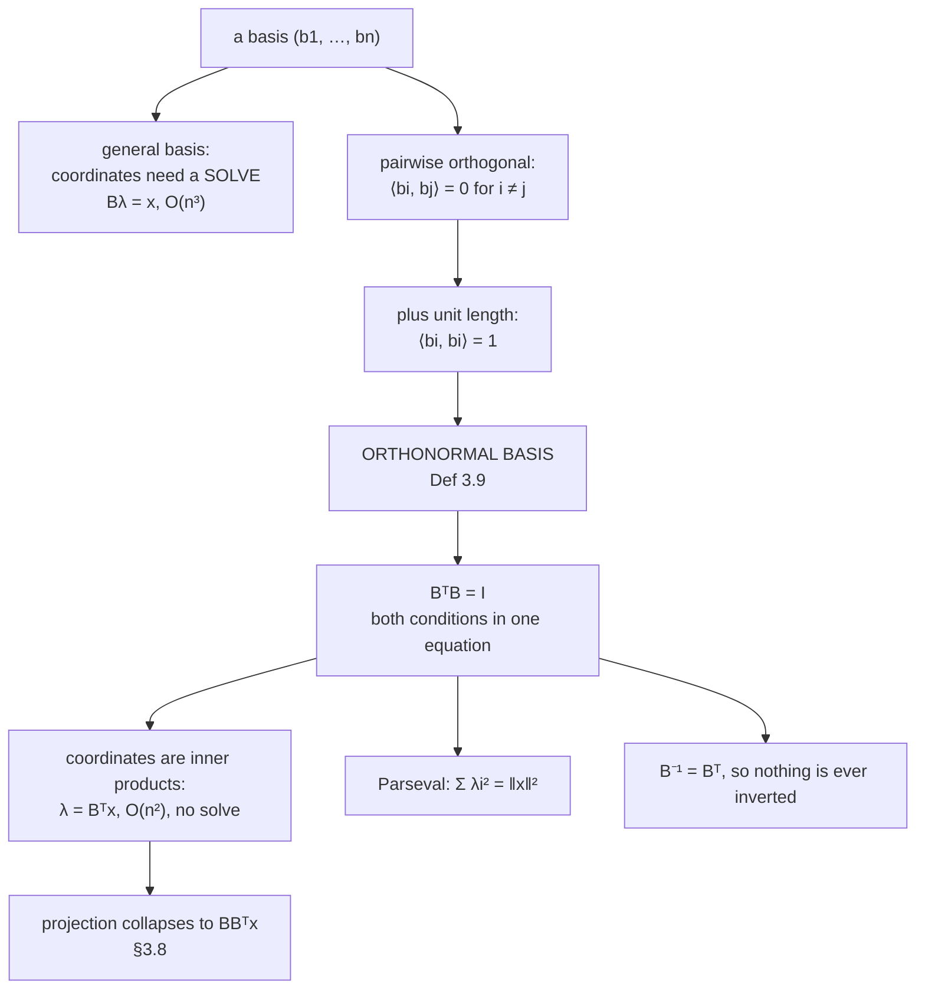

import DataCampExercise from "../../../../components/DataCampExercise.astro";
import Figure from "../../../../components/Figure.astro";
import ProjectionLab from "../../../../components/viz/math/ProjectionLab.tsx";
import Quiz from "../../../../components/Quiz.astro";

A basis gives you coordinates. Chapter 2 showed how: to express $\mathbf{x}$ in a basis
$\mathbf{B}$, solve $\mathbf{B}\boldsymbol{\lambda} = \mathbf{x}$. That solve is the price of a general
basis, and it is a real price — it costs $O(n^3)$, it needs the basis to be well conditioned, and it has
to be redone from scratch every time you add a basis vector.

An **orthonormal basis** removes the solve entirely. Coordinates become inner products, one per basis
vector, computed independently. That is the whole point of this page, and it is why every serious
numerical routine in the rest of the book — QR, eigendecomposition, SVD, PCA — hands you an orthonormal
basis rather than any other kind.

## What you'll learn

- Definition 3.9, and the two conditions in it: pairwise orthogonal **and** unit length.
- Why $\mathbf{B}^\top\mathbf{B} = \mathbf{I}$ is the compact form of both conditions at once.
- **Coordinates as inner products**, and **Parseval's identity** — the squared coordinates add up to the squared length.
- The **Gram-Schmidt** construction, and the book's alternative route through Gaussian elimination on $[\tilde{\mathbf{B}}\tilde{\mathbf{B}}^\top \mid \tilde{\mathbf{B}}]$.
- The measured reason nobody implements textbook Gram-Schmidt: at condition number $10^{10}$ it loses orthogonality **completely**, while Householder QR does not budge from machine precision.

## Intuition: a coordinate system where the axes do not lean on each other

Think about reading coordinates off a graph. If the axes are perpendicular and marked in equal units,
reading a point's $x$-coordinate is a single glance: drop a line straight down. Neither axis tells you
anything about the other, so the two readings are independent.

Now skew the axes so they meet at $30°$. Dropping a line "straight down" no longer gives the
$x$-coordinate, because moving along the second axis also changes your first coordinate. You have to
solve for both at once, and the closer the axes get to parallel the more the two readings interfere —
which is exactly what an ill-conditioned basis is.

An orthonormal basis is the first picture, in $n$ dimensions.



The rightmost consequence is the one §3.8 will cash in: the general projection formula
$\mathbf{B}(\mathbf{B}^\top\mathbf{B})^{-1}\mathbf{B}^\top$ collapses to $\mathbf{B}\mathbf{B}^\top$ when
the basis is orthonormal, because the middle factor becomes the identity.

## The math

:::note[Definition 3.9 — Orthonormal basis]
Consider an $n$-dimensional vector space $V$ and a basis
$\{\mathbf{b}_1, \dots, \mathbf{b}_n\}$ of $V$. If

$$
\langle \mathbf{b}_i, \mathbf{b}_j \rangle = 0 \quad \text{for } i \neq j
\tag{3.33}
$$

$$
\langle \mathbf{b}_i, \mathbf{b}_i \rangle = 1
\tag{3.34}
$$

for all $i, j$, then the basis is called an **orthonormal basis** (ONB). If only Equation 3.33 is
satisfied, the basis is called an **orthogonal basis**.
:::

Equation 3.34 says every basis vector has unit length, since $\lVert\mathbf{b}_i\rVert = \sqrt{\langle\mathbf{b}_i,\mathbf{b}_i\rangle} = 1$.

### One equation instead of two

Stack the basis vectors as the columns of $\mathbf{B}$. Then the $(i,j)$ entry of
$\mathbf{B}^\top\mathbf{B}$ is exactly $\langle\mathbf{b}_i, \mathbf{b}_j\rangle$, so Equations 3.33 and
3.34 together say

$$
\mathbf{B}^\top\mathbf{B} = \mathbf{I} .
$$

That matrix $\mathbf{B}^\top\mathbf{B}$ is called the **Gram matrix** of the basis, and "the basis is
orthonormal" and "its Gram matrix is the identity" are the same statement. For a square $\mathbf{B}$ this
also makes it an orthogonal matrix in the sense of Definition 3.8, so $\mathbf{B}^{-1} = \mathbf{B}^\top$.

### Coordinates become inner products

For a general basis, the coordinates $\boldsymbol{\lambda}$ of $\mathbf{x}$ satisfy
$\mathbf{B}\boldsymbol{\lambda} = \mathbf{x}$, so
$\boldsymbol{\lambda} = (\mathbf{B}^\top\mathbf{B})^{-1}\mathbf{B}^\top\mathbf{x}$. When the basis is
orthonormal the middle factor is $\mathbf{I}^{-1} = \mathbf{I}$ and this collapses to

$$
\boldsymbol{\lambda} = \mathbf{B}^\top\mathbf{x},
\qquad\text{that is,}\qquad
\lambda_i = \langle \mathbf{b}_i, \mathbf{x}\rangle .
$$

Read the second form carefully. **Each coordinate is computed from its own basis vector alone.** No
solve, no interference between coordinates, and — the part that matters for truncation — adding an
$(n{+}1)$-th orthonormal direction does not change any of the first $n$ coordinates. That is why Fourier
series, wavelets and PCA all truncate gracefully and a general basis expansion does not.

### Parseval's identity

$$
\lVert \mathbf{x} \rVert^2 = \sum_{i=1}^{n} \lambda_i^2
\qquad\text{when } \mathbf{B} \text{ is orthonormal}
$$

Expand $\lVert\mathbf{x}\rVert^2 = \lVert\mathbf{B}\boldsymbol{\lambda}\rVert^2 = \boldsymbol{\lambda}^\top\mathbf{B}^\top\mathbf{B}\boldsymbol{\lambda} = \boldsymbol{\lambda}^\top\boldsymbol{\lambda}$
and there it is. Under a non-orthonormal basis the middle factor is not the identity and the identity
simply fails — measured below, the gap is $5.68$ on a vector of squared length $5.85$, which is a $97\%$
error rather than a rounding difference.

### Gram-Schmidt

:::note[Equations 3.67 and 3.68 — Gram-Schmidt orthogonalisation]
Given any basis $(\mathbf{b}_1, \dots, \mathbf{b}_n)$ of an $n$-dimensional vector space $V$,
construct an orthogonal basis $(\mathbf{u}_1, \dots, \mathbf{u}_n)$ by

$$
\mathbf{u}_1 := \mathbf{b}_1
$$

$$
\mathbf{u}_k := \mathbf{b}_k - \pi_{\mathrm{span}[\mathbf{u}_1,\dots,\mathbf{u}_{k-1}]}(\mathbf{b}_k), \qquad k = 2, \dots, n
$$

Normalising each $\mathbf{u}_k$ then gives an ONB. Such a basis always exists, and
$\mathrm{span}[\mathbf{b}_1,\dots,\mathbf{b}_n] = \mathrm{span}[\mathbf{u}_1,\dots,\mathbf{u}_n]$ — the
subspace is unchanged, only the axes are re-aimed.
:::

The construction is one projection per step, so it belongs to §3.8; the book states it there and this
page uses it. Two properties worth naming:

- **The result depends on the order.** $\mathbf{u}_1$ is $\mathbf{b}_1$ untouched, so whichever vector you list first survives unchanged. Different orders give different orthonormal bases of the same subspace.
- **The span never changes.** Every $\mathbf{u}_k$ is $\mathbf{b}_k$ minus a combination of earlier vectors, so nothing leaves the subspace and nothing new enters it.

### The book's other route

The book also mentions obtaining an ONB by applying Gaussian elimination to the augmented matrix
$[\tilde{\mathbf{B}}\tilde{\mathbf{B}}^\top \mid \tilde{\mathbf{B}}]$, where $\tilde{\mathbf{B}}$ has the
spanning vectors as columns. It is the same computation with the projections done all at once rather than
one at a time, and it inherits the same numerical weakness — forming
$\tilde{\mathbf{B}}\tilde{\mathbf{B}}^\top$ **squares the condition number** before any elimination
happens.

:::tip[From the book]
Section 3.5 with Definition 3.9 (Equations 3.33 and 3.34) and Example 3.8 (Equation 3.35), which gives
the orthonormal basis $\mathbf{b}_1 = \tfrac{1}{\sqrt{2}}(1,1)^\top$,
$\mathbf{b}_2 = \tfrac{1}{\sqrt{2}}(1,-1)^\top$ of $\mathbb{R}^2$. The section also notes the
$[\tilde{\mathbf{B}}\tilde{\mathbf{B}}^\top \mid \tilde{\mathbf{B}}]$ route. Gram-Schmidt itself is
Section 3.8.3, Equations 3.67 and 3.68, with Example 3.12 and Figure 3.12. Chapter 4 mentions that the
$\mathbf{U}$ and $\mathbf{V}$ of an SVD are orthonormal bases, and Chapter 10 relies on that.
:::

## Worked example by hand

### Example 3.8 from the book

$$
\mathbf{b}_1 = \frac{1}{\sqrt{2}}\begin{bmatrix}1\\1\end{bmatrix},
\qquad
\mathbf{b}_2 = \frac{1}{\sqrt{2}}\begin{bmatrix}1\\-1\end{bmatrix}
$$

| check | working | result |
| --- | --- | --- |
| $\langle\mathbf{b}_1,\mathbf{b}_2\rangle$ | $\tfrac{1}{2}(1\cdot1 + 1\cdot(-1)) = \tfrac{1}{2}(1-1)$ | $0$ — orthogonal |
| $\langle\mathbf{b}_1,\mathbf{b}_1\rangle$ | $\tfrac{1}{2}(1+1)$ | $1$ — unit length |
| $\langle\mathbf{b}_2,\mathbf{b}_2\rangle$ | $\tfrac{1}{2}(1+1)$ | $1$ — unit length |

So $\mathbf{B}^\top\mathbf{B} = \mathbf{I}$ and this is an ONB. Now use it: take
$\mathbf{x} = (3,-1)^\top$.

$$
\lambda_1 = \langle\mathbf{b}_1,\mathbf{x}\rangle = \tfrac{1}{\sqrt{2}}(3 - 1) = \tfrac{2}{\sqrt{2}} = \sqrt{2} \approx 1.414214
$$

$$
\lambda_2 = \langle\mathbf{b}_2,\mathbf{x}\rangle = \tfrac{1}{\sqrt{2}}(3 + 1) = \tfrac{4}{\sqrt{2}} = 2\sqrt{2} \approx 2.828427
$$

Two independent inner products, no system solved. Reconstruct to check:
$\lambda_1\mathbf{b}_1 + \lambda_2\mathbf{b}_2 = \tfrac{\sqrt{2}}{\sqrt{2}}(1,1) + \tfrac{2\sqrt{2}}{\sqrt{2}}(1,-1) = (1,1) + (2,-2) = (3,-1)$. ✓

And Parseval: $\lVert\mathbf{x}\rVert^2 = 9 + 1 = 10$, while
$\lambda_1^2 + \lambda_2^2 = 2 + 8 = 10$. ✓

### The book's Exercise 3.8, worked by Gram-Schmidt

Turn $\mathbf{b}_1 = (1,1,1)^\top$, $\mathbf{b}_2 = (-1,2,0)^\top$ into an ONB of the plane they span.

**Step 1.** $\mathbf{u}_1 := \mathbf{b}_1 = (1,1,1)^\top$.

**Step 2.** Subtract the projection of $\mathbf{b}_2$ onto $\mathbf{u}_1$:

$$
\frac{\langle\mathbf{u}_1,\mathbf{b}_2\rangle}{\langle\mathbf{u}_1,\mathbf{u}_1\rangle}
= \frac{-1 + 2 + 0}{1+1+1} = \frac{1}{3}
$$

$$
\mathbf{u}_2 = \mathbf{b}_2 - \tfrac{1}{3}\mathbf{u}_1
= \begin{bmatrix}-1\\2\\0\end{bmatrix} - \tfrac{1}{3}\begin{bmatrix}1\\1\\1\end{bmatrix}
= \begin{bmatrix}-4/3\\5/3\\-1/3\end{bmatrix}
$$

Confirm orthogonality: $\langle\mathbf{u}_1,\mathbf{u}_2\rangle = -\tfrac{4}{3} + \tfrac{5}{3} - \tfrac{1}{3} = 0$. ✓

**Step 3.** Normalise. $\lVert\mathbf{u}_1\rVert = \sqrt{3}$ and
$\lVert\mathbf{u}_2\rVert = \tfrac{1}{3}\sqrt{16+25+1} = \tfrac{\sqrt{42}}{3} \approx 2.160247$, so

$$
\mathbf{c}_1 = \frac{1}{\sqrt{3}}\begin{bmatrix}1\\1\\1\end{bmatrix},
\qquad
\mathbf{c}_2 = \frac{1}{\sqrt{42}}\begin{bmatrix}-4\\5\\-1\end{bmatrix}
$$

The $\tfrac{1}{3}$ cancels: $\tfrac{1}{\sqrt{42}/3}\cdot\tfrac{1}{3}(-4,5,-1) = \tfrac{1}{\sqrt{42}}(-4,5,-1)$.

```python title="onb_worked.py" showLineNumbers{1}
import numpy as np

# Example 3.8
b1 = np.array([1.0, 1.0]) / np.sqrt(2)
b2 = np.array([1.0, -1.0]) / np.sqrt(2)
B = np.stack([b1, b2], axis=1)
print("B^T B =\n", np.round(B.T @ B, 15))

x = np.array([3.0, -1.0])
lam = B.T @ x                       # coordinates: two inner products, no solve
print("coordinates:", np.round(lam, 6))
print("reconstruct:", np.round(B @ lam, 6))
print("Parseval: |x|^2 =", float(x @ x), " sum lam^2 =", float((lam ** 2).sum()))

# Exercise 3.8: Gram-Schmidt
p1 = np.array([1.0, 1.0, 1.0])
p2 = np.array([-1.0, 2.0, 0.0])
u1 = p1.copy()
coeff = float(u1 @ p2) / float(u1 @ u1)
u2 = p2 - coeff * u1
print("coefficient:", coeff, " u2 =", u2, " <u1,u2> =", float(u1 @ u2))
c1, c2 = u1 / np.linalg.norm(u1), u2 / np.linalg.norm(u2)
print("||u2|| =", np.linalg.norm(u2), " sqrt(42)/3 =", np.sqrt(42) / 3)
print("c2 * sqrt(42) =", np.round(c2 * np.sqrt(42), 6))
C = np.stack([c1, c2], axis=1)
print("C^T C =\n", np.round(C.T @ C, 15))
```

```text title="output"
B^T B =
 [[ 1. -0.]
 [-0.  1.]]
coordinates: [1.414214 2.828427]
reconstruct: [ 3. -1.]
Parseval: |x|^2 = 10.0  sum lam^2 = 9.999999999999998
coefficient: 0.3333333333333333  u2 = [-1.33333333  1.66666667 -0.33333333]  <u1,u2> = 1.6653345369377348e-16
||u2|| = 2.1602468994692865  sqrt(42)/3 = 2.160246899469287
c2 * sqrt(42) = [-4.  5. -1.]
C^T C =
 [[1. 0.]
 [0. 1.]]
```

Note the two residues of floating point. Parseval gives $9.999999999999998$ rather than $10$, and
$\langle\mathbf{u}_1,\mathbf{u}_2\rangle$ is $1.67\times10^{-16}$ rather than $0$. Both are one or two
units in the last place — the correct amount of disagreement for a computation involving a square root,
not an error to chase.

## See it move

The first sketch is the skewed-axes intuition, made numeric. Drag the second basis vector towards the
first and watch the coordinate readings interfere; drag it perpendicular and they stop.

```p5 title="Reading coordinates off leaning axes" desc="Drag b2. The white point x is fixed. The amber and blue segments are its coordinates in the basis (b1, b2), obtained by solving. When b2 is perpendicular to b1 the coordinates equal the plain inner products, shown alongside; as b2 leans towards b1 the two diverge and the condition number climbs." height="500"
let b2 = [0.35, 1.5];
let dragging = false;
const B1 = [1.6, 0.0];
const XP = [1.35, 0.95];
const U = 74;
let cx, cy;

function setup() { createCanvas(600, 500); textFont("monospace"); cx = 190; cy = 230; }

function sx(x) { return cx + x * U; }
function sy(y) { return cy - y * U; }
function dx_(s) { return (s - cx) / U; }
function dy_(s) { return (cy - s) / U; }

function mousePressed() {
  if (Math.hypot(mouseX - sx(b2[0]), mouseY - sy(b2[1])) < 22) dragging = true;
}
function mouseReleased() { dragging = false; }
function mouseDragged() {
  if (!dragging) return;
  b2 = [Math.max(-2.2, Math.min(3.2, dx_(mouseX))), Math.max(-1.4, Math.min(2.4, dy_(mouseY)))];
  if (!isLooping()) redraw();
}

function arrow(x1, y1, x2, y2, c, w) {
  stroke(c); strokeWeight(w); line(x1, y1, x2, y2);
  push(); translate(x2, y2); rotate(Math.atan2(y2 - y1, x2 - x1));
  fill(c); noStroke(); triangle(0, 0, -9, -4, -9, 4); pop();
}

function draw() {
  background(13, 17, 23);

  stroke(32, 44, 58); strokeWeight(1);
  for (let g = -3; g <= 5; g++) line(sx(g), sy(-2), sx(g), sy(3));
  for (let g = -2; g <= 3; g++) line(sx(-3), sy(g), sx(5), sy(g));
  stroke(58, 72, 88); strokeWeight(1.4);
  line(sx(-3), sy(0), sx(5), sy(0)); line(sx(0), sy(-2), sx(0), sy(3));

  // Solve [B1 b2] lambda = x by Cramer's rule.
  const det = B1[0] * b2[1] - B1[1] * b2[0];
  const l1 = Math.abs(det) < 1e-9 ? NaN : (XP[0] * b2[1] - XP[1] * b2[0]) / det;
  const l2 = Math.abs(det) < 1e-9 ? NaN : (B1[0] * XP[1] - B1[1] * XP[0]) / det;

  // The lattice of the basis, so "coordinates" means something visible.
  stroke(60, 74, 92, 150); strokeWeight(1);
  for (let i = -4; i <= 4; i++) {
    const a = [B1[0] * i - b2[0] * 5, B1[1] * i - b2[1] * 5];
    const b = [B1[0] * i + b2[0] * 5, B1[1] * i + b2[1] * 5];
    line(sx(a[0]), sy(a[1]), sx(b[0]), sy(b[1]));
    const c = [b2[0] * i - B1[0] * 5, b2[1] * i - B1[1] * 5];
    const d = [b2[0] * i + B1[0] * 5, b2[1] * i + B1[1] * 5];
    line(sx(c[0]), sy(c[1]), sx(d[0]), sy(d[1]));
  }

  // The two coordinate legs.
  if (!Number.isNaN(l1)) {
    stroke(255, 211, 67); strokeWeight(3);
    line(sx(0), sy(0), sx(l1 * B1[0]), sy(l1 * B1[1]));
    stroke(75, 139, 190); strokeWeight(3);
    line(sx(l1 * B1[0]), sy(l1 * B1[1]), sx(XP[0]), sy(XP[1]));
  }

  arrow(sx(0), sy(0), sx(B1[0]), sy(B1[1]), color(255, 211, 67), 2.4);
  arrow(sx(0), sy(0), sx(b2[0]), sy(b2[1]), color(75, 139, 190), 2.4);
  noStroke(); fill(255); ellipse(sx(XP[0]), sy(XP[1]), 13, 13);
  textSize(12); textAlign(LEFT, TOP);
  fill(255, 211, 67); text("b1", sx(B1[0]) + 9, sy(B1[1]) - 20);
  fill(75, 139, 190); text("b2 (drag)", sx(b2[0]) + 9, sy(b2[1]) - 20);
  fill(240); text("x", sx(XP[0]) + 10, sy(XP[1]) - 20);

  // Angle between the basis vectors, and the resulting conditioning.
  const n1 = Math.hypot(B1[0], B1[1]), n2 = Math.hypot(b2[0], b2[1]);
  const cosb = (B1[0] * b2[0] + B1[1] * b2[1]) / (n1 * n2);
  const angle = Math.acos(Math.max(-1, Math.min(1, cosb))) * 180 / Math.PI;
  // Singular values of a 2x2 from its Gram matrix, in closed form.
  const g11 = n1 * n1, g22 = n2 * n2, g12 = B1[0] * b2[0] + B1[1] * b2[1];
  const tr = g11 + g22, dt = g11 * g22 - g12 * g12;
  const rt = Math.sqrt(Math.max(0, tr * tr - 4 * dt));
  const smax = Math.sqrt((tr + rt) / 2), smin = Math.sqrt(Math.max(0, (tr - rt) / 2));
  const cond = smin > 1e-12 ? smax / smin : Infinity;

  // Inner products, which are the coordinates only when the basis is orthonormal.
  const ip1 = (B1[0] * XP[0] + B1[1] * XP[1]) / n1;
  const ip2 = (b2[0] * XP[0] + b2[1] * XP[1]) / n2;

  const onb = Math.abs(cosb) < 1e-6 && Math.abs(n1 - 1) < 1e-6 && Math.abs(n2 - 1) < 1e-6;
  const orthg = Math.abs(cosb) < 1e-3;

  textAlign(LEFT, TOP); noStroke();
  fill(255, 211, 67); textSize(14); text("Drag b2", 20, 14);
  fill(215); textSize(11);
  text(`angle between b1 and b2: ${angle.toFixed(2)} deg`, 300, 44);
  text(`condition number: ${cond === Infinity ? "infinite" : cond.toFixed(3)}`, 300, 64);
  text(`coordinates by SOLVE:  ${Number.isNaN(l1) ? "-" : l1.toFixed(4)}, ${Number.isNaN(l2) ? "-" : l2.toFixed(4)}`, 300, 92);
  text(`unit inner products:   ${ip1.toFixed(4)}, ${ip2.toFixed(4)}`, 300, 112);
  fill(orthg ? color(120, 200, 140) : color(232, 110, 110)); textSize(11);
  text(orthg ? "orthogonal: the two agree up to the lengths" : "not orthogonal: the two disagree", 300, 140);
  fill(150); textSize(10);
  text("grid: the lattice this basis draws. When the axes lean, a step along one", 20, 448);
  text("changes both readings, and the coordinates stop being independent.", 20, 464);
  text(`||b1|| = ${n1.toFixed(3)}   ||b2|| = ${n2.toFixed(3)}`, 20, 482);
}
```

The second sketch is Gram-Schmidt with a draggable input. The grey shadow is the part being subtracted.

```p5 title="Gram-Schmidt: subtract the shadow, keep the rest" desc="u1 is fixed as b1. Drag b2 anywhere. The grey arrow is the projection of b2 onto u1 — the part of b2 that already points along u1 — and u2 is what is left after removing it. The readout confirms the inner product of u1 with u2 is zero for every position of b2, and the normalised pair is drawn on the unit circle." height="500"
let b2 = [1.5, 1.1];
let dragging = false;
const B1 = [1.9, 0.35];
const U = 78;
let cx, cy;

function setup() { createCanvas(600, 500); textFont("monospace"); cx = 200; cy = 250; }

function sx(x) { return cx + x * U; }
function sy(y) { return cy - y * U; }
function dx_(s) { return (s - cx) / U; }
function dy_(s) { return (cy - s) / U; }

function mousePressed() {
  if (Math.hypot(mouseX - sx(b2[0]), mouseY - sy(b2[1])) < 22) dragging = true;
}
function mouseReleased() { dragging = false; }
function mouseDragged() {
  if (!dragging) return;
  b2 = [Math.max(-2.2, Math.min(4.2, dx_(mouseX))), Math.max(-2.6, Math.min(2.6, dy_(mouseY)))];
  if (!isLooping()) redraw();
}

function arrow(x1, y1, x2, y2, c, w, dashed) {
  stroke(c); strokeWeight(w);
  if (dashed) drawingContext.setLineDash([6, 5]);
  line(x1, y1, x2, y2);
  drawingContext.setLineDash([]);
  push(); translate(x2, y2); rotate(Math.atan2(y2 - y1, x2 - x1));
  fill(c); noStroke(); triangle(0, 0, -9, -4, -9, 4); pop();
}

function draw() {
  background(13, 17, 23);

  stroke(32, 44, 58); strokeWeight(1);
  for (let g = -3; g <= 5; g++) line(sx(g), sy(-3), sx(g), sy(3));
  for (let g = -3; g <= 3; g++) line(sx(-3), sy(g), sx(5), sy(g));
  stroke(58, 72, 88); strokeWeight(1.4);
  line(sx(-3), sy(0), sx(5), sy(0)); line(sx(0), sy(-3), sx(0), sy(3));

  const u1 = B1;
  const nn = u1[0] * u1[0] + u1[1] * u1[1];
  const coeff = (u1[0] * b2[0] + u1[1] * b2[1]) / nn;
  const shadow = [coeff * u1[0], coeff * u1[1]];
  const u2 = [b2[0] - shadow[0], b2[1] - shadow[1]];
  const ip = u1[0] * u2[0] + u1[1] * u2[1];
  const n1 = Math.hypot(u1[0], u1[1]), n2 = Math.hypot(u2[0], u2[1]);

  // The line spanned by u1 — the subspace being projected onto.
  stroke(255, 211, 67, 90); strokeWeight(1.4);
  drawingContext.setLineDash([5, 5]);
  line(sx(-4 * u1[0] / n1), sy(-4 * u1[1] / n1), sx(5 * u1[0] / n1), sy(5 * u1[1] / n1));
  drawingContext.setLineDash([]);

  // The unit circle, where the normalised pair lands.
  noFill(); stroke(70, 84, 100); strokeWeight(1.1); ellipse(sx(0), sy(0), 2 * U, 2 * U);

  arrow(sx(0), sy(0), sx(u1[0]), sy(u1[1]), color(255, 211, 67), 2.8);
  arrow(sx(0), sy(0), sx(b2[0]), sy(b2[1]), color(75, 139, 190), 2.4);
  arrow(sx(0), sy(0), sx(shadow[0]), sy(shadow[1]), color(130, 140, 156), 2.2, true);
  // The subtraction, drawn where it happens: from the shadow tip to b2.
  stroke(120, 200, 140); strokeWeight(2.6);
  line(sx(shadow[0]), sy(shadow[1]), sx(b2[0]), sy(b2[1]));
  arrow(sx(0), sy(0), sx(u2[0]), sy(u2[1]), color(120, 200, 140), 2.8);

  if (n1 > 1e-9 && n2 > 1e-9) {
    noStroke(); fill(255);
    ellipse(sx(u1[0] / n1), sy(u1[1] / n1), 9, 9);
    ellipse(sx(u2[0] / n2), sy(u2[1] / n2), 9, 9);
  }

  noStroke(); textSize(12); textAlign(LEFT, TOP);
  fill(255, 211, 67); text("u1 = b1", sx(u1[0]) + 9, sy(u1[1]) - 20);
  fill(75, 139, 190); text("b2 (drag)", sx(b2[0]) + 9, sy(b2[1]) - 20);
  fill(120, 200, 140); text("u2", sx(u2[0]) + 9, sy(u2[1]) - 20);
  fill(130, 140, 156); text("shadow", sx(shadow[0]) + 6, sy(shadow[1]) + 8);

  textAlign(LEFT, TOP);
  fill(255, 211, 67); textSize(14); text("Drag b2; u2 stays perpendicular", 20, 14);
  fill(215); textSize(11);
  text(`coefficient <u1,b2>/<u1,u1> = ${coeff.toFixed(4)}`, 20, 400);
  text(`u2 = b2 - shadow = (${u2[0].toFixed(3)}, ${u2[1].toFixed(3)})`, 20, 420);
  fill(Math.abs(ip) < 1e-9 ? color(120, 200, 140) : color(232, 110, 110)); textSize(12);
  text(`<u1, u2> = ${ip.toExponential(2)}`, 20, 444);
  fill(150); textSize(10);
  text("green segment: the subtraction. White dots: the normalised pair, on the unit circle.", 20, 470);
  text(n2 < 0.06 ? "b2 is nearly parallel to u1: u2 is tiny and its DIRECTION is now unreliable"
                 : "the green arrow is the same length as the green segment - it is just moved to the origin", 20, 486);
}
```

And the stepped version, on the book's own Exercise 3.8:

<ProjectionLab
  client:visible
  mode="gram-schmidt"
  basis={[[1, 1, 1], [-1, 2, 0]]}
  title="Exercise 3.8, step by step"
  desc="Two vectors spanning a plane in three dimensions, turned into an orthonormal pair. The final frame shows the Gram matrix, which is the identity."
/>

## From scratch

Two implementations that differ by **one word**, and the difference decides whether the output is
usable:

```python title="gram_schmidt_two_ways.py" showLineNumbers{1}
import numpy as np

def classical_gs(A):
    """Every coefficient taken against the ORIGINAL column."""
    n, m = A.shape
    Q = np.zeros((n, m))
    for j in range(m):
        v = A[:, j].copy()
        for i in range(j):
            v = v - (Q[:, i] @ A[:, j]) * Q[:, i]     # <- A[:, j]
        Q[:, j] = v / np.linalg.norm(v)
    return Q

def modified_gs(A):
    """Every coefficient taken against the RUNNING remainder."""
    n, m = A.shape
    Q = np.zeros((n, m))
    for j in range(m):
        v = A[:, j].copy()
        for i in range(j):
            v = v - (Q[:, i] @ v) * Q[:, i]           # <- v
        Q[:, j] = v / np.linalg.norm(v)
    return Q

def conditioned(n, kappa, seed=5):
    """A matrix with exactly the requested condition number."""
    rng = np.random.default_rng(seed)
    U, _ = np.linalg.qr(rng.normal(size=(n, n)))
    V, _ = np.linalg.qr(rng.normal(size=(n, n)))
    return U @ np.diag(np.logspace(0.0, -np.log10(kappa), n)) @ V.T

n = 8
print(f"{'kappa':>8} {'classical':>12} {'modified':>12} {'Householder':>12}")
for kappa in (1e2, 1e6, 1e10, 1e14):
    A = conditioned(n, kappa)
    row = []
    for Q in (classical_gs(A), modified_gs(A), np.linalg.qr(A)[0]):
        row.append(np.linalg.norm(Q.T @ Q - np.eye(n), 2))
    print(f"{kappa:8.0e} {row[0]:12.3e} {row[1]:12.3e} {row[2]:12.3e}")
print("machine epsilon:", np.finfo(float).eps)
```

```text title="output"
   kappa    classical     modified  Householder
   1e+02    1.152e-13    9.622e-15    7.239e-16
   1e+06    3.063e-06    9.114e-11    7.334e-16
   1e+10    1.013e+00    2.507e-07    5.774e-16
   1e+14    2.993e+00    2.906e-03    1.052e-15
machine epsilon: 2.220446049250313e-16
```

Read the third row. At condition number $10^{10}$, classical Gram-Schmidt returns a matrix whose
$\lVert\mathbf{Q}^\top\mathbf{Q} - \mathbf{I}\rVert$ is **$1.013$** — the columns are not approximately
orthonormal, they are not orthonormal at all. At $10^{14}$ it reaches $2.993$, and since
$\lVert\mathbf{I}\rVert_2 = 1$ that means the error is three times the size of the thing it was
supposed to be.

Modified Gram-Schmidt — the same algorithm with the projection coefficient taken against the running
remainder rather than the original column — is seven orders of magnitude better at $\kappa = 10^{10}$.
Householder QR, which is what `np.linalg.qr` runs, never leaves machine precision at all: its worst
value across the whole sweep is $1.052\times10^{-15}$, under five units in the last place.

The mathematics of §3.8.3 is exact. The arithmetic is not, and this is the gap.

## On real data

<Figure
  src="/images/mml/orthonormal-basis/gram-schmidt-loses-orthogonality"
  alt="A log-log plot of loss of orthogonality against condition number for three algorithms. Classical Gram-Schmidt rises steeply and flattens near one; modified Gram-Schmidt rises more slowly; Householder QR stays flat at machine epsilon across the whole range."
  title="Three routes to the same orthonormal basis"
  caption="Classical Gram-Schmidt degrades roughly like epsilon times the square of the condition number — the dashed reference line — and saturates once orthogonality is entirely lost. Its worst value here is 2.99e+00 against Householder's 1.05e-15."
/>

<Figure
  src="/images/mml/orthonormal-basis/parseval-check"
  alt="Two bar charts of squared coordinates. Under the orthonormal basis the bars sum to the squared length of the vector; under a skewed basis of the same subspace they sum to nearly twice as much. Both panels report a reconstruction error at machine precision."
  title="Parseval holds, or it does not"
  caption="The same vector expanded in two bases that span the same subspace. Both reconstruct it to machine precision, so both are correct expansions. Only the orthonormal one has squared coordinates that add up to 5.845617 — the skewed basis reports 11.526946, a gap of 5.6813."
/>

## Reading the plot

**From the orthogonality plot.** Three things.

The classical curve tracks $\varepsilon\kappa^2$ — the dashed reference — rather than $\varepsilon\kappa$.
Squaring the condition number is what forming inner products against the original columns costs you, and
it is the same squaring that makes the book's
$[\tilde{\mathbf{B}}\tilde{\mathbf{B}}^\top \mid \tilde{\mathbf{B}}]$ route inadvisable in floating
point: $\tilde{\mathbf{B}}\tilde{\mathbf{B}}^\top$ has the square of $\tilde{\mathbf{B}}$'s condition
number before elimination even starts.

The classical curve then **saturates** near $1$ and stops rising. That is not the error levelling off,
it is the error running out of room: $\lVert\mathbf{Q}^\top\mathbf{Q} - \mathbf{I}\rVert$ cannot grow much
past a small constant once the columns bear no relation to orthonormality. A flat tail here means total
failure, not stability.

Householder is flat *at the bottom*, and flat for a different reason: it never forms an inner product
between two nearly-parallel columns. It builds $\mathbf{Q}$ as a product of reflections, each of which is
exactly orthogonal by construction, so the orthogonality of the result does not depend on the
conditioning of the input at all.

**From the Parseval bars.** Both panels report a reconstruction error at machine precision, which is the
control: *both* bases genuinely represent the vector, and neither expansion is wrong. What differs is
whether the coordinates are *interpretable*. Under the ONB the squared coordinates sum to $5.845617$,
which is $\lVert\mathbf{x}\rVert^2$ to within $8.88\times10^{-16}$. Under the skewed basis they sum to
$11.526946$ — nearly double — so any statement of the form "this component accounts for $30\%$ of the
energy" is meaningless in that basis. The skewed basis here has condition number only $6.79$, which is
mild; the failure is not a numerical one, it is that Parseval simply is not true off an ONB.

That is the property PCA's variance-explained percentages rest on, and it is why they are quoted for
principal components and never for the columns of an arbitrary factor loading matrix.

## Pitfalls

:::danger[Do not implement classical Gram-Schmidt]
The measurement is on this page: at $\kappa = 10^{10}$ it returns columns that are not orthonormal in
any useful sense. If you need an orthonormal basis, call `np.linalg.qr`. If you need it *incrementally*
— one vector at a time, which QR does not offer — use modified Gram-Schmidt with **reorthogonalisation**
(run the subtraction loop twice), which recovers machine precision at roughly double the cost.
:::

:::caution[np.linalg.qr gives you an orthonormal basis, not the one you had in mind]
The signs of $\mathbf{Q}$'s columns are whatever the Householder reflections produce, not a convention you can rely on; measured, `np.linalg.qr` returns $\det\mathbf{Q} = (-1)^{n-1}$ for square input, so it is a reflection in every even dimension.
If your output depends on the sign — a PCA loading plot, a saved model, a regression test — fix it
yourself, conventionally by forcing the largest-magnitude entry of each column to be positive.
:::

:::caution[Orthogonal is not orthonormal, and the projection formula cares]
A basis satisfying only Equation 3.33 has $\mathbf{B}^\top\mathbf{B}$ diagonal but not the identity, so
$\boldsymbol{\lambda} = \mathbf{B}^\top\mathbf{x}$ is wrong by a factor of
$\lVert\mathbf{b}_i\rVert^2$ per coordinate. The fix is to divide:
$\lambda_i = \langle\mathbf{b}_i,\mathbf{x}\rangle / \langle\mathbf{b}_i,\mathbf{b}_i\rangle$. The
Gram-Schmidt formula above has exactly this division in it for exactly this reason.
:::

:::caution[Gram-Schmidt's output depends on the input order]
$\mathbf{u}_1$ is $\mathbf{b}_1$ unchanged, so the first vector you list is the one that survives. A
different ordering gives a genuinely different ONB of the same subspace. This is fine mathematically and
a nuisance in practice: shuffle your columns and your "first basis direction" changes, even though the
span and the projection onto it do not.
:::

:::caution[Orthonormality is relative to an inner product, like everything else here]
$\mathbf{B}^\top\mathbf{B} = \mathbf{I}$ tests orthonormality under the **dot product**. Under a general
inner product with matrix $\mathbf{A}$, the test is $\mathbf{B}^\top\mathbf{A}\mathbf{B} = \mathbf{I}$,
and a basis orthonormal under one is generally not orthonormal under the other. There is a worked case
of this in the [Inner Products exercises](../inner-products/), where $(1,0)$ and $(1,1)$ turn out to be
orthonormal under the book's Example 3.3.
:::

## Compare

| basis type | Gram matrix $\mathbf{B}^\top\mathbf{B}$ | coordinates of $\mathbf{x}$ | cost | Parseval? |
| --- | --- | --- | --- | --- |
| general | full, symmetric positive definite | $(\mathbf{B}^\top\mathbf{B})^{-1}\mathbf{B}^\top\mathbf{x}$ | $O(n^3)$ solve | no |
| orthogonal | diagonal | $\langle\mathbf{b}_i,\mathbf{x}\rangle / \lVert\mathbf{b}_i\rVert^2$ | $O(n^2)$, no solve | with weights |
| **orthonormal** | $\mathbf{I}$ | $\langle\mathbf{b}_i,\mathbf{x}\rangle$ | $O(n^2)$, no solve | **yes** |

<Quiz
  title="Check your understanding"
  questions={[
    {
      q: "What does an orthonormal basis buy you that a general basis does not?",
      options: [
        "It spans a larger subspace",
        "Coordinates become independent inner products rather than the solution of a system, so adding a new orthonormal direction leaves every earlier coordinate untouched — which is what makes truncation graceful",
        "It is unique",
        "It always has smaller entries",
      ],
      answer: 1,
      explain:
        "It is not unique — Gram-Schmidt's answer depends on the input order, and QR's column signs are arbitrary. The span is identical by construction. What changes is that B-transpose B is the identity, so the middle factor of the coordinate formula disappears.",
    },
    {
      q: "Classical Gram-Schmidt at condition number 1e10 gives ||Q-transpose Q minus I|| = 1.013. What does that number mean?",
      options: [
        "The columns are orthonormal to about one percent",
        "Orthogonality is completely gone — the identity matrix itself has 2-norm 1, so an error of 1.013 is the same size as the thing being approximated",
        "The matrix was singular",
        "The tolerance was set too tightly",
      ],
      answer: 1,
      explain:
        "At 1e14 it reaches 2.993, three times the norm of the identity. The curve saturating near 1 is the error running out of room rather than levelling off. Householder QR on the same matrices never exceeds 1.052e-15.",
    },
    {
      q: "Parseval's identity fails for the skewed basis in the figure, but that basis reconstructs the vector to machine precision. What is the lesson?",
      options: [
        "The skewed basis is not a basis",
        "Both expansions are correct; only the orthonormal one has coordinates whose squares are interpretable as shares of the total energy — which is why variance-explained percentages are quoted for principal components and not for arbitrary loadings",
        "The vector was not in the subspace",
        "The skewed basis is ill-conditioned",
      ],
      answer: 1,
      explain:
        "Its condition number is 6.79, which is mild, and the reconstruction error is 2.16e-15. The failure is structural rather than numerical: the squared coordinates sum to 11.53 against a squared length of 5.85.",
    },
    {
      q: "A basis satisfies only Equation 3.33 — pairwise orthogonal, but not unit length. What breaks?",
      options: [
        "Nothing; the two conditions are equivalent",
        "The coordinate formula: lambda-i is the inner product divided by the squared length of the basis vector, not the plain inner product, so B-transpose x is wrong by a per-coordinate factor",
        "Orthogonality itself",
        "The basis no longer spans the space",
      ],
      answer: 1,
      explain:
        "The Gram matrix is diagonal rather than the identity, so the middle factor of the coordinate formula is a diagonal inverse rather than nothing. The division appears explicitly in the Gram-Schmidt formula for exactly this reason.",
    },
  ]}
/>

## 🧪 Try It Yourself

### Exercise 1 – Verify Example 3.8 and use it

<DataCampExercise
  lang="python"
  hint={`Stack the two basis vectors as the columns of B. The Gram matrix is B-transpose B, and the coordinates of x are B-transpose x.`}
  code={`import numpy as np

b1 = np.array([1.0, 1.0]) / np.sqrt(2)
b2 = np.array([1.0, -1.0]) / np.sqrt(2)
B = np.stack([b1, b2], axis=___)               # replace ___ with 1 (as columns)

print("B^T B =")
print(np.round(B.T @ B, 15))

x = np.array([3.0, -1.0])
lam = B.T @ x
print("coordinates:", np.round(lam, 6))
print("reconstruct:", np.round(B @ lam, 6))
print("Parseval: |x|^2 =", float(x @ x), " sum lam^2 =", float((lam ** 2).sum()))

# -- Expected output ------------------------------
# B^T B =
# [[ 1. -0.]
#  [-0.  1.]]
# coordinates: [1.414214 2.828427]
# reconstruct: [ 3. -1.]
# Parseval: |x|^2 = 10.0  sum lam^2 = 9.999999999999998
# -------------------------------------------------`}
  solution={`import numpy as np

b1 = np.array([1.0, 1.0]) / np.sqrt(2)
b2 = np.array([1.0, -1.0]) / np.sqrt(2)
B = np.stack([b1, b2], axis=1)

print("B^T B =")
print(np.round(B.T @ B, 15))

x = np.array([3.0, -1.0])
lam = B.T @ x
print("coordinates:", np.round(lam, 6))
print("reconstruct:", np.round(B @ lam, 6))
print("Parseval: |x|^2 =", float(x @ x), " sum lam^2 =", float((lam ** 2).sum()))`}
  sct={`test_output_contains("[1.414214 2.828427]")
success_msg("Coordinates sqrt(2) and 2 sqrt(2), obtained by two independent inner products. Parseval lands at 9.999999999999998 rather than 10 — two units in the last place, from the square roots.")`}
  height={280}
/>

### Exercise 2 – Gram-Schmidt on the book's Exercise 3.8

<DataCampExercise
  lang="python"
  hint={`The coefficient is the inner product of u1 with b2 divided by the inner product of u1 with itself. Subtract that multiple of u1 from b2.`}
  code={`import numpy as np

b1 = np.array([1.0, 1.0, 1.0])
b2 = np.array([-1.0, 2.0, 0.0])

u1 = b1.copy()
coeff = float(u1 @ b2) / float(u1 @ ___)          # replace ___ with u1
u2 = b2 - coeff * u1

print("coefficient:", coeff)
print("u2 =", u2)
print("<u1, u2> =", float(u1 @ u2))
c1, c2 = u1 / np.linalg.norm(u1), u2 / np.linalg.norm(u2)
print("||u2|| =", np.linalg.norm(u2), " sqrt(42)/3 =", np.sqrt(42) / 3)
print("c2 * sqrt(42) =", np.round(c2 * np.sqrt(42), 6))
C = np.stack([c1, c2], axis=1)
print("C^T C =")
print(np.round(C.T @ C, 15))

# -- Expected output ------------------------------
# coefficient: 0.3333333333333333
# u2 = [-1.33333333  1.66666667 -0.33333333]
# <u1, u2> = 1.6653345369377348e-16
# ||u2|| = 2.1602468994692865  sqrt(42)/3 = 2.160246899469287
# c2 * sqrt(42) = [-4.  5. -1.]
# C^T C =
# [[1. 0.]
#  [0. 1.]]
# -------------------------------------------------`}
  solution={`import numpy as np

b1 = np.array([1.0, 1.0, 1.0])
b2 = np.array([-1.0, 2.0, 0.0])

u1 = b1.copy()
coeff = float(u1 @ b2) / float(u1 @ u1)
u2 = b2 - coeff * u1

print("coefficient:", coeff)
print("u2 =", u2)
print("<u1, u2> =", float(u1 @ u2))
c1, c2 = u1 / np.linalg.norm(u1), u2 / np.linalg.norm(u2)
print("||u2|| =", np.linalg.norm(u2), " sqrt(42)/3 =", np.sqrt(42) / 3)
print("c2 * sqrt(42) =", np.round(c2 * np.sqrt(42), 6))
C = np.stack([c1, c2], axis=1)
print("C^T C =")
print(np.round(C.T @ C, 15))`}
  sct={`test_output_contains("c2 * sqrt(42) = [-4.  5. -1.]")
success_msg("The messy thirds cancel against the norm and the second basis vector is (-4, 5, -1) over sqrt(42), exactly as the book's exercise intends.")`}
  height={340}
/>

### Exercise 3 – Watch classical Gram-Schmidt fail

<DataCampExercise
  lang="python"
  hint={`The two loops differ in one place: classical takes the coefficient against the original column A[:, j], modified against the running remainder v.`}
  code={`import numpy as np

def gs(A, modified):
    n, m = A.shape
    Q = np.zeros((n, m))
    for j in range(m):
        v = A[:, j].copy()
        for i in range(j):
            target = v if modified else A[:, ___]      # replace ___ with j
            v = v - (Q[:, i] @ target) * Q[:, i]
        Q[:, j] = v / np.linalg.norm(v)
    return Q

def conditioned(n, kappa, seed=5):
    rng = np.random.default_rng(seed)
    U, _ = np.linalg.qr(rng.normal(size=(n, n)))
    V, _ = np.linalg.qr(rng.normal(size=(n, n)))
    return U @ np.diag(np.logspace(0.0, -np.log10(kappa), n)) @ V.T

n = 8
print(f"{'kappa':>8} {'classical':>12} {'modified':>12} {'Householder':>12}")
for kappa in (1e2, 1e6, 1e10, 1e14):
    A = conditioned(n, kappa)
    vals = [np.linalg.norm(Q.T @ Q - np.eye(n), 2)
            for Q in (gs(A, False), gs(A, True), np.linalg.qr(A)[0])]
    print(f"{kappa:8.0e} {vals[0]:12.3e} {vals[1]:12.3e} {vals[2]:12.3e}")

# -- Expected output ------------------------------
#    kappa    classical     modified  Householder
#    1e+02    1.152e-13    9.622e-15    7.239e-16
#    1e+06    3.063e-06    9.114e-11    7.334e-16
#    1e+10    1.013e+00    2.507e-07    5.774e-16
#    1e+14    2.993e+00    2.906e-03    1.052e-15
# -------------------------------------------------`}
  solution={`import numpy as np

def gs(A, modified):
    n, m = A.shape
    Q = np.zeros((n, m))
    for j in range(m):
        v = A[:, j].copy()
        for i in range(j):
            target = v if modified else A[:, j]
            v = v - (Q[:, i] @ target) * Q[:, i]
        Q[:, j] = v / np.linalg.norm(v)
    return Q

def conditioned(n, kappa, seed=5):
    rng = np.random.default_rng(seed)
    U, _ = np.linalg.qr(rng.normal(size=(n, n)))
    V, _ = np.linalg.qr(rng.normal(size=(n, n)))
    return U @ np.diag(np.logspace(0.0, -np.log10(kappa), n)) @ V.T

n = 8
print(f"{'kappa':>8} {'classical':>12} {'modified':>12} {'Householder':>12}")
for kappa in (1e2, 1e6, 1e10, 1e14):
    A = conditioned(n, kappa)
    vals = [np.linalg.norm(Q.T @ Q - np.eye(n), 2)
            for Q in (gs(A, False), gs(A, True), np.linalg.qr(A)[0])]
    print(f"{kappa:8.0e} {vals[0]:12.3e} {vals[1]:12.3e} {vals[2]:12.3e}")`}
  sct={`test_output_contains("1.013e+00")
success_msg("One word of difference between the two loops, and seven orders of magnitude of difference in the answer at kappa = 1e10. Householder never leaves machine precision.")`}
  height={360}
/>

### Exercise 4 – Break Parseval

<DataCampExercise
  lang="python"
  hint={`Build a skewed basis by right-multiplying an orthonormal one by an upper-triangular mixing matrix. The span is unchanged; the Gram matrix is not.`}
  code={`import numpy as np

rng = np.random.default_rng(17)
n, m = 24, 6
Q, _ = np.linalg.qr(rng.normal(size=(n, m)))
mix = np.eye(m) + 0.9 * np.triu(np.ones((m, m)), 1)
S = Q @ mix                                     # same span, skewed axes

x = Q @ rng.normal(size=m)                      # a vector inside the subspace
c_onb = Q.T @ x
c_skew = np.linalg.lstsq(___, x, rcond=None)[0]  # replace ___ with S

print("|x|^2          ", round(float(x @ x), 6))
print("ONB  sum c^2   ", round(float((c_onb ** 2).sum()), 6))
print("skew sum c^2   ", round(float((c_skew ** 2).sum()), 6))
print("reconstruction errors:",
      f"{np.linalg.norm(x - Q @ c_onb):.2e}", f"{np.linalg.norm(x - S @ c_skew):.2e}")
print("condition number of the skewed basis:", round(float(np.linalg.cond(S)), 4))

# -- Expected output ------------------------------
# |x|^2           5.845617
# ONB  sum c^2    5.845617
# skew sum c^2    11.526946
# reconstruction errors: 7.16e-16 2.16e-15
# condition number of the skewed basis: 6.7852
# -------------------------------------------------`}
  solution={`import numpy as np

rng = np.random.default_rng(17)
n, m = 24, 6
Q, _ = np.linalg.qr(rng.normal(size=(n, m)))
mix = np.eye(m) + 0.9 * np.triu(np.ones((m, m)), 1)
S = Q @ mix

x = Q @ rng.normal(size=m)
c_onb = Q.T @ x
c_skew = np.linalg.lstsq(S, x, rcond=None)[0]

print("|x|^2          ", round(float(x @ x), 6))
print("ONB  sum c^2   ", round(float((c_onb ** 2).sum()), 6))
print("skew sum c^2   ", round(float((c_skew ** 2).sum()), 6))
print("reconstruction errors:",
      f"{np.linalg.norm(x - Q @ c_onb):.2e}", f"{np.linalg.norm(x - S @ c_skew):.2e}")
print("condition number of the skewed basis:", round(float(np.linalg.cond(S)), 4))`}
  sct={`test_output_contains("skew sum c^2    11.526946")
success_msg("Both bases reconstruct x to machine precision, so both are legitimate. Only the orthonormal one has squared coordinates that add up to the squared length — and the skewed basis is well conditioned at 6.79, so this is not a numerical failure.")`}
  height={330}
/>

### Exercise 5 – Order matters

<DataCampExercise
  lang="python"
  hint={`Run Gram-Schmidt on the same three vectors in two different orders and compare the resulting bases and the projections onto their span.`}
  code={`import numpy as np

def gram_schmidt(vectors):
    out = []
    for v in vectors:
        r = np.array(v, dtype=float)
        for u in out:
            r = r - (u @ r) * u
        out.append(r / np.linalg.norm(r))
    return np.stack(out, axis=1)

V = [[1.0, 1.0, 0.0], [0.0, 1.0, 1.0], [1.0, 0.0, 1.0]]

A = gram_schmidt(V)
B = gram_schmidt(V[::___])                       # replace ___ with -1 (reversed order)

print("first basis, column 1:", np.round(A[:, 0], 6))
print("second basis, column 1:", np.round(B[:, 0], 6))
print("same basis?", np.allclose(A, B))
print("same projector?", np.allclose(A @ A.T, B @ B.T))
print("both orthonormal?", np.allclose(A.T @ A, np.eye(3)), np.allclose(B.T @ B, np.eye(3)))

# -- Expected output ------------------------------
# first basis, column 1: [0.707107 0.707107 0.      ]
# second basis, column 1: [0.707107 0.       0.707107]
# same basis? False
# same projector? True
# both orthonormal? True True
# -------------------------------------------------`}
  solution={`import numpy as np

def gram_schmidt(vectors):
    out = []
    for v in vectors:
        r = np.array(v, dtype=float)
        for u in out:
            r = r - (u @ r) * u
        out.append(r / np.linalg.norm(r))
    return np.stack(out, axis=1)

V = [[1.0, 1.0, 0.0], [0.0, 1.0, 1.0], [1.0, 0.0, 1.0]]

A = gram_schmidt(V)
B = gram_schmidt(V[::-1])

print("first basis, column 1:", np.round(A[:, 0], 6))
print("second basis, column 1:", np.round(B[:, 0], 6))
print("same basis?", np.allclose(A, B))
print("same projector?", np.allclose(A @ A.T, B @ B.T))
print("both orthonormal?", np.allclose(A.T @ A, np.eye(3)), np.allclose(B.T @ B, np.eye(3)))`}
  sct={`test_output_contains("same basis? False")
test_output_contains("same projector? True")
success_msg("Two different orthonormal bases, one identical projector. The basis is an arbitrary choice of axes; the subspace it spans and the projection onto that subspace are not — which is the whole content of the next few pages.")`}
  height={310}
/>

## Recall card

- **An orthonormal basis is pairwise orthogonal and unit length** — Definition 3.9's two equations, which together say the Gram matrix B-transpose B is the identity.
- **Coordinates become inner products**: lambda equals B-transpose x, one independent inner product per basis vector, with no system to solve.
- **Adding a new orthonormal direction leaves every earlier coordinate unchanged**, which is what makes truncation graceful in Fourier series, wavelets and PCA.
- **Parseval's identity holds only for an orthonormal basis**: the squared coordinates add up to the squared length. Measured off an ONB the sum was 11.53 against a squared length of 5.85, on a well-conditioned basis.
- **Gram-Schmidt subtracts the projection onto everything already accepted** and normalises. Its output depends on the input order, because the first vector survives unchanged.
- **Do not implement classical Gram-Schmidt.** At condition number ten to the tenth it returns columns that are not orthonormal at all; modified Gram-Schmidt is seven orders better and Householder QR never leaves machine precision.
- **Forming B-transpose B squares the condition number**, which is why both classical Gram-Schmidt and the augmented-matrix route lose accuracy where a Householder factorisation does not.
- **The projection formula collapses to B B-transpose for an orthonormal basis**, and that collapse is what section 3.8 spends most of its time earning.

**Next:** [Orthogonal Complement](../orthogonal-complement/) — what happens to everything the basis
*misses*.
