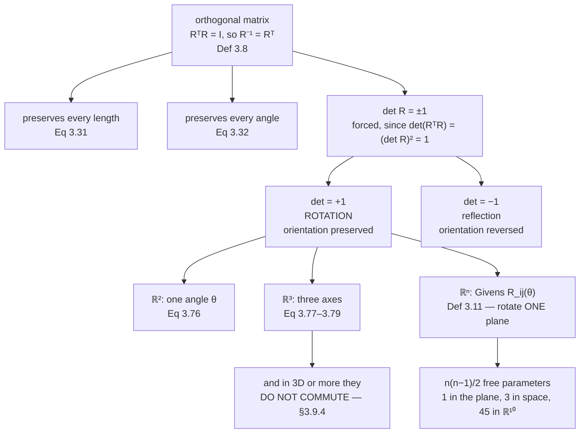

§3.4 established that orthogonal matrices preserve every length and every angle. That is a strong
property, and it leaves exactly two kinds of map: those that preserve orientation and those that
reverse it. The first kind are **rotations**.

They are the transformations that move data without distorting any of the geometry this chapter built —
which makes them the right tool whenever you want to change coordinates without changing what the data
means. Every $\mathbf{U}$ and $\mathbf{V}$ in a singular value decomposition is one, which is why
Chapter 4's factorisation reads as "rotate, scale, rotate".

## What you'll learn

- What a rotation is, and why $\det \mathbf{R} = +1$ is the extra condition beyond orthogonality.
- The $2\times2$ rotation matrix, derived from where it sends the standard basis.
- The three $3\times3$ rotations about the coordinate axes (Equations 3.77 to 3.79) and the convention that fixes their signs.
- **Givens rotations** (Definition 3.11): rotation in one plane of $\mathbb{R}^n$, leaving everything else alone.
- The four properties of §3.9.4 — including the measured failure of **commutativity** in three dimensions.
- Why composing a hundred thousand rotations drifts, and by how much.

## Intuition: turning the page, not stretching it

Put a photograph on a table and turn it. Nothing about the photograph changes: no distance between two
printed points changes, no angle changes, nothing is stretched or mirrored. Only the orientation
relative to the table changed, and the table's origin stayed put.

That is a rotation. Contrast it with three neighbours:

| operation | preserves lengths? | preserves angles? | preserves orientation? |
| --- | --- | --- | --- |
| rotation | yes | yes | **yes** |
| reflection | yes | yes | no |
| uniform scaling | no | yes | yes |
| shear | no | no | yes |

Rotations are the intersection of the first two columns *and* the third. Orthogonality buys the first
two; $\det = +1$ buys the third.



## The math

:::note[Rotation]
A **rotation** is a linear mapping — more specifically an **automorphism** of a Euclidean vector space —
that rotates a plane by an angle $\theta$ about the origin, so that the origin is a fixed point. By
convention, a positive $\theta > 0$ rotates **counterclockwise**.
:::

Note "automorphism": a rotation maps the space onto itself bijectively. It cannot flatten anything,
which the determinant being nonzero already guarantees.

### Rotations in the plane

Fix the standard basis $\{\mathbf{e}_1, \mathbf{e}_2\}$ and ask where a rotation by $\theta$ sends each
basis vector. Trigonometry on the unit circle gives

$$
\Phi(\mathbf{e}_1) = \begin{bmatrix}\cos\theta\\ \sin\theta\end{bmatrix},
\qquad
\Phi(\mathbf{e}_2) = \begin{bmatrix}-\sin\theta\\ \cos\theta\end{bmatrix}
\tag{3.75}
$$

and since the columns of a matrix are the images of the basis vectors (Chapter 2, §2.7),

$$
\mathbf{R}(\theta) = \begin{bmatrix}\Phi(\mathbf{e}_1) & \Phi(\mathbf{e}_2)\end{bmatrix}
= \begin{bmatrix}\cos\theta & -\sin\theta\\ \sin\theta & \cos\theta\end{bmatrix}
\tag{3.76}
$$

That is the entire derivation. There is nothing to memorise beyond "where does $\mathbf{e}_1$ go" —
the minus sign sits in the top right because $\mathbf{e}_2$ swings *backwards* into the second
quadrant.

Two facts fall out. $\mathbf{R}(\theta)^\top\mathbf{R}(\theta) = \mathbf{I}$ because
$\cos^2 + \sin^2 = 1$, and $\det\mathbf{R}(\theta) = \cos^2\theta + \sin^2\theta = 1$ exactly. And the
composition rule is addition of angles:
$\mathbf{R}(\alpha)\mathbf{R}(\beta) = \mathbf{R}(\alpha+\beta)$, which is the angle-sum identity
written as a matrix product.

### Rotations in three dimensions

In the plane there is one plane to rotate. In space you must say *which* plane, and the standard choice
is to name the axis left fixed. The convention: "counterclockwise" about an axis means looking at that
axis **head on, from its tip toward the origin**.

$$
\mathbf{R}_1(\theta) = \begin{bmatrix}1 & 0 & 0\\ 0 & \cos\theta & -\sin\theta\\ 0 & \sin\theta & \cos\theta\end{bmatrix}
\tag{3.77}
$$

$$
\mathbf{R}_2(\theta) = \begin{bmatrix}\cos\theta & 0 & \sin\theta\\ 0 & 1 & 0\\ -\sin\theta & 0 & \cos\theta\end{bmatrix}
\tag{3.78}
$$

$$
\mathbf{R}_3(\theta) = \begin{bmatrix}\cos\theta & -\sin\theta & 0\\ \sin\theta & \cos\theta & 0\\ 0 & 0 & 1\end{bmatrix}
\tag{3.79}
$$

$\mathbf{R}_1$ fixes the $\mathbf{e}_1$ coordinate and rotates the $\mathbf{e}_2\mathbf{e}_3$ plane;
$\mathbf{R}_3$ fixes $\mathbf{e}_3$ and is the $2\times2$ case padded out. **$\mathbf{R}_2$ has its signs
the other way round** — $+\sin$ in the top right — and that is not a typo: it follows from the
head-on-from-the-tip convention applied to the $\mathbf{e}_1\mathbf{e}_3$ plane, which the book spells
out. If you write $\mathbf{R}_2$ from pattern-matching rather than from the convention you will get it
backwards, and the resulting bug rotates the right amount in the wrong direction.

### Rotations in n dimensions

:::note[Definition 3.11 — Givens rotation]
Let $V$ be an $n$-dimensional Euclidean vector space and $\Phi : V \to V$ an automorphism with
transformation matrix

$$
\mathbf{R}_{ij}(\theta) := \begin{bmatrix}
\mathbf{I}_{i-1} & \mathbf{0} & \cdots & \cdots & \mathbf{0}\\
\mathbf{0} & \cos\theta & \mathbf{0} & -\sin\theta & \mathbf{0}\\
\mathbf{0} & \mathbf{0} & \mathbf{I}_{j-i-1} & \mathbf{0} & \mathbf{0}\\
\mathbf{0} & \sin\theta & \mathbf{0} & \cos\theta & \mathbf{0}\\
\mathbf{0} & \cdots & \cdots & \mathbf{0} & \mathbf{I}_{n-j}
\end{bmatrix} \in \mathbb{R}^{n\times n}
\tag{3.80}
$$

for $1 \leq i < j \leq n$ and $\theta \in \mathbb{R}$. Then $\mathbf{R}_{ij}(\theta)$ is a
**Givens rotation**. It is the identity matrix $\mathbf{I}_n$ with

$$
r_{ii} = \cos\theta, \quad r_{ij} = -\sin\theta, \quad r_{ji} = \sin\theta, \quad r_{jj} = \cos\theta .
\tag{3.81}
$$

In two dimensions this is Equation 3.76 as a special case.
:::

Equation 3.80 looks forbidding and says something simple: **take the identity, and change four
entries.** A Givens rotation fixes $n-2$ dimensions and rotates the remaining two-dimensional plane. It
is how you rotate in high dimensions at all, and it is how numerical routines zero out matrix entries
one at a time — Givens QR does exactly that.

The parameter count follows: choosing the plane means choosing $\{i, j\}$, so a general rotation in
$\mathbb{R}^n$ needs $\binom{n}{2} = n(n-1)/2$ angles. That is $1$ in the plane, $3$ in space, $6$ in
$\mathbb{R}^4$ and $45$ in $\mathbb{R}^{10}$ — so "one angle" is a coincidence of two dimensions, not
the general rule.

### Properties

:::note[Section 3.9.4]
- Rotations **preserve distances**: $\lVert\mathbf{x}-\mathbf{y}\rVert = \lVert\mathbf{R}_\theta(\mathbf{x}) - \mathbf{R}_\theta(\mathbf{y})\rVert$.
- Rotations **preserve angles**: the angle between $\mathbf{R}_\theta\mathbf{x}$ and $\mathbf{R}_\theta\mathbf{y}$ equals the angle between $\mathbf{x}$ and $\mathbf{y}$.
- Rotations in three or more dimensions are **generally not commutative**, so the order of application matters even when they rotate about the same point. Only in two dimensions are they commutative, with $\mathbf{R}(\phi)\mathbf{R}(\theta) = \mathbf{R}(\theta)\mathbf{R}(\phi)$ for all $\phi, \theta$.
- They form an **Abelian group** under multiplication only if they rotate about the same point — for example the origin.
:::

The first two are §3.4's Equations 3.31 and 3.32, since a rotation is an orthogonal matrix. The third is
the one that costs people real time, and it is worth measuring rather than accepting.

:::tip[From the book]
Section 3.9, opening with Figure 3.14 (a square rotated by $112.5°$) and Equation 3.74, and Figure 3.15
showing a robotic arm. §3.9.1 derives the $2\times2$ case, Equations 3.75 and 3.76, with Figure 3.16.
§3.9.2 gives the three $\mathbb{R}^3$ rotations, Equations 3.77 to 3.79, with Figure 3.17 and the
head-on-from-the-tip convention. §3.9.3 gives Definition 3.11, the Givens rotation, Equations 3.80 and
3.81. §3.9.4 lists the four properties above. §3.10 notes that rotations matter in computer graphics and
robotics, and Chapter 4 will show that the outer factors of a singular value decomposition are
rotations.
:::

## Worked example by hand

### The book's Exercise 3.10 — rotate by 30 degrees

$\cos 30° = \tfrac{\sqrt{3}}{2} \approx 0.866025$ and $\sin 30° = \tfrac{1}{2}$, so

$$
\mathbf{R}(30°) = \begin{bmatrix}\tfrac{\sqrt3}{2} & -\tfrac12\\[2pt] \tfrac12 & \tfrac{\sqrt3}{2}\end{bmatrix}
\approx \begin{bmatrix}0.866025 & -0.5\\ 0.5 & 0.866025\end{bmatrix}
$$

**$\mathbf{x}_1 = (2,3)^\top$:**

$$
\mathbf{R}\mathbf{x}_1 = \begin{bmatrix}2\cdot\tfrac{\sqrt3}{2} - 3\cdot\tfrac12\\[2pt] 2\cdot\tfrac12 + 3\cdot\tfrac{\sqrt3}{2}\end{bmatrix}
= \begin{bmatrix}\sqrt3 - \tfrac32\\[2pt] 1 + \tfrac{3\sqrt3}{2}\end{bmatrix}
\approx \begin{bmatrix}0.232051\\ 3.598076\end{bmatrix}
$$

**$\mathbf{x}_2 = (0,-1)^\top$:**

$$
\mathbf{R}\mathbf{x}_2 = \begin{bmatrix}0 + \tfrac12\\[2pt] 0 - \tfrac{\sqrt3}{2}\end{bmatrix}
= \begin{bmatrix}\tfrac12\\[2pt] -\tfrac{\sqrt3}{2}\end{bmatrix}
= \begin{bmatrix}0.5\\ -0.866025\end{bmatrix}
$$

Note that $\mathbf{R}\mathbf{x}_2$ is $-\mathbf{e}_2$ rotated by $30°$, which is $\mathbf{e}_1$ rotated
by $-60°$ — the second column of $\mathbf{R}$, negated. Rotating a basis vector just reads off a column.

**The checks:**

| quantity | before | after |
| --- | --- | --- |
| $\lVert\mathbf{x}_1\rVert$ | $\sqrt{13} = 3.605551$ | $3.605551$ |
| $\lVert\mathbf{x}_2\rVert$ | $1.000000$ | $1.000000$ |
| angle between them | $146.309932°$ | $146.309932°$ |
| $\det\mathbf{R}$ | — | $1.000000000000000$ |

Nine matching digits on the angle, and the determinant is exactly $1$ in floating point.

### The book's Figure 3.14, and a lesson about rounding

The book's opening example gives

$$
\mathbf{R} = \begin{bmatrix}-0.38 & -0.92\\ 0.92 & -0.38\end{bmatrix}
\tag{3.74}
$$

and captions the figure "Rotated by $112.5°$". Check it: $\arctan2(0.92,\ -0.38) = 112.4428°$, which is
close to $112.5°$ but not equal, and

$$
\det\mathbf{R} = (-0.38)^2 + (0.92)^2 = 0.1444 + 0.8464 = 0.9908 \neq 1 .
$$

The matrix as printed is **not** orthogonal: $\lVert\mathbf{R}^\top\mathbf{R} - \mathbf{I}\rVert = 0.0130$.
The reason is benign — the book rounded $\cos 112.5° = -0.382683$ and $\sin 112.5° = 0.923880$ to two
decimals for readability — but the lesson generalises. **A rounded rotation matrix is not a rotation
matrix.** It shrinks every vector it touches by about $0.5\%$ here, and if you compose a few hundred of
them the drift compounds. This is why graphics and robotics code re-orthonormalises stored rotations
periodically, and why quaternions (which need only be renormalised, one division) are popular for
storing orientations.

```python title="rotations_worked.py" showLineNumbers{1}
import numpy as np

def R2(theta):
    c, s = np.cos(theta), np.sin(theta)
    return np.array([[c, -s], [s, c]])

R = R2(np.radians(30.0))
print("R(30) =\n", np.round(R, 6))

cos = lambda a, b: float(a @ b) / (np.linalg.norm(a) * np.linalg.norm(b))
x1, x2 = np.array([2.0, 3.0]), np.array([0.0, -1.0])
y1, y2 = R @ x1, R @ x2
print("x1 ->", np.round(y1, 6), "  exact:", round(np.sqrt(3) - 1.5, 6), round(1 + 1.5 * np.sqrt(3), 6))
print("x2 ->", np.round(y2, 6), "  exact:", 0.5, round(-np.sqrt(3) / 2, 6))
print("lengths:", round(float(np.linalg.norm(x1)), 6), "->", round(float(np.linalg.norm(y1)), 6))
print("angle before:", round(float(np.degrees(np.arccos(np.clip(cos(x1, x2), -1, 1)))), 6))
print("angle after: ", round(float(np.degrees(np.arccos(np.clip(cos(y1, y2), -1, 1)))), 6))
print("det R =", f"{np.linalg.det(R):.15f}")

# The book's Equation 3.74, as printed.
Rb = np.array([[-0.38, -0.92], [0.92, -0.38]])
print()
print("Eq 3.74 det =", round(float(np.linalg.det(Rb)), 6))
print("||Rb^T Rb - I|| =", f"{np.linalg.norm(Rb.T @ Rb - np.eye(2)):.4f}")
print("its angle:", round(float(np.degrees(np.arctan2(0.92, -0.38))), 4), "deg")
print("exact cos(112.5) =", round(float(np.cos(np.radians(112.5))), 6),
      " sin(112.5) =", round(float(np.sin(np.radians(112.5))), 6))
```

```text title="output"
R(30) =
 [[ 0.866025 -0.5     ]
 [ 0.5       0.866025]]
x1 -> [0.232051 3.598076]   exact: 0.232051 3.598076
x2 -> [ 0.5      -0.866025]   exact: 0.5 -0.866025
lengths: 3.605551 -> 3.605551
angle before: 146.309932
angle after:  146.309932
det R = 1.000000000000000

Eq 3.74 det = 0.9908
||Rb^T Rb - I|| = 0.0130
its angle: 112.4428 deg
exact cos(112.5) = -0.382683  sin(112.5) = 0.92388
```

## See it move

The first sketch is Equation 3.76 with the matrix on screen and both preservation properties measured
live.

```p5 title="R(theta) turns and never distorts" desc="Drag theta. The shape rotates, the live matrix updates, and the two readouts measure the largest change in any pairwise distance and the change in the angle between two marked vertices. Both stay at machine epsilon for every theta, which is Equations 3.31 and 3.32 checked continuously." height="530"
let theta = 0.6;
let KNOBS = [], dragging = null;
const SHAPE = [[0.6, 0.4], [2.0, 0.4], [2.0, 1.3], [1.3, 1.75], [0.6, 1.3], [0.6, 0.4]];
const U = 62;
let cx, cy;

function setup() { createCanvas(600, 530); textFont("monospace"); cx = 230; cy = 210; }

function sx(x) { return cx + x * U; }
function sy(y) { return cy - y * U; }

function knob(id, x, y, w, value, mn, mx, label) {
  KNOBS.push({ id, x, y, w, mn, mx });
  const t = (value - mn) / (mx - mn);
  stroke(60, 74, 92); strokeWeight(2); line(x, y, x + w, y);
  noStroke(); fill(255, 211, 67); ellipse(x + t * w, y, 11, 11);
  fill(190, 200, 212); textSize(11); textAlign(LEFT, CENTER);
  text(label, x + w + 12, y);
}
function mousePressed() {
  for (const k of KNOBS) {
    if (mouseY > k.y - 12 && mouseY < k.y + 12 && mouseX > k.x - 12 && mouseX < k.x + k.w + 12) {
      dragging = k; return;
    }
  }
}
function mouseReleased() { dragging = null; }
function mouseDragged() {
  if (!dragging) return;
  const t = Math.min(1, Math.max(0, (mouseX - dragging.x) / dragging.w));
  theta = dragging.mn + t * (dragging.mx - dragging.mn);
  if (!isLooping()) redraw();
}

function draw() {
  background(13, 17, 23);
  KNOBS = [];

  stroke(32, 44, 58); strokeWeight(1);
  for (let g = -3; g <= 5; g++) line(sx(g), sy(-3), sx(g), sy(3));
  for (let g = -3; g <= 3; g++) line(sx(-3), sy(g), sx(5), sy(g));
  stroke(58, 72, 88); strokeWeight(1.2);
  line(sx(-3), sy(0), sx(5), sy(0)); line(sx(0), sy(-3), sx(0), sy(3));

  const c = Math.cos(theta), s = Math.sin(theta);
  const rot = p => [c * p[0] - s * p[1], s * p[0] + c * p[1]];

  // The unit circle, so the rotation of e1 and e2 is readable.
  noFill(); stroke(70, 84, 100); strokeWeight(1.1); ellipse(sx(0), sy(0), 2 * U, 2 * U);

  // Original, faint.
  noFill(); stroke(96, 106, 122); strokeWeight(1.6);
  beginShape();
  for (const p of SHAPE) vertex(sx(p[0]), sy(p[1]));
  endShape();

  // Rotated.
  const R = SHAPE.map(rot);
  noFill(); stroke(255, 211, 67); strokeWeight(2.6);
  beginShape();
  for (const p of R) vertex(sx(p[0]), sy(p[1]));
  endShape();

  // The images of the standard basis: the columns of R(theta).
  stroke(75, 139, 190); strokeWeight(2.4);
  line(sx(0), sy(0), sx(c), sy(s));
  stroke(120, 200, 140);
  line(sx(0), sy(0), sx(-s), sy(c));
  noStroke();
  fill(75, 139, 190); ellipse(sx(c), sy(s), 9, 9);
  fill(120, 200, 140); ellipse(sx(-s), sy(c), 9, 9);
  textSize(11); textAlign(LEFT, TOP);
  fill(75, 139, 190); text("R e1", sx(c) + 8, sy(s) - 18);
  fill(120, 200, 140); text("R e2", sx(-s) + 8, sy(c) - 18);

  // Measured preservation.
  let dmax = 0;
  for (let i = 0; i < SHAPE.length; i++) {
    for (let j = i + 1; j < SHAPE.length; j++) {
      const d0 = Math.hypot(SHAPE[i][0] - SHAPE[j][0], SHAPE[i][1] - SHAPE[j][1]);
      const d1 = Math.hypot(R[i][0] - R[j][0], R[i][1] - R[j][1]);
      dmax = Math.max(dmax, Math.abs(d1 - d0));
    }
  }
  const cosOf = (a, b) => (a[0] * b[0] + a[1] * b[1]) / (Math.hypot(a[0], a[1]) * Math.hypot(b[0], b[1]));
  const angGap = Math.abs(cosOf(SHAPE[0], SHAPE[3]) - cosOf(R[0], R[3]));
  const det = c * c + s * s;

  knob("t", 40, 372, 240, theta, 0, 6.2832, `theta = ${theta.toFixed(4)} rad = ${(theta * 180 / Math.PI).toFixed(2)} deg`);

  noStroke(); textAlign(LEFT, TOP);
  fill(255, 211, 67); textSize(14); text("Drag theta", 30, 14);
  fill(215); textSize(12);
  text("R(theta) =", 330, 44);
  text(`[ ${c.toFixed(4)}  ${(-s).toFixed(4)} ]`, 330, 66);
  text(`[ ${s.toFixed(4)}  ${c.toFixed(4)} ]`, 330, 86);
  textSize(11);
  text(`det R = ${det.toFixed(15)}`, 30, 412);
  fill(dmax < 1e-12 ? color(120, 200, 140) : color(232, 110, 110));
  text(`largest change in any distance  ${dmax.toExponential(2)}`, 30, 436);
  fill(angGap < 1e-12 ? color(120, 200, 140) : color(232, 110, 110));
  text(`change in one angle's cosine    ${angGap.toExponential(2)}`, 30, 456);
  fill(150); textSize(10);
  text("The two blue and green arrows ARE the columns of R(theta) — the images of e1 and e2.", 30, 486);
  text("Nothing measurable about the shape changes: it is the same shape, turned.", 30, 502);
}
```

The second sketch is the non-commutativity, in an oblique three-dimensional view.

```p5 title="In space, the order matters" desc="Two knobs set the angles of a rotation about e1 and a rotation about e3. The blue outline is R1 then R3 applied to the box, the amber outline is R3 then R1, and the red segments join corresponding corners. Set either angle to zero and the two coincide; set both and they do not. The Frobenius norm of the commutator is measured underneath." height="540"
let a1 = 0.61, a3 = 1.22;
let KNOBS = [], dragging = null;
const U = 88;
let cx, cy;
const OBL_X = -0.52, OBL_Y = -0.36;
const BOX = [];

function setup() {
  createCanvas(600, 540); textFont("monospace"); cx = 250; cy = 200;
  // A flat plate at x = 1, so the two orders are visibly different.
  const pts = [[1, 0, 0], [1, 0.8, 0], [1, 0.8, 0.6], [1, 0, 0.6], [1, 0, 0]];
  for (const p of pts) BOX.push(p.slice());
}

function proj(v) { return [v[0] + OBL_X * v[2], v[1] + OBL_Y * v[2]]; }
function sx(x) { return cx + x * U; }
function sy(y) { return cy - y * U; }
function px(v) { const q = proj(v); return [sx(q[0]), sy(q[1])]; }

function mul(A, B) {
  const C = [[0, 0, 0], [0, 0, 0], [0, 0, 0]];
  for (let i = 0; i < 3; i++) for (let j = 0; j < 3; j++) {
    let s = 0; for (let k = 0; k < 3; k++) s += A[i][k] * B[k][j];
    C[i][j] = s;
  }
  return C;
}
function apply(A, v) {
  return [A[0][0] * v[0] + A[0][1] * v[1] + A[0][2] * v[2],
          A[1][0] * v[0] + A[1][1] * v[1] + A[1][2] * v[2],
          A[2][0] * v[0] + A[2][1] * v[1] + A[2][2] * v[2]];
}
function R1(t) { const c = Math.cos(t), s = Math.sin(t); return [[1, 0, 0], [0, c, -s], [0, s, c]]; }
function R3(t) { const c = Math.cos(t), s = Math.sin(t); return [[c, -s, 0], [s, c, 0], [0, 0, 1]]; }

function knob(id, x, y, w, value, mn, mx, label) {
  KNOBS.push({ id, x, y, w, mn, mx });
  const t = (value - mn) / (mx - mn);
  stroke(60, 74, 92); strokeWeight(2); line(x, y, x + w, y);
  noStroke(); fill(255, 211, 67); ellipse(x + t * w, y, 11, 11);
  fill(190, 200, 212); textSize(11); textAlign(LEFT, CENTER);
  text(label, x + w + 12, y);
}
function mousePressed() {
  for (const k of KNOBS) {
    if (mouseY > k.y - 12 && mouseY < k.y + 12 && mouseX > k.x - 12 && mouseX < k.x + k.w + 12) {
      dragging = k; return;
    }
  }
}
function mouseReleased() { dragging = null; }
function mouseDragged() {
  if (!dragging) return;
  const t = Math.min(1, Math.max(0, (mouseX - dragging.x) / dragging.w));
  const v = dragging.mn + t * (dragging.mx - dragging.mn);
  if (dragging.id === "a1") a1 = v;
  if (dragging.id === "a3") a3 = v;
  if (!isLooping()) redraw();
}

function draw() {
  background(13, 17, 23);
  KNOBS = [];

  // Axes in the oblique projection.
  stroke(58, 72, 88); strokeWeight(1.2);
  for (const ax of [[2, 0, 0], [0, 2, 0], [0, 0, 2]]) {
    const a = px([-ax[0], -ax[1], -ax[2]]), b = px(ax);
    line(a[0], a[1], b[0], b[1]);
  }
  noStroke(); fill(120); textSize(10);
  const l1 = px([2.1, 0, 0]), l2 = px([0, 2.1, 0]), l3 = px([0, 0, 2.1]);
  text("e1", l1[0], l1[1]); text("e2", l2[0], l2[1]); text("e3", l3[0], l3[1]);

  const A = mul(R1(a1), R3(a3));
  const B = mul(R3(a3), R1(a1));

  const pa = BOX.map(v => apply(A, v));
  const pb = BOX.map(v => apply(B, v));

  // The original, faint.
  noFill(); stroke(90, 100, 116); strokeWeight(1.4);
  beginShape();
  for (const v of BOX) { const q = px(v); vertex(q[0], q[1]); }
  endShape();

  // Corresponding-corner links first, so the outlines sit on top.
  stroke(232, 110, 110); strokeWeight(1.2);
  for (let i = 0; i < BOX.length; i++) {
    const q = px(pa[i]), r = px(pb[i]);
    line(q[0], q[1], r[0], r[1]);
  }

  noFill(); stroke(75, 139, 190); strokeWeight(2.6);
  beginShape();
  for (const v of pa) { const q = px(v); vertex(q[0], q[1]); }
  endShape();
  stroke(255, 211, 67); strokeWeight(2.0);
  drawingContext.setLineDash([6, 5]);
  beginShape();
  for (const v of pb) { const q = px(v); vertex(q[0], q[1]); }
  endShape();
  drawingContext.setLineDash([]);

  // Measurements.
  let gap = 0;
  for (let i = 0; i < BOX.length; i++) {
    gap = Math.max(gap, Math.hypot(pa[i][0] - pb[i][0], pa[i][1] - pb[i][1], pa[i][2] - pb[i][2]));
  }
  let comm = 0;
  for (let i = 0; i < 3; i++) for (let j = 0; j < 3; j++) comm += (A[i][j] - B[i][j]) ** 2;
  comm = Math.sqrt(comm);

  knob("a1", 40, 388, 190, a1, 0, Math.PI, `theta about e1 = ${(a1 * 180 / Math.PI).toFixed(1)} deg`);
  knob("a3", 40, 416, 190, a3, 0, Math.PI, `theta about e3 = ${(a3 * 180 / Math.PI).toFixed(1)} deg`);

  noStroke(); textAlign(LEFT, TOP);
  fill(255, 211, 67); textSize(14); text("Two rotations, two orders", 30, 14);
  fill(75, 139, 190); textSize(11); text("solid blue: R1 then R3", 380, 44);
  fill(255, 211, 67); text("dashed amber: R3 then R1", 380, 62);
  fill(215);
  text(`||R1R3 - R3R1||_F = ${comm.toFixed(6)}`, 30, 452);
  fill(gap < 1e-9 ? color(120, 200, 140) : color(232, 110, 110));
  text(`largest corner displacement = ${gap.toFixed(6)}`, 30, 472);
  fill(150); textSize(10);
  text(gap < 1e-9 ? "the two orders coincide: one of the angles is zero"
                  : "the two orders land in different places, and no amount of care fixes it", 30, 498);
  text("in R^2 this readout is always zero — commutativity is a two-dimensional accident", 30, 514);
}
```

The third sketch shows what a Givens rotation actually is: the identity with four entries changed.

```p5 title="A Givens rotation is the identity with four entries changed" desc="Pick the plane (i, j) and the angle. The grid is the full n by n matrix, with unchanged identity entries in grey and the four altered entries highlighted. The readout counts how many entries differ from the identity, and confirms the matrix is orthogonal with determinant one for every choice." height="540"
let iIdx = 1, jIdx = 4, ang = 0.7;
let KNOBS = [], dragging = null;
const N = 6;

function setup() { createCanvas(600, 540); textFont("monospace"); }

function knob(id, x, y, w, value, mn, mx, label, steps) {
  KNOBS.push({ id, x, y, w, mn, mx, steps });
  const t = (value - mn) / (mx - mn);
  stroke(60, 74, 92); strokeWeight(2); line(x, y, x + w, y);
  if (steps) {
    for (let k = 0; k <= mx - mn; k++) {
      stroke(90, 104, 122); strokeWeight(1);
      const tx = x + (k / (mx - mn)) * w;
      line(tx, y - 5, tx, y + 5);
    }
  }
  noStroke(); fill(255, 211, 67); ellipse(x + t * w, y, 10, 10);
  fill(190, 200, 212); textSize(11); textAlign(LEFT, CENTER);
  text(label, x + w + 12, y);
}
function mousePressed() {
  for (const k of KNOBS) {
    if (mouseY > k.y - 11 && mouseY < k.y + 11 && mouseX > k.x - 11 && mouseX < k.x + k.w + 11) {
      dragging = k; return;
    }
  }
}
function mouseReleased() { dragging = null; }
function mouseDragged() {
  if (!dragging) return;
  const t = Math.min(1, Math.max(0, (mouseX - dragging.x) / dragging.w));
  const raw = dragging.mn + t * (dragging.mx - dragging.mn);
  if (dragging.id === "i") iIdx = Math.round(raw);
  if (dragging.id === "j") jIdx = Math.round(raw);
  if (dragging.id === "a") ang = raw;
  if (iIdx >= jIdx) jIdx = Math.min(N, iIdx + 1);
  if (!isLooping()) redraw();
}

function draw() {
  background(13, 17, 23);
  KNOBS = [];

  const c = Math.cos(ang), s = Math.sin(ang);
  // Build R_ij(theta): the identity with four entries replaced (Eq 3.81).
  const R = [];
  for (let r = 0; r < N; r++) {
    R.push([]);
    for (let k = 0; k < N; k++) R[r].push(r === k ? 1 : 0);
  }
  const i0 = iIdx - 1, j0 = jIdx - 1;
  R[i0][i0] = c; R[i0][j0] = -s; R[j0][i0] = s; R[j0][j0] = c;

  // Draw the grid.
  const cell = 52, gx = 60, gy = 70;
  for (let r = 0; r < N; r++) {
    for (let k = 0; k < N; k++) {
      const touched = (r === i0 || r === j0) && (k === i0 || k === j0);
      noStroke();
      fill(touched ? color(48, 40, 18) : color(20, 26, 34));
      rect(gx + k * cell, gy + r * cell, cell - 3, cell - 3, 4);
      fill(touched ? color(255, 211, 67) : (R[r][k] === 1 ? color(140, 150, 164) : color(60, 70, 84)));
      textSize(touched ? 12 : 11); textAlign(CENTER, CENTER);
      const v = R[r][k];
      text(Math.abs(v) < 1e-12 ? "0" : v.toFixed(touched ? 3 : 0),
           gx + k * cell + (cell - 3) / 2, gy + r * cell + (cell - 3) / 2);
    }
  }
  noStroke(); fill(120); textSize(10); textAlign(CENTER, BOTTOM);
  for (let k = 0; k < N; k++) text(String(k + 1), gx + k * cell + (cell - 3) / 2, gy - 6);
  textAlign(RIGHT, CENTER);
  for (let r = 0; r < N; r++) text(String(r + 1), gx - 8, gy + r * cell + (cell - 3) / 2);

  // Checks: orthogonality, determinant, and how many entries moved.
  let orthGap = 0;
  for (let r = 0; r < N; r++) {
    for (let k = 0; k < N; k++) {
      let acc = 0;
      for (let m = 0; m < N; m++) acc += R[m][r] * R[m][k];
      orthGap = Math.max(orthGap, Math.abs(acc - (r === k ? 1 : 0)));
    }
  }
  let moved = 0;
  for (let r = 0; r < N; r++) for (let k = 0; k < N; k++) {
    if (Math.abs(R[r][k] - (r === k ? 1 : 0)) > 1e-12) moved++;
  }
  const det = c * c + s * s;   // the 2x2 block's determinant; the rest is identity

  knob("i", 40, 428, 130, iIdx, 1, N - 1, `i = ${iIdx}`, true);
  knob("j", 40, 456, 130, jIdx, 2, N, `j = ${jIdx}`, true);
  knob("a", 40, 484, 130, ang, 0, Math.PI, `theta = ${(ang * 180 / Math.PI).toFixed(1)} deg`);

  noStroke(); textAlign(LEFT, TOP);
  fill(255, 211, 67); textSize(14); text(`Givens rotation R_${iIdx}${jIdx}(theta) in R^${N}`, 30, 14);
  fill(215); textSize(11);
  text(`entries differing from the identity: ${moved}`, 380, 428);
  text(`fixed dimensions: ${N - 2} of ${N}`, 380, 448);
  fill(orthGap < 1e-12 ? color(120, 200, 140) : color(232, 110, 110));
  text(`||R^T R - I||_max = ${orthGap.toExponential(1)}`, 380, 470);
  fill(215); text(`det = ${det.toFixed(12)}`, 380, 490);
  fill(150); textSize(10);
  text(`a general rotation in R^${N} needs ${(N * (N - 1)) / 2} angles, not one`, 380, 512);
}
```

And the matrix stepper on a $30°$ rotation, which reports the eigenvalues — a rotation in the plane has
**no real eigenvectors** unless $\theta$ is a multiple of $\pi$, and that is worth seeing:

<MatrixLab
  client:visible
  matrix={[[0.8660254, -0.5], [0.5, 0.8660254]]}
  probe={[2, 3]}
  title="R(30 degrees) as a linear map"
  desc="The lattice turns rigidly. Note that no real direction is preserved: a genuine rotation in the plane has a complex pair of eigenvalues, which is the algebraic statement that it fixes no line."
/>

## From scratch

```python title="rotations_from_scratch.py" showLineNumbers{1}
import numpy as np

def rot2(theta):
    c, s = np.cos(theta), np.sin(theta)
    return np.array([[c, -s], [s, c]])

def givens(n, i, j, theta):
    """Equation 3.80: the identity with four entries replaced. 1-based i, j."""
    R = np.eye(n)
    c, s = np.cos(theta), np.sin(theta)
    R[i - 1, i - 1] = c
    R[i - 1, j - 1] = -s
    R[j - 1, i - 1] = s
    R[j - 1, j - 1] = c
    return R

def axis_rotations(theta):
    """Equations 3.77 to 3.79. Note R2's signs are the other way round."""
    c, s = np.cos(theta), np.sin(theta)
    R1 = np.array([[1, 0, 0], [0, c, -s], [0, s, c]], dtype=float)
    R2 = np.array([[c, 0, s], [0, 1, 0], [-s, 0, c]], dtype=float)
    R3 = np.array([[c, -s, 0], [s, c, 0], [0, 0, 1]], dtype=float)
    return R1, R2, R3

# Are they all orthogonal with determinant one?
for name, M in zip(("R1", "R2", "R3"), axis_rotations(0.7)):
    print(f"{name}: det {np.linalg.det(M):.15f}   ||M^T M - I|| {np.linalg.norm(M.T @ M - np.eye(3)):.2e}")
G = givens(6, 2, 5, 0.7)
print("Givens R_25 in R^6: det", f"{np.linalg.det(G):.15f}",
      "  entries differing from I:", int(np.sum(np.abs(G - np.eye(6)) > 1e-12)))

# Commutativity: yes in the plane, no in space.
a, b = np.radians(35.0), np.radians(70.0)
print()
print("2-D:  ||R(a)R(b) - R(b)R(a)|| =", f"{np.linalg.norm(rot2(a) @ rot2(b) - rot2(b) @ rot2(a)):.3e}")
print("2-D:  ||R(a)R(b) - R(a+b)||   =", f"{np.linalg.norm(rot2(a) @ rot2(b) - rot2(a + b)):.3e}")
R1a, _, _ = axis_rotations(a)
_, _, R3b = axis_rotations(b)
print("3-D:  ||R1R3 - R3R1||_F       =", round(float(np.linalg.norm(R1a @ R3b - R3b @ R1a)), 6))

# How far does orthogonality drift when you compose many rotations?
print()
rng = np.random.default_rng(11)
M = np.eye(3)
for k in range(1, 100001):
    which = k % 3
    R1k, R2k, R3k = axis_rotations(rng.uniform(0, 2 * np.pi))
    M = M @ (R1k if which == 0 else R2k if which == 1 else R3k)
    if k in (10, 100, 1000, 10000, 100000):
        print(f"after {k:6} products: ||M^T M - I|| {np.linalg.norm(M.T @ M - np.eye(3)):.3e}   "
              f"det {np.linalg.det(M):.15f}")
```

```text title="output"
R1: det 1.000000000000000   ||M^T M - I|| 2.95e-17
R2: det 1.000000000000000   ||M^T M - I|| 2.95e-17
R3: det 1.000000000000000   ||M^T M - I|| 2.95e-17
Givens R_25 in R^6: det 1.000000000000000   entries differing from I: 4

2-D:  ||R(a)R(b) - R(b)R(a)|| = 1.570e-16
2-D:  ||R(a)R(b) - R(a+b)||   = 1.110e-16
3-D:  ||R1R3 - R3R1||_F       = 0.961059

after     10 products: ||M^T M - I|| 3.362e-16   det 1.000000000000000
after    100 products: ||M^T M - I|| 1.940e-15   det 1.000000000000000
after   1000 products: ||M^T M - I|| 4.724e-15   det 0.999999999999998
after  10000 products: ||M^T M - I|| 2.482e-14   det 0.999999999999980
after 100000 products: ||M^T M - I|| 2.907e-13   det 0.999999999999751
```

Three results. The Givens rotation differs from the identity in exactly **four** entries, as Equation
3.81 says. In the plane the two orders agree to $1.6\times10^{-16}$ and the composition really is the
angle sum; in space $\lVert\mathbf{R}_1\mathbf{R}_3 - \mathbf{R}_3\mathbf{R}_1\rVert_F = 0.961059$, which
is not a small number.

The drift table is the practical one. Composing $100{,}000$ rotations leaves orthogonality off by
$2.9\times10^{-13}$ and the determinant off by $2.5\times10^{-13}$. That is remarkably good — the error
grows roughly like $\sqrt{k}$ rather than like $k$, because the individual rounding errors are
uncorrelated — and it is still a drift. Long-running simulations that accumulate rotations
re-orthonormalise periodically for exactly this reason.

## On real data

<Figure
  src="/images/mml/rotations/rotation-preserves"
  alt="Left, a cloud of forty points drawn at four different rotation angles. Right, a log plot of the largest change in any pairwise distance, the largest change in any pairwise angle, and the deviation of the determinant from one, all flat near machine epsilon across three hundred and sixty degrees."
  title="Three hundred and sixty rotations, nothing measurable changes"
  caption="780 pairwise distances and 780 pairwise angles were re-measured at every one of 361 angles. The worst change in any distance over the whole sweep is 1.776e-15 and the worst change in any angle is 1.827e-13, against a machine epsilon of 2.22e-16."
/>

<Figure
  src="/images/mml/rotations/rotations-do-not-commute"
  alt="Left, a square in the plane with the two composition orders drawn on top of each other and indistinguishable. Right, a three-dimensional plate with the two orders drawn separately and red segments joining corresponding corners, showing a visible gap."
  title="Commutativity is a two-dimensional accident"
  caption="Same two angles, 35 and 70 degrees, applied in both orders. In the plane the largest gap between the two results is 3.14e-16 — machine noise. In space it is 0.743106, and the Frobenius norm of the commutator is 0.961059."
/>

## Reading the plot

**From the preservation plot.** Three curves sit flat at the bottom across a full turn. The measured
worst cases over the whole sweep are $1.776\times10^{-15}$ for distances and $1.827\times10^{-13}$ for
angles, against a machine epsilon of $2.22\times10^{-16}$. So distances hold to about eight units in the
last place and angles to about eight hundred.

Why the difference? The angle goes through `arccos`, whose derivative blows up near $\pm 1$ — an
argument known to $10^{-16}$ gives an angle known to $\sqrt{10^{-16}} = 10^{-8}$ in the worst case. The
angles here are not near-degenerate so the amplification is only a factor of a few hundred, but the
asymmetry between the two curves is a property of `arccos` rather than of rotations. This is the same
sensitivity that makes the `clip` on the
[Angles and Orthogonality](../angles-and-orthogonality/) page mandatory.

**From the commutativity figure.** The left panel is the control: the two orders in the plane are drawn
one on top of the other and you cannot see two outlines, because the largest gap is
$3.14\times10^{-16}$. The right panel uses the *same two angles* and the gap is $0.743106$ — over a
plate whose longest side is $0.8$, so the two results are nearly a plate-width apart.

The commutator norm $\lVert\mathbf{R}_1\mathbf{R}_3 - \mathbf{R}_3\mathbf{R}_1\rVert_F = 0.961059$ is the
measurement to keep. Two rotation matrices, each of Frobenius norm $\sqrt{3} \approx 1.73$, whose
products in the two orders differ by nearly $1$. This is not a small effect to be managed with care; it
is the reason Euler angles need a stated convention, the reason "roll, pitch, yaw" is ambiguous without
an order, and the reason rotation composition is written down as a group rather than as a sum of angles.

And the group structure is the clean way to say it. In two dimensions $\mathbf{R}(\alpha)\mathbf{R}(\beta) = \mathbf{R}(\alpha+\beta)$,
measured to $1.1\times10^{-16}$: the rotations are just the reals modulo $2\pi$ in disguise, an Abelian
group. In three dimensions there is no such parametrisation, and the failure of commutativity is
precisely the obstruction.

## Pitfalls

:::danger[A rounded rotation matrix is not a rotation matrix]
The book's own Equation 3.74 demonstrates it: $\begin{bmatrix}-0.38 & -0.92\\ 0.92 & -0.38\end{bmatrix}$
has determinant $0.9908$ and $\lVert\mathbf{R}^\top\mathbf{R} - \mathbf{I}\rVert = 0.0130$. Rounded to
two decimals it shrinks every vector by about $0.5\%$. Store the *angle* (or a quaternion) rather than
the matrix, or re-orthonormalise with a QR or a polar decomposition after loading.
:::

:::danger[Watch the signs: R2 has them the other way round]
Equations 3.77 and 3.79 have $-\sin\theta$ above the diagonal; Equation 3.78 has $+\sin\theta$. This is
not an inconsistency in the book — it follows from the "look at the axis head on, from the tip toward the
origin" convention — but writing $\mathbf{R}_2$ by pattern-matching gives you a rotation by $-\theta$
about $\mathbf{e}_2$. The symptom is a system that turns the right amount the wrong way, which is easy to
mistake for a sign error somewhere else entirely.
:::

:::caution[Rotations do not commute, so "rotate by these three angles" is ambiguous]
Measured: $\lVert\mathbf{R}_1(35°)\mathbf{R}_3(70°) - \mathbf{R}_3(70°)\mathbf{R}_1(35°)\rVert_F = 0.961$.
There are twelve conventional orderings of three axis rotations (six Euler and six Tait-Bryan), and they
give twelve different results from the same three numbers. Any interface accepting Euler angles must
document its order, and any two libraries you connect probably disagree.
:::

:::danger[np.linalg.qr gives a reflection for even n, deterministically]
$\mathbf{Q}$ satisfies $\mathbf{Q}^\top\mathbf{Q} = \mathbf{I}$ and nothing constrains
$\det\mathbf{Q}$ to be $+1$ — but the sign is not random either. Householder QR applies $n-1$
reflections, each of determinant $-1$, so

$$
\det\mathbf{Q} = (-1)^{n-1}
$$

Measured over $n = 2$ to $12$, four hundred random inputs each, `np.linalg.qr` returned
$\det\mathbf{Q} = -1$ for **every** even $n$ and $+1$ for **every** odd $n$; `scipy.linalg.qr` agrees.
So "check the determinant" is right, and "it will be a rotation about half the time" is wrong: in even
dimensions it is a reflection every single time. If you need a rotation, flip the sign of one column.
:::

:::caution[A plane rotation has no real eigenvectors, and that is a feature]
For $\theta$ not a multiple of $\pi$, $\mathbf{R}(\theta)$ fixes no direction, so its eigenvalues are the
complex pair $e^{\pm i\theta}$. Code that calls `np.linalg.eig` on a rotation gets complex output and code
that calls `eigvalsh` gets nonsense, because a rotation is **not symmetric**. If you want a real
decomposition of a rotation, that is what the SVD is for, and Chapter 4 provides it.
:::

:::caution[Rotating about a point other than the origin is not linear]
Every matrix here fixes the origin. Rotating about $\mathbf{c}$ instead is
$\mathbf{x} \mapsto \mathbf{c} + \mathbf{R}(\mathbf{x} - \mathbf{c})$ — an **affine** map, exactly the
shift-transform-shift-back pattern of §3.8.4. The book's fourth property spells this out: rotations form
a group only when they share a fixed point.
:::

## Compare

| map | condition | preserves | determinant | example |
| --- | --- | --- | --- | --- |
| **rotation** | $\mathbf{R}^\top\mathbf{R}=\mathbf{I}$, $\det=+1$ | lengths, angles, orientation | $+1$ | $\mathbf{R}(\theta)$, Givens, SVD's $\mathbf{U}$ and $\mathbf{V}$ |
| reflection | $\mathbf{R}^\top\mathbf{R}=\mathbf{I}$, $\det=-1$ | lengths, angles | $-1$ | $\mathrm{diag}(1,-1)$; Householder |
| uniform scaling | $\mathbf{A}=c\mathbf{I}$ | angles | $c^n$ | $2\mathbf{I}$ |
| general orthogonal | $\mathbf{R}^\top\mathbf{R}=\mathbf{I}$ | lengths, angles | $\pm1$ | whatever `qr` gives you |
| shear | none | area (if $\det=1$) | $1$ | $\begin{bmatrix}1&1\\0&1\end{bmatrix}$ |
| projection | $\mathbf{P}^2=\mathbf{P}$ | nothing | $0$ unless $\mathbf{P}=\mathbf{I}$ | §3.8 |

Reading the determinant column: $+1$ is a rotation, $-1$ a reflection, $0$ a projection, anything else a
scaling of some kind. It is the fastest single diagnostic on an unfamiliar matrix.

<Quiz
  title="Check your understanding"
  questions={[
    {
      q: "Orthogonality gives length and angle preservation. What does det R = +1 add?",
      options: [
        "Invertibility",
        "Orientation preservation — the other case, det = -1, is a reflection, which preserves every length and every unsigned angle while flipping handedness",
        "Symmetry",
        "That the eigenvalues are real",
      ],
      answer: 1,
      explain:
        "Orthogonality forces det(R)^2 = 1, so the determinant is plus or minus one and both occur. diag(1, -1) is orthogonal with determinant -1, and np.linalg.qr returns a determinant of exactly (-1)^(n-1) — so in every even dimension its Q is a reflection, not a rotation.",
    },
    {
      q: "Why does Equation 3.78 have +sin(theta) in the top right where 3.77 and 3.79 have -sin(theta)?",
      options: [
        "It is a typo in the book",
        "It follows from the convention that counterclockwise about an axis means looking at that axis head on from its tip toward the origin — applied to the e1-e3 plane, that convention flips the sign pattern",
        "Because R2 is a reflection",
        "Because the e2 axis is special",
      ],
      answer: 1,
      explain:
        "Writing R2 by pattern-matching the other two gives a rotation by minus theta about e2. The symptom is a system turning the right amount in the wrong direction.",
    },
    {
      q: "A Givens rotation R_ij(theta) in R^6 differs from the identity in how many entries?",
      options: ["2", "4", "6", "36"],
      answer: 1,
      explain:
        "Equation 3.81 names them: r_ii = cos, r_ij = -sin, r_ji = sin, r_jj = cos. It fixes the other four dimensions entirely, which is why a general rotation in R^6 needs 15 angles rather than one.",
    },
    {
      q: "The measured commutator norm for two 3-D axis rotations at 35 and 70 degrees is 0.961. What is the practical consequence?",
      options: [
        "Rotations are not orthogonal after all",
        "Three Euler angles do not determine a rotation without an ordering convention — there are twelve conventional orderings and they give twelve different results from the same three numbers",
        "The angles must be small",
        "You must use degrees rather than radians",
      ],
      answer: 1,
      explain:
        "Each of those matrices has Frobenius norm sqrt(3), so a commutator of 0.961 is not a small perturbation. In the plane the same measurement is 1.6e-16, because two-dimensional rotations are an Abelian group.",
    },
    {
      q: "Composing 100000 random 3-D rotations leaves ||M-transpose M minus I|| at 2.9e-13. How should that be read?",
      options: [
        "The computation is broken",
        "Orthogonality is robust but does drift — the error grows roughly like the square root of the number of products, since individual rounding errors are uncorrelated — so long-running accumulations should re-orthonormalise",
        "Rotations are not closed under composition",
        "The determinant is unaffected",
      ],
      answer: 1,
      explain:
        "The determinant also drifts, to 0.999999999999751. Both are small enough to ignore for a hundred products and worth handling for a hundred thousand.",
    },
  ]}
/>

## 🧪 Try It Yourself

### Exercise 1 – The book's Exercise 3.10

<DataCampExercise
  lang="python"
  hint={`Build R(30 degrees) from cosine and sine, then multiply. Check the lengths and the angle before and after.`}
  code={`import numpy as np

def rot2(theta):
    c, s = np.cos(theta), np.sin(theta)
    return np.array([[c, -s], [s, ___]])            # replace ___ with c

R = rot2(np.radians(30.0))
print("R(30) =", np.round(R, 6).tolist())

x1, x2 = np.array([2.0, 3.0]), np.array([0.0, -1.0])
y1, y2 = R @ x1, R @ x2
print("x1 ->", np.round(y1, 6), " exact:", round(np.sqrt(3) - 1.5, 6), round(1 + 1.5 * np.sqrt(3), 6))
print("x2 ->", np.round(y2, 6), " exact:", 0.5, round(-np.sqrt(3) / 2, 6))
cos = lambda a, b: float(a @ b) / (np.linalg.norm(a) * np.linalg.norm(b))
print("lengths:", round(float(np.linalg.norm(x1)), 6), "->", round(float(np.linalg.norm(y1)), 6))
print("angle before:", round(float(np.degrees(np.arccos(np.clip(cos(x1, x2), -1, 1)))), 6))
print("angle after: ", round(float(np.degrees(np.arccos(np.clip(cos(y1, y2), -1, 1)))), 6))
print("det R =", f"{np.linalg.det(R):.15f}")

# -- Expected output ------------------------------
# R(30) = [[0.866025, -0.5], [0.5, 0.866025]]
# x1 -> [0.232051 3.598076]  exact: 0.232051 3.598076
# x2 -> [ 0.5      -0.866025]  exact: 0.5 -0.866025
# lengths: 3.605551 -> 3.605551
# angle before: 146.309932
# angle after:  146.309932
# det R = 1.000000000000000
# -------------------------------------------------`}
  solution={`import numpy as np

def rot2(theta):
    c, s = np.cos(theta), np.sin(theta)
    return np.array([[c, -s], [s, c]])

R = rot2(np.radians(30.0))
print("R(30) =", np.round(R, 6).tolist())

x1, x2 = np.array([2.0, 3.0]), np.array([0.0, -1.0])
y1, y2 = R @ x1, R @ x2
print("x1 ->", np.round(y1, 6), " exact:", round(np.sqrt(3) - 1.5, 6), round(1 + 1.5 * np.sqrt(3), 6))
print("x2 ->", np.round(y2, 6), " exact:", 0.5, round(-np.sqrt(3) / 2, 6))
cos = lambda a, b: float(a @ b) / (np.linalg.norm(a) * np.linalg.norm(b))
print("lengths:", round(float(np.linalg.norm(x1)), 6), "->", round(float(np.linalg.norm(y1)), 6))
print("angle before:", round(float(np.degrees(np.arccos(np.clip(cos(x1, x2), -1, 1)))), 6))
print("angle after: ", round(float(np.degrees(np.arccos(np.clip(cos(y1, y2), -1, 1)))), 6))
print("det R =", f"{np.linalg.det(R):.15f}")`}
  sct={`test_output_contains("angle after:  146.309932")
success_msg("Nine matching digits on the angle and a determinant of exactly 1. The exact answers are sqrt(3) - 1.5 and 1 + 1.5 sqrt(3) for the first vector, and one half and minus root three over two for the second.")`}
  height={320}
/>

### Exercise 2 – Test the book's Equation 3.74

<DataCampExercise
  lang="python"
  hint={`Compute the determinant and compare R-transpose R with the identity. Then recover the angle with arctan2 and compare against the caption's 112.5 degrees.`}
  code={`import numpy as np

Rb = np.array([[-0.38, -0.92], [0.92, -0.38]])

print("det =", round(float(np.linalg.det(Rb)), 6))
print("R^T R =")
print(np.round(Rb.T @ ___, 6))                    # replace ___ with Rb
print("||R^T R - I|| =", f"{np.linalg.norm(Rb.T @ Rb - np.eye(2)):.4f}")
print("angle from arctan2:", round(float(np.degrees(np.arctan2(0.92, -0.38))), 4), "deg")
print("exact cos(112.5) =", round(float(np.cos(np.radians(112.5))), 6),
      " sin(112.5) =", round(float(np.sin(np.radians(112.5))), 6))
print("shrinkage per application:", round(float(np.sqrt(np.linalg.det(Rb))), 6))

# -- Expected output ------------------------------
# det = 0.9908
# R^T R =
# [[0.9908 0.    ]
#  [0.     0.9908]]
# ||R^T R - I|| = 0.0130
# angle from arctan2: 112.4428 deg
# exact cos(112.5) = -0.382683  sin(112.5) = 0.92388
# shrinkage per application: 0.995389
# -------------------------------------------------`}
  solution={`import numpy as np

Rb = np.array([[-0.38, -0.92], [0.92, -0.38]])

print("det =", round(float(np.linalg.det(Rb)), 6))
print("R^T R =")
print(np.round(Rb.T @ Rb, 6))
print("||R^T R - I|| =", f"{np.linalg.norm(Rb.T @ Rb - np.eye(2)):.4f}")
print("angle from arctan2:", round(float(np.degrees(np.arctan2(0.92, -0.38))), 4), "deg")
print("exact cos(112.5) =", round(float(np.cos(np.radians(112.5))), 6),
      " sin(112.5) =", round(float(np.sin(np.radians(112.5))), 6))
print("shrinkage per application:", round(float(np.sqrt(np.linalg.det(Rb))), 6))`}
  sct={`test_output_contains("det = 0.9908")
success_msg("The book rounded cos and sin to two decimals for readability, and the result is a matrix that shrinks every vector by 0.46 percent per application. R-transpose R comes out as 0.9908 times the identity, which is a scaled rotation rather than a rotation.")`}
  height={300}
/>

### Exercise 3 – Build a Givens rotation

<DataCampExercise
  lang="python"
  hint={`Start from the identity and replace exactly four entries, as Equation 3.81 specifies.`}
  code={`import numpy as np

def givens(n, i, j, theta):
    R = np.eye(n)
    c, s = np.cos(theta), np.sin(theta)
    R[i - 1, i - 1] = c
    R[i - 1, j - 1] = -s
    R[j - 1, i - 1] = ___                          # replace ___ with s
    R[j - 1, j - 1] = c
    return R

G = givens(6, 2, 5, 0.7)
print(np.round(G, 4))
print("entries differing from I:", int(np.sum(np.abs(G - np.eye(6)) > 1e-12)))
print("det =", f"{np.linalg.det(G):.15f}")
print("||G^T G - I|| =", f"{np.linalg.norm(G.T @ G - np.eye(6)):.2e}")
print("angles needed for a general rotation in R^6:", 6 * 5 // 2)

# -- Expected output ------------------------------
# [[ 1.      0.      0.      0.      0.      0.    ]
#  [ 0.      0.7648  0.      0.     -0.6442  0.    ]
#  [ 0.      0.      1.      0.      0.      0.    ]
#  [ 0.      0.      0.      1.      0.      0.    ]
#  [ 0.      0.6442  0.      0.      0.7648  0.    ]
#  [ 0.      0.      0.      0.      0.      1.    ]]
# entries differing from I: 4
# det = 1.000000000000000
# ||G^T G - I|| = 2.95e-17
# angles needed for a general rotation in R^6: 15
# -------------------------------------------------`}
  solution={`import numpy as np

def givens(n, i, j, theta):
    R = np.eye(n)
    c, s = np.cos(theta), np.sin(theta)
    R[i - 1, i - 1] = c
    R[i - 1, j - 1] = -s
    R[j - 1, i - 1] = s
    R[j - 1, j - 1] = c
    return R

G = givens(6, 2, 5, 0.7)
print(np.round(G, 4))
print("entries differing from I:", int(np.sum(np.abs(G - np.eye(6)) > 1e-12)))
print("det =", f"{np.linalg.det(G):.15f}")
print("||G^T G - I|| =", f"{np.linalg.norm(G.T @ G - np.eye(6)):.2e}")
print("angles needed for a general rotation in R^6:", 6 * 5 // 2)`}
  sct={`test_output_contains("entries differing from I: 4")
success_msg("Four entries, and the other 32 are untouched. A Givens rotation fixes n-2 dimensions, which is what makes it the right primitive for zeroing matrix entries one at a time.")`}
  height={330}
/>

### Exercise 4 – Commutativity, measured in two dimensions and three

<DataCampExercise
  lang="python"
  hint={`Compare the two products in each dimension. In the plane also check that the product equals the rotation by the sum of the angles.`}
  code={`import numpy as np

def rot2(t):
    c, s = np.cos(t), np.sin(t)
    return np.array([[c, -s], [s, c]])

def R1(t):
    c, s = np.cos(t), np.sin(t)
    return np.array([[1, 0, 0], [0, c, -s], [0, s, c]], dtype=float)

def R3(t):
    c, s = np.cos(t), np.sin(t)
    return np.array([[c, -s, 0], [s, c, 0], [0, 0, 1]], dtype=float)

a, b = np.radians(35.0), np.radians(70.0)

print("2-D commutator:", f"{np.linalg.norm(rot2(a) @ rot2(b) - rot2(b) @ rot2(a)):.3e}")
print("2-D angle sum: ", f"{np.linalg.norm(rot2(a) @ rot2(b) - rot2(a + ___)):.3e}")  # replace ___ with b
print("3-D commutator:", round(float(np.linalg.norm(R1(a) @ R3(b) - R3(b) @ R1(a))), 6))

box = np.array([[1.0, 0.0, 0.0], [1.0, 0.8, 0.0], [1.0, 0.8, 0.6], [1.0, 0.0, 0.6]])
p = box @ (R1(a) @ R3(b)).T
q = box @ (R3(b) @ R1(a)).T
print("largest corner gap:", round(float(np.max(np.linalg.norm(p - q, axis=1))), 6))

# -- Expected output ------------------------------
# 2-D commutator: 1.570e-16
# 2-D angle sum:  1.110e-16
# 3-D commutator: 0.961059
# largest corner gap: 0.743106
# -------------------------------------------------`}
  solution={`import numpy as np

def rot2(t):
    c, s = np.cos(t), np.sin(t)
    return np.array([[c, -s], [s, c]])

def R1(t):
    c, s = np.cos(t), np.sin(t)
    return np.array([[1, 0, 0], [0, c, -s], [0, s, c]], dtype=float)

def R3(t):
    c, s = np.cos(t), np.sin(t)
    return np.array([[c, -s, 0], [s, c, 0], [0, 0, 1]], dtype=float)

a, b = np.radians(35.0), np.radians(70.0)

print("2-D commutator:", f"{np.linalg.norm(rot2(a) @ rot2(b) - rot2(b) @ rot2(a)):.3e}")
print("2-D angle sum: ", f"{np.linalg.norm(rot2(a) @ rot2(b) - rot2(a + b)):.3e}")
print("3-D commutator:", round(float(np.linalg.norm(R1(a) @ R3(b) - R3(b) @ R1(a))), 6))

box = np.array([[1.0, 0.0, 0.0], [1.0, 0.8, 0.0], [1.0, 0.8, 0.6], [1.0, 0.0, 0.6]])
p = box @ (R1(a) @ R3(b)).T
q = box @ (R3(b) @ R1(a)).T
print("largest corner gap:", round(float(np.max(np.linalg.norm(p - q, axis=1))), 6))`}
  sct={`test_output_contains("3-D commutator: 0.961059")
success_msg("1.6e-16 in the plane against 0.961 in space, from the same two angles. Each of those matrices has Frobenius norm sqrt(3), so a commutator near 1 is not a perturbation — it is why Euler angles need a stated order.")`}
  height={340}
/>

### Exercise 5 – Watch orthogonality drift

<DataCampExercise
  lang="python"
  hint={`Multiply many random axis rotations together and measure how far the running product strays from orthogonality.`}
  code={`import numpy as np

def axis_rotations(t):
    c, s = np.cos(t), np.sin(t)
    return (np.array([[1, 0, 0], [0, c, -s], [0, s, c]], dtype=float),
            np.array([[c, 0, s], [0, 1, 0], [-s, 0, c]], dtype=float),
            np.array([[c, -s, 0], [s, c, 0], [0, 0, 1]], dtype=float))

rng = np.random.default_rng(11)
M = np.eye(3)
for k in range(1, 100001):
    R1, R2, R3 = axis_rotations(rng.uniform(0, 2 * np.pi))
    which = k % 3
    M = M @ (R1 if which == 0 else R2 if which == 1 else R3)
    if k in (10, 100, 1000, 10000, 100000):
        drift = np.linalg.norm(M.T @ ___ - np.eye(3))       # replace ___ with M
        print(f"after {k:6} products: ||M^T M - I|| {drift:.3e}   det {np.linalg.det(M):.15f}")

# -- Expected output ------------------------------
# after     10 products: ||M^T M - I|| 3.362e-16   det 1.000000000000000
# after    100 products: ||M^T M - I|| 1.940e-15   det 1.000000000000000
# after   1000 products: ||M^T M - I|| 4.724e-15   det 0.999999999999998
# after  10000 products: ||M^T M - I|| 2.482e-14   det 0.999999999999980
# after 100000 products: ||M^T M - I|| 2.907e-13   det 0.999999999999751
# -------------------------------------------------`}
  solution={`import numpy as np

def axis_rotations(t):
    c, s = np.cos(t), np.sin(t)
    return (np.array([[1, 0, 0], [0, c, -s], [0, s, c]], dtype=float),
            np.array([[c, 0, s], [0, 1, 0], [-s, 0, c]], dtype=float),
            np.array([[c, -s, 0], [s, c, 0], [0, 0, 1]], dtype=float))

rng = np.random.default_rng(11)
M = np.eye(3)
for k in range(1, 100001):
    R1, R2, R3 = axis_rotations(rng.uniform(0, 2 * np.pi))
    which = k % 3
    M = M @ (R1 if which == 0 else R2 if which == 1 else R3)
    if k in (10, 100, 1000, 10000, 100000):
        drift = np.linalg.norm(M.T @ M - np.eye(3))
        print(f"after {k:6} products: ||M^T M - I|| {drift:.3e}   det {np.linalg.det(M):.15f}")`}
  sct={`test_output_contains("after 100000 products")
success_msg("Ten thousand times more products for about a thousand times more error — the drift grows roughly like the square root of the count, because the individual rounding errors are uncorrelated. Small enough to ignore for a hundred products; worth re-orthonormalising for a hundred thousand.")`}
  height={330}
/>

## Recall card

- **A rotation is an orthogonal matrix with determinant plus one** — orthogonality buys length and angle preservation, and the determinant condition adds orientation preservation. Determinant minus one is a reflection.
- **The two-by-two rotation matrix is read off the images of the basis vectors**: cosine and sine down the first column, minus sine and cosine down the second.
- **In two dimensions rotations compose by adding angles** and they commute, forming an Abelian group.
- **In three dimensions there are three axis rotations**, and the middle one has its sine signs reversed because of the look-at-the-axis-from-its-tip convention.
- **A Givens rotation is the identity with four entries changed**, rotating one plane and fixing the other n minus two dimensions. A general rotation in n dimensions needs n(n−1)/2 angles.
- **Rotations in three or more dimensions do not commute.** Measured on two axis rotations at 35 and 70 degrees, the commutator has Frobenius norm 0.961 and the two orders move a plate's corners 0.743 apart.
- **Rotations form a group only about a shared fixed point**; rotating about any other point is an affine map, the shift-transform-shift-back pattern of section 3.8.4.
- **A rounded rotation matrix is not a rotation.** The book's own Equation 3.74 has determinant 0.9908 and shrinks vectors by about half a percent.
- **Composing a hundred thousand rotations drifts orthogonality to three times ten to the minus thirteen**, growing like the square root of the count — negligible for a hundred products, worth correcting for a hundred thousand.

**Next:** [Chapter 3 Exercises and Solutions](../chapter-3-exercises-and-solutions/) — all ten of the
book's exercises, worked.
