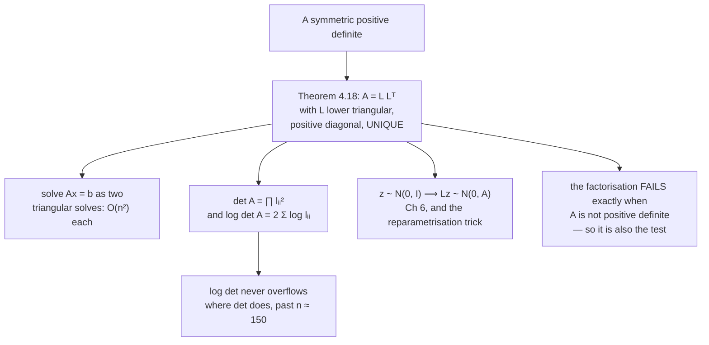

import DataCampExercise from "../../../../components/DataCampExercise.astro";
import Figure from "../../../../components/Figure.astro";
import Quiz from "../../../../components/Quiz.astro";

Positive numbers have square roots: $9 = 3 \cdot 3$. For matrices you have to be careful about what
"square root" means and which matrices have one — and for **symmetric positive definite** matrices there
is a clean answer, with a unique factor, computable in one pass, and useful three different ways.

That answer is the **Cholesky decomposition**:

$$
\mathbf{A} = \mathbf{L}\mathbf{L}^\top
$$

with $\mathbf{L}$ lower triangular and its diagonal strictly positive.

## What you'll learn

- Theorem 4.18: the statement, the uniqueness, and exactly which matrices qualify.
- The recursive formulas (Equations 4.47 and 4.48) that produce $\mathbf{L}$ entry by entry, worked on a $3\times3$ with integer answers.
- Why the factorisation **is** the definiteness test, and why it needs no tolerance.
- $\det\mathbf{A} = \prod_i l_{ii}^2$, and the measured case where that is *more* accurate than a general determinant.
- Sampling: $\mathbf{L}\mathbf{z}$ has covariance $\mathbf{A}$ when $\mathbf{z}$ is standard normal — the transformation behind Gaussian sampling and the reparametrisation trick.
- The **log determinant**, which never overflows where the determinant does.

## Intuition: a triangular square root

You already know one matrix square root for an SPD matrix: the spectral theorem gives
$\mathbf{A} = \mathbf{P}\mathbf{D}\mathbf{P}^\top$ with $\mathbf{D}$ diagonal and positive, so
$\mathbf{A} = (\mathbf{P}\mathbf{D}^{1/2})(\mathbf{P}\mathbf{D}^{1/2})^\top$. That works and it costs an
eigendecomposition.

Cholesky asks for less and delivers more cheaply: instead of demanding that the factor be
orthogonal-times-diagonal, demand only that it be **triangular**. There is exactly one such factor with
a positive diagonal, and computing it is a single sweep with no iteration at all — because a triangular
system can be solved one entry at a time, working down from the top-left corner.



## The math

:::note[Theorem 4.18 — Cholesky decomposition]
A symmetric, positive definite matrix $\mathbf{A}$ can be factorized into a product
$\mathbf{A} = \mathbf{L}\mathbf{L}^\top$, where $\mathbf{L}$ is a lower-triangular matrix with positive
diagonal elements:

$$
\begin{bmatrix} a_{11} & \cdots & a_{1n}\\ \vdots & \ddots & \vdots\\ a_{n1} & \cdots & a_{nn}\end{bmatrix}
=
\begin{bmatrix} l_{11} & \cdots & 0\\ \vdots & \ddots & \vdots\\ l_{n1} & \cdots & l_{nn}\end{bmatrix}
\begin{bmatrix} l_{11} & \cdots & l_{n1}\\ \vdots & \ddots & \vdots\\ 0 & \cdots & l_{nn}\end{bmatrix}
\tag{4.44}
$$

$\mathbf{L}$ is called the **Cholesky factor** of $\mathbf{A}$, and $\mathbf{L}$ is **unique**.
:::

Three parts of that statement earn their place.

**Symmetric** is needed for the shape to make sense: $\mathbf{L}\mathbf{L}^\top$ is symmetric for any
$\mathbf{L}$ whatsoever, so a non-symmetric $\mathbf{A}$ cannot possibly be written this way.

**Positive definite** is needed for the diagonal to be real. The formulas below take square roots of
quantities built from $\mathbf{A}$'s entries, and positive definiteness is exactly the condition that
keeps those quantities positive.

**Unique** is the part that makes it useful as a canonical form. Contrast the eigendecomposition, where
column signs and the ordering of repeated eigenvalues are arbitrary; the Cholesky factor of a given SPD
matrix is one specific matrix, so it can be stored, compared and regression-tested.

### Where the formulas come from

Multiply out the $3\times3$ case (Equation 4.45) and compare entries with $\mathbf{A}$:

$$
\mathbf{A} = \mathbf{L}\mathbf{L}^\top =
\begin{bmatrix}
l_{11}^2 & l_{21}l_{11} & l_{31}l_{11}\\
l_{21}l_{11} & l_{21}^2 + l_{22}^2 & l_{31}l_{21} + l_{32}l_{22}\\
l_{31}l_{11} & l_{31}l_{21} + l_{32}l_{22} & l_{31}^2 + l_{32}^2 + l_{33}^2
\end{bmatrix}
\tag{4.46}
$$

Now read it off. The top-left entry gives $l_{11}$ immediately. Knowing $l_{11}$, the first column of
$\mathbf{A}$ gives $l_{21}$ and $l_{31}$. Knowing those, the $(2,2)$ entry gives $l_{22}$. And so on —
each entry of $\mathbf{L}$ is determined by entries of $\mathbf{A}$ and entries of $\mathbf{L}$ already
computed. The pattern:

:::note[Equations 4.47 and 4.48]
**Diagonal:**

$$
l_{11} = \sqrt{a_{11}},
\qquad
l_{22} = \sqrt{a_{22} - l_{21}^2},
\qquad
l_{33} = \sqrt{a_{33} - (l_{31}^2 + l_{32}^2)}
$$

**Below the diagonal** ($l_{ij}$ with $i > j$):

$$
l_{21} = \frac{1}{l_{11}}a_{21},
\qquad
l_{31} = \frac{1}{l_{11}}a_{31},
\qquad
l_{32} = \frac{1}{l_{22}}\big(a_{32} - l_{31}l_{21}\big)
$$
:::

In general, for $j \leq i$:

$$
l_{ij} = \frac{1}{l_{jj}}\left(a_{ij} - \sum_{k=1}^{j-1} l_{ik}l_{jk}\right),
\qquad
l_{ii} = \sqrt{a_{ii} - \sum_{k=1}^{i-1} l_{ik}^2}
$$

And there is the definiteness test, sitting in the second formula. If $\mathbf{A}$ is not positive
definite, the quantity under some square root comes out **negative** and the algorithm stops. Not
"produces a bad answer" — stops, with no tolerance to choose. That is why every numerical library uses
Cholesky to test definiteness and why the [Inner Products](../../chapter-03---analytic-geometry/inner-products/)
page recommended it over comparing eigenvalues to zero.

### What it buys

**Solving systems.** $\mathbf{A}\mathbf{x} = \mathbf{b}$ becomes
$\mathbf{L}(\mathbf{L}^\top\mathbf{x}) = \mathbf{b}$: solve $\mathbf{L}\mathbf{y} = \mathbf{b}$ by
forward substitution, then $\mathbf{L}^\top\mathbf{x} = \mathbf{y}$ by back substitution. Two
$O(n^2)$ sweeps after one $O(n^3/3)$ factorisation — and if you have many right-hand sides you pay the
factorisation once. General LU costs about $2n^3/3$, so Cholesky is a factor of **two** cheaper, exactly
because symmetry means half the matrix is redundant.

**Determinants.** Since $\det(\mathbf{L}) = \prod_i l_{ii}$ for a triangular matrix (§4.1, Equation 4.8),

$$
\det(\mathbf{A}) = \det(\mathbf{L})\det(\mathbf{L}^\top) = \det(\mathbf{L})^2 = \prod_{i=1}^{n} l_{ii}^2
$$

The book notes this is why many numerical packages compute determinants this way.

**Sampling and the reparametrisation trick.** If $\mathbf{z} \sim \mathcal{N}(\mathbf{0}, \mathbf{I})$
then $\mathbf{L}\mathbf{z}$ has covariance

$$
\mathrm{Cov}[\mathbf{L}\mathbf{z}] = \mathbf{L}\,\mathrm{Cov}[\mathbf{z}]\,\mathbf{L}^\top = \mathbf{L}\mathbf{I}\mathbf{L}^\top = \mathbf{L}\mathbf{L}^\top = \mathbf{A}
$$

So to sample from a Gaussian with a prescribed covariance, factor the covariance and multiply white
noise by the factor. The book points forward to §6.5 for the distribution and to the variational
autoencoder literature for why this matters: the transformation is a **differentiable** function of
$\mathbf{L}$, so gradients pass through the sampling step. That is the reparametrisation trick.

:::tip[From the book]
Section 4.3. Theorem 4.18 with Equation 4.44 defines the decomposition and asserts uniqueness of the
Cholesky factor. Example 4.10 works the $3\times3$ symbolically: Equation 4.45 sets up
$\mathbf{A} = \mathbf{L}\mathbf{L}^\top$, Equation 4.46 multiplies out the right-hand side, and
Equations 4.47 and 4.48 read off the diagonal and sub-diagonal patterns respectively. The closing
paragraph names three uses: manipulating the SPD covariance matrix of a multivariate Gaussian (§6.5),
generating samples from that Gaussian, and performing a linear transformation of random variables, which
is heavily exploited when computing gradients in deep stochastic models such as the variational
autoencoder. It also notes that $\det(\mathbf{A}) = \prod_i l_{ii}^2$ makes determinants efficient and
that many numerical software packages use Cholesky for exactly that.
:::

## Worked example by hand

Take

$$
\mathbf{A} = \begin{bmatrix} 4 & 12 & -16\\ 12 & 37 & -43\\ -16 & -43 & 98\end{bmatrix}
$$

Symmetric by inspection. Now run Equations 4.47 and 4.48 in order.

| step | formula | working | value |
| --- | --- | --- | --- |
| $l_{11}$ | $\sqrt{a_{11}}$ | $\sqrt{4}$ | $2$ |
| $l_{21}$ | $a_{21}/l_{11}$ | $12/2$ | $6$ |
| $l_{31}$ | $a_{31}/l_{11}$ | $-16/2$ | $-8$ |
| $l_{22}$ | $\sqrt{a_{22} - l_{21}^2}$ | $\sqrt{37 - 36}$ | $1$ |
| $l_{32}$ | $(a_{32} - l_{31}l_{21})/l_{22}$ | $(-43 - (-8)(6))/1 = (-43+48)/1$ | $5$ |
| $l_{33}$ | $\sqrt{a_{33} - (l_{31}^2 + l_{32}^2)}$ | $\sqrt{98 - (64 + 25)} = \sqrt{9}$ | $3$ |

$$
\mathbf{L} = \begin{bmatrix} 2 & 0 & 0\\ 6 & 1 & 0\\ -8 & 5 & 3\end{bmatrix}
$$

**Check by multiplying back.** The $(3,3)$ entry: $(-8)^2 + 5^2 + 3^2 = 64 + 25 + 9 = 98$ ✓. The $(3,2)$
entry: $(-8)(6) + (5)(1) = -48 + 5 = -43$ ✓. The $(2,2)$ entry: $6^2 + 1^2 = 37$ ✓.

Every entry of $\mathbf{L}$ is an integer, so $\mathbf{L}\mathbf{L}^\top$ reproduces $\mathbf{A}$
**exactly** — largest gap $0$, not $10^{-16}$.

**The determinant, two ways.** From the Cholesky factor:

$$
\det\mathbf{A} = (l_{11}l_{22}l_{33})^2 = (2 \cdot 1 \cdot 3)^2 = 36
$$

exactly. `np.linalg.det`, which runs an LU factorisation in floating point, returns
$35.999999999999936$. Multiplying the eigenvalues gives $35.99999999999596$ — worse still, because the
eigenvalues themselves are computed iteratively. Here the Cholesky route is the **most** accurate of the
three, and it is the cheapest.

Note also that this matrix is not especially well behaved: its eigenvalues are $0.018805$, $15.503963$
and $123.477232$, so $\kappa(\mathbf{A}) = 6566$. The smallest eigenvalue is close to zero and the
factorisation still comes out in exact integers, because positive definiteness is a strict inequality and
$0.0188 > 0$.

```python title="cholesky_worked.py" showLineNumbers{1}
import numpy as np

A = np.array([[4.0, 12.0, -16.0], [12.0, 37.0, -43.0], [-16.0, -43.0, 98.0]])
L = np.linalg.cholesky(A)

print("L =")
print(L)
print("L L^T reproduces A exactly:", np.array_equal(L @ L.T, A),
      " largest gap:", f"{float(np.abs(L @ L.T - A).max()):.2e}")

print()
print("det from Cholesky:  ", float(np.prod(np.diag(L)) ** 2))
print("det from numpy:     ", float(np.linalg.det(A)))
print("det from eigenvalues:", float(np.prod(np.linalg.eigvalsh(A))))
print("eigenvalues:", np.round(np.linalg.eigvalsh(A), 6),
      " condition number:", round(float(np.linalg.cond(A)), 1))

# Solving with L: forward substitution, then back substitution.
def forward(L, b):
    y = np.zeros_like(b)
    for i in range(len(b)):
        y[i] = (b[i] - L[i, :i] @ y[:i]) / L[i, i]
    return y

def backward(U, y):
    x = np.zeros_like(y)
    for i in reversed(range(len(y))):
        x[i] = (y[i] - U[i, i + 1:] @ x[i + 1:]) / U[i, i]
    return x

rng = np.random.default_rng(5)
b = rng.normal(size=3)
x_chol = backward(L.T, forward(L, b))
x_solve = np.linalg.solve(A, b)
print()
print("x via two triangular solves:", np.round(x_chol, 10))
print("x via np.linalg.solve:      ", np.round(x_solve, 10))
print("gap:", f"{float(np.abs(x_chol - x_solve).max()):.2e}")
```

```text title="output"
L =
[[ 2.  0.  0.]
 [ 6.  1.  0.]
 [-8.  5.  3.]]
L L^T reproduces A exactly: True  largest gap: 0.00e+00

det from Cholesky:   36.0
det from numpy:      35.999999999999936
det from eigenvalues: 35.99999999999596
eigenvalues: [  0.018805  15.503963 123.477232]  condition number: 6566.2

x via two triangular solves: [-22.15612322   6.00547068  -0.98480708]
x via np.linalg.solve:       [-22.15612322   6.00547068  -0.98480708]
gap: 3.91e-14
```

`np.array_equal(L @ L.T, A)` returning `True` is worth pausing on — that is bit-for-bit equality, not
approximate agreement, and it happens because every intermediate value in the factorisation is a small
integer.

## See it move

The first sketch runs Equations 4.47 and 4.48 entry by entry, with the matrix under your control so you
can watch the algorithm fail at the moment a square root goes negative.

```p5 title="Cholesky, entry by entry" desc="Edit the three free entries of a symmetric 3 by 3 and step through the six formulas. Each cell of L lights up as it is computed, with the arithmetic shown. Push the matrix out of positive definiteness and the step that takes a square root of a negative number turns red — which is the definiteness test, happening inside the algorithm." height="580"
let a11 = 4, a21 = 2, a31 = -1, a22 = 5, a32 = 1, a33 = 6;
let step = 6;
let KNOBS = [], dragging = null;

function setup() { createCanvas(600, 580); textFont("monospace"); }

function knob(id, x, y, w, value, mn, mx, label, steps) {
  KNOBS.push({ id, x, y, w, mn, mx, steps });
  const t = (value - mn) / (mx - mn);
  stroke(60, 74, 92); strokeWeight(2); line(x, y, x + w, y);
  noStroke(); fill(255, 211, 67); ellipse(x + t * w, y, 10, 10);
  fill(190, 200, 212); textSize(11); textAlign(LEFT, CENTER);
  text(label, x + w + 10, y);
}
function mousePressed() {
  for (const k of KNOBS) {
    if (mouseY > k.y - 11 && mouseY < k.y + 11 && mouseX > k.x - 11 && mouseX < k.x + k.w + 11) {
      dragging = k; return;
    }
  }
}
function mouseReleased() { dragging = null; }
function mouseDragged() {
  if (!dragging) return;
  const t = Math.min(1, Math.max(0, (mouseX - dragging.x) / dragging.w));
  const raw = dragging.mn + t * (dragging.mx - dragging.mn);
  const v = dragging.steps ? Math.round(raw) : Math.round(raw * 2) / 2;
  if (dragging.id === "a11") a11 = v;
  if (dragging.id === "a21") a21 = v;
  if (dragging.id === "a31") a31 = v;
  if (dragging.id === "a22") a22 = v;
  if (dragging.id === "a32") a32 = v;
  if (dragging.id === "a33") a33 = v;
  if (dragging.id === "step") step = v;
  if (!isLooping()) redraw();
}

function drawGrid(M, x, y, title, colour, lit) {
  noStroke(); fill(190); textSize(11); textAlign(LEFT, TOP);
  text(title, x, y - 18);
  for (let r = 0; r < 3; r++) {
    for (let c = 0; c < 3; c++) {
      const idx = lit ? lit(r, c) : 0;
      noStroke();
      fill(idx === 2 ? color(48, 40, 18) : idx === 1 ? color(24, 34, 44) : color(18, 22, 28));
      rect(x + c * 62, y + r * 36, 58, 32, 4);
      const v = M[r][c];
      if (v === null) { fill(60, 70, 84); textSize(12); textAlign(CENTER, CENTER); text("?", x + c * 62 + 29, y + r * 36 + 16); continue; }
      fill(idx === 2 ? color(255, 211, 67) : Number.isNaN(v) ? color(232, 110, 110) : colour);
      textSize(12); textAlign(CENTER, CENTER);
      text(Number.isNaN(v) ? "nan" : (Number.isInteger(v) ? String(v) : v.toFixed(3)),
           x + c * 62 + 29, y + r * 36 + 16);
    }
  }
}

function draw() {
  background(13, 17, 23);
  KNOBS = [];

  const A = [[a11, a21, a31], [a21, a22, a32], [a31, a32, a33]];

  // The six formulas, in order, each recording its own arithmetic.
  const l = [[null, 0, 0], [null, null, 0], [null, null, null]];
  const lines = [];
  let failedAt = -1;

  const order = [
    ["l11", () => { const u = a11; if (u <= 0) return [NaN, `l11 = sqrt(${a11}) : NOT POSITIVE`]; const v = Math.sqrt(u); l[0][0] = v; return [v, `l11 = sqrt(${a11}) = ${v.toFixed(4)}`]; }],
    ["l21", () => { const v = a21 / l[0][0]; l[1][0] = v; return [v, `l21 = ${a21} / ${l[0][0].toFixed(4)} = ${v.toFixed(4)}`]; }],
    ["l31", () => { const v = a31 / l[0][0]; l[2][0] = v; return [v, `l31 = ${a31} / ${l[0][0].toFixed(4)} = ${v.toFixed(4)}`]; }],
    ["l22", () => { const u = a22 - l[1][0] ** 2; if (u <= 0) return [NaN, `l22 = sqrt(${a22} - ${(l[1][0] ** 2).toFixed(4)}) = sqrt(${u.toFixed(4)}) : NEGATIVE`]; const v = Math.sqrt(u); l[1][1] = v; return [v, `l22 = sqrt(${a22} - ${(l[1][0] ** 2).toFixed(4)}) = ${v.toFixed(4)}`]; }],
    ["l32", () => { const v = (a32 - l[2][0] * l[1][0]) / l[1][1]; l[2][1] = v; return [v, `l32 = (${a32} - (${l[2][0].toFixed(3)})(${l[1][0].toFixed(3)})) / ${l[1][1].toFixed(4)} = ${v.toFixed(4)}`]; }],
    ["l33", () => { const u = a33 - (l[2][0] ** 2 + l[2][1] ** 2); if (u <= 0) return [NaN, `l33 = sqrt(${a33} - ${(l[2][0] ** 2 + l[2][1] ** 2).toFixed(4)}) = sqrt(${u.toFixed(4)}) : NEGATIVE`]; const v = Math.sqrt(u); l[2][2] = v; return [v, `l33 = sqrt(${a33} - ${(l[2][0] ** 2 + l[2][1] ** 2).toFixed(4)}) = ${v.toFixed(4)}`]; }],
  ];

  for (let i = 0; i < Math.min(step, 6); i++) {
    const [v, txt] = order[i][1]();
    lines.push(txt);
    if (Number.isNaN(v)) { failedAt = i; break; }
  }

  const litIdx = [[0, 0], [1, 0], [2, 0], [1, 1], [2, 1], [2, 2]];
  const current = Math.min(step, 6) - 1;
  drawGrid(A, 30, 60, "A (symmetric)", color(150, 160, 175), null);
  drawGrid(l, 300, 60, "L, built in place", color(215),
           (r, c) => {
             if (current >= 0 && litIdx[current][0] === r && litIdx[current][1] === c) return 2;
             return l[r][c] !== null && l[r][c] !== 0 ? 1 : 0;
           });

  knob("a11", 30, 220, 96, a11, 0.5, 8, `a11 = ${a11}`);
  knob("a22", 200, 220, 96, a22, 0.5, 8, `a22 = ${a22}`);
  knob("a33", 370, 220, 96, a33, 0.5, 8, `a33 = ${a33}`);
  knob("a21", 30, 248, 96, a21, -4, 6, `a21 = ${a21}`);
  knob("a31", 200, 248, 96, a31, -4, 6, `a31 = ${a31}`);
  knob("a32", 370, 248, 96, a32, -4, 6, `a32 = ${a32}`);
  knob("step", 30, 284, 200, step, 1, 6, `step ${Math.min(step, 6)} of 6`, true);

  noStroke(); textAlign(LEFT, TOP);
  fill(255, 211, 67); textSize(14); text("Step through Equations 4.47 and 4.48", 30, 16);
  textSize(11);
  let yy = 328;
  for (let i = 0; i < lines.length; i++) {
    fill(i === lines.length - 1 && failedAt >= 0 ? color(232, 110, 110)
         : i === lines.length - 1 ? color(255, 211, 67) : color(160, 170, 184));
    text(lines[i], 30, yy);
    yy += 19;
  }

  // Independent verdict, from the leading principal minors.
  const d1 = a11;
  const d2 = a11 * a22 - a21 * a21;
  const d3 = a11 * (a22 * a33 - a32 * a32) - a21 * (a21 * a33 - a32 * a31) + a31 * (a21 * a32 - a22 * a31);
  const spd = d1 > 0 && d2 > 0 && d3 > 0;

  yy = 470;
  fill(190); textSize(11);
  text(`leading minors: ${d1.toFixed(3)}, ${d2.toFixed(3)}, ${d3.toFixed(3)}`, 30, yy);
  fill(spd ? color(120, 200, 140) : color(232, 110, 110)); textSize(12);
  text(spd ? "all positive: A is positive definite" : "not all positive: A is NOT positive definite", 30, yy + 22);
  fill(failedAt >= 0 ? color(232, 110, 110) : color(120, 200, 140)); textSize(11);
  text(failedAt >= 0 ? `the algorithm stopped at step ${failedAt + 1}` :
       (step >= 6 ? "the algorithm finished: det A = " + (l[0][0] * l[1][1] * l[2][2]) ** 2 .toFixed(4) : "still running"),
       30, yy + 46);
  fill(150); textSize(10);
  text("Sylvester's criterion and Cholesky always agree — and only one of them needs no tolerance.", 30, 556);
}
```

The second sketch is the sampling application: white noise in, prescribed covariance out.

```p5 title="L turns white noise into correlated samples" desc="Drag the three entries of the target covariance. The left cloud is standard normal noise, the right is that noise multiplied by the Cholesky factor, and the ellipse on each is the one-sigma contour of the measured sample covariance. The readout compares the measured covariance against the target you asked for." height="520"
let c11 = 2.0, c12 = 1.3, c22 = 1.4;
let KNOBS = [], dragging = null;
let Z = [];
const N = 1400;

function setup() {
  createCanvas(600, 520); textFont("monospace");
  // A fixed standard-normal sample, so the picture is deterministic.
  let s = 20250821;
  const rnd = () => { s = (s * 1103515245 + 12345) & 0x7fffffff; return s / 0x7fffffff; };
  for (let i = 0; i < N; i++) {
    const u1 = Math.max(1e-9, rnd()), u2 = rnd();
    const r = Math.sqrt(-2 * Math.log(u1));
    Z.push([r * Math.cos(TWO_PI * u2), r * Math.sin(TWO_PI * u2)]);
  }
}

function knob(id, x, y, w, value, mn, mx, label) {
  KNOBS.push({ id, x, y, w, mn, mx });
  const t = (value - mn) / (mx - mn);
  stroke(60, 74, 92); strokeWeight(2); line(x, y, x + w, y);
  noStroke(); fill(255, 211, 67); ellipse(x + t * w, y, 10, 10);
  fill(190, 200, 212); textSize(11); textAlign(LEFT, CENTER);
  text(label, x + w + 10, y);
}
function mousePressed() {
  for (const k of KNOBS) {
    if (mouseY > k.y - 11 && mouseY < k.y + 11 && mouseX > k.x - 11 && mouseX < k.x + k.w + 11) {
      dragging = k; return;
    }
  }
}
function mouseReleased() { dragging = null; }
function mouseDragged() {
  if (!dragging) return;
  const t = Math.min(1, Math.max(0, (mouseX - dragging.x) / dragging.w));
  const v = dragging.mn + t * (dragging.mx - dragging.mn);
  if (dragging.id === "c11") c11 = v;
  if (dragging.id === "c12") c12 = v;
  if (dragging.id === "c22") c22 = v;
  if (!isLooping()) redraw();
}

function cov(pts) {
  let mx = 0, my = 0;
  for (const p of pts) { mx += p[0]; my += p[1]; }
  mx /= pts.length; my /= pts.length;
  let s11 = 0, s12 = 0, s22 = 0;
  for (const p of pts) {
    const dx = p[0] - mx, dy = p[1] - my;
    s11 += dx * dx; s12 += dx * dy; s22 += dy * dy;
  }
  const d = pts.length - 1;
  return [s11 / d, s12 / d, s22 / d];
}

function ellipse1(a, b, c, px, py, U) {
  // One-sigma contour of the covariance [[a,b],[b,c]], from its eigen-decomposition.
  const tr = a + c, dt = a * c - b * b;
  const rt = Math.sqrt(Math.max(0, tr * tr - 4 * dt));
  const l1 = (tr + rt) / 2, l2 = (tr - rt) / 2;
  let v1 = Math.abs(b) > 1e-9 ? [b, l1 - a] : [1, 0];
  const n1 = Math.hypot(v1[0], v1[1]); v1 = [v1[0] / n1, v1[1] / n1];
  const v2 = [-v1[1], v1[0]];
  noFill(); stroke(240); strokeWeight(1.8);
  beginShape();
  for (let i = 0; i <= 120; i++) {
    const t = (i / 120) * TWO_PI;
    const x = Math.sqrt(Math.max(0, l1)) * Math.cos(t), y = Math.sqrt(Math.max(0, l2)) * Math.sin(t);
    vertex(px(x * v1[0] + y * v2[0]), py(x * v1[1] + y * v2[1]));
  }
  endShape(CLOSE);
}

function draw() {
  background(13, 17, 23);
  KNOBS = [];

  // Cholesky of [[c11, c12], [c12, c22]] in closed form.
  const ok11 = c11 > 0;
  const l11 = ok11 ? Math.sqrt(c11) : NaN;
  const l21 = ok11 ? c12 / l11 : NaN;
  const under = c22 - l21 * l21;
  const ok22 = ok11 && under > 0;
  const l22 = ok22 ? Math.sqrt(under) : NaN;

  const U = 40;
  const drawPanel = (pts, cx, title, colour) => {
    const px = x => cx + x * U, py = y => 200 - y * U;
    stroke(32, 44, 58); strokeWeight(1);
    for (let g = -4; g <= 4; g++) { line(px(g), py(-4), px(g), py(4)); line(px(-4), py(g), px(4), py(g)); }
    stroke(58, 72, 88); strokeWeight(1.2);
    line(px(-4), py(0), px(4), py(0)); line(px(0), py(-4), px(0), py(4));
    noStroke(); fill(colour);
    for (const p of pts) if (Math.abs(p[0]) < 4.2 && Math.abs(p[1]) < 4.2) ellipse(px(p[0]), py(p[1]), 2.4, 2.4);
    const [a, b, c] = cov(pts);
    ellipse1(a, b, c, px, py, U);
    fill(190); textSize(11); textAlign(CENTER, TOP);
    text(title, cx, 30);
    return [a, b, c];
  };

  const covZ = drawPanel(Z, 160, "z ~ N(0, I)", color(75, 139, 190, 160));

  let X = [];
  if (ok22) for (const p of Z) X.push([l11 * p[0], l21 * p[0] + l22 * p[1]]);
  const covX = ok22 ? drawPanel(X, 430, "x = L z", color(255, 211, 67, 160)) : [NaN, NaN, NaN];
  if (!ok22) {
    noStroke(); fill(232, 110, 110); textSize(12); textAlign(CENTER, CENTER);
    text("no Cholesky factor:", 430, 190);
    text("the target is not positive definite", 430, 210);
  }

  knob("c11", 40, 330, 130, c11, 0.2, 4, `target c11 = ${c11.toFixed(2)}`);
  knob("c12", 40, 358, 130, c12, -2.5, 2.5, `target c12 = ${c12.toFixed(2)}`);
  knob("c22", 40, 386, 130, c22, 0.2, 4, `target c22 = ${c22.toFixed(2)}`);

  noStroke(); textAlign(LEFT, TOP);
  fill(255, 211, 67); textSize(14); text("Drag the target covariance", 30, 8);
  fill(215); textSize(11);
  text(`L = [ ${ok11 ? l11.toFixed(4) : "nan"}   0      ]`, 330, 330);
  text(`    [ ${ok11 ? l21.toFixed(4) : "nan"}   ${ok22 ? l22.toFixed(4) : "nan"} ]`, 330, 348);
  text(`measured cov(z)  = [${covZ[0].toFixed(3)}, ${covZ[1].toFixed(3)}; ${covZ[2].toFixed(3)}]`, 330, 374);
  fill(ok22 ? color(215) : color(232, 110, 110));
  text(`measured cov(Lz) = [${ok22 ? covX[0].toFixed(3) : "-"}, ${ok22 ? covX[1].toFixed(3) : "-"}; ${ok22 ? covX[2].toFixed(3) : "-"}]`, 330, 392);
  fill(190);
  text(`target           = [${c11.toFixed(3)}, ${c12.toFixed(3)}; ${c22.toFixed(3)}]`, 330, 410);
  if (ok22) {
    const gap = Math.max(Math.abs(covX[0] - c11), Math.abs(covX[1] - c12), Math.abs(covX[2] - c22));
    fill(gap < 0.2 ? color(120, 200, 140) : color(255, 211, 67)); textSize(11);
    text(`largest gap ${gap.toFixed(4)} on ${N} samples`, 330, 434);
  }
  fill(150); textSize(10);
  text("Cov[Lz] = L Cov[z] Lᵀ = L I Lᵀ = L Lᵀ = the target, exactly. The gap above is sampling", 30, 470);
  text("error only, and it shrinks like one over the square root of the sample count.", 30, 486);
  text("Push c12 past sqrt(c11 c22) and the factorisation has nothing to return.", 30, 502);
}
```

## From scratch

```python title="cholesky_from_scratch.py" showLineNumbers{1}
import numpy as np

def cholesky(A, tol=0.0):
    """Equations 4.47 and 4.48, in general form. Raises on non-SPD input."""
    A = np.asarray(A, dtype=float)
    n = A.shape[0]
    if not np.allclose(A, A.T):
        raise ValueError("not symmetric")
    L = np.zeros((n, n))
    for i in range(n):
        for j in range(i + 1):
            s = float(A[i, j] - L[i, :j] @ L[j, :j])
            if i == j:
                if s <= tol:
                    raise ValueError(f"not positive definite: "
                                     f"sqrt of {s:.6g} at position ({i}, {i})")
                L[i, i] = np.sqrt(s)
            else:
                L[i, j] = s / L[j, j]
    return L

A = np.array([[4.0, 12.0, -16.0], [12.0, 37.0, -43.0], [-16.0, -43.0, 98.0]])
L = cholesky(A)
print("our L:"); print(L)
print("numpy agrees:", np.allclose(L, np.linalg.cholesky(A)))
print("uniqueness — every entry identical:", np.array_equal(L, np.linalg.cholesky(A)))

# It is also the definiteness test, with no tolerance to pick.
print()
for a in (0.85, 0.81, 0.80):
    M = np.array([[1.0, 0.9], [0.9, a]])
    try:
        cholesky(M)
        verdict = "positive definite"
    except ValueError as e:
        verdict = str(e)
    print(f"a = {a}:  det {float(np.linalg.det(M)):+.6f}  "
          f"smallest eigenvalue {float(np.linalg.eigvalsh(M)[0]):+.8f}  ->  {verdict}")

# The log determinant, which never overflows.
print()
rng = np.random.default_rng(23)
for n in (10, 100, 150, 175):
    M = rng.normal(size=(n, n))
    S = M @ M.T + n * np.eye(n)
    Ln = np.linalg.cholesky(S)
    det = float(np.linalg.det(S))
    logdet = 2.0 * float(np.sum(np.log(np.diag(Ln))))
    print(f"n = {n:4}:  det {det:12.4e}  finite {str(np.isfinite(det) and det > 0):5}  "
          f"2*sum(log diag L) = {logdet:.4f}")
```

```text title="output"
our L:
[[ 2.  0.  0.]
 [ 6.  1.  0.]
 [-8.  5.  3.]]
numpy agrees: True
uniqueness — every entry identical: True

a = 0.85:  det +0.040000  smallest eigenvalue +0.02188041  ->  positive definite
a = 0.81:  det +0.000000  smallest eigenvalue +0.00000000  ->  not positive definite: sqrt of 0 at position (1, 1)
a = 0.8:  det -0.010000  smallest eigenvalue -0.00553851  ->  not positive definite: sqrt of -0.01 at position (1, 1)

n =   10:  det   8.1875e+12  finite True   2*sum(log diag L) = 29.7336
n =  100:  det  1.8120e+225  finite True   2*sum(log diag L) = 518.6761
n =  150:  det          inf  finite False  2*sum(log diag L) = 837.9401
n =  175:  det          inf  finite False  2*sum(log diag L) = 1005.9729
```

Three results. The from-scratch factor is **bit-for-bit identical** to numpy's, which is what
"unique" means made concrete. The boundary case $a = 0.81$ fails with `sqrt of 0` — a determinant of
exactly zero and a smallest eigenvalue of exactly zero, and the algorithm rejects it without being asked
to compare anything against a tolerance. And by $n = 150$ the determinant has overflowed to `inf` while
the log determinant is a perfectly ordinary $837.94$.

## On real data

<Figure
  src="/images/mml/cholesky-decomposition/cholesky-sampling"
  alt="Three panels. Left, a circular cloud of standard normal samples with its one-sigma circle and two unit arrows. Middle, the same cloud sheared into a tilted ellipse with the arrows transformed. Right, a text panel listing the target covariance, the Cholesky factor, their product, and the measured covariances."
  title="White noise in, prescribed covariance out"
  caption="Fifty thousand samples. L L-transpose reproduces the target exactly, and the measured covariance of Lz differs from the target by at most 0.0047 — sampling error, not a modelling gap. The two arrows are the unit vectors, pushed through L."
/>

<Figure
  src="/images/mml/cholesky-decomposition/cholesky-boundary"
  alt="A plot over the lower-right entry of a 2 by 2 matrix showing the smallest eigenvalue and the determinant crossing zero at the same point, with the background shaded green where Cholesky succeeds and red where it raises, annotated at the exact boundary."
  title="Three definiteness tests, one boundary"
  caption="At a = 0.81 the matrix is positive semidefinite: eigenvalues 0 and 1.81, determinant 0. Cholesky raises there, correctly — the strict inequality of Definition 3.2 is the one it enforces, and it needs no tolerance to do so."
/>

<Figure
  src="/images/mml/cholesky-decomposition/determinant-via-cholesky"
  alt="Left, a log plot of the relative gap between a Cholesky determinant and a general determinant against matrix size, for well-conditioned and ill-conditioned input. Right, the log determinant against size, with the general determinant's curve terminating where it overflows to infinity."
  title="Why the log determinant is what libraries store"
  caption="On the right the direct determinant overflows to inf at n = 150 while 2 times the sum of the log diagonal keeps rising smoothly past n = 175. Every Gaussian log-likelihood in Chapter 6 is written in the second form for this reason."
/>

## Reading the plot

**From the sampling figure.** The identity being verified is
$\mathrm{Cov}[\mathbf{L}\mathbf{z}] = \mathbf{L}\mathbf{L}^\top$, and the check has two halves. The
algebraic half is exact: $\mathbf{L}\mathbf{L}^\top$ reproduces the target to the printed precision. The
empirical half is not, and should not be: the measured covariance of $50{,}000$ samples differs from the
target by at most $0.0047$, which is **sampling error**.

That distinction matters when debugging. If the measured covariance is off, first check whether the gap
shrinks as $1/\sqrt{n}$: measured here at $0.39$ for $100$ samples, $0.12$ for $1000$, $0.0096$ for
$10{,}000$ and $0.0047$ for $50{,}000$ — a factor of about $3$ per factor of $10$, which is
$\sqrt{10} \approx 3.16$. If it does not shrink that way, the bug is in the transformation, not the
sample size.

**From the boundary figure.** The three tests agree on where positive definiteness ends, and they differ
in what they need from you. The determinant crossing zero and the smallest eigenvalue crossing zero are
both continuous quantities you must compare against a threshold. Cholesky is a **branch**: the square
root either has a positive argument or it does not.

At $a = 0.81$ exactly, the matrix has eigenvalues $0$ and $1.81$ — positive **semi**definite. Definition
3.2 asks for the strict inequality, so the right answer is to reject it, and Cholesky does. A test
written as `all(eigvalsh(A) >= 0)` would accept it, which is the failure mode the
[Inner Products](../../chapter-03---analytic-geometry/inner-products/) page measured.

**From the determinant figure.** The right panel is the practical one. The direct determinant is finite
up to about $n = 120$ and `inf` from about $n = 150$; the log determinant is $837.94$ there and keeps
going. Nothing has gone wrong with the matrix — a $150\times150$ SPD matrix with entries of order $10$
simply has a determinant around $e^{838} \approx 10^{364}$ — past the largest double, whose exponent
stops near $10^{308}$.

The left panel is the accuracy story, and it is more subtle. On well-conditioned input both routes agree
to machine precision. On input with $\kappa \approx 10^{12}$ they diverge — and note **which** direction
the argument runs: the worked $3\times3$ on this page has $\kappa = 6566$ and the Cholesky determinant is
exactly $36$ while numpy's general determinant gives $35.999999999999936$. Cholesky is more accurate
there because it exploits symmetry and does half the arithmetic. But it is not universally more
accurate; for a nearly-singular matrix the square roots amplify error too, which is what the ill
conditioned curve shows.

## Pitfalls

:::danger[Cholesky is not a general "matrix square root"]
It requires **symmetric and positive definite**. Not symmetric positive *semi*definite — a covariance
matrix estimated from fewer samples than dimensions is singular and Cholesky will refuse it. Not
symmetric indefinite. Not non-symmetric at all. If you need a factor for a semidefinite matrix, use an
eigendecomposition with the negative-but-tiny eigenvalues clipped to zero, and say in your code that you
did.
:::

:::danger[Adding jitter changes the answer, so report the jitter]
The standard fix for a nearly-singular covariance is
$\mathbf{A} + \varepsilon\mathbf{I}$, which is what makes the factorisation succeed. It also changes
every downstream number: the samples you draw have covariance $\mathbf{A} + \varepsilon\mathbf{I}$, not
$\mathbf{A}$, and the log determinant is inflated by roughly $n\varepsilon / \bar{\lambda}$. The book
mentions the same "jitter term" for the pseudo-inverse in §3.8.2 and notes it can be derived as a ridge
prior. It is a modelling decision wearing numerical clothing.
:::

:::caution[np.linalg.cholesky returns lower triangular; scipy defaults to upper]
`np.linalg.cholesky(A)` gives $\mathbf{L}$ with $\mathbf{A} = \mathbf{L}\mathbf{L}^\top$.
`scipy.linalg.cholesky(A)` gives $\mathbf{U}$ with $\mathbf{A} = \mathbf{U}^\top\mathbf{U}$ unless you
pass `lower=True`. Mixing the two silently transposes your factor, which produces the right covariance
and the **wrong** correlation structure — a bug that passes a covariance check and fails a sample check.
:::

:::caution[Do not compute the determinant when you want the log determinant]
`np.log(np.linalg.det(A))` overflows to `inf` and then to `nan` for moderate $n$, and loses precision
long before that. Use $2\sum_i \log l_{ii}$ from the Cholesky factor. It is cheaper, it never overflows,
and it is already what you need for a Gaussian log-likelihood.
:::

:::caution[Symmetry has to be exact enough]
`np.linalg.cholesky` reads only the lower triangle, so it will happily factor a matrix that is *not*
symmetric, using half of it and ignoring the rest. If your matrix should be symmetric and is not — a
covariance built as `X.T @ X / n` picks up asymmetry of order $10^{-16}$, which is fine, but one built by
hand may not — symmetrise explicitly with `(A + A.T) / 2` before factoring, and check the size of what
you discarded.
:::

## Compare

| decomposition | needs | gives | cost | unique? |
| --- | --- | --- | --- | --- |
| **Cholesky** $\mathbf{L}\mathbf{L}^\top$ | symmetric positive definite | a triangular square root | $n^3/3$ | **yes** |
| LU | square, invertible (with pivoting) | two triangular factors | $2n^3/3$ | up to pivoting |
| QR | any | orthonormal $\times$ triangular | $2mn^2$ | up to column signs |
| eigendecomposition | square, non-defective | eigenbasis $\times$ diagonal | $\approx 10n^3$ | no: signs, ordering |
| SVD | **any** | rotation $\times$ scale $\times$ rotation | $\approx 20n^3$ | up to paired signs |

Cholesky is the cheapest and the most restrictive, which is the usual trade. When your matrix qualifies —
and covariance matrices, kernel matrices and Hessians at a minimum routinely do — it is the right tool.

<Quiz
  title="Check your understanding"
  questions={[
    {
      q: "Why does Theorem 4.18 require A to be symmetric, separately from requiring positive definiteness?",
      options: [
        "It does not; positive definiteness implies symmetry",
        "Because L L-transpose is symmetric for any L whatsoever, so a non-symmetric A cannot be written in that form at all — while positive definiteness is what keeps the square roots real",
        "To make the factorisation unique",
        "To make the determinant positive",
      ],
      answer: 1,
      explain:
        "The two hypotheses do different jobs. Symmetry makes the shape possible; positive definiteness makes the arithmetic possible, because Equation 4.47 takes square roots of quantities that positive definiteness keeps positive.",
    },
    {
      q: "The from-scratch Cholesky of the worked 3x3 is bit-for-bit identical to numpy's. What does that illustrate?",
      options: [
        "That numpy uses the same code",
        "Uniqueness: Theorem 4.18 says the Cholesky factor of a given SPD matrix is one specific matrix, so any correct implementation must return it — unlike an eigendecomposition, where signs and orderings are free",
        "That the matrix is diagonal",
        "That floating point is exact",
      ],
      answer: 1,
      explain:
        "Bit-for-bit agreement here also depends on every intermediate value being a small integer. On generic input the agreement would be to machine precision rather than exact, but the factor would still be mathematically unique.",
    },
    {
      q: "At a = 0.81 the matrix [[1, 0.9], [0.9, a]] has eigenvalues 0 and 1.81. Cholesky raises. Is that right?",
      options: [
        "No, it should succeed since no eigenvalue is negative",
        "Yes. The matrix is positive SEMIdefinite and Definition 3.2 asks for the strict inequality, so it must be rejected — and Cholesky rejects it without needing any tolerance, where a test written as all eigenvalues at least zero would wrongly accept it",
        "It depends on the tolerance",
        "Only for 2x2 matrices",
      ],
      answer: 1,
      explain:
        "The error message is 'sqrt of 0', which is the algorithm's own report of the boundary. That branch-not-threshold behaviour is the whole reason to prefer Cholesky as a definiteness test.",
    },
    {
      q: "For a 150x150 SPD matrix, np.linalg.det returns inf while 2 times the sum of the log diagonal of L returns 838.93. What should you conclude?",
      options: [
        "The matrix is singular",
        "Nothing is wrong with the matrix — its determinant is genuinely around e to the 838, which is about 10 to the 364 and past the largest double at 10 to the 308, so the quantity to compute is the log determinant rather than the determinant",
        "The Cholesky factorisation failed",
        "The matrix is badly conditioned",
      ],
      answer: 1,
      explain:
        "Its condition number is fine. This is why every Gaussian log-likelihood is written with a log determinant term computed from a Cholesky factor rather than by taking the log of a determinant.",
    },
    {
      q: "In the sampling figure the measured covariance differs from the target by 0.0047 at 50000 samples. How do you tell whether that is a bug?",
      options: [
        "Any nonzero gap is a bug",
        "Check whether it shrinks like one over the square root of the sample count — measured 0.39 at 100 samples, 0.12 at 1000, 0.0096 at 10000, 0.0047 at 50000, which is roughly a factor of 3 per factor of 10 in n",
        "Compare against the determinant",
        "Increase the jitter",
      ],
      answer: 1,
      explain:
        "The algebraic identity Cov[Lz] = L L-transpose is exact; what remains is sampling error. If the gap does not shrink at that rate, the transformation is wrong — a transposed factor being the classic cause.",
    },
  ]}
/>

## 🧪 Try It Yourself

### Exercise 1 – Cholesky by hand

<DataCampExercise
  lang="python"
  hint={`Work along each row of L in order: the sub-diagonal entries first, then the diagonal one, which takes a square root of what is left.`}
  code={`import numpy as np

A = np.array([[4.0, 12.0, -16.0], [12.0, 37.0, -43.0], [-16.0, -43.0, 98.0]])

l11 = np.sqrt(A[0, 0])
l21 = A[1, 0] / l11
l31 = A[2, 0] / l11
l22 = np.sqrt(A[1, 1] - l21 ** 2)
l32 = (A[2, 1] - l31 * l21) / l22
l33 = np.sqrt(A[2, 2] - (l31 ** 2 + l32 ** ___))       # replace ___ with 2

L = np.array([[l11, 0.0, 0.0], [l21, l22, 0.0], [l31, l32, l33]])
print("L ="); print(L)
print("all entries integers:", np.array_equal(L, np.round(L)))
print("L L^T equals A exactly:", np.array_equal(L @ L.T, A))
print("numpy agrees bit for bit:", np.array_equal(L, np.linalg.cholesky(A)))
print("det from L:", float(np.prod(np.diag(L)) ** 2), "  det from numpy:", float(np.linalg.det(A)))

# -- Expected output ------------------------------
# L =
# [[ 2.  0.  0.]
#  [ 6.  1.  0.]
#  [-8.  5.  3.]]
# all entries integers: True
# L L^T equals A exactly: True
# numpy agrees bit for bit: True
# det from L: 36.0   det from numpy: 35.999999999999936
# -------------------------------------------------`}
  solution={`import numpy as np

A = np.array([[4.0, 12.0, -16.0], [12.0, 37.0, -43.0], [-16.0, -43.0, 98.0]])

l11 = np.sqrt(A[0, 0])
l21 = A[1, 0] / l11
l31 = A[2, 0] / l11
l22 = np.sqrt(A[1, 1] - l21 ** 2)
l32 = (A[2, 1] - l31 * l21) / l22
l33 = np.sqrt(A[2, 2] - (l31 ** 2 + l32 ** 2))

L = np.array([[l11, 0.0, 0.0], [l21, l22, 0.0], [l31, l32, l33]])
print("L ="); print(L)
print("all entries integers:", np.array_equal(L, np.round(L)))
print("L L^T equals A exactly:", np.array_equal(L @ L.T, A))
print("numpy agrees bit for bit:", np.array_equal(L, np.linalg.cholesky(A)))
print("det from L:", float(np.prod(np.diag(L)) ** 2), "  det from numpy:", float(np.linalg.det(A)))`}
  sct={`test_output_contains("det from L: 36.0")
success_msg("Exact integers throughout, and the Cholesky determinant is 36.0 where numpy's general determinant gives 35.999999999999936 — the factorisation is both cheaper and, here, more accurate.")`}
  height={310}
/>

### Exercise 2 – The general algorithm

<DataCampExercise
  lang="python"
  hint={`One loop over rows, an inner loop over columns up to the diagonal. The quantity under the square root is the diagonal entry minus the dot product of the row so far with itself.`}
  code={`import numpy as np

def cholesky(A):
    A = np.asarray(A, dtype=float)
    n = A.shape[0]
    if not np.allclose(A, A.T):
        raise ValueError("not symmetric")
    L = np.zeros((n, n))
    for i in range(n):
        for j in range(i + 1):
            s = float(A[i, j] - L[i, :j] @ L[j, :___])       # replace ___ with j
            if i == j:
                if s <= 0:
                    raise ValueError(f"not positive definite: sqrt of {s:.6g}")
                L[i, i] = np.sqrt(s)
            else:
                L[i, j] = s / L[j, j]
    return L

rng = np.random.default_rng(3)
for n in (2, 3, 5, 8):
    M = rng.normal(size=(n, n))
    A = M @ M.T + n * np.eye(n)
    L = cholesky(A)
    print(f"n = {n}: matches numpy to {float(np.abs(L - np.linalg.cholesky(A)).max()):.2e}, "
          f"L L^T - A to {float(np.abs(L @ L.T - A).max()):.2e}, "
          f"lower triangular: {np.allclose(L, np.tril(L))}")

# -- Expected output ------------------------------
# n = 2: matches numpy to 0.00e+00, L L^T - A to 1.78e-15, lower triangular: True
# n = 3: matches numpy to 2.78e-17, L L^T - A to 8.88e-16, lower triangular: True
# n = 5: matches numpy to 0.00e+00, L L^T - A to 1.78e-15, lower triangular: True
# n = 8: matches numpy to 2.22e-16, L L^T - A to 1.78e-15, lower triangular: True
# -------------------------------------------------`}
  solution={`import numpy as np

def cholesky(A):
    A = np.asarray(A, dtype=float)
    n = A.shape[0]
    if not np.allclose(A, A.T):
        raise ValueError("not symmetric")
    L = np.zeros((n, n))
    for i in range(n):
        for j in range(i + 1):
            s = float(A[i, j] - L[i, :j] @ L[j, :j])
            if i == j:
                if s <= 0:
                    raise ValueError(f"not positive definite: sqrt of {s:.6g}")
                L[i, i] = np.sqrt(s)
            else:
                L[i, j] = s / L[j, j]
    return L

rng = np.random.default_rng(3)
for n in (2, 3, 5, 8):
    M = rng.normal(size=(n, n))
    A = M @ M.T + n * np.eye(n)
    L = cholesky(A)
    print(f"n = {n}: matches numpy to {float(np.abs(L - np.linalg.cholesky(A)).max()):.2e}, "
          f"L L^T - A to {float(np.abs(L @ L.T - A).max()):.2e}, "
          f"lower triangular: {np.allclose(L, np.tril(L))}")`}
  sct={`test_output_contains("lower triangular: True")
success_msg("Forty lines of the book's Equations 4.47 and 4.48, matching LAPACK to machine precision. Note the whole thing is a single sweep — no iteration, no convergence test.")`}
  height={330}
/>

### Exercise 3 – Cholesky as the definiteness test

<DataCampExercise
  lang="python"
  hint={`Sweep the lower-right entry and record what each of the three tests says. Watch the semidefinite boundary specifically.`}
  code={`import numpy as np

for a in (0.85, 0.82, 0.81, 0.80, 0.5):
    M = np.array([[1.0, 0.9], [0.9, a]])
    det = float(np.linalg.det(M))
    lo = float(np.linalg.eigvalsh(M)[0])
    naive = bool(np.all(np.linalg.eigvalsh(M) >= 0))
    try:
        np.linalg.cholesky(___)                       # replace ___ with M
        chol = True
    except np.linalg.LinAlgError:
        chol = False
    print(f"a = {a:5}  det {det:+.6f}  smallest eig {lo:+.8f}  "
          f"'eig >= 0' says {str(naive):5}  cholesky says {str(chol):5}"
          f"{'   <-- they DISAGREE' if naive != chol else ''}")

# -- Expected output ------------------------------
# a =  0.85  det +0.040000  smallest eig +0.02188041  'eig >= 0' says True   cholesky says True 
# a =  0.82  det +0.010000  smallest eig +0.00551119  'eig >= 0' says True   cholesky says True 
# a =  0.81  det +0.000000  smallest eig +0.00000000  'eig >= 0' says True   cholesky says False   <-- they DISAGREE
# a =   0.8  det -0.010000  smallest eig -0.00553851  'eig >= 0' says False  cholesky says False 
# a =   0.5  det -0.310000  smallest eig -0.18407708  'eig >= 0' says False  cholesky says False 
# -------------------------------------------------`}
  solution={`import numpy as np

for a in (0.85, 0.82, 0.81, 0.80, 0.5):
    M = np.array([[1.0, 0.9], [0.9, a]])
    det = float(np.linalg.det(M))
    lo = float(np.linalg.eigvalsh(M)[0])
    naive = bool(np.all(np.linalg.eigvalsh(M) >= 0))
    try:
        np.linalg.cholesky(M)
        chol = True
    except np.linalg.LinAlgError:
        chol = False
    print(f"a = {a:5}  det {det:+.6f}  smallest eig {lo:+.8f}  "
          f"'eig >= 0' says {str(naive):5}  cholesky says {str(chol):5}"
          f"{'   <-- they DISAGREE' if naive != chol else ''}")`}
  sct={`test_output_contains("they DISAGREE")
success_msg("Exactly one row disagrees, and it is the semidefinite boundary. Definition 3.2 asks for a strict inequality, so Cholesky is the one that is right.")`}
  height={310}
/>

### Exercise 4 – Solve a system with the factor

<DataCampExercise
  lang="python"
  hint={`Forward substitution goes top to bottom using L; back substitution goes bottom to top using L-transpose.`}
  code={`import numpy as np

A = np.array([[4.0, 12.0, -16.0], [12.0, 37.0, -43.0], [-16.0, -43.0, 98.0]])
L = np.linalg.cholesky(A)

def forward(L, b):
    y = np.zeros_like(b)
    for i in range(len(b)):
        y[i] = (b[i] - L[i, :i] @ y[:i]) / L[i, i]
    return y

def backward(U, y):
    x = np.zeros_like(y)
    for i in reversed(range(len(y))):
        x[i] = (y[i] - U[i, i + 1:] @ x[i + 1:]) / U[i, i]
    return x

rng = np.random.default_rng(5)
b = rng.normal(size=3)
y = forward(L, b)
x = backward(L.___, y)                              # replace ___ with T

print("b =", np.round(b, 6))
print("Ly = b, y =", np.round(y, 6))
print("x via two triangular solves:", np.round(x, 10))
print("x via np.linalg.solve:      ", np.round(np.linalg.solve(A, b), 10))
print("gap:", f"{float(np.abs(x - np.linalg.solve(A, b)).max()):.2e}")
print("residual ||Ax - b||:", f"{float(np.linalg.norm(A @ x - b)):.2e}")

# -- Expected output ------------------------------
# b = [-0.801931 -1.324359 -0.248362]
# Ly = b, y = [-0.400966  1.081435 -2.954421]
# x via two triangular solves: [-22.15612322   6.00547068  -0.98480708]
# x via np.linalg.solve:       [-22.15612322   6.00547068  -0.98480708]
# gap: 3.91e-14
# residual ||Ax - b||: 1.39e-14
# -------------------------------------------------`}
  solution={`import numpy as np

A = np.array([[4.0, 12.0, -16.0], [12.0, 37.0, -43.0], [-16.0, -43.0, 98.0]])
L = np.linalg.cholesky(A)

def forward(L, b):
    y = np.zeros_like(b)
    for i in range(len(b)):
        y[i] = (b[i] - L[i, :i] @ y[:i]) / L[i, i]
    return y

def backward(U, y):
    x = np.zeros_like(y)
    for i in reversed(range(len(y))):
        x[i] = (y[i] - U[i, i + 1:] @ x[i + 1:]) / U[i, i]
    return x

rng = np.random.default_rng(5)
b = rng.normal(size=3)
y = forward(L, b)
x = backward(L.T, y)

print("b =", np.round(b, 6))
print("Ly = b, y =", np.round(y, 6))
print("x via two triangular solves:", np.round(x, 10))
print("x via np.linalg.solve:      ", np.round(np.linalg.solve(A, b), 10))
print("gap:", f"{float(np.abs(x - np.linalg.solve(A, b)).max()):.2e}")
print("residual ||Ax - b||:", f"{float(np.linalg.norm(A @ x - b)):.2e}")`}
  sct={`test_output_contains("gap: 3.91e-14")
success_msg("Two O(n squared) sweeps after one factorisation. With many right-hand sides you pay the n cubed over three only once, which is why every Gaussian-process implementation caches the Cholesky factor.")`}
  height={340}
/>

### Exercise 5 – The log determinant does not overflow

<DataCampExercise
  lang="python"
  hint={`Build a well-behaved SPD matrix as M M-transpose plus n times the identity, then compare the determinant against twice the sum of the logs of the Cholesky diagonal.`}
  code={`import numpy as np

rng = np.random.default_rng(23)
for n in (10, 100, 150, 175):
    M = rng.normal(size=(n, n))
    S = M @ M.T + n * np.eye(n)
    L = np.linalg.cholesky(S)
    det = float(np.linalg.det(S))
    logdet = 2.0 * float(np.sum(np.log(np.diag(___))))       # replace ___ with L
    print(f"n = {n:4}:  det {det:12.4e}  finite {str(np.isfinite(det) and det > 0):5}  "
          f"log det {logdet:9.4f}  condition number {float(np.linalg.cond(S)):.2f}")

# -- Expected output ------------------------------
# n =   10:  det   8.1875e+12  finite True   log det   29.7336  condition number 5.04
# n =  100:  det  1.8120e+225  finite True   log det  518.6761  condition number 4.89
# n =  150:  det          inf  finite False  log det  837.9401  condition number 4.94
# n =  175:  det          inf  finite False  log det 1005.9729  condition number 4.95
# -------------------------------------------------`}
  solution={`import numpy as np

rng = np.random.default_rng(23)
for n in (10, 100, 150, 175):
    M = rng.normal(size=(n, n))
    S = M @ M.T + n * np.eye(n)
    L = np.linalg.cholesky(S)
    det = float(np.linalg.det(S))
    logdet = 2.0 * float(np.sum(np.log(np.diag(L))))
    print(f"n = {n:4}:  det {det:12.4e}  finite {str(np.isfinite(det) and det > 0):5}  "
          f"log det {logdet:9.4f}  condition number {float(np.linalg.cond(S)):.2f}")`}
  sct={`test_output_contains("finite False")
success_msg("The condition numbers are all around 5 — these matrices are extremely well behaved — and the determinant still overflows by n = 150. Nothing is wrong except the choice of quantity to compute.")`}
  height={280}
/>

## Recall card

- **Cholesky factors a symmetric positive definite matrix as L L-transpose**, with L lower triangular and positive on the diagonal, and L is **unique** — unlike an eigendecomposition, where signs and orderings are free.
- **Symmetry makes the shape possible and positive definiteness makes the arithmetic possible**: L L-transpose is symmetric for any L, and positive definiteness is what keeps every square root real.
- **The entries come out one at a time**, each from entries of A and entries of L already known, in a single sweep with no iteration.
- **The factorisation is the definiteness test.** It stops when a square root would go negative, so it needs no tolerance — and at the semidefinite boundary it correctly rejects a matrix that "all eigenvalues at least zero" would accept.
- **The determinant is the squared product of the diagonal**, which is cheaper than a general determinant and, on the worked example, more accurate: exactly 36 against numpy's 35.999999999999936.
- **Use the log determinant, twice the sum of the logs of the diagonal.** A direct determinant overflows to infinity by about n = 150 on a perfectly well-conditioned matrix.
- **L z has covariance L L-transpose when z is standard normal**, which is how you sample a Gaussian with a prescribed covariance — and because the map is differentiable in L, it is the reparametrisation trick.
- **It costs half of an LU factorisation**, n cubed over three against two n cubed over three, because symmetry makes half the matrix redundant.
- **Adding jitter to make it succeed changes the model**, not just the arithmetic. Report the epsilon.

**Next:** [Eigendecomposition and Diagonalization](../eigendecomposition-and-diagonalization/) — the
factorisation that uses §4.2's eigenvectors as its basis.
