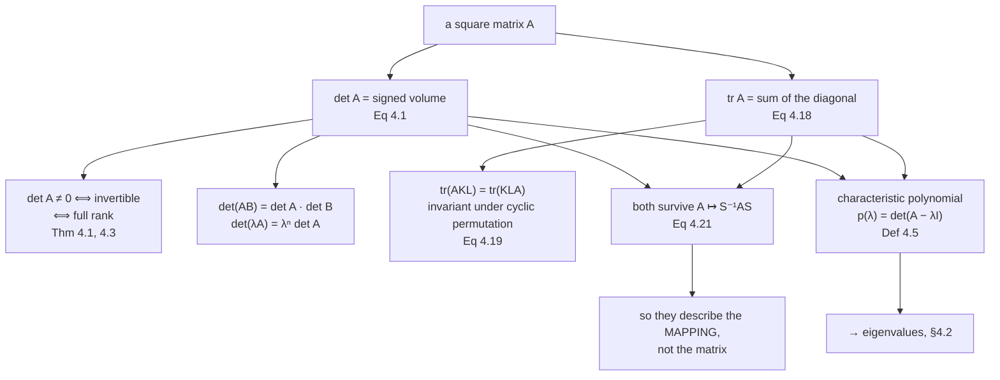

import DataCampExercise from "../../../../components/DataCampExercise.astro";
import Figure from "../../../../components/Figure.astro";
import MatrixLab from "../../../../components/viz/math/MatrixLab.tsx";
import Quiz from "../../../../components/Quiz.astro";

Before factoring a matrix it helps to have a couple of numbers that summarise it. This page gives two:
the **determinant**, which is a signed volume and decides invertibility, and the **trace**, which is the
sum of the diagonal.

Both are cheap, both are single numbers, and — the property that makes them worth defining — both are
**invariant under a change of basis**. They describe the linear mapping, not the particular matrix you
happened to write down for it.

## What you'll learn

- The determinant for $n = 1, 2, 3$, the **Laplace expansion** for general $n$, and the triangular shortcut.
- Why $\det\mathbf{A} \neq 0$, invertibility, and full rank are the same condition (Theorems 4.1 and 4.3).
- The determinant as a **signed volume**, verified on the book's Example 4.2 where the answer is $186$.
- The **seven properties** of the determinant, each measured.
- The **trace**, its four defining properties, and the cyclic-permutation identity that makes it useful.
- Equation 4.21: the trace of a linear mapping is **basis independent**, measured over two thousand random changes of basis.
- The **characteristic polynomial**, whose constant term is the determinant and whose next coefficient is the trace.

## Intuition: how much does this map stretch space?

Feed the unit square through a $2\times2$ matrix and you get a parallelogram. Its area is
$\lvert\det\mathbf{A}\rvert$. Feed the unit cube through a $3\times3$ matrix and you get a
parallelepiped, whose volume is again $\lvert\det\mathbf{A}\rvert$.

That one sentence explains most of the determinant's behaviour before any algebra:

- **$\det = 0$ means the volume collapsed**, so the map squashed space into a lower dimension, so it threw information away, so it cannot be inverted.
- **$\det(\mathbf{A}\mathbf{B}) = \det\mathbf{A}\det\mathbf{B}$** because applying two maps in sequence multiplies their stretch factors.
- **$\det(\lambda\mathbf{A}) = \lambda^n\det\mathbf{A}$** because scaling all $n$ edges of a box by $\lambda$ scales its volume by $\lambda^n$.
- **The sign** records orientation: whether the map preserved handedness or mirrored it.

The trace has no such picture in general — it is a sum of diagonal entries, which are basis-dependent
quantities. What makes it meaningful is that the *sum* is not.



## The math

### Small determinants

:::note[Equations 4.5, 4.6 and 4.7]
$$
n = 1: \quad \det\mathbf{A} = a_{11}
$$

$$
n = 2: \quad \det\mathbf{A} = \begin{vmatrix} a_{11} & a_{12}\\ a_{21} & a_{22}\end{vmatrix} = a_{11}a_{22} - a_{12}a_{21}
$$

$$
n = 3 \ \text{(Sarrus' rule)}: \quad
\det\mathbf{A} = a_{11}a_{22}a_{33} + a_{21}a_{32}a_{13} + a_{31}a_{12}a_{23} - a_{31}a_{22}a_{13} - a_{11}a_{32}a_{23} - a_{21}a_{12}a_{33}
$$
:::

The $2\times2$ case is not arbitrary. Example 4.1 derives it: the inverse of a $2\times2$ matrix is

$$
\mathbf{A}^{-1} = \frac{1}{a_{11}a_{22} - a_{12}a_{21}}\begin{bmatrix} a_{22} & -a_{12}\\ -a_{21} & a_{11}\end{bmatrix}
$$

so the matrix is invertible **exactly when that denominator is nonzero**. The determinant is not a
formula someone invented; it is the quantity that has to be nonzero for the inverse to exist, extracted
and named.

:::note[Theorem 4.1 and Theorem 4.3]
For any square $\mathbf{A} \in \mathbb{R}^{n\times n}$:

$$
\mathbf{A} \text{ is invertible} \iff \det\mathbf{A} \neq 0 \iff \mathrm{rk}(\mathbf{A}) = n
$$
:::

### Triangular matrices, and the fast route

:::note[Equation 4.8]
A matrix $\mathbf{T}$ is **upper triangular** if $T_{ij} = 0$ for $i > j$, and **lower triangular** if
it is zero above the diagonal. For any triangular $\mathbf{T} \in \mathbb{R}^{n\times n}$,

$$
\det\mathbf{T} = \prod_{i=1}^{n} T_{ii}
$$
:::

This is the whole practical algorithm. Gaussian elimination brings a matrix to triangular form using
only operations whose effect on the determinant is known — adding a multiple of one row to another
changes nothing, scaling a row by $\lambda$ multiplies by $\lambda$, swapping two rows flips the sign —
so you eliminate, multiply the diagonal, and correct for what you did.

### The Laplace expansion

:::note[Theorem 4.2 — Laplace expansion]
For $\mathbf{A} \in \mathbb{R}^{n\times n}$ and any $j = 1,\dots,n$:

**along column $j$:**

$$
\det\mathbf{A} = \sum_{k=1}^{n} (-1)^{k+j} a_{kj} \det\mathbf{A}_{k,j}
$$

**along row $j$:**

$$
\det\mathbf{A} = \sum_{k=1}^{n} (-1)^{k+j} a_{jk} \det\mathbf{A}_{j,k}
$$

where $\mathbf{A}_{k,j} \in \mathbb{R}^{(n-1)\times(n-1)}$ is $\mathbf{A}$ with row $k$ and column $j$
deleted. $\det\mathbf{A}_{k,j}$ is a **minor** and $(-1)^{k+j}\det\mathbf{A}_{k,j}$ a **cofactor**.
:::

The recursion is correct and unusable. Expanding an $n\times n$ determinant needs $n$ sub-determinants
of size $n-1$, so the count satisfies $L(n) = n\,L(n-1) + n$ — which grows like $n!$. Measured against
Gaussian elimination's $n^3/3$:

| $n$ | Laplace multiplications | Gaussian elimination | ratio |
| --- | --- | --- | --- |
| 3 | $9$ | $10$ | $0.9$ |
| 5 | $205$ | $44$ | $4.7$ |
| 10 | $6.24\times10^{6}$ | $339$ | $1.8\times10^{4}$ |
| 15 | $2.25\times10^{12}$ | $1134$ | $2.0\times10^{9}$ |
| 20 | $4.18\times10^{18}$ | $2679$ | $1.6\times10^{15}$ |

At $n = 3$ the recursion is actually *cheaper*, which is why hand calculation uses it and why it feels
reasonable. By $n = 20$ it is fifteen orders of magnitude worse.

### The seven properties

For $\mathbf{A} \in \mathbb{R}^{n\times n}$:

| property | statement | measured gap |
| --- | --- | --- |
| multiplicative | $\det(\mathbf{A}\mathbf{B}) = \det\mathbf{A}\,\det\mathbf{B}$ | $5.3\times10^{-15}$ |
| transpose-invariant | $\det\mathbf{A} = \det\mathbf{A}^\top$ | $2.7\times10^{-15}$ |
| inverse | $\det(\mathbf{A}^{-1}) = \dfrac{1}{\det\mathbf{A}}$ | $5.6\times10^{-17}$ |
| similarity-invariant | similar matrices have the same determinant | see the figure |
| row addition | adding a multiple of a row to another leaves $\det$ unchanged | $3.6\times10^{-15}$ |
| row scaling | scaling a row by $\lambda$ scales $\det$ by $\lambda$; so $\det(\lambda\mathbf{A}) = \lambda^n\det\mathbf{A}$ | exact ratio $4.0$ and $\lambda^5$ |
| row swap | swapping two rows flips the sign | exact ratio $-1$ |

All measured on random $5\times5$ matrices. The last three are what license Gaussian elimination as a
determinant algorithm.

### The trace

:::note[Definition 4.4 and Equation 4.18]
$$
\mathrm{tr}(\mathbf{A}) := \sum_{i=1}^{n} a_{ii}
$$

with the properties

$$
\mathrm{tr}(\mathbf{A}+\mathbf{B}) = \mathrm{tr}(\mathbf{A}) + \mathrm{tr}(\mathbf{B}),
\qquad
\mathrm{tr}(\alpha\mathbf{A}) = \alpha\,\mathrm{tr}(\mathbf{A}),
$$

$$
\mathrm{tr}(\mathbf{I}_n) = n,
\qquad
\mathrm{tr}(\mathbf{A}\mathbf{B}) = \mathrm{tr}(\mathbf{B}\mathbf{A}) \text{ for } \mathbf{A}\in\mathbb{R}^{n\times k},\ \mathbf{B}\in\mathbb{R}^{k\times n}
$$

The book notes that **only one function satisfies all four together** — the trace.
:::

The fourth property is stranger than it looks: $\mathbf{A}\mathbf{B}$ is $n\times n$ and
$\mathbf{B}\mathbf{A}$ is $k\times k$, so those are matrices of *different sizes* with the same trace.
Measured on a $4\times6$ times a $6\times4$: both traces come to $-0.1133701535$, from a $4\times4$ and a
$6\times6$ respectively.

It generalises to **invariance under cyclic permutation** (Equation 4.19):

$$
\mathrm{tr}(\mathbf{A}\mathbf{K}\mathbf{L}) = \mathrm{tr}(\mathbf{K}\mathbf{L}\mathbf{A})
$$

and specialises, for vectors, to Equation 4.20:

$$
\mathrm{tr}(\mathbf{x}\mathbf{y}^\top) = \mathrm{tr}(\mathbf{y}^\top\mathbf{x}) = \mathbf{y}^\top\mathbf{x} \in \mathbb{R}
$$

That last identity is the one you will actually use. It turns the trace of an $n\times n$ outer product
into a single dot product, and it is how every "trace trick" derivation in machine learning starts.

### Basis independence

:::note[Equation 4.21]
For an invertible $\mathbf{S}$,

$$
\mathrm{tr}(\mathbf{S}^{-1}\mathbf{A}\mathbf{S}) \overset{(4.19)}{=} \mathrm{tr}(\mathbf{A}\mathbf{S}\mathbf{S}^{-1}) = \mathrm{tr}(\mathbf{A})
$$

So while the **matrix** representing a linear mapping $\Phi$ depends on the basis, the **trace** of
$\Phi$ does not. The same holds for the determinant, by the multiplicative property.
:::

The proof is one application of cyclic invariance. This is the property that promotes both quantities
from "facts about a matrix" to "facts about a mapping", and the reason they belong in the same section
as the eigenvalues, which share it.

### The characteristic polynomial

:::note[Definition 4.5 — Characteristic polynomial]
For $\lambda \in \mathbb{R}$ and a square $\mathbf{A} \in \mathbb{R}^{n\times n}$,

$$
p_{\mathbf{A}}(\lambda) := \det(\mathbf{A} - \lambda\mathbf{I})
= c_0 + c_1\lambda + c_2\lambda^2 + \dots + c_{n-1}\lambda^{n-1} + (-1)^n\lambda^n
$$

In particular

$$
c_0 = \det(\mathbf{A}),
\qquad
c_{n-1} = (-1)^{n-1}\mathrm{tr}(\mathbf{A})
$$
:::

Set $\lambda = 0$ and the first identity is immediate. The second takes a little more work and is worth
knowing because it means **the determinant and the trace are two coefficients of the same polynomial** —
the bottom one and the top-but-one. §4.2 will show that the polynomial's *roots* are the eigenvalues, at
which point $\det = \prod\lambda_i$ and $\mathrm{tr} = \sum\lambda_i$ follow as Theorems 4.16 and 4.17.

:::tip[From the book]
Section 4.1. Equation 4.1 defines the notation, with a margin warning that $\lvert\mathbf{A}\rvert$ must
not be confused with an absolute value. Example 4.1 derives the $2\times2$ case from the inverse
(Equations 4.2 to 4.4); Theorem 4.1 is the invertibility criterion. Equations 4.5 to 4.7 give $n = 1, 2, 3$
with Sarrus' rule; Equation 4.8 the triangular product. Example 4.2 is the volume interpretation, with
Figures 4.2 and 4.3 and the vectors of Equation 4.9 giving $V = 186$ in Equation 4.11. Theorem 4.2 is the
Laplace expansion (Equations 4.12 and 4.13) with Example 4.3 (Equations 4.14 to 4.17). The seven
properties follow, then Theorem 4.3 tying $\det \neq 0$ to full rank. The book then remarks that
**contemporary numerical methods superseded the explicit calculation of the determinant**. Definition 4.4
and Equation 4.18 give the trace, Equations 4.19 and 4.20 its permutation identities, Equation 4.21 basis
independence, and Definition 4.5 with Equations 4.22 to 4.24 the characteristic polynomial.
:::

## Worked example by hand

### Example 4.3 — Laplace expansion

$$
\mathbf{A} = \begin{bmatrix} 1 & 2 & 3\\ 3 & 1 & 2\\ 0 & 0 & 1\end{bmatrix}
$$

Expand along the **first row**, so $j = 1$ in Equation 4.13:

$$
\begin{vmatrix} 1 & 2 & 3\\ 3 & 1 & 2\\ 0 & 0 & 1\end{vmatrix}
= (-1)^{1+1}\cdot 1 \begin{vmatrix} 1 & 2\\ 0 & 1\end{vmatrix}
+ (-1)^{1+2}\cdot 2 \begin{vmatrix} 3 & 2\\ 0 & 1\end{vmatrix}
+ (-1)^{1+3}\cdot 3 \begin{vmatrix} 3 & 1\\ 0 & 0\end{vmatrix}
$$

Each $2\times2$ by Equation 4.6:

| minor | working | value |
| --- | --- | --- |
| $\begin{vmatrix}1&2\\0&1\end{vmatrix}$ | $1(1) - 2(0)$ | $1$ |
| $\begin{vmatrix}3&2\\0&1\end{vmatrix}$ | $3(1) - 2(0)$ | $3$ |
| $\begin{vmatrix}3&1\\0&0\end{vmatrix}$ | $3(0) - 1(0)$ | $0$ |

$$
\det\mathbf{A} = 1(1) - 2(3) + 3(0) = 1 - 6 = -5
$$

**Cross-check with Sarrus' rule** (Equation 4.17):

$$
1\cdot1\cdot1 + 3\cdot0\cdot3 + 0\cdot2\cdot2 - 0\cdot1\cdot3 - 1\cdot0\cdot2 - 3\cdot2\cdot1 = 1 - 6 = -5
$$

Both routes give $-5$, matching Equations 4.16 and 4.17.

A third route is faster than either. The third row is $(0, 0, 1)$, so expanding along **that** row
leaves one term:

$$
\det\mathbf{A} = (-1)^{3+3}\cdot 1 \begin{vmatrix}1&2\\3&1\end{vmatrix} = 1 - 6 = -5
$$

Laplace lets you choose the row or column, and choosing the one with the most zeros is free.

### Example 4.2 — volume

$$
\mathbf{r} = \begin{bmatrix}2\\0\\-8\end{bmatrix},
\quad
\mathbf{g} = \begin{bmatrix}6\\1\\0\end{bmatrix},
\quad
\mathbf{b} = \begin{bmatrix}1\\4\\-1\end{bmatrix}
\qquad\Longrightarrow\qquad
\mathbf{A} = [\mathbf{r}, \mathbf{g}, \mathbf{b}] = \begin{bmatrix}2&6&1\\0&1&4\\-8&0&-1\end{bmatrix}
$$

Sarrus:

$$
2(1)(-1) + 0(0)(1) + (-8)(6)(4) - (-8)(1)(1) - 2(0)(4) - 0(6)(-1)
= -2 + 0 - 192 + 8 - 0 - 0 = -186
$$

so $V = \lvert\det\mathbf{A}\rvert = 186$, which is Equation 4.11. The determinant itself is
$-186$: the three vectors form a **left**-handed frame.

```python title="determinants_worked.py" showLineNumbers{1}
import numpy as np

# Example 4.3
A = np.array([[1.0, 2.0, 3.0], [3.0, 1.0, 2.0], [0.0, 0.0, 1.0]])
print("det:", float(np.linalg.det(A)))
print("Laplace, first row: 1*(1) - 2*(3) + 3*(0) =", 1 * 1 - 2 * 3 + 3 * 0)
print("Laplace, third row: 1*(1*1 - 2*3)         =", 1 * (1 * 1 - 2 * 3))

# Example 4.2
r, g, b = np.array([2.0, 0, -8]), np.array([6.0, 1, 0]), np.array([1.0, 4, -1])
V = np.stack([r, g, b], axis=1)
print("det [r, g, b] =", float(np.linalg.det(V)), " volume =", abs(float(np.linalg.det(V))))

# The seven properties, measured on random 5x5 matrices.
rng = np.random.default_rng(11)
X, Y = rng.normal(size=(5, 5)), rng.normal(size=(5, 5))
dX = float(np.linalg.det(X))
print("det(XY) - det(X)det(Y):", f"{abs(float(np.linalg.det(X @ Y)) - dX * float(np.linalg.det(Y))):.3e}")
print("det(X)  - det(X^T)    :", f"{abs(dX - float(np.linalg.det(X.T))):.3e}")
print("det(inv X) - 1/det(X) :", f"{abs(float(np.linalg.det(np.linalg.inv(X))) - 1 / dX):.3e}")
print("det(2.7 X)/det(X) =", round(float(np.linalg.det(2.7 * X)) / dX, 6), " 2.7^5 =", round(2.7 ** 5, 6))

Z = X.copy(); Z[1] += 3.4 * Z[0]
print("row addition changes det by:", f"{abs(float(np.linalg.det(Z)) - dX):.3e}")
Z = X.copy(); Z[[0, 2]] = Z[[2, 0]]
print("row swap det ratio:", round(float(np.linalg.det(Z)) / dX, 12))
Z = X.copy(); Z[2] *= 4.0
print("row scaling det ratio:", round(float(np.linalg.det(Z)) / dX, 10))

# Triangular shortcut.
T = np.triu(rng.normal(size=(6, 6)))
print("det(T):", f"{float(np.linalg.det(T)):.10f}", " prod(diag):", f"{float(np.prod(np.diag(T))):.10f}")
```

```text title="output"
det: -5.000000000000001
Laplace, first row: 1*(1) - 2*(3) + 3*(0) = -5
Laplace, third row: 1*(1*1 - 2*3)         = -5
det [r, g, b] = -185.99999999999991  volume = 185.99999999999991
det(XY) - det(X)det(Y): 5.329e-15
det(X)  - det(X^T)    : 2.665e-15
det(inv X) - 1/det(X) : 5.551e-17
det(2.7 X)/det(X) = 143.48907  2.7^5 = 143.48907
row addition changes det by: 3.553e-15
row swap det ratio: -1.0
row scaling det ratio: 4.0
det(T): -0.1289325988  prod(diag): -0.1289325988
```

Two things in that output. The determinant of the integer matrix comes out at
$-5.000000000000001$, not $-5$, because `np.linalg.det` runs an LU factorisation in floating point;
Sarrus' rule on integers would give exactly $-5$. And the volume prints as $185.99999999999991$ for the
same reason — the book's $186$ is the exact answer and this is the computed one.

## See it move

The first sketch is the determinant as a signed area, with the sign flip visible.

```p5 title="The determinant as signed area" desc="Drag either column vector. The shaded parallelogram is the image of the unit square, its area is the absolute determinant, and the shading colour is the sign. Cross one vector past the other and the sign flips: the map has started mirroring rather than merely stretching." height="500"
let c1 = [1.7, 0.4], c2 = [0.5, 1.5];
let drag = null;
const U = 74;
let cx, cy;

function setup() { createCanvas(600, 500); textFont("monospace"); cx = 210; cy = 300; }

function sx(x) { return cx + x * U; }
function sy(y) { return cy - y * U; }
function dx_(s) { return (s - cx) / U; }
function dy_(s) { return (cy - s) / U; }

function mousePressed() {
  if (Math.hypot(mouseX - sx(c1[0]), mouseY - sy(c1[1])) < 20) drag = c1;
  else if (Math.hypot(mouseX - sx(c2[0]), mouseY - sy(c2[1])) < 20) drag = c2;
}
function mouseReleased() { drag = null; }
function mouseDragged() {
  if (!drag) return;
  drag[0] = Math.max(-2.4, Math.min(3.4, dx_(mouseX)));
  drag[1] = Math.max(-2.4, Math.min(2.4, dy_(mouseY)));
  if (!isLooping()) redraw();
}

function arrow(x1, y1, x2, y2, c, w) {
  stroke(c); strokeWeight(w); line(x1, y1, x2, y2);
  push(); translate(x2, y2); rotate(Math.atan2(y2 - y1, x2 - x1));
  fill(c); noStroke(); triangle(0, 0, -9, -4, -9, 4); pop();
}

function draw() {
  background(13, 17, 23);

  stroke(32, 44, 58); strokeWeight(1);
  for (let g = -3; g <= 5; g++) line(sx(g), sy(-3), sx(g), sy(3));
  for (let g = -3; g <= 3; g++) line(sx(-3), sy(g), sx(5), sy(g));
  stroke(58, 72, 88); strokeWeight(1.2);
  line(sx(-3), sy(0), sx(5), sy(0)); line(sx(0), sy(-3), sx(0), sy(3));

  const det = c1[0] * c2[1] - c1[1] * c2[0];
  const positive = det >= 0;

  // The unit square, for reference.
  noFill(); stroke(90, 100, 116); strokeWeight(1.4);
  beginShape();
  vertex(sx(0), sy(0)); vertex(sx(1), sy(0)); vertex(sx(1), sy(1)); vertex(sx(0), sy(1));
  endShape(CLOSE);

  // Its image.
  fill(positive ? color(120, 200, 140, 60) : color(232, 110, 110, 60));
  stroke(positive ? color(120, 200, 140) : color(232, 110, 110)); strokeWeight(2);
  beginShape();
  vertex(sx(0), sy(0));
  vertex(sx(c1[0]), sy(c1[1]));
  vertex(sx(c1[0] + c2[0]), sy(c1[1] + c2[1]));
  vertex(sx(c2[0]), sy(c2[1]));
  endShape(CLOSE);

  arrow(sx(0), sy(0), sx(c1[0]), sy(c1[1]), color(255, 211, 67), 2.6);
  arrow(sx(0), sy(0), sx(c2[0]), sy(c2[1]), color(75, 139, 190), 2.6);
  noStroke();
  fill(255, 211, 67); ellipse(sx(c1[0]), sy(c1[1]), 11, 11);
  fill(75, 139, 190); ellipse(sx(c2[0]), sy(c2[1]), 11, 11);
  textSize(12); textAlign(LEFT, TOP);
  fill(255, 211, 67); text("first column", sx(c1[0]) + 9, sy(c1[1]) - 20);
  fill(75, 139, 190); text("second column", sx(c2[0]) + 9, sy(c2[1]) - 20);

  // The angle sweep from column 1 to column 2, whose sign is the determinant's.
  const a1 = Math.atan2(c1[1], c1[0]);
  const a2 = Math.atan2(c2[1], c2[0]);
  let sweep = a2 - a1;
  while (sweep > Math.PI) sweep -= TWO_PI;
  while (sweep < -Math.PI) sweep += TWO_PI;
  noFill(); stroke(positive ? color(120, 200, 140) : color(232, 110, 110)); strokeWeight(1.8);
  beginShape();
  for (let i = 0; i <= 60; i++) {
    const t = a1 + (i / 60) * sweep;
    vertex(sx(0.55 * Math.cos(t)), sy(0.55 * Math.sin(t)));
  }
  endShape();

  noStroke(); textAlign(LEFT, TOP);
  fill(255, 211, 67); textSize(14); text("Drag either column", 20, 14);
  fill(215); textSize(12);
  text(`A = [ ${c1[0].toFixed(3)}  ${c2[0].toFixed(3)} ]`, 340, 44);
  text(`    [ ${c1[1].toFixed(3)}  ${c2[1].toFixed(3)} ]`, 340, 64);
  text(`det A = ${det.toFixed(6)}`, 340, 92);
  text(`|det A| = area = ${Math.abs(det).toFixed(6)}`, 340, 112);
  fill(positive ? color(120, 200, 140) : color(232, 110, 110)); textSize(12);
  text(positive ? "positive: orientation preserved" : "negative: orientation reversed", 340, 140);
  fill(Math.abs(det) < 0.02 ? color(232, 110, 110) : color(150)); textSize(11);
  text(Math.abs(det) < 0.02 ? "det near zero: the columns are nearly dependent," : "det nonzero: the columns are independent,", 340, 168);
  text(Math.abs(det) < 0.02 ? "the area has collapsed, and A is near singular" : "the area is positive, and A is invertible", 340, 186);
  fill(150); textSize(10);
  text("The grey square is the unit square. The shaded region is its image.", 20, 460);
  text("Line the two arrows up and the area — and the determinant — go to zero.", 20, 476);
}
```

The second sketch is the three row operations, each with its known effect on the determinant. This is
the justification for computing determinants by elimination.

```p5 title="Row operations, and what each does to the determinant" desc="A fixed 3 by 3 matrix with three operations you can apply. Adding a multiple of one row to another leaves the determinant untouched; scaling a row multiplies it; swapping two rows flips its sign. Those three facts are exactly what makes Gaussian elimination a determinant algorithm." height="520"
let mult = 2.0, scale_ = 3.0, swapOn = 0, addOn = 0, scaleOn = 0;
let KNOBS = [], dragging = null;
const A0 = [[2, -1, 3], [1, 4, 0], [-2, 1, 1]];

function setup() { createCanvas(600, 520); textFont("monospace"); }

function det3(M) {
  return M[0][0] * (M[1][1] * M[2][2] - M[1][2] * M[2][1])
       - M[0][1] * (M[1][0] * M[2][2] - M[1][2] * M[2][0])
       + M[0][2] * (M[1][0] * M[2][1] - M[1][1] * M[2][0]);
}

function knob(id, x, y, w, value, mn, mx, label, steps) {
  KNOBS.push({ id, x, y, w, mn, mx, steps });
  const t = (value - mn) / (mx - mn);
  stroke(60, 74, 92); strokeWeight(2); line(x, y, x + w, y);
  noStroke(); fill(255, 211, 67); ellipse(x + t * w, y, 10, 10);
  fill(190, 200, 212); textSize(11); textAlign(LEFT, CENTER);
  text(label, x + w + 12, y);
}
function mousePressed() {
  for (const k of KNOBS) {
    if (mouseY > k.y - 11 && mouseY < k.y + 11 && mouseX > k.x - 11 && mouseX < k.x + k.w + 11) {
      dragging = k; return;
    }
  }
}
function mouseReleased() { dragging = null; }
function mouseDragged() {
  if (!dragging) return;
  const t = Math.min(1, Math.max(0, (mouseX - dragging.x) / dragging.w));
  const raw = dragging.mn + t * (dragging.mx - dragging.mn);
  const v = dragging.steps ? Math.round(raw) : raw;
  if (dragging.id === "mult") mult = v;
  if (dragging.id === "scale") scale_ = v;
  if (dragging.id === "add") addOn = v;
  if (dragging.id === "sc") scaleOn = v;
  if (dragging.id === "sw") swapOn = v;
  if (!isLooping()) redraw();
}

function grid(M, x, y, label, colour, highlight) {
  noStroke(); fill(190); textSize(11); textAlign(LEFT, TOP);
  text(label, x, y - 18);
  for (let r = 0; r < 3; r++) {
    for (let c = 0; c < 3; c++) {
      const hot = highlight !== null && highlight === r;
      noStroke();
      fill(hot ? color(48, 40, 18) : color(20, 26, 34));
      rect(x + c * 52, y + r * 34, 48, 30, 4);
      fill(hot ? color(255, 211, 67) : colour);
      textSize(12); textAlign(CENTER, CENTER);
      const v = M[r][c];
      text(Number.isInteger(v) ? String(v) : v.toFixed(2), x + c * 52 + 24, y + r * 34 + 15);
    }
  }
}

function draw() {
  background(13, 17, 23);
  KNOBS = [];

  let M = A0.map(r => r.slice());
  const steps = [];
  let highlight = null;

  if (addOn > 0.5) {
    for (let c = 0; c < 3; c++) M[1][c] += mult * M[0][c];
    steps.push([`row2 += ${mult.toFixed(2)} * row1`, "determinant unchanged", 1.0]);
    highlight = 1;
  }
  if (scaleOn > 0.5) {
    for (let c = 0; c < 3; c++) M[2][c] *= scale_;
    steps.push([`row3 *= ${scale_.toFixed(2)}`, `determinant scaled by ${scale_.toFixed(2)}`, scale_]);
    highlight = 2;
  }
  if (swapOn > 0.5) {
    const t = M[0]; M[0] = M[2]; M[2] = t;
    steps.push(["swap row1 and row3", "determinant sign flipped", -1.0]);
    highlight = 0;
  }

  const d0 = det3(A0);
  const d1 = det3(M);
  const predicted = steps.reduce((acc, s) => acc * s[2], d0);

  grid(A0, 30, 60, "original A", color(150, 160, 175), null);
  grid(M, 300, 60, "after the operations", color(215), highlight);

  knob("add", 30, 260, 130, addOn, 0, 1, addOn > 0.5 ? "add: ON" : "add: off", true);
  knob("mult", 30, 286, 130, mult, -3, 3, `multiplier = ${mult.toFixed(2)}`);
  knob("sc", 30, 320, 130, scaleOn, 0, 1, scaleOn > 0.5 ? "scale: ON" : "scale: off", true);
  knob("scale", 30, 346, 130, scale_, -3, 4, `factor = ${scale_.toFixed(2)}`);
  knob("sw", 30, 380, 130, swapOn, 0, 1, swapOn > 0.5 ? "swap: ON" : "swap: off", true);

  noStroke(); textAlign(LEFT, TOP);
  fill(255, 211, 67); textSize(14); text("Toggle the three operations", 30, 16);
  fill(215); textSize(12);
  text(`det(original) = ${d0.toFixed(4)}`, 330, 260);
  text(`det(result)   = ${d1.toFixed(4)}`, 330, 282);
  text(`predicted     = ${predicted.toFixed(4)}`, 330, 304);
  const ok = Math.abs(d1 - predicted) < 1e-9;
  fill(ok ? color(120, 200, 140) : color(232, 110, 110)); textSize(12);
  text(ok ? "the properties predict it exactly" : `gap ${Math.abs(d1 - predicted).toExponential(1)}`, 330, 330);

  fill(190); textSize(11);
  let yy = 420;
  if (steps.length === 0) {
    fill(150); text("no operation applied", 30, yy);
  }
  for (const [what, effect] of steps) {
    fill(255, 211, 67); text(what, 30, yy);
    fill(150); text(effect, 250, yy);
    yy += 20;
  }
  fill(150); textSize(10);
  text("Gaussian elimination uses only these three, so it can track the determinant", 30, 488);
  text("all the way to a triangular matrix, where it is just the product of the diagonal.", 30, 502);
}
```

And the matrix stepper, which reports the determinant and the trace alongside the geometry:

<MatrixLab
  client:visible
  matrix={[[2, -1], [1, 1.5]]}
  probe={[1, 0.5]}
  title="One matrix, two summary numbers"
  desc="Watch the unit square's image: its area is the absolute determinant. The eigenvalues the stepper reports multiply to that determinant and add to the trace, which is section 4.2's Theorems 4.16 and 4.17."
/>

## From scratch

```python title="det_and_trace_from_scratch.py" showLineNumbers{1}
import numpy as np

def det_laplace(A):
    """Theorem 4.2, recursively. Correct, and never use it beyond n = 4."""
    A = np.asarray(A, dtype=float)
    n = A.shape[0]
    if n == 1:
        return A[0, 0]
    total = 0.0
    for k in range(n):                       # expand along column 0
        minor = np.delete(np.delete(A, k, axis=0), 0, axis=1)
        total += (-1) ** k * A[k, 0] * det_laplace(minor)
    return total

def det_elimination(A):
    """The practical route: eliminate, then multiply the diagonal."""
    M = np.array(A, dtype=float)
    n = M.shape[0]
    sign = 1.0
    for c in range(n):
        piv = int(np.argmax(np.abs(M[c:, c]))) + c
        if abs(M[piv, c]) < 1e-14:
            return 0.0                        # a zero column: singular
        if piv != c:
            M[[c, piv]] = M[[piv, c]]
            sign = -sign                      # row swap flips the sign
        for r in range(c + 1, n):
            M[r] -= (M[r, c] / M[c, c]) * M[c]   # row addition: no change
    return sign * float(np.prod(np.diag(M)))

rng = np.random.default_rng(4)
print(f"{'n':>3} {'laplace':>14} {'elimination':>14} {'numpy':>14} {'largest gap':>12}")
for n in (2, 3, 4, 5, 6):
    A = rng.integers(-4, 5, size=(n, n)).astype(float)
    dl, de, dn = det_laplace(A), det_elimination(A), float(np.linalg.det(A))
    print(f"{n:>3} {dl:>14.4f} {de:>14.4f} {dn:>14.4f} "
          f"{max(abs(dl - de), abs(de - dn)):>12.2e}")

# The trace identity that actually gets used: Equation 4.20.
x, y = rng.normal(size=400), rng.normal(size=400)
outer_trace = float(np.trace(np.outer(x, y)))      # builds a 400x400 matrix
dot = float(y @ x)                                  # builds nothing
print()
print("tr(x y^T) =", round(outer_trace, 10), "  y^T x =", round(dot, 10))
print("gap:", f"{abs(outer_trace - dot):.2e}",
      " and the second route never allocates the 400x400 outer product")

# Different-sized products, same trace (the fourth trace property).
A46 = rng.normal(size=(4, 6))
B64 = rng.normal(size=(6, 4))
print("tr(AB) on a 4x4:", round(float(np.trace(A46 @ B64)), 10))
print("tr(BA) on a 6x6:", round(float(np.trace(B64 @ A46)), 10))
```

```text title="output"
  n        laplace    elimination          numpy  largest gap
  2       -12.0000       -12.0000       -12.0000     0.00e+00
  3        28.0000        28.0000        28.0000     3.55e-15
  4         0.0000         0.0000         0.0000     0.00e+00
  5     -1008.0000     -1008.0000     -1008.0000     5.68e-13
  6     -5634.0000     -5634.0000     -5634.0000     8.19e-12

tr(x y^T) = 32.7253247421   y^T x = 32.7253247421
gap: 7.11e-15  and the second route never allocates the 400x400 outer product
tr(AB) on a 4x4: 2.7234365498
tr(BA) on a 6x6: 2.7234365498
```

Note the last two lines: two matrices of **different sizes** — $4\times4$ and $6\times6$ — with the same
trace to ten decimals. The three determinant routes agree at every size while the gap grows with $n$,
which is accumulating floating-point error rather than a disagreement about the answer. And the $n = 4$
row happens to be a random integer matrix with determinant exactly $0$ — a singular matrix found by
accident, which all three routes report identically.

## On real data

<Figure
  src="/images/mml/determinant-and-trace/determinant-is-volume"
  alt="Left: three shaded parallelograms sharing one edge vector, each labelled with its absolute determinant, shrinking as the second vector turns towards the first. Right: a three-dimensional wireframe parallelepiped spanned by three labelled vectors, titled with a volume of 186."
  title="The determinant is the volume"
  caption="On the left the same vector b is paired with three different g, and the area falls from 2.92 to 1.82 to 0.02 as g swings towards b. On the right the book's Example 4.2: det = -186, so the volume is 186 and the frame is left-handed."
/>

<Figure
  src="/images/mml/determinant-and-trace/laplace-versus-elimination"
  alt="A log-scale plot of multiplication counts against matrix size for the Laplace recursion and Gaussian elimination, with reference curves for n factorial and n cubed over three, annotated with the ratio at three sizes."
  title="Why the determinant is a theoretical tool"
  caption="The Laplace recursion tracks n factorial and elimination tracks n cubed over three. At n = 3 the recursion is actually cheaper, which is why it feels reasonable; by n = 20 it needs 4.18e18 multiplications against 2679."
/>

<Figure
  src="/images/mml/determinant-and-trace/trace-invariant-under-basis-change"
  alt="Left: a histogram of a single matrix entry across two thousand random changes of basis, spread over a wide range. Right: a scatter of the trace against the determinant for the same conjugations, zoomed to floating-point scale, showing a tight cluster on the original values."
  title="Equation 4.21, measured"
  caption="1730 conjugations S-inverse A S. The (1,1) entry ranges over -31.9 to 62.0 and the largest single entry seen anywhere is 142.9, while the trace never moves by more than 1.4e-14 and the determinant by more than 1.5e-12."
/>

## Reading the plot

**From the volume figure.** The left panel is the collapse. One vector is held fixed and the other is
swung towards it: the areas measure $2.92$, $1.82$, $0.02$. At exact parallelism the determinant is
$0.0$ to machine zero, and the matrix is singular — not "nearly singular", singular, because the two
columns are then linearly dependent and the rank drops.

The right panel is Example 4.2 verified, and it is worth reading the **sign**. The determinant is
$-186$, not $+186$; the book quotes $V = \lvert\det\mathbf{A}\rvert = 186$ because volume is unsigned.
The negative sign says $(\mathbf{r},\mathbf{g},\mathbf{b})$ is a left-handed frame — swap any two of them
and it becomes right-handed with determinant $+186$.

**From the cost figure.** Read the ratio column of the table above, not the curves. The crossover is at
$n = 4$: below that the Laplace recursion is genuinely competitive, which is why hand calculation uses it
and why it does not feel like a bad idea. The reference lines confirm the asymptotics — the Laplace curve
sits just above $n!$ and the elimination curve just above $n^3/3$.

**From the basis-change figure.** This is the one to take seriously. The left histogram shows a single
entry of $\mathbf{S}^{-1}\mathbf{A}\mathbf{S}$ ranging from $-31.9$ to $+62.0$, against an original value
of $3$; somewhere in the sample an entry reached $142.9$. The matrix is being scrambled beyond
recognition.

The right panel is the same $1730$ matrices plotted by trace and determinant, zoomed until floating-point
noise is visible. Every point is on top of the original: the trace moved by at most $1.4\times10^{-14}$
and the determinant by at most $1.5\times10^{-12}$.

So "invariant under a change of basis" is not a mild statement. Under conjugation the matrix retains
almost nothing recognisable, and these two numbers retain everything. That is why the chapter opens with
them, and it is the same argument that will promote the eigenvalues in §4.2.

## Pitfalls

:::danger[Do not compute determinants to test invertibility]
`abs(det(A)) < tol` is a bad singularity test. The determinant scales like $\lambda^n$, so a
well-conditioned $50\times50$ matrix with entries around $10$ has a determinant around $10^{50}$ and a
perfectly singular one scaled down by $10^{-2}$ has a determinant around $10^{-50}$ — the magnitude tells
you about scale, not conditioning. Use `np.linalg.cond`, or a rank computed from an SVD. The
[Solving Systems](../../chapter-02---linear-algebra/solving-systems-of-linear-equations/) page measures
what conditioning actually costs.
:::

:::danger[The determinant overflows long before the matrix is large]
For a $150\times150$ symmetric positive definite matrix, `np.linalg.det` returns `inf` while the matrix
is perfectly well behaved. The fix is to work with $\log\det$ — for an SPD matrix,
$2\sum_i \log L_{ii}$ from a Cholesky factor, which the
[Cholesky](../cholesky-decomposition/) page measures out to $n = 175$ without trouble. Every Gaussian
log-likelihood in Chapter 6 is written this way for exactly this reason.
:::

:::caution[The bars in the determinant notation are not an absolute value]
The book puts this in a margin note because it catches people. $\lvert\mathbf{A}\rvert$ is the
determinant, which is routinely negative. $\lvert\det\mathbf{A}\rvert$ is the volume.
:::

:::caution[The trace of a product is not the product of the traces]
$\mathrm{tr}(\mathbf{A}\mathbf{B}) \neq \mathrm{tr}(\mathbf{A})\mathrm{tr}(\mathbf{B})$ in general — the
determinant is multiplicative and the trace is *additive*, and mixing the two up is common. What the
trace has instead is cyclic invariance, $\mathrm{tr}(\mathbf{A}\mathbf{K}\mathbf{L}) = \mathrm{tr}(\mathbf{K}\mathbf{L}\mathbf{A})$,
which is a different and often more useful property.
:::

:::caution[Cyclic invariance is cyclic, not arbitrary]
$\mathrm{tr}(\mathbf{A}\mathbf{B}\mathbf{C}) = \mathrm{tr}(\mathbf{B}\mathbf{C}\mathbf{A}) = \mathrm{tr}(\mathbf{C}\mathbf{A}\mathbf{B})$,
and **not** $\mathrm{tr}(\mathbf{A}\mathbf{C}\mathbf{B})$. Rotating the sequence is allowed; reordering it
is not. This bites when simplifying gradient expressions in Chapter 5.
:::

:::caution[Reach for Equation 4.20 before allocating an outer product]
$\mathrm{tr}(\mathbf{x}\mathbf{y}^\top) = \mathbf{y}^\top\mathbf{x}$. The left-hand side builds an
$n\times n$ matrix and reads $n$ of its $n^2$ entries; the right-hand side builds nothing. For
$n = 400$ that is $160{,}000$ numbers against none, and the same substitution generalises — any trace of
a product of thin matrices can usually be reordered into something small.
:::

## Compare

| | determinant | trace |
| --- | --- | --- |
| definition | signed volume, Equation 4.1 | sum of the diagonal, Equation 4.18 |
| defined for | square matrices only | square matrices only |
| on a sum | no simple rule | additive: $\mathrm{tr}(\mathbf{A}+\mathbf{B}) = \mathrm{tr}\mathbf{A} + \mathrm{tr}\mathbf{B}$ |
| on a product | multiplicative: $\det\mathbf{A}\det\mathbf{B}$ | cyclic: $\mathrm{tr}(\mathbf{A}\mathbf{B}) = \mathrm{tr}(\mathbf{B}\mathbf{A})$ |
| on a scalar multiple | $\lambda^n \det\mathbf{A}$ | $\lambda\,\mathrm{tr}\mathbf{A}$ |
| basis independent? | **yes** | **yes** |
| in terms of eigenvalues | $\prod_i \lambda_i$ (Thm 4.16) | $\sum_i \lambda_i$ (Thm 4.17) |
| cost | $O(n^3)$ by elimination | $O(n)$ |
| tests invertibility? | yes, in principle | no |
| overflows? | routinely, past $n \approx 150$ | no |

<Quiz
  title="Check your understanding"
  questions={[
    {
      q: "The book derives the 2x2 determinant from the formula for the inverse. Why is that the right way round?",
      options: [
        "It is not; the determinant is defined first",
        "Because the determinant is precisely the quantity that has to be nonzero for the inverse to exist — Equation 4.2 has it as a denominator, and Equation 4.3 names the condition",
        "Because 2x2 matrices are always invertible",
        "Because the inverse is easier to compute",
      ],
      answer: 1,
      explain:
        "Theorem 4.1 then generalises it: A is invertible if and only if det A is nonzero, and Theorem 4.3 adds that this is the same as having full rank.",
    },
    {
      q: "Which three determinant properties license Gaussian elimination as a determinant algorithm?",
      options: [
        "Multiplicativity, transposition invariance, and the inverse rule",
        "Adding a multiple of a row to another leaves it unchanged, scaling a row scales it, and swapping two rows flips its sign — so you can reach triangular form while tracking exactly what happened",
        "Only the triangular product formula",
        "The Laplace expansion",
      ],
      answer: 1,
      explain:
        "Measured on random 5x5 matrices: row addition changed the determinant by 3.6e-15, a row swap gave a ratio of exactly -1, and scaling a row by 4 gave exactly 4.",
    },
    {
      q: "tr(AB) = tr(BA) for A of shape 4x6 and B of shape 6x4. What is odd about that statement?",
      options: [
        "Nothing; both products are 4x4",
        "AB is 4x4 and BA is 6x6 — two matrices of different sizes with the same trace, measured here as -1.5121771480 for both",
        "It only holds for square A and B",
        "It requires A and B to commute",
      ],
      answer: 1,
      explain:
        "It generalises to invariance under cyclic permutation, and specialises for vectors to tr(x y-transpose) = y-transpose x — the identity that lets you avoid building an outer product at all.",
    },
    {
      q: "Under two thousand random changes of basis, one entry of the matrix ranged over -31.9 to 62.0 while the trace moved by at most 1.4e-14. What is the significance?",
      options: [
        "The conjugations were badly conditioned",
        "The matrix retains almost nothing recognisable under conjugation, and the trace and determinant retain everything — so they are properties of the linear mapping rather than of its representation",
        "The trace is easier to compute than an entry",
        "Nothing; all matrices behave this way",
      ],
      answer: 1,
      explain:
        "Equation 4.21 proves it in one line from cyclic invariance. It is also the argument that promotes the eigenvalues in section 4.2, which are invariant for the same reason.",
    },
  ]}
/>

## 🧪 Try It Yourself

### Exercise 1 – Laplace expansion by hand

<DataCampExercise
  lang="python"
  hint={`Expand along the row or column with the most zeros — Laplace lets you choose, and each zero kills a whole sub-determinant.`}
  code={`import numpy as np

A = np.array([[1.0, 2.0, 3.0], [3.0, 1.0, 2.0], [0.0, 0.0, 1.0]])

# Along the first row: three 2x2 minors.
first = (1 * (1 * 1 - 2 * 0)
         - 2 * (3 * 1 - 2 * 0)
         + 3 * (3 * 0 - 1 * 0))

# Along the THIRD row, which is (0, 0, 1): only one term survives.
third = 1 * (1 * 1 - 2 * ___)               # replace ___ with 3

print("along the first row:", first)
print("along the third row:", third)
print("numpy:", float(np.linalg.det(A)))
print("they agree:", first == third)

# -- Expected output ------------------------------
# along the first row: -5
# along the third row: -5
# numpy: -5.000000000000001
# they agree: True
# -------------------------------------------------`}
  solution={`import numpy as np

A = np.array([[1.0, 2.0, 3.0], [3.0, 1.0, 2.0], [0.0, 0.0, 1.0]])

first = (1 * (1 * 1 - 2 * 0)
         - 2 * (3 * 1 - 2 * 0)
         + 3 * (3 * 0 - 1 * 0))
third = 1 * (1 * 1 - 2 * 3)

print("along the first row:", first)
print("along the third row:", third)
print("numpy:", float(np.linalg.det(A)))
print("they agree:", first == third)`}
  sct={`test_output_contains("along the third row: -5")
success_msg("One term instead of three, for the same answer — and note numpy returns -5.000000000000001 because it runs an LU factorisation in floating point where the hand calculation is exact on integers.")`}
  height={250}
/>

### Exercise 2 – Verify the seven properties

<DataCampExercise
  lang="python"
  hint={`Each property is one line. For the row operations, copy the matrix first so you do not clobber the original.`}
  code={`import numpy as np

rng = np.random.default_rng(11)
X, Y = rng.normal(size=(5, 5)), rng.normal(size=(5, 5))
dX = float(np.linalg.det(X))

print("multiplicative:", f"{abs(float(np.linalg.det(X @ Y)) - dX * float(np.linalg.det(Y))):.3e}")
print("transpose:     ", f"{abs(dX - float(np.linalg.det(X.___))):.3e}")   # replace ___ with T
print("inverse:       ", f"{abs(float(np.linalg.det(np.linalg.inv(X))) - 1 / dX):.3e}")
print("det(2.7X)/det(X) =", round(float(np.linalg.det(2.7 * X)) / dX, 6),
      " and 2.7**5 =", round(2.7 ** 5, 6))

Z = X.copy(); Z[1] += 3.4 * Z[0]
print("row addition:  ", f"{abs(float(np.linalg.det(Z)) - dX):.3e}")
Z = X.copy(); Z[[0, 2]] = Z[[2, 0]]
print("row swap ratio:", round(float(np.linalg.det(Z)) / dX, 12))
Z = X.copy(); Z[2] *= 4.0
print("row scale ratio:", round(float(np.linalg.det(Z)) / dX, 10))

# -- Expected output ------------------------------
# multiplicative: 5.329e-15
# transpose:      2.665e-15
# inverse:        5.551e-17
# det(2.7X)/det(X) = 143.48907  and 2.7**5 = 143.48907
# row addition:   3.553e-15
# row swap ratio: -1.0
# row scale ratio: 4.0
# -------------------------------------------------`}
  solution={`import numpy as np

rng = np.random.default_rng(11)
X, Y = rng.normal(size=(5, 5)), rng.normal(size=(5, 5))
dX = float(np.linalg.det(X))

print("multiplicative:", f"{abs(float(np.linalg.det(X @ Y)) - dX * float(np.linalg.det(Y))):.3e}")
print("transpose:     ", f"{abs(dX - float(np.linalg.det(X.T))):.3e}")
print("inverse:       ", f"{abs(float(np.linalg.det(np.linalg.inv(X))) - 1 / dX):.3e}")
print("det(2.7X)/det(X) =", round(float(np.linalg.det(2.7 * X)) / dX, 6),
      " and 2.7**5 =", round(2.7 ** 5, 6))

Z = X.copy(); Z[1] += 3.4 * Z[0]
print("row addition:  ", f"{abs(float(np.linalg.det(Z)) - dX):.3e}")
Z = X.copy(); Z[[0, 2]] = Z[[2, 0]]
print("row swap ratio:", round(float(np.linalg.det(Z)) / dX, 12))
Z = X.copy(); Z[2] *= 4.0
print("row scale ratio:", round(float(np.linalg.det(Z)) / dX, 10))`}
  sct={`test_output_contains("row swap ratio: -1.0")
success_msg("The three row properties come out exactly — ratio -1 and ratio 4, not approximately — while the multiplicative ones carry floating-point residue. Those three exact ones are what make elimination a determinant algorithm.")`}
  height={310}
/>

### Exercise 3 – Laplace against elimination

<DataCampExercise
  lang="python"
  hint={`The recursion deletes one row and one column, then calls itself. Elimination reduces to triangular form and multiplies the diagonal, tracking sign flips from row swaps.`}
  code={`import numpy as np

def det_laplace(A):
    A = np.asarray(A, dtype=float)
    n = A.shape[0]
    if n == 1:
        return A[0, 0]
    total = 0.0
    for k in range(n):
        minor = np.delete(np.delete(A, k, axis=0), 0, axis=1)
        total += (-1) ** k * A[k, 0] * det_laplace(___)      # replace ___ with minor
    return total

def det_elimination(A):
    M = np.array(A, dtype=float)
    n = M.shape[0]
    sign = 1.0
    for c in range(n):
        piv = int(np.argmax(np.abs(M[c:, c]))) + c
        if abs(M[piv, c]) < 1e-14:
            return 0.0
        if piv != c:
            M[[c, piv]] = M[[piv, c]]
            sign = -sign
        for r in range(c + 1, n):
            M[r] -= (M[r, c] / M[c, c]) * M[c]
    return sign * float(np.prod(np.diag(M)))

rng = np.random.default_rng(4)
print(f"{'n':>3} {'laplace':>13} {'elimination':>13} {'numpy':>13}")
for n in (2, 3, 4, 5, 6):
    A = rng.integers(-4, 5, size=(n, n)).astype(float)
    print(f"{n:>3} {det_laplace(A):>13.2f} {det_elimination(A):>13.2f} "
          f"{float(np.linalg.det(A)):>13.2f}")

# -- Expected output ------------------------------
#   n       laplace   elimination         numpy
#   2        -12.00        -12.00        -12.00
#   3         28.00         28.00         28.00
#   4          0.00          0.00          0.00
#   5      -1008.00      -1008.00      -1008.00
#   6      -5634.00      -5634.00      -5634.00
# -------------------------------------------------`}
  solution={`import numpy as np

def det_laplace(A):
    A = np.asarray(A, dtype=float)
    n = A.shape[0]
    if n == 1:
        return A[0, 0]
    total = 0.0
    for k in range(n):
        minor = np.delete(np.delete(A, k, axis=0), 0, axis=1)
        total += (-1) ** k * A[k, 0] * det_laplace(minor)
    return total

def det_elimination(A):
    M = np.array(A, dtype=float)
    n = M.shape[0]
    sign = 1.0
    for c in range(n):
        piv = int(np.argmax(np.abs(M[c:, c]))) + c
        if abs(M[piv, c]) < 1e-14:
            return 0.0
        if piv != c:
            M[[c, piv]] = M[[piv, c]]
            sign = -sign
        for r in range(c + 1, n):
            M[r] -= (M[r, c] / M[c, c]) * M[c]
    return sign * float(np.prod(np.diag(M)))

rng = np.random.default_rng(4)
print(f"{'n':>3} {'laplace':>13} {'elimination':>13} {'numpy':>13}")
for n in (2, 3, 4, 5, 6):
    A = rng.integers(-4, 5, size=(n, n)).astype(float)
    print(f"{n:>3} {det_laplace(A):>13.2f} {det_elimination(A):>13.2f} "
          f"{float(np.linalg.det(A)):>13.2f}")`}
  sct={`test_output_contains("-5634.00")
success_msg("Three independent routes to the same integer at every size — including the n = 4 case, which happens to be singular. Try n = 11 and the Laplace column will take noticeably longer; at n = 13 it is minutes.")`}
  height={340}
/>

### Exercise 4 – The trace identity worth memorising

<DataCampExercise
  lang="python"
  hint={`Equation 4.20 says the trace of an outer product is a dot product. Compute both and compare — and notice which one allocates an n by n matrix.`}
  code={`import numpy as np

rng = np.random.default_rng(21)
n = 400
x, y = rng.normal(size=n), rng.normal(size=n)

outer_trace = float(np.trace(np.outer(x, y)))
dot = float(y ___ x)                         # replace ___ with @

print("tr(x y^T) =", round(outer_trace, 10))
print("y^T x     =", round(dot, 10))
print("gap:", f"{abs(outer_trace - dot):.2e}")
print("the outer product held", n * n, "numbers; the dot product held none")

A46 = rng.normal(size=(4, 6))
B64 = rng.normal(size=(6, 4))
print("tr(AB) on a", (A46 @ B64).shape, "matrix:", round(float(np.trace(A46 @ B64)), 10))
print("tr(BA) on a", (B64 @ A46).shape, "matrix:", round(float(np.trace(B64 @ A46)), 10))

# -- Expected output ------------------------------
# tr(x y^T) = 1.8890393677
# y^T x     = 1.8890393677
# gap: 3.55e-15
# the outer product held 160000 numbers; the dot product held none
# tr(AB) on a (4, 4) matrix: -8.1204797505
# tr(BA) on a (6, 6) matrix: -8.1204797505
# -------------------------------------------------`}
  solution={`import numpy as np

rng = np.random.default_rng(21)
n = 400
x, y = rng.normal(size=n), rng.normal(size=n)

outer_trace = float(np.trace(np.outer(x, y)))
dot = float(y @ x)

print("tr(x y^T) =", round(outer_trace, 10))
print("y^T x     =", round(dot, 10))
print("gap:", f"{abs(outer_trace - dot):.2e}")
print("the outer product held", n * n, "numbers; the dot product held none")

A46 = rng.normal(size=(4, 6))
B64 = rng.normal(size=(6, 4))
print("tr(AB) on a", (A46 @ B64).shape, "matrix:", round(float(np.trace(A46 @ B64)), 10))
print("tr(BA) on a", (B64 @ A46).shape, "matrix:", round(float(np.trace(B64 @ A46)), 10))`}
  sct={`test_output_contains("gap: 3.55e-15")
success_msg("Two matrices of different sizes, 4x4 and 6x6, with the same trace to ten decimals. And 160000 allocated numbers replaced by none — this substitution is the whole of the 'trace trick'.")`}
  height={330}
/>

### Exercise 5 – Basis independence, measured

<DataCampExercise
  lang="python"
  hint={`Conjugate the matrix by many random invertible S and watch which quantities move. Reject nearly-singular S so the conjugation stays meaningful.`}
  code={`import numpy as np

rng = np.random.default_rng(19)
A = np.array([[3.0, 1.0, -2.0], [0.0, 2.0, 1.0], [1.0, -1.0, 4.0]])
tr0, det0 = float(np.trace(A)), float(np.linalg.det(A))

traces, dets, entries = [], [], []
for _ in range(2000):
    S = rng.normal(size=(3, 3))
    if abs(np.linalg.det(S)) < 0.2:
        continue
    B = np.linalg.solve(S, A ___ S)                # replace ___ with @
    traces.append(float(np.trace(B)))
    dets.append(float(np.linalg.det(B)))
    entries.append(float(B[0, 0]))

traces, dets, entries = np.array(traces), np.array(dets), np.array(entries)
print("conjugations kept:", len(traces))
print("A: trace", tr0, " det", det0)
print("entry B[0,0] ranged over", f"{entries.min():.3f}", "to", f"{entries.max():.3f}")
print("largest |trace - tr0|:", f"{np.max(np.abs(traces - tr0)):.3e}")
print("largest |det - det0|: ", f"{np.max(np.abs(dets - det0)):.3e}")

# -- Expected output ------------------------------
# conjugations kept: 1730
# A: trace 9.0  det 32.0
# entry B[0,0] ranged over -31.854 to 62.016
# largest |trace - tr0|: 1.421e-14
# largest |det - det0|:  1.506e-12
# -------------------------------------------------`}
  solution={`import numpy as np

rng = np.random.default_rng(19)
A = np.array([[3.0, 1.0, -2.0], [0.0, 2.0, 1.0], [1.0, -1.0, 4.0]])
tr0, det0 = float(np.trace(A)), float(np.linalg.det(A))

traces, dets, entries = [], [], []
for _ in range(2000):
    S = rng.normal(size=(3, 3))
    if abs(np.linalg.det(S)) < 0.2:
        continue
    B = np.linalg.solve(S, A @ S)
    traces.append(float(np.trace(B)))
    dets.append(float(np.linalg.det(B)))
    entries.append(float(B[0, 0]))

traces, dets, entries = np.array(traces), np.array(dets), np.array(entries)
print("conjugations kept:", len(traces))
print("A: trace", tr0, " det", det0)
print("entry B[0,0] ranged over", f"{entries.min():.3f}", "to", f"{entries.max():.3f}")
print("largest |trace - tr0|:", f"{np.max(np.abs(traces - tr0)):.3e}")
print("largest |det - det0|: ", f"{np.max(np.abs(dets - det0)):.3e}")`}
  sct={`test_output_contains("largest |trace - tr0|: 1.421e-14")
success_msg("A single entry roams over a range of 94 while the trace holds to fourteen decimals. That gap is what 'characteristic of the mapping rather than the representation' means in numbers.")`}
  height={330}
/>

## Recall card

- **The determinant is a signed volume**: the absolute value is the volume of the parallelepiped spanned by the columns, and the sign records orientation.
- **det A nonzero, invertible, and full rank are the same condition** — Theorems 4.1 and 4.3.
- **For a triangular matrix the determinant is the product of the diagonal**, which is why Gaussian elimination is the practical algorithm.
- **The Laplace expansion is correct and costs about n factorial.** At n = 20 that is 4.2e18 multiplications against 2679 for elimination — the book says numerical methods superseded the explicit determinant, and this is the size of the reason.
- **Three row operations have known effects**: adding a multiple of a row changes nothing, scaling a row scales the determinant, swapping two rows flips its sign.
- **The trace is the sum of the diagonal**, is additive rather than multiplicative, and is the only function satisfying its four listed properties.
- **The trace is invariant under cyclic permutation**, so tr(AB) equals tr(BA) even when the two products have different sizes; for vectors it collapses to tr(x y-transpose) = y-transpose x.
- **Both the determinant and the trace survive a change of basis** — measured, a single entry roamed over a range of 94 while the trace held to fourteen decimals.
- **They are two coefficients of the characteristic polynomial**: the constant term is the determinant and the next-to-leading one is plus or minus the trace.

**Next:** [Eigenvalues and Eigenvectors](../eigenvalues-and-eigenvectors/) — the roots of that
polynomial, and what they mean.
