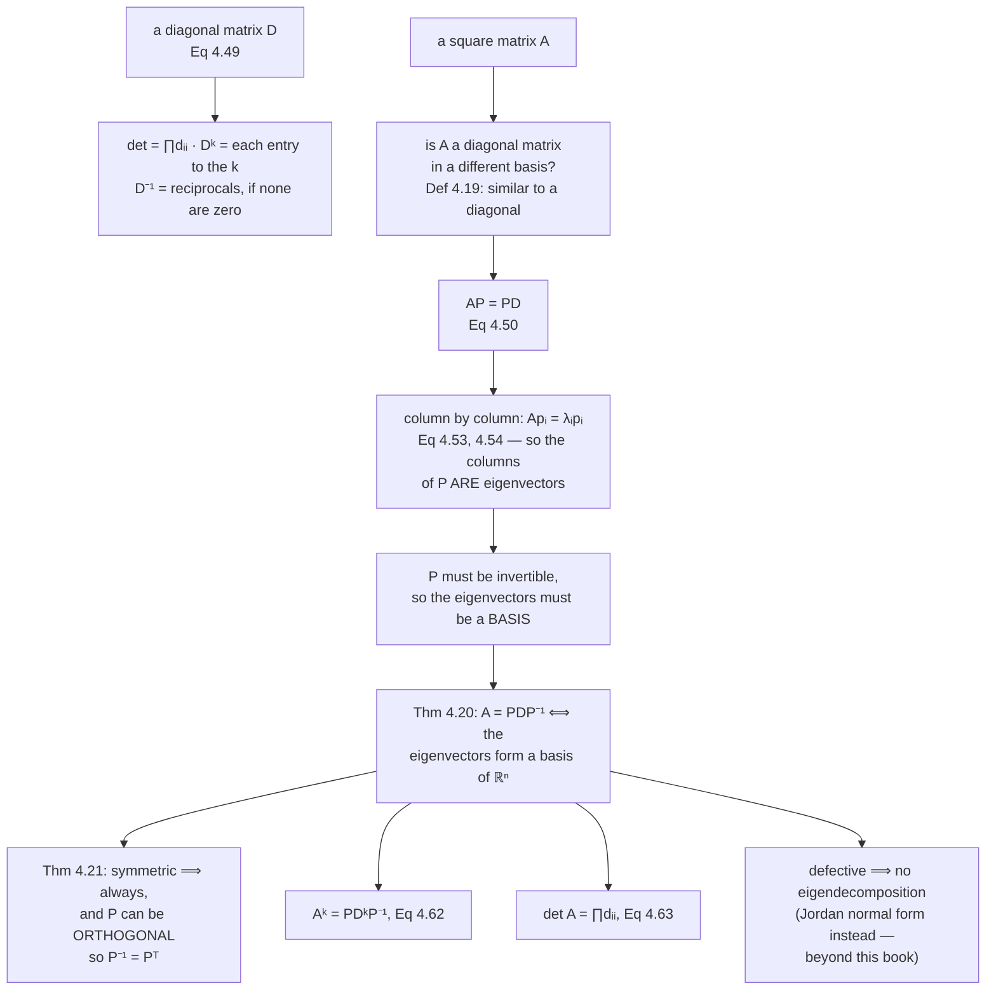

Diagonal matrices are the easy case for everything. Their determinant is the product of the diagonal;
their $k$-th power raises each diagonal entry to the $k$; their inverse takes reciprocals. Nothing about
a general matrix is that easy.

**Diagonalization** asks whether a given square matrix is a diagonal matrix in disguise — the same linear
mapping, written in a better basis. When the answer is yes, every easy property of a diagonal matrix
becomes available, and the basis that does it is the **eigenbasis** of §4.2.

## What you'll learn

- Definition 4.19: what **diagonalizable** means, and why it is exactly Chapter 2's notion of **similar**.
- Why $\mathbf{A}\mathbf{P} = \mathbf{P}\mathbf{D}$ forces the columns of $\mathbf{P}$ to be eigenvectors.
- Theorem 4.20: $\mathbf{A} = \mathbf{P}\mathbf{D}\mathbf{P}^{-1}$ **if and only if** the eigenvectors form a basis.
- Theorem 4.21: a **symmetric** matrix can always be diagonalized, and by an **orthogonal** $\mathbf{P}$, so $\mathbf{P}^{-1} = \mathbf{P}^\top$.
- The geometry: $\mathbf{P}^{-1}$ then $\mathbf{D}$ then $\mathbf{P}$, and what each step does to a disc.
- Equations 4.62 and 4.63: matrix powers and determinants in one line each, with a measured cost crossover.

## Intuition: work in the coordinates where the map is simple

Here is the whole idea in three sentences.

A matrix does something complicated in the standard basis and something trivial in its own eigenbasis:
along each eigenvector it just multiplies by a number. So if you first **change coordinates** into the
eigenbasis, then **scale** each coordinate by its eigenvalue, then **change back**, you have applied the
original matrix — by a route where the only real work is $n$ independent multiplications.

$$
\mathbf{A} = \underbrace{\mathbf{P}}_{\text{change back}}\ \underbrace{\mathbf{D}}_{\text{scale}}\ \underbrace{\mathbf{P}^{-1}}_{\text{change into the eigenbasis}}
$$

Read right to left, in the order a vector meets them. And the payoff arrives when you apply the matrix
repeatedly: the two changes of basis cancel in the middle of
$\mathbf{A}^k = \mathbf{P}\mathbf{D}\mathbf{P}^{-1}\mathbf{P}\mathbf{D}\mathbf{P}^{-1}\cdots$, leaving
$\mathbf{P}\mathbf{D}^k\mathbf{P}^{-1}$.



## The math

### Diagonal matrices, and why they are the target

:::note[Equation 4.49]
A **diagonal matrix** has zeros off the diagonal:

$$
\mathbf{D} = \begin{bmatrix} c_1 & \cdots & 0\\ \vdots & \ddots & \vdots\\ 0 & \cdots & c_n\end{bmatrix}
$$

They allow fast computation of determinants, powers and inverses: the determinant is the product of the
diagonal entries, $\mathbf{D}^k$ raises each diagonal element to the power $k$, and $\mathbf{D}^{-1}$
takes reciprocals **if all of them are nonzero**.
:::

### Similar, and diagonalizable

:::note[Definition 4.19 — Diagonalizable]
A matrix $\mathbf{A} \in \mathbb{R}^{n\times n}$ is **diagonalizable** if it is *similar* to a diagonal
matrix — that is, if there exists an invertible $\mathbf{P} \in \mathbb{R}^{n\times n}$ such that

$$
\mathbf{D} = \mathbf{P}^{-1}\mathbf{A}\mathbf{P}
$$
:::

"Similar" is Chapter 2's Definition 2.22, and §4.1 already told you what it costs: similar matrices share
a determinant, a trace and — from §4.2 — a spectrum. So diagonalization does not change any of the
quantities that characterise the mapping. It changes only the basis you write it in.

### Why the columns of P must be eigenvectors

Take any scalars $\lambda_1, \dots, \lambda_n$ and any vectors $\mathbf{p}_1, \dots, \mathbf{p}_n$, and
set $\mathbf{P} = [\mathbf{p}_1, \dots, \mathbf{p}_n]$, $\mathbf{D} = \mathrm{diag}(\lambda_1,\dots,\lambda_n)$.
Multiply out both sides of $\mathbf{A}\mathbf{P} = \mathbf{P}\mathbf{D}$:

$$
\mathbf{A}\mathbf{P} = \mathbf{A}[\mathbf{p}_1,\dots,\mathbf{p}_n] = [\mathbf{A}\mathbf{p}_1,\dots,\mathbf{A}\mathbf{p}_n]
\tag{4.51}
$$

$$
\mathbf{P}\mathbf{D} = [\mathbf{p}_1,\dots,\mathbf{p}_n]\begin{bmatrix}\lambda_1 & & 0\\ & \ddots & \\ 0 & & \lambda_n\end{bmatrix} = [\lambda_1\mathbf{p}_1,\dots,\lambda_n\mathbf{p}_n]
\tag{4.52}
$$

Equate column by column and you get $\mathbf{A}\mathbf{p}_1 = \lambda_1\mathbf{p}_1$, …,
$\mathbf{A}\mathbf{p}_n = \lambda_n\mathbf{p}_n$ (Equations 4.53 and 4.54). So

$$
\mathbf{A}\mathbf{P} = \mathbf{P}\mathbf{D}
\iff
\lambda_1,\dots,\lambda_n \text{ are eigenvalues of } \mathbf{A} \text{ and } \mathbf{p}_1,\dots,\mathbf{p}_n \text{ the corresponding eigenvectors}
\tag{4.50}
$$

The eigenvectors are not *chosen* for the job; they are the only vectors that can do it.

### The theorem, and its hypothesis

:::note[Theorem 4.20 — Eigendecomposition]
A square matrix $\mathbf{A} \in \mathbb{R}^{n\times n}$ can be factored into

$$
\mathbf{A} = \mathbf{P}\mathbf{D}\mathbf{P}^{-1}
\tag{4.55}
$$

where $\mathbf{P} \in \mathbb{R}^{n\times n}$ and $\mathbf{D}$ is a diagonal matrix whose diagonal
entries are the eigenvalues of $\mathbf{A}$, **if and only if** the eigenvectors of $\mathbf{A}$ form a
basis of $\mathbb{R}^n$.
:::

The hypothesis is where §4.2 earns its keep. Definition 4.19 needs $\mathbf{P}$ invertible, so
$\mathbf{P}$ needs full rank (§4.1, Theorem 4.3), so its $n$ columns need to be linearly independent — so
there must be $n$ linearly independent eigenvectors. That is exactly the negation of **defective**
(Definition 4.13).

So: **only non-defective matrices can be diagonalized**, and the columns of $\mathbf{P}$ are the $n$
eigenvectors. A repeated eigenvalue is fine as long as its eigenspace is big enough; a repeated
eigenvalue whose geometric multiplicity falls short is fatal.

:::note[Theorem 4.21]
A symmetric matrix $\mathbf{S} \in \mathbb{R}^{n\times n}$ can **always** be diagonalized.
:::

This follows directly from the spectral theorem (4.15), and it comes with a bonus: the spectral theorem
gives an **orthonormal** basis of eigenvectors, so $\mathbf{P}$ can be taken orthogonal, and then

$$
\mathbf{D} = \mathbf{P}^\top\mathbf{A}\mathbf{P}
$$

with no inverse to compute. That substitution — $\mathbf{P}^{-1} \to \mathbf{P}^\top$ — is why every
covariance and kernel matrix in the applied chapters is handled without an inverse anywhere in sight.

:::caution[The Jordan normal form is out of scope]
The book's Remark: for defective matrices there is a decomposition that does work, the **Jordan normal
form**, and it is beyond the scope of the book. It is worth knowing the name so you recognise that
"cannot be diagonalized" is not the end of the story mathematically — only the end of what this book
needs.
:::

### The geometry

The book's Figure 4.7 reads as a loop, and it is worth walking round it.

| step | what it does |
| --- | --- |
| $\mathbf{P}^{-1}$ | a change of basis from the standard basis into the eigenbasis: it maps the eigenvectors $\mathbf{p}_i$ onto the standard basis vectors $\mathbf{e}_i$ |
| $\mathbf{D}$ | scales along those axes by the eigenvalues $\lambda_i$ — a circle becomes an axis-aligned ellipse |
| $\mathbf{P}$ | undoes the basis change, returning the scaled vectors to the original frame, giving $\lambda_i\mathbf{p}_i$ |

For a **symmetric** matrix the two outer steps are genuine rotations (or reflections), because
$\mathbf{P}$ is orthogonal. For a general non-defective matrix they are not — $\mathbf{P}$ is invertible
but need not be orthogonal, so the "change of basis" also shears. The book draws the symmetric case,
which is why its Figure 4.7 looks like rotate-scale-rotate.

### What it buys

:::note[Equations 4.62 and 4.63]
**Powers.**

$$
\mathbf{A}^k = (\mathbf{P}\mathbf{D}\mathbf{P}^{-1})^k = \mathbf{P}\mathbf{D}^k\mathbf{P}^{-1}
$$

because the inner $\mathbf{P}^{-1}\mathbf{P}$ pairs cancel. Computing $\mathbf{D}^k$ is $n$ scalar
powers.

**Determinants.**

$$
\det(\mathbf{A}) = \det(\mathbf{P}\mathbf{D}\mathbf{P}^{-1}) = \det(\mathbf{P})\det(\mathbf{D})\det(\mathbf{P}^{-1}) = \det(\mathbf{D}) = \prod_i d_{ii}
$$

using $\det(\mathbf{P}^{-1}) = 1/\det(\mathbf{P})$ from §4.1.
:::

The determinant identity is Theorem 4.16 again, arriving by a different route. The power identity is new,
and it is the practical reason to diagonalize.

:::tip[From the book]
Section 4.4. Equation 4.49 defines a diagonal matrix and lists what it makes easy. Definition 4.19 gives
diagonalizability by reference to Chapter 2's Definition 2.22 (similar matrices). Equations 4.50 to 4.54
derive $\mathbf{A}\mathbf{P} = \mathbf{P}\mathbf{D}$ column by column, showing the columns of $\mathbf{P}$
must be eigenvectors, and note that invertibility of $\mathbf{P}$ requires $n$ linearly independent ones.
Theorem 4.20 (Equation 4.55) is the eigendecomposition, with the observation that only non-defective
matrices can be diagonalized. Theorem 4.21 handles symmetric matrices, with the note that the spectral
theorem makes $\mathbf{P}$ orthogonal so that $\mathbf{D} = \mathbf{P}^\top\mathbf{A}\mathbf{P}$, and a
Remark points to the Jordan normal form for the defective case. Figure 4.7 gives the geometric intuition
as $\mathbf{P}^{-1}$, then $\mathbf{D}$, then $\mathbf{P}$. Example 4.11 (Equations 4.56 to 4.61) works a
$2\times2$ in three steps. Equations 4.62 and 4.63 give matrix powers and the determinant.
:::

## Worked example by hand

### Example 4.11

$$
\mathbf{A} = \begin{bmatrix}2 & 1\\ 1 & 2\end{bmatrix}
$$

**Step 1 — eigenvalues and eigenvectors.**

$$
\det(\mathbf{A}-\lambda\mathbf{I}) = \begin{vmatrix}2-\lambda & 1\\ 1 & 2-\lambda\end{vmatrix}
= (2-\lambda)^2 - 1 = \lambda^2 - 4\lambda + 3 = (\lambda-3)(\lambda-1)
\tag{4.56b}
$$

so $\lambda_1 = 1$ and $\lambda_2 = 3$. Solving
$\begin{bmatrix}2&1\\1&2\end{bmatrix}\mathbf{p}_i = \lambda_i\mathbf{p}_i$ and normalising:

$$
\mathbf{p}_1 = \frac{1}{\sqrt2}\begin{bmatrix}1\\-1\end{bmatrix},
\qquad
\mathbf{p}_2 = \frac{1}{\sqrt2}\begin{bmatrix}1\\1\end{bmatrix}
\tag{4.58}
$$

**Step 2 — check existence.** Two distinct eigenvalues, so by Theorem 4.12 the eigenvectors are
independent, so they form a basis of $\mathbb{R}^2$, so Theorem 4.20 applies.

**Step 3 — assemble.**

$$
\mathbf{P} = [\mathbf{p}_1, \mathbf{p}_2] = \frac{1}{\sqrt2}\begin{bmatrix}1 & 1\\ -1 & 1\end{bmatrix}
\tag{4.59}
$$

$$
\mathbf{P}^{-1}\mathbf{A}\mathbf{P} = \begin{bmatrix}1 & 0\\ 0 & 3\end{bmatrix} = \mathbf{D}
\tag{4.60}
$$

And because $\mathbf{A}$ is symmetric, the eigenvectors are already an ONB, so
$\mathbf{P}^{-1} = \mathbf{P}^\top$ and the factorisation can be written without an inverse
(Equation 4.61):

$$
\underbrace{\begin{bmatrix}2&1\\1&2\end{bmatrix}}_{\mathbf{A}}
= \underbrace{\frac{1}{\sqrt2}\begin{bmatrix}1&1\\-1&1\end{bmatrix}}_{\mathbf{P}}
\underbrace{\begin{bmatrix}1&0\\0&3\end{bmatrix}}_{\mathbf{D}}
\underbrace{\frac{1}{\sqrt2}\begin{bmatrix}1&-1\\1&1\end{bmatrix}}_{\mathbf{P}^\top}
$$

Verified numerically: $\mathbf{P}^{-1} = \mathbf{P}^\top$ exactly, and
$\mathbf{P}\mathbf{D}\mathbf{P}^\top$ reproduces $\mathbf{A}$ to $4.44\times10^{-16}$.

### A closed form for the k-th power

Equation 4.62 does something a matrix multiply cannot: it gives an **algebraic** formula. For this
$\mathbf{A}$,

$$
\mathbf{A}^k = \mathbf{P}\begin{bmatrix}1^k & 0\\ 0 & 3^k\end{bmatrix}\mathbf{P}^\top
= \frac{1}{2}\begin{bmatrix}1 + 3^k & -1 + 3^k\\ -1 + 3^k & 1 + 3^k\end{bmatrix}
$$

Read off the top-left entry: $(\mathbf{A}^k)_{11} = \tfrac{1}{2}(1 + 3^k)$. Check against direct
multiplication:

| $k$ | direct $\mathbf{A}^k$, entry $(1,1)$ | $\tfrac12(1+3^k)$ |
| --- | --- | --- |
| 1 | $2$ | $2$ |
| 2 | $5$ | $5$ |
| 5 | $122$ | $122$ |
| 10 | $29525$ | $29525$ |
| 20 | $1743392201$ | $1743392201$ |

Every value integer and exact. That is what a diagonalisation gives you that repeated multiplication does
not: not a faster loop, a **formula**.

```python title="example_411.py" showLineNumbers{1}
import numpy as np

A = np.array([[2.0, 1.0], [1.0, 2.0]])

# The book's P and D (Equations 4.58 to 4.60).
P = np.array([[1.0, 1.0], [-1.0, 1.0]]) / np.sqrt(2)
D = np.diag([1.0, 3.0])

print("P^-1 A P ="); print(np.round(np.linalg.inv(P) @ A @ P, 10))
print("P^-1 equals P^T:", np.allclose(np.linalg.inv(P), P.T))
print("P D P^T - A, largest entry:", f"{float(np.abs(P @ D @ P.T - A).max()):.2e}")

print()
print("Equation 4.62, against direct multiplication:")
for k in (1, 2, 5, 10, 20):
    direct = np.linalg.matrix_power(A, k)
    via = P @ np.diag([1.0 ** k, 3.0 ** k]) @ P.T
    closed = (1 + 3.0 ** k) / 2
    print(f"  k={k:3}  direct[0,0] {direct[0, 0]:16.1f}  PD^kP^T {via[0, 0]:16.1f}  "
          f"(1+3^k)/2 {closed:16.1f}  gap {float(np.abs(direct - via).max()):.2e}")

print()
print("Equation 4.63: det A =", float(np.linalg.det(A)), " product of D's diagonal =", float(np.prod(np.diag(D))))
```

```text title="output"
P^-1 A P =
[[ 1.  0.]
 [-0.  3.]]
P^-1 equals P^T: True
P D P^T - A, largest entry: 4.44e-16

Equation 4.62, against direct multiplication:
  k=  1  direct[0,0]              2.0  PD^kP^T              2.0  (1+3^k)/2              2.0  gap 4.44e-16
  k=  2  direct[0,0]              5.0  PD^kP^T              5.0  (1+3^k)/2              5.0  gap 8.88e-16
  k=  5  direct[0,0]            122.0  PD^kP^T            122.0  (1+3^k)/2            122.0  gap 1.42e-14
  k= 10  direct[0,0]          29525.0  PD^kP^T          29525.0  (1+3^k)/2          29525.0  gap 3.64e-12
  k= 20  direct[0,0]     1743392201.0  PD^kP^T     1743392201.0  (1+3^k)/2     1743392201.0  gap 2.38e-07

Equation 4.63: det A = 2.9999999999999996  product of D's diagonal = 3.0
```

Two things worth noticing. The absolute gap grows to $2.4\times10^{-7}$ by $k = 20$ — but
$\mathbf{A}^{20}$ has entries around $1.7\times10^{9}$, so that is a **relative** error of about
$10^{-16}$, which is machine precision, not degradation. And the last line: $\det\mathbf{A}$ from an LU
factorisation gives $2.9999999999999996$ where the product of the eigenvalues gives exactly $3$.

## See it move

The first sketch is the three-step loop with a slider that interpolates through it, so you can see which
step does what.

```p5 title="P-inverse, then D, then P" desc="Drag the stage slider to move a disc of points through the three factors. The eigenvectors are marked: P-inverse lands them on the coordinate axes, D stretches along those axes, and P returns everything to the original frame. Edit the matrix — keep it symmetric with the off-diagonal knob, or break symmetry and watch the outer steps stop being rotations." height="560"
let stage = 0.0;
let a11 = 2.0, off = 1.0, a22 = 2.0, skew = 0.0;
let KNOBS = [], dragging = null;
let PTS = [];

function setup() {
  createCanvas(600, 560); textFont("monospace");
  let s = 424242;
  const rnd = () => { s = (s * 1103515245 + 12345) & 0x7fffffff; return s / 0x7fffffff; };
  for (let i = 0; i < 700; i++) {
    const t = rnd() * TWO_PI, r = Math.sqrt(rnd());
    PTS.push([r * Math.cos(t), r * Math.sin(t), t]);
  }
}

function knob(id, x, y, w, value, mn, mx, label) {
  KNOBS.push({ id, x, y, w, mn, mx });
  const t = (value - mn) / (mx - mn);
  stroke(60, 74, 92); strokeWeight(2); line(x, y, x + w, y);
  noStroke(); fill(255, 211, 67); ellipse(x + t * w, y, 10, 10);
  fill(190, 200, 212); textSize(11); textAlign(LEFT, CENTER);
  text(label, x + w + 10, y);
}
function mousePressed() {
  for (const k of KNOBS) {
    if (mouseY > k.y - 11 && mouseY < k.y + 11 && mouseX > k.x - 11 && mouseX < k.x + k.w + 11) {
      dragging = k; return;
    }
  }
}
function mouseReleased() { dragging = null; }
function mouseDragged() {
  if (!dragging) return;
  const t = Math.min(1, Math.max(0, (mouseX - dragging.x) / dragging.w));
  const v = dragging.mn + t * (dragging.mx - dragging.mn);
  if (dragging.id === "stage") stage = v;
  if (dragging.id === "a11") a11 = v;
  if (dragging.id === "off") off = v;
  if (dragging.id === "a22") a22 = v;
  if (dragging.id === "skew") skew = v;
  if (!isLooping()) redraw();
}

function draw() {
  background(13, 17, 23);
  KNOBS = [];

  const U = 62, cx = 250, cy = 200;
  const sx = x => cx + x * U, sy = y => cy - y * U;

  // A is [[a11, off + skew], [off, a22]]: symmetric when skew = 0.
  const A = [[a11, off + skew], [off, a22]];
  const tr = A[0][0] + A[1][1], dt = A[0][0] * A[1][1] - A[0][1] * A[1][0];
  const disc = tr * tr - 4 * dt;
  const real = disc >= 0;
  const l1 = real ? (tr - Math.sqrt(disc)) / 2 : 0;
  const l2 = real ? (tr + Math.sqrt(disc)) / 2 : 0;

  // Eigenvectors, normalised.
  const evec = l => {
    let v = Math.abs(A[0][1]) > 1e-9 ? [A[0][1], l - A[0][0]]
          : Math.abs(A[1][0]) > 1e-9 ? [l - A[1][1], A[1][0]]
          : (Math.abs(l - A[0][0]) < 1e-9 ? [1, 0] : [0, 1]);
    const n = Math.hypot(v[0], v[1]);
    return n < 1e-9 ? [1, 0] : [v[0] / n, v[1] / n];
  };
  const p1 = real ? evec(l1) : [1, 0];
  const p2 = real ? evec(l2) : [0, 1];
  const P = [[p1[0], p2[0]], [p1[1], p2[1]]];
  const detP = P[0][0] * P[1][1] - P[0][1] * P[1][0];
  const Pinv = Math.abs(detP) < 1e-9 ? [[1, 0], [0, 1]]
             : [[P[1][1] / detP, -P[0][1] / detP], [-P[1][0] / detP, P[0][0] / detP]];

  const mv = (M, v) => [M[0][0] * v[0] + M[0][1] * v[1], M[1][0] * v[0] + M[1][1] * v[1]];
  const lerp2 = (a, b, t) => [a[0] + (b[0] - a[0]) * t, a[1] + (b[1] - a[1]) * t];

  const place = v => {
    const s1 = mv(Pinv, v);
    const s2 = [l1 * s1[0], l2 * s1[1]];
    const s3 = mv(P, s2);
    if (stage <= 1) return lerp2(v, s1, stage);
    if (stage <= 2) return lerp2(s1, s2, stage - 1);
    return lerp2(s2, s3, stage - 2);
  };

  stroke(32, 44, 58); strokeWeight(1);
  for (let g = -4; g <= 5; g++) line(sx(g), sy(-3), sx(g), sy(3));
  for (let g = -3; g <= 3; g++) line(sx(-4), sy(g), sx(5), sy(g));
  stroke(58, 72, 88); strokeWeight(1.2);
  line(sx(-4), sy(0), sx(5), sy(0)); line(sx(0), sy(-3), sx(0), sy(3));

  noStroke();
  for (const p of PTS) {
    const q = place([p[0], p[1]]);
    const hue = (p[2] / TWO_PI) * 255;
    fill(60 + 0.6 * hue, 120 + 0.35 * hue, 220 - 0.5 * hue, 190);
    if (Math.abs(q[0]) < 5.2 && Math.abs(q[1]) < 3.4) ellipse(sx(q[0]), sy(q[1]), 3.4, 3.4);
  }

  // The two eigenvectors, carried through the same stages.
  for (const [pv, colour, nm] of [[p1, color(232, 110, 110), "p1"], [p2, color(75, 139, 190), "p2"]]) {
    const q = place(pv);
    stroke(colour); strokeWeight(2.6); line(sx(0), sy(0), sx(q[0]), sy(q[1]));
    noStroke(); fill(colour); ellipse(sx(q[0]), sy(q[1]), 9, 9);
    textSize(11); textAlign(LEFT, TOP); text(nm, sx(q[0]) + 8, sy(q[1]) - 18);
  }

  const labels = ["original x", "P⁻¹ x : eigenvectors onto the axes",
                  "D P⁻¹ x : scale along the axes", "P D P⁻¹ x = A x"];
  const li = stage < 0.02 ? 0 : stage <= 1 ? 1 : stage <= 2 ? 2 : 3;

  knob("stage", 40, 340, 240, stage, 0, 3, `stage ${stage.toFixed(2)} / 3`);
  knob("a11", 40, 380, 100, a11, 0.2, 4, `a11 ${a11.toFixed(2)}`);
  knob("off", 190, 380, 100, off, -2.5, 2.5, `off-diag ${off.toFixed(2)}`);
  knob("a22", 40, 406, 100, a22, 0.2, 4, `a22 ${a22.toFixed(2)}`);
  knob("skew", 190, 406, 100, skew, 0, 2.5, `asymmetry ${skew.toFixed(2)}`);

  const symmetric = Math.abs(skew) < 1e-9;
  // Is P orthogonal? Only when A is symmetric.
  const g11 = P[0][0] ** 2 + P[1][0] ** 2, g22 = P[0][1] ** 2 + P[1][1] ** 2;
  const g12 = P[0][0] * P[0][1] + P[1][0] * P[1][1];
  const orth = Math.abs(g11 - 1) < 1e-6 && Math.abs(g22 - 1) < 1e-6 && Math.abs(g12) < 1e-6;

  noStroke(); textAlign(LEFT, TOP);
  fill(255, 211, 67); textSize(14); text("Drag the stage slider", 30, 12);
  fill(255, 211, 67); textSize(12); text(labels[li], 30, 300);
  fill(215); textSize(11);
  text(`A = [ ${A[0][0].toFixed(2)}  ${A[0][1].toFixed(2)} ]`, 340, 340);
  text(`    [ ${A[1][0].toFixed(2)}  ${A[1][1].toFixed(2)} ]`, 340, 358);
  if (real) {
    text(`D = diag(${l1.toFixed(3)}, ${l2.toFixed(3)})`, 340, 384);
    fill(orth ? color(120, 200, 140) : color(255, 211, 67)); textSize(11);
    text(orth ? "P is orthogonal: P⁻¹ = Pᵀ" : "P is invertible but NOT orthogonal", 340, 410);
    fill(150); textSize(10);
    text(`p1 . p2 = ${g12.toFixed(4)}`, 340, 432);
  } else {
    fill(232, 110, 110); textSize(11);
    text("complex eigenvalues:", 340, 384);
    text("no real eigendecomposition", 340, 402);
  }
  fill(150); textSize(10);
  text("Set asymmetry to 0 and A is symmetric, so Theorem 4.21 applies and the outer", 30, 470);
  text("steps are rotations. Raise it and P stops being orthogonal: the change of basis", 30, 486);
  text("shears as well as turns, which is why the book draws only the symmetric case.", 30, 502);
  text("Push the off-diagonal past sqrt(a11*a22) with asymmetry high and the eigenvalues go complex.", 30, 524);
}
```

The second sketch is the payoff: watch $\mathbf{A}^k$ collapse onto the dominant eigendirection.

```p5 title="A to the k collapses onto the dominant eigenvector" desc="Drag k. The disc is repeatedly transformed by A, computed as P D-to-the-k P-inverse. Because one eigenvalue dominates, everything is squeezed towards a single line — and the readout shows the ratio of the two eigenvalues raised to the k, which is exactly how fast that happens." height="540"
let k = 1.0, l1 = 0.6, l2 = 1.4, theta = 0.5;
let KNOBS = [], dragging = null;
let PTS = [];

function setup() {
  createCanvas(600, 540); textFont("monospace");
  for (let i = 0; i < 240; i++) {
    const t = (i / 240) * TWO_PI;
    PTS.push([Math.cos(t), Math.sin(t), t]);
  }
}

function knob(id, x, y, w, value, mn, mx, label) {
  KNOBS.push({ id, x, y, w, mn, mx });
  const t = (value - mn) / (mx - mn);
  stroke(60, 74, 92); strokeWeight(2); line(x, y, x + w, y);
  noStroke(); fill(255, 211, 67); ellipse(x + t * w, y, 10, 10);
  fill(190, 200, 212); textSize(11); textAlign(LEFT, CENTER);
  text(label, x + w + 10, y);
}
function mousePressed() {
  for (const kk of KNOBS) {
    if (mouseY > kk.y - 11 && mouseY < kk.y + 11 && mouseX > kk.x - 11 && mouseX < kk.x + kk.w + 11) {
      dragging = kk; return;
    }
  }
}
function mouseReleased() { dragging = null; }
function mouseDragged() {
  if (!dragging) return;
  const t = Math.min(1, Math.max(0, (mouseX - dragging.x) / dragging.w));
  const v = dragging.mn + t * (dragging.mx - dragging.mn);
  if (dragging.id === "k") k = Math.round(v);
  if (dragging.id === "l1") l1 = v;
  if (dragging.id === "l2") l2 = v;
  if (dragging.id === "th") theta = v;
  if (!isLooping()) redraw();
}

function draw() {
  background(13, 17, 23);
  KNOBS = [];

  const U = 68, cx = 250, cy = 190;
  const sx = x => cx + x * U, sy = y => cy - y * U;

  // Build A = P diag(l1, l2) P^T with P a rotation by theta: symmetric by construction.
  const c = Math.cos(theta), s = Math.sin(theta);
  const p1 = [c, s], p2 = [-s, c];
  const a11 = l1 * c * c + l2 * s * s;
  const a12 = (l1 - l2) * c * s;
  const a22 = l1 * s * s + l2 * c * c;

  const big = Math.abs(l2) >= Math.abs(l1) ? l2 : l1;
  const bigVec = Math.abs(l2) >= Math.abs(l1) ? p2 : p1;
  const smallLam = Math.abs(l2) >= Math.abs(l1) ? l1 : l2;
  const ratio = Math.abs(big) < 1e-12 ? 0 : Math.abs(smallLam) / Math.abs(big);

  // A^k x = P D^k P^T x. Rescale by the dominant eigenvalue so the picture stays on screen.
  const scale_ = Math.abs(big) < 1e-12 ? 1 : Math.pow(Math.abs(big), k);
  const apply = v => {
    const c1 = v[0] * p1[0] + v[1] * p1[1];
    const c2 = v[0] * p2[0] + v[1] * p2[1];
    const d1 = Math.pow(l1, k) * c1 / scale_;
    const d2 = Math.pow(l2, k) * c2 / scale_;
    return [d1 * p1[0] + d2 * p2[0], d1 * p1[1] + d2 * p2[1]];
  };

  stroke(32, 44, 58); strokeWeight(1);
  for (let g = -4; g <= 4; g++) { line(sx(g), sy(-2.6), sx(g), sy(2.6)); line(sx(-4), sy(g), sx(4), sy(g)); }
  stroke(58, 72, 88); strokeWeight(1.2);
  line(sx(-4), sy(0), sx(4), sy(0)); line(sx(0), sy(-2.6), sx(0), sy(2.6));

  // The dominant eigendirection.
  stroke(255, 211, 67, 130); strokeWeight(2);
  line(sx(-4 * bigVec[0]), sy(-4 * bigVec[1]), sx(4 * bigVec[0]), sy(4 * bigVec[1]));

  noFill(); stroke(90, 100, 116); strokeWeight(1.2); ellipse(sx(0), sy(0), 2 * U, 2 * U);

  noFill(); stroke(75, 139, 190); strokeWeight(2.4);
  beginShape();
  for (const p of PTS) { const q = apply([p[0], p[1]]); vertex(sx(q[0]), sy(q[1])); }
  endShape(CLOSE);

  knob("k", 40, 320, 220, k, 1, 40, `k = ${Math.round(k)}`);
  knob("l1", 40, 356, 100, l1, -1.6, 1.6, `lambda1 ${l1.toFixed(2)}`);
  knob("l2", 190, 356, 100, l2, -1.6, 1.6, `lambda2 ${l2.toFixed(2)}`);
  knob("th", 40, 382, 100, theta, 0, Math.PI, `basis angle ${(theta * 180 / Math.PI).toFixed(0)} deg`);

  noStroke(); textAlign(LEFT, TOP);
  fill(255, 211, 67); textSize(14); text("Drag k", 30, 12);
  fill(215); textSize(11);
  text(`A = [ ${a11.toFixed(3)}  ${a12.toFixed(3)} ]`, 340, 320);
  text(`    [ ${a12.toFixed(3)}  ${a22.toFixed(3)} ]`, 340, 338);
  text(`Aᵏ = P Dᵏ Pᵀ, rescaled by |lambda_max|ᵏ`, 340, 364);
  text(`|lambda_min / lambda_max| = ${ratio.toFixed(4)}`, 340, 386);
  text(`that ratio to the k = ${Math.pow(ratio, k).toExponential(2)}`, 340, 404);
  fill(Math.pow(ratio, k) < 0.02 ? color(120, 200, 140) : color(150)); textSize(11);
  text(Math.pow(ratio, k) < 0.02 ? "collapsed onto the dominant direction" : "still two-dimensional", 340, 430);
  fill(150); textSize(10);
  text("The circle becomes an ever-thinner ellipse along the amber line. The thinness IS", 30, 462);
  text("the eigenvalue ratio to the power k — which is the convergence rate of power", 30, 478);
  text("iteration in section 4.2, and the reason PageRank converges geometrically.", 30, 494);
  text("Set the two eigenvalues equal and nothing collapses: A is then a scalar multiple of I.", 30, 516);
}
```

And the stepped version on Example 4.11, with the det/trace checks and the diagonalisability verdict:

<EigenLab
  client:visible
  matrix={[[2, 1], [1, 2]]}
  probe={[1.4, 0.3]}
  title="Example 4.11, step by step"
  desc="Symmetric, two distinct eigenvalues, orthogonal eigenvectors — the case Theorem 4.21 guarantees. The final frame confirms the eigenspace dimensions add to 2."
/>

## From scratch

```python title="eigendecomposition_from_scratch.py" showLineNumbers{1}
import numpy as np

def eigendecompose(A, tol=1e-8):
    """Theorem 4.20, with its hypothesis actually checked."""
    A = np.asarray(A, dtype=float)
    n = A.shape[0]
    symmetric = bool(np.allclose(A, A.T))

    # Theorem 4.21: for symmetric input use eigh, which returns an ONB.
    vals, vecs = (np.linalg.eigh(A) if symmetric else np.linalg.eig(A))

    if np.any(np.abs(np.imag(vals)) > 1e-12):
        raise ValueError("complex eigenvalues: not diagonalizable over the reals")

    vals = np.real(vals)
    vecs = np.real(vecs)

    # The hypothesis: do the eigenvectors form a basis?
    independent = 0
    for lam in np.unique(np.round(vals, 8)):
        independent += n - np.linalg.matrix_rank(A - lam * np.eye(n), tol=tol)
    if independent < n:
        raise ValueError(f"defective: {independent} independent eigenvectors, {n} needed")

    P, D = vecs, np.diag(vals)
    Pinv = P.T if symmetric else np.linalg.inv(P)
    return P, D, Pinv, symmetric

cases = {
    "Ex 4.11 [[2,1],[1,2]]":  [[2.0, 1], [1, 2]],
    "Ex 4.5  [[4,2],[1,3]]":  [[4.0, 2], [1, 3]],
    "Ex 4.6  [[2,1],[0,2]]":  [[2.0, 1], [0, 2]],
    "Ex 4.8  3x3 symmetric":  [[3.0, 2, 2], [2, 3, 2], [2, 2, 3]],
    "rotation by 30 deg":     [[np.cos(np.pi / 6), -np.sin(np.pi / 6)],
                               [np.sin(np.pi / 6), np.cos(np.pi / 6)]],
}

for name, A in cases.items():
    A = np.asarray(A, dtype=float)
    try:
        P, D, Pinv, sym = eigendecompose(A)
        gap = float(np.abs(P @ D @ Pinv - A).max())
        orth = float(np.abs(P.T @ P - np.eye(A.shape[0])).max())
        print(f"{name:24} OK   symmetric {str(sym):5} "
              f"|P D P^-1 - A| {gap:.1e}  |P^T P - I| {orth:.1e}  "
              f"det from D {float(np.prod(np.diag(D))):+.4f}")
    except ValueError as e:
        print(f"{name:24} NO   {e}")
```

```text title="output"
Ex 4.11 [[2,1],[1,2]]    OK   symmetric True  |P D P^-1 - A| 4.4e-16  |P^T P - I| 2.2e-16  det from D +3.0000
Ex 4.5  [[4,2],[1,3]]    OK   symmetric False |P D P^-1 - A| 8.9e-16  |P^T P - I| 3.2e-01  det from D +10.0000
Ex 4.6  [[2,1],[0,2]]    NO   defective: 1 independent eigenvectors, 2 needed
Ex 4.8  3x3 symmetric    OK   symmetric True  |P D P^-1 - A| 3.6e-15  |P^T P - I| 5.6e-16  det from D +7.0000
rotation by 30 deg       NO   complex eigenvalues: not diagonalizable over the reals
```

The column to read is $\lVert\mathbf{P}^\top\mathbf{P} - \mathbf{I}\rVert$. For the two **symmetric**
matrices it is at machine precision — $\mathbf{P}$ is orthogonal, exactly as Theorem 4.21 promises. For
the non-symmetric Example 4.5 it is $0.3162$: $\mathbf{P}$ is perfectly invertible and the decomposition
is perfectly valid, but the change of basis is not a rotation — the two eigendirections meet at
$71.6°$ rather than $90°$, so their inner product is $-0.3162$ instead of $0$. That is the difference between Theorem 4.20 and Theorem 4.21, visible as one
number.

## On real data

<Figure
  src="/images/mml/eigendecomposition-and-diagonalization/pdp-three-steps"
  alt="Four panels of a coloured disc of points: the original with two eigenvector arrows, the same disc after P-inverse with the arrows on the coordinate axes, the disc stretched into an axis-aligned ellipse by D, and the ellipse rotated back by P."
  title="The book's Figure 4.7, rebuilt"
  caption="Eigenvalues 3 and 1. Measured over 900 points, the largest gap between the direct product A x and the three-step chain is 4.44e-16, and P-transpose P differs from the identity by 2.22e-16 — so here the two outer steps really are rotations."
/>

<Figure
  src="/images/mml/eigendecomposition-and-diagonalization/matrix-power-two-ways"
  alt="Left, a log-log plot of the relative disagreement between repeated multiplication and the eigen route, flat at machine precision across a thousand powers. Right, log-log multiplication counts for both routes with a marked crossover."
  title="Equation 4.62, measured"
  caption="Over powers up to 1000 the two routes never disagree by more than 9.66e-15 relative. On the right, for n = 6 the eigen route becomes cheaper at k = 14 — one decomposition plus k scalar powers against k matrix products."
/>

<Figure
  src="/images/mml/eigendecomposition-and-diagonalization/defective-is-a-measure-zero-accident"
  alt="A bar chart of percent defective across four constructions of 4 by 4 matrices: zero for Gaussian entries, about three percent for small integers, zero for a constructed repeated eigenvalue, and over ninety-nine percent for a Jordan block."
  title="Theorem 4.20's hypothesis, quantified"
  caption="Four thousand 4x4 matrices attempted per construction. Random Gaussian entries are never defective; small integer entries are 2.675% of the time, because exact repeats become possible; a deliberately repeated eigenvalue is still never defective; only a Jordan block is, at 99.37%."
/>

## Reading the plot

**From the three-step figure.** The eigenvector arrows are the thing to follow. In the first panel they
point in two oblique directions; in the second they lie **on the coordinate axes**, which is what
"change into the eigenbasis" means; in the third they have been stretched by $3$ and $1$; in the fourth
they are back where they started, longer. The disc becomes an ellipse whose axes are the eigenvectors —
and it becomes axis-aligned only in the middle two panels.

The measured numbers close the loop: the largest disagreement between $\mathbf{A}\mathbf{x}$ and the
three-step chain, over $900$ points, is $4.44\times10^{-16}$. And
$\lVert\mathbf{P}^\top\mathbf{P} - \mathbf{I}\rVert = 2.22\times10^{-16}$, confirming the matrix is
symmetric enough for $\mathbf{P}^{-1} = \mathbf{P}^\top$ to be used.

**From the matrix-power figure.** Two separate claims.

*Accuracy.* Over a thousand powers the two routes agree to $9.66\times10^{-15}$ relative. There is no
drift: repeated multiplication accumulates rounding error and the eigen route accumulates a different
rounding error, and both stay at machine precision because this matrix has spectral radius $0.99$ and its
powers decay rather than grow.

*Cost.* The crossover for $n = 6$ is $k = 14$, and it is worth reading the counts rather than the curves:
at $k = 13$ repeated multiplication needs $2592$ multiplications against the eigen route's $2605$; at
$k = 14$ it is $2808$ against $2606$. The eigen route pays a large fixed cost — about $12n^3$ for the
decomposition plus reassembly — and then almost nothing per power.

But the real argument for Equation 4.62 is not the flop count. It is that the eigen route gives an
**algebraic** answer: $(\mathbf{A}^k)_{11} = \tfrac12(1+3^k)$ for the worked example, valid for every
$k$ at once, which no amount of matrix multiplication produces.

**From the defectiveness figure.** This is the figure that recalibrates the hypothesis. Textbooks
introduce "non-defective" as a condition to worry about, and the measurement says:

| construction | percent defective |
| --- | --- |
| random Gaussian entries | $0.000\%$ ($0$ of $4000$) |
| small integer entries | $2.675\%$ ($107$ of $4000$) |
| built with a repeated eigenvalue, diagonalizable by construction | $0.000\%$ ($0$ of $3811$) |
| a Jordan block, defective by construction | $99.37\%$ ($3780$ of $3804$) |

The last two denominators are smaller because those two families conjugate a diagonal matrix by a random
$\mathbf{S}$ and skip the draw when $\lvert\det\mathbf{S}
vert < 0.1$ rather than test through a
near-singular conjugation. Counting a skipped draw as non-defective would have shown the last bar at
$94.5\%$ and made a missing sample look like a numerical effect.

Defectiveness is not something random matrices do. It requires an exactly repeated eigenvalue, which
requires exact arithmetic coincidences — so it happens for small-integer matrices $2.7\%$ of the time and
essentially never for continuous entries. What it *is* common in is **structured** matrices, which is
where your data actually comes from.

Even so the last bar falls $24$ short of its $3804$. That residue is not a counterexample — it is the
tolerance. A badly conditioned conjugation makes the deficient eigenspace look full at any fixed
threshold, which is the pitfall below.

## Pitfalls

:::danger[Defectiveness is not numerically decidable]
The measurement above is the proof: matrices constructed to be defective are reported non-defective
$24$ times in $3804$, and every one of those $24$ genuinely is defective. Geometric multiplicity is the
nullity of $\mathbf{A}-\lambda\mathbf{I}$, nullity needs a rank tolerance, and near-defective is
indistinguishable from defective at any tolerance you pick.
In practice you do not test for defectiveness — you use the SVD, which needs no such hypothesis.
:::

:::danger[np.linalg.eig does not tell you whether the decomposition is valid]
It returns $\mathbf{P}$ and $\mathbf{D}$ for a defective matrix too, with a $\mathbf{P}$ that is singular
or nearly so. `np.linalg.eig(np.array([[2.,1],[0,2]]))` returns two columns that are the *same* vector
up to sign — a rank-1 $\mathbf{P}$ with condition number $4.5\times10^{15}$ — and
$\mathbf{P}\mathbf{D}\mathbf{P}^{-1}$ then reconstructs a matrix that is off by $1.0$, the size of the
off-diagonal entry it silently dropped. Nothing raises. Check the condition number of $\mathbf{P}$
before trusting a reconstruction.
:::

:::caution[Use eigh for symmetric input, and never on non-symmetric input]
For a symmetric matrix `eigh` is faster, returns real values in ascending order, and returns an
**orthonormal** $\mathbf{P}$ so you can write $\mathbf{P}^\top$ instead of inverting. Handed a
non-symmetric matrix it reads only the lower triangle and returns confident nonsense. `eig` is the
general tool and returns complex arrays even when every eigenvalue is real.
:::

:::caution[An orthogonal P is a property of symmetry, not of diagonalizability]
Example 4.5 is diagonalizable with $\lVert\mathbf{P}^\top\mathbf{P}-\mathbf{I}\rVert = 0.3162$. Theorem
4.20 gives you an invertible $\mathbf{P}$; only Theorem 4.21, via the spectral theorem, gives an
orthogonal one. Code that assumes $\mathbf{P}^{-1} = \mathbf{P}^\top$ without checking symmetry is wrong
by $0.32$ here.
:::

:::caution[Repeated eigenvalues make P non-unique in a way that breaks reproducibility]
Any orthogonal rotation *within* a repeated eigenspace gives an equally valid $\mathbf{P}$. Example 4.8's
$\lambda = 1$ eigenspace is two-dimensional, so its two columns of $\mathbf{P}$ are determined only up to
a rotation in that plane — and different LAPACK builds may pick different ones. Anything downstream that
reads individual eigenvector components (a PCA loading plot, a saved projection) is unstable under a
repeated or nearly-repeated eigenvalue.
:::

:::caution[Do not diagonalize just to compute a determinant]
Equation 4.63 is a lovely identity and a poor algorithm: an eigendecomposition costs about $10n^3$ where
an LU factorisation costs $2n^3/3$, and it is *less* accurate — measured here, $2.9999999999999996$ from
LU against exactly $3$ from the eigenvalues on a $2\times2$, but the ordering reverses on larger
ill-conditioned input. Use Cholesky if the matrix is SPD, LU otherwise.
:::

## Compare

| | eigendecomposition $\mathbf{P}\mathbf{D}\mathbf{P}^{-1}$ | SVD $\mathbf{U}\boldsymbol{\Sigma}\mathbf{V}^\top$ |
| --- | --- | --- |
| exists for | square and non-defective | **every** matrix |
| shape | one space to itself | domain to codomain, possibly different dimensions |
| outer factors | invertible, generally **not** orthogonal | both orthogonal, so both are rotations |
| are the outer factors inverse to each other? | yes, $\mathbf{P}$ and $\mathbf{P}^{-1}$ | **no** — different spaces |
| middle factor | eigenvalues, possibly negative or complex | singular values, real and non-negative |
| for a symmetric positive definite matrix | the same thing | the same thing |
| gives matrix powers? | yes, $\mathbf{P}\mathbf{D}^k\mathbf{P}^{-1}$ | not directly |
| gives best low-rank approximation? | no | **yes**, §4.6 |

The last two rows are why both exist. §4.5 takes up the right-hand column.

<Quiz
  title="Check your understanding"
  questions={[
    {
      q: "Why must the columns of P be eigenvectors, rather than merely some convenient basis?",
      options: [
        "Convention",
        "Because multiplying out AP = PD column by column gives A p-i = lambda-i p-i for every i — the equation itself forces it, and nothing else satisfies it",
        "Because eigenvectors are orthogonal",
        "Because D must be diagonal",
      ],
      answer: 1,
      explain:
        "Equations 4.51 and 4.52 do the multiplication. AP has columns A p-i and PD has columns lambda-i p-i, so equating them is the eigenvalue equation n times over.",
    },
    {
      q: "Theorem 4.20's hypothesis is that the eigenvectors form a basis. Where does that requirement come from?",
      options: [
        "From the spectral theorem",
        "From needing P to be invertible: Definition 4.19 requires an invertible P, invertible means full rank, and full rank for an n by n matrix means n linearly independent columns — which are the eigenvectors",
        "From needing D to be diagonal",
        "From needing the eigenvalues to be real",
      ],
      answer: 1,
      explain:
        "So the hypothesis is exactly the negation of Definition 4.13's 'defective'. Distinct eigenvalues are sufficient by Theorem 4.12 but not necessary; what matters is that the eigenspace dimensions add to n.",
    },
    {
      q: "For Example 4.5, [[4,2],[1,3]], the decomposition works but P-transpose P differs from the identity by 0.3162. What does that mean?",
      options: [
        "The decomposition is invalid",
        "P is invertible, so Theorem 4.20 holds, but the matrix is not symmetric so Theorem 4.21 does not apply and P is not orthogonal — meaning P-inverse is not P-transpose and the change of basis shears as well as turns",
        "The eigenvalues are wrong",
        "The matrix is defective",
      ],
      answer: 1,
      explain:
        "The reconstruction gap is 8.9e-16, so the factorisation is fine. Only the symmetric cases in that table have P-transpose P at machine precision, which is Theorem 4.21 being the stronger statement.",
    },
    {
      q: "Random 4x4 Gaussian matrices were never defective in 4000 trials; small-integer ones were 2.7% of the time. Why the difference?",
      options: [
        "Integers are harder to diagonalise",
        "Defectiveness needs an exactly repeated eigenvalue, which needs an exact arithmetic coincidence — impossible for continuous entries and merely uncommon for a small integer range",
        "The tolerance was different",
        "Gaussian matrices are symmetric",
      ],
      answer: 1,
      explain:
        "Which recalibrates the hypothesis: defectiveness is not a hazard of random data, it is a hazard of structured data, and structured is where real matrices come from.",
    },
    {
      q: "The eigen route to A-to-the-k becomes cheaper than repeated multiplication at k = 14 for n = 6. Is that the main argument for Equation 4.62?",
      options: [
        "Yes, the flop count is the point",
        "No. The stronger argument is that it gives an algebraic formula — for the worked example the (1,1) entry of A-to-the-k is exactly one half of one plus three to the k, valid for every k at once, which no number of matrix multiplications produces",
        "No, the point is accuracy",
        "No, the point is that it needs less memory",
      ],
      answer: 1,
      explain:
        "The measured values confirm the formula: 2, 5, 122, 29525 and 1743392201 at k = 1, 2, 5, 10 and 20. The flop crossover is real but secondary.",
    },
  ]}
/>

## 🧪 Try It Yourself

### Exercise 1 – Example 4.11 in three steps

<DataCampExercise
  lang="python"
  hint={`Assemble P from the book's normalised eigenvectors and D from the eigenvalues, then check both forms of the factorisation.`}
  code={`import numpy as np

A = np.array([[2.0, 1.0], [1.0, 2.0]])
P = np.array([[1.0, 1.0], [-1.0, 1.0]]) / np.sqrt(2)
D = np.diag([1.0, 3.0])

print("P^-1 A P =")
print(np.round(np.linalg.inv(P) @ A @ ___, 10))          # replace ___ with P
print("P^-1 equals P^T:", np.allclose(np.linalg.inv(P), P.T))
print("P D P^T - A, largest entry:", f"{float(np.abs(P @ D @ P.T - A).max()):.2e}")
print("columns of P are eigenvectors:",
      np.allclose(A @ P[:, 0], 1.0 * P[:, 0]), np.allclose(A @ P[:, 1], 3.0 * P[:, 1]))

# -- Expected output ------------------------------
# P^-1 A P =
# [[ 1.  0.]
#  [-0.  3.]]
# P^-1 equals P^T: True
# P D P^T - A, largest entry: 4.44e-16
# columns of P are eigenvectors: True True
# -------------------------------------------------`}
  solution={`import numpy as np

A = np.array([[2.0, 1.0], [1.0, 2.0]])
P = np.array([[1.0, 1.0], [-1.0, 1.0]]) / np.sqrt(2)
D = np.diag([1.0, 3.0])

print("P^-1 A P =")
print(np.round(np.linalg.inv(P) @ A @ P, 10))
print("P^-1 equals P^T:", np.allclose(np.linalg.inv(P), P.T))
print("P D P^T - A, largest entry:", f"{float(np.abs(P @ D @ P.T - A).max()):.2e}")
print("columns of P are eigenvectors:",
      np.allclose(A @ P[:, 0], 1.0 * P[:, 0]), np.allclose(A @ P[:, 1], 3.0 * P[:, 1]))`}
  sct={`test_output_contains("P^-1 equals P^T: True")
success_msg("Equations 4.60 and 4.61 both verified. The inverse equals the transpose because A is symmetric and its eigenvectors therefore form an ONB — Theorem 4.21, not Theorem 4.20.")`}
  height={280}
/>

### Exercise 2 – A closed form for the k-th power

<DataCampExercise
  lang="python"
  hint={`Raise each diagonal entry of D to the k. The (1,1) entry of the result has a formula in terms of 3 to the k.`}
  code={`import numpy as np

A = np.array([[2.0, 1.0], [1.0, 2.0]])
P = np.array([[1.0, 1.0], [-1.0, 1.0]]) / np.sqrt(2)

for k in (1, 2, 5, 10, 20):
    direct = np.linalg.matrix_power(A, k)
    via = P @ np.diag([1.0 ** k, 3.0 ** ___]) @ P.T          # replace ___ with k
    closed = (1 + 3.0 ** k) / 2
    print(f"k={k:3}  direct {direct[0, 0]:16.1f}  P D^k P^T {via[0, 0]:16.1f}  "
          f"(1+3^k)/2 {closed:16.1f}  gap {float(np.abs(direct - via).max()):.2e}")

# -- Expected output ------------------------------
# k=  1  direct              2.0  P D^k P^T              2.0  (1+3^k)/2              2.0  gap 4.44e-16
# k=  2  direct              5.0  P D^k P^T              5.0  (1+3^k)/2              5.0  gap 8.88e-16
# k=  5  direct            122.0  P D^k P^T            122.0  (1+3^k)/2            122.0  gap 1.42e-14
# k= 10  direct          29525.0  P D^k P^T          29525.0  (1+3^k)/2          29525.0  gap 3.64e-12
# k= 20  direct     1743392201.0  P D^k P^T     1743392201.0  (1+3^k)/2     1743392201.0  gap 2.38e-07
# -------------------------------------------------`}
  solution={`import numpy as np

A = np.array([[2.0, 1.0], [1.0, 2.0]])
P = np.array([[1.0, 1.0], [-1.0, 1.0]]) / np.sqrt(2)

for k in (1, 2, 5, 10, 20):
    direct = np.linalg.matrix_power(A, k)
    via = P @ np.diag([1.0 ** k, 3.0 ** k]) @ P.T
    closed = (1 + 3.0 ** k) / 2
    print(f"k={k:3}  direct {direct[0, 0]:16.1f}  P D^k P^T {via[0, 0]:16.1f}  "
          f"(1+3^k)/2 {closed:16.1f}  gap {float(np.abs(direct - via).max()):.2e}")`}
  sct={`test_output_contains("1743392201.0")
success_msg("The absolute gap reaches 2.4e-07 at k = 20 — but A-to-the-20 has entries around 1.7e9, so that is a relative error of 1e-16. Machine precision, not degradation.")`}
  height={310}
/>

### Exercise 3 – Check the hypothesis before trusting the factorisation

<DataCampExercise
  lang="python"
  hint={`Count independent eigenvectors as the sum over distinct eigenvalues of the nullity of A minus lambda I. Reject complex spectra first.`}
  code={`import numpy as np

def eigendecompose(A, tol=1e-8):
    A = np.asarray(A, dtype=float)
    n = A.shape[0]
    symmetric = bool(np.allclose(A, A.T))
    vals, vecs = (np.linalg.eigh(A) if symmetric else np.linalg.eig(A))
    if np.any(np.abs(np.imag(vals)) > 1e-12):
        raise ValueError("complex eigenvalues: not diagonalizable over the reals")
    vals, vecs = np.real(vals), np.real(vecs)
    independent = 0
    for lam in np.unique(np.round(vals, 8)):
        independent += n - np.linalg.matrix_rank(A - lam * np.eye(n), tol=tol)
    if independent < ___:                                # replace ___ with n
        raise ValueError(f"defective: {independent} independent eigenvectors, {n} needed")
    P, D = vecs, np.diag(vals)
    return P, D, (P.T if symmetric else np.linalg.inv(P)), symmetric

cases = {
    "Ex 4.11 [[2,1],[1,2]]": [[2.0, 1], [1, 2]],
    "Ex 4.5  [[4,2],[1,3]]": [[4.0, 2], [1, 3]],
    "Ex 4.6  [[2,1],[0,2]]": [[2.0, 1], [0, 2]],
    "Ex 4.8  3x3 symmetric": [[3.0, 2, 2], [2, 3, 2], [2, 2, 3]],
    "rotation by 30 deg":    [[np.cos(np.pi / 6), -np.sin(np.pi / 6)],
                              [np.sin(np.pi / 6), np.cos(np.pi / 6)]],
}
for name, A in cases.items():
    A = np.asarray(A, dtype=float)
    try:
        P, D, Pinv, sym = eigendecompose(A)
        print(f"{name:24} OK   symmetric {str(sym):5} "
              f"|P D P^-1 - A| {float(np.abs(P @ D @ Pinv - A).max()):.1e}  "
              f"|P^T P - I| {float(np.abs(P.T @ P - np.eye(A.shape[0])).max()):.1e}")
    except ValueError as e:
        print(f"{name:24} NO   {e}")

# -- Expected output ------------------------------
# Ex 4.11 [[2,1],[1,2]]    OK   symmetric True  |P D P^-1 - A| 4.4e-16  |P^T P - I| 2.2e-16
# Ex 4.5  [[4,2],[1,3]]    OK   symmetric False |P D P^-1 - A| 8.9e-16  |P^T P - I| 3.2e-01
# Ex 4.6  [[2,1],[0,2]]    NO   defective: 1 independent eigenvectors, 2 needed
# Ex 4.8  3x3 symmetric    OK   symmetric True  |P D P^-1 - A| 3.6e-15  |P^T P - I| 5.6e-16
# rotation by 30 deg       NO   complex eigenvalues: not diagonalizable over the reals
# -------------------------------------------------`}
  solution={`import numpy as np

def eigendecompose(A, tol=1e-8):
    A = np.asarray(A, dtype=float)
    n = A.shape[0]
    symmetric = bool(np.allclose(A, A.T))
    vals, vecs = (np.linalg.eigh(A) if symmetric else np.linalg.eig(A))
    if np.any(np.abs(np.imag(vals)) > 1e-12):
        raise ValueError("complex eigenvalues: not diagonalizable over the reals")
    vals, vecs = np.real(vals), np.real(vecs)
    independent = 0
    for lam in np.unique(np.round(vals, 8)):
        independent += n - np.linalg.matrix_rank(A - lam * np.eye(n), tol=tol)
    if independent < n:
        raise ValueError(f"defective: {independent} independent eigenvectors, {n} needed")
    P, D = vecs, np.diag(vals)
    return P, D, (P.T if symmetric else np.linalg.inv(P)), symmetric

cases = {
    "Ex 4.11 [[2,1],[1,2]]": [[2.0, 1], [1, 2]],
    "Ex 4.5  [[4,2],[1,3]]": [[4.0, 2], [1, 3]],
    "Ex 4.6  [[2,1],[0,2]]": [[2.0, 1], [0, 2]],
    "Ex 4.8  3x3 symmetric": [[3.0, 2, 2], [2, 3, 2], [2, 2, 3]],
    "rotation by 30 deg":    [[np.cos(np.pi / 6), -np.sin(np.pi / 6)],
                              [np.sin(np.pi / 6), np.cos(np.pi / 6)]],
}
for name, A in cases.items():
    A = np.asarray(A, dtype=float)
    try:
        P, D, Pinv, sym = eigendecompose(A)
        print(f"{name:24} OK   symmetric {str(sym):5} "
              f"|P D P^-1 - A| {float(np.abs(P @ D @ Pinv - A).max()):.1e}  "
              f"|P^T P - I| {float(np.abs(P.T @ P - np.eye(A.shape[0])).max()):.1e}")
    except ValueError as e:
        print(f"{name:24} NO   {e}")`}
  sct={`test_output_contains("|P^T P - I| 3.2e-01")
success_msg("That 0.32 is the whole difference between Theorem 4.20 and Theorem 4.21. The decomposition is valid; the change of basis simply is not a rotation, because the matrix is not symmetric.")`}
  height={370}
/>

### Exercise 4 – What numpy does with a defective matrix

<DataCampExercise
  lang="python"
  hint={`Ask for the eigendecomposition anyway, then look at the two columns of P and at its condition number.`}
  code={`import numpy as np

A = np.array([[2.0, 1.0], [0.0, 2.0]])
vals, P = np.linalg.eig(A)

print("eigenvalues:", vals)
print("P =")
print(np.round(P, 10))
print("the two columns, up to sign:", np.round(P[:, 0], 6), np.round(P[:, 1], 6))
print("are they parallel?", abs(abs(float(P[:, 0] @ P[:, 1])) - 1.0) < 1e-8)
print("condition number of P:", f"{float(np.linalg.cond(P)):.3e}")
print("rank of P:", np.linalg.matrix_rank(___))          # replace ___ with P

try:
    recon = P @ np.diag(vals) @ np.linalg.inv(P)
    print("reconstruction gap:", f"{float(np.abs(recon - A).max()):.3e}")
except np.linalg.LinAlgError as e:
    print("inverting P failed:", e)

# -- Expected output ------------------------------
# eigenvalues: [2. 2.]
# P =
# [[ 1.         -1.        ]
#  [ 0.          0.        ]]
# the two columns, up to sign: [1. 0.] [-1.  0.]
# are they parallel? True
# condition number of P: 4.504e+15
# rank of P: 1
# reconstruction gap: 1.000e+00
# -------------------------------------------------`}
  solution={`import numpy as np

A = np.array([[2.0, 1.0], [0.0, 2.0]])
vals, P = np.linalg.eig(A)

print("eigenvalues:", vals)
print("P =")
print(np.round(P, 10))
print("the two columns, up to sign:", np.round(P[:, 0], 6), np.round(P[:, 1], 6))
print("are they parallel?", abs(abs(float(P[:, 0] @ P[:, 1])) - 1.0) < 1e-8)
print("condition number of P:", f"{float(np.linalg.cond(P)):.3e}")
print("rank of P:", np.linalg.matrix_rank(P))

try:
    recon = P @ np.diag(vals) @ np.linalg.inv(P)
    print("reconstruction gap:", f"{float(np.abs(recon - A).max()):.3e}")
except np.linalg.LinAlgError as e:
    print("inverting P failed:", e)`}
  sct={`test_output_contains("rank of P: 1")
success_msg("numpy returns a P whose two columns are the same vector, rank 1, condition number 4.5e15 — and the reconstruction is off by 1.0, exactly the off-diagonal entry it silently dropped. Nothing raised. Check the condition number of P before trusting a reconstruction.")`}
  height={330}
/>

### Exercise 5 – Powers collapse onto the dominant eigenvector

<DataCampExercise
  lang="python"
  hint={`Build a symmetric matrix from a prescribed spectrum, then look at how fast the ratio of singular values of A-to-the-k grows.`}
  code={`import numpy as np

theta = 0.6
Q = np.array([[np.cos(theta), -np.sin(theta)], [np.sin(theta), np.cos(theta)]])
lams = np.array([0.6, 1.4])
A = Q @ np.diag(lams) @ Q.T

print("A =", np.round(A, 6).tolist())
print("eigenvalues:", np.round(np.linalg.eigvalsh(A), 6))
ratio = min(abs(lams)) / max(abs(lams))
print(f"|lambda_min / lambda_max| = {ratio:.6f}")

for k in (1, 5, 10, 20, 40):
    Ak = Q @ np.diag(lams ** k) @ Q.T
    sv = np.linalg.svd(Ak, compute_uv=False)
    print(f"k={k:3}  singular values {sv[0]:.4e} {sv[1]:.4e}  "
          f"aspect ratio {sv[1] / sv[0]:.4e}  ratio^k {ratio ** ___:.4e}")   # replace ___ with k

# -- Expected output ------------------------------
# A = [[0.855057, -0.372816], [-0.372816, 1.144943]]
# eigenvalues: [0.6 1.4]
# |lambda_min / lambda_max| = 0.428571
# k=  1  singular values 1.4000e+00 6.0000e-01  aspect ratio 4.2857e-01  ratio^k 4.2857e-01
# k=  5  singular values 5.3782e+00 7.7760e-02  aspect ratio 1.4458e-02  ratio^k 1.4458e-02
# k= 10  singular values 2.8925e+01 6.0466e-03  aspect ratio 2.0904e-04  ratio^k 2.0904e-04
# k= 20  singular values 8.3668e+02 3.6562e-05  aspect ratio 4.3698e-08  ratio^k 4.3698e-08
# k= 40  singular values 7.0004e+05 1.3005e-09  aspect ratio 1.8577e-15  ratio^k 1.9095e-15
# -------------------------------------------------`}
  solution={`import numpy as np

theta = 0.6
Q = np.array([[np.cos(theta), -np.sin(theta)], [np.sin(theta), np.cos(theta)]])
lams = np.array([0.6, 1.4])
A = Q @ np.diag(lams) @ Q.T

print("A =", np.round(A, 6).tolist())
print("eigenvalues:", np.round(np.linalg.eigvalsh(A), 6))
ratio = min(abs(lams)) / max(abs(lams))
print(f"|lambda_min / lambda_max| = {ratio:.6f}")

for k in (1, 5, 10, 20, 40):
    Ak = Q @ np.diag(lams ** k) @ Q.T
    sv = np.linalg.svd(Ak, compute_uv=False)
    print(f"k={k:3}  singular values {sv[0]:.4e} {sv[1]:.4e}  "
          f"aspect ratio {sv[1] / sv[0]:.4e}  ratio^k {ratio ** k:.4e}")`}
  sct={`test_output_contains("|lambda_min / lambda_max| = 0.428571")
success_msg("Through k = 20 the aspect ratio matches the eigenvalue ratio to the k in every digit printed. At k = 40 they part company — 1.8577e-15 against 1.9095e-15 — because the matrix is numerically rank 1 by then and that second singular value is rounding noise, not signal. Which is both why power iteration works and why repeated multiplication destroys information about every direction but one.")`}
  height={340}
/>

## Recall card

- **Diagonalizable means similar to a diagonal matrix**: there is an invertible P with D equal to P-inverse A P, and similar matrices share their determinant, trace and spectrum.
- **The columns of P must be eigenvectors**, because multiplying out A P = P D column by column gives the eigenvalue equation n times over.
- **Theorem 4.20 is an if and only if**: the factorisation exists exactly when the eigenvectors form a basis — that is, exactly when the matrix is not defective.
- **Theorem 4.21: a symmetric matrix can always be diagonalized**, and the spectral theorem makes P orthogonal, so P-inverse becomes P-transpose and no inverse is ever computed.
- **The geometry is three steps**: P-inverse changes into the eigenbasis, D scales along those axes, P changes back. Only for a symmetric matrix are the two outer steps rotations.
- **A to the k equals P D-to-the-k P-inverse**, because the inner pairs cancel — and that gives an algebraic formula, not merely a faster loop.
- **The determinant is the product of D's diagonal**, which is Theorem 4.16 arriving by another route.
- **Defectiveness is rare in random matrices and common in structured ones**: zero of four thousand Gaussian matrices, 2.675 percent of small-integer ones, and 99.37 percent of Jordan blocks — and it is not numerically decidable, since a badly conditioned conjugation makes a deficient eigenspace look full at any fixed tolerance.
- **P orthogonal follows from symmetry, not from diagonalizability.** For the non-symmetric Example 4.5, P-transpose P differs from the identity by 0.3162, because its two eigendirections meet at 71.6 degrees rather than 90.
- **Repeated eigenvalues make P non-unique** up to a rotation within the eigenspace, which is a reproducibility hazard for anything reading individual eigenvector components.

**Next:** [Singular Value Decomposition](../singular-value-decomposition/) — the same idea with both
hypotheses dropped.
