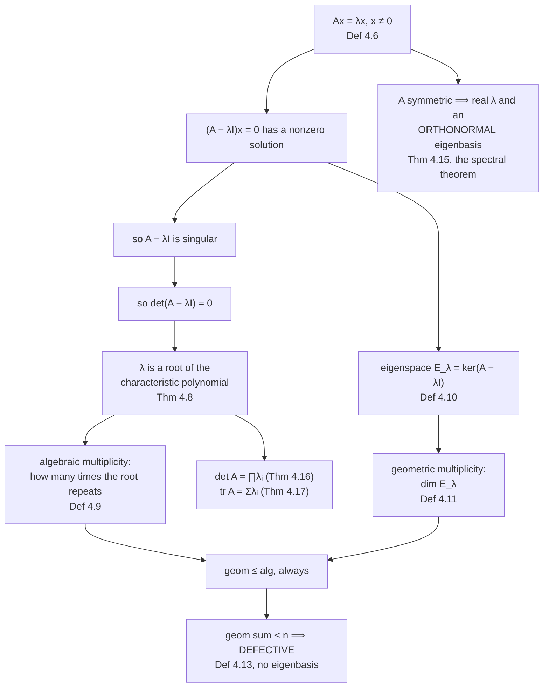

Most vectors, hit by a matrix, come out both turned and stretched. A few special ones come out **only
stretched** — same direction, different length. Those are the **eigenvectors**, and the stretch factors
are the **eigenvalues**.

The word is German: *eigen* means "characteristic", "self" or "own". These are the matrix's own
directions, and finding them tells you what the matrix is actually doing, in a way that reading its
entries never does.

## What you'll learn

- Definition 4.6, the **eigenvalue equation**, and the four equivalent conditions for $\lambda$ to be an eigenvalue.
- The **characteristic polynomial** as the route to the eigenvalues (Theorem 4.8), and why it is not how anyone computes them.
- **Algebraic** against **geometric multiplicity** (Definitions 4.9 and 4.11), and what **defective** means (Definition 4.13).
- The **spectral theorem** (Theorem 4.15): symmetric matrices always have an orthonormal eigenbasis and real eigenvalues.
- Theorems 4.16 and 4.17: $\det\mathbf{A} = \prod\lambda_i$ and $\mathrm{tr}\,\mathbf{A} = \sum\lambda_i$.
- Why a rotation has **no real eigenvectors**, and why that is the right answer rather than a failure.
- **PageRank** as the dominant eigenvector of a transition matrix, with the measured convergence rate.

## Intuition: the directions a map does not turn

Take a matrix and feed it every direction on the unit circle. Watch the angle between $\mathbf{x}$ and
$\mathbf{A}\mathbf{x}$ as you sweep round.

For most directions that angle is nonzero: the matrix turned the vector. At a few special angles it
drops to zero (or to $180°$, which is the same line pointing the other way). Those are the eigenvector
directions, and the ratio of lengths there is the eigenvalue.

Three things follow immediately, and each is a theorem later:

- **There are at most $n$ of these directions**, because you cannot have more than $n$ independent directions in $\mathbb{R}^n$.
- **There can be fewer.** A shear turns every direction except one. A rotation turns *every* direction, so it has none at all — over the reals.
- **A negative eigenvalue is still an eigenvector**: the line is preserved, the arrow flips along it.



## The math

:::note[Definition 4.6 — Eigenvalue and eigenvector]
Let $\mathbf{A} \in \mathbb{R}^{n\times n}$. Then $\lambda \in \mathbb{R}$ is an **eigenvalue** of
$\mathbf{A}$ and $\mathbf{x} \in \mathbb{R}^n\setminus\{\mathbf{0}\}$ is the corresponding
**eigenvector** if

$$
\mathbf{A}\mathbf{x} = \lambda\mathbf{x}
\tag{4.25}
$$

This is the **eigenvalue equation**.
:::

The exclusion $\mathbf{x} \neq \mathbf{0}$ is not pedantry. $\mathbf{A}\mathbf{0} = \lambda\mathbf{0}$
holds for every $\lambda$, so without it every number would be an eigenvalue of every matrix.

### Four equivalent statements

$$
\lambda \text{ is an eigenvalue of } \mathbf{A}
\iff \exists\,\mathbf{x}\neq\mathbf{0}: \mathbf{A}\mathbf{x} = \lambda\mathbf{x}
\iff (\mathbf{A}-\lambda\mathbf{I})\mathbf{x} = \mathbf{0} \text{ nontrivially}
$$

$$
\iff \mathrm{rk}(\mathbf{A}-\lambda\mathbf{I}) < n
\iff \det(\mathbf{A}-\lambda\mathbf{I}) = 0
$$

Read that chain forwards and it is the derivation of the whole method. An eigenvector is a nonzero
solution of a homogeneous system, a homogeneous system has a nonzero solution exactly when its matrix is
rank-deficient, and a square matrix is rank-deficient exactly when its determinant vanishes (§4.1,
Theorem 4.3). So the eigenvalues are the roots of $\det(\mathbf{A}-\lambda\mathbf{I})$, which §4.1 named
the characteristic polynomial.

:::note[Theorem 4.8]
$\lambda \in \mathbb{R}$ is an eigenvalue of $\mathbf{A} \in \mathbb{R}^{n\times n}$ if and only if it
is a root of the characteristic polynomial $p_{\mathbf{A}}(\lambda)$.
:::

### Eigenvectors are not unique

:::note[Remark after Definition 4.7]
If $\mathbf{x}$ is an eigenvector of $\mathbf{A}$ with eigenvalue $\lambda$, then for any
$c \in \mathbb{R}\setminus\{0\}$,

$$
\mathbf{A}(c\mathbf{x}) = c\mathbf{A}\mathbf{x} = c\lambda\mathbf{x} = \lambda(c\mathbf{x})
\tag{4.26}
$$

so $c\mathbf{x}$ is an eigenvector with the **same** eigenvalue. Every vector **collinear** with
$\mathbf{x}$ is one too.
:::

An eigenvector is really a *direction*, or more precisely a line through the origin. Definition 4.7
distinguishes **codirected** (same direction) from **collinear** (same or opposite direction), and
eigenvectors come in collinear families. This is why libraries return unit vectors, and why their signs
are arbitrary — a fact that costs people reproducibility bugs in PCA plots.

### Eigenspaces and multiplicity

:::note[Definitions 4.9, 4.10, 4.11]
The **algebraic multiplicity** of $\lambda_i$ is the number of times it appears as a root of the
characteristic polynomial.

The **eigenspace** $E_\lambda$ is the set of all eigenvectors for $\lambda$, together with
$\mathbf{0}$ — it is the null space of $\mathbf{A}-\lambda\mathbf{I}$ (Equations 4.27a and 4.27b), hence a
subspace. The set of all eigenvalues is the **eigenspectrum**, or **spectrum**.

The **geometric multiplicity** of $\lambda_i$ is $\dim E_{\lambda_i}$: the number of linearly
independent eigenvectors associated with it.
:::

:::note[Remark after Definition 4.11]
The geometric multiplicity is **at least 1** (every eigenvalue has at least one eigenvector) and
**cannot exceed** the algebraic multiplicity — but it may be lower.
:::

That inequality is the entire subtlety of this section, and §4.4 depends on it.

### Defective matrices

:::note[Theorem 4.12 and Definition 4.13]
**Theorem 4.12.** The eigenvectors $\mathbf{x}_1,\dots,\mathbf{x}_n$ of a matrix with $n$ **distinct**
eigenvalues are linearly independent — so they form a basis of $\mathbb{R}^n$.

**Definition 4.13.** A square matrix is **defective** if it possesses fewer than $n$ linearly
independent eigenvectors.
:::

Distinct eigenvalues are sufficient for an eigenbasis, not necessary. What is required is that the
eigenspace dimensions add to $n$; a defective matrix has some $\lambda_i$ with algebraic multiplicity
$m > 1$ and geometric multiplicity below $m$. And the book's remark closes the loop: a defective matrix
cannot have $n$ distinct eigenvalues, since Theorem 4.12 would then give it a basis.

### Useful properties

- $\mathbf{A}$ and $\mathbf{A}^\top$ have the **same eigenvalues**, though generally different eigenvectors.
- $E_\lambda = \ker(\mathbf{A}-\lambda\mathbf{I})$.
- **Similar matrices have the same eigenvalues**, so the eigenvalues — like the determinant and the trace — characterise the *mapping*, not the representation.
- **Symmetric positive definite matrices always have positive, real eigenvalues.**

### Symmetrising, and the spectral theorem

:::note[Theorem 4.14]
For any $\mathbf{A} \in \mathbb{R}^{m\times n}$, the matrix

$$
\mathbf{S} := \mathbf{A}^\top\mathbf{A} \in \mathbb{R}^{n\times n}
\tag{4.36}
$$

is symmetric and positive **semi**definite. If $\mathrm{rk}(\mathbf{A}) = n$, it is positive definite.
:::

Both halves are one line. Symmetry:
$\mathbf{S}^\top = (\mathbf{A}^\top\mathbf{A})^\top = \mathbf{A}^\top(\mathbf{A}^\top)^\top = \mathbf{A}^\top\mathbf{A} = \mathbf{S}$.
Semidefiniteness: $\mathbf{x}^\top\mathbf{S}\mathbf{x} = (\mathbf{A}\mathbf{x})^\top(\mathbf{A}\mathbf{x}) = \lVert\mathbf{A}\mathbf{x}\rVert^2 \geq 0$
— a sum of squares.

This theorem is the hinge of §4.5. It says *any* matrix, of any shape, can be turned into a symmetric
one — and symmetric matrices have the best behaviour available:

:::note[Theorem 4.15 — Spectral theorem]
If $\mathbf{A} \in \mathbb{R}^{n\times n}$ is **symmetric**, there exists an **orthonormal basis** of
eigenvectors of $\mathbf{A}$, and **every eigenvalue is real**.
:::

Consequences, in order of usefulness: a symmetric matrix always diagonalises; the diagonalising matrix
can be taken **orthogonal**, so $\mathbf{A} = \mathbf{P}\mathbf{D}\mathbf{P}^\top$ with no inverse to
compute; and no complex arithmetic ever appears. Every result in Chapters 10 and 12 that assumes a
covariance or kernel matrix behaves nicely is cashing this theorem.

### Back to the determinant and the trace

:::note[Theorems 4.16 and 4.17]
$$
\det(\mathbf{A}) = \prod_{i=1}^{n}\lambda_i,
\qquad
\mathrm{tr}(\mathbf{A}) = \sum_{i=1}^{n}\lambda_i
$$

with the $\lambda_i$ possibly repeated.
:::

The geometry is in the book's Figure 4.6. Take an orthonormal eigenbasis $(\mathbf{x}_1,\mathbf{x}_2)$
of $\mathbb{R}^2$; the unit square they span has area $1$ and circumference $2(1+1)$. Applying
$\mathbf{A}$ sends them to $\lambda_1\mathbf{x}_1$ and $\lambda_2\mathbf{x}_2$, still orthogonal, so the
image is a rectangle of area $\lvert\lambda_1\lambda_2\rvert$ and circumference
$2(\lvert\lambda_1\rvert + \lvert\lambda_2\rvert)$. The determinant is the area change; the sum of the
absolute eigenvalues is the circumference change.

:::tip[From the book]
Section 4.2. Definition 4.6 with Equation 4.25 and the margin note on the German *eigen*; a Remark warns
that the book does **not** presume a descending ordering of eigenvalues unless stated. The four
equivalent statements follow, then Definition 4.7 (collinear and codirected) with the non-uniqueness
Remark and Equation 4.26. Theorem 4.8 links eigenvalues to polynomial roots; Definitions 4.9, 4.10 and
4.11 give algebraic multiplicity, eigenspace and eigenspectrum, and geometric multiplicity, with the
Remark bounding one by the other. Example 4.4 is the identity matrix; Example 4.5 (Equations 4.28 to
4.35) works a full $2\times2$; Example 4.6 is the defective $[[2,1],[0,2]]$. Figure 4.4 shows five
mappings. Theorem 4.12 and Definition 4.13 cover defectiveness; Theorem 4.14 (Equation 4.36) the
symmetrisation; Theorem 4.15 the spectral theorem, with Example 4.8 (Equations 4.37 to 4.41). Theorems
4.16 and 4.17 (Equations 4.42 and 4.43) return to §4.1, with Figure 4.6. Example 4.7 is the C. elegans
eigenspectrum and Example 4.9 is PageRank.
:::

## Worked example by hand

### Example 4.5 — the full procedure

$$
\mathbf{A} = \begin{bmatrix} 4 & 2\\ 1 & 3\end{bmatrix}
$$

**Step 1 — the characteristic polynomial.**

$$
p_{\mathbf{A}}(\lambda) = \det(\mathbf{A}-\lambda\mathbf{I})
= \begin{vmatrix} 4-\lambda & 2\\ 1 & 3-\lambda\end{vmatrix}
= (4-\lambda)(3-\lambda) - 2\cdot1
$$

**Step 2 — the eigenvalues.** Expand and factor:

$$
(4-\lambda)(3-\lambda) - 2 = 12 - 7\lambda + \lambda^2 - 2 = 10 - 7\lambda + \lambda^2 = (2-\lambda)(5-\lambda)
$$

giving $\lambda_1 = 2$ and $\lambda_2 = 5$.

Two free checks against §4.1: the constant term $10$ should be $\det\mathbf{A} = 4(3)-2(1) = 10$ ✓, and
the $\lambda$ coefficient $-7$ should be $-\mathrm{tr}\mathbf{A} = -(4+3)$ ✓. And Theorems 4.16 and 4.17:
$2 \times 5 = 10 = \det$, $2 + 5 = 7 = \mathrm{tr}$ ✓.

**Step 3 — the eigenspaces.** Solve $(\mathbf{A}-\lambda\mathbf{I})\mathbf{x} = \mathbf{0}$ for each.

For $\lambda = 5$:

$$
\begin{bmatrix} 4-5 & 2\\ 1 & 3-5\end{bmatrix}\mathbf{x}
= \begin{bmatrix} -1 & 2\\ 1 & -2\end{bmatrix}\mathbf{x} = \mathbf{0}
$$

Both rows say the same thing, $x_1 = 2x_2$, so

$$
E_5 = \mathrm{span}\!\left[\begin{bmatrix}2\\1\end{bmatrix}\right]
\tag{4.33}
$$

For $\lambda = 2$:

$$
\begin{bmatrix} 4-2 & 2\\ 1 & 3-2\end{bmatrix}\mathbf{x}
= \begin{bmatrix} 2 & 2\\ 1 & 1\end{bmatrix}\mathbf{x} = \mathbf{0}
$$

Both rows say $x_2 = -x_1$, so

$$
E_2 = \mathrm{span}\!\left[\begin{bmatrix}1\\-1\end{bmatrix}\right]
\tag{4.35}
$$

Both eigenspaces are one-dimensional. Their dimensions add to $2$, so the eigenvectors form a basis of
$\mathbb{R}^2$ and $\mathbf{A}$ is **not** defective.

**A sanity check that catches sign errors.**
$\mathbf{A}(2,1)^\top = (4\cdot2+2\cdot1,\ 1\cdot2+3\cdot1)^\top = (10,5)^\top = 5(2,1)^\top$ ✓.

### Example 4.6 — a defective matrix

$$
\mathbf{A} = \begin{bmatrix}2 & 1\\ 0 & 2\end{bmatrix}
$$

Triangular, so the determinant of $\mathbf{A}-\lambda\mathbf{I}$ is the product of its diagonal:
$p(\lambda) = (2-\lambda)^2$. One eigenvalue $\lambda = 2$, **algebraic multiplicity 2**.

$$
\mathbf{A}-2\mathbf{I} = \begin{bmatrix}0&1\\0&0\end{bmatrix}
$$

which has rank $1$, so its null space is one-dimensional: $x_2 = 0$, and

$$
E_2 = \mathrm{span}\!\left[\begin{bmatrix}1\\0\end{bmatrix}\right]
$$

**Geometric multiplicity 1.** One independent eigenvector where two are needed — the matrix is
defective, and §4.4's Theorem 4.20 will refuse to diagonalise it.

### Example 4.8 — the spectral theorem in action

$$
\mathbf{A} = \begin{bmatrix}3&2&2\\2&3&2\\2&2&3\end{bmatrix}
\tag{4.37}
$$

The characteristic polynomial is $p_{\mathbf{A}}(\lambda) = -(\lambda-1)^2(\lambda-7)$, so
$\lambda_1 = 1$ (repeated) and $\lambda_2 = 7$. The eigenspaces come out as

$$
E_1 = \mathrm{span}\!\left[\underbrace{\begin{bmatrix}-1\\1\\0\end{bmatrix}}_{\mathbf{x}_1}, \underbrace{\begin{bmatrix}-1\\0\\1\end{bmatrix}}_{\mathbf{x}_2}\right],
\qquad
E_7 = \mathrm{span}\!\left[\underbrace{\begin{bmatrix}1\\1\\1\end{bmatrix}}_{\mathbf{x}_3}\right]
\tag{4.39}
$$

Here $\lambda_1$ has algebraic multiplicity $2$ **and** geometric multiplicity $2$, so the matrix is not
defective. But look at the given basis of $E_1$: $\mathbf{x}_1^\top\mathbf{x}_2 = 1 \neq 0$, so
$\mathbf{x}_1$ and $\mathbf{x}_2$ are **not orthogonal**, even though $\mathbf{x}_3$ is orthogonal to
both.

The spectral theorem says an orthogonal basis exists, not that the one you happened to compute is it.
And the fix is available: by Equation 4.40, any linear combination of eigenvectors sharing an eigenvalue
is again an eigenvector for that eigenvalue,

$$
\mathbf{A}(\alpha\mathbf{x}_1 + \beta\mathbf{x}_2) = \lambda(\alpha\mathbf{x}_1 + \beta\mathbf{x}_2)
$$

so [Gram-Schmidt](../../chapter-03---analytic-geometry/orthonormal-basis/) applied **within** the
eigenspace produces an orthogonal pair. The book's result is

$$
\mathbf{x}_1' = \begin{bmatrix}-1\\1\\0\end{bmatrix},
\qquad
\mathbf{x}_2' = \tfrac{1}{2}\begin{bmatrix}-1\\-1\\2\end{bmatrix}
\tag{4.41}
$$

Check: $\mathbf{x}_1'^\top\mathbf{x}_2' = \tfrac12(1 - 1 + 0) = 0$ ✓, and
$\mathbf{x}_3^\top\mathbf{x}_2' = \tfrac12(-1-1+2) = 0$ ✓.

```python title="book_examples.py" showLineNumbers{1}
import numpy as np

def report(A, name):
    A = np.asarray(A, dtype=float)
    n = A.shape[0]
    vals = np.linalg.eigvals(A)
    print(f"{name}: eigenvalues {np.round(vals, 6)}")
    print(f"    det {float(np.linalg.det(A)):+.6f} = prod {float(np.prod(vals).real):+.6f}   "
          f"trace {float(np.trace(A)):+.6f} = sum {float(np.sum(vals).real):+.6f}")
    total = 0
    for lam in np.unique(np.round(np.real(vals), 6)):
        alg = int(np.sum(np.abs(np.real(vals) - lam) < 1e-6))
        geo = n - np.linalg.matrix_rank(A - lam * np.eye(n), tol=1e-8)
        total += geo
        print(f"    lambda {lam:+.4f}: algebraic {alg}, geometric {geo}")
    print(f"    eigenspace dimensions sum to {total} of {n} -> "
          f"{'defective' if total < n else 'has an eigenbasis'}")

report([[4, 2], [1, 3]], "Example 4.5")
report([[2, 1], [0, 2]], "Example 4.6")
report([[3, 2, 2], [2, 3, 2], [2, 2, 3]], "Example 4.8")

# Example 4.8's non-orthogonal eigenbasis, and the orthogonal one.
x1, x2, x3 = np.array([-1.0, 1, 0]), np.array([-1.0, 0, 1]), np.array([1.0, 1, 1])
print()
print("given basis of E_1: x1.x2 =", float(x1 @ x2), " (not orthogonal)")
x2p = 0.5 * np.array([-1.0, -1.0, 2.0])
print("after Gram-Schmidt: x1.x2' =", float(x1 @ x2p), "  x3.x2' =", float(x3 @ x2p))
A8 = np.array([[3.0, 2, 2], [2, 3, 2], [2, 2, 3]])
for v, nm in ((x1, "x1"), (x2p, "x2'"), (x3, "x3")):
    lam = float((A8 @ v) @ v) / float(v @ v)
    print(f"  A {nm} = {lam:.6f} * {nm}, residual "
          f"{float(np.linalg.norm(A8 @ v - lam * v)):.2e}")
```

```text title="output"
Example 4.5: eigenvalues [5. 2.]
    det +10.000000 = prod +10.000000   trace +7.000000 = sum +7.000000
    lambda +2.0000: algebraic 1, geometric 1
    lambda +5.0000: algebraic 1, geometric 1
    eigenspace dimensions sum to 2 of 2 -> has an eigenbasis
Example 4.6: eigenvalues [2. 2.]
    det +4.000000 = prod +4.000000   trace +4.000000 = sum +4.000000
    lambda +2.0000: algebraic 2, geometric 1
    eigenspace dimensions sum to 1 of 2 -> defective
Example 4.8: eigenvalues [1. 7. 1.]
    det +7.000000 = prod +7.000000   trace +9.000000 = sum +9.000000
    lambda +1.0000: algebraic 2, geometric 2
    lambda +7.0000: algebraic 1, geometric 1
    eigenspace dimensions sum to 3 of 3 -> has an eigenbasis

given basis of E_1: x1.x2 = 1.0  (not orthogonal)
after Gram-Schmidt: x1.x2' = 0.0   x3.x2' = 0.0
  A x1 = 1.000000 * x1, residual 0.00e+00
  A x2' = 1.000000 * x2', residual 0.00e+00
  A x3 = 7.000000 * x3, residual 0.00e+00
```

Every book number reproduced, and note the residuals: **exactly zero**, not $10^{-16}$, because these
are integer matrices acting on integer and half-integer vectors.

## See it move

The first sketch is the definition, swept. Drag round the circle and watch the angle between
$\mathbf{x}$ and $\mathbf{A}\mathbf{x}$ collapse at the eigendirections.

```p5 title="Eigenvectors are where the turning stops" desc="Drag the white vector around the circle. The blue arrow is Ax. The readout is the angle between them, and the meter at the bottom is that angle as a function of direction — it touches zero exactly at the eigenvector directions, marked in amber. Change the matrix entries and watch the zeros move, merge, or disappear entirely." height="560"
let ang = 0.55;
let a11 = 2.0, a12 = 1.0, a21 = 1.0, a22 = 3.0;
let KNOBS = [], dragging = null, dragVec = false;
const U = 62;
let cx, cy;

function setup() { createCanvas(600, 560); textFont("monospace"); cx = 200; cy = 175; }

function sx(x) { return cx + x * U; }
function sy(y) { return cy - y * U; }

function apply(v) { return [a11 * v[0] + a12 * v[1], a21 * v[0] + a22 * v[1]]; }

function turnAt(t) {
  const v = [Math.cos(t), Math.sin(t)];
  const w = apply(v);
  const nw = Math.hypot(w[0], w[1]);
  if (nw < 1e-9) return 0;
  const c = (v[0] * w[0] + v[1] * w[1]) / nw;
  // The unsigned angle to the LINE, so a negative eigenvalue reads as zero turn.
  return Math.acos(Math.min(1, Math.abs(c)));
}

function knob(id, x, y, w, value, mn, mx, label) {
  KNOBS.push({ id, x, y, w, mn, mx });
  const t = (value - mn) / (mx - mn);
  stroke(60, 74, 92); strokeWeight(2); line(x, y, x + w, y);
  noStroke(); fill(255, 211, 67); ellipse(x + t * w, y, 10, 10);
  fill(190, 200, 212); textSize(11); textAlign(LEFT, CENTER);
  text(label, x + w + 10, y);
}
function mousePressed() {
  for (const k of KNOBS) {
    if (mouseY > k.y - 11 && mouseY < k.y + 11 && mouseX > k.x - 11 && mouseX < k.x + k.w + 11) {
      dragging = k; return;
    }
  }
  if (Math.hypot(mouseX - sx(Math.cos(ang)), mouseY - sy(Math.sin(ang))) < 24) dragVec = true;
}
function mouseReleased() { dragging = null; dragVec = false; }
function mouseDragged() {
  if (dragging) {
    const t = Math.min(1, Math.max(0, (mouseX - dragging.x) / dragging.w));
    const v = dragging.mn + t * (dragging.mx - dragging.mn);
    if (dragging.id === "a11") a11 = v;
    if (dragging.id === "a12") a12 = v;
    if (dragging.id === "a21") a21 = v;
    if (dragging.id === "a22") a22 = v;
  } else if (dragVec) {
    ang = Math.atan2(cy - mouseY, mouseX - cx);
  }
  if (!isLooping()) redraw();
}

function arrow(x1, y1, x2, y2, c, w) {
  stroke(c); strokeWeight(w); line(x1, y1, x2, y2);
  push(); translate(x2, y2); rotate(Math.atan2(y2 - y1, x2 - x1));
  fill(c); noStroke(); triangle(0, 0, -9, -4, -9, 4); pop();
}

function draw() {
  background(13, 17, 23);
  KNOBS = [];

  stroke(32, 44, 58); strokeWeight(1);
  for (let g = -3; g <= 4; g++) line(sx(g), sy(-2.6), sx(g), sy(2.6));
  for (let g = -2; g <= 2; g++) line(sx(-3), sy(g), sx(4), sy(g));
  stroke(58, 72, 88); strokeWeight(1.2);
  line(sx(-3), sy(0), sx(4), sy(0)); line(sx(0), sy(-2.6), sx(0), sy(2.6));
  noFill(); stroke(70, 84, 100); strokeWeight(1.1); ellipse(sx(0), sy(0), 2 * U, 2 * U);

  // Eigen-analysis in closed form for 2x2.
  const tr = a11 + a22, dt = a11 * a22 - a12 * a21;
  const disc = tr * tr - 4 * dt;
  const real = disc >= 0;
  const l1 = real ? (tr - Math.sqrt(disc)) / 2 : 0;
  const l2 = real ? (tr + Math.sqrt(disc)) / 2 : 0;

  // Eigendirections, drawn as lines.
  if (real) {
    for (const l of [l1, l2]) {
      // (A - lI) v = 0. Use whichever row is not degenerate.
      let v;
      if (Math.abs(a12) > 1e-9) v = [a12, l - a11];
      else if (Math.abs(a21) > 1e-9) v = [l - a22, a21];
      else v = Math.abs(l - a11) < 1e-9 ? [1, 0] : [0, 1];
      const nv = Math.hypot(v[0], v[1]);
      if (nv < 1e-9) continue;
      v = [v[0] / nv, v[1] / nv];
      stroke(255, 211, 67, 150); strokeWeight(2);
      line(sx(-4 * v[0]), sy(-4 * v[1]), sx(4 * v[0]), sy(4 * v[1]));
      noStroke(); fill(255, 211, 67); ellipse(sx(v[0]), sy(v[1]), 8, 8);
    }
  }

  const v = [Math.cos(ang), Math.sin(ang)];
  const w = apply(v);
  arrow(sx(0), sy(0), sx(v[0]), sy(v[1]), color(245), 2.6);
  arrow(sx(0), sy(0), sx(w[0]), sy(w[1]), color(75, 139, 190), 2.6);
  noStroke(); fill(255); ellipse(sx(v[0]), sy(v[1]), 12, 12);
  textSize(12); textAlign(LEFT, TOP);
  fill(245); text("x", sx(v[0]) + 9, sy(v[1]) - 20);
  fill(75, 139, 190); text("Ax", sx(w[0]) + 9, sy(w[1]) - 20);

  const turn = turnAt(ang) * 180 / Math.PI;
  const ratio = Math.hypot(w[0], w[1]);

  // The turning meter: angle to the line, over all directions.
  const mx0 = 40, my0 = 400, mw = 400, mh = 62;
  stroke(60, 74, 92); strokeWeight(1); noFill(); rect(mx0, my0, mw, mh);
  noFill(); stroke(197, 153, 255); strokeWeight(2);
  beginShape();
  for (let i = 0; i <= 300; i++) {
    const t = (i / 300) * Math.PI;
    const y = my0 + mh - (turnAt(t) / (Math.PI / 2)) * mh;
    vertex(mx0 + (i / 300) * mw, y);
  }
  endShape();
  stroke(120, 200, 140); strokeWeight(1); line(mx0, my0 + mh, mx0 + mw, my0 + mh);
  // Where we are on the meter.
  let at = ang % Math.PI; if (at < 0) at += Math.PI;
  stroke(245); strokeWeight(1.4);
  line(mx0 + (at / Math.PI) * mw, my0, mx0 + (at / Math.PI) * mw, my0 + mh);
  noStroke(); fill(150); textSize(10); textAlign(LEFT, TOP);
  text("angle between x and the line through Ax, over all directions", mx0, my0 + mh + 6);
  text("0 deg", mx0 - 34, my0 + mh - 6); text("90", mx0 - 20, my0 - 4);

  knob("a11", 40, 250, 110, a11, -3, 4, `${a11.toFixed(2)}`);
  knob("a12", 210, 250, 110, a12, -3, 4, `${a12.toFixed(2)}`);
  knob("a21", 40, 276, 110, a21, -3, 4, `${a21.toFixed(2)}`);
  knob("a22", 210, 276, 110, a22, -3, 4, `${a22.toFixed(2)}`);

  noStroke(); textAlign(LEFT, TOP);
  fill(255, 211, 67); textSize(14); text("Drag x round the circle, or edit A", 20, 14);
  fill(215); textSize(11);
  text(`turn = ${turn.toFixed(4)} deg     ||Ax||/||x|| = ${ratio.toFixed(4)}`, 340, 300);
  fill(turn < 0.05 ? color(120, 200, 140) : color(150)); textSize(11);
  text(turn < 0.05 ? "EIGENVECTOR: no turning at all" : "not an eigenvector", 340, 322);
  fill(215); textSize(11);
  text(`trace ${tr.toFixed(3)}  det ${dt.toFixed(3)}`, 340, 200);
  if (real) {
    text(`lambda = ${l1.toFixed(4)}, ${l2.toFixed(4)}`, 340, 222);
    fill(150); textSize(10);
    text(`product ${(l1 * l2).toFixed(4)} = det`, 340, 244);
    text(`sum ${(l1 + l2).toFixed(4)} = trace`, 340, 258);
  } else {
    fill(232, 110, 110);
    text("discriminant < 0: complex pair", 340, 222);
    fill(150); textSize(10);
    text("no real eigenvector, so the", 340, 244);
    text("meter never reaches zero", 340, 258);
  }
  fill(150); textSize(10);
  text("Amber lines: the eigendirections. Set a12 = a21 = 0 and they become the axes.", 20, 528);
  text("Make A a rotation — a11 = a22, a12 = -a21 — and both vanish.", 20, 544);
}
```

The second sketch plots the characteristic polynomial itself, so the roots are visible and the complex
case is visibly a curve that misses the axis.

```p5 title="The characteristic polynomial and its roots" desc="Edit the matrix and watch p(lambda) = det(A - lambda I) deform. Its roots — the crossings of the horizontal axis — are the eigenvalues. Push the entries towards a rotation and the parabola lifts clear of the axis: no real roots, no real eigenvectors, and the discriminant readout goes negative." height="520"
let a11 = 4.0, a12 = 2.0, a21 = 1.0, a22 = 3.0;
let KNOBS = [], dragging = null;

function setup() { createCanvas(600, 520); textFont("monospace"); }

function poly(l) { return (a11 - l) * (a22 - l) - a12 * a21; }

function knob(id, x, y, w, value, mn, mx, label) {
  KNOBS.push({ id, x, y, w, mn, mx });
  const t = (value - mn) / (mx - mn);
  stroke(60, 74, 92); strokeWeight(2); line(x, y, x + w, y);
  noStroke(); fill(255, 211, 67); ellipse(x + t * w, y, 10, 10);
  fill(190, 200, 212); textSize(11); textAlign(LEFT, CENTER);
  text(label, x + w + 10, y);
}
function mousePressed() {
  for (const k of KNOBS) {
    if (mouseY > k.y - 11 && mouseY < k.y + 11 && mouseX > k.x - 11 && mouseX < k.x + k.w + 11) {
      dragging = k; return;
    }
  }
}
function mouseReleased() { dragging = null; }
function mouseDragged() {
  if (!dragging) return;
  const t = Math.min(1, Math.max(0, (mouseX - dragging.x) / dragging.w));
  const v = dragging.mn + t * (dragging.mx - dragging.mn);
  if (dragging.id === "a11") a11 = v;
  if (dragging.id === "a12") a12 = v;
  if (dragging.id === "a21") a21 = v;
  if (dragging.id === "a22") a22 = v;
  if (!isLooping()) redraw();
}

function draw() {
  background(13, 17, 23);
  KNOBS = [];

  const L = 60, R = width - 40, T = 40, B = 300;
  const lmin = -3, lmax = 9;
  const px = l => L + ((l - lmin) / (lmax - lmin)) * (R - L);

  let vmax = 1;
  for (let i = 0; i <= 200; i++) {
    const l = lmin + (i / 200) * (lmax - lmin);
    vmax = Math.max(vmax, Math.abs(poly(l)));
  }
  const py = v => (T + B) / 2 - (v / vmax) * ((B - T) / 2);

  stroke(32, 44, 58); strokeWeight(1);
  for (let l = lmin; l <= lmax; l++) line(px(l), T, px(l), B);
  stroke(58, 72, 88); strokeWeight(1.4);
  line(L, py(0), R, py(0));
  line(px(0), T, px(0), B);
  noStroke(); fill(120); textSize(10); textAlign(CENTER, TOP);
  for (let l = lmin; l <= lmax; l += 2) text(String(l), px(l), py(0) + 6);
  textAlign(LEFT, TOP); text("p(lambda)", L + 4, T + 2);

  noFill(); stroke(75, 139, 190); strokeWeight(2.4);
  beginShape();
  for (let i = 0; i <= 400; i++) {
    const l = lmin + (i / 400) * (lmax - lmin);
    vertex(px(l), py(poly(l)));
  }
  endShape();

  const tr = a11 + a22, dt = a11 * a22 - a12 * a21;
  const disc = tr * tr - 4 * dt;
  const real = disc >= 0;

  if (real) {
    const r1 = (tr - Math.sqrt(disc)) / 2, r2 = (tr + Math.sqrt(disc)) / 2;
    for (const r of [r1, r2]) {
      noStroke(); fill(255, 211, 67); ellipse(px(r), py(0), 12, 12);
      fill(255, 211, 67); textSize(11); textAlign(CENTER, BOTTOM);
      text(r.toFixed(3), px(r), py(0) - 10);
    }
    if (Math.abs(r1 - r2) < 1e-6) {
      noStroke(); fill(232, 110, 110); textSize(11); textAlign(CENTER, TOP);
      text("a double root: check the geometric multiplicity", px(r1), py(0) + 22);
    }
  } else {
    noStroke(); fill(232, 110, 110); textSize(12); textAlign(CENTER, TOP);
    text("the curve never touches the axis: no real eigenvalues", (L + R) / 2, py(0) + 26);
  }

  knob("a11", 60, 350, 110, a11, -4, 6, `${a11.toFixed(2)}`);
  knob("a12", 260, 350, 110, a12, -4, 6, `${a12.toFixed(2)}`);
  knob("a21", 60, 376, 110, a21, -4, 6, `${a21.toFixed(2)}`);
  knob("a22", 260, 376, 110, a22, -4, 6, `${a22.toFixed(2)}`);

  noStroke(); textAlign(LEFT, TOP);
  fill(255, 211, 67); textSize(14); text("Edit A and watch its polynomial", 30, 12);
  fill(215); textSize(11);
  text(`p(lambda) = lambda^2 - ${tr.toFixed(3)} lambda + ${dt.toFixed(3)}`, 60, 424);
  text(`constant term ${dt.toFixed(4)} = det A     lambda coefficient ${(-tr).toFixed(4)} = -trace A`, 60, 444);
  fill(real ? color(120, 200, 140) : color(232, 110, 110)); textSize(11);
  text(`discriminant = trace^2 - 4 det = ${disc.toFixed(4)}`, 60, 468);
  fill(150); textSize(10);
  text("Equations 4.23 and 4.24: the two coefficients ARE the determinant and the trace.", 30, 494);
}
```

And the stepped version on the book's own Example 4.5, which runs the full three-step procedure and
checks both theorems:

<EigenLab
  client:visible
  matrix={[[4, 2], [1, 3]]}
  probe={[1, 0.35]}
  title="Example 4.5, step by step"
  desc="The dashed white arrow is a direction that is NOT an eigenvector, drawn beside its image so the turning is visible. The amber and blue lines are the two eigenspaces."
/>

Then the defective case, where the procedure runs to completion and the verdict changes:

<EigenLab
  client:visible
  matrix={[[2, 1], [0, 2]]}
  title="Example 4.6: one eigenvalue, one eigenvector, two needed"
  desc="Algebraic multiplicity 2 and geometric multiplicity 1. The last frame is the verdict: the eigenspaces do not add up to the dimension, so no eigenbasis exists."
/>

And the spectral theorem's case, with a repeated eigenvalue whose eigenspace is genuinely
two-dimensional:

<EigenLab
  client:visible
  matrix={[[3, 2, 2], [2, 3, 2], [2, 2, 3]]}
  title="Example 4.8: symmetric, repeated, and still diagonalisable"
  desc="Lambda = 1 has algebraic multiplicity 2 and geometric multiplicity 2, so the dimensions add to 3. Above two dimensions the stage shows the numbers rather than a misleading picture."
/>

## From scratch

```python title="eigen_from_scratch.py" showLineNumbers{1}
import numpy as np

def eigen_report(A, tol=1e-8):
    """Everything section 4.2 defines, computed and checked."""
    A = np.asarray(A, dtype=float)
    n = A.shape[0]
    vals = np.linalg.eigvals(A)

    out = {
        "spectrum": np.sort_complex(vals),
        "all_real": bool(np.all(np.abs(vals.imag) < 1e-12)),
        "det_matches_product": abs(float(np.linalg.det(A)) - float(np.real(np.prod(vals)))) < 1e-8,
        "trace_matches_sum": abs(float(np.trace(A)) - float(np.real(np.sum(vals)))) < 1e-8,
        "multiplicities": [],
    }
    total = 0
    for lam in np.unique(np.round(np.real(vals[np.abs(vals.imag) < 1e-12]), 8)):
        alg = int(np.sum(np.abs(np.real(vals) - lam) < 1e-6))
        geo = n - np.linalg.matrix_rank(A - lam * np.eye(n), tol=tol)
        total += geo
        out["multiplicities"].append((float(lam), alg, int(geo)))
    out["independent_eigenvectors"] = total
    out["defective"] = total < n
    return out

cases = {
    "Ex 4.5  [[4,2],[1,3]]": [[4, 2], [1, 3]],
    "Ex 4.6  [[2,1],[0,2]]": [[2, 1], [0, 2]],
    "Ex 4.8  3x3 symmetric": [[3, 2, 2], [2, 3, 2], [2, 2, 3]],
    "identity (Ex 4.4)":     np.eye(3),
    "rotation by 30 deg":    [[np.cos(np.pi / 6), -np.sin(np.pi / 6)],
                              [np.sin(np.pi / 6), np.cos(np.pi / 6)]],
    "A^T A for a 2x3 A":     np.array([[1.0, 0, 1], [-2, 1, 0]]).T @ np.array([[1.0, 0, 1], [-2, 1, 0]]),
}

for name, A in cases.items():
    r = eigen_report(A)
    mult = ", ".join(f"{l:+.2f}(a{a},g{g})" for l, a, g in r["multiplicities"])
    print(f"{name:24} real {str(r['all_real']):5} "
          f"det=prod {str(r['det_matches_product']):5} tr=sum {str(r['trace_matches_sum']):5} "
          f"defective {str(r['defective']):5}  {mult}")
```

```text title="output"
Ex 4.5  [[4,2],[1,3]]    real True  det=prod True  tr=sum True  defective False  +2.00(a1,g1), +5.00(a1,g1)
Ex 4.6  [[2,1],[0,2]]    real True  det=prod True  tr=sum True  defective True   +2.00(a2,g1)
Ex 4.8  3x3 symmetric    real True  det=prod True  tr=sum True  defective False  +1.00(a2,g2), +7.00(a1,g1)
identity (Ex 4.4)        real True  det=prod True  tr=sum True  defective False  +1.00(a3,g3)
rotation by 30 deg       real False det=prod True  tr=sum True  defective True   
A^T A for a 2x3 A        real True  det=prod True  tr=sum True  defective False  -0.00(a1,g1), +1.00(a1,g1), +6.00(a1,g1)
```

Four things to read off that table.

**Example 4.4, the identity.** $p_{\mathbf{I}}(\lambda) = (1-\lambda)^n$, so $\lambda = 1$ with
algebraic multiplicity $n$ — and geometric multiplicity $n$ too, because $\mathbf{I}\mathbf{x} = 1\mathbf{x}$
for *every* vector. The sole eigenspace $E_1$ spans all of $\mathbb{R}^n$ and every standard basis
vector is an eigenvector.

**The rotation.** `all_real` is `False`, the multiplicity list is empty, and it is reported defective —
correctly, because over the reals it has no eigenvectors at all. Note that `det=prod` and `tr=sum` still
hold: the complex eigenvalues $0.866 \pm 0.5i$ multiply to $1$ and add to $1.732$, both real, because
conjugate pairs cancel their imaginary parts.

**$\mathbf{A}^\top\mathbf{A}$.** Eigenvalues $0$, $1$, $6$ — all real and all non-negative, which is
Theorem 4.14. It is positive *semi*definite rather than definite here because the $2\times3$ matrix has
rank $2 < 3$, so one eigenvalue is exactly zero. Those numbers reappear in §4.5: the singular values are
$\sqrt{6}$ and $1$.

**Example 4.6.** Algebraic $2$, geometric $1$, defective — and `det=prod` still holds with the repeated
eigenvalue counted twice, $2 \times 2 = 4$.

## On real data

<Figure
  src="/images/mml/eigenvalues-and-eigenvectors/five-mappings"
  alt="A two-row grid of five panels. The top row shows the same colour-coded square grid of points five times; the bottom row shows each one after a different linear map, with eigenvector arrows drawn and eigenvalues and determinants printed."
  title="The book's Figure 4.4, rebuilt"
  caption="Five qualitatively different cases: two distinct real eigenvalues with det 1; a shear with a repeated eigenvalue and collinear eigenvectors; a rotation with a complex pair and no eigenvectors drawn; a map with a zero eigenvalue that collapses the plane to a line; and a shear-and-stretch with det 0.75."
/>

<Figure
  src="/images/mml/eigenvalues-and-eigenvectors/eigenspectrum-s-curve"
  alt="Two black-and-white adjacency-matrix images side by side, one showing a banded clustered structure and one showing uniform scatter, with a third panel plotting both sorted eigenvalue spectra and a measured shape profile."
  title="The shape of Example 4.7"
  caption="Synthetic networks, not the C. elegans data. Both are symmetrised as A plus A-transpose so every eigenvalue is real. The clustered spectrum drops from 0.75 to 0.26 of its range by the halfway index; the random one only reaches 0.39 — the knee is what local clustering produces."
/>

<Figure
  src="/images/mml/eigenvalues-and-eigenvectors/power-iteration-converges"
  alt="Left, a bar chart comparing a uniform starting distribution with the converged PageRank vector over six pages. Right, a log plot of the distance to that eigenvector against iteration count, with a dashed reference line at the eigenvalue ratio."
  title="Example 4.9: PageRank is an eigenvector"
  caption="Repeated multiplication by the transition matrix converges to the eigenvector of eigenvalue 1. The measured decay rate is 0.5719 against an eigenvalue ratio of 0.5755 — geometric convergence at exactly the rate the second eigenvalue predicts."
/>

## Reading the plot

**From the five mappings.** Every case in the table below is a real possibility you will meet, and the
figure has one of each:

| matrix | eigenvalues | determinant | what it does |
| --- | --- | --- | --- |
| $\mathrm{diag}(\tfrac12, 2)$ | $0.5$, $2$ | $1$ | stretches one axis, compresses the other; area preserved |
| $\begin{bmatrix}1&\tfrac12\\0&1\end{bmatrix}$ | $1$, $1$ | $1$ | a shear; **one** eigendirection, drawn twice in opposite directions |
| $\mathbf{R}(30°)$ | $0.866 \pm 0.5i$ | $1$ | a rotation; **no** real eigenvectors, so none are drawn |
| $\begin{bmatrix}1&-1\\-1&1\end{bmatrix}$ | $0$, $2$ | $0$ | collapses the plane onto a line; area zero |
| $\begin{bmatrix}1&\tfrac12\\\tfrac12&1\end{bmatrix}$ | $0.5$, $1.5$ | $0.75$ | shear and stretch; symmetric, so the eigenvectors are orthogonal |

The two to dwell on are the third and fourth. The **rotation** has determinant $1$ — it preserves area
perfectly — and yet has no eigenvectors, which shows that "well behaved" and "has eigenvectors" are
unrelated. The **collapsing** map has a zero eigenvalue, and a zero eigenvalue is exactly a nonzero
vector in the kernel: $\mathbf{A}\mathbf{x} = 0\mathbf{x} = \mathbf{0}$. So $\lambda = 0$ appearing in a
spectrum is the eigenvalue statement of singularity.

**From the eigenspectrum.** Both matrices are symmetrised as $\mathbf{A} + \mathbf{A}^\top$, exactly as
the book does for the C. elegans connectivity matrix, and for exactly the reason the book gives: the raw
connectivity matrix is not symmetric, so its eigenvalues need not be real. After symmetrising, Theorem
4.15 guarantees they are.

The shape measurement is the interesting part. Rescale each sorted spectrum to $[0,1]$ and read its
height at fixed index fractions: the clustered network gives $0.75, 0.38, 0.26, 0.16, 0.09$ and the
random one $0.65, 0.54, 0.39, 0.23, 0.12$. The random spectrum is close to a straight line; the clustered
one falls off a cliff and then flattens. That knee is the book's S-shape, and it comes from local
clustering rather than from anything biological.

**From PageRank.** The bar chart is the fixed point of $\mathbf{A}\mathbf{x} = \mathbf{x}$: page 3 gets
the most weight at $0.3636$ because everything links to it, and page 6 the least at $0.0519$. The book's
description is exact — the sequence $\mathbf{x}, \mathbf{A}\mathbf{x}, \mathbf{A}^2\mathbf{x}, \dots$
converges to an $\mathbf{x}^*$ with $\mathbf{A}\mathbf{x}^* = \mathbf{x}^*$, i.e. an eigenvector with
eigenvalue $1$.

The right panel measures the rate. $\lvert\lambda_1\rvert = 1$ exactly (the matrix is column-stochastic,
so it must be), $\lvert\lambda_2\rvert = 0.575482$, and the fitted decay rate over iterations $5$ to $35$
is $0.571911$. The error falls from $1.77\times10^{-1}$ at one iteration to $2.06\times10^{-15}$ at
sixty.

That ratio is the whole story of why PageRank was practical: the number of iterations you need depends
on the **spectral gap**, not on the size of the web. A gap of $0.575$ buys about one decimal digit every
four iterations regardless of how many pages there are.

## Pitfalls

:::danger[Nobody computes eigenvalues from the characteristic polynomial]
The polynomial is how the definition is *stated*. Finding its roots is badly conditioned — a tiny change
in a coefficient can move a root enormously, and for a repeated root the sensitivity is worse still. The
[EigenLab](#see-it-move) stepper on this page has to cluster and polish its roots precisely because a
double root lands about $10^{-8}$ off, and an eigenvalue $10^{-8}$ off makes
$\mathbf{A}-\lambda\mathbf{I}$ nonsingular, which collapses the eigenspace to nothing and reports a
diagonalisable matrix as defective. Real libraries use an iterative factorisation and never form the
polynomial.
:::

:::danger[np.linalg.eig returns complex arrays, and eigvalsh lies about non-symmetric input]
`eig` on a non-symmetric matrix returns `complex128` even when every eigenvalue happens to be real, so
downstream code that assumes floats breaks. `eigh`/`eigvalsh` are much faster and return real values —
because they **assume symmetry and read only the lower triangle**. Handed a non-symmetric matrix they
return confidently wrong answers with no warning. Check symmetry before choosing.
:::

:::caution[Geometric multiplicity is not numerically decidable]
It is the nullity of $\mathbf{A}-\lambda\mathbf{I}$, and nullity needs a rank tolerance. The
[Eigendecomposition](../eigendecomposition-and-diagonalization/) page measures matrices that are
defective *by construction* and still get reported non-defective about $5\%$ of the time, because a badly
conditioned conjugation makes the deficient eigenspace look full at any fixed tolerance. Treat
"defective" as a statement about exact arithmetic, not about a float.
:::

:::caution[Eigenvector signs and orderings are conventions, not facts]
Equation 4.26 says $c\mathbf{x}$ is an eigenvector whenever $\mathbf{x}$ is, so libraries pick a sign
arbitrarily. The book's own Remark adds that it does **not** assume eigenvalues are sorted, whereas
`numpy.linalg.eigh` returns them ascending and `eig` returns them in no documented order. If your output
depends on either — a PCA loading plot, a saved model, a regression test — impose your own convention.
:::

:::caution[A zero eigenvalue means singular; a small one does not mean nearly singular]
$\lambda = 0$ is exactly a nonzero kernel vector, so it is equivalent to $\det\mathbf{A} = 0$. But
eigenvalue magnitude is not a conditioning measure for a non-symmetric matrix: a matrix can have all
eigenvalues of modulus $1$ and be arbitrarily ill conditioned. The right measure is the ratio of
**singular** values, which is §4.5.
:::

:::caution[Symmetric matrices give orthogonal eigenvectors — but not the ones you computed]
Example 4.8 is the trap. Its repeated eigenvalue has a genuinely two-dimensional eigenspace, and the
natural basis for it that falls out of elimination is $\mathbf{x}_1^\top\mathbf{x}_2 = 1 \neq 0$ — not
orthogonal. The spectral theorem promises an orthogonal basis *exists*; getting one requires
Gram-Schmidt **within** each repeated eigenspace, licensed by Equation 4.40.
:::

## Compare

| quantity | what it is | basis independent? | how many |
| --- | --- | --- | --- |
| eigenvalue | a scale factor $\lambda$ with $\mathbf{A}\mathbf{x} = \lambda\mathbf{x}$ | **yes** | at most $n$ distinct |
| eigenvector | a direction the matrix only scales | no (it moves with the basis) | a whole line per eigenvalue, at least |
| eigenspace $E_\lambda$ | $\ker(\mathbf{A}-\lambda\mathbf{I})$ | as a subspace, yes | one per eigenvalue |
| algebraic multiplicity | root multiplicity in $p_{\mathbf{A}}$ | yes | sums to exactly $n$ over $\mathbb{C}$ |
| geometric multiplicity | $\dim E_\lambda$ | yes | between $1$ and the algebraic multiplicity |
| eigenspectrum | the set of all eigenvalues | yes | — |

<Quiz
  title="Check your understanding"
  questions={[
    {
      q: "Why does Definition 4.6 insist the eigenvector be nonzero?",
      options: [
        "For notational tidiness",
        "Because A times the zero vector equals lambda times the zero vector for every lambda — without the exclusion, every number would be an eigenvalue of every matrix",
        "Because the zero vector has no direction",
        "Because the determinant would be zero",
      ],
      answer: 1,
      explain:
        "The same reason forces the eigenspace to be defined as the eigenvectors TOGETHER WITH zero: the eigenvectors alone are not a subspace, since they exclude the origin.",
    },
    {
      q: "A 3x3 matrix has one eigenvalue with algebraic multiplicity 2 and geometric multiplicity 1, plus one simple eigenvalue. What follows?",
      options: [
        "It is diagonalisable",
        "The eigenspace dimensions add to 2 out of 3, so there is no eigenbasis, the matrix is defective, and Theorem 4.20 will refuse to diagonalise it",
        "Its determinant is zero",
        "It has complex eigenvalues",
      ],
      answer: 1,
      explain:
        "That is the book's Exercise 4.6(a) exactly: eigenvalues 1 (twice, one eigenvector) and 5. The geometric multiplicity can never exceed the algebraic one and here it is strictly less.",
    },
    {
      q: "A rotation by 30 degrees has determinant 1 and no real eigenvectors. What does that combination show?",
      options: [
        "That the determinant was computed wrongly",
        "That being well behaved and having eigenvectors are unrelated — the map is invertible, area-preserving and perfectly conditioned, and still fixes no direction, because its eigenvalues are the complex pair 0.866 plus or minus 0.5i",
        "That rotations are singular",
        "That the eigenvalues must be zero",
      ],
      answer: 1,
      explain:
        "The determinant and trace theorems still hold: the conjugate pair multiplies to 1 and adds to 1.732, both real, because the imaginary parts cancel.",
    },
    {
      q: "In the PageRank measurement, the error decays at 0.5719 per iteration against an eigenvalue ratio of 0.5755. What does that rate depend on?",
      options: [
        "The number of pages",
        "The spectral gap — the ratio of the second-largest to the largest eigenvalue modulus — and not on the size of the graph at all",
        "The starting vector",
        "The number of links per page",
      ],
      answer: 1,
      explain:
        "That independence from size is why the method scaled. A gap of 0.575 buys roughly one decimal digit every four iterations whether the graph has six nodes or six billion.",
    },
    {
      q: "Theorem 4.14 says A-transpose A is symmetric and positive semidefinite for any A. Why does the chapter need that?",
      options: [
        "To compute determinants faster",
        "Because it turns any matrix, of any shape, into a symmetric one — and the spectral theorem then gives that symmetric matrix a real orthonormal eigenbasis, which is exactly how section 4.5 constructs the SVD",
        "Because it makes A invertible",
        "To prove Theorem 4.12",
      ],
      answer: 1,
      explain:
        "Both halves are one line: symmetry from transposing the product, and semidefiniteness because x-transpose A-transpose A x is the squared length of Ax. Measured on a 2x3 matrix, the eigenvalues of A-transpose A come out 0, 1 and 6 — non-negative, with a zero because the rank is only 2.",
    },
  ]}
/>

## 🧪 Try It Yourself

### Exercise 1 – Example 4.5 by hand

<DataCampExercise
  lang="python"
  hint={`The characteristic polynomial of a 2x2 is lambda squared minus the trace times lambda plus the determinant. Solve it, then find the null space of A minus lambda I for each root.`}
  code={`import numpy as np

A = np.array([[4.0, 2.0], [1.0, 3.0]])
tr, det = float(np.trace(A)), float(np.linalg.det(A))
print(f"p(lambda) = lambda^2 - {tr:.0f} lambda + {det:.0f}")

disc = tr * tr - 4 * det
l1 = (tr - np.sqrt(disc)) / 2
l2 = (tr + np.sqrt(disc)) / 2
print("eigenvalues:", l1, l2)
print("product =", l1 * l2, "= det?", np.isclose(l1 * l2, det))
print("sum     =", l1 + l2, "= trace?", np.isclose(l1 + l2, ___))   # replace ___ with tr

for lam, expect in ((l2, [2.0, 1.0]), (l1, [1.0, -1.0])):
    S = A - lam * np.eye(2)
    v = np.array(expect)
    print(f"lambda {lam:.0f}: A - lambda I =", S.tolist(),
          " A v - lambda v =", (A @ v - lam * v).tolist())

# -- Expected output ------------------------------
# p(lambda) = lambda^2 - 7 lambda + 10
# eigenvalues: 2.000000000000001 4.999999999999999
# product = 10.000000000000002 = det? True
# sum     = 7.0 = trace? True
# lambda 5: A - lambda I = [[-0.9999999999999991, 2.0], [1.0, -1.9999999999999991]]  A v - lambda v = [1.7763568394002505e-15, 8.881784197001252e-16]
# lambda 2: A - lambda I = [[1.9999999999999991, 2.0], [1.0, 0.9999999999999991]]  A v - lambda v = [-8.881784197001252e-16, 8.881784197001252e-16]
# -------------------------------------------------`}
  solution={`import numpy as np

A = np.array([[4.0, 2.0], [1.0, 3.0]])
tr, det = float(np.trace(A)), float(np.linalg.det(A))
print(f"p(lambda) = lambda^2 - {tr:.0f} lambda + {det:.0f}")

disc = tr * tr - 4 * det
l1 = (tr - np.sqrt(disc)) / 2
l2 = (tr + np.sqrt(disc)) / 2
print("eigenvalues:", l1, l2)
print("product =", l1 * l2, "= det?", np.isclose(l1 * l2, det))
print("sum     =", l1 + l2, "= trace?", np.isclose(l1 + l2, tr))

for lam, expect in ((l2, [2.0, 1.0]), (l1, [1.0, -1.0])):
    S = A - lam * np.eye(2)
    v = np.array(expect)
    print(f"lambda {lam:.0f}: A - lambda I =", S.tolist(),
          " A v - lambda v =", (A @ v - lam * v).tolist())`}
  sct={`test_output_contains("p(lambda) = lambda^2 - 7 lambda + 10")
success_msg("Both rows of A minus lambda I say the same thing in each case — that is what rank deficiency looks like. Note the eigenvalues come out as 2.000000000000001 and 4.999999999999999 rather than exact integers: the quadratic formula goes through a square root, so even this closed form carries floating-point residue, and the residuals land at 1e-15 rather than at zero.")`}
  height={300}
/>

### Exercise 2 – Algebraic against geometric multiplicity

<DataCampExercise
  lang="python"
  hint={`Algebraic multiplicity counts repeats among the eigenvalues. Geometric multiplicity is n minus the rank of A minus lambda I.`}
  code={`import numpy as np

cases = {
    "[[4,2],[1,3]]":        [[4.0, 2], [1, 3]],
    "[[2,1],[0,2]]":        [[2.0, 1], [0, 2]],
    "3x3 symmetric":        [[3.0, 2, 2], [2, 3, 2], [2, 2, 3]],
    "identity 3x3":         np.eye(3),
    "[[2,3,0],[1,4,3],[0,0,1]]": [[2.0, 3, 0], [1, 4, 3], [0, 0, 1]],
}

for name, A in cases.items():
    A = np.asarray(A, dtype=float)
    n = A.shape[0]
    vals = np.real(np.linalg.eigvals(A))
    total = 0
    parts = []
    for lam in np.unique(np.round(vals, 6)):
        alg = int(np.sum(np.abs(vals - lam) < 1e-6))
        geo = n - np.linalg.matrix_rank(A - lam * np.eye(___), tol=1e-8)   # replace ___ with n
        total += geo
        parts.append(f"{lam:+.0f}(a{alg},g{geo})")
    print(f"{name:28} {' '.join(parts):28} sum {total}/{n} "
          f"{'DEFECTIVE' if total < n else 'eigenbasis'}")

# -- Expected output ------------------------------
# [[4,2],[1,3]]                +2(a1,g1) +5(a1,g1)          sum 2/2 eigenbasis
# [[2,1],[0,2]]                +2(a2,g1)                    sum 1/2 DEFECTIVE
# 3x3 symmetric                +1(a2,g2) +7(a1,g1)          sum 3/3 eigenbasis
# identity 3x3                 +1(a3,g3)                    sum 3/3 eigenbasis
# [[2,3,0],[1,4,3],[0,0,1]]    +1(a2,g1) +5(a1,g1)          sum 2/3 DEFECTIVE
# -------------------------------------------------`}
  solution={`import numpy as np

cases = {
    "[[4,2],[1,3]]":        [[4.0, 2], [1, 3]],
    "[[2,1],[0,2]]":        [[2.0, 1], [0, 2]],
    "3x3 symmetric":        [[3.0, 2, 2], [2, 3, 2], [2, 2, 3]],
    "identity 3x3":         np.eye(3),
    "[[2,3,0],[1,4,3],[0,0,1]]": [[2.0, 3, 0], [1, 4, 3], [0, 0, 1]],
}

for name, A in cases.items():
    A = np.asarray(A, dtype=float)
    n = A.shape[0]
    vals = np.real(np.linalg.eigvals(A))
    total = 0
    parts = []
    for lam in np.unique(np.round(vals, 6)):
        alg = int(np.sum(np.abs(vals - lam) < 1e-6))
        geo = n - np.linalg.matrix_rank(A - lam * np.eye(n), tol=1e-8)
        total += geo
        parts.append(f"{lam:+.0f}(a{alg},g{geo})")
    print(f"{name:28} {' '.join(parts):28} sum {total}/{n} "
          f"{'DEFECTIVE' if total < n else 'eigenbasis'}")`}
  sct={`test_output_contains("+2(a2,g1)")
success_msg("The repeated eigenvalue is the whole question. In the 3x3 symmetric case algebraic 2 comes with geometric 2 and all is well; in the last case algebraic 2 comes with geometric 1 and the matrix is defective.")`}
  height={330}
/>

### Exercise 3 – The rotation has no real eigenvectors

<DataCampExercise
  lang="python"
  hint={`Compute the discriminant of the characteristic polynomial. For a rotation the trace is 2 cos theta and the determinant is 1.`}
  code={`import numpy as np

for deg in (0, 30, 90, 180):
    th = np.radians(deg)
    R = np.array([[np.cos(th), -np.sin(th)], [np.sin(th), np.cos(th)]])
    tr, det = float(np.trace(R)), float(np.linalg.det(R))
    disc = tr * tr - 4 * ___                        # replace ___ with det
    vals = np.linalg.eigvals(R)
    print(f"{deg:4}deg  trace {tr:+.4f}  det {det:+.4f}  discriminant {disc:+.4f}  "
          f"eigenvalues {np.round(vals, 4)}  real {bool(np.all(np.abs(vals.imag) < 1e-12))}")

print()
print("and the two theorems still hold for the 30-degree case:")
th = np.radians(30.0)
R = np.array([[np.cos(th), -np.sin(th)], [np.sin(th), np.cos(th)]])
v = np.linalg.eigvals(R)
print("  product of eigenvalues:", round(float(np.real(np.prod(v))), 12), " det:", round(float(np.linalg.det(R)), 12))
print("  sum of eigenvalues:    ", round(float(np.real(np.sum(v))), 12), " trace:", round(float(np.trace(R)), 12))

# -- Expected output ------------------------------
#    0deg  trace +2.0000  det +1.0000  discriminant +0.0000  eigenvalues [1. 1.]  real True
#   30deg  trace +1.7321  det +1.0000  discriminant -1.0000  eigenvalues [0.866+0.5j 0.866-0.5j]  real False
#   90deg  trace +0.0000  det +1.0000  discriminant -4.0000  eigenvalues [0.+1.j 0.-1.j]  real False
#  180deg  trace -2.0000  det +1.0000  discriminant +0.0000  eigenvalues [-1.+0.j -1.-0.j]  real True
#
# and the two theorems still hold for the 30-degree case:
#   product of eigenvalues: 1.0  det: 1.0
#   sum of eigenvalues:     1.732050807569  trace: 1.732050807569
# -------------------------------------------------`}
  solution={`import numpy as np

for deg in (0, 30, 90, 180):
    th = np.radians(deg)
    R = np.array([[np.cos(th), -np.sin(th)], [np.sin(th), np.cos(th)]])
    tr, det = float(np.trace(R)), float(np.linalg.det(R))
    disc = tr * tr - 4 * det
    vals = np.linalg.eigvals(R)
    print(f"{deg:4}deg  trace {tr:+.4f}  det {det:+.4f}  discriminant {disc:+.4f}  "
          f"eigenvalues {np.round(vals, 4)}  real {bool(np.all(np.abs(vals.imag) < 1e-12))}")

print()
print("and the two theorems still hold for the 30-degree case:")
th = np.radians(30.0)
R = np.array([[np.cos(th), -np.sin(th)], [np.sin(th), np.cos(th)]])
v = np.linalg.eigvals(R)
print("  product of eigenvalues:", round(float(np.real(np.prod(v))), 12), " det:", round(float(np.linalg.det(R)), 12))
print("  sum of eigenvalues:    ", round(float(np.real(np.sum(v))), 12), " trace:", round(float(np.trace(R)), 12))`}
  sct={`test_output_contains("real False")
success_msg("The discriminant is trace squared minus four, which is negative for every angle except 0 and 180 — the only two rotations that fix a direction. And the determinant and trace theorems survive complex eigenvalues, because conjugate pairs cancel their imaginary parts.")`}
  height={340}
/>

### Exercise 4 – Fix Example 4.8's non-orthogonal eigenbasis

<DataCampExercise
  lang="python"
  hint={`Equation 4.40 says any combination of eigenvectors sharing an eigenvalue is again one, so Gram-Schmidt inside the eigenspace is legal. Subtract the projection of x2 onto x1.`}
  code={`import numpy as np

A = np.array([[3.0, 2, 2], [2, 3, 2], [2, 2, 3]])
x1 = np.array([-1.0, 1.0, 0.0])
x2 = np.array([-1.0, 0.0, 1.0])
x3 = np.array([1.0, 1.0, 1.0])

print("both in E_1?",
      np.allclose(A @ x1, 1 * x1), np.allclose(A @ x2, 1 * x2))
print("x1 . x2 =", float(x1 @ x2), " -> not orthogonal")

# Gram-Schmidt inside the eigenspace.
x2p = x2 - (float(x1 @ x2) / float(x1 @ x1)) * ___       # replace ___ with x1
print("x2' =", x2p, " = 0.5 * (-1, -1, 2)?", np.allclose(x2p, 0.5 * np.array([-1.0, -1, 2])))
print("x1 . x2' =", float(x1 @ x2p), "   x3 . x2' =", float(x3 @ x2p))
print("still an eigenvector?", np.allclose(A @ x2p, 1 * x2p))

Q = np.stack([x1 / np.linalg.norm(x1), x2p / np.linalg.norm(x2p), x3 / np.linalg.norm(x3)], axis=1)
print("Q^T Q = I to", f"{float(np.abs(Q.T @ Q - np.eye(3)).max()):.2e}")
print("Q^T A Q =")
print(np.round(Q.T @ A @ Q, 10))

# -- Expected output ------------------------------
# both in E_1? True True
# x1 . x2 = 1.0  -> not orthogonal
# x2' = [-0.5 -0.5  1. ]  = 0.5 * (-1, -1, 2)? True
# x1 . x2' = 0.0    x3 . x2' = 0.0
# still an eigenvector? True
# Q^T Q = I to 2.22e-16
# Q^T A Q =
# [[ 1.  0.  0.]
#  [-0.  1.  0.]
#  [ 0. -0.  7.]]
# -------------------------------------------------`}
  solution={`import numpy as np

A = np.array([[3.0, 2, 2], [2, 3, 2], [2, 2, 3]])
x1 = np.array([-1.0, 1.0, 0.0])
x2 = np.array([-1.0, 0.0, 1.0])
x3 = np.array([1.0, 1.0, 1.0])

print("both in E_1?",
      np.allclose(A @ x1, 1 * x1), np.allclose(A @ x2, 1 * x2))
print("x1 . x2 =", float(x1 @ x2), " -> not orthogonal")

x2p = x2 - (float(x1 @ x2) / float(x1 @ x1)) * x1
print("x2' =", x2p, " = 0.5 * (-1, -1, 2)?", np.allclose(x2p, 0.5 * np.array([-1.0, -1, 2])))
print("x1 . x2' =", float(x1 @ x2p), "   x3 . x2' =", float(x3 @ x2p))
print("still an eigenvector?", np.allclose(A @ x2p, 1 * x2p))

Q = np.stack([x1 / np.linalg.norm(x1), x2p / np.linalg.norm(x2p), x3 / np.linalg.norm(x3)], axis=1)
print("Q^T Q = I to", f"{float(np.abs(Q.T @ Q - np.eye(3)).max()):.2e}")
print("Q^T A Q =")
print(np.round(Q.T @ A @ Q, 10))`}
  sct={`test_output_contains("still an eigenvector? True")
success_msg("Exactly the book's Equation 4.41. And the last block is the spectral theorem delivered: an orthogonal Q with Q-transpose A Q diagonal, which is the eigendecomposition of the next page.")`}
  height={350}
/>

### Exercise 5 – Power iteration and the spectral gap

<DataCampExercise
  lang="python"
  hint={`Normalise after every multiplication so the vector does not blow up or vanish. The convergence rate is the ratio of the second-largest eigenvalue modulus to the largest.`}
  code={`import numpy as np

links = {0: [1, 2], 1: [2], 2: [0, 3], 3: [2, 4], 4: [2, 5], 5: [2, 3]}
n = 6
A = np.zeros((n, n))
for src, dsts in links.items():
    for d in dsts:
        A[d, src] = 1.0 / len(dsts)

print("column sums (must be 1):", A.sum(axis=0))
vals = np.linalg.eigvals(A)
order = np.argsort(-np.abs(vals))
lam1, lam2 = vals[order[0]], vals[order[1]]
ratio = abs(lam2) / abs(___)                       # replace ___ with lam1
print(f"|lambda_1| = {abs(lam1):.6f}   |lambda_2| = {abs(lam2):.6f}   ratio = {ratio:.6f}")

w, V = np.linalg.eig(A)
star = np.real(V[:, int(np.argmax(np.abs(w)))])
star = star / star.sum()
print("PageRank:", np.round(star, 6))
print("ranking:", (np.argsort(-star) + 1).tolist())

x = np.full(n, 1.0 / n)
errs = []
for k in range(1, 61):
    x = A @ x
    x = x / x.sum()
    errs.append(float(np.linalg.norm(x - star)))
print("errors at k = 1, 10, 20, 40, 60:", [f"{errs[i - 1]:.2e}" for i in (1, 10, 20, 40, 60)])
slope = np.polyfit(range(6, 36), np.log(errs[5:35]), 1)[0]
print(f"measured decay rate {np.exp(slope):.6f} against the ratio {ratio:.6f}")

# -- Expected output ------------------------------
# column sums (must be 1): [1. 1. 1. 1. 1. 1.]
# |lambda_1| = 1.000000   |lambda_2| = 0.575482   ratio = 0.575482
# PageRank: [0.181818 0.090909 0.363636 0.207792 0.103896 0.051948]
# ranking: [3, 4, 1, 5, 2, 6]
# errors at k = 1, 10, 20, 40, 60: ['1.77e-01', '1.90e-03', '7.18e-06', '7.17e-11', '2.06e-15']
# measured decay rate 0.571911 against the ratio 0.575482
# -------------------------------------------------`}
  solution={`import numpy as np

links = {0: [1, 2], 1: [2], 2: [0, 3], 3: [2, 4], 4: [2, 5], 5: [2, 3]}
n = 6
A = np.zeros((n, n))
for src, dsts in links.items():
    for d in dsts:
        A[d, src] = 1.0 / len(dsts)

print("column sums (must be 1):", A.sum(axis=0))
vals = np.linalg.eigvals(A)
order = np.argsort(-np.abs(vals))
lam1, lam2 = vals[order[0]], vals[order[1]]
ratio = abs(lam2) / abs(lam1)
print(f"|lambda_1| = {abs(lam1):.6f}   |lambda_2| = {abs(lam2):.6f}   ratio = {ratio:.6f}")

w, V = np.linalg.eig(A)
star = np.real(V[:, int(np.argmax(np.abs(w)))])
star = star / star.sum()
print("PageRank:", np.round(star, 6))
print("ranking:", (np.argsort(-star) + 1).tolist())

x = np.full(n, 1.0 / n)
errs = []
for k in range(1, 61):
    x = A @ x
    x = x / x.sum()
    errs.append(float(np.linalg.norm(x - star)))
print("errors at k = 1, 10, 20, 40, 60:", [f"{errs[i - 1]:.2e}" for i in (1, 10, 20, 40, 60)])
slope = np.polyfit(range(6, 36), np.log(errs[5:35]), 1)[0]
print(f"measured decay rate {np.exp(slope):.6f} against the ratio {ratio:.6f}")`}
  sct={`test_output_contains("ratio = 0.575482")
success_msg("The dominant eigenvalue is exactly 1 because the matrix is column-stochastic, and the convergence rate is the gap to the next one — measured 0.571911 against a predicted 0.575482. That rate does not depend on the size of the graph, which is why PageRank scaled.")`}
  height={370}
/>

## Recall card

- **An eigenvector is a nonzero direction the matrix only scales**, and the eigenvalue is the scale factor. Every collinear vector is also an eigenvector, so an eigenvector is really a line.
- **Four equivalent conditions**: a nonzero solution of Ax = lambda x, a nontrivial null space for A minus lambda I, rank below n, determinant zero — which is why the eigenvalues are the roots of the characteristic polynomial.
- **Algebraic multiplicity counts polynomial roots; geometric multiplicity is the eigenspace dimension.** Geometric is at least one and never exceeds algebraic.
- **A matrix is defective when the eigenspace dimensions add to less than n**, and then no eigenbasis exists. Distinct eigenvalues are sufficient for a basis but not necessary.
- **The spectral theorem is the result to remember**: a symmetric matrix has real eigenvalues and an orthonormal eigenbasis — but not necessarily the basis you computed, so Gram-Schmidt within a repeated eigenspace may be needed.
- **A-transpose A is symmetric and positive semidefinite for any A**, which is how section 4.5 turns an arbitrary matrix into one the spectral theorem applies to.
- **The determinant is the product of the eigenvalues and the trace is their sum**, repeats included, and both hold for complex eigenvalues because conjugate pairs cancel.
- **A rotation has no real eigenvectors** despite being invertible and area-preserving, so being well behaved and having eigenvectors are unrelated.
- **Never compute eigenvalues from the characteristic polynomial.** Root-finding is badly conditioned, a double root lands about 1e-8 off, and an eigenvalue that far off destroys the eigenspace computation entirely.
- **PageRank is the dominant eigenvector of a column-stochastic matrix**, and power iteration converges at the spectral gap — measured 0.5719 against a predicted 0.5755, independent of graph size.

**Next:** [Cholesky Decomposition](../cholesky-decomposition/) — the first factorisation, and the one
with the strictest hypothesis.
