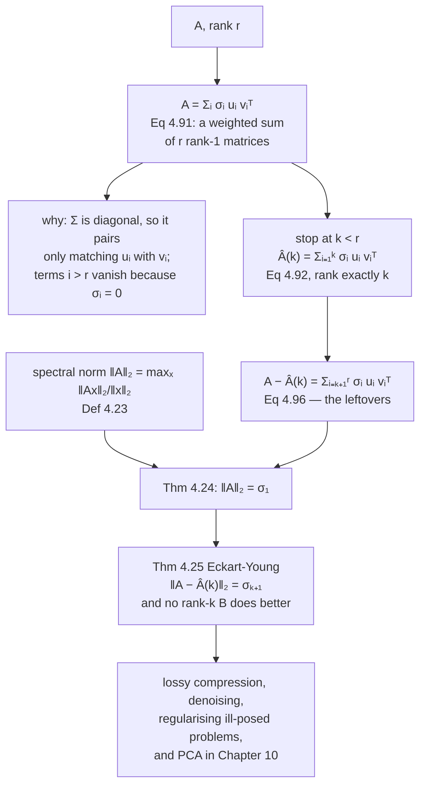

import DataCampExercise from "../../../../components/DataCampExercise.astro";
import Figure from "../../../../components/Figure.astro";
import Quiz from "../../../../components/Quiz.astro";
import SVDLab from "../../../../components/viz/math/SVDLab.tsx";

The SVD gave you an exact factorisation. This page throws part of it away on purpose.

The result is remarkable and it is easy to under-appreciate: if you keep only the largest $k$ singular
values, the matrix you get back is **not merely a good rank-$k$ approximation — it is the best one that
exists**, and its error is exactly $\sigma_{k+1}$. Not bounded by, not approximately: equal to. You know
the error before you compute the approximation.

## What you'll learn

- Equations 4.90 and 4.91: any rank-$r$ matrix is a **sum of $r$ rank-1 outer products**, weighted by the singular values.
- Equation 4.92: truncating that sum at $k$ gives the **rank-$k$ approximation** $\hat{\mathbf{A}}(k)$.
- Definition 4.23 and Theorem 4.24: the **spectral norm**, and the fact that it equals $\sigma_1$.
- Theorem 4.25, **Eckart-Young**: the truncation is optimal, and $\lVert\mathbf{A} - \hat{\mathbf{A}}(k)\rVert_2 = \sigma_{k+1}$.
- The sketch of why no rank-$k$ matrix can do better, via the rank-nullity theorem.
- Example 4.15: reading two themes out of a movie-ratings matrix — and a **transcription error in the book's Equation 4.101b**, diagnosed exactly.
- The storage arithmetic: when a factorisation actually saves anything, and when it does not.

## Intuition: a matrix as a stack of transparencies

An outer product $\mathbf{u}\mathbf{v}^\top$ is the simplest nonzero matrix there is. Every row is a
multiple of $\mathbf{v}^\top$ and every column is a multiple of $\mathbf{u}$, so it has rank 1 and it
looks like a grid — one column pattern times one row pattern, and nothing else. The book makes exactly
this point about Figure 4.11: *the grid-like structure of each rank-1 matrix is imposed by the
outer-product of the left and right-singular vectors.*

The SVD says every matrix is a **weighted stack of these transparencies**, and it orders them by weight.
The first carries the most; the last carries the least. Approximating is then simply not laying down the
faint ones.

What makes it a theorem rather than a heuristic is that this particular stack is the *right* one. You
could decompose a matrix into rank-1 pieces in infinitely many ways; only the SVD's ordering has the
property that the first $k$ pieces are the best $k$ pieces.



## The math

### Every matrix is a sum of rank-1 pieces

Define the outer-product matrices

$$
\mathbf{A}_i := \mathbf{u}_i\mathbf{v}_i^\top
\tag{4.90}
$$

Then a matrix $\mathbf{A} \in \mathbb{R}^{m\times n}$ of rank $r$ satisfies

$$
\mathbf{A} = \sum_{i=1}^{r} \sigma_i\mathbf{u}_i\mathbf{v}_i^\top = \sum_{i=1}^{r} \sigma_i\mathbf{A}_i
\tag{4.91}
$$

The book's own reason is worth quoting because it is the whole argument: *the diagonal structure of the
singular value matrix $\boldsymbol{\Sigma}$ multiplies only matching left- and right-singular vectors
$\mathbf{u}_i\mathbf{v}_i^\top$ and scales them by the corresponding singular value $\sigma_i$. All terms
$\Sigma_{ij}\mathbf{u}_i\mathbf{v}_j^\top$ vanish for $i \neq j$ because $\boldsymbol{\Sigma}$ is a
diagonal matrix. Any terms $i > r$ vanish because the corresponding singular values are $0$.*

So Equation 4.91 is not a new fact. It is $\mathbf{U}\boldsymbol{\Sigma}\mathbf{V}^\top$ written out
term by term.

### Truncating

:::note[Equation 4.92 — rank-k approximation]
If the sum runs only up to an intermediate value $k < r$, we obtain the **rank-$k$ approximation**

$$
\hat{\mathbf{A}}(k) := \sum_{i=1}^{k}\sigma_i\mathbf{u}_i\mathbf{v}_i^\top = \sum_{i=1}^{k}\sigma_i\mathbf{A}_i
$$

with $\mathrm{rk}(\hat{\mathbf{A}}(k)) = k$.
:::

The rank is exactly $k$, not at most $k$, because the $\mathbf{u}_i$ are orthonormal and the $\sigma_i$
for $i \leq k \leq r$ are nonzero.

### Measuring the error

To say how good an approximation is you need a norm on matrices. §3.1 gave norms on vectors; the analogue
here is:

:::note[Definition 4.23 — Spectral Norm]
For $\mathbf{x} \in \mathbb{R}^n\setminus\{\mathbf{0}\}$, the **spectral norm** of a matrix
$\mathbf{A} \in \mathbb{R}^{m\times n}$ is

$$
\lVert\mathbf{A}\rVert_2 := \max_{\mathbf{x}} \frac{\lVert\mathbf{A}\mathbf{x}\rVert_2}{\lVert\mathbf{x}\rVert_2}
\tag{4.93}
$$
:::

Read it as: **how long can any vector at most become when multiplied by $\mathbf{A}$?** The subscript $2$
matches the Euclidean norm on vectors on the right-hand side.

:::note[Theorem 4.24]
The spectral norm of $\mathbf{A}$ is its largest singular value $\sigma_1$.
:::

The book leaves the proof as an exercise — it is Exercise 4.11, and the next page works it. The
intuition is immediate from the geometry of §4.5: $\mathbf{V}^\top$ and $\mathbf{U}$ are rotations and
change no length, so all the stretching is $\boldsymbol{\Sigma}$, and the most a unit vector can be
stretched by a diagonal matrix is its largest entry.

### The theorem

:::note[Theorem 4.25 — Eckart-Young Theorem (Eckart and Young, 1936)]
Consider a matrix $\mathbf{A} \in \mathbb{R}^{m\times n}$ of rank $r$ and let
$\mathbf{B} \in \mathbb{R}^{m\times n}$ be a matrix of rank $k$. For any $k \leq r$ with
$\hat{\mathbf{A}}(k) = \sum_{i=1}^k \sigma_i\mathbf{u}_i\mathbf{v}_i^\top$ it holds that

$$
\hat{\mathbf{A}}(k) = \operatorname*{argmin}_{\mathrm{rk}(\mathbf{B})=k}\lVert\mathbf{A}-\mathbf{B}\rVert_2
\tag{4.94}
$$

$$
\bigl\lVert\mathbf{A}-\hat{\mathbf{A}}(k)\bigr\rVert_2 = \sigma_{k+1}
\tag{4.95}
$$
:::

Two separate claims. Equation 4.94 is **optimality**: nothing of rank $k$ is closer. Equation 4.95 is
**exactness**: the error is not bounded by $\sigma_{k+1}$, it equals it.

The second claim is nearly free. The difference is just the discarded tail,

$$
\mathbf{A} - \hat{\mathbf{A}}(k) = \sum_{i=k+1}^{r}\sigma_i\mathbf{u}_i\mathbf{v}_i^\top
\tag{4.96}
$$

which is itself a matrix in SVD form whose largest singular value is $\sigma_{k+1}$ — so Theorem 4.24
gives Equation 4.95 immediately.

### Why nothing of rank k does better

The book's argument is a proof by contradiction and it is short enough to follow completely. Suppose some
$\mathbf{B}$ with $\mathrm{rk}(\mathbf{B}) \leq k$ satisfied

$$
\lVert\mathbf{A}-\mathbf{B}\rVert_2 < \bigl\lVert\mathbf{A}-\hat{\mathbf{A}}(k)\bigr\rVert_2 = \sigma_{k+1}
\tag{4.97}
$$

Then $\mathbf{B}$ has a null space $Z \subseteq \mathbb{R}^n$ of dimension at least $n-k$, and for
$\mathbf{x} \in Z$ we have $\mathbf{B}\mathbf{x} = \mathbf{0}$, hence

$$
\lVert\mathbf{A}\mathbf{x}\rVert_2 = \lVert(\mathbf{A}-\mathbf{B})\mathbf{x}\rVert_2
\tag{4.98}
$$

and by the matrix version of Cauchy-Schwarz,

$$
\lVert\mathbf{A}\mathbf{x}\rVert_2 \leq \lVert\mathbf{A}-\mathbf{B}\rVert_2\lVert\mathbf{x}\rVert_2 < \sigma_{k+1}\lVert\mathbf{x}\rVert_2
\tag{4.99}
$$

But there is a $(k+1)$-dimensional subspace — spanned by $\mathbf{v}_1,\dots,\mathbf{v}_{k+1}$ — on which
$\lVert\mathbf{A}\mathbf{x}\rVert_2 \geq \sigma_{k+1}\lVert\mathbf{x}\rVert_2$. Adding the dimensions of
those two subspaces gives $(n-k) + (k+1) = n+1 > n$, so they must share a nonzero vector, which cannot
satisfy both inequalities. That contradicts the rank-nullity theorem (Theorem 2.24). Hence no such
$\mathbf{B}$ exists.

Notice what carried the argument: **counting dimensions**. Chapter 2's rank-nullity theorem, which looked
like bookkeeping at the time, is what makes the SVD optimal.

:::tip[From the book]
Section 4.6. Equation 4.90 defines the rank-1 outer products $\mathbf{A}_i$ and Equation 4.91 writes any
rank-$r$ matrix as their weighted sum, with the book's own explanation of why the off-diagonal terms
vanish. Equation 4.92 defines the rank-$k$ approximation. Figures 4.11 and 4.12 show a
$1432\times1910$ Stonehenge photograph, its first five rank-1 pieces with
$\sigma_1 \approx 228\,052$ down to $\sigma_5 \approx 15\,436$, and the reconstructions, with the storage
arithmetic $5\cdot(1432+1910+1) = 16\,715$ numbers against $1432\cdot1910 = 2\,735\,120$ — just above
$0.6\%$. Definition 4.23 (Equation 4.93) gives the spectral norm and Theorem 4.24 identifies it with
$\sigma_1$, leaving the proof as an exercise. Theorem 4.25 (Equations 4.94 and 4.95) is Eckart-Young,
followed by the contradiction argument of Equations 4.96 to 4.99 resting on the rank-nullity theorem
2.24. Example 4.15 continues the movie-ratings example of §4.5.3 with Equations 4.100 to 4.103.
:::

## Worked example by hand

### Example 4.15 — two themes in a ratings table

The matrix from Example 4.14, four movies by three viewers:

$$
\mathbf{A} = \begin{bmatrix}5 & 4 & 1\\ 5 & 5 & 0\\ 0 & 0 & 5\\ 1 & 0 & 4\end{bmatrix}
\tag{4.103}
$$

with $\sigma = 9.643811,\ 6.363891,\ 0.705552$. The first rank-1 piece is

$$
\mathbf{A}_1 = \mathbf{u}_1\mathbf{v}_1^\top =
\begin{bmatrix}-0.6710\\ -0.7197\\ -0.0939\\ -0.1515\end{bmatrix}
\begin{bmatrix}-0.7367 & -0.6515 & -0.1811\end{bmatrix}
= \begin{bmatrix}0.4943 & 0.4372 & 0.1215\\ 0.5302 & 0.4689 & 0.1303\\ 0.0692 & 0.0612 & 0.0170\\ 0.1116 & 0.0987 & 0.0274\end{bmatrix}
\tag{4.100}
$$

Reproduced from the SVD to $6.7\times10^{-5}$, which is the rounding of the book's four printed decimals.
The book's reading: Ali and Beatrix like science fiction — Star Wars and Blade Runner, entries above
$0.4$ — but this piece **fails to capture Chandra's ratings**, which is unsurprising, since Chandra's
taste is not in the first singular direction.

The second piece captures the other theme, French art house. Combining them,

$$
\hat{\mathbf{A}}(2) = \sigma_1\mathbf{A}_1 + \sigma_2\mathbf{A}_2 =
\begin{bmatrix}4.7801 & 4.2419 & 1.0244\\ 5.2252 & 4.7522 & -0.0250\\ 0.2493 & -0.2743 & 4.9724\\ 0.7495 & 0.2756 & 4.0278\end{bmatrix}
\tag{4.102}
$$

which reproduces Equation 4.102 to all four printed decimals. Compare against $\mathbf{A}$: every entry
is within about $0.28$. The conclusion the book draws is that $\mathbf{A}_3$ can be ignored — *there is
no evidence of a third movie-theme category*, and the whole space of themes is two-dimensional.

And Eckart-Young says exactly how good that is, before you look:
$\lVert\mathbf{A}-\hat{\mathbf{A}}(2)\rVert_2 = \sigma_3 = 0.705552$. Measured on the book's own printed
$\hat{\mathbf{A}}(2)$: $0.705580$, the difference being the four-decimal rounding.

:::danger[The book's Equation 4.101b uses the wrong vector — diagnosed]
Work through Equation 4.101 and it does not come out. The printed
$\mathbf{v}_2^\top = [0.0852,\ 0.1762,\ -0.9807]$ is the second **row** of $\mathbf{V}^\top$, which is
correct — but the matrix printed as $\mathbf{A}_2$ on the next line was computed with
$[-0.6515,\ 0.1762,\ -0.7379]$, which is the second **column** of $\mathbf{V}^\top$. A transpose slip.

The diagnosis is exact. Divide the printed $\mathbf{A}_2$ column by column by $\mathbf{u}_2$ and you
recover $-0.6515$, $0.1762$, $-0.7379$ to four digits in all four rows. The outer product with that
vector matches the printed Equation 4.101b to $8.1\times10^{-5}$; the outer product with the correct
$\mathbf{v}_2$ differs from it by $0.57$.

What makes the slip hard to spot is that $\mathbf{V}$ is orthogonal, so its rows are unit vectors too —
$\lVert[-0.6515, 0.1762, -0.7379]\rVert = 0.999998$ — and the wrong matrix therefore looks entirely
plausible. Note also that the **middle** column of 4.101b is correct, because $\mathbf{V}^\top_{22}$ is
on the diagonal and row and column agree there.

Equation 4.102 is **not** affected: it matches the correct route to $6.5\times10^{-4}$, and would have
been off by $3.61$ had it been built from the printed 4.101b. So the slip is confined to that one
display, and the conclusion the book draws from it stands.
:::

### Eckart-Young, measured at every k

```python title="eckart_young.py" showLineNumbers{1}
import numpy as np

A = np.array([[5.0, 4, 1], [5, 5, 0], [0, 0, 5], [1, 0, 4]])
U, s, Vt = np.linalg.svd(A, full_matrices=False)
r = int(np.linalg.matrix_rank(A))

print(f"rank {r}   ||A||_2 = {np.linalg.norm(A, 2):.6f}   sigma_1 = {s[0]:.6f}   (Theorem 4.24)")
print()
for k in range(0, r + 1):
    Ak = (U[:, :k] * s[:k]) @ Vt[:k] if k else np.zeros_like(A)
    spec = float(np.linalg.norm(A - Ak, 2))
    frob = float(np.linalg.norm(A - Ak))
    nxt = s[k] if k < len(s) else 0.0
    tail = float(np.sqrt(np.sum(s[k:] ** 2)))
    print(f"  k={k}  ||A-Ahat||_2 {spec:.6f}   sigma_(k+1) {nxt:.6f}   gap {abs(spec-nxt):.2e}"
          f"   ||.||_F {frob:.6f}   sqrt(sum of tail sigma^2) {tail:.6f}")
```

```text title="output"
rank 3   ||A||_2 = 9.643811   sigma_1 = 9.643811   (Theorem 4.24)

  k=0  ||A-Ahat||_2 9.643811   sigma_(k+1) 9.643811   gap 3.55e-15   ||.||_F 11.575837   sqrt(sum of tail sigma^2) 11.575837
  k=1  ||A-Ahat||_2 6.363891   sigma_(k+1) 6.363891   gap 8.88e-16   ||.||_F 6.402883   sqrt(sum of tail sigma^2) 6.402883
  k=2  ||A-Ahat||_2 0.705552   sigma_(k+1) 0.705552   gap 0.00e+00   ||.||_F 0.705552   sqrt(sum of tail sigma^2) 0.705552
  k=3  ||A-Ahat||_2 0.000000   sigma_(k+1) 0.000000   gap 6.84e-15   ||.||_F 0.000000   sqrt(sum of tail sigma^2) 0.000000
```

Equation 4.95 holds at every $k$ including the trivial ones. At $k=0$ the approximation is the zero
matrix and the error is $\sigma_1$ — which is Theorem 4.24 restated. At $k=r$ the error is zero.

The last two columns are a bonus the book does not state: the **Frobenius** error is
$\sqrt{\sum_{i>k}\sigma_i^2}$, exactly, in every row. So the SVD truncation is optimal in that norm too,
and its error there is also known in advance. At $k=2$ the two norms coincide, because only one singular
value is left and a rank-1 matrix has the same spectral and Frobenius norm.

## See it move

```p5 title="Peeling off rank-1 pieces" desc="An image built from a few rank-1 patterns. Drag k to add pieces one at a time: the left panel is the k-th piece on its own, showing the grid structure an outer product must have; the middle is the running reconstruction; the right is what is left over. The readout tracks the spectral error against the next singular value." height="560"
let k = 1;
let KNOBS = [], dragging = null;
let IMG = [], SV = [], UU = [], VV = [], N = 28, RANK = 0;

function setup() {
  createCanvas(600, 560); textFont("monospace"); noLoop();
  buildImage();
  decompose();
  redraw();
}

// A small image with a handful of exactly rank-1 ingredients: a smooth gradient,
// two axis-aligned blocks and a soft blob. Exact rank stays small.
function buildImage() {
  IMG = [];
  for (let i = 0; i < N; i++) {
    const row = [];
    for (let j = 0; j < N; j++) {
      let v = 0.18 + 0.5 * (1 - i / (N - 1));
      if (i > 4 && i < 13 && j > 3 && j < 12) v += 0.5;
      if (i > 15 && i < 25 && j > 14 && j < 24) v -= 0.42;
      const dx = (j - 20) / 5, dy = (i - 8) / 5;
      v += 0.35 * Math.exp(-(dx * dx + dy * dy));
      row.push(v);
    }
    IMG.push(row);
  }
}

// One-sided Jacobi on the columns: orthogonalise A's columns in place, which
// yields A = U S V^T without ever forming a Gram matrix.
function decompose() {
  const A = IMG.map(r => r.slice());
  const V = [];
  for (let i = 0; i < N; i++) { V.push(new Array(N).fill(0)); V[i][i] = 1; }
  for (let sweep = 0; sweep < 32; sweep++) {
    let off = 0;
    for (let p = 0; p < N - 1; p++) {
      for (let q = p + 1; q < N; q++) {
        let app = 0, aqq = 0, apq = 0;
        for (let i = 0; i < N; i++) { app += A[i][p] * A[i][p]; aqq += A[i][q] * A[i][q]; apq += A[i][p] * A[i][q]; }
        if (Math.abs(apq) < 1e-13) continue;
        off += apq * apq;
        const tau = (aqq - app) / (2 * apq);
        const t = Math.sign(tau || 1) / (Math.abs(tau) + Math.sqrt(1 + tau * tau));
        const c = 1 / Math.sqrt(1 + t * t), s = c * t;
        for (let i = 0; i < N; i++) {
          const ap = A[i][p], aq = A[i][q];
          A[i][p] = c * ap - s * aq; A[i][q] = s * ap + c * aq;
          const vp = V[i][p], vq = V[i][q];
          V[i][p] = c * vp - s * vq; V[i][q] = s * vp + c * vq;
        }
      }
    }
    if (off < 1e-24) break;
  }
  const idx = [];
  for (let j = 0; j < N; j++) {
    let nrm = 0;
    for (let i = 0; i < N; i++) nrm += A[i][j] * A[i][j];
    idx.push([Math.sqrt(nrm), j]);
  }
  idx.sort((a, b) => b[0] - a[0]);
  SV = []; UU = []; VV = []; RANK = 0;
  for (const [nrm, j] of idx) {
    SV.push(nrm);
    if (nrm > 1e-9 * idx[0][0]) RANK++;
    const u = [], v = [];
    for (let i = 0; i < N; i++) { u.push(nrm > 1e-14 ? A[i][j] / nrm : 0); v.push(V[i][j]); }
    UU.push(u); VV.push(v);
  }
}

function knob(id, x, y, w, value, mn, mx, label) {
  KNOBS.push({ id, x, y, w, mn, mx });
  const t = (value - mn) / (mx - mn);
  stroke(60, 74, 92); strokeWeight(2); line(x, y, x + w, y);
  noStroke(); fill(255, 211, 67); ellipse(x + t * w, y, 10, 10);
  fill(190, 200, 212); textSize(11); textAlign(LEFT, CENTER);
  text(label, x + w + 10, y);
}
function mousePressed() {
  for (const kk of KNOBS)
    if (mouseY > kk.y - 11 && mouseY < kk.y + 11 && mouseX > kk.x - 11 && mouseX < kk.x + kk.w + 11) { dragging = kk; return; }
}
function mouseReleased() { dragging = null; }
function mouseDragged() {
  if (!dragging) return;
  const t = Math.min(1, Math.max(0, (mouseX - dragging.x) / dragging.w));
  k = Math.round(dragging.mn + t * (dragging.mx - dragging.mn));
  redraw();
}

function tile(rows, ox, oy, cell, lo, hi) {
  noStroke();
  for (let i = 0; i < N; i++)
    for (let j = 0; j < N; j++) {
      const t = (rows[i][j] - lo) / Math.max(1e-9, hi - lo);
      const g = Math.max(0, Math.min(1, t));
      fill(20 + 220 * g, 24 + 214 * g, 34 + 200 * g);
      rect(ox + j * cell, oy + i * cell, cell, cell);
    }
  noFill(); stroke(70, 84, 100); strokeWeight(1);
  rect(ox, oy, N * cell, N * cell);
}

function draw() {
  background(13, 17, 23);
  KNOBS = [];

  const piece = [], recon = [], resid = [];
  for (let i = 0; i < N; i++) {
    piece.push(new Array(N).fill(0));
    recon.push(new Array(N).fill(0));
    resid.push(new Array(N).fill(0));
  }
  for (let i = 0; i < N; i++)
    for (let j = 0; j < N; j++) {
      piece[i][j] = SV[k - 1] * UU[k - 1][i] * VV[k - 1][j];
      let acc = 0;
      for (let t = 0; t < k; t++) acc += SV[t] * UU[t][i] * VV[t][j];
      recon[i][j] = acc;
      resid[i][j] = IMG[i][j] - acc;
    }

  let pMax = 0, rMax = 0;
  for (let i = 0; i < N; i++)
    for (let j = 0; j < N; j++) {
      pMax = Math.max(pMax, Math.abs(piece[i][j]));
      rMax = Math.max(rMax, Math.abs(resid[i][j]));
    }

  const cell = 5.6, top = 60;
  tile(piece, 30, top, cell, -pMax, pMax);
  tile(recon, 220, top, cell, 0, 1.2);
  tile(resid, 410, top, cell, -Math.max(rMax, 1e-9), Math.max(rMax, 1e-9));

  noStroke(); textAlign(LEFT, TOP); fill(190, 200, 212); textSize(11);
  text(`piece k = ${k}:  sigma_k u_k v_kᵀ`, 30, top - 20);
  text(`Â(${k}) = sum of the first ${k}`, 220, top - 20);
  text(`A − Â(${k}), the leftovers`, 410, top - 20);

  // Spectral error of the residual is the next singular value.
  const nextSv = k < SV.length ? SV[k] : 0;

  // Singular value strip.
  const stripY = top + N * cell + 34, stripH = 44, bw = 15;
  for (let t = 0; t < Math.min(14, SV.length); t++) {
    const h = Math.max(1, (SV[t] / SV[0]) * stripH);
    noStroke();
    fill(t < k ? color(255, 211, 67) : color(58, 72, 88));
    rect(30 + t * (bw + 3), stripY + stripH - h, bw, h);
  }
  fill(150); textSize(10); textAlign(LEFT, TOP);
  text("singular values, descending — amber = kept", 30, stripY + stripH + 6);

  knob("k", 30, stripY + 92, 250, k, 1, Math.min(14, SV.length), `k = ${k} of rank ${RANK}`);

  fill(215); textSize(11); textAlign(LEFT, TOP);
  text(`exact rank of this image: ${RANK}`, 330, stripY + 20);
  text(`sigma_${k}     = ${SV[k - 1].toFixed(6)}`, 330, stripY + 40);
  text(`sigma_${k + 1}     = ${nextSv.toFixed(6)}`, 330, stripY + 58);
  text(`max |A − Â| = ${rMax.toFixed(6)}`, 330, stripY + 76);
  fill(k >= RANK ? color(120, 200, 150) : color(255, 211, 67)); textSize(11);
  text(k >= RANK ? "exact: nothing left to discard" : "still discarding something", 330, stripY + 100);

  fill(150); textSize(10);
  text("Each left-hand panel is one outer product, so every row is a multiple of one row pattern:", 30, 500);
  text("that is the grid structure the book points out about Figure 4.11. The middle panel adds them", 30, 516);
  text("up. Push k to the exact rank and the right panel goes flat — the image was a short sum of", 30, 532);
  text("rank-1 pieces all along, which is why compression works at all.", 30, 548);
}
```

```p5 title="No rank-k matrix beats the truncation" desc="The truncation error is drawn as an amber line at sigma_(k+1). Every click throws a random rank-k competitor at the same matrix and plots its error as a dot. Dots land above the line and never below it — that is Equation 4.94, tested rather than quoted. Drag k to move the bound." height="540"
let k = 1;
let KNOBS = [], BTN = null, dragging = null;
let M = 6, NN = 5, A = [], SVv = [], Uu = [], Vv = [];
let dots = [], trials = 0, below = 0, bestRatio = Infinity;
let seed = 20240821;

function rnd() { seed = (seed * 1103515245 + 12345) & 0x7fffffff; return seed / 0x7fffffff; }
function gauss() { let s = 0; for (let i = 0; i < 6; i++) s += rnd(); return (s - 3) * 1.1; }

function setup() {
  createCanvas(600, 540); textFont("monospace"); noLoop();
  A = [];
  for (let i = 0; i < M; i++) { const r = []; for (let j = 0; j < NN; j++) r.push(gauss()); A.push(r); }
  decompose();
  redraw();
}

function decompose() {
  const B = A.map(r => r.slice());
  const V = [];
  for (let i = 0; i < NN; i++) { V.push(new Array(NN).fill(0)); V[i][i] = 1; }
  for (let sweep = 0; sweep < 40; sweep++) {
    let off = 0;
    for (let p = 0; p < NN - 1; p++)
      for (let q = p + 1; q < NN; q++) {
        let app = 0, aqq = 0, apq = 0;
        for (let i = 0; i < M; i++) { app += B[i][p] * B[i][p]; aqq += B[i][q] * B[i][q]; apq += B[i][p] * B[i][q]; }
        if (Math.abs(apq) < 1e-14) continue;
        off += apq * apq;
        const tau = (aqq - app) / (2 * apq);
        const t = Math.sign(tau || 1) / (Math.abs(tau) + Math.sqrt(1 + tau * tau));
        const c = 1 / Math.sqrt(1 + t * t), s = c * t;
        for (let i = 0; i < M; i++) { const bp = B[i][p], bq = B[i][q]; B[i][p] = c * bp - s * bq; B[i][q] = s * bp + c * bq; }
        for (let i = 0; i < NN; i++) { const vp = V[i][p], vq = V[i][q]; V[i][p] = c * vp - s * vq; V[i][q] = s * vp + c * vq; }
      }
    if (off < 1e-26) break;
  }
  const idx = [];
  for (let j = 0; j < NN; j++) { let n2 = 0; for (let i = 0; i < M; i++) n2 += B[i][j] * B[i][j]; idx.push([Math.sqrt(n2), j]); }
  idx.sort((a, b) => b[0] - a[0]);
  SVv = []; Uu = []; Vv = [];
  for (const [nrm, j] of idx) {
    SVv.push(nrm);
    const u = [], v = [];
    for (let i = 0; i < M; i++) u.push(nrm > 1e-14 ? B[i][j] / nrm : 0);
    for (let i = 0; i < NN; i++) v.push(V[i][j]);
    Uu.push(u); Vv.push(v);
  }
}

// Spectral norm by power iteration on Cᵀ C — independent of the decomposition above.
function specNorm(C) {
  const rows = C.length, cols = C[0].length;
  let x = new Array(cols).fill(0).map(() => 1 / Math.sqrt(cols));
  let lam = 0;
  for (let it = 0; it < 250; it++) {
    const y = new Array(rows).fill(0);
    for (let i = 0; i < rows; i++) for (let j = 0; j < cols; j++) y[i] += C[i][j] * x[j];
    const z = new Array(cols).fill(0);
    for (let j = 0; j < cols; j++) for (let i = 0; i < rows; i++) z[j] += C[i][j] * y[i];
    const n = Math.sqrt(z.reduce((a, b) => a + b * b, 0));
    if (n < 1e-300) return 0;
    for (let j = 0; j < cols; j++) x[j] = z[j] / n;
    lam = n;
  }
  return Math.sqrt(lam);
}

function truncErr() {
  const D = [];
  for (let i = 0; i < M; i++) {
    const r = [];
    for (let j = 0; j < NN; j++) {
      let acc = 0;
      for (let t = 0; t < k; t++) acc += SVv[t] * Uu[t][i] * Vv[t][j];
      r.push(A[i][j] - acc);
    }
    D.push(r);
  }
  return specNorm(D);
}

function throwCompetitors(n) {
  const best = truncErr();
  for (let c = 0; c < n; c++) {
    const L = [], R = [];
    for (let i = 0; i < M; i++) { const r = []; for (let t = 0; t < k; t++) r.push(gauss()); L.push(r); }
    for (let t = 0; t < k; t++) { const r = []; for (let j = 0; j < NN; j++) r.push(gauss()); R.push(r); }
    const D = [];
    let bn = 0;
    for (let i = 0; i < M; i++) {
      const r = [];
      for (let j = 0; j < NN; j++) { let acc = 0; for (let t = 0; t < k; t++) acc += L[i][t] * R[t][j]; r.push(acc); bn += acc * acc; }
      D.push(r);
    }
    bn = Math.sqrt(bn) || 1;
    // Scale the competitor to the size of the truncation, so it is a fair fight.
    let an = 0;
    for (let i = 0; i < M; i++) for (let j = 0; j < NN; j++) { let acc = 0; for (let t = 0; t < k; t++) acc += SVv[t] * Uu[t][i] * Vv[t][j]; an += acc * acc; }
    an = Math.sqrt(an);
    const E = [];
    for (let i = 0; i < M; i++) { const r = []; for (let j = 0; j < NN; j++) r.push(A[i][j] - D[i][j] * an / bn); E.push(r); }
    const e = specNorm(E);
    dots.push({ k, e });
    trials++;
    if (e < best - 1e-9) below++;
    bestRatio = Math.min(bestRatio, e / Math.max(best, 1e-12));
  }
  redraw();
}

function knob(id, x, y, w, value, mn, mx, label) {
  KNOBS.push({ id, x, y, w, mn, mx });
  const t = (value - mn) / (mx - mn);
  stroke(60, 74, 92); strokeWeight(2); line(x, y, x + w, y);
  noStroke(); fill(255, 211, 67); ellipse(x + t * w, y, 10, 10);
  fill(190, 200, 212); textSize(11); textAlign(LEFT, CENTER);
  text(label, x + w + 10, y);
}
function mousePressed() {
  if (BTN && mouseX > BTN.x && mouseX < BTN.x + BTN.w && mouseY > BTN.y && mouseY < BTN.y + BTN.h) {
    throwCompetitors(60); return;
  }
  for (const kk of KNOBS)
    if (mouseY > kk.y - 11 && mouseY < kk.y + 11 && mouseX > kk.x - 11 && mouseX < kk.x + kk.w + 11) { dragging = kk; return; }
}
function mouseReleased() { dragging = null; }
function mouseDragged() {
  if (!dragging) return;
  const t = Math.min(1, Math.max(0, (mouseX - dragging.x) / dragging.w));
  k = Math.round(dragging.mn + t * (dragging.mx - dragging.mn));
  redraw();
}

function draw() {
  background(13, 17, 23);
  KNOBS = [];

  const L = 70, R = 470, T = 60, Bm = 330;
  const hi = SVv[0] * 1.7;
  const px = kk => L + ((kk - 0.5) / (NN - 0.5)) * (R - L);
  const py = e => Bm - (e / hi) * (Bm - T);

  stroke(32, 44, 58); strokeWeight(1);
  for (let g = 0; g <= 5; g++) { const y = T + (g / 5) * (Bm - T); line(L, y, R, y); }
  stroke(58, 72, 88); strokeWeight(1.2);
  line(L, Bm, R, Bm); line(L, T, L, Bm);

  noStroke(); fill(140); textSize(10); textAlign(RIGHT, CENTER);
  for (let g = 0; g <= 5; g++) {
    const v = hi * (1 - g / 5);
    text(v.toFixed(2), L - 8, T + (g / 5) * (Bm - T));
  }
  textAlign(CENTER, TOP);
  for (let kk = 1; kk < NN; kk++) text(`k=${kk}`, px(kk), Bm + 6);

  // The Eckart-Young bound at every k.
  for (let kk = 1; kk < NN; kk++) {
    const bound = SVv[kk];
    stroke(255, 211, 67, kk === k ? 255 : 90);
    strokeWeight(kk === k ? 2.6 : 1.4);
    line(px(kk) - 26, py(bound), px(kk) + 26, py(bound));
  }

  noStroke();
  for (const d of dots) {
    fill(232, 110, 110, 120);
    ellipse(px(d.k) + (rnd() - 0.5) * 26, py(d.e), 4.4, 4.4);
  }
  const te = truncErr();
  fill(120, 200, 150);
  ellipse(px(k), py(te), 10, 10);

  BTN = { x: 30, y: 372, w: 230, h: 28 };
  fill(46, 58, 72); rect(BTN.x, BTN.y, BTN.w, BTN.h, 5);
  fill(215); textSize(12); textAlign(CENTER, CENTER);
  text("throw 60 random rank-k matrices", BTN.x + BTN.w / 2, BTN.y + BTN.h / 2);

  knob("k", 30, 424, 230, k, 1, NN - 1, `k = ${k}`);

  textAlign(LEFT, TOP); noStroke();
  fill(255, 211, 67); textSize(13);
  text("amber line: sigma_(k+1).  green dot: the SVD truncation.  red: competitors.", 30, 12);
  fill(215); textSize(11);
  text(`measured ‖A − Â(${k})‖₂ = ${te.toFixed(6)}`, 320, 372);
  text(`sigma_${k + 1}            = ${SVv[k].toFixed(6)}`, 320, 390);
  text(`gap                = ${Math.abs(te - SVv[k]).toExponential(1)}`, 320, 408);
  text(`competitors thrown: ${trials}`, 320, 432);
  fill(below === 0 ? color(120, 200, 150) : color(232, 110, 110)); textSize(11);
  text(`landed below the line: ${below}`, 320, 450);
  if (trials > 0) { fill(150); textSize(10); text(`best competitor was ${bestRatio.toFixed(2)}x the truncation`, 320, 470); }
  fill(150); textSize(10);
  text("The green dot sits ON the amber line at every k: that is Equation 4.95, and the gap", 30, 486);
  text("readout shows it is exact, not approximate. No red dot ever falls below — Equation 4.94.", 30, 502);
  text("The spectral norms here come from power iteration on the residual, so the check is", 30, 518);
  text("independent of the decomposition that produced the truncation.", 30, 534);
}
```

<SVDLab
  client:visible
  mode="approximate"
  matrix={[[5, 4, 1], [5, 5, 0], [0, 0, 5], [1, 0, 4]]}
  title="Example 4.15, one rank at a time"
  desc="The heatmaps are A, its rank-k reconstruction, and their difference on a shared colour scale. Each frame checks the Eckart-Young bound against a spectral norm measured by power iteration, independently of the singular values used to build the approximation."
/>

## From scratch

```python title="low_rank_from_scratch.py" showLineNumbers{1}
import numpy as np

def truncate(A, k):
    """Equation 4.92, built from the rank-1 pieces one at a time."""
    A = np.asarray(A, dtype=float)
    U, s, Vt = np.linalg.svd(A, full_matrices=False)
    out = np.zeros_like(A)
    for i in range(k):
        out += s[i] * np.outer(U[:, i], Vt[i])          # Eq 4.90 and 4.92
    return out, s

def spectral_norm(A, iters=500):
    """Definition 4.23 by power iteration on A^T A — no SVD involved."""
    A = np.asarray(A, dtype=float)
    x = np.ones(A.shape[1]) / np.sqrt(A.shape[1])
    lam = 0.0
    for _ in range(iters):
        z = A.T @ (A @ x)
        n = float(np.linalg.norm(z))
        if n < 1e-300:
            return 0.0
        x, lam = z / n, n
    return float(np.sqrt(lam))

A = np.array([[5.0, 4, 1], [5, 5, 0], [0, 0, 5], [1, 0, 4]])
_, s = truncate(A, 0)
r = int(np.linalg.matrix_rank(A))

print(f"Theorem 4.24:  spectral_norm(A) {spectral_norm(A):.9f}   sigma_1 {s[0]:.9f}")
print()
print("Theorem 4.25, with the norm measured independently of the singular values:")
for k in range(r + 1):
    Ak, _ = truncate(A, k)
    measured = spectral_norm(A - Ak)
    bound = s[k] if k < len(s) else 0.0
    print(f"  k={k}  rank(Ahat) {np.linalg.matrix_rank(Ak) if k else 0}"
          f"   measured {measured:.9f}   sigma_(k+1) {bound:.9f}"
          f"   gap {abs(measured - bound):.2e}")
```

```text title="output"
Theorem 4.24:  spectral_norm(A) 9.643810900   sigma_1 9.643810900

Theorem 4.25, with the norm measured independently of the singular values:
  k=0  rank(Ahat) 0   measured 9.643810900   sigma_(k+1) 9.643810900   gap 3.55e-15
  k=1  rank(Ahat) 1   measured 6.363890889   sigma_(k+1) 6.363890889   gap 8.88e-16
  k=2  rank(Ahat) 2   measured 0.705552321   sigma_(k+1) 0.705552321   gap 3.33e-16
  k=3  rank(Ahat) 3   measured 0.000000000   sigma_(k+1) 0.000000000   gap 6.16e-15
```

The point of measuring the norm by power iteration rather than reading $\sigma_{k+1}$ off the SVD is that
it makes the check **independent**. If Equation 4.95 were merely a restatement, this table would be
circular; because the left column comes from a separate algorithm — power iteration on
$\mathbf{A}^\top\mathbf{A}$, which never touches a singular vector — it is a test. Every gap is at
machine precision, the worst being $6.2\times10^{-15}$ at $k=3$ where both quantities are zero and the
comparison is absolute rather than relative.

Note also the `rank(Ahat)` column: it reads $0, 1, 2, 3$. Equation 4.92 promises rank *exactly* $k$, and
the reason is that the $\mathbf{u}_i$ are orthonormal, so no rank-1 piece can be absorbed into the
others.

## On real data

<Figure
  src="/images/mml/matrix-approximation/rank-one-pieces"
  alt="Two rows of small greyscale images. The top row shows five rank-1 outer products, each with a visible horizontal-and-vertical grid structure, labelled with its singular value. The bottom row shows the cumulative reconstructions becoming progressively closer to the original."
  title="The book's Figures 4.11 and 4.12, on a 64x64 image"
  caption="An image built from a smooth gradient, two blocks and a soft blob — so it has exact rank 8, with 88.96% of the squared energy in the first singular value alone and 99.64% in the first five. Each top-row panel is one outer product, which is why each one is a grid."
/>

<Figure
  src="/images/mml/matrix-approximation/eckart-young-measured"
  alt="A scatter plot of measured spectral error against the next singular value. Green points for SVD truncations lie exactly on the diagonal line; red points for random rank-k matrices scatter above it and none fall below."
  title="Theorem 4.25, tested rather than quoted"
  caption="420 truncations across 90 random matrices of shapes from 4x4 to 9x9. The largest disagreement between the measured error and sigma_(k+1) is 6.22e-15, so the green points are on the line, not near it. Of 420 random rank-k competitors, zero landed below the line and the best was still 1.25 times worse."
/>

<Figure
  src="/images/mml/matrix-approximation/compression-tradeoff"
  alt="Left, log-scale reconstruction error against rank, with the spectral and Frobenius curves and the sigma-k-plus-one curve overlapping, and a marked line at the exact rank. Right, error against numbers stored, with the cost of storing the matrix outright marked as a vertical line."
  title="The Stonehenge arithmetic, generalised"
  caption="For this 64x64 image the exact rank is 8, which costs 1032 numbers against 4096 stored outright — 25.2%. The right panel marks the break-even: a factorisation stores k(m+n+1) numbers, so only k below 32 saves anything at all, and this image is already exact at 8."
/>

## Reading the plot

**From the rank-1 pieces figure.** Look at the top row before the bottom row. Every panel has visible
horizontal and vertical banding, and that is not an artefact — an outer product $\mathbf{u}\mathbf{v}^\top$
*must* look like that, because every row is a multiple of the same row pattern. This is the observation
the book attaches to Figure 4.11, and seeing five of them side by side makes the point that a single
rank-1 matrix cannot represent anything localised.

The bottom row is the sum. The energy table explains why it converges so fast:

| $k$ | cumulative share of squared energy |
| --- | --- |
| 1 | $88.96\%$ |
| 2 | $96.47\%$ |
| 3 | $98.13\%$ |
| 5 | $99.64\%$ |
| 8 | $100\%$ (exact) |

This image was *built* from a small number of rank-1 ingredients — a gradient, two rectangles, a blob —
so it has exact rank 8 and a fast-decaying spectrum. Real photographs are not exactly low rank; they are
approximately low rank, which is why the same procedure still works but never becomes exact.

**From the Eckart-Young figure.** Two claims, two colours.

The green points test Equation 4.95. Over $420$ truncations the largest disagreement between the measured
spectral error and $\sigma_{k+1}$ is $6.22\times10^{-15}$ — machine precision. The points are **on** the
diagonal, and the word to notice is "on": an inequality would have produced a cloud below the line.

The red points test Equation 4.94. Every one is a random rank-$k$ matrix, rescaled to the same Frobenius
size as the truncation so the comparison is not rigged by magnitude. **Zero of 420 landed below the
line**, and the best one was still $1.25\times$ worse. Random search does not find a better rank-$k$
matrix because there isn't one.

**From the compression figure.** The left panel puts three curves on top of each other: the spectral
error, the Frobenius error and $\sigma_{k+1}$. The spectral curve and the $\sigma_{k+1}$ curve are
indistinguishable, which is Equation 4.95 again; the Frobenius curve sits slightly above, because it sums
the whole tail rather than taking its largest element.

The right panel is the sober one, and it is the part the Stonehenge example can leave you over-optimistic
about. A rank-$k$ factorisation of an $m \times n$ matrix costs $k(m+n+1)$ numbers, so it saves only when

$$
k(m+n+1) < mn \quad\Longleftrightarrow\quad k < \frac{mn}{m+n+1}
$$

For this $64\times64$ image that threshold is $k = 32$ — half the rank. For Stonehenge, $1432\times1910$,
it is $k = 818$, so the book's rank-5 approximation at $0.611\%$ is nowhere near it and the compression
is genuine. **The saving comes from the matrix being large and its useful rank being small, and it is the
ratio that matters, not the rank.** A $10\times10$ matrix of rank 3 costs $63$ numbers factored against
$100$ stored — a saving, but a thin one.

## Pitfalls

:::danger[Eckart-Young is a statement about the spectral norm]
Theorem 4.25 as the book states it minimises $\lVert\mathbf{A}-\mathbf{B}\rVert_2$. The same truncation
also happens to minimise the **Frobenius** norm — that is the Mirsky/Schmidt extension, and the table
above verifies it, with error $\sqrt{\sum_{i>k}\sigma_i^2}$ exactly. But it does **not** minimise every
norm. For entrywise $\ell_1$ error, or for a weighted loss, or when entries are missing, the SVD
truncation is not optimal and the problem is generally hard. Recommender systems with missing entries are
exactly that harder problem, which is why they use iterative methods rather than a single SVD.
:::

:::danger[Low rank is not the same as few numbers]
A rank-$k$ factorisation costs $k(m+n+1)$, so it saves nothing once $k \geq mn/(m+n+1)$ — for a square
$n\times n$ matrix, roughly $n/2$. Measured on the $64\times64$ image above: break-even at $k=32$, and
the *exact* factorisation at $k=8$ still costs $25.2\%$ of storing the matrix outright. Reporting "rank 8
out of 64" sounds like a $\smash{8/64}$ compression; it is a $\smash{1/4}$ one.
:::

:::caution[The singular values tell you where to truncate, but they do not tell you what to keep]
Deciding $k$ from a scree plot is a judgement, not a theorem. Equation 4.95 tells you the error for each
$k$; it does not tell you which error is acceptable, and a spectrum with no visible elbow — common for
real data — gives you no guidance at all.
:::

:::caution[Truncation is a projection, and it discards signal along with noise]
Denoising by truncation assumes the signal lives in the top singular directions and the noise in the
bottom. When that is false — a faint but genuinely important feature, a rare class in a data matrix —
truncation deletes it, and the error metric will look fine because that feature contributed little to the
norm. Exercise 5 measures it: with a rank-3 signal and a small added patch, truncating at $k=3$ — the
rank every energy criterion points at, $95.69\%$ of the squared energy — recovers only $7.3\%$ of the
patch, while $k=4$ recovers $92.8\%$. Yet the overall Frobenius error is $7.3193$ at $k=3$ against
$7.1801$ at $k=4$. **The error metric cannot tell the two apart.** Eckart-Young guarantees optimality
with respect to a *norm*, and that is not the same as keeping what matters.
:::

:::caution[Rebuilding the approximation as a dense matrix throws away the benefit]
`(U[:, :k] * s[:k]) @ Vt[:k]` gives you an $m\times n$ dense array again — the same memory as the
original. Keep the factors. A matrix-vector product with the factored form costs $k(m+n)$ against $mn$,
which is where the speed comes from as well as the space.
:::

:::caution[Do not compare singular values across differently scaled matrices]
$\sigma$ scales linearly with the matrix, so "$\sigma_4 = 20\,232$" means nothing on its own — the
Stonehenge $\sigma_1$ is about $228\,052$. Use ratios: $\sigma_{k+1}/\sigma_1$, or the cumulative share
of $\sum\sigma_i^2$, both of which are scale-free.
:::

## Compare

| how you might reduce a matrix's rank | error in the spectral norm | optimal? |
| --- | --- | --- |
| **SVD truncation** $\hat{\mathbf{A}}(k)$ | exactly $\sigma_{k+1}$ | **yes**, Theorem 4.25 |
| keep the $k$ largest-magnitude entries | unbounded | no |
| keep the $k$ largest-norm rows | unbounded | no |
| a random rank-$k$ projection | typically much worse; measured best of 420 was $1.25\times$ | no, but cheap and it comes with probabilistic bounds |
| a random rank-$k$ matrix | far worse | no |
| CUR / interpolative decomposition | within a factor of the optimum | no, but the factors are **actual rows and columns**, so they stay interpretable |

The last row is the honest trade. Truncation is optimal but its factors are dense combinations of
everything; CUR is slightly worse but every factor is a real row or column of your data.

<Quiz
  title="Check your understanding"
  questions={[
    {
      q: "Equation 4.95 says the error equals sigma-k-plus-one. Why is that nearly free once you have Theorem 4.24?",
      options: [
        "It requires a separate proof",
        "Because A minus A-hat(k) is itself the tail of the SVD sum, so it is a matrix already in SVD form whose largest singular value is sigma-k-plus-one — and Theorem 4.24 says the spectral norm IS the largest singular value",
        "Because the norms are equal by definition",
        "Because the truncation is a projection",
      ],
      answer: 1,
      explain:
        "Equation 4.96 makes the difference explicit as the sum from k+1 to r. The hard half of Theorem 4.25 is the other one — Equation 4.94, optimality, which needs the rank-nullity contradiction.",
    },
    {
      q: "The optimality argument reaches a contradiction by adding two dimensions. Which two, and what do they add up to?",
      options: [
        "The rank and the nullity of A, adding to n",
        "The null space of B, which has dimension at least n-k, and the span of the first k+1 right-singular vectors, which has dimension k+1 — adding to n+1, so the two subspaces must share a nonzero vector",
        "The row space and column space of A",
        "The domain and codomain dimensions",
      ],
      answer: 1,
      explain:
        "A vector in both would have to satisfy ||Ax|| < sigma-k-plus-one ||x|| from being in the null space of B, and ||Ax|| >= sigma-k-plus-one ||x|| from being in the singular-vector span. Chapter 2's rank-nullity theorem is what forbids it.",
    },
    {
      q: "In 420 tests, zero random rank-k matrices beat the truncation and the best was 1.25 times worse. What does the 1.25 tell you that the zero does not?",
      options: [
        "Nothing extra",
        "That the bound is not merely rarely violated but has real margin — random rank-k matrices are not even close, so the test is not just a near-tie decided by rounding",
        "That the test needed more samples",
        "That the truncation is 25 percent better on average",
      ],
      answer: 1,
      explain:
        "A best-competitor ratio of 1.0001 would have left it open whether the zero count was a floating-point artefact. At 1.25 the gap is unambiguous, and it is the closest of 420 attempts — the typical competitor is far worse.",
    },
    {
      q: "The 64x64 image has exact rank 8. Why is that still only a 4-to-1 compression rather than 8-to-1?",
      options: [
        "Because the singular values must also be stored",
        "Because a rank-k factorisation costs k(m+n+1) numbers, which is 8 times 129 equals 1032 against 4096 — the cost scales with m+n, not with n squared, so the saving depends on the ratio of k to mn/(m+n+1), which is 32 here",
        "Because the reconstruction is not exact",
        "Because the factors are dense",
      ],
      answer: 1,
      explain:
        "This is why the book's Stonehenge example is so much more impressive: at 1432 by 1910 the break-even rank is 818, so rank 5 is a 0.611 percent cost. Big matrix, small useful rank.",
    },
    {
      q: "Truncation minimises the spectral norm error. Where does that guarantee stop being the guarantee you want?",
      options: [
        "It never stops being enough",
        "When entries are missing, when the loss is weighted or entrywise-L1, or when a faint feature matters more than its contribution to the norm — optimality with respect to a norm is not usefulness",
        "Only for non-square matrices",
        "Only when the rank is unknown",
      ],
      answer: 1,
      explain:
        "Recommender systems are the standard example: with most entries unobserved the problem is no longer a single SVD and is generally hard, which is why iterative matrix-completion methods exist.",
    },
  ]}
/>

## 🧪 Try It Yourself

### Exercise 1 – Eckart-Young at every k

<DataCampExercise
  lang="python"
  hint={`The rank-k truncation keeps the first k columns of U, the first k singular values, and the first k rows of V-transpose.`}
  code={`import numpy as np

A = np.array([[5.0, 4, 1], [5, 5, 0], [0, 0, 5], [1, 0, 4]])
U, s, Vt = np.linalg.svd(A, full_matrices=False)
r = int(np.linalg.matrix_rank(A))

print(f"rank {r}   ||A||_2 = {np.linalg.norm(A, 2):.6f}   sigma_1 = {s[0]:.6f}   (Theorem 4.24)")
print()
for k in range(0, r + 1):
    Ak = (U[:, :k] * s[:k]) @ Vt[:___] if k else np.zeros_like(A)     # replace ___ with k
    spec = float(np.linalg.norm(A - Ak, 2))
    frob = float(np.linalg.norm(A - Ak))
    nxt = s[k] if k < len(s) else 0.0
    tail = float(np.sqrt(np.sum(s[k:] ** 2)))
    print(f"  k={k}  ||A-Ahat||_2 {spec:.6f}   sigma_(k+1) {nxt:.6f}   gap {abs(spec-nxt):.2e}"
          f"   ||.||_F {frob:.6f}   sqrt(sum of tail sigma^2) {tail:.6f}")

# -- Expected output ------------------------------
# rank 3   ||A||_2 = 9.643811   sigma_1 = 9.643811   (Theorem 4.24)
#
#   k=0  ||A-Ahat||_2 9.643811   sigma_(k+1) 9.643811   gap 3.55e-15   ||.||_F 11.575837   sqrt(sum of tail sigma^2) 11.575837
#   k=1  ||A-Ahat||_2 6.363891   sigma_(k+1) 6.363891   gap 8.88e-16   ||.||_F 6.402883   sqrt(sum of tail sigma^2) 6.402883
#   k=2  ||A-Ahat||_2 0.705552   sigma_(k+1) 0.705552   gap 0.00e+00   ||.||_F 0.705552   sqrt(sum of tail sigma^2) 0.705552
#   k=3  ||A-Ahat||_2 0.000000   sigma_(k+1) 0.000000   gap 6.84e-15   ||.||_F 0.000000   sqrt(sum of tail sigma^2) 0.000000
# -------------------------------------------------`}
  solution={`import numpy as np

A = np.array([[5.0, 4, 1], [5, 5, 0], [0, 0, 5], [1, 0, 4]])
U, s, Vt = np.linalg.svd(A, full_matrices=False)
r = int(np.linalg.matrix_rank(A))

print(f"rank {r}   ||A||_2 = {np.linalg.norm(A, 2):.6f}   sigma_1 = {s[0]:.6f}   (Theorem 4.24)")
print()
for k in range(0, r + 1):
    Ak = (U[:, :k] * s[:k]) @ Vt[:k] if k else np.zeros_like(A)
    spec = float(np.linalg.norm(A - Ak, 2))
    frob = float(np.linalg.norm(A - Ak))
    nxt = s[k] if k < len(s) else 0.0
    tail = float(np.sqrt(np.sum(s[k:] ** 2)))
    print(f"  k={k}  ||A-Ahat||_2 {spec:.6f}   sigma_(k+1) {nxt:.6f}   gap {abs(spec-nxt):.2e}"
          f"   ||.||_F {frob:.6f}   sqrt(sum of tail sigma^2) {tail:.6f}")`}
  sct={`test_output_contains("sigma_(k+1) 0.705552   gap 0.00e+00")
success_msg("Equation 4.95 holds at every k, including k=0 where it reduces to Theorem 4.24. The last two columns are the bonus: the Frobenius error is the square root of the discarded tail, exactly.")`}
  height={330}
/>

### Exercise 2 – The book's Equation 4.100, and the slip in 4.101b

<DataCampExercise
  lang="python"
  hint={`Divide the printed A_2 column by column by u_2 and see which vector comes back. Compare it against the rows and the columns of the printed V-transpose.`}
  code={`import numpy as np
np.set_printoptions(precision=4, suppress=True)

u1 = np.array([-0.6710, -0.7197, -0.0939, -0.1515])
v1 = np.array([-0.7367, -0.6515, -0.1811])
u2 = np.array([0.0236, 0.2054, -0.7705, -0.6030])
v2_row = np.array([0.0852, 0.1762, -0.9807])       # row 2 of the printed V^T
v2_col = np.array([-0.6515, 0.1762, -0.7379])      # COLUMN 2 of the printed V^T

book_4101b = np.array([[-0.0154, 0.0042, -0.0174],
                       [-0.1338, 0.0362, -0.1516],
                       [ 0.5019,-0.1358,  0.5686],
                       [ 0.3928,-0.1063,  0.4450]])

print("Equation 4.100b, from u_1 v_1^T:")
print(np.round(np.outer(u1, v1), 4))
print()
print("is v2_col a unit vector?", round(float(np.linalg.norm(___)), 6))     # replace ___ with v2_col
print("outer(u2, v2_col) matches the printed 4.101b to %.1e"
      % float(np.abs(np.outer(u2, v2_col) - book_4101b).max()))
print("outer(u2, v2_row) matches the printed 4.101b to %.1e"
      % float(np.abs(np.outer(u2, v2_row) - book_4101b).max()))

A = np.array([[5.0, 4, 1], [5, 5, 0], [0, 0, 5], [1, 0, 4]])
s = np.linalg.svd(A, compute_uv=False)
book_4102 = np.array([[4.7801, 4.2419, 1.0244], [5.2252, 4.7522, -0.0250],
                      [0.2493, -0.2743, 4.9724], [0.7495, 0.2756, 4.0278]])
good = s[0] * np.outer(u1, v1) + s[1] * np.outer(u2, v2_row)
bad = s[0] * np.outer(u1, v1) + s[1] * np.outer(u2, v2_col)
print()
print("4.102 from the CORRECT v_2 matches the printed 4.102 to %.1e" % float(np.abs(good - book_4102).max()))
print("4.102 from the 4.101b vector would be off by %.4f" % float(np.abs(bad - book_4102).max()))

# -- Expected output ------------------------------
# Equation 4.100b, from u_1 v_1^T:
# [[0.4943 0.4372 0.1215]
#  [0.5302 0.4689 0.1303]
#  [0.0692 0.0612 0.017 ]
#  [0.1116 0.0987 0.0274]]
#
# is v2_col a unit vector? 0.999998
# outer(u2, v2_col) matches the printed 4.101b to 8.1e-05
# outer(u2, v2_row) matches the printed 4.101b to 5.7e-01
#
# 4.102 from the CORRECT v_2 matches the printed 4.102 to 6.5e-04
# 4.102 from the 4.101b vector would be off by 3.6124
# -------------------------------------------------`}
  solution={`import numpy as np
np.set_printoptions(precision=4, suppress=True)

u1 = np.array([-0.6710, -0.7197, -0.0939, -0.1515])
v1 = np.array([-0.7367, -0.6515, -0.1811])
u2 = np.array([0.0236, 0.2054, -0.7705, -0.6030])
v2_row = np.array([0.0852, 0.1762, -0.9807])
v2_col = np.array([-0.6515, 0.1762, -0.7379])

book_4101b = np.array([[-0.0154, 0.0042, -0.0174],
                       [-0.1338, 0.0362, -0.1516],
                       [ 0.5019,-0.1358,  0.5686],
                       [ 0.3928,-0.1063,  0.4450]])

print("Equation 4.100b, from u_1 v_1^T:")
print(np.round(np.outer(u1, v1), 4))
print()
print("is v2_col a unit vector?", round(float(np.linalg.norm(v2_col)), 6))
print("outer(u2, v2_col) matches the printed 4.101b to %.1e"
      % float(np.abs(np.outer(u2, v2_col) - book_4101b).max()))
print("outer(u2, v2_row) matches the printed 4.101b to %.1e"
      % float(np.abs(np.outer(u2, v2_row) - book_4101b).max()))

A = np.array([[5.0, 4, 1], [5, 5, 0], [0, 0, 5], [1, 0, 4]])
s = np.linalg.svd(A, compute_uv=False)
book_4102 = np.array([[4.7801, 4.2419, 1.0244], [5.2252, 4.7522, -0.0250],
                      [0.2493, -0.2743, 4.9724], [0.7495, 0.2756, 4.0278]])
good = s[0] * np.outer(u1, v1) + s[1] * np.outer(u2, v2_row)
bad = s[0] * np.outer(u1, v1) + s[1] * np.outer(u2, v2_col)
print()
print("4.102 from the CORRECT v_2 matches the printed 4.102 to %.1e" % float(np.abs(good - book_4102).max()))
print("4.102 from the 4.101b vector would be off by %.4f" % float(np.abs(bad - book_4102).max()))`}
  sct={`test_output_contains("8.1e-05")
success_msg("A transpose slip, caught by arithmetic. The wrong vector is a unit vector too — because V is orthogonal, its rows are unit as well as its columns — which is exactly why the error survives a plausibility check. Equation 4.102 is unaffected.")`}
  height={360}
/>

### Exercise 3 – Nothing of rank k does better

<DataCampExercise
  lang="python"
  hint={`Scale each competitor to the same Frobenius size as the truncation so the comparison is fair, then count how many beat it.`}
  code={`import numpy as np

A = np.array([[5.0, 4, 1], [5, 5, 0], [0, 0, 5], [1, 0, 4]])
U, s, Vt = np.linalg.svd(A, full_matrices=False)
rng = np.random.default_rng(23)

for k in (1, 2):
    Ak = (U[:, :k] * s[:k]) @ Vt[:k]
    best = float(np.linalg.norm(A - Ak, 2))
    closest, beaten = np.inf, 0
    for _ in range(40000):
        B = rng.normal(size=(4, k)) @ rng.normal(size=(k, 3))
        B *= np.linalg.norm(Ak) / max(np.linalg.norm(B), 1e-12)
        e = float(np.linalg.norm(A - B, ___))                    # replace ___ with 2
        closest = min(closest, e)
        if e < best - 1e-12:
            beaten += 1
    print(f"k={k}: truncation {best:.6f}   sigma_(k+1) {s[k]:.6f}   "
          f"closest of 40000 competitors {closest:.6f}   times beaten {beaten}")

# -- Expected output ------------------------------
# k=1: truncation 6.363891   sigma_(k+1) 6.363891   closest of 40000 competitors 6.371801   times beaten 0
# k=2: truncation 0.705552   sigma_(k+1) 0.705552   closest of 40000 competitors 4.019043   times beaten 0
# -------------------------------------------------`}
  solution={`import numpy as np

A = np.array([[5.0, 4, 1], [5, 5, 0], [0, 0, 5], [1, 0, 4]])
U, s, Vt = np.linalg.svd(A, full_matrices=False)
rng = np.random.default_rng(23)

for k in (1, 2):
    Ak = (U[:, :k] * s[:k]) @ Vt[:k]
    best = float(np.linalg.norm(A - Ak, 2))
    closest, beaten = np.inf, 0
    for _ in range(40000):
        B = rng.normal(size=(4, k)) @ rng.normal(size=(k, 3))
        B *= np.linalg.norm(Ak) / max(np.linalg.norm(B), 1e-12)
        e = float(np.linalg.norm(A - B, 2))
        closest = min(closest, e)
        if e < best - 1e-12:
            beaten += 1
    print(f"k={k}: truncation {best:.6f}   sigma_(k+1) {s[k]:.6f}   "
          f"closest of 40000 competitors {closest:.6f}   times beaten {beaten}")`}
  sct={`test_output_contains("times beaten 0")
success_msg("Equation 4.94, tested. Eighty thousand random rank-k matrices, none better. At k=1 the closest got within 0.13 percent of the bound — 6.371801 against 6.363891 — so the margin is thin and the zero count is a real result, not slack. At k=2 the closest was 4.019 against 0.706, five times worse: the space of rank-2 matrices is far bigger, so random search covers it much less well.")`}
  height={280}
/>

### Exercise 4 – When does a factorisation actually save anything?

<DataCampExercise
  lang="python"
  hint={`A rank-k factorisation stores k columns of U, k singular values, and k rows of V-transpose.`}
  code={`import numpy as np

print(f"{'matrix':>14}  {'m*n':>10}  {'break-even k':>13}  {'k=5 cost':>10}  {'k=5 share':>10}")
for m, n in [(64, 64), (1432, 1910), (10, 10), (100000, 50), (784, 60000)]:
    dense = m * n
    per_k = m + n + ___                       # replace ___ with 1
    break_even = dense // per_k
    print(f"{f'{m}x{n}':>14}  {dense:>10}  {break_even:>13}  {5*per_k:>10}  "
          f"{100.0*5*per_k/dense:>9.3f}%")

print()
print("the book's Stonehenge numbers:")
m, n = 1432, 1910
print(f"  storing outright: {m} * {n} = {m*n}")
print(f"  rank 5 factored:  5 * ({m} + {n} + 1) = {5*(m+n+1)}"
      f"   = {100.0*5*(m+n+1)/(m*n):.3f}% of the original")

# -- Expected output ------------------------------
#         matrix         m*n   break-even k    k=5 cost   k=5 share
#          64x64        4096             31         645    15.747%
#      1432x1910     2735120            818       16715     0.611%
#          10x10         100              4         105   105.000%
#      100000x50     5000000             49      500255     10.005%
#      784x60000    47040000            773      303925     0.646%
#
# the book's Stonehenge numbers:
#   storing outright: 1432 * 1910 = 2735120
#   rank 5 factored:  5 * (1432 + 1910 + 1) = 16715   = 0.611% of the original
# -------------------------------------------------`}
  solution={`import numpy as np

print(f"{'matrix':>14}  {'m*n':>10}  {'break-even k':>13}  {'k=5 cost':>10}  {'k=5 share':>10}")
for m, n in [(64, 64), (1432, 1910), (10, 10), (100000, 50), (784, 60000)]:
    dense = m * n
    per_k = m + n + 1
    break_even = dense // per_k
    print(f"{f'{m}x{n}':>14}  {dense:>10}  {break_even:>13}  {5*per_k:>10}  "
          f"{100.0*5*per_k/dense:>9.3f}%")

print()
print("the book's Stonehenge numbers:")
m, n = 1432, 1910
print(f"  storing outright: {m} * {n} = {m*n}")
print(f"  rank 5 factored:  5 * ({m} + {n} + 1) = {5*(m+n+1)}"
      f"   = {100.0*5*(m+n+1)/(m*n):.3f}% of the original")`}
  sct={`test_output_contains("0.611%")
success_msg("The 10x10 row is the warning: a rank-5 factorisation of a 10x10 matrix costs MORE than storing it. The 100000x50 row is the other trap — a very tall thin matrix has a break-even rank of only 49, one below its maximum, so factoring barely helps however low the rank is.")`}
  height={330}
/>

### Exercise 5 – Truncation as denoising, and where it fails

<DataCampExercise
  lang="python"
  hint={`Build a low-rank signal, add noise, and truncate. Then add a faint extra feature and see whether the same truncation keeps it.`}
  code={`import numpy as np

rng = np.random.default_rng(5)
m, n, r = 60, 40, 3

Utrue = rng.normal(size=(m, r))
Vtrue = rng.normal(size=(r, n))
signal = Utrue @ Vtrue
noisy = signal + 0.35 * rng.normal(size=(m, n))

print(f"{'k':>3}  {'||noisy - Ahat||_F':>19}  {'||signal - Ahat||_F':>20}")
U, s, Vt = np.linalg.svd(noisy, full_matrices=False)
for k in (1, 2, 3, 4, 6, 10, 20):
    Ahat = (U[:, :k] * s[:k]) @ Vt[:k]
    print(f"{k:>3}  {np.linalg.norm(noisy-Ahat):>19.4f}  {np.linalg.norm(signal-___):>20.4f}")   # replace ___ with Ahat

print()
# Now hide a faint but real feature in the data and ask how much of it survives.
faint = np.zeros((m, n)); faint[10:14, 5:9] = 1.2
data = signal + faint + 0.35 * rng.normal(size=(m, n))
U2, s2, Vt2 = np.linalg.svd(data, full_matrices=False)
print(f"energy share of the top 3 singular values: {100*np.sum(s2[:3]**2)/np.sum(s2**2):.2f}%")
print(f"Frobenius norm of the faint feature {np.linalg.norm(faint):.4f} "
      f"against the signal's {np.linalg.norm(signal):.4f}")
print()
print(" k   fraction of the faint feature recovered   ||signal+faint - Ahat||_F")
for k in (3, 4, 6, 12, 20):
    Ahat = (U2[:, :k] * s2[:k]) @ Vt2[:k]
    rec = float(np.sum((Ahat - signal) * faint) / np.sum(faint * faint))
    print(f"{k:>2}   {rec:>38.3f}   {float(np.linalg.norm(signal+faint-Ahat)):>24.4f}")

# -- Expected output ------------------------------
#   k   ||noisy - Ahat||_F   ||signal - Ahat||_F
#   1              62.1079               59.9402
#   2              41.3633               37.8598
#   3              16.2748                5.8637
#   4              15.4827                7.7170
#   6              14.2903                9.7511
#  10              11.9823               12.4786
#  20               7.3846               15.6443
#
# energy share of the top 3 singular values: 95.69%
# Frobenius norm of the faint feature 4.8000 against the signal's 79.6181
#
#  k   fraction of the faint feature recovered   ||signal+faint - Ahat||_F
#  3                                    0.073                     7.3193
#  4                                    0.928                     7.1801
#  6                                    0.950                     9.4146
# 12                                    0.979                    13.1532
# 20                                    1.001                    15.6406
# -------------------------------------------------`}
  solution={`import numpy as np

rng = np.random.default_rng(5)
m, n, r = 60, 40, 3

Utrue = rng.normal(size=(m, r))
Vtrue = rng.normal(size=(r, n))
signal = Utrue @ Vtrue
noisy = signal + 0.35 * rng.normal(size=(m, n))

print(f"{'k':>3}  {'||noisy - Ahat||_F':>19}  {'||signal - Ahat||_F':>20}")
U, s, Vt = np.linalg.svd(noisy, full_matrices=False)
for k in (1, 2, 3, 4, 6, 10, 20):
    Ahat = (U[:, :k] * s[:k]) @ Vt[:k]
    print(f"{k:>3}  {np.linalg.norm(noisy-Ahat):>19.4f}  {np.linalg.norm(signal-Ahat):>20.4f}")

print()
faint = np.zeros((m, n)); faint[10:14, 5:9] = 1.2
data = signal + faint + 0.35 * rng.normal(size=(m, n))
U2, s2, Vt2 = np.linalg.svd(data, full_matrices=False)
print(f"energy share of the top 3 singular values: {100*np.sum(s2[:3]**2)/np.sum(s2**2):.2f}%")
print(f"Frobenius norm of the faint feature {np.linalg.norm(faint):.4f} "
      f"against the signal's {np.linalg.norm(signal):.4f}")
print()
print(" k   fraction of the faint feature recovered   ||signal+faint - Ahat||_F")
for k in (3, 4, 6, 12, 20):
    Ahat = (U2[:, :k] * s2[:k]) @ Vt2[:k]
    rec = float(np.sum((Ahat - signal) * faint) / np.sum(faint * faint))
    print(f"{k:>2}   {rec:>38.3f}   {float(np.linalg.norm(signal+faint-Ahat)):>24.4f}")`}
  sct={`test_output_contains("0.073")
success_msg("Two findings, and the second is the important one. First, truncating at the true rank 3 gets closest to the clean signal (5.8637); pushing to k=20 drives the fit to the NOISY data down to 7.3846 while the error against the signal rises to 15.6443 — denoising and overfitting are the same picture. Second, at k=3 only 7.3 percent of the faint feature survives, yet the overall error at k=3 (7.3193) is essentially the same as at k=4 (7.1801) where 92.8 percent of it survives. The error metric cannot see the difference. Eckart-Young guarantees optimality with respect to a norm, and that is not the same as keeping what matters.")`}
  height={370}
/>

## Recall card

- **Any rank-r matrix is a weighted sum of r rank-1 outer products**, A = sum of sigma-i u-i v-i-transpose, because Sigma is diagonal and pairs only matching singular vectors.
- **An outer product looks like a grid**: every row is a multiple of one row pattern, which is why a single rank-1 piece cannot represent anything localised.
- **The rank-k approximation truncates that sum at k** and has rank exactly k.
- **The spectral norm is the largest stretch a matrix applies to any vector**, and Theorem 4.24 says it equals sigma-1.
- **Eckart-Young, Theorem 4.25, makes two claims**: the truncation is the closest rank-k matrix in the spectral norm, and its error is exactly sigma-k-plus-one — equal to, not bounded by.
- **Exactness is nearly free** from Theorem 4.24, because the difference is itself the tail of the SVD sum; optimality is the hard half and rests on the rank-nullity theorem.
- **Measured: over 420 truncations the error matched sigma-k-plus-one to 6.22e-15**, and zero of 420 random rank-k competitors did better, the best being 1.25 times worse.
- **The Frobenius error is the square root of the discarded tail of squared singular values**, exactly — so the truncation is optimal in that norm too.
- **Low rank is not the same as few numbers.** A rank-k factorisation costs k(m+n+1), so it saves only for k below mn/(m+n+1) — 32 for a 64 by 64 matrix, 818 for the book's 1432 by 1910 Stonehenge photograph.
- **Optimality is with respect to a norm, not usefulness.** With missing entries, a weighted loss, or a faint but important feature, the SVD truncation is no longer the right answer.

**Next:** [Matrix Phylogeny](../matrix-phylogeny/) — the family tree of every matrix class in this
chapter, and which decomposition applies to each.
