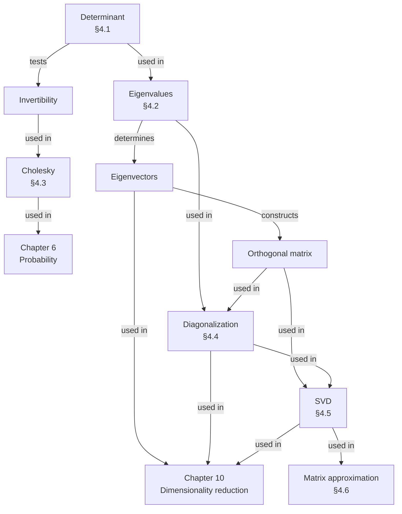

import MathDrillDeck from "../../../../components/MathDrillDeck.astro";
import Quiz from "../../../../components/Quiz.astro";

Chapters 2 and 3 gave you matrices and the geometry around them. This chapter asks the question those
two never did: **what is inside a matrix?**

The book's own framing is the useful one. Factoring a matrix is analogous to factoring an integer — $21$
into $7 \cdot 3$ — and the word **matrix factorization** is used interchangeably with decomposition for
that reason. A decomposition rewrites a matrix as a product of factors that are individually simple and
individually interpretable, and once you have that product, questions that were opaque about the matrix
become obvious about the factors.

## Three aspects, in order

The chapter has a deliberate structure, and it is worth having before you start.

**Summarise.** §4.1 and §4.2 give numbers that characterise a matrix without factoring it: the
**determinant**, the **trace**, and the **eigenvalues**. These are cheap, they are invariant under a
change of basis, and they tell you immediately what kind of object you are holding.

**Decompose.** §4.3 through §4.5 factor. **Cholesky** is a square root for symmetric positive definite
matrices. **Diagonalisation** rewrites a square matrix in its own eigenbasis. The **SVD** does the same
job for *any* matrix, square or not, and is often called the fundamental theorem of linear algebra
because of it.

**Approximate.** §4.6 uses the SVD to build the best possible low-rank approximation of a matrix, with
an exact error formula. That is image compression, denoising, recommender systems and PCA, all from one
theorem.

§4.7 then draws the whole taxonomy as a family tree.

That is the book's own Figure 4.1, and the two green destinations are the point: this chapter exists
because Chapters 6, 10 and 11 need it.

## What you'll learn

- The **determinant** as a signed volume, why it tests invertibility, and why nobody computes it by cofactor expansion.
- The **trace**, and the fact that it and the determinant are properties of a *linear mapping* rather than of a matrix — invariant under any change of basis.
- **Eigenvalues and eigenvectors**: the characteristic polynomial, algebraic against geometric multiplicity, and what **defective** means.
- The **spectral theorem** — symmetric matrices always have an orthonormal eigenbasis and real eigenvalues — which is the single most used result in the rest of the book.
- **Cholesky**, **eigendecomposition** and the **SVD**, what each requires, and what each gives you.
- The **Eckart-Young theorem**: the SVD truncation is the *best* rank-$k$ approximation, and its error is exactly the next singular value.

## The pages

| # | page | the big idea |
| --- | --- | --- |
| 4.1 | [Determinant and Trace](../determinant-and-trace/) | Two numbers that summarise a matrix. One is a signed volume and tests invertibility; the other is a sum of diagonal entries and survives any change of basis. |
| 4.2 | [Eigenvalues and Eigenvectors](../eigenvalues-and-eigenvectors/) | The directions a matrix only scales, and the scale factors. Where they come from, when there are too few of them, and why that matters. |
| 4.3 | [Cholesky Decomposition](../cholesky-decomposition/) | $\mathbf{A} = \mathbf{L}\mathbf{L}^\top$: a square root for SPD matrices. The engine behind Gaussian sampling, fast determinants and the reparametrisation trick. |
| 4.4 | [Eigendecomposition and Diagonalization](../eigendecomposition-and-diagonalization/) | $\mathbf{A} = \mathbf{P}\mathbf{D}\mathbf{P}^{-1}$: change into the eigenbasis, scale, change back. Matrix powers become scalar powers. |
| 4.5 | [Singular Value Decomposition](../singular-value-decomposition/) | $\mathbf{A} = \mathbf{U}\boldsymbol{\Sigma}\mathbf{V}^\top$ for **every** matrix. Rotate, scale, rotate — across two different spaces. |
| 4.6 | [Matrix Approximation](../matrix-approximation/) | Keep the top $k$ singular values and you have provably the closest rank-$k$ matrix, with an error of exactly $\sigma_{k+1}$. |
| 4.7 | [Matrix Phylogeny](../matrix-phylogeny/) | The family tree: which matrices are which, and which decomposition applies to each. |
| — | [Chapter 4 Exercises and Solutions](../chapter-4-exercises-and-solutions/) | All twelve of the book's exercises, worked and verified. |
| — | [Chapter 4 Formula Sheet](../chapter-4-formula-sheet/) | Every definition, theorem and equation on one page. |

Seven concept pages, about nine hours with the exercises. §4.5 is the longest and the one to spend time
on.

## The one theorem to carry out of here

If you remember nothing else, remember the **spectral theorem** (Theorem 4.15):

> If $\mathbf{A} \in \mathbb{R}^{n\times n}$ is symmetric, there exists an **orthonormal** basis of
> eigenvectors, and every eigenvalue is **real**.

Everything downstream leans on it. It gives symmetric matrices an eigendecomposition
$\mathbf{A} = \mathbf{P}\mathbf{D}\mathbf{P}^\top$ with an *orthogonal* $\mathbf{P}$; it is why the SVD
construction of §4.5.2 works at all, since $\mathbf{A}^\top\mathbf{A}$ is always symmetric; and it is
why PCA in Chapter 10 gets orthogonal principal components without asking for them. Symmetry is the
hypothesis that makes linear algebra behave.

## Prerequisites

- [Chapter 2](../../chapter-02---linear-algebra/linear-algebra-overview/) in full — especially [linear mappings](../../chapter-02---linear-algebra/linear-mappings/) and basis change, since a decomposition *is* a change of basis, and [rank](../../chapter-02---linear-algebra/basis-and-rank/), which the SVD reads off directly.
- [Chapter 3](../../chapter-03---analytic-geometry/analytic-geometry-overview/), specifically [orthonormal bases](../../chapter-03---analytic-geometry/orthonormal-basis/), [orthogonal matrices](../../chapter-03---analytic-geometry/angles-and-orthogonality/) and [projections](../../chapter-03---analytic-geometry/orthogonal-projections/). §4.5 and §4.6 are projections wearing different clothes.
- Positive definiteness from [§3.2](../../chapter-03---analytic-geometry/inner-products/) — Cholesky's entire hypothesis.

You do **not** need calculus for this chapter.

## Where this chapter is used later

| from Chapter 4 | used in |
| --- | --- |
| determinant, trace | Ch 6 — Gaussian densities carry $\det\boldsymbol{\Sigma}$; Ch 5 — Jacobians |
| eigenvalues | Ch 7 — the Hessian's spectrum decides whether an optimum is a minimum; Ch 10 — variance along a component |
| Cholesky | Ch 6 — sampling from a Gaussian; Ch 11 — GMM covariances |
| spectral theorem | Ch 10 — orthogonal principal components; Ch 12 — kernel matrices |
| eigendecomposition | Ch 10 — PCA is an eigendecomposition of a covariance matrix |
| **SVD** | Ch 9 — the pseudo-inverse; Ch 10 — PCA again, by another route |
| **Eckart-Young** | Ch 10 — the reconstruction-error derivation of PCA |

## A warning about the arithmetic

The book says it plainly and it is worth repeating up front: **determinants are a theoretical tool, not
a computational one.** Cofactor expansion costs about $n!$ multiplications; Gaussian elimination costs
about $n^3/3$. At $n = 20$ that ratio is $1.6 \times 10^{15}$, which the
[Determinant and Trace](../determinant-and-trace/) page measures.

The same caution applies to eigenvalues. The characteristic polynomial is how the definition is
*stated* and it is not how eigenvalues are *computed* — root-finding on a polynomial of degree $n$ is
badly conditioned, and every library uses an iterative factorisation instead. Similarly, §4.5's
construction of the SVD through $\mathbf{A}^\top\mathbf{A}$ is the right way to *understand* the SVD and
the wrong way to compute it, which the book notes explicitly. Each page separates the two.

<Quiz
  title="Before you start"
  questions={[
    {
      q: "What does the book compare matrix decomposition to?",
      options: [
        "Solving a system of equations",
        "Factoring an integer, such as 21 into 7 times 3 — which is why 'matrix factorization' is used as a synonym",
        "Differentiating a function",
        "Taking a limit",
      ],
      answer: 1,
      explain:
        "The analogy is load-bearing. The point of a factorisation is that the factors are individually simple, so questions that are opaque about the product become obvious about the pieces.",
    },
    {
      q: "Which decomposition works for every real matrix, square or not?",
      options: ["Cholesky", "Eigendecomposition", "The SVD", "All three"],
      answer: 2,
      explain:
        "Cholesky needs symmetric positive definite. Eigendecomposition needs square and non-defective. The SVD always exists, which is why it is called the fundamental theorem of linear algebra.",
    },
    {
      q: "The chapter's mind map has two green destination boxes. What are they, and what does that tell you?",
      options: [
        "Chapters 2 and 3, the prerequisites",
        "Chapter 6 on probability and Chapter 10 on dimensionality reduction — this chapter exists because those chapters need it",
        "Chapters 7 and 8",
        "Nothing in particular",
      ],
      answer: 1,
      explain:
        "Cholesky feeds Gaussian sampling in Chapter 6; eigenvectors, diagonalisation and the SVD all feed PCA in Chapter 10. Chapter 11 also depends on Cholesky for mixture covariances.",
    },
  ]}
/>

## Drill this chapter

Come back to this a day after reading a page rather than immediately.

<MathDrillDeck chapters={["Chapter 04 - Matrix Decompositions"]} />

## Where §4.8 points next

Section 4.8 is unusual: it spends most of its length arguing that the tools in this chapter are for
*characterising* matrices rather than for computing with them.

| §4.8's pointer | and where it lands in this module |
| --- | --- |
| determinants are *"fundamental tools in order to invert matrices and compute eigenvalues by hand"* | [Determinant and Trace](../determinant-and-trace/) |
| *"for almost all but the smallest instances, numerical computation by Gaussian elimination outperforms determinants"* | measured on this page's own warning about the arithmetic: cofactor expansion costs about $n!$ against $n^3/3$ |
| determinants remain a **theoretical** concept — the sign gives the orientation of a basis | [Determinant and Trace](../determinant-and-trace/), and Chapter 6's change-of-variables Jacobian |
| eigenvectors perform **basis changes** into orthogonal feature coordinates | [Eigendecomposition and Diagonalization](../eigendecomposition-and-diagonalization/), then Chapter 10 |
| Cholesky *"reappears often when we compute or simulate random events"* | [Cholesky Decomposition](../cholesky-decomposition/), and the Gaussian sampling of [Gaussian Distribution](../../chapter-06---probability-and-distributions/gaussian-distribution/) |
| matrix characterisation judges *"the numerical stability of computational operations"* | [Matrix Phylogeny](../matrix-phylogeny/) organises exactly these classes |

**The warning is the point.** Every definition in this chapter is stated through determinants and
characteristic polynomials, and almost none of them should be computed that way — which is why the
page on the arithmetic exists at all.

## Recall card

- **A matrix decomposition factors a matrix into simpler, interpretable pieces**, exactly as factoring an integer does — which is why factorization is a synonym.
- **The chapter has three aspects in order**: summarise a matrix with a few numbers, decompose it into factors, then use the factors to approximate it.
- **Determinant and trace summarise without factoring**, and both are invariant under a change of basis, so they characterise the linear mapping rather than the representation.
- **The spectral theorem is the result to remember**: a symmetric matrix has an orthonormal eigenbasis and real eigenvalues, which is what makes the eigendecomposition, the SVD construction and PCA all work.
- **Cholesky needs symmetric positive definite; eigendecomposition needs square and non-defective; the SVD needs nothing** and always exists.
- **Eckart-Young makes the SVD truncation provably optimal**, with an error equal to the next singular value exactly.
- **Determinants and characteristic polynomials are how the definitions are stated, not how anything is computed.** Cofactor expansion costs about n factorial against n cubed over three for elimination.

**Start with:** [Determinant and Trace](../determinant-and-trace/) — the two numbers everything else is
described in terms of.
