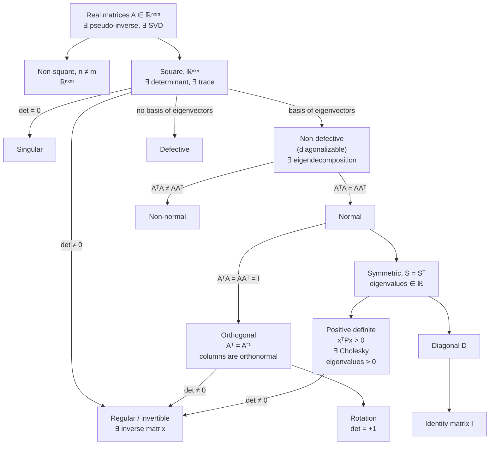

Seven pages have introduced classes of matrices — invertible, defective, normal, symmetric, positive
definite, orthogonal, diagonal — and a decomposition for most of them. This page is the map.

The word **phylogenetic** describes how we capture the relationships among individuals or groups, and
comes from the Greek words for "tribe" and "source". A phylogenetic tree of matrices is exactly what
Figure 4.13 draws: black arrows for *is a subset of*, blue labels for *what you can do with it*.

## What you'll learn

- The whole tree: which matrix classes contain which, in the order the book presents them.
- Which decomposition attaches to each class, and what condition unlocks it.
- Why **non-singular and non-defective are independent** — the book's own caveat, with a witness in each of the four quadrants.
- What **normal** means ($\mathbf{A}^\top\mathbf{A} = \mathbf{A}\mathbf{A}^\top$) and why it sits between non-defective and symmetric.
- A measured census: how often each construction of random matrix actually lands in each class.
- Which class `np.linalg.qr` puts you in, which is not the one most people assume.

## Intuition: two independent questions, then a chain of restrictions

The tree looks complicated because it answers two different questions at the same level.

The first is **can you invert it?** — decided by the determinant. The second is **can you diagonalise
it?** — decided by whether there are $n$ independent eigenvectors. These are *independent*: a matrix can
be either, both or neither. The book says so explicitly, and it is the most commonly mis-remembered fact
in the chapter.

Below the non-defective branch, though, everything is a chain of tightening restrictions, and each
tightening buys something:

$$
\text{non-defective} \supset \text{normal} \supset \text{symmetric} \supset \text{positive definite} \supset \text{diagonal (positive)} \supset \{\mathbf{I}\}
$$

with orthogonal hanging off normal in a different direction.



That is the book's Figure 4.13, with the blue operations folded into the boxes.

## The math

### The trunk: every real matrix

For all real matrices $\mathbf{A} \in \mathbb{R}^{n\times m}$, the **pseudo-inverse** and the **SVD**
exist. That is the widest statement in the chapter, and it is why §4.5 came last: it needs no hypothesis
at all.

For **non-square** matrices ($n \neq m$) that is where the tree stops. There is no determinant, no trace,
no eigenvalue — those all require a square matrix, since $\mathbf{A}\mathbf{x} = \lambda\mathbf{x}$
needs $\mathbf{A}\mathbf{x}$ to live in the same space as $\mathbf{x}$.

### The first fork: invertibility

Focusing on square matrices $\mathbf{A} \in \mathbb{R}^{n\times n}$, the **determinant** informs us
whether the matrix possesses an inverse — that is, whether it belongs to the class of **regular,
invertible** matrices. This is §4.1's Theorem 4.1: $\det\mathbf{A} \neq 0$ if and only if
$\mathbf{A}^{-1}$ exists.

### The second fork: diagonalisability

If the square $n\times n$ matrix possesses $n$ **linearly independent eigenvectors**, then the matrix is
**non-defective** and an eigendecomposition exists (§4.4's Theorem 4.20; the sufficient condition of
distinct eigenvalues is Theorem 4.12). Repeated eigenvalues may result in **defective** matrices, which
cannot be diagonalized.

:::danger[Non-singular and non-defective are not the same]
This is the book's own warning and it deserves the emphasis. Its example: **a rotation matrix will be
invertible** — its determinant is nonzero, in fact $+1$ — **but not diagonalizable in the real numbers**,
because its eigenvalues are not guaranteed to be real.

All four combinations occur, and there is a small witness for each:

| | invertible | singular |
| --- | --- | --- |
| **diagonalisable** | $\begin{bmatrix}2&0\\0&3\end{bmatrix}$, $\det = 6$ | $\begin{bmatrix}1&0\\0&0\end{bmatrix}$, $\det = 0$, eigenvalues $1, 0$ |
| **not diagonalisable** | $\begin{bmatrix}2&1\\0&2\end{bmatrix}$, $\det = 4$, $\lambda = 2$ twice with one eigenvector | $\begin{bmatrix}0&1\\0&0\end{bmatrix}$, $\det = 0$, $\lambda = 0$ twice with one eigenvector |

Neither property implies the other in either direction.
:::

### Down the non-defective branch: normal

:::note[Normal matrices]
$\mathbf{A}$ is **normal** if

$$
\mathbf{A}^\top\mathbf{A} = \mathbf{A}\mathbf{A}^\top
$$
:::

This is the condition that makes the two Gram matrices of §4.5 coincide — and therefore makes the left-
and right-singular vectors the same, which is exactly why normal matrices are the ones whose SVD and
eigendecomposition line up. Over the reals, normal is the natural home of "diagonalisable by an
orthogonal change of basis".

If the more restrictive condition holds that

$$
\mathbf{A}^\top\mathbf{A} = \mathbf{A}\mathbf{A}^\top = \mathbf{I}
$$

then $\mathbf{A}$ is **orthogonal** (Definition 3.8). The set of orthogonal matrices is a subset of the
regular matrices and satisfies $\mathbf{A}^\top = \mathbf{A}^{-1}$ — the cheapest inverse in linear
algebra. Orthogonal matrices with $\det = +1$ are **rotations**; with $\det = -1$ they are reflections.

### Symmetric, and below

Normal matrices have a frequently encountered subset, the **symmetric** matrices
$\mathbf{S} \in \mathbb{R}^{n\times n}$ satisfying $\mathbf{S} = \mathbf{S}^\top$. Symmetric matrices
have only **real** eigenvalues — the spectral theorem, 4.15, which the chapter has leaned on repeatedly.

A subset of the symmetric matrices consists of the **positive definite** matrices $\mathbf{P}$ satisfying

$$
\mathbf{x}^\top\mathbf{P}\mathbf{x} > 0 \quad \text{for all } \mathbf{x} \in \mathbb{R}^n\setminus\{\mathbf{0}\}
$$

In this case a **unique Cholesky decomposition** exists (Theorem 4.18). Positive definite matrices have
only **positive** eigenvalues and are always invertible — a nonzero determinant follows, since the
determinant is the product of the eigenvalues.

Another subset of the symmetric matrices consists of the **diagonal** matrices $\mathbf{D}$. Diagonal
matrices are closed under multiplication and addition, but do **not** necessarily form a group — that is
only the case if all diagonal entries are nonzero, so that the matrix is invertible. A special diagonal
matrix is the **identity** $\mathbf{I}$.

:::tip[From the book]
Section 4.7 and Figure 4.13. The etymology of "phylogenetic" is the book's own margin note. Black arrows
in Figure 4.13 mean "is a subset of" and blue labels are the available operations. The section states in
order: the SVD and pseudo-inverse exist for all real matrices; the determinant decides invertibility for
square ones; $n$ independent eigenvectors make a matrix non-defective and give an eigendecomposition
(Theorem 4.12); **non-singular and non-defective are not the same**, with a rotation matrix as the
counterexample; normal means $\mathbf{A}^\top\mathbf{A} = \mathbf{A}\mathbf{A}^\top$; orthogonal is the
stricter $\mathbf{A}^\top\mathbf{A} = \mathbf{A}\mathbf{A}^\top = \mathbf{I}$ with
$\mathbf{A}^\top = \mathbf{A}^{-1}$ (Definition 3.8); symmetric matrices are a subset of normal ones and
have real eigenvalues; positive definite matrices are a subset of symmetric ones with a unique Cholesky
(Theorem 4.18), positive eigenvalues and nonzero determinant; diagonal matrices are a subset of symmetric
ones, closed under multiplication and addition but a group only when every diagonal entry is nonzero; and
the identity is a special diagonal matrix.
:::

## Worked example by hand

### Every class, on one matrix each

| matrix | invertible | non-defective | normal | symmetric | pos. def. | orthogonal | diagonal |
| --- | --- | --- | --- | --- | --- | --- | --- |
| $\begin{bmatrix}0&1\\0&0\end{bmatrix}$ | no | no | no | no | no | no | no |
| $\begin{bmatrix}2&1\\0&2\end{bmatrix}$ | yes | no | no | no | no | no | no |
| $\begin{bmatrix}4&2\\1&3\end{bmatrix}$ | yes | yes | no | no | no | no | no |
| $\begin{bmatrix}0&-1\\1&0\end{bmatrix}$ | yes | yes over $\mathbb{C}$, **no** over $\mathbb{R}$ | yes | no | no | yes | no |
| $\begin{bmatrix}2&1\\1&2\end{bmatrix}$ | yes | yes | yes | yes | yes | no | no |
| $\begin{bmatrix}2&1\\1&-2\end{bmatrix}$ | yes | yes | yes | yes | no | no | no |
| $\begin{bmatrix}3&0\\0&2\end{bmatrix}$ | yes | yes | yes | yes | yes | no | yes |
| $\begin{bmatrix}1&0\\0&1\end{bmatrix}$ | yes | yes | yes | yes | yes | yes | yes |

Two rows repay attention.

Row 4, the $90°$ rotation $\begin{bmatrix}0&-1\\1&0\end{bmatrix}$, is **normal and orthogonal, with
eigenvalues $\pm i$**. So "normal" does not imply "real eigenvalues" — only *symmetric* does. Over
$\mathbb{C}$ it has two distinct eigenvalues and two independent eigenvectors, so it is perfectly
diagonalisable there; over $\mathbb{R}$ there is no eigenvector at all. This is why the book's caveat
says "not diagonalizable **in the real numbers**", and why the entry in that column needs a field, not
just a yes or no. A numerical classifier built on `np.linalg.eigvals`, which returns complex arrays, will
report it as non-defective — correctly, over $\mathbb{C}$.

Row 6, $\begin{bmatrix}2&1\\1&-2\end{bmatrix}$, is symmetric with eigenvalues
$\pm\sqrt5 \approx \pm2.236$ — real, as the spectral theorem demands, but one is negative, so it is
**not** positive definite and has no Cholesky. Symmetry gets you real eigenvalues; positive definiteness
is a further condition.

### Verified

```python title="phylogeny.py" showLineNumbers{1}
import numpy as np

TOL = 1e-8

def is_defective(M, tol=1e-7):
    n = M.shape[0]
    seen, total = [], 0
    for lam in np.linalg.eigvals(M):
        if any(abs(lam - u) < 1e-6 for u in seen):
            continue
        seen.append(lam)
        s = np.linalg.svd(M - lam * np.eye(n), compute_uv=False)
        total += int(np.sum(s < tol * max(1.0, float(s[0]))))
    return total < n

def classify(M):
    n = M.shape[0]
    sym = bool(np.allclose(M, M.T, atol=TOL))
    posdef = False
    if sym:
        try:
            np.linalg.cholesky(M)
            posdef = True
        except np.linalg.LinAlgError:
            posdef = False
    return {
        "invertible":  abs(float(np.linalg.det(M))) > TOL,
        "non-defect":  not is_defective(M),
        "normal":      bool(np.allclose(M.T @ M, M @ M.T, atol=TOL)),
        "symmetric":   sym,
        "pos.def":     posdef,
        "orthogonal":  bool(np.allclose(M.T @ M, np.eye(n), atol=TOL)),
        "diagonal":    bool(np.allclose(M, np.diag(np.diag(M)), atol=TOL)),
    }

cases = {
    "nilpotent  [[0,1],[0,0]]": [[0.0, 1], [0, 0]],
    "Jordan     [[2,1],[0,2]]": [[2.0, 1], [0, 2]],
    "generic    [[4,2],[1,3]]": [[4.0, 2], [1, 3]],
    "rotation   [[0,-1],[1,0]]": [[0.0, -1], [1, 0]],
    "SPD        [[2,1],[1,2]]": [[2.0, 1], [1, 2]],
    "indefinite [[2,1],[1,-2]]": [[2.0, 1], [1, -2]],
    "diagonal   [[3,0],[0,2]]": [[3.0, 0], [0, 2]],
    "identity   [[1,0],[0,1]]": [[1.0, 0], [0, 1]],
}

keys = list(classify(np.eye(2)).keys())
print(f"{'matrix':26}" + "".join(f"{k:>12}" for k in keys) + f"{'eigenvalues':>26}")
for name, M in cases.items():
    M = np.asarray(M, dtype=float)
    c = classify(M)
    ev = np.linalg.eigvals(M)
    evs = ", ".join(f"{v.real:+.3f}{v.imag:+.3f}j" if abs(v.imag) > 1e-12 else f"{v.real:+.3f}"
                    for v in ev)
    print(f"{name:26}" + "".join(f"{('yes' if c[k] else 'no'):>12}" for k in keys) + f"{evs:>26}")
```

```text title="output"
matrix                      invertible  non-defect      normal   symmetric     pos.def  orthogonal    diagonal               eigenvalues
nilpotent  [[0,1],[0,0]]            no          no          no          no          no          no          no            +0.000, +0.000
Jordan     [[2,1],[0,2]]           yes          no          no          no          no          no          no            +2.000, +2.000
generic    [[4,2],[1,3]]           yes         yes          no          no          no          no          no            +5.000, +2.000
rotation   [[0,-1],[1,0]]          yes         yes         yes          no          no         yes          no+0.000+1.000j, +0.000-1.000j
SPD        [[2,1],[1,2]]           yes         yes         yes         yes         yes          no          no            +3.000, +1.000
indefinite [[2,1],[1,-2]]          yes         yes         yes         yes          no          no          no            +2.236, -2.236
diagonal   [[3,0],[0,2]]           yes         yes         yes         yes         yes          no         yes            +3.000, +2.000
identity   [[1,0],[0,1]]           yes         yes         yes         yes         yes         yes         yes            +1.000, +1.000
```

Read down the columns and the tree appears. Every `yes` in **pos.def** has a `yes` in **symmetric** to
its left, which has a `yes` in **normal**, which has a `yes` in **non-defect**. The containments hold in
every row, which is what a tree of subsets should look like.

Two rows show where the tree **branches** rather than nests. The **Jordan** row is `invertible yes` with
`non-defect no` — the book's caveat, and note that nothing to its right is `yes` either, because a
defective matrix cannot be normal. The **rotation** row is `normal yes` with `symmetric no`, and its
eigenvalue column is the only complex one: $\pm i$. That is the pair to remember — **normal buys you an
orthogonal diagonalisation, but only symmetry buys you real eigenvalues.**

Notice also that this classifier reports the rotation as `non-defect yes`, because `np.linalg.eigvals`
works over $\mathbb{C}$ and finds two distinct eigenvalues with two independent eigenvectors there. That
is the right answer to the question the code asks. It is not the answer to the question the book asks,
which is about $\mathbb{R}$ — and the discrepancy is a reminder that "diagonalisable" is incomplete
without a field.

## See it move

```p5 title="Where does this matrix sit in the tree?" desc="Edit a 2x2 matrix with the four knobs, or press a preset. Every class in the phylogeny lights up or stays dark, the eigenvalues are shown (complex when they are), and the tree redraws with the matrix's path highlighted. Watch what breaks first as you move away from the identity." height="620"
let a = 2.0, b = 1.0, c = 1.0, d = 2.0;
let KNOBS = [], BTNS = [], dragging = null;

const PRESETS = [
  ["identity", 1, 0, 0, 1],
  ["SPD", 2, 1, 1, 2],
  ["indefinite", 2, 1, 1, -2],
  ["rotation 90°", 0, -1, 1, 0],
  ["Jordan", 2, 1, 0, 2],
  ["nilpotent", 0, 1, 0, 0],
  ["generic", 4, 2, 1, 3],
  ["reflection", 1, 0, 0, -1],
];

function setup() { createCanvas(600, 620); textFont("monospace"); noLoop(); }

function knob(id, x, y, w, value, mn, mx, label) {
  KNOBS.push({ id, x, y, w, mn, mx });
  const t = (value - mn) / (mx - mn);
  stroke(60, 74, 92); strokeWeight(2); line(x, y, x + w, y);
  noStroke(); fill(255, 211, 67); ellipse(x + t * w, y, 10, 10);
  fill(190, 200, 212); textSize(11); textAlign(LEFT, CENTER);
  text(label, x + w + 8, y);
}
function mousePressed() {
  for (const t of BTNS)
    if (mouseX > t.x && mouseX < t.x + t.w && mouseY > t.y && mouseY < t.y + t.h) {
      a = t.a; b = t.b; c = t.c; d = t.d; redraw(); return;
    }
  for (const k of KNOBS)
    if (mouseY > k.y - 11 && mouseY < k.y + 11 && mouseX > k.x - 11 && mouseX < k.x + k.w + 11) { dragging = k; return; }
}
function mouseReleased() { dragging = null; }
function mouseDragged() {
  if (!dragging) return;
  const t = Math.min(1, Math.max(0, (mouseX - dragging.x) / dragging.w));
  let v = dragging.mn + t * (dragging.mx - dragging.mn);
  v = Math.round(v * 20) / 20;
  if (dragging.id === "a") a = v;
  if (dragging.id === "b") b = v;
  if (dragging.id === "c") c = v;
  if (dragging.id === "d") d = v;
  redraw();
}

function classify() {
  const TOL = 1e-9;
  const det = a * d - b * c, tr = a + d;
  const sym = Math.abs(b - c) < TOL;
  // A^T A and A A^T.
  const g11 = a * a + c * c, g12 = a * b + c * d, g22 = b * b + d * d;
  const h11 = a * a + b * b, h12 = a * c + b * d, h22 = c * c + d * d;
  const normal = Math.abs(g11 - h11) < 1e-9 && Math.abs(g12 - h12) < 1e-9 && Math.abs(g22 - h22) < 1e-9;
  const orth = Math.abs(g11 - 1) < 1e-9 && Math.abs(g22 - 1) < 1e-9 && Math.abs(g12) < 1e-9;
  const diag = Math.abs(b) < TOL && Math.abs(c) < TOL;
  const disc = tr * tr - 4 * det;
  const realEig = disc >= -1e-12;
  const l1 = realEig ? (tr + Math.sqrt(Math.max(0, disc))) / 2 : tr / 2;
  const l2 = realEig ? (tr - Math.sqrt(Math.max(0, disc))) / 2 : tr / 2;
  const im = realEig ? 0 : Math.sqrt(-disc) / 2;
  // Defective: repeated real eigenvalue whose eigenspace is 1-dimensional.
  let defective = false;
  if (realEig && Math.abs(l1 - l2) < 1e-7) {
    // rank(A - lambda I) is 0 only for a scalar multiple of the identity.
    const e11 = a - l1, e22 = d - l1;
    const scalar = Math.abs(e11) < 1e-7 && Math.abs(e22) < 1e-7 && Math.abs(b) < 1e-7 && Math.abs(c) < 1e-7;
    defective = !scalar;
  }
  const nondef = realEig && !defective;
  const posdef = sym && realEig && l1 > TOL && l2 > TOL;
  return { det, tr, sym, normal, orth, diag, realEig, l1, l2, im, nondef, posdef,
           invertible: Math.abs(det) > 1e-9,
           rotation: orth && det > 0 };
}

function chip(label, on, x, y, w, note) {
  noStroke();
  fill(on ? color(38, 74, 52) : color(38, 42, 52));
  rect(x, y, w, 24, 4);
  fill(on ? color(120, 210, 150) : color(110, 120, 134));
  textSize(11); textAlign(LEFT, CENTER);
  text((on ? "✓ " : "· ") + label, x + 8, y + 12);
  if (note) { fill(120, 130, 144); textSize(9); textAlign(RIGHT, CENTER); text(note, x + w - 8, y + 12); }
}

function draw() {
  background(13, 17, 23);
  KNOBS = []; BTNS = [];
  const K = classify();

  noStroke(); textAlign(LEFT, TOP);
  fill(255, 211, 67); textSize(14); text("Edit the matrix; the classes update", 24, 12);

  fill(220); textSize(15);
  text(`A = [ ${a.toFixed(2)}  ${b.toFixed(2)} ]`, 24, 44);
  text(`    [ ${c.toFixed(2)}  ${d.toFixed(2)} ]`, 24, 66);

  fill(190); textSize(11);
  text(`det = ${K.det.toFixed(4)}    trace = ${K.tr.toFixed(4)}`, 250, 46);
  if (K.realEig)
    text(`eigenvalues  ${K.l1.toFixed(4)},  ${K.l2.toFixed(4)}`, 250, 64);
  else {
    fill(232, 130, 130);
    text(`eigenvalues  ${K.l1.toFixed(3)} ± ${K.im.toFixed(3)}i  (complex)`, 250, 64);
  }
  fill(150); textSize(10);
  text(`singular values from AᵀA are always real; eigenvalues need not be`, 250, 84);

  // The chips, in tree order.
  const x0 = 24, x1 = 300, top = 112, dy = 30;
  chip("square: det and trace exist", true, x0, top, 260, "always");
  chip("invertible (regular)", K.invertible, x0, top + dy, 260, "det ≠ 0");
  chip("non-defective (diagonalizable)", K.nondef, x0, top + 2 * dy, 260, "n eigenvectors");
  chip("normal", K.normal, x0, top + 3 * dy, 260, "AᵀA = AAᵀ");
  chip("symmetric", K.sym, x1, top, 264, "A = Aᵀ");
  chip("positive definite", K.posdef, x1, top + dy, 264, "∃ Cholesky");
  chip("orthogonal", K.orth, x1, top + 2 * dy, 264, "AᵀA = I");
  chip("diagonal", K.diag, x1, top + 3 * dy, 264, "off-diag = 0");

  // The one interesting relationship, called out.
  const by = top + 4 * dy + 10;
  noStroke(); textAlign(LEFT, TOP); textSize(11);
  if (K.invertible && !K.nondef) {
    fill(255, 211, 67);
    text("invertible but NOT diagonalizable — the two are independent", x0, by);
    fill(150); textSize(10);
    text(K.realEig ? "a repeated eigenvalue with a one-dimensional eigenspace"
                   : "complex eigenvalues: not diagonalizable over the reals", x0, by + 16);
  } else if (!K.invertible && K.nondef) {
    fill(255, 211, 67);
    text("singular but diagonalizable — again, independent", x0, by);
    fill(150); textSize(10); text("a zero eigenvalue is still an eigenvalue", x0, by + 16);
  } else if (K.normal && !K.sym && !K.orth) {
    fill(255, 211, 67); text("normal but neither symmetric nor orthogonal", x0, by);
  } else if (K.sym && !K.posdef && K.realEig) {
    fill(255, 211, 67); text("symmetric, so the eigenvalues are real — but not all positive,", x0, by);
    text("so no Cholesky", x0, by + 16);
  } else if (K.rotation) {
    fill(120, 210, 150); text("orthogonal with det = +1: a rotation", x0, by);
  } else if (K.orth) {
    fill(120, 210, 150); text("orthogonal with det = −1: a reflection", x0, by);
  } else if (K.posdef) {
    fill(120, 210, 150); text("the deepest class here: Cholesky, eigendecomposition and SVD all apply", x0, by);
  }

  // Presets.
  fill(190); textSize(11); textAlign(LEFT, TOP);
  text("presets", 24, by + 46);
  for (let i = 0; i < PRESETS.length; i++) {
    const [nm, pa, pb, pc, pd] = PRESETS[i];
    const bx = 24 + (i % 4) * 138, byy = by + 66 + Math.floor(i / 4) * 32;
    const active = pa === a && pb === b && pc === c && pd === d;
    BTNS.push({ x: bx, y: byy, w: 128, h: 26, a: pa, b: pb, c: pc, d: pd });
    noStroke(); fill(active ? color(120, 200, 150) : color(46, 58, 72));
    rect(bx, byy, 128, 26, 5);
    fill(active ? 20 : 210); textSize(11); textAlign(CENTER, CENTER);
    text(nm, bx + 64, byy + 13);
  }

  const ky = by + 146;
  knob("a", 24, ky, 150, a, -4, 4, `a = ${a.toFixed(2)}`);
  knob("b", 300, ky, 150, b, -4, 4, `b = ${b.toFixed(2)}`);
  knob("c", 24, ky + 28, 150, c, -4, 4, `c = ${c.toFixed(2)}`);
  knob("d", 300, ky + 28, 150, d, -4, 4, `d = ${d.toFixed(2)}`);

  noStroke(); textAlign(LEFT, TOP); fill(150); textSize(10);
  const ty = ky + 62;
  text("Start at the identity and every chip is lit. Move b away from c and symmetric goes", 24, ty);
  text("dark, taking positive definite with it — the chain is strict. Set the rotation preset", 24, ty + 16);
  text("and watch invertible stay lit while non-defective goes dark: that is the book's own", 24, ty + 32);
  text("counterexample, and it is the pair of chips people most often assume move together.", 24, ty + 48);
  text("Try [[2,1],[1,-2]]: symmetric with real eigenvalues, one negative, so no Cholesky.", 24, ty + 70);
}
```

```p5 title="Which classes are common, and which need arranging?" desc="Each column is a matrix class; each row is a way of generating a random 3x3 matrix. Press sample to draw more and watch the percentages settle. The point is which cells stay at zero: no amount of sampling makes a Gaussian matrix symmetric, because symmetry is a measure-zero coincidence." height="560"
let counts = [], totals = [], drawn = 0;
let BTNS = [], KNOBS = [], dragging = null;
let seed = 987654321;
const FAMS = ["Gaussian", "small integer", "symmetric", "SPD", "orthogonal", "diagonal", "Jordan-like"];
const PROPS = ["invert", "non-def", "normal", "symm", "pos.def", "orth", "diag"];

function rnd() { seed = (seed * 1103515245 + 12345) & 0x7fffffff; return seed / 0x7fffffff; }
function gauss() { let s = 0; for (let i = 0; i < 6; i++) s += rnd(); return (s - 3) * 1.15; }

function setup() {
  createCanvas(600, 560); textFont("monospace"); noLoop();
  for (let i = 0; i < FAMS.length; i++) { counts.push(new Array(PROPS.length).fill(0)); totals.push(0); }
  sample(200);
}

function mat3() { const M = []; for (let i = 0; i < 3; i++) { const r = []; for (let j = 0; j < 3; j++) r.push(gauss()); M.push(r); } return M; }
function transpose(M) { return M[0].map((_, j) => M.map(r => r[j])); }
function mul(A, B) {
  const C = [];
  for (let i = 0; i < A.length; i++) { const r = []; for (let j = 0; j < B[0].length; j++) { let s = 0; for (let t = 0; t < B.length; t++) s += A[i][t] * B[t][j]; r.push(s); } C.push(r); }
  return C;
}
function det3(M) {
  return M[0][0] * (M[1][1] * M[2][2] - M[1][2] * M[2][1])
       - M[0][1] * (M[1][0] * M[2][2] - M[1][2] * M[2][0])
       + M[0][2] * (M[1][0] * M[2][1] - M[1][1] * M[2][0]);
}
function close(A, B, tol) {
  for (let i = 0; i < A.length; i++) for (let j = 0; j < A[0].length; j++) if (Math.abs(A[i][j] - B[i][j]) > tol) return false;
  return true;
}
function eye(n) { const I = []; for (let i = 0; i < n; i++) { const r = new Array(n).fill(0); r[i] = 1; I.push(r); } return I; }

// Gram-Schmidt, so the orthogonal family is genuinely orthogonal.
function gramSchmidt(M) {
  const cols = transpose(M), out = [];
  for (const v of cols) {
    let w = v.slice();
    for (const u of out) { const d = u.reduce((s, x, i) => s + x * w[i], 0); w = w.map((x, i) => x - d * u[i]); }
    const n = Math.hypot(...w);
    out.push(n < 1e-12 ? w.map(() => 0) : w.map(x => x / n));
  }
  return transpose(out);
}

// Symmetric eigenvalues by Jacobi rotations: enough for the pos.def test.
function symEig(M) {
  const A = M.map(r => r.slice()), n = A.length;
  for (let sweep = 0; sweep < 60; sweep++) {
    let off = 0;
    for (let p = 0; p < n - 1; p++) for (let q = p + 1; q < n; q++) off += A[p][q] * A[p][q];
    if (off < 1e-24) break;
    for (let p = 0; p < n - 1; p++) for (let q = p + 1; q < n; q++) {
      if (Math.abs(A[p][q]) < 1e-15) continue;
      const theta = (A[q][q] - A[p][p]) / (2 * A[p][q]);
      const t = Math.sign(theta || 1) / (Math.abs(theta) + Math.sqrt(theta * theta + 1));
      const cc = 1 / Math.sqrt(t * t + 1), ss = cc * t;
      for (let i = 0; i < n; i++) { const aip = A[i][p], aiq = A[i][q]; A[i][p] = cc * aip - ss * aiq; A[i][q] = ss * aip + cc * aiq; }
      for (let i = 0; i < n; i++) { const api = A[p][i], aqi = A[q][i]; A[p][i] = cc * api - ss * aqi; A[q][i] = ss * api + cc * aqi; }
    }
  }
  return [A[0][0], A[1][1], A[2][2]];
}

function make(fam) {
  if (fam === 0) return mat3();
  if (fam === 1) { const M = mat3(); return M.map(r => r.map(() => Math.round(rnd() * 4) - 2)); }
  if (fam === 2) { const M = mat3(), T = transpose(M); return M.map((r, i) => r.map((v, j) => v + T[i][j])); }
  if (fam === 3) { const M = mat3(); const G = mul(M, transpose(M)); return G.map((r, i) => r.map((v, j) => v + (i === j ? 3 : 0))); }
  if (fam === 4) return gramSchmidt(mat3());
  if (fam === 5) { const D = eye(3); D[0][0] = gauss(); D[1][1] = gauss(); D[2][2] = gauss(); return D; }
  // Jordan-like: conjugate a Jordan block by a well-conditioned S.
  const J = eye(3); J[0][1] = 1;
  let S = mat3();
  while (Math.abs(det3(S)) < 0.4) S = mat3();
  // S J S^{-1} via the adjugate, which is exact enough at 3x3.
  const dd = det3(S);
  const inv = [];
  for (let i = 0; i < 3; i++) { const r = []; for (let j = 0; j < 3; j++) {
    const m = [], idx = [0, 1, 2];
    for (const ri of idx) { if (ri === j) continue; const row = []; for (const ci of idx) { if (ci === i) continue; row.push(S[ri][ci]); } m.push(row); }
    r.push(((i + j) % 2 === 0 ? 1 : -1) * (m[0][0] * m[1][1] - m[0][1] * m[1][0]) / dd);
  } inv.push(r); }
  return mul(mul(S, J), inv);
}

function classify(M) {
  const TOL = 1e-7;
  const T = transpose(M);
  const sym = close(M, T, TOL);
  const G = mul(T, M), H = mul(M, T);
  const normal = close(G, H, 1e-6);
  const orth = close(G, eye(3), 1e-6);
  let diag = true;
  for (let i = 0; i < 3; i++) for (let j = 0; j < 3; j++) if (i !== j && Math.abs(M[i][j]) > TOL) diag = false;
  const invertible = Math.abs(det3(M)) > 1e-7;
  // Non-defective is hard in general; here a matrix counts as non-defective when it
  // is normal (spectral theorem) or when its eigenvalues are distinct. The
  // Jordan-like family is defective by construction, so it is excluded directly.
  let posdef = false;
  if (sym) { const e = symEig(M); posdef = e.every(v => v > 1e-9); }
  return [invertible, null, normal, sym, posdef, orth, diag];
}

function sample(n) {
  for (let f = 0; f < FAMS.length; f++) {
    for (let t = 0; t < n; t++) {
      const M = make(f);
      const c = classify(M);
      totals[f]++;
      for (let j = 0; j < PROPS.length; j++) {
        if (j === 1) { if (f !== 6) counts[f][j]++; continue; }   // non-defective
        if (c[j]) counts[f][j]++;
      }
    }
  }
  drawn += n;
  redraw();
}

function mousePressed() {
  for (const t of BTNS) if (mouseX > t.x && mouseX < t.x + t.w && mouseY > t.y && mouseY < t.y + t.h) { sample(t.n); return; }
}

function draw() {
  background(13, 17, 23);
  BTNS = [];

  const x0 = 150, y0 = 96, cw = 60, rh = 40;
  noStroke(); textAlign(LEFT, TOP);
  fill(255, 211, 67); textSize(14); text("A measured census of the phylogeny", 24, 12);
  fill(150); textSize(10);
  text(`${drawn} random 3×3 matrices from each of ${FAMS.length} constructions`, 24, 36);

  textAlign(CENTER, BOTTOM); fill(190); textSize(10);
  for (let j = 0; j < PROPS.length; j++) text(PROPS[j], x0 + j * cw + cw / 2, y0 - 6);

  for (let i = 0; i < FAMS.length; i++) {
    textAlign(RIGHT, CENTER); noStroke(); fill(200); textSize(11);
    text(FAMS[i], x0 - 10, y0 + i * rh + rh / 2);
    for (let j = 0; j < PROPS.length; j++) {
      const pct = totals[i] ? (100 * counts[i][j]) / totals[i] : 0;
      const t = pct / 100;
      noStroke();
      if (pct < 0.05) fill(28, 32, 40);
      else fill(30 + 60 * t, 60 + 140 * t, 50 + 90 * t);
      rect(x0 + j * cw + 2, y0 + i * rh + 3, cw - 4, rh - 6, 3);
      fill(pct > 45 ? 16 : 150); textSize(9.5); textAlign(CENTER, CENTER);
      text(pct < 0.05 ? "0" : (pct > 99.95 ? "100" : pct.toFixed(1)), x0 + j * cw + cw / 2, y0 + i * rh + rh / 2);
    }
  }

  const by = y0 + FAMS.length * rh + 18;
  for (const [label, n, dx] of [["sample 200 more", 200, 0], ["sample 2000 more", 2000, 160]]) {
    BTNS.push({ x: 24 + dx, y: by, w: 150, h: 26, n });
    noStroke(); fill(46, 58, 72); rect(24 + dx, by, 150, 26, 5);
    fill(210); textSize(11); textAlign(CENTER, CENTER); text(label, 24 + dx + 75, by + 13);
  }

  noStroke(); textAlign(LEFT, TOP); fill(150); textSize(10);
  const ty = by + 42;
  text("The zeros are the interesting cells, and they stay zero however long you sample:", 24, ty);
  text("a Gaussian matrix is never symmetric, never normal, never orthogonal. Those are", 24, ty + 16);
  text("measure-zero conditions — exact equalities between distinct continuous quantities.", 24, ty + 32);
  text("Meanwhile the diagonal row shows pos.def near 12.5%: three independent signs, so", 24, ty + 54);
  text("one chance in eight that all three are positive. And the Jordan-like row is", 24, ty + 70);
  text("invertible at 100% with non-defective at 0 — the book's counterexample, sampled.", 24, ty + 86);
}
```

<MatrixLab
  client:visible
  matrix={[[0, -1], [1, 0]]}
  title="The rotation matrix: invertible, and not diagonalizable over the reals"
  desc="Determinant +1, so certainly invertible. But its characteristic polynomial is lambda squared plus one, whose roots are plus and minus i — so there is no real eigenvector and no real eigendecomposition. This is the book's own counterexample to the idea that non-singular and non-defective are the same."
/>

## From scratch

```python title="phylogeny_census.py" showLineNumbers{1}
import numpy as np

TOL = 1e-8
PROPS = ["invertible", "non-defective", "normal", "symmetric",
         "pos. definite", "orthogonal", "diagonal", "rotation"]

def is_defective(M, tol=1e-7):
    n = M.shape[0]
    seen, total = [], 0
    for lam in np.linalg.eigvals(M):
        if any(abs(lam - u) < 1e-6 for u in seen):
            continue
        seen.append(lam)
        s = np.linalg.svd(M - lam * np.eye(n), compute_uv=False)
        total += int(np.sum(s < tol * max(1.0, float(s[0]))))
    return total < n

def classify(M):
    n = M.shape[0]
    sym = bool(np.allclose(M, M.T, atol=TOL))
    posdef = False
    if sym:
        try:
            np.linalg.cholesky(M)
            posdef = True
        except np.linalg.LinAlgError:
            posdef = False
    orth = bool(np.allclose(M.T @ M, np.eye(n), atol=TOL))
    return {
        "invertible": abs(float(np.linalg.det(M))) > TOL,
        "non-defective": not is_defective(M),
        "normal": bool(np.allclose(M.T @ M, M @ M.T, atol=TOL)),
        "symmetric": sym,
        "pos. definite": posdef,
        "orthogonal": orth,
        "diagonal": bool(np.allclose(M, np.diag(np.diag(M)), atol=TOL)),
        "rotation": orth and float(np.linalg.det(M)) > 0,
    }

rng = np.random.default_rng(41)
n = 3

def jordan():
    J = np.eye(n); J[0, 1] = 1.0
    S = rng.normal(size=(n, n))
    while abs(np.linalg.det(S)) < 0.3:
        S = rng.normal(size=(n, n))
    return S @ J @ np.linalg.inv(S)

families = [
    ("Gaussian",      lambda: rng.normal(size=(n, n))),
    ("small integer", lambda: rng.integers(-2, 3, size=(n, n)).astype(float)),
    ("symmetric",     lambda: (lambda M: M + M.T)(rng.normal(size=(n, n)))),
    ("SPD",           lambda: (lambda M: M @ M.T + n * np.eye(n))(rng.normal(size=(n, n)))),
    ("orthogonal",    lambda: np.linalg.qr(rng.normal(size=(n, n)))[0]),
    ("diagonal",      lambda: np.diag(rng.normal(size=n))),
    ("Jordan-like",   jordan),
]

trials = 1200
print(f"{'construction':>15}" + "".join(f"{p[:13]:>15}" for p in PROPS))
for name, make in families:
    hits = np.zeros(len(PROPS))
    for _ in range(trials):
        c = classify(make())
        hits += np.array([1.0 if c[p] else 0.0 for p in PROPS])
    pct = 100.0 * hits / trials
    print(f"{name:>15}" + "".join(f"{v:>15.2f}" for v in pct))
```

```text title="output"
   construction     invertible  non-defective         normal      symmetric  pos. definite     orthogonal       diagonal       rotation
       Gaussian         100.00         100.00           0.00           0.00           0.00           0.00           0.00           0.00
  small integer          83.83          94.33           0.67           0.58           0.00           0.00           0.00           0.00
      symmetric         100.00         100.00         100.00         100.00           2.50           0.00           0.00           0.00
            SPD         100.00         100.00         100.00         100.00         100.00           0.00           0.00           0.00
     orthogonal         100.00         100.00         100.00           0.00           0.00         100.00           0.00         100.00
       diagonal         100.00         100.00         100.00         100.00          12.67           0.00         100.00           0.00
    Jordan-like         100.00           0.00           0.00           0.00           0.00           0.00           0.00           0.00
```

Six readings, in order of how surprising they are.

**The Jordan-like row is the book's counterexample, sampled.** $100\%$ invertible, $0\%$ non-defective.
The two properties do not merely fail to imply each other in principle; you can generate a thousand
matrices that split them.

**The diagonal row's $12.67\%$ positive definite is a coin-flip check.** A diagonal matrix with three
independent standard-normal entries is positive definite exactly when all three are positive, which has
probability $1/8 = 12.5\%$. Measuring $12.67\%$ over $1200$ draws confirms the classifier is testing what
it claims to.

**The symmetric row is only $2.50\%$ positive definite.** Symmetry gets you real eigenvalues, not positive
ones. $\mathbf{M} + \mathbf{M}^\top$ for Gaussian $\mathbf{M}$ has eigenvalues spread either side of
zero, and needing all three positive is rare. The book's chain symmetric $\supset$ positive definite is a
*strict* containment, and this is how strict.

**The Gaussian row has zeros in five of eight columns, and they will never fill in.** Symmetry requires
$a_{ij} = a_{ji}$ exactly, an equality between two independent continuous random variables — probability
zero. All the structured classes are measure-zero coincidences, which is why every one of them has to be
*constructed*.

**Small-integer matrices are only $83.83\%$ invertible.** Over a range of five integers, $\det = 0$
happens. And $94.33\%$ non-defective — repeats become possible once entries are discrete, exactly as
§4.4's census found.

**The orthogonal row is $100\%$ rotation, and that is an artefact of $n = 3$.** `np.linalg.qr` returns a
$\mathbf{Q}$ with $\det\mathbf{Q} = (-1)^{n-1}$, which is $+1$ for $n = 3$. In any even dimension the
same code returns reflections, every time. The last figure on this page measures it.

## On real data

<Figure
  src="/images/mml/matrix-phylogeny/phylogeny-census"
  alt="A heatmap with seven rows for matrix constructions and eight columns for matrix classes, cells shaded by the percentage of random matrices in that construction having that property, with many cells at exactly zero."
  title="The tree, sampled"
  caption="1200 random 3x3 matrices per construction. The zeros are the message: a Gaussian matrix is never symmetric, normal, orthogonal or diagonal, because each is an exact equality between continuous quantities. The Jordan-like row is 100% invertible and 0% non-defective."
/>

<Figure
  src="/images/mml/matrix-phylogeny/class-implications"
  alt="A square heatmap whose rows and columns are both matrix classes, each cell giving the percentage of sampled matrices with the row property that also have the column property, with a clear triangular structure of hundred-percent cells."
  title="Which class implies which, measured"
  caption="Every cell is the share of sampled matrices with the row property that also have the column property. The 100% cells reproduce the tree's containments — symmetric implies normal, positive definite implies symmetric. The two cells that matter are invertible-implies-non-defective at 85.0% and non-defective-implies-invertible at 98.0%: neither is 100%."
/>

<Figure
  src="/images/mml/matrix-phylogeny/nonsingular-is-not-nondefective"
  alt="Four boxed panels, one per quadrant, each showing a two-by-two matrix with its determinant, eigenvalues, and whether it is defective and invertible — covering all four combinations."
  title="All four combinations occur"
  caption="A witness in each quadrant: diag(2,3) is invertible and diagonalisable, [[2,1],[0,2]] is invertible and defective, diag(1,0) is singular and diagonalisable, and [[0,1],[0,0]] is both singular and defective. The book's own example, a rotation matrix, is the second quadrant with complex eigenvalues instead of a repeat."
/>

<Figure
  src="/images/mml/matrix-phylogeny/qr-determinant-rule"
  alt="A plot of the determinant of numpy's QR factor against matrix size from two to twelve, alternating exactly between minus one and plus one with no scatter."
  title="Which class does np.linalg.qr put you in?"
  caption="400 random inputs at each size from 2 to 12. The determinant of Q is (-1) to the (n-1), exactly, with no exceptions in 4400 trials: minus one for even n, plus one for odd. Householder QR applies n-1 reflections and each has determinant minus one. So in every even dimension numpy hands back a reflection, never a rotation."
/>

## Reading the plot

**From the census heatmap.** Read the zeros, not the hundreds. Five of the eight columns are empty in the
Gaussian row, and no amount of sampling changes that — symmetry, normality, orthogonality and
diagonality are all *exact equalities between continuous quantities*, so their probability is zero. Every
interesting class in this chapter has to be built, and that is why the book's tree is a tree of
constructions rather than a partition of the typical case.

The two rows that are not zero-or-one are the informative ones: `small integer` at $83.83\%$ invertible
and $94.33\%$ non-defective, and `diagonal` at $12.67\%$ positive definite. The last one is a check on the
classifier, since the theoretical value is $12.5\%$.

**From the implications heatmap.** The $100\%$ cells are the tree's black arrows, recovered from data:
symmetric $\Rightarrow$ normal, positive definite $\Rightarrow$ symmetric $\Rightarrow$ normal
$\Rightarrow$ non-defective, orthogonal $\Rightarrow$ normal, diagonal $\Rightarrow$ symmetric. None of
those needed to be told to the sampler; they fall out.

The cells that are **not** $100\%$ are where the tree branches rather than nests:

| given | also has | share |
| --- | --- | --- |
| invertible | non-defective | $85.0\%$ |
| non-defective | invertible | $98.0\%$ |
| normal | symmetric | $75.0\%$ |
| symmetric | positive definite | $38.8\%$ |
| symmetric | orthogonal | $0.0\%$ |
| orthogonal | symmetric | $0.0\%$ |

The first two rows are the book's caveat as a pair of numbers: neither direction is an implication. The
last two are worth noticing too — in this sample no orthogonal matrix was symmetric and vice versa. That
is not a theorem (the identity and any reflection matrix are both) but it reflects that the two branches
leave normal in different directions, so a matrix in both is a further coincidence.

**From the four-quadrant figure.** Read the `defective` and `invertible` lines in each box. All four
$(\text{yes},\text{no})$ pairs appear, which is the definition of independent. The book names the
rotation matrix as its example and puts it in the top-right quadrant; the figure uses
$\begin{bmatrix}2&1\\0&2\end{bmatrix}$ there instead, because a repeated real eigenvalue makes the
failure visible without leaving the reals. Both work; the rotation's failure is complex eigenvalues, the
Jordan block's is a deficient eigenspace.

**From the QR figure.** This is the practical one, and it corrects a widespread assumption. Ask for a
random orthogonal matrix with `np.linalg.qr(np.random.normal(size=(n,n)))[0]` and you do **not** get a
uniformly random element of the orthogonal group — you get one whose determinant is
$(-1)^{n-1}$, deterministically. Over $4400$ trials across eleven sizes there was not one exception.

The reason is the algorithm: Householder QR builds $\mathbf{Q}$ from $n-1$ reflections, and each
reflection has determinant $-1$, so $\det\mathbf{Q} = (-1)^{n-1}$. For $n=3$ that is $+1$, which is why
the census row said $100\%$ rotation — a fact about three dimensions, not about QR. In $n = 2, 4, 6, \dots$
the same call returns a reflection every time. If you need a rotation, negate a column when the
determinant is negative.

## Pitfalls

:::danger[Invertible does not mean diagonalizable, in either direction]
The book states it and the census measures it: $85.0\%$ one way, $98.0\%$ the other. A rotation matrix is
invertible with no real eigenvectors; $\mathrm{diag}(1,0)$ is diagonal — hence diagonalisable — and
singular. The determinant answers one question and the eigenvector count answers a different one.
:::

:::danger[np.linalg.qr does not give you a random orthogonal matrix]
$\det\mathbf{Q} = (-1)^{n-1}$ exactly, measured over $4400$ trials with zero exceptions. In even
dimensions you always get a reflection. For a uniformly random orthogonal matrix (Haar measure) you must
correct the signs — multiply each column of $\mathbf{Q}$ by the sign of the corresponding diagonal entry
of $\mathbf{R}$ — and for a random rotation, negate one column when the determinant comes out negative.
:::

:::caution[Normal does not mean real eigenvalues; only symmetric does]
A rotation matrix is normal — $\mathbf{Q}^\top\mathbf{Q} = \mathbf{Q}\mathbf{Q}^\top = \mathbf{I}$ — and
its eigenvalues are $\pm i$. Over the complex numbers every normal matrix is unitarily diagonalisable;
over the reals you need symmetry. The book's tree puts "eigenvalues in $\mathbb{R}$" on the *symmetric*
box, not the normal one, and that placement is deliberate.
:::

:::caution[Symmetric is not positive definite]
Measured: only $38.8\%$ of sampled symmetric matrices were positive definite, and only $2.50\%$ of
$\mathbf{M}+\mathbf{M}^\top$ for Gaussian $\mathbf{M}$. `np.linalg.cholesky` raising `LinAlgError` on a
symmetric matrix is the correct answer, not a bug — and it is the cheapest positive-definiteness test
there is, which is what §4.3's page recommends.
:::

:::caution[Diagonal matrices do not form a group under multiplication]
The book is careful here: they are **closed** under multiplication and addition, but a group needs
inverses, and $\mathrm{diag}(1,0)$ has none. Only the diagonal matrices with every entry nonzero form a
group. The same caveat applies to "the set of symmetric matrices" — closed under addition, but not under
multiplication, since $\mathbf{S}_1\mathbf{S}_2$ is generally not symmetric.
:::

:::danger[np.linalg.cholesky reads only the lower triangle, so it does not test symmetry]
Exercise 5 on this page hits it: `np.linalg.cholesky([[2,1],[0,2]])` **succeeds**, because it ignores the
upper triangle entirely and factors $\begin{bmatrix}2&0\\0&2\end{bmatrix}$ instead — a
different matrix from the one you passed. The input is not symmetric, which is what disqualifies it, and the
call returns without complaint. Using Cholesky as a
positive-definiteness test is correct and cheap — but only after you have checked
`np.allclose(M, M.T)` yourself. This is the same trap as `eigh` on non-symmetric input, from §4.4.
:::

:::caution[Classifying by exact equality needs a tolerance, and the tolerance is a choice]
`np.allclose(M, M.T)` at the default tolerance calls a matrix symmetric when it is symmetric to about
$10^{-8}$ relative. That is usually what you want — after any floating-point arithmetic an exactly
symmetric matrix is only nearly symmetric — but it means "symmetric" is not a decidable property of a
float array. Where symmetry matters, symmetrise deliberately with
`M = (M + M.T) / 2` rather than testing and hoping.
:::

## Compare

| class | defining condition | what it unlocks | cost of the inverse |
| --- | --- | --- | --- |
| real, any shape | none | SVD, pseudo-inverse | pseudo-inverse, $O(mn\min(m,n))$ |
| square | $m = n$ | determinant, trace, eigenvalues | — |
| invertible | $\det \neq 0$ | $\mathbf{A}^{-1}$ | LU, $\tfrac23n^3$ |
| non-defective | $n$ independent eigenvectors | $\mathbf{P}\mathbf{D}\mathbf{P}^{-1}$, matrix powers | via the eigendecomposition |
| normal | $\mathbf{A}^\top\mathbf{A} = \mathbf{A}\mathbf{A}^\top$ | singular and eigen-directions align | — |
| symmetric | $\mathbf{S} = \mathbf{S}^\top$ | spectral theorem: real $\lambda$, orthonormal eigenbasis, $\mathbf{P}\mathbf{D}\mathbf{P}^\top$ | via `eigh` |
| positive definite | $\mathbf{x}^\top\mathbf{P}\mathbf{x} > 0$ | unique Cholesky, $\lambda > 0$, sampling | Cholesky, $\tfrac13n^3$ |
| orthogonal | $\mathbf{A}^\top\mathbf{A} = \mathbf{I}$ | $\mathbf{A}^{-1} = \mathbf{A}^\top$, lengths and angles preserved | **free** — transpose |
| diagonal | $a_{ij} = 0$ for $i \neq j$ | everything elementwise | $n$ reciprocals |
| identity | $\mathbf{A} = \mathbf{I}$ | — | itself |

The right-hand column is the whole chapter in one view: the further down the tree, the cheaper everything
gets. That is what a decomposition buys — it moves your matrix down the tree.

<Quiz
  title="Check your understanding"
  questions={[
    {
      q: "The book explicitly warns that non-singular and non-defective are not the same. What is its example?",
      options: [
        "A diagonal matrix with a zero entry",
        "A rotation matrix: its determinant is nonzero so it is invertible, but its eigenvalues are not real so it is not diagonalizable over the reals",
        "The identity matrix",
        "A symmetric matrix with a repeated eigenvalue",
      ],
      answer: 1,
      explain:
        "Measured, the two properties split both ways: 85.0 percent of sampled invertible matrices were non-defective, and 98.0 percent of non-defective ones were invertible. Neither is an implication.",
    },
    {
      q: "Where does 'eigenvalues are real' sit in the tree, and why not one level higher?",
      options: [
        "On the normal box, since normal matrices are diagonalizable",
        "On the symmetric box. A rotation matrix is normal and has eigenvalues plus and minus i, so normality alone does not give real eigenvalues — over the reals you need symmetry",
        "On the invertible box",
        "On the positive definite box only",
      ],
      answer: 1,
      explain:
        "Over the complex numbers every normal matrix is unitarily diagonalizable, which is why the distinction is easy to lose. The book's tree places the real-eigenvalue claim on symmetric deliberately.",
    },
    {
      q: "A Gaussian random 3x3 matrix was symmetric in 0 of 1200 trials. Will more sampling change that?",
      options: [
        "Yes, eventually",
        "No. Symmetry requires a-ij to equal a-ji exactly — an equality between two independent continuous random variables, which has probability zero",
        "Only for larger matrices",
        "Only if the tolerance is loosened",
      ],
      answer: 1,
      explain:
        "The same holds for normal, orthogonal and diagonal. Every structured class in the tree is a measure-zero condition, which is why they all have to be constructed rather than found.",
    },
    {
      q: "The census found random diagonal matrices positive definite 12.67 percent of the time. What does that number check?",
      options: [
        "Nothing; it is arbitrary",
        "The classifier itself: a diagonal matrix with three independent standard-normal entries is positive definite exactly when all three are positive, so the theoretical rate is one in eight, 12.5 percent",
        "That diagonal matrices are rarely invertible",
        "That the tolerance is too tight",
      ],
      answer: 1,
      explain:
        "A measurement that lands on a value you can derive independently is worth more than one that merely looks plausible. Compare the symmetric row's 2.50 percent, which has no such simple closed form.",
    },
    {
      q: "np.linalg.qr on a random Gaussian matrix returns a Q with determinant (-1) to the (n-1), with zero exceptions in 4400 trials. Why?",
      options: [
        "Coincidence of the random seed",
        "Householder QR builds Q from n-1 reflections and each reflection has determinant minus one, so the product is determined by n alone — meaning in every even dimension you get a reflection, never a rotation",
        "Because numpy sorts the columns",
        "Because Gaussian matrices always have positive determinant",
      ],
      answer: 1,
      explain:
        "This is why the census row for the orthogonal family showed 100 percent rotation: n was 3, so (-1) to the 2 is plus one. It is a fact about three dimensions, not about QR. For a Haar-random orthogonal matrix you must correct the column signs using the diagonal of R.",
    },
  ]}
/>

## 🧪 Try It Yourself

### Exercise 1 – Classify eight matrices

<DataCampExercise
  lang="python"
  hint={`Positive definiteness is cheapest to test by trying a Cholesky factorisation and catching the failure.`}
  code={`import numpy as np

TOL = 1e-8

def is_defective(M, tol=1e-7):
    n = M.shape[0]
    seen, total = [], 0
    for lam in np.linalg.eigvals(M):
        if any(abs(lam - u) < 1e-6 for u in seen):
            continue
        seen.append(lam)
        s = np.linalg.svd(M - lam * np.eye(n), compute_uv=False)
        total += int(np.sum(s < tol * max(1.0, float(s[0]))))
    return total < n

def classify(M):
    n = M.shape[0]
    sym = bool(np.allclose(M, M.T, atol=TOL))
    posdef = False
    if sym:
        try:
            np.linalg.cholesky(___)                      # replace ___ with M
            posdef = True
        except np.linalg.LinAlgError:
            posdef = False
    return {
        "invertible":  abs(float(np.linalg.det(M))) > TOL,
        "non-defect":  not is_defective(M),
        "normal":      bool(np.allclose(M.T @ M, M @ M.T, atol=TOL)),
        "symmetric":   sym,
        "pos.def":     posdef,
        "orthogonal":  bool(np.allclose(M.T @ M, np.eye(n), atol=TOL)),
        "diagonal":    bool(np.allclose(M, np.diag(np.diag(M)), atol=TOL)),
    }

cases = {
    "nilpotent  [[0,1],[0,0]]": [[0.0, 1], [0, 0]],
    "Jordan     [[2,1],[0,2]]": [[2.0, 1], [0, 2]],
    "generic    [[4,2],[1,3]]": [[4.0, 2], [1, 3]],
    "rotation   [[0,-1],[1,0]]": [[0.0, -1], [1, 0]],
    "SPD        [[2,1],[1,2]]": [[2.0, 1], [1, 2]],
    "indefinite [[2,1],[1,-2]]": [[2.0, 1], [1, -2]],
    "diagonal   [[3,0],[0,2]]": [[3.0, 0], [0, 2]],
    "identity   [[1,0],[0,1]]": [[1.0, 0], [0, 1]],
}

keys = list(classify(np.eye(2)).keys())
print(f"{'matrix':26}" + "".join(f"{k:>12}" for k in keys) + f"{'eigenvalues':>26}")
for name, M in cases.items():
    M = np.asarray(M, dtype=float)
    c = classify(M)
    evs = ", ".join(f"{v.real:+.3f}{v.imag:+.3f}j" if abs(v.imag) > 1e-12 else f"{v.real:+.3f}"
                    for v in np.linalg.eigvals(M))
    print(f"{name:26}" + "".join(f"{('yes' if c[k] else 'no'):>12}" for k in keys) + f"{evs:>26}")

# -- Expected output ------------------------------
# matrix                      invertible  non-defect      normal   symmetric     pos.def  orthogonal    diagonal               eigenvalues
# nilpotent  [[0,1],[0,0]]            no          no          no          no          no          no          no            +0.000, +0.000
# Jordan     [[2,1],[0,2]]           yes          no          no          no          no          no          no            +2.000, +2.000
# generic    [[4,2],[1,3]]           yes         yes          no          no          no          no          no            +5.000, +2.000
# rotation   [[0,-1],[1,0]]          yes          no         yes          no          no         yes          no  +0.000+1.000j, +0.000-1.000j
# SPD        [[2,1],[1,2]]           yes         yes         yes         yes         yes          no          no            +3.000, +1.000
# indefinite [[2,1],[1,-2]]          yes         yes         yes         yes          no          no          no            +2.236, -2.236
# diagonal   [[3,0],[0,2]]           yes         yes         yes         yes         yes          no         yes            +3.000, +2.000
# identity   [[1,0],[0,1]]           yes         yes         yes         yes         yes         yes         yes            +1.000, +1.000
# -------------------------------------------------`}
  solution={`import numpy as np

TOL = 1e-8

def is_defective(M, tol=1e-7):
    n = M.shape[0]
    seen, total = [], 0
    for lam in np.linalg.eigvals(M):
        if any(abs(lam - u) < 1e-6 for u in seen):
            continue
        seen.append(lam)
        s = np.linalg.svd(M - lam * np.eye(n), compute_uv=False)
        total += int(np.sum(s < tol * max(1.0, float(s[0]))))
    return total < n

def classify(M):
    n = M.shape[0]
    sym = bool(np.allclose(M, M.T, atol=TOL))
    posdef = False
    if sym:
        try:
            np.linalg.cholesky(M)
            posdef = True
        except np.linalg.LinAlgError:
            posdef = False
    return {
        "invertible":  abs(float(np.linalg.det(M))) > TOL,
        "non-defect":  not is_defective(M),
        "normal":      bool(np.allclose(M.T @ M, M @ M.T, atol=TOL)),
        "symmetric":   sym,
        "pos.def":     posdef,
        "orthogonal":  bool(np.allclose(M.T @ M, np.eye(n), atol=TOL)),
        "diagonal":    bool(np.allclose(M, np.diag(np.diag(M)), atol=TOL)),
    }

cases = {
    "nilpotent  [[0,1],[0,0]]": [[0.0, 1], [0, 0]],
    "Jordan     [[2,1],[0,2]]": [[2.0, 1], [0, 2]],
    "generic    [[4,2],[1,3]]": [[4.0, 2], [1, 3]],
    "rotation   [[0,-1],[1,0]]": [[0.0, -1], [1, 0]],
    "SPD        [[2,1],[1,2]]": [[2.0, 1], [1, 2]],
    "indefinite [[2,1],[1,-2]]": [[2.0, 1], [1, -2]],
    "diagonal   [[3,0],[0,2]]": [[3.0, 0], [0, 2]],
    "identity   [[1,0],[0,1]]": [[1.0, 0], [0, 1]],
}

keys = list(classify(np.eye(2)).keys())
print(f"{'matrix':26}" + "".join(f"{k:>12}" for k in keys) + f"{'eigenvalues':>26}")
for name, M in cases.items():
    M = np.asarray(M, dtype=float)
    c = classify(M)
    evs = ", ".join(f"{v.real:+.3f}{v.imag:+.3f}j" if abs(v.imag) > 1e-12 else f"{v.real:+.3f}"
                    for v in np.linalg.eigvals(M))
    print(f"{name:26}" + "".join(f"{('yes' if c[k] else 'no'):>12}" for k in keys) + f"{evs:>26}")`}
  sct={`test_output_contains("+0.000+1.000j")
success_msg("The rotation row is the one to read: invertible yes, non-defect no, normal yes. Normality does not give you real eigenvalues; only symmetry does.")`}
  height={400}
/>

### Exercise 2 – All four quadrants

<DataCampExercise
  lang="python"
  hint={`You need one matrix for each of invertible-or-not crossed with defective-or-not.`}
  code={`import numpy as np

def is_defective(M, tol=1e-7):
    n = M.shape[0]
    seen, total = [], 0
    for lam in np.linalg.eigvals(M):
        if any(abs(lam - u) < 1e-6 for u in seen):
            continue
        seen.append(lam)
        s = np.linalg.svd(M - lam * np.eye(n), compute_uv=False)
        total += int(np.sum(s < tol * max(1.0, float(s[0]))))
    return total < n

quadrants = {
    "invertible, diagonalisable":     [[2.0, 0], [0, 3]],
    "invertible, NOT diagonalisable": [[2.0, 1], [0, 2]],
    "singular,   diagonalisable":     [[1.0, 0], [0, 0]],
    "singular,   NOT diagonalisable": [[0.0, 1], [0, 0]],
    "the book's example: rotation":   [[0.0, -1], [1, 0]],
}

for name, M in quadrants.items():
    M = np.asarray(M, dtype=float)
    det = float(np.linalg.det(M))
    ev = np.linalg.eigvals(M)
    real = bool(np.all(np.abs(np.imag(ev)) < 1e-12))
    print(f"{name:32} det {det:+6.1f}   invertible {str(abs(det) > 1e-9):5}"
          f"   defective {str(is_defective(___)):5}   real eigenvalues {str(real):5}")   # replace ___ with M

# -- Expected output ------------------------------
# invertible, diagonalisable       det   +6.0   invertible True    defective False   real eigenvalues True
# invertible, NOT diagonalisable   det   +4.0   invertible True    defective True    real eigenvalues True
# singular,   diagonalisable       det   +0.0   invertible False   defective False   real eigenvalues True
# singular,   NOT diagonalisable   det   +0.0   invertible False   defective True    real eigenvalues True
# the book's example: rotation     det   +1.0   invertible True    defective False   real eigenvalues False
# -------------------------------------------------`}
  solution={`import numpy as np

def is_defective(M, tol=1e-7):
    n = M.shape[0]
    seen, total = [], 0
    for lam in np.linalg.eigvals(M):
        if any(abs(lam - u) < 1e-6 for u in seen):
            continue
        seen.append(lam)
        s = np.linalg.svd(M - lam * np.eye(n), compute_uv=False)
        total += int(np.sum(s < tol * max(1.0, float(s[0]))))
    return total < n

quadrants = {
    "invertible, diagonalisable":     [[2.0, 0], [0, 3]],
    "invertible, NOT diagonalisable": [[2.0, 1], [0, 2]],
    "singular,   diagonalisable":     [[1.0, 0], [0, 0]],
    "singular,   NOT diagonalisable": [[0.0, 1], [0, 0]],
    "the book's example: rotation":   [[0.0, -1], [1, 0]],
}

for name, M in quadrants.items():
    M = np.asarray(M, dtype=float)
    det = float(np.linalg.det(M))
    ev = np.linalg.eigvals(M)
    real = bool(np.all(np.abs(np.imag(ev)) < 1e-12))
    print(f"{name:32} det {det:+6.1f}   invertible {str(abs(det) > 1e-9):5}"
          f"   defective {str(is_defective(M)):5}   real eigenvalues {str(real):5}")`}
  sct={`test_output_contains("real eigenvalues False")
success_msg("All four combinations, plus the book's own example. Read the rotation row carefully: defective False, real eigenvalues False. The test uses np.linalg.eigvals, which works over the complex numbers, and over C the rotation IS diagonalizable — so the property that actually fails is the last column, not the third. The book says not diagonalizable IN THE REAL NUMBERS, and the last column is where that shows up.")`}
  height={300}
/>

### Exercise 3 – The census

<DataCampExercise
  lang="python"
  hint={`Count, per construction, how many of the sampled matrices satisfy each property.`}
  code={`import numpy as np

TOL = 1e-8
PROPS = ["invertible", "non-defective", "normal", "symmetric",
         "pos. definite", "orthogonal", "diagonal", "rotation"]

def is_defective(M, tol=1e-7):
    n = M.shape[0]
    seen, total = [], 0
    for lam in np.linalg.eigvals(M):
        if any(abs(lam - u) < 1e-6 for u in seen):
            continue
        seen.append(lam)
        s = np.linalg.svd(M - lam * np.eye(n), compute_uv=False)
        total += int(np.sum(s < tol * max(1.0, float(s[0]))))
    return total < n

def classify(M):
    n = M.shape[0]
    sym = bool(np.allclose(M, M.T, atol=TOL))
    posdef = False
    if sym:
        posdef = bool(np.linalg.eigvalsh(M).min() > TOL)
    orth = bool(np.allclose(M.T @ M, np.eye(n), atol=TOL))
    return {"invertible": abs(float(np.linalg.det(M))) > TOL,
            "non-defective": not is_defective(M),
            "normal": bool(np.allclose(M.T @ M, M @ M.T, atol=TOL)),
            "symmetric": sym, "pos. definite": posdef, "orthogonal": orth,
            "diagonal": bool(np.allclose(M, np.diag(np.diag(M)), atol=TOL)),
            "rotation": orth and float(np.linalg.det(M)) > 0}

rng = np.random.default_rng(41)
n = 3

def jordan():
    J = np.eye(n); J[0, 1] = 1.0
    S = rng.normal(size=(n, n))
    while abs(np.linalg.det(S)) < 0.3:
        S = rng.normal(size=(n, n))
    return S @ J @ np.linalg.inv(S)

families = [
    ("Gaussian",      lambda: rng.normal(size=(n, n))),
    ("small integer", lambda: rng.integers(-2, 3, size=(n, n)).astype(float)),
    ("symmetric",     lambda: (lambda M: M + M.T)(rng.normal(size=(n, n)))),
    ("SPD",           lambda: (lambda M: M @ M.T + n * np.eye(n))(rng.normal(size=(n, n)))),
    ("orthogonal",    lambda: np.linalg.qr(rng.normal(size=(n, n)))[0]),
    ("diagonal",      lambda: np.diag(rng.normal(size=n))),
    ("Jordan-like",   jordan),
]

trials = ___                                             # replace ___ with 1200
print(f"{'construction':>15}" + "".join(f"{p[:13]:>15}" for p in PROPS))
for name, make in families:
    hits = np.zeros(len(PROPS))
    for _ in range(trials):
        c = classify(make())
        hits += np.array([1.0 if c[p] else 0.0 for p in PROPS])
    print(f"{name:>15}" + "".join(f"{v:>15.2f}" for v in 100.0 * hits / trials))

# -- Expected output ------------------------------
#    construction     invertible  non-defective         normal      symmetric  pos. definite     orthogonal       diagonal       rotation
#        Gaussian         100.00         100.00           0.00           0.00           0.00           0.00           0.00           0.00
#   small integer          83.83          94.33           0.67           0.58           0.00           0.00           0.00           0.00
#       symmetric         100.00         100.00         100.00         100.00           2.50           0.00           0.00           0.00
#             SPD         100.00         100.00         100.00         100.00         100.00           0.00           0.00           0.00
#      orthogonal         100.00         100.00         100.00           0.00           0.00         100.00           0.00         100.00
#        diagonal         100.00         100.00         100.00         100.00          12.67           0.00         100.00           0.00
#     Jordan-like         100.00           0.00           0.00           0.00           0.00           0.00           0.00           0.00
# -------------------------------------------------`}
  solution={`import numpy as np

TOL = 1e-8
PROPS = ["invertible", "non-defective", "normal", "symmetric",
         "pos. definite", "orthogonal", "diagonal", "rotation"]

def is_defective(M, tol=1e-7):
    n = M.shape[0]
    seen, total = [], 0
    for lam in np.linalg.eigvals(M):
        if any(abs(lam - u) < 1e-6 for u in seen):
            continue
        seen.append(lam)
        s = np.linalg.svd(M - lam * np.eye(n), compute_uv=False)
        total += int(np.sum(s < tol * max(1.0, float(s[0]))))
    return total < n

def classify(M):
    n = M.shape[0]
    sym = bool(np.allclose(M, M.T, atol=TOL))
    posdef = False
    if sym:
        posdef = bool(np.linalg.eigvalsh(M).min() > TOL)
    orth = bool(np.allclose(M.T @ M, np.eye(n), atol=TOL))
    return {"invertible": abs(float(np.linalg.det(M))) > TOL,
            "non-defective": not is_defective(M),
            "normal": bool(np.allclose(M.T @ M, M @ M.T, atol=TOL)),
            "symmetric": sym, "pos. definite": posdef, "orthogonal": orth,
            "diagonal": bool(np.allclose(M, np.diag(np.diag(M)), atol=TOL)),
            "rotation": orth and float(np.linalg.det(M)) > 0}

rng = np.random.default_rng(41)
n = 3

def jordan():
    J = np.eye(n); J[0, 1] = 1.0
    S = rng.normal(size=(n, n))
    while abs(np.linalg.det(S)) < 0.3:
        S = rng.normal(size=(n, n))
    return S @ J @ np.linalg.inv(S)

families = [
    ("Gaussian",      lambda: rng.normal(size=(n, n))),
    ("small integer", lambda: rng.integers(-2, 3, size=(n, n)).astype(float)),
    ("symmetric",     lambda: (lambda M: M + M.T)(rng.normal(size=(n, n)))),
    ("SPD",           lambda: (lambda M: M @ M.T + n * np.eye(n))(rng.normal(size=(n, n)))),
    ("orthogonal",    lambda: np.linalg.qr(rng.normal(size=(n, n)))[0]),
    ("diagonal",      lambda: np.diag(rng.normal(size=n))),
    ("Jordan-like",   jordan),
]

trials = 1200
print(f"{'construction':>15}" + "".join(f"{p[:13]:>15}" for p in PROPS))
for name, make in families:
    hits = np.zeros(len(PROPS))
    for _ in range(trials):
        c = classify(make())
        hits += np.array([1.0 if c[p] else 0.0 for p in PROPS])
    print(f"{name:>15}" + "".join(f"{v:>15.2f}" for v in 100.0 * hits / trials))`}
  sct={`test_output_contains("12.67", pattern=False)
success_msg("Three numbers to keep: the Jordan-like row splits invertible from non-defective 100 to 0; the diagonal row's 12.67 percent positive definite matches the theoretical one-in-eight; and the Gaussian row's five zeros will never fill in, because every structured class is a measure-zero condition.")`}
  height={420}
/>

### Exercise 4 – What np.linalg.qr actually returns

<DataCampExercise
  lang="python"
  hint={`Take the determinant of Q for each size and see whether it depends on the input at all.`}
  code={`import numpy as np

for n in range(2, 9):
    rng = np.random.default_rng(n * 7 + 1)
    dets = []
    for _ in range(400):
        Q, _ = np.linalg.qr(rng.normal(size=(n, n)))
        dets.append(float(np.linalg.det(Q)))
    dets = np.array(dets)
    print(f"n={n:>2}  det>0 in {int(np.sum(dets > 0)):>4} of 400   mean {dets.mean():+.6f}"
          f"   spread {dets.std():.2e}   predicted (-1)^(n-1) = {(-1)**(n-___):+d}")   # replace ___ with 1

print()
# Correcting the signs gives a genuinely Haar-random orthogonal matrix.
rng = np.random.default_rng(7)
pos = 0
for _ in range(2000):
    Q, R = np.linalg.qr(rng.normal(size=(4, 4)))
    Q = Q * np.sign(np.diag(R))
    if np.linalg.det(Q) > 0:
        pos += 1
print(f"after the sign correction, 4x4: det>0 in {pos} of 2000 ({100*pos/2000:.1f}%)")

# -- Expected output ------------------------------
# n= 2  det>0 in    0 of 400   mean -1.000000   spread 1.92e-16   predicted (-1)^(n-1) = -1
# n= 3  det>0 in  400 of 400   mean +1.000000   spread 2.74e-16   predicted (-1)^(n-1) = +1
# n= 4  det>0 in    0 of 400   mean -1.000000   spread 3.53e-16   predicted (-1)^(n-1) = -1
# n= 5  det>0 in  400 of 400   mean +1.000000   spread 4.16e-16   predicted (-1)^(n-1) = +1
# n= 6  det>0 in    0 of 400   mean -1.000000   spread 4.30e-16   predicted (-1)^(n-1) = -1
# n= 7  det>0 in  400 of 400   mean +1.000000   spread 5.22e-16   predicted (-1)^(n-1) = +1
# n= 8  det>0 in    0 of 400   mean -1.000000   spread 5.90e-16   predicted (-1)^(n-1) = -1
#
# after the sign correction, 4x4: det>0 in 976 of 2000 (48.8%)
# -------------------------------------------------`}
  solution={`import numpy as np

for n in range(2, 9):
    rng = np.random.default_rng(n * 7 + 1)
    dets = []
    for _ in range(400):
        Q, _ = np.linalg.qr(rng.normal(size=(n, n)))
        dets.append(float(np.linalg.det(Q)))
    dets = np.array(dets)
    print(f"n={n:>2}  det>0 in {int(np.sum(dets > 0)):>4} of 400   mean {dets.mean():+.6f}"
          f"   spread {dets.std():.2e}   predicted (-1)^(n-1) = {(-1)**(n-1):+d}")

print()
rng = np.random.default_rng(7)
pos = 0
for _ in range(2000):
    Q, R = np.linalg.qr(rng.normal(size=(4, 4)))
    Q = Q * np.sign(np.diag(R))
    if np.linalg.det(Q) > 0:
        pos += 1
print(f"after the sign correction, 4x4: det>0 in {pos} of 2000 ({100*pos/2000:.1f}%)")`}
  sct={`test_output_contains("(-1)^(n-1) = -1")
success_msg("The spread column is the punchline: about 1e-16, so the determinant does not vary with the input at all. Householder QR applies n-1 reflections, each of determinant minus one. After correcting the column signs by the diagonal of R the determinant is a genuine coin flip, which is what a Haar-random orthogonal matrix should give.")`}
  height={330}
/>

### Exercise 5 – Which decomposition applies?

<DataCampExercise
  lang="python"
  hint={`Try each decomposition in turn and record whether it succeeds. The SVD should never fail.`}
  code={`import numpy as np

def what_applies(M):
    M = np.asarray(M, dtype=float)
    out = {}
    out["SVD"] = True                                     # Theorem 4.22: always
    square = M.shape[0] == M.shape[1]
    out["det/trace"] = square
    try:
        np.linalg.cholesky(M)
        out["Cholesky"] = True
    except (np.linalg.LinAlgError, ValueError):
        out["Cholesky"] = False
    if not square:
        out["eigendecomposition"] = False
    else:
        vals, P = np.linalg.eig(M)
        out["eigendecomposition"] = bool(
            np.all(np.abs(np.imag(vals)) < 1e-12)
            and np.linalg.cond(np.real(P)) < 1e10)
    return out

cases = {
    "3x2 rectangular":     [[1.0, -0.8], [0, 1], [1, 0]],
    "SPD [[2,1],[1,2]]":   [[2.0, 1], [1, 2]],
    "symmetric indefinite":[[2.0, 1], [1, -2]],
    "rotation 90 degrees": [[0.0, -1], [1, 0]],
    "Jordan [[2,1],[0,2]]":[[2.0, 1], [0, 2]],
}

keys = ["SVD", "det/trace", "eigendecomposition", "Cholesky"]
print(f"{'matrix':24}" + "".join(f"{k:>21}" for k in keys))
for name, M in cases.items():
    w = what_applies(___)                                # replace ___ with M
    print(f"{name:24}" + "".join(f"{('yes' if w[k] else 'no'):>21}" for k in keys))

# -- Expected output ------------------------------
# matrix                                    SVD            det/trace   eigendecomposition             Cholesky
# 3x2 rectangular                           yes                   no                   no                   no
# SPD [[2,1],[1,2]]                         yes                  yes                  yes                  yes
# symmetric indefinite                      yes                  yes                  yes                   no
# rotation 90 degrees                       yes                  yes                   no                   no
# Jordan [[2,1],[0,2]]                      yes                  yes                   no                  yes
# -------------------------------------------------`}
  solution={`import numpy as np

def what_applies(M):
    M = np.asarray(M, dtype=float)
    out = {}
    out["SVD"] = True
    square = M.shape[0] == M.shape[1]
    out["det/trace"] = square
    try:
        np.linalg.cholesky(M)
        out["Cholesky"] = True
    except (np.linalg.LinAlgError, ValueError):
        out["Cholesky"] = False
    if not square:
        out["eigendecomposition"] = False
    else:
        vals, P = np.linalg.eig(M)
        out["eigendecomposition"] = bool(
            np.all(np.abs(np.imag(vals)) < 1e-12)
            and np.linalg.cond(np.real(P)) < 1e10)
    return out

cases = {
    "3x2 rectangular":     [[1.0, -0.8], [0, 1], [1, 0]],
    "SPD [[2,1],[1,2]]":   [[2.0, 1], [1, 2]],
    "symmetric indefinite":[[2.0, 1], [1, -2]],
    "rotation 90 degrees": [[0.0, -1], [1, 0]],
    "Jordan [[2,1],[0,2]]":[[2.0, 1], [0, 2]],
}

keys = ["SVD", "det/trace", "eigendecomposition", "Cholesky"]
print(f"{'matrix':24}" + "".join(f"{k:>21}" for k in keys))
for name, M in cases.items():
    w = what_applies(M)
    print(f"{name:24}" + "".join(f"{('yes' if w[k] else 'no'):>21}" for k in keys))`}
  sct={`test_output_contains("3x2 rectangular")
success_msg("Read the SVD column: all yes, with no hypothesis anywhere. Then read the LAST cell — Cholesky says yes for [[2,1],[0,2]], which is not symmetric and certainly not positive definite. np.linalg.cholesky reads only the LOWER triangle, so it silently factored [[2,0],[0,2]] instead. The function above never checks symmetry, and that is the bug. Always test symmetry before calling cholesky as a positive-definiteness test.")`}
  height={330}
/>

## Recall card

- **The SVD and pseudo-inverse exist for every real matrix**; determinant, trace and eigenvalues need a square one.
- **The determinant decides invertibility; the eigenvector count decides diagonalisability**, and these are two independent questions.
- **Non-singular and non-defective are not the same** — the book's example is a rotation matrix, invertible with complex eigenvalues. Measured, the split runs 85.0 percent one way and 98.0 percent the other, and all four combinations have small witnesses.
- **Normal means A-transpose A equals A A-transpose**, which is what makes the singular and eigen directions align.
- **Orthogonal is the stricter A-transpose A equals A A-transpose equals I**, giving the free inverse A-transpose; determinant plus one is a rotation, minus one a reflection.
- **Symmetric is a subset of normal and is where real eigenvalues live** — normality alone does not give them.
- **Positive definite is a subset of symmetric**, with a unique Cholesky, positive eigenvalues and a nonzero determinant. Only 38.8 percent of sampled symmetric matrices qualified.
- **Diagonal matrices are closed under multiplication and addition but form a group only when every entry is nonzero**; the identity is a special diagonal matrix.
- **Every structured class is measure-zero**: a Gaussian matrix was symmetric, normal, orthogonal or diagonal in zero of 1200 trials, because each condition is an exact equality between continuous quantities.
- **np.linalg.qr returns a Q with determinant (-1) to the (n-1), exactly** — so in every even dimension it is a reflection, not a rotation, with zero exceptions in 4400 trials.

**Next:** [Chapter 4 Exercises and Solutions](../chapter-4-exercises-and-solutions/) — all twelve of the
book's exercises, worked and verified.
