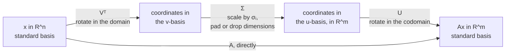
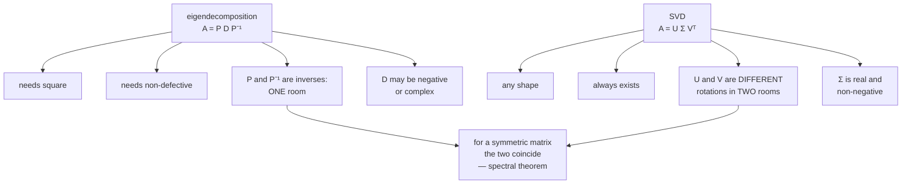

import DataCampExercise from "../../../../components/DataCampExercise.astro";
import Figure from "../../../../components/Figure.astro";
import Quiz from "../../../../components/Quiz.astro";
import SVDLab from "../../../../components/viz/math/SVDLab.tsx";

Everything so far has had a hypothesis. Cholesky needs symmetric positive definite. The
eigendecomposition needs square and non-defective. Both hypotheses fail on ordinary data — a
$1000 \times 30$ table of measurements is not square, so neither applies.

The **singular value decomposition** has no hypothesis. It exists for every real matrix of every shape,
which is why Strang called it the fundamental theorem of linear algebra. And it does more than merely
exist: it hands you the rank, the four fundamental subspaces, the pseudo-inverse, and — next page — the
provably best low-rank approximation.

## What you'll learn

- Theorem 4.22: the statement of the SVD, and why $\boldsymbol{\Sigma}$ is **rectangular** with zero padding.
- The geometry: $\mathbf{V}^\top$ rotates in the domain, $\boldsymbol{\Sigma}$ scales *and changes dimension*, $\mathbf{U}$ rotates in the codomain.
- Why $\mathbf{U}$ and $\mathbf{V}$ are **not** inverses of each other, unlike $\mathbf{P}$ and $\mathbf{P}^{-1}$.
- §4.5.2's construction: $\mathbf{V}$ from $\mathbf{A}^\top\mathbf{A}$, $\mathbf{U}$ from $\mathbf{A}\mathbf{A}^\top$, joined by $\mathbf{u}_i = \mathbf{A}\mathbf{v}_i/\sigma_i$.
- The singular value equation $\mathbf{A}\mathbf{v}_i = \sigma_i\mathbf{u}_i$, and how it differs from the eigenvalue equation.
- §4.5.3: every difference between the eigendecomposition and the SVD, measured rather than asserted.
- The full, reduced and truncated conventions, so you can read any paper's notation.

## Intuition: two rooms and a doorway

The eigendecomposition works inside one room. It changes into a better basis, scales, and changes back —
and because it starts and ends in the same room, the two basis changes are inverse to each other.

The SVD connects **two rooms of possibly different size**. $\mathbf{V}^\top$ finds the best axes in the
domain. $\boldsymbol{\Sigma}$ carries you through the doorway, stretching along those axes and either
padding with zeros (if the codomain is bigger) or dropping coordinates (if it is smaller).
$\mathbf{U}$ then finds the best axes in the codomain. Both basis changes are rotations, but they rotate
in **different spaces**, so they cannot be inverses of each other. What links them is
$\boldsymbol{\Sigma}$.





## The math

:::note[Theorem 4.22 — SVD Theorem]
Let $\mathbf{A} \in \mathbb{R}^{m\times n}$ be a rectangular matrix of rank
$r \in [0, \min(m,n)]$. The SVD of $\mathbf{A}$ is a decomposition of the form

$$
\mathbf{A} = \mathbf{U}\,\boldsymbol{\Sigma}\,\mathbf{V}^\top
\tag{4.64}
$$

with an **orthogonal** matrix $\mathbf{U} \in \mathbb{R}^{m\times m}$ with column vectors
$\mathbf{u}_i$, $i = 1,\dots,m$, and an **orthogonal** matrix $\mathbf{V} \in \mathbb{R}^{n\times n}$
with column vectors $\mathbf{v}_j$, $j = 1,\dots,n$. Moreover, $\boldsymbol{\Sigma}$ is an
$m\times n$ matrix with $\Sigma_{ii} = \sigma_i \geq 0$ and $\Sigma_{ij} = 0$ for $i \neq j$.

The diagonal entries $\sigma_i$, $i = 1,\dots,r$, are the **singular values**, the $\mathbf{u}_i$ are
the **left-singular vectors**, and the $\mathbf{v}_j$ the **right-singular vectors**. By convention
they are ordered: $\sigma_1 \geq \sigma_2 \geq \dots \geq \sigma_r \geq 0$.
:::

Three things in that statement deserve emphasis.

**$\boldsymbol{\Sigma}$ is the same shape as $\mathbf{A}$.** Not square. The singular value matrix is
unique, and it needs zero padding to fit. If $m > n$ it is diagonal down to row $n$ and then all-zero
rows (Equation 4.65); if $m < n$ it is diagonal across to column $m$ and then all-zero columns
(Equation 4.66):

$$
m > n:\quad
\boldsymbol{\Sigma} = \begin{bmatrix}\sigma_1 & 0 & 0\\ 0 & \ddots & 0\\ 0 & 0 & \sigma_n\\ 0 & \cdots & 0\\ \vdots & & \vdots\\ 0 & \cdots & 0\end{bmatrix}
\qquad
m < n:\quad
\boldsymbol{\Sigma} = \begin{bmatrix}\sigma_1 & 0 & 0 & 0 & \cdots & 0\\ 0 & \ddots & 0 & 0 & & 0\\ 0 & 0 & \sigma_m & 0 & \cdots & 0\end{bmatrix}
$$

**Both outer matrices are orthogonal.** So both are rigid motions — rotations, possibly with a
reflection. Nothing in the SVD shears. All the stretching lives in the middle, in real non-negative
numbers.

**$r$ can be $0$.** Rank zero means the zero matrix, and its SVD is $\boldsymbol{\Sigma} = \mathbf{0}$
with any orthogonal $\mathbf{U}$, $\mathbf{V}$. The theorem genuinely covers everything.

### The geometry, in three steps

Assume $\Phi: \mathbb{R}^n \to \mathbb{R}^m$ with standard bases $B$ and $C$, and a second basis
$\tilde{B}$ of $\mathbb{R}^n$ and $\tilde{C}$ of $\mathbb{R}^m$. Then, following the book:

| step | what it does |
| --- | --- |
| $\mathbf{V}^\top = \mathbf{V}^{-1}$ | a basis change in the **domain** $\mathbb{R}^n$, from $B$ into $\tilde{B}$ — the right-singular vectors become aligned with the coordinate axes |
| $\boldsymbol{\Sigma}$ | scales the new coordinates by the $\sigma_i$ **and adds or deletes dimensions**; it is the matrix of $\Phi$ with respect to $\tilde{B}$ and $\tilde{C}$ |
| $\mathbf{U}$ | a basis change in the **codomain** $\mathbb{R}^m$, from $\tilde{C}$ into the canonical basis of $\mathbb{R}^m$ |

The book's own summary is the sentence to keep: *the SVD expresses a change of basis in both the domain
and the codomain*, in contrast with the eigendecomposition, which operates within the same vector space,
applying one basis change and then undoing it. What makes the SVD special is that the two different bases
are simultaneously linked by $\boldsymbol{\Sigma}$.

### Constructing it (§4.5.2)

The derivation is short and it is the reason the spectral theorem was worth remembering.

**Step 1 — $\mathbf{V}$ from $\mathbf{A}^\top\mathbf{A}$.** Substitute the SVD into
$\mathbf{A}^\top\mathbf{A}$, which is symmetric whatever $\mathbf{A}$ is:

$$
\mathbf{A}^\top\mathbf{A} = (\mathbf{U}\boldsymbol{\Sigma}\mathbf{V}^\top)^\top(\mathbf{U}\boldsymbol{\Sigma}\mathbf{V}^\top)
= \mathbf{V}\boldsymbol{\Sigma}^\top\mathbf{U}^\top\mathbf{U}\boldsymbol{\Sigma}\mathbf{V}^\top
= \mathbf{V}\begin{bmatrix}\sigma_1^2 & & 0\\ & \ddots & \\ 0 & & \sigma_n^2\end{bmatrix}\mathbf{V}^\top
\tag{4.73}
$$

using $\mathbf{U}^\top\mathbf{U} = \mathbf{I}$. Compare with the eigendecomposition
$\mathbf{A}^\top\mathbf{A} = \mathbf{P}\mathbf{D}\mathbf{P}^{-1}$: the spectral theorem guarantees one
exists with an orthonormal $\mathbf{P}$, so the **eigenvectors of $\mathbf{A}^\top\mathbf{A}$ are the
right-singular vectors $\mathbf{V}$**, and its **eigenvalues are the squared singular values**.

**Step 2 — $\mathbf{U}$ from $\mathbf{A}\mathbf{A}^\top$.** The same substitution the other way round
(Equation 4.76) gives $\mathbf{A}\mathbf{A}^\top = \mathbf{U}\,\mathrm{diag}(\sigma_1^2,\dots,\sigma_m^2)\,\mathbf{U}^\top$,
so the orthonormal eigenvectors of $\mathbf{A}\mathbf{A}^\top$ are the left-singular vectors. And since
$\mathbf{A}\mathbf{A}^\top$ and $\mathbf{A}^\top\mathbf{A}$ have the **same nonzero eigenvalues**, the
nonzero entries of $\boldsymbol{\Sigma}$ come out the same either way.

**Step 3 — join them.** The images of the $\mathbf{v}_i$ under $\mathbf{A}$ are already orthogonal:

$$
(\mathbf{A}\mathbf{v}_i)^\top(\mathbf{A}\mathbf{v}_j) = \mathbf{v}_i^\top(\mathbf{A}^\top\mathbf{A})\mathbf{v}_j = \mathbf{v}_i^\top(\lambda_j\mathbf{v}_j) = \lambda_j\,\mathbf{v}_i^\top\mathbf{v}_j = 0
\tag{4.77}
$$

for $i \neq j$. So normalise them:

$$
\mathbf{u}_i := \frac{\mathbf{A}\mathbf{v}_i}{\lVert\mathbf{A}\mathbf{v}_i\rVert} = \frac{1}{\sqrt{\lambda_i}}\mathbf{A}\mathbf{v}_i = \frac{1}{\sigma_i}\mathbf{A}\mathbf{v}_i
\tag{4.78}
$$

Rearranged, that is the **singular value equation**:

$$
\mathbf{A}\mathbf{v}_i = \sigma_i\mathbf{u}_i, \qquad i = 1,\dots,r
\tag{4.79}
$$

which closely resembles the eigenvalue equation $\mathbf{A}\mathbf{x} = \lambda\mathbf{x}$ — except that
the vectors on the two sides **are not the same vector**. Collecting columns gives
$\mathbf{A}\mathbf{V} = \mathbf{U}\boldsymbol{\Sigma}$ (Equation 4.80), and right-multiplying by
$\mathbf{V}^\top$ gives Theorem 4.22.

:::note[A free basis for the kernel]
For $m > n$, Equation 4.79 holds only for $i \leq n$; for $n > m$ it holds only for $i \leq m$, and for
$i > m$ we have $\mathbf{A}\mathbf{v}_i = \mathbf{0}$ while the $\mathbf{v}_i$ are still orthonormal.
So **the SVD also supplies an orthonormal basis of the kernel** of $\mathbf{A}$ — the trailing columns of
$\mathbf{V}$. You get the null space for free, which is what §2.7.3 had to work for.
:::

### The eigendecomposition against the SVD (§4.5.3)

| | eigendecomposition $\mathbf{P}\mathbf{D}\mathbf{P}^{-1}$ | SVD $\mathbf{U}\boldsymbol{\Sigma}\mathbf{V}^\top$ |
| --- | --- | --- |
| exists for | square, and only if a basis of eigenvectors exists | **every** $\mathbb{R}^{m\times n}$ |
| domain and codomain | the same space | possibly **different dimensions** |
| are the outer matrices orthonormal? | $\mathbf{P}$'s columns are not necessarily | $\mathbf{U}$ and $\mathbf{V}$ always are |
| are they inverse to each other? | yes | **no** — they change basis in different spaces |
| middle factor | may be negative or complex | all real and **non-negative** |
| left factor's columns are eigenvectors of | $\mathbf{A}$ | $\mathbf{A}\mathbf{A}^\top$ |
| right factor's columns are eigenvectors of | — | $\mathbf{A}^\top\mathbf{A}$ |
| for a **symmetric** matrix | the two are one and the same, by the spectral theorem | |

That last row is the bridge. Symmetry collapses the two decompositions into each other — which is why
Chapter 10 can describe PCA either way and get the same answer.

### Three conventions you will meet

The mathematics is invariant to these; the notation is not.

| name | shapes, for $m \geq n$ | why anyone uses it |
| --- | --- | --- |
| **full SVD** — Equation 4.64, used here | $\mathbf{U}$ is $m\times m$, $\boldsymbol{\Sigma}$ is $m\times n$, $\mathbf{V}$ is $n\times n$ | both outer matrices are square and orthogonal; you get bases for all four subspaces |
| **reduced SVD** — Equation 4.89 | $\mathbf{U}$ is $m\times n$, $\boldsymbol{\Sigma}$ is $n\times n$, $\mathbf{V}$ is $n\times n$ | $\boldsymbol{\Sigma}$ is square and diagonal, as in the eigendecomposition |
| **truncated SVD** — §4.6 | $\mathbf{U}$ is $m\times r$, $\boldsymbol{\Sigma}$ is $r\times r$, $\mathbf{V}$ is $r\times n$ | $\boldsymbol{\Sigma}$ has no zeros on its diagonal at all; this is the approximation of the next page |

In NumPy, `full_matrices=True` (the default) gives the full SVD and `full_matrices=False` gives the
reduced one. The book notes that a restriction to $m > n$ is practically unnecessary: when $m < n$,
$\boldsymbol{\Sigma}$ simply has more zero columns than rows and $\sigma_{m+1},\dots,\sigma_n$ are zero.

:::tip[From the book]
Section 4.5. Theorem 4.22 (Equation 4.64) states the SVD, with Equations 4.65 and 4.66 giving the zero
padding of $\boldsymbol{\Sigma}$ for $m > n$ and $m < n$. Section 4.5.1 gives the geometric intuition as
three steps — Figure 4.8 draws it for a $3\times2$ matrix and Figure 4.9 applies it to a grid of vectors,
worked as Example 4.12 (Equation 4.67). Section 4.5.2 constructs the SVD: Equation 4.73 shows the
eigenvectors of $\mathbf{A}^\top\mathbf{A}$ are $\mathbf{V}$ and its eigenvalues the squared singular
values, Equation 4.76 does the same for $\mathbf{A}\mathbf{A}^\top$ and $\mathbf{U}$, Equation 4.77 shows
the images of the $\mathbf{v}_i$ are orthogonal, Equation 4.78 normalises them into the $\mathbf{u}_i$,
and Equation 4.79 is the singular value equation, leading to $\mathbf{A}\mathbf{V} =
\mathbf{U}\boldsymbol{\Sigma}$ in Equation 4.80. Example 4.13 (Equations 4.81 to 4.88) computes an SVD by
hand in three steps, followed by the book's own warning that this approach has poor numerical behaviour.
Section 4.5.3 lists every difference between the two decompositions, and Example 4.14 with Figure 4.10
reads structure out of a movie-ratings matrix. Equation 4.89 defines the reduced SVD.
:::

## Worked example by hand

### Example 4.13 — computing an SVD in three steps

$$
\mathbf{A} = \begin{bmatrix}1 & 0 & 1\\ -2 & 1 & 0\end{bmatrix}
\tag{4.81}
$$

**Step 1 — right-singular vectors as the eigenbasis of $\mathbf{A}^\top\mathbf{A}$.**

$$
\mathbf{A}^\top\mathbf{A} = \begin{bmatrix}1 & -2\\ 0 & 1\\ 1 & 0\end{bmatrix}\begin{bmatrix}1 & 0 & 1\\ -2 & 1 & 0\end{bmatrix} = \begin{bmatrix}5 & -2 & 1\\ -2 & 1 & 0\\ 1 & 0 & 1\end{bmatrix}
\tag{4.82}
$$

Its eigendecomposition gives eigenvalues $6$, $1$, $0$ and the orthonormal eigenvectors

$$
\mathbf{v}_1 = \frac{1}{\sqrt{30}}\begin{bmatrix}5\\-2\\1\end{bmatrix},\qquad
\mathbf{v}_2 = \frac{1}{\sqrt{5}}\begin{bmatrix}0\\1\\2\end{bmatrix},\qquad
\mathbf{v}_3 = \frac{1}{\sqrt{6}}\begin{bmatrix}-1\\-2\\1\end{bmatrix}
$$

**Step 2 — singular values.** They come straight out of $\mathbf{D}$ as square roots. Since
$\mathrm{rk}(\mathbf{A}) = 2$ there are only two nonzero ones: $\sigma_1 = \sqrt6$ and $\sigma_2 = 1$.
$\boldsymbol{\Sigma}$ must be the same size as $\mathbf{A}$, so

$$
\boldsymbol{\Sigma} = \begin{bmatrix}\sqrt6 & 0 & 0\\ 0 & 1 & 0\end{bmatrix}
\tag{4.85}
$$

**Step 3 — left-singular vectors as normalised images.**

$$
\mathbf{u}_1 = \frac{1}{\sigma_1}\mathbf{A}\mathbf{v}_1 = \frac{1}{\sqrt6}\begin{bmatrix}1 & 0 & 1\\ -2 & 1 & 0\end{bmatrix}\frac{1}{\sqrt{30}}\begin{bmatrix}5\\-2\\1\end{bmatrix} = \begin{bmatrix}\tfrac{1}{\sqrt5}\\ -\tfrac{2}{\sqrt5}\end{bmatrix}
\tag{4.86}
$$

$$
\mathbf{u}_2 = \frac{1}{\sigma_2}\mathbf{A}\mathbf{v}_2 = \frac{1}{1}\begin{bmatrix}1 & 0 & 1\\ -2 & 1 & 0\end{bmatrix}\frac{1}{\sqrt5}\begin{bmatrix}0\\1\\2\end{bmatrix} = \begin{bmatrix}\tfrac{2}{\sqrt5}\\ \tfrac{1}{\sqrt5}\end{bmatrix}
\tag{4.87}
$$

$$
\mathbf{U} = [\mathbf{u}_1, \mathbf{u}_2] = \frac{1}{\sqrt5}\begin{bmatrix}1 & 2\\ -2 & 1\end{bmatrix}
\tag{4.88}
$$

Note the third right-singular vector $\mathbf{v}_3$: its eigenvalue is $0$, so
$\mathbf{A}\mathbf{v}_3 = \mathbf{0}$ and it is an orthonormal basis of the kernel. There is no
$\mathbf{u}_3$, because the codomain is only two-dimensional.

:::caution[The book's own warning, at Equation 4.88]
*"Note that on a computer the approach illustrated here has poor numerical behavior, and the SVD of
$\mathbf{A}$ is normally computed without resorting to the eigenvalue decomposition of
$\mathbf{A}^\top\mathbf{A}$."* Forming the Gram matrix squares the condition number. The construction is
how you **understand** the SVD; it is not how you compute one.
:::

### Verifying it, digit by digit

```python title="example_413.py" showLineNumbers{1}
import numpy as np

A = np.array([[1.0, 0.0, 1.0], [-2.0, 1.0, 0.0]])

G = A.T @ A
print("A^T A ="); print(G.astype(int))

lam, V = np.linalg.eigh(G)
order = np.argsort(-lam)
lam, V = lam[order], V[:, order]
print("eigenvalues of A^T A:", np.round(lam, 12))
print("sqrt of the top two:  ", np.round(np.sqrt(lam[:2]), 6), " and sqrt(6) =", round(float(np.sqrt(6)), 6))

# The book's v_j, exactly.
book_V = np.array([[5, 0, -1], [-2, 1, -2], [1, 2, 1]], dtype=float)
book_V = book_V / np.linalg.norm(book_V, axis=0)
print("the book's V is an eigenbasis of A^T A:",
      bool(np.allclose(G @ book_V, book_V * lam)))

# Step 3: u_i = A v_i / sigma_i.
for i in range(2):
    u = A @ book_V[:, i] / np.sqrt(lam[i])
    print(f"u_{i+1} =", np.round(u, 6), "   times sqrt(5) =", np.round(u * np.sqrt(5), 6))

print("A v_3 =", np.round(A @ book_V[:, 2], 12), " -> v_3 spans the kernel")

# Reassemble and compare with numpy.
U = np.array([[1.0, 2.0], [-2.0, 1.0]]) / np.sqrt(5)
Sig = np.array([[np.sqrt(6), 0.0, 0.0], [0.0, 1.0, 0.0]])
print("U Sigma V^T - A, largest entry:", f"{float(np.abs(U @ Sig @ book_V.T - A).max()):.2e}")
print("numpy's sigma:", np.round(np.linalg.svd(A, compute_uv=False), 6))
```

```text title="output"
A^T A =
[[ 5 -2  1]
 [-2  1  0]
 [ 1  0  1]]
eigenvalues of A^T A: [ 6.  1. -0.]
sqrt of the top two:   [2.44949 1.     ]  and sqrt(6) = 2.44949
the book's V is an eigenbasis of A^T A: True
u_1 = [ 0.447214 -0.894427]    times sqrt(5) = [ 1. -2.]
u_2 = [0.894427 0.447214]    times sqrt(5) = [2. 1.]
A v_3 = [0. 0.]  -> v_3 spans the kernel
U Sigma V^T - A, largest entry: 1.11e-16
numpy's sigma: [2.44949 1.     ]
```

Every number the book prints, reproduced: $\sigma_1 = \sqrt6 = 2.44949$, $\sigma_2 = 1$,
$\mathbf{u}_1 = (1,-2)/\sqrt5$, $\mathbf{u}_2 = (2,1)/\sqrt5$, and $\mathbf{v}_3$ in the kernel.

### Example 4.12 — the same matrix as the geometry figure

$$
\mathbf{A} = \begin{bmatrix}1 & -0.8\\ 0 & 1\\ 1 & 0\end{bmatrix}
= \begin{bmatrix}-0.79 & 0 & -0.62\\ 0.38 & -0.78 & -0.49\\ -0.48 & -0.62 & 0.62\end{bmatrix}
\begin{bmatrix}1.62 & 0\\ 0 & 1.0\\ 0 & 0\end{bmatrix}
\begin{bmatrix}-0.78 & 0.62\\ -0.62 & -0.78\end{bmatrix}
\tag{4.67}
$$

Measured: $\sigma = 1.624808$ and $1.000000$, and every entry of the book's $\mathbf{U}$ and
$\mathbf{V}^\top$ agrees to the two decimals it prints. The detail worth checking is the bottom row of
$\boldsymbol{\Sigma}$: it is zero, so after $\boldsymbol{\Sigma}$ every vector has **third coordinate
exactly zero** — measured as `0.00e+00`, not merely small. The grid still lies in a plane. Only
$\mathbf{U}$ tilts it out.

## See it move

```p5 title="Vᵀ, then Σ, then U — across a change of dimension" desc="A 3x2 matrix, so the domain is a plane and the codomain is space. Drag the stage slider through the three factors. Between stage 2 and 3 the points live in R^3 with third coordinate exactly zero — the amber readout tracks it. Only U tilts the disc out of that plane. Edit A with the four knobs." height="600"
let stage = 0.0;
let a11 = 1.0, a12 = -0.8, a21 = 0.0, a22 = 1.0;
let KNOBS = [], dragging = null;
let PTS = [];

function setup() {
  createCanvas(600, 600); textFont("monospace");
  const n = 13;
  for (let i = 0; i < n; i++)
    for (let j = 0; j < n; j++)
      PTS.push([-1 + (2 * i) / (n - 1), -1 + (2 * j) / (n - 1)]);
}

function knob(id, x, y, w, value, mn, mx, label) {
  KNOBS.push({ id, x, y, w, mn, mx });
  const t = (value - mn) / (mx - mn);
  stroke(60, 74, 92); strokeWeight(2); line(x, y, x + w, y);
  noStroke(); fill(255, 211, 67); ellipse(x + t * w, y, 10, 10);
  fill(190, 200, 212); textSize(11); textAlign(LEFT, CENTER);
  text(label, x + w + 10, y);
}
function mousePressed() {
  for (const k of KNOBS)
    if (mouseY > k.y - 11 && mouseY < k.y + 11 && mouseX > k.x - 11 && mouseX < k.x + k.w + 11) { dragging = k; return; }
}
function mouseReleased() { dragging = null; }
function mouseDragged() {
  if (!dragging) return;
  const t = Math.min(1, Math.max(0, (mouseX - dragging.x) / dragging.w));
  const v = dragging.mn + t * (dragging.mx - dragging.mn);
  if (dragging.id === "stage") stage = v;
  if (dragging.id === "a11") a11 = v;
  if (dragging.id === "a12") a12 = v;
  if (dragging.id === "a21") a21 = v;
  if (dragging.id === "a22") a22 = v;
  if (!isLooping()) redraw();
}

// 2x2 symmetric eigendecomposition, enough to build the SVD of a 3x2 by hand.
function sym2(m11, m12, m22) {
  const tr = m11 + m22, dt = m11 * m22 - m12 * m12;
  const disc = Math.max(0, tr * tr - 4 * dt);
  const l1 = (tr + Math.sqrt(disc)) / 2, l2 = (tr - Math.sqrt(disc)) / 2;
  let v1;
  if (Math.abs(m12) > 1e-12) v1 = [m12, l1 - m11];
  else v1 = Math.abs(l1 - m11) < 1e-12 ? [1, 0] : [0, 1];
  const n1 = Math.hypot(v1[0], v1[1]);
  v1 = [v1[0] / n1, v1[1] / n1];
  return { l1, l2, v1, v2: [-v1[1], v1[0]] };
}

function draw() {
  background(13, 17, 23);
  KNOBS = [];

  // A is 3x2: rows [a11 a12], [a21 a22], [1 0].
  const A = [[a11, a12], [a21, a22], [1, 0]];
  const g11 = A[0][0] ** 2 + A[1][0] ** 2 + A[2][0] ** 2;
  const g12 = A[0][0] * A[0][1] + A[1][0] * A[1][1] + A[2][0] * A[2][1];
  const g22 = A[0][1] ** 2 + A[1][1] ** 2 + A[2][1] ** 2;
  const E = sym2(g11, g12, g22);
  const s1 = Math.sqrt(Math.max(0, E.l1)), s2 = Math.sqrt(Math.max(0, E.l2));
  const v1 = E.v1, v2 = E.v2;

  const Av = v => [A[0][0] * v[0] + A[0][1] * v[1],
                   A[1][0] * v[0] + A[1][1] * v[1],
                   A[2][0] * v[0] + A[2][1] * v[1]];
  const unit = (u, s) => { const n = Math.hypot(u[0], u[1], u[2]); return n < 1e-12 ? [0, 0, 0] : [u[0] / n, u[1] / n, u[2] / n]; };
  const u1 = unit(Av(v1)), u2 = unit(Av(v2));
  // Third left-singular vector: the cross product, so U is a rotation.
  const u3 = [u1[1] * u2[2] - u1[2] * u2[1], u1[2] * u2[0] - u1[0] * u2[2], u1[0] * u2[1] - u1[1] * u2[0]];

  const place = p => {
    // Vᵀ p, in the v-basis.
    const c1 = p[0] * v1[0] + p[1] * v1[1];
    const c2 = p[0] * v2[0] + p[1] * v2[1];
    const A0 = [p[0], p[1], 0];
    const A1 = [c1, c2, 0];
    const A2 = [s1 * c1, s2 * c2, 0];
    const A3 = [s1 * c1 * u1[0] + s2 * c2 * u2[0],
                s1 * c1 * u1[1] + s2 * c2 * u2[1],
                s1 * c1 * u1[2] + s2 * c2 * u2[2]];
    const lerp3 = (a, b, t) => [a[0] + (b[0] - a[0]) * t, a[1] + (b[1] - a[1]) * t, a[2] + (b[2] - a[2]) * t];
    if (stage <= 1) return lerp3(A0, A1, stage);
    if (stage <= 2) return lerp3(A1, A2, stage - 1);
    return lerp3(A2, A3, stage - 2);
  };

  // Oblique projection, matching the other 3-D sketches in this module.
  const OBL_X = -0.52, OBL_Y = -0.36, U = 66, cx = 280, cy = 210;
  const sx = q => cx + (q[0] + OBL_X * q[2]) * U;
  const sy = q => cy - (q[1] + OBL_Y * q[2]) * U;

  stroke(32, 44, 58); strokeWeight(1);
  for (let g = -3; g <= 3; g++) {
    line(sx([g, -2.4, 0]), sy([g, -2.4, 0]), sx([g, 2.4, 0]), sy([g, 2.4, 0]));
    line(sx([-3, g, 0]), sy([-3, g, 0]), sx([3, g, 0]), sy([3, g, 0]));
  }
  stroke(58, 72, 88); strokeWeight(1.3);
  line(sx([-3, 0, 0]), sy([-3, 0, 0]), sx([3, 0, 0]), sy([3, 0, 0]));
  line(sx([0, -2.4, 0]), sy([0, -2.4, 0]), sx([0, 2.4, 0]), sy([0, 2.4, 0]));
  stroke(90, 104, 122); strokeWeight(1.3);
  line(sx([0, 0, -1.6]), sy([0, 0, -1.6]), sx([0, 0, 1.6]), sy([0, 0, 1.6]));
  noStroke(); fill(120, 134, 150); textSize(10); textAlign(LEFT, CENTER);
  text("x3", sx([0, 0, 1.75]) + 4, sy([0, 0, 1.75]));

  let maxThird = 0;
  noStroke();
  for (const p of PTS) {
    const q = place(p);
    maxThird = Math.max(maxThird, Math.abs(q[2]));
    const hue = (p[0] + 1) / 2;
    fill(70 + 150 * hue, 150 - 40 * hue, 230 - 120 * hue, 205);
    ellipse(sx(q), sy(q), 5, 5);
  }

  for (const [vv, colour, nm, sig] of [[v1, color(232, 110, 110), "v1", s1], [v2, color(255, 211, 67), "v2", s2]]) {
    const q = place(vv);
    stroke(colour); strokeWeight(2.6); line(sx([0, 0, 0]), sy([0, 0, 0]), sx(q), sy(q));
    noStroke(); fill(colour); ellipse(sx(q), sy(q), 9, 9);
    textSize(11); textAlign(LEFT, TOP);
    text(stage < 2 ? nm : "sigma" + nm[1] + " u" + nm[1], sx(q) + 8, sy(q) - 18);
  }

  const labels = ["x in the domain R²",
                  "Vᵀ x : right-singular vectors onto the axes",
                  "Σ Vᵀ x : scaled, and now in R³ with x3 = 0",
                  "U Σ Vᵀ x = A x, tilted out of the plane"];
  const li = stage < 0.02 ? 0 : stage <= 1 ? 1 : stage <= 2 ? 2 : 3;

  knob("stage", 40, 370, 240, stage, 0, 3, `stage ${stage.toFixed(2)} / 3`);
  knob("a11", 40, 410, 96, a11, -2, 2, `a11 ${a11.toFixed(2)}`);
  knob("a12", 186, 410, 96, a12, -2, 2, `a12 ${a12.toFixed(2)}`);
  knob("a21", 40, 436, 96, a21, -2, 2, `a21 ${a21.toFixed(2)}`);
  knob("a22", 186, 436, 96, a22, -2, 2, `a22 ${a22.toFixed(2)}`);

  noStroke(); textAlign(LEFT, TOP);
  fill(255, 211, 67); textSize(14); text("Drag the stage slider", 30, 12);
  fill(255, 211, 67); textSize(12); text(labels[li], 30, 330);
  fill(215); textSize(11);
  text(`A = [ ${A[0][0].toFixed(2)}  ${A[0][1].toFixed(2)} ]`, 350, 370);
  text(`    [ ${A[1][0].toFixed(2)}  ${A[1][1].toFixed(2)} ]`, 350, 388);
  text(`    [ ${A[2][0].toFixed(2)}  ${A[2][1].toFixed(2)} ]`, 350, 406);
  text(`sigma = ${s1.toFixed(4)}, ${s2.toFixed(4)}`, 350, 432);
  fill(stage > 1 && stage <= 2 ? color(255, 211, 67) : color(150)); textSize(11);
  text(`max |x3| = ${maxThird.toExponential(1)}`, 350, 454);
  fill(150); textSize(10);
  text("Between stage 2 and 3 the third coordinate is exactly zero: the bottom row of Sigma is", 30, 486);
  text("all zeros, so Sigma cannot put anything there. The disc is a flat ellipse sitting in the", 30, 502);
  text("x1-x2 plane of R³, and U is the only factor that lifts it. Set a12 to zero with a11 = a22", 30, 518);
  text("and both singular values become equal — the ellipse becomes a circle, and v1 and v2", 30, 534);
  text("stop being determined: any orthonormal pair works.", 30, 550);
  text("rank drops to 1 when the two columns of A become parallel; watch sigma2 go to zero.", 30, 572);
}
```

```p5 title="Eigenvectors against singular vectors on the same matrix" desc="Two ellipses on one picture: the image of the unit circle, with its axes drawn from the SVD, and the invariant eigendirections drawn from the eigendecomposition. Toggle symmetry and they snap together — for a symmetric matrix the two decompositions are the same. Break symmetry and the eigendirections are not even orthogonal." height="560"
let a11 = 4.0, a12 = 2.0, a21 = 1.0, a22 = 3.0;
let symmetric = false;
let KNOBS = [], BTN = null, dragging = null;

function setup() { createCanvas(600, 560); textFont("monospace"); }

function knob(id, x, y, w, value, mn, mx, label) {
  KNOBS.push({ id, x, y, w, mn, mx });
  const t = (value - mn) / (mx - mn);
  stroke(60, 74, 92); strokeWeight(2); line(x, y, x + w, y);
  noStroke(); fill(255, 211, 67); ellipse(x + t * w, y, 10, 10);
  fill(190, 200, 212); textSize(11); textAlign(LEFT, CENTER);
  text(label, x + w + 10, y);
}
function mousePressed() {
  if (BTN && mouseX > BTN.x && mouseX < BTN.x + BTN.w && mouseY > BTN.y && mouseY < BTN.y + BTN.h) {
    symmetric = !symmetric; if (!isLooping()) redraw(); return;
  }
  for (const k of KNOBS)
    if (mouseY > k.y - 11 && mouseY < k.y + 11 && mouseX > k.x - 11 && mouseX < k.x + k.w + 11) { dragging = k; return; }
}
function mouseReleased() { dragging = null; }
function mouseDragged() {
  if (!dragging) return;
  const t = Math.min(1, Math.max(0, (mouseX - dragging.x) / dragging.w));
  const v = dragging.mn + t * (dragging.mx - dragging.mn);
  if (dragging.id === "a11") a11 = v;
  if (dragging.id === "a12") a12 = v;
  if (dragging.id === "a21") a21 = v;
  if (dragging.id === "a22") a22 = v;
  if (!isLooping()) redraw();
}

function sym2(m11, m12, m22) {
  const tr = m11 + m22, dt = m11 * m22 - m12 * m12;
  const disc = Math.max(0, tr * tr - 4 * dt);
  const l1 = (tr + Math.sqrt(disc)) / 2, l2 = (tr - Math.sqrt(disc)) / 2;
  let v1 = Math.abs(m12) > 1e-12 ? [m12, l1 - m11] : (Math.abs(l1 - m11) < 1e-12 ? [1, 0] : [0, 1]);
  const n1 = Math.hypot(v1[0], v1[1]);
  v1 = [v1[0] / n1, v1[1] / n1];
  return { l1, l2, v1, v2: [-v1[1], v1[0]] };
}

function draw() {
  background(13, 17, 23);
  KNOBS = [];

  const off = symmetric ? (a12 + a21) / 2 : a12;
  const off2 = symmetric ? off : a21;
  const A = [[a11, off], [off2, a22]];

  const U = 44, cx = 250, cy = 190;
  const sx = x => cx + x * U, sy = y => cy - y * U;
  const mv = v => [A[0][0] * v[0] + A[0][1] * v[1], A[1][0] * v[0] + A[1][1] * v[1]];

  // SVD axes from the eigendecomposition of A^T A.
  const g11 = A[0][0] ** 2 + A[1][0] ** 2;
  const g12 = A[0][0] * A[0][1] + A[1][0] * A[1][1];
  const g22 = A[0][1] ** 2 + A[1][1] ** 2;
  const G = sym2(g11, g12, g22);
  const s1 = Math.sqrt(Math.max(0, G.l1)), s2 = Math.sqrt(Math.max(0, G.l2));
  const norm = v => { const n = Math.hypot(v[0], v[1]); return n < 1e-12 ? [0, 0] : [v[0] / n, v[1] / n]; };
  const uu1 = norm(mv(G.v1)), uu2 = norm(mv(G.v2));

  // Eigen-directions of A itself.
  const tr = A[0][0] + A[1][1], dt = A[0][0] * A[1][1] - A[0][1] * A[1][0];
  const disc = tr * tr - 4 * dt;
  const realEig = disc >= 0;
  const l1 = realEig ? (tr + Math.sqrt(disc)) / 2 : 0;
  const l2 = realEig ? (tr - Math.sqrt(disc)) / 2 : 0;
  const evec = l => {
    let v = Math.abs(A[0][1]) > 1e-9 ? [A[0][1], l - A[0][0]]
          : Math.abs(A[1][0]) > 1e-9 ? [l - A[1][1], A[1][0]]
          : (Math.abs(l - A[0][0]) < 1e-9 ? [1, 0] : [0, 1]);
    return norm(v);
  };
  const p1 = realEig ? evec(l1) : [1, 0], p2 = realEig ? evec(l2) : [0, 1];
  const eigAngle = Math.acos(Math.min(1, Math.abs(p1[0] * p2[0] + p1[1] * p2[1]))) * 180 / Math.PI;

  stroke(32, 44, 58); strokeWeight(1);
  for (let g = -5; g <= 5; g++) { line(sx(g), sy(-4), sx(g), sy(4)); line(sx(-5), sy(g), sx(5), sy(g)); }
  stroke(58, 72, 88); strokeWeight(1.2);
  line(sx(-5), sy(0), sx(5), sy(0)); line(sx(0), sy(-4), sx(0), sy(4));

  noFill(); stroke(80, 92, 108); strokeWeight(1.2); ellipse(sx(0), sy(0), 2 * U, 2 * U);

  // The image of the unit circle.
  noFill(); stroke(75, 139, 190); strokeWeight(2.4);
  beginShape();
  for (let i = 0; i <= 120; i++) { const t = (i / 120) * TWO_PI; const q = mv([Math.cos(t), Math.sin(t)]); vertex(sx(q[0]), sy(q[1])); }
  endShape(CLOSE);

  // SVD axes: sigma_i u_i.
  for (const [u, s, nm] of [[uu1, s1, "s1 u1"], [uu2, s2, "s2 u2"]]) {
    stroke(120, 200, 150); strokeWeight(3);
    line(sx(0), sy(0), sx(s * u[0]), sy(s * u[1]));
    noStroke(); fill(120, 200, 150); textSize(11); textAlign(LEFT, TOP);
    text(nm, sx(s * u[0]) + 6, sy(s * u[1]) - 16);
  }

  // Eigendirections, as full lines: they are invariant, not axes of the ellipse.
  if (realEig) {
    for (const [pv, lam] of [[p1, l1], [p2, l2]]) {
      stroke(232, 110, 110, 170); strokeWeight(1.8);
      line(sx(-5 * pv[0]), sy(-5 * pv[1]), sx(5 * pv[0]), sy(5 * pv[1]));
      stroke(232, 110, 110); strokeWeight(3);
      line(sx(0), sy(0), sx(lam * pv[0]), sy(lam * pv[1]));
    }
  }

  BTN = { x: 40, y: 470, w: 190, h: 26 };
  noStroke(); fill(symmetric ? color(120, 200, 150) : color(46, 58, 72));
  rect(BTN.x, BTN.y, BTN.w, BTN.h, 5);
  fill(symmetric ? 20 : 210); textSize(12); textAlign(CENTER, CENTER);
  text(symmetric ? "symmetric: ON" : "symmetric: OFF", BTN.x + BTN.w / 2, BTN.y + BTN.h / 2);

  knob("a11", 40, 366, 96, a11, -5, 5, `a11 ${A[0][0].toFixed(2)}`);
  knob("a12", 186, 366, 96, a12, -5, 5, `a12 ${A[0][1].toFixed(2)}`);
  knob("a21", 40, 392, 96, a21, -5, 5, `a21 ${A[1][0].toFixed(2)}`);
  knob("a22", 186, 392, 96, a22, -5, 5, `a22 ${A[1][1].toFixed(2)}`);

  noStroke(); textAlign(LEFT, TOP);
  fill(255, 211, 67); textSize(14); text("Green: SVD axes.  Red: eigendirections.", 30, 12);
  fill(215); textSize(11);
  text(`sigma = ${s1.toFixed(4)}, ${s2.toFixed(4)}`, 350, 366);
  if (realEig) text(`lambda = ${l1.toFixed(4)}, ${l2.toFixed(4)}`, 350, 386);
  else { fill(232, 110, 110); text("complex eigenvalues", 350, 386); fill(215); }
  text(`|det A| = ${Math.abs(dt).toFixed(4)}`, 350, 412);
  text(`s1 * s2  = ${(s1 * s2).toFixed(4)}`, 350, 430);
  if (realEig) {
    fill(Math.abs(eigAngle - 90) < 1e-4 ? color(120, 200, 150) : color(255, 211, 67)); textSize(11);
    text(`eigendirections meet at ${eigAngle.toFixed(2)} deg`, 350, 456);
  }
  fill(150); textSize(10);
  text("The green axes are always orthogonal — U and V are orthogonal matrices, always.", 260, 476);
  text("The red eigendirections are orthogonal only when A is symmetric, and then the two", 260, 492);
  text("sets coincide and sigma_i = |lambda_i|. That is the spectral theorem.", 260, 508);
  text("Note |det A| = s1 * s2 whatever you do: the SVD factors the volume scaling too.", 260, 528);
}
```

The stepped construction, verified frame by frame — and note the singular values it reports for
Example 4.13:

<SVDLab
  client:visible
  matrix={[[1, 0, 1], [-2, 1, 0]]}
  mode="construct"
  title="Example 4.13, built from A-transpose A"
  desc="The construction of §4.5.2 in order: form the Gram matrix, diagonalise it by the spectral theorem to get V and the squared singular values, take square roots, then set u_i = A v_i / sigma_i and verify orthogonality. The last frame checks the reassembly."
/>

<SVDLab
  client:visible
  matrix={[[5, 4, 1], [5, 5, 0], [0, 0, 5], [1, 0, 4]]}
  mode="construct"
  title="Example 4.14, the movie-ratings matrix"
  desc="Four movies by three viewers. Watch the singular value strip: two large values and one small one, which is exactly the structure the book reads as two themes plus noise."
/>

## From scratch

```python title="svd_from_scratch.py" showLineNumbers{1}
import numpy as np

def svd_from_grams(A, tol=1e-10):
    """The construction of section 4.5.2, verbatim — and the wrong way to compute one."""
    A = np.asarray(A, dtype=float)
    m, n = A.shape

    # Step 1: V and sigma^2 from the eigendecomposition of A^T A (Equation 4.73).
    lam, V = np.linalg.eigh(A.T @ A)
    order = np.argsort(-lam)
    lam, V = np.maximum(lam[order], 0.0), V[:, order]
    sigma = np.sqrt(lam)
    r = int(np.sum(sigma > tol * max(sigma[0], 1.0)))

    # Step 3: u_i = A v_i / sigma_i (Equation 4.78), for the nonzero sigmas only.
    U = np.zeros((m, m))
    for i in range(min(r, m)):
        U[:, i] = A @ V[:, i] / sigma[i]

    # Complete U to an orthonormal basis of the codomain: those extra columns are
    # a basis of the null space of A^T, which the SVD hands you for free.
    if r < m:
        Q, _ = np.linalg.qr(np.hstack([U[:, :r], np.eye(m)]))
        U[:, r:] = Q[:, r:m]

    Sig = np.zeros((m, n))
    np.fill_diagonal(Sig, sigma[:min(m, n)])
    return U, Sig, V.T, r

cases = {
    "Ex 4.13   2x3": [[1.0, 0, 1], [-2, 1, 0]],
    "Ex 4.12   3x2": [[1.0, -0.8], [0, 1], [1, 0]],
    "Ex 4.14   4x3": [[5.0, 4, 1], [5, 5, 0], [0, 0, 5], [1, 0, 4]],
    "rank 1    3x3": [[1.0, 2, 3], [2, 4, 6], [3, 6, 9]],
    "the zero  2x2": [[0.0, 0], [0, 0]],
}

for name, A in cases.items():
    A = np.asarray(A, dtype=float)
    U, Sig, Vt, r = svd_from_grams(A)
    ref = np.linalg.svd(A, compute_uv=False)
    k = min(A.shape)
    print(f"{name}  rank {r}  sigma {np.round(np.diag(Sig)[:k], 6)}")
    print(f"{'':14}  |U Sigma V^T - A| {float(np.abs(U @ Sig @ Vt - A).max()):.1e}"
          f"   |U^T U - I| {float(np.abs(U.T @ U - np.eye(A.shape[0])).max()):.1e}"
          f"   sigma matches numpy to {float(np.abs(np.diag(Sig)[:k] - ref).max()):.1e}")
```

```text title="output"
Ex 4.13   2x3  rank 2  sigma [2.44949 1.     ]
                |U Sigma V^T - A| 4.4e-16   |U^T U - I| 4.4e-16   sigma matches numpy to 4.4e-16
Ex 4.12   3x2  rank 2  sigma [1.624808 1.      ]
                |U Sigma V^T - A| 1.1e-16   |U^T U - I| 2.2e-16   sigma matches numpy to 4.4e-16
Ex 4.14   4x3  rank 3  sigma [9.643811 6.363891 0.705552]
                |U Sigma V^T - A| 2.7e-15   |U^T U - I| 1.2e-14   sigma matches numpy to 4.6e-15
rank 1    3x3  rank 2  sigma [14.  0.  0.]
                |U Sigma V^T - A| 2.7e-15   |U^T U - I| 1.0e+00   sigma matches numpy to 1.2e-08
the zero  2x2  rank 0  sigma [0. 0.]
                |U Sigma V^T - A| 0.0e+00   |U^T U - I| 0.0e+00   sigma matches numpy to 0.0e+00
```

Four of the five cases behave. The rank-1 case does not, and it is worth reading closely, because
it fails in exactly the way the book warns about.

`rank 1    3x3` is reported as **rank 2**, and $\lVert\mathbf{U}^\top\mathbf{U} - \mathbf{I}\rVert$ is
`1.0e+00` — $\mathbf{U}$ is not orthogonal at all, so what came back is not an SVD. Here is the chain.
The matrix is $\mathbf{x}\mathbf{x}^\top$ for $\mathbf{x} = (1,2,3)$, so its true singular values are
$14$, $0$, $0$. Forming $\mathbf{A}^\top\mathbf{A}$ squares them to $196$, $0$, $0$ — but `eigh`
returns $1.49\times10^{-16}$ for the second, which is machine precision *relative to 196*. Taking the
square root turns that into

$$
\sqrt{1.49\times10^{-16}} = 1.22\times10^{-8}
$$

The square root **halves the exponent**, so a rounding error at $10^{-16}$ becomes a singular value at
$10^{-8}$ — eight orders of magnitude too big, and comfortably above any sensible tolerance. The rank
test then says $2$, and step 3 computes
$\mathbf{u}_2 = \mathbf{A}\mathbf{v}_2 / 1.22\times10^{-8}$, dividing noise by a tiny number and
producing a vector with no relationship to anything. `np.linalg.svd` on the same matrix reports
$\sigma_2 = 1.0\times10^{-15}$, which is correct.

The reconstruction gap is still `2.7e-15`, which is the trap: the product
$\mathbf{U}\boldsymbol{\Sigma}\mathbf{V}^\top$ comes out right because the garbage column is
multiplied by a nearly-zero singular value. Checking only the reconstruction would have passed this.
Checking $\mathbf{U}^\top\mathbf{U}$ catches it.

The zero matrix, by contrast, works exactly: $r = 0$ and every gap `0.0e+00`. Theorem 4.22 says
$r \in [0,\min(m,n)]$ and it means it.

## On real data

<Figure
  src="/images/mml/singular-value-decomposition/svd-three-stages"
  alt="Four panels showing a square grid of coloured points: the grid in the plane, the grid rotated by V-transpose, the grid stretched and lifted into three dimensions while staying flat, and finally tilted out of that plane by U."
  title="The book's Figures 4.8 and 4.9, rebuilt"
  caption="Example 4.12's matrix, singular values 1.624808 and 1. After Sigma the largest third coordinate over the whole grid is exactly 0.00e+00 — the bottom row of Sigma is zero, so nothing can be there. The direct product A x and the three-stage chain agree to 6.66e-16."
/>

<Figure
  src="/images/mml/singular-value-decomposition/evd-versus-svd"
  alt="Two panels each showing the image of a unit circle as an ellipse, with solid arrows for eigenvectors scaled by eigenvalues and dashed arrows for left-singular vectors scaled by singular values. On the left, for a non-symmetric matrix, the two sets point in different directions and the solid pair meets at an oblique angle. On the right, for a symmetric matrix, the two sets coincide and both pairs meet at ninety degrees."
  title="Section 4.5.3, drawn"
  caption="Left, the non-symmetric [[3,1.6],[0.4,2]]: eigenvalues 3.4434 and 1.5566 against singular values 3.6890 and 1.4530 — different numbers — with the eigenvectors meeting at 57.54 degrees while the singular vectors meet at exactly 90. Right, the symmetric [[3,1],[1,2]]: eigenvalues 3.6180 and 1.3820 equal the singular values to every digit, and both pairs are orthogonal."
/>

<Figure
  src="/images/mml/singular-value-decomposition/singular-values-from-both-grams"
  alt="Five stacked traces, one per matrix shape, each plotting the sorted eigenvalues of A-transpose A against those of A A-transpose. The two curves lie on top of each other over the leading entries and the longer curve then drops to zero."
  title="Both Gram matrices give the same singular values"
  caption="Five shapes — 2x5, 3x3, 5x2, 6x4 and 4x9. The nonzero spectra of the two Gram matrices, which are different sizes, agree to at most 7.1e-15, and their square roots match the singular values to at most 8.9e-16. The longer curve's extra entries are zero."
/>

## Reading the plot

**From the three-stage figure.** Follow the two coloured vectors, not the cloud. In the first panel they
are $\mathbf{v}_1$ and $\mathbf{v}_2$, at some oblique angle to the axes. In the second they lie *on* the
axes — that is all $\mathbf{V}^\top$ does. In the third they have been stretched by $1.6248$ and $1$ and
the whole grid now lives in $\mathbb{R}^3$, but flatly: `max |x3| = 0.00e+00`. The fourth panel is the
only one where the disc leaves the plane.

The number worth staring at is that exact zero. It is not $10^{-16}$; it is zero, because
$\boldsymbol{\Sigma}$'s third row contains no nonzero entry that could put anything there. The change of
dimension in the SVD is a **padding**, not a computation.

**From the eigen-versus-singular figure.** The left panel corrects a common misconception. For the
non-symmetric $[[3, 1.6], [0.4, 2]]$:

| | first | second | the pair's angle |
| --- | --- | --- | --- |
| eigenvalues, along invariant directions | $3.4434$ | $1.5566$ | $57.54°$ |
| singular values, along orthogonal directions | $3.6890$ | $1.4530$ | $90.00°$ |

These are **different numbers**, and neither is a rounding of the other. The eigenvalues say how much the
matrix stretches along its two *invariant* directions; the singular values say how much it stretches
along its two *orthogonal* directions of greatest and least stretch. Those are different questions, and
they have the same answer only when the invariant directions happen to be orthogonal.

The angle column is the mechanism. The singular vectors meet at exactly $90°$ *always* — that is what
"$\mathbf{U}$ is orthogonal" means, and it is not an accident of this matrix. The eigenvectors meet at
$57.54°$ here, so they cannot possibly be the axes of an ellipse. The right panel makes the matrix
symmetric and the eigenvector angle becomes $90°$; at that moment both spectra read $3.6180$ and
$1.3820$, identical to every printed digit.

One quantity survives either way: $\lvert\det\mathbf{A}\rvert = 5.36$ and
$\sigma_1\sigma_2 = 3.6890 \times 1.4530 = 5.36$. Both factorisations agree about volume even when they
disagree about every individual factor.

**From the Gram figure.** Read it one row at a time; each row is one matrix shape, and the two curves
are the sorted spectra of the two Gram matrices. They lie on top of each other. Across the five shapes
the nonzero spectra agree to at most $7.1\times10^{-15}$ and their square roots match the singular values
to at most $8.9\times10^{-16}$.

The detail the figure adds is what happens to the **extra** eigenvalues, and the $4\times9$ row shows it
best: $\mathbf{A}^\top\mathbf{A}$ is $9\times9$ with nine eigenvalues while
$\mathbf{A}\mathbf{A}^\top$ is only $4\times4$ with four. Four of them match; the other five are zero.
Those five zeros are the kernel of $\mathbf{A}$, and their eigenvectors are the last five columns of
$\mathbf{V}$ — the free null-space basis from Equation 4.79.

Note also that the two Gram matrices are *different sizes* and still share a spectrum apart from zeros.
That is what makes the construction work from either end: you can build $\mathbf{V}$ from the smaller
one and get the same $\sigma_i$.

## Pitfalls

:::danger[Never compute an SVD through the Gram matrix in production]
The book says so at Equation 4.88 and the reason is conditioning: $\kappa(\mathbf{A}^\top\mathbf{A}) =
\kappa(\mathbf{A})^2$. Measured on a $6\times4$ with a prescribed spectrum, the relative error in the
smallest singular value runs $1.2\times10^{-14}$, $2.4\times10^{-9}$, $4.2\%$, then $100\%$ as
$\kappa(\mathbf{A})$ goes $10^2$, $10^4$, $10^8$, $10^{12}$ — at the end the Gram route returns exactly
zero. And there is a second, subtler failure: the square root **halves the exponent**, so a rounding
error at $10^{-16}$ in the Gram matrix becomes a spurious singular value at $10^{-8}$, which is what
makes the rank-1 example above come back with the wrong rank. The construction is a proof, not an
algorithm. Use `np.linalg.svd`, which reduces to bidiagonal form and never forms the Gram.
:::

:::danger[Singular values are not the absolute values of the eigenvalues]
Measured on $[[4,2],[1,3]]$: eigenvalues $5$ and $2$, singular values $5.116673$ and $1.954395$. On the
figure's $[[3,1.6],[0.4,2]]$: $3.4434$ and $1.5566$ against $3.6890$ and $1.4530$. The identity
$\sigma_i = \lvert\lambda_i\rvert$ holds **only for symmetric matrices**. What always holds is
$\prod\sigma_i = \lvert\det\mathbf{A}\rvert$ and $\sigma_1 = \lVert\mathbf{A}\rVert_2$.
:::

:::caution[The signs of the singular vectors are arbitrary]
Only the pairs are determined. Flipping $\mathbf{u}_i$ and $\mathbf{v}_i$ together leaves
$\mathbf{A}$ unchanged, so different libraries, versions and platforms return different signs — and the
book's own Figure 4.10 differs from `np.linalg.svd` in the sign of the third singular vector for exactly
this reason. Never read a sign as meaning anything; compare $\lvert\mathbf{U}\rvert$ or fix a convention
yourself (for instance, force the largest-magnitude entry of each column positive).
:::

:::caution[full_matrices=True is the default and is usually not what you want]
For a $10000\times50$ matrix the default asks for a $10000\times10000$ $\mathbf{U}$ — eight hundred
megabytes to hold $9950$ columns you will never use. Pass `full_matrices=False` unless you specifically
need a basis for the orthogonal complement.
:::

:::caution[Repeated singular values make the singular vectors non-unique]
If $\sigma_i = \sigma_{i+1}$ then any rotation within that two-dimensional subspace gives an equally
valid pair of singular vectors, so individual columns are meaningless. The second sketch above shows it:
set $a_{12} = a_{21} = 0$ with $a_{11} = a_{22}$ and both singular values become equal, at which point
$\mathbf{v}_1$ and $\mathbf{v}_2$ stop being determined at all.
:::

:::caution[Σ is not square, and neither is its "inverse"]
$\boldsymbol{\Sigma}$ has the shape of $\mathbf{A}$. You cannot write $\boldsymbol{\Sigma}^{-1}$; the
pseudo-inverse is $\boldsymbol{\Sigma}^{+}$, formed by transposing and reciprocating only the nonzero
entries. `np.linalg.pinv` does this, and it is where Chapter 9's least-squares solution comes from.
:::

## Compare

| decomposition | hypothesis | outer factors | middle | what it is for |
| --- | --- | --- | --- | --- |
| **LU** | none (with pivoting) | triangular | — | solving systems, determinants |
| **Cholesky** $\mathbf{L}\mathbf{L}^\top$ | symmetric positive definite | triangular, and each other's transpose | — | sampling, fast determinants, §4.3 |
| **QR** | none | orthogonal, triangular | — | least squares without forming a Gram |
| **eigendecomposition** $\mathbf{P}\mathbf{D}\mathbf{P}^{-1}$ | square, non-defective | invertible, inverse to each other | may be negative or complex | matrix powers, §4.4 |
| **SVD** $\mathbf{U}\boldsymbol{\Sigma}\mathbf{V}^\top$ | **none** | orthogonal, in **different** spaces | real, non-negative | rank, all four subspaces, pseudo-inverse, best low-rank approximation |

<Quiz
  title="Check your understanding"
  questions={[
    {
      q: "Why can U and V not be inverses of each other, the way P and P-inverse are?",
      options: [
        "They can be, for square matrices",
        "Because they perform basis changes in different vector spaces — U is m by m in the codomain and V is n by n in the domain, so their product is not even defined in general",
        "Because they are orthogonal",
        "Because Sigma is not square",
      ],
      answer: 1,
      explain:
        "This is the structural difference the book highlights in §4.5.3. The eigendecomposition applies one basis change and then undoes it inside one space; the SVD links two different bases in two different spaces through Sigma.",
    },
    {
      q: "For the matrix [[4,2],[1,3]] the eigenvalues are 5 and 2 while the singular values are 5.116673 and 1.954395. What went wrong?",
      options: [
        "A rounding error in one of the two computations",
        "Nothing. The identity sigma-i equals the absolute value of lambda-i holds only for symmetric matrices; eigenvalues measure stretch along invariant directions and singular values measure stretch along orthogonal ones",
        "The matrix is defective",
        "The singular values were computed from the wrong Gram matrix",
      ],
      answer: 1,
      explain:
        "What does survive is the product: 5.116673 times 1.954395 is exactly 10, which is the absolute determinant. Both factorisations agree about volume while disagreeing about the individual factors.",
    },
    {
      q: "In the three-stage figure, the third coordinate after Sigma is measured as exactly 0.00e+00 rather than something near 1e-16. Why exactly zero?",
      options: [
        "A lucky cancellation",
        "Because the bottom row of Sigma is all zeros, so there is no arithmetic that could put a nonzero value in the third coordinate — the change of dimension is a padding, not a computation",
        "Because the matrix is orthogonal",
        "Because the grid was chosen to make it so",
      ],
      answer: 1,
      explain:
        "That is the whole content of Equations 4.65 and 4.66. Sigma has the shape of A and pads with zeros, so it can lift into a higher dimension only by putting zeros there. Only U tilts anything out of that plane.",
    },
    {
      q: "The book states the Gram construction and then immediately warns against using it. Why?",
      options: [
        "It is slower",
        "Because forming A-transpose A squares the condition number, so at a condition number of 1e8 — routine for a design matrix — the Gram matrix is numerically singular in double precision and the small singular values are destroyed",
        "Because eigh does not exist for all matrices",
        "Because it gives the wrong signs",
      ],
      answer: 1,
      explain:
        "The from-scratch implementation on this page shows a symptom of the same disease: eigh returns a tiny negative eigenvalue where zero was expected, and without clipping it np.sqrt produces nan.",
    },
    {
      q: "For a 3x5 matrix of rank 3, what do the last two columns of V give you?",
      options: [
        "Nothing; they are padding",
        "An orthonormal basis of the kernel of A, since A v-i equals zero for those columns while they remain orthonormal by construction",
        "The left-singular vectors",
        "The eigenvectors of A",
      ],
      answer: 1,
      explain:
        "The book makes the point right after Equation 4.79: where the singular value equation says nothing, the vectors are still orthonormal, so the SVD hands you a basis for the null space for free.",
    },
  ]}
/>

## 🧪 Try It Yourself

### Exercise 1 – Example 4.13, the construction in three steps

<DataCampExercise
  lang="python"
  hint={`Step 1 is the eigendecomposition of the Gram matrix; step 3 divides the image of each right-singular vector by its singular value.`}
  code={`import numpy as np

A = np.array([[1.0, 0.0, 1.0], [-2.0, 1.0, 0.0]])

G = A.T @ ___                                  # replace ___ with A
print("A^T A ="); print(G.astype(int))

lam, V = np.linalg.eigh(G)
order = np.argsort(-lam)
lam, V = lam[order], V[:, order]
print("eigenvalues of A^T A:", np.round(lam, 12))
print("sqrt of the top two:  ", np.round(np.sqrt(lam[:2]), 6), " and sqrt(6) =", round(float(np.sqrt(6)), 6))

book_V = np.array([[5, 0, -1], [-2, 1, -2], [1, 2, 1]], dtype=float)
book_V = book_V / np.linalg.norm(book_V, axis=0)
print("the book's V is an eigenbasis of A^T A:", bool(np.allclose(G @ book_V, book_V * lam)))
for i in range(2):
    u = A @ book_V[:, i] / np.sqrt(lam[i])
    print(f"u_{i+1} =", np.round(u, 6), "   times sqrt(5) =", np.round(u * np.sqrt(5), 6))
print("A v_3 =", np.round(A @ book_V[:, 2], 12), " -> v_3 spans the kernel")

# -- Expected output ------------------------------
# A^T A =
# [[ 5 -2  1]
#  [-2  1  0]
#  [ 1  0  1]]
# eigenvalues of A^T A: [ 6.  1. -0.]
# sqrt of the top two:   [2.44949 1.     ]  and sqrt(6) = 2.44949
# the book's V is an eigenbasis of A^T A: True
# u_1 = [ 0.447214 -0.894427]    times sqrt(5) = [ 1. -2.]
# u_2 = [0.894427 0.447214]    times sqrt(5) = [2. 1.]
# A v_3 = [0. 0.]  -> v_3 spans the kernel
# -------------------------------------------------`}
  solution={`import numpy as np

A = np.array([[1.0, 0.0, 1.0], [-2.0, 1.0, 0.0]])

G = A.T @ A
print("A^T A ="); print(G.astype(int))

lam, V = np.linalg.eigh(G)
order = np.argsort(-lam)
lam, V = lam[order], V[:, order]
print("eigenvalues of A^T A:", np.round(lam, 12))
print("sqrt of the top two:  ", np.round(np.sqrt(lam[:2]), 6), " and sqrt(6) =", round(float(np.sqrt(6)), 6))

book_V = np.array([[5, 0, -1], [-2, 1, -2], [1, 2, 1]], dtype=float)
book_V = book_V / np.linalg.norm(book_V, axis=0)
print("the book's V is an eigenbasis of A^T A:", bool(np.allclose(G @ book_V, book_V * lam)))
for i in range(2):
    u = A @ book_V[:, i] / np.sqrt(lam[i])
    print(f"u_{i+1} =", np.round(u, 6), "   times sqrt(5) =", np.round(u * np.sqrt(5), 6))
print("A v_3 =", np.round(A @ book_V[:, 2], 12), " -> v_3 spans the kernel")`}
  sct={`test_output_contains("times sqrt(5) = [ 1. -2.]")
success_msg("Equations 4.82 through 4.88 reproduced exactly: sigma is sqrt(6) and 1, u_1 is (1,-2)/sqrt(5), u_2 is (2,1)/sqrt(5), and v_3 spans the kernel.")`}
  height={340}
/>

### Exercise 2 – Sigma has the shape of A

<DataCampExercise
  lang="python"
  hint={`Ask for the full SVD and look at the shapes. Sigma must be m by n to make the product work.`}
  code={`import numpy as np

for shape in [(3, 2), (2, 3), (4, 4), (5, 1)]:
    rng = np.random.default_rng(3)
    A = rng.normal(size=shape)
    U, s, Vt = np.linalg.svd(A, full_matrices=___)          # replace ___ with True
    Sig = np.zeros(shape)
    np.fill_diagonal(Sig, s)
    print(f"A {str(shape):8}  U {str(U.shape):8} Sigma {str(Sig.shape):8} V^T {str(Vt.shape):8}"
          f"  nonzero sigmas {len(s)}  gap {float(np.abs(U @ Sig @ Vt - A).max()):.1e}")

# -- Expected output ------------------------------
# A (3, 2)    U (3, 3)   Sigma (3, 2)   V^T (2, 2)    nonzero sigmas 2  gap 8.9e-16
# A (2, 3)    U (2, 2)   Sigma (2, 3)   V^T (3, 3)    nonzero sigmas 2  gap 4.4e-16
# A (4, 4)    U (4, 4)   Sigma (4, 4)   V^T (4, 4)    nonzero sigmas 4  gap 1.8e-15
# A (5, 1)    U (5, 5)   Sigma (5, 1)   V^T (1, 1)    nonzero sigmas 1  gap 4.4e-16
# -------------------------------------------------`}
  solution={`import numpy as np

for shape in [(3, 2), (2, 3), (4, 4), (5, 1)]:
    rng = np.random.default_rng(3)
    A = rng.normal(size=shape)
    U, s, Vt = np.linalg.svd(A, full_matrices=True)
    Sig = np.zeros(shape)
    np.fill_diagonal(Sig, s)
    print(f"A {str(shape):8}  U {str(U.shape):8} Sigma {str(Sig.shape):8} V^T {str(Vt.shape):8}"
          f"  nonzero sigmas {len(s)}  gap {float(np.abs(U @ Sig @ Vt - A).max()):.1e}")`}
  sct={`test_output_contains("Sigma (5, 1)")
success_msg("U is always m by m, V is always n by n, and Sigma always has the shape of A — that is what Equations 4.65 and 4.66 are about. For the 5 by 1 case Sigma is a column with one nonzero entry and four zero rows.")`}
  height={290}
/>

### Exercise 3 – Eigenvalues against singular values

<DataCampExercise
  lang="python"
  hint={`Compare the two spectra on a non-symmetric matrix and then on a symmetric one. Check the product against the determinant in both cases.`}
  code={`import numpy as np

for name, M in [("non-symmetric [[4,2],[1,3]]", np.array([[4.0, 2], [1, 3]])),
                ("symmetric     [[2,1],[1,2]]", np.array([[2.0, 1], [1, 2]])),
                ("negative def  [[-2,0],[0,-3]]", np.array([[-2.0, 0], [0, -3]]))]:
    ev = np.sort(np.linalg.eigvals(M).real)[::-1]
    sv = np.linalg.svd(M, compute_uv=___)                   # replace ___ with False
    _, P = np.linalg.eig(M)
    ang = np.degrees(np.arccos(abs(float(P[:, 0] @ P[:, 1]))))
    print(f"{name:30} lambda {np.round(ev, 6)}  sigma {np.round(sv, 6)}")
    print(f"{'':30} eigendirections meet at {ang:.4f} deg   "
          f"|det| {abs(float(np.linalg.det(M))):.4f}  product of sigma {float(np.prod(sv)):.4f}")

# -- Expected output ------------------------------
# non-symmetric [[4,2],[1,3]]    lambda [5. 2.]  sigma [5.116673 1.954395]
#                                eigendirections meet at 71.5651 deg   |det| 10.0000  product of sigma 10.0000
# symmetric     [[2,1],[1,2]]    lambda [3. 1.]  sigma [3. 1.]
#                                eigendirections meet at 90.0000 deg   |det| 3.0000  product of sigma 3.0000
# negative def  [[-2,0],[0,-3]]  lambda [-2. -3.]  sigma [3. 2.]
#                                eigendirections meet at 90.0000 deg   |det| 6.0000  product of sigma 6.0000
# -------------------------------------------------`}
  solution={`import numpy as np

for name, M in [("non-symmetric [[4,2],[1,3]]", np.array([[4.0, 2], [1, 3]])),
                ("symmetric     [[2,1],[1,2]]", np.array([[2.0, 1], [1, 2]])),
                ("negative def  [[-2,0],[0,-3]]", np.array([[-2.0, 0], [0, -3]]))]:
    ev = np.sort(np.linalg.eigvals(M).real)[::-1]
    sv = np.linalg.svd(M, compute_uv=False)
    _, P = np.linalg.eig(M)
    ang = np.degrees(np.arccos(abs(float(P[:, 0] @ P[:, 1]))))
    print(f"{name:30} lambda {np.round(ev, 6)}  sigma {np.round(sv, 6)}")
    print(f"{'':30} eigendirections meet at {ang:.4f} deg   "
          f"|det| {abs(float(np.linalg.det(M))):.4f}  product of sigma {float(np.prod(sv)):.4f}")`}
  sct={`test_output_contains("sigma [5.116673 1.954395]")
success_msg("Three lessons in one table. The non-symmetric case has genuinely different spectra. The symmetric case has them equal. The negative-definite case shows sigma equals the absolute value of lambda, with the ORDER reversed — sigma is sorted descending, so the most negative eigenvalue comes first. And the product equals the absolute determinant in every row.")`}
  height={330}
/>

### Exercise 4 – The kernel, for free

<DataCampExercise
  lang="python"
  hint={`For a wide matrix of rank r, the columns of V beyond the r-th are annihilated by A.`}
  code={`import numpy as np

# A 3x5 matrix of rank 3: three independent rows, so the kernel is 2-dimensional.
rng = np.random.default_rng(9)
A = rng.normal(size=(3, 5))
U, s, Vt = np.linalg.svd(A, full_matrices=True)
r = int(np.linalg.matrix_rank(A))
print("shape", A.shape, " rank", r, " sigma", np.round(s, 6))
print("V^T shape", Vt.shape, " so V has", Vt.shape[0], "columns")

kernel = Vt[r:].T                                    # the trailing columns of V
print("kernel basis shape", kernel.shape)
print("|A @ kernel| =", f"{float(np.abs(A @ ___).max()):.2e}")     # replace ___ with kernel
print("kernel columns orthonormal to", f"{float(np.abs(kernel.T @ kernel - np.eye(kernel.shape[1])).max()):.2e}")
print("dim kernel + rank =", kernel.shape[1] + r, " = n =", A.shape[1])

# -- Expected output ------------------------------
# shape (3, 5)  rank 3  sigma [3.916512 1.87228  0.927613]
# V^T shape (5, 5)  so V has 5 columns
# kernel basis shape (5, 2)
# |A @ kernel| = 2.49e-16
# kernel columns orthonormal to 2.22e-16
# dim kernel + rank = 5  = n = 5
# -------------------------------------------------`}
  solution={`import numpy as np

rng = np.random.default_rng(9)
A = rng.normal(size=(3, 5))
U, s, Vt = np.linalg.svd(A, full_matrices=True)
r = int(np.linalg.matrix_rank(A))
print("shape", A.shape, " rank", r, " sigma", np.round(s, 6))
print("V^T shape", Vt.shape, " so V has", Vt.shape[0], "columns")

kernel = Vt[r:].T
print("kernel basis shape", kernel.shape)
print("|A @ kernel| =", f"{float(np.abs(A @ kernel).max()):.2e}")
print("kernel columns orthonormal to", f"{float(np.abs(kernel.T @ kernel - np.eye(kernel.shape[1])).max()):.2e}")
print("dim kernel + rank =", kernel.shape[1] + r, " = n =", A.shape[1])`}
  sct={`test_output_contains("dim kernel + rank = 5")
success_msg("The rank-nullity theorem of Chapter 2, read straight off the SVD. Section 2.7.3 had to do elimination for this; here it is two lines of slicing.")`}
  height={320}
/>

### Exercise 5 – Why the Gram route is a proof and not an algorithm

<DataCampExercise
  lang="python"
  hint={`Build a badly conditioned matrix from a prescribed spectrum, then compare the singular values numpy reports against the square roots of the Gram matrix's eigenvalues.`}
  code={`import numpy as np

rng = np.random.default_rng(4)
Q1, _ = np.linalg.qr(rng.normal(size=(6, 6)))
Q2, _ = np.linalg.qr(rng.normal(size=(4, 4)))

print(f"{'kappa(A)':>10}  {'smallest sigma':>16}  {'via the Gram':>16}  {'relative error':>15}")
for kappa in (1e2, 1e4, 1e8, 1e12):
    target = np.array([1.0, 1.0 / kappa ** (1 / 3), 1.0 / kappa ** (2 / 3), 1.0 / kappa])
    Sig = np.zeros((6, 4)); np.fill_diagonal(Sig, target)
    A = Q1 @ Sig @ Q2.T

    direct = np.linalg.svd(A, compute_uv=False)
    gram = np.sqrt(np.maximum(np.sort(np.linalg.eigvalsh(A.T @ ___))[::-1], 0))   # replace ___ with A
    err = abs(gram[-1] - direct[-1]) / direct[-1]
    print(f"{kappa:10.0e}  {direct[-1]:16.6e}  {gram[-1]:16.6e}  {err:15.3e}")

# -- Expected output ------------------------------
#   kappa(A)    smallest sigma      via the Gram   relative error
#      1e+02      1.000000e-02      1.000000e-02        1.180e-14
#      1e+04      1.000000e-04      1.000000e-04        2.398e-09
#      1e+08      1.000000e-08      1.042270e-08        4.227e-02
#      1e+12      1.000023e-12      0.000000e+00        1.000e+00
# -------------------------------------------------`}
  solution={`import numpy as np

rng = np.random.default_rng(4)
Q1, _ = np.linalg.qr(rng.normal(size=(6, 6)))
Q2, _ = np.linalg.qr(rng.normal(size=(4, 4)))

print(f"{'kappa(A)':>10}  {'smallest sigma':>16}  {'via the Gram':>16}  {'relative error':>15}")
for kappa in (1e2, 1e4, 1e8, 1e12):
    target = np.array([1.0, 1.0 / kappa ** (1 / 3), 1.0 / kappa ** (2 / 3), 1.0 / kappa])
    Sig = np.zeros((6, 4)); np.fill_diagonal(Sig, target)
    A = Q1 @ Sig @ Q2.T

    direct = np.linalg.svd(A, compute_uv=False)
    gram = np.sqrt(np.maximum(np.sort(np.linalg.eigvalsh(A.T @ A))[::-1], 0))
    err = abs(gram[-1] - direct[-1]) / direct[-1]
    print(f"{kappa:10.0e}  {direct[-1]:16.6e}  {gram[-1]:16.6e}  {err:15.3e}")`}
  sct={`test_output_contains("kappa(A)")
success_msg("The relative error in the smallest singular value goes 1e-14, 2e-09, 4 percent, then 100 percent — at a condition number of 1e12 the Gram route returns exactly zero and loses the singular value completely. The Gram matrix condition number is the square, so it crosses double precision first. This is the warning the book prints at Equation 4.88, measured.")`}
  height={340}
/>

## Recall card

- **The SVD has no hypothesis**: A equals U Sigma V-transpose for every real matrix of every shape, which is why it is called the fundamental theorem of linear algebra.
- **Both outer matrices are orthogonal, and Sigma has the shape of A** — rectangular, with zero padding below or to the right, and real non-negative diagonal entries in descending order.
- **U and V change basis in different spaces**, so unlike P and P-inverse they are not inverses of each other; Sigma is what links the two bases.
- **The geometry is rotate, scale-and-change-dimension, rotate.** The change of dimension is a padding: after Sigma the extra coordinates are exactly zero, not merely small.
- **V comes from the eigenvectors of A-transpose A and U from those of A A-transpose**, with the squared singular values as the shared nonzero eigenvalues of both.
- **The singular value equation is A v-i = sigma-i u-i**, which resembles the eigenvalue equation except that the two sides involve different vectors.
- **The trailing columns of V are an orthonormal basis of the kernel**, so the SVD hands you the null space for free.
- **Never compute an SVD through the Gram matrix**: it squares the condition number — the smallest singular value is 4 percent wrong at kappa 1e8 and lost entirely at 1e12 — and the square root halves the exponent, turning a 1e-16 rounding error into a spurious 1e-8 singular value that breaks the rank test.
- **Singular values are the absolute eigenvalues only for symmetric matrices.** For [[4,2],[1,3]] the eigenvalues are 5 and 2 while the singular values are 5.116673 and 1.954395; what always holds is that their product is the absolute determinant.
- **For a symmetric matrix the eigendecomposition and the SVD are the same thing**, which follows from the spectral theorem and is why PCA can be described either way.

**Next:** [Matrix Approximation](../matrix-approximation/) — truncate the sum and you get the provably
closest low-rank matrix, with the error known in advance.
