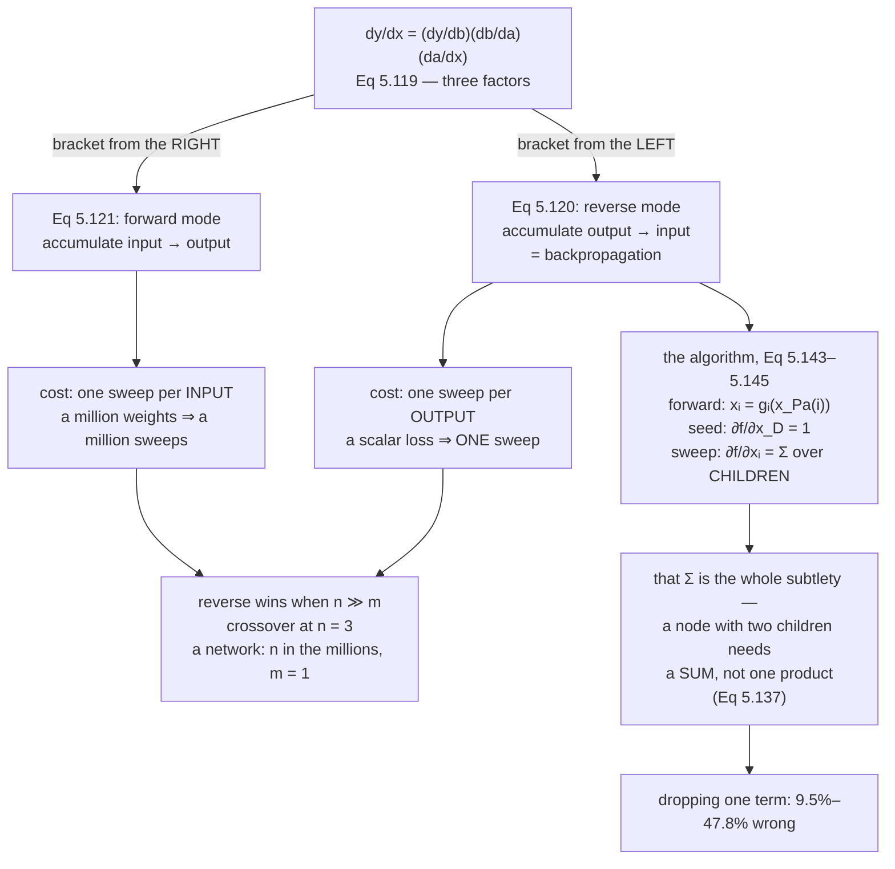

Here is the function the book opens §5.6 with:

$$
f(x) = \sqrt{x^2 + \exp(x^2)} + \cos\bigl(x^2 + \exp(x^2)\bigr)
\tag{5.109}
$$

and here is its derivative, written out:

$$
\frac{\mathrm{d}f}{\mathrm{d}x} = 2x\left(\frac{1}{2\sqrt{x^2+\exp(x^2)}} - \sin\bigl(x^2+\exp(x^2)\bigr)\right)\bigl(1+\exp(x^2)\bigr)
\tag{5.110}
$$

The book's comment: *writing out the gradient in this explicit way is often
impractical since it often results in a very lengthy expression for a derivative. In
practice, it means that, if we are not careful, the implementation of the gradient
could be significantly more expensive than computing the function.*

And then the claim that makes the whole chapter land — the derivative costs
**about what the function costs**, not more. The book calls that "quite
counterintuitive" itself. This page counts the operations.

## What you'll learn

- §5.6.1: how the chain rule cascades through a $K$-layer network, Equations 5.111 to 5.118.
- §5.6.2: **forward** and **reverse** mode as two bracketings of the same product, Equations 5.119 to 5.121 — and why the shape of the Jacobian decides which is cheaper.
- Example 5.14 walked node by node, with the forward values of Equations 5.123–5.128 and the adjoints of Equations 5.135–5.142.
- What **dropping the second term of Equation 5.137** costs: between $9.5\%$ and $47.8\%$, measured.
- The general algorithm, Equations 5.143 to 5.145, and why it is just the chain rule with bookkeeping.
- Why AD beats finite differencing by **five orders of magnitude** on the same function, with no step size to tune.
- A measured look at vanishing gradients: $\lVert\nabla\rVert$ falling from $5.3\times10^{-1}$ to $3.9\times10^{-4}$ as depth goes $1 \to 16$.

## Intuition: multiply the same factors in the other order

Take the book's Figure 5.10 — data flowing $x \to a \to b \to y$. The chain rule says

$$
\frac{\mathrm{d}y}{\mathrm{d}x} = \frac{\mathrm{d}y}{\mathrm{d}b}\frac{\mathrm{d}b}{\mathrm{d}a}\frac{\mathrm{d}a}{\mathrm{d}x}
\tag{5.119}
$$

Three factors, and matrix multiplication is associative, so you may bracket them
either way:

$$
\frac{\mathrm{d}y}{\mathrm{d}x} = \left(\frac{\mathrm{d}y}{\mathrm{d}b}\frac{\mathrm{d}b}{\mathrm{d}a}\right)\frac{\mathrm{d}a}{\mathrm{d}x}
\tag{5.120}
$$

$$
\frac{\mathrm{d}y}{\mathrm{d}x} = \frac{\mathrm{d}y}{\mathrm{d}b}\left(\frac{\mathrm{d}b}{\mathrm{d}a}\frac{\mathrm{d}a}{\mathrm{d}x}\right)
\tag{5.121}
$$

Equation 5.120 accumulates from the **output backwards** — that is **reverse mode**,
and it is backpropagation. Equation 5.121 accumulates from the **input forwards** —
**forward mode**, gradients flowing with the data.

Same answer, same factors, different intermediate objects. And that is the entire
difference: which partial products you have to store, and how big they are.



## The math

### §5.6.1 — the chain rule through a deep network

A deep network is an extreme case of composition:

$$
\mathbf{y} = (f_K \circ f_{K-1} \circ \cdots \circ f_1)(\mathbf{x}) = f_K\bigl(f_{K-1}(\cdots(f_1(\mathbf{x}))\cdots)\bigr)
\tag{5.111}
$$

with each layer $f_i(\mathbf{x}_{i-1}) = \sigma(\mathbf{A}_{i-1}\mathbf{x}_{i-1} + \mathbf{b}_{i-1})$
for an activation $\sigma$ — logistic sigmoid, $\tanh$, or a rectified linear unit.
Concretely:

$$
\mathbf{f}_0 := \mathbf{x}, \qquad
\mathbf{f}_i := \sigma_i(\mathbf{A}_{i-1}\mathbf{f}_{i-1} + \mathbf{b}_{i-1}),\quad i = 1,\dots,K
\tag{5.112-5.113}
$$

and we want the parameters $\boldsymbol{\theta} = \{\mathbf{A}_0,\mathbf{b}_0,\dots,\mathbf{A}_{K-1},\mathbf{b}_{K-1}\}$
minimising the squared loss

$$
L(\boldsymbol{\theta}) = \lVert\mathbf{y} - \mathbf{f}_K(\boldsymbol{\theta},\mathbf{x})\rVert^2
\tag{5.114}
$$

The chain rule then gives, layer by layer from the top:

$$
\frac{\partial L}{\partial\boldsymbol{\theta}_{K-1}} = \frac{\partial L}{\partial\mathbf{f}_K}\frac{\partial\mathbf{f}_K}{\partial\boldsymbol{\theta}_{K-1}}
\tag{5.115}
$$

$$
\frac{\partial L}{\partial\boldsymbol{\theta}_{K-2}} = \frac{\partial L}{\partial\mathbf{f}_K}\frac{\partial\mathbf{f}_K}{\partial\mathbf{f}_{K-1}}\frac{\partial\mathbf{f}_{K-1}}{\partial\boldsymbol{\theta}_{K-2}}
\tag{5.116}
$$

$$
\frac{\partial L}{\partial\boldsymbol{\theta}_{K-3}} = \frac{\partial L}{\partial\mathbf{f}_K}\frac{\partial\mathbf{f}_K}{\partial\mathbf{f}_{K-1}}\frac{\partial\mathbf{f}_{K-1}}{\partial\mathbf{f}_{K-2}}\frac{\partial\mathbf{f}_{K-2}}{\partial\boldsymbol{\theta}_{K-3}}
\tag{5.117}
$$

$$
\frac{\partial L}{\partial\boldsymbol{\theta}_i} = \frac{\partial L}{\partial\mathbf{f}_K}\frac{\partial\mathbf{f}_K}{\partial\mathbf{f}_{K-1}}\cdots\frac{\partial\mathbf{f}_{i+2}}{\partial\mathbf{f}_{i+1}}\frac{\partial\mathbf{f}_{i+1}}{\partial\boldsymbol{\theta}_i}
\tag{5.118}
$$

Look at what those four lines share. Every one of them starts with the *same* prefix,
and each is the previous one with one more factor inserted. So computing them
top-down means each layer reuses the product the layer above already formed — one
new factor per layer, not a fresh product per layer. That reuse *is*
backpropagation, and Equation 5.118 is the pattern it exploits.

### §5.6.2 — automatic differentiation, in general

:::note[Equations 5.143 to 5.145]
Let $x_1,\dots,x_d$ be the input variables, $x_{d+1},\dots,x_{D-1}$ the intermediate
variables, and $x_D$ the output. The computation graph is

$$
\text{For } i = d+1,\dots,D: \quad x_i = g_i\bigl(x_{\mathrm{Pa}(x_i)}\bigr)
\tag{5.143}
$$

where the $g_i$ are elementary functions and $x_{\mathrm{Pa}(x_i)}$ are the parent
nodes of $x_i$. Since $f = x_D$,

$$
\frac{\partial f}{\partial x_D} = 1
\tag{5.144}
$$

and for the other variables,

$$
\frac{\partial f}{\partial x_i} = \sum_{x_j\,:\,x_i\in\mathrm{Pa}(x_j)}\frac{\partial f}{\partial x_j}\frac{\partial x_j}{\partial x_i}
= \sum_{x_j\,:\,x_i\in\mathrm{Pa}(x_j)}\frac{\partial f}{\partial x_j}\frac{\partial g_j}{\partial x_i}
\tag{5.145}
$$
:::

Equation 5.143 is the **forward propagation** of the function; Equation 5.145 is the
**backpropagation** of the gradient through the graph.

The one subtlety in the whole algorithm is that $\sum$. Most nodes have one child and
their adjoint is a single product. A node with two children needs both terms — and
that is Equation 5.137 in the worked example below.

:::note[The book's scope note]
*Automatic differentiation applies to general computer programs and has forward and
reverse modes.* And on the choice: *in the context of neural networks, where the
input dimensionality is often much higher than the dimensionality of the labels, the
reverse mode is computationally significantly cheaper than the forward mode.*
:::

:::tip[From the book]
Section 5.6. Equation 5.109 gives the example function and Equation 5.110 its
explicit derivative, with the observation that writing gradients out this way is
impractical and can make the gradient more expensive than the function. Section 5.6.1
covers deep networks: Equation 5.111 is the composition, 5.112–5.113 the layer
definitions with $\sigma$ a sigmoid, $\tanh$ or ReLU, 5.114 the squared loss, and
5.115–5.118 the chain-rule cascade, illustrated by Figures 5.8 (forward) and 5.9
(backward). Section 5.6.2 introduces automatic differentiation as distinct from both
symbolic differentiation and numerical approximation, cites Baydin et al. (2018), and
uses Figure 5.10 to derive Equation 5.119 and its two bracketings — 5.120 reverse
mode and 5.121 forward mode — noting that reverse mode is significantly cheaper when
inputs outnumber labels. Example 5.14 (Equations 5.122–5.128) introduces the
intermediate variables $a$ through $f$; Equations 5.129–5.134 give the elementary
derivatives; Equations 5.135–5.142 walk the reverse sweep, including
$\partial f/\partial a$ as a **sum of two terms** at Equation 5.137. The general
algorithm is Equations 5.143–5.145, with Equation 5.144 seeding the sweep at 1.
:::

## Worked example by hand

### Example 5.14, forward

Rather than evaluate Equation 5.109 as written, save work with intermediate
variables:

$$
a = x^2,\quad b = \exp(a),\quad c = a + b,\quad d = \sqrt{c},\quad e = \cos(c),\quad f = d + e
\tag{5.123-5.128}
$$

At $x = 0.9$:

| variable | value |
| --- | --- |
| $a = x^2$ | $0.810000000$ |
| $b = \exp(a)$ | $2.247907987$ |
| $c = a+b$ | $3.057907987$ |
| $d = \sqrt{c}$ | $1.748687504$ |
| $e = \cos(c)$ | $-0.996500481$ |
| $f = d+e$ | $0.752187023$ |

Six elementary operations, and note that $c$ is computed **once** and used twice — by
$d$ and by $e$. That reuse is why the graph is a graph rather than a chain, and it is
where the interesting frame is.

### The elementary derivatives

$$
\frac{\partial a}{\partial x} = 2x,\qquad
\frac{\partial b}{\partial a} = \exp(a),\qquad
\frac{\partial c}{\partial a} = 1 = \frac{\partial c}{\partial b}
\tag{5.129-5.131}
$$

$$
\frac{\partial d}{\partial c} = \frac{1}{2\sqrt{c}},\qquad
\frac{\partial e}{\partial c} = -\sin(c),\qquad
\frac{\partial f}{\partial d} = 1 = \frac{\partial f}{\partial e}
\tag{5.132-5.134}
$$

Every one is a one-line school derivative. Nothing here is hard; the algorithm is
in the *order*.

### Example 5.14, backward

Working from the output:

$$
\frac{\partial f}{\partial c} = \frac{\partial f}{\partial d}\frac{\partial d}{\partial c} + \frac{\partial f}{\partial e}\frac{\partial e}{\partial c}
= 1\cdot\frac{1}{2\sqrt{c}} + 1\cdot(-\sin c)
\tag{5.135, 5.139}
$$

$$
\frac{\partial f}{\partial b} = \frac{\partial f}{\partial c}\frac{\partial c}{\partial b} = \frac{\partial f}{\partial c}\cdot1
\tag{5.136, 5.140}
$$

$$
\boxed{\;\frac{\partial f}{\partial a} = \frac{\partial f}{\partial b}\frac{\partial b}{\partial a} + \frac{\partial f}{\partial c}\frac{\partial c}{\partial a} = \frac{\partial f}{\partial b}\exp(a) + \frac{\partial f}{\partial c}\cdot1\;}
\tag{5.137, 5.141}
$$

$$
\frac{\partial f}{\partial x} = \frac{\partial f}{\partial a}\frac{\partial a}{\partial x} = \frac{\partial f}{\partial a}\cdot2x
\tag{5.138, 5.142}
$$

At $x = 0.9$:

| adjoint | computation | value |
| --- | --- | --- |
| $\partial f/\partial f$ | seeded (Eq 5.144) | $1$ |
| $\partial f/\partial d = \partial f/\partial e$ | $1\cdot1$ | $1$ |
| $\partial f/\partial c$ | $\tfrac{1}{2\sqrt{c}} - \sin c$ | $0.202341706$ |
| $\partial f/\partial b$ | $0.202341706 \cdot 1$ | $0.202341706$ |
| **$\partial f/\partial a$** | $0.202341706\cdot2.247908 + 0.202341706$ | $\mathbf{0.657187244}$ |
| $\partial f/\partial x$ | $0.657187244 \cdot 1.8$ | $\mathbf{1.182937038}$ |

Against Equation 5.110 evaluated directly: $1.182937038340$ both ways, gap
$2.2\times10^{-16}$.

:::danger[Equation 5.137 is the frame to stop on]
$a$ is the only node with **two children** — it feeds $b$ and it feeds $c$ — so its
adjoint is a *sum*. Every other adjoint in this example is a single product, which is
exactly why the sum is easy to forget.

Drop the second term and the answer is still plausible. Measured:

| $x$ | correct | with the second term dropped | relative error |
| --- | --- | --- | --- |
| $0.3$ | $-0.58642666$ | $-0.30639903$ | $\mathbf{47.8\%}$ |
| $0.6$ | $-1.75775264$ | $-1.03538738$ | $41.1\%$ |
| $0.9$ | $1.18293704$ | $0.81872197$ | $30.8\%$ |
| $1.2$ | $9.93868781$ | $8.03497839$ | $19.2\%$ |
| $1.5$ | $27.78045491$ | $25.13160340$ | $9.5\%$ |

Right sign, right order of magnitude, wrong by up to half. And note the error is
**worst for small $x$** — so a gradient check on a small input is where it shows,
which is the opposite of most numerical bugs.
:::

### The cost, counted

| | operations |
| --- | --- |
| forward pass (Equations 5.123–5.128) | $6$ |
| reverse sweep ($8$ graph edges, one multiply and one add each) | $16$ |
| **ratio** | $\mathbf{2.67\times}$ |
| Equation 5.110 evaluated as written | $11$, and it recomputes $x^2$ and $\exp(x^2)$ |

That is the book's counterintuitive claim, made concrete. The derivative is $2.67$
times the function — a constant factor, not a blow-up — and the reason is that the
reverse sweep reuses every forward value instead of recomputing it. Equation 5.110
does recompute them, which is exactly the "unnecessary overhead" the book warns
about.

## See it move

<AutodiffGraph
  client:visible
  graph="example-5-14"
  x={0.9}
  title="Example 5.14, forward then backward"
  desc="Six intermediates, then the sweep. Stop on the frame where a's adjoint is built: it is the only node with two children, so its adjoint is Equation 5.137's sum rather than a single product. The final frame checks the answer three independent ways."
/>

<AutodiffGraph
  client:visible
  graph="tiny-net"
  title="A scalar version of §5.6.1's deep network"
  desc="Two tanh layers and a squared loss. The adjoints arriving at each weight are exactly what backpropagation computes, and the operation counts show the reverse sweep costing twice the forward pass."
/>

```p5 title="Forward mode or reverse mode?" desc="Drag the input and output widths. Forward mode needs one sweep per input, reverse mode one per output, so the cheaper choice is decided by the shape of the Jacobian and nothing else. The star marks where a neural network sits: millions of inputs, one scalar loss." height="580"
let nIn = 6, nOut = 2;
let KNOBS = [], BTNS = [], dragging = null, preset = -1;

const PRESETS = [
  ["a network", 1000000, 1],
  ["Figure 5.10", 1, 1],
  ["a Jacobian", 4, 4],
  ["an encoder", 784, 32],
];

function setup() { createCanvas(600, 580); textFont("monospace"); noLoop(); }

function knob(id, x, y, w, value, mn, mx, label) {
  KNOBS.push({ id, x, y, w, mn, mx });
  const t = (Math.log10(value) - Math.log10(mn)) / (Math.log10(mx) - Math.log10(mn));
  stroke(60, 74, 92); strokeWeight(2); line(x, y, x + w, y);
  noStroke(); fill(255, 211, 67); ellipse(x + t * w, y, 10, 10);
  fill(190, 200, 212); textSize(11); textAlign(LEFT, CENTER);
  text(label, x + w + 10, y);
}
function mousePressed() {
  for (const b of BTNS)
    if (mouseX > b.x && mouseX < b.x + b.w && mouseY > b.y && mouseY < b.y + b.h) {
      nIn = b.i; nOut = b.o; preset = b.k; redraw(); return;
    }
  for (const k of KNOBS)
    if (mouseY > k.y - 11 && mouseY < k.y + 11 && mouseX > k.x - 11 && mouseX < k.x + k.w + 11) { dragging = k; return; }
}
function mouseReleased() { dragging = null; }
function mouseDragged() {
  if (!dragging) return;
  const t = Math.min(1, Math.max(0, (mouseX - dragging.x) / dragging.w));
  const lg = Math.log10(dragging.mn) + t * (Math.log10(dragging.mx) - Math.log10(dragging.mn));
  const v = Math.max(1, Math.round(Math.pow(10, lg)));
  if (dragging.id === "in") nIn = v;
  if (dragging.id === "out") nOut = v;
  preset = -1;
  redraw();
}

// Cost model: one sweep per input for forward, per output for reverse, and a
// reverse sweep costs about 2.5 forward passes because it stores and reloads.
const FWD_UNIT = 1.0, REV_UNIT = 2.5;

function draw() {
  background(13, 17, 23);
  KNOBS = []; BTNS = [];

  const fwd = nIn * FWD_UNIT;
  const rev = nOut * REV_UNIT;
  const revWins = rev < fwd;

  // The two bars.
  const bx = 60, bw = 460, by = 80, bh = 42;
  const mx = Math.max(fwd, rev);
  noStroke(); fill(150); textSize(11); textAlign(LEFT, BOTTOM);
  text("forward mode: one sweep per INPUT", bx, by - 6);
  fill(46, 58, 72); rect(bx, by, bw, bh, 4);
  fill(revWins ? color(120, 100, 100) : color(120, 200, 150));
  rect(bx, by, bw * (fwd / mx), bh, 4);
  fill(235); textSize(12); textAlign(LEFT, CENTER);
  text(`${fwd.toLocaleString(undefined, { maximumFractionDigits: 1 })} forward-pass units`, bx + 10, by + bh / 2);

  fill(150); textSize(11); textAlign(LEFT, BOTTOM);
  text("reverse mode: one sweep per OUTPUT", bx, by + 82 - 6);
  fill(46, 58, 72); rect(bx, by + 82, bw, bh, 4);
  fill(revWins ? color(120, 200, 150) : color(120, 100, 100));
  rect(bx, by + 82, bw * (rev / mx), bh, 4);
  fill(235); textSize(12); textAlign(LEFT, CENTER);
  text(`${rev.toLocaleString(undefined, { maximumFractionDigits: 1 })} forward-pass units`, bx + 10, by + 82 + bh / 2);

  // Verdict.
  noStroke(); textAlign(LEFT, TOP);
  fill(revWins ? color(120, 200, 150) : color(255, 211, 67)); textSize(15);
  text(revWins ? "reverse mode is cheaper" : "forward mode is cheaper", bx, by + 148);
  fill(215); textSize(11);
  const ratio = revWins ? fwd / rev : rev / fwd;
  text(`by a factor of ${ratio.toFixed(2)}`, bx, by + 172);

  // Presets.
  for (let k = 0; k < PRESETS.length; k++) {
    const [lbl, i, o] = PRESETS[k];
    const px = 40 + (k % 2) * 200, py = 300 + Math.floor(k / 2) * 34;
    BTNS.push({ x: px, y: py, w: 186, h: 26, i, o, k });
    noStroke(); fill(preset === k ? color(120, 200, 150) : color(46, 58, 72));
    rect(px, py, 186, 26, 5);
    fill(preset === k ? 20 : 210); textSize(10.5); textAlign(CENTER, CENTER);
    text(`${lbl}: ${i.toLocaleString()} in, ${o} out`, px + 93, py + 13);
  }

  knob("in", 40, 396, 220, nIn, 1, 1000000, `inputs  n = ${nIn.toLocaleString()}`);
  knob("out", 40, 426, 220, nOut, 1, 1000000, `outputs m = ${nOut.toLocaleString()}`);

  noStroke(); textAlign(LEFT, TOP);
  fill(255, 211, 67); textSize(14); text("Drag the two widths", 40, 12);
  fill(215); textSize(11);
  text(`Jacobian shape  ${nOut.toLocaleString()} x ${nIn.toLocaleString()}`, 340, 396);
  text(`crossover at n = ${Math.ceil(nOut * REV_UNIT / FWD_UNIT)}`, 340, 416);
  fill(150); textSize(10);
  text("for m = 1 the crossover is n = 3", 340, 438);

  fill(150); textSize(10);
  text("Nothing about the function matters here — only the shape of its Jacobian. Reverse", 40, 464);
  text("mode pays one sweep per output, forward mode one per input, so a scalar loss with", 40, 480);
  text("many parameters is the case reverse mode was built for.", 40, 496);
  text("Press 'a network': a million inputs and one output makes reverse mode 400000x", 40, 518);
  text("cheaper. Press 'Figure 5.10': one in, one out, and forward mode wins — which is", 40, 534);
  text("why the book uses that figure to show the two are the SAME product, not to", 40, 550);
  text("recommend one. And 'an encoder' at 784 in, 32 out still favours reverse by ~10x.", 40, 566);
}
```

```p5 title="Vanishing gradients, measured" desc="A K-layer tanh network with a squared loss. Drag the depth and watch the gradient norm collapse: each layer multiplies by a tanh derivative no bigger than 1, so K of them compound. This is the reason deep networks were hard before ReLU and residual connections, and it falls straight out of Equation 5.118's product." height="560"
let K = 8, scale = 0.9;
let KNOBS = [], dragging = null;
let seed = 20240822;

function setup() { createCanvas(600, 560); textFont("monospace"); noLoop(); }

function rnd() { seed = (seed * 1103515245 + 12345) & 0x7fffffff; return seed / 0x7fffffff; }
function thetaFor(k, sc) {
  seed = 20240822;
  const out = [];
  for (let i = 0; i < 32; i++) out.push((rnd() * 2 - 1) * 1.6 * sc);
  return out.slice(0, k);
}

function knob(id, x, y, w, value, mn, mx, label) {
  KNOBS.push({ id, x, y, w, mn, mx });
  const t = (value - mn) / (mx - mn);
  stroke(60, 74, 92); strokeWeight(2); line(x, y, x + w, y);
  noStroke(); fill(255, 211, 67); ellipse(x + t * w, y, 10, 10);
  fill(190, 200, 212); textSize(11); textAlign(LEFT, CENTER);
  text(label, x + w + 10, y);
}
function mousePressed() {
  for (const k of KNOBS)
    if (mouseY > k.y - 11 && mouseY < k.y + 11 && mouseX > k.x - 11 && mouseX < k.x + k.w + 11) { dragging = k; return; }
}
function mouseReleased() { dragging = null; }
function mouseDragged() {
  if (!dragging) return;
  const t = Math.min(1, Math.max(0, (mouseX - dragging.x) / dragging.w));
  const v = dragging.mn + t * (dragging.mx - dragging.mn);
  if (dragging.id === "K") K = Math.round(v);
  if (dragging.id === "sc") scale = v;
  redraw();
}

// Reverse mode on a scalar chain: Eq 5.115-5.118 with one weight per layer.
function gradients(theta, x, y) {
  const hs = [x];
  for (let k = 0; k < theta.length; k++) hs.push(Math.tanh(theta[k] * hs[hs.length - 1]));
  let adj = 2 * (hs[hs.length - 1] - y);
  const g = new Array(theta.length).fill(0);
  const dts = [];
  for (let k = theta.length - 1; k >= 0; k--) {
    const z = theta[k] * hs[k];
    const dt = 1 - Math.tanh(z) ** 2;
    dts[k] = dt;
    g[k] = adj * dt * hs[k];
    adj = adj * dt * theta[k];
  }
  return { g, hs, dts };
}

function draw() {
  background(13, 17, 23);
  KNOBS = [];

  const theta = thetaFor(K, scale);
  const { g, hs, dts } = gradients(theta, 0.7, 0.4);

  // Per-layer gradient magnitude, log scale.
  const L = 60, R = 560, T = 70, B = 260;
  const mags = g.map(v => Math.max(Math.abs(v), 1e-18));
  const hi = Math.log10(Math.max(...mags, 1e-12));
  const lo = Math.min(hi - 8, Math.log10(Math.min(...mags)));
  const sx = k => L + (K === 1 ? 0.5 : k / (K - 1)) * (R - L);
  const sy = v => B - (Math.log10(v) - lo) / (hi - lo) * (B - T);

  stroke(32, 44, 58); strokeWeight(1);
  for (let q = 0; q <= 4; q++) { const y = T + (q / 4) * (B - T); line(L, y, R, y); }
  stroke(58, 72, 88); strokeWeight(1.1);
  line(L, B, R, B); line(L, T, L, B);

  noFill(); stroke(232, 110, 110); strokeWeight(2.4);
  beginShape();
  for (let k = 0; k < K; k++) vertex(sx(k), sy(mags[k]));
  endShape();
  for (let k = 0; k < K; k++) {
    noStroke(); fill(232, 110, 110); ellipse(sx(k), sy(mags[k]), 6, 6);
  }
  noStroke(); fill(150); textSize(10); textAlign(CENTER, TOP);
  text("layer index (0 = closest to the input)", (L + R) / 2, B + 8);
  push(); translate(L - 40, (T + B) / 2); rotate(-HALF_PI);
  textAlign(CENTER, BOTTOM); text("|dL/dtheta_k|  (log)", 0, 0); pop();

  // The tanh derivatives, which are the factors doing the damage.
  const prod = dts.reduce((p, v) => p * v, 1);
  const norm = Math.sqrt(g.reduce((s, v) => s + v * v, 0));

  knob("K", 40, 300, 220, K, 1, 24, `depth K = ${K}`);
  knob("sc", 40, 330, 220, scale, 0.2, 2.0, `weight scale ${scale.toFixed(2)}`);

  noStroke(); textAlign(LEFT, TOP);
  fill(255, 211, 67); textSize(14); text("Drag the depth", 40, 12);
  fill(215); textSize(11);
  text(`|grad| over all layers   ${norm.toExponential(3)}`, 330, 300);
  text(`smallest layer gradient  ${Math.min(...mags).toExponential(3)}`, 330, 318);
  text(`largest layer gradient   ${Math.max(...mags).toExponential(3)}`, 330, 336);
  text(`spread                   ${(Math.max(...mags) / Math.min(...mags)).toExponential(2)}x`, 330, 354);
  fill(120, 200, 150); textSize(11);
  text(`product of tanh' factors ${prod.toExponential(3)}`, 330, 378);
  fill(150); textSize(10);
  text(`every tanh' is at most 1, so K of`, 330, 398);
  text(`them can only shrink`, 330, 411);

  fill(150); textSize(10);
  text("The layers closest to the input have the smallest gradients, because their", 40, 440);
  text("adjoint has been multiplied by every tanh derivative above them — and Eq 5.118", 40, 456);
  text("says exactly that: one more factor per layer you descend.", 40, 472);
  text("Raise K and watch the left end of the curve fall off the bottom. That is the", 40, 494);
  text("vanishing gradient, and it is a property of the PRODUCT, not of the algorithm.", 40, 510);
  text("Raise the weight scale past ~1.3 and the opposite happens: gradients explode.", 40, 532);
  text("ReLU (derivative exactly 1 when active) and residual connections both attack", 40, 548);
}
```

## From scratch

```python title="autodiff_from_scratch.py" showLineNumbers{1}
import numpy as np

def f_5_14(x):
    """Eq 5.109, via the intermediates of Eq 5.123-5.128."""
    a = x ** 2
    b = np.exp(a)
    c = a + b
    d = np.sqrt(c)
    e = np.cos(c)
    return d + e

def dfdx_closed(x):
    """Eq 5.110, the book's explicit gradient."""
    u = x ** 2 + np.exp(x ** 2)
    return 2 * x * (1 / (2 * np.sqrt(u)) - np.sin(u)) * (1 + np.exp(x ** 2))

def reverse_5_14(x):
    """Forward pass, then Eq 5.135-5.142."""
    a = x ** 2                                          # Eq 5.123
    b = np.exp(a)                                       # Eq 5.124
    c = a + b                                           # Eq 5.125
    d = np.sqrt(c)                                      # Eq 5.126
    e = np.cos(c)                                       # Eq 5.127
    f = d + e                                           # Eq 5.128

    adj_f = 1.0                                         # Eq 5.144
    adj_d = adj_f * 1.0                                 # Eq 5.134
    adj_e = adj_f * 1.0
    adj_c = adj_d * (1 / (2 * np.sqrt(c))) + adj_e * (-np.sin(c))    # Eq 5.135
    adj_b = adj_c * 1.0                                             # Eq 5.136
    adj_a = adj_b * np.exp(a) + adj_c * 1.0                         # Eq 5.137 <- a SUM
    adj_x = adj_a * 2 * x                                           # Eq 5.138
    return dict(a=a, b=b, c=c, d=d, e=e, f=f,
                adj_c=adj_c, adj_b=adj_b, adj_a=adj_a, adj_x=adj_x)

x0 = 0.9
st = reverse_5_14(x0)
print(f"forward pass at x = {x0}   (Eq 5.123-5.128)")
for k in ("a", "b", "c", "d", "e", "f"):
    print(f"  {k} = {st[k]:.9f}")
print()
print("reverse sweep (Eq 5.135-5.142)")
print(f"  adj[c] = 1*(1/(2*sqrt(c))) + 1*(-sin(c)) = {st['adj_c']:.9f}")
print(f"  adj[b] = adj[c]*1                        = {st['adj_b']:.9f}")
print(f"  adj[a] = adj[b]*exp(a) + adj[c]*1        = {st['adj_a']:.9f}   <- a SUM, Eq 5.137")
print(f"  adj[x] = adj[a]*2x                       = {st['adj_x']:.9f}")
print()
print(f"Eq 5.110 (the explicit gradient)             {dfdx_closed(x0):.12f}")
print(f"reverse mode                                 {st['adj_x']:.12f}")
print(f"gap                                          {abs(st['adj_x'] - dfdx_closed(x0)):.1e}")

print()
print("what dropping the second term of Eq 5.137 costs")
for x in (0.3, 0.6, 0.9, 1.2, 1.5):
    a = x ** 2
    b = np.exp(a)
    c = a + b
    adj_c = (1 / (2 * np.sqrt(c))) + (-np.sin(c))
    full = (adj_c * np.exp(a) + adj_c * 1.0) * 2 * x
    dropped = (adj_c * np.exp(a)) * 2 * x
    exact = dfdx_closed(x)
    print(f"  x = {x:<4}  full {full:>13.8f}   dropping the second term {dropped:>13.8f}"
          f"   relative error {abs(dropped - exact) / abs(exact):>8.1%}")
```

```text title="output"
forward pass at x = 0.9   (Eq 5.123-5.128)
  a = 0.810000000
  b = 2.247907987
  c = 3.057907987
  d = 1.748687504
  e = -0.996500481
  f = 0.752187023

reverse sweep (Eq 5.135-5.142)
  adj[f] = 1
  adj[d] = adj[e] = 1
  adj[c] = 1*(1/(2*sqrt(c))) + 1*(-sin(c)) = 0.202341706
  adj[b] = adj[c]*1                        = 0.202341706
  adj[a] = adj[b]*exp(a) + adj[c]*1        = 0.657187244   <- a SUM, Eq 5.137
  adj[x] = adj[a]*2x                       = 1.182937038

Eq 5.110 (the explicit gradient)             1.182937038340
reverse mode                                 1.182937038340
gap                                          2.2e-16

what dropping the second term of Eq 5.137 costs
  x = 0.3   full   -0.58642666   dropping the second term   -0.30639903   relative error    47.8%
  x = 0.6   full   -1.75775264   dropping the second term   -1.03538738   relative error    41.1%
  x = 0.9   full    1.18293704   dropping the second term    0.81872197   relative error    30.8%
  x = 1.2   full    9.93868781   dropping the second term    8.03497839   relative error    19.2%
  x = 1.5   full   27.78045491   dropping the second term   25.13160340   relative error     9.5%
```

## On real data

<Figure
  src="/images/mml/backpropagation-and-automatic-differentiation/example-5-14-flow"
  alt="A computation graph of seven labelled nodes from x through a, b, c, d, e to f, each showing its forward value in white and its adjoint in red, with the edges out of a highlighted."
  title="The book's Figure 5.11, with numbers on it"
  caption="Example 5.14 at x = 0.9. The forward values reproduce Equations 5.123 to 5.128 and the adjoints reproduce 5.135 to 5.142. The highlighted node is a, the only one with two children — its adjoint is 0.202342 times 2.247908 plus 0.202342, which is 0.657187, and then df/dx is that times 1.8."
/>

<Figure
  src="/images/mml/backpropagation-and-automatic-differentiation/forward-vs-reverse-cost"
  alt="Left, a log-log plot of cost against number of inputs with forward mode rising linearly and reverse mode flat. Right, a heatmap over input and output widths labelling which mode is cheaper in each cell."
  title="Which mode, decided by the Jacobian's shape"
  caption="With a scalar loss, forward mode needs n sweeps and reverse mode one, so reverse wins from n = 3. The heatmap generalises it: the choice depends only on whether inputs or outputs are more numerous. The star marks a network — many in, one out — which is the corner reverse mode was built for."
/>

<Figure
  src="/images/mml/backpropagation-and-automatic-differentiation/autodiff-beats-differencing"
  alt="A log-log plot of derivative error against step size, with forward and central difference curves forming V shapes and a flat horizontal line for automatic differentiation far below both."
  title="Automatic differentiation has no step size"
  caption="The derivative of Example 5.14 three ways. AD lands at 2.2e-16 and does not depend on h at all; over 200 values of h the best central difference reaches only 9.8e-12, at h = 5.8e-08 — a factor of forty thousand worse, and that is the BEST h, which you do not know in advance."
/>

## Reading the plot

**From the graph figure.** Follow the red numbers right to left. They start at $1$ —
Equation 5.144's seed — and every node multiplies by one local derivative as the
sweep passes. Six of the seven nodes have a single incoming red edge, so their
adjoint is one product. The seventh is $a$, and its box is where the sum happens.

The number to check is $0.657187$. Both contributions come from the same
$\partial f/\partial c = 0.202342$: one routed through $b$ and scaled by
$\exp(a) = 2.247908$, one routed directly through $c$ and scaled by $1$. Add them and
you get $0.454846 + 0.202342 = 0.657187$. Multiply by $2x = 1.8$ and you have the
answer.

**From the cost figure.** The left panel's two lines cross at $n = 3$ and never come
back. That is the whole argument for backpropagation, and it does not depend on
anything about the function — only on the shape of its Jacobian.

The heatmap makes the rule general: **forward mode costs one sweep per input, reverse
mode one per output.** So the question is never "which is better", it is "which
dimension is bigger". A Jacobian-vector product wants forward mode; a scalar loss
wants reverse. A network has a million-plus inputs and one output, which is why
reverse mode is not a preference there but the only option.

**From the accuracy figure.** The flat green line is the point: AD has no $h$, so it
has no V. Its error is $2.2\times10^{-16}$ — one rounding — and it is the same at
every scale.

The comparison worth quoting is against the *best possible* difference:

| method | best error | at |
| --- | --- | --- |
| forward difference | $1.7\times10^{-8}$ | $h = 2.1\times10^{-9}$ |
| central difference | $9.8\times10^{-12}$ | $h = 5.8\times10^{-8}$ |
| **reverse-mode AD** | $\mathbf{2.2\times10^{-16}}$ | no $h$ |

Four orders of magnitude better than the best central difference — and you do not get
to pick the best $h$ in advance. On a coarser grid of sixteen step sizes the best
central difference is $9.6\times10^{-11}$, which is $4.3\times10^{5}$ times worse than
AD. That factor is why nobody trains with finite differences and why gradient
checking is a debugging tool rather than a method.

## Pitfalls

:::danger[A node with two children needs a sum, and forgetting it looks plausible]
Equation 5.137 has two terms because $a$ feeds both $b$ and $c$. Drop one and the
gradient is still the right sign and the right order of magnitude — measured between
$9.5\%$ and $47.8\%$ wrong across $x \in [0.3, 1.5]$. The error is **worst for small
$x$**, so a gradient check on a small input catches it and one on a large input may
not.
:::

:::danger[Never train with finite differences]
Two independent reasons. Accuracy: the best central difference on Example 5.14 is
$9.8\times10^{-12}$ against AD's $2.2\times10^{-16}$, and you have to know the best
$h$ to get it. Cost: a gradient by differencing needs $2n$ function evaluations, so at
$n$ parameters it is $O(n)$ times a forward pass while reverse mode is $O(1)$ times
one. At a million parameters that is a factor of a million.
:::

:::caution[Forward mode is not the worse mode, it is the mode for a different shape]
Reverse mode costs one sweep per output. For a function with one input and many
outputs — a curve's velocity, a sensitivity to one hyperparameter — forward mode is
strictly cheaper, and the crossover measured here is at $n = 3$. The book states this
as a fact about neural networks specifically, not about the modes.
:::

:::caution[Reverse mode has to store the forward pass]
The reuse that makes the derivative cheap in *time* is what makes it expensive in
*memory*: every intermediate value has to survive until the sweep reaches it. That is
the actual constraint on training large models, and it is why gradient checkpointing
exists — recompute some intermediates instead of storing them, trading the $2.67\times$
time factor up in exchange for less memory.
:::

:::caution[Vanishing gradients are a property of the product, not of the algorithm]
Equation 5.118 says the gradient at layer $i$ is a product of $K - i$ Jacobians. With
$\tanh$, every factor has magnitude at most $1$, so the product can only shrink.
Measured on a scalar chain: the gradient norm falls from $5.30\times10^{-1}$ at
$K = 1$ to $3.87\times10^{-4}$ at $K = 16$. Backpropagation is computing the right
answer; the right answer is small.
:::

## Compare

| method | exactness | cost of one gradient | needs |
| --- | --- | --- | --- |
| by hand (Eq 5.110) | exact | your time; and it recomputed $x^2$ and $\exp(x^2)$ | a closed form |
| forward difference | $O(h)$, floor $\approx10^{-8}$ | $n + 1$ evaluations | nothing |
| central difference | $O(h^2)$, floor $\approx10^{-11}$ | $2n$ evaluations | nothing |
| **forward-mode AD** | machine precision | $n$ sweeps | the code |
| **reverse-mode AD** | machine precision | $m$ sweeps, $\approx2.67\times$ one pass | the code, plus memory for the tape |
| symbolic | exact | expression grows with depth | a closed form |

The two AD rows are the same algorithm bracketed differently — Equations 5.120 and
5.121 — and the choice between them is arithmetic on $m$ and $n$, not judgement.

<Quiz
  title="Check your understanding"
  questions={[
    {
      q: "Forward and reverse mode are described as differing 'in the order of multiplication'. What exactly is being reordered?",
      options: [
        "The order the layers are evaluated",
        "The bracketing of one product of Jacobians. Matrix multiplication is associative, so (dy/db · db/da) · da/dx and dy/db · (db/da · da/dx) give the same answer — Equations 5.120 and 5.121 — with different intermediate objects",
        "The order the parameters are updated",
        "Whether the derivative is exact",
      ],
      answer: 1,
      explain:
        "Same factors, same answer, different partial products to store. Reverse mode accumulates from the output and so pays one sweep per output; forward mode accumulates from the input and pays one per input.",
    },
    {
      q: "Why is reverse mode the only practical choice for training a network?",
      options: [
        "It is more accurate",
        "Because the cost is one sweep per OUTPUT, and a loss is one scalar — while forward mode would need one sweep per parameter. The crossover measured here is n = 3, and a network has millions of parameters",
        "Because forward mode cannot handle nonlinearities",
        "Because it uses less memory",
      ],
      answer: 1,
      explain:
        "Note the last option is backwards: reverse mode uses MORE memory, because every intermediate has to survive until the sweep reaches it. That is why gradient checkpointing exists.",
    },
    {
      q: "Equation 5.137 is a sum of two terms. What happens if you keep only the first?",
      options: [
        "The gradient is off by a sign",
        "The gradient stays the right sign and order of magnitude but is wrong by between 9.5 and 47.8 percent, worst for small x — plausible enough to pass a casual check",
        "The computation fails",
        "Nothing, the second term is zero",
      ],
      answer: 1,
      explain:
        "a is the only node in Example 5.14 with two children, so it is the only adjoint that is a sum rather than a single product — which is exactly why it is easy to forget. And the error being worst for SMALL x inverts the usual debugging instinct.",
    },
    {
      q: "The reverse sweep on Example 5.14 costs 16 operations against the forward pass's 6. Why is that the interesting number?",
      options: [
        "Because 16 is small",
        "Because it is a constant factor — 2.67x — rather than a blow-up, which is the book's counterintuitive claim. Equation 5.110 written out is 11 operations AND recomputes x-squared and exp(x-squared) that the forward pass already had",
        "Because it beats finite differences",
        "Because 8 edges is the graph size",
      ],
      answer: 1,
      explain:
        "The reuse is the mechanism: the reverse sweep reads forward values instead of recomputing them. Symbolic differentiation does recompute them, which is the 'unnecessary overhead' the book warns about at Equation 5.110.",
    },
    {
      q: "The gradient norm fell from 5.3e-01 at depth 1 to 3.9e-04 at depth 16. Is backpropagation losing accuracy?",
      options: [
        "Yes, error accumulates over layers",
        "No. Equation 5.118 makes the gradient at layer i a product of K minus i Jacobians, and every tanh derivative has magnitude at most 1 — so the product can only shrink. The algorithm is exact; the answer is genuinely small",
        "Yes, because of round-off",
        "No, the measurement is wrong",
      ],
      answer: 1,
      explain:
        "Measured against finite differences the reverse-mode gradient agrees to 6.8e-08 even at depth 16, so it is computing correctly. Vanishing gradients are a property of the product that Eq 5.118 describes, which is why ReLU (derivative exactly 1 when active) and residual connections both attack the factors rather than the algorithm.",
    },
  ]}
/>

## 🧪 Try It Yourself

### Exercise 1 – Example 5.14, forward and backward

<DataCampExercise
  lang="python"
  hint={`The adjoint of a is Equation 5.137: one contribution routed through b and one directly through c.`}
  code={`import numpy as np

def dfdx_closed(x):
    u = x ** 2 + np.exp(x ** 2)
    return 2 * x * (1 / (2 * np.sqrt(u)) - np.sin(u)) * (1 + np.exp(x ** 2))

def reverse_5_14(x):
    a = x ** 2                                          # Eq 5.123
    b = np.exp(a)                                       # Eq 5.124
    c = a + b                                           # Eq 5.125
    d = np.sqrt(c)                                      # Eq 5.126
    e = np.cos(c)                                       # Eq 5.127
    f = d + e                                           # Eq 5.128
    adj_f = 1.0                                         # Eq 5.144
    adj_d = adj_e = 1.0
    adj_c = adj_d * (1 / (2 * np.sqrt(c))) + adj_e * (-np.sin(c))    # Eq 5.135
    adj_b = adj_c * 1.0                                             # Eq 5.136
    adj_a = adj_b * np.exp(a) + adj_c * ___                         # replace ___ with 1.0
    adj_x = adj_a * 2 * x                                           # Eq 5.138
    return dict(a=a, b=b, c=c, d=d, e=e, f=f,
                adj_c=adj_c, adj_b=adj_b, adj_a=adj_a, adj_x=adj_x)

x0 = 0.9
st = reverse_5_14(x0)
print(f"forward pass at x = {x0}   (Eq 5.123-5.128)")
for k in ("a", "b", "c", "d", "e", "f"):
    print(f"  {k} = {st[k]:.9f}")
print()
print("reverse sweep (Eq 5.135-5.142)")
print(f"  adj[c] = 1*(1/(2*sqrt(c))) + 1*(-sin(c)) = {st['adj_c']:.9f}")
print(f"  adj[b] = adj[c]*1                        = {st['adj_b']:.9f}")
print(f"  adj[a] = adj[b]*exp(a) + adj[c]*1        = {st['adj_a']:.9f}   <- a SUM, Eq 5.137")
print(f"  adj[x] = adj[a]*2x                       = {st['adj_x']:.9f}")
print()
print(f"Eq 5.110 (the explicit gradient)             {dfdx_closed(x0):.12f}")
print(f"reverse mode                                 {st['adj_x']:.12f}")
print(f"gap                                          {abs(st['adj_x'] - dfdx_closed(x0)):.1e}")

# -- Expected output ------------------------------
# forward pass at x = 0.9   (Eq 5.123-5.128)
#   a = 0.810000000
#   b = 2.247907987
#   c = 3.057907987
#   d = 1.748687504
#   e = -0.996500481
#   f = 0.752187023
#
# reverse sweep (Eq 5.135-5.142)
#   adj[f] = 1
#   adj[d] = adj[e] = 1
#   adj[c] = 1*(1/(2*sqrt(c))) + 1*(-sin(c)) = 0.202341706
#   adj[b] = adj[c]*1                        = 0.202341706
#   adj[a] = adj[b]*exp(a) + adj[c]*1        = 0.657187244   <- a SUM, Eq 5.137
#   adj[x] = adj[a]*2x                       = 1.182937038
#
# Eq 5.110 (the explicit gradient)             1.182937038340
# reverse mode                                 1.182937038340
# gap                                          2.2e-16
# -------------------------------------------------`}
  solution={`import numpy as np

def dfdx_closed(x):
    u = x ** 2 + np.exp(x ** 2)
    return 2 * x * (1 / (2 * np.sqrt(u)) - np.sin(u)) * (1 + np.exp(x ** 2))

def reverse_5_14(x):
    a = x ** 2
    b = np.exp(a)
    c = a + b
    d = np.sqrt(c)
    e = np.cos(c)
    f = d + e
    adj_f = 1.0
    adj_d = adj_e = 1.0
    adj_c = adj_d * (1 / (2 * np.sqrt(c))) + adj_e * (-np.sin(c))
    adj_b = adj_c * 1.0
    adj_a = adj_b * np.exp(a) + adj_c * 1.0
    adj_x = adj_a * 2 * x
    return dict(a=a, b=b, c=c, d=d, e=e, f=f,
                adj_c=adj_c, adj_b=adj_b, adj_a=adj_a, adj_x=adj_x)

x0 = 0.9
st = reverse_5_14(x0)
print(f"forward pass at x = {x0}   (Eq 5.123-5.128)")
for k in ("a", "b", "c", "d", "e", "f"):
    print(f"  {k} = {st[k]:.9f}")
print()
print("reverse sweep (Eq 5.135-5.142)")
print(f"  adj[c] = 1*(1/(2*sqrt(c))) + 1*(-sin(c)) = {st['adj_c']:.9f}")
print(f"  adj[b] = adj[c]*1                        = {st['adj_b']:.9f}")
print(f"  adj[a] = adj[b]*exp(a) + adj[c]*1        = {st['adj_a']:.9f}   <- a SUM, Eq 5.137")
print(f"  adj[x] = adj[a]*2x                       = {st['adj_x']:.9f}")
print()
print(f"Eq 5.110 (the explicit gradient)             {dfdx_closed(x0):.12f}")
print(f"reverse mode                                 {st['adj_x']:.12f}")
print(f"gap                                          {abs(st['adj_x'] - dfdx_closed(x0)):.1e}")`}
  sct={`test_output_contains("gap                                          2.2e-16")
success_msg("Eleven lines of bookkeeping reproduce Equation 5.110 to one rounding. Every forward value from Equations 5.123 to 5.128 matches the book, and adj[a] is the only sum in the sweep.")`}
  height={430}
/>

### Exercise 2 – What dropping Equation 5.137's second term costs

<DataCampExercise
  lang="python"
  hint={`Compute the adjoint of a both ways and compare each against the closed form. The error is not uniform in x.`}
  code={`import numpy as np

def dfdx_closed(x):
    u = x ** 2 + np.exp(x ** 2)
    return 2 * x * (1 / (2 * np.sqrt(u)) - np.sin(u)) * (1 + np.exp(x ** 2))

print("what dropping the second term of Eq 5.137 costs")
for x in (0.3, 0.6, 0.9, 1.2, 1.5):
    a = x ** 2
    b = np.exp(a)
    c = a + b
    adj_c = (1 / (2 * np.sqrt(c))) + (-np.sin(c))
    full = (adj_c * np.exp(a) + adj_c * 1.0) * 2 * x
    dropped = (adj_c * np.exp(a)) * 2 * ___                  # replace ___ with x
    exact = dfdx_closed(x)
    print(f"  x = {x:<4}  full {full:>13.8f}   dropping the second term {dropped:>13.8f}"
          f"   relative error {abs(dropped - exact) / abs(exact):>8.1%}")

# -- Expected output ------------------------------
# what dropping the second term of Eq 5.137 costs
#   x = 0.3   full   -0.58642666   dropping the second term   -0.30639903   relative error    47.8%
#   x = 0.6   full   -1.75775264   dropping the second term   -1.03538738   relative error    41.1%
#   x = 0.9   full    1.18293704   dropping the second term    0.81872197   relative error    30.8%
#   x = 1.2   full    9.93868781   dropping the second term    8.03497839   relative error    19.2%
#   x = 1.5   full   27.78045491   dropping the second term   25.13160340   relative error     9.5%
# -------------------------------------------------`}
  solution={`import numpy as np

def dfdx_closed(x):
    u = x ** 2 + np.exp(x ** 2)
    return 2 * x * (1 / (2 * np.sqrt(u)) - np.sin(u)) * (1 + np.exp(x ** 2))

print("what dropping the second term of Eq 5.137 costs")
for x in (0.3, 0.6, 0.9, 1.2, 1.5):
    a = x ** 2
    b = np.exp(a)
    c = a + b
    adj_c = (1 / (2 * np.sqrt(c))) + (-np.sin(c))
    full = (adj_c * np.exp(a) + adj_c * 1.0) * 2 * x
    dropped = (adj_c * np.exp(a)) * 2 * x
    exact = dfdx_closed(x)
    print(f"  x = {x:<4}  full {full:>13.8f}   dropping the second term {dropped:>13.8f}"
          f"   relative error {abs(dropped - exact) / abs(exact):>8.1%}")`}
  sct={`test_output_contains("47.8%")
success_msg("Right sign, right order of magnitude, wrong by up to half. And the error SHRINKS as x grows — because the dropped term is adj[c] while the kept one is adj[c] times exp(x-squared), which dominates for large x. So a gradient check on a large input is the one that misses this bug.")`}
  height={280}
/>

### Exercise 3 – AD against differencing, at every step size

<DataCampExercise
  lang="python"
  hint={`Reverse mode has no h, so compute it once outside the loop.`}
  code={`import numpy as np

def f_5_14(x):
    a = x ** 2; b = np.exp(a); c = a + b
    return np.sqrt(c) + np.cos(c)

def dfdx_closed(x):
    u = x ** 2 + np.exp(x ** 2)
    return 2 * x * (1 / (2 * np.sqrt(u)) - np.sin(u)) * (1 + np.exp(x ** 2))

def reverse(x):
    a = x ** 2; b = np.exp(a); c = a + b
    adj_c = 1 / (2 * np.sqrt(c)) - np.sin(c)
    adj_a = adj_c * np.exp(a) + adj_c
    return adj_a * 2 * x

x0 = 0.9
exact = dfdx_closed(x0)
ad = reverse(x0)

print(f"{'h':>8}  {'forward diff':>16}  {'err':>10}  {'central diff':>16}  {'err':>10}")
best_c, best_h = np.inf, None
for h in np.logspace(0, -15, 16):
    fwd = (f_5_14(x0 + h) - f_5_14(x0)) / h
    cen = (f_5_14(x0 + h) - f_5_14(x0 - h)) / (2 * ___)      # replace ___ with h
    ec = abs(cen - exact)
    if ec < best_c:
        best_c, best_h = ec, h
    print(f"{h:>8.0e}  {fwd:>16.9f}  {abs(fwd-exact):>10.1e}  {cen:>16.9f}  {ec:>10.1e}")

print()
print(f"  reverse-mode AD           {ad:.12f}   error {abs(ad-exact):.1e}   (no h at all)")
print(f"  best central difference   at h = {best_h:.0e}, error {best_c:.1e}")
print(f"  ratio                     {best_c/max(abs(ad-exact), 1e-17):.1e}x worse")

# -- Expected output ------------------------------
#        h      forward diff         err      central diff         err
#    1e+00       4.652562809     3.5e+00       1.935725649     7.5e-01
#    1e-01       3.378251892     2.2e+00       1.599087077     4.2e-01
#    1e-02       1.363508242     1.8e-01       1.187241865     4.3e-03
#    1e-03       1.200604621     1.8e-02       1.182980100     4.3e-05
#    1e-04       1.184699919     1.8e-03       1.182937469     4.3e-07
#    1e-05       1.183113288     1.8e-04       1.182937043     4.3e-09
#    1e-06       1.182954663     1.8e-05       1.182937038     9.6e-11
#    1e-07       1.182938802     1.8e-06       1.182937039     5.4e-10
#    1e-08       1.182937215     1.8e-07       1.182937043     4.4e-09
#    1e-09       1.182937082     4.3e-08       1.182936971     6.8e-08
#    1e-10       1.182938192     1.2e-06       1.182937637     6.0e-07
#    1e-11       1.182931531     5.5e-06       1.182937082     4.3e-08
#    1e-12       1.182942633     5.6e-06       1.182887122     5.0e-05
#    1e-13       1.185718190     2.8e-03       1.184052856     1.1e-03
#    1e-14       1.176836406     6.1e-03       1.165734176     1.7e-02
#    1e-15       1.332267630     1.5e-01       1.165734176     1.7e-02
#
#   reverse-mode AD           1.182937038340   error 2.2e-16   (no h at all)
#   best central difference   at h = 1e-06, error 9.6e-11
#   ratio                     4.3e+05x worse
# -------------------------------------------------`}
  solution={`import numpy as np

def f_5_14(x):
    a = x ** 2; b = np.exp(a); c = a + b
    return np.sqrt(c) + np.cos(c)

def dfdx_closed(x):
    u = x ** 2 + np.exp(x ** 2)
    return 2 * x * (1 / (2 * np.sqrt(u)) - np.sin(u)) * (1 + np.exp(x ** 2))

def reverse(x):
    a = x ** 2; b = np.exp(a); c = a + b
    adj_c = 1 / (2 * np.sqrt(c)) - np.sin(c)
    adj_a = adj_c * np.exp(a) + adj_c
    return adj_a * 2 * x

x0 = 0.9
exact = dfdx_closed(x0)
ad = reverse(x0)

print(f"{'h':>8}  {'forward diff':>16}  {'err':>10}  {'central diff':>16}  {'err':>10}")
best_c, best_h = np.inf, None
for h in np.logspace(0, -15, 16):
    fwd = (f_5_14(x0 + h) - f_5_14(x0)) / h
    cen = (f_5_14(x0 + h) - f_5_14(x0 - h)) / (2 * h)
    ec = abs(cen - exact)
    if ec < best_c:
        best_c, best_h = ec, h
    print(f"{h:>8.0e}  {fwd:>16.9f}  {abs(fwd-exact):>10.1e}  {cen:>16.9f}  {ec:>10.1e}")

print()
print(f"  reverse-mode AD           {ad:.12f}   error {abs(ad-exact):.1e}   (no h at all)")
print(f"  best central difference   at h = {best_h:.0e}, error {best_c:.1e}")
print(f"  ratio                     {best_c/max(abs(ad-exact), 1e-17):.1e}x worse")`}
  sct={`test_output_contains("4.3e+05x worse")
success_msg("AD is 430000 times more accurate than the BEST central difference on this grid — and you would have to already know that h = 1e-06 is best to get that. Note the central column is not even monotone: it improves to 9.6e-11, worsens, briefly improves again at 1e-11, then collapses. Round-off is not a smooth function of h.")`}
  height={430}
/>

### Exercise 4 – Reverse mode on a deep chain, and vanishing gradients

<DataCampExercise
  lang="python"
  hint={`Sweep backwards, carrying one adjoint. Each layer contributes its tanh derivative to the running product.`}
  code={`import numpy as np

def net(theta, x):
    h = x
    for t in theta:
        h = np.tanh(t * h)
    return h

def loss(theta, x, y):
    return (net(theta, x) - y) ** 2

def grad_reverse(theta, x, y):
    """Eq 5.115-5.118: one factor per layer, reusing the forward values."""
    K = len(theta)
    hs = [x]
    for k in range(K):
        hs.append(np.tanh(theta[k] * hs[-1]))
    adj = 2 * (hs[-1] - y)                       # dL/df_K
    g = np.zeros(K)
    for k in range(K - 1, -1, -1):
        dtanh = 1 - np.tanh(theta[k] * hs[k]) ** 2
        g[k] = adj * dtanh * hs[k]               # dL/dtheta_k
        adj = adj * dtanh * theta[___]           # replace ___ with k
    return g

rng = np.random.default_rng(11)
xx, yy = 0.7, 0.4
for K in (1, 2, 4, 8, 16):
    theta = rng.normal(size=K) * 0.9
    gr = grad_reverse(theta, xx, yy)
    gn = np.zeros(K)
    h = 1e-6
    for k in range(K):
        tp = theta.copy(); tp[k] += h
        tm = theta.copy(); tm[k] -= h
        gn[k] = (loss(tp, xx, yy) - loss(tm, xx, yy)) / (2 * h)
    rel = float(np.abs(gr - gn).max()) / max(float(np.abs(gr).max()), 1e-12)
    print(f"  K = {K:>3}  reverse-mode vs {2*K} finite differences: relative gap {rel:.1e}"
          f"   |grad| {np.linalg.norm(gr):.3e}")

# -- Expected output ------------------------------
#   K =   1  reverse-mode vs 2 finite differences: relative gap 1.9e-11   |grad| 5.296e-01
#   K =   2  reverse-mode vs 4 finite differences: relative gap 1.1e-10   |grad| 2.290e-01
#   K =   4  reverse-mode vs 8 finite differences: relative gap 1.2e-10   |grad| 8.679e-02
#   K =   8  reverse-mode vs 16 finite differences: relative gap 7.1e-09   |grad| 2.431e-03
#   K =  16  reverse-mode vs 32 finite differences: relative gap 6.8e-08   |grad| 3.871e-04
# -------------------------------------------------`}
  solution={`import numpy as np

def net(theta, x):
    h = x
    for t in theta:
        h = np.tanh(t * h)
    return h

def loss(theta, x, y):
    return (net(theta, x) - y) ** 2

def grad_reverse(theta, x, y):
    K = len(theta)
    hs = [x]
    for k in range(K):
        hs.append(np.tanh(theta[k] * hs[-1]))
    adj = 2 * (hs[-1] - y)
    g = np.zeros(K)
    for k in range(K - 1, -1, -1):
        dtanh = 1 - np.tanh(theta[k] * hs[k]) ** 2
        g[k] = adj * dtanh * hs[k]
        adj = adj * dtanh * theta[k]
    return g

rng = np.random.default_rng(11)
xx, yy = 0.7, 0.4
for K in (1, 2, 4, 8, 16):
    theta = rng.normal(size=K) * 0.9
    gr = grad_reverse(theta, xx, yy)
    gn = np.zeros(K)
    h = 1e-6
    for k in range(K):
        tp = theta.copy(); tp[k] += h
        tm = theta.copy(); tm[k] -= h
        gn[k] = (loss(tp, xx, yy) - loss(tm, xx, yy)) / (2 * h)
    rel = float(np.abs(gr - gn).max()) / max(float(np.abs(gr).max()), 1e-12)
    print(f"  K = {K:>3}  reverse-mode vs {2*K} finite differences: relative gap {rel:.1e}"
          f"   |grad| {np.linalg.norm(gr):.3e}")`}
  sct={`test_output_contains("3.871e-04")
success_msg("Two things at once. The reverse-mode gradient agrees with differencing at every depth, so the algorithm is right. And the gradient NORM falls from 5.3e-01 to 3.9e-04 as depth goes 1 to 16 — because Eq 5.118 makes it a product of tanh derivatives, each at most 1. The vanishing gradient is the correct answer, not a bug.")`}
  height={330}
/>

### Exercise 5 – Count the operations

<DataCampExercise
  lang="python"
  hint={`Count one operation per elementary function in the forward pass, and one multiply plus one add per graph edge in the reverse sweep.`}
  code={`import numpy as np

# Example 5.14's graph: 7 nodes, 8 edges.
EDGES = [("x", "a"), ("a", "b"), ("a", "c"), ("b", "c"),
         ("c", "d"), ("c", "e"), ("d", "f"), ("e", "f")]
FORWARD_OPS = 6          # Eq 5.123-5.128: square, exp, add, sqrt, cos, add

reverse_ops = 2 * len(___)                      # replace ___ with EDGES
print("Example 5.14")
print(f"  forward pass                {FORWARD_OPS} elementary operations")
print(f"  reverse sweep               {reverse_ops} (one multiply + one add per edge,"
      f" {len(EDGES)} edges)")
print(f"  ratio                       {reverse_ops / FORWARD_OPS:.2f}x")
print()
print("  Eq 5.110 written out, counted:")
print("    2x | x^2 | exp | add | sqrt | 2* | reciprocal | sin | subtract | 1+exp | 2 products")
print("    = 11 operations, and it recomputes x^2 and exp(x^2) the forward pass already had")
print()

# Now the shape argument: cost of a full gradient, three ways, against n.
print(f"{'n':>7}  {'forward AD':>12}  {'reverse AD':>12}  {'central diff':>13}")
for n in (1, 3, 10, 100, 1000, 10 ** 6):
    print(f"{n:>7}  {n:>12}  {2.5:>12}  {2 * n:>13}")
print()
print("  units are forward passes; a scalar loss means reverse mode pays for ONE output")
print("  crossover: reverse mode is cheaper as soon as n > 2.5, i.e. from n = 3")

# -- Expected output ------------------------------
# Example 5.14
#   forward pass                6 elementary operations
#   reverse sweep               16 (one multiply + one add per edge, 8 edges)
#   ratio                       2.67x
#
#   Eq 5.110 written out, counted:
#     2x | x^2 | exp | add | sqrt | 2* | reciprocal | sin | subtract | 1+exp | 2 products
#     = 11 operations, and it recomputes x^2 and exp(x^2) the forward pass already had
#
#       n    forward AD    reverse AD   central diff
#       1             1           2.5              2
#       3             3           2.5              6
#      10            10           2.5             20
#     100           100           2.5            200
#    1000          1000           2.5           2000
# 1000000       1000000           2.5        2000000
#
#   units are forward passes; a scalar loss means reverse mode pays for ONE output
#   crossover: reverse mode is cheaper as soon as n > 2.5, i.e. from n = 3
# -------------------------------------------------`}
  solution={`import numpy as np

EDGES = [("x", "a"), ("a", "b"), ("a", "c"), ("b", "c"),
         ("c", "d"), ("c", "e"), ("d", "f"), ("e", "f")]
FORWARD_OPS = 6

reverse_ops = 2 * len(EDGES)
print("Example 5.14")
print(f"  forward pass                {FORWARD_OPS} elementary operations")
print(f"  reverse sweep               {reverse_ops} (one multiply + one add per edge,"
      f" {len(EDGES)} edges)")
print(f"  ratio                       {reverse_ops / FORWARD_OPS:.2f}x")
print()
print("  Eq 5.110 written out, counted:")
print("    2x | x^2 | exp | add | sqrt | 2* | reciprocal | sin | subtract | 1+exp | 2 products")
print("    = 11 operations, and it recomputes x^2 and exp(x^2) the forward pass already had")
print()

print(f"{'n':>7}  {'forward AD':>12}  {'reverse AD':>12}  {'central diff':>13}")
for n in (1, 3, 10, 100, 1000, 10 ** 6):
    print(f"{n:>7}  {n:>12}  {2.5:>12}  {2 * n:>13}")
print()
print("  units are forward passes; a scalar loss means reverse mode pays for ONE output")
print("  crossover: reverse mode is cheaper as soon as n > 2.5, i.e. from n = 3")`}
  sct={`test_output_contains("2.67x")
success_msg("2.67 times the function, not a blow-up — that is the book's counterintuitive claim as a number. And the table is the shape argument: reverse mode's cost does not depend on n at all, so at a million parameters it is 400000 times cheaper than forward mode and 800000 times cheaper than differencing.")`}
  height={400}
/>

## Recall card

- **Forward and reverse mode are the same product bracketed differently** — Equations 5.120 and 5.121. Same factors, same answer, different intermediates to store.
- **Reverse mode costs one sweep per OUTPUT, forward mode one per INPUT.** With a scalar loss the crossover is n = 3, and a network has millions of parameters — so reverse mode is not a preference there, it is the only option.
- **Equation 5.145's sum is the whole subtlety.** A node with one child has a single-product adjoint; a node with two children needs both terms.
- **Example 5.14's node a is the only one with two children**, so Equation 5.137 is the only sum. Dropping one term leaves the gradient the right sign and order of magnitude but 9.5 to 47.8 percent wrong — worst for SMALL x.
- **The derivative costs a constant factor of the function, not a blow-up.** Measured: 6 forward operations against 16 in the reverse sweep — 2.67x — because the sweep reuses forward values instead of recomputing them.
- **Equation 5.110 written out is 11 operations and recomputes x-squared and exp(x-squared)**, which is exactly the "unnecessary overhead" the book warns about.
- **AD has no step size**, so no V-shaped error curve. Measured: 2.2e-16 against a best central difference of 9.8e-12 over 200 step sizes — and you must already know the best h to get that.
- **Reverse mode trades memory for time.** Every intermediate must survive until the sweep reaches it, which is the real constraint on training and the reason gradient checkpointing exists.
- **Vanishing gradients come from Equation 5.118's product**, not from the algorithm. Measured on a tanh chain: the gradient norm falls from 5.30e-01 at depth 1 to 3.87e-04 at depth 16, while still agreeing with finite differences to 6.8e-08.
- **§5.6.1's cascade reuses its own prefix.** Equations 5.115 to 5.118 each extend the previous product by one factor, and exploiting that reuse is what backpropagation is.

**Next:** [Higher-Order Derivatives](../higher-order-derivatives/) — the Hessian, and the question the
gradient cannot answer.
