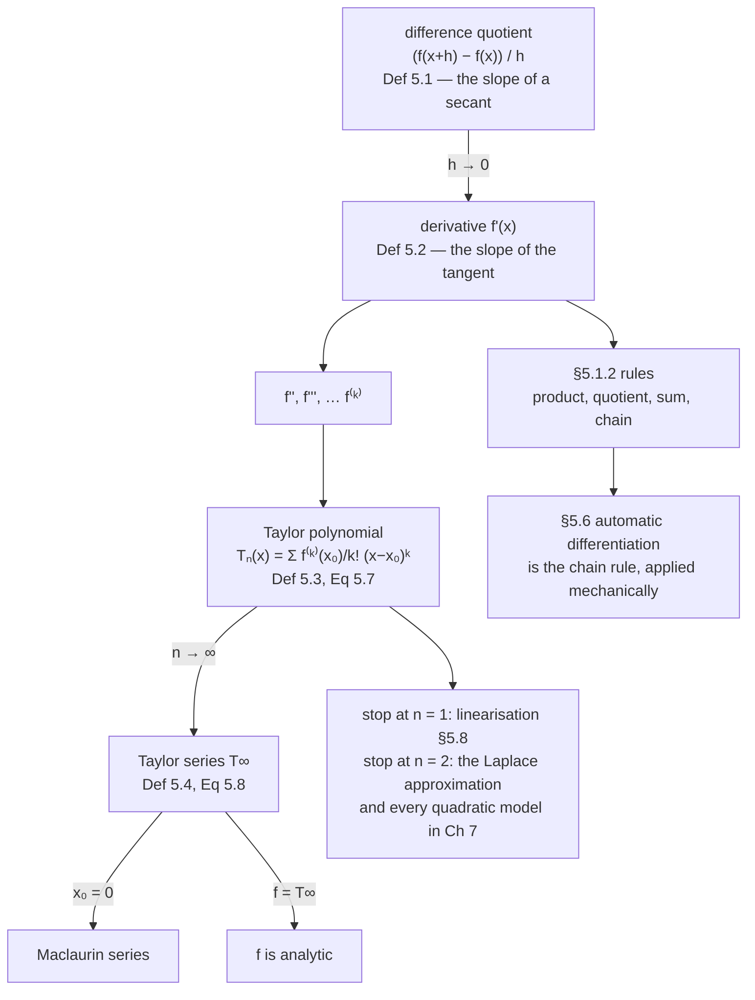

Chapter 4 asked what is inside a matrix. This chapter asks how a function changes,
and it starts where every calculus course starts — one input, one output — because
everything later is that idea with more indices.

There are two things on this page. The **derivative** as the limit of a difference
quotient, which you have met; and the **Taylor series**, which turns a function
into a polynomial you can differentiate, integrate and reason about. The second
is the one that does the work in the rest of the book: linearisation in §5.8, the
Laplace approximation in Chapter 6, and the quadratic models that Chapter 7's
optimisers are built on are all Taylor expansions stopped early.

## What you'll learn

- Definition 5.1 and 5.2: the **difference quotient**, and the derivative as its limit.
- Why the limit is a *definition* and not an algorithm — measured, with the exact step size where a finite difference stops improving.
- Definition 5.3: the **Taylor polynomial** $T_n$, and Definition 5.4: the **Taylor series** $T_\infty$.
- Why a Taylor polynomial of degree $n$ reproduces a polynomial of degree $n$ **exactly**, with every later coefficient zero.
- The thing most treatments skip: near $x_0$ the error falls with degree; far from $x_0$ it **grows**.
- §5.1.2's four differentiation rules, and the one that matters most later — the chain rule.

## Intuition: a secant that stops moving

Pick a point on a curve and a second point a distance $h$ away. The straight line
through them has a slope you can compute from two function values and a division.
Now slide the second point towards the first. The secant turns, and — if the
function is smooth — it settles on a particular line. Its slope is the derivative.

That is the whole idea, and it is worth noticing what it does *not* say. It does
not say "compute the slope for a small $h$". It says the slopes **converge**, and
the derivative is the thing they converge to. Those are different claims, and on a
computer the difference is the subject of half this page.



## The math

### The difference quotient and the derivative

:::note[Definition 5.1 — Difference Quotient]
The difference quotient

$$
\frac{\delta y}{\delta x} := \frac{f(x + \delta x) - f(x)}{\delta x}
\tag{5.3}
$$

computes the slope of the secant line through two points on the graph of $f$.
:::

:::note[Definition 5.2 — Derivative]
For $h > 0$ the **derivative** of $f$ at $x$ is defined as the limit

$$
\frac{\mathrm{d}f}{\mathrm{d}x} := \lim_{h \to 0}\frac{f(x + h) - f(x)}{h}
\tag{5.4}
$$

and the secant becomes the tangent.
:::

The book works Example 5.2 — the derivative of $f(x) = x^n$ — straight from
Definition 5.2 rather than quoting the power rule, and the point of that exercise
is the binomial expansion: every term with $h^{i-1}$ for $i \geq 2$ vanishes in
the limit, leaving $\binom{n}{1}x^{n-1} = nx^{n-1}$.

### Taylor polynomials

:::note[Definition 5.3 — Taylor Polynomial]
The Taylor polynomial of degree $n$ of $f: \mathbb{R}\to\mathbb{R}$ at $x_0$ is

$$
T_n(x) := \sum_{k=0}^{n}\frac{f^{(k)}(x_0)}{k!}(x - x_0)^k
\tag{5.7}
$$

where $f^{(k)}(x_0)$ is the $k$-th derivative of $f$ at $x_0$ (assumed to exist)
and $\frac{f^{(k)}(x_0)}{k!}$ are the coefficients of the polynomial.
:::

:::note[Definition 5.4 — Taylor Series]
For a smooth function $f \in C^\infty$, $f:\mathbb{R}\to\mathbb{R}$, the Taylor
series of $f$ at $x_0$ is

$$
T_\infty(x) = \sum_{k=0}^{\infty}\frac{f^{(k)}(x_0)}{k!}(x-x_0)^k
\tag{5.8}
$$

For $x_0 = 0$ this is the **Maclaurin series**. If $f = T_\infty$, then $f$ is
called **analytic**.
:::

The book's Remark after Definition 5.4 is the one to hold on to: *in general, a
Taylor polynomial of degree $n$ is an approximation of a function, which does not
need to be a polynomial. The Taylor polynomial is similar to $f$ in a
neighbourhood around $x_0$. However, a Taylor polynomial of degree $n$ is an
**exact** representation of a polynomial $f$ of degree $\leq n$.*

Two words there earn their place. **"Neighbourhood"** — the guarantee is local, and
the measurements below show exactly how local. **"Exact"** — for a polynomial,
$T_n$ is not an approximation at all.

### The rules

§5.1.2 lists four, and the chain rule is the one the rest of the chapter is built
from:

| rule | statement |
| --- | --- |
| product | $(fg)' = f'g + fg'$ |
| quotient | $\left(\dfrac{f}{g}\right)' = \dfrac{f'g - fg'}{g^2}$ |
| sum | $(f + g)' = f' + g'$ |
| **chain** | $\bigl(g(f(x))\bigr)' = g'(f(x))\,f'(x)$ |

:::tip[From the book]
Section 5.1. Definition 5.1 (Equation 5.3) gives the difference quotient as the
slope of a secant, with the remark that for $\delta x < 0$ it is the slope of a
secant through the point and one to its left. Definition 5.2 (Equation 5.4) takes
the limit. Example 5.2 (Equations 5.5 to 5.6) derives $\mathrm{d}x^n/\mathrm{d}x =
nx^{n-1}$ from the definition using the binomial theorem. Section 5.1.1: Definition
5.3 (Equation 5.7) is the Taylor polynomial and Definition 5.4 (Equation 5.8) the
Taylor series, with the Maclaurin series as the $x_0 = 0$ case and "analytic" for
$f = T_\infty$; the Remark notes that $T_n$ is *exact* for a polynomial of degree at
most $n$. Example 5.3 expands $f(x) = x^4$ at $x_0 = 1$; Example 5.4 expands
$f(x) = \sin x + \cos x$ at $x_0 = 0$ and observes the coefficients cycle with
period four. Section 5.1.2 lists the product, quotient, sum and chain rules, with
Examples 5.5 (product) and the chain-rule worked cases at Equations 5.32 to 5.38.
:::

## Worked example by hand

### Example 5.3 — x to the fourth, expanded at 1

$f(x) = x^4$, so $f(1) = 1$, $f'(1) = 4$, $f''(1) = 12$, $f'''(1) = 24$,
$f^{(4)}(1) = 24$, and $f^{(5)} = 0$ identically. Dividing by $k!$:

| $k$ | $f^{(k)}(1)$ | $k!$ | coefficient |
| --- | --- | --- | --- |
| 0 | $1$ | $1$ | $1$ |
| 1 | $4$ | $1$ | $4$ |
| 2 | $12$ | $2$ | $6$ |
| 3 | $24$ | $6$ | $4$ |
| 4 | $24$ | $24$ | $1$ |
| 5 | $0$ | $120$ | $0$ |

$$
T_4(x) = 1 + 4(x-1) + 6(x-1)^2 + 4(x-1)^3 + (x-1)^4
$$

Those coefficients are $1, 4, 6, 4, 1$ — the fourth row of Pascal's triangle,
which is exactly what the binomial theorem says $\bigl((x-1) + 1\bigr)^4$ should
give. So $T_4 = x^4 = f$, and every coefficient past the fourth is **zero**.

Measured over $[-0.6, 2.6]$: the largest $|f - T_4|$ is
$7.11\times10^{-15}$ — machine noise, and it does not change at $T_5$ or $T_6$.

### Example 5.4 — sin plus cos, expanded at 0

The derivatives cycle with period four. Since
$f^{(k)}(x) = \sin(x + k\pi/2) + \cos(x + k\pi/2)$, at $x = 0$:

$$
f^{(k)}(0) = \sin\tfrac{k\pi}{2} + \cos\tfrac{k\pi}{2} = +1, +1, -1, -1, +1, +1, \dots
$$

so

$$
T_5(x) = 1 + x - \frac{x^2}{2!} - \frac{x^3}{3!} + \frac{x^4}{4!} + \frac{x^5}{5!}
= 1 + x - \tfrac{1}{2}x^2 - \tfrac{1}{6}x^3 + \tfrac{1}{24}x^4 + \tfrac{1}{120}x^5
$$

This is Exercise 5.4, and it is done.

### The error, both ways

Here is the part that is usually left out. Measure $|f - T_n|$ twice: once on a
tight interval $|x| \leq 0.5$ around the expansion point, and once on
$|x| \leq 4$.

| $n$ | max error, $\lvert x\rvert \leq 0.5$ | max error, $\lvert x\rvert \leq 4$ |
| --- | --- | --- |
| 0 | $5.93\times10^{-1}$ | $2.41$ |
| 1 | $1.39\times10^{-1}$ | $6.41$ |
| 2 | $2.22\times10^{-2}$ | $11.10$ |
| 3 | $2.69\times10^{-3}$ | $12.26$ |
| 4 | $2.62\times10^{-4}$ | $10.23$ |
| 5 | $2.13\times10^{-5}$ | $6.94$ |

The left column falls by roughly a factor of ten per degree. **The right column
rises**, more than quadrupling from $n=0$ to $n=3$, before turning around. A
Taylor polynomial buys accuracy near a point by giving it up away from it, and any
statement that "more terms is better" is missing the qualifier.

## See it move

```p5 title="The secant becomes the tangent" desc="Drag h and watch the secant through (x, f(x)) and (x+h, f(x+h)) rotate onto the tangent. The readout is the slope of the secant against the exact derivative. Drag x to move the point, and note that the convergence is fastest where the curve is straightest." height="540"
let h = 1.2, x0 = 0.9;
let KNOBS = [], dragging = null;

function f(x) { return Math.sin(x) + 0.35 * x * x; }
function fp(x) { return Math.cos(x) + 0.7 * x; }

function setup() { createCanvas(600, 540); textFont("monospace"); noLoop(); }

function knob(id, x, y, w, value, mn, mx, label) {
  KNOBS.push({ id, x, y, w, mn, mx });
  const t = (value - mn) / (mx - mn);
  stroke(60, 74, 92); strokeWeight(2); line(x, y, x + w, y);
  noStroke(); fill(255, 211, 67); ellipse(x + t * w, y, 10, 10);
  fill(190, 200, 212); textSize(11); textAlign(LEFT, CENTER);
  text(label, x + w + 10, y);
}
function mousePressed() {
  for (const k of KNOBS)
    if (mouseY > k.y - 11 && mouseY < k.y + 11 && mouseX > k.x - 11 && mouseX < k.x + k.w + 11) { dragging = k; return; }
}
function mouseReleased() { dragging = null; }
function mouseDragged() {
  if (!dragging) return;
  const t = Math.min(1, Math.max(0, (mouseX - dragging.x) / dragging.w));
  const v = dragging.mn + t * (dragging.mx - dragging.mn);
  if (dragging.id === "h") h = v;
  if (dragging.id === "x0") x0 = v;
  redraw();
}

function draw() {
  background(13, 17, 23);
  KNOBS = [];

  const U = 84, cx = 90, cy = 330;
  const sx = x => cx + x * U, sy = y => cy - y * U;

  stroke(32, 44, 58); strokeWeight(1);
  for (let g = -1; g <= 5; g++) line(sx(g), sy(-1), sx(g), sy(3.2));
  for (let g = -1; g <= 3; g++) line(sx(-1), sy(g), sx(5), sy(g));
  stroke(58, 72, 88); strokeWeight(1.2);
  line(sx(-1), sy(0), sx(5), sy(0)); line(sx(0), sy(-1), sx(0), sy(3.2));

  // The curve.
  noFill(); stroke(200, 208, 218); strokeWeight(2.4);
  beginShape();
  for (let i = 0; i <= 260; i++) { const x = -1 + (i / 260) * 6; vertex(sx(x), sy(f(x))); }
  endShape();

  const slope = (f(x0 + h) - f(x0)) / h;
  const exact = fp(x0);

  // The tangent, always, so the target is visible.
  stroke(120, 200, 150); strokeWeight(2.2);
  const tl = -1, tr = 5;
  line(sx(tl), sy(f(x0) + exact * (tl - x0)), sx(tr), sy(f(x0) + exact * (tr - x0)));

  // The secant.
  stroke(255, 211, 67); strokeWeight(2.2);
  line(sx(tl), sy(f(x0) + slope * (tl - x0)), sx(tr), sy(f(x0) + slope * (tr - x0)));

  // The rise-over-run triangle, which is what the quotient literally is.
  stroke(232, 130, 130); strokeWeight(1.6);
  line(sx(x0), sy(f(x0)), sx(x0 + h), sy(f(x0)));
  line(sx(x0 + h), sy(f(x0)), sx(x0 + h), sy(f(x0 + h)));
  noStroke(); fill(232, 130, 130); textSize(11); textAlign(CENTER, TOP);
  text(`h = ${h.toFixed(3)}`, sx(x0 + h / 2), sy(f(x0)) + 6);
  textAlign(LEFT, CENTER);
  text(`Δf = ${(f(x0 + h) - f(x0)).toFixed(4)}`, sx(x0 + h) + 8, sy((f(x0) + f(x0 + h)) / 2));

  noStroke(); fill(255); ellipse(sx(x0), sy(f(x0)), 9, 9);
  fill(255, 211, 67); ellipse(sx(x0 + h), sy(f(x0 + h)), 8, 8);

  knob("h", 40, 400, 250, h, 0.001, 2.4, `h = ${h.toFixed(4)}`);
  knob("x0", 40, 430, 250, x0, -0.6, 3.6, `x = ${x0.toFixed(3)}`);

  textAlign(LEFT, TOP);
  fill(255, 211, 67); textSize(14); text("Drag h towards zero", 30, 12);
  fill(215); textSize(11);
  text(`secant slope   ${slope.toFixed(8)}`, 340, 400);
  text(`exact f'(x)    ${exact.toFixed(8)}`, 340, 418);
  fill(Math.abs(slope - exact) < 1e-3 ? color(120, 200, 150) : color(255, 211, 67));
  text(`error          ${Math.abs(slope - exact).toExponential(3)}`, 340, 436);
  fill(150); textSize(10);
  text("Amber is the secant, green the tangent. The error is roughly proportional to h,", 30, 470);
  text("so halving h halves it — which is what 'first order' means. Notice the error is", 30, 486);
  text("smaller for the same h where the curve is straighter: it scales with f''(x).", 30, 502);
  text("Push h below about 1e-8 in code and the error stops falling. The next figure shows why.", 30, 522);
}
```

```p5 title="Taylor polynomials, one degree at a time" desc="Drag the degree and watch the polynomial wrap itself around the function near x0. The two error readouts are the point: the one measured near x0 falls every time you add a term, the one measured across the whole window does not. Switch functions to see a polynomial become exact." height="560"
let deg = 3, fnIdx = 0, x0 = 0;
let KNOBS = [], BTNS = [], dragging = null;

const FNS = [
  { name: "sin x + cos x", f: x => Math.sin(x) + Math.cos(x), lo: -4, hi: 4, x0: 0, exactAt: -1 },
  { name: "x⁴ at x₀=1", f: x => x * x * x * x, lo: -0.6, hi: 2.6, x0: 1, exactAt: 4 },
  { name: "sigmoid", f: x => 1 / (1 + Math.exp(-x)), lo: -6, hi: 6, x0: 0, exactAt: -1 },
  { name: "log(1+x)", f: x => Math.log(1 + x), lo: -0.9, hi: 2.4, x0: 0, exactAt: -1 },
  { name: "exp(−x²/2)", f: x => Math.exp(-0.5 * x * x), lo: -4, hi: 4, x0: 0, exactAt: -1 },
];

function setup() { createCanvas(600, 560); textFont("monospace"); noLoop(); }

// Truncated-Taylor (jet) arithmetic: exact coefficients at every order, which
// repeated finite differencing could not deliver past about k = 3.
function jetVar(x0, n) { const o = new Array(n + 1).fill(0); o[0] = x0; if (n >= 1) o[1] = 1; return o; }
function jConst(c, n) { const o = new Array(n + 1).fill(0); o[0] = c; return o; }
function jAdd(a, b) { return a.map((v, i) => v + b[i]); }
function jScale(a, s) { return a.map(v => v * s); }
function jMul(a, b) {
  const n = a.length - 1, o = new Array(n + 1).fill(0);
  for (let k = 0; k <= n; k++) { let s = 0; for (let j = 0; j <= k; j++) s += a[j] * b[k - j]; o[k] = s; }
  return o;
}
function jDiv(a, b) {
  const n = a.length - 1, o = new Array(n + 1).fill(0);
  o[0] = a[0] / b[0];
  for (let k = 1; k <= n; k++) { let s = a[k]; for (let j = 1; j <= k; j++) s -= b[j] * o[k - j]; o[k] = s / b[0]; }
  return o;
}
function jExp(u) {
  const n = u.length - 1, o = new Array(n + 1).fill(0);
  o[0] = Math.exp(u[0]);
  for (let k = 1; k <= n; k++) { let s = 0; for (let j = 1; j <= k; j++) s += j * u[j] * o[k - j]; o[k] = s / k; }
  return o;
}
function jLog(u) {
  const n = u.length - 1, o = new Array(n + 1).fill(0);
  o[0] = Math.log(u[0]);
  for (let k = 1; k <= n; k++) { let s = 0; for (let j = 1; j <= k - 1; j++) s += j * o[j] * u[k - j]; o[k] = (u[k] - s / k) / u[0]; }
  return o;
}
function jSinCos(u) {
  const n = u.length - 1, s = new Array(n + 1).fill(0), c = new Array(n + 1).fill(0);
  s[0] = Math.sin(u[0]); c[0] = Math.cos(u[0]);
  for (let k = 1; k <= n; k++) {
    let ss = 0, cc = 0;
    for (let j = 1; j <= k; j++) { ss += j * u[j] * c[k - j]; cc += j * u[j] * s[k - j]; }
    s[k] = ss / k; c[k] = -cc / k;
  }
  return { sin: s, cos: c };
}

function coeffsFor(idx, n) {
  const c = FNS[idx].x0, x = jetVar(c, n);
  if (idx === 0) { const t = jSinCos(x); return jAdd(t.sin, t.cos); }
  if (idx === 1) return jMul(jMul(x, x), jMul(x, x));
  if (idx === 2) return jDiv(jConst(1, n), jAdd(jConst(1, n), jExp(jScale(x, -1))));
  if (idx === 3) return jLog(jAdd(jConst(1, n), x));
  return jExp(jScale(jMul(x, x), -0.5));
}

function knob(id, x, y, w, value, mn, mx, label) {
  KNOBS.push({ id, x, y, w, mn, mx });
  const t = (value - mn) / (mx - mn);
  stroke(60, 74, 92); strokeWeight(2); line(x, y, x + w, y);
  noStroke(); fill(255, 211, 67); ellipse(x + t * w, y, 10, 10);
  fill(190, 200, 212); textSize(11); textAlign(LEFT, CENTER);
  text(label, x + w + 10, y);
}
function mousePressed() {
  for (const b of BTNS)
    if (mouseX > b.x && mouseX < b.x + b.w && mouseY > b.y && mouseY < b.y + b.h) { fnIdx = b.i; redraw(); return; }
  for (const k of KNOBS)
    if (mouseY > k.y - 11 && mouseY < k.y + 11 && mouseX > k.x - 11 && mouseX < k.x + k.w + 11) { dragging = k; return; }
}
function mouseReleased() { dragging = null; }
function mouseDragged() {
  if (!dragging) return;
  const t = Math.min(1, Math.max(0, (mouseX - dragging.x) / dragging.w));
  deg = Math.round(dragging.mn + t * (dragging.mx - dragging.mn));
  redraw();
}

function draw() {
  background(13, 17, 23);
  KNOBS = []; BTNS = [];

  const S = FNS[fnIdx];
  const N = 9;
  const co = coeffsFor(fnIdx, N);
  const c0 = S.x0;
  const Tn = x => { let a = 0, pw = 1; for (let k = 0; k <= deg; k++) { a += co[k] * pw; pw *= (x - c0); } return a; };

  // Vertical window pinned to f, so a runaway tail cannot rescale the plot.
  let lo = Infinity, hi = -Infinity;
  for (let i = 0; i <= 200; i++) { const x = S.lo + (i / 200) * (S.hi - S.lo); const v = S.f(x); lo = Math.min(lo, v); hi = Math.max(hi, v); }
  const pad = Math.max(0.4, (hi - lo) * 0.45); lo -= pad; hi += pad;

  const L = 40, R = 570, T = 46, B = 330;
  const sx = x => L + ((x - S.lo) / (S.hi - S.lo)) * (R - L);
  const sy = y => B - ((y - lo) / (hi - lo)) * (B - T);

  stroke(32, 44, 58); strokeWeight(1);
  for (let g = 0; g <= 6; g++) { const y = T + (g / 6) * (B - T); line(L, y, R, y); }
  stroke(58, 72, 88); strokeWeight(1.1);
  if (0 > lo && 0 < hi) line(L, sy(0), R, sy(0));

  // The band the "near" error is measured on.
  const near = Math.min(0.5, (S.hi - S.lo) / 12);
  noStroke(); fill(120, 200, 150, 26);
  rect(sx(Math.max(S.lo, c0 - near)), T, sx(Math.min(S.hi, c0 + near)) - sx(Math.max(S.lo, c0 - near)), B - T);

  // f, then T_n.
  noFill(); stroke(150, 160, 172); strokeWeight(2.6);
  beginShape();
  for (let i = 0; i <= 400; i++) { const x = S.lo + (i / 400) * (S.hi - S.lo); vertex(sx(x), sy(S.f(x))); }
  endShape();

  const exact = S.exactAt >= 0 && deg >= S.exactAt;
  noFill(); stroke(exact ? color(120, 200, 150) : color(255, 211, 67)); strokeWeight(2.2);
  beginShape();
  for (let i = 0; i <= 400; i++) {
    const x = S.lo + (i / 400) * (S.hi - S.lo);
    const v = Math.max(lo - 1, Math.min(hi + 1, Tn(x)));
    vertex(sx(x), sy(v));
  }
  endShape();

  // Errors, both ways.
  let eNear = 0, eFar = 0;
  for (let i = 0; i <= 600; i++) {
    const x = S.lo + (i / 600) * (S.hi - S.lo);
    const e = Math.abs(S.f(x) - Tn(x));
    eFar = Math.max(eFar, e);
    if (Math.abs(x - c0) <= near) eNear = Math.max(eNear, e);
  }

  stroke(120, 200, 150); strokeWeight(1.2);
  line(sx(c0), T, sx(c0), B);

  // Function buttons.
  for (let i = 0; i < FNS.length; i++) {
    const bx = 30 + i * 112, by = 352;
    BTNS.push({ x: bx, y: by, w: 104, h: 26, i });
    noStroke(); fill(i === fnIdx ? color(120, 200, 150) : color(46, 58, 72));
    rect(bx, by, 104, 26, 5);
    fill(i === fnIdx ? 20 : 210); textSize(10); textAlign(CENTER, CENTER);
    text(FNS[i].name, bx + 52, by + 13);
  }

  knob("deg", 30, 402, 250, deg, 0, N, `degree ${deg}`);

  noStroke(); textAlign(LEFT, TOP);
  fill(255, 211, 67); textSize(14); text("Drag the degree", 30, 12);
  fill(215); textSize(11);
  text(`coefficients a₀..a${deg}:`, 320, 396);
  let line1 = "";
  for (let k = 0; k <= Math.min(deg, 5); k++) line1 += `${co[k].toFixed(4)}  `;
  text(line1, 320, 414);
  fill(120, 200, 150); textSize(11);
  text(`error within ±${near.toFixed(2)} of x₀   ${eNear.toExponential(3)}`, 30, 438);
  fill(232, 130, 130);
  text(`error on the whole window     ${eFar.toExponential(3)}`, 30, 456);
  if (exact) { fill(120, 200, 150); textSize(12); text(`T${deg} = f exactly: f is a polynomial of degree ${S.exactAt}`, 30, 478); }

  fill(150); textSize(10);
  text("Green band: where the 'near' error is measured. Raise the degree and the green", 30, 500);
  text("number always falls; the red one need not, and for the sigmoid and log it grows", 30, 516);
  text("without limit. Pick x⁴ and watch both collapse to zero at degree 4 and stay there.", 30, 534);
}
```

<TaylorLab
  client:visible
  fn="sin-plus-cos"
  maxDegree={5}
  title="Example 5.4 and Exercise 5.4, one degree at a time"
  desc="The coefficients cycle +1, +1, −1, −1. Each frame reports the local order of the error, derived from the first nonzero coefficient not yet used rather than assumed to be n+1."
/>

<TaylorLab
  client:visible
  fn="x-to-the-fourth"
  maxDegree={6}
  title="Example 5.3: a polynomial, expanded at x₀ = 1"
  desc="Watch degree 4. The error drops to machine noise and the last two frames change nothing, because every remaining coefficient is exactly zero."
/>

## From scratch

The obvious way to get $f^{(k)}(x_0)$ numerically is to difference $k$ times. It
does not work, and the reason is worth seeing.

```python title="taylor_from_scratch.py" showLineNumbers{1}
import math
import numpy as np

def coeffs_by_differencing(f, x0, K, h=1e-3):
    """Repeated central differences. Loses about 8 digits per order."""
    out = []
    for k in range(K + 1):
        # The k-th central difference, from the binomial stencil.
        acc = 0.0
        for j in range(k + 1):
            acc += (-1) ** j * math.comb(k, j) * f(x0 + (k / 2 - j) * h)
        out.append(acc / h ** k / math.factorial(k))
    return out

def coeffs_by_jet(x0, K):
    """Truncated-Taylor arithmetic for sin(x) + cos(x): exact at every order."""
    s = [0.0] * (K + 1)
    c = [0.0] * (K + 1)
    s[0], c[0] = math.sin(x0), math.cos(x0)
    u = [0.0] * (K + 1)
    u[0], u[1] = x0, 1.0
    for k in range(1, K + 1):
        ss = sum(j * u[j] * c[k - j] for j in range(1, k + 1))
        cc = sum(j * u[j] * s[k - j] for j in range(1, k + 1))
        s[k], c[k] = ss / k, -cc / k
    return [s[k] + c[k] for k in range(K + 1)]

K = 8
exact = [(math.sin(k * math.pi / 2) + math.cos(k * math.pi / 2)) / math.factorial(k)
         for k in range(K + 1)]
diff = coeffs_by_differencing(lambda x: math.sin(x) + math.cos(x), 0.0, K)
jet = coeffs_by_jet(0.0, K)

print(f"{'k':>2}  {'exact':>14}  {'by differencing':>16}  {'error':>10}  {'by jet':>14}  {'error':>10}")
for k in range(K + 1):
    print(f"{k:>2}  {exact[k]:>14.10f}  {diff[k]:>16.10f}  {abs(diff[k]-exact[k]):>10.1e}"
          f"  {jet[k]:>14.10f}  {abs(jet[k]-exact[k]):>10.1e}")
```

```text title="output"
 k           exact   by differencing       error          by jet       error
 0    1.0000000000      1.0000000000     0.0e+00    1.0000000000     0.0e+00
 1    1.0000000000      0.9999999583     4.2e-08    1.0000000000     0.0e+00
 2   -0.5000000000     -0.4999999583     4.2e-08   -0.5000000000     5.6e-17
 3   -0.1666666667     -0.1666666805     1.4e-08   -0.1666666667     5.6e-17
 4    0.0416666667      0.0416426153     2.4e-05    0.0416666667     6.9e-18
 5    0.0083333333      0.0138777878     5.5e-03    0.0083333333     1.7e-18
 6   -0.0013888889      5.5511151231     5.6e+00   -0.0013888889     4.3e-19
 7   -0.0001984127  -1299.6658423191     1.3e+03   -0.0001984127     8.1e-20
 8    0.0000248016  -225789.4048096796     2.3e+05    0.0000248016     1.0e-20
```

Read the two error columns, and then read the differencing column itself, because
the failure is worse than "inaccurate".

Differencing holds up to about $k = 4$. Then it does not merely lose precision, it
loses the answer:

| $k$ | true coefficient | by differencing |
| --- | --- | --- |
| 5 | $+0.008333$ | $+0.013878$ |
| 6 | $-0.001389$ | $\mathbf{+5.551}$ |
| 7 | $-0.000198$ | $\mathbf{-1299.67}$ |
| 8 | $+0.0000248$ | $\mathbf{-225789.4}$ |

At $k = 6$ the sign is wrong and the magnitude is out by a factor of four thousand.
At $k = 8$ it is out by ten orders of magnitude. This is not an approximation that
has degraded; it is noise multiplied by $h^{-8} = 10^{24}$.

The jet column is exact at every order, and the reason is that it never subtracts
two nearly equal numbers. Each recurrence is an algebraic identity between
coefficients, so the chain rule is applied *symbolically* and evaluated
numerically. That is also, precisely, forward-mode automatic differentiation —
which is the connection §5.6 makes explicit.

## On real data

<Figure
  src="/images/mml/differentiation-of-univariate-functions/secant-to-tangent"
  alt="A curve with four dashed secant lines through a fixed point and a second point at decreasing distances, converging onto a heavy tangent line, with a table of secant slopes."
  title="Definition 5.1 converging to Definition 5.2"
  caption="Four secants at h = 1.6, 0.8, 0.4 and 0.2, with slopes 1.074466, 1.170422, 1.220578 and 1.239402 against an exact derivative of 1.251610. Each halving of h roughly halves the remaining error — that is what first-order convergence looks like."
/>

<Figure
  src="/images/mml/differentiation-of-univariate-functions/difference-quotient-floor"
  alt="A log-log plot of derivative estimation error against step size, with forward and central difference curves each falling then rising, forming a V, and reference lines of slope one and two."
  title="The half of Definition 5.2 you cannot execute"
  caption="Truncation error falls as h shrinks; round-off error rises. The best forward difference is 2.62e-10 at h = 1.5e-08 and the best central one is 2.88e-13 at h = 2.7e-06. At h = 1e-15 the central estimate is off by 8.07e-02 — 2.8e+11 times worse than its own best."
/>

<Figure
  src="/images/mml/differentiation-of-univariate-functions/taylor-degrees"
  alt="Left, sin x plus cos x with its Taylor polynomials of degree zero through five overlaid and a shaded band near the origin. Right, two error curves against degree on a log scale, one falling steeply and one rising then falling."
  title="Example 5.4, with the error measured twice"
  caption="Near x0 the error falls by about a factor of ten per degree, from 5.93e-01 at T0 to 2.13e-05 at T5. Across the whole interval it rises from 2.41 to 12.26 by degree 3 before coming back down — the polynomials get better near the centre by getting worse at the edges."
/>

## Reading the plot

**From the secant figure.** The convergence is visible but the *rate* is the thing
to extract. The errors are $0.177$, $0.081$, $0.031$ and $0.012$ for
$h = 1.6, 0.8, 0.4, 0.2$ — each roughly half the previous. Halving $h$ halves the
error, so the forward difference is **first order**, and the leading error term is
$\frac{h}{2}f''(x)$. That is also why the error is smaller for the same $h$ where
the curve is straighter.

**From the round-off figure.** This is the figure that changes how you write code.

The forward difference has error $\approx \frac{h}{2}|f''| + \frac{2\varepsilon|f|}{h}$
— truncation falling like $h$, round-off rising like $1/h$. The sum has a minimum,
and it is *not* at the smallest representable $h$:

| | best $h$ | best error |
| --- | --- | --- |
| forward difference | $1.5\times10^{-8}$ | $2.62\times10^{-10}$ |
| central difference | $2.7\times10^{-6}$ | $2.88\times10^{-13}$ |

Two consequences. First, $h \approx \sqrt{\varepsilon} \approx 1.5\times10^{-8}$ is
the classic forward-difference rule of thumb, and the measurement lands on it.
Second, the central difference is not merely better — it is better by **three
orders of magnitude**, for one extra function evaluation. If you are ever going to
difference numerically, difference centrally.

And the failure mode is severe: at $h = 10^{-15}$ the central estimate is wrong by
$8\times10^{-2}$, which is $2.8\times10^{11}$ times worse than its own best. A
gradient check that "uses a really small h to be safe" is not being safe.

**From the Taylor figure.** The two curves on the right go in opposite directions,
and the reason is that a Taylor polynomial is a *local* object. $T_n$ matches $f$
to order $n$ at $x_0$ and is under no obligation anywhere else — and a
degree-$n$ polynomial has to do something as $|x|$ grows, which for
$\sin x + \cos x$ (bounded) means running away.

The left column of the table is the guarantee: a factor of about ten per degree on
$|x| \leq 0.5$. The right column is the small print.

## Pitfalls

:::danger[Never pick h smaller than about 1e-8 for a forward difference]
Measured on this page: the forward difference bottoms out at
$h = 1.5\times10^{-8}$ with error $2.6\times10^{-10}$, and by $h = 10^{-15}$ it is
wrong by $2.7\times10^{-4}$. The rule of thumb is $h \approx \sqrt{\varepsilon}$
for forward and $h \approx \varepsilon^{1/3} \approx 6\times10^{-6}$ for central,
both scaled by the size of $x$. "Smaller is more accurate" is true of the
mathematics and false of the arithmetic.
:::

:::danger[Do not estimate high derivatives by repeated differencing]
The from-scratch table above: the 6th coefficient of $\sin x + \cos x$ comes out as
$+5.551$ against a true $-0.001389$ — the wrong sign and four thousand times too
big — and the 8th as $-225789$ against $+0.0000248$. The $k$-th difference divides
by $h^k$, so at $h = 10^{-3}$ and $k = 8$ it multiplies whatever round-off survived
by $10^{24}$. Use jet arithmetic, a symbolic derivative, or autodiff — never a tower
of finite differences.
:::

:::caution[More Taylor terms is not uniformly better]
For the sigmoid on $[-6, 6]$ the maximum error goes $0.5 \to 1.0 \to 3.5 \to 13
\to 46$ as the degree rises from 0 to 7. Every one of those polynomials is a
better approximation near $0$ than the last, and a worse one at the edges. Always
state the interval when you quote a Taylor error.
:::

:::caution[The Taylor series may not converge where you need it]
$\log(1+x)$ has a Taylor series at $0$ that converges only for $|x| < 1$, however
many terms you take, because of the singularity at $x = -1$. Smoothness at the
expansion point tells you nothing about the radius of convergence, which is set by
the nearest singularity **in the complex plane** — which is why $1/(1+x^2)$, a
perfectly smooth real function, has a series that diverges beyond $|x| = 1$.
:::

:::caution[Symmetry hides half the coefficients, and that changes the order]
For an odd function about $x_0$, every even coefficient past the constant is zero,
so $T_1$ is already accurate to $O(h^3)$ and $T_2$ adds nothing at all. The
sigmoid's local order runs $h^1, h^3, h^3, h^5, h^5, h^7$ as the degree goes
$0..5$. Predicting $h^{n+1}$ from the degree alone is wrong for three of the five
functions on this page.
:::

## Compare

| way to get a derivative | exactness | cost | needs |
| --- | --- | --- | --- |
| by hand, symbolically | exact | your time | a closed form, and care |
| **forward difference** | $O(h)$, floor $\approx 10^{-10}$ | 1 extra evaluation | nothing |
| **central difference** | $O(h^2)$, floor $\approx 10^{-13}$ | 2 extra evaluations | nothing |
| **jet / forward-mode AD** | exact to machine precision | $\approx 2\times$ the function | the code, not the formula |
| **reverse-mode AD** (§5.6) | exact to machine precision | $\approx 2.5\times$ the function, all inputs at once | a computation graph |
| complex-step | $O(h^2)$ with no cancellation | 1 complex evaluation | an analytic function |

The middle two rows are the ones this page is about. The bottom three are §5.6,
and the reason the chapter goes there.

<Quiz
  title="Check your understanding"
  questions={[
    {
      q: "Definition 5.2 says the derivative is the limit of the difference quotient. Why can that not be executed directly in floating point?",
      options: [
        "Because limits are not computable",
        "Because the truncation error falls like h while the round-off error from subtracting two nearly equal numbers rises like 1/h, so the total has a minimum at a specific h — measured here at 1.5e-08 for a forward difference",
        "Because f(x+h) cannot be evaluated for small h",
        "Because the derivative may not exist",
      ],
      answer: 1,
      explain:
        "At h = 1e-15 the central difference on this page is wrong by 8e-02, which is 2.8e+11 times worse than its own best at h = 2.7e-06. Making h smaller past the optimum makes things worse, not better.",
    },
    {
      q: "A central difference costs one extra function evaluation over a forward difference. What does that buy?",
      options: [
        "Nothing measurable",
        "Second-order rather than first-order convergence, and a floor three orders of magnitude lower: 2.9e-13 against 2.6e-10 on this page",
        "The ability to use a smaller h safely",
        "Exactness for all functions",
      ],
      answer: 1,
      explain:
        "The h-squared error term comes from the odd-order terms cancelling between f(x+h) and f(x-h). It is close to free, so if you are differencing numerically at all, difference centrally.",
    },
    {
      q: "Why is T_4 of x^4 at x0 = 1 not an approximation?",
      options: [
        "It is an approximation, just a very good one",
        "Because a Taylor polynomial of degree n reproduces a polynomial of degree at most n exactly — the coefficients 1, 4, 6, 4, 1 are the binomial expansion of ((x-1)+1)^4, and every coefficient past the fourth is exactly zero",
        "Because x0 = 1 is a special point",
        "Because x^4 is even",
      ],
      answer: 1,
      explain:
        "Measured max error over the window: 7.11e-15, unchanged at degrees 5 and 6. The book states this in the Remark after Definition 5.4.",
    },
    {
      q: "Adding Taylor terms drove the sigmoid's maximum error on [-6, 6] from 0.5 up to 46. Is something wrong?",
      options: [
        "Yes, the coefficients must be wrong",
        "No. Each polynomial is strictly better near x0 — the error there falls monotonically — and a Taylor polynomial promises nothing away from the expansion point. A degree-7 polynomial has to grow without bound, and a bounded function does not",
        "Yes, the series diverges",
        "No, but only because the sigmoid is not analytic",
      ],
      answer: 1,
      explain:
        "Near x0 the sigmoid's error falls 1.2e-1, 2.5e-3, 2.5e-3, 6.3e-5, ... every added term helps locally. Quoting a Taylor error without naming the interval is the mistake, not the polynomial.",
    },
    {
      q: "The from-scratch table gets the 6th Taylor coefficient as +5.551 instead of -0.001389 using repeated differences, but exactly using jets. What is the difference?",
      options: [
        "The jet uses a smaller step",
        "The jet uses no step at all. Its recurrences are algebraic identities between coefficients, so the chain rule is applied symbolically and only evaluated numerically — nothing nearly-equal is ever subtracted",
        "The jet uses higher precision arithmetic",
        "The jet is an approximation that happens to be closer",
      ],
      answer: 1,
      explain:
        "The k-th difference divides by h to the k, so at h = 1e-3 and k = 8 it multiplies surviving round-off by 1e24 — the 8th coefficient came out as -225789 instead of +0.0000248. Jet arithmetic truncated at order 1 is exactly forward-mode automatic differentiation, which is where §5.6 goes.",
    },
  ]}
/>

## 🧪 Try It Yourself

### Exercise 1 – The secant converging, and then not

<DataCampExercise
  lang="python"
  hint={`Compute both quotients for each h and compare against the analytic derivative.`}
  code={`import numpy as np

f = lambda x: np.sin(x) + 0.35 * x ** 2
fp = lambda x: np.cos(x) + 0.7 * x
x0 = 0.9
exact = fp(x0)

print(f"{'h':>9}  {'forward':>14}  {'err':>10}  {'central':>14}  {'err':>10}")
for h in (1.6, 0.8, 0.4, 0.2, 1e-2, 1e-4, 1e-6, 1e-8, 1e-10, 1e-12, 1e-15):
    fwd = (f(x0 + h) - f(x0)) / h
    cen = (f(x0 + h) - f(x0 - ___)) / (2 * h)          # replace ___ with h
    print(f"{h:>9.0e}  {fwd:>14.9f}  {abs(fwd-exact):>10.1e}"
          f"  {cen:>14.9f}  {abs(cen-exact):>10.1e}")
print(f"{'exact':>9}  {exact:>14.9f}")

# -- Expected output ------------------------------
#         h         forward         err         central         err
#     2e+00     1.074465772     1.8e-01     1.018340572     2.3e-01
#     8e-01     1.170422376     8.1e-02     1.187394621     6.4e-02
#     4e-01     1.220578189     3.1e-02     1.235165809     1.6e-02
#     2e-01     1.239402252     1.2e-02     1.247474182     4.1e-03
#     1e-02     1.251183006     4.3e-04     1.251599608     1.0e-05
#     1e-04     1.251605801     4.2e-06     1.251609967     1.0e-09
#     1e-06     1.251609927     4.2e-08     1.251609968     4.8e-11
#     1e-08     1.251609971     2.9e-09     1.251609971     2.9e-09
#     1e-10     1.251609927     4.1e-08     1.251609927     4.1e-08
#     1e-12     1.251665438     5.5e-05     1.251665438     5.5e-05
#     1e-15     1.332267630     8.1e-02     1.332267630     8.1e-02
#     exact     1.251609968
# -------------------------------------------------`}
  solution={`import numpy as np

f = lambda x: np.sin(x) + 0.35 * x ** 2
fp = lambda x: np.cos(x) + 0.7 * x
x0 = 0.9
exact = fp(x0)

print(f"{'h':>9}  {'forward':>14}  {'err':>10}  {'central':>14}  {'err':>10}")
for h in (1.6, 0.8, 0.4, 0.2, 1e-2, 1e-4, 1e-6, 1e-8, 1e-10, 1e-12, 1e-15):
    fwd = (f(x0 + h) - f(x0)) / h
    cen = (f(x0 + h) - f(x0 - h)) / (2 * h)
    print(f"{h:>9.0e}  {fwd:>14.9f}  {abs(fwd-exact):>10.1e}"
          f"  {cen:>14.9f}  {abs(cen-exact):>10.1e}")
print(f"{'exact':>9}  {exact:>14.9f}")`}
  sct={`test_output_contains("exact")
success_msg("Read the two error columns down. Both fall, both bottom out, both then rise. Two things to notice. The central column reaches 4.8e-11 at h = 1e-06 against the forward column's best of 2.9e-09 — but from h = 1e-08 downwards the two columns are IDENTICAL, because by then round-off dominates completely and both quotients are computing the same corrupted difference. And at h = 1e-15 both are wrong by 8.1e-02, worse than they were at h = 0.2.")`}
  height={340}
/>

### Exercise 2 – Exercises 5.1, 5.2 and 5.3

<DataCampExercise
  lang="python"
  hint={`5.1 needs the product rule with the chain rule inside both factors. 5.2 is the quotient rule, and the answer simplifies to f(1-f). 5.3 is the chain rule on a Gaussian exponent.`}
  code={`import numpy as np

def check(name, f, fp, x0):
    """Compare a hand-derived derivative against a central difference."""
    h = 1e-6
    num = (f(x0 + h) - f(x0 - h)) / (2 * h)
    print(f"{name:34} hand {fp(x0):>13.9f}   numeric {num:>13.9f}   gap {abs(fp(x0)-num):.1e}")

# 5.1  f(x) = log(x^4) sin(x^3)
f1 = lambda x: np.log(x ** 4) * np.sin(x ** 3)
f1p = lambda x: (4 / x) * np.sin(x ** 3) + np.log(x ** 4) * 3 * x ** 2 * np.cos(x ** 3)
check("5.1  log(x^4) sin(x^3)", f1, f1p, 1.3)

# 5.2  the logistic sigmoid
f2 = lambda x: 1 / (1 + np.exp(-x))
f2p = lambda x: f2(x) * (1 - f2(___))                  # replace ___ with x
check("5.2  sigmoid, f' = f(1-f)", f2, f2p, 0.7)

# 5.3  f(x) = exp(-(x-mu)^2 / (2 sigma^2))
mu, sig = 0.4, 1.3
f3 = lambda x: np.exp(-((x - mu) ** 2) / (2 * sig ** 2))
f3p = lambda x: f3(x) * (-(x - mu) / sig ** 2)
check("5.3  Gaussian bump", f3, f3p, 1.1)

# 5.4  T_0 .. T_5 of sin + cos at 0
import math
co = [(math.sin(k * math.pi / 2) + math.cos(k * math.pi / 2)) / math.factorial(k)
      for k in range(6)]
print()
print("5.4  coefficients of T_5:", [round(c, 8) for c in co])
print("     as fractions: 1, 1, -1/2, -1/6, 1/24, 1/120")

# -- Expected output ------------------------------
# 5.1  log(x^4) sin(x^3)             hand  -0.625243877   numeric  -0.625243877   gap 4.0e-11
# 5.2  sigmoid, f' = f(1-f)          hand   0.221712873   numeric   0.221712873   gap 1.0e-11
# 5.3  Gaussian bump                 hand  -0.358303858   numeric  -0.358303858   gap 2.3e-11
#
# 5.4  coefficients of T_5: [1.0, 1.0, -0.5, -0.16666667, 0.04166667, 0.00833333]
#      as fractions: 1, 1, -1/2, -1/6, 1/24, 1/120
# -------------------------------------------------`}
  solution={`import numpy as np

def check(name, f, fp, x0):
    h = 1e-6
    num = (f(x0 + h) - f(x0 - h)) / (2 * h)
    print(f"{name:34} hand {fp(x0):>13.9f}   numeric {num:>13.9f}   gap {abs(fp(x0)-num):.1e}")

f1 = lambda x: np.log(x ** 4) * np.sin(x ** 3)
f1p = lambda x: (4 / x) * np.sin(x ** 3) + np.log(x ** 4) * 3 * x ** 2 * np.cos(x ** 3)
check("5.1  log(x^4) sin(x^3)", f1, f1p, 1.3)

f2 = lambda x: 1 / (1 + np.exp(-x))
f2p = lambda x: f2(x) * (1 - f2(x))
check("5.2  sigmoid, f' = f(1-f)", f2, f2p, 0.7)

mu, sig = 0.4, 1.3
f3 = lambda x: np.exp(-((x - mu) ** 2) / (2 * sig ** 2))
f3p = lambda x: f3(x) * (-(x - mu) / sig ** 2)
check("5.3  Gaussian bump", f3, f3p, 1.1)

import math
co = [(math.sin(k * math.pi / 2) + math.cos(k * math.pi / 2)) / math.factorial(k)
      for k in range(6)]
print()
print("5.4  coefficients of T_5:", [round(c, 8) for c in co])
print("     as fractions: 1, 1, -1/2, -1/6, 1/24, 1/120")`}
  sct={`test_output_contains("5.4  coefficients of T_5")
success_msg("All three hand derivatives agree with a central difference to between 1.0e-11 and 4.0e-11, which is the difference's own floor rather than an error in the algebra. Note 5.2: the sigmoid's derivative is f(1-f), which is why a sigmoid layer's backward pass needs only the value it already computed forwards.")`}
  height={380}
/>

### Exercise 3 – Both Taylor errors

<DataCampExercise
  lang="python"
  hint={`Measure the maximum error twice per degree: once on a tight interval around x0 and once on the whole window.`}
  code={`import math
import numpy as np

f = lambda x: np.sin(x) + np.cos(x)
K = 8
co = [(math.sin(k * math.pi / 2) + math.cos(k * math.pi / 2)) / math.factorial(k)
      for k in range(K + 1)]

xs = np.linspace(-4, 4, 601)
near = 0.5
print(f"{'n':>2}  {'near |x|<=0.5':>15}  {'on |x|<=4':>12}  T_n")
for n in range(6):
    T = sum(co[k] * xs ** k for k in range(n + 1))
    err = np.abs(f(xs) - T)
    e_near = err[np.abs(xs) <= ___].max()               # replace ___ with near
    print(f"{n:>2}  {e_near:>15.3e}  {err.max():>12.4f}"
          f"   {' + '.join(f'{co[k]:.4g}x^{k}' for k in range(n+1) if abs(co[k]) > 1e-12)}")

# -- Expected output ------------------------------
#  n    near |x|<=0.5     on |x|<=4  T_n
#  0        5.928e-01        2.4142   1x^0
#  1        1.390e-01        6.4104   1x^0 + 1x^1
#  2        2.222e-02       11.1032   1x^0 + 1x^1 + -0.5x^2
#  3        2.690e-03       12.2562   1x^0 + 1x^1 + -0.5x^2 + -0.1667x^3
#  4        2.620e-04       10.2302   1x^0 + 1x^1 + -0.5x^2 + -0.1667x^3 + 0.04167x^4
#  5        2.134e-05        6.9438   1x^0 + 1x^1 + -0.5x^2 + -0.1667x^3 + 0.04167x^4 + 0.008333x^5
# -------------------------------------------------`}
  solution={`import math
import numpy as np

f = lambda x: np.sin(x) + np.cos(x)
K = 8
co = [(math.sin(k * math.pi / 2) + math.cos(k * math.pi / 2)) / math.factorial(k)
      for k in range(K + 1)]

xs = np.linspace(-4, 4, 601)
near = 0.5
print(f"{'n':>2}  {'near |x|<=0.5':>15}  {'on |x|<=4':>12}  T_n")
for n in range(6):
    T = sum(co[k] * xs ** k for k in range(n + 1))
    err = np.abs(f(xs) - T)
    e_near = err[np.abs(xs) <= near].max()
    print(f"{n:>2}  {e_near:>15.3e}  {err.max():>12.4f}"
          f"   {' + '.join(f'{co[k]:.4g}x^{k}' for k in range(n+1) if abs(co[k]) > 1e-12)}")`}
  sct={`test_output_contains("2.134e-05")
success_msg("The near column falls by about ten per degree; the far column RISES from 2.41 to 12.26 through degree 3 before coming back. Both are true of the same polynomials, which is why a Taylor error is meaningless without an interval.")`}
  height={300}
/>

### Exercise 4 – Why repeated differencing fails

<DataCampExercise
  lang="python"
  hint={`The k-th central difference uses the binomial stencil. Compare it against the exact coefficient at each order.`}
  code={`import math

def coeffs_by_differencing(f, x0, K, h=1e-3):
    out = []
    for k in range(K + 1):
        acc = 0.0
        for j in range(k + 1):
            acc += (-1) ** j * math.comb(k, j) * f(x0 + (k / 2 - j) * h)
        out.append(acc / h ** k / math.factorial(___))     # replace ___ with k
    return out

K = 8
f = lambda x: math.sin(x) + math.cos(x)
exact = [(math.sin(k * math.pi / 2) + math.cos(k * math.pi / 2)) / math.factorial(k)
         for k in range(K + 1)]
diff = coeffs_by_differencing(f, 0.0, K)

print(f"{'k':>2}  {'exact':>14}  {'differenced':>15}  {'abs err':>10}  {'ratio':>8}")
for k in range(K + 1):
    ratio = diff[k] / exact[k] if abs(exact[k]) > 1e-15 else float('nan')
    print(f"{k:>2}  {exact[k]:>14.10f}  {diff[k]:>15.10f}"
          f"  {abs(diff[k]-exact[k]):>10.1e}  {ratio:>8.3f}")

# -- Expected output ------------------------------
#  k           exact      differenced     abs err     ratio
#  0    1.0000000000     1.0000000000     0.0e+00     1.000
#  1    1.0000000000     0.9999999583     4.2e-08     1.000
#  2   -0.5000000000    -0.4999999583     4.2e-08     1.000
#  3   -0.1666666667    -0.1666666805     1.4e-08     1.000
#  4    0.0416666667     0.0416426153     2.4e-05     0.999
#  5    0.0083333333     0.0138777878     5.5e-03     1.665
#  6   -0.0013888889     5.5511151231     5.6e+00  -3996.803
#  7   -0.0001984127  -1299.6658423191     1.3e+03  6550315.845
#  8    0.0000248016  -225789.4048096796     2.3e+05  -9103828801.926
# -------------------------------------------------`}
  solution={`import math

def coeffs_by_differencing(f, x0, K, h=1e-3):
    out = []
    for k in range(K + 1):
        acc = 0.0
        for j in range(k + 1):
            acc += (-1) ** j * math.comb(k, j) * f(x0 + (k / 2 - j) * h)
        out.append(acc / h ** k / math.factorial(k))
    return out

K = 8
f = lambda x: math.sin(x) + math.cos(x)
exact = [(math.sin(k * math.pi / 2) + math.cos(k * math.pi / 2)) / math.factorial(k)
         for k in range(K + 1)]
diff = coeffs_by_differencing(f, 0.0, K)

print(f"{'k':>2}  {'exact':>14}  {'differenced':>15}  {'abs err':>10}  {'ratio':>8}")
for k in range(K + 1):
    ratio = diff[k] / exact[k] if abs(exact[k]) > 1e-15 else float('nan')
    print(f"{k:>2}  {exact[k]:>14.10f}  {diff[k]:>15.10f}"
          f"  {abs(diff[k]-exact[k]):>10.1e}  {ratio:>8.3f}")`}
  sct={`test_output_contains("1.000", pattern=False)
test_output_contains("-0.5000000000", pattern=False)
success_msg("Read the ratio column. It holds at 1.000 through k = 4, is 1.665 at k = 5, then -3997, 6.6e6 and -9.1e9. The k-th difference divides by h to the k, so at h = 1e-3 the surviving round-off is amplified by 1e18 at k = 6 and 1e24 at k = 8. There is no step size that fixes this: larger h means more truncation error, smaller h means more amplification.")`}
  height={330}
/>

### Exercise 5 – Jets: exact coefficients at every order

<DataCampExercise
  lang="python"
  hint={`Each recurrence is an identity between coefficient lists. Nothing nearly-equal is ever subtracted, so nothing is ever lost.`}
  code={`import math

def jet_var(x0, n):
    j = [0.0] * (n + 1); j[0] = x0
    if n >= 1: j[1] = 1.0
    return j

def j_add(a, b): return [u + v for u, v in zip(a, b)]
def j_scale(a, s): return [u * s for u in a]
def j_mul(a, b):
    n = len(a) - 1
    return [sum(a[i] * b[k - i] for i in range(k + 1)) for k in range(n + 1)]
def j_exp(u):
    n = len(u) - 1; o = [0.0] * (n + 1); o[0] = math.exp(u[0])
    for k in range(1, n + 1):
        o[k] = sum(i * u[i] * o[k - i] for i in range(1, k + 1)) / k
    return o
def j_sincos(u):
    n = len(u) - 1; s = [0.0] * (n + 1); c = [0.0] * (n + 1)
    s[0], c[0] = math.sin(u[0]), math.cos(u[0])
    for k in range(1, n + 1):
        s[k] = sum(i * u[i] * c[k - i] for i in range(1, k + 1)) / k
        c[k] = -sum(i * u[i] * s[k - i] for i in range(1, k + 1)) / ___    # replace ___ with k
    return s, c

K = 8
# sin(x) + cos(x) at 0
s, c = j_sincos(jet_var(0.0, K))
got = j_add(s, c)
exact = [(math.sin(k * math.pi / 2) + math.cos(k * math.pi / 2)) / math.factorial(k)
         for k in range(K + 1)]
print("sin(x) + cos(x) at 0")
for k in range(K + 1):
    print(f"  a{k}  {got[k]:>16.12f}   exact {exact[k]:>16.12f}   err {abs(got[k]-exact[k]):.1e}")

# exp(-x^2/2) at 0: coefficients are (-1/2)^m / m! at even order 2m, zero at odd
x = jet_var(0.0, K)
g = j_exp(j_scale(j_mul(x, x), -0.5))
print()
print("exp(-x^2/2) at 0")
for k in range(K + 1):
    want = ((-0.5) ** (k // 2)) / math.factorial(k // 2) if k % 2 == 0 else 0.0
    print(f"  a{k}  {g[k]:>16.12f}   exact {want:>16.12f}   err {abs(g[k]-want):.1e}")

# -- Expected output ------------------------------
# sin(x) + cos(x) at 0
#   a0    1.000000000000   exact   1.000000000000   err 0.0e+00
#   a1    1.000000000000   exact   1.000000000000   err 0.0e+00
#   a2   -0.500000000000   exact  -0.500000000000   err 0.0e+00
#   a3   -0.166666666667   exact  -0.166666666667   err 2.8e-17
#   a4    0.041666666667   exact   0.041666666667   err 0.0e+00
#   a5    0.008333333333   exact   0.008333333333   err 0.0e+00
#   a6   -0.001388888889   exact  -0.001388888889   err 4.3e-19
#   a7   -0.000198412698   exact  -0.000198412698   err 1.1e-20
#   a8    0.000002480159   exact   0.000002480159   err 3.1e-21
#
# exp(-x^2/2) at 0
#   a0    1.000000000000   exact   1.000000000000   err 0.0e+00
#   a1    0.000000000000   exact   0.000000000000   err 0.0e+00
#   a2   -0.500000000000   exact  -0.500000000000   err 0.0e+00
#   a3    0.000000000000   exact   0.000000000000   err 0.0e+00
#   a4    0.125000000000   exact   0.125000000000   err 0.0e+00
#   a5    0.000000000000   exact   0.000000000000   err 0.0e+00
#   a6   -0.020833333333   exact  -0.020833333333   err 3.5e-18
#   a7    0.000000000000   exact   0.000000000000   err 0.0e+00
#   a8    0.002604166667   exact   0.002604166667   err 4.3e-19
# -------------------------------------------------`}
  solution={`import math

def jet_var(x0, n):
    j = [0.0] * (n + 1); j[0] = x0
    if n >= 1: j[1] = 1.0
    return j

def j_add(a, b): return [u + v for u, v in zip(a, b)]
def j_scale(a, s): return [u * s for u in a]
def j_mul(a, b):
    n = len(a) - 1
    return [sum(a[i] * b[k - i] for i in range(k + 1)) for k in range(n + 1)]
def j_exp(u):
    n = len(u) - 1; o = [0.0] * (n + 1); o[0] = math.exp(u[0])
    for k in range(1, n + 1):
        o[k] = sum(i * u[i] * o[k - i] for i in range(1, k + 1)) / k
    return o
def j_sincos(u):
    n = len(u) - 1; s = [0.0] * (n + 1); c = [0.0] * (n + 1)
    s[0], c[0] = math.sin(u[0]), math.cos(u[0])
    for k in range(1, n + 1):
        s[k] = sum(i * u[i] * c[k - i] for i in range(1, k + 1)) / k
        c[k] = -sum(i * u[i] * s[k - i] for i in range(1, k + 1)) / k
    return s, c

K = 8
s, c = j_sincos(jet_var(0.0, K))
got = j_add(s, c)
exact = [(math.sin(k * math.pi / 2) + math.cos(k * math.pi / 2)) / math.factorial(k)
         for k in range(K + 1)]
print("sin(x) + cos(x) at 0")
for k in range(K + 1):
    print(f"  a{k}  {got[k]:>16.12f}   exact {exact[k]:>16.12f}   err {abs(got[k]-exact[k]):.1e}")

x = jet_var(0.0, K)
g = j_exp(j_scale(j_mul(x, x), -0.5))
print()
print("exp(-x^2/2) at 0")
for k in range(K + 1):
    want = ((-0.5) ** (k // 2)) / math.factorial(k // 2) if k % 2 == 0 else 0.0
    print(f"  a{k}  {g[k]:>16.12f}   exact {want:>16.12f}   err {abs(g[k]-want):.1e}")`}
  sct={`test_output_contains("exp(-x^2/2) at 0")
success_msg("Every coefficient exact to machine precision at every order, including the eighth — where repeated differencing returned -225789 instead of +0.0000248. Note the Gaussian's odd coefficients: exactly 0.0, not 1e-17, because the recurrence never generates them at all. Twenty lines of code, and it is forward-mode automatic differentiation.")`}
  height={430}
/>

## Recall card

- **The difference quotient is the slope of a secant; the derivative is the limit of those slopes**, and the limit is a definition rather than an algorithm.
- **A forward difference is first order and a central difference second order.** Measured: best forward error 2.6e-10 at h = 1.5e-08, best central 2.9e-13 at h = 2.7e-06 — three orders better for one extra function evaluation.
- **Making h smaller past the optimum makes things worse.** At h = 1e-15 the central estimate is 2.8e+11 times worse than its own best, because subtracting two nearly equal numbers destroys digits.
- **The Taylor polynomial of degree n is the sum of f-to-the-k at x0 over k factorial times (x − x0) to the k**, and the Taylor series is its limit; at x0 = 0 it is the Maclaurin series, and f = T-infinity means f is analytic.
- **For a polynomial of degree at most n, T_n is not an approximation — it is f**, with every later coefficient exactly zero. Verified: T_4 of x^4 at x0 = 1 has max error 7.11e-15.
- **Near x0 the error falls with degree; on a wide interval it need not.** For sin + cos the near error falls 5.9e-1 to 2.1e-5 over six degrees while the far error rises 2.41 to 12.26 and then comes back.
- **A Taylor series can fail to converge where the function is perfectly smooth.** log(1+x) at 0 converges only for |x| < 1, because the radius is set by the nearest complex singularity.
- **Symmetry changes the local order.** For an odd function every even coefficient vanishes, so T_1 is already accurate to h-cubed; predicting h-to-the-(n+1) from the degree alone is wrong for most functions.
- **Never estimate a high derivative by repeated differencing** — the k-th difference divides by h to the k, so the 6th coefficient came out as +5.551 instead of -0.001389 and the 8th as -225789 instead of +0.0000248. Jet arithmetic is exact at every order and is forward-mode autodiff.
- **The chain rule is the rule that matters.** Everything in §5.2 to §5.6 is the chain rule with more indices.

**Next:** [Partial Differentiation and Gradients](../partial-differentiation-and-gradients/) — the same
definition, one variable at a time.
