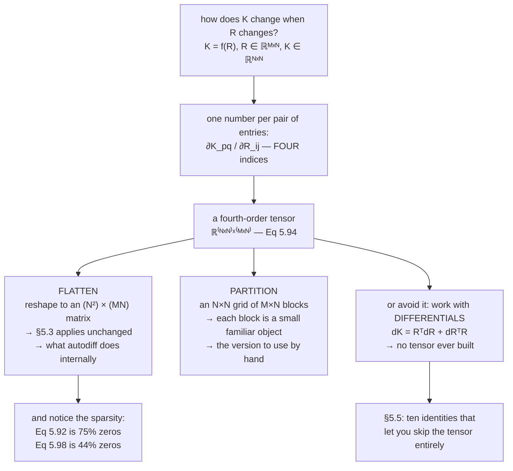

import DataCampExercise from "../../../../components/DataCampExercise.astro";
import Figure from "../../../../components/Figure.astro";
import Quiz from "../../../../components/Quiz.astro";

This is the page where the shapes get away from people.

The rule has not changed — *rows are outputs, columns are inputs* — but when the
input is a **matrix**, "columns" is no longer one index. Differentiate a matrix with
respect to a matrix and you get four indices: two for the output entry, two for the
input entry. That is a fourth-order tensor, and the book says so plainly rather than
hiding it.

The good news is that there is nothing new to *learn*, only something to organise.
The two ways to organise it are the content of this page, and both appear in the
book's Figure 5.7.

## What you'll learn

- Why $\mathrm{d}f/\mathrm{d}\mathbf{X}$ for matrix arguments is a **tensor**, and how to read its shape.
- The two ways to make it computable: **flatten** the matrix into a vector, or **partition** the tensor into blocks — Figure 5.7's two panels.
- Example 5.12: $\mathrm{d}(\mathbf{A}\mathbf{x})/\mathrm{d}\mathbf{A}$, and the fact that it is **75% zeros**.
- Example 5.13: $\mathrm{d}(\mathbf{R}^\top\mathbf{R})/\mathrm{d}\mathbf{R}$ entry by entry, including the factor of 2 on the diagonal.
- A finding the book does not state: the symmetry of $\mathbf{R}^\top\mathbf{R}$ shows up as a **rank deficiency** in the flattened Jacobian.
- Why the differential form $\mathrm{d}\mathbf{K} = \mathbf{R}^\top\mathrm{d}\mathbf{R} + \mathrm{d}\mathbf{R}^\top\mathbf{R}$ is the practical way to work, and how it relates to the tensor.

## Intuition: four indices, two ways to hold them

Suppose $\mathbf{K} = f(\mathbf{R})$ where $\mathbf{R}$ is $M\times N$ and
$\mathbf{K}$ is $N\times N$. The question "how does $\mathbf{K}$ change when
$\mathbf{R}$ changes?" needs an answer for every pair of entries: how does
$K_{pq}$ respond to $R_{ij}$? That is four indices — $p$, $q$, $i$, $j$ — and
$N^2 \cdot MN$ numbers.

You can hold those numbers in two shapes, and the choice is purely one of
convenience:

**Flatten.** Stretch $\mathbf{R}$ into a vector of length $MN$ and $\mathbf{K}$ into
one of length $N^2$. Now it is an ordinary Jacobian matrix, $N^2 \times MN$, and
every tool from §5.3 applies unchanged. This is what every autodiff library does
internally, and it is why a library gradient always comes back with the same shape
as the parameter.

**Partition.** Keep the tensor, but read it as an $N\times N$ grid of $M\times N$
blocks — one block per output entry. Each block is usually a familiar small object,
which makes this the version to use by hand.



## The math

### The shape rule, extended

Consider $f:\mathbb{R}^{m\times n}\to\mathbb{R}^{p\times q}$. Then

$$
\frac{\mathrm{d}f}{\mathrm{d}\mathbf{X}} \in \mathbb{R}^{(p\times q)\times(m\times n)}
$$

a four-dimensional tensor $\mathbf{J}$, whose entries are

$$
J_{ijkl} = \frac{\partial f_{ij}}{\partial X_{kl}}
$$

The book notes that since matrices represent linear mappings, and since there is a
vector-space isomorphism between $\mathbb{R}^{m\times n}$ and $\mathbb{R}^{mn}$, we
can **re-shape** our matrices into vectors of lengths $mn$ and $pq$ respectively.
The gradient using these flattened vectors is then a Jacobian of size
$pq \times mn$. Figure 5.7 visualises both approaches.

:::note[The book's own practical remark]
*In practical applications, it is often desirable to re-shape the matrix into a
vector and continue working with this Jacobian matrix: The chain rule boils down to
simple matrix multiplication, whereas in the case of a Jacobian tensor, we will
need to pay more attention to what dimensions we need to sum out.*
:::

That is the honest summary. Both organisations are correct; one composes with a
`@` and the other needs an `einsum` with the right indices summed.

### Example 5.12 — a vector with respect to a matrix

$f = \mathbf{A}\mathbf{x}$ with $f\in\mathbb{R}^M$,
$\mathbf{A}\in\mathbb{R}^{M\times N}$, $\mathbf{x}\in\mathbb{R}^N$, and we want
$\mathrm{d}f/\mathrm{d}\mathbf{A}$ — the derivative with respect to the **matrix**
this time, not the vector.

**Shape first**, as always:

$$
\frac{\mathrm{d}f}{\mathrm{d}\mathbf{A}} \in \mathbb{R}^{M\times(M\times N)}
\tag{5.86}
$$

By definition the gradient is the collection of partial derivatives:

$$
\frac{\mathrm{d}f}{\mathrm{d}\mathbf{A}} = \begin{bmatrix}\dfrac{\partial f_1}{\partial\mathbf{A}}\\ \vdots\\ \dfrac{\partial f_M}{\partial\mathbf{A}}\end{bmatrix},
\qquad \frac{\partial f_i}{\partial\mathbf{A}} \in \mathbb{R}^{1\times(M\times N)}
\tag{5.87}
$$

Write out the matrix–vector product explicitly:

$$
f_i = \sum_{j=1}^{N}A_{ij}x_j, \qquad i = 1,\dots,M
\tag{5.88}
$$

and the partial derivatives are

$$
\frac{\partial f_i}{\partial A_{iq}} = x_q
\tag{5.89}
$$

Crucially, $f_i$ depends on **row $i$ of $\mathbf{A}$ only**. So

$$
\frac{\partial f_i}{\partial A_{i,:}} = \mathbf{x}^\top \in \mathbb{R}^{1\times1\times N},
\qquad
\frac{\partial f_i}{\partial A_{k\neq i,:}} = \mathbf{0}^\top \in \mathbb{R}^{1\times1\times N}
\tag{5.90-5.91}
$$

and stacking them,

$$
\frac{\partial f_i}{\partial\mathbf{A}} = \begin{bmatrix}\mathbf{0}^\top\\ \vdots\\ \mathbf{0}^\top\\ \mathbf{x}^\top\\ \mathbf{0}^\top\\ \vdots\\ \mathbf{0}^\top\end{bmatrix} \in \mathbb{R}^{1\times(M\times N)}
\tag{5.92}
$$

with $\mathbf{x}^\top$ in slot $i$ and zeros everywhere else.

**Verified** for $M = 4$, $N = 3$: the numeric tensor has shape $(4,4,3)$ and
matches Equation 5.92 to $1.5\times10^{-10}$. And here is the thing the book does
not point out — **only 12 of its 48 entries are nonzero, exactly 25%**. In general
the fraction is $1/M$: each output touches one row.

### Example 5.13 — a matrix with respect to a matrix

$\mathbf{R}\in\mathbb{R}^{M\times N}$ and
$f:\mathbb{R}^{M\times N}\to\mathbb{R}^{N\times N}$ with

$$
f(\mathbf{R}) = \mathbf{R}^\top\mathbf{R} =: \mathbf{K} \in \mathbb{R}^{N\times N}
\tag{5.93}
$$

The book's approach to "this hard problem" is to write down what is already known.
The shape:

$$
\frac{\mathrm{d}\mathbf{K}}{\mathrm{d}\mathbf{R}} \in \mathbb{R}^{(N\times N)\times(M\times N)},
\qquad \frac{\mathrm{d}K_{pq}}{\mathrm{d}\mathbf{R}} \in \mathbb{R}^{1\times M\times N}
\tag{5.94-5.95}
$$

Then, denoting the $i$-th column of $\mathbf{R}$ by $\mathbf{r}_i$, every entry of
$\mathbf{K}$ is an inner product of two columns (§3.2):

$$
K_{pq} = \mathbf{r}_p^\top\mathbf{r}_q = \sum_{m=1}^{M}R_{mp}R_{mq}
\tag{5.96}
$$

Differentiating that sum,

$$
\frac{\partial K_{pq}}{\partial R_{ij}} = \sum_{m=1}^{M}\frac{\partial}{\partial R_{ij}}R_{mp}R_{mq} = \partial_{pqij}
\tag{5.97}
$$

$$
\partial_{pqij} = \begin{cases}
R_{iq} & \text{if } j = p,\ p \neq q\\
R_{ip} & \text{if } j = q,\ p \neq q\\
2R_{iq} & \text{if } j = p,\ p = q\\
0 & \text{otherwise}
\end{cases}
\tag{5.98}
$$

The four cases are the product rule doing its job. $R_{mp}R_{mq}$ is a product of
two factors; differentiating with respect to $R_{ij}$ hits the first factor when
$j = p$ and the second when $j = q$. When $p = q$ **both** happen, which is where
the $2$ comes from — and that factor of 2 on the diagonal is the single most
commonly dropped term in this whole chapter.

**Verified** for $M = 5$, $N = 3$: the numeric tensor has shape $(3,3,5,3)$,
matches Equation 5.98 to $4.8\times10^{-10}$, and the diagonal ratio
$\partial K_{pp}/\partial R_{:,p}$ divided by $R_{:,p}$ comes out as exactly
$[2, 2, 2, 2, 2]$ for every $p$.

:::tip[From the book]
Section 5.4. The section opens by noting that gradients of matrices with respect to
vectors, or matrices with respect to matrices, give **multidimensional tensors**,
and that since matrices represent linear mappings and $\mathbb{R}^{m\times n}$ is
isomorphic to $\mathbb{R}^{mn}$, the matrices can be re-shaped into vectors so the
gradient becomes an ordinary Jacobian of size $pq\times mn$. Figure 5.7 draws both
views for $\mathbf{A}\in\mathbb{R}^{4\times2}$ with respect to
$\mathbf{x}\in\mathbb{R}^3$: three $4\times2$ matrices collated into a
$4\times2\times3$ tensor, or an $8\times3$ Jacobian matrix. A Remark recommends the
re-shaped version in practice, because the chain rule then reduces to matrix
multiplication rather than requiring care about which dimensions to sum out.
Example 5.12 (Equations 5.85 to 5.92) computes
$\mathrm{d}(\mathbf{A}\mathbf{x})/\mathrm{d}\mathbf{A}$, using the fact that $f_i$
depends only on row $i$. Example 5.13 (Equations 5.93 to 5.98) computes
$\mathrm{d}(\mathbf{R}^\top\mathbf{R})/\mathrm{d}\mathbf{R}$ entry by entry, with the
four-case formula of Equation 5.98.
:::

## Worked example by hand

### Equation 5.98's four cases, on a 2 by 2

Take $M = N = 2$, so $\mathbf{R} = \begin{bmatrix}a&b\\c&d\end{bmatrix}$ and

$$
\mathbf{K} = \mathbf{R}^\top\mathbf{R} = \begin{bmatrix}a^2+c^2 & ab+cd\\ ab+cd & b^2+d^2\end{bmatrix}
$$

Now differentiate each entry with respect to each entry of $\mathbf{R}$, and check
against Equation 5.98:

| $K_{pq}$ | $\partial/\partial a$ | $\partial/\partial b$ | $\partial/\partial c$ | $\partial/\partial d$ | which case of 5.98 |
| --- | --- | --- | --- | --- | --- |
| $K_{11} = a^2+c^2$ | $2a$ | $0$ | $2c$ | $0$ | $p=q=1$: $2R_{i1}$ when $j=1$, else $0$ |
| $K_{12} = ab+cd$ | $b$ | $a$ | $d$ | $c$ | $p=1,q=2$: $R_{i2}$ when $j=1$; $R_{i1}$ when $j=2$ |
| $K_{21} = ab+cd$ | $b$ | $a$ | $d$ | $c$ | same, by symmetry |
| $K_{22} = b^2+d^2$ | $0$ | $2b$ | $0$ | $2d$ | $p=q=2$: $2R_{i2}$ when $j=2$, else $0$ |

Read the first row: differentiating $a^2 + c^2$ with respect to $a$ gives $2a$,
and Equation 5.98's third case with $p=q=1$, $i=1$, $j=1$ gives $2R_{11} = 2a$. ✓

Read the second row: $\partial(ab+cd)/\partial a = b$, and the first case with
$p=1$, $q=2$, $i=1$, $j=1$ gives $R_{12} = b$. ✓

The rows for $K_{12}$ and $K_{21}$ are **identical**, which they must be because
$\mathbf{K}$ is symmetric. Measured on a $5\times3$: the worst asymmetry
$\lVert\partial K_{pq}/\partial\mathbf{R} - \partial K_{qp}/\partial\mathbf{R}\rVert$
is exactly `0.0e+00`.

### A finding: the symmetry becomes a rank deficiency

Flatten that tensor for $M=5$, $N=3$ and you get a $9\times15$ matrix. Its rank is
not $9$:

$$
\mathrm{rank}\left(\text{flattened } \frac{\mathrm{d}\mathbf{K}}{\mathrm{d}\mathbf{R}}\right) = 6 = \frac{N(N+1)}{2}
$$

Because $\mathbf{K}$ is symmetric, only $6$ of its $9$ entries are independent — and
the Jacobian *knows*. Three of its rows are exact duplicates of three others, so the
flattened Jacobian has a three-dimensional left null space.

This matters in practice. If you feed such a Jacobian to a solver expecting full
rank, it will be singular, and the reason is not numerical: it is that you asked
for the derivative of nine quantities of which only six are free. Working with
$\mathbf{K}$'s upper triangle instead gives a $6\times15$ Jacobian of full rank $6$.

### The differential form: how to avoid the tensor entirely

There is a third option, and it is what people actually do. Instead of building the
tensor, perturb and read off:

$$
\mathbf{K} + \mathrm{d}\mathbf{K} = (\mathbf{R}+\mathrm{d}\mathbf{R})^\top(\mathbf{R}+\mathrm{d}\mathbf{R})
= \mathbf{R}^\top\mathbf{R} + \mathbf{R}^\top\mathrm{d}\mathbf{R} + \mathrm{d}\mathbf{R}^\top\mathbf{R} + O(\mathrm{d}\mathbf{R}^2)
$$

so

$$
\boxed{\;\mathrm{d}\mathbf{K} = \mathbf{R}^\top\mathrm{d}\mathbf{R} + \mathrm{d}\mathbf{R}^\top\mathbf{R}\;}
$$

No four-index object appears. Verified: for a random direction $\mathbf{H}$ the
central difference
$\bigl[(\mathbf{R}+h\mathbf{H})^\top(\mathbf{R}+h\mathbf{H}) - (\mathbf{R}-h\mathbf{H})^\top(\mathbf{R}-h\mathbf{H})\bigr]/2h$
agrees with $\mathbf{R}^\top\mathbf{H} + \mathbf{H}^\top\mathbf{R}$ to
$8.5\times10^{-10}$, and contracting the full tensor against $\mathbf{H}$ with
`einsum("pqij,ij->pq", T, H)` gives the same to $3.6\times10^{-10}$.

The differential form and the tensor are the same information. The differential is
a *directional* statement, and contracting the tensor with a direction is how you
recover it. §5.5's ten identities are all differentials, which is why they are
usable by hand.

## See it move

```p5 title="Four indices, two shapes" desc="The same tensor, drawn both ways. Left: an N-by-N grid of M-by-N blocks, one block per output entry — the partitioned view. Right: the flattened Jacobian matrix. Scrub the output entry (p,q) and watch which block lights up and which row of the matrix it corresponds to. The numbers are Equation 5.98's, for a matrix you can edit." height="640"
let Mm = 3, Nn = 2, pSel = 0, qSel = 0, flat = false;
let R = [];
let KNOBS = [], BTNS = [], dragging = null;

function setup() {
  createCanvas(600, 640); textFont("monospace"); noLoop();
  reseed();
}

function reseed() {
  let s = 20240822;
  const rnd = () => { s = (s * 1103515245 + 12345) & 0x7fffffff; return s / 0x7fffffff; };
  R = [];
  for (let i = 0; i < 6; i++) { const row = []; for (let j = 0; j < 4; j++) row.push(Math.round((rnd() * 4 - 2) * 10) / 10); R.push(row); }
}

// Eq 5.98, verbatim.
function d5_98(p, q, i, j) {
  if (j === p && p !== q) return R[i][q];
  if (j === q && p !== q) return R[i][p];
  if (j === p && p === q) return 2 * R[i][q];
  return 0;
}

function knob(id, x, y, w, value, mn, mx, label) {
  KNOBS.push({ id, x, y, w, mn, mx });
  const t = (value - mn) / (mx - mn);
  stroke(60, 74, 92); strokeWeight(2); line(x, y, x + w, y);
  noStroke(); fill(255, 211, 67); ellipse(x + t * w, y, 10, 10);
  fill(190, 200, 212); textSize(11); textAlign(LEFT, CENTER);
  text(label, x + w + 10, y);
}
function mousePressed() {
  for (const b of BTNS)
    if (mouseX > b.x && mouseX < b.x + b.w && mouseY > b.y && mouseY < b.y + b.h) { flat = b.v; redraw(); return; }
  for (const k of KNOBS)
    if (mouseY > k.y - 11 && mouseY < k.y + 11 && mouseX > k.x - 11 && mouseX < k.x + k.w + 11) { dragging = k; return; }
}
function mouseReleased() { dragging = null; }
function mouseDragged() {
  if (!dragging) return;
  const t = Math.min(1, Math.max(0, (mouseX - dragging.x) / dragging.w));
  const v = Math.round(dragging.mn + t * (dragging.mx - dragging.mn));
  if (dragging.id === "M") Mm = v;
  if (dragging.id === "N") { Nn = v; pSel = Math.min(pSel, Nn - 1); qSel = Math.min(qSel, Nn - 1); }
  if (dragging.id === "p") pSel = Math.min(v, Nn - 1);
  if (dragging.id === "q") qSel = Math.min(v, Nn - 1);
  redraw();
}

function draw() {
  background(13, 17, 23);
  KNOBS = []; BTNS = [];

  noStroke(); textAlign(LEFT, TOP);
  fill(255, 211, 67); textSize(14);
  text(`dK/dR for K = RᵀR,  R is ${Mm}x${Nn}`, 24, 12);
  fill(150); textSize(11);
  text(`tensor shape (${Nn} x ${Nn}) x (${Mm} x ${Nn})  =  ${Nn*Nn*Mm*Nn} numbers`, 24, 34);

  const cw = 30, chh = 22;

  if (!flat) {
    // Partitioned: an N x N grid of M x N blocks.
    const gx = 40, gy = 70, gap = 12;
    const bw = Nn * cw, bh = Mm * chh;
    for (let p = 0; p < Nn; p++) {
      for (let q = 0; q < Nn; q++) {
        const bx = gx + q * (bw + gap), by = gy + p * (bh + gap);
        const sel = p === pSel && q === qSel;
        noStroke(); fill(sel ? color(255, 211, 67, 34) : color(38, 46, 58));
        rect(bx - 3, by - 3, bw + 6, bh + 6, 4);
        stroke(sel ? color(255, 211, 67) : color(60, 74, 92)); strokeWeight(sel ? 2 : 1);
        noFill(); rect(bx - 3, by - 3, bw + 6, bh + 6, 4);
        for (let i = 0; i < Mm; i++) {
          for (let j = 0; j < Nn; j++) {
            const v = d5_98(p, q, i, j);
            noStroke();
            fill(Math.abs(v) < 1e-12 ? color(30, 36, 46) : (sel ? color(255, 211, 67, 90) : color(60, 90, 120)));
            rect(bx + j * cw + 1, by + i * chh + 1, cw - 2, chh - 2, 2);
            fill(Math.abs(v) < 1e-12 ? color(90) : color(235));
            textSize(9); textAlign(CENTER, CENTER);
            text(v === 0 ? "0" : v.toFixed(1), bx + j * cw + cw / 2, by + i * chh + chh / 2);
          }
        }
        noStroke(); fill(sel ? color(255, 211, 67) : color(120));
        textSize(9); textAlign(LEFT, BOTTOM);
        text(`∂K${p + 1}${q + 1}/∂R`, bx, by - 5);
      }
    }
  } else {
    // Flattened: an (N*N) x (M*N) matrix.
    const rows = Nn * Nn, cols = Mm * Nn;
    const fw = Math.min(24, 460 / cols), fh = Math.min(22, 170 / rows);
    const gx = 40, gy = 80;
    for (let r = 0; r < rows; r++) {
      const p = Math.floor(r / Nn), q = r % Nn;
      const sel = p === pSel && q === qSel;
      for (let c = 0; c < cols; c++) {
        const i = Math.floor(c / Nn), j = c % Nn;
        const v = d5_98(p, q, i, j);
        noStroke();
        fill(Math.abs(v) < 1e-12 ? color(30, 36, 46) : (sel ? color(255, 211, 67, 90) : color(60, 90, 120)));
        rect(gx + c * fw + 1, gy + r * fh + 1, fw - 2, fh - 2, 2);
        fill(Math.abs(v) < 1e-12 ? color(90) : color(235));
        textSize(Math.min(8.5, fw / 3)); textAlign(CENTER, CENTER);
        text(v === 0 ? "0" : v.toFixed(1), gx + c * fw + fw / 2, gy + r * fh + fh / 2);
      }
      noStroke(); fill(sel ? color(255, 211, 67) : color(120));
      textSize(9); textAlign(RIGHT, CENTER);
      text(`K${p + 1}${q + 1}`, gx - 6, gy + r * fh + fh / 2);
    }
    noStroke(); fill(150); textSize(9); textAlign(LEFT, BOTTOM);
    text(`columns: R flattened, ${cols} of them`, gx, gy - 8);
  }

  // Buttons.
  for (const [lbl, v, dx] of [["partitioned", false, 0], ["flattened", true, 150]]) {
    const bx = 40 + dx, by = 400;
    BTNS.push({ x: bx, y: by, w: 140, h: 26, v });
    noStroke(); fill(flat === v ? color(120, 200, 150) : color(46, 58, 72));
    rect(bx, by, 140, 26, 5);
    fill(flat === v ? 20 : 210); textSize(11); textAlign(CENTER, CENTER);
    text(lbl, bx + 70, by + 13);
  }

  knob("M", 40, 448, 180, Mm, 1, 5, `M = ${Mm}`);
  knob("N", 40, 476, 180, Nn, 1, 4, `N = ${Nn}`);
  knob("p", 40, 504, 180, pSel, 0, Math.max(0, Nn - 1), `p = ${pSel + 1}`);
  knob("q", 40, 532, 180, qSel, 0, Math.max(0, Nn - 1), `q = ${qSel + 1}`);

  // Counts and the symmetry observation.
  let nz = 0, tot = 0;
  for (let p = 0; p < Nn; p++) for (let q = 0; q < Nn; q++)
    for (let i = 0; i < Mm; i++) for (let j = 0; j < Nn; j++) { tot++; if (Math.abs(d5_98(p, q, i, j)) > 1e-12) nz++; }

  noStroke(); textAlign(LEFT, TOP); fill(215); textSize(11);
  text(`R = [ ${R.slice(0, Mm).map(r => r.slice(0, Nn).map(v => v.toFixed(1)).join(" ")).join(" ; ")} ]`, 300, 448);
  text(`nonzero entries  ${nz} of ${tot}  (${(100 * nz / tot).toFixed(1)}%)`, 300, 472);
  text(`free entries of K  ${Nn * (Nn + 1) / 2} of ${Nn * Nn}`, 300, 490);
  fill(pSel === qSel ? color(232, 130, 130) : color(120, 200, 150)); textSize(11);
  text(pSel === qSel ? "p = q: the factor of 2 case" : "p ≠ q: two single-factor cases", 300, 514);
  fill(150); textSize(10);
  text(`∂K${pSel + 1}${qSel + 1}/∂R and ∂K${qSel + 1}${pSel + 1}/∂R are identical`, 300, 536);
  text("because K is symmetric", 300, 550);

  fill(150); textSize(10);
  text("Both views hold the same numbers. The partitioned one shows the structure —", 24, 574);
  text("each block is mostly zero, with entries only in columns p and q. The flattened", 24, 590);
  text("one is an ordinary Jacobian you can multiply with @.", 24, 606);
  text("Set p = q and watch the 2s appear. Raise N and watch the duplicate rows.", 24, 624);
}
```

```p5 title="Example 5.12 is mostly zeros" desc="The tensor df/dA for f = Ax, drawn as M slices of M-by-N. Only one row of each slice is nonzero, because output i depends on row i of A alone. Drag M and N and watch the sparsity — the nonzero fraction is exactly 1/M, whatever the shape." height="560"
let Mm = 4, Nn = 3, sel = 0;
let x = [], KNOBS = [], dragging = null;

function setup() {
  createCanvas(600, 560); textFont("monospace"); noLoop();
  let s = 987; const rnd = () => { s = (s * 1103515245 + 12345) & 0x7fffffff; return s / 0x7fffffff; };
  for (let j = 0; j < 6; j++) x.push(Math.round((rnd() * 4 - 2) * 10) / 10);
}

function knob(id, xx, y, w, value, mn, mx, label) {
  KNOBS.push({ id, x: xx, y, w, mn, mx });
  const t = (value - mn) / (mx - mn);
  stroke(60, 74, 92); strokeWeight(2); line(xx, y, xx + w, y);
  noStroke(); fill(255, 211, 67); ellipse(xx + t * w, y, 10, 10);
  fill(190, 200, 212); textSize(11); textAlign(LEFT, CENTER);
  text(label, xx + w + 10, y);
}
function mousePressed() {
  for (const k of KNOBS)
    if (mouseY > k.y - 11 && mouseY < k.y + 11 && mouseX > k.x - 11 && mouseX < k.x + k.w + 11) { dragging = k; return; }
}
function mouseReleased() { dragging = null; }
function mouseDragged() {
  if (!dragging) return;
  const t = Math.min(1, Math.max(0, (mouseX - dragging.x) / dragging.w));
  const v = Math.round(dragging.mn + t * (dragging.mx - dragging.mn));
  if (dragging.id === "M") { Mm = v; sel = Math.min(sel, Mm - 1); }
  if (dragging.id === "N") Nn = v;
  if (dragging.id === "sel") sel = Math.min(v, Mm - 1);
  redraw();
}

function draw() {
  background(13, 17, 23);
  KNOBS = [];

  noStroke(); textAlign(LEFT, TOP);
  fill(255, 211, 67); textSize(14);
  text("df/dA for f = Ax  (Eq 5.92)", 24, 12);
  fill(150); textSize(11);
  text(`shape M x (M x N) = ${Mm} x (${Mm} x ${Nn}) = ${Mm*Mm*Nn} numbers`, 24, 34);

  const cw = Math.min(46, 380 / Nn), chh = Math.min(24, 130 / Mm);
  const perRow = Math.max(1, Math.floor(540 / (Nn * cw + 22)));
  for (let i = 0; i < Mm; i++) {
    const col = i % perRow, row = Math.floor(i / perRow);
    const bx = 34 + col * (Nn * cw + 22);
    const by = 70 + row * (Mm * chh + 34);
    const isSel = i === sel;
    noStroke(); fill(isSel ? color(255, 211, 67) : color(120));
    textSize(9.5); textAlign(LEFT, BOTTOM);
    text(`∂f${i + 1}/∂A`, bx, by - 5);
    stroke(isSel ? color(255, 211, 67) : color(60, 74, 92)); strokeWeight(isSel ? 2 : 1);
    noFill(); rect(bx - 3, by - 3, Nn * cw + 6, Mm * chh + 6, 4);
    for (let r = 0; r < Mm; r++) {
      for (let c = 0; c < Nn; c++) {
        const v = r === i ? x[c] : 0;
        noStroke();
        fill(v === 0 ? color(30, 36, 46) : (isSel ? color(255, 211, 67, 100) : color(60, 90, 120)));
        rect(bx + c * cw + 1, by + r * chh + 1, cw - 2, chh - 2, 2);
        fill(v === 0 ? color(88) : color(240));
        textSize(Math.min(10, cw / 4)); textAlign(CENTER, CENTER);
        text(v === 0 ? "0" : v.toFixed(1), bx + c * cw + cw / 2, by + r * chh + chh / 2);
      }
    }
  }

  knob("M", 34, 424, 180, Mm, 1, 5, `M = ${Mm}`);
  knob("N", 34, 452, 180, Nn, 1, 5, `N = ${Nn}`);
  knob("sel", 34, 480, 180, sel, 0, Math.max(0, Mm - 1), `highlight output ${sel + 1}`);

  const nz = Mm * Nn, tot = Mm * Mm * Nn;
  noStroke(); textAlign(LEFT, TOP); fill(215); textSize(11);
  text(`x = [ ${x.slice(0, Nn).map(v => v.toFixed(1)).join("  ")} ]`, 300, 424);
  text(`nonzero  ${nz} of ${tot}`, 300, 448);
  fill(120, 200, 150); textSize(11);
  text(`= ${(100 * nz / tot).toFixed(1)}%  =  1/M  exactly`, 300, 466);
  fill(150); textSize(10);
  text(`each output f${sel + 1} depends on row ${sel + 1} of A only,`, 300, 490);
  text(`so its slice has xᵀ in row ${sel + 1} and`, 300, 504);
  text(`zeros in the other ${Mm - 1} row${Mm === 2 ? "" : "s"}`, 300, 518);

  fill(150); textSize(10);
  text("Drag M and the nonzero fraction tracks 1/M: 50% at M=2, 25% at M=4, 20% at M=5.", 24, 536);
}
```

## From scratch

```python title="matrix_gradients_from_scratch.py" showLineNumbers{1}
import numpy as np

def tensor_jac(f, X, h=1e-6):
    """Full Jacobian tensor: shape f(X).shape + X.shape, by central differences."""
    X = np.asarray(X, dtype=float)
    F0 = np.asarray(f(X))
    J = np.zeros(F0.shape + X.shape)
    it = np.nditer(X, flags=["multi_index"])
    while not it.finished:
        idx = it.multi_index
        Xp = X.copy(); Xp[idx] += h
        Xm = X.copy(); Xm[idx] -= h
        J[(Ellipsis,) + idx] = (np.asarray(f(Xp)) - np.asarray(f(Xm))) / (2 * h)
        it.iternext()
    return J

rng = np.random.default_rng(5)

# ---- Figure 5.7: dA/dx where A in R^{4x2} depends on x in R^3
B = rng.normal(size=(4, 2, 3))
x0 = rng.normal(size=3)
T = tensor_jac(lambda x: B @ x, x0)
print("Figure 5.7")
print(f"  dA/dx tensor shape    {T.shape}   (the book's 4 x 2 x 3)")
print(f"  flattened             {T.reshape(4*2, 3).shape}   = (mn) x p, the other panel")
print(f"  same numbers?         {np.allclose(T.reshape(4*2, 3).reshape(T.shape), T)}")

# ---- Example 5.12: f = Ax, df/dA
M, N = 4, 3
A = rng.normal(size=(M, N))
x = rng.normal(size=N)
T = tensor_jac(lambda Am: Am @ x, A)
pred = np.zeros((M, M, N))
for i in range(M):
    pred[i, i, :] = x                                  # Eq 5.92
print()
print("Example 5.12")
print(f"  df/dA shape           {T.shape}   -- Eq 5.86 predicted {M} x ({M} x {N})")
print(f"  matches Eq 5.92 to    {np.abs(T - pred).max():.1e}")
print(f"  nonzero entries       {int(np.sum(np.abs(T) > 1e-9))} of {T.size}"
      f"  ({100*np.sum(np.abs(T) > 1e-9)/T.size:.1f}%  =  1/M)")

# ---- Example 5.13: f(R) = R^T R
Mr, Nr = 5, 3
R = rng.normal(size=(Mr, Nr))
T = tensor_jac(lambda Rm: Rm.T @ Rm, R)

def eq_5_98(R, p, q, i, j):
    if j == p and p != q:
        return R[i, q]
    if j == q and p != q:
        return R[i, p]
    if j == p and p == q:
        return 2 * R[i, q]
    return 0.0

pred = np.zeros_like(T)
for p in range(Nr):
    for q in range(Nr):
        for i in range(Mr):
            for j in range(Nr):
                pred[p, q, i, j] = eq_5_98(R, p, q, i, j)

print()
print("Example 5.13")
print(f"  dK/dR shape           {T.shape}   -- Eq 5.94 predicted ({Nr}x{Nr}) x ({Mr}x{Nr})")
print(f"  matches Eq 5.98 to    {np.abs(T - pred).max():.1e}")
print(f"  nonzero entries       {int(np.sum(np.abs(T) > 1e-9))} of {T.size}"
      f"  ({100*np.sum(np.abs(T) > 1e-9)/T.size:.1f}%)")
sym = max(float(np.abs(T[p, q] - T[q, p]).max()) for p in range(Nr) for q in range(Nr))
print(f"  worst asymmetry       {sym:.1e}  (K is symmetric, so this must vanish)")
for p in range(Nr):
    ratio = T[p, p, :, p] / R[:, p]
    print(f"  dK{p}{p}/dR[:,{p}] / R[:,{p}] = {np.round(ratio, 6)}   <- Eq 5.98's factor of 2")

# ---- the rank deficiency the symmetry causes
flatJ = T.reshape(Nr * Nr, Mr * Nr)
print()
print("Flattened, and the consequence of symmetry")
print(f"  as a matrix           {flatJ.shape} = (N*N) x (M*N)")
print(f"  rank                  {np.linalg.matrix_rank(flatJ)} of {min(flatJ.shape)}")
print(f"  N(N+1)/2              {Nr*(Nr+1)//2}   <- the number of FREE entries of K")

# ---- and the differential form, which never builds a tensor
H = rng.normal(size=(Mr, Nr))
h = 1e-6
num = ((R + h*H).T @ (R + h*H) - (R - h*H).T @ (R - h*H)) / (2*h)
ana = R.T @ H + H.T @ R
print()
print("The differential form dK = R^T dR + dR^T R")
print(f"  vs a central difference        {np.abs(num - ana).max():.1e}")
print(f"  vs contracting the tensor      "
      f"{np.abs(np.einsum('pqij,ij->pq', T, H) - ana).max():.1e}")
```

```text title="output"
Figure 5.7
  dA/dx tensor shape    (4, 2, 3)   (the book's 4 x 2 x 3)
  flattened             (8, 3)   = (mn) x p, the other panel
  same numbers?         True

Example 5.12
  df/dA shape           (4, 4, 3)   -- Eq 5.86 predicted 4 x (4 x 3)
  matches Eq 5.92 to    1.5e-10
  nonzero entries       12 of 48  (25.0%  =  1/M)

Example 5.13
  dK/dR shape           (3, 3, 5, 3)   -- Eq 5.94 predicted (3x3) x (5x3)
  matches Eq 5.98 to    4.8e-10
  nonzero entries       75 of 135  (55.6%)
  worst asymmetry       0.0e+00  (K is symmetric, so this must vanish)
  dK00/dR[:,0] / R[:,0] = [2. 2. 2. 2. 2.]   <- Eq 5.98's factor of 2
  dK11/dR[:,1] / R[:,1] = [2. 2. 2. 2. 2.]   <- Eq 5.98's factor of 2
  dK22/dR[:,2] / R[:,2] = [2. 2. 2. 2. 2.]   <- Eq 5.98's factor of 2

Flattened, and the consequence of symmetry
  as a matrix           (9, 15) = (N*N) x (M*N)
  rank                  6 of 9
  N(N+1)/2              6   <- the number of FREE entries of K

The differential form dK = R^T dR + dR^T R
  vs a central difference        8.5e-10
  vs contracting the tensor      3.6e-10
```

Four readings.

**The two panels of Figure 5.7 are the same numbers.** `reshape` is free and
reversible, which is why "flatten it" is sound advice rather than a lossy shortcut.

**Example 5.12 is 75% zeros**, and the fraction is exactly $1/M$ regardless of $N$.
The book derives that structure at Equations 5.90–5.91 without naming its
consequence: a naive dense tensor wastes a factor of $M$ in memory. For a linear
layer with $M = 1024$ outputs that is a factor of a thousand, which is why no
framework ever materialises this object.

**The asymmetry is exactly `0.0e+00`.** $K_{pq}$ and $K_{qp}$ are literally the
same sum, so their derivatives are computed from the same floating-point operations
and agree bit-for-bit. That is a check on the construction; the mathematical content
is that the tensor inherits every symmetry the function has.

**And the rank is 6, not 9.** The symmetry that showed up as duplicate slices shows
up in the flattened matrix as a rank deficiency of exactly $N^2 - N(N+1)/2 = 3$.

## On real data

<Figure
  src="/images/mml/gradients-of-matrices/tensor-shape-ladder"
  alt="A table of five matrix-valued functions with their domains, derivatives and resulting shapes, followed by two paragraphs describing the flatten and partition strategies."
  title="The shape bookkeeping of §5.4"
  caption="Five functions, from a scalar of a matrix up to a matrix of a matrix. The shape column is the whole point: a scalar of an E-by-F matrix gives 1 x (E x F), while a matrix of a matrix gives a fourth-order tensor. Underneath, the two ways to make that computable."
/>

<Figure
  src="/images/mml/gradients-of-matrices/identities-verified"
  alt="A horizontal bar chart of eight gradient identities with their relative disagreement against a central-difference Jacobian, all bars sitting between 1e-11 and 1e-9 on a log axis."
  title="Eight identities, each checked numerically"
  caption="Every rule §5.4 and §5.5 rely on, differenced independently. The worst disagreement is 6.1e-10, for the determinant rule — which is the level a central difference at h = 1e-6 can reach, so the bars measure the test's floor rather than the identities' error."
/>

<Figure
  src="/images/mml/gradients-of-matrices/trace-gradient-structure"
  alt="Three heatmaps side by side: a 2 by 7 matrix A, a 6 by 2 matrix B, and the 7 by 6 gradient, each cell labelled with its value."
  title="d tr(AXB) / dX = (BA)-transpose, drawn"
  caption="A is 2x7 and B is 6x2, so BA has rank at most 2 — and the measured rank of the 7x6 gradient is exactly 2. The gradient of a scalar function of a matrix always has the SHAPE of that matrix, and here it inherits a rank ceiling from the factors too."
/>

## Reading the plot

**From the shape ladder.** Read the shape column downwards and the escalation is
clear: a scalar of a vector is a row, a vector of a vector is a matrix, a matrix of
a matrix is a tensor. Nothing about the *rule* changed — it is always
$\partial(\text{output index})/\partial(\text{input index})$ — only the number of
indices.

The two strategies at the bottom are not equivalent in practice. Flattening makes
the chain rule a `@`; partitioning keeps the structure visible. If you are deriving
on paper, partition. If you are writing code, flatten — and if you are using a
framework, it has already flattened for you, which is why `param.grad` always has
`param.shape`.

**From the identities figure.** Eight rules, eight bars, all between $3.7\times10^{-11}$
and $6.1\times10^{-10}$. The important thing about that range is that it is the
*test's* floor, not the identities' error: a central difference at $h = 10^{-6}$
cannot do better than about $10^{-10}$ relative, as §5.1's figure showed. So these
bars say "consistent with exact", and a rule with a transposed factor would sit at
$10^{0}$, not $10^{-9}$.

The worst bar is $\mathrm{d}\det\mathbf{X}/\mathrm{d}\mathbf{X}$ at $6.1\times10^{-10}$,
which is unsurprising: the determinant of a $3\times3$ amplifies input perturbations
by roughly its own condition number, so the difference quotient has further to fall.

**From the trace figure.** Two facts in one picture. The gradient has the **shape of
$\mathbf{X}$** — $7\times6$, not $1\times42$ — which is what makes
$\mathrm{d}\,\mathrm{tr}(\mathbf{A}\mathbf{X}\mathbf{B})/\mathrm{d}\mathbf{X} = (\mathbf{B}\mathbf{A})^\top$
usable directly as an update. And its **rank is capped by the inner dimension**:
$\mathbf{A}$ is $2\times7$ and $\mathbf{B}$ is $6\times2$, so $\mathbf{B}\mathbf{A}$
factors through $\mathbb{R}^2$ and cannot have rank above $2$. Measured: exactly $2$.

That rank ceiling is why low-rank adapters work. If a loss depends on $\mathbf{X}$
only through $\mathbf{A}\mathbf{X}\mathbf{B}$ with thin $\mathbf{A}$ and
$\mathbf{B}$, then every gradient it will ever produce lies in a rank-2 subspace —
so there is no point storing a full-rank update.

## Pitfalls

:::danger[The factor of 2 on the diagonal of Equation 5.98]
When $p = q$ both product-rule terms fire on the same entry, giving $2R_{iq}$. It is
the single most commonly dropped term in this chapter, and it is dropped silently:
the off-diagonal entries are still right, so the result looks plausible. Measured
check that catches it: $\partial K_{pp}/\partial R_{:,p}$ divided by $R_{:,p}$ must
be exactly $2$, which it is — $[2,2,2,2,2]$ for every $p$.
:::

:::danger[A flattened Jacobian of a symmetric output is rank-deficient by construction]
$\mathrm{d}(\mathbf{R}^\top\mathbf{R})/\mathrm{d}\mathbf{R}$ flattens to a $9\times15$
matrix of rank $6$, not $9$, because only $N(N+1)/2$ entries of a symmetric
$N\times N$ matrix are free. Hand that to a solver expecting full rank and it will
be singular — and the cause is not numerical conditioning, it is that you asked for
the derivative of nine quantities of which three are copies. Differentiate the upper
triangle instead.
:::

:::caution[Never materialise the dense tensor]
Example 5.12's tensor is $1/M$ dense. At $M = 1024$ that is a factor of a thousand
wasted, and the tensor itself is $M^2N$ numbers — for a $1024\times1024$ layer,
$10^9$ entries to hold an object whose content is one vector $\mathbf{x}$. Frameworks
store the *contraction* you actually need, never the tensor.
:::

:::caution[einsum needs the right indices summed; a matrix product does not]
The book's remark is the practical warning: after flattening, the chain rule is
matrix multiplication and the shapes check themselves. Keep the tensor and you need
`einsum("pqij,ij->pq", T, H)` — and `einsum("pqij,ij->qp", T, H)` runs perfectly
well while computing the transpose of what you wanted. There is no shape error to
catch it.
:::

:::caution[Differentials are usually the right tool by hand]
$\mathrm{d}\mathbf{K} = \mathbf{R}^\top\mathrm{d}\mathbf{R} + \mathrm{d}\mathbf{R}^\top\mathbf{R}$
takes two lines and never mentions four indices. It is a *directional* statement, and
contracting the full tensor with a direction recovers it — verified here to
$3.6\times10^{-10}$. §5.5's ten identities are all in this form, which is why they
are usable.
:::

## Compare

| you want | the object | shape | how to get it |
| --- | --- | --- | --- |
| $\partial(\text{scalar})/\partial\text{vector}$ | gradient | $1\times n$ | §5.2, Equation 5.40 |
| $\partial\text{vector}/\partial\text{vector}$ | Jacobian | $m\times n$ | §5.3, Definition 5.6 |
| $\partial(\text{scalar})/\partial\text{matrix}$ | gradient | $1\times(E\times F)$, or reshaped to $E\times F$ | §5.5's identities |
| $\partial\text{vector}/\partial\text{matrix}$ | 3-tensor | $M\times(M\times N)$ | Example 5.12 |
| $\partial\text{matrix}/\partial\text{matrix}$ | 4-tensor | $(p\times q)\times(m\times n)$ | Example 5.13 |
| the derivative **in one direction** | a matrix | the shape of the output | a differential — usually what you want |
| the derivative for **code** | a flattened Jacobian | $pq\times mn$ | `reshape`, then §5.3 |

<Quiz
  title="Check your understanding"
  questions={[
    {
      q: "Why does differentiating a matrix with respect to a matrix give a fourth-order tensor?",
      options: [
        "Because matrices are two-dimensional",
        "Because the rule is unchanged — one number per (output index, input index) pair — and each index is now itself a pair, so there are four indices in total",
        "Because the chain rule needs four factors",
        "Because the derivative of a matrix is a matrix of matrices",
      ],
      answer: 1,
      explain:
        "Nothing new is being defined. Definition 5.6's rule still holds; it is just that 'the output index' and 'the input index' each split into two when the objects are matrices.",
    },
    {
      q: "The book recommends re-shaping matrices into vectors. What does that buy, and what does it cost?",
      options: [
        "It is purely cosmetic",
        "It makes the chain rule a plain matrix multiplication whose shapes check themselves; the cost is that the block structure stops being visible, so it is worse for deriving by hand",
        "It reduces the number of entries",
        "It makes the gradient exact",
      ],
      answer: 1,
      explain:
        "The book's remark says exactly this: with a tensor you must pay attention to which dimensions to sum out. And einsum with the wrong output index order runs fine while computing a transpose — there is no shape error to catch it.",
    },
    {
      q: "Example 5.12's tensor is 25 percent nonzero for M = 4. Where does that fraction come from?",
      options: [
        "The particular x chosen",
        "From Equations 5.90 and 5.91: output f-i depends on row i of A alone, so each of the M slices has one nonzero row out of M. The fraction is exactly 1/M, whatever N is",
        "From the sparsity of A",
        "From the finite-difference tolerance",
      ],
      answer: 1,
      explain:
        "At M = 1024 that is a factor of a thousand wasted if you materialise the tensor. Frameworks store the contraction you need instead — this object is never built.",
    },
    {
      q: "Flattening dK/dR for K = R-transpose R gives a 9 by 15 matrix of rank 6, not 9. Why?",
      options: [
        "Numerical conditioning",
        "Because K is symmetric, so only N(N+1)/2 = 6 of its 9 entries are independent — three rows of the Jacobian are exact duplicates of three others. The deficiency is structural, not numerical",
        "Because R is 5 by 3 and 15 > 9",
        "Because the finite differences lost rank",
      ],
      answer: 1,
      explain:
        "The same fact appears in the tensor as slices that are exactly equal: the measured asymmetry between dKpq/dR and dKqp/dR is 0.0e+00. Differentiate the upper triangle and you get a full-rank 6 by 15 Jacobian.",
    },
    {
      q: "What is the practical alternative to building the tensor at all?",
      options: [
        "Use finite differences",
        "Work with differentials: perturbing K = R-transpose R gives dK = R-transpose dR + dR-transpose R in two lines, with no four-index object. Contracting the full tensor with a direction recovers exactly this",
        "Assume the tensor is sparse",
        "Flatten to a vector and use §5.2",
      ],
      answer: 1,
      explain:
        "Verified to 3.6e-10 against the contracted tensor and 8.5e-10 against a central difference. All ten identities in §5.5 are differentials, which is precisely why they are usable by hand.",
    },
  ]}
/>

## 🧪 Try It Yourself

### Exercise 1 – Figure 5.7, both panels

<DataCampExercise
  lang="python"
  hint={`Build the tensor by perturbing one entry of x at a time, then reshape it. The reshape must be lossless.`}
  code={`import numpy as np

def tensor_jac(f, X, h=1e-6):
    X = np.asarray(X, dtype=float)
    F0 = np.asarray(f(X))
    J = np.zeros(F0.shape + X.shape)
    it = np.nditer(X, flags=["multi_index"])
    while not it.finished:
        idx = it.multi_index
        Xp = X.copy(); Xp[idx] += h
        Xm = X.copy(); Xm[idx] -= h
        J[(Ellipsis,) + idx] = (np.asarray(f(Xp)) - np.asarray(f(Xm))) / (2 * ___)
        it.iternext()
    return J                                            # replace ___ with h

rng = np.random.default_rng(5)
B = rng.normal(size=(4, 2, 3))
x0 = rng.normal(size=3)
T = tensor_jac(lambda x: B @ x, x0)

print("Figure 5.7")
print(f"  dA/dx tensor shape    {T.shape}   (the book's 4 x 2 x 3)")
print(f"  equals B to           {np.abs(T - B).max():.1e}")
print(f"  flattened             {T.reshape(4*2, 3).shape}   = (mn) x p, the other panel")
print(f"  same numbers?         {np.allclose(T.reshape(4*2, 3).reshape(T.shape), T)}")

# -- Expected output ------------------------------
# Figure 5.7
#   dA/dx tensor shape    (4, 2, 3)   (the book's 4 x 2 x 3)
#   equals B to           1.9e-10
#   flattened             (8, 3)   = (mn) x p, the other panel
#   same numbers?         True
# -------------------------------------------------`}
  solution={`import numpy as np

def tensor_jac(f, X, h=1e-6):
    X = np.asarray(X, dtype=float)
    F0 = np.asarray(f(X))
    J = np.zeros(F0.shape + X.shape)
    it = np.nditer(X, flags=["multi_index"])
    while not it.finished:
        idx = it.multi_index
        Xp = X.copy(); Xp[idx] += h
        Xm = X.copy(); Xm[idx] -= h
        J[(Ellipsis,) + idx] = (np.asarray(f(Xp)) - np.asarray(f(Xm))) / (2 * h)
        it.iternext()
    return J

rng = np.random.default_rng(5)
B = rng.normal(size=(4, 2, 3))
x0 = rng.normal(size=3)
T = tensor_jac(lambda x: B @ x, x0)

print("Figure 5.7")
print(f"  dA/dx tensor shape    {T.shape}   (the book's 4 x 2 x 3)")
print(f"  equals B to           {np.abs(T - B).max():.1e}")
print(f"  flattened             {T.reshape(4*2, 3).shape}   = (mn) x p, the other panel")
print(f"  same numbers?         {np.allclose(T.reshape(4*2, 3).reshape(T.shape), T)}")`}
  sct={`test_output_contains("same numbers?         True")
success_msg("The two panels of Figure 5.7 hold identical numbers, and reshape is free and reversible. That is why 'flatten it' is sound advice rather than a lossy shortcut.")`}
  height={300}
/>

### Exercise 2 – Example 5.12, and its sparsity

<DataCampExercise
  lang="python"
  hint={`Equation 5.92 puts x-transpose in slot i and zeros elsewhere, because output i depends on row i of A alone.`}
  code={`import numpy as np

def tensor_jac(f, X, h=1e-6):
    X = np.asarray(X, dtype=float)
    F0 = np.asarray(f(X))
    J = np.zeros(F0.shape + X.shape)
    it = np.nditer(X, flags=["multi_index"])
    while not it.finished:
        idx = it.multi_index
        Xp = X.copy(); Xp[idx] += h
        Xm = X.copy(); Xm[idx] -= h
        J[(Ellipsis,) + idx] = (np.asarray(f(Xp)) - np.asarray(f(Xm))) / (2 * h)
        it.iternext()
    return J

rng = np.random.default_rng(7)
print(f"{'M':>3} {'N':>3}  {'shape':>12}  {'vs Eq 5.92':>11}  {'nonzero':>12}  {'= 1/M?':>8}")
for (M, N) in [(2, 3), (4, 3), (4, 5), (5, 2)]:
    A = rng.normal(size=(M, N))
    x = rng.normal(size=N)
    T = tensor_jac(lambda Am: Am @ x, A)
    pred = np.zeros((M, M, N))
    for i in range(M):
        pred[i, i, :] = ___                              # replace ___ with x
    nz = int(np.sum(np.abs(T) > 1e-9))
    print(f"{M:>3} {N:>3}  {str(T.shape):>12}  {np.abs(T-pred).max():>11.1e}"
          f"  {nz:>4} of {T.size:<5}  {100*nz/T.size:>7.1f}%")
    print(f"{'':>8}1/M = {100/M:.1f}%")

# -- Expected output ------------------------------
#   M   N         shape   vs Eq 5.92       nonzero    = 1/M?
#   2   3     (2, 2, 3)      5.0e-11     6 of 12        50.0%
#         1/M = 50.0%
#   4   3     (4, 4, 3)      1.2e-10    12 of 48        25.0%
#         1/M = 25.0%
#   4   5     (4, 4, 5)      2.0e-10    20 of 80        25.0%
#         1/M = 25.0%
#   5   2     (5, 5, 2)      3.2e-11    10 of 50        20.0%
#         1/M = 20.0%
# -------------------------------------------------`}
  solution={`import numpy as np

def tensor_jac(f, X, h=1e-6):
    X = np.asarray(X, dtype=float)
    F0 = np.asarray(f(X))
    J = np.zeros(F0.shape + X.shape)
    it = np.nditer(X, flags=["multi_index"])
    while not it.finished:
        idx = it.multi_index
        Xp = X.copy(); Xp[idx] += h
        Xm = X.copy(); Xm[idx] -= h
        J[(Ellipsis,) + idx] = (np.asarray(f(Xp)) - np.asarray(f(Xm))) / (2 * h)
        it.iternext()
    return J

rng = np.random.default_rng(7)
print(f"{'M':>3} {'N':>3}  {'shape':>12}  {'vs Eq 5.92':>11}  {'nonzero':>12}  {'= 1/M?':>8}")
for (M, N) in [(2, 3), (4, 3), (4, 5), (5, 2)]:
    A = rng.normal(size=(M, N))
    x = rng.normal(size=N)
    T = tensor_jac(lambda Am: Am @ x, A)
    pred = np.zeros((M, M, N))
    for i in range(M):
        pred[i, i, :] = x
    nz = int(np.sum(np.abs(T) > 1e-9))
    print(f"{M:>3} {N:>3}  {str(T.shape):>12}  {np.abs(T-pred).max():>11.1e}"
          f"  {nz:>4} of {T.size:<5}  {100*nz/T.size:>7.1f}%")
    print(f"{'':>8}1/M = {100/M:.1f}%")`}
  sct={`test_output_contains("1/M = 20.0%")
success_msg("The nonzero fraction is 1/M at every shape, independent of N — because Equations 5.90 and 5.91 say output i touches row i of A and nothing else. At M = 1024 a dense tensor would waste a factor of a thousand.")`}
  height={340}
/>

### Exercise 3 – Equation 5.98, entry by entry

<DataCampExercise
  lang="python"
  hint={`Transcribe the four cases exactly. Watch the third one: when p equals q, both product-rule terms fire on the same entry.`}
  code={`import numpy as np

def tensor_jac(f, X, h=1e-6):
    X = np.asarray(X, dtype=float)
    F0 = np.asarray(f(X))
    J = np.zeros(F0.shape + X.shape)
    it = np.nditer(X, flags=["multi_index"])
    while not it.finished:
        idx = it.multi_index
        Xp = X.copy(); Xp[idx] += h
        Xm = X.copy(); Xm[idx] -= h
        J[(Ellipsis,) + idx] = (np.asarray(f(Xp)) - np.asarray(f(Xm))) / (2 * h)
        it.iternext()
    return J

def eq_5_98(R, p, q, i, j):
    if j == p and p != q:
        return R[i, q]
    if j == q and p != q:
        return R[i, p]
    if j == p and p == q:
        return ___ * R[i, q]                              # replace ___ with 2
    return 0.0

rng = np.random.default_rng(5)
Mr, Nr = 5, 3
R = rng.normal(size=(Mr, Nr))
T = tensor_jac(lambda Rm: Rm.T @ Rm, R)

pred = np.zeros_like(T)
for p in range(Nr):
    for q in range(Nr):
        for i in range(Mr):
            for j in range(Nr):
                pred[p, q, i, j] = eq_5_98(R, p, q, i, j)

print(f"  dK/dR shape        {T.shape}   -- Eq 5.94 predicted ({Nr}x{Nr}) x ({Mr}x{Nr})")
print(f"  matches Eq 5.98 to {np.abs(T - pred).max():.1e}")
print(f"  nonzero entries    {int(np.sum(np.abs(T) > 1e-9))} of {T.size}"
      f"  ({100*np.sum(np.abs(T) > 1e-9)/T.size:.1f}%)")
sym = max(float(np.abs(T[p, q] - T[q, p]).max()) for p in range(Nr) for q in range(Nr))
print(f"  worst asymmetry    {sym:.1e}  (K is symmetric, so this must vanish)")
for p in range(Nr):
    print(f"  dK{p}{p}/dR[:,{p}] / R[:,{p}] = {np.round(T[p, p, :, p] / R[:, p], 6)}")

# -- Expected output ------------------------------
#   dK/dR shape        (3, 3, 5, 3)   -- Eq 5.94 predicted (3x3) x (5x3)
#   matches Eq 5.98 to 3.3e-10
#   nonzero entries    75 of 135  (55.6%)
#   worst asymmetry    0.0e+00  (K is symmetric, so this must vanish)
#   dK00/dR[:,0] / R[:,0] = [2. 2. 2. 2. 2.]
#   dK11/dR[:,1] / R[:,1] = [2. 2. 2. 2. 2.]
#   dK22/dR[:,2] / R[:,2] = [2. 2. 2. 2. 2.]
# -------------------------------------------------`}
  solution={`import numpy as np

def tensor_jac(f, X, h=1e-6):
    X = np.asarray(X, dtype=float)
    F0 = np.asarray(f(X))
    J = np.zeros(F0.shape + X.shape)
    it = np.nditer(X, flags=["multi_index"])
    while not it.finished:
        idx = it.multi_index
        Xp = X.copy(); Xp[idx] += h
        Xm = X.copy(); Xm[idx] -= h
        J[(Ellipsis,) + idx] = (np.asarray(f(Xp)) - np.asarray(f(Xm))) / (2 * h)
        it.iternext()
    return J

def eq_5_98(R, p, q, i, j):
    if j == p and p != q:
        return R[i, q]
    if j == q and p != q:
        return R[i, p]
    if j == p and p == q:
        return 2 * R[i, q]
    return 0.0

rng = np.random.default_rng(5)
Mr, Nr = 5, 3
R = rng.normal(size=(Mr, Nr))
T = tensor_jac(lambda Rm: Rm.T @ Rm, R)

pred = np.zeros_like(T)
for p in range(Nr):
    for q in range(Nr):
        for i in range(Mr):
            for j in range(Nr):
                pred[p, q, i, j] = eq_5_98(R, p, q, i, j)

print(f"  dK/dR shape        {T.shape}   -- Eq 5.94 predicted ({Nr}x{Nr}) x ({Mr}x{Nr})")
print(f"  matches Eq 5.98 to {np.abs(T - pred).max():.1e}")
print(f"  nonzero entries    {int(np.sum(np.abs(T) > 1e-9))} of {T.size}"
      f"  ({100*np.sum(np.abs(T) > 1e-9)/T.size:.1f}%)")
sym = max(float(np.abs(T[p, q] - T[q, p]).max()) for p in range(Nr) for q in range(Nr))
print(f"  worst asymmetry    {sym:.1e}  (K is symmetric, so this must vanish)")
for p in range(Nr):
    print(f"  dK{p}{p}/dR[:,{p}] / R[:,{p}] = {np.round(T[p, p, :, p] / R[:, p], 6)}")`}
  sct={`test_output_contains("[2. 2. 2. 2. 2.]")
success_msg("The ratio is exactly 2 at every entry of every diagonal slice — that is Equation 5.98's third case, and it is the term people drop. Drop it and the off-diagonal entries are still right, so the mistake looks plausible. The asymmetry being exactly 0.0e+00 is the other structural check.")`}
  height={380}
/>

### Exercise 4 – The symmetry becomes a rank deficiency

<DataCampExercise
  lang="python"
  hint={`Flatten the tensor to a matrix and take its rank. Compare against the number of free entries in a symmetric N by N matrix.`}
  code={`import numpy as np

def tensor_jac(f, X, h=1e-6):
    X = np.asarray(X, dtype=float)
    F0 = np.asarray(f(X))
    J = np.zeros(F0.shape + X.shape)
    it = np.nditer(X, flags=["multi_index"])
    while not it.finished:
        idx = it.multi_index
        Xp = X.copy(); Xp[idx] += h
        Xm = X.copy(); Xm[idx] -= h
        J[(Ellipsis,) + idx] = (np.asarray(f(Xp)) - np.asarray(f(Xm))) / (2 * h)
        it.iternext()
    return J

rng = np.random.default_rng(5)
print(f"{'M':>3} {'N':>3}  {'flat shape':>12}  {'rank':>5}  {'N(N+1)/2':>9}  {'deficiency':>11}")
for (M, N) in [(5, 2), (5, 3), (6, 4), (4, 4)]:
    R = rng.normal(size=(M, N))
    T = tensor_jac(lambda Rm: Rm.T @ Rm, R)
    flat = T.reshape(N * N, M * N)
    r = np.linalg.matrix_rank(flat)
    free = N * (N + 1) // ___                            # replace ___ with 2
    print(f"{M:>3} {N:>3}  {str(flat.shape):>12}  {r:>5}  {free:>9}  {N*N - free:>11}")

print()
print("Differentiating the UPPER TRIANGLE instead gives full rank:")
R = rng.normal(size=(5, 3))
iu = np.triu_indices(3)
Tu = tensor_jac(lambda Rm: (Rm.T @ Rm)[iu], R)
flatu = Tu.reshape(len(iu[0]), 5 * 3)
print(f"  shape {flatu.shape}  rank {np.linalg.matrix_rank(flatu)} of {min(flatu.shape)}")

# -- Expected output ------------------------------
#   M   N    flat shape   rank   N(N+1)/2   deficiency
#   5   2       (4, 10)      3          3            1
#   5   3       (9, 15)      6          6            3
#   6   4      (16, 24)     10         10            6
#   4   4      (16, 16)     10         10            6
#
# Differentiating the UPPER TRIANGLE instead gives full rank:
#   shape (6, 15)  rank 6 of 6
# -------------------------------------------------`}
  solution={`import numpy as np

def tensor_jac(f, X, h=1e-6):
    X = np.asarray(X, dtype=float)
    F0 = np.asarray(f(X))
    J = np.zeros(F0.shape + X.shape)
    it = np.nditer(X, flags=["multi_index"])
    while not it.finished:
        idx = it.multi_index
        Xp = X.copy(); Xp[idx] += h
        Xm = X.copy(); Xm[idx] -= h
        J[(Ellipsis,) + idx] = (np.asarray(f(Xp)) - np.asarray(f(Xm))) / (2 * h)
        it.iternext()
    return J

rng = np.random.default_rng(5)
print(f"{'M':>3} {'N':>3}  {'flat shape':>12}  {'rank':>5}  {'N(N+1)/2':>9}  {'deficiency':>11}")
for (M, N) in [(5, 2), (5, 3), (6, 4), (4, 4)]:
    R = rng.normal(size=(M, N))
    T = tensor_jac(lambda Rm: Rm.T @ Rm, R)
    flat = T.reshape(N * N, M * N)
    r = np.linalg.matrix_rank(flat)
    free = N * (N + 1) // 2
    print(f"{M:>3} {N:>3}  {str(flat.shape):>12}  {r:>5}  {free:>9}  {N*N - free:>11}")

print()
print("Differentiating the UPPER TRIANGLE instead gives full rank:")
R = rng.normal(size=(5, 3))
iu = np.triu_indices(3)
Tu = tensor_jac(lambda Rm: (Rm.T @ Rm)[iu], R)
flatu = Tu.reshape(len(iu[0]), 5 * 3)
print(f"  shape {flatu.shape}  rank {np.linalg.matrix_rank(flatu)} of {min(flatu.shape)}")`}
  sct={`test_output_contains("rank 6 of 6")
success_msg("The rank equals N(N+1)/2 at every shape, so the deficiency is exactly the number of duplicated entries in a symmetric matrix. It is structural, not numerical — and differentiating the upper triangle removes it entirely.")`}
  height={340}
/>

### Exercise 5 – Differentials, and the einsum trap

<DataCampExercise
  lang="python"
  hint={`Perturb R in a direction H and read off the first-order term. Then contract the full tensor with H and check the index order.`}
  code={`import numpy as np

def tensor_jac(f, X, h=1e-6):
    X = np.asarray(X, dtype=float)
    F0 = np.asarray(f(X))
    J = np.zeros(F0.shape + X.shape)
    it = np.nditer(X, flags=["multi_index"])
    while not it.finished:
        idx = it.multi_index
        Xp = X.copy(); Xp[idx] += h
        Xm = X.copy(); Xm[idx] -= h
        J[(Ellipsis,) + idx] = (np.asarray(f(Xp)) - np.asarray(f(Xm))) / (2 * h)
        it.iternext()
    return J

rng = np.random.default_rng(5)
R = rng.normal(size=(5, 3))
H = rng.normal(size=(5, 3))
T = tensor_jac(lambda Rm: Rm.T @ Rm, R)

h = 1e-6
num = ((R + h*H).T @ (R + h*H) - (R - h*H).T @ (R - h*H)) / (2*h)
ana = R.T @ H + H.T @ R                                  # dK = R^T dR + dR^T R

print("The differential form")
print(f"  vs a central difference   {np.abs(num - ana).max():.1e}")
print(f"  vs the contracted tensor  "
      f"{np.abs(np.einsum('pqij,ij->pq', T, ___) - ana).max():.1e}")  # replace ___ with H

# The einsum trap: a wrong output order runs fine and computes the transpose.
wrong = np.einsum("pqij,ij->qp", T, H)
print()
print("The einsum trap")
print(f"  'pqij,ij->qp' runs without error, shape {wrong.shape}")
print(f"  and differs from the right answer by {np.abs(wrong - ana).max():.1e}")
print(f"  ...which is 0 here ONLY because dK is symmetric. On a non-symmetric")
print(f"  output the same typo would be silently wrong.")
Tns = tensor_jac(lambda Rm: Rm.T @ Rm @ np.diag([1.0, 2.0, 3.0]), R)
good = np.einsum("pqij,ij->pq", Tns, H)
bad = np.einsum("pqij,ij->qp", Tns, H)
print(f"  on a non-symmetric output the gap is {np.abs(good - bad).max():.4f}")

# -- Expected output ------------------------------
# The differential form
#   vs a central difference   8.3e-10
#   vs the contracted tensor  3.6e-10
#
# The einsum trap
#   'pqij,ij->qp' runs without error, shape (3, 3)
#   and differs from the right answer by 3.6e-10
#   ...which is 0 here ONLY because dK is symmetric. On a non-symmetric
#   output the same typo would be silently wrong.
#   on a non-symmetric output the gap is 3.0390
# -------------------------------------------------`}
  solution={`import numpy as np

def tensor_jac(f, X, h=1e-6):
    X = np.asarray(X, dtype=float)
    F0 = np.asarray(f(X))
    J = np.zeros(F0.shape + X.shape)
    it = np.nditer(X, flags=["multi_index"])
    while not it.finished:
        idx = it.multi_index
        Xp = X.copy(); Xp[idx] += h
        Xm = X.copy(); Xm[idx] -= h
        J[(Ellipsis,) + idx] = (np.asarray(f(Xp)) - np.asarray(f(Xm))) / (2 * h)
        it.iternext()
    return J

rng = np.random.default_rng(5)
R = rng.normal(size=(5, 3))
H = rng.normal(size=(5, 3))
T = tensor_jac(lambda Rm: Rm.T @ Rm, R)

h = 1e-6
num = ((R + h*H).T @ (R + h*H) - (R - h*H).T @ (R - h*H)) / (2*h)
ana = R.T @ H + H.T @ R

print("The differential form")
print(f"  vs a central difference   {np.abs(num - ana).max():.1e}")
print(f"  vs the contracted tensor  "
      f"{np.abs(np.einsum('pqij,ij->pq', T, H) - ana).max():.1e}")

wrong = np.einsum("pqij,ij->qp", T, H)
print()
print("The einsum trap")
print(f"  'pqij,ij->qp' runs without error, shape {wrong.shape}")
print(f"  and differs from the right answer by {np.abs(wrong - ana).max():.1e}")
print(f"  ...which is 0 here ONLY because dK is symmetric. On a non-symmetric")
print(f"  output the same typo would be silently wrong.")
Tns = tensor_jac(lambda Rm: Rm.T @ Rm @ np.diag([1.0, 2.0, 3.0]), R)
good = np.einsum("pqij,ij->pq", Tns, H)
bad = np.einsum("pqij,ij->qp", Tns, H)
print(f"  on a non-symmetric output the gap is {np.abs(good - bad).max():.4f}")`}
  sct={`test_output_contains("The einsum trap")
success_msg("Two lines of differential replace a four-index object, and the contraction confirms they carry the same information to 3.6e-10. The trap is real: 'pqij,ij->qp' raises nothing, and on this symmetric output it agrees to 3.6e-10 — the RIGHT answer. Multiply the output by a diagonal to break the symmetry and the same typo is off by 3.04. The bug hides until the output stops being symmetric.")`}
  height={400}
/>

## Recall card

- **The shape rule never changes** — one number per (output index, input index) pair — but a matrix argument makes each index a pair, so a matrix of a matrix is a fourth-order tensor of shape (p×q)×(m×n).
- **Two ways to organise it.** Flatten to a (pq)×(mn) Jacobian so the chain rule is a matrix product; or partition into a grid of blocks, which keeps the structure visible for hand work. Figure 5.7 shows both, and they hold identical numbers.
- **The book's own advice is to flatten in practice**, because with a tensor you must attend to which dimensions to sum out.
- **Example 5.12**: df/dA for f = Ax has x-transpose in slot i and zeros elsewhere, because output i touches row i alone. Measured nonzero fraction exactly 1/M — 25% at M = 4, 20% at M = 5.
- **Example 5.13**: every entry of dK/dR for K = R-transpose R is Equation 5.98's four-case formula, verified to 4.8e-10 across all 135 entries.
- **The factor of 2 appears when p = q**, because both product-rule terms fire on the same entry. The measured diagonal ratio is exactly 2 at every entry, and dropping it leaves the off-diagonals right — so the mistake looks plausible.
- **K is symmetric, so dKpq/dR and dKqp/dR are bit-for-bit identical** (asymmetry 0.0e+00), and the flattened Jacobian is rank-deficient by exactly N² − N(N+1)/2. Differentiate the upper triangle to get full rank.
- **Differentials avoid the tensor entirely**: dK = R-transpose dR + dR-transpose R, two lines, no four-index object. Contracting the tensor with a direction recovers it to 3.6e-10.
- **einsum has no shape check for a transposed output index.** `pqij,ij->qp` runs fine and computes the transpose; on a symmetric output it even gives the right answer, so the bug hides.
- **Never materialise the dense tensor.** Example 5.12's is M²N numbers to hold the content of one vector.

**Next:** [Useful Identities for Computing Gradients](../useful-identities-for-computing-gradients/) — ten
differentials that let you skip all of this.
